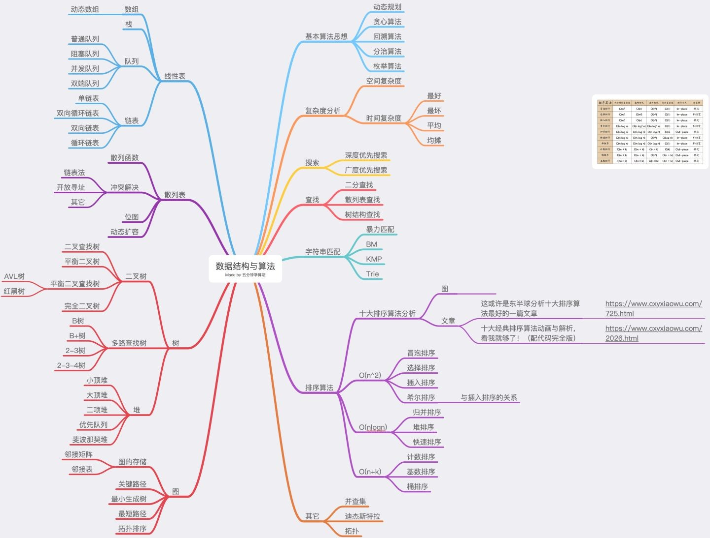
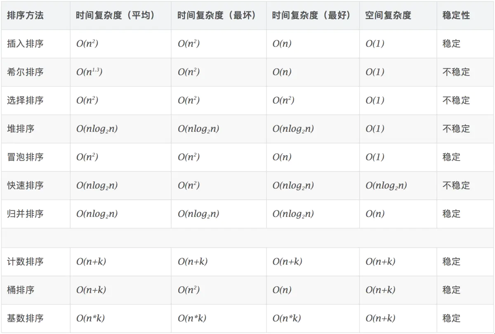
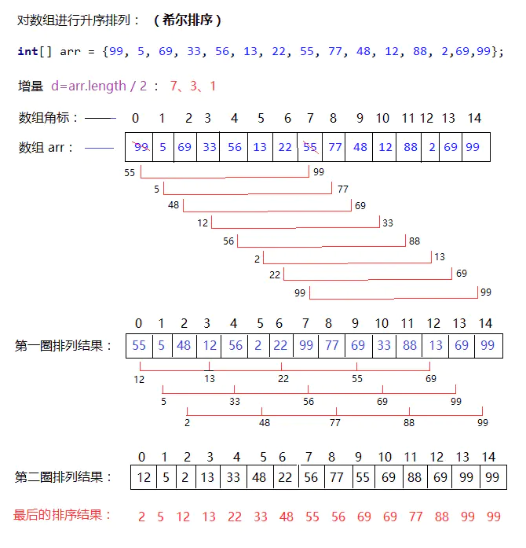
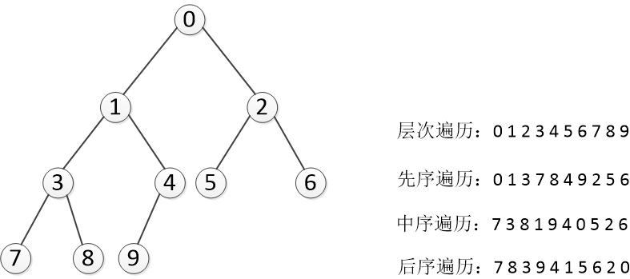
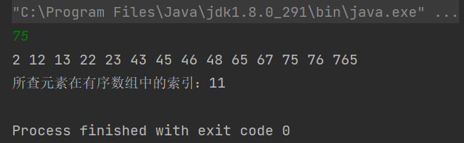
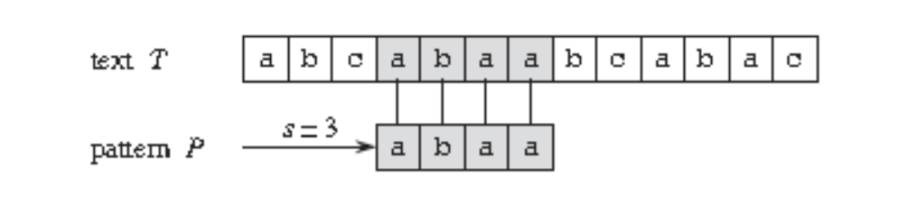
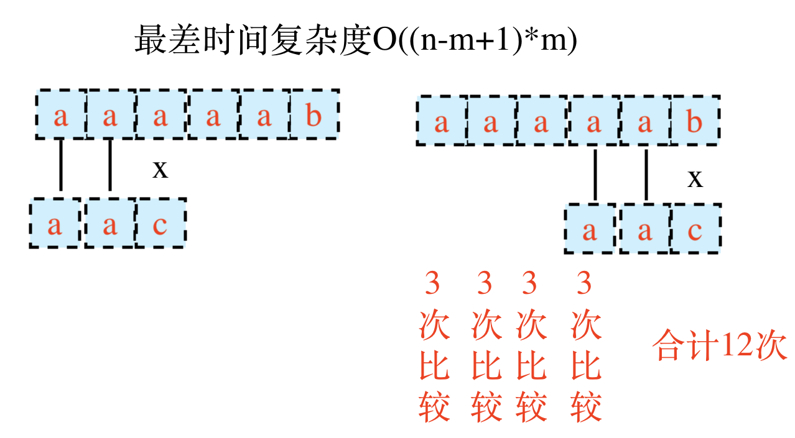
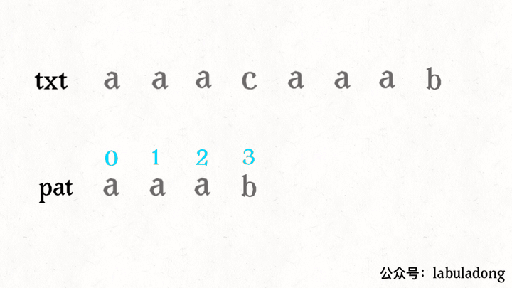
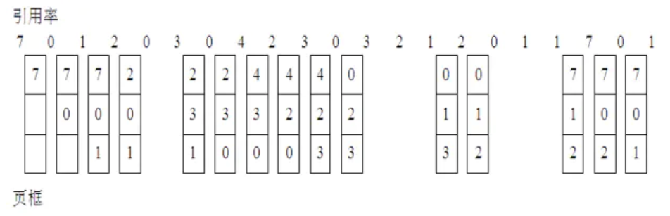
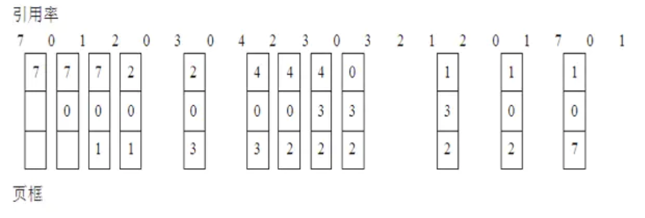

# 算法解析




# 排序算法

  


所有排序中的交换操作：（两种都行）

```java
public static void swap(int[] nums, int i, int j) { //i和j是同一个位置会出错
    //nums[i] = nums[i] ^ nums[j];
    //nums[j] = nums[i] ^ nums[j];
    //nums[i] = nums[i] ^ nums[j];
    
    int temp = nums[i];
    nums[i] = nums[j];
    nums[j] = temp;
} 
```


## 冒泡排序

**算法思想：**

1.比较相邻的元素。如果第一个比第二个大，就交换他们两个。  

2.对每一对相邻元素做同样的工作，从开始第一对到结尾的最后一对。在这一点，最后的元素应该会是最大的数。

3.针对所有的元素重复以上的步骤，除了最后一个。

4.持续每次对越来越少的元素重复上面的步骤，直到没有任何一对数字需要比较。

**平均时间复杂度： O(n²)**

**算法稳定性：**相邻换位，**稳定**

**图示：**

  

```java
public void bubbleSort(int[] a){
    //升序
    for (int i = 0;i < a.length - 1;i++){
        for (int j = 0;j < a.length - 1 - i;j++){
            if (a[j] > a[j + 1]){
                //交换元素位置（相邻换位）
                int temp = a[j];
                a[j] = a[j + 1];
                a[j + 1] = temp;
            }
        }
    }
}
```


## 选择排序

**算法思想：**首先，找到数组中最小的那个元素，其次，将它和数组的第一个元素交换位置（如果第一个元素就是最小元素那么它就和自己交换）。再次，在剩下的元素中找到最小的元素，将它和数组的第二个元素交换位置。如此往复，直到将整个数组排序。

**平均时间复杂度： O(n²)**

**算法稳定性：**跨步换位，**不稳定**

**图示：**

 

```java
public void selectSort( int[] a){
    int min = 0;
    int temp = 0;
	//升序
	for (int i = 0;i < a.length;i++){
    	min = i;//交换下标可以减少元素移动次数
    	for (int j = i + 1;j < a.length;j++){
         	//比较得出最小的元素并取其下标为最小元素的下标
         	if (a[j] < a[min]){
             	min = j;
          	}
      	}
        //交换元素位置,跨步换位
        temp = a[i];
        a[i] = a[min];
        a[min] = temp;
   	}
}
```


## 插入排序

**算法思想：**插入排序是指在待排序的元素中，假设前面n-1(其中n>=2)个数已经是排好顺序的，现将第n个数插到前面已经排好的序列中，然后找到合适自己的位置，使得插入第n个数的这个序列也是排好顺序的。按照此法对所有元素进行插入，直到整个序列排为有序的过程。

**平均时间复杂度： O(n²)**

**算法稳定性：**相邻换位，**稳定**

**图示：**

 

```java
//简单的插入排序，每比出一个大于现排元素的元素就将它们两个换位
public void insertSort(int[] a){
	//升序
    for (int i = 1;i < a.length;i++){
        //默认第一个元素已被排序好了
        for (int j = i;j > 0;j--) {
            if (a[j] < a[j - 1]) {
                int temp = a[j];
                a[j] = a[j - 1];
                a[j - 1] = temp;
            }
        }
    }
}

//优化后的插入排序算法:相比上面的方法元素替换次数更少
//a表示数组，n表示数组大小
public void insertSort_1(int[] a,int n){
    if (n <= 1) return;//若数组大小≤1，直接返回
    for (int i = 1; i < n; ++i) {
        int value = a[i];
        int j = i - 1;
        // 查找插入的位置
        for (; j >= 0; --j) {
            if (a[j] > value) {
                a[j+1] = a[j]; //若往前迭代过程中不断有元素大于a[i]，则将每个大于a[i]的元素后移一位
            } else {
                break; //出现了小于a[i]的元素，则此趟内循环已找到a[i]需要插入的位置，无需继续往前比较
            }
        }
        a[j+1] = value; // 插入数据
    }
}

//最终优化
public void insertSort(int[] nums) {
	if(nums == null || nums.length < 2)		return;
    //0~0一开始有序，0~i要排序
    for(int i = 1; i < nums.length; i++) {
        for(int j = i - 1; j >= 0 && nums[j] > nums[j + 1]; j--) {
            int temp = nums[j];
            nums[j] = nums[j + 1];
            nums[j + 1] = temp;
        }
    }
}
```


## 希尔排序

> 直接插入排序的改进版，更为高效。

**算法思想：**先将要排序的一组数按某个增量d分成若干组，每组中记录的下标相差d。对每组中全部元素进行排序，然后再用一个较小的增量对它进行分组，在每组中再进行排序。当增量减到1时，整个要排序的数被分成一组，排序完成。一般的初次取序列的一半为增量，以后每次减半，直到增量为1。

**平均时间复杂度：O(nlogn)**

**算法稳定性：**跳跃性插入，**不稳定**

**图示：**

示例一：

 

示例二：

   

```java
public void shellSort(int[] arr){

	if(arr == null || arr.length <= 1){
        return;
    }
    int N = arr.length;//数组长度
    int inserted;//用来记录正在被插入的 arr[i] 元素
    int j;
	
    //进行分组，最开始时的增量(gap)为数组长度的一半，往后每次减半
    for (int gap = N/2;gap > 0;gap /= 2){
        //分别对各个分组进行插入排序
        /*
        注意:对各个组进行插入的时候并不是对一个组进行排序完再对另一个组进行排序，
            而是轮流对每个组进行插入排序
         */
        for (int i = gap;i < N;i++){
            //i:代表即将插入的元素角标，作为每一组比较数据的最后一个元素角标 
            //j:代表与i同一组的数组元素角标
            //将 arr[i]插入到其所在分组的正确位置上去(从后往前比较并插入)
            inserted = arr[i];//记录正在被插入的元素
            //插入的时候按组进行插入排序(组内元素两两间隔gap)
            for (j = i - gap;j >= 0 && inserted < arr[j];j -= gap){
                //(循环)若同组内的前一个元素大于正在被插入的元素，则将前一个元素(后移)赋给后一个元素
                arr[j + gap] = arr[j];
            }
            //前面已经没有比arr[i]小的元素，则将arr[i]插入到正确的位置上
            arr[j + gap] = inserted;
        }
    }
}
```


## 归并排序

**算法思想：**归并排序是用**分治**思想，分治模式在每一层递归上有三个步骤：

- **分解（Divide）**：将n个元素分成个含n/2个元素的子序列。
- **解决（Conquer）**：用合并排序法对两个子序列递归的排序。
- **合并（Combine）**：合并两个已排序的子序列已得到排序结果。

**平均时间复杂度：O(nlogn)**

**算法稳定性：稳定**

**图示：**

 

```java
/**
 * 将数组 arr[left] ----> arr[right] 进行自顶向下的归并排序
 * @param arr 要排序的数组
 * @param temp 辅助数组，和arr同样大的空数组，作为临时存放的空间
 * @param left 左边界
 * @param right 右边界
 */
public void mergeSort(int[] arr,int[] temp,int left,int right){
    //left==right时，就递归到只有一个元素 ---> 终止条件
    if (left < right){
        //[分]:将数组一分为二
        int mid = left + (right - left) / 2;
        //递归调用，不断将子数组一分为二，分到最后只有一个元素，就不治而治了(只有一个元素认为它有序)
        //[治]:将左边数组排序 arr[left] ---> arr[mid]
        mergeSort(arr,temp,left,mid);
        //[治]:将右边数组排序 arr[mid + 1] ---> arr[right]
        mergeSort(arr,temp,mid + 1,right);
        //[合]:合并两个有序数组【原地归并】
        merge(arr,temp,left,mid,right);
    }
}

//将 arr[left...mid] 和 arr[mid+1...right] 两个有序数组合并为一个有序数组
private static void merge(int[] arr,int[] temp,int left,int mid,int right){
    int i = left,j = mid + 1;//i用于标记左边数组下标，j用于标记右边数组下标
    //先通过比较将两个有序数组合并为一个有序数组，结果暂放到 temp 数组
    for (int k = left;k <= right;k++){
        //如果左边数组arr[left...mid]中的元素取完[即比较完](i > mid)
        //则直接copy右边数组的元素到辅助数组，右边数组同理
        if (i > mid)                temp[k] = arr[j++];//左边数组全存放完了
        else if (j > right)         temp[k] = arr[i++];//右边数组全存放完了
        else if (arr[i] < arr[j])   temp[k] = arr[i++];
        else                        temp[k] = arr[j++];//arr[i] > arr[j]
    }

    //再将已经排序好的辅助数组中的值复制到原数组 arr 中去
    for (int k = left;k <= right;k++){
        arr[k] = temp[k];
    }
}
```

另一种写法：

```java
public void mergeSort(int[] arr, int left, int right) {
    if(left == right)	return;
    
    int mid = left + ((right - left) >> 1);// 拆分
    mergeSort(arr,left,mid);// 排序左子数组,注意这里右边界传 mid！！！而非mid - 1
    mergeSort(arr,mid + 1,right);// 排序右子数组
    merge(arr,left,mid,right);// 合并
}

private static void merge(int[] arr, int left, int mid, int right) {
    int[] temp = new int[right - left + 1];// 辅助数组
    int k = 0;// 辅助数组游标
    int i = left, j = mid + 1;// 左、右子数组的游标
    while(i <= mid && j <= right) { // 左子数组当前游标元素≤右子数组当前游标元素
        temp[k++] = (arr[i] <= arr[j]) ? arr[i++] : arr[j++];
        // 这个循环能将其中一个子数组元素全部取完放在temp中
    }
    // 下面两个while只会中一个
    while(i <= mid) { // 左子数组还有元素
        temp[k++] = arr[i++];
    }
    while(j <= right) { // 右子数组还有元素
        temp[k++] = arr[j++];
    }
    for(i = 0; i < temp.length; i++) {
        arr[left + i] = temp[i];//这里arr下标也要注意！！！
    }
} 
```

归并排序变式：

- 小和问题
- 求数组逆序对：剑指offer51


## 快速排序

**算法思想：** 快速排序基于**分治**的思想。

在待排序的数列中，首先找一个数字作为基准数。为了方便，一般选择第 1 个数字作为基准数。接下来把这个待排序的数列中小于等于基准数的元素移动到待排序的数列的左边，把大于基准数的元素移动到待排序的数列的右边。这时，左右两个分区的元素就相对有序了；接着把两个分区的元素分别按照上面两种方法继续对每个分区找出基准数，然后移动，直到各个分区只有一个数时为止。 

**平均时间复杂度：O(nlogn)**

**额外空间复杂度：O(logN)，最坏O(N)**

**算法稳定性：**不稳定

**图示：**这里是将最后一个元素作为主元，下面代码将第一个元素作为主元

  

```java
/**
 *快速排序
 * @param a 传入的(子)数组
 * @param left (子)数组左边界
 * @param right 右边界
 */
public void quickSort(int[] a,int left,int right){
	if(left >= right)	return;
    //swap(a, left, (int) (left + Math.random() * (right - left + 1)));//使主元取值随机化
    int center; //用来记录每次递归切分数组时数组的中间位置
    center = partion(a,left,right); //将(子)数组进行排序的方法
    quickSort(a,left,center - 1); //左半部分
    quickSort(a,center + 1,right); //右半部分
}

/**
 * 私有方法，只供quickSort调用
 * @param a 传入的(子)数组
 * @param left (子)数组的左边界
 * @param right 右边界
 * @return
 */
private int partion(int[] a,int left,int right){
    int pivot = a[left]; //用来存放主元,默认主元为(子)数组左边第一个元素
    int i = left + 1; //从紧接着主元后的第一个元素开始向右遍历
    int j = right;//从子数组右侧开始向左遍历
    while (true){
        //左指针向右遍历扫描，找到大于主元的元素
        while (i <= j && a[i] <= pivot) i++;
        //右指针向左遍历扫描，找到小于主元的元素
        while (i <= j && a[j] > pivot) j--;
        //当扫描完发现数组有序，则直接退出
        if (i >= j)
            break;

        //交换元素(左边大于主元的元素和右边小于主元的元素)
        int temp = a[i];
        a[i] = a[j];
        a[j] = temp;
    }
    //将主元与a[j]交换
    a[left] = a[j];
    a[j] = pivot;
    return j; //返回这趟排序完后已定下的中间元素的位置
}
```


## 堆排序

**算法思想：** 将待排序序列构造成一个大顶堆，此时，整个序列的最大值就是堆顶的根节点。将其与末尾元素进行交换，此时末尾就为最大值。然后将剩余n-1个元素重新构造成一个堆，这样会得到n个元素的次小值。如此反复执行，便能得到一个有序序列了。

**平均时间复杂度：O(nlogn)**

**算法稳定性：不稳定**

**图示：**


**算法过程：**

1. 首先将待排序的数组构造成一个大根堆，此时，整个数组的最大值就是堆结构的顶端
2. 将顶端的数与末尾的数交换，此时，末尾的数为最大值，剩余待排序数组个数为n-1
3. 将剩余的n-1个数再构造成大根堆，再将顶端数与n-1位置的数交换，如此反复执行，便能得到有序数组（升序）

```java
public static void heapSort(int[] arr) {
    if (arr == null || arr.length < 2) {
        return;
    }
    //下面构建大顶堆(抽象成将数组元素一个接一个放入堆中，上浮至正确位置)，完成后数组内部就呈现一个大顶堆结构
    for (int i = 0; i < arr.length; i++) {
        heapInsert(arr, i);
    }
    int size = arr.length;//堆大小，即堆中元素数量
    swap(arr, 0, --size);//先交换堆顶元素和堆末尾元素，此时堆末尾的元素即为排序好的元素，不再参与堆姿态调整
    while (size > 0) {
        heapify(arr, 0, size);//将换到堆顶的新元素下沉至正确位置，后边的n-1次构建大根堆
        swap(arr, 0, --size);//每次都要交换最大、最小值
    }
}

/**
* 构建大顶堆：实质上是调整下标为index的元素在原数组中的位置 (index位置元素上浮)
* 如果index位置的元素大于其父元素，则交换两元素位置
* @param arr 需要排序的数组
* @param index 将下标为 index 的元素插入大顶堆
*/
public static void heapInsert(int[] arr, int index) {
    //堆或者是完全二叉树，这种结构有个显著的特点就是，总是先从左边的数开始排满的
    while (arr[index] > arr[(index - 1) / 2]) {
        swap(arr, index, (index - 1) / 2);
        //不断地循环上升，直到该元素小于父元素或者元素已到顶时候为止，到顶时index为0，但是(index - 1) / 2也为0，
        //构建堆的时候不用考虑兄弟结点，只考虑左结点
        index = (index - 1) / 2;
    }
}

/**
* 调整堆姿态，将index下标元素调节到正确的位置。(index位置元素下沉)
* 1.比较index节点的左右子节点，谁大谁就先把谁设置为largest
* 2.比较index节点和左右子节点较大者(largest)谁更大，谁更大再把谁设置为largest
* 3.如果index节点大于其子节点，则说明index节点已经达到正确位置，跳出这个元素值的调整；
*   否则交换index节点与其子节点较大者的位置，记录该节点新的下标，继续进行下一轮循环调整
* @param arr
* @param index 需要调整的元素的下标
* @param size 当前堆中元素数量（已减去排序好的放在堆末尾的那些原堆顶元素，但实际上这些元素还在堆中）
*/
public static void heapify(int[] arr, int index, int size) {
    int left = index * 2 + 1;//先记录下index索引元素的左节点索引
    while (left < size) { //只要左节点下标 <= size-1，即左节点未超出此时未排序好的数组末端
        //找出左右子节点(先判断右子节点存在，即left+1<size)较大值的索引，比较的是兄弟节点
        int largest = left + 1 < size && arr[left + 1] > arr[left] ? left + 1 : left;
        largest = arr[largest] > arr[index] ? largest : index;//找出大值的索引，子节点较大者与父节点比较
        if (largest == index) {//如果最大值的索引已经等于父索引，即父节点比两个子节点都大，就不再继续循环了
            break;
        }
        swap(arr, largest, index);//交换父节点和比父子点大的子节点位置
        //记录此轮结束后本节点的新索引以及新左子节点的索引
        index = largest;
        left = index * 2 + 1;
    }
}

public static void swap(int[] arr, int i, int j) {
    if(i == j)  return;
    arr[i] = arr[i] ^ arr[j];
    arr[j] = arr[i] ^ arr[j];
    arr[i] = arr[i] ^ arr[j];
}
```

**堆排序拓展题目：**

已知一个几乎有序的数组。几乎有序是指，如果把数组排好顺序的话，每个元素移动的距离一定不超过k，并且k相对于数组长度来说是比较小的。请选择一个合适的排序策略，对这个数组进行排序。

**思路**：建立小根堆，将数组中前k+1个数放入小根堆，因为 0 位置上的数字，只可能在 0—k+1 的位置上，由此得到最小的数，将小根堆堆顶弹出，再将后面的数字依次放入，即可获得有序数列。每个数需要log k 的时间来调整，所以时间复杂度 N*Log k

```java
public void sortedArrDistanceLessK(int[] arr, int k) {
    //优先队列，默认小根堆
    PriorityQueue<Integer> heap = new PriorityQueue<>();
    int index = 0;
    //先将数组前k+1个数加入小根堆中，注意这里是“<”，在这里实质上只加入了前k个数
    //下一个循环先加入，再弹出，保证了每次弹出堆顶前，堆中存在k+1个数
    for(; index < Math.min(arr.length, k); index++) { 
        heap.add(arr[index]);
    }
    int i = 0;
    for(; index < arr.length; i++, index++) { //逐个弹出堆顶，并将后面数字依次放入直到放完
        heap.add(arr[index]);
        arr[i] = heap.poll();
    }
    while(!heap.isEmpty()) { //将剩下的数字逐个弹出
        arr[i++] = heap.poll();
    }
}
```


## 桶排序

**算法思想：**假设输入数据服从均匀分布，将数据分到有限数量的桶里，每个桶再分别排序（有可能再使用别的排序算法或是以递归方式继续使用桶排序进行排序。

**空间换时间**，不基于比较的排序

**平均时间复杂度：O(n+k)** ，n 为排序元素个数，k 为桶个数

**算法稳定性：稳定**

**图示：**

  

```java
public static void sort(int[] arr){
    //最大最小值
    int max = arr[0];
    int min = arr[0];
    int length = arr.length;

    for(int i=1; i<length; i++) {
        if(arr[i] > max) {
            max = arr[i];
        } else if(arr[i] < min) {
            min = arr[i];
        }
    }

    //最大值和最小值的差
    int diff = max - min;

    //桶列表
    ArrayList<ArrayList<Integer>> bucketList = new ArrayList<>();
    for(int i = 0; i < length; i++){
        bucketList.add(new ArrayList<>());
    }

    //每个桶的存数区间
    float section = (float) diff / (float) (length - 1);

    //数据入桶
    for(int i = 0; i < length; i++){
        //当前数除以区间得出存放桶的位置 减1后得出桶的下标
        int num = (int) (arr[i] / section) - 1;
        if(num < 0){
            num = 0;
        }
        bucketList.get(num).add(arr[i]);
    }

    //桶内排序
    for(int i = 0; i < bucketList.size(); i++){
        //jdk的排序速度当然信得过
        Collections.sort(bucketList.get(i));
    }

    //写入原数组
    int index = 0;
    for(ArrayList<Integer> arrayList : bucketList){
        for(int value : arrayList){
            arr[index] = value;
            index++;
        }
    }
}
```


## 基数排序

**算法思想：**  基数排序是桶排序的扩展，它的基本思想是：将整数按位数切割成不同的数字，然后按每个位数分别比较。具体做法是：将所有待比较数值统一为同样的数位长度，数位较短的数前面补零。然后，从最低位开始，依次进行一次排序。这样从最低位排序一直到最高位排序完成以后, 数列就变成一个有序序列。 

**空间换时间**，不基于比较的排序

**平均时间复杂度： O(d(n+r))** ，r 为基数，d为位数。 

**算法稳定性：稳定**

**图示：**


```java
public static void sort(int[] arr){
    int length = arr.length;

    //最大值
    int max = arr[0];
    for(int i = 0;i < length;i++){
        if(arr[i] > max){
            max = arr[i];
        }
    }
    //当前排序位置
    int location = 1;

    //桶列表
    ArrayList<ArrayList<Integer>> bucketList = new ArrayList<>();

    //长度为10 装入余数0-9的数据
    for(int i = 0; i < 10; i++){
        bucketList.add(new ArrayList());
    }

    while(true)
    {
        //判断是否排完
        int dd = (int)Math.pow(10，(location - 1));
        if(max < dd){
            break;
        }

        //数据入桶
        for(int i = 0; i < length; i++)
        {
            //计算余数 放入相应的桶
            int number = ((arr[i] / dd) % 10);
            bucketList.get(number).add(arr[i]);
        }

        //写回数组
        int nn = 0;
        for (int i=0;i<10;i++){
            int size = bucketList.get(i).size();
            for(int ii = 0;ii < size;ii ++){
                arr[nn++] = bucketList.get(i).get(ii);
            }
            bucketList.get(i).clear();
        }
        location++;
    }
}
```


## 计数排序

**算法思想：**  把数组**元素**作为数组的**下标**，然后用一个临时数组统计该元素出现的次数，例如 temp[i] = m, 表示元素 i 一共出现了 m 次。最后再把临时数组统计的数据从小到大汇总起来，此时汇总起来是数据是有序的。 

**空间换时间**，不基于比较的排序

**平均时间复杂度：  O(n)**

**算法稳定性：稳定**

**图示：**

 

```java
public static void sort(int[] arr) {
    //找出数组中的最大值
    int max = arr[0];
    for (int i = 1; i < arr.length; i++) {
        if (arr[i] > max) {
            max = arr[i];
        }
    }
    //初始化计数数组
    int[] countArr = new int[max + 1];

    //计数
    for (int i = 0; i < arr.length; i++) {
        countArr[arr[i]]++;
        arr[i] = 0;
    }

    //排序
    int index = 0;
    for (int i = 0; i < countArr.length; i++) {
        if (countArr[i] > 0) {
            arr[index++] = i;
        }
    }
}
```


## 总结

1. 不基于比较的排序，对样本数据有严格要求，不易改写

2. 基于比较的排序，只要规定好两个样本怎么比大小就可以直接复用

3. 基于比较的排序，时间复杂度的极限是O(NlogN)

4. 时间复杂度O(N*logN)、 额外空间复杂度低于O(N)、 且稳定的基于比较的
   排序是不存在的。

5. 为了绝对的速度选快排、为了省空间选堆排、为了稳定性选归并
   


# 二叉树

**树节点定义如下：**

```java
public static class TreeNode {
    int value;
    TreeNode left;
    TreeNode right;
}
```

## 二叉树的遍历

**二叉树的先序、中序、后序、层次遍历：**

- 先序（深度优先）：任何子树的处理顺序都是，先头节点、再左子树、然后右子树
- 中序：任何子树的处理顺序都是，先左子树、再头节点、然后右子树
- 后序：任何子树的处理顺序都是，先左子树、再右子树、然后头节点
- 层次（宽度优先）：按层次遍历即可

  


### 递归遍历

**前序**

```java
public static void preOrderTraverse(TreeNode root) {
    if(root == null)	return;
    System.out.print(root.value + " ");
    preOrderTraverse(root.left);
    preOrderTraverse(root.right);
}
```

**中序**

```java
public static void inOrderTraverse(TreeNode root) {
    if(root == null)	return;
    inOrderTraverse(root.left);
    System.out.print(root.value + " ");
    inOrderTraverse(root.right);
}
```

**后序**

```java
public static void postOrderTraverse(TreeNode root) {
    if(root == null)	return;
    postOrderTraverse(root.left);
    postOrderTraverse(root.right);
    System.out.print(root.value + " ");
}
```


### 非递归遍历

**前序**

```
准备一个栈
1.第一步将非空根结点压栈
2.如果栈非空，从栈中弹出一个节点cur
3.打印(处理)cur
4.先将cur的右子树根节点压栈，再将cur左子树节点压栈 (先右后左)
重复 2，3，4
```

```java
public static void preOrderTraverse(TreeNode root) {
    if (root == null) {
        return;
    }
    Stack<TreeNode> stack = new Stack<>();
    stack.push(root);//先将根节点入栈
    while (!stack.isEmpty()) {
        //将栈顶节点cur弹出并打印
        TreeNode cur = stack.pop();
        System.out.print(cur.value + " ");
        //(如果非空)先右再左
        if (cur.right != null) {
            stack.push(cur.right);
        }
        if (cur.left != null) {
            stack.push(cur.left);
        }
    }
}
```

**中序**

```
准备一个栈
1.依次压入左边的结点，直到最左结点为空
2.弹出并打印，如果有右子节点，压入栈中
继续执行1
```

```java
public static void inOrderTraverse(TreeNode root) {
    if (root != null) {
        Stack<TreeNode> stack = new Stack<>();
        while (!stack.isEmpty() || root != null) {
            if (root != null) { //将左边界的树节点全部依次压入栈，直到左子节点为空
            	stack.push(root);
            	root = root.left;
            } else { //弹出并打印
            	root = stack.pop();
                System.out.print(root.value + " ");
                root = root.right;
            }
		}
    }
}
```

**后序**

```
准备两个栈，一个为栈s1，一个为收栈s2
1.将树根节点压入栈s1
2.s1弹出栈顶元素cur
3.cur压入收栈s2
4.先压cur左子节点入s1，再压右子节点入s1 (先左后右)
重复 2，3，4
当s1为空，依次弹出s2中的节点
```

```java
public static void postOrderTraverse(TreeNode root) {
    if (root == null) {
        return;
    }
    Stack<TreeNode> s1 = new Stack<>();
    Stack<TreeNode> s2 = new Stack<>();
    s1.push(root);
    while (!s1.isEmpty()) {
        TreeNode cur = s1.pop();
        s2.push(cur);
        //先右后左的先序遍历的反向就是先左后右的后序遍历
        if (cur.left != null) {
            s1.push(cur.left);
        }
        if (cur.right != null) {
            s1.push(cur.right);
        }
    }
    while (!s2.isEmpty()) {
        System.out.print(s2.pop().value + " ");
    }
}
```


### 层次遍历（宽度优先遍历）

使用队列 FIFO 的特性

```java
public void levelTraverse(TreeNode root) {
    if (root == null) {
        return;
    }
    LinkedList<TreeNode> queue = new LinkedList<>();
    queue.offer(root);
    while (!queue.isEmpty()) {
        TreeNode cur = queue.poll();
        System.out.print(cur.val+"  ");
        if (cur.left != null) {
            queue.offer(cur.left);
        }
        if (cur.right != null) {
            queue.offer(cur.right);
        }
    }
}
```


## 求二叉树最大宽度（忽略null节点）

求最大宽度即求所有层中的最大节点数

- 这里对于每层来说就是一个层次，所以显然就是基于横向遍历。
- 在横向遍历时要随机记录每个节点所在层数，以便判断该层是否已经结束，进入了下一层。有两种方式进行层数的记录：
  - map空间记录，比较耗空间
  - 用指针记录每一层结束节点的位置

**map 实现：**

```java
public class Main {
    public static class Node { //树节点定义
		int value;
		Node leftNode;
		Node rightNode;
	}
    
	public static int floorMaxNodeNum(Node header) {
		if (header == null) {
			return 0;
		}
		ArrayDeque<Node> deque = new ArrayDeque<>();
		int thisFloorNum = 0;// 该层节点个数记录
		int thisFloor = 1;// 这是第几层
		int max = Integer.MIN_VALUE;// 记录最大宽度
		HashMap<Node, Integer> map = new HashMap<>();// 存放 节点-层数 的映射
		deque.add(header);
		map.put(header, thisFloor);
		while (!deque.isEmpty()) {
			Node popNode = deque.poll();
			if (map.get(popNode) == thisFloor) {// 若是该层元素
				++thisFloorNum;
			} else {// 若已经进入下一层中的节点
				max = Math.max(max, thisFloorNum);//结算遍历完上一层后当前最大宽度
				++thisFloor;
				thisFloorNum = 1;
			}
			// 每次添加都要在map中记录节点层数
			if (popNode.leftNode != null) {
				deque.add(popNode.leftNode);
				map.put(popNode.leftNode, thisFloor + 1);
			}
			if (popNode.rightNode != null) {
				deque.add(popNode.rightNode);
				map.put(popNode.rightNode, thisFloor + 1);
			}
		}
		// 这一这里还是取最大值，最后一层没有和max比较过
		return Math.max(max, thisFloorNum);
	}
}
```

**指针实现：** 

```java
public class Main {
    public static class Node { //树节点定义
		int value;
		Node leftNode;
		Node rightNode;
	}
    
	public static int floorMaxNodeNum(Node header) {
		if (header == null) {
			return 0;
		}
		ArrayDeque<Node> deque = new ArrayDeque<>();
		int thisFloorNum = 0;// 该层节点个数记录
		int max = Integer.MIN_VALUE;
		Node thisFloorLastNode = header;//该层最后一个节点，只能继承nextFloorLastNode
		Node nextFloorLastNode = null;//下一层最后一个节点，用于更新thisFloorLastNode
		deque.add(header);
		while (!deque.isEmpty()) {
			Node popNode = deque.poll();
			thisFloorNum++;
			// 入队就要更新nextFloorLastNode
			if (popNode.leftNode != null) {
				deque.add(popNode.leftNode);
				nextFloorLastNode = popNode.leftNode;
			}
			if (popNode.rightNode != null) {
				deque.add(popNode.rightNode);
				nextFloorLastNode = popNode.rightNode;
			}
			// 若该层结束
			if (popNode == thisFloorLastNode) {
				max = Math.max(max, thisFloorNum);
				thisFloorLastNode = nextFloorLastNode;
				nextFloorLastNode = null;
				thisFloorNum = 0;
			}
		}
		return max;
	}
}
```


# 查找

- 顺序查找
- 二分查找
- 二叉查找树
- 平衡二叉查找树
- 散列表


## 二分查找

二分查找基于**有序数组**实现。

- **优点：**最优的查找效率和空间需求，能够进行有序性相关的操作。
- **缺点：**插入操作很慢。

在**N个键**的**有序**数组中进行二分查找**最多**需要**（lgN + 1）次比较**（无论是否成功）。


**经典的二分查找：**

```java
import java.util.Arrays;
import java.util.Scanner;
/**
 * 二分查找
 */
public class BinarySearch {
    //key为被查找的值，a为查找的数组,返回值是key在数组a中的索引
    public static int rank(int key,int[] a){
        //传入的数组a[]必须是有序的
        int lo = 0;
        int hi = a.length - 1;
        while(lo <= hi){
            //被查找的key键要么不存在，要么必然存在于a[lo...hi]之中
            int mid = lo + (hi - lo) / 2; //取目前查找范围的中间
            if (key < a[mid]) hi = mid - 1;
            else if (key > a[mid]) lo = mid + 1;
            else return mid;
        }
        return -1;//未查找到key
    }

    //测试代码
    public static void main(String[] args) {
        int[] a = new int[]{48,13,45,75,23,46,765,12,65,67,22,2,43,76};
        Scanner scanner = new Scanner(System.in);
        int key = scanner.nextInt();
        //调用Arrays工具类的sort方法对数组a进行排序
        Arrays.sort(a);
        for (int x : a) {
            System.out.print(x + " ");
        }
        System.out.println();
        int index = rank(key,a);//调用查找方法
        if ( index == -1){
            System.out.println("查询元素不存在！");
        } else{
            System.out.println("所查元素在有序数组中的索引：" + index);
        }
    }
}
```



**递归的二分查找：**

```java
//这个key可以不限于int类型(Key在这是泛型)，因为比较是基于compareTo方法
public int rank(Key key,Key[] a,int lo,int hi){
    if(hi < lo)	return lo;
    int mid = lo + (hi - lo) / 2;
    int cmp = key.compareTo(a[mid]);
    if(cmp < 0)	return rank(key, a, lo, mid - 1);
    else if(cmp > 0)	return rank(key, a, mid + 1, hi);
    else	return mid;
}
```


 

## 二叉查找树

能够将**链表插入的灵活性**和**有序数组查找的高效性**结合起来。

二叉查找树（BST）中**每个结点的键都大于其左子树中的任意结点的键而小于右子树的任意结点的键**。

在二叉查找树中查找一个键的递归算法：如果树是空的，则查找未命中；如果被查找的键和根节点的键相等，查找命中，否则就（递归地）在适当的子树中继续查找。如果被查找的键较小就选择左子树，较大则选择右子树。

对于命中的查找，路径在含有被查找的键的结点处结束。对于未命中的查找，路径的终点是一个空链接。


**BST代码实现：**

```java
/*
二叉查找树中的键继承了Comparable接口，结点的键为Key类型，值为Value类型
*/
public class BST<Key extends Comparable<Key>, Value<{
	
    private Node root;//二叉查找树的根节点
    
    //内部类，树中结点的结构实现
    private class Node{
        private Key key;//键
        private Value val;//值
        private Node left,right;//指向左右子树的链接
        private int N;//以该结点为根的子树中的结点总数
        //有参构造器
        public Node(Key key, Value val, int N){
            this.key = key;
            this.val = val;
            this.N = N;
        }
    }
    
    //整棵二叉查找树树结点的数量
    public int size(){
        return size(root);
    }
    private int size(Node x){//以x为根结点的树的结点数量
        if(x == null)	return 0;
        else	return x.N;
    }
    
    //根据键key获取其对应结点的值val
    public Value get(Key key){	return get(root, key);}
    //在以x为根结点的子树中查找并返回key所对应的值；如果找不到则返回null
    private Value get(Node x, Key key){
		if(x == null)	return null;
        int cmp = key.compareTo(x.key);
        if(cmp < 0 )	return get(x.left, key);
        else if(cmp > 0)	return get(x.right, key);
        else	return	x.val;
    }
    
    //查找某key，找到则更新它的值，否则为它在树中创建一个新的结点
    public void put(Key key, Value val){
        root = (root, key, val);
    }
    //如果key存在于以x为根结点的子树中则更新它的值，否则将以key和val为键值对的新结点插入到该子树中
    private Node put(Node x, Key key, Value val){
        if(x == null)	return new Node(key, val, 1);//找不到该键的结点，创建新结点
        int cmp = key.compareTo(x.key);
        if(cmp < 0)	x.left = put(x.left, key ,val);
        else if(cmp > 0) x.right = put(x.right, key, val);
        else x.val = val;//目前结点的键等于所查键，赋新值
        x.N = size(x.left) + size(x.right) + 1;
        return x;
    }
    
    //查询值最小的结点键
    public Key min(){	return min(root).key; }
    private Node min(Node x){
        if(x.left == null)	return x;
        return min(x.left);
    }
    
    //
}
```


## 散列表查找


## 红黑树


# 字符串匹配算法

字符串匹配，也称子字符串查找：给定一段**长度为 N 的文本(Text)**和一个**长度为 M 的模式(Pattern)**字符串，在文本中找到一个和该模式相符的子字符串。

 

 字符串匹配算法通常分为2个步骤：**预处理**和**匹配**。算法的总运行时间是两者之和。 


## 暴力匹配

就是穷举法，枚举法。是最低效最原始的算法。特点：

1. 无预处理阶段。（因为是暴力匹配）
2. 对 Pattern，可以从 Text 的首或尾开始逐个匹配字母，比较顺序没有限制。
3. 最坏时间复杂度 O((n-m+1)*m).

方法是使用循环来检查是否在范围 n-m+1 中存在满足条件 **P[1..m] = T[s+1..s+m]** 的有效位移 s。

  

  

**代码实现：**

最笨的暴力匹配，在匹配成功前的txt文本中每一位都参与过比较

```java
public static int search(String txt, String pat){
	int N = txt.length();//文本长度
    int M = pat.length();//模式长度
    //指针i跟踪文本，指针j跟踪模式
    for(int i = 0; i <= N - M; i++){
		int j;
        for(j = 0; j < M; j++){
            if(txt.charAt(i + j) != pat.charAt(j))
                break;
        }
        if(j == M) return i;//找到匹配
    }
    return -1;//未找到匹配
}
```

带显式回退的暴力匹配，如果 i 和 j 指向的字符不匹配了，那么就需要回退这两个指针的值：将 j 重新指向模式的开头，将 i 指向本次匹配的开始位置的下一个字符。

```java
public static int search(String txt, String pat){
	int N = txt.length();//文本长度
    int M = pat.length();//模式长度
    int i,j;
    //指针i跟踪文本，指针j跟踪模式
    for(i = 0,j = 0; i < N && j < M; i++){
		if(txt.charAt(i) == pat.charAt(j)){
           	j++; 
        }else{
       		i = i - j;//
            j = 0;
        }
    }
    if(j == M)	return i - M;//找到匹配
    else	return -1;//未找到匹配
}
```


## KMP

 [labuladong专栏KMP算法详解](https://zhuanlan.zhihu.com/p/83334559)

**代码实现：**

```java
public class KMP {
    private int[][] dp;//保存确定有限状态机的二维数组
    private String pat;//模式字符串

    //由模式字符串构造DFA
    public KMP(String pat) {
        this.pat = pat;
        int M = pat.length();
        // dp[状态][字符] = 下个状态
        dp = new int[M][256];
        // base case
        dp[0][pat.charAt(0)] = 1;
        // 影子状态 X 初始为 0
        int X = 0;
        // 构建状态转移图
        for (int j = 1; j < M; j++) {
            for (int c = 0; c < 256; c++)
                dp[j][c] = dp[X][c];//复制匹配失败情况下的值
            dp[j][pat.charAt(j)] = j + 1;//设置匹配成功情况下的值
            // 更新影子状态
            X = dp[X][pat.charAt(j)];
        }
    }

    public int search(String txt) {
        int M = pat.length();
        int N = txt.length();
        // pat 的初始态为 0
        int j = 0;
        for (int i = 0; i < N; i++) {
            // 计算 pat 的下一个状态
            j = dp[j][txt.charAt(i)];
            // 到达终止态，返回结果
            if (j == M) return i - M + 1;
        }
        // 没到达终止态，匹配失败
        return -1;
    }
}
```


## BM


## Trie


# 操作系统页面置换算法

- **先进先出置换算法（FIFO）**
  - First In First Out，先进先出，和队列保持一致。最先进来的最早出去。 

- **最近最久未使用算法（LRU）**
  - Least Recently Used，最近最少使用。总是淘汰最近没有使用的。其核心思想是**“如果数据最近被访问过，那么将来被访问的几率也更高”**。
    也就是说，淘汰最近一段时间内最长时间未访问过的数据。根据**程序局部性原理**，刚被访问的数据，可能马上又要被访问；而较长时间内没有被访问的数据，可能最近不会被访问。 
- **最佳置换算法（OPT）**
  -  Optimal，最佳置换。置换以后永不再被访问，或者在将来最迟才会被访问的。该算法无法实现，通常作为衡量其他算法的标准。 
- **最不经常使用（LFU）**
  -  Least Frequently Used，最近使用次数最少。即淘汰使用次数最少的。 


**缓存置换算法的要素**

1. 缓存不是无限大，需要有一个固定的大小来约束其大小
2. 缓存满后，再次插入需要替换掉某些元素，才能添加新元素
3. 每次访问完缓存，可能需要改变缓存元素的状态，如元素顺序的改变

***

**Java LinkedHashMap 简介**

先看下`LinkedHashMap`的构造函数，三个参数分别为：**初始化大小**、**装载因子**和**访问顺序**。

- 当参数`accessOrder = true`时，则按照**访问顺序对Map排序**，那么调用`get()`方法后，会将这次访问的元素移至链表尾部。不断访问可以形成按**访问顺序排序**的链表。
- 当参数`accessOrder = false`时，则按照**插入顺序对Map排序**。先插入的元素放置在链表的首部，按照尾插入的方式维护链表。

```java
public LinkedHashMap(int initialCapacity,
                         float loadFactor,
                         boolean accessOrder) {
        super(initialCapacity, loadFactor);
        this.accessOrder = accessOrder;
}
```

根据链表中元素的顺序可以分为：**按插入顺序的链表**(默认，false)，和**按访问顺序的链表**(调用get方法)。默认是按插入顺序排序，如果指定按访问顺序排序，那么调用get方法后，会将这次访问的元素移至链表尾部，不断访问可以形成按访问顺序排序的链表。 **可以重写`removeEldestEntry`方法返回true值指定插入元素时移除最老的元素。**

**结论1：可以得出`accessOrder = true`时，可以模仿出LRU的特性；`accessOrder = false`时，可以模仿出FIFO的特性。即满足缓存置换算法要素3。**

这是LinkedHashMap中另外一个方法：移除最久的元素。当返回为false时，不会移除其中最久的元素。当返回true的时候，就会remove其中最久的元素。

```java
protected boolean removeEldestEntry(Map.Entry<K,V> eldest) {
        return false;
}
```

**结论2：由于缓存置换算法要素2，当缓存满了之后，需通过返回`true`删除最久未被使用的元素。所以我们需要 重写此方法来删除缓存元素，达到缓存置换的要求。**

当然，我们还需要满足缓存置换算法要素1，就大功告成了。由于Java Map是自动扩容的，当其`table.size() > Capacity * loadFactor`的时，会自动进行两倍扩容。

**结论：为了使缓存能固定大小，需要禁止Map的自动扩容。可将初始化大小设置为`(cacheSize / loadFactor) + 1`，就可以在元素数目达到缓存大小时，不会自动扩容，达到缓存置换的要求。**

***


## 先进先出置换算法（FIFO）

> 选择最先进入内存的页面进行置换，即在内存中驻留时间最长的页面要被淘汰。
>
> 该算法的核心思想是：最早调入内存的页，其不再被使用的可能性比刚调入内存的可能性大。

 

**实现思路：**

> 设置一个指针始终指向**最早进入内存块序列**的内存块，并保持动态更新。
>
> 也可以使用 Java 的 LinkedHashMap 实现。 

**具体代码：**

**借助于 LinkedHashMap 实现 FIFO**

```java
public class FIFOCached<K, V> {
 
    private final int MAX_CACHE_SIZE;//最大缓存空间
    private final float DEFAULT_LOAD_FACTORY = 0.75f;//用于构造LinkedHashMap的装载因子

    LinkedHashMap<K, V> map;//使用LinkedHashMap存放页

    public FIFOCached(int cacheSize) {
        MAX_CACHE_SIZE = cacheSize;
        //初始化大小设置为(cacheSize / loadFactor) + 1，避免map自动扩容
        int capacity = (int)Math.ceil(MAX_CACHE_SIZE / DEFAULT_LOAD_FACTORY) + 1;
        /*
         * 第三个参数设置为true，代表linkedlist按访问顺序排序，可作为LRU缓存
         * 第三个参数设置为false，代表按插入顺序排序，可作为FIFO缓存
         */
        map = new LinkedHashMap<K, V>(capacity, DEFAULT_LOAD_FACTORY, false) {
            @Override
            protected boolean removeEldestEntry(Map.Entry<K, V> eldest) {
                return size() > MAX_CACHE_SIZE; // 删除最前的元素
            }
        };
    }
}
```

**根据LinkedHashMap重新实现**

由于LinkedHashMap并非是线程安全的，我们可以仅利用LinkedHashMap的特性自己实现一个。

```java
public class FIFOCache<K, V> {
    private static int MAX_CACHE_SIZE = 0;
    private final float LOAD_FACTORY = 0.75f;

    Map<K, V> map;

    public FIFOCache(int maxCacheSize) {
        this.MAX_CACHE_SIZE = maxCacheSize;
        // 根据 cacheSize 和 填充因子 计算cache的容量
        int capacity = (int) Math.ceil(MAX_CACHE_SIZE / LOAD_FACTORY) + 1;
        map = new LinkedHashMap<K, V>(capacity, LOAD_FACTORY, false) {
            @Override
            protected boolean removeEldestEntry(Map.Entry eldest) {
                return size() > MAX_CACHE_SIZE;
            }
        };
    }

    //下列方法加锁使线程同步
    public synchronized void put(K key, V value) {
        map.put(key, value);
    }

    public synchronized V get(K key) {
        return map.get(key);
    }

    public synchronized void remove(K key) {
        map.remove(key);
    }

    @Override
    public String toString() {
        StringBuilder sb = new StringBuilder();
        for (Map.Entry<K, V> entry : map.entrySet()) {
            sb.append(entry.getKey()).append("=")
                    .append(entry.getValue()).append(" ");
        }
        return sb.toString();
    }
}
```


## 最近最久未使用算法（LRU）

> 选择最近一段时间内最长时间没有被访问过的页面进行置换。
>
> 该算法根据数据的历史访问记录来进行淘汰数据，其核心思想是：如果数据最近被访问过，那么将来被访问的几率也更高。

 

**实现思路：**

> 可以使用**双向链表+哈希表**来实现：
>
> 当访问到新的（不位于当前内存块序列中）内存块时（即缺页），将其插入到链表首部；
> 如果当前内存块序列中某个内存块被命中（被使用到），则将其移到链表首部；
> 为链表设置一个容量（设为分配给该程序的内存块数），当超出这个容量时，丢弃链表尾部的内存块。
> 剩下的哈希表用来查找内存块。
> 实际上，Java已经为我们提供这种结构了！—— **LinkedHashMap**
>
> 我们主要将其中的**accessOrder**设置为true，保证了LinkedHashMap底层实现的双向链表是按照访问的先后顺序排序。

**具体代码：**

**借助于 LinkedHashMap 实现 LRU**

```java
public class Cache<K, V> extends LinkedHashMap<K, V> {
    private static int MAX_CACHE_SIZE;//最大缓存空间

    public Cache(int maxCacheSize) {
        //初始化大小设置为(cacheSize / loadFactor) + 1，避免map自动扩容
        super((int) Math.ceil(maxCacheSize / 0.75) + 1, 0.75f, true);
        this.MAX_CACHE_SIZE = maxCacheSize;
    }

    @Override
    public boolean removeEldestEntry(Map.Entry eldest) {
        return size() > MAX_CACHE_SIZE; // 需要删除最久的元素
    }
}
```

**根据LinkedHashMap重新实现**

同样，由于LinkedHashMap并非是线程安全的，我们可以仅利用LinkedHashMap的特性自己实现一个。
和FIFO的实现基本一致，只需要将`accessOrder = true`。

```java
public class LruCache<K, V> {
    private static int MAX_CACHE_SIZE = 0;
    private final float LOAD_FACTORY = 0.75f;

    Map<K, V> map;

    public LruCache(int maxCacheSize) {
        this.MAX_CACHE_SIZE = maxCacheSize;
        // 根据 cacheSize 和 填充因子计算cache的容量
        int capacity = (int) Math.ceil(MAX_CACHE_SIZE / LOAD_FACTORY) + 1;
        map = new LinkedHashMap<K, V>(capacity, LOAD_FACTORY, true) {
            @Override
            protected boolean removeEldestEntry(Map.Entry eldest) {
                return size() > MAX_CACHE_SIZE;
            }
        };
    }

    //下列方法加锁使线程同步
    public synchronized void put(K key, V value) {
        map.put(key, value);
    }

    public synchronized V get(K key) {
        return map.get(key);
    }

    public synchronized void remove(K key) {
        map.remove(key);
    }

    @Override
    public String toString() {
        StringBuilder sb = new StringBuilder();
        for (Map.Entry<K, V> entry : map.entrySet()) {
            sb.append(entry.getKey()).append("=")
                    .append(entry.getValue()).append(" ");
        }
        return sb.toString();
    }
}
```


