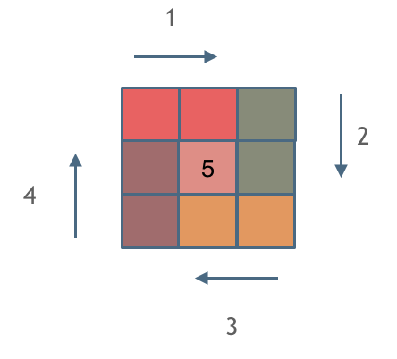

# 算法刷题笔记

> 本算法刷题笔记主要是本人在刷 **LeetCode** 以及 **剑指Offer** 的题目时的刷题思路以及题解
>
> 题目全都标明了难度，点击题目即可跳转至力扣对应处，LeetCode 题目部分分类汇总（这里参考了卡哥的代码随想录的目录结构）~

[toc]


# 剑指 Offer 题解


## **数组**


### [剑指 Offer 03. 数组中重复的数字](https://leetcode-cn.com/problems/shu-zu-zhong-zhong-fu-de-shu-zi-lcof/)【简单】

找出数组中重复的数字。


在一个长度为 n 的数组 nums 里的所有数字都在 0～n-1 的范围内。数组中某些数字是重复的，但不知道有几个数字重复了，也不知道每个数字重复了几次。请找出数组中任意一个重复的数字。

**示例 1：**

```
输入：
[2, 3, 1, 0, 2, 5, 3]
输出：2 或 3 
```

**限制：**

- 2 <= n <= 100000

**我的思路：**

用一个集合来逐个添加数组的元素，只要这个元素已经在集合中添加过了，就证明这个元素是重复的。

```java
class Solution {
    public int findRepeatNumber(int[] nums) {
        Set<Integer> set = new HashSet<>();
        for(int i = 0;i < nums.length;i++){
            if(set.contains(nums[i])){//集合已存在此元素，返回此元素
               return nums[i]; 
            }
            set.add(nums[i]);//如果目前集合中没有此元素，则添加进集合
        }
        return -1;//程序不会运行到这，因为一定有重复元素，这里只是防止运行时错误
    }
}
```

**其他答案：**

巧妙利用辅助数组记录，空间复杂度为 O(n)

```java
class Solution {
    public int findRepeatNumber(int[] nums) {
        boolean[] isrepeat = new boolean[nums.length];
        for(int num : nums){
            if(isrepeat[num]){
                return num;
            }
            isrepeat[num] = true;
        }
        return -1;
    }
}
```

**原地交换：**

题目说明尚未被充分使用，即 在一个长度为 n 的数组 nums 里的所有数字都在 0 ~ n-1 的范围内 。 此说明含义：数组元素的 索引 和 值 是 一对多 的关系。
因此，可遍历数组并通过交换操作，使元素的 **索引** 与 **值** 一一对应（即 nums[i] = i）。因而，就能通过索引映射对应的值，起到与字典等价的作用。

遍历中，第一次遇到数字 x 时，将其交换至索引 x 处；而当第二次遇到数字 x 时，一定有 nums[x] = x，此时即可得到一组重复数字。

**算法流程：**

1. 遍历数组 nums，设索引初始值为 i = 0 :
   1. 若 `nums[i] = i` ： 说明此数字已在对应索引位置，无需交换，因此跳过；
   2. 若 `nums[nums[i]] = nums[i]` ： 代表索引 `nums[i]` 处和索引 `i` 处的元素值都为 `nums[i]` ，即找到一组重复值，返回此值 `nums[i]`；
   3. 否则： 交换索引为 `i` 和 `nums[i]` 的元素值，将此数字交换至对应索引位置。
2. 若遍历完毕尚未返回，则返回 `-1` 。

**复杂度分析：**

时间复杂度 O(N) ： 遍历数组使用 O(N) ，每轮遍历的判断和交换操作使用 O(1) 。

空间复杂度 O(1) ： 使用常数复杂度的额外空间。

```java
class Solution {
    public int findRepeatNumber(int[] nums) {
        int i = 0;
        while(i < nums.length) {
            if(nums[i] == i) {
                i++;
                continue;
            }
            if(nums[nums[i]] == nums[i]) return nums[i];
            //交换元素位置
            int tmp = nums[i];
            nums[i] = nums[tmp];
            nums[tmp] = tmp;
        }
        return -1;
    }
}
```


### [剑指 Offer 04. 二维数组中的查找](https://leetcode-cn.com/problems/er-wei-shu-zu-zhong-de-cha-zhao-lcof/)【中等】

在一个 n * m 的二维数组中，每一行都按照从左到右递增的顺序排序，每一列都按照从上到下递增的顺序排序。请完成一个高效的函数，输入这样的一个二维数组和一个整数，判断数组中是否含有该整数。

**示例:**

现有矩阵 matrix 如下：

```
[
  [1,   4,  7, 11, 15],
  [2,   5,  8, 12, 19],
  [3,   6,  9, 16, 22],
  [10, 13, 14, 17, 24],
  [18, 21, 23, 26, 30]
]
```

给定 target = `5`，返回 `true`。

给定 target = `20`，返回 `false`。

**限制：**

```
0 <= n <= 1000
0 <= m <= 1000
```

**解法一：**

暴力解法，没有考察意义

- 时间复杂度：O(nm)。二维数组中的每个元素都被遍历，因此时间复杂度为二维数组的大小。
- 空间复杂度：第1种O(n)，第2种O(1)。

```java
//1
class Solution {
    public boolean findNumberIn2DArray(int[][] matrix, int target) {
        for(int[] nums : matrix) {
            for(int num : nums) {
                if(num == target)   return true;
            }
        }
        return false;
    }
}

//2
class Solution {
    public boolean findNumberIn2DArray(int[][] matrix, int target) {
        if (matrix == null || matrix.length == 0 || matrix[0].length == 0) {
            return false;
        }
        int rows = matrix.length, columns = matrix[0].length;
        for (int i = 0; i < rows; i++) {
            for (int j = 0; j < columns; j++) {
                if (matrix[i][j] == target) {
                    return true;
                }
            }
        }
        return false;
    }
}
```

**解法二：**

线性查找，优于上面解法，有点类似于以二维数组右上角元素为根节点的二叉查找树，从二维数组的右上角开始查找。如果当前元素等于目标值，则返回 `true`。如果当前元素大于目标值，则移到左边一列。如果当前元素小于目标值，则移到下边一行。 

- 时间复杂度：O(n+m)。访问到的下标的行最多增加 n 次，列最多减少 m 次，因此循环体最多执行 n + m 次。
- 空间复杂度：O(1)。

```java
class Solution {
    public boolean findNumberIn2DArray(int[][] matrix, int target) {
        if(matrix == null || matrix.length == 0) {
            return false;
        }
        int m = matrix.length;//总行数
        int n = matrix[0].length;//总列数
        int row = 0, col = n - 1;//从二维数组右上角开始寻找
        while(row < m && col >= 0) {
            if(matrix[row][col] > target) {
                col--;
            }else if(matrix[row][col] < target) {
                row++;
            }else {
                return true;
            }
        }
        return false;
    }
}
```


### [剑指 Offer 11. 旋转数组的最小数字](https://leetcode-cn.com/problems/xuan-zhuan-shu-zu-de-zui-xiao-shu-zi-lcof/)【简单】

把一个数组最开始的若干个元素搬到数组的末尾，我们称之为数组的旋转。输入一个递增排序的数组的一个旋转，输出旋转数组的最小元素。例如，数组 [3,4,5,1,2] 为 [1,2,3,4,5] 的一个旋转，该数组的最小值为1。  

**示例 1：**

```
输入：[3,4,5,1,2]
输出：1
```

**示例 2：**

```
输入：[2,2,2,0,1]
输出：0
```

**我的思路：**

利用二分法，如果mid元素比hi元素大，则证明目前mid在旋转数组左边较大的序列上，需要让mid右移；如果mid元素比hi元素小，证明目前mid在旋转数组右边较小的序列上，此时应该让mid左移，最终可得出最小元素的索引 lo。

- **时间复杂度**：平均时间复杂度为 O(logn)，其中 n 是数组 numbers 的长度。
- **空间复杂度**：O(1)

```java
class Solution {
    public int minArray(int[] numbers) {
        int lo = 0, hi = numbers.length-1;
        int mid = 0;
        while(lo <= hi){
            mid = lo + (hi - lo)/2;
            if(numbers[mid] < numbers[hi]){
                hi = mid;//中间比右边小，证明中间落在了旋转后的右半数组，应该让mid前移
            } else if(numbers[mid] > numbers[hi]){
                lo = mid + 1;//中间比右边大，则此时最小元素应该在右边，应该让mid右移
            } else{
                hi--;//使得mid移动，剔除重复的元素
            }
        }
        return numbers[lo];
    }
}
```

**其他思路：**

时间复杂度较高，利用Arrays.sort()方法排序好数组再取数组索引为0的元素即可

```java
class Solution {
    public int minArray(int[] numbers) {
        Arrays.sort(numbers);
        return numbers[0];
    }
}
```


### [剑指 Offer 21. 调整数组顺序使奇数位于偶数前面](https://leetcode-cn.com/problems/diao-zheng-shu-zu-shun-xu-shi-qi-shu-wei-yu-ou-shu-qian-mian-lcof/)【简单】

输入一个整数数组，实现一个函数来调整该数组中数字的顺序，使得所有奇数在数组的前半部分，所有偶数在数组的后半部分。

**示例：**

```
输入：nums = [1,2,3,4]
输出：[1,3,2,4] 
注：[3,1,2,4] 也是正确的答案之一。
```

**提示：**

1. `0 <= nums.length <= 50000`
2. `0 <= nums[i] <= 10000`

**思路**：双指针，一个指向数组左边，一个指向右边，循环让两个指针向中间移动，直到左边指针找到左起第一个偶数，右边指针找到右起第一个奇数，再交换这两个数的位置。

- **时间复杂度 O(N)** ： N 为数组 nums 长度，双指针 left, right 共同遍历整个数组。
- **空间复杂度 O(1)** ： 双指针 left, right 使用常数大小的额外空间。

```java
class Solution {
    public int[] exchange(int[] nums) {
        //双指针
        int left = 0;
        int right = nums.length - 1;
        int temp;
        while(left < right) {
            //先分别从数组两端往中间遍历，找到左边起第一个偶数和右边起第一个奇数
            while(left < right && nums[left] % 2 != 0) { //找到左边起第一个偶数
                left++;
            }
            while(left < right && nums[right] % 2 == 0) { //找到右边起第一个奇数
                right--;
            }
            //下面交换这两个数的位置
            temp = nums[left];
            nums[left] = nums[right];
            nums[right] = temp;
        }
        return nums;
    }
}
```


### [剑指 Offer 39. 数组中出现次数超过一半的数字](https://leetcode-cn.com/problems/shu-zu-zhong-chu-xian-ci-shu-chao-guo-yi-ban-de-shu-zi-lcof/)【简单】

数组中有一个数字出现的次数超过数组长度的一半，请找出这个数字。

你可以假设数组是非空的，并且给定的数组总是存在多数元素。

**示例 1:**

```
输入: [1, 2, 3, 2, 2, 2, 5, 4, 2]
输出: 2
```

**限制：**

```
1 <= 数组长度 <= 50000
```


**方法一**：排序，先调用 `Arrays.sort()` 将数组进行排序，出现次数大于数组长度一般的元素一定落在排序完的数组的中间，无脑返回中间元素即可。

- **时间复杂度：O(nlogn)**。将数组排序的时间复杂度为 O(nlogn)。
- **空间复杂度：O(logn)**。如果使用语言自带的排序算法，需要使用 O(logn) 的栈空间。如果自己编写堆排序，则只需要使用 O(1) 的额外空间。

```java
class Solution {
    public int majorityElement(int[] nums) {
        Arrays.sort(nums);
        return nums[nums.length / 2];
    }
}
```

**方法二**：使用 HashMap

- **时间复杂度：O(N)**
- **空间复杂度：O(N)**

```java
class Solution {
    public int majorityElement(int[] nums) {
        //使用HashMap存储“数字，出现次数”的键值对
        Map<Integer,Integer> map = new HashMap<>();
        int n = (nums.length % 2 != 0) ? nums.length/2 + 1 : nums.length/2;//算出一半长度
        for(int i = 0; i < nums.length; i++) {
            if(map.containsKey(nums[i]) == false) { //如果map中没有保存过该值
                map.put(nums[i], 1);
            } else {
                map.put(nums[i], map.get(nums[i]) + 1);               
            }
            if(map.get(nums[i]) >= n)   return nums[i];
        }
        return -1;
    }
}
```

**方法三（掌握！！！）**：**摩尔投票法**，（学习自Krahets大佬）

> 设输入数组 `nums` 的众数为 x ，数组长度为 n 。

- 推论一： 若记 **众数** 的票数为 +1 ，**非众数** 的票数为 −1 ，则一定有所有数字的 **票数和** > 0。
- 推论二： 若数组的前 a 个数字的 **票数和** = 0 ，则 数组剩余 (n−a) 个数字的 **票数和一定仍** >0 ，即后 (n−a) 个数字的 **众数仍为 x** 。

 

根据以上推论，记数组首个元素为 `n1` ，众数为 x ，遍历并统计票数。当发生 票数和 = 0 时，剩余数组的众数一定不变 ，这是由于：

- 当 `n1` = x： 抵消的所有数字中，有一半是众数 x 。
- 当 `n1` ≠ x：抵消的所有数字中，众数 x 的数量最少为 0 个，最多为一半。

利用此特性，每轮假设发生 **票数和** = 0 都可以 **缩小剩余数组区间** 。当遍历完成时，最后一轮假设的数字即为众数。

1. **初始化**： 票数统计 `votes = 0` ， 众数 `x`；
2. **循环**： 遍历数组 `nums` 中的每个数字 `num` ；
   1. 当 票数 `votes` 等于 0 ，则假设当前数字 `num` 是众数；
   2. 当 `num = x` 时，票数 `votes` 自增 1 ；当 `num != x` 时，票数 `votes` 自减 1 ；
3. **返回值**： 返回 `x` 即可；

```java
class Solution {
    public int majorityElement(int[] nums) {
        int x = 0, votes = 0;//x为众数，votes为票数
        for(int num : nums){
            if(votes == 0) x = num;//当票数votes=0,假设当前数字num是众数
            votes += (num == x) ? 1 : -1;
        }
        return x;
    }
}
```


### [剑指 Offer 40. 最小的k个数](https://leetcode-cn.com/problems/zui-xiao-de-kge-shu-lcof/)【简单/中等】快排变式/大顶堆


**一、用快排最最最高效解决 TopK 问题：O(N)**

注意找前 K 大/前 K 小问题不需要对整个数组进行 O(NlogN) 的排序！

例如本题，直接通过快排切分排好第 K 小的数（下标为 K-1），那么它左边的数就是比它小的另外 K-1 个数。

```java
class Solution {
    //快速查找，类似于快排切分的思想
    public int[] getLeastNumbers(int[] arr, int k) {
        if (k == 0 || arr.length == 0) {
            return new int[0];
        }
        //最后一个参数表示要找的是下标为k-1的数，则(0 ~ k-1)即为符合条件的数字
        return quickSearch(arr, 0, arr.length - 1, k - 1);
    }

    private int[] quickSearch(int[] nums, int lo, int hi, int k) {
        //每快排切分1次，找到排序后下标为j的元素，如果j恰好等于k就返回j以及j左边所有的数
        int j = partition(nums, lo, hi);
        if (j == k) {
            return Arrays.copyOf(nums, j + 1);
        }
        //否则根据下标j与k的大小关系来决定继续切分左段还是右段
        return j > k ? quickSearch(nums, lo, j - 1, k) : quickSearch(nums, j + 1, hi, k);
    }

    //快排切分，返回下标j，使得比nums[j]小的数都在j的左边，比nums[j]大的数都在j的右边
    private int partition(int[] nums, int lo, int hi) {
        int pivot = nums[lo];
        int i = lo + 1, j = hi;
        while (true) {
            while (i <= j && nums[i] <= pivot) i++;
            while (i <= j && nums[j] > pivot) j--;
            if (i >= j) {
                break;
            }
            int temp = nums[j];
            nums[j] = nums[i];
            nums[i] = temp;
        }
        nums[lo] = nums[j];
        nums[j] = pivot;
        return j;
    }
}
```

**快排切分时间复杂度分析**： 因为我们是要找下标为k的元素，第一次切分的时候需要遍历整个数组 (0 ~ n) 找到了下标是 j 的元素，假如 k 比 j 小的话，那么我们下次切分只要遍历数组 (0~k-1)的元素就行啦，反之如果 k 比 j 大的话，那下次切分只要遍历数组 (k+1～n) 的元素就行啦，总之可以看作每次调用 partition 遍历的元素数目都是上一次遍历的 1/2，因此时间复杂度是 N + N/2 + N/4 + ... + N/N = 2N, 因此时间复杂度是 O(N)。

**二、大根堆(前 K 小) / 小根堆（前 K 大)，Java中有现成的 PriorityQueue，实现起来最简单：O(NlogK)**

本题是求前 K 小，因此用一个容量为 K 的大根堆，每次 poll 出最大的数，那堆中保留的就是前 K 小啦（注意不是小根堆！小根堆的话需要把全部的元素都入堆，那是 O(NlogN)，就不是 O(NlogK)）

这个方法比快排慢，但是因为 Java 中提供了现成的 PriorityQueue（默认小根堆），所以实现起来最简单，注意得先将默认的小根堆改写为大根堆。

```java
// 保持堆的大小为K，然后遍历数组中的数字，遍历的时候做如下判断：
// 1. 若目前堆的大小小于K，将当前数字放入堆中。
// 2. 否则判断当前数字与大根堆堆顶元素的大小关系，如果当前数字比大根堆堆顶还大，这个数就直接跳过；
//    反之如果当前数字比大根堆堆顶小，先poll掉堆顶，再将该数字放入堆中。
class Solution {
    public int[] getLeastNumbers(int[] arr, int k) {
        if (k == 0 || arr.length == 0) {
            return new int[0];
        }
        //默认是小根堆，实现大根堆需要重写一下比较器
        Queue<Integer> heap = new PriorityQueue<>((v1, v2) -> v2 - v1);
        for (int num : arr) {
            if (heap.size() < k) { //堆中元素未满(< k)，直接放入
                heap.offer(num);
            } else if (num < pq.peek()) { //目前元素小于堆顶元素，poll出堆顶，放入当前元素
                heap.poll();
                heap.offer(num);
            }
        }
        
        //返回堆中的元素
        int[] res = new int[heap.size()];
        int idx = 0;
        for(int num : heap) {
            res[idx++] = num;
        }
        return res;
    }
}
```


### [剑指 Offer 51. 数组中的逆序对](https://leetcode-cn.com/problems/shu-zu-zhong-de-ni-xu-dui-lcof/)【困难】归并变式

在数组中的两个数字，如果前面一个数字大于后面的数字，则这两个数字组成一个逆序对。输入一个数组，求出这个数组中的逆序对的总数。

**示例 1:**

```
输入: [7,5,6,4]
输出: 5
```

**限制：**

```
0 <= 数组长度 <= 50000
```

**思路：**

之前看过左神算法基础班的归并排序那节，恰好讲到了归并排序的变式之一——求数组中的逆序对，主要就是根据归并排序的性质，用分治的思想逐步计算每个子数组中的逆序对数量，并将两个子数组排序合并；每轮合并过程中，由于两个子数组各自内部本身就是有序的，所以**在第一个 while 循环中，每轮比较中只要左子数组当前下标 `i` 指向元素大于右子数组当前下标 `j` 指向元素时，由于是升序排序，所以可知在左子数组当前元素之后的元素（i~mid）都是大于右子数组当前元素的，即该轮可统计加上的逆序对数量为 `mid - i + 1`。统计完逆序对不要忘记将每次比较较小的元素放进辅助数组 `temp` 中。**后面的几个循环就和传统归并排序没什么区别了，主要注意第一个 while 中的逻辑编写。

记序列长度为 n

- **时间复杂度**：同归并排序 O(nlogn)。
- **空间复杂度**：同归并排序 O(n)，因为归并排序需要用到一个临时数组。

```java
class Solution {
    public int reversePairs(int[] nums) {
        //思路：归并排序变式，在合并过程中排序的同时统计逆序对数量
        if(nums == null || nums.length < 2) {
            return 0; 
        }
        return process(nums, 0, nums.length - 1);
    }

    //归并方法，返回的是归并后的数组逆序对数量
    private static int process(int[] nums, int left, int right) {
        if(left == right)   return 0;//没得拆分了，逆序对数为0
        int mid = left + ((right - left) >> 1);
        //已排序好的左子数组逆序对数+已排序好的右子数组逆序对数+左右子数组归并后逆序对数
        return process(nums, left, mid)
            + process(nums, mid + 1, right) 
            + merge(nums, left, mid, right);
    }

    private static int merge(int[] nums, int left, int mid, int right) {
        int[] temp = new int[right - left + 1];//辅助数组
        int k = 0;//辅助数组游标
        int i = left, j = mid + 1;//左右子数组的起始游标
        int res = 0;//记录逆序对的数量
        while(i <= mid && j <= right) {
            //每当左边数组的元素大于右边数组的元素时，就对当前元素以及后面的元素的个数进行统计
            //这个数即为逆序数 注意：这里统计的是左边数组从 i 到 mid 的个数
            res += (nums[i] > nums[j]) ? (mid - i + 1) : 0;
            //下面存入每轮比较时较小的元素，直至其中一方子数组取完 (注意是<=)
            temp[k++] = (nums[i] <= nums[j]) ? nums[i++] : nums[j++];
        }
        //下面两个while只有一个会执行，因为只会有一个子数组没取完
        while(i <= mid)     temp[k++] = nums[i++];
        while(j <= right)   temp[k++] = nums[j++];

        //将辅助数组元素拷贝回原数组
        for(i = 0; i < temp.length; i++) {
            nums[left + i] = temp[i];
        }
        return res;//返回本次合并取得的逆序对数
    }
}
```


### [剑指 Offer 53 - I. 在排序数组中查找数字 I](https://leetcode-cn.com/problems/zai-pai-xu-shu-zu-zhong-cha-zhao-shu-zi-lcof/)【简单】二分

统计一个数字在排序数组中出现的次数。

**示例 1:**

```
输入: nums = [5,7,7,8,8,10], target = 8
输出: 2
```

**示例 2:**

```
输入: nums = [5,7,7,8,8,10], target = 6
输出: 0
```

**提示：**

- 0 <= nums.length <= 10^5
- -109^9<= nums[i] <= 10^9
- nums 是一个非递减数组
- -10^9 <= target <= 10^9

**我的思路：**

暴力解法，没有用到排序数组这一性质

```java
class Solution {
    public int search(int[] nums, int target) {
        int num = 0;
        for(int i = 0;i < nums.length;i++){
            if(target == nums[i]){
                num++;
            }
        }
        return num;
    }
}
```

使用二分查找找出target在有序数组中的位置，然后前后遍历数组找这个数字出现的次数

```java
class Solution {
    public int search(int[] nums, int target) {

        int num = 0;//记录数字出现的次数
        int i = binarySearch(target,nums,0,nums.length-1);
        if(i == -1) return 0;//不存在该数字，返回0
        int j = i;
        while(j >= 0 && nums[j] == target){
            num++;
            j--;//向左遍历
        }
        i++;//i位置上的已经加上了
        while(i <= nums.length-1 && nums[i] == target){
            num++;
            i++;//向右遍历
        }
        return num;
    }

    //二分法查找target在数组的位置
    int binarySearch(int target, int[] nums, int lo, int hi){
        while(lo <= hi){
            int mid = lo + (hi - lo)/2;
            if(target < nums[mid]) hi = mid - 1;
            else if(target > nums[mid]) lo = mid + 1;
            else return mid;
        }
        return -1;
    }
}
```

优化一下：

```java
class Solution {
    public int search(int[] nums, int target) {
        int left = 0,right = nums.length - 1;
        int count = 0;
        while(left < right){
            int mid = (left + right) / 2;
            if(nums[mid] >= target)
                right = mid;
            if(nums[mid] < target)
                left = mid + 1;
        }
        while(left < nums.length && nums[left++] == target)
            count++;
        return count;
    }
}
```


### [剑指 Offer 53 - II. 0～n-1中缺失的数字](https://leetcode-cn.com/problems/que-shi-de-shu-zi-lcof/)【简单】二分

一个长度为n-1的递增排序数组中的所有数字都是唯一的，并且每个数字都在范围0～n-1之内。在范围0～n-1内的n个数字中有且只有一个数字不在该数组中，请找出这个数字。

**示例 1:**

```
输入: [0,1,3]
输出: 2
```

**示例 2:**

```
输入: [0,1,2,3,4,5,6,7,9]
输出: 8
```

**限制：**

- 1 <= 数组长度 <= 10000

**我的思路：**

暴力迭代法（略）

使用二分法查找缺失的数字所在区间位置

```java
class Solution {
    public int missingNumber(int[] nums) {
        int lo = 0, hi = nums.length - 1;
        int mid = 0;
        while(lo <= hi){
            mid = lo + (hi - lo)/2;
            if(nums[mid] == mid) lo = mid + 1;//缺失数字在后半部分
            else hi = mid - 1;//缺失数字在前半部分
        } 
        return lo;
    }
}          
```


### [剑指 Offer 56 - II. 数组中数字出现的次数 II](https://leetcode-cn.com/problems/shu-zu-zhong-shu-zi-chu-xian-de-ci-shu-ii-lcof/)【中等】

在一个数组 `nums` 中除一个数字只出现一次之外，其他数字都出现了三次。请找出那个只出现一次的数字。

**示例 1：**

```
输入：nums = [3,4,3,3]
输出：4
```

**示例 2：**

```
输入：nums = [9,1,7,9,7,9,7]
输出：1
```

**限制：**

- `1 <= nums.length <= 10000`
- `1 <= nums[i] < 2^31`

**解法：**

使用一个 map 来存放数组中每个数字和其对应出现次数的键值对，先用一个循环来存储，再用一个循环来找出出现次数值为 1 的数字。

- 时间复杂度：O(n)
- 空间复杂度：O(n)

```java
class Solution {
    public int singleNumber(int[] nums) {
        Map<Integer,Integer> map = new HashMap<>();
        for(int key : nums) {
            if(map.get(key) != null) {
                map.put(key, map.get(key) + 1);//map中已存在该数字，则该数字次数+1
            } else {
                map.put(key, 1);//map中原本不存在该数字，则加入一个该数字
            }    
        }
        for(int num : nums) {
            if(map.get(num) == 1)   return num;
        }
        return -1;
    }
}
```

**其他解法：**

（来自评论区大佬）

书上解法： 如果一个数字出现3次，它的二进制每一位也出现的3次。如果把所有的出现三次的数字的二进制表示的每一位都分别加起来，那么每一位都能被3整除。 我们把数组中所有的数字的二进制表示的每一位都加起来。如果某一位能被3整除，那么这一位对只出现一次的那个数的这一肯定为0。如果某一位不能被3整除，那么只出现一次的那个数字的该位置一定为1.

```java
public int singleNumber(int[] nums) {
    int [] k = new int[32];
    for(int i = 0; i < nums.length; i++){
        for(int j = 0; j < 32; j++){
            k[j] += (nums[i]>>j & 1) == 1 ? 1 : 0;
        }
    }
    int res = 0;
    for(int i = 31;i>=0;i--){
        res = res << 1;
        if(k[i]%3 == 1){
            res = (res | 1);
        }
    }
    return res;
}
```


### [剑指 Offer 57. 和为s的两个数字](https://leetcode-cn.com/problems/he-wei-sde-liang-ge-shu-zi-lcof/)【简单】双指针

输入一个递增排序的数组和一个数字s，在数组中查找两个数，使得它们的和正好是s。如果有多对数字的和等于s，则输出任意一对即可。

**示例 1：**

```
输入：nums = [2,7,11,15], target = 9
输出：[2,7] 或者 [7,2]
```

**示例 2：**

```
输入：nums = [10,26,30,31,47,60], target = 40
输出：[10,30] 或者 [30,10]
```

**限制：**

- `1 <= nums.length <= 10^5`
- `1 <= nums[i] <= 10^6`

**思路：**

1. 同两数之和，但没用到数组升序的性质，pass
2. 双指针，左右两个指针向中间迭代，时间 O(N)，空间 O(1)

```java
class Solution {
    //1.同两数之和，但没用到有序数组这一特性，略
    //2.双指针从两侧向中间迭代 时间O(N),空间O(1)
    public int[] twoSum(int[] nums, int target) {
        int left = 0, right = nums.length - 1;//数组左右两指针
        int sum;//用来记录两个指针指向值的和
        while(left < right) {
            sum = nums[left] + nums[right];
            if(sum == target) { //恰好相等
                break;
            } else if (sum > target) { //和太大，由右边值太大导致，右指针左移
                right--;
            } else { //和太小，由左边值太小导致，左指针右移
                left++;
            }
        }
        return new int[]{nums[left], nums[right]};
    }
}
```


### [剑指 Offer 57 - II. 和为s的连续正数序列](https://leetcode-cn.com/problems/he-wei-sde-lian-xu-zheng-shu-xu-lie-lcof/)【简单】双指针滑动窗口

输入一个正整数 `target` ，输出所有和为 `target` 的连续正整数序列（至少含有两个数）。

序列内的数字由小到大排列，不同序列按照首个数字从小到大排列

**示例 1：**

```
输入：target = 9
输出：[[2,3,4],[4,5]]
```

**示例 2：**

```
输入：target = 15
输出：[[1,2,3,4,5],[4,5,6],[7,8]
```

**限制：**

- `1 <= target <= 10^5`

**思路：**

利用双指针维护一个滑动窗口，窗口内保存的序列是区间（1，2，3，......，target - 1）中的一串连续值，初始两个指针都在1的位置，通过不断将两个指针 `l`，`r` 右移，并判断两指针中间的连续序列的和 `sum` 和 `target` 的关系做出改变。

```java
class Solution {
    //双指针维护一个滑动窗口，循环判断窗口内元素的和是否为目标值，做相应指针移动变换
    public int[][] findContinuousSequence(int target) {
        List<int[]> list = new ArrayList<>();//用一个list存储符合条件的数组

        //通过双指针维护一个窗口，窗口的序列是区间(1,2,3,...,target - 1)中的一串连续值
        //l是左边界，r是右边界，窗口中的值一定是连续的
        //当窗口内的数字和sum < target，r右移；sum > target时，l右移；等于时获得一个解
        for(int l = 1, r = 1, sum = 0; r < target; r++) {
            sum += r;
            while(sum > target) { //和太大，减去最左边的一个值，左边界右移
                sum -= l;
                l++;
            }
            if(sum == target) { //发现满足条件的连续序列
                int[] nums = new int[r - l + 1];
                for(int j = 0; j < nums.length; j++) {
                    nums[j] = j + l;//添加连续递增序列
                }
                list.add(nums);
            }
        }
        //构造二维数组并注入存在list中的一维数组
        int[][] res = new int[list.size()][];
        for(int i = 0; i < res.length; i++) {
            res[i] = list.get(i);
        }
        return res;
    }
}
```


## **链表**

### [剑指 Offer 06. 从尾到头打印链表](https://leetcode-cn.com/problems/cong-wei-dao-tou-da-yin-lian-biao-lcof/)【简单】

输入一个链表的头节点，从尾到头反过来返回每个节点的值（用数组返回）。 

**示例 1：**

```
输入：head = [1,3,2]
输出：[2,3,1]
```

**限制：**

- 0 <= 链表长度 <= 10000


```java
/**
 * Definition for singly-linked list.
 * public class ListNode {
 *     int val;
 *     ListNode next;
 *     ListNode(int x) { val = x; }
 * }
 */
class Solution {
    public int[] reversePrint(ListNode head) {
        List<Integer> list = new ArrayList<>();
        while(head != null){
            list.add(head.val);//把每个节点的值逐一放入
            head = head.next;
        }
        int[] arr = new int[list.size()];
        int i = list.size() - 1;
        for(int e : list){ //将列表中的值倒序赋给数组
            arr[i] = e;
            i--;
        }
        return arr;
    }
}
```


### [剑指 Offer 22. 链表中倒数第k个节点](https://leetcode-cn.com/problems/lian-biao-zhong-dao-shu-di-kge-jie-dian-lcof/)【简单】

输入一个链表，输出该链表中倒数第k个节点。为了符合大多数人的习惯，本题从1开始计数，即链表的尾节点是倒数第1个节点。

例如，一个链表有 `6` 个节点，从头节点开始，它们的值依次是 `1、2、3、4、5、6`。这个链表的倒数第 `3` 个节点是值为 `4` 的节点。

**示例：**

```
给定一个链表: 1->2->3->4->5, 和 k = 2.

返回链表 4->5.
```

**解法一：**

直接暴力解题，先用一个循环计算出链表的总长度，再用一个循环找到倒数第 k 个节点

```java
/**
 * Definition for singly-linked list.
 * public class ListNode {
 *     int val;
 *     ListNode next;
 *     ListNode(int x) { val = x; }
 * }
 */
class Solution {
    public ListNode getKthFromEnd(ListNode head, int k) {
        if(head == null)    return head;
       
        ListNode cur = head;
        int len = 0;//节点数
        while(cur != null) {
            cur = cur.next;
            len++;
        }
        cur = head;
        for(int j = 1; j <= len - k; j++) { //注意边界条件
            cur = cur.next;
        }
        return cur;
    }
}
```

**解法二：**（快慢指针）

```java
class Solution {
    public ListNode getKthFromEnd(ListNode head, int k) {
        if(head == null)    return head;
        ListNode slow = head;//慢指针
        ListNode fast = head;//快指针
        for(int i = 0; i < k; i++) {
            fast = fast.next; //1.快指针先提前走k步
        }
        while(fast != null) { //2.再使得快慢指针同步移动
            slow = slow.next;
            fast = fast.next;
        }
        return slow;//3.最后慢指针指向倒数第k个节点
    }
}
```


### [剑指 Offer 24. 反转链表](https://leetcode-cn.com/problems/fan-zhuan-lian-biao-lcof/)【简单】

定义一个函数，输入一个链表的头节点，反转该链表并输出反转后链表的头节点。

**示例:**

```
输入: 1->2->3->4->5->NULL
输出: 5->4->3->2->1->NULL
```

**限制：**

- 0 <= 节点个数 <= 5000

**我的思路：**

迭代法，想要反转一个单链表，必须保留着当前元素的前后驱元素的指针不丢失，所以需要定义三个ListNode变量分别保存这三个重要节点，在一个循环中不断将三个节点后移并改变它们的前后驱指向，实现链表的反转。

```java
/**
 * Definition for singly-linked list.
 * public class ListNode {
 *     int val;
 *     ListNode next;
 *     ListNode(int x) { val = x; }
 * }
 */
class Solution {
    public ListNode reverseList(ListNode head) {
        if(head == null || head.next == null){
            return head;
        }
        ListNode prev = null;//指向当前元素的前驱元素
        ListNode now = head;//指向当前元素
        ListNode next = null;//指向当前元素的后驱元素，避免丢失后驱元素
        while(now != null){
            next = now.next;//取后驱元素
            
            now.next = prev;//反转当前元素和前驱元素顺序
            prev = now;//前驱元素后移至当前元素位置
            now = next;//当前元素后移至后驱元素位置
        }
        return prev;//由于最后一次循环会使node指向Null,所以返回前驱元素
    }
}
```

**其他思路：**

借助栈这一数据结构先进后出的特性，使得链表元素顺序反转。

```java
class Solution {
	public ListNode reverseList_stack(ListNode head) {
        if (head == null) return head;
        Stack<ListNode> stack = new Stack<>();//构造一个空栈
        while (head!=null){
            stack.push(head);//将链表中所有元素逐个压入栈
            head = head.next;
        }
        ListNode newHead = stack.pop();//弹出栈顶元素(原来的链表尾)作为新链表头
        ListNode tailNode = newHead;//用来临时存放当前节点
        //进行链表前后顺序的反转
        while (!stack.isEmpty()){
            ListNode cur =  stack.pop();
            tailNode.next = cur;
            tailNode = cur;
        }
        tailNode.next = null;//给反转后的链表设置新尾元素的下一个元素为null
        return newHead;//返回新表头
    }
}
```


### [剑指 Offer 25. 合并两个排序的链表](https://leetcode-cn.com/problems/he-bing-liang-ge-pai-xu-de-lian-biao-lcof/)【简单】

输入两个递增排序的链表，合并这两个链表并使新链表中的节点仍然是递增排序的。

**示例1：**

```
输入：1->2->4, 1->3->4
输出：1->1->2->3->4->4
```

**限制：**

```
0 <= 链表长度 <= 1000
```

**解法一：**

迭代。

**时间复杂度 O(M+N)**：M,N 分别为链表 l1, l2的长度，合并操作需遍历两链表。
**空间复杂度 O(1)**：节点引用 dum, cur 使用常数大小的额外空间。

```java
/**
 * Definition for singly-linked list.
 * public class ListNode {
 *     int val;
 *     ListNode next;
 *     ListNode(int x) { val = x; }
 * }
 */
class Solution {
    public ListNode mergeTwoLists(ListNode l1, ListNode l2) {
        ListNode dummyNode = new ListNode(-1); //虚拟头节点
        ListNode cur = dummyNode;
        while(l1 != null && l2 != null) { //先将某一条链表全接完为止
            if(l1.val <= l2.val) {
                cur.next = l1;
                cur = cur.next;
                l1 = l1.next;
            } else {
                cur.next = l2;
                cur = cur.next;
                l2 = l2.next;
            }
        }
        if(l1 != null) { //l1未完，l2已完，直接接上l1剩余节点
            cur.next = l1;
        } 
        if(l2 != null) { //l2未完，l1已完，直接接上l2剩余节点
            cur.next = l2;
        }
        return dummyNode.next;
    }
}
```

**解法二：**

递归。（比较难写好）

```java
class Solution {
    public ListNode mergeTwoLists(ListNode l1, ListNode l2) {
        if (l1 == null) {
            return l2;
        }
        if (l2 == null) {
            return l1;
        }
        if (l1.val <= l2.val) {
            l1.next = mergeTwoLists(l1.next, l2);
            return l1;
        } else {
            l2.next = mergeTwoLists(l1, l2.next);
            return l2;
        }
    }
}
```


### [剑指 Offer 35. 复杂链表的复制](https://leetcode-cn.com/problems/fu-za-lian-biao-de-fu-zhi-lcof/)【中等】

请实现 copyRandomList 函数，复制一个复杂链表。在复杂链表中，每个节点除了有一个 next 指针指向下一个节点，还有一个 random 指针指向链表中的任意节点或者 null。

**示例 1：**

 

```
输入：head = [[7,null],[13,0],[11,4],[10,2],[1,0]]
输出：[[7,null],[13,0],[11,4],[10,2],[1,0]]
```

**示例 2：**

 

```
输入：head = [[1,1],[2,1]]
输出：[[1,1],[2,1]]
```

**示例 3：**

 

```
输入：head = [[3,null],[3,0],[3,null]]
输出：[[3,null],[3,0],[3,null]]
```

**示例 4：**

```
输入：head = []
输出：[]
解释：给定的链表为空（空指针），因此返回 null。
```

**提示：**

- -10000 <= Node.val <= 10000
- Node.random 为空（null）或指向链表中的节点。
- 节点数目不超过 1000 。


**其他思路：**

题目其实就是要实现对一个复杂链表的深拷贝，并不是简单地引用这个链表的同个地址，保证复制出来的新链表每个节点都是新的。

**本题难点：** 在复制链表的过程中构建新链表各节点的 `random` 引用指向。 

**方法一：哈希表**

利用哈希表的查询特点，考虑构建 **原链表节点** 和 **新链表对应节点** 的键值对映射关系，再遍历构建新链表各节点的 `next` 和 `random` 引用指向即可。

**算法流程：**

1. 若头节点 `head` 为空节点，直接返回 `null` ；

2. 初始化： 哈希表 `map` ， 节点 `cur` 指向头节点；

3. 复制链表：
   1. 建立新节点，并向 `map` 添加键值对 `(原 cur 节点, 新 cur 节点)` ；
   2. `cur` 遍历至原链表下一节点；

4. 构建新链表的引用指向：

   1. 构建新节点的 `next` 和 `random` 引用指向；

   2. `cur` 遍历至原链表下一节点；

5. 返回值： 新链表的头节点 `map[cur]` ；

**复杂度分析：**

- 时间复杂度 O(N) ： 两轮遍历链表，使用 O(N) 时间。
- 空间复杂度 O(N) ： 哈希表 map 使用线性大小的额外空间。

```java
/*
// Definition for a Node.
class Node {
    int val;
    Node next;
    Node random;

    public Node(int val) {
        this.val = val;
        this.next = null;
        this.random = null;
    }
}
*/
class Solution {
    public Node copyRandomList(Node head) {//利用哈希表实现复杂链表深拷贝
        if(head == null)    return null;
        Map<Node,Node> map = new HashMap<>();
        Node cur = head;
        //复制各节点，并建立 “原节点 -> 新节点” 的 Map 映射
        while(cur != null){
            map.put(cur,new Node(cur.val));
            cur = cur.next;
        }
        cur = head;
        //构建新链表(难点)
        while(cur != null){
            //注意这里"="右边千万不能写成 cur.next/cur.random，不然还是浅拷贝
            map.get(cur).next = map.get(cur.next);
            map.get(cur).random = map.get(cur.random);
            cur = cur.next;
        }
        return map.get(head);
    }
}
```


**方法二：拼接 + 拆分**


```java
class Solution {
    public Node copyRandomList(Node head) {
        if(head == null) return null;
        Node cur = head;
        // 1. 复制各节点，并构建拼接链表
        while(cur != null) {
            Node tmp = new Node(cur.val);
            tmp.next = cur.next;
            cur.next = tmp;
            cur = tmp.next;
        }
        // 2. 构建各新节点的 random 指向
        cur = head;
        while(cur != null) {
            if(cur.random != null)
                cur.next.random = cur.random.next;
            cur = cur.next.next;
        }
        // 3. 拆分两链表
        cur = head.next;
        Node pre = head, res = head.next;
        while(cur.next != null) {
            pre.next = pre.next.next;
            cur.next = cur.next.next;
            pre = pre.next;
            cur = cur.next;
        }
        pre.next = null; // 单独处理原链表尾节点
        return res;      // 返回新链表头节点
    }
}
```


### [剑指 Offer 52. 两个链表的第一个公共节点](https://leetcode-cn.com/problems/liang-ge-lian-biao-de-di-yi-ge-gong-gong-jie-dian-lcof/)【简单】

给你两个单链表的头节点 `headA` 和 `headB` ，请你找出并返回两个单链表相交的起始节点。如果两个链表没有交点，返回 `null` 。


**示例 2：**


**方法一：**

```java
/**
 * Definition for singly-linked list.
 * public class ListNode {
 *     int val;
 *     ListNode next;
 *     ListNode(int x) {
 *         val = x;
 *         next = null;
 *     }
 * }
 */
public class Solution {
    //先分别遍历两个链表，记录各自的长度，计算两个链表的长度差值gap
    //各自维护一个指针，从链表头开始，先让长链表的指针先走gap的距离
    //然后让两个链表的指针同步移动，直到两指针指向同一地址的节点
    public ListNode getIntersectionNode(ListNode headA, ListNode headB) {
        ListNode curA = headA;
        ListNode curB = headB;
        int lenA = 0, lenB = 0;//分别记录两个链表的长度
        while (curA != null) { // 求链表A的长度
            lenA++;
            curA = curA.next;
        }
        while (curB != null) { // 求链表B的长度
            lenB++;
            curB = curB.next;
        }

        curA = headA;
        curB = headB;
        // 让curA为较长链表的头节点，lenA为其长度
        if (lenB > lenA) {
            //1. swap (lenA, lenB);
            int tmpLen = lenA;
            lenA = lenB;
            lenB = tmpLen;
            //2. swap (curA, curB);
            ListNode tmpNode = curA;
            curA = curB;
            curB = tmpNode;
        }
        // 求长度差
        int gap = lenA - lenB;
        //让长链表先移动gap长度，让curA和curB在同一起点上（末尾位置对齐）
        while (gap > 0) {
            curA = curA.next;
            gap--;
        }
        // 遍历curA 和 curB，遇到相同则直接返回
        while (curA != null) {
            if (curA == curB) {
                return curA;
            }
            curA = curA.next;
            curB = curB.next;
        }
        return null;
    }
}
```

**方法二：**

设交集链表长c，链表1除去交集的长度为a，链表2除去交集的长度为b，有

- a + c + b = b + c + a
- 若无交集，则 a + b = b + a

```java
public class Solution {
    public ListNode getIntersectionNode(ListNode headA, ListNode headB) {
        if(headA == null || headB == null) return null;
        ListNode n1 = headA;
        ListNode n2 = headB;
        
        while(n1 != n2){
            n1 = n1 == null ? headB : n1.next;
            n2 = n2 == null ? headA : n2.next;
        }
        return n1;
    }
}
```


## **字符串**

### [剑指 Offer 05. 替换空格](https://leetcode-cn.com/problems/ti-huan-kong-ge-lcof/)【简单】

请实现一个函数，把字符串 s 中的每个空格替换成"%20"。

**示例 1：**

```
输入：s = "We are happy."
输出："We%20are%20happy."
```

**限制：**

- 0 <= s 的长度 <= 10000

**思路：**

Java 语言中，字符串都被设计成「不可变」的类型，即无法直接修改字符串的某一位字符，需要新建一个字符串实现。

**算法流程：**

1. 初始化一个 StringBuilder，记为 sb ；
2. 遍历列表 s 中的每个字符 c ：
   - 当 c 为空格时：向 sb 后添加字符串 "%20" ；
   - 当 c 不为空格时：向 sb 后添加字符 c ；
3. 将列表 res 转化为字符串并返回。

**复杂度分析：**

时间复杂度 O(N) ： 遍历使用 O(N) ，每轮添加（修改）字符操作使用 O(1) ；
空间复杂度 O(N) ： Java 新建的 StringBuilder 都使用了线性大小的额外空间。


```java
class Solution {
    public String replaceSpace(String s) {
        String s1 = "";
        for(int i = 0;i < s.length();i++){
            if(s.charAt(i) == ' '){
                s1 += "%20";
            }else{
                s1 += s.charAt(i);
            }      
        }
        return s1;
    }
}
```

**其他思路：**

```java
class Solution {
    public String replaceSpace(String s) {
        StringBuilder sb = new StringBuilder();
        for(int i = 0 ; i < s.length(); i++){
            char c = s.charAt(i);
            if(c == ' ') sb.append("%20");
            else sb.append(c);
        }
        return sb.toString();
    }
}
```


### [剑指 Offer 50. 第一个只出现一次的字符](https://leetcode-cn.com/problems/di-yi-ge-zhi-chu-xian-yi-ci-de-zi-fu-lcof/)【简单】

在字符串 s 中找出第一个只出现一次的字符。如果没有，返回一个单空格。 s 只包含小写字母。

**示例 1:**

```
输入：s = "abaccdeff"
输出：'b'
```

**示例 2:**

```
输入：s = "" 
输出：' '
```

**限制：**

- 0 <= s 的长度 <= 50000


**我的思路：**

用哈希表保存字符及其对应出现次数，再遍历查找只出现过一次的字符。（时间空间复杂度都过高）

```java
class Solution {
    public char firstUniqChar(String s) {
        char[] c = s.toCharArray();
        Map<Character,Integer> map = new HashMap<>();//用map保存字符和对应次数
        for(int i = 0;i < s.length();i++){
            if(map.get(c[i]) != null){
                int num = map.get(c[i]);
                num++;
                map.put(c[i],num);
            }else{//避免第一次获取到null值导致空指针异常
                map.put(c[i],1);
            }
        }
        int j;
        for(j = 0;j < s.length();j++){
            if(map.get(c[j]) == 1){//找到出现次数只有一次的字符
                break;
            }
        }
        if(j == s.length()) return ' ';//找不到出现次数只有一次的字符
        return c[j];
    }
}
```

**其他思路：**

使用字典查找

```java
class Solution {	
	public char firstUniqChar(String s) {
        if (s.equals("")) return ' ';
        //创建‘a'-'z'的字典
        int[] target = new int[26];
        //第一次遍历，将字符统计到字典数组
        for (int i = 0; i < s.length(); i++) {
            target[s.charAt(i) - 'a']++;
        }
        //第二次遍历，从字典数组获取次数
        for (int i = 0; i < s.length(); i++) {
            if (target[s.charAt(i) - 'a'] == 1) return s.charAt(i);
        }

        return ' ';//没有只出现一次的字母
    }
}
```

哈希表优化

```java
class Solution {
    public char firstUniqChar(String s) {
        HashMap<Character, Boolean> dic = new HashMap<>();
        char[] sc = s.toCharArray();
        for(char c : sc)
            dic.put(c, !dic.containsKey(c));//当一个字符出现了一次以上，value就会被设定为false
        for(char c : sc)
            if(dic.get(c)) return c;
        return ' ';
    }
}
```

有序哈希表

在哈希表的基础上，有序哈希表中的键值对是 **按照插入顺序排序** 的。基于此，可通过遍历有序哈希表，实现搜索首个 “数量为 1 的字符”。

哈希表是 **去重** 的，即哈希表中键值对数量 ≤ 字符串 s 的长度。因此，相比于普通哈希表，有序哈希表减少了第二轮遍历的循环次数。当字符串很长（重复字符很多）时，有序哈希表则效率更高。

 Java 使用 `LinkedHashMap` 实现有序哈希表。 

```java
class Solution {
    public char firstUniqChar(String s) {
        Map<Character, Boolean> dic = new LinkedHashMap<>();
        char[] sc = s.toCharArray();
        for(char c : sc)
            dic.put(c, !dic.containsKey(c));
        for(Map.Entry<Character, Boolean> d : dic.entrySet()){
           if(d.getValue()) return d.getKey();
        }
        return ' ';
    }
}
```


### [剑指 Offer 58 - II. 左旋转字符串](https://leetcode-cn.com/problems/zuo-xuan-zhuan-zi-fu-chuan-lcof/)【简单】

字符串的左旋转操作是把字符串前面的若干个字符转移到字符串的尾部。请定义一个函数实现字符串左旋转操作的功能。比如，输入字符串"abcdefg"和数字2，该函数将返回左旋转两位得到的结果"cdefgab"。

**示例 1：**

```
输入: s = "abcdefg", k = 2
输出: "cdefgab"
```

**示例 2：**

```
输入: s = "lrloseumgh", k = 6
输出: "umghlrlose"
```

**限制：**

- 1 <= k < s.length <= 10000

**思路：**

**不推荐**，直接调用java的字符串处理api，分别取两部分子串，再进行拼接。

```java
class Solution {
    public String reverseLeftWords(String s, int n) {
        String s1 = s.substring(0,n); 
        String s2 = s.substring(n);
        return s2.concat(s1);
    }
}
```

**其他思路：**

为了让本题更有意义，提升一下本题难度：不能申请额外空间，只能在本串上操作。 

具体步骤为：

1. 反转区间为前n的子串
2. 反转区间为n到末尾的子串
3. 反转整个字符串

最后就可以得到左旋n的目的，而不用定义新的字符串，完全在本串上操作。

```java
class Solution {
    public String reverseLeftWords(String s, int n) {
        int len=s.length();
        StringBuilder sb=new StringBuilder(s);
        reverseString(sb,0,n-1);//反转区间为前n的子串
        reverseString(sb,n,len-1);//反转区间为n到末尾的子串
        return sb.reverse().toString();//反转整个字符串
    }
     public void reverseString(StringBuilder sb, int start, int end) {
        while (start < end) {
            char temp = sb.charAt(start);
            sb.setCharAt(start, sb.charAt(end));
            sb.setCharAt(end, temp);
            start++;
            end--;
            }
        }
}
```

更简单一些的思路：

> 若面试规定不允许使用 切片函数 ，则使用此方法。

**算法流程：**

1. 新建一个 StringBuilder(Java) ，记为 res ；
2. 先向 res 添加 “第 n + 1 位至末位的字符” ；
3. 再向 res 添加 “首位至第 n 位的字符” ；
4. 将 res 转化为字符串并返回。

**复杂度分析：**

- **时间复杂度 O(N) ：** 线性遍历 s 并添加，使用线性时间；
- **空间复杂度 O(N) ：** 新建的辅助 res 使用 O(N) 大小的额外空间。

```java
class Solution {
    public String reverseLeftWords(String s, int n) {
        StringBuilder res = new StringBuilder();
        for(int i = n; i < s.length(); i++)
            res.append(s.charAt(i));
        for(int i = 0; i < n; i++)
            res.append(s.charAt(i));
        return res.toString();
    }
}
```


## **栈与队列**

### [剑指 Offer 09. 用两个栈实现队列](https://leetcode-cn.com/problems/yong-liang-ge-zhan-shi-xian-dui-lie-lcof/)【简单】

用两个栈实现一个队列。队列的声明如下，请实现它的两个函数 appendTail 和 deleteHead ，分别完成在队列尾部插入整数和在队列头部删除整数的功能。(若队列中没有元素，deleteHead 操作返回 -1 )

**示例 1：**

```
输入：
["CQueue","appendTail","deleteHead","deleteHead"]
[[],[3],[],[]]
输出：[null,null,3,-1]
```

**示例 2：**

```
输入：
["CQueue","deleteHead","appendTail","appendTail","deleteHead","deleteHead"]
[[],[],[5],[2],[],[]]
输出：[null,-1,null,null,5,2]
```

**提示：**

- 1 <= values <= 10000
- 最多会对 appendTail、deleteHead 进行 10000 次调用

**我的思路：**

分别构造两个链表（栈）A和B，插入新元素时都逐个往A链表末尾插入，当要取出队列头的元素时，将A链表中的元素从后到前（即先入后出弹栈）拿出并插入B链表，此时B链表中的最后一个元素就是队列头元素，取出这个头元素后再把元素逐一放回A链表。

```java
class CQueue {

    LinkedList<Integer> A,B;//用两个链表作为两个栈

    public CQueue() {
        A = new LinkedList<Integer>();//保存进队列的元素
        B = new LinkedList<Integer>();//出队列时作为辅助
    }
    
    public void appendTail(int value) {
        A.add(value);
    }
    
    public int deleteHead() {
        if(A.isEmpty()) return -1;
        while(!A.isEmpty()){//将A中元素全部从后往前装载进B
            B.add(A.removeLast());
        }
        int ans = B.removeLast();//取得A中第一个元素，即队列头
        while(!B.isEmpty()){
            A.add(B.removeLast());//将B中元素原路放回A，除了弹出的队列头
        }
        return ans;//返回队列头元素
    }
}

/**
 * Your CQueue object will be instantiated and called as such:
 * CQueue obj = new CQueue();
 * obj.appendTail(value);
 * int param_2 = obj.deleteHead();
 */
```

**其他思路：**

其实不需要像我上面的代码一样将B栈中元素返回给A栈

```java
class CQueue {
    LinkedList<Integer> A, B;
    public CQueue() {
        A = new LinkedList<Integer>();
        B = new LinkedList<Integer>();
    }
    public void appendTail(int value) {
        A.addLast(value);
    }
    public int deleteHead() {
        if(!B.isEmpty()) return B.removeLast();
        if(A.isEmpty()) return -1;
        while(!A.isEmpty())
            B.addLast(A.removeLast());
        return B.removeLast();
    }
}
```

下面是使用 Stack 数据结构的：

```java
class CQueue {
    //两个栈，一个出栈，一个入栈
    private Stack<Integer> stack1;
    private Stack<Integer> stack2;
    
    public CQueue() {
        stack1 = new Stack<>();
        stack2 = new Stack<>();
    }
    
    public void appendTail(int value) {
        stack1.push(value);
    }
    
    public int deleteHead() {
        if(!stack2.isEmpty()){
            return stack2.pop();
        }else{
            while(!stack1.isEmpty()){
                stack2.push(stack1.pop());//把入栈的所有元素全部放入出栈
            }
            return stack2.isEmpty() ? -1 : stack2.pop();
        }
    }
}
```


### [剑指 Offer 30. 包含min函数的栈](https://leetcode-cn.com/problems/bao-han-minhan-shu-de-zhan-lcof/)【简单】

定义栈的数据结构，请在该类型中实现一个能够得到栈的最小元素的 min 函数在该栈中，调用 min、push 及 pop 的时间复杂度都是 O(1)。

**示例:**

```
MinStack minStack = new MinStack();
minStack.push(-2);
minStack.push(0);
minStack.push(-3);
minStack.min();   --> 返回 -3.
minStack.pop();
minStack.top();      --> 返回 0.
minStack.min();   --> 返回 -2.
```

**提示：**

- 各函数的调用总次数不超过 20000 次


**我的思路：**

直接使用java已有的栈Stack数据结构，使用两个栈satck1和stack2，其中stack1用于存放所有入栈的元素，而stack2用作辅助栈，将每个阶段的最小元素压入栈作为栈顶，这样就实现了用栈来将每个阶段的最小元素保存，调用min只需使用Stack的peek()方法返回stack2的栈顶就行，之后如果pop刚好弹出当前的最小元素，也能在stack2中将其同步弹出删除。

```java
class MinStack {

    Stack<Integer> stack1;//存放所有存入栈的元素
    Stack<Integer> stack2;//辅助栈，存放最小元素，只要新加入的元素更小(或等于当前栈顶元素)，就入栈(成为新栈顶)

    /** initialize your data structure here. */
    public MinStack() {
        stack1 = new Stack<Integer>();
        stack2 = new Stack<Integer>();
    }
    
    public void push(int x) {
        stack1.push(x);
        //若栈中没有元素或此时栈顶元素小于新加入的元素，则新加入元素即为最小元素
        if(stack2.empty() || x <= stack2.peek()){
            stack2.push(x);
        }
    }
    
    public void pop() {
        int tmp = stack1.pop();
        if(tmp == stack2.peek()) stack2.pop();//若弹出元素和辅助栈栈顶元素相同，辅助栈也弹栈
    }
    
    public int top() {
        return stack1.peek();//这个方法可以直接返回栈顶但不删除
    }
    
    public int min() {
        return stack2.peek();
    }
}

/**
 * Your MinStack object will be instantiated and called as such:
 * MinStack obj = new MinStack();
 * obj.push(x);
 * obj.pop();
 * int param_3 = obj.top();
 * int param_4 = obj.min();
 */
```


## **动态规划**

### [剑指 Offer 10- I. 斐波那契数列](https://leetcode-cn.com/problems/fei-bo-na-qi-shu-lie-lcof/)【简单】

写一个函数，输入 `n` ，求斐波那契（Fibonacci）数列的第 `n` 项（即 `F(N)`）。斐波那契数列的定义如下：

```
F(0) = 0,   F(1) = 1
F(N) = F(N - 1) + F(N - 2), 其中 N > 1.
```

斐波那契数列由 0 和 1 开始，之后的斐波那契数就是由之前的两数相加而得出。

答案需要取模 1e9+7（1000000007），如计算初始结果为：1000000008，请返回 1。

**示例 1：**

```
输入：n = 2
输出：1
```

**示例 2：**

```
输入：n = 5
输出：5
```

**提示：**

- `0 <= n <= 100`


**思路：**

如果直接用递归做，会超出时间限制，因为会重复计算多次f(n-1)和f(n-2)，更优的思路是用动态规划。

**动态规划解析：**

- 状态定义： 设 dp 为一维数组，其中 dp[i] 的值代表 斐波那契数列第 i 个数字 。
- 转移方程： dp[i + 1] = dp[i] + dp[i - 1]，即对应数列定义 f(n + 1) = f(n) + f(n - 1)；
- 初始状态： dp[0] = 0, dp[1] = 1，即初始化前两个数字；
- 返回值： dp[n] ，即斐波那契数列的第 n 个数字。

```java
class Solution {
    public int fib(int n) {
        if(n == 0) return 0;
        int[] dp = new int[n + 1];
        dp[0] = 0;
        dp[1] = 1;
        for(int i = 2; i <= n; i++){
            dp[i] = dp[i-1] + dp[i-2];//转移方程
            dp[i] %= 1000000007;
        }
        return dp[n];
    }
}
```

**空间复杂度优化：**

- 若新建长度为 n 的 dp 列表，则空间复杂度为 O(N) 。
- 由于 dp 列表第 i 项只与第 i-1 和第 i-2 项有关，因此只需要初始化三个整形变量 sum, a, b ，利用辅助变量 sum 使 a, b 两数字交替前进即可 （具体实现见代码） 。
- 节省了 dp 列表空间，因此空间复杂度降至 O(1)。

下面就是基于动态规划思想（动态规划并不一定都得构造dp[n]数组，这里直接定义三个变量存储必要的三个值，能减小空间复杂度）的在时间复杂度和空间复杂度上都**最优**的解法：

```java
class Solution {
    public int fib(int n) {
        if(n == 0 || n == 1) {
            return n;
        }
		//其实没必要把前面计算过的斐波那契数存储下来，只需要存储必要的三个
        int a = 1, b = 0, sum = 0;//a为f(n-1),b为f(n-2),sum为f(n)
        for(int i = 2; i <= n; i++) {
            sum = (a + b) % 1000000007;
            b = a;
            a = sum;
        }
        return sum;
    }
}
```


### [剑指 Offer 10- II. 青蛙跳台阶问题](https://leetcode-cn.com/problems/qing-wa-tiao-tai-jie-wen-ti-lcof/)【简单】

一只青蛙一次可以跳上1级台阶，也可以跳上2级台阶。求该青蛙跳上一个 `n` 级的台阶总共有多少种跳法。

答案需要取模 1e9+7（1000000007），如计算初始结果为：1000000008，请返回 1。

**示例 1：**

```
输入：n = 2
输出：2
```

**示例 2：**

```
输入：n = 7
输出：21
```

**示例 3：**

```
输入：n = 0
输出：1
```

**提示：**

- `0 <= n <= 100`

**解法：**

如果直接用递归做，会超出时间限制，因为会重复计算多次前面的跳法数，更优的思路是用动态规划。

**动态规划解析：**

- 状态定义： 设 dp 为一维数组，其中 dp[i] 的值代表跳上第 i 阶台阶的跳法数。
- 转移方程： dp[i] = dp[i - 1] + dp[i - 2]，即对应数列定义 f(n) = f(n - 1) + f(n - 2)；
- 初始状态： dp[0] = 1, dp[1] = 1，即初始化前两个数字；
- 返回值： dp[n] ，即跳到第 n 阶台阶的跳法数。

```java
class Solution {
    public int numWays(int n) {
        if ( n < 2 ) {
            return 1;
        }
        int[] dp = new int[n+1];
        dp[0] = 1;
        dp[1] = 1;
        // dp[2] = 2;
        for ( int i = 2; i <= n; i++ ) {
            dp[i] = (dp[i-1] + dp[i-2]) % 1000000007;
        }
        return dp[n];
    }
}
```

**空间复杂度优化：**

- 若新建长度为 n 的 dp 列表，则空间复杂度为 O(N) 。
- 由于 dp 列表第 i 项只与第 i-1 和第 i-2 项有关，因此只需要初始化三个整形变量 sum, a, b ，利用辅助变量 sum 使 a, b 两数字交替前进即可 （具体实现见代码） 。
- 节省了 dp 列表空间，因此空间复杂度降至 O(1)。

下面就是基于动态规划思想（动态规划并不一定都得构造dp[n]数组，这里直接定义三个变量存储必要的三个值，能减小空间复杂度）的在时间复杂度和空间复杂度上都**最优**的解法：

```java
class Solution {
    public int numWays(int n) {
        if(n < 2)    return 1;

        int a = 1, b = 1, sum = 0;
        for(int i = 2; i <= n; i++) {
            sum = (a + b) % 1000000007;
            a = b;
            b = sum;
        }
        return sum;
    }
}
```


## **其他**


### [剑指 Offer 15. 二进制中1的个数](https://leetcode-cn.com/problems/er-jin-zhi-zhong-1de-ge-shu-lcof/)【简单】

编写一个函数，输入是一个无符号整数（以二进制串的形式），返回其二进制表达式中数字位数为 '1' 的个数（也被称为 [汉明重量](http://en.wikipedia.org/wiki/Hamming_weight)).） 

**提示：**

- 请注意，在某些语言（如 Java）中，没有无符号整数类型。在这种情况下，输入和输出都将被指定为有符号整数类型，并且不应影响您的实现，因为无论整数是有符号的还是无符号的，其内部的二进制表示形式都是相同的。
- 在 Java 中，编译器使用 [二进制补码](https://baike.baidu.com/item/二进制补码/5295284) 记法来表示有符号整数。因此，在上面的 **示例 3** 中，输入表示有符号整数 `-3`。

**示例 1：**

```
输入：n = 11 (控制台输入 00000000000000000000000000001011)
输出：3
解释：输入的二进制串 00000000000000000000000000001011 中，共有三位为 '1'。
```

**示例 2：**

```
输入：n = 128 (控制台输入 00000000000000000000000010000000)
输出：1
解释：输入的二进制串 00000000000000000000000010000000 中，共有一位为 '1'。
```

**示例 3：**

```
输入：n = 4294967293 (控制台输入 11111111111111111111111111111101，部分语言中 n = -3）
输出：31
解释：输入的二进制串 11111111111111111111111111111101 中，共有 31 位为 '1'。
```

**提示：**

- 输入必须是长度为 `32` 的 **二进制串** 。

**解法一：**

直接使用for循环检查32位二进制数的每一个位是否为1（具体做法是每一位与1相与是否为1，是则1数量+1，不是则移至下一位进行判断）

- **时间复杂度**：O(k)，其中 k 是 int 型的二进制位数，k=32。我们需要检查 n 的二进制位的每一位，一共需要检查 32 位。
- **空间复杂度**：O(1)，我们只需要常数的空间保存若干变量。

```java
public class Solution {
    public int hammingWeight(int n) {
        int ans = 0;
        for (int i = 0; i < 32; i++) {//循环移位，32个位逐个进行判断
            if ((n & (1 << i)) != 0) {// n & 00xxx1xxx00 相与判断n的某位是否为1
                ans++;
            }
        }
        return ans;
    }
}
```

**解法二：**

**位运算优化**：n & (n−1)，其运算结果恰为把 n 的二进制位中的最低位的 1 变为 0 之后的结果。

如：6&(6-1) = 4，6 = (110)2，4 = (100)2，运算结果 4 即为把 6 的二进制位中的最低位的 1 变为 0 之后的结果。

这样我们可以利用这个位运算的性质加速我们的检查过程，在实际代码中，我们不断让当前的 n 与 n−1 做与运算，直到 n 变为 0 即可。因为每次运算会使得 n 的最低位的 1 被翻转，因此运算次数就等于 n 的二进制位中 1 的个数。

- **时间复杂度**：O(logn)。循环次数等于 n 的二进制位中 1 的个数，最坏情况下 n 的二进制位全部为 1。我们需要循环 logn 次。
- **空间复杂度**：O(1)，我们只需要常数的空间保存若干变量。

```java
public class Solution {
    // you need to treat n as an unsigned value
    public int hammingWeight(int n) {
        int ans = 0;
        while(n != 0) {
            n = n & (n - 1);
            ans++;
        }
        return ans;
    }
}
```


### [剑指 Offer 17. 打印从1到最大的n位数](https://leetcode-cn.com/problems/da-yin-cong-1dao-zui-da-de-nwei-shu-lcof/)【简单】

输入数字 `n`，按顺序打印出从 1 到最大的 n 位十进制数。比如输入 3，则打印出 1、2、3 一直到最大的 3 位数 999。

**示例 1:**

```
输入: n = 1
输出: [1,2,3,4,5,6,7,8,9]
```

说明：

- 用返回一个整数列表来代替打印
- n 为正整数

**解法：**

直接先算出需要打印的满足位数的最大数，构造数组，直接用for循环将值逐个存入数组。

```java
class Solution {
    public int[] printNumbers(int n) {
        int max = (int)Math.pow(10, n) - 1;//直接算出满足位数的最大值
        int[] res = new int[max];
        for(int i = 0; i < max; i++)
            res[i] = i + 1;
        return res;
    }
}
```

本题在原书中实际上是需要考虑大数问题的，过程较为复杂，整体难度也根本不止easy（更像hard），想不出直接贴代码：

为 **正确表示大数** ，以下代码的返回值为数字字符串集拼接而成的长字符串。 

```java
class Solution {
    StringBuilder res;
    int nine = 0, count = 0, start, n;
    char[] num, loop = {'0', '1', '2', '3', '4', '5', '6', '7', '8', '9'};
    public String printNumbers(int n) {
        this.n = n;
        res = new StringBuilder();
        num = new char[n];
        start = n - 1;
        dfs(0);
        res.deleteCharAt(res.length() - 1);
        return res.toString();
    }
    void dfs(int x) {
        if(x == n) {
            String s = String.valueOf(num).substring(start);
            if(!s.equals("0")) res.append(s + ",");
            if(n - start == nine) start--;
            return;
        }
        for(char i : loop) {
            if(i == '9') nine++;
            num[x] = i;
            dfs(x + 1);
        }
        nine--;
    }
}
```

本题要求输出 int 类型数组。为 **运行通过** ，可在添加数字字符串 s*s* 前，将其转化为 int 类型。代码如下所示： 

```java
class Solution {
    int[] res;
    int nine = 0, count = 0, start, n;
    char[] num, loop = {'0', '1', '2', '3', '4', '5', '6', '7', '8', '9'};
    public int[] printNumbers(int n) {
        this.n = n;
        res = new int[(int)Math.pow(10, n) - 1];
        num = new char[n];
        start = n - 1;
        dfs(0);
        return res;
    }
    void dfs(int x) {
        if(x == n) {
            String s = String.valueOf(num).substring(start);
            if(!s.equals("0")) res[count++] = Integer.parseInt(s);
            if(n - start == nine) start--;
            return;
        }
        for(char i : loop) {
            if(i == '9') nine++;
            num[x] = i;
            dfs(x + 1);
        }
        nine--;
    }
}
```


### [剑指 Offer 64. 求1+2+…+n](https://leetcode-cn.com/problems/qiu-12n-lcof/)【中等】

求 `1+2+...+n`，要求不能使用乘除法、for、while、if、else、switch、case等关键字及条件判断语句（A?B:C）。

**示例 1：**

```
输入: n = 3
输出: 6
```

**示例 2：**

```
输入: n = 9
输出: 45
```

**限制：**

- 1 <= n <= 10000

**思路：**

不允许使用乘除法、for、while、if、else、switch、case等关键字及条件判断语句（A?B:C）。

这里第一时间想到**递归**也可以实现类似循环的特性，但是一般情况下我们退出递归都会用到 if 判断，恰好这里也不允许使用 if，一开始我也没有想到如果要用递归实现，不适用 if 的话有什么方法能够来判断退出递归的时机，看了评论区大佬的讲解，我才反应出 `and`（&&）的短路特性（一假即假，若&&前的部分为假，则直接忽略&&后的部分），具体思路如下：

只要将需要跳出递归的判断条件放在 && 前，进入下轮递归的代码放在 && 后。一般情况一直使 && 前的部分为真，这样就会一直有机会执行 && 后的部分，直到 && 前的部分为假，则 && 后的递归代码就不会执行了，即可退出递归。

```java
class Solution {
    public int sumNums(int n) {
        //递归
        int sum = n;
        //只要 n > 0 为假，则不会执行后面的递归了(后半部分的真假并没有实际作用)
        boolean flag = (n > 0 && (sum += sumNums(n - 1)) > 0);
        return sum;
    }
}
```

**时间复杂度：**O(n)。递归函数递归 n 次，每次递归中计算时间复杂度为 O(1)，因此总时间复杂度为 O(n)。

**空间复杂度：**O(n)。递归函数的空间复杂度取决于递归调用栈的深度，这里递归函数调用栈深度为 O(n)，因此空间复杂度为 O(n)。


# **LeetCode 题解**


## **数组**

### [704. 二分查找](https://leetcode-cn.com/problems/binary-search/)【简单】

给定一个 `n` 个元素有序的（升序）整型数组 `nums` 和一个目标值 `target` ，写一个函数搜索 `nums` 中的 `target`，如果目标值存在返回下标，否则返回 `-1`。

**示例 1:**

```
输入: nums = [-1,0,3,5,9,12], target = 9
输出: 4
解释: 9 出现在 nums 中并且下标为 4
```

**示例 2:**

```
输入: nums = [-1,0,3,5,9,12], target = 2
输出: -1
解释: 2 不存在 nums 中因此返回 -1
```

**提示：**

- 你可以假设 nums 中的所有元素是不重复的。
- n 将在 [1, 10000]之间。
- nums 的每个元素都将在 [-9999, 9999]之间。


**我的思路：**

再编写一个工具方法供**递归**调用，数组的左右下标为左闭右闭区间 [low,high]，所以在递归调用（high = mid - 1、low = mid + 1）以及条件判断（low <= high）时需要注意怎么取值！

```java
class Solution {
    public int search(int[] nums, int target) {
        int low = 0; //左下标
        int high = nums.length - 1; //右下标
        return search1(low, high, nums, target); //递归二分查找
    }

    int search1(int low, int high, int[] nums, int target) {
        int mid = low + (high - low) / 2; //二分
        if(low <= high) {
            if(nums[mid] == target) return mid; //找到目标值下标
            else if(nums[mid] > target) return search1(low, mid - 1, nums, target);
            else return search1(mid + 1, high, nums, target);
        }
        return -1;
    }
}
```

非递归代码：

```java
class Solution {
    public int search(int[] nums, int target) {
        // 避免当 target 小于nums[0] 或大于nums[nums.length - 1] 时多次循环运算
        if (target < nums[0] || target > nums[nums.length - 1]) {
            return -1;
        }
        int left = 0, right = nums.length - 1;
        while (left <= right) {
            int mid = left + ((right - left) >> 1);
            if (nums[mid] == target)
                return mid;
            else if (nums[mid] < target)
                left = mid + 1;
            else if (nums[mid] > target)
                right = mid - 1;
        }
        return -1;
    }
}
```


### [27. 移除元素](https://leetcode-cn.com/problems/remove-element/)【简单】

给你一个数组 `nums` 和一个值 `val`，你需要 **[原地](https://baike.baidu.com/item/原地算法)** 移除所有数值等于 `val` 的元素，并返回移除后数组的新长度。不要使用额外的数组空间，你必须仅使用 `O(1)` 额外空间并 **[原地 ](https://baike.baidu.com/item/原地算法)修改输入数组**。元素的顺序可以改变。你不需要考虑数组中超出新长度后面的元素。

**示例 1：**

```
输入：nums = [3,2,2,3], val = 3
输出：2, nums = [2,2]
解释：函数应该返回新的长度 2, 并且 nums 中的前两个元素均为 2。你不需要考虑数组中超出新长度后面的元素。例如，函数返回的新长度为 2 ，而 nums = [2,2,3,3] 或 nums = [2,2,0,0]，也会被视作正确答案。
```

**示例 2：**

```
输入：nums = [0,1,2,2,3,0,4,2], val = 2
输出：5, nums = [0,1,4,0,3]
解释：函数应该返回新的长度 5, 并且 nums 中的前五个元素为 0, 1, 3, 0, 4。注意这五个元素可为任意顺序。你不需要考虑数组中超出新长度后面的元素。
```

**提示：**

- 0 <= nums.length <= 100
- 0 <= nums[i] <= 50
- 0 <= val <= 100


**我的思路：**

由于数组与元素的内部地址是连续的，不能采取直接删除的方式，所以可以通过**覆盖**的方法，直接使用**双层循环暴力解题**，时间复杂度为 $O(n^2)$，空间复杂度为 $O(1)$

下图为删除过程（取自代码随想录）：

  

```java
class Solution {
    public int removeElement(int[] nums, int val) {
        int size = nums.length; //记录每一轮移除后数组的新长度
        for(int i = 0; i < size; i++) {
            if(nums[i] == val){ //当有数组元素与目标值相等，将后续元素全部前移一位
                for(int j = i + 1; j < size; j++) {
                    nums[j - 1] = nums[j]; //后一位元素覆盖前一位
                }
                size--; //数组长度-1
                i--; //关键，因为移除的元素后一位也可能是目标元素，这样保证移位后再判断一次这一下标的新元素是否还是等于目标值
            }
        }
        return size;
    }
}
```


**双指针法（快慢指针法）：**

通过一个快指针和慢指针在一个 for 循环下完成两个 for 循环的工作。时间复杂度 $O(n)$，空间复杂度 $O(1)$。

删除过程如下（取自代码随想录）：

  

```java
class Solution {
    public int removeElement(int[] nums, int val) {
        int slowIndex;
        int fastIndex = 0; //快慢指针(下标)
        for(slowIndex = 0; fastIndex < nums.length; fastIndex++) {
            if(nums[fastIndex] != val) { //快指针元素不等于目标值，就把快的放到慢的
                nums[slowIndex] = nums[fastIndex];
                slowIndex++;
            }
        }
        return slowIndex;
    }
}
```


### [977. 有序数组的平方](https://leetcode-cn.com/problems/squares-of-a-sorted-array/)【简单】

给你一个按 **非递减顺序** 排序的整数数组 `nums`，返回 **每个数字的平方** 组成的新数组，要求也按 **非递减顺序** 排序。

**示例 1：**

```
输入：nums = [-4,-1,0,3,10]
输出：[0,1,9,16,100]
解释：平方后，数组变为 [16,1,0,9,100]
排序后，数组变为 [0,1,9,16,100]
```

**示例 2：**

```
输入：nums = [-7,-3,2,3,11]
输出：[4,9,9,49,121]
```

**提示：**

- 1 <= nums.length <= 104
- -104 <= nums[i] <= 104
- nums 已按 非递减顺序 排序

**进阶：**

- 请你设计时间复杂度为 O(n) 的算法解决本问题


**我的思路：**

**暴力解法**，先将原数组每个元素都进行平方，再对得到的数组进行排序（冒泡、选择、插入......），这种情况下复杂度为 $O(n^2)$，就算将排序算法优化为快速排序，平均算法复杂度也至少需要 $O(n + nlogn)$

```java
class Solution {
    public int[] sortedSquares(int[] nums) {
        // 先将每个元素取平方
        for(int i = 0;i < nums.length; i++) {
            nums[i] = nums[i] * nums[i];
        }
        // 将数组排序(升序) 这里用插入排序
        for (int i = 1;i < nums.length;i++) {
            //默认第一个元素已被排序好了
            for (int j = i;j > 0;j--) {
                if (nums[j] < nums[j - 1]) {
                    int temp = nums[j];
                    nums[j] = nums[j - 1];
                    nums[j - 1] = temp;
                }
            }
        }
        return nums;
    }
}
```

**进阶：**设计复杂度为 $O(n)$ 的算法，则不能直接将数组平方再使用传统的排序算法来进行排序，在这种情况下，我们可以利用**“空间换时间”**的思想，先定义一个与原数组同样大小的数组，再用**双指针法**依次将平方后的元素填入新数组，具体思路如下：

1. 数组其实是**有序**的，但是有可能负数绝对值更大导致平方之后成为最大的数。
2. 所以可以知道数组平方的最大值就在数组的两端，不是最左边就是最右边，不可能是中间。
3. 用**双指针法**，分别用 **left** 指向起始位置（左边），**right** 指向终止位置（右边）。两个指针是不断往中间移动的。
4. 定义一个新数组 result ，和 nums 数组一样的大小，让 **index** 指向 result 数组终止位置，index 不断向前移动，即 result 数组的元素填充实际上是从后到前、从大到小填充的。
   - 如果 `nums[left] * nums[left] < nums[right] * nums[right]` 那么 `result[index--] = nums[right] * nums[right];` 。
   - 如果 `nums[left] * nums[left] >= nums[right] * nums[right]` 那么 `result[index--] = nums[left] * nums[left];` 。

图示如下（取自代码随想录）：

  

```java
class Solution {
    public int[] sortedSquares(int[] nums) { //注意输入数组是有序的
    	int left = 0; //输入数组的左指针
        int right = nums.length - 1; //输入数组的右指针
        int[] result = new int[nums.length]; //存放结果集
        int index = result.length - 1; //结果集定位指针
        while(left <= right) {
            //当输入数组左侧(可能是负数也可能不是)平方大于右侧平方
            if(nums[left] * nums[left] > nums[right] * nums[right]) {
				result[index--] = nums[left] * nums[left];
                left++;
            } else { //否则
                result[index--] = nums[right] * nums[right];
                right--;
            }
        }
        return result;
    }
}
```


### [209. 长度最小的子数组](https://leetcode-cn.com/problems/minimum-size-subarray-sum/)【中等】滑动窗口

给定一个含有 `n` 个正整数的数组和一个正整数 `target` **。**

找出该数组中满足其和 `≥ target` 的长度最小的 **连续子数组** `[numsl, numsl+1, ..., numsr-1, numsr]` ，并返回其长度**。**如果不存在符合条件的子数组，返回 `0` 。

**示例 1：**

```
输入：target = 7, nums = [2,3,1,2,4,3]
输出：2
解释：子数组 [4,3] 是该条件下的长度最小的子数组。
```

**示例 2：**

```
输入：target = 4, nums = [1,4,4]
输出：1
```

**示例 3：**

```
输入：target = 11, nums = [1,1,1,1,1,1,1,1]
输出：0
```

**提示：**

- 1 <= target <= 109
- 1 <= nums.length <= 105
- 1 <= nums[i] <= 105

**进阶：**

- 如果你已经实现 `O(n)` 时间复杂度的解法, 请尝试设计一个 `O(n log(n))` 时间复杂度的解法。


**我的思路：**

苦思冥想十分钟，只想到一中双层 for 循环的暴力解法，时间复杂度为 $O(n^2)$，具体思路如下：

1. 外层循环不断往后迭代下标，即每轮的子数组的首个元素是上一轮的子数组首元素的下一位元素。
2. 进入内层循环，从子数组的首元素开始往后叠加 sum，直到满足 `sum >= target`。
3. 满足上面的条件后，接着进行下一个判断：判断当前子数组中已经叠加的部分序列的长度（`j - i + 1`）是否小于之前那么多轮外层循环下记录的“当前”子数组最小长度，若小于，则将当前子序列长度记录在 min，跳出内层循环，继续开始下一个子数组的迭代判断。若大于，直接跳出内层循环，继续开始下一个子数组的迭代判断。
4. 最后需要判断当前记录的 min 是否小于 `nums.length + 1`，若小于，则证明确实存在满足条件的子数组，输出这个 min 即可~

```java
class Solution {
    public int minSubArrayLen(int target, int[] nums) {
        int sum; //记录子数组的和
        int min = nums.length + 1; //记录满足条件的当前最小的子数组长度，这里+1是为了方便最后判断是否不存在满足条件的子数组
        for(int i = 0; i < nums.length; i++) {
            sum = 0;
            for(int j = i; j < nums.length; j++) {
                sum += nums[j];
                if(sum >= target) { //找出满足"和>=target"的子序列
                    if((j - i + 1) < min) { //如果该子序列长度小于min
                        min = j - i + 1; //取当前子序列长度为满足条件的最小子数组长度
                        break; //跳出内层循环，往后取下一个子序列
                    }
                    break; //跳出内层循环，往后取下一个子序列
                }
            }
        }
        return min < nums.length + 1 ? min : 0;
    }
}
```

**进阶**：（参考自代码随想录）

**滑动窗口（实质上就是双指针法）**。所谓滑动窗口，**就是不断的调节子序列的起始位置和终止位置，从而得出我们要想的结果**。

这里还是以题目中的示例来举例，target=7， 数组是 2，3，1，2，4，3，来看一下查找的过程：

  

最后找到 4，3 是最短距离。

其实从动画中可以发现滑动窗口也可以理解为双指针法的一种！只不过这种解法更像是一个窗口的移动，所以叫做滑动窗口更适合一些。

在本题中实现滑动窗口，主要确定如下三点：

- 窗口内是什么？
- 如何移动窗口的起始位置？
- 如何移动窗口的结束位置？

窗口就是 **满足其和 ≥ target 的长度最小的 连续 子数组**。

窗口的起始位置如何移动：如果当前窗口的值大于了 target，窗口就要向前移动了（也就是该缩小了）。

窗口的结束位置如何移动：窗口的结束位置就是遍历数组的指针，窗口的起始位置设置为数组的起始位置就可以了。

解题的关键在于 窗口的起始位置如何移动，如图所示：

  

可以发现**滑动窗口的精妙之处在于根据当前子序列和大小的情况，不断调节子序列的起始位置。从而将$O(n^2)$的暴力解法降为$O(n)$。** 

```java
class Solution {
    // 滑动窗口
    public int minSubArrayLen(int target, int[] nums) {
        int left = 0; //窗口起始位置
        int sum = 0;
        int result = Integer.MAX_VALUE; //存放当前满足条件的最小子数组长度
        for (int right = 0; right < nums.length; right++) {
            sum += nums[right];
            while (sum >= target) {
                result = Math.min(result, right - left + 1);
                sum -= nums[left++]; //当窗口内子数组和满足条件，就挤出最左边的一个元素
            }
        }
        return result == Integer.MAX_VALUE ? 0 : result;
    }
}
```


### [59. 螺旋矩阵 II](https://leetcode-cn.com/problems/spiral-matrix-ii/)【中等】

给你一个正整数 `n` ，生成一个包含 `1` 到 `n2` 所有元素，且元素按顺时针顺序螺旋排列的 `n x n` 正方形矩阵 `matrix` 。

 **示例 1：** 

  

```
输入：n = 3
输出：[[1,2,3],[8,9,4],[7,6,5]]
```

**示例 2：**

```
输入：n = 1
输出：[[1]]
```

**提示：**

- `1 <= n <= 20`


**思路：**

这道题目其实并没有涉及什么复杂的算法，难的是模拟这个螺旋的过程以及代码的细节，具体的思路偷个懒，直接贴上卡哥的代码随想录啦~

求解本题是要坚持循环不变量原则。

模拟顺时针画矩阵的过程:

- 填充上行从左到右
- 填充右列从上到下
- 填充下行从右到左
- 填充左列从下到上

由外向内一圈一圈这么画下去。

这里一圈下来，我们要画每四条边，这四条边怎么画，每画一条边都要坚持一致的左闭右开，或者左开又闭的原则，这样这一圈才能按照统一的规则画下来。

那么按照左闭右开的原则，来画一圈，如下：

  

这里每一种颜色，代表一条边，我们遍历的长度，可以看出每一个拐角处的处理规则，拐角处让给新的一条边来继续画。这也是坚持了每条边左闭右开的原则。

```java
class Solution {
    public int[][] generateMatrix(int n) {
        int[][] res = new int[n][n];
        int loop = n / 2; // 循环次数(n=4的矩阵里外共2层(4/2),n=5的矩阵里外2层+1个中央元素)
        // 定义每次循环起始位置
        int startX = 0; // 横
        int startY = 0; // 纵
        int offset = 1; // 偏移量(随着螺旋进入内层会增加)
        int count = 1; // 填充数字
        // 定义中间位置(n为奇数矩阵才有中间位置)
        int mid = n / 2;
        while (loop > 0) {
            int i = startX;
            int j = startY;
            // 模拟上侧从左到右
            for (; j<startY + n -offset; ++j) {
                res[startX][j] = count++;
            }
            // 模拟右侧从上到下
            for (; i<startX + n -offset; ++i) {
                res[i][j] = count++;
            }
            // 模拟下侧从右到左
            for (; j > startY; j--) {
                res[i][j] = count++;
            }
            // 模拟左侧从下到上
            for (; i > startX; i--) {
                res[i][j] = count++;
            }

            loop--;
            startX += 1;
            startY += 1;
            offset += 2;
        }
        // 如果n为奇数，最后正中间位置的数字直接填充count
        if (n % 2 == 1) {
            res[mid][mid] = count;
        }
        return res;
    }
}
```


## **链表**

### [203. 移除链表元素](https://leetcode-cn.com/problems/remove-linked-list-elements/)【简单】

给你一个链表的头节点 `head` 和一个整数 `val` ，请你删除链表中所有满足 `Node.val == val` 的节点，并返回 **新的头节点** 。

**示例 1：**

  

```
输入：head = [1,2,6,3,4,5,6], val = 6
输出：[1,2,3,4,5]
```

**示例 2：**

```
输入：head = [], val = 1
输出：[]
```

**示例 3：**

```
输入：head = [7,7,7,7], val = 7
输出：[]
```

**提示：**

- 列表中的节点数目在范围 [0, 104] 内
- 1 <= Node.val <= 50
- 0 <= val <= 50


**思路：**

对于头节点需要单独的代码来处理，先将不为空且值为 val 的节点移除掉，这样就能拿到一个头节点绝对不为空且值不等于 val 的单链表，接下来就对头节点后的节点进行循环判断，需要两个指针，一个指向当前判断节点的前驱节点（pre），另一个指向当前节点（cur），这样主要是为了方便删除值等于 val 的当前节点。

```java
/**
 * Definition for singly-linked list.
 * public class ListNode {
 *     int val;
 *     ListNode next;
 *     ListNode() {}
 *     ListNode(int val) { this.val = val; }
 *     ListNode(int val, ListNode next) { this.val = val; this.next = next; }
 * }
 */
class Solution {
    public ListNode removeElements(ListNode head, int val) {
        while(head != null && head.val == val) { //若头节点不为空且值为val
            head = head.next;
        }
        if(head == null)    return head; //如果已经为null了，链表到头了直接返回
        
        //运行到此处，目前head所指元素非空且值不等于val
        ListNode pre = head; //前驱节点
        ListNode cur = head.next; //当前节点
        while(cur != null) {
            if(cur.val == val){
                pre.next = cur.next; //当前节点cur值为val，则删除cur节点
            } else {
                pre = cur; //前驱节点后移至当前节点位置
            }
            cur = cur.next;
        }
        return head;
    }
}
```

**另外的解法：**

以一种统一的逻辑来移除链表的节点，其实**可以设置一个虚拟头结点**，这样原链表的所有节点就都可以按照统一的方式进行移除了。

来看看如何设置一个虚拟头。依然还是在这个链表中，移除元素1。

  

这里来给链表添加一个虚拟头结点为新的头结点，此时要移除这个旧头结点元素1。

这样就可以使用统一的逻辑移除链表所有符合条件的节点，最后 return 头结点的时候，别忘了 `return dummyNode.next;`， 这才是新的头结点。

```java
/**
 * 添加虚节点方式
 * 时间复杂度 O(n)
 * 空间复杂度 O(1)
 * @param head
 * @param val
 * @return
 */
public ListNode removeElements(ListNode head, int val) {
    if (head == null) {
        return head;
    }
    // 因为删除可能涉及到头节点，所以设置dummy节点，统一操作
    ListNode dummy = new ListNode(-1, head);
    ListNode pre = dummy;
    ListNode cur = head;
    while (cur != null) {
        if (cur.val == val) {
            pre.next = cur.next;
        } else {
            pre = cur;
        }
        cur = cur.next;
    }
    return dummy.next;
}
```


### [707. 设计链表](https://leetcode-cn.com/problems/design-linked-list/)【中等】

设计链表的实现。您可以选择使用单链表或双链表。单链表中的节点应该具有两个属性：`val` 和 `next`。`val` 是当前节点的值，`next` 是指向下一个节点的指针/引用。如果要使用双向链表，则还需要一个属性 `prev` 以指示链表中的上一个节点。假设链表中的所有节点都是 0-index 的。

在链表类中实现这些功能：

- get(index)：获取链表中第 index 个节点的值。如果索引无效，则返回-1。
- addAtHead(val)：在链表的第一个元素之前添加一个值为 val 的节点。插入后，新节点将成为链表的第一个节点。
- addAtTail(val)：将值为 val 的节点追加到链表的最后一个元素。
- addAtIndex(index,val)：在链表中的第 index 个节点之前添加值为 val  的节点。如果 index 等于链表的长度，则该节点将附加到链表的末尾。如果 index 大于链表长度，则不会插入节点。如果index小于0，则在头部插入节点。
- deleteAtIndex(index)：如果索引 index 有效，则删除链表中的第 index 个节点。


示例：

```
MyLinkedList linkedList = new MyLinkedList();
linkedList.addAtHead(1);
linkedList.addAtTail(3);
linkedList.addAtIndex(1,2);   //链表变为1-> 2-> 3
linkedList.get(1);            //返回2
linkedList.deleteAtIndex(1);  //现在链表是1-> 3
linkedList.get(1);            //返回3
```

**提示：**

- 所有`val`值都在 `[1, 1000]` 之内。
- 操作次数将在 `[1, 1000]` 之内。
- 请不要使用内置的 LinkedList 库。


**思路：**

构造带虚拟头节点的单链表

即：  `虚拟头节点head`—`index:0|值`—`index:1|值`—`index:2|值`—......—`index:size-1|值`

```java
//链表节点类
class ListNode {
    int val;//节点值
    ListNode next;//指向下一节点
    public ListNode() {}
    public ListNode(int val) {
        this.val = val;
    }
}

class MyLinkedList {

    ListNode head;//链表的虚拟头节点
    int size;//链表长度(即存储元素个数，头节点不存储元素)

    public MyLinkedList() {
        size = 0;
        head = new ListNode();
    }
    
    //获取第index(忽略头节点,从0开始)个节点的值
    public int get(int index) {
        if(index < 0 || index >= size) {
            return -1;
        }
        ListNode curNode = head;//当前遍历节点
        //包含一个虚拟头节点，所以查找到第 index+1 个节点
        for(int i = 0; i <= index; i++) {
            curNode = curNode.next;
        }
        return curNode.val;
    }
    
    //往链表头添加一个节点
    public void addAtHead(int val) {
        addAtIndex(0,val);
    }
    
    //往链表尾添加一个节点
    public void addAtTail(int val) {
        addAtIndex(size,val);
    }
    
    //在第index个节点前添加一个节点
    //如果 index 等于链表的长度，则该节点将附加到链表的末尾。
    //如果 index 大于链表长度，则不会插入节点。如果index小于0，则在头部插入节点。
    public void addAtIndex(int index, int val) {
        if(index > size)    return;
        if(index < 0) {
            index = 0;
        }
        ListNode node = new ListNode(val);
        ListNode preNode = head;//记录需要添加的节点的前驱节点
        for(int i = 0; i < index; i++) {
            preNode = preNode.next; 
        }
        node.next = preNode.next;
        preNode.next = node;
        size++;//链表长度+1
    }
    
    //删除第index个节点
    public void deleteAtIndex(int index) {
        if(index < 0 || index >= size)  return;
        ListNode preNode = head;//记录需要删除的节点的前驱节点
        for(int i = 0; i < index; i++) {
            preNode = preNode.next;
        }
        preNode.next = preNode.next.next;
        size--;//链表长度-1
    }
}

/**
 * Your MyLinkedList object will be instantiated and called as such:
 * MyLinkedList obj = new MyLinkedList();
 * int param_1 = obj.get(index);
 * obj.addAtHead(val);
 * obj.addAtTail(val);
 * obj.addAtIndex(index,val);
 * obj.deleteAtIndex(index);
 */
```

双链表代码如下：

```java
//双链表
class MyLinkedList {
    class ListNode {
        int val;
        ListNode next,prev;
        ListNode(int x) {val = x;}
    }

    int size;
    ListNode head,tail;//Sentinel node

    /** Initialize your data structure here. */
    public MyLinkedList() {
        size = 0;
        head = new ListNode(0);
        tail = new ListNode(0);
        head.next = tail;
        tail.prev = head;
    }
    
    /** Get the value of the index-th node in the linked list. If the index is invalid, return -1. */
    public int get(int index) {
        if(index < 0 || index >= size){return -1;}
        ListNode cur = head;

        // 通过判断 index < (size - 1) / 2 来决定是从头结点还是尾节点遍历，提高效率
        if(index < (size - 1) / 2){
            for(int i = 0; i <= index; i++){
                cur = cur.next;
            }            
        }else{
            cur = tail;
            for(int i = 0; i <= size - index - 1; i++){
                cur = cur.prev;
            }
        }
        return cur.val;
    }
    
    /** Add a node of value val before the first element of the linked list. After the insertion, the new node will be the first node of the linked list. */
    public void addAtHead(int val) {
        ListNode cur = head;
        ListNode newNode = new ListNode(val);
        newNode.next = cur.next;
        cur.next.prev = newNode;
        cur.next = newNode;
        newNode.prev = cur;
        size++;
    }
    
    /** Append a node of value val to the last element of the linked list. */
    public void addAtTail(int val) {
        ListNode cur = tail;
        ListNode newNode = new ListNode(val);
        newNode.next = tail;
        newNode.prev = cur.prev;
        cur.prev.next = newNode;
        cur.prev = newNode;
        size++;
    }
    
    /** Add a node of value val before the index-th node in the linked list. If index equals to the length of linked list, the node will be appended to the end of linked list. If index is greater than the length, the node will not be inserted. */
    public void addAtIndex(int index, int val) {
        if(index > size){return;}
        if(index < 0){index = 0;}
        ListNode cur = head;
        for(int i = 0; i < index; i++){
            cur = cur.next;
        }
        ListNode newNode = new ListNode(val);
        newNode.next = cur.next;
        cur.next.prev = newNode;
        newNode.prev = cur;
        cur.next = newNode;
        size++;
    }
    
    /** Delete the index-th node in the linked list, if the index is valid. */
    public void deleteAtIndex(int index) {
        if(index >= size || index < 0){return;}
        ListNode cur = head;
        for(int i = 0; i < index; i++){
            cur = cur.next;
        }
        cur.next.next.prev = cur;
        cur.next = cur.next.next;
        size--;
    }
}
```


### [206. 反转链表](https://leetcode-cn.com/problems/reverse-linked-list/)【简单】

给你单链表的头节点`head` ，请你反转链表，并返回反转后的链表。  

**示例 1：**


```
输入：head = [1,2,3,4,5]
输出：[5,4,3,2,1]
```

 **示例 2：** 


```
输入：head = [1,2]
输出：[2,1]
```

**示例 3：**

```
输入：head = []
输出：[]
```

**提示：**

- 链表中节点的数目范围是 [0, 5000]
- -5000 <= Node.val <= 5000

 **进阶：**链表可以选用迭代或递归方式完成反转。你能否用两种方法解决这道题？ 


**迭代法：**

其实就是双指针法，维护两个指针，一个指向当前迭代到的节点，一个指向其前驱节点，这样在反转链表时就不会丢失链表当前迭代节点的前驱节点，动画演示如下：

  

```java
/**
 * Definition for singly-linked list.
 * public class ListNode {
 *     int val;
 *     ListNode next;
 *     ListNode() {}
 *     ListNode(int val) { this.val = val; }
 *     ListNode(int val, ListNode next) { this.val = val; this.next = next; }
 * }

 */
class Solution {
    public ListNode reverseList(ListNode head) {
        ListNode prev = null; //前驱指针，指向当前元素的前一个元素
        ListNode node = head; //现指针，指向当前元素
        ListNode next = null;

        //若当前元素为空，直接跳过此步，返回head
        while(node != null){
            next = node.next; //next保存当前元素的后一个元素，避免指针丢失
            node.next = prev; //将当前元素的next指向前元素(反转)
            prev = node; //前元素后移
            node = next; //当前元素后移
        }
        return prev;//由于最后一次循环会使node指向Null,所以返回前指针
    }
}
```

**递归法：**

```java
class Solution {
    public ListNode reverseList(ListNode head) {
 		return reverse(null,head);
    }
    
    private ListNode reverse(ListNode pre, ListNode cur) {
		if(cur == null)		return pre;
        
        ListNode next = cur.next;//先保存下一个节点，防止节点丢失
        cur.next = pre;//反转
        //更新pre、cur指针
        pre = cur;
        cur = next;
        return reverse(pre,cur);
    }
}
```


### [234. 回文链表](https://leetcode-cn.com/problems/palindrome-linked-list/)【简单】


**思路：**

先使用快慢指针找到链表中点位置，然后将链表后半部分的next指针进行反转；反转完成后，用两个指针分别从两头同步向中间遍历，看指向的节点值是否相等。

```java
/**
 * Definition for singly-linked list.
 * public class ListNode {
 *     int val;
 *     ListNode next;
 *     ListNode() {}
 *     ListNode(int val) { this.val = val; }
 *     ListNode(int val, ListNode next) { this.val = val; this.next = next; }
 * }
 */
class Solution {
    public boolean isPalindrome(ListNode head) {
        if(head == null || head.next == null)   return true;
        //快慢指针寻找链表中点
        ListNode slow = head;
        ListNode fast = head;
        //找到链表中点(链表单数个节点，slow指向中点；双数个节点，slow指向中点上一节点)
        while(fast.next != null && fast.next.next != null) {
            slow = slow.next;
            fast = fast.next.next;
        }
        //下面反转后半链表
        ListNode pre = slow;//记录当前节点前驱
        slow = slow.next;//当前节点
        pre.next = null;//将前驱节点的next置为null
        while(slow != null) {
            ListNode temp = slow.next;//记录当前节点后驱，避免丢失
            slow.next = pre;
            pre = slow;
            slow = temp;
        } //循环完pre一定指向最后一个节点
        //从两头向中间遍历检查
        while(head != null && pre != null) {
            if(head.val != pre.val)     return false;
            head = head.next;
            pre = pre.next;
        }
        return true;
    }
}
```


### [24. 两两交换链表中的节点](https://leetcode-cn.com/problems/swap-nodes-in-pairs/)【中等】

给你一个链表，两两交换其中相邻的节点，并返回交换后链表的头节点。你必须在不修改节点内部的值的情况下完成本题（即，只能进行节点交换）。


**提示：**

- 链表中节点的数目在范围 `[0, 100]` 内
- `0 <= Node.val <= 100`


**思路：**

**迭代法：**画图

创建哑结点 `dummyHead`，令 `dummyHead.next = head`。令 `temp` 表示当前到达的节点，初始时 `temp = dummyHead`。**每次需要交换 `temp` 后面的两个节点。**

如果 `temp` 的后面没有节点或者只有一个节点，则没有更多的节点需要交换，因此结束交换。否则，获得 `temp` 后面的两个节点 `node1` 和 `node2`，通过更新节点的指针关系实现两两交换节点。

具体而言，交换之前的节点关系是 `temp -> node1 -> node2`，交换之后的节点关系要变成 `temp -> node2 -> node1`，因此需要进行如下操作。

```
temp.next = node2
node1.next = node2.next
node2.next = node1
```


完成上述操作之后，节点关系即变成 `temp -> node2 -> node1`。再令 `temp = node1`，对链表中的其余节点进行两两交换，直到全部节点都被两两交换。

两两交换链表中的节点之后，新的链表的头节点是 `dummyHead.next`，返回新的链表的头节点即可。

```java
/**
 * Definition for singly-linked list.
 * public class ListNode {
 *     int val;
 *     ListNode next;
 *     ListNode() {}
 *     ListNode(int val) { this.val = val; }
 *     ListNode(int val, ListNode next) { this.val = val; this.next = next; }
 * }
 */        
class Solution {
    public ListNode swapPairs(ListNode head) {
        if(head == null || head.next == null) {//链表为空或只有一个节点，直接返回head
            return head;
        }
        ListNode dummyHead = new ListNode(0,head);//设置一个虚拟头节点
        ListNode temp = dummyHead;
        while (temp.next != null && temp.next.next != null) {
            ListNode node1 = temp.next;
            ListNode node2 = temp.next.next;
            temp.next = node2;
            node1.next = node2.next;
            node2.next = node1;
            temp = node1;
        }
        return dummyHead.next;
    }
}
```

**递归法：**

这里直接copy评论区大佬孙哥的解析和代码：

使用递归来解决该题，主要就是递归的三部曲：

1. 找终止条件：本题终止条件很明显，当递归到链表为空或者链表只剩一个元素的时候，没得交换了，自然就终止了。
2. 找返回值：返回给上一层递归的值应该是已经交换完成后的子链表。
3. 单次的过程：因为递归是重复做一样的事情，所以从宏观上考虑，只用考虑某一步是怎么完成的。我们假设待交换的俩节点分别为head和next，next的应该接受上一级返回的子链表(参考第2步)。就相当于是一个含三个节点的链表交换前两个节点，就很简单了，想不明白的画画图就ok。

- 如果独立写递归函数有困难的，可以参考一下我写的一个博客，附有详细的图文介绍：[博客链接](https://lyl0724.github.io/2020/01/25/1/)

```java
class Solution {
    public ListNode swapPairs(ListNode head) {
        if(head == null || head.next == null){
            return head;
        }
        ListNode next = head.next;
        head.next = swapPairs(next.next);
        next.next = head;
        return next;
    }
}
```


### [19. 删除链表的倒数第 N 个结点](https://leetcode-cn.com/problems/remove-nth-node-from-end-of-list/)【中等】

给你一个链表，删除链表的倒数第 `n` 个结点，并且返回链表的头结点。


**提示：**

- 链表中结点的数目为 sz
- 1 <= sz <= 30
- 0 <= Node.val <= 100
- 1 <= n <= sz

**进阶：**你能尝试使用一趟扫描实现吗？


**我的思路：**

暴力解题法，由于题目限制为单链表，想要删除一个节点只能从头开始遍历。直接迭代链表，直到目前所遍历到的链表节点编号和 `n` 的和等于链表节点数，即可知道找到了需要删除的节点，具体思路如下：

1. 首先判断 `head` 是否为空，提前退出
2. 统计链表节点数
3. 先单独对头节点进行处理（若不想单独处理头节点，可以用到虚拟头节点 `dummyhead`）
4. 对后续节点依次迭代判断

```java
/**
 * Definition for singly-linked list.
 * public class ListNode {
 *     int val;
 *     ListNode next;
 *     ListNode() {}
 *     ListNode(int val) { this.val = val; }
 *     ListNode(int val, ListNode next) { this.val = val; this.next = next; }
 * }
 */
class Solution {
    public ListNode removeNthFromEnd(ListNode head, int n) {
        if(head == null)    return null;
        ListNode node = head;//当前迭代节点
        int sz = 0;//链表节点数
        //统计链表节点数
        while(node != null) {
            node = node.next;
            sz++;
        }
        
        node = head;
        if(n == sz)    return head.next;//需要删除的是头节点，直接删除
        
        int i = 1;//目前的节点位置(从1开始)，上面已经判断头节点，下面循环实际上一开始是判断第二个节点
        while(node != null) {
            if(i + n == sz) {
                //要删除的节点是第i+1个
                node.next = node.next.next;//删除节点
                break;
            }  
            node = node.next;
            i++;
        }
        return head;
    }
}
```

**官方解法之一：**

思路与我上面的思路差不多，都是先计算链表长度

```java
class Solution {
    public ListNode removeNthFromEnd(ListNode head, int n) {
        ListNode dummy = new ListNode(0, head);//虚拟头节点
        int length = getLength(head);//获取链表长度
        ListNode cur = dummy;
        for (int i = 1; i < length - n + 1; ++i) {
            cur = cur.next;
        }
        cur.next = cur.next.next;
        return dummy.next;
    }

    public int getLength(ListNode head) {
        int length = 0;
        while (head != null) {
            ++length;
            head = head.next;
        }
        return length;
    }
}
```

**其他解法：**

（来自卡哥代码随想录）

双指针的经典应用，如果要删除倒数第n个节点，让fast移动n步，然后让fast和slow同时移动，直到fast指向链表末尾。删掉slow所指向的节点就可以了。

思路是这样的，但要注意一些细节。

分为如下几步：

- 首先这里我推荐大家使用虚拟头结点，这样方面处理删除实际头结点的逻辑。

- 定义fast指针和slow指针，初始值为虚拟头结点，（假设删除 n = 2 的节点）如图：

  

- fast首先走n + 1步 ，为什么是n+1呢，因为只有这样同时移动的时候slow才能指向删除节点的上一个节点（方便做删除操作），如图： 
- fast和slow同时移动，直到fast指向末尾，如题： 
- 删除slow指向的下一个节点，如图： 

```java
class Solution {
    public ListNode removeNthFromEnd(ListNode head, int n) {
        ListNode dummy = new ListNode(-1);
        dummy.next = head;

        ListNode slow = dummy;
        ListNode fast = dummy;
        while (n-- > 0) {
            fast = fast.next;//先移动快指针
        }
        // 记住 待删除节点slow 的上一节点，便于删除待删除节点slow
        ListNode prev = null;
        while (fast != null) {
            prev = slow;
            slow = slow.next;
            fast = fast.next;
        }
        // 上一节点的next指针绕过 待删除节点slow 直接指向slow的下一节点
        prev.next = slow.next;
        return dummy.next;
    }
}
```


### [面试题 02.07. 链表相交](https://leetcode-cn.com/problems/intersection-of-two-linked-lists-lcci/)【简单】

给你两个单链表的头节点 `headA` 和 `headB` ，请你找出并返回两个单链表相交的起始节点。如果两个链表没有交点，返回 `null` 。


**示例 2：**


**提示：**

- listA 中节点数目为 m
- listB 中节点数目为 n
- 0 <= m, n <= 3 * 104
- 1 <= Node.val <= 105
- 0 <= skipA <= m
- 0 <= skipB <= n
- 如果 listA 和 listB 没有交点，intersectVal 为 0
- 如果 listA 和 listB 有交点，intersectVal == listA[skipA + 1] == listB[skipB + 1]

**进阶：**你能否设计一个时间复杂度 O(n) 、仅用 O(1) 内存的解决方案？


**思路：**

简单来说，就是求两个链表交点节点的**指针**。 这里要注意，交点不是数值相等，而是指针相等。

为了方便举例，假设节点元素数值相等，则节点指针相等。

看如下两个链表，目前curA指向链表A的头结点，curB指向链表B的头结点：


我们求出两个链表的长度，并求出两个链表长度的差值，然后让curA移动到，和curB 末尾对齐的位置，如图：


此时我们就可以比较curA和curB是否相同，如果不相同，同时向后移动curA和curB，如果遇到curA == curB，则找到交点。

否则循环退出返回空指针。

```java
/**
 * Definition for singly-linked list.
 * public class ListNode {
 *     int val;
 *     ListNode next;
 *     ListNode(int x) {
 *         val = x;
 *         next = null;
 *     }
 * }
 */
public class Solution {
    public ListNode getIntersectionNode(ListNode headA, ListNode headB) {
        ListNode curA = headA;
        ListNode curB = headB;
        int lenA = 0, lenB = 0;
        while (curA != null) { // 求链表A的长度
            lenA++;
            curA = curA.next;
        }
        while (curB != null) { // 求链表B的长度
            lenB++;
            curB = curB.next;
        }
        curA = headA;
        curB = headB;
        // 让curA为最长链表的头，lenA为其长度
        if (lenB > lenA) {
            //1. swap (lenA, lenB);
            int tmpLen = lenA;
            lenA = lenB;
            lenB = tmpLen;
            //2. swap (curA, curB);
            ListNode tmpNode = curA;
            curA = curB;
            curB = tmpNode;
        }
        // 求长度差
        int gap = lenA - lenB;
        // 让curA和curB在同一起点上（末尾位置对齐）
        while (gap-- > 0) {
            curA = curA.next;
        }
        // 遍历curA 和 curB，遇到相同则直接返回
        while (curA != null) {
            if (curA == curB) {
                return curA;
            }
            curA = curA.next;
            curB = curB.next;
        }
        return null;
    }
}
```

更简便的解法：但比较难理解

设交集链表长c，链表1除去交集的长度为a，链表2除去交集的长度为b，有

- a + c + b = b + c + a
- 若无交集，则a + b = b + a

```java
public class Solution {
    public ListNode getIntersectionNode(ListNode headA, ListNode headB) {
        if(headA == null || headB == null) return null;
        ListNode n1 = headA;
        ListNode n2 = headB;
        
        while(n1 != n2){
            n1 = n1 == null ? headB : n1.next;
            n2 = n2 == null ? headA : n2.next;
        }
        return n1;
    }
}
```


### [141. 环形链表](https://leetcode-cn.com/problems/linked-list-cycle/)【简单】

给你一个链表的头节点 head ，判断链表中是否有环。

如果链表中有某个节点，可以通过连续跟踪 next 指针再次到达，则链表中存在环。 为了表示给定链表中的环，评测系统内部使用整数 pos 来表示链表尾连接到链表中的位置（索引从 0 开始）。注意：pos 不作为参数进行传递 。仅仅是为了标识链表的实际情况。

如果链表中存在环 ，则返回 true 。 否则，返回 false 。

```java
public class Solution {
    public boolean hasCycle(ListNode head) {
        if(head == null || head.next == null){
            return false;
        }

        ListNode slow = head;
        ListNode fast = head;
        while(fast != null && fast.next != null){
            slow = slow.next;
            fast = fast.next.next;
            if(slow == fast)    return true;//有环
        }
        return false;
    }
}
```


### [142. 环形链表 II](https://leetcode-cn.com/problems/linked-list-cycle-ii/)【中等】

给定一个链表，返回链表开始入环的第一个节点。 如果链表无环，则返回 `null`。

如果链表中有某个节点，可以通过连续跟踪 `next` 指针再次到达，则链表中存在环。 为了表示给定链表中的环，评测系统内部使用整数 `pos` 来表示链表尾连接到链表中的位置（索引从 0 开始）。如果 `pos` 是 `-1`，则在该链表中没有环。**注意：`pos` 不作为参数进行传递**，仅仅是为了标识链表的实际情况。

**不允许修改** 链表。

**示例 1：**


**提示：**

- 链表中节点的数目范围在范围 [0, 10^4] 内
- -10^5 <= Node.val <= 10^5
- pos 的值为 -1 或者链表中的一个有效索引

**进阶：**你是否可以使用 O(1) 空间解决此题？


**思路：**

因为链表环是从链表尾连接到链表前面的某一节点，可以用 HashSet 保存从链表头往后迭代的每一个节点，每进行一轮循环，先判断集合中是否已经保存过该节点（的地址），如果有， 证明链表回环到了前面的某一节点，返回该节点即可。

时间复杂度：O(N)，其中 N 为链表中节点的数目。恰好需要访问链表中的每一个节点。

空间复杂度：O(N)，其中 N 为链表中节点的数目。需要将链表中的每个节点都保存在哈希表当中。

```java
/**
 * Definition for singly-linked list.
 * class ListNode {
 *     int val;
 *     ListNode next;
 *     ListNode(int x) {
 *         val = x;
 *         next = null;
 *     }
 * }
 */
public class Solution {
    public ListNode detectCycle(ListNode head) {
        if(head == null || head.next == null)   return null;
        Set<ListNode> set = new HashSet<ListNode>();//构造一个HashSet来保存链表已迭代过的节点
        ListNode curNode = head;//当前遍历节点
        while(curNode != null) {
            if(set.contains(curNode)){ //判断链表是否已经遍历到过该节点，若有则直接返回
                return curNode;
            }
            set.add(curNode);//链表没遍历过的节点都会保存入set
            curNode = curNode.next;
        }
        return null;//无环
    }
}
```

**进阶：**

双指针法

主要考察两知识点：

- 判断链表是否环

  - 可以使用快慢指针法，分别定义 fast 和 slow 指针，从头结点出发，fast指针每次移动两个节点，slow指针每次移动一个节点，如果 fast 和 slow指针在途中相遇 ，说明这个链表有环。 

      

- 如果有环，如何找到这个环的入口

  假设从头结点到环形入口节点 的节点数为x。 环形入口节点到 fast指针与slow指针相遇节点 节点数为y。 从相遇节点 再到环形入口节点节点数为 z。 如图所示：

  

  那么相遇时： slow指针走过的节点数为: `x + y`， fast指针走过的节点数：`x + y + n (y + z)`，n为fast指针在环内走了n圈才遇到slow指针， （y+z）为 一圈内节点的个数A。

  因为fast指针是一步走两个节点，slow指针一步走一个节点， 所以 fast指针走过的节点数 = slow指针走过的节点数 * 2：

  ```
  (x + y) * 2 = x + y + n (y + z)
  ```

  两边消掉一个（x+y）: `x + y = n (y + z)`

  因为要找环形的入口，那么要求的是x，因为x表示 头结点到 环形入口节点的的距离。

  所以要求x ，将x单独放在左面：`x = n (y + z) - y` ,

  再从n(y+z)中提出一个 （y+z）来，整理公式之后为如下公式：`x = (n - 1) (y + z) + z` 注意这里n一定是大于等于1的，因为 fast指针至少要多走一圈才能相遇slow指针。

  这个公式说明什么呢？

  先拿n为1的情况来举例，意味着fast指针在环形里转了一圈之后，就遇到了 slow指针了。

  当 n为1的时候，公式就化解为 `x = z`，

  这就意味着，**从头结点出发一个指针，从相遇节点 也出发一个指针，这两个指针每次只走一个节点， 那么当这两个指针相遇的时候就是 环形入口的节点**。

  也就是在相遇节点处，定义一个指针index1，在头结点处定一个指针index2。

  让index1和index2同时移动，每次移动一个节点， 那么他们相遇的地方就是 环形入口的节点。

```java
public class Solution {
    public ListNode detectCycle(ListNode head) {
        ListNode slow = head;
        ListNode fast = head;
        while (fast != null && fast.next != null) {
            slow = slow.next;
            fast = fast.next.next;
            if (slow == fast) {// 有环
                ListNode index1 = fast;
                ListNode index2 = head;
                // 两个指针，从头结点和相遇结点，各走一步，直到相遇，相遇点即为环入口
                while (index1 != index2) {
                    index1 = index1.next;
                    index2 = index2.next;
                }
                return index1;
            }
        }
        return null;
    }
}
```


## **字符串**

### [3. 无重复字符的最长子串](https://leetcode-cn.com/problems/longest-substring-without-repeating-characters/)【中等】滑动窗口

给定一个字符串 s ，请你找出其中不含有重复字符的 最长子串 的长度。

示例 1:

```
输入: s = "abcabcbb"
输出: 3 
解释: 因为无重复字符的最长子串是 "abc"，所以其长度为 3。
```

示例 2:

```
输入: s = "bbbbb"
输出: 1
解释: 因为无重复字符的最长子串是 "b"，所以其长度为 1。
```

示例 3:

```
输入: s = "pwwkew"
输出: 3
解释: 因为无重复字符的最长子串是 "wke"，所以其长度为 3。
     请注意，你的答案必须是 子串 的长度，"pwke" 是一个子序列，不是子串。
```

**提示：**

- `0 <= s.length <= 5 * 10^4`
- `s` 由英文字母、数字、符号和空格组成


**思路：**

滑动窗口：左右两个指针，左指针每次向右一步，初始在 0 位置，右指针每次向右若干步，每走一步加一个元素进 set，直至右指针碰到第一个在窗口中已经出现过的元素（存在 set 中的），重新计算最大不重复子串长度，左指针右移一位，并从 set 中移除刚刚离开的最左侧元素。

时间复杂度：O(N)

```java
class Solution {
    public int lengthOfLongestSubstring(String s) {
        if(s == null || s.length() == 0)    return 0;

        int res = 1;//记录最长子串长度，如果不满足上面的if，则至少为 1
        Set<Character> set = new HashSet<>();
        int n = s.length();
        int l = 0, r = 1;//左指针指向第一个元素，右指针指向第二个元素(如果有)
        set.add(s.charAt(l));//先加第一个字符进集合
        for(; l < n; l++) {
            while(r < n && !set.contains(s.charAt(r))) {
                set.add(s.charAt(r));
                r++;
            }
            res = Math.max(res, r - l);//重新记录当前最大不重复子串长度
            if(r >= n)  break;//右指针已经超过字符串末尾，直接结束
            set.remove(s.charAt(l));//移除滑动窗口最左侧元素
        }
        return res;
    }
}
```


## **其他**

###  计算数组的小和【困难】归并变式

**题目描述**

在一个数组中，每一个数左边比当前数小的数累加起来，叫做这个数组的小和。求一个数组的小和。

**例子：**

```
[1,3,4,2,5]

1左边比1小的数，没有；

3左边比3小的数，1；

4左边比4小的数，1、3；

2左边比2小的数，1；

5左边比5小的数，1、3、4、2；

所以小和为1+1+3+1+1+3+4+2=16
```

要求时间复杂度O(NlogN)，空间复杂度O(N)

**思路：**

之前看过左神的算法基础课，恰好知道了归并排序可以用来解决小和问题。

最容易想到的做法当然是遍历一遍数组，对于每个元素计算前面比它小的数的和，累加即可得出结果，时间复杂度是 O(N²)。

借助 「归并排序」的思路。`smallSum([1,3,4,2,5])` 实际就等于 `smallSum([1,3,4])+smallSum([2,5])+merge([1,3,4],[2,5])`。注意不要漏掉最后合并本数组的两个子数组也会产生小和。

还要注意一些细节的地方，比如：

```java
class Solution {
    public int smallSum(int[] nums) {
        //思路：归并排序变式，在合并过程中排序的同时统计小和
        if(nums == null || nums.length < 2) {
            return 0; 
        }
        return process(nums, 0, nums.length - 1);
    }

    //归并方法，返回的是归并后的数组的小和
    private static int process(int[] nums, int left, int right) {
        if(left == right)   return 0;//没得拆分了，小和为0
        int mid = left + ((right - left) >> 1);
        //已排序好的左子数组小和+已排序好的右子数组小和+左右子数组归并后小和
        return process(nums, left, mid)
            + process(nums, mid + 1, right) 
            + merge(nums, left, mid, right);
    }

    private static int merge(int[] nums, int left, int mid, int right) {
        int[] temp = new int[right - left + 1];//辅助数组
        int k = 0;//辅助数组游标
        int i = left, j = mid + 1;//左右子数组的起始游标
        int res = 0;//记录小和
        while(i <= mid && j <= right) {
            //每当左边数组的当前元素小于右边数组的当前元素时，此时可以知道，在当前右边数组中比左边数组当前元素大的元素有right-j+1个(即第j~right的元素)，计算小和还要乘上 arr[i]
            res += (nums[i] < nums[j]) ? (right - j + 1) * arr[i] : 0;
            //下面存入每轮比较时较小的元素，直至其中一方子数组取完
            //注意这里是<，两边相等时放右边元素进temp，这样若是左边数组往后是一串相同的数也不会被漏掉
            temp[k++] = (nums[i] < nums[j]) ? nums[i++] : nums[j++];
        }
        //下面两个while只有一个会执行，因为只会有一个子数组没取完
        while(i <= mid)     temp[k++] = nums[i++];
        while(j <= right)   temp[k++] = nums[j++];

        //将辅助数组元素拷贝回原数组
        for(i = 0; i < temp.length; i++) {
            nums[left + i] = temp[i];
        }
        return res;//返回本次合并取得的小和
    }
}
```


### [75. 颜色分类](https://leetcode-cn.com/problems/sort-colors/)【荷兰国旗问题-中等】

给定一个包含红色、白色和蓝色、共 `n` 个元素的数组 `nums` ，**[原地](https://baike.baidu.com/item/原地算法)**对它们进行排序，使得相同颜色的元素相邻，并按照红色、白色、蓝色顺序排列。

我们使用整数 `0`、 `1` 和 `2` 分别表示红色、白色和蓝色

必须在不使用库的sort函数的情况下解决这个问题。

**示例 1：**

```
输入：nums = [2,0,2,1,1,0]
输出：[0,0,1,1,2,2]
```

**示例 2：**

```
输入：nums = [2,0,1]
输出：[0,1,2 
```

**提示：**

- `n == nums.length`
- `1 <= n <= 300`
- `nums[i]` 为 `0`、`1` 或 `2`

**进阶：**

- 你可以不使用代码库中的排序函数来解决这道题吗？
- 你能想出一个仅使用常数空间的一趟扫描算法吗？

**思路**：类似于快排的思想，不过这里使用三个指针标记重要的位置，具体思路见代码。

```java
class Solution {
    //荷兰国旗问题(快排变式)：把小于1的放左边，等于1的放中间，大于1的放右边
    public void sortColors(int[] nums) {
        //定义两个区，在左边不断向右的“<区”，在右边不断向左的“>区”
        //less为“<区”右边界，more为“>区”左边界
        int less = -1, more = nums.length;//注意初始情况两区均不包含到数组中的元素
        int i = 0;//中间的动态指针，指向当前判断值
        while(i < more) {
            if(nums[i] < 1) {
                //当i指向元素小于1，将该元素与<区下一个元素交换，<区右移，i++
                swap(nums, i, ++less);
                i++;
            } else if(nums[i] > 1) {
                //当i指向元素大于1，将该元素与>区下一个元素交换，>区左移
                swap(nums, i, --more);
                //这里不能i++，因为可能换过来的新元素还是大于1的
            } else {
                //当i指向元素等于1，i++
                i++;
            }
        }
    }

    private static void swap(int[] nums, int i, int j) {
        if(i == j)  return;
        nums[i] = nums[i] ^ nums[j];
        nums[j] = nums[i] ^ nums[j];
        nums[i] = nums[i] ^ nums[j];
    }
}
```


### [146. LRU 缓存](https://leetcode-cn.com/problems/lru-cache/)【中等】


**思路：**

使用 java 中自带的容器 LinkedHashMap 可以实现 LRUCache 的功能，LinkedHashMap的有序可以按两种顺序排列，一种是按照插入的顺序，一种是按照**读取**的顺序（这个题目的示例就是要按照读取的顺序进行排序），而其内部是靠 **建立一个双向链表** 来维护这个顺序的，在每次插入、删除后，都会调用一个函数来进行 双向链表的维护 ，准确的来说，是有三个函数来做这件事，这三个函数都统称为 **回调函数** ，这三个函数分别是：

- `void afterNodeAccess(Node<K,V> p) {}`
  其作用就是在访问元素之后，将该元素放到双向链表的尾巴处(所以这个函数只有在按照读取的顺序的时候才会执行)。
- `void afterNodeRemoval(Node<K,V> p) {}`
  其作用就是在删除元素之后，将元素从双向链表中删除。
- `void afterNodeInsertion(boolean evict) {}`
  这个才是题目中会用到的，在插入新元素之后，需要回调函数判断是否需要移除一直不用的某些元素！

实现 LRUCache 还需要注意要调用正确的 LinkedHashMap 构造器：

```java
// 这里的 accessOrder 默认是为false，如果要按读取顺序排序需要将其设为 true
// initialCapacity 代表 map 的 容量，loadFactor 代表加载因子 (默认即可0.75)
public LinkedHashMap(int initialCapacity, float loadFactor, boolean accessOrder) {
    super(initialCapacity, loadFactor);
    this.accessOrder = accessOrder;
}
```

同时需要重写 LinkedHashMap 中专门用来实现 **删除最久未使用** 的元素的方法 `removeEldestEntry()` ：

```java
// 移除最近最少被访问条件之一，通过覆盖此方法可实现不同策略的缓存
// LinkedHashMap是默认返回false的，复写该方法即可即可实现LRU逻辑
// 直接 return size() > capacity; 当元素数量超过cache容量，就返回true
protected boolean removeEldestEntry(Map.Entry<K,V> eldest) {
    return false;
}
```

最后还有一点要注意的是，题目要求如果关键字 key 在缓存中，就返回对用的 value；如不在，就返回 -1。这个可以通过使用map中提供的方法 `getOrDefault(key, -1)` 来实现。

代码如下：

```java
class LRUCache {

    Map<Integer,Integer> cache;//使用LinkedHashMap作为底层数据结构
    int capacity; //LRUCache总容量

    public LRUCache(int capacity) {
        this.capacity = capacity;
        //设定LinkedHashMap容量，accessOrder设为true；注意是“0.75f”，实参必须传float类型！
        cache = new LinkedHashMap<Integer,Integer>(capacity, 0.75f, true) {
            /**
             * 重写LinkedHashMap中的这个方法，可以实现LRU，只要当前链表中元素
             * 数量超过定义LRUCache时给定的容量，就会返回true，移除最久未使用的元素
             */
            @Override
            protected boolean removeEldestEntry(Map.Entry eldest) {
                return cache.size() > capacity;
            }
        }; 
    }
    
    public int get(int key) {
        return cache.getOrDefault(key, -1);
    }
    
    public void put(int key, int value) {
        cache.put(key, value);
    }
}

/**
 * Your LRUCache object will be instantiated and called as such:
 * LRUCache obj = new LRUCache(capacity);
 * int param_1 = obj.get(key);
 * obj.put(key,value);
 */
```


需要注意，上面的方法不适用于面试，最好自己实现双向链表，具体代码如下：

```java
public class LRUCache {
    class DLinkedNode { //内部类定义双向链表节点
        int key;
        int value;
        DLinkedNode prev;
        DLinkedNode next;
        public DLinkedNode() {}
        public DLinkedNode(int key, int value) {this.key = key; this.value = value;}
    }
	//哈希表+双向链表 (哈希表的键为元素的key，值为元素对应的链表节点)
    private Map<Integer, DLinkedNode> cache = new HashMap<Integer, DLinkedNode>();
    private int size; //cache中元素数量
    private int capacity; //cache容量
    private DLinkedNode head, tail; //双向链表的虚拟头节点、尾节点

    public LRUCache(int capacity) {
        this.size = 0;
        this.capacity = capacity;
        // 使用伪头部和伪尾部节点
        head = new DLinkedNode();
        tail = new DLinkedNode();
        head.next = tail;
        tail.prev = head;
    }

    public int get(int key) {
        DLinkedNode node = cache.get(key);// 通过哈希表定位到这个节点
        if (node == null) { // 节点不存在，返回-1
            return -1;
        }
        // 如果 key 存在，将这个节点移动到双向链表头部(即最近访问过的节点移到最前)
        moveToHead(node);
        return node.value;
    }

    public void put(int key, int value) {
        DLinkedNode node = cache.get(key);// 通过哈希表定位到这个节点node
        if (node == null) {
            // 如果 key 不存在，即 node 不存在，创建一个新的节点
            DLinkedNode newNode = new DLinkedNode(key, value);
            // 添加进哈希表
            cache.put(key, newNode);
            // 添加至双向链表的头部
            addToHead(newNode);
            ++size;//cache元素数量+1
            if (size > capacity) {
                // 如果超出容量，删除双向链表的尾部节点
                //(注意一定要记下从链表中删除的节点，因为还要从哈希表中也一并删除)
                DLinkedNode tail = removeTail();
                // 删除哈希表中对应的项
                cache.remove(tail.key);
                --size;//cache元素数量-1
            }
        } else {
            // 如果 key 存在，修改这个node的 value，并移到头部
            node.value = value;
            moveToHead(node);
        }
    }
	
    //将当前节点添加到链表头部(即双向链表的虚拟头节点后一个节点，最近访问的节点)
    private void addToHead(DLinkedNode node) {
        node.prev = head;
        node.next = head.next;
        head.next.prev = node;
        head.next = node;
    }
	
    //删除当前节点
    private void removeNode(DLinkedNode node) {
        node.prev.next = node.next;
        node.next.prev = node.prev;
    }
	
    //将当前节点移动到链表头部(先删除当前节点，再添加到链表头部，最近访问的节点)
    private void moveToHead(DLinkedNode node) {
        removeNode(node);
        addToHead(node);
    }

    //删除链表尾节点(即虚拟尾节点的前驱节点，最久没有访问的节点)，并返回这个被删除的节点
    private DLinkedNode removeTail() {
        DLinkedNode res = tail.prev;
        removeNode(res);
        return res;
    }
}
```

