# 数据结构

> By Mars

```
数组 链表 栈 队列 树(二叉树、二叉排序树、哈夫曼树、B树、B+树、红黑树、前缀树) 图 堆 哈希表
跳表 布隆过滤器
```

[toc]


# 数组 Array

数组（Array）一般用来存储**相同类型**的数据，数组**在内存中是地址连续的**，可通过数组名和下标进行数据的访问和更新。数组中元素的存储是按照先后顺序进行的，同时在内存中也是按照这个顺序进行连续存放。数组**相邻元素之间的内存地址的间隔一般就是数组数据类型的大小**，如：一个 int 类型数组每个元素占 4 个 Bytes。

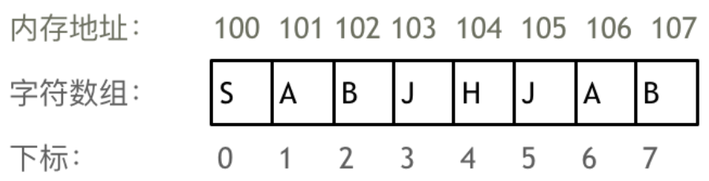

- **数组下标都是从0开始的**
- **数组内存空间的地址是连续的**
- **数组一旦声明，大小就是固定的，无法动态扩展**
- **数组查找一个元素时间复杂度是 $O(1)$，增加或删除一个元素时间复杂度是 $O(n)$**

**因为数组的在内存空间的地址是连续的，所以我们在删除或者增添元素的时候，就难免要移动其他元素的地址。还有一点需要注意的是，数组元素是无法凭空删除的，只能覆盖。**

在 Java 中，二维数组的内存空间排列方式如下：

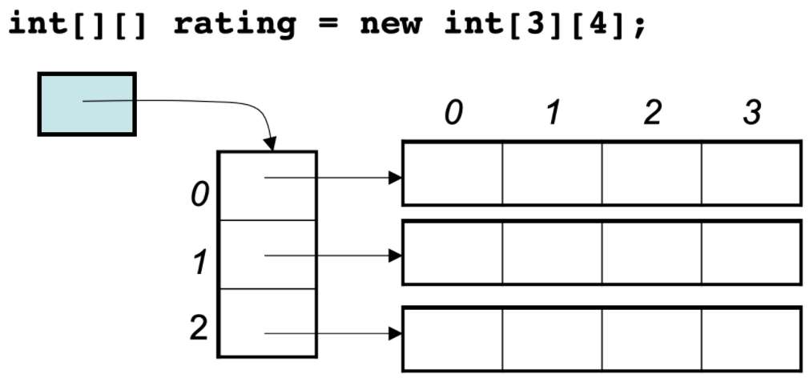

> 如图可见，数组的第一维存储第二维数组的头元素地址。

**代码：**

```java

```


# 链表 Linked list

链表（Linked list）是一种常见的基础数据结构，是一种线性表，但是并不会按线性的顺序存储数据，除了数据域，还增加了指针域用于构建链式的存储数据，**链表中每一个节点都包含此节点的数据和指向下一节点地址的指针（Pointer）**。由于不必须按顺序存储，链表在**插入和删除的时候可以达到 $O(1)$ 的复杂度，只需简单修改指针指向**，但是**查找一个节点或者访问特定编号的节点则需要 $O(n)$ 的时间。**

 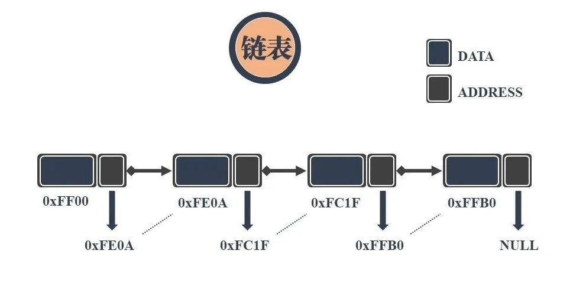 

上图展示的是最简单的单链表结构，除此之外还有循环链表、双向链表、双向循环链表结构~

**优点：**

- **链表的插入和删除的速度很快，无需像数组一样需要移动大量的元素，时间复杂度 $O(1)$**
- **链表大小不固定，可以很方便的进行动态扩展**
- **链表对内存的利用率比较高，无需连续的内存空间，即使有内存碎片，也不影响链表的创建**

**缺点：**

- **不能随机查找，必须从第一个开始遍历，查找效率比较低，链表查询的时间复杂度是 $O(n)$** 


**代码：**

```java

```


**数组和链表的对比：**

|                  | 数组                                       | 链表                               |
| ---------------- | ------------------------------------------ | ---------------------------------- |
| **内存地址**     | 连续的内存空间                             | 非连续的内存空间                   |
| **空间长度**     | 长度固定，一般不可动态扩展                 | 长度可动态变化                     |
| **增删效率**     | 低，需要移动被修改元素之后的所有元素，O(n) | 高，只需修改指针指向，O(1)         |
| **查询效率**     | 高，可通过数组名和下标直接访问，O(1)       | 低，只能通过遍历节点依次查询，O(n) |
| **数据访问方式** | 随机访问                                   | 顺序访问                           |


# 栈 Stack

栈是一种比较简单的数据结构，**后进先出（LIFO）**。栈本身是一个线性表，但是在这个表中只有一个口子允许数据的进出。

栈的常用操作包括**入栈 push** 和**出栈 pop**，对应于数据的压入和弹出。还有访问栈顶数据、判断栈是否为空和判断栈的大小等。由于栈后进先出的特性，常可以作为数据操作的临时容器，对数据的顺序进行调控，与其它数据结构相结合可获得许多灵活的处理。

> - push：在最顶层加入数据。
> - pop：返回并移除最顶层的数据。
> - top：返回最顶层数据的值，但不移除它。
> - isEmpty：返回一个布尔值，表示当前 stack 是否为空栈。

 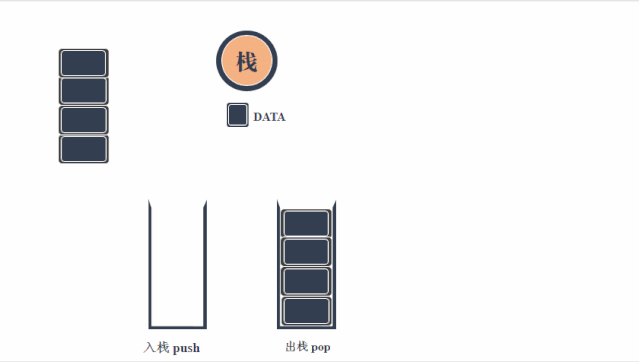 

**代码：**

```java

```


# 队列 Queue

队列是一种**先进先出（FIFO）**的数据结构。顾名思义，队列的数据存储是如同排队一般，先存入的数据先被压出。常与栈一同配合，可发挥最大的实力。  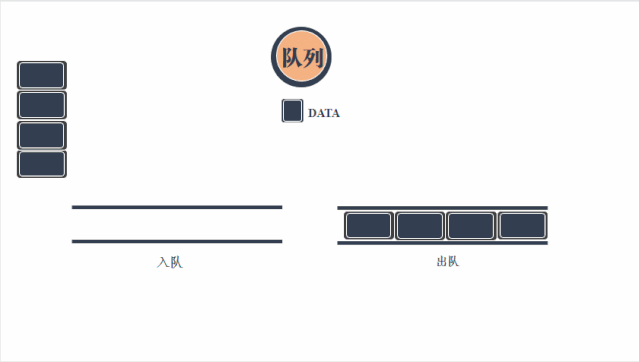 

**代码：**

```java

```


# 树 Tree

树作为一种树状的数据结构，其数据节点之间的关系也如大树一样，将有限个节点根据不同层次关系进行排列，从而形成数据与数据之间的父子关系。常见的数的表示形式更接近“倒挂的树”，因为它将根朝上，叶朝下。

树的数据存储在结点中，**每个结点有零个或者多个子结点**。没有父结点的结点在最顶端，成为**根节点**；**非根结点有且只有一个父节点**；每个非根节点又可以分为多个不相交的子树。 

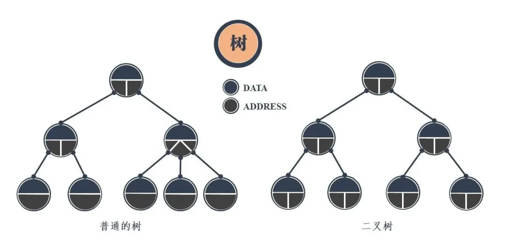 

树的实现就是对链表的指针域进行了扩充，增加了多个地址指向子结点。同时将“链表”竖起来，从而凸显了结点之间的层次关系，更便于分析和理解。 

树可以衍生出许多的结构，若将指针域设置为双指针，那么即可形成最常见的二叉树，即每个结点最多有两个子树的树结构。二叉树根据结点的排列和数量还可进一度划分为完全二叉树、满二叉树、平衡二叉树、红黑树等。 


## **二叉树 Binary Tree**

二叉树是**每个节点最多有两个子树的树结构**。它有五种基本形态：二叉树可以是空集；根可以有空的左子树或右子树；或者左、右子树皆为空。 

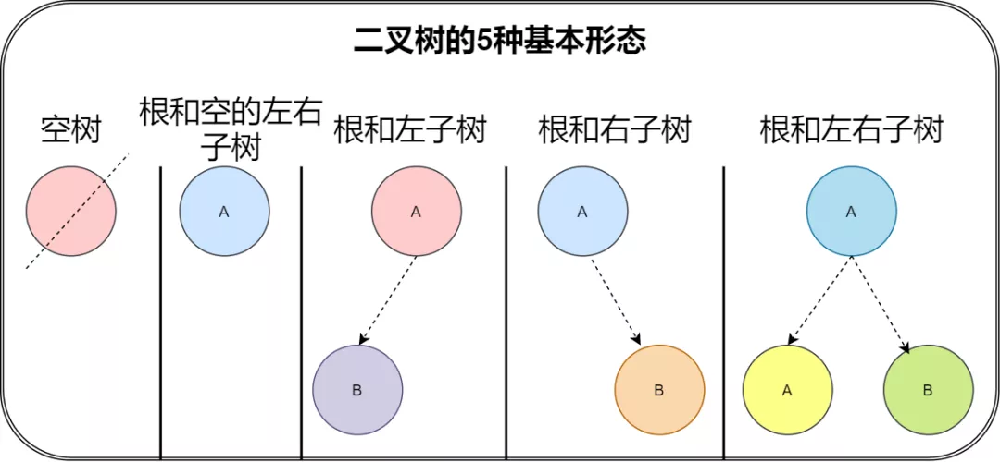 


### 1. 二叉树的性质

 


### 2. 完全二叉树和满二叉树

- **完全二叉树**：除了最后一层结点，其它层的结点数都达到了最大值；同时最后一层的结点都是按照从左到右依次排布。  
- **满二叉树**：除了叶结点外每一个结点都有左右子叶且叶子结点都处在最底层的二叉树。

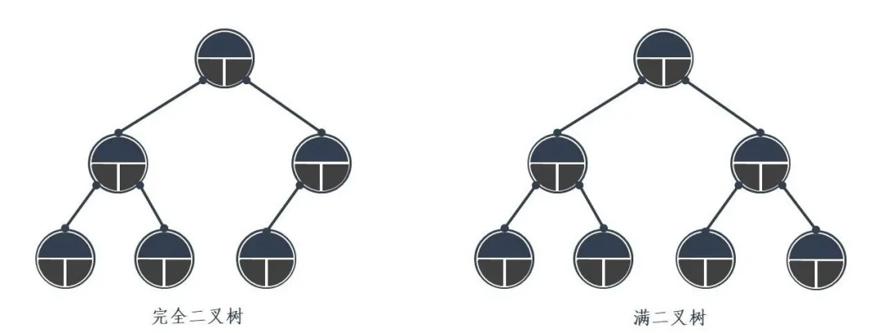 


### 3. 常见的存储方法

二叉树可以通过数组方式存储，也可通过链表方式存储。

**数组方式：**

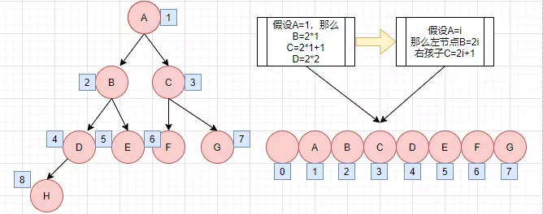 

**链表方式：**

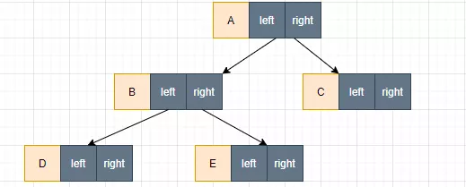 


### 4. 二叉树的遍历

#### 先序遍历

先访问根节点，访问当前节点的左子树；若当前节点无左子树，则访问当前节点的右子树；

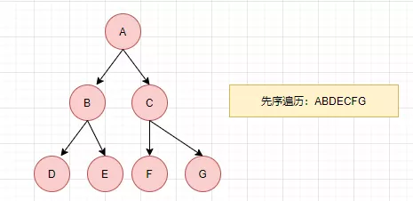 

递归：

```java
public void PrintBinaryTreePreRecur(TreeNode<T> root) {
    if (root!=null) {
        System.out.print(root.data);
        PrintBinaryTreePreRecur(root.left);
        PrintBinaryTreePreRecur(root.right);
    }
}
```

非递归：

```
准备一个栈
1.第一步将非空根结点压栈
2.如果栈非空，从栈中弹出一个节点cur
3.打印(处理)cur
4.先将cur的右子树根节点压栈，再将cur左子树节点压栈 (先右后左)
重复 2，3，4
```

```java
public static void preOrderTraverse(TreeNode root) {
    if (root == null) {
        return;
    }
    Stack<TreeNode> stack = new Stack<>();
    stack.push(root);//先将根节点入栈
    while (!stack.isEmpty()) {
        //将栈顶节点cur弹出并打印
        TreeNode cur = stack.pop();
        System.out.print(cur.value + " ");
        //(如果非空)先右再左
        if (cur.right != null) {
            stack.push(cur.right);
        }
        if (cur.left != null) {
            stack.push(cur.left);
        }
    }
}
```


#### 中序遍历

先访问当前节点的左子树；访问根节点；访问当前节点的右子树； 

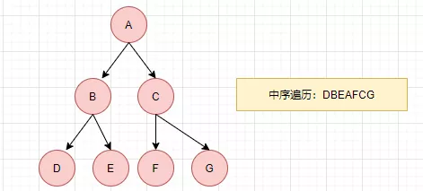 

递归：

```java
public void PrintBinaryTreeMidRecur(TreeNode<T> root) {
    if (root!=null) {
        PrintBinaryTreeMidRecur(root.left);
        System.out.print(root.data);
        PrintBinaryTreeMidRecur(root.right);
    }
}
```

非递归：

```
准备一个栈
1.依次压入左边的结点，直到最左结点为空
2.弹出并打印，如果有右子节点，压入栈中
继续执行1
```

```java
public static void inOrderTraverse(TreeNode root) {
    if (root != null) {
        Stack<TreeNode> stack = new Stack<>();
        while (!stack.isEmpty() || root != null) {
            if (root != null) { //将左边界的树节点全部依次压入栈，直到左子节点为空
            	stack.push(root);
            	root = root.left;
            } else { //弹出并打印
            	root = stack.pop();
                System.out.print(root.value + " ");
                root = root.right;
            }
		}
    }
}
```


#### 后序遍历

从根节点出发，依次遍历各节点的左右子树，直到当前节点左右子树遍历完成后，才访问该根节点元素。

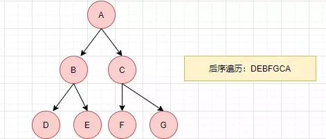 

递归：

```java
public void PrintBinaryTreeBacRecur(TreeNode<T> root) {
    if (root!=null) {
        PrintBinaryTreeBacRecur(root.left);
        PrintBinaryTreeBacRecur(root.right);
        System.out.print(root.data);
    }
}
```

非递归：

```
准备两个栈，一个为栈s1，一个为收栈s2
1.将树根节点压入栈s1
2.s1弹出栈顶元素cur
3.cur压入收栈s2
4.先压cur左子节点入s1，再压右子节点入s1 (先左后右)
重复 2，3，4
当s1为空，依次弹出s2中的节点
```

```java
public static void postOrderTraverse(TreeNode root) {
    if (root == null) {
        return;
    }
    Stack<TreeNode> s1 = new Stack<>();
    Stack<TreeNode> s2 = new Stack<>();
    s1.push(root);
    while (!s1.isEmpty()) {
        TreeNode cur = s1.pop();
        s2.push(cur);
        //先右后左的先序遍历的反向就是先左后右的后序遍历
        if (cur.left != null) {
            s1.push(cur.left);
        }
        if (cur.right != null) {
            s1.push(cur.right);
        }
    }
    while (!s2.isEmpty()) {
        System.out.print(s2.pop().value + " ");
    }
}
```

非双栈版本：对前序遍历的实现做小改动，前序遍历 `中左右` 是先入左后入右，后序遍历 `左右中` 改成**先入左后入右**，则出来结果集为 `中右左`，此时对结果集进行 `Collections.reverse(res)` 反转就可得 `左右中`。

```java
// 后序遍历顺序 左-右-中 入栈顺序：中-左-右 出栈顺序：中-右-左， 最后翻转结果
class Solution {
    public List<Integer> postorderTraversal(TreeNode root) {
        List<Integer> result = new ArrayList<>(); //存放按后序遍历的结果集
        if (root == null){
            return result;
        }
        Stack<TreeNode> stack = new Stack<>();
        stack.push(root);
        while (!stack.isEmpty()){
            TreeNode node = stack.pop();
            result.add(node.val);
            //跟前序遍历唯一的不同就是先入左后入右，最后用Collections.reverse()进行反转
            if (node.left != null){
                stack.push(node.left);
            }
            if (node.right != null){
                stack.push(node.right);
            }
        }
        Collections.reverse(result);
        return result;
    }
}
```

更巧妙地思路：类似于中序遍历的思路，但巧妙利用了**向链表头部插值**

```java
public List<Integer> postorderTraversal(TreeNode root) {
    LinkedList<Integer> result = new LinkedList<>();
    Stack<TreeNode> stack = new Stack<>();
    while (root != null || !stack.isEmpty()) {
        if (root != null) {
            stack.push(root);
            result.addFirst(root.val);//从链表头部插入，这样根节点就会去到结果集的最尾部
            root = root.right;//然后不断把树的右子树节点入栈
        } else {
            root = stack.pop();//直到右子树节点为空时，弹出栈顶节点
            root = root.left;//转而将该栈顶结点的左子节点入栈，对以该左子节点为根的子树做相同操作
        }
    }
    return result;
}
```


#### 层次遍历

从上往下一层一层遍历。

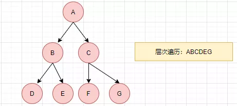 


## **二叉排序树 Binary Sort Tree**

二叉排序树（Binary Sort Tree）又称二叉查找树、二叉搜索树。它可能是一棵空树；也可能是具有下列性质的二叉树：

（1）若左子树不空，则左子树上所有结点的值均小于它的根结点的值；

（2）若右子树不空，则右子树上所有结点的值均大于它的根结点的值；

（3）左、右子树也分别为二叉排序树；

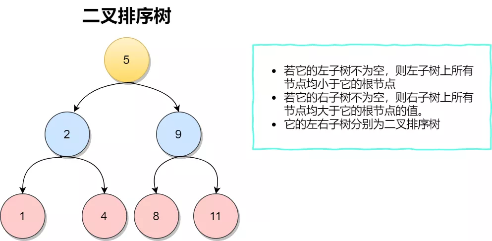 

其高度与树中结点个数n成对数关系，检索的时间开销为 **$O(logn)$**。但是很有可能检索的时间将变成**线性**的情况。 

 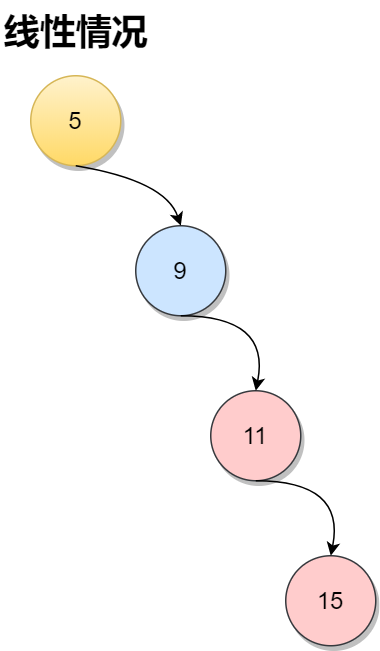 


## **哈夫曼树 Huffman Tree**


## **B 树 B-Tree**


## **B+ 树 B+Tree**


## **红黑树 Red Black Tree**


## **前缀树 Trie Tree/Prefix Tree**


# 图 Graph


# 堆 Heap


# 跳表 Skip list

## 1. 什么是跳表？

链表虽然通过增加指针域提升了自由度，但是却导致数据的查询效率恶化。特别是当链表长度很长的时候，对数据的查询还得从头依次查询，这样的效率会更低。跳表的产生就是为了解决链表过长的问题，**通过增加链表的多级索引来加快原始链表的查询效率**。这样的方式可以让查询的时间复杂度从 $O(n)$ 提升至 **$O(logn)$**。 

> 跳表(SkipList，全称跳跃表)是用于**有序**元素序列**快速搜索查找**的一个数据结构，跳表是一个随机化的数据结构，实质就是一种可以进行**二分查找**的**有序链表**。跳表在原有的有序链表上面增加了**多级索引**，通过索引来实现快速查找。跳表不仅能提高搜索性能，同时也可以提高插入和删除操作的性能。它在性能上和红黑树，AVL树不相上下，但是跳表的原理非常简单，实现也比红黑树简单很多。 


## 2. 跳表的实现思路

下图是一个带有头节点（不存储有意义的值）的有序链表，每次要在链表中查询一个值都需要逐个往后迭代，相当耗费时间（O(n)）。那么如何将它优化一下呢？

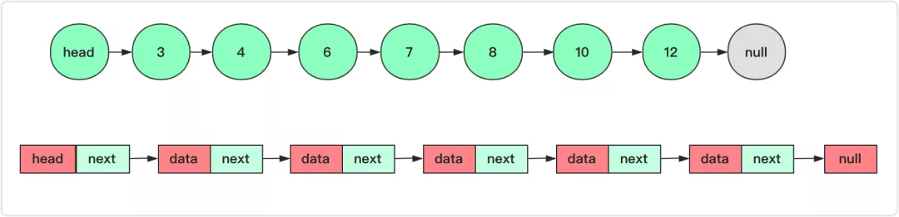 

很多算法和数据结构可以**以空间换时间**，在有序链表上面加一层索引，让部分节点在上层能够直接定位到，这样链表的查询时间近乎减少一半 。

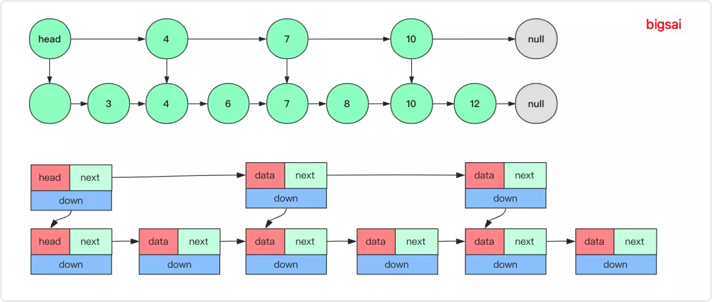 

这样，在查询某个节点的时候，首先会从上一层快速定位节点所在的一个范围，如果找到具体范围向下然后查找，这样代价就会减小，当然在表的结构设计上会增加一个向下的索引（指针）用来查找确定底层节点。平均查找速度平均为 O(n/2)。但是当节点数量很大的时候，它依旧很慢很慢。我们都知道，二分查找是每次都能折半的去压缩查找范围，要是有序链表也能这么跳起来那就太完美了。而**跳表就能让链表拥有近乎的接近二分查找的效率的一种数据结构**，其原理依然是给上面加若干层索引，优化查找速度。 

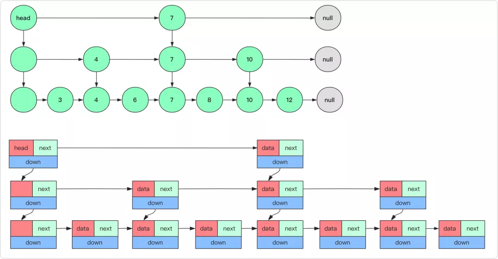 

通过上图可以看到，通过这样的一个数据结构对有序链表进行查找都能近乎二分的性能。就是在上面维护那么多层的索引，首先在最高级索引上查找**最后一个小于当前查找元素的位置**，然后再跳到次高级索引继续查找，直到跳到最底层为止，这时候已经十分接近要查找的元素的位置了（如果查找元素存在的话）。由于根据索引可以一次跳过多个元素，所以跳表查找的查找速度也就变快了。 


## 3. 跳表的代码实现

### 结构定义

在实现跳表的过程中为了便于操作，将跳表的头结点（head）的 key 设为 int 的最小值（要满足左小右大方便比较）。对于每个节点的设置，设置成 **SkipNode** 类，其中属性设置 right，down 两个指针。

跳表节点类 SkipNode：

```java
class SkipNode<T> {
    int key; //跳表元素的键(用于大小比较)
    T value; //跳表元素的值
    SkipNode right,down; //右、下两个方向的指针
    public SkipNode (int key,T value) {
        this.key = key;
        this.value = value;
    }
}
```

跳表结构类 SkipList：

```java
public class SkipList <T> {
    SkipNode headNode; //头节点，跳表查询的入口
    int highLevel; //当前跳表索引层数
    Random random; //用于投掷硬币
    final int MAX_LEVEL = 32; //最大的层

    SkipList(){
        random = new Random();
        headNode = new SkipNode(Integer.MIN_VALUE,null);
        highLevel = 0;
    }
    //其他方法
}
```


### 查询操作

设置一个临时节点 `team = head`。当**team不为null**其流程大致如下：

1. 从team节点出发，**如果当前节点的key与查询的key相等**，那么返回当前节点（如果是修改操作那么一直向下进行修改值即可）。
2. 如果key不相等，且**右侧为null**，那么证明只能向下（结果可能出现在下右方向），此时`team = team.down`
3. 如果key不相等，且右侧不为null，且**右侧节点key小于待查询的key**。那么说明同级还可向右，此时 `team = team.right`
4. （否则的情况）如果key不相等，且右侧不为null，且**右侧节点key大于待查询的key** 。那么说明如果有结果的话就在这个索引和下个索引之间，此时 `team = team.down`。

最终将按照这个步骤返回正确的节点或者null（说明没查到）。

 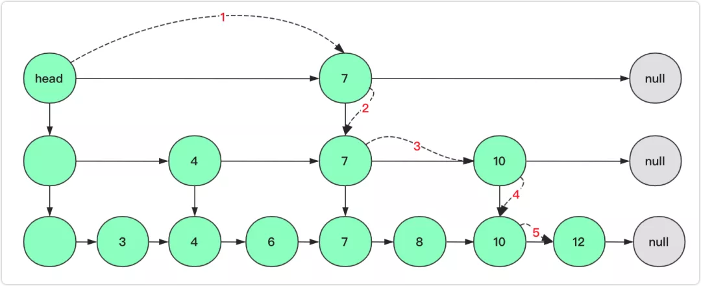 

如上图查询12节点，首先第一步从head出发发现右侧不为空，且7<12，向右；第二步右侧为null，向下；第三步节点7的右侧10<12，继续向右；第四步10右侧为null，向下；第五步右侧12小于等于，向右。第六步起始发现相等返回节点结束。 

```java
public SkipNode search(int key) {
    SkipNode team = headNode;
    while (team != null) {
        if(team.key == key) {
            return team;
        } else if(team.right == null) {
            //右侧没有了，只能下降
            team = team.down;
        } else if(team.right.key > key) {
            //需要下降去寻找
            team = team.down;
        } else {
            //右侧比较小向右
            team = team.right;
        }
    }
    return null;
}
```


### 删除操作

删除需要改变链表结构所以需要处理好节点之间的联系。对于删除操作需要谨记以下几点：

1. 删除当前节点和这个节点的前后节点都有关系
2. 删除当前层节点之后，下一层该 key 的节点也要删除，一直删除到最底层

根据这两点进行分析：如果找到当前节点了，**它的前面一个节点怎么查找呢**？总不能再遍历一遍吧！有的使用四个方向的指针（上下左右）用来找到左侧节点，这样是可以的；但是这里可以**特殊处理一下**，不直接判断和操作节点，先找到**待删除节点的左侧节点**。通过这个节点即可完成删除，然后这个节点直接向下去找下一层待删除的左侧节点。设置一个临时节点 `team = head`，**当team不为null时**，具体循环流程为：

1. 如果**team右侧为null**，那么 `team = team.down`（之所以敢直接这么判断是因为左侧有头结点在左侧，不用担心特殊情况）
2. 如果team右侧不为null，并且**右侧的key等于待删除的key**，那么先删除节点，再 team 向下 `team = team.down`，为了删除下层节点。
3. 如果team右侧不为null，并且**右侧key小于待删除的key**，那么team向右 `team = team.right`。
4. 如果team右侧不为null，并且**右侧key大于待删除的key**，那么team向下 `team = team.down`，在下层继续查找删除节点。

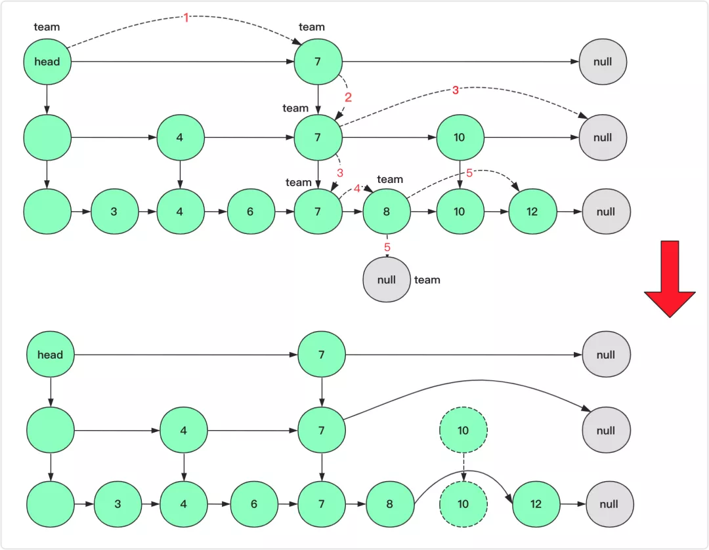 

如上图删除10节点，首先 `team = head` 从team出发，7<10，向右（`team = team.right` 后面省略）；第二步右侧为null，只能向下；第三步右侧为10，在当前层删除10节点，然后向下继续查找下一层10节点；第四步8<10，向右；第五步右侧为10，删除该节点并且team向下。team为null说明删除完毕退出循环。 

```java
//删除不需要考虑层数
public void delete(int key) {
    SkipNode team = headNode;
    while (team != null) {
        if (team.right == null) {//右侧没有了，说明这一层找到，没有只能下降
            team = team.down;
        } else if(team.right.key == key) {//找到节点，右侧即为待删除节点
            team.right = team.right.right;//删除右侧节点
            team = team.down;//向下继续查找删除
        }
        else if(team.right.key > key) {//右侧已经不可能了，向下
            team = team.down;
        } else { //节点还在右侧
            team = team.right;
        }
    }
}
```


### 插入操作

**插入需要考虑是否插入索引，插入几层**等问题。由于需要插入删除所以肯定无法维护一个完全理想的索引结构，因为它耗费的代价太高。但我们使用**随机化**的方法去判断是否向上层插入索引。即**产生一个[0-1]的随机数如果小于0.5就向上插入索引，插入完毕后再次使用随机数判断是否向上插入索引**。运气好这个值可能是多层索引，运气不好只插入最底层（这是必须插入的）。但是索引也不能不限制高度，一般会设置索引最高值，如果大于这个值就不往上继续添加索引了。

1. 首先通过上面查找的方式，找到**待插入的左节点**。插入的话最底层肯定是需要插入的，所以通过链表插入节点(需要考虑是否为末尾节点)

2. 插入完这一层，需要考虑上一层是否插入，首先判断当前索引层级，如果大于最大值那么就停止（比如已经到最高索引层了）。否则设置一个随机数以1/2的概率向上插入一层索引（因为理想状态下的就是每2个向上建一个索引节点）。

3. 继续（2）的操作，直到概率退出或者索引层数大于最大索引层。

在**具体向上插入**的时候，实质上还有非常重要的细节需要考虑。首先**如何找到上层的待插入节点** ？

这个各个实现方法可能不同，如果有左、上指向的指针那么可以向左向上找到上层需要插入的节点，但是如果只有右指向和下指向的也可以**巧妙的借助查询过程中记录下降的节点**。因为曾经下降的节点倒序就是需要插入的节点，最底层也不例外（因为没有匹配值会下降为null结束循环）。在这里可以使用**栈**这个数据结构进行存储，当然使用List也可以。下图就是给了一个插入示意图。

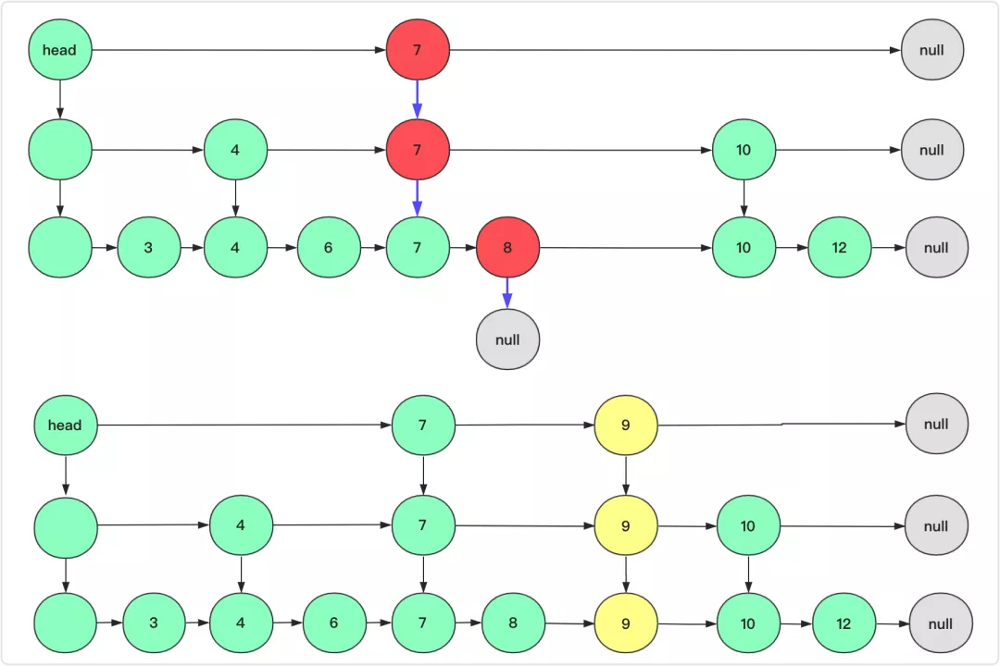 

其次如果该层是目前的**最高层索引**，需要**继续向上建立索引**应该怎么办？

首先跳表最初肯定是没索引的，然后慢慢添加节点才有一层、二层索引，但是如果这个节点添加的索引突破当前最高层，该怎么办呢？

这时候需要注意了，跳表的head需要改变了，新建一个ListNode节点作为新的head，将它的down指向老head，将这个head节点加入栈中（也就是这个节点作为下次后面要插入的节点），就比如上面的9节点如果运气够好在往上建立一层节点，会是这样的。

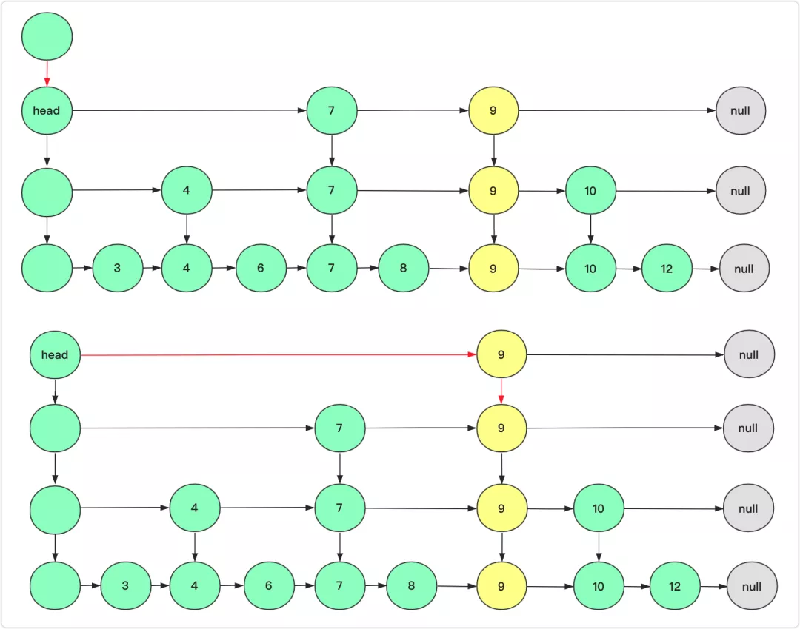 

插入上层的时候注意所有节点要新建(拷贝)，除了right的指向，down的指向也不能忘记，down指向上一个节点可以用一个临时节点作为前驱节点。如果层数突破当前最高层，头head节点(入口)需要改变。 

```java
public void add(SkipNode node) {

    int key = node.key;
    SkipNode findNode = search(key);
    if(findNode != null){
        //如果存在这个key的节点
        findNode.value = node.value;
        return;
    }
    Stack<SkipNode> stack = new Stack<SkipNode>();//存储向下的节点，这些节点可能在右侧插入节点
    SkipNode team = headNode;//查找待插入的节点   找到最底层的那个节点
    while (team != null) {//进行查找操作 
        if(team.right == null)//右侧没有了，只能下降
        {
            stack.add(team);//将曾经向下的节点记录一下
            team = team.down;
        }
        else if(team.right.key > key)//需要下降去寻找
        {
            stack.add(team);//将曾经向下的节点记录一下
            team = team.down;
        }
        else //向右
        {
            team = team.right;
        }
    }
    int level = 1;//当前层数，从第一层添加(第一层必须添加，先添加再判断)
    SkipNode downNode = null;//保持前驱节点(即down的指向，初始为null)
    while (!stack.isEmpty()) {
        //在该层插入node
        team = stack.pop();//抛出待插入的左侧节点
        SkipNode nodeTeam = new SkipNode(node.key, node.value);//节点需要重新创建
        nodeTeam.down = downNode;//处理竖方向
        downNode = nodeTeam;//标记新的节点下次使用
        if(team.right == null) {//右侧为null 说明插入在末尾
            team.right = nodeTeam;
        }
        //水平方向处理
        else {//右侧还有节点，插入在两者之间
            nodeTeam.right = team.right;
            team.right = nodeTeam;
        }
        //考虑是否需要向上
        if(level > MAX_LEVEL)//已经到达最高级的节点啦
            break;
        double num = random.nextDouble();//[0-1]随机数
        if(num > 0.5)//运气不好结束
            break;
        level++;
        if(level > highLevel)//比当前最大高度要高但是依然在允许范围内 需要改变head节点
        {
            highLevel = level;
            //需要创建一个新的节点
            SkipNode highHeadNode = new SkipNode(Integer.MIN_VALUE, null);
            highHeadNode.down = headNode;
            headNode = highHeadNode;//改变head
            stack.add(headNode);//下次抛出head
        }
    }
}
```


## 4. 为什么 Redis 的有序集合（zset）采用跳表而非红黑树？

因为跳表除了查找插入维护和红黑树有着差不多的效率，它是个链表，能确定范围区间，而区间问题在树上可能就没那么方便查询。 


# 布隆过滤器 BloomFilter

## 1. 什么是 BloomFilter？

**布隆过滤器**（Bloom Filter）实际上是由**一个很长的二进制向量**和**一系列随机映射函数**组成。主要**用于判断一个元素是否在一个集合中**。

通常我们会遇到很多要判断一个元素是否在某个集合中的业务场景，一般想到的是将集合中所有元素保存起来，然后通过比较来确定。链表、树、散列表（又称哈希表 Hash table）等数据结构都是这种思路。但是随着集合中元素的增加，我们需要的存储空间也会呈现线性增长，最终达到瓶颈。同时检索速度也越来越慢，上述三种结构的检索时间复杂度分别为 $O(n)$，$O(logn)$，$O(1)$。

这个时候，布隆过滤器（Bloom Filter）就应运而生。


## 2. 布隆过滤器原理

了解布隆过滤器原理之前，先回顾下 Hash 函数原理。

### 哈希函数

哈希函数：将任意大小的输入数据转换成特定大小的输出数据的函数，转换后的数据称为哈希值或哈希编码，也叫散列值。下面是哈希函数的示意图：

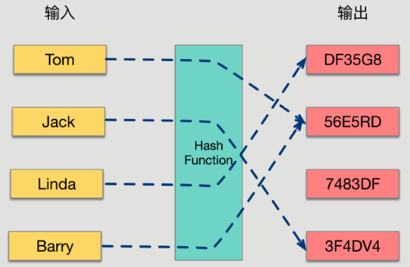

所有哈希函数都有如下基本特性：

- 如果两个散列值是不相同的（根据同一函数），那么这两个散列值的原始输入也一定是不相同的。这个特性是散列函数具有确定性的结果，具有这种性质的散列函数称为**单向散列函数**。
- 散列函数的输入和输出不是唯一对应关系的，两个不同的输入值通过哈希函数有可能会计算出两个相同的散列值，这种情况称为“**散列碰撞**（collision）”。

虽然使用 hash 表查询一个元素是否存在的速度很快，但是用 hash 表存储大数据量时，空间效率还是很低，当只有一个 hash 函数时，还很容易发生哈希碰撞。


### 布隆过滤器数据结构

BloomFilter 是由一个固定大小的二进制向量或者位图（bitmap）和一系列映射函数组成的。

在初始状态时，对于长度为 m 的位数组，它的所有位都被置为 0，如下图所示：

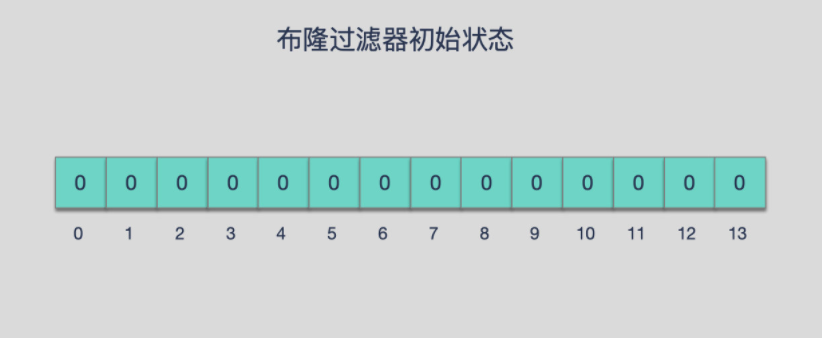

当有元素被加入集合时，通过 K 个映射函数将这个元素映射成位图中的 K 个点，把它们置为 1（假定有两个元素都通过 3 个映射函数，注意在 3 这个位上出现了重复）。 

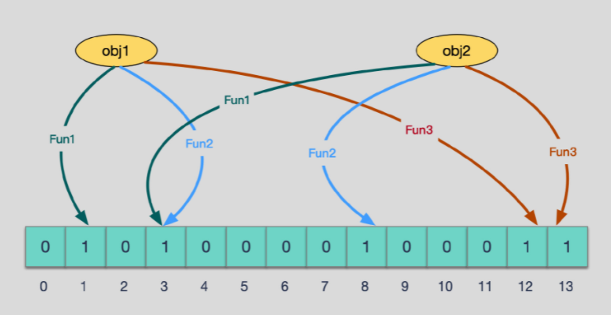

查询某个元素的时候我们只要看看位图中的这些点是不是都是 1 就可以大概率知道集合中有没有它了：

- 如果这些点有任何一个 0，则被查询元素一定不在；
- 如果都是 1，则被查询元素很**可能存在**

为什么说是可能存在，而不是一定存在呢？那是因为**映射函数本身就是散列函数，散列函数是会有碰撞的**。


### 误判率

布隆过滤器的误判是指**多个输入经过哈希之后在相同的 bit 位置 1 了**，这样就无法判断究竟是哪个输入产生的，因此误判的根源在于相同的 bit 位被多次映射且置 1。

这种情况也造成了布隆过滤器的删除问题，因为**布隆过滤器的每一个 bit 并不是独占的，很有可能多个元素共享了某一位**。如果我们直接删除这一位的话，会影响到其他的元素。(比如上图中的第 3 位)

### 特性

- **一个元素如果判断结果为存在的时候元素不一定存在，但是判断结果为不存在的时候则一定不存在**。
- **布隆过滤器可以添加元素，但是不能删除元素**。因为删掉元素会导致误判率增加。


### 添加与查询元素步骤

#### 添加元素

1. 将要添加的元素给 k 个哈希函数
2. 得到对应于位数组上的 k 个位置
3. 将这 k 个位置设为 1

#### 查询元素

1. 将要查询的元素给 k 个哈希函数
2. 得到对应于位数组上的 k 个位置
3. 如果 k 个位置有一个为 0，则肯定不在集合中
4. 如果 k 个位置全部为 1，则**可能**在集合中

### 优点

相比于其它的数据结构，布隆过滤器在空间和时间方面都有巨大的优势。**布隆过滤器「存储空间」和「插入/查询时间」都是常数级 $O(K)$**。

另外，**散列函数相互之间没有关系，方便由硬件并行实现。布隆过滤器不需要存储元素本身，在某些对保密要求非常严格的场合有优势**。

布隆过滤器可以表示全集，其它任何数据结构都不能；

### 缺点

但是布隆过滤器的缺点和优点一样明显。误算率是其中之一。**随着存入的元素数量增加，误算率随之增加**。但是如果元素数量太少，则使用散列表足矣。

另外，**一般情况下不能从布隆过滤器中删除元素**。我们很容易想到把位数组变成整数数组，每插入一个元素相应的计数器加 1，这样删除元素时将计数器减掉就可以了。然而要保证安全地删除元素并非如此简单，首先我们必须保证删除的元素的确在布隆过滤器里面。这一点单凭这个过滤器是无法保证的。另外计数器回绕也会造成问题。

在降低误算率方面，有不少工作，使得出现了很多布隆过滤器的变种。


## 3. 布隆过滤器使用场景和实例

布隆过滤器是一件很有用的工具，利用它可以快速地解决项目中一些比较棘手的问题。如网页 URL 去重、垃圾邮件识别、大集合中重复元素的判断和缓存穿透等问题。

布隆过滤器的典型应用有：

- 数据库防止穿库。 Google Bigtable，HBase 和 Cassandra 以及 Postgresql 使用 BloomFilter 来减少不存在的行或列的磁盘查找。避免代价高昂的磁盘查找会大大提高数据库查询操作的性能。
- 业务场景中判断用户是否阅读过某视频或文章，比如抖音或头条，当然会导致一定的误判，但不会让用户看到重复的内容。
- 缓存宕机、缓存击穿场景。一般判断用户是否在缓存中，如果在则直接返回结果，不在则查询 DB，如果来一大波冷数据（访问很少或者从不访问的，缓存中不存在的数据），会导致缓存大量击穿，造成雪崩效应，这时候可以用布隆过滤器充当缓存的索引，只有在布隆过滤器中，才去查询缓存，如果没查询到，则穿透到 DB。如果不在布隆器中，则直接返回。
- WEB 拦截器，如果遇到相同请求则拦截，防止重复被攻击。用户第一次请求，将请求参数放入布隆过滤器中，当第二次请求时，先判断请求参数是否被布隆过滤器命中。可以提高缓存命中率。Squid 网页代理缓存服务器在 cache digests 中就使用了布隆过滤器，Google Chrome浏览器使用了布隆过滤器加速安全浏览服务。
- Venti 文档存储系统也采用布隆过滤器来检测先前存储的数据。
- SPIN 模型检测器也使用布隆过滤器在大规模验证问题时跟踪可达状态空间。


## 4. BloomFilter 的实现

### 自定义的 BloomFilter

```java
public class MyBloomFilter {

    //一个长度为10 亿的比特位
    private static final int DEFAULT_SIZE = 256 << 22;

    //为了降低错误率，使用加法hash算法，所以定义一个8个元素的质数数组
    private static final int[] seeds = {3, 5, 7, 11, 13, 31, 37, 61};

    //相当于构建 8 个不同的hash算法
    private static HashFunction[] functions = new HashFunction[seeds.length];

    
    //初始化布隆过滤器的 bitmap
    private static BitSet bitset = new BitSet(DEFAULT_SIZE);

    /**
     * 添加数据
     * @param value 需要加入的值
     */
    public static void add(String value) {
        if (value != null) {
            for (HashFunction f : functions) {
                //计算 hash 值并修改 bitmap 中相应位置为 true
                bitset.set(f.hash(value), true);
            }
        }
    }

    /**
     * 判断相应元素是否存在
     * @param value 需要判断的元素
     * @return 结果
     */
    public static boolean contains(String value) {
        if (value == null) {
            return false;
        }
        boolean ret = true;
        for (HashFunction f : functions) {
            ret = bitset.get(f.hash(value));
            //一个 hash 函数返回 false 则跳出循环
            if (!ret) {
                break;
            }
        }
        return ret;
    }

    /**
     * 模拟用户是不是会员，或用户在不在线
     */
    public static void main(String[] args) {
        for (int i = 0; i < seeds.length; i++) {
            functions[i] = new HashFunction(DEFAULT_SIZE, seeds[i]);
        }

        // 添加1亿数据
        for (int i = 0; i < 100000000; i++) {
            add(String.valueOf(i));
        }
        String id = "123456789";
        add(id);

        System.out.println(contains(id));   // true
        System.out.println("" + contains("234567890"));  //false
    }
}

//哈希函数
class HashFunction {

    private int size;
    private int seed;

    public HashFunction(int size, int seed) {
        this.size = size;
        this.seed = seed;
    }
	//计算传入value的哈希值
    public int hash(String value) {
        int result = 0;
        int len = value.length();
        for (int i = 0; i < len; i++) {
            result = seed * result + value.charAt(i);
        }
        int r = (size - 1) & result;
        return (size - 1) & result;
    }
}
```


### Guava 中的 BloomFilter

引入依赖：

```xml
<dependency>
    <groupId>com.google.guava</groupId>
    <artifactId>guava</artifactId>
    <version>23.0</version>
</dependency>
```

```java
public class GuavaBloomFilterDemo {

    public static void main(String[] args) {
        //后边两个参数：预计包含的数据量，和允许的误差值
        BloomFilter<Integer> bloomFilter = BloomFilter.create(Funnels.integerFunnel(), 100000, 0.01);
        for (int i = 0; i < 100000; i++) {
            bloomFilter.put(i);
        }
        System.out.println(bloomFilter.mightContain(1));
        System.out.println(bloomFilter.mightContain(2));
        System.out.println(bloomFilter.mightContain(3));
        System.out.println(bloomFilter.mightContain(100001));

        //bloomFilter.writeTo();
    }
}
```

分布式环境中，布隆过滤器肯定还需要考虑是可以共享的资源，这时候我们会想到 Redis，是的，Redis 也实现了布隆过滤器。

**当然我们也可以把布隆过滤器通过 `bloomFilter.writeTo()` 写入一个文件，放入 OSS、S3 这类对象存储中。**

### Redis 中的 BloomFilter

Redis 提供的 bitMap 可以实现布隆过滤器，但是需要自己设计映射函数和一些细节，这和我们自定义没啥区别。

Redis 官方提供的布隆过滤器到了 Redis 4.0 提供了插件功能之后才正式登场。布隆过滤器作为一个插件加载到 Redis Server 中，给 Redis 提供了强大的布隆去重功能。

在已安装 Redis 的前提下，安装 RedisBloom，有两种方式：

**直接编译进行安装**

```sh
git clone https://github.com/RedisBloom/RedisBloom.git
cd RedisBloom
make     #编译 会生成一个rebloom.so文件
redis-server --loadmodule /path/to/rebloom.so   #运行redis时加载布隆过滤器模块
redis-cli    # 启动连接容器中的 redis 客户端验证
```

**使用Docker进行安装**

```sh
docker pull redislabs/rebloom:latest # 拉取镜像
docker run -p 6379:6379 --name redis-redisbloom redislabs/rebloom:latest #运行容器
docker exec -it redis-redisbloom bash
redis-cli     
```

**使用**

布隆过滤器基本指令：

- `bf.add` 添加元素到布隆过滤器
- `bf.exists` 判断元素是否在布隆过滤器
- `bf.madd` 添加多个元素到布隆过滤器，`bf.add` 只能添加一个
- `bf.mexists` 判断多个元素是否在布隆过滤器

```
127.0.0.1:6379> bf.add user Tom
(integer) 1
127.0.0.1:6379> bf.add user John
(integer) 1
127.0.0.1:6379> bf.exists user Tom
(integer) 1
127.0.0.1:6379> bf.exists user Linda
(integer) 0
127.0.0.1:6379> bf.madd user Barry Jerry Mars
1) (integer) 1
2) (integer) 1
3) (integer) 1
127.0.0.1:6379> bf.mexists user Barry Linda
1) (integer) 1
2) (integer) 0
```

> 我们只有这几个参数，肯定不会有误判，当元素逐渐增多时，就会有一定的误判了。

上面使用的布隆过滤器只是默认参数的布隆过滤器，它在我们第一次 `add` 的时候自动创建。

Redis 还提供了自定义参数的布隆过滤器，`bf.reserve 过滤器名 error_rate initial_size`

- error_rate：允许布隆过滤器的错误率，这个值越低过滤器的位数组的大小越大，占用空间也就越大
- initial_size：布隆过滤器可以储存的元素个数，当实际存储的元素个数超过这个值之后，过滤器的准确率会下降

但是这个操作需要在 `add` 之前显式创建。如果对应的 key 已经存在，`bf.reserve` 会报错

```
127.0.0.1:6379> bf.reserve user 0.01 100
(error) ERR item exists
127.0.0.1:6379> bf.reserve topic 0.01 1000
OK
```

在 Java 中使用：Redisson 和 lettuce 是可以使用布隆过滤器的，这里用 [Redisson](https://github.com/redisson/redisson/wiki/6.-?spm=a2c6h.12873639.0.0.7fab74b84mbGX6&file=6.-)

```java
public class RedissonBloomFilterDemo {

    public static void main(String[] args) {

        Config config = new Config();
        config.useSingleServer().setAddress("redis://127.0.0.1:6379");
        RedissonClient redisson = Redisson.create(config);

        RBloomFilter<String> bloomFilter = redisson.getBloomFilter("user");
        // 初始化布隆过滤器，预计统计元素数量为55000000，期望误差率为0.03
        bloomFilter.tryInit(55000000L, 0.03);
        bloomFilter.add("Tom");
        bloomFilter.add("Jack");
        System.out.println(bloomFilter.count());   //2
        System.out.println(bloomFilter.contains("Tom"));  //true
        System.out.println(bloomFilter.contains("Linda"));  //false
    }
}
```

