# Java代理模式 - 静态/JDK动态代理使用及实现原理分析


# 目录大纲

[TOC]

# 第一部分 代理的介绍

动态代理基于**反射**机制


1. 什么是动态代理?

> 使用 jdk 的反射机制，创建对象的能力，创建的是代理类的对象。 而不用你创建类文件。不用写 java 文件。
> 动态：在程序执行时，调用jdk提供的方法才能创建代理类的对象。
>
>   jdk动态代理，必须有接口，目标类必须实现接口， 没有接口时，需要使用 cglib 动态代理

2. 动态代理能够做什么?

> 可以在不改变原来目标方法功能的前提下， 在代理中增强自己的功能代码。
> 在程序开发中的意义：
>    比如：你所开发的项目中，有一个功能是其他人（公司的其它部门，其它小组的人）写好的，你可以使用。
> 	Func.class，Func f = new Func()，f.print()；
>
> 但你发现这个功能，现在还有缺点，不能完全满足项目的需要。 你需要在 f.print()执行后，增加一些代码。
> 用代理可以在实现 gn.print() 调用时，增加自己代码，而不用去改原来的 Func 文件。


## 1.什么是代理?

代理，在我们日常生活之中就有体现，代购、中介、换ip、商家等等。

比如有一家美国的大学，可以对全世界招生。留学中介(代理)

留学中介(代理) : 帮助这家美国的学校招生。中介是学校的代理，代替学校完成招生功能

**代理特点：**

> 1. 中介和代理要做的事情是一致的 （招生）
> 2. 中介是学校代理，学校是目标
> 3. 家长--------->中介(学校介绍、办理入学手续)---------->美国学校
> 4. 中介是代理，要收取费用


## 2.为什么要找中介？

为什么要找中介?

> 1. 中介是专业的，方便。
> 2. 家长现在不能自己去找学校。家长没有能力访问学校，或者美国学校不接收个人来访

买东西都是找到商家，商家是某个商品的代理，你个人买东西，肯定不会让你接触到厂家的。


## 3.代理模式

### 概念

百度百科：

```
代理模式是指，为其他对象提供一种代理以控制对这个对象的访问。在某些情况下，一个对象不适合或者不能直接引用另一个对象，而代理对象可以在客户类和目标对象之间起到中介的作用。 
```

换句话说，**使用代理对象，是为了在不修改目标对象的基础上，增强主业务逻辑。** 

> **客户类真正的想要访问的对象是目标对象，但客户类真正可以访问的对象是代理对象。**客户类对目标对象的访问是通过访问代理对象来实现的。当然，代理类与目标类要实现同一个接口。 


**例如：** 有 A，B，C 三个类， A 原来可以调用 C 类的方法， 现在因为某种原因 C 类不允许 A 类调用其方法，但 B 类可以调用 C 类的方法。A 类通过 B 类调用 C 类的方法。这里 B 是 C 的代理。 A 通过代理 B 访问 C 。

原来的访问关系： 

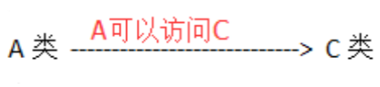

通过代理的访问关系： 

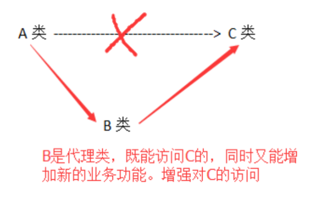


### 作用

- 控制访问：代理类不让客户类直接访问目标，例如商家不让用户访问厂家。
- 功能增强：在原有的功能上，增加了额外的功能。 新增加的功能，叫做功能增强。


### 分类

- 静态代理
- 动态代理


# 第二部分 静态代理


## 2.1 什么是静态代理

图例：

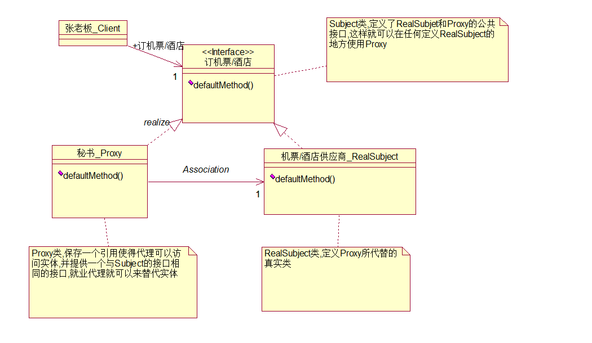

> 静态代理是指，代理类在程序运行前就已经定义好.java 源文件，其与目标类的关系在程序运行前就已经确立。在程序运行前代理类已经编译为.class 文件。

1）代理类是自己手工实现的，自己创建一个java类，表示代理类。
2）代理类所要代理的目标类是确定的。


## 2.2 实现静态代理的流程

```
模拟一个用户购买u盘的行为：
   	用户：是客户端类
	商家：代理，代理某个品牌的u盘。
	厂家：目标类。

三者的关系： 用户（客户端）---商家（代理）---厂家（目标）
商家和厂家都是卖u盘的，他们完成的功能是一致的，都是卖u盘。
```

```
实现步骤：
	 1. 创建一个接口，在其中定义卖u盘的方法，表示厂家和商家需要做的事情。
	 2. 创建厂家类，实现1步骤中的接口
	 3. 创建商家，也就是代理，也需要实现1步骤中的接口。
	 4. 创建客户端类，调用商家的方法购买一个u盘。

  代理类完成的功能： 
   	  1. 目标类中方法的调用
      2. 功能增强
```


## 2.3 具体实现

> 在 idea 中创建 java project
>
> 工程名：ch01_static_proxy

### 1）示例项目结构

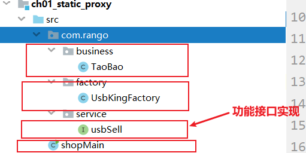


### 2）实现步骤

#### 1. 定义业务接口

定义业务接口 **UsbSell（目标接口）**，定义卖u盘的**抽象方法 sell(int amount)**，**sell 是目标方法**，表示厂家和商家做的事情。

```java
package com.rango.service;
public interface usbSell {
    /**
     * @param amount 表示一次购买的数量,暂时不用
     * @return 表示一个u盘的价格
     */
    float sell(int amount);
}
```

#### 2. 定义接口实现类（目标类）

创建**厂家类**，即**目标类 UsbKingFactory**(金士顿 u 盘)，该类实现了业务接口。 

```java
package com.rango.factory;

import com.rango.service.usbSell;
//目标类:金士顿厂家,不接受用户的单独购买
public class UsbKingFactory implements usbSell {
    /**
     * @param amount 表示一次购买的数量,暂时不用
     * @return 现在先表示一个u盘的价格
     */
    @Override
    public float sell(int amount) {
        return 85.0f;
        //对于u盘代理商，从厂家购买一个128G的U盘是85元
		//后期根据amount,可以实现不同的价格,例如10000个,单价是80,50000个75
    }
}
```

#### 3. 定义代理商 TaoBao（代理类）

创建**商家 TaoBao**，TaoBao 就是一个**代理类**， 代理厂家销售 u 盘，也需要实现业务接口

```java
package com.rango.business;

import com.rango.factory.UsbKingFactory;
import com.rango.service.usbSell;


//淘宝是一个商家,代理金士顿厂家U盘的销售
public class TaoBao implements usbSell {
	//声明 商家代理的厂家 具体是谁
    private UsbKingFactory factory =new UsbKingFactory();

    @Override
	//实现销售U盘功能
    public float sell(int amount) {
		//向厂家发送订单,告诉厂家,我买了U盘,厂家发货
		//发送给工厂,我需要的订单,返回报价
        float price = factory.sell(amount);
		//商家需要加价也就是代理要增加价格(功能增强)
        price = price + 25;//在单价之上增加25元作为利润
		//在目标类的方法调用后,你做的其他功能,都是增强的意思
        System.out.println("淘宝给你返回一个优惠券\红包");
		//增加后的价格
        return price;
    }
}
```

> 这里除了 TaoBao 代理类，实际上还可以创建多个其他代理类，例如：WeiShang ...... 这里不做演示


#### 4. 定义客户端调用者——购买商品类（客户类）

创建客户端类，直接在客户类中调用商家（代理类）的方法购买一个u盘

```java
import com.rango.business.TaoBao;

public class shopMain {
    public static void main(String[] args){
		//创建作为代理的商家(TaoBao淘宝)对象
        TaoBao taoBao = new TaoBao();
		//我只向淘宝买一件产品,得到报价
        float price = taoBao.sell(1);
        System.out.println("购买一件产品.淘宝的报价为: "+price);
    }
}
```

```
购买一件产品.淘宝的报价为: 110.0
淘宝给你返回一个优惠券\红包
```


> 综上，代理类完成的功能:
>
> 1. 目标类中方法的调用
> 2. 功能增强


## 2.4 静态代理的优缺点

**优点:**

实现简单，容易理解

**缺点：**

当你的项目中，目标类和代理类很多时候，有以下的缺点：

1. 当目标类增加了，代理类可能也需要成倍的增加，这样会导致代理类数量过多。
2. 当接口中功能增加了，或者修改了，会影响众多的实现类，厂家类，代理都需要修改。影响比较大。


# 第三部分 动态代理

## 3.1 静态代理和动态代理模式的对比

> 在静态代理中目标类很多的时候，可以使用动态代理，避免静态代理的缺点

动态代理中目标类即使很多：

1. 代理类数量可以很少
2. 当修改了接口中的方法时，不会影响代理类


```
在 java 中，一般情况下要想创建对象

1. 创建类文件，java 文件编译为class
2. 使用构造方法，创建类的对象

而动态代理跳过了第 1 步可以直接创建类的对象。
```


## 3.2 动态代理的介绍

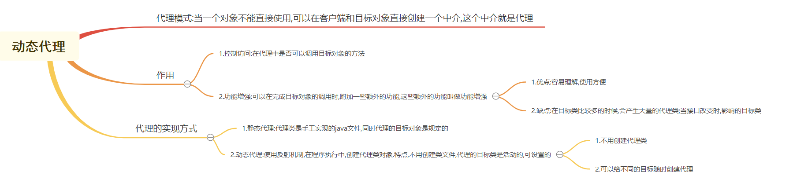

> 动态代理是指**代理类对象**在程序运行时由 **JVM** 根据**反射**机制**动态**生成的。动态代理**不需要定义代理类的 .java 源文件**，<u>可以动态地指定要代理目标类</u>。 
>
> **动态**代理其实就是 **jdk 运行期间**，动态创建 class 字节码并加载到 JVM。 
>
> 换句话说：动态代理是一种创建 java 对象的能力，让你不用创建 TaoBao 类就能创建代理类对象，除去了中间商。（跳过代理类获得代理类对象）
>
> 动态代理的实现方式常用的有两种：使用 **JDK 动态代理**，与通过 **CGLIB 动态代理**。


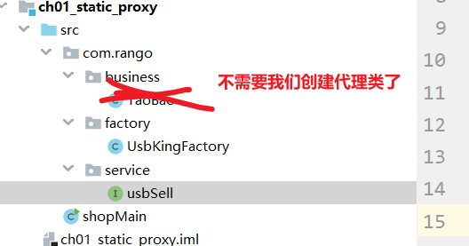


**动态代理的实现：**

> 1. **jdk 动态代理**（理解）：使用 **java 反射包**中的类和接口实现动态代理的功能，反射包 **java.lang.reflect**，里面有三个类：**InvocationHandler**、**Method**、**Proxy**
> 2. **cglib 动态代理**（了解）：cglib 是**第三方的工具库**，用于创建代理对象
>    1. cglib 的原理是**继承**，cglib 通过创建继承于目标类的子类，在子类中重写父类中同名的方法，实现功能的修改。
>    2. 因为 cglib 是继承，重写方法，所以要求**目标类不能是 final 修饰的，方法也不能是 final 修饰的**。cglib 对目标类的要求比较宽松，只要能被继承就可以了。cglib 在很多的框架中使用，比如mybatis、spring框架中都有所使用。


## 3.2 回顾反射 Method类

先用一个例子回顾一下反射：

HelloService.java 接口：

```java
package com.kaho.service;

public interface HelloService{
    public void sayhello(String name);
}
```

HelloServiceImpl.java 实现类：

```java
package com.kaho.service.impl;

public class HelloServiceImpl implements HelloService{
    @Override
    public void sayhello(String name){
        system.out.println("你好！" + name);
    }
}
```

测试类：

```java
package com.kaho;

import com.kaho.Impl.HelloServiceImpl;
import com.kaho.service.HelloService;

import java.lang.reflect.InvocationTargetException;
import java.lang.reflect.Method;

public class TestApp {
    public static void main(String[] args) throws NoSuchMethodException, InvocationTargetException, IllegalAccessException {
//        HelloService service = new HelloServiceImpl();
//        service.sayhello("张三");
		//以上是常规方法执行sayhello方法
		
        //下面使用反射机制创建sayhello方法,核心：Method(类中的方法)
        HelloServiceImpl target = new HelloServiceImpl();
		/**
		*   获取与sayhello名称对应的Method类对象,通过接口的.class对象调用:
		*   public Method getMethod(String name, Class<?>... parameterTypes)
		*   name : 是一个String，它指定了所需方法的简单名称
		*   parameterTypes : 以声明顺序标识方法的形式参数类型的类对象的数组
        */
        Method method = HelloService.class.getMethod("sayhello", String.class);
		//通过method可以执行sayhello方法的调用
        /**
        *  public Object invoke(Object obj, Object... args)
        *       表示执行方法的调用
        *   参数:
        *       1.Object obj : 表示对象，目的是要执行这个(接口实现类)对象的方法
        *       2.Object...args : 方法执行时的传入的参数值
        * 	返回值:
        *       Object : 方法执行后的返回值
        */
        Object ret = method.invoke(target, "李四");
    }
}
```

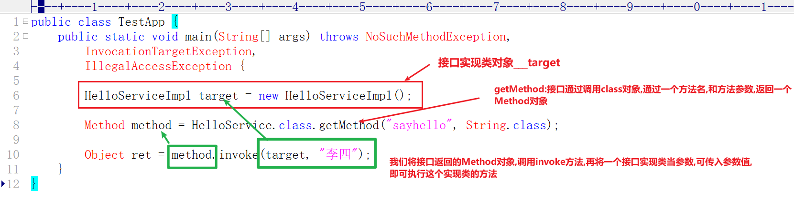


> **Method类的结构图**
>
> - Class Method
>   - java.lang.Object
>     - java.lang.reflect.AccessibleObject
>       - java.lang.reflect.Executable
>         - java.lang.reflect.Method


## 3.3 JDK 动态代理（理解）

jdk 动态代理是基于 Java 的**反射**机制实现的。使用 **jdk 中接口和类**实现代理对象的动态创建。

**Jdk 的动态要求目标对象必须实现接口，这是 java 设计上的要求。** 

从 jdk1.3 以来，java 语言通过 java.lang.reflect 反射包提供三个类支持代理模式 Proxy, Method 和 InovcationHandler。 


### 3.3.1 InvocationHandler 接口

```java
public interface InvocationHandler
```

**InvocationHandler 接口**叫做**调用处理器**，负责完成调用目标方法，并增强功能。 

通过**代理对象**执行目标接口中的方法，会把方法的调用分派给调用处理器 (InvocationHandler)的**实现类**，执行实现类中的 **invoke()** 方法，我们需要把**代理类要完成的功能**写在 invoke() 方法中 。

```java
public Object invoke(Object proxy, Method method, Object[] args) throws Throwable;
        proxy：jdk在运行时创建的代理对象，在方法中直接使用
        method：代表目标方法，jdk提供的Method类对象
        args：代表目标方法的参数，jdk运行时赋值的
     //以上三个参数都是 jdk 运行时赋值的，无需程序员给出。
        Throwable处理代理实例上的方法调用并返回结果
```

在 invoke 方法中可以截取对目标方法的调用，在这里进行功能增强。**实现了 InvocationHandler 接口的类**用于**加强目标类的主业务逻辑**。这个接口中有一个方法 invoke()，具体加强的代码逻辑就是定义在该方法中的。**通过代理对象执行接口中的方法时，会自动调用 invoke()方法。** 

当在代理对象上调用方法时，方法调用将被编码并分派到其**调用处理程序**（实现了 InvocationHandler 接口的类）的 invoke() 方法。

> InvocationHandler 接口：表示你的代理要干什么。
> 		怎么用： 1.创建类实现接口 InvocationHandler
> 		          	  2.重写 invoke() 方法， 把原来静态代理中代理类要完成的功能写在其中。


### 3.3.2 Method类

Method类：表示方法的，确切地说就是目标类中的方法。

作用：通过 **Method** 中的 **invoke()** 方法可以执行某个目标类的目标方法，`Method.invoke();`

> 这两个 invoke()方法，虽然同名，但无关。

```java
public Object invoke (Object obj, Object...args)  
    obj：表示目标对象 
	args：表示目标方法参数，就是其上一层（InvocationHandler中）invoke方法的第三个参数 
    
	该方法的作用是：调用执行obj对象所属类的方法，这个方法由其调用者Method对象确定。 

    在代码中，一般的写法为 method.invoke(target, args); 
	其中，method为上一层（InvocationHandler中）invoke方法的第二个参数。这样即可调用目标类的目标方法。 

Object ret= method.invoke(target,"李四")
内部是调用了目标方法
```

说明：method.invoke() 就是用来执行目标方法的，等同于静态代理中的

```java
   		//向厂家发送订单,告诉厂家,我买了U盘,厂家发货
    	//发送给工厂,我需要的订单,返回报价
        float price = factory.sell(amount);
```


### 3.3.3 Proxy类

proxy类：核心的对象，创建代理对象。之前创建对象都是 new 类的构造方法()
	       现在我们是使用Proxy类的方法，代替new的使用。 
方法： 静态方法 newProxyInstance() 
作用是：依据目标对象、业务接口及调用处理器三者，自动生成一个动态代理对象。

>  等同于静态代理中的 TaoBao taoBao = new TaoBao();

```java
public static Object newProxyInstance( ClassLoader loader,Class<?>[] interfaces, InvocationHandler h)  throws IllegalArgumentException
```

     参数：
    	 1.ClassLoader loader : 目标类的类加载器，负责向内存中加载对象的。使用反射机制获取对象的ClassLoader
    	  如何获取？  类a , a.getCalss().getClassLoader(),  目标对象的类加载器
    	  每一个类都继承Object类,在Object中有一个getClass方法,表示 类对象的运行时类的Class对象。而Class类里面有一个public ClassLoader getClassLoader()方法
         2.Class<?>[] interfaces : 目标类实现的接口数组，通过目标对象的反射可获取
         3.InvocationHandler h : 我们自己写的调用处理器，代理类要完成的功能。 
    
    	返回值 : 就是代理对象


## 3.4 JDK 动态代理的实现

> jdk 动态代理是代理模式的一种实现方式，其只能代理**接口**。 

**实现步骤** 

1、新建一个接口，作为目标接口 ，在其中声明目标类要完成的方法（功能）

2、为接口创建一个实现类，这是目标类 

3、创建 java.lang.reflect.InvocationHandler 接口的实现类，在 invoke() 方法中完成代理类的功能：

```
1.调用目标方法
2.增强功能
```

4、使用 Proxy.newProxyInstance() 方法创建动态代理对象，并把返回值强制转为接口类型。 


> 在 idea 中创建 java project 
>
> 工程名称：ch02_dynamic_proxy

### 1）定义目标接口

新建一个接口，作为目标接口 ，在其中声明目标类要完成的方法（功能）

```java
package com.kaho.service;

public interface UsbSell {
    float sell(int amount);
}
```

### 2）定义目标接口实现类 

为接口创建一个实现类，这是目标类 

```java
package com.kaho.factory;

import package com.kaho.service.UsbSell;

//金士顿厂商(目标类)
public class UsbKingFactory implements UsbSell {
    //目标方法
    @Override
    public float sell(int amount) {
        System.out.println("目标类中,执行了sell目标方法");
        //u盘代理商在厂商购买u盘的价格，目前先假定只购买一个u盘
        return 85.0f;
    }
}
```

### 3）定义调用处理程序

创建 java.lang.reflect.InvocationHandler 接口的实现类，在 invoke() 方法中完成代理类的功能：

```
1.调用目标方法
2.增强功能
```

先创建好实现类：

```java
public class MyHandle implements InvocationHandler {
    @Override
    public Object invoke(Object proxy, Method method, Object[] args) throws Throwable {
        return null;
    }
}
```

在之前的静态代理的实现方法上进行修改：

```java
//之前的代理类
//淘宝是一个商家,代理金士顿厂家U盘的销售
public class TaoBao implements usbSell {
	//声明 商家代理的厂家 具体是谁
    private UsbKingFactory factory =new UsbKingFactory();

    @Override
	//实现销售U盘功能
    public float sell(int amount) {
		//向厂家发送订单,告诉厂家,我买了U盘,厂家发货
		//发送给工厂,我需要的订单,返回报价
        float price = factory.sell(amount);
		//商家需要加价也就是代理要增加价格(功能增强)
        price = price + 25;//在单价之上增加25元作为利润
		//在目标类的方法调用后,你做的其他功能,都是增强的意思
        System.out.println("淘宝给你返回一个优惠券\红包");
		//增加后的价格
        return price;
    }
}
```

需要注意的重要细节：

```java
//需要创建有参构造器，参数是目标对象。为的是完成对目标对象的方法调用
	//传入是谁的对象,就给谁创建代理
    public MyHandle(Object target) {
        this.target = target;
    }

invoke里面的设置
    Object res =null;
    //向厂家发送订单,告诉厂家,我买了U盘,厂家发货
    //发送给工厂,我需要的订单,返回报价
//    float price = factory.sell(amount);
    res = method.invoke(target,args);//待执行的目标方法,执行后返回值
```

最后得到完整的调用处理程序：

```java
package com.kaho.handler;

import java.lang.reflect.InvocationHandler;
import java.lang.reflect.Method;

//必须实现InvocationHandler接口，来完成代理类要做的功能(1.调用目标方法 2.功能增强)
public class MyHandler implements InvocationHandler{
    
    private Object target = null;//外面传进来的目标对象
    
    //动态代理：目标对象是活动的，不是固定的，需要传入进来。
    //传入是哪个目标类的对象,就给它创建代理
    public MyHandle(Object target) {
        //给目标对象赋值
        this.target = target;
    }
    
    @Override
    public Object invoke(Object proxy, Method method, Object[] args) throws Throwable {
        
        Object res = null;
        //向厂家发送订单,告诉厂家,我买了U盘,厂家发货
		//发送给工厂,我需要的订单,返回报价
//        float price = factory.sell(amount);
        res = method.invoke(target, args);//执行目标方法
        
		//商家需要加价也就是代理要增加价格(功能增强)
//        price = price + 25;//在单价之上增加25元作为利润
        if(res != null){
            float price = (float)res;
            price =price + 25;
            res = price;
        }
        
		//在目标类的方法调用后,你做的其他功能,都是增强的意思
        System.out.println("淘宝给你返回一个优惠券\红包");
		//增加后的价格
//        return price;
        return res;
    }
}
```

### 4）创建动态代理对象

使用 Proxy.newProxyInstance() 方法创建动态代理对象，并把返回值强制转为接口类型。 

> 创建一个MainShop类.

```java
package com.kaho;

import com.kaho.service;
import java.lang.reflect.InvocationHandler;
import java.lang.reflect.Proxy;

public class MainShop {
    public static void main(String[] args){ 
		//创建对象,使用Proxy
		//1.创建目标对象
        //UsbKingFactory factory = new UsbKingFactory();
        UsbSell factory = new UsbKingFactory();
		//2.创建Invocationhandler对象
        InvocationHandler handle = new MyHandle(factory);

		//3.创建代理对象
        UsbSell proxy = (UsbSell) Proxy.newProxyInstance(factory.getClass().getClassLoader(), factory.getClass().getInterfaces(), handle);
		//4.通过代理对象执行业务方法
        float price = proxy.sell(1);
        System.out.println("通过动态代理对象,调用方法:" +price);
    }
}
```

```
目标类中,执行了sell目标方法
淘宝给你返回一个优惠券\红包
通过动态代理对象,调用方法:110.0
```


## 3.5 JDK 动态代理的执行流程

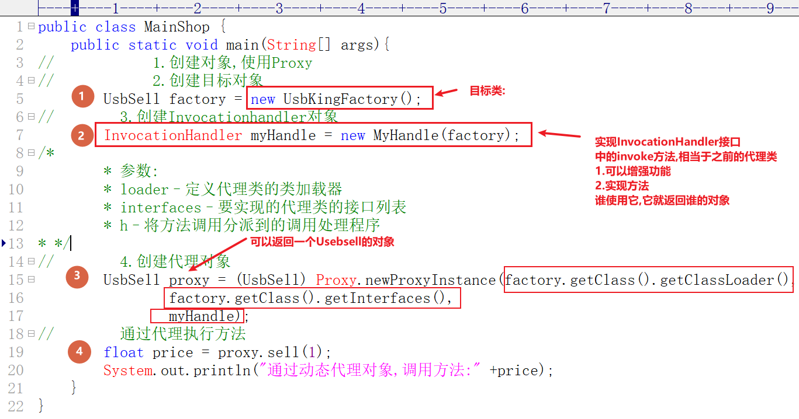

此时对程序进行 debug，在 InvocationHandler 实现类中重写的 invoke() 方法中打一个断点
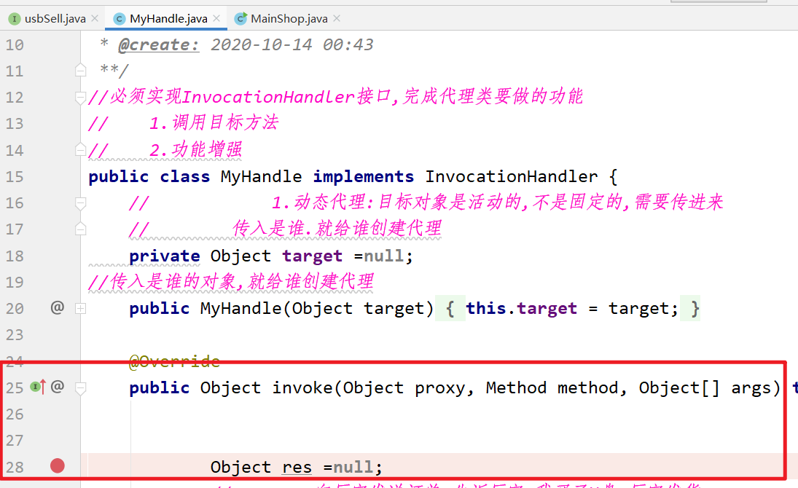


此时再观察，代理对象MyHandler里面的invoke方法的参数

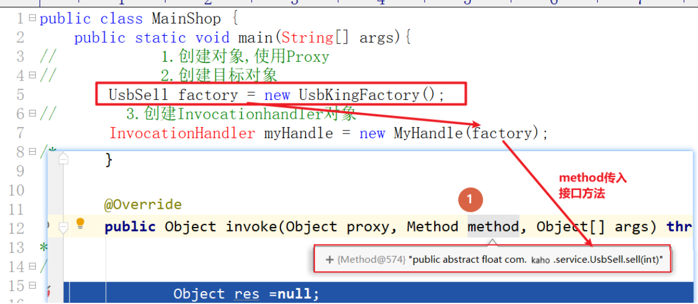


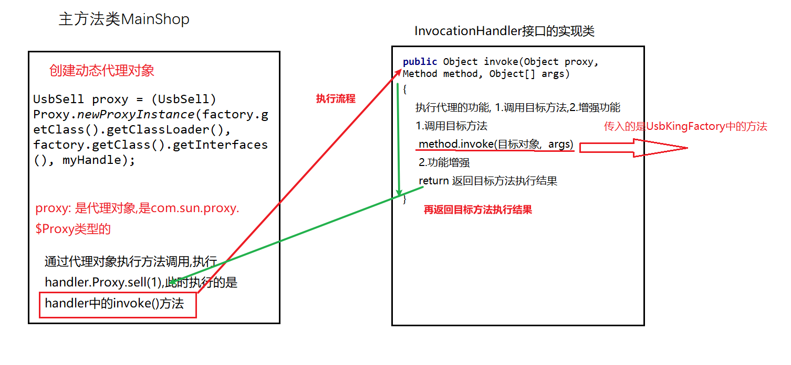


## 3.6 CGLIB 动态代理（了解）

> CGLIB(Code Generation Library)是一个开源项目。是一个强大的，高性能，高质量的 Code 生成类库，它可以在运行期扩展 Java 类与实现 Java 接口。它广泛的被许多 AOP 的框架使用，例如 Spring AOP。 
>
> 使用 JDK 的 Proxy 实现代理，要求目标类与代理类实现相同的接口。若目标类不存在 接口，则无法使用该方式实现。 
>
> 但对于无接口的类，要为其创建动态代理，就要使用 CGLIB 来实现。CGLIB 代理的生成原理是生成目标类的子类，而子类是增强过的，这个子类对象就是代理对象。所以，使用 CGLIB 生成动态代理，要求目标类必须能够被继承，即不能是 final 的类。 
>
> cglib 经常被应用在框架中，例如 Spring ，Hibernate 等。Cglib 的代理效率高于 Jdk。对于 cglib 一般的开发中并不使用，做了一个了解就可以。


