# 设计模式

[toc]

## 一、什么是设计模式
### 1. 设计模式的概念

设计模式是一个通过定义、使用、测试去解决特定问题的方法，是**针对软件设计中在给定条件下会重复性发生的问题而提出的一种通用性的可重用解决方案**，设计模式不是可以直接转化为代码的完整设计，它是用于描述在不同情况下解决问题的通用方案。


### 2. 设计模式的作用
设计模式通过提供经过验证的行之有效的开发范式**加快开发过程，预防重大的隐患问题，提高代码可读性。**


## 二、设计模式的分类

**这里主要讨论GoF所提出的23种设计模式，可将其分为三种类型：**

1. **创造型设计模式**
1. **结构型设计模式**
1. **行为型设计模式**
### 1. 创造型设计模式
注重完成**对象的实例化**，相比于直接实例化对象，根据实际情况选择合适的设计模式完成对象的实例化，可以为复杂的业务场景带来更高的灵活性。

创造型设计模式主要包括以下几种：

1. 抽象工厂设计模式
1. 生成器设计模式
1. 工厂方法设计模式
1. 原型设计模式
1. 单例设计模式
### 2. 结构型设计模式
结构型设计模式用于指导我们完成**对代码的结构划分**，如此，代码结构会更加清晰，更易理解，也提高了软件的可维护性。

结构型设计模式主要包括以下几种：

1. 适配器设计模式
1. 桥接设计模式
1. 组合设计模式
1. 装饰设计模式
1. 门面设计模式
1. 享元设计模式
1. 代理设计模式
### 3. 行为型设计模式
行为型设计模式主要用于**定义对象之间的通信与流程控制**，主要的设计模式都非常注重优化对象之间的数据交互方式。

行为型设计模式主要包括以下几种：

1. 责任链设计模式
1. 命令设计模式
1. 解释器设计模式
1. 迭代器设计模式
1. 中介者设计模式
1. 备忘录设计模式
1. 观察者设计模式
1. 策略设计模式
1. 状态设计模式
1. 模板方法设计模式
1. 访问者设计模式


## 三、学习设计模式需要掌握什么

- 模式名称是什么？
- 模式类型是什么？是创造型，结构型，还是行为型？
- 模式的目的是什么？（作用是什么？解决了什么问题？）
- 什么情况下使用该模式？
- 该模式的基本示例。
- 该模式的 UML 图是什么样的？是类图还是交互图？
- 都有哪些对象在模式中参与活动？列出设计模式中使用的类和对象，并说明他们各自的角色。
- 模式中的类和对象是怎么进行交互的？
- 通过应用设计模式能获取什么好处，有哪些坏处？如何权衡？
- 如何实现该模式？
- 与该模式相近的设计模式是什么？这几种相近的模式有哪些异同点？


## 四、正确看待设计模式

恰当使用设计模式能够提高代码的复用性，但是由于复用性往往会引入封装与间接调用，这些会降低系统性能，增加代码复杂程度。因此，**除非设计模式能够帮助我们完成代码的实现或者后续的维护工作，否则没有必要去引入设计模式。**

学习设计模式的关键并不在于学习设计模式本身，而是在于识别应用场景与潜在的风险，并将设计模式用之有道，这般，设计模式才能算作得心应手的工具。
在没有必要的情况大可不必去使用设计模式，因为设计模式有可能会牺牲代码的简洁性，而且滥用设计模式多会引入新的问题却没有解决原来的问题。

**保持代码的整洁，模块化和可读性，同时不要让各类之间过度耦合。**


## **五、创造型设计模式**

创造型设计模式主要**关注的是类的实例化**，也就是说**体现的是对象的创建方法**，利用这些模式，我们可以在适当的情况下以适当的形式创建对象，创造型设计模式通过控制对象的创建来解决设计中的问题。

创造型设计模式主要包含以下子类别：

1. **对象创造型设计模式**：主要完成对象创建，并将对象中部分内容放到其他对象中创建。

2. **类创造型设计模式**：主要完成类的实例化，并将类中的部分对象放到子类中创建，此类模式在实例化过程中高效地利用了继承机制。


创造型设计模式主要包含以下 **5 种** 具体的设计模式：

1. **抽象工厂设计模式**

   提供一个用于创建相关对象或相互依赖对象的接口，无需指定对象的具体类。

2. **生成器设计模式**

   将复杂对象的构建与其表示相互分离，使得同样的构建过程可以创建不同的表示。

3. **工厂方法设计模式**

   允许在子类中实现本类的实例化类。

4. **原型设计模式**

   使用一个原型实例来指定创建对象的种类，然后通过拷贝这些原型实现新对象的创建。

5. **单例模式**

   确保某个类在系统中仅有一个实例，并提供一个访问它的全局访问点。


| 对象创造型设计模式 | 类创造型设计模式 |
| :----------------: | :--------------: |
|  抽象工厂设计模式  | 工厂方法设计模式 |
|   生成器设计模式   |                  |
|    原型设计模式    |                  |
|    单例设计模式    |                  |


### **1. 简单工厂**

简单工厂实际不能算作一种设计模式，它引入了创建者的概念，将实例化的代码从应用代码中抽离，在创建者类的静态方法中只处理创建对象的细节，后续创建的实例如需改变，只需改造创建者类即可；但由于使用静态方法来获取对象，使其不能在运行期间通过不同方式去动态改变创建行为，因此存在一定局限性。

#### 1.1 模式中包括的类

1. **工厂类角色**：这是本模式的核心，含有一定的商业逻辑和判断逻辑。在java中它往往由一个具体类实现。
2. **抽象产品角色**：它一般是具体产品继承的父类或者实现的接口。在java中由接口或者抽象类来实现。
3. **具体产品角色**：工厂类所创建的对象就是此角色的实例。在java中由一个具体类实现。

#### 1.2 基本示例

这里以制造coffee的例子开始工厂（简单工厂、工厂方法、抽象工厂）模式设计。

我们知道coffee只是一种泛举，在点购咖啡时需要指定具体的咖啡种类：美式咖啡、卡布奇诺、拿铁等等。

```java
/**
 * 拿铁、美式咖啡、卡布奇诺等均为咖啡家族的一种产品
 * 咖啡则作为一种抽象概念，用抽象类描述——产品类
 */
public abstract class Coffee {
    //获取coffee名称
    public abstract String getName(); 
}

/**
 * 美式咖啡——具体产品类
 */
public class Americano extends Coffee {
    @Override
    public String getName() {
        return "美式咖啡";
    }
}

/**
 * 卡布奇诺——具体产品类
 */
public class Cappuccino extends Coffee {
    @Override
    public String getName() {
        return "卡布奇诺";
    }
}

/**
 * 拿铁——具体产品类
 */
public class Latte extends Coffee {
    @Override
    public String getName() {
        return "拿铁";
    }
}
```

下面代码具体展示了简单工厂下如何创建不同的咖啡实例：

```java
/**
 * 简单工厂--用于创建不同类型的咖啡实例
 */
public class SimpleFactory {
    /**
     * 通过类型获取Coffee实例对象
     * @param type 咖啡类型的字符串
     * @return 具体类型的咖啡实例
     */
    public static Coffee createInstance(String type){
        if("americano".equals(type)){
            return new Americano();//美式
        }else if("cappuccino".equals(type)){
            return new Cappuccino();//卡布奇诺
        }else if("latte".equals(type)){
            return new Latte();//拿铁
        }else{
            throw new RuntimeException("type["+type+"]类型不可识别，没有匹配到可实例化的对象！");
        }
    }
    
    //测试
    public static void main(String[] args) {
        Coffee latte = SimpleFactory.createInstance("latte");
        System.out.println("创建的咖啡实例为:" + latte.getName());
        Coffee cappuccino = SimpleFactory.createInstance("cappuccino");
        System.out.println("创建的咖啡实例为:" + cappuccino.getName());
    }
}
```

#### 1.3 优缺点

在Java中 `java.text.DateFormat` 就是简单工厂模式的典型案例。

- **优点**：专门定义一个工厂类负责创建其他类的实例，最大的优点在于工厂类中包含了必要的逻辑，根据客户需要的条件动态实例化相关的类。
- **缺点**：当需要增加一种产品时，比如 `摩卡(Mocha)` 就需要修改简单工厂类 SimpleFactory（增加 `if-else` 块），这违背了开闭原则。 

**TIPS：**

其实如果采用反射机制实现简单工厂并没有违背开闭原则。

利用反射机制，将简单工厂类改成： 

```java
public class SimpleFactory {
    public IProduct produce(Class<? extends Coffee> c) throws Exception {
        return (Coffee)Class.forName(c.getName()).newInstance();
//        return (Coffee)c.newInstance();        //或者采用这种方法
    }
}
```


### **2. 工厂方法设计模式**

工厂方法模式是简单工厂模式的进一步抽象化和推广，工厂方法模式里**不再只由一个工厂类决定哪一个产品类应当被实例化，这个决定被交给抽象工厂的子类去做**。即：定义了一个创建对象的接口，但由其子类决定要实例化的产品类是哪一个，**工厂方法让类把实例化推迟到了子类。** 

#### 2.1 模式中包括的类

- **抽象产品类（Product）**：是具体产品继承的父类或者实现的接口。在 java 中一般由抽象类或者接口来实现。
- **具体产品类（ Concrete Product）**：继承或实现了抽象产品类。具体工厂角色所创建的对象就是此角色的实例。在 java 中由具体的类来实现。 
- **工厂类（ Creator，因为由它来创建产品类，所以叫作工厂类）**：这是工厂方法模式的核心，它与应用程序无关。是具体工厂角色必须实现的接口或者必须继承的父类。在 java 中它由抽象类或者接口来实现。其中声明的工厂方法，返回一个产品类对象。
- **具体工厂类（ Concrete Creator）**：它含有和具体业务逻辑有关的代码。由应用程序调用以创建对应的具体产品的对象。 

#### 2.2 UML图

 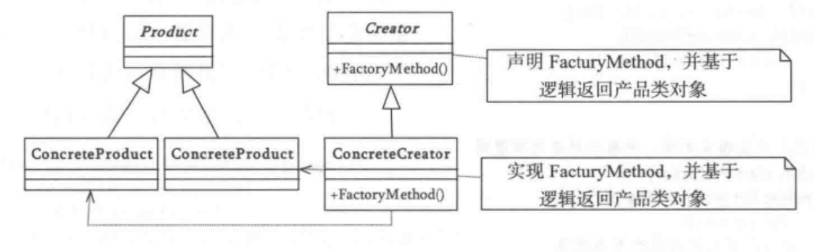 

#### 2.3 功能及应用场景

- 当需要创建一个类，而在编程时不能确定这个类的类型时（需要运行时确定）。
- 当一个类希望由其子类来指定所创建对象的具体类型时。
- 当我们想要定位被创建类，并获取相关信息时。

#### 2.4 基本示例

继续根据上面简单工厂的例子进行场景延伸：不同地区咖啡工厂受制于环境、原料等因素的影响，制造出的咖啡种类有限。中国咖啡工厂仅能制造卡布奇诺、拿铁，而美国咖啡工厂仅能制造美式咖啡、拿铁。 

```java
/**
 * 定义一个抽象的咖啡工厂——工厂类
 */
public abstract class CoffeeFactory { 
    /**
     * 生产该工厂可制造的咖啡
     * @return 该工厂可制造的具体类型咖啡实例 数组
     */
    public abstract Coffee[] createCoffee();
}


//中国咖啡工厂——具体工厂类
public class ChinaCoffeeFactory extends CoffeeFactory {
    @Override
    public Coffee[] createCoffee() {
        // TODO Auto-generated method stub
        return new Coffee[]{new Cappuccino(), new Latte()};//卡布奇诺、拿铁
    }
}

//美国咖啡工厂——具体工厂类
public class AmericaCoffeeFactory extends CoffeeFactory {
    @Override
    public Coffee[] createCoffee() {
        // TODO Auto-generated method stub
        return new Coffee[]{new Americano(), new Latte()};//美式咖啡、拿铁
    }
}

/**
 * 工厂方法测试
 */
public class FactoryMethodTest {
	//打印工厂可生产的咖啡
    static void print(Coffee[] c){
        for (Coffee coffee : c) {
            System.out.println(coffee.getName());
        }
    }
    
    public static void main(String[] args) {
        CoffeeFactory chinaCoffeeFactory = new ChinaCoffeeFactory();//创建具体工厂
        Coffee[] chinaCoffees = chinaCoffeeFactory.createCoffee();
        System.out.println("中国咖啡工厂可以生产的咖啡有：");
        print(chinaCoffees);
        
        CoffeeFactory americaCoffeeFactory = new AmericaCoffeeFactory();//创建具体工厂
        Coffee[] americaCoffees = americaCoffeeFactory.createCoffee();
        System.out.println("美国咖啡工厂可以生产的咖啡有：");
        print(americaCoffees);
    }
}
```

 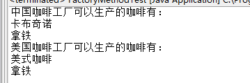 

#### 2.5 优缺点

工厂方法模式和简单工厂模式在定义上的不同是很明显的。工厂方法模式的核心是一个抽象工厂类，而不像简单工厂模式，把核心放在一个实类上。工厂方法模式可以允许很多实的工厂类从抽象工厂类继承下来，从而可以在实际上成为多个简单工厂模式的综合，从而推广了简单工厂模式。

工厂方法相比于简单工厂模式的优点是**增加一个产品，只需要增加一个具体工厂类和具体产品类，没有修改原先的抽象工厂类，符合开闭原则**。缺点是**客户端的代码会需要修改（简单工厂模式的客户端不需要修改），随着产品的继续增加，所要实现的类的个数也会随之增多**。 


### **3. 抽象工厂设计模式**
在抽象工厂模式中，抽象产品 (AbstractProduct) 可能是一个或多个，从而构成一个或多个产品族(Product Family)。在只有一个产品族的情况下，抽象工厂模式实际上退化到工厂方法模式。 

抽象工厂模式相比于工厂方法模式的**抽象层次更高**。这意味着**抽象工厂返回的是一组类的工厂**。与工厂方法模式类似（返回多个子类中的一个），此方法会返回一个工厂，而这个工厂会返回多个子类中的一个。**简单来说，抽象工厂是一个工厂对象，该对象又会返回若干工厂中的一个。（工厂的工厂）**

工厂模式是创造型模式的典型示例。抽象工厂设计模式是工厂方法模式的扩展，从而使我们无须担心所创建对象的实际类就能够创建对象。抽象工厂模式扩展了工厂方法模式，允许创建更多类型的对象。

#### 3.1 模式中包括的类

- **抽象工厂（AbstractFactory）**声明一个用于完成抽象产品对象创建操作的接口。
- **具体工厂（ConcreteFactory）**实现创建具体产品对象的操作。
- **抽象产品（AbstractProduct）**声明一个用于一类产品对象的接口。
- **具体产品（ConcreteProduct）**定义由相应的具体工厂来创建的产品对象。
- **客户端（Client）**使用由抽象工厂和抽象产品类声明的唯一接口。

#### 3.2 UML图
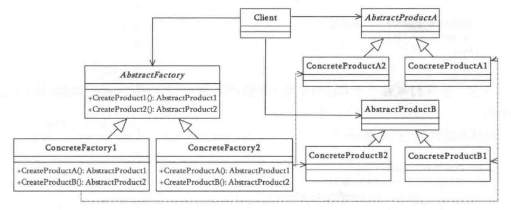
#### 3.3 功能及应用场景
抽象工厂模式的主要优点之一是**它屏蔽了这些具体类的创建方法**。实际应用的类名称不需要再让客户端（将客户端与具体类解耦）知道。由于具体类是屏蔽的，因此我们可以在不同的工厂（实现方法）之间进行切换。

#### 3.4 基本示例

在上述的场景上继续延伸：咖啡工厂做大做强，引入了新的饮品种类：茶、 碳酸饮料。中国工厂只能制造咖啡和茶，美国工厂只能制造咖啡和碳酸饮料。

如果用上述工厂方法方式，除去对应的产品实体类还需要新增2个抽象工厂（茶制造工厂、碳酸饮料制造工厂），4个具体工厂实现。随着产品的增多，会导致类数量激增。

所以这里引出一个概念——产品家族，在此例子中，不同的饮品就组成我们的饮品家族， 饮品家族开始承担创建者的责任，负责制造不同的产品。

```java
/**
 * 抽象的饮料产品家族制造工厂
 */
public interface AbstractDrinksFactory {
    //制造咖啡
    Coffee createCoffee();    
    //制造茶
    Tea createTea();
    //制造碳酸饮料
    Sodas createSodas();
}

/**
 * 中国饮品工厂
 * 制造咖啡与茶，无法制造碳酸饮料
 */
public class ChinaDrinksFactory implements AbstractDrinksFactory {
    @Override
    public Coffee createCoffee() {
        // TODO Auto-generated method stub
        return new Latte(); //返回拿铁实例
    }

    @Override
    public Tea createTea() {
        // TODO Auto-generated method stub
        return new MilkTea(); //返回奶茶实例
    }

    @Override
    public Sodas createSodas() {
        // TODO Auto-generated method stub
        return null; //无法生产碳酸饮料
    }
}

/**
 * 美国饮品制造工厂
 * 制造咖啡和碳酸饮料
 */
public class AmericaDrinksFactory implements AbstractDrinksFactory {
    @Override
    public Coffee createCoffee() {
        // TODO Auto-generated method stub
        return new Latte(); //返回拿铁实例
    }

    @Override
    public Tea createTea() {
        // TODO Auto-generated method stub
        return null; //无法生产茶
    }

    @Override
    public Sodas createSodas() {
        // TODO Auto-generated method stub
        return new CocaCola(); //返回可乐实例
    }
}

/**
 * 抽象工厂测试类
 */
public class AbstractFactoryTest {
    //打印具体工厂能生产的产品
    static void print(Drink drink){
        if(drink == null){
            System.out.println("产品：--" );
        }else{
            System.out.println("产品：" + drink.getName());
        }
    }
    
    public static void main(String[] args) {
        AbstractDrinksFactory chinaDrinksFactory = new ChinaDrinksFactory();//中国工厂
        Coffee coffee = chinaDrinksFactory.createCoffee();
        Tea tea = chinaDrinksFactory.createTea();
        Sodas sodas = chinaDrinksFactory.createSodas();
        System.out.println("中国饮品工厂有如下产品：");
        print(coffee);
        print(tea);
        print(sodas);
        
        AbstractDrinksFactory americaDrinksFactory = new AmericaDrinksFactory();//美国工厂
        coffee = americaDrinksFactory.createCoffee();
        tea = americaDrinksFactory.createTea();
        sodas = americaDrinksFactory.createSodas();
        System.out.println("美国饮品工厂有如下产品：");
        print(coffee);
        print(tea);
        print(sodas);
    }
}
```

 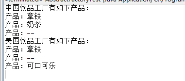 

#### 3.5 优缺点

- **优点**：抽象工厂模式除了具有工厂方法模式的优点外，最主要的优点就是**可以在类的内部对产品族进行约束**。所谓的产品族，一般或多或少的都存在一定的关联，抽象工厂模式就可以在类内部对产品族的关联关系进行定义和描述，而不必专门引入一个新的类来进行管理。
- **缺点**：产品族的扩展将是一件十分费力的事情，假如产品族中需要增加一个新的产品，则几乎所有的工厂类都需要进行修改。所以使用抽象工厂模式时，对产品等级结构的划分是非常重要的。

#### 3.6 工厂方法模式 VS 抽象工厂模式

- **工厂方法模式**：一个抽象产品类，可以派生出多个具体产品类。每个具体工厂类只能创建一个具体产品类的实例。
- **抽象工厂模式**：多个抽象产品类，每个抽象产品类可以派生出多个具体产品类。一个抽象工厂类可以派生出多个具体工厂类。每个具体工厂类可以创建多个具体产品的实例。

**区别**：工厂方法模式只有一个抽象产品类，而抽象工厂模式有多个。工厂方法模式的具体工厂类只能创建一个具体产品类的实例，而抽象工厂模式可以创建多个。 


### 4. 生成器设计模式
生成器模式，能够从简单的对象一步一步生成复杂的对象。生成器模式是一种用来逐步构建复杂对象并在最后一步返回对象的创造型模式。
构造一个对象的过程是通过泛型实现的，以便它能够用于对同一对象创建不同的表示形式。
#### 4.1 模式中包括的类

- 生成器类（ Builder）提供一个接口用于创建产品的各个组成部件。具体生成器（Concrete Builder）提供此接的实现。
- 具体生成器（ ConcreteBuilder）会跟踪其所创建对象的表现形式，并在创建对象的同时提供一个接口获取产品（Product）。
- 导演类（ Director）通过生成器提供的接口构造对象。产品类用于表示被构造的复杂对象。这包括对我们构建的所有类进行定义。
#### 4.2 UML图
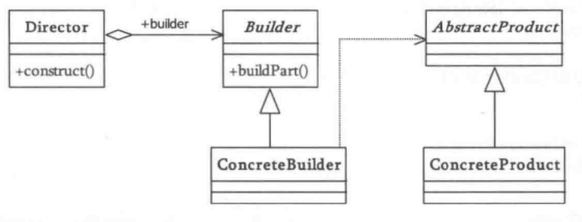
#### 4.3 功能及应用场景
生成器模式隐藏了产品构建过程中的内部细节。各个生成器之间都是相互独立的。这提高了代码的模块化，并使其他的生成器更方便地创建对象。因为每个生成器都能够逐步创建对象，这让我们能够很好地对最终产品进行掌控。


### **5. 单例设计模式**

单例模式（Singleton Pattern），**确保一个类只有一个实例，并提供对它的全局访问点**。 

在应用程序的整个生命周期中，对象只有一个实例的时候，就会使用单例设计模式。单例类总是在第一次被访问时完成实例化，直至应用程序退出之前，都只会使用同一个实例。

单一实例创建策略：**通过限制构造函数（通过设置其为私有）从而限制单例类的实例化。之后在定义类时包含一个该类的静态私有对象，以便创建单例类的实例。**

在单例模式中，最棘手的部分是对单一实例的实现和管理。

在单例模式的定义过程中，有两点需要注意的地方：

- **该类仅允许存在一个实例。**
- **需要为该单一实例提供一个全局访问点。**

单例模式中的主动实例化和被动实例化（饿汉、懒汉）

线程安全的单例：双重同步锁、静态变量、枚举

#### 5.1 模式中包括的类

- 单例类
#### 5.2 UML图
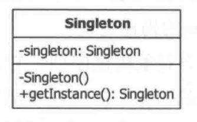
#### 5.3 功能及应用场景
在应用程序的整个生命周期中，对象只有一个实例的时候，就会使用单例设计模式。如：

1. 日志类，对于日志的记录等操作，我们通常使用单例模式
2. 数据库连接和访问的管理
3. 文件资源访问管理
4. 生成唯一的序列号
5. 系统全局唯一的访问端点，例如系统访问请求计数器
6. 对象的创建需要大量的开销或者对象会被频繁调用可以考虑通过单例模式来优化替换

#### 5.4 基本示例

##### （1）饿汉式

饿汉式单例主要体现在一个饿字，也就是说在使用这个对象之前，**在类加载的时候就立即初始化，创建其实例对象**。这样做的好处是**线程安全、使用时速度更快**。饿汉式单例的写法如下： 

**写法一：**

```java
package com.mars.pattern.singleton.hungry;
/**
 * 饿汉式单例写法一
 */
public class HungrySingletonDemo1 {
    //提前实例化的静态私有对象(仅有一个)
    private static final HungrySingletonDemo1 HUNGRY_SINGLETON_DEMO_1 = new HungrySingletonDemo1();
    //构造器私有化，外界无法直接通过构造器创建一个对象
    private HungrySingletonDemo1() {}
    //向外界提供一个全局访问点
    public static HungrySingletonDemo1 getInstance() {
        return HUNGRY_SINGLETON_DEMO_1;
    }
}
```

**写法二：** 

```java
package com.mars.pattern.singleton.hungry;
/**
 * 饿汉式单例写法二（静态代码块）
 */
public class HungrySingletonDemo2 {
    private static final HungrySingletonDemo2 HUNGRY_SINGLETON_DEMO_2;
    //构造器私有化，外界无法直接通过构造器创建一个对象
    private HungrySingletonDemo2() {}
    //使用静态代码块在类加载时实例化一个对象，静态代码块只会执行一次！！！
    static {
        HUNGRY_SINGLETON_DEMO_2 = new HungrySingletonDemo2();
    }
    //向外界提供一个全局访问点
    public static HungrySingletonDemo2 getInstance() {
        return HUNGRY_SINGLETON_DEMO_2;
    }
}
```

饿汉式单例可以**保证线程安全，执行效率高，同时编码简单容易理解**。但是**饿汉式单例只适用于单例对象减少的情况，如果大量编写饿汉式单例不仅会给系统启动带来负担，也可能会导致内存的浪费，比如创建的单例对象在程序运行过程中并未使用**。因此这对内存浪费这个问题，我们衍生出了懒汉式单例。 


##### （2）懒汉式

懒汉式单例主要体现在一个懒字，也就是说**类加载的时候我懒得实例化，等你需要用了再说吧**！接下来的懒汉式单例中通过一步步的优化和推翻来演进如何编写一个优秀的单例。 

***

**版本一：线程不安全**

```java
package com.mars.pattern.singleton.lazy;
/**
 * 简单懒汉式单例示例代码1 (线程不安全)
 */
public class LazySingletonDemo1 {
    private static LazySingletonDemo1 LAZY_SINGLETON = null;
    private LazySingletonDemo1() {}
    public static LazySingletonDemo1 getInstance() {
        if (LAZY_SINGLETON == null) {
            LAZY_SINGLETON = new LazySingletonDemo1();
        }
        return LAZY_SINGLETON;
    }
}
```

这是一个非常普通的懒汉式单例模式的写法，但其实这是一种错误的线程不安全的写法。下面通过一个断点测试来证明其不安全，采用的是IDEA编写代码，通过设置断点为 Thread 模式来使得线程1和线程2同时满足 `LAZY_SINGLETON == null`。 

**测试代码:**

```java
package com.mars.pattern.singleton.lazy;
/**
 * 测试懒汉式单例1的线程不安全
 */
public class LazySingletonTest {
    public static void main(String[] args) {
        new Thread(() -> run(), "Thread-1").start();
        new Thread(() -> run(), "Thread-2").start();
        System.out.println("End of test..."); 
    }
    public static void run() {
        LazySingletonDemo1 lad = LazySingletonDemo1.getInstance();
        System.out.println(Thread.currentThread().getName() + " : " + lad);
    }
}
```

断点设置如下图，右键打在 `LAZY_SINGLETON == null` 的断点上，选择 Suspend 为 `Thread`，然后点击 Done 即可。 

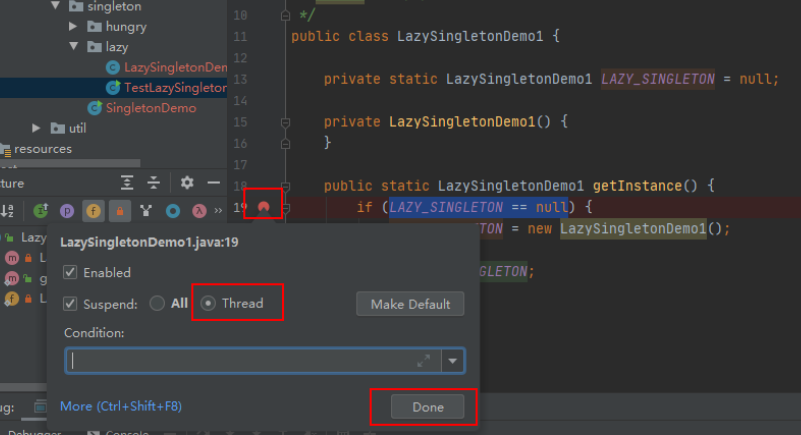 

调试过程，我们执行测试代码，使其两个线程均执行到 `LAZY_SINGLETON == null`，然后 F8 使得线程1进入`if`语句；切换至线程2按 F8 进入`if`语句，此时我们的目的便达到了（在实际的并发使用场景中，这种情况是非常可能出现的） 

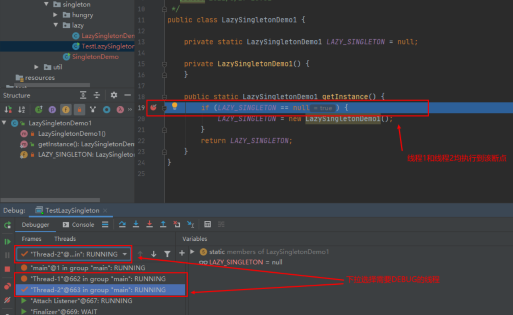

此时线程1和线程2中的对象并不是同一个对象，所以这种单例编码方式是不正确的。 

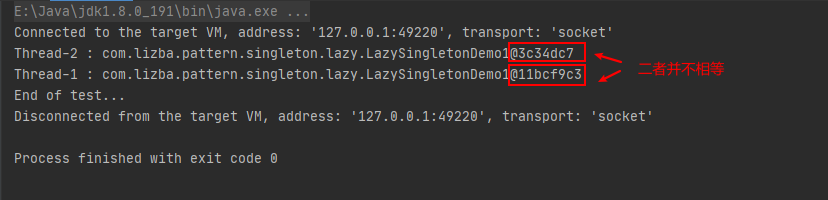 

***

**版本二：同步原语 synchronized 修饰**

关于上述的单例模式编码，可以通过同步原语 `synchronized` 加在 `getInstance()` 方法上来解决，此时代码如下所示： 

```java
package com.mars.pattern.singleton.lazy;
/**
 * synchronized修饰方法getInstance()的懒汉式单例
 */
public class LazySingletonDemo2 {
    private static LazySingletonDemo2 LAZY_SINGLETON = null;
    private LazySingletonDemo2() {}
    // synchronized修饰getInstance()方法
    public static synchronized LazySingletonDemo2 getInstance() {
        if (LAZY_SINGLETON == null) {
            LAZY_SINGLETON = new LazySingletonDemo2();
        }
        return LAZY_SINGLETON;
    }
}
```

如上通过给 `getInstance()` 加上 `synchronized` 关键字，使得同步方法中的代码块线程安全了，但是随之而来的是在**大量并发调用该方法的性能问题，大量的线程会阻塞在这个方法上**，所以有些我们通过**缩小锁锁住的范围来尽可能的提升其并发性能**。代码衍生为如下所示： 

```java
package com.mars.pattern.singleton.lazy;
/**
 * synchronized修饰方法代码块
 */
public class LazySingletonDemo3 {
    private static LazySingletonDemo3 LAZY_SINGLETON = null;
    private LazySingletonDemo3() {}
    public static LazySingletonDemo3 getInstance() {
        synchronized (LazySingletonDemo3.class) {
            if (LAZY_SINGLETON == null) {
                LAZY_SINGLETON = new LazySingletonDemo3();
            }
            return LAZY_SINGLETON;
        }
    }
}
```

如上这种锁住代码块的方式，虽然缩小了锁同步的范围，但是并未本质上的改变每个线程均需要阻塞这个问题，因此我们可以前置 `if(LAZY_SINGLETON == null)` 这个判断，使得部分线程判断对象被实例化后无需加锁，直接返回即可，其代码如下所示： 

```java
package com.mars.pattern.singleton.lazy;
/**
 * if(LAZY_SINGLETON == null)前置于同步代码块，单例模式示例4
 */
public class LazySingletonDemo4 {
    private static LazySingletonDemo4 LAZY_SINGLETON = null;
    private LazySingletonDemo4() {}
    public static LazySingletonDemo4 getInstance() {
        // 前置if判断
        if (LAZY_SINGLETON == null) {
            synchronized (LazySingletonDemo4.class) {
                LAZY_SINGLETON = new LazySingletonDemo4();
            }
        }
        return LAZY_SINGLETON;
    }
}
```

如上代码看似兼顾了性能和同步对象的实例化，但是**这里的同步语言并不能保证对象只实例化一次，它只能保证每次只有一个线程在实例化这个对象**。试想一下，如果线程1和线程2均执行到代码行 `synchronized (LazySingletonDemo4.class) {`，此时线程1获得锁继续执行，实例化对象 LazySingletonDemo4，当线程1退出锁后，线程2获取到锁，线程2也会对LazySingletonDemo4进行实例化，这种情况也可以用上面的断点法测试出来。所以这种情况是错误的，但是只有小小的改动一下即可，改动后的方式如下所示。 

***

**版本三：双重检查锁**

双重检查锁看名字高大上，其实就是在上面的 LazySingletonDemo4 多个 `if` 判断而已，理解为**双重检查+锁**可能更明了，其代码如下所示： 

```java
package com.mars.pattern.singleton.lazy;
/**
 * 双重检查锁
 */
public class LazySingletonDemo5 {
    private static LazySingletonDemo5 LAZY_SINGLETON = null;
    private LazySingletonDemo5() {}
    public static LazySingletonDemo5 getInstance() {
        // 检查1
        if (LAZY_SINGLETON == null) {
            synchronized (LazySingletonDemo5.class) {
                // 检查2（这就是双重检查）
                if (LAZY_SINGLETON == null) {
                    LAZY_SINGLETON = new LazySingletonDemo5();
                }
            }
        }
        return LAZY_SINGLETON;
    }
}
```

双重检查锁看似完全正确，其实还存在一个**指令重排序问题**，至于什么是指令重排序，简单来说，就是编译器和处理器会针对编译后的指令进行重新排序，这种重排序对于编译器和处理器来说是会带来一定的性能提升的，但是对于编写代码的程序员来说，**如果不正确的使用同步语义，将会导致非预期结果出现**。在上述示例中的代码行 `LAZY_SINGLETON = new LazySingletonDemo5()`，在编译器编译后生成的字节码会有三条指令如下所示： 

```java
memory = allocate();  // 1：分配对象的内存空间
ctorInstance(memory);　// 2：初始化对象
instance = memory;  // 3：设置instance指向刚分配的内存地址
```

这三条指令中，指令2和指令3可能会出现重排序，也就是说对象的初始化会被后置到将分配的地址指向对象的引用这个指令的后面；这种重排序，假设是在线程1执行中发生了，此时线程2执行到第一个 `if (LAZY_SINGLETON == null)` 代码行，此时 LAZY_SINGLETON 并不为null，程序会直接返回 LAZY_SINGLETON 对象，但是此时的对象是一个实例化不完全的对象，这种情况是不允许存在的。

其解决办法是通过 `volatile` 关键字借助其内存语义来禁止指令重排序，这样2和3指令之间的重排序将会被禁止，这涉及到 JMM 规范。其改造代码如下所示：

```java
package com.mars.pattern.singleton.lazy;
/**
 * volatile修饰 LAZY_SINGLETON禁止指令重排序
 */
public class LazySingletonDemo6 {
    // volatile修饰LAZY_SINGLETON反正指令重排序
    private static volatile LazySingletonDemo6 LAZY_SINGLETON = null;
    private LazySingletonDemo6() {}
    public static LazySingletonDemo6 getInstance() {
        // 检查1
        if (LAZY_SINGLETON == null) {
            synchronized (LazySingletonDemo6.class) {
                // 检查2（这就是双重检查）
                if (LAZY_SINGLETON == null) {
                    LAZY_SINGLETON = new LazySingletonDemo6();
                }
            }
        }
        return LAZY_SINGLETON;
    }
}
```

上述演进过程，其实已经编写一个比较完整的懒汉式单例的示例代码，但是介于语言的一些特性，也就是**反射**这个无事不为的操作，能破坏这种场景。先来看看怎么破坏的，其破坏示例代码如下： 

```java
package com.mars.pattern.singleton.lazy;
import java.lang.reflect.Constructor;
import java.lang.reflect.InvocationTargetException;
/**
 * 破坏双重检查锁单例
 */
public class DoubleCheckTest {
    public static void main(String[] args) {
        Class<LazySingletonDemo6> singletonClass = LazySingletonDemo6.class;
        try {
            Constructor<LazySingletonDemo6> c = singletonClass.getDeclaredConstructor(null);
            // 破坏private访问权限
            c.setAccessible(true);
            LazySingletonDemo6 lsd1 = c.newInstance();
            LazySingletonDemo6 lsd2 = c.newInstance();
            System.out.println(lsd1 == lsd2);
        } catch (Exception e) {
            e.printStackTrace();
        }
    }
}
```

 输出结果：false 

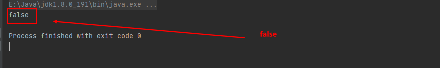 

**处理方式：**

处理方式十分简单粗暴，就是在构造方法中抛出异常，抛出异常这种解决方式，在很多不合法的场景中非常常见，修改后的代码如下:

```java
package com.mars.pattern.singleton.lazy;
/**
 * 防止反射破坏的双重检查锁懒汉式单例
 */
public class LazySingletonDemo7 {
    private static volatile LazySingletonDemo7 LAZY_SINGLETON = null;
    // 在构造函数中判断如果LAZY_SINGLETON不为空，则抛出异常即可
    private LazySingletonDemo7() {
        if (LAZY_SINGLETON != null) {
            throw new RuntimeException("This operation is forbidden.");
        }
    }
    public static LazySingletonDemo7 getInstance() {
        // 检查1
        if (LAZY_SINGLETON == null) {
            synchronized (LazySingletonDemo7.class) {
                // 检查2（这就是双重检查）
                if (LAZY_SINGLETON == null) {
                    LAZY_SINGLETON = new LazySingletonDemo7();
                }
            }
        }
        return LAZY_SINGLETON;
    }
}
```

***

**版本四：静态内部类**

在双重检查锁的演进中，通过不断的缩小锁的范围，以及对对象是否未实例化做了两次判断，最后对反射获取对象这种操作做了处理；但是归根到底，双重检查锁中有个锁字，就难规避性能讨论的问题，其实这种问题在大部分场景中是可以接受；**如果硬要寻求一种既是懒汉式，又不需要锁的单例模式，那么通过静态内部类的加载特性，巧妙地实现懒汉式单例模式会是一种不错的选择。**

**Java 语言中的内部类是延时加载的，只有在第一次使用的时候才会被加载，不使用则不加载。**

通过该特性，编码的懒汉式单例如下所示：

```java
package com.mars.pattern.singleton.lazy;
/**
 * 内部类懒汉式单例
 */
public class LazySingletonDemo8 {
    //构造器私有化并且在未实例化时抛出异常，防止反射破坏单例
    private LazySingletonDemo8() {
        if (LazyHolderInner.LAZY_SINGLETON != null) {
            throw new RuntimeException("This operation is forbidden.");
        }
    }
    public static LazySingletonDemo8 getInstance() {
        return LazyHolderInner.LAZY_SINGLETON;
    }
    /**
     *	使用内部类，被使用才加载的特性来
     */
    private static class LazyHolderInner {
      	public static final LazySingletonDemo8 LAZY_SINGLETON = new LazySingletonDemo8();
    }
}
```

***


##### （3）单例模式的最佳方式——枚举式单例（饿汉）

Joshua Bloch大师的《Effective Java 第二版》中说**枚举式单例**是实现单例的最佳方式。编码如下： 

```java
package com.mars.pattern.singleton.hungry;
/**
 * 枚举式单例示例
 */
public enum  EnumSingletonDemo {
    SINGLETON_INSTANCE;
    private Object object;
    public Object getObject() {
        return object;
    }
    public void setObject(Object object) {
        this.object = object;
    }
    public static EnumSingletonDemo getInstance() {
        return SINGLETON_INSTANCE;
    }
}
```

**测试枚举式单例：**

```java
package com.mars.pattern.singleton.hungry;
/**
 * 枚举式单例测试
 */
public class EnumSingletonTest {
    public static void main(String[] args) {
        EnumSingletonDemo instance1 = EnumSingletonDemo.getInstance();
        instance1.setObject(new Integer(100));
        EnumSingletonDemo instance2 = EnumSingletonDemo.getInstance();
        Integer value = (Integer) instance2.getObject();
        System.out.println(instance1 == instance2);
        System.out.println(value);
    }
}
```

查看输出结果： 

 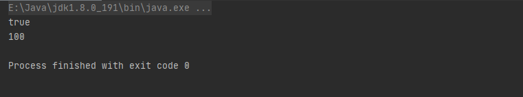 

根据上述输出结果，可以非常明确的发现，`instance1` 和 `instance2` 就是同一个对象。


##### （4）源码中的使用

1.  `java.lang.Runtime`

   ```java
   public class Runtime {
       //提前创建好，采用了饿汉式
       private static Runtime currentRuntime = new Runtime();
       public static Runtime getRuntime() {
           return currentRuntime;
       }
   
       private Runtime() {}
       // ...
   }
   ```

2. 在 Spring 中，Bean 可以被定义为两种模式：`Prototype(多例)` 和 `Singleton(单例)`，Spring Bean 默认是单例模式。

   **那Spring是如何实现单例模式的呢？**

   答案是通过**单例注册表**的方式，具体来说就是使用了HashMap。简化代码如下：

   ```java
   public class DefaultSingletonBeanRegistry {
       
       //使用了线程安全容器ConcurrentHashMap，保存各种单实例对象
       private final Map singletonObjects = new ConcurrentHashMap;
   
       protected Object getSingleton(String beanName) {
          //先到HashMap中拿Object
          Object singletonObject = singletonObjects.get(beanName);
   
          //如果没拿到通过反射创建一个对象实例，并添加到HashMap中
          if (singletonObject == null) {
              singletonObjects.put(beanName,
                                    Class.forName(beanName).newInstance());
          }
      
          //返回对象实例
          return singletonObjects.get(beanName);
     	}
   }
   ```

   


### 6. 原型设计模式
相比于以往创建一个复杂对象总是费时费力，原型模式只需要复制现有的相似对象，并根据需要做适当修改。原型意味着使用克隆方法。克隆方法是一种复制对象的操作。克隆出的对象副本被初始化为调用克隆方法时原始对象的当前状态。这意味着对象的克隆避免了创建新对象。如果创建一个新对象的开销很大，而且有可能引起资源紧张时，我们就克隆对象。

- 浅层复制：当原始对象变化时，新对象也跟着改变。这主要是因为浅层复制并没有实际复制新的对象，而只是对原有对象的一个引用。
- 深层复制：当原始对象变化时，新对象不受影响，因为原始对象所包含的所有参数、对象和引用在复制新对象的过程中都建立了新的拷贝。

使用克隆方法来复制对象时，具体是使用浅层复制还是深层复制是由业务需求来决定的。在使用原型模式时，使用克隆方法来复制对象仅仅是一个设计上的决策。克隆方法对于原型模式来说并不是强制性的最佳选择。
#### 6.1 模式中包括的类

- 客户端（Client）：通过调用原型类的克隆操作创建一个新对象。
- 原型类（ Prototype）：声明一个接口用于克隆自己。
- 具体原型类（ Concrete Prototype）：实现克隆自己的操作。


#### 6.2 UML图
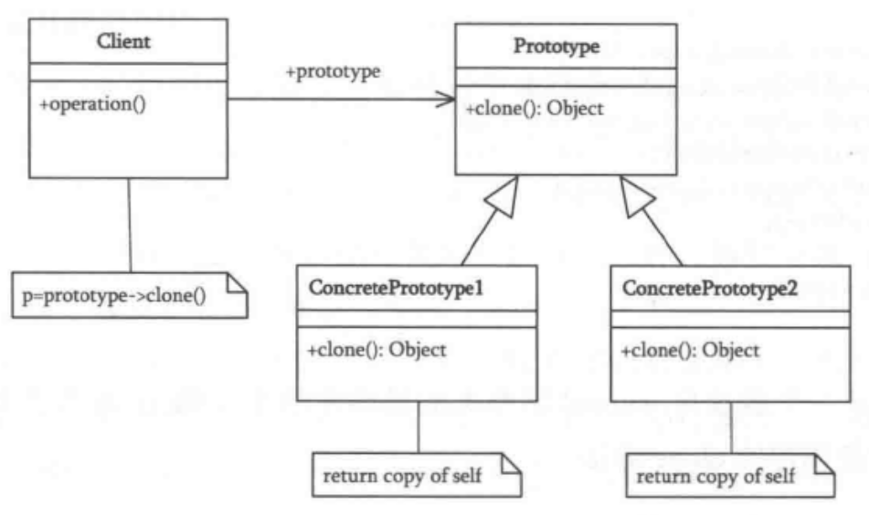
#### 6.3 功能及应用场景

1. 当一个系统应该独立于其产品的创建、组合和表示。
1. 当需要实例化的类是在运行时定义的，例如动态加载，或避免建立一个平行于产品类继承层次的工厂类继承层次时。
1. 当一个类的实例仅可以拥有若干不同的状态组合中的一个时。使用原型模式建立相应数量的原型和克隆方法，会比每次都手动实例化类并配置相应状态更加方便。

**主要难点：**

- 每个原型类的子类都必须实现克隆操作。这实现起来可能有难度。例如，当类已经存在的时候添加克隆方法可能比较困难。
- 对象内部包含其他不支持克隆的对象或具有循环引用的对象时，实现克隆方法会比较困难。

**优点：**

- 原型模式意味着使用克隆方法。克隆方法是一种复制对象的操作。相比于耗时的复制对象创建过程，原型模式仅复制类似的现有对象，再根据需要对复制出的副本进行修改。
- 客户端可以在运行时添加或移除原型对象。
- 通过各种参数来定义新对象：高度动态的系统允许我们通过使用对象组合来定义新的特征，例如为对象变量指定相应的参数值，而不是重新定义一个类。我们通过实例化现有类可以有效地定义新类型的对象，并为客户端对象注册原型实例。客户端可以通过向原型类委派某个责任而使其具有新的特征。这种设计允许用户无须大量编程就能轻松定义新的类。事实上，克隆一个原型本质上是类似于类的实例化的。但原型模式能够大大降低系统所需的类的数量。

**副作用：**

- 使用原型模式，我们可以根据需要通过对象克隆来实现运行时对象的添加和删除。我们可以根据程序运行情况在运行时修改类的内部数据表示形式。
- 在Java中实现原型模式的一大困难是如果这些类已经存在，我们未必能够通过添加所需要的克隆方法或深层克隆方法对类进行修改。此外，那些与其他类具有循环引用关系的类并不能真正实现克隆。
- 需要在这些类中具有足够的数据访问权限或方法，以便在克隆完成后对相应的数据进行修改。这可能需要在这些原型类中添加相应的数据访问方法，以便我们对类完成克隆之后可以修改数据。


## **六、结构型设计模式**
结构型模式主要**描述如何将对象和类组合在一起以组成更复杂的结构**。在软件工程中结构型模式是用于帮助设计人员通过简单的方式来识别和实现对象之间关系的设计模式。结构型模式会以组的形式组织程序。这种划分形式**使代码更加清晰，维护更加简便**。结构型模式用于代码和对象的结构组织。


**结构型模式又分为以下子类别：**

1. **对象结构型模式**：用于对象之间相互关联与组织，以便形成更大、更复杂的结构。
1. **类结构型模式**：用于实现基于继承的代码抽象，并且会介绍如何通过该模式提供更有用的程序接口。

**具体包括：**

| 对象结构型模式 | 类结构型模式 |
| :------------: | :----------: |
|    桥接模式    | 类适配器模式 |
|    组合模式    |              |
|    装饰模式    |              |
|    门面模式    |              |
|    享元模式    |              |
| 对象适配器模式 |              |
|    代理模式    |              |

1. **组合模式**：它能够为客户端处理各种复杂和灵活的树状结构。这些树结构可以由各种不同类型的容器和叶节点组成，其深度或组合形式能够在运行时调整或确定。
1. **装饰模式**：允许我们通过附加新的功能或修改现有功能，在运行时动态地修改对象。
1. **门面模式**：允许我们为客户端创建一个统一的接口以访问不同子系统的不同接口，从而简化客户端。
1. **享元模式**：客户端调用类时会在运行时创建大量对象，该模式会重新设计类以优化内存开销。
1. **代理模式**：为其他对象提供一种代理以控制对这个对象的访问。这种模式的目的是一个对象不适合或者不能直接引用另一个对象，简化客户端并实现对象访问，同时避免任何副作用。
1. **适配器模式**：允许我们为一个已有的类提供一个新的接口，并在客户端请求不同接口时实现类的重用。
1. **桥接模式**：允许我们将类与其接口相互解耦。允许类及其接口随着时间相互独立变化，增加类重用的次数，提高后续可扩展性。它也允许运行时对接口的不同实现方式动态切换，使代码更加灵活。


### 1. 适配器设计模式
软件适配器的工作原理也和插座适配器完全一样。我们也经常需要在程序中使用到不同的类或模块。假设有一段代码写得很烂，如果我们直接将这些代码集成到程序中，会将现有的代码搞乱。但是我们又不得不调用这段代码，因为我们需要实现相关的功能，而从头写起会耽误很多宝贵的时间。这时的最佳实践就是编写适配器，并将所需要的代码包装进去。这样我们就能够使用自定义的接口，从而降低对外部代码的依赖。

适配器模式会将现有接口转换为新的接口，已实现对应用程序中不相关的类的兼容性和可重用性的目标。适配器模式也被称为包装模式。适配器模式能够帮助那些因为接口不兼容而无法一起工作的类，以便它们能够一同工作。
适配器模式也负责将数据转换成适当的形式。当客户端在接口中指定了其对数据格式的要求时，我们通常可以创建新的类以实现现有类的接口和子类。这种实现方式也会通过创建类适配器，实现对客户端调用命和现有类中被调用方法之间接口的转换。

#### 1.1 模式中包括的类

- 客户端（Client）调用目标类的类或程序。
- 目标类（Target）客户端想要使用的接口。
- 适配对象类（Adapetee）需要进行适配的类或对象。
- 适配器类（ Adapter）按照目标类接口的要求对适配对象接口实现接口形式的适配转换。
- request方法：客户端想要执行的操作。
- specificRequest方法：适配对象中能够完成 request方法功能的实现。
#### 1.2 UML图
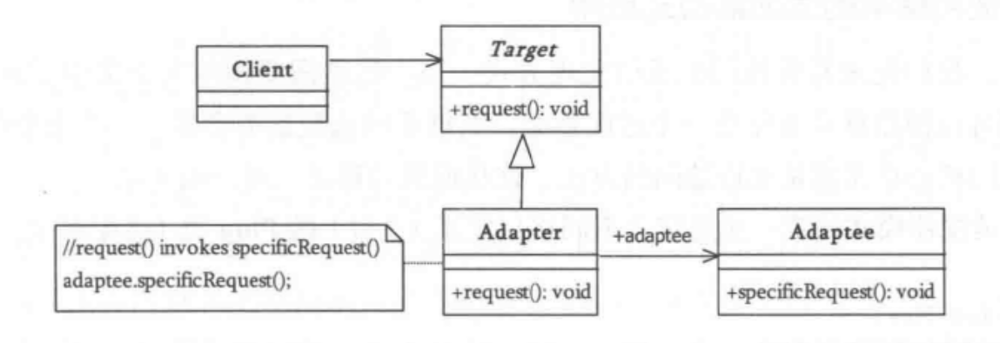
#### 1.3 功能及应用场景
在具体实践上，有两种实际应用适配器模式的方法：

1. 使用继承［类适配器］
1. 使用关联［对象适配器］

**应用场景：**

- 我们想要使用现有的类，但它的接口不符合我们的需要。
- 我们想要创建一个可重用的类，能够与一些无关的类或不可预见的类进行协作，同时这个类无须具有兼容的接口。
- （仅适用于对象适配器）我们需要使用多个已经存在的子类，而我们为每一个子类都做接口适配显然是不切实际的。使用对象适配器可以直接适配其父类的接口。


### 2. 桥接设计模式
桥接模式是结构型模式中的另一个典型模式。桥接模式用于将类的接口与接口的实现相互解耦。这样做提高了系统的灵活性使得接口和实现两者均可独立变化。
举一个例子，让我们想一下家用电器及其开关。例如，风扇的开关。开关是电器的控制接口，而一旦闭合开关，实际让风扇运转的是风扇电机。
所以，在这个示例中，开关和风扇之间是彼此独立的。如果我们将开关接到电灯泡的供电线路上，那么我们还可以选用其他开关来控制风扇。
#### 2.1 模式中包括的类

- 抽象化对象（Abstraction）桥接设计模式的核心，并定义了关键症结所在。包含对实现化对象的引用。
- 扩充抽象化对象（RefinedAbstraction）扩展抽象化对象，并将抽象化对象细化到新的层次。对实现化对象隐藏细节元素。
- 实现化对象（Implementor）该接口比抽象化对象的层次更高。只对基本操作进行定义。
- 具体实现化对象（Concretelmplementor）通过提供具体实现来执行实现化对象的具体功能。
#### 2.2 UML图
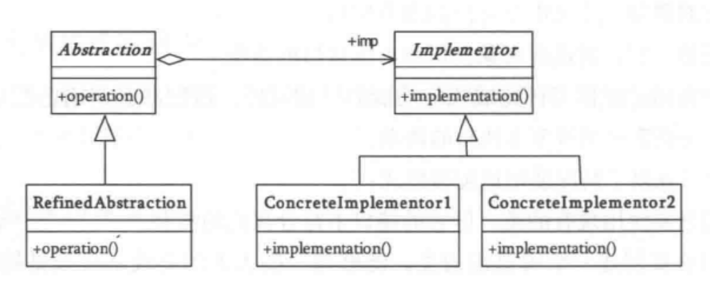
#### 2.3 功能及应用场景
桥接模式主要适用于系统的多个维度上都经常发生变化的情况。桥接模式能够将不同的抽象维度进行衔接。通过桥接模式，抽象化对象和实现化对象不会在编译时进行绑定，而能够在各自的类被调用时独立扩展。
当你经常需要在运行时在多个实现之间进行切换时，桥接模式也非常有用。


### 3. 组合设计模式
在大部分系统开发过程中，程序员都会遇到某个组件既可以是独立的个体对象，也能够作为对象集合的情况。组合模式就用于此类情况的设计。简单来说，组合模式是一组对象的集合，而这组对象中的每一个对象本身也是一个组合模式构成的对象，或者只是一个原始对象。
组合模式中存在着一个树形结构，并且在该结构中的分支节点和叶节点上都能够执行相同的操作。树形结构中每一个分支节点都包含子节点的类（能继承出叶节点和分支节点），这样的分支节点本身就是一个组合模式构成的节点。树形结构中的叶子节点仅是一个原始对象，其没有子节点（不能继承出叶节点和分支节点）。组合模式的子类（下一级节点）可以是叶子节点或其他组合模式。


#### 3.1 模式中包括的类

- 组件对象：（Component，结构）
  - 组件对象在整个继承结构的最顶端。它是对组合模式的抽象。
  - 它声明了组合模式中的对象接口。
  - 可以选择性地定义一个接口，以便对递归结构中组件的父类进行访问，并在需要的时候实现该接口。
- 叶子节点：（Leaf，原始对象）
  - 树形结构的末端且不会再有子节点。
  - 定义了组合结构中单个对象的行为。
- 分支节点类：（Composite，组）
  - 包含了子组件并为它们定义行为。
  - 实现子节点的相关操作。
#### 3.2 UML图

#### 3.3 功能及应用场景

- 当对象的集合需要采用与单个对象相同的处理方式时。
- 操纵单个对象的方式与操纵一组对象的方式类似时。
- 注意存在能够组合的递归结构或树形结构。
- 客户端能够通过组件对象访问整个继承结构，而它们却不会知道自己所处理的是叶子节点还是分支节点。

组合模式的目的是能够使独立对象（单个分支节点或叶子节点）和对象集合（子树）都能够以同样的方式组织起来。组合模式中所有的对象都来自于其本身（成为一种嵌套结构）。组合模式允许我们使用递归的方式将类似的对象组合成一种树形结构，来实现复杂结构对象的构建。
### 4. 装饰者设计模式
装饰设计模式用来在运行时扩展或修改一个实例的功能。一般来说，继承可以扩展类的功能（用于类的所有实例）。但与继承不同的是，通过装饰模式，我们可以选择一个类的某个对象，并对其进行修改，而不会影响这个类中其他的实例。继承会直接为类增加功能，而装饰模式则会通过将对象与其他对象进行包装的方式将功能添加到类。
#### 4.1 模式中包括的类

- 抽象组件（Component）给出一个抽象接口，用于能够动态添加功能的对象。
- 具体组件（Concrete Component）定义一个实现组件接口的对象。这是实际需要加以装饰的对象，但其对装饰的过程一无所知。
#### 4.2 UML图
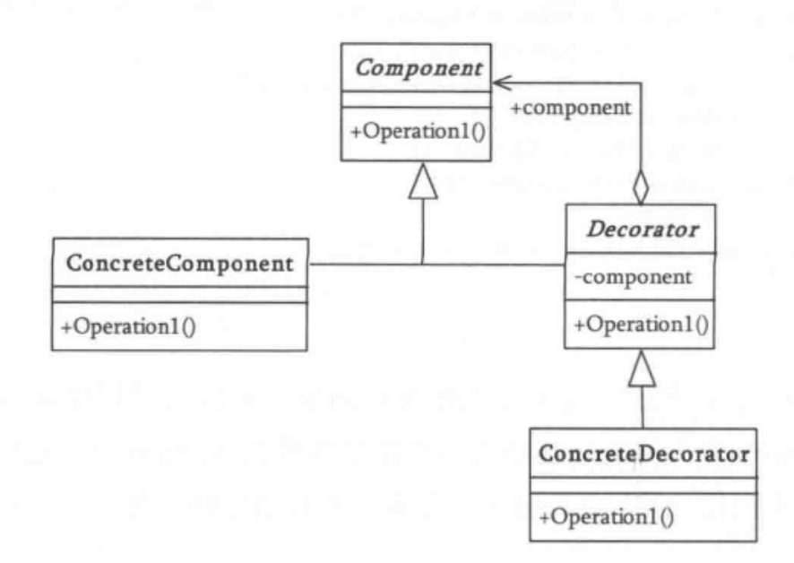
#### 4.3 功能及应用场景
装饰设计模式用来在运行时扩展或修改一个实例的功能。一般来说，继承可以扩展类的功能（用于类的所有实例）。但与继承不同的是，通过装饰模式，我们可以选择一个类的某个对象，并对其进行修改，而不会影响这个类中其他的实例。继承会直接为类增加功能，而装饰模式则会通过将对象与其他对象进行包装的方式将功能添加到类。
### 5. 门面设计模式
许多业务流程都会涉及复杂的业务类操作。由于流程很复杂，所以其涉及了多个业务对象，这往往会导致各个类之间的紧密耦合，从而降低系统的灵活性和设计的清晰度。底层业务组件间的复杂关系会使客户端的代码编写变得很困难。
门面模式简化了到复杂系统的外部接口。为此它会对所有的类进行整合，并构建一个复杂系统的子系统。
门面模式能够将用户与系统内部复杂的细节相互屏蔽，并只为用户提供简化后的更容易使用的外部接口。同时它也将系统内部代码与接口子系统的代码相互解耦，以便修改和升级系统代码。
相比于其他设计模式，门面模式更注重实现代码的解耦。它所强调的是代码设计中很重要的一点，即代码抽象。通过提供一个简单的接口并隐藏其后的复杂性，从而实现抽象。
在这种方式下，代码的实现完全交由门面层处理。客户端只会与一个接口交互，同时也只有和这个接口交互的权限。这样就能隐藏全部系统的复杂性。总而言之，门面模式通过提供一个简单的接口为客户端简化了与复杂系统的交互。
从另一方面看，门面模式也保证了能够在不修改客户端代码的情况下对具体实现方法进行修改。


#### 5.1 模式中包括的类

- 门面层（ Facade）：它知道子系统内各个类的具体功能，并将客户端请求转换成对系统内部对象的调用。
- 系统内部类（ ComplicatedClass）：这些类会实现系统功能，处理门面层对象分配的各项工作任务。它们本身并不知道门面层的存在，也没有对其进行任何的引用。


#### 5.2 UML图
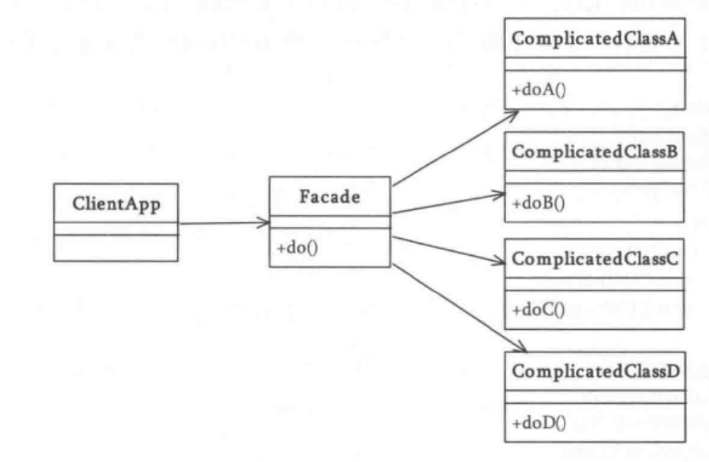
#### 5.3 功能及应用场景

- 想要为一个复杂的子系统提供一个简单接口。子系统随着其自身的发展往往变得越来越复杂。它们应用的大多数的设计模式会导致类的数量更多、代码段更小。这使得该子系统可重用更好，也更容易进行自定义。而对于某些无法自定义的客户端来说，它也变得难以使用。门面层可以提供对大多数客户端来说足够好的简化的调用接口。只有极少数高度定制化的客户端需要直接调用门面层之后的底层代码。
- 在客户端和抽象层的实现类之间存在大量的依赖关系。引入一个门面层能够将客户端的子系统与其他子系统进行解耦，从而促进子系统的独立性和可移植性。
- 你想要为你的子系统增加层级。使用一个门面层对每个子系统级别分别定义一个入口点。如果子系统之间存在依赖关系，那么你可以通过令这些子系统之间的交互全部需要经由门面层来简化彼此的依赖关系。


### **6. 代理设计模式**

**为其他对象提供一种代理以控制对这个对象的访问**。在某些情况下，**一个对象不适合或者不能直接引用另一个对象，而代理对象可以在客户端和目标对象之间起到中介的作用**。好比你将一些繁琐的事情交给第三方去管理，那么第三方就是你的代理，其他人只会去找这个代理，而不会去找你，AOP本身就是基于动态代理实现的。

#### 6.1 模式中包括的类

- **抽象角色**：为真实对象和代理对象提供一个共同的接口，一般是抽象类或者接口。
- **代理角色**：代理角色内部含有对真实对象的引用，从而可以操作真实对象，同时代理对象提供与真实对象相同的接口以便在任何时刻都能够代替真实对象。同时，代理对象可以在执行真实对象的操作时，附加其他操作，相当于对真实对象的功能进行拓展。
- **真实角色**：最终引用的对象。


#### 6.2 UML图
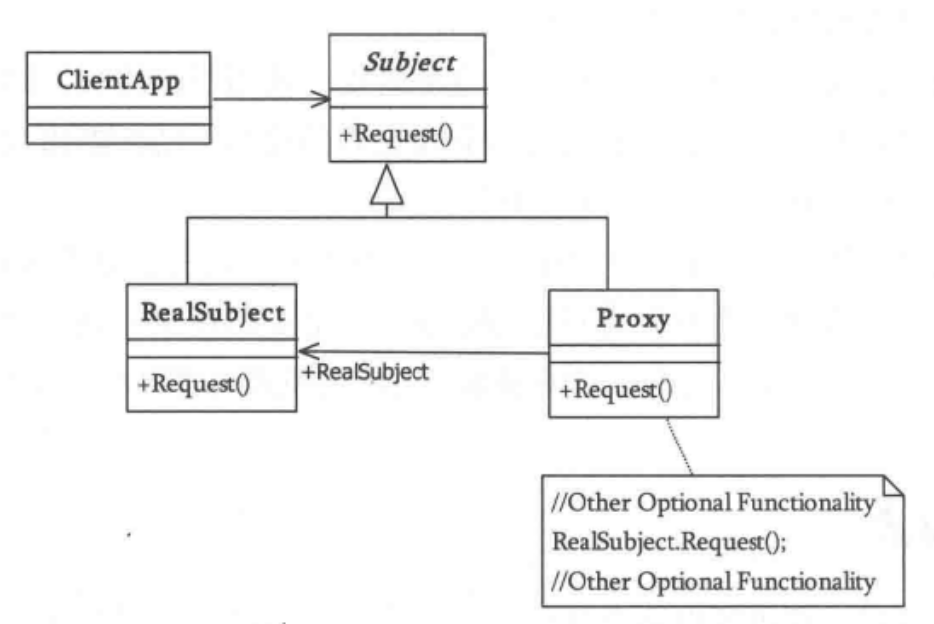
#### 6.3 功能及应用场景
（1）当我们想要隐藏某个类时，可以为其提供代理类

（2）当一个类需要对不同的调用者提供不同的调用权限时，可以使用代理类来实现（代理类不一定只有一个，我们可以建立多个代理类来实现，也可以在一个代理类中金进行权限判断来进行不同权限的功能调用）

（3）当我们要扩展某个类的某个功能时，可以使用代理模式，在代理类中进行简单扩展（只针对简单扩展，可在引用委托类的语句之前与之后进行）

代理模式虽然实现了调用者与委托类之间的松耦合，但是却增加了代理类与委托类之间的强耦合（在代理类中显式调用委托类的方法），而且增加代理类之后明显会增加处理时间，拖慢处理时间。Java的动态代理在实践中有着广泛的使用场景，比如最场景的Spring AOP、Java注解的获取、日志、用户鉴权等。 

#### 6.4 基本示例

[java 代理模式详解](https://gitee.com/coder-kaho/myNotes/blob/master/Dynamic_Proxy/%E5%8A%A8%E6%80%81%E4%BB%A3%E7%90%86.md)


### 7. 享元设计模式

享元模式能够减少用于创建和操作大量相似的细碎对象所花费的成本。享元模式主要用在需要创建大量类似性质的对象时。大量的对象会消耗高内存，享元模式给出了一个解决方案，即通过共享对象来减少内存负载它的具体实现则是根据对象属性将对象分成两种类型：内蕴状态和外蕴状态。
共享是享元模式的关键。
#### 7.1 模式中包括的类

- 抽象享元角色（ Flyweight）声明一个为具体享元角色规定了必须实现的接口，而外蕴状态就是以参数的形式通过此方法传入。
- 具体享元角色（ Concrete Flyweight）实现享元模式接口，并存储内蕴状态。具体享元角色必须是共享的。具体享元角色必须保持其内蕴状态不变，并且能够操纵外蕴状态。
- 享元工厂角色（FlyweightFactory）负责创建和管理享元角色。此外，该工厂确保了享元角色的共享。工厂维护了不同的享元对象池，并负责在对象创建完成时从对象池返回对象，以及向对象池添加对象。
- 客户端（Client）维护对所有享元对象的引用，而且需要存储和计算对应的外蕴状态。
#### 7.2 UML图
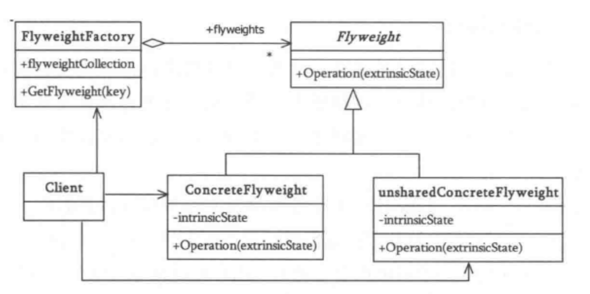
#### 7.3功能及应用场景
当我们选择享元模式的时候，需要考虑以下因素：

- 需要创建大量的对象时。
- 由于对象众多，内存的开销是一个制约因素。
- 大多数对象属性可以分为内蕴状态和外蕴状态。
- 应用程序需要使用多种对象，且创建对象后需要多次重复使用。
- 外蕴状态最好是通过计算得到的，而不需要进行存储。


## **七、行为型设计模式**

行为型模式是一类**主要关注对象间相互通信（交互）**的设计模式。这些对象之间的相互作用既能**保证对象间能够交换数据，同时对象间仍然能够保持松耦合。**

紧耦合一般会发生在一组紧密关联（相互依赖）的类之间。在面向对象的设计过程中，耦合引用的数量和设计过程中类与类之间的相互依赖是成正比的。用通俗的话讲，就是当一个类变化的时候，有多少可能需要同时修改其他类呢？

松耦合是软件架构设计的关键。**在行为型模式中，功能实现与调用该实现的客户端之间应该是松耦合的，以避免硬编码和依赖性。**

行为型模式处理不同的对象之间的通信关系，为其提供基本的通信方式，并提供实现这种通信方式的最常用、最灵活的解决方案。**行为型模式描述的不仅是类或对象的模式，同时也包括了它们之间的通信模式**。行为型模式能够用来避免硬编码和依赖性。


**行为型模式又分为以下子类别：**

1. **对象行为型模式**：对象行为型模式使用对象组合而非继承。描述一组对象如何合作执行部分任务，而单个对象无法执行这些任务。
2. **类行为型模式**：类行为型模式使用继承而不是对象组合来描述算法和流程控制。

**具体包括：**

- **责任链模式**（COR）：在一系列对象链之间传递请求的方法。
- **命令模式**：命令模式主要用于在需要向对象发出请求的情况，发出请求的对象无须了解请求的操作内容，也无须了解请求的实际接收对象。
- **解释器模式**：解释器提供了在代码中使用特定语言的一种方法。解释器模式就是一种用于在程序中解析特定语言的设计模式。
- **迭代器模式**：迭代器用于顺序访问集合（组合）对象中的元素，而无须了解其内部结构。
- **中介者模式**：定义简单的类间通信。
- **备忘录模式**：捕获和恢复对象的内部状态。
- **观察者模式**：一种通知多个类进行改变的方式。
- **状态模式**：当一个对象状态改变时改变其功能。
- **策略模式**：在类中进行算法封装。
- **模板方法模式**：将算法中的部分步骤延迟到子类中进行计算。
- **访问者模式**：在不改变类的条件下为该类定义一个新的操作。

| **对象行为型模式** | **类行为型模式** |
| :----------------: | :--------------: |
|     职责链模式     |                  |
|     解释器模式     |                  |
|      命令模式      |   模板方法模式   |
|     迭代器模式     |                  |
|     中介者模式     |                  |
|     备忘录模式     |                  |
|     观察者模式     |                  |
|      状态模式      |                  |
|      策略模式      |                  |
|     访问者模式     |                  |


### **1. 责任链设计模式**

**在责任链模式中，由发送端发送一个请求到一个对象链中，链中的对象自行处理请求。如果链中的对象决定不响应请求，它会将请求转发给链中的下一个对象。**

责任链的目的是**通过特定设计对请求的发送者和接收者之间进行解耦**。解耦是软件设计中很重要的一个方面。通过该设计模式能够使我们彻底地将发送者和接收者之间完全解耦。**发送者是用于调用操作的对象，接收者是接收请求并执行相关操作的对象。通过解耦，发送者不需要关心接收者的接口。**

在责任链模式中，**责任是前后传递的。对于链中的对象，决定谁来响应请求的责任由整个链中左侧的对象来承担**。这就像问答测验的时候传递问题一样。当提问者向一个人提问，如果他不知道答案，他就把问题传给下一个人，以此类推。当一个人回答了问题，问题就会停止向下传递。有时，也可能到达最后一个人时，还是没有人能回答问题。

我们能举出若干个责任链模式的例子：硬币分拣机、ATM取款机、**Servlet 过滤器**和 **Java 的异常处理机制**。
在 Java 中，我们可以在 catch 语句中列出异常序列时就抛出一个异常，catch 列表从上到下逐条扫描。如果赶上第一个进行异常处理就可以立刻完成任务，否则责任转移到下一行，直到最后一行。

#### 1.1 模式中包括的类

- **抽象处理者（Handler）**：定义出一个处理请求的接口。如果需要，接口可以定义出一个方法以设定和返回对下家的引用。这个角色通常由一个 Java 抽象类或者 Java 接口实现。 
- **具体处理者（ Concrete Handler）**：它负责处理请求。如果它能够处理这样的要求就会自行处理，否则会将请求发送到下一个处理者。继承或实现抽象处理者。
- **客户端（Client）**：将命令发送到责任链中第一个能够处理该请求的对象。
#### 1.2 UML图
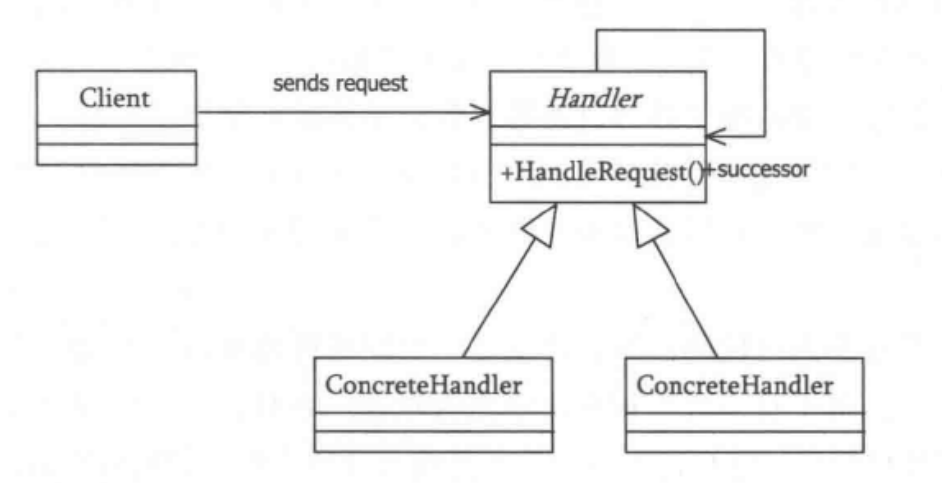
#### 1.3 优缺点及应用场景

- 发送者并不知道在链中的哪个对象会响应请求。
- 责任链中的每一个对象都有责任决定是否对请求进行响应，如果这些对象有能力响应请求就会响应请求。
- 如果对象（或节点）决定向后传递请求它需要具有选择下一个节点和继续传递的能力。
- 也有可能没有任何一个节点能够响应请求（有些请求可能无法得到处理）
- 会在运行时确定哪些对象能够响应请求。

**优点：** 1、降低耦合度。它将请求的发送者和接收者解耦。 2、简化了对象。使得对象不需要知道链的结构。 3、增强给对象指派职责的灵活性。通过改变链内的成员或者调动它们的次序，允许动态地新增或者删除责任。 4、增加新的请求处理类很方便。

**缺点：** 1、不能保证请求一定被接收。 2、系统性能将受到一定影响，而且在进行代码调试时不太方便，可能会造成循环调用。 3、可能不容易观察运行时的特征，有碍于除错。

**使用场景：** 1、有多个对象可以处理同一个请求，具体哪个对象处理该请求由运行时刻自动确定。 2、在不明确指定接收者的情况下，向多个对象中的一个提交一个请求。 3、可动态指定一组对象处理请求。


#### 1.4 基本示例

举个简单例子：公司的伤残等级报销流程 —— `项目经理 —＞部门经理 —＞总经理`

> 其中项目经理报销额度不能超过1000，部门经理报销额度不能超过5000，超过5000的则需要总经理审核。并且项目经理不能报销“三级伤残”，部门经理不能报销“二级伤残”，总经理不能报销“一级伤残”

（1）抽象处理角色 ConsumeHandler 

```java
public abstract class ConsumeHandler {
    
    private ConsumeHandler nextHandler; //指向责任链中下一个处理者的引用

    public ConsumeHandler getNextHandler() { //返回对下一个处理者的引用
        return nextHandler;
    }

    public void setNextHandler(ConsumeHandler nextHandler) { //设定当前处理者的下一个处理者
        this.nextHandler = nextHandler;
    }

    /*
    * 处理请求的具体逻辑
    * level 伤残等级
    */
    public abstract void doHandler(String level, BigDecimal free); 
}
```

（2）具体处理角色 

```java
//项目经理
public class ProjectHandler extends ConsumeHandler {
    @Override
    public void doHandler(String level, BigDecimal free) {
        if(free.doubleValue() < 1000) { //额度不超1000，能报销
            if(level.equals("三级伤残"))
                System.out.println(level + "报销不通过");
            else
                System.out.println(level + "给予报销：" + free);
        } else { 
            if(getNextHandler() != null) {
                getNextHandler().doHandler(level, free);
            }
        }
    }
}

public class DeptHandler extends ConsumeHandler {
    @Override
    public void doHandler(String level, BigDecimal free) {
        if(free.doubleValue() < 5000) {
            if(level.equals("二级伤残"))
                System.out.println(level + "报销不通过");
            else
                System.out.println(level + "给予报销：" + free);
        } else {
            if(getNextHandler() != null) {
                getNextHandler().doHandler(level, free);
            }
        }
    }
}

public class GeneralHandler extends ConsumeHandler {
    @Override
    public void doHandler(String level, BigDecimal free) {
        if(free.doubleValue() >= 5000) {
            if(level.equals("一级伤残"))
                System.out.println(level + "报销不通过");
            else
                System.out.println(level + "给予报销：" + free);
        } else {
            if(getNextHandler() != null) {
                getNextHandler().doHandler(level, free);
            }
        }
    }
}
```

（3）测试代码和结果

```java
//创建各级处理者
ConsumeHandler project = new ProjectHandler();
ConsumeHandler dept = new DeptHandler();
ConsumeHandler general = new GeneralHandler();
//设定各级处理者的下一处理者
project.setNextHandler(dept);
dept.setNextHandler(general);

project.doHandler("三级伤残", new BigDecimal(2000));
project.doHandler("三级伤残", new BigDecimal(300));
project.doHandler("二级伤残", new BigDecimal(2000));
project.doHandler("一级伤残", new BigDecimal(20000));
project.doHandler("二级伤残", new BigDecimal(20000));
```

结果：

```
三级伤残给予报销：2000 —— 处理者：部门经理
三级伤残报销不通过 —— 处理者：项目经理
二级伤残报销不通过 —— 处理者：部门经理
一级伤残报销不通过 —— 处理者：总经理
二级伤残给予报销：20000 —— 处理者：总经理
```


### 2. 命令设计模式

命令模式（也称为行动模式、业务模式）是一个对象行为型模式。
这使我们能够实现发送者和接收者之间完全解耦。发送者是调用操作的对象，接收者是接收请求并执行特定操作的对象。通过解耦，发送者无须了解接收者的接口。在这里，请求的含义是需要被执行的命令。
#### 2.1 模式中包括的类

- 抽象命令类（Command）：在类中对需要执行的命令接口进行声明。
- 具体命令类（ ConcreteCommand）：将接收者对象和行为之间进行绑定。它通过调用接收者中相应的操作实现 execute方法。
- 客户端（ Client）：客户端完成对命令对象的实例化并提供随后需要调用的方法的信息。
- 调用者（Invoker）：调用者决定合适的调用方法。
- 接收者（Receiver）：接收者是包含方法代码的类的一个实例。这意味着它知道如何处理一个请求并执行相应的操作。任何一个类都可以作为接收者。
#### 2.2 UML图
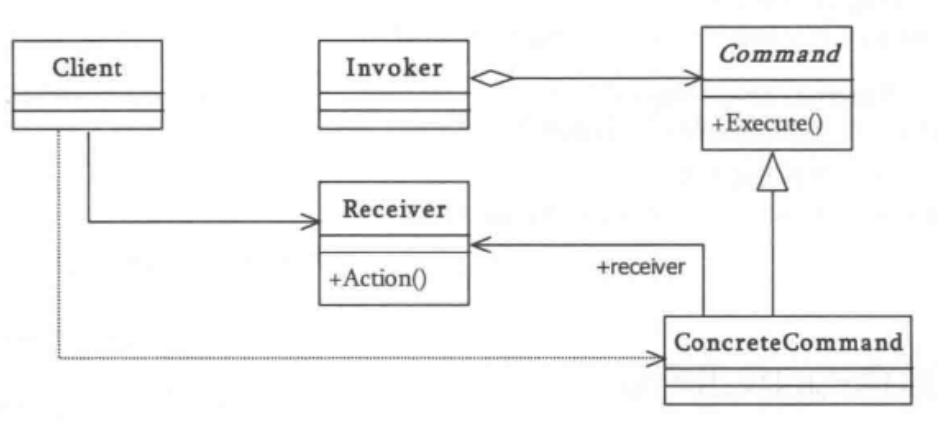


#### 2.3 功能及应用场景

- 通过参数化对象实现功能执行。命令是面向对象式的，而不是回调函数式的。
- 指定消息队列并在不同的时间执行请求一个命令对象可以有独立于原始请求的生命周期。如果一个请求的接收者可以由一个独立地址空间的方式来表示，那么你可以将请求对应的命令对象转换到不同的进程并在其中完成请求。
- 支持撤销。命令的执行操作可以作为状态进行存储，并在需要时实现命令撤销。命令接口必须增加一个unexecute操作，支持撤销之前命令调用的执行效果。执行的命令存储在命令的历史列表中。无限次数的撤销和重做是通过遍历这个列表并分别调用 unexecute和 execute来实现的。
- 支持日志记录变化，在系统崩溃的情况下使命令可以重新应用。通过增加load和 store操作命令接口参数，你可以保存一个持续变化的日志。从系统崩溃中恢复需要从磁盘重新加载日志命令和使用 Execute作重新执行这些命令。
- 通过在原生操作基础上的高层操作构建系统。这样的结构在支持交易操作的信息系统中很常见。一个交易事务封装一组变化的数据。命令模式提供了一种交易模型。命令都有一个共同的接口，允许你使用相同的方式调用所有的交易。这种模式也使得它很容易与新的交易系统进行交互扩展。

**注意事项：**

- 目的：将请求封装为一个对象，从而使客户端可以将不同的请求、队列、日志请求及其他支持撤销的操作进行参数化。

- 发出请求的对象无须知道请求对应的操作或请求接收者的任何信息。
- 后果：
  - 将调用操作的对象和执行操作的对象之间对命令进行解耦。即调用者和接收者之间解耦。
  - 命令转换为一类对象。使其可以像其他对象那样进行操作和扩展。
  - 我们可以将命令组合成一个组合命令。一般来说，组合命令是一个组合模式的实例。
  - 很容易添加新的命令，因为我们无须改变现有的类。
### 3. 解释器设计模式
解释器模式是一种用于在程序中解析特定语法的设计模式。解释器模式是组合模式的一种应用。
对于特定的某种语言，解释器模式能够定义针对其语法表示形式的解释器，并实现对该语言语句的翻译和解释。
#### 3.1 模式中包括的类

- 内容类（Context）：包含解释器的全局信息
- 表达式（AbstractExpression）：带有名叫 interpret抽象方法的抽象类。它会声明执行操作的接口。
- 终结符表达式（TerminalExpression）：就是带有终结符的表达式。
- 非终结符表达式（ NonterminalExpression）：在两个终结符表达式或非终结符表达式之间实现逻辑运算（与或运算）的表达式。
- 客户端（Client）：建立抽象树，并调用抽象树中的 interpret方法。
#### 3.2 UML图
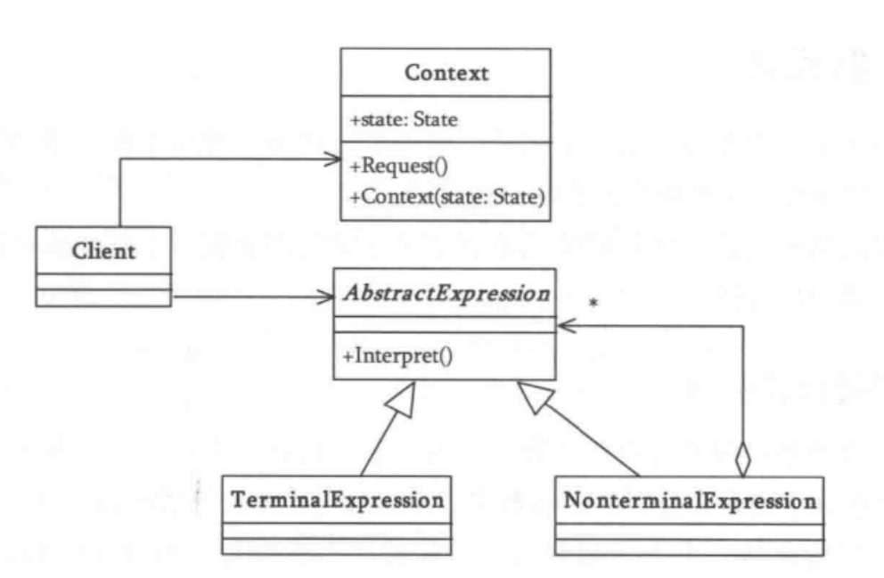
#### 3.3 功能及应用场景
解释器模式的适用范围非常有限。我们可以说解释器模式仅仅用于需要进行正式语法解释的地方，但这些领域往往已经有了更好的标准的解决方法，因此，在实际使用中，并不会经常使用该模式。该模式可以用于解释使用了特定语法的表达式或者建立某个简单的规则引擎的时候。
### 4. 迭代器设计模式
迭代器模式也是一种行为型模式。迭代器模式允许对一组对象元素的遍历（也叫收集）以完成功能实现。
#### 4.1 模式中包括的类

- 迭代器（Iterator）：它会实现一个用于定义迭代器的抽象迭代器接口。
- 具体迭代器（Concretel）：这是迭代器的实现（实现迭代器接口）。
- 抽象容器（Container）：这是用于定义聚合关系的接口。
- 具体容器（ConcreteContainer）：一个聚合关系的实现。
#### 4.2 UML图
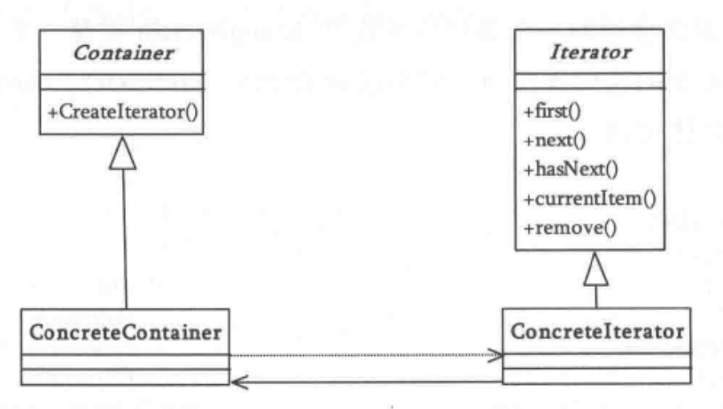
#### 4.3 功能及应用场景

- 需要访问一个聚合（也称为容器）对象的内容，而无须了解其内部表示。-
- 支持对聚合对象的多种遍历方式。
- 为遍历不同的聚合结构提供统一的接口（即支持多态迭代）。
- 迭代器模式允许我们访问集合对象中的内容，而无须暴露其内部数据结构。
- 支持多个迭代器同时遍历集合对象。这意味着我们可以对相同的集合创建多个独立的迭代器。
- 为遍历不同的集合提供统一的接口。


### 5. 中介者设计模式

中介者模式主要是关于数据交互的设计模式。中介者设计模式很容易理解，却难以实现。该模式的核心是一个中介者对象，负责协调一系列对象之间一系列不同的数据请求。这一系列对象称为同事类。
同事类会让中介者知道它们会发生变化这样中介者负责处理变化对不同对象之间交互的影响。
#### 5.1 模式中包括的类

- 中介者接口（Mediator）：它定义了一个接口来实现同事类对象之间的沟通。
- 具体中介者（ ConcreteMediator）：它知道各个同事类，并和这些同事类保持相互引用。它实现了与同事类之间的通信和消息传递。
- 同事类（ Colleague）：这些类保存了对中介者的引用。无论它们想和任何其他同事类进行交互，都必须通过与中介类通信来实现。
#### 5.2 UML图
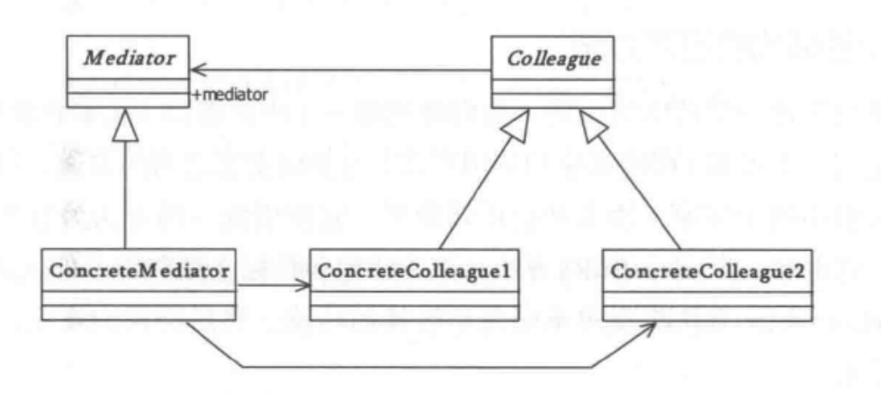
#### 5.3 功能及应用场景

- 一组对象使用了标准的通信方式，但整体通信的连接都非常复杂。由此产生的相互依赖的结果导致系统难以结构化，也很难理解。
- 由于对象之间的通信和相互引用，导致对象难以重用。
- 分布在多个类中的行为能够被统一定制化，而无须创建过多的子类。

**需要注意的问题：**
实际使用中介者模式的时候，反而会让问题变得越来越复杂。所以最佳的实践是仅让中介者类负责对象之间的通信部分。

- 定义一个对象来负责一系列对象之间的交互。
- 同事类发送和接收请求都需要通过中介者。

**功能：**

- 它对同事类进行解耦。中介类实现了同事类之间的松耦合。你可以相互独立地对不同的同事类进行修改和重用。
- 它简化了对象协议。中介者取代了许多交互作用，而实现了与多个同事类之间一对多的通信方式。一对多关系更容易理解、维护和扩展。
- 它集中了控制。中介者模式在中介者中集成了系统交互的复杂性。因此通过中介封装协议之后，它会比任何单一的同事类都更为复杂。这会使中介者作为一个整体也很难维护。
- 门面模式不同于中介者模式的是，它抽象了对象的子系统以提供一个更方便的接口。该种抽象是单向的。也就是说，门面对象会向子系统中的各个类发出请求，反之则不会。相比之下，中介者模式更像是同事类对象之间通过中介者的合作行为，系统的交互都是多向的。
- 当各个同事类只和一个中介者对象交互时，没有必要再去定义一个抽象的中介者类。抽象中介者只用于多个同事类通过多个抽象中介者的子类进行交互的情况，反之则不同。


### 6. 备忘录设计模式

我们每天至少会使用一次这种模式。备忘录模式提供了一种使对象恢复到其以前状态的能力（通过回滚撤销）。备忘录模式是通过两个对象实现的：发起者和管理者。发起者是具有内部状态的某个对象。管理者则会对发起者执行一些操作，并实现撤销更改。
#### 6.1 模式中包括的类

- 发起者（Originator）：发起者知道如何保存自己。这是我们想要保存状态的类。
- 管理者（ Caretaker）：管理者是用于管理发起者进行状态保存的对象，具体处理发起者何时、如何、为何对状态进行存储。管理员应能够对发起者进行修改，同时也能够撤销这些修改。
- 备忘录（Memento）：备忘录会保存发起人的状态信息，而这些状态不能由管理者修改。
#### 6.2 UML图
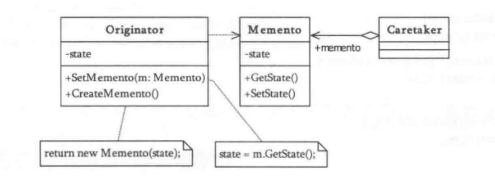
#### 6.3 功能及应用场景
当我们在实际应用中需要提供撤销机制，当一个对象有可能需要在后续操作中恢复其内部状态时，就需要使用备忘录模式。结合本设计模式实现对象状态序列化，能够使其易于保存对象的状态并进行状态回滚。
当一个对象状态的快照必须被存储，且在后续操作过程中需要被恢复时，就可以使用备忘录模式。


### 7. 观察者设计模式

在观察者模式中，一种叫作被观察者的对象维护了观察者对象的集合。当被观察者对象变化时，它会通知观察者。
在被观察者对象所维护的观察者集合中能够添加或删除观察者。被观察者的状态变化能够传递给观察者。这样观察者能够根据被观察者的状态变化做出相应的改变。
#### 7.1 模式中包括的类

- 被观察者（Listener）：定义了向客户端添加和移除观察者操作的接口或抽象类。
- 具体被观察者（ ConcreteListener）：具体被观察者类。它维护了对象的状态，并在当其状态改变时通知各个观察者。
- 观察者（Observer）：定义了用于通知对象的接口或抽象类。
- 具体观察者（ ConcreteObserver）：具体实现了观察者。
#### 7.2 UML图
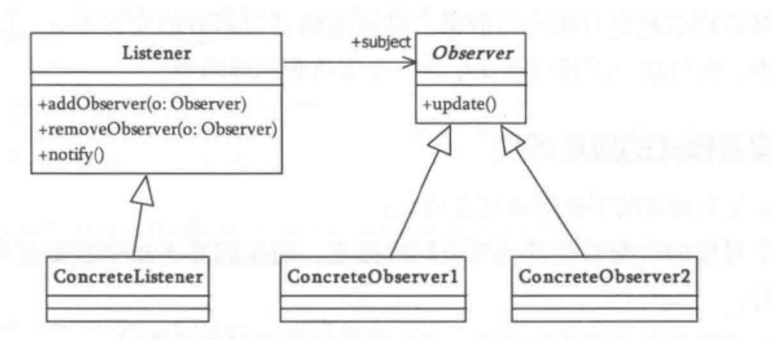
#### 7.3 功能及应用场景

- 当一个对象的改变需要其他对象同时改变，而我们并不知道需要有多少个对象一起改变时。
- 当一个对象必须通知其他对象，而无须了解这些对象是谁时。
- 当一个抽象包含有两个方面，其中一个依赖于另一个。将这些方面封装成独立的对象，以便我们独立改变和重复使用它们时。


### 8. 状态设计模式

状态模式是一种行为型模式。状态模式背后的理念是根据其状态变化来改变对象的行为。状态模式允许对象根据内部状态（内容类）实现不同的行为。内容类可以具有大量的内部状态，每当对内容类调用 request方法时，消息就被委托给状态类进行处理。
状态类接口定义了一个对所有具体状态类都有效的通用接口，并在其中封装了与特定状态相关的所有操作。具体状态类对请求提供各自具体的实现。当内容类的状态变化时，那么与之关联的具体状态类也会发生一定相应的改变。
#### 8.1 模式中包括的类

- 内容类（ Context）：内容类主要用于状态模式的客户端。客户端并不直接访问对象的状态。内容类拥有一个具体的状态对象并根据其当前状态提供所需实现的行为。
- 抽象状态类（ State）：这个抽象类是所有具体状态类的基类。状态类定义了一个通用接口。内容类对象能够通过使用该接口实现对不同功能的改变。在状态类及其子类的各个条目或属性中，本身并没有任何的状态。
- 具体状态类（ ConcreteState）：具体状态类根据内容类所提供的状态实现真正的功能改变。每个状态类所提供的行为都适用于内容类对象的某一个状态。它们也包含着由内容类状态变化所下发的指令。
#### 8.2 UML图
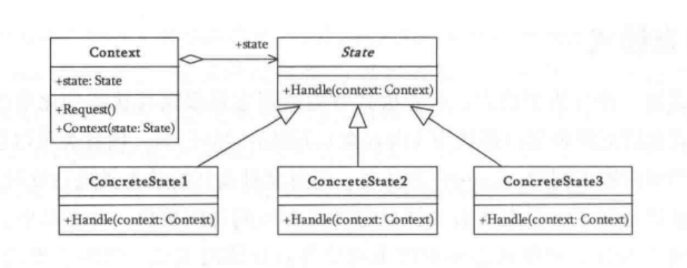
#### 8.3 功能及应用场景

- 状态模式为对象提供了一个清晰的状态表示。
- 它允许一个对象在运行时部分清晰明了地改变其类型。


### 9. 策略设计模式

策略模式主要用于需要使用不同的算法来处理不同的数据（对象）时。这意味着策略模式定义了一系列算法，并且使其可以替换使用。策略模式是一种可以在运行时选择算法的设计模式。
本模式可以使算法独立于调用算法的客户端。策略模式也称为政策模式。在使用多种不同的算法（每种算法都可以对应一个单独的类，而每个类的功能又各不相同）时可以运用策略模式。
#### 9.1 模式中包括的类

- 抽象策略类（Strategy）：定义一个所有算法都支持的通用接口。内容类会使用这个接口来调用由具体策略类定义的各个算法。
- 具体策略类（ ContreteStrategy）：每个具体策略类都会实现一个相应的算法。
- 内容类（ Context）：包含一个对策略对象的引用。它可以定义一个用于策略类访问内容类数据的接口。内容类对象包含了对将要使用的具体策略对象的引用。当需要进行特定操作时，会从对应的策略类对象中运行相应的算法。内容类本身觉察不到策略类的执行。如果有必要的话，还可以定义专用的对象来传递从内容类对象到策略类的数据。内容类对象接收来自客户端的请求，并将其委托给策略类对象。通常具体策略类是由客户端创建，并传递给内容类。从这一点来讲，客户端仅与内容类进行交互。
#### 9.2 UML图
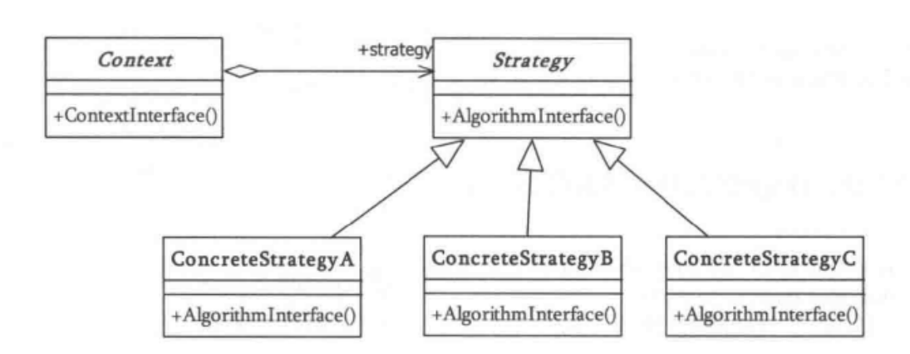
#### 9.3 功能及应用场景
当我们有多种不同的算法可供选择（每种算法都可以对应一个单独的类，而每个类的功能又各不相同）时，可以应用策略模式。策略模式会定义一组算法并能够使其相互替代使用。


### 10. 模板方法设计模式

模板方法会定义算法的各个执行步骤。算法的一个或多个步骤可以由子类通过重写来实现，同时保证算法的完整性并能够实现多种不同的功能。
类行为型模式使用继承来实现模式的功能。在模板方法模式中，会有一个方法（ Template method方法）来定义算法的各个步骤。这些步骤（即方法）的具体实现会放到子类中。也就是说，在模板方法中定义了特定算法，但该算法的具体步骤仍然需要通过子类来定义。模板方法会由一个抽象类来实现在这个抽象类中还会声明该算法的各个步骤（方法），最后将其具体实现的方法声明实现为抽象类的子类。
#### 10.1 模式中包括的类

- 抽象类（ AbstractClass）：定义了算法的抽象操作，并交由具体的子类完成这些操作的具体实现。它实现了一个模板方法，它该方法包含了算法的各个步骤。该模板方法还会在抽象类中定义各个相应步骤的基本操作。
- 具体类（ ConcreteClass）：他们通过执行基本操作来实现算法类的具体步骤。当调用一个具体类时，模板方法代码会从基类执行，而模板方法所使用的各个方法由派生类实现和调用。
#### 10.2 UML图
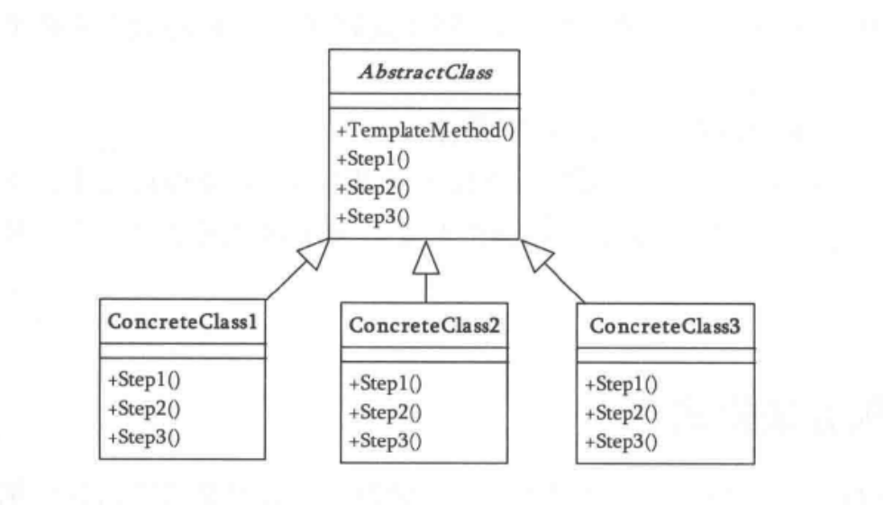
#### 10.3 功能及应用场景
**应用场景：**

- 当一个算法的功能需要能够改变，并通过在子类中对功能重写来实现这种改变。
- 当我们要避免代码重复时，能够在子类中实现算法不同的变化。
- 在一开始，模板方法可能不是一个显而易见的选择。最明显的现象会是当我们发现几乎完全一样的类在执行某些类似的逻辑。这时，我们就应该考虑使用模板方法模式来清理现有代码。
### 11. 访问者设计模式
访问者模式用来简化对象相关操作的分组。这些操作是由访问者来执行的，而不是把这些代码放在被访问的类中。由于访问的操作是由访问者执行的，而不是由被访问的类，这样执行操作的代码会集中在访问者中，而不是分散在对象分组中。这为代码提供了更好的可维护性。访问者模式也避免了使用 instanceof运算符对相似的类执行计算。
#### 11.1 模式中包括的类

- 访问者（ Visitor）：包括一个接口或抽象类，用于声明在所有类型的可访问对象中访问哪些操作。通常操作的名称是相同的，而是由该方法的参数来区分不同的操作。由输入对象类型来决定访问该方法中的哪一个。
- 具体访问者（ Concrete Visitor）：用于实现各个类型的访问者和各个类型的访问方法。它在抽象访问者中进行声明，并各自独立实现。每一个具体访问者会负责实现不同的功能。当定义一个新的访问者时，只需要将其传递给对象结构即可。
- 元素类（Element）：一个抽象对象用于声明所接受的操作。它是一个入口点，能够允许哪一类访问者对象访问。在集合中的每个对象都需要实现该抽象对象，以便相应访问者能够实现对其进行访问。
- 具体元素类（ Concrete Element）：这些类实现了抽象元素类的接口或类，并定义了所接受的操作。通过其可接受的操作，能够将访问者对象传递给该对象。
- 结构对象（ ObjectStruture）：这是一个包含了所有可访问对象的类。它提供了一种机制来遍历所有元素。这种结构不一定是一个集合，也可以是一个极其复杂的结构，如组合对象。
#### 11.2 UML图
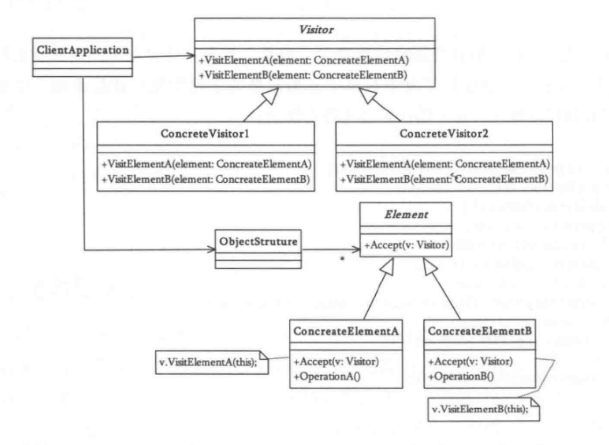
#### 11.3 功能及应用场景
在 visitCollection()方法中，我们调用 Visitable.accept(this)来实现对正确的访问者方法进行调用。这叫作双重分派。访问者调用元素类中的方法，又会回到对访问者类中进行调用。
**模式问题：**
在使用访问者模式的情况下，要想添加新的具体元素（数据结构）会更加困难。添加一个 ConcreteElement会涉及向访问者接口添加新的操作和在每一个具体访问者实现中添加对应的实现。**访问者模式更适用于对象结构非常稳定，而对象的操作却需要经常变化的情况下。**
访问者模式只提供处理每种数据类型的方法，并且让数据对象确定调用哪个方法。由于数据对象本质上都知道其自身的类型，所以在访问者模式中算法决定所调用的方法所起到的作用是微不足道的。
因此，数据的整体处理包括对数据对象的分发以及通过对适当的访问者处理方法的二次分发。这就叫作双重分派。
使用访问者模式的一个主要优点是，对于在我们的数据结构中添加需要执行的新的操作来说，是非常容易的。我们所要做的就是创建一个新的访问者，并定义相应的操作。
访问者模式的主要问题是，因为每个访问者需要有相应的方法来处理每一种可能的具体数据，那么一旦实现了访问者模式，其具体类的数量和类型就不能被轻易改变。