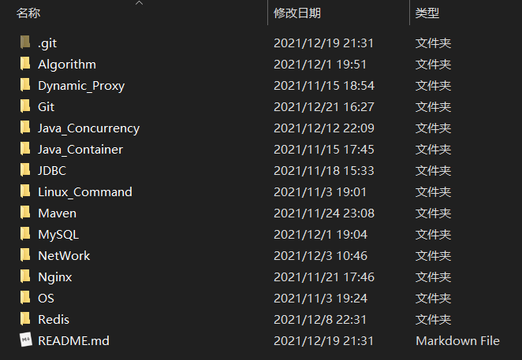
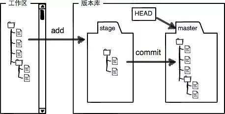
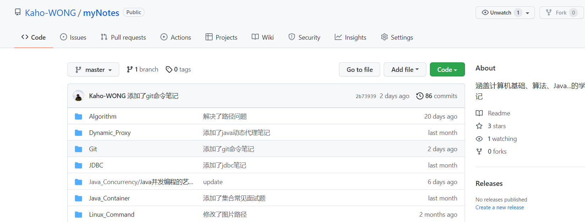
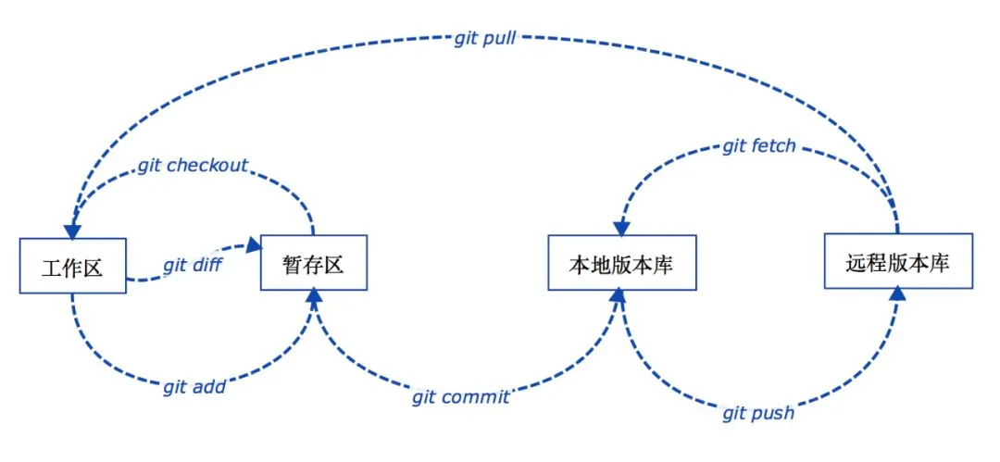
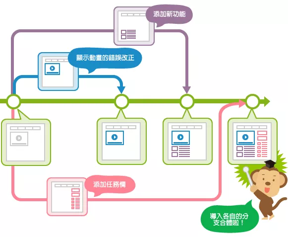
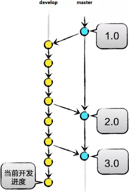
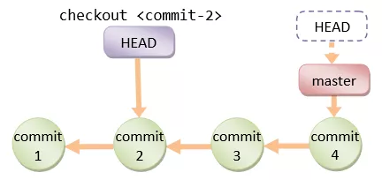
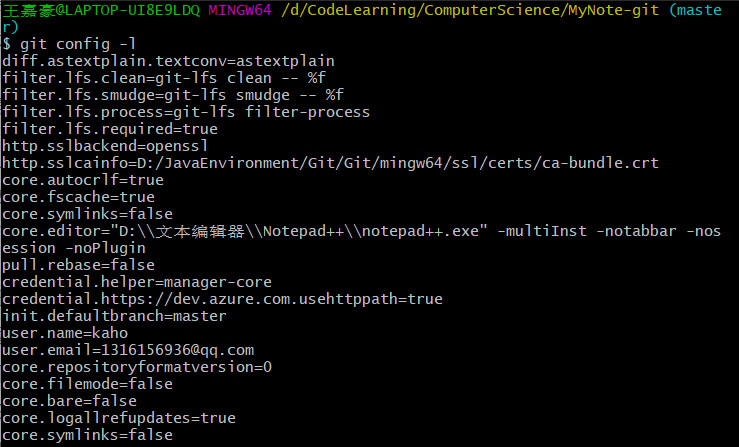
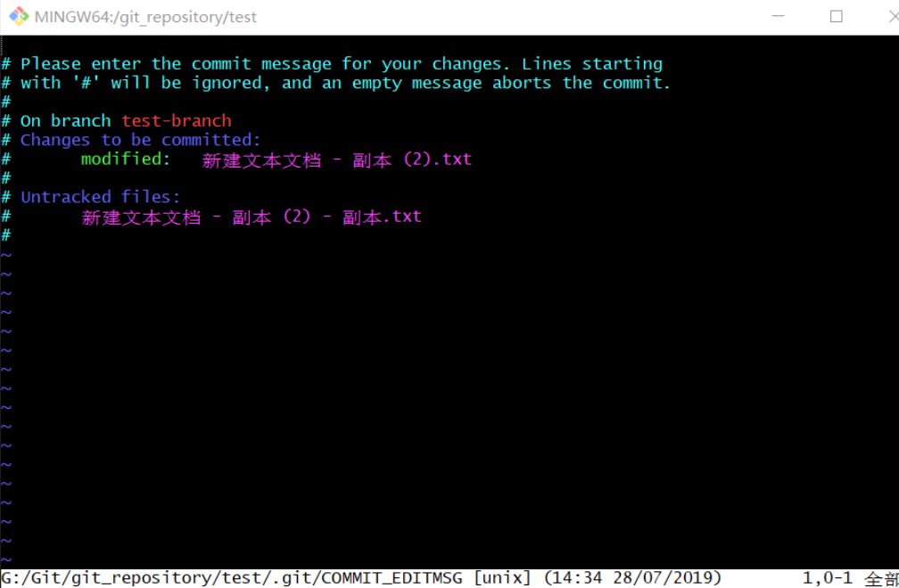

# Git 命令大全

[toc]

## 基本概念

### 工作区（*Working Directory*）

就是你在电脑里能看到的目录，如下：



### 本地版本库（*Local Repository*）

工作区有一个隐藏目录 `.git`，这个不算工作区，而是 `Git` 的版本库。

 

### 暂存区（*stage*）

本地版本库里存了很多东西，其中最重要的就是称为 `stage`（或者叫 index）的暂存区，还有 `Git` 为我们自动创建的第一个分支 `master`，以及指向 `master` 的一个指针叫 `HEAD`。

### 远程版本库（*Remote Repository*）

一般指的是 `Git` 服务器上所对应的仓库，如下：




`工作区`、`暂存区`、`本地版本库`、`远程版本库`之间几个常用的 `Git` 操作流程如下图所示： 

 


### 分支（*Branch*）

分支是为了将修改记录的整个流程分开存储，让分开的分支不受其它分支的影响，所以在同一个数据库里可以同时进行多个不同的修改。

 

### 主分支（*Master*）

前面提到过 `master` 是 `Git` 为我们自动创建的第一个分支，也叫主分支，其它分支开发完成后都要合并到 `master`。

  


### 标签（*Tag*）

标签是用于标记特定的点或提交的历史，通常会用来标记发布版本的名称或版本号（如：`publish/0.0.1`），虽然标签看起来有点像分支，但打上标签的提交是固定的，不能随意的改动，参见上图中的`1.0` / `2.0` / `3.0`。

### HEAD

`HEAD` 指向的就是当前分支的最新提交。

 


## 一、Git 配置相关

> 首次使用 Git，首先是需要配置各种身份信息的，这样当你提交相关任务的时候，别人才能知道这个 commit 是谁提交的。 

### 1. Git 最小配置

（1）配置**全局账户**，也就是该账户对`所有的 Git 仓库`都有效

```shell
git config --global user.name '你的账户名称'
git config --global user.email '你的 Email'
```

 （2）配置**局部账户**，也就是该账户只对`当前 Git 仓库`有效 

```shell
git config --local user.name '你的账户名称' 
git config --local user.email '你的 Email'
```

> 不同点就是一个参数是 `global`（全局），一个是 `local`（本地） 。


### 2. 查看相关配置情况

（1） 查看 `global` 类型的配置情况 

```shell
git config --global --list 
```

（2）查看某个仓库下的配置情况 

```shell
git config --local --list
```

（3）查看所有配置

```shell
git config -l
```



查看不同级别的配置文件：

```shell
#查看系统config
git config --system --list
　　
#查看当前用户（global）配置
git config --global  --list
```


## 二、本地基本操作

> 这部分命令的使用极其频繁，需要熟练掌握。

### 1. 基本操作

#### （1）查看变更情况

```shell
git status
```

#### （2）查看当前工作在哪个分支上 

```shell
git branch -v
```

#### （3）切换到指定分支 

```shell
git checkout 指定分支的名称
```

#### （4）把 `当前目录及其子目录` 下所有变更都加入到 `暂存区` 

```shell
git add . #注意，add 后面是一个 '.'；
```

#### （5）把仓库内 `所有` 变更都加入到 `暂存区` 

```shell
git add -A
```

#### （6）把指定文件添加到 `暂存区` 

```shell
git add 文件1 文件2 ... 文件n
```

####  （7）创建正式的 commit，也就是把当前的数据提交上去 

```shell
git commit
```

> 可以添加 `-m` 参数，直接对本次提交添加描述，如下：
>
> ```shell
> git commit -m "update"
> ```

当该命令没有带 `-m` 参数时，会跳出 `commit change log （COMMIT_EDITMSG）` 界面（如下所示），这个是 vi 编辑器（也有可能是 vim 编辑器），和 Linux 的使用是一样的，因为涉及到是否要保存编辑内容，所以这种提交方式下退出 vi 编辑器的命令有多种：

 

- **保存并退出**

  （1）按 **`Esc`** 键退出编辑模式，英文模式下输入 **`:wq`**，然后回车（write and quit）。

  （2）按 **`Esc`** 键退出编辑模式，大写英文模式下输入 **`ZZ`**，然后回车。

- **不保存退出**

  （1）按 **`Esc`** 键退出编辑模式，英文模式下输入 **`:q!`**，然后回车。

  （2）按 **`Esc`** 键退出编辑模式，英文模式下输入 **`:qa!`**，然后回车。


### 2. 比较差异

#### （1）比较某文件工作区和暂存区的差异

```shell
git diff 某文件
```

#### （2）比较某文件暂存区和 HEAD 的差异

```shell
git diff --cache 某文件
```

#### （3）比较工作区和暂存区的所有差异

```shell
git diff
```

#### （4）比较暂存区和 HEAD 的所有差异

```shell
git diff --cache
```


### 3. 暂存区与工作区之间的回滚

#### （1）把工作区指定文件恢复成和暂存区一样

```shell
git checkout 文件1 文件2 ... 文件n
```

#### （2）把暂存区指定文件恢复成和 HEAD 一样

```shell
git reset 文件1 文件2 ... 文件n
```

#### （3）把暂存区和工作区所有文件恢复成和 HEAD 一样

```shell
git reset --hard
```

#### （4）用 difftool 比较任意两个 commit 的差异

```shell
git difftool commit1 commit2
```

> 注意，从工作区回滚到暂存区用 `checkout`，否则用 `reset`。


### 4. 其他

#### 查看哪些文件没有被 Git 管控

```shell
git ls-files --others
```


## 三、加塞临时任务处理

#### （1）把未处理完的变更先保存到 stash 中

```shell
git stash  #将在当前分支修改的内容放到缓存区中，并会自动建立一个缓存的list集合，方便管理
```

#### （2）临时任务处理完后继续之前的工作

```shell
git stash pop  # pop相当于栈的出栈和入栈一样，把之前的任务弹出来，但是刚才的记录不存在list中
或者
git stash apply  # 和pop不同的是， apply相当于从栈顶把任务取出来，但是刚才的记录还存在list中
```

#### （3）查看所有的 stash

```shell
git stash list
```

#### （4）取回某次 stash 的变更

```shell
git stash pop stash @{数字n}
```


## 四、修改个人分支历史

我们的仓库的内容每次变更执行 `commit` 的时候，都会生成一个新的 `commit`，不过有时候，我们不想产生新的 `commit`，而是想要通过修改之前的 `commit` 来变更仓库的内容，那么就可以使用如下命令：

#### （1）修改最后一次 commit

```shell
1. 在工作区中修改文件
2. git add
3. git commit --amend
```

#### （2）修改中间的 commit(假设代号为 X)

```shell
1. git rebase -i X前面的一个commit的id
2. 在工作区修改文件
3. git add
4. git rebase --contiue
```


## 五、查看变更日志等

#### （1）当前分支各个 commit 用一行显示

```shell
git log --online
```

#### （2）显示最近的 n 个 commit

```shell
git log -n
```

#### （3）用图示显示所有的分支历史

```shell
git log --online --graph --all
```

#### （4）查看涉及到某文件变更的所有 commit

```shell
git log 某文件
```

> 如果 commit（提交）比较多，`git log` 的内容就会比较多；当满屏放不下，就会显示冒号。
>
> 回车（往下滚一行）、空格（往下滚一页）可以继续查看剩余内容；退出：英文状态下 按 **`q`** 可以退出 `git log` 状态。 

#### （5）某文件各行最后修改对应的 commit 以及作者

```shell
git blame 某文件
```


## 六、分支与标签

### 1. 创建新分支

#### （1）基于当前分支创建新分支

```shell
git branch 新分支
```

#### （2）基于指定分支创建新分支

```shell
git branch 新分支 已有分支
```

重命名一个分支：

```shell
git branch -m 旧分支名 新分支名
```

#### （3）基于某个 commit 创建分支

```shell
git branch 新分支 某个commit的id
```

#### （4）创建分支并且切换到该分支

```shell
git checkout -b 新分支
等价于依次执行下面两条指令：
1. git branch 新分支
2. git checkout 新分支
```


### 2. 列出分支

#### （1）列出本地分支

```shell
git branch -v
```

#### （2）列出本地和远端分支

```shell
git branch -av
```

#### （3）列出远端所有分支

```shell
git branch -rv
```

#### （4）列出名称符号某样式的远端分支

```shell
git branch -rv -l '某样式'
```


### 3. 删除分支

#### （1）安全删除本地某分支

```shell
git branch -d 要删除的分支
```

#### （2）强行删除本地分支

```shell
git branch -D 要删除的分支
```

#### （3）删除已合并到 master 分支的所有本地分支

```shell
git branch --merged master | grep -v '^\*\| master' | xargs -n 1 git branch -d
```

#### （4）删除远端 origin 已不存在的所有本地分支

```shell
git remote prune origin
```


### 4. 打标签

#### 从 commit 打上标签

```shell
git tag 标签名 commit的id
```


## 七、两分支之间的集成

#### （1）把 A 分支合入到当前分支，且为 merge 创建 commit

```shell
git merge A分支
```

#### （2）把 A 分支合入到 B 分支，且为 merge 创建 commit

```shell
git merge A分支 B分支 
```

#### （3）把当前分支基于B分支做 rebase，以便把B分支合入到当前分支

```shell
git rebase B分支
```

#### （4）把A分支基于B分支做rebase，以便把B分支合入到A分支

```shell
git rebase B分支 A分支
```

#### （5）用 mergetool 解决冲突

```shell
git mergetool
```


## 八、和远端交互

#### （1）列出所有 remote

```shell
git remote -v
```

#### （2）增加 remote

```shell
git remote add url地址
```

#### （3）删除 remote

```shell
git remote remove remote的名称
```

#### （4）改变 remote 的 name

```shell
git remote rename 旧名称 新名称
```

#### （5）把远端所有分支和标签的变更都拉到本地

```shell
git fetch remote
```

#### （6）把远端分支的变更拉倒本地，且 merge 到本地分支

```shell
git pull remote名称 分支名
```

#### （7）把本地分支 push 到远端

```shell
git push remote名称 分支名
```

#### （8）删除远端分支

```shell
git push remote --delete 远端分支名或者git push remote:远端分支名
```

#### （9）向远端提交指定标签

```shell
git push remote 标签名
```

#### （10）向远端提交所有标签

```shell
git push remote --tags
```

#### （11）从服务器拉取代码

```shell
git clone https://github.com/Kaho-WONG/myNotes.git
```

> 代码下载完成后在当前文件夹中会有一个 `myNotes` 的目录。

#### （12）将本地的代码改动推送到服务器 

```shell
git push origin master
```

 `origin` 指代的是当前的 git 服务器地址，这行命令的意思是把 `master` 分支推送到服务器。 