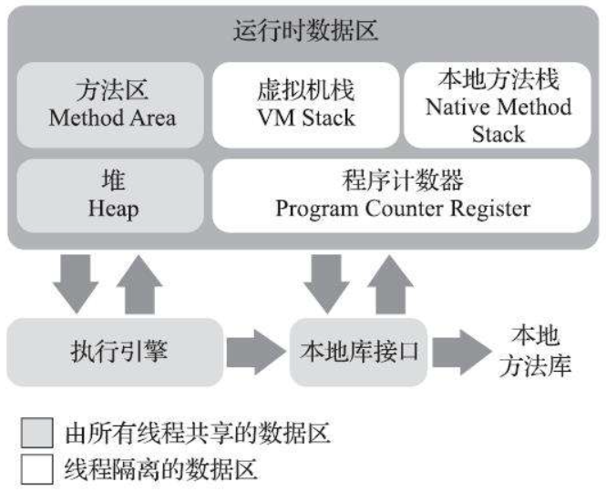
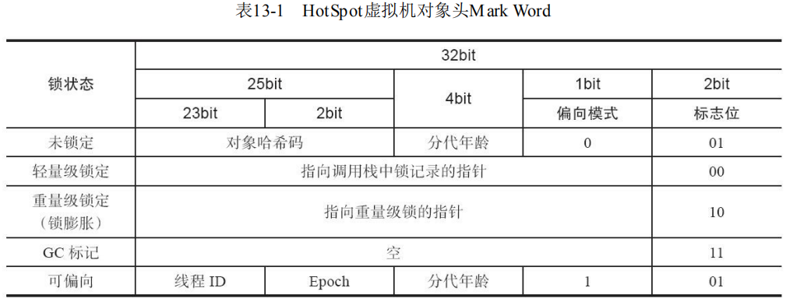

# Java 内存区域

[toc]


# 一、运行时数据区域

Java 虚拟机内存空间包括以下几个运行时数据区域：



- 程序计数器（Program Counter Register）
- Java 虚拟机栈（Java Virtual Machine Stack）
- 本地方法栈（Native Method Stack）
- 堆（Heap）
- 方法区（Method Area）


## 1. 程序计数器

### 1.1 定义

程序计数器是一块较小的内存空间，它可以看作是**当前线程所执行的字节码的行号指示器**。**字节码解释器工作时通过改变这个计数器的值来选取下一条需要执行的字节码指令，分支、循环、跳转、异常处理、线程恢复等功能都需要依赖这个计数器来完成**。

若当前线程正在执行的是一个 **Java 方法**，则计数器记录的是**正在执行的那条虚拟机字节码指令的地址**；若当前线程正在执行的是一个**本地（Native）方法**，那么此时程序计数器值为**空（Undefined）**。 

### 1.2 作用

- 字节码解释器通过改变程序计数器的值来依次读取字节码指令，从而实现代码的流程控制。
- 在多线程环境下，程序计数器记录当前线程执行的位置，从而当线程切换后能够恢复到正确的执行位置。

### 1.3 特点

- 一块较小的内存空间。
- **线程私有**，每条线程都有自己独立的程序计数器。
- 唯一一个不会出现 `OutOfMemoryError` 的内存区域。
- 随线程的创建而创建，随线程的结束而销毁（生命周期与线程相同）。


## 2. Java 虚拟机栈

### 2.1 定义

Java 虚拟机栈描述的是 **Java 方法执行的线程内存模型**：Java 虚拟机栈会为每一个即将执行的 Java 方法创建一块叫做 `栈帧` 的区域，用于存放该方法运行过程中的一些信息，如：

- 局部变量表
- 操作数栈
- 动态连接
- 方法出口信息
- ......

 

**每一个方法被调用直至执行完毕的过程，就对应着一个栈帧在虚拟机栈中从入栈到出栈的过程。**

### 2.2 特点

- 运行速度特别快，仅次于程序计数器。

- Java 虚拟机栈也是**线程私有，生命周期与线程相同**。

- Java 虚拟机栈会出现两种异常：`StackOverFlowError` 和 `OutOfMemoryError`。

  - 若 Java 虚拟机栈的内存大小不允许动态扩展，当线程请求栈的深度超过当前 Java 虚拟机栈的最大深度时，抛出 `StackOverFlowError` 异常。（出现 `StackOverFlowError` 时，内存空间可能还有很多。）
  - 若 Java 虚拟机栈容量允许动态扩展，那么当栈扩展时无法申请到足够的内存时，抛出 `OutOfMemoryError` 异常。
  
  


### 2.3 运行时栈帧结构

Java 虚拟机以方法作为最基本的执行单元，`栈帧` 则是**用于支持虚拟机进行方法调用和方法执行背后的数据结构**，也是虚拟机运行时数据区中的虚拟机栈的栈元素。栈帧存储了方法的局部变量表、操作数栈、动态链接和方法返回地址等信息。

**在编译 Java 程序源码的时候，栈帧中需要多大的局部变量表，需要多深的操作数栈就已经被分析计算出来**，并且写入到方法表的 `Code` 属性之中。【一个栈帧需要分配多少内存，并不会受到程序运行期变量数据的影响，仅仅取决于程序源码和具体的虚拟机实现的栈内存布局形式。】

对于执行引擎来讲，在活动线程中，只有位于栈顶的方法（`当前方法`）是在运行的，只有位于栈顶的栈帧（`当前栈帧`）才是生效的。


#### 2.3.1 局部变量表

一组变量值的存储空间，主要用于**存储方法参数和定义在方法体内部的局部变量**，包括各类**基本数据类型**（`boolean`、`byte`、`char`、`short`、`int`、`float`、`long`、`double`）、**reference 类型**（对一个对象实例的引用）以及 **return address 类型**（指向了一条字节码指令的地址）。 

最基本的存储单元是**变量槽 `slot`**。64 位的数据类型 long 和 double 类型占用连续两个 slot（以高位对齐的方式分配），其余数据类型只占用一个。**局部变量表容量大小（槽数量）是在编译期确定下来的**。

>对于 slot 的理解：
>
>- JVM 会为局部变量表中的每个 slot 都分配一个**访问索引（从 0 开始至局部变量表最大的变量槽数量）**，通过这个索引即可成功访问到局部变量表中指定的局部变量值。
>  - 如果访问的是 32 位数据类型的变量，索引 N 就代表了使用第 N 个变量槽，如果访问的是 64 位数据类型的变量，则说明会同时使用第 N 和第 N+1 两个变量槽（不允许单独访问其中一个，如果遇到会在类加载的校验阶段中抛出异常）。
>- **当一个方法被调用时，JVM 会使用局部变量表来完成参数值到参数变量列表的传递过程，即实参到形参的传递**。如果当前帧是由构造方法或者实例方法（没有被 static 修饰的方法）创建的，那么该对象引用 `this`，会存放在 index 为 0 的 slot 处，其余参数按参数表顺序继续排列，占用从 1 开始的局部变量槽，参数表分配完毕后，再根据方法体内部定义的变量顺序和作用域分配其余的变量槽。
>- 栈帧中的局部变量表中的变量槽是**可以重用的**。如果一个局部变量过了其作用域，那么其作用域之后声明的新的局部变量就有可能会复用过期局部变量的槽位，从而达到节省资源的目的。

在栈帧中，与性能调优关系最密切的部分，就是局部变量表。方法执行时，虚拟机使用局部变量表完成方法的传递；局部变量表中的变量也是重要的垃圾回收根节点，只要被局部变量表中直接或间接引用的对象都不会被回收。

**注意**：关于局部变量表还有一点需要特别注意：

- 对于类变量（类的属性），即使在初始化阶段程序员没有为其赋值也没关系，类变量仍然具有一个确定的初始值，不会产生歧义。

- 对于局部变量，如果一个局部变量定义了但没有赋初始值，那它是完全不能使用的。

  ```java
  public static void main(String[] args) {
      int a;
      System.out.println(a);//报错，因为a是局部变量，需要赋初始值才能使用！
  }
  ```


#### 2.3.2 操作数栈

操作数栈是一个**后入先出（LIFO）**栈。也是**在编译期就将最大深度确定下来**。操作数栈的每一个元素都可以是包括 long 和 double 在内的任意 Java 类型数据。32 位数据类型所占的栈容量为 1，64 为数据类型所占的栈容量为 2。

当一个方法刚刚开始执行的时候，这个方法的操作数栈是空的，在方法执行过程中，会有各种字节码指令往操作数栈中写入和提取内容，也就是入栈和出栈操作。操作数栈中的元素的数据类型必须与字节码指令的序列严格匹配。

两个不同栈帧作为不同方法的虚拟机栈元素，是完全相互独立的。但是在大多数虚拟机的实现里都会进行一些优化处理，**令两个栈帧出现一部分重叠**，不仅节约了一些空间，更重要的是在进行方法调用时就可以直接共用一部分数据，无须进行额外的参数复制传递了。


#### 2.3.3 动态连接

每个栈帧都包含一个指向运行时常量池中该栈帧所述方法的引用，持有这个引用是为了支持方法调用过程中的动态连接。Class 文件的常量池中存在大量的符号引用，字节码中的方法调用指令就以常量池里指向方法的符号引用作为参数。这些符号引用一部分会**在类加载阶段或者第一次使用的时候被转化为直接引用，这种转化称为静态解析**。另一部分将**在每一次运行期间都转化为直接引用，这部分就称为动态连接。**


#### 2.3.4 方法返回地址

当一个方法开始执行后，只有两种方式退出这个方法：

1. **正常调用完成**：执行引擎遇到任意一个方法返回的字节码指令，这时候可能会有返回值传递给上层的方法调用者，方法是否有返回值以及返回值的类型将根据遇到何种方法返回指令来决定。
2. **异常调用完成**：在方法执行过程中遇到了异常，并且这个异常没有在方法体内得到妥善处理。无论是 JVM 内部产生的异常，还是代码中使用 `athrow` 字节码指令产生的异常，只要在本方法的异常表中没有搜索到匹配的异常处理器，就会导致方法退出。（无返回值）

**无论采用何种退出方式，在方法退出之后，都必须返回到最初方法被调用时的位置，程序才能继续执行，方法返回时可能需要在栈帧中保存一些信息，用来帮助恢复它的上层主调方法的执行状态。**

方法退出的过程实际上等同于把当前栈帧出栈，因此退出时可能执行的操作有：恢复上层方法的局部变量表和操作数栈，把返回值（如果有的话）压入调用者栈帧的操作数栈中，调用 PC 计数器的值以指向方法调用指令后面的一条指令等。


## 3. 本地方法栈

### 3.1 定义

本地方法栈是为 JVM **运行 Native 方法**准备的空间。它与 Java 虚拟机栈实现的功能类似，只不过本地方法栈是描述**本地方法运行过程的内存模型**。 

### 3.2 栈帧变化过程

本地方法被执行时，在本地方法栈也会创建一块栈帧，用于存放该方法的局部变量表、操作数栈、动态连接、方法出口信息等。

方法执行结束后，相应的栈帧也会出栈，并释放内存空间。在栈深度溢出或者栈扩展失败时也会抛出 `StackOverFlowError` 和 `OutOfMemoryError` 异常。

>如果 Java 虚拟机本身不支持 Native 方法，或是本身不依赖于传统栈，那么可以不提供本地方法栈。如果支持本地方法栈，那么这个栈一般会在线程创建的时候按线程分配。


## 4. Java 堆

### 4.1 定义

堆是虚拟机所管理的内存中**最大**的一块，是**用来存放对象实例**的内存空间，**`几乎`所有的对象实例都在这里分配内存**。

> Java 世界中“几乎”所有的对象都在堆中分配，但是，随着 JIT 编译器的发展与逃逸分析技术逐渐成熟，栈上分配、标量替换优化技术将会导致一些微妙的变化，所有的对象都分配到堆上也渐渐变得不那么“绝对”了。从 JDK 1.7 开始已经默认开启逃逸分析，如果某些方法中的对象引用没有被返回或者未被外面使用（也就是未逃逸出去），那么对象可以直接在栈上分配内存。

### 4.2 特点

- **线程共享**，整个 Java 虚拟机只有一个堆，所有的线程都访问同一个堆；而程序计数器、Java 虚拟机栈、本地方法栈都是一个线程对应一个。
- **在虚拟机启动时创建**。
- 是垃圾收集器管理的内存区域，是垃圾回收的主要场所（故也称 GC堆）。
- 《Java 虚拟机规范》规定，**堆可以处于物理上不连续的内存空间中**，但在逻辑上它应该被视为连续的。
- 既可以被实现成固定大小的，也可以是**可扩展的**（当前主流）。
- 如果堆中没有内存完成实例分配，并且堆也无法再扩展时，会抛出 `OutOfMemoryError` 异常，主要表现形式如以下几种：
  1. **`java.lang.OutOfMemoryError: GC Overhead Limit Exceeded`**：当 JVM 花太多时间执行垃圾回收并且只能回收很少的堆空间时，就会发生此错误。
  2.  **`java.lang.OutOfMemoryError: Java heap space`**：假如在创建新的对象时, 堆内存中的空间不足以存放新创建的对象, 就会引发此错误。（和配置的最大堆内存有关，且受制于物理内存大小。最大堆内存可通过`-Xmx`参数配置，若没有特别配置，将会使用默认值。）
  3. ......

### 4.3 新生代与老年代

Java 堆是垃圾收集器管理的主要区域，也被称作**GC 堆（Garbage Collected Heap）**。从垃圾回收的角度，由于现在收集器基本都采用**分代垃圾收集算法**，所以 Java 堆还可以细分为：`新生代`和`老年代`；再细致一点有：Eden 空间、From Survivor、To Survivor 空间等。**这样划分的目的是更好地回收内存，或者更快地分配内存**。

- 在 JDK 7 版本及 JDK 7 版本之前，堆内存被通常分为下面三部分：


1. 新生代内存(Young Generation)
2. 老生代(Old Generation)
3. 永久代(Permanent Generation)


- JDK 8 版本之后方法区（HotSpot 的永久代）被彻底移除了（JDK1.7 就已经开始了），取而代之是**元空间**，元空间使用的是**直接内存**。 


**上图所示的 Eden 区、两个 Survivor 区都属于新生代（为了区分，这两个 Survivor 区域按照顺序被命名为 from 和 to），中间一层属于老年代。**

大部分情况，对象都会首先在 Eden 区域分配，在一次新生代垃圾回收后，如果对象还存活，则会进入 s0 或者 s1，并且对象的年龄还会加 1（Eden 区——>Survivor 区后对象的初始年龄变为 1），当它的年龄增加到一定程度（默认为 15 岁），就会被晋升到老年代中。对象晋升到老年代的年龄阈值，可以通过参数 `-XX:MaxTenuringThreshold` 来设置。


## 5. 方法区

### 5.1 定义

《Java 虚拟机规范》中定义方法区是**堆的一个逻辑部分**，是各个线程共享的内存区域 。用于存储以下信息：

- 已经被虚拟机加载的类信息
- 常量
- 静态变量
- 即时编译器编译后的代码缓存
- ......

### 5.2 特点

- **线程共享**。方法区是堆的一个逻辑部分，因此和堆一样，都是线程共享的。整个虚拟机中只有一个方法区。
- 永久代。方法区中的信息一般需要长期存在，而且它又是堆的逻辑分区，因此用堆的划分方法，把方法区称为“永久代”。
- 内存回收效率低。方法区中的信息一般需要长期存在，回收一遍之后可能只有少量信息无效。这区域的内存回收主要目标是：针对常量池的回收和对类型的卸载。
- 《Java 虚拟机规范》对方法区的要求比较宽松。和堆一样，允许固定大小，也允许动态扩展，还允许不实现垃圾收集。
- 如果方法区无法满足新的内存分配需求时，将抛出 `OutOfMemoryError` 异常。


### 5.3 运行时常量池

方法区的一部分，方法区中存储的**常量**就存放在运行时常量池中。

当类被 JVM 加载后，`.class` 文件中的常量池表用于存放**编译期生成的各种字面量和符号引用**，这部分内容会存放到方法区的运行时常量池中。**具备动态性**，在运行期间，可以向常量池中加入新的常量（如 String 类的 `intern()` 方法）。

当常量池无法申请到内存时会抛出 `OutOfMemoryError` 异常。

***


## 6. 直接内存（堆外内存）

直接内存**并非虚拟机运行时数据区的一部分**，也不是《Java 虚拟机规范》中定义的内存区域，但这部分内存也被 Java 频繁使用。

### 6.1 作用

在 JDK 1.4 中新加入的 NIO 类引入了一种基于**通道**和**缓冲**的 I/O 方式。它可以通过调用 Native 函数库直接分配堆外内存，然后通过一个存储在堆中的 `DirectByteBuffer` 对象操作该内存，而无须先将堆外内存中的数据复制到堆中再进行操作，从而提高了数据操作的效率。

直接内存的大小不受 Java 虚拟机控制，但会受到本机总内存大小以及处理器寻址空间的限制，当内存不足动态扩展时就会抛出 `OutOfMemoryError` 异常。

> 服务器管理员在配置虚拟机参数时，会根据实际内存设置 `-Xmx` 等参数信息，但经常忽略直接内存，使得各个内存区域总和大于物理内存限制，从而导致动态扩展时出现 `OutOfMemoryError` 异常。 

### 6.2 堆内存 VS 直接内存

- 直接内存申请空间耗费更大。
- 直接内存读取 IO 的性能要优于普通的堆内存。
- 直接内存作用链： 本地 IO — 直接内存 — 本地 IO
- 堆内存作用链：本地 IO — 直接内存 — 非直接内存 — 直接内存 — 本地 IO


**直接内存的读写操作比普通 Buffer 快，但它的创建、销毁比普通 Buffer 慢**（猜测原因是DirectBuffer需向OS申请内存涉及到用户态内核态切换，而后者则直接从堆内存划内存即可）。

因此**直接内存适用于需要大内存空间且频繁访问的场合，不适用于频繁申请释放内存的场合。**

（Note：DirectBuffer 并没有真正向 OS 申请分配内存，其最终还是通过调用 Unsafe 的 `allocateMemory()` 来进行内存分配。不过 JVM 对 Direct Memory 可申请的大小也有限制，可用 `-XX:MaxDirectMemorySize=1M` 设置，这部分内存不受 JVM 垃圾回收管理。）

### 6.3 使用直接内存的原因

- **对垃圾回收停顿的改善**。由于堆外内存是直接受操作系统管理而不是 JVM，所以当我们使用堆外内存时，即可保持较小的堆内内存规模。从而在 GC 时减少回收停顿对于应用的影响。
- **提升程序 I/O 操作的性能**。通常在 I/O 通信过程中，会存在堆内内存到堆外内存的数据拷贝操作，对于需要频繁进行内存间数据拷贝且生命周期较短的暂存数据，都建议存储到堆外内存。


# 二、HotSpot 虚拟机对象探秘


## 1. 对象的内存布局

在 HotSpot 虚拟机里，对象在堆内存中的存储布局分为三个部分：

- 对象头（Header）
- 实例数据（Instance Data）
- 对齐填充（Padding）

 

**Hotspot 虚拟机的对象头包括两部分信息**，**第一部分用于存储对象自身的运行时数据**（哈希码、GC 分代年龄、锁状态标志等等），称为 `Mark Word`。**另一部分是类型指针**，即对象指向它的类型元数据的指针，虚拟机通过这个指针来确定这个对象是哪个类的实例。



**实例数据部分是对象真正存储的有效信息**，也是在程序中所定义的各种类型的字段内容。

**对齐填充部分不是必然存在的，也没有什么特别的含义，仅仅起占位作用。** 因为 Hotspot 虚拟机的自动内存管理系统要求对象起始地址必须是 8 字节的整数倍，换句话说就是对象的大小必须是 8 字节的整数倍。而对象头部分正好是 8 字节的倍数（1 倍或 2 倍），因此，当对象实例数据部分没有对齐时，就需要通过对齐填充来补全。


## 2. 对象的创建

  

### 2.1 类加载检查

虚拟机遇到一条 new 指令时，首先将去检查这个指令的参数是否能在常量池中定位到这个类的符号引用，并且检查这个符号引用代表的类是否已被加载过、解析和初始化过。如果没有，那必须先执行相应的类加载过程。

### 2.2 分配内存

在**类加载检查**通过后，接下来虚拟机将为新生对象**分配内存**。对象所需的内存大小在类加载完成后便可确定，为对象分配空间的任务等同于把一块确定大小的内存从 Java 堆中划分出来。**分配方式**有 **“指针碰撞”** 和 **“空闲列表”** 两种，**选择哪种分配方式由 Java 堆是否规整决定，而 Java 堆是否规整又由所采用的垃圾收集器是否带有压缩整理功能决定**。

**内存分配的两种方式：** 

选择以上两种方式中的哪一种，取决于 Java 堆内存是否规整。而 Java 堆内存是否规整，取决于 GC 收集器的算法是"标记-清除"，还是"标记-整理"（也称作"标记-压缩"），值得注意的是，复制算法内存也是规整的。

|          |              适用场合              |                             原理                             |    GC收集器    |
| :------: | :--------------------------------: | :----------------------------------------------------------: | :------------: |
| 指针碰撞 | 堆内存规整的情况下（没有内存碎片） | 用过的内存全部整合到一边，没有用过的内存放在另一边，中间有一个分界值指针，只需要向着没用过的内存方向将该指针移动对象内存大小位置即可 | Serial、ParNew |
| 空闲列表 |        堆内存不规整的情况下        | 虚拟机会维护一个列表，该列表中会记录哪些内存块是可用的，在分配的时候，找一块儿足够大的内存块来划分给对象实例，最后更新列表记录 |      CMS       |

**内存分配并发问题：**

在创建对象的时候有一个很重要的问题，就是线程安全，因为在实际开发过程中，创建对象是很频繁的事情，作为虚拟机来说，必须要保证线程是安全的，通常来讲，虚拟机采用两种方式来保证线程安全：

- **CAS+失败重试**： CAS 是**乐观锁**的一种实现方式。所谓乐观锁就是，每次不加锁而是假设没有冲突而去完成某项操作，如果因为冲突失败就重试，直到成功为止。**虚拟机采用 CAS 配上失败重试的方式保证更新操作的原子性。**
- **TLAB**： 为每一个线程预先在 Java 堆的 Eden 区分配一块内存，JVM 在给线程中的对象分配内存时，首先在 TLAB 分配，当对象大于 TLAB 中的剩余内存或 TLAB 的内存已用尽时，再采用上述的 CAS 进行内存分配。

### 2.3 初始化零值

内存分配完成后，虚拟机需要将分配到的内存空间都初始化为零值（不包括对象头），这一步操作保证了对象的实例字段在 Java 代码中可以不赋初始值就直接使用，程序能访问到这些字段的数据类型所对应的零值。

### 2.4 设置对象头

初始化零值完成之后，**虚拟机要对对象进行必要的设置**，例如这个对象是哪个类的实例、如何才能找到类的元数据信息、对象的哈希码、对象的 GC 分代年龄等信息。 **这些信息存放在对象头中。** 另外，根据虚拟机当前运行状态的不同，如是否启用偏向锁等，对象头会有不同的设置方式。

### 2.5 执行 init 方法

在上面工作都完成之后，从虚拟机的视角来看，一个新的对象已经产生了，但从 Java 程序的视角来看，对象创建才刚开始，`<init>` 方法还没有执行，所有的字段都还为零。所以一般来说，执行 new 指令之后会接着执行 `<init>` 方法，把对象按照程序员的意愿进行初始化，这样一个真正可用的对象才算完全产生出来。


## 3. 对象的访问定位

建立对象就是为了使用对象，Java 程序通过栈上的 **reference 数据**来操作堆上的具体对象。对象的访问方式由虚拟机实现而定，目前主流的访问方式有 `使用句柄` 和 `直接指针` 两种：

1. **句柄**：如果使用句柄的话，那么 Java 堆中将会划分出一块内存来作为句柄池，reference 中存储的就是对象的句柄地址，而句柄中包含了对象实例数据与类型数据各自的具体地址信息；


2. **直接指针**：如果使用直接指针访问，那么 Java 堆对象的布局中就必须考虑如何放置访问类型数据的相关信息，而 reference 中存储的直接就是对象的地址。


> 使用句柄来访问的最大好处是 **reference 中存储的是稳定的句柄地址，在对象被移动时只会改变句柄中的实例数据指针，而 reference 本身不需要修改。**
>
> 使用直接指针访问方式最大的好处就是**速度快，它节省了一次指针定位的时间开销。**
>
> HotSpot 主要使用直接指针。
