# JVM 垃圾收集与内存分配

[toc]


**当需要排查各种内存溢出问题、当垃圾收集成为系统达到更高并发的瓶颈时，我们就需要对这些“自动化”的技术实施必要的监控和调节。** 

为了更好地理解 JVM 的垃圾回收，需要注意解决下面的问题：

- 内存是如何分配和回收的？
- 哪些垃圾需要回收？
- 什么时候进行回收？
- 如何回收？


# 1. JVM 内存分配和回收的原理解析

Java 的自动内存管理主要是针对**对象内存的分配**和**对象内存的回收**。更确切的说，Java 自动内存管理的核心是 **堆** 内存中对象的分配与回收。 

Java 堆是垃圾收集器管理的主要区域，也被称作**GC 堆（Garbage Collected Heap）**。从垃圾回收的角度，由于现在收集器基本都采用**分代垃圾收集算法**，所以 Java 堆还可以细分为：`新生代` 和 `老年代`；再细致一点有：`Eden `空间、`From Survivor`、`To Survivor` 空间等。**这样划分的目的是更好地回收内存，或者更快地分配内存。** 

**下图是堆空间的基本结构：** 

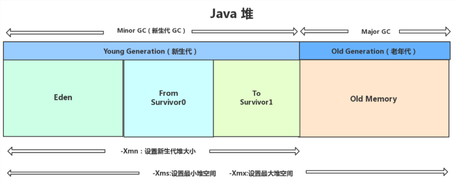

> 上图所示的 `Eden` 区、`From Survivor0` ("From") 区、`To Survivor1` ("To") 区都属于新生代，`Old Memory` 区属于老年代。 

大部分情况，对象都会首先在 `Eden` 区域分配，在一次新生代垃圾回收后，如果对象还存活，则会进入 s0 或者 s1，并且对象的年龄还会加 1(`Eden` 区-> `Survivor` 区后对象的初始年龄变为 1)，当它的年龄增加到一定程度（默认为大于 15 岁），就会被晋升到老年代中。对象晋升到老年代的年龄阈值，可以通过参数 `-XX:MaxTenuringThreshold` 来设置默认值，这个值会在虚拟机运行过程中进行调整，可以通过 `-XX:+PrintTenuringDistribution` 来打印出当次 GC 后的 Threshold。

> “Hotspot 遍历所有对象时，按照年龄从小到大对其所占用的大小进行累积，当累积的某个年龄大小超过了 `survivor` 区的一半时，取这个年龄和 `MaxTenuringThreshold` 中更小的一个值，作为新的晋升年龄阈值”。 

经过这次 GC 后，Eden 区和"From"区已经被清空。这个时候，"From"和"To"会交换他们的角色，也就是新的"To"就是上次 GC 前的“From”，新的"From"就是上次 GC 前的"To"。不管怎样，都会保证名为 To 的 Survivor 区域是空的。Minor GC 会一直重复这样的过程，在这个过程中，有可能当次Minor GC后，Survivor 的"From"区域空间不够用，有一些还达不到进入老年代条件的实例放不下，则放不下的部分会提前进入老年代。


## 针对 GC 的统一定义

- **部分收集（Partial GC）**：指目标不是完整收集整个 Java 堆的垃圾收集，可分为：
  - **新生代收集（Minor GC / Young GC）**：只对**新生代**进行垃圾收集；
  - **老年代收集（Major GC / Old GC）**：只对**老年代**进行垃圾收集。需要注意的是 Major GC 在有的语境中也用于指代整堆收集；
  - **混合收集（Mixed GC）**：对**整个新生代和部分老年代**进行垃圾收集。
-  **整堆收集（Full GC）**：收集**整个 Java 堆和方法区**。 


# 2. 堆内存分配与回收策略

Java 技术体系的自动内存管理，最根本的目标是自动化地解决两个问题：**自动给对象分配内存** 和 **自动回收分配给对象的内存**。

对象的内存分配，从概念上讲，应该都是在**堆**上分配（而实际上也有可能经过即时编译后被拆散为标量类型并间接地在栈上分配）。在经典分代的设计下，**新生对象通常会分配在新生代中，少数情况下（例如对象大小超过一定阈值）也可能直接分配在老年代。**

常见内存分配原则如下：

- **对象优先在 eden 区分配**
- **大对象直接进入老年代**
- **长期存活的对象将进入老年代**


## 2.1 对象优先在 eden 区分配

大多数情况下，对象在新生代中 eden 区分配。当 eden 区没有足够空间进行分配时，虚拟机将发起一次 Minor GC。

## 2.2 大对象直接进入老年代

大对象就是指需要大量连续内存空间的 Java 对象（如很长的字符串、元素数量很庞大的数组）。

在写程序时应该**注意避免大对象**，原因：**在分配空间时，它很容易导致内存明明还有不少空间时就提前触发垃圾收集，以获取足够的连续空间才能安置好它们，而当复制对象时，大对象就意味着高额的内存复制开销。**

## 2.3 长期存活的对象将进入老年代

虚拟机给每个对象定义了一个**对象年龄（Age）计数器**，存储在对象头中。对象通常在 Eden 区里诞生，如果经过第一次 Minor GC 后仍然存活，并且能被 Survivor 容纳的话，该对象会被移动到 Survivor 空间中，并且将其对象年龄设为 1 岁。对象在 Survivor 区中每熬过一次 Minor GC，年龄就增加 1 岁，当它的年龄增加到一定程度（默认为15），就会被晋升到老年代中。

对象晋升老年代的年龄阈值，可以通过参数 `-XX：MaxTenuringThreshold` 设置。 


## 2.4 动态对象年龄判定

为了能更好地适应不同程序的内存状况，HotSpot 虚拟机并不是永远要求对象的年龄必须达到 `- XX：MaxTenuringThreshold` 才能晋升老年代。**如果在 Survivor 空间中相同年龄所有对象大小的总和大于 Survivor 空间的一半，年龄大于或等于该年龄的对象就可以直接进入老年代**，无须等到 `-XX：MaxTenuringThreshold` 中要求的年龄。 


## 2.5 空间分配担保

空间分配担保是为了**确保在 Minor GC 之前老年代本身还有容纳新生代所有对象的剩余空间。** 

- **JDK 6 Update 24之前：**

  在发生Minor GC之前，虚拟机必须先检查老年代最大可用的连续空间是否大于新生代所有对象总空间，如果这个条件成立，那这一次Minor GC可以确保是安全的。如果不成立，则虚拟机会先查看 `-XX：HandlePromotionFailure` 参数的设置值是否允许担保失败（Handle Promotion Failure）；如果允许，那会继续检查老年代最大可用的连续空间是否大于历次晋升到老年代对象的平均大小，如果大于，将尝试进行一次Minor GC，尽管这次Minor GC是有风险的；如果小于，或者 `-XX：HandlePromotionFailure` 设置不允许冒险，那这时就要改为进行一次 Full GC。

- **JDK 6 Update 24之后：**

  只要老年代的连续空间大于新生代对象总大小或者历次晋升的平均大小，就会进行 Minor GC，否则将进行 Full GC。 


# 3. 对象已死？

在堆里面存放着 Java 世界中几乎所有的对象实例，垃圾收集器在对堆进行回收前，第一件事情就是要确定这些对象之中哪些还“存活”着，哪些已经“死去”（“死去”即不可能再被任何途径使用的对象）了。


## 3.1 引用计数算法

在对象中添加一个引用计数器，每当有一个地方引用它时，计数器值就加一；当引用失效时，计数器值就减一；任何时刻计数器为零的对象就是不可能再被使用的。

>这个看似简单 的算法有很多例外情况要考虑，必须要配合大量额外处理才能保证正确地工作，譬如单纯的引用计数就很难解决**对象之间相互循环引用**的问题。 

 所谓对象之间的相互引用问题，如下面代码所示：除了对象 objA 和 objB 相互引用着对方之外，这两个对象之间再无任何引用。但是他们因为互相引用对方，导致它们的引用计数器都不为 0，于是引用计数算法无法通知 GC 回收器回收他们。

```java
public class ReferenceCountingGc {
    Object instance = null;
	public static void main(String[] args) {
		ReferenceCountingGc objA = new ReferenceCountingGc();
		ReferenceCountingGc objB = new ReferenceCountingGc();
		objA.instance = objB;
		objB.instance = objA;
		objA = null;
		objB = null;

	}
}
```


## 3.2 可达性分析算法

通过一系列称为“GC Roots”的根对象作为起始节点集，从这些节点开始，根据引用关系向下搜索，搜索过 程所走过的路径称为“引用链”（Reference Chain），如果某个对象到GC Roots间没有任何引用链相连，或者用图论的话来说就是从GC Roots到这个对象不可达时，则证明此对象是不可能再被使用的。 

如下图所示，对象object 5、object 6、object 7虽然互有关联，但是它们到GC Roots是不可达的，因此它们将会被判定为可回收的对象。

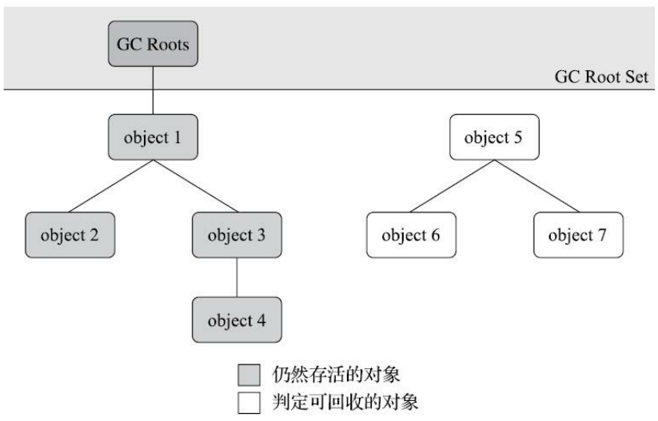

在Java技术体系里面，固定可作为GC Roots的对象包括以下几种： 

- 在虚拟机栈（栈帧中的本地变量表）中引用的对象，譬如各个线程被调用的方法堆栈中使用到的参数、局部变量、临时变量等。 
- 在方法区中类静态属性引用的对象，譬如Java类的引用类型静态变量。 
- 在方法区中常量引用的对象，譬如字符串常量池（String Table）里的引用。·在本地方法栈中JNI（即通常所说的Native方法）引用的对象。 
- Java虚拟机内部的引用，如基本数据类型对应的Class对象，一些常驻的异常对象（比如 `NullPointExcepiton`、`OutOfMemoryError`）等，还有系统类加载器。 
- 所有被同步锁（synchronized关键字）持有的对象。 
- 反映Java虚拟机内部情况的 JMXBean、JVMTI 中注册的回调、本地代码缓存等。

除了这些固定的 GC Roots 集合以外，根据用户所选用的垃圾收集器以及当前回收的内存区域不同，还可以有其他对象“临时性”地加入，共同构成完整GC Roots集合。


## 3.3 再谈引用

无论是通过引用计数算法判断对象的引用数量，还是通过可达性分析算法判断对象是否引用链可达，判定对象是否存活都和“引用”离不开关系。

在 JDK 1.2 版之前，Java 里面的引用是很传统的定义：如果 reference 类型的数据中存储的数值代表的是另外一块内存的起始地址，就称该 reference 数据是代表某块内存、某个对象的引用。

在 JDK 1.2 版之后，Java 对引用的概念进行了扩充，将引用分为 `强引用（Strongly Re-ference）`、`软引用（Soft Reference）`、`弱引用（Weak Reference）` 和 `虚引用（Phantom Reference）` 4种，这 4 种引用强度依次逐渐减弱。 

- **强引用**

  在程序代码之中普遍存在的引用赋值，即类似“Object obj=new Object()”这种引用关系。无论任何情况下，只要强引用关系还存在，垃圾收集器就永远不会回收掉被引用的对象。 

- **软引用**

  用来描述一些还有用但并非必须的对象。对于软引用关联着的对象，在系统将要发生内存溢出异常之前，会把这些对象列进回收范围之中进行第二次回收。如果这次回收后还没有足够的内存，才会抛出内存溢出异常。

- **弱引用**

  也是用来描述非必需对象的，但是它的强度比软引用更弱一些，被弱引用关联的对象只能生存到下一次垃圾收集发生为止。当垃圾收集器工作时，无论当前内存是否足够，都会回收掉只被弱引用关联的对象。 

- **虚引用**

  也叫“幽灵引用”或“幻影引用”，是最弱的一种引用关系。一个对象是否有虚引用的存在，完全不会对其生存时间构成影响，也无法通过虚引用来取得一个对象实例。它的作用是能在这个对象被收集器回收时收到一个系统通知。 


## 3.4 不可达的对象并非“非死不可”

即使在可达性分析法中不可达的对象，也并非是“非死不可”的，这时候它们暂时处于“缓刑阶段”，要真正宣告一个对象死亡，至少要经历两次标记过程：可达性分析法中不可达的对象被第一次标记并且进行一次筛选，筛选的条件是此对象是否有必要执行 `finalize()` 方法。当对象没有覆盖 `finalize()` 方法，或 `finalize()` 方法已经被虚拟机调用过时，虚拟机将这两种情况视为没有必要执行。

被判定为有必要执行的对象将会被放在一个 F-Queue 队列中进行第二次标记，除非这个对象与引用链上的任何一个对象建立关联，否则就会被真的回收。

> `finalize()` 方法是对象逃脱死亡命运的最后一次机会，稍后收集器将对 F-Queue 中的对象进行第二次小规模的标记，如果对象要在 `finalize()` 中成功拯救自己——只要重新与引用链上的任何一个对象建立关联即可，譬如把自己（this关键字）赋值给某个类变量或者对象的成员变量，那在第二次标记时它将被移出“即将回收”的集合；如果对象这时候还没有逃脱，那基本上它就真的要被回收了。
>
> 任何一个对象的 `finalize()` 方法都只会被系统自动调用一次，如果对象面临下一次回收，它的 `finalize()` 方法不会被再次执行


## 3.5 回收方法区

方法区的垃圾收集主要回收两部分内容：`废弃的常量` 和 `不再使用的类型`。

### 3.5.1 如何判断一个常量已废弃？

运行时常量池主要回收的是废弃的常量。那么如何判断一个常量是废弃常量呢？ 

举个常量池中字面量回收的例子，假如一个字符串“java”曾经进入常量池中，但是当前系统又没有任何一个字符串对象的值是“java”，换句话说，已经没有任何字符串对象引用常量池中的“java”常量，且虚拟机中也没有其他地方引用这个字面量。如果在这时发生内存回收，而且垃圾收集器判断确有必要的话，这个“java”常量就将会被系统清理出常量池。常量池中其他类（接口）、方法、字段的符号引用也与此类似。 

**注意：**

>1. **JDK1.7 之前运行时常量池逻辑包含字符串常量池存放在方法区，此时 hotspot 虚拟机对方法区的实现为永久代**
>2. **JDK1.7 字符串常量池被从方法区拿到了堆中, 这里没有提到运行时常量池，也就是说字符串常量池被单独拿到堆,运行时常量池剩下的东西还在方法区, 也就是 hotspot 中的永久代** 。
>3. **JDK1.8 hotspot 移除了永久代，用元空间(Metaspace)取而代之，这时候字符串常量池还在堆，运行时常量池还在方法区，只不过方法区的实现从永久代变成了元空间(Metaspace)**


### 3.5.2 如何判断一个类是无用类？

需要同时满足下面 3 个条件才能算是 **“无用的类”** ：

- 该类所有的实例都已经被回收，也就是 Java 堆中不存在该类的任何实例。
- 加载该类的 `ClassLoader` 已经被回收。
- 该类对应的 `java.lang.Class` 对象没有在任何地方被引用，无法在任何地方通过反射访问该类的方法。

虚拟机可以对满足上述 3 个条件的无用类进行回收，这里说的仅仅是“可以”，而并不是和对象一样不使用了就会必然被回收。


# 4. 垃圾收集算法

## 4.1 分代收集理论

分代收集理论建立在两个分代假说之上：

**1）弱分代假说（Weak Generational Hypothesis）**：绝大多数对象都是朝生夕灭的。 

**2）强分代假说（Strong Generational Hypothesis）**：熬过越多次垃圾收集过程的对象就越难以消亡。

奠定了多款常用的垃圾收集器的一致的设计原则：**收集器应该将 Java 堆划分出不同的区域，然后将回收对象依据其年龄（年龄即对象熬过垃圾收集过程的次数）分配到不同的区域之中存储。**

一般至少会把 Java 堆划分为 `新生代(Young Generation)` 和 `老年代(Old Generation)` 两个区域。顾名思义，在新生代中，每次垃圾收集时都发现有大批对象死去，而每次回收后存活的少量对象，将会逐步晋升到老年代中存放。

但是分代收集存在一个明显的困难：**对象不是孤立的，对象之间会存在跨代引用。**

假如要现在进行一次只局限于新生代区域内的收集（Minor GC），但新生代中的对象是完全有可能被老年代所引用的，为了找出该区域中的存活对象，不得不在固定的GC Roots之外，再额外遍历整个老年代中所有对象来确保可达性分析结果的正确性，反过来也是一样[3]。遍历整个老年代所有对象的方案虽然理论上可行，但无疑会为内存回收带来很大的性能负担。为了解决这个问题，就需要对分代收集理论添加第三条经验法则：

**3）跨代引用假说（Intergenerational Reference Hypothesis）**：跨代引用相对于同代引用来说仅占极少数。

依据这条假说，我们就不应再为了少量的跨代引用去扫描整个老年代，也不必浪费空间专门记录每一个对象是否存在及存在哪些跨代引用，只需**在新生代上建立一个全局的数据结构（该结构被称 为“记忆集”，Remembered Set），这个结构把老年代划分成若干小块，标识出老年代的哪一块内存会 存在跨代引用。此后当发生 Minor GC 时，只有包含了跨代引用的小块内存里的对象才会被加入到 GC Roots 进行扫描。**


## 4.2 标记-清除算法

算法分为“标记”和“清除”两个阶段：首先标记出所有需要回收的对象，在标记完成后，统一回收掉所有被标记的对象，也可以反过来，标记存活的对象，统一回收所有未被标记的对象。

**缺点**：

1. **执行效率不稳定**，如果Java堆中包含大量对象，而且其中大部分是需要被回收的，这时必须进行大量标记和清除的动作，导致标记和清除两个过程的执行效率都随对象数量增长而降低；

2. **内存空间的碎片化问题**，标记、清除之后会产生大量不连续的内存碎片，空间碎片太多可能会导致当以后在程序运行过程中需要分配较大对象时无法找到足够的连续内存而不得不提前触发另一次垃圾收集动作。

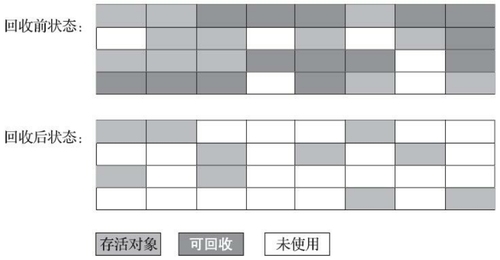


## 4.3 标记-复制算法

标记-复制算法可以解决标记-清除算法面对大量可回收对象时执行效率低的问题，它将可用内存按容量划分为大小相等的两块，每次只使用其中的一块。当这一块的内存用完了，就将还存活着的对象复制到另外一块上面，然后再把已使用过的内存空间一次清理掉。

如果内存中多数对象都是存活的，这种算法将会产生大量的内存间复制的开销，但对于多数对象都是可回收的情况，算法需要复制的就是占少数的存活对象，而且每次都是针对整个半区进行内存回收，分配内存时也就不用考虑有空间碎片的复杂情况，只要移动堆顶指针，按顺序分配即可。这样实现简单，运行高效，不过其缺陷也显而易见，**这种复制回收算法的代价是将可用内存缩小为了原来的一半，空间浪费未免太多了一点。**

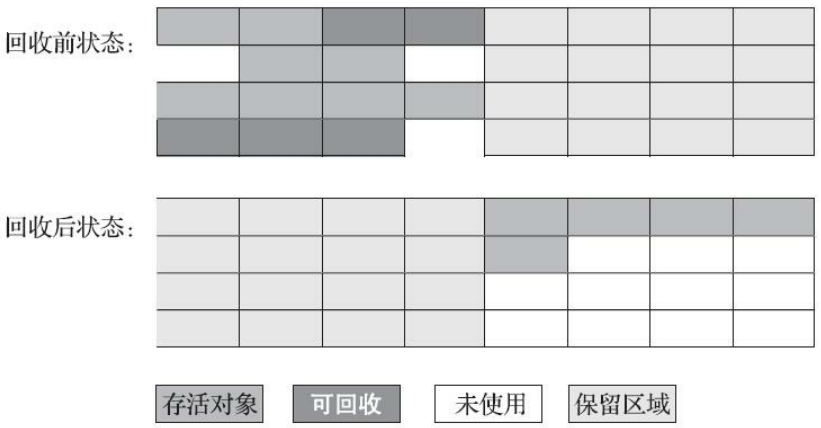

> 现在的商用Java虚拟机大多都优先采用了这种收集算法去回收新生代。


## 4.4 标记-整理算法

其中的标记过程仍然与“标记-清除”算法一样，但后续步骤不是直接对可回收对象进行清理，而是让所有存活的对象都向内存空间一端移动，然后直接清理掉边界以外的内存。

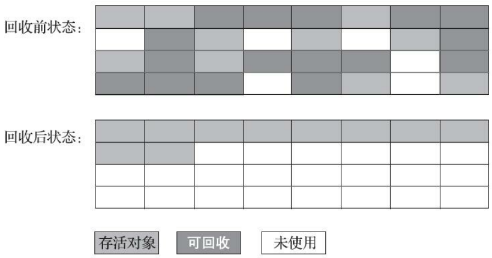


## 4.5 分代收集算法

分代收集算法是目前大部分 JVM 的垃圾收集器采用的算法。它的核心思想是根据对象存活的生命周期将内存划分为若干个不同的区域。一般情况下将堆区划分为 `老年代（Tenured Generation）` 和 `新生代（Young Generation）`，在堆区之外还有一个代就是 `永久代（Permanet Generation）`。

老年代的特点是每次垃圾收集时只有少量对象需要被回收，而新生代的特点是每次垃圾回收时都有大量的对象需要被回收，那么就可以根据不同代的特点采取最适合的收集算法。

**比如在新生代中，每次收集都会有大量对象死去，所以可以选择”标记-复制“算法，只需要付出少量对象的复制成本就可以完成每次垃圾收集。而老年代的对象存活几率是比较高的，而且没有额外的空间对它进行分配担保，所以我们必须选择“标记-清除”或“标记-整理”算法进行垃圾收集。** 


# 5. 垃圾收集器

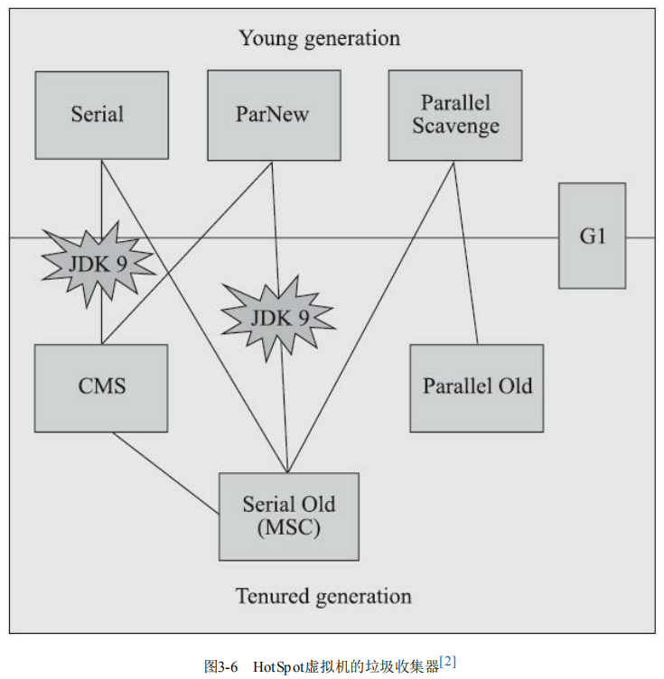

## 5.1 Serial 收集器

Serial收集器是最基础、历史最悠久的收集器，这个收集器是一个**单线程**工作的收集器，但它的“单线程”的意义并不仅仅是说明它只会使用一个处理器或一条收集线程去完成垃圾收集工作，更重要的是强调**在它进行垃圾收集时，必须暂停其他所有工作线程（Stop The World）**，直到它收集结束。

**新生代：标记-复制算法		老年代：标记-整理算法**

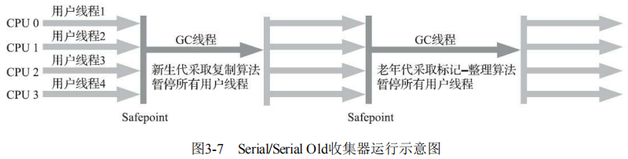

Serial收集器对于运行在**客户端模式**下的虚拟机来说是一个很好的选择，原因如下：

迄今为止，**它依然是HotSpot虚拟机运行在客户端模式下的默认新生代收集器**，有着优于其他收集器的地方，那就是**简单而高效**（与其他收集器的单线程相比），对于内存资源受限的环境，**它是所有收集器里额外内存消耗（Memory Footprint）最小的**；对于单核处理器或处理器核心数较少的环境来说，Serial收集器由于**没有线程交互的开销，专心做垃圾收集**自然可以获得最高的单线程收集效率。


## 5.2 ParNew 收集器

ParNew收集器实质上是Serial收集器的**多线程并行**版本，除了同时使用多条线程进行垃圾收集之外，其余的行为（控制参数、收集算法、Stop The World、对象分配规则、回收策略等）都与Serial收集器完全一致。

**新生代：标记-复制算法		老年代：标记-整理算法**

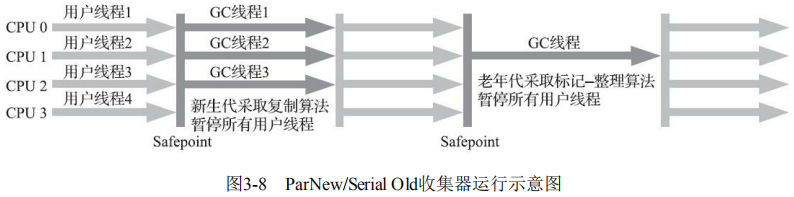

ParNew收集器是不少运行在**服务端模式**下的HotSpot虚拟机首选的**新生代收集器**，除了Serial收集器外，目前只有它能与CMS收集器配合工作。

***

**并行和并发概念补充：**

- **并行（Parallel）** ：指多条垃圾收集线程并行工作，但此时用户线程仍然处于等待状态。
- **并发（Concurrent）**：指用户线程与垃圾收集线程同时执行（但不一定是并行，可能会交替执行），用户程序在继续运行，而垃圾收集器运行在另一个 CPU 上。

***


## 5.3 Parallel Scavenge 收集器

Parallel Scavenge收集器也是一款**新生代收集器**，它同样是基于**标记-复制算法**实现的收集器，也是能够**并行**收集的**多线程**收集器。

Parallel Scavenge收集器的特点是它的关注点与其他收集器不同，CMS等收集器的关注点是尽可能地缩短垃圾收集时用户线程的停顿时间，而**Parallel Scavenge收集器的目标则是达到一个可控制的吞吐量（Throughput）**。所谓吞吐量就是**处理器用于运行用户代码的时间与处理器总消耗时间的比值**，即：

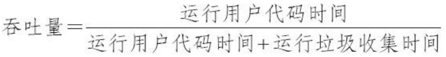

虚拟机会根据当前系统的运行情况收集性能监控信息，动态调整这些参数以提供最合适的停顿时间或者最大的吞吐量。这种调节方式称为垃圾收集的**自适应的调节策略（GC Ergonomics）**。

Parallel Scavenge 收集器提供了很多参数供用户找到最合适的停顿时间或最大吞吐量，如果对于收集器运作不太了解，手工优化存在困难的时候，使用 Parallel Scavenge 收集器配合自适应调节策略，把内存管理优化交给虚拟机去完成也是一个不错的选择。

**新生代：标记-复制算法		老年代：标记-整理算法** 

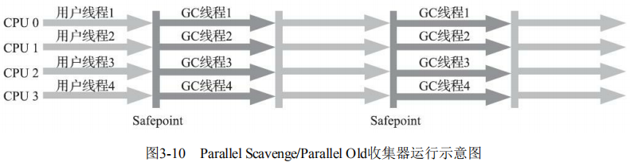

> JDK1.8 默认使用的是 Parallel Scavenge + Parallel Old 


## 5.4 Serial Old 收集器

Serial Old是Serial收集器的**老年代**版本，它同样是一个**单线程**收集器，使用**标记-整理算法**。供**客户端模式**下的HotSpot虚拟机使用。 它主要有两大用途：一种用途是在 JDK1.5 以及以前的版本中与 Parallel Scavenge 收集器搭配使用，另一种用途是作为 CMS 收集器的后备方案，在并发收集发生Concurrent Mode Failure时使用。 

**新生代：标记-复制算法		老年代：标记-整理算法**


## 5.5 Parallel Old 收集器

Parallel Old是Parallel Scavenge收集器的**老年代**版本，支持**多线程并发**收集，基于**标记-整理算法**实现。

**在注重吞吐量或者处理器资源较为稀缺的场合**，都可以优先考虑Parallel Scavenge加Parallel Old收集器这个组合。

**新生代：标记-复制算法		老年代：标记-整理算法** 


## 5.6 CMS 收集器

**CMS（Concurrent Mark Sweep）收集器是一种以获取最短回收停顿时间为目标的收集器。它非常符合在注重用户体验的应用上使用。**

**CMS（Concurrent Mark Sweep）收集器是 HotSpot 虚拟机第一款真正意义上的并发收集器，它首次实现了让垃圾收集线程与用户线程（基本上）同时工作。**

CMS收集器是基于**标记-清除算法**实现的。整个过程分为四个步骤： 

- **初始标记**：暂停所有的其他线程（Stop The World），标记一下GC Roots能**直接关联到**的对象，速度很快。
- **并发标记**：同时开启 GC 和用户线程，用一个闭包结构去记录可达对象。但在这个阶段结束，这个闭包结构并**不能保证包含当前所有的可达对象**。因为用户线程可能会不断的更新引用域，所以 GC 线程无法保证可达性分析的实时性。所以这个算法里会跟踪记录这些发生引用更新的地方。
- **重新标记**：修正并发标记期间因为用户程序继续运行而导致标记产生变动的那一部分对象的标记记录，这个阶段的停顿时间一般会比初始标记阶段的时间稍长，远远比并发标记阶段时间短。
- **并发清除**：开启用户线程，同时 GC 线程开始对未标记的区域做清扫。

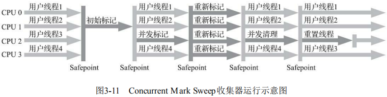

**优点**：并发收集、低停顿。

**缺点**：

1. CMS 收集器对处理器资源非常敏感。

2. 无法处理“浮动垃圾”，有可能出现“Con-current Mode Failure”失败进而导致另一次完全“Stop The World”的Full GC的产生。

   >在CMS的并发标记和并发清理阶段，用户线程是还在继续运行的，程序在运行自然就还会伴随有新的垃圾对象不断产生，但这一部分垃圾对象是出现在标记过程结束以后，CMS无法在当次收集中处理掉它们，只好留待下一次垃圾收集时再清理掉。这一部分垃圾就称为“浮动垃圾”。
   >
   >要是CMS运行期间预留的内存无法满足程序分配新对象的需要，就会出现一次“并发失败”（Concurrent Mode Failure），这时候虚拟机将不得不启动后备预案：冻结用户线程的执行，临时启用Serial Old收集器来重新进行老年代的垃圾收集，但这样停顿时间就很长了。

3. CMS是一款基于“标记-清除”算法实现的收集器，收集结束时会有大量空间碎片产生。


## 5.7 G1 收集器

**G1 (Garbage-First) 是一款面向服务器的垃圾收集器，主要针对配备多颗处理器及大容量内存的机器。以极高概率满足 GC 停顿时间要求的同时，还具备高吞吐量性能特征。**

被视为 JDK1.7 中 HotSpot 虚拟机的一个重要进化特征。它具备一下特点：

- **并行与并发**：G1 能充分利用 CPU、多核环境下的硬件优势，使用多个 CPU（CPU 或者 CPU 核心）来缩短 Stop-The-World 停顿时间。部分其他收集器原本需要停顿 Java 线程执行的 GC 动作，G1 收集器仍然可以通过并发的方式让 java 程序继续执行。
- **分代收集**：虽然 G1 可以**不需要其他收集器配合就能独立管理整个 GC 堆**，但是还是保留了分代的概念。
- **空间整合**：与 CMS 的“标记-清理”算法不同，G1 从整体来看是基于“标记-整理”算法实现的收集器；从**局部上来看是基于“标记-复制”算法实现的**，这意味着**运行期间不会产生内存空间碎片。** 
- **可预测的停顿**：这是 G1 相对于 CMS 的另一个大优势，降低停顿时间是 G1 和 CMS 共同的关注点，但 G1 除了追求低停顿外，还能建立可预测的停顿时间模型，能让使用者明确指定在一个长度为 M 毫秒的时间片段内。

**G1 收集器在后台维护了一个优先列表，每次根据允许的收集时间，优先选择回收价值最大的 Region(这也就是它的名字 Garbage-First 的由来)** 。这种使用 Region 划分内存空间以及有优先级的区域回收方式，保证了 G1 收集器在有限时间内获取尽可能高的收集效率。

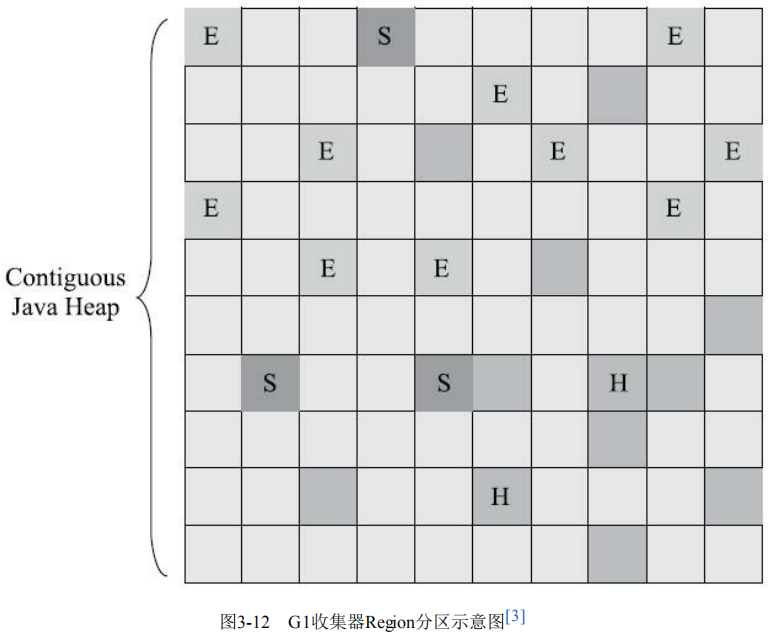

***

> 一个对象和它内部所引用的对象可能不在同一个 Region 中，那么当垃圾回收时，是否需要扫描整个堆内存才能完整地进行一次可达性分析？

不需要！每个 Region 都有一个 Remembered Set（记忆集），用于记录本区域中所有对象引用的对象所在的区域，进行可达性分析时，只要在 GC Roots 中再加上 Remembered Set 即可防止对整个堆内存进行遍历。

***

如果不计算维护 Remembered Set 的操作，G1 收集器的工作过程分为以下几个步骤：

- **初始标记**：Stop The World，仅使用一条初始标记线程对所有与 GC Roots 直接关联的对象进行标记。
- **并发标记**：使用**一条**标记线程与用户线程并发执行。此过程进行可达性分析，速度很慢。
- **最终标记**：Stop The World，使用多条标记线程并发执行。
- **筛选回收**：回收废弃对象，此时也要 Stop The World，并使用多条筛选回收线程并发执行。


 


