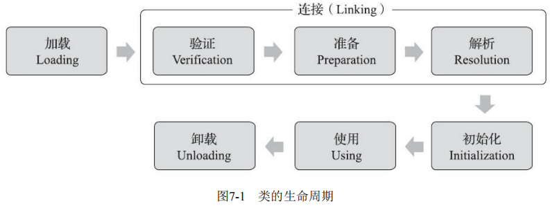
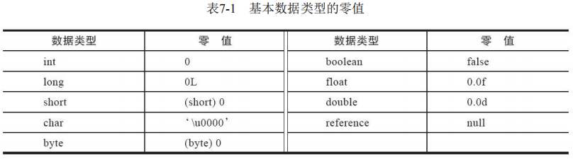
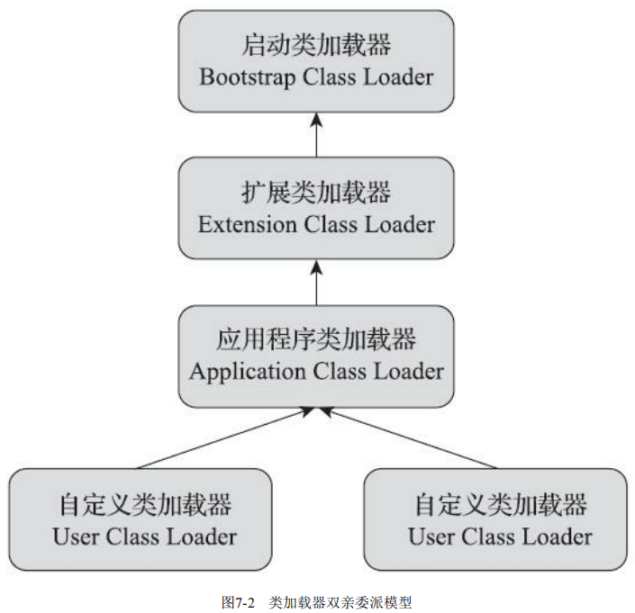

# 虚拟机类加载机制

Java虚拟机把描述类的数据从Class文件加载到内存，并对数据进行校验、转换解析和初始化，最终形成可以被虚拟机直接使用的Java类型，这个过程被称作虚拟机的类加载机制。


## 一、类加载过程

### 1. 类的生命周期

一个类型从被加载到虚拟机内存中开始，到卸载出内存为止，它的整个生命周期将会经历 `加载(Loading)`、`验证(Verification)`、`准备(Preparation)`、`解析(Resolution)`、`初始化(Initialization)`、`使用(Using)` 和 `卸载(Unloading)` 七个阶段，其中验证、准备、解析三个部分统称为 `连接(Linking)`。



加载、验证、准备、初始化和卸载这五个阶段的顺序是确定的，类型的加载过程必须按照这种顺序按部就班地开始，而解析阶段则不一定：它在某些情况下可以在初始化阶段之后再开始，这是为了支持Java语言的运行时绑定特性（也称为动态绑定或晚期绑定）。这些阶段通常都是互相**交叉地混合进行**的，会在一个阶段执行的过程中调用、激活另一个阶段。 


### 2. 类加载的过程

类加载的全过程主要包含**加载**、**验证**、**准备**、**解析**和**初始化**这五个阶段。

#### 加载

“加载”（Loading）阶段是整个“类加载”（Class Loading）过程中的第一个阶段，Java虚拟机需要完成以下三件事情：

1. 通过一个类的**全限定名**来获取定义此类的二进制字节流。 
2. 将这个字节流所代表的静态存储结构转化为方法区的运行时数据结构。 
3. 在内存中生成一个代表这个类的 `java.lang.Class` 对象，作为方法区这个类的各种数据的访问入口。

> 虚拟机规范上面这 3 点并不具体，因此是非常灵活的。比如："通过全类名获取定义此类的二进制字节流" 并没有指明具体从哪里获取、怎样获取。比如：比较常见的就是从 `ZIP` 包中读取（日后出现的 `JAR`、`EAR`、`WAR` 格式的基础）、其他文件生成（典型应用就是 `JSP`）等等。

相对于类加载过程的其他阶段，**非数组类型**的加载阶段（准确地说，是加载阶段中获取类的二进制字节流的动作）是开发人员**可控性最强的阶段**。加载阶段既可以使用Java虚拟机里内置的引导类加载器来完成，也可以由用户自定义的类加载器去完成，开发人员通过定义自己的类加载器去控制字节流的获取方式（重写一个类加载器的 `findClass()` 或 `loadClass()` 方法），实现根据自己的想法来赋予应用程序获取运行代码的动态性。 

对于数组类而言，情况就有所不同，**数组类本身不通过类加载器创建，它是由Java虚拟机直接在内存中动态构造出来的。**


加载阶段结束后，Java虚拟机外部的二进制字节流就按照虚拟机所设定的格式存储在方法区之中了，方法区中的数据存储格式完全由虚拟机实现自行定义，《Java虚拟机规范》未规定此区域的具体数据结构。

类型数据妥善安置在方法区之后，会在Java**堆内存**中实例化一个 `java.lang.Class` 类的对象，这个对象将作为程序访问方法区中的类型数据的外部接口。 

加载阶段与连接阶段的部分动作（如一部分字节码文件格式验证动作）是交叉进行的，加载阶段尚未完成，连接阶段可能已经开始。


#### 验证

这一阶段的目的是确保Class文件的字节流中包含的信息符合《Java虚拟机规范》的全部约束要求，保证这些信息被当作代码运行后不会危害虚拟机自身的安全。 

验证阶段大致上会完成下面四个阶段的检验动作：**文件格式验证**、**元数据验证**、**字节码验证**和**符号引用验证**。 

##### 1. 文件格式验证

**验证字节流是否符合Class文件格式的规范，并且能被当前版本的虚拟机处理**。保证输入的字节流能正确地解析并存储于方法区之内，格式上符合描述一个Java类型信息的要求。

可能包括下面这些验证点： 

- 是否以魔数 `0xCAFEBABE` 开头。 
- 主、次版本号是否在当前Java虚拟机接受范围之内。 
- 常量池的常量中是否有不被支持的常量类型（检查常量tag标志）。 
- 指向常量的各种索引值中是否有指向不存在的常量或不符合类型的常量。 
- `CONSTANT_Utf8_info` 型的常量中是否有不符合UTF-8编码的数据。 
- Class文件中各个部分及文件本身是否有被删除的或附加的其他信息。 
- ……

##### 2. 元数据验证

**对字节码描述的信息进行语义分析，以保证其描述的信息符合《Java语言规范》的要求**，这个阶段可能包括的验证点如下： 

- 这个类是否有父类（除了 `java.lang.Object` 之外，所有的类都应当有父类）。 
- 这个类的父类是否继承了不允许被继承的类（被 `final` 修饰的类）。 
- 如果这个类不是抽象类，是否实现了其父类或接口之中要求实现的所有方法。 
- 类中的字段、方法是否与父类产生矛盾（例如覆盖了父类的 `final` 字段，或者出现不符合规则的方法重载，例如方法参数都一致，但返回值类型却不同等）。 
- …… 

##### 3. 字节码验证 

最复杂的一个阶段，**通过数据流分析和控制流分析，确定程序语义是合法的、符合逻辑的**。这阶段就要对类的方法体（Class文件中的Code属性）进行校验分析，保证被校验类的方法在运行时不会做出危害虚拟机安全的行为，例如： 

- 保证任意时刻操作数栈的数据类型与指令代码序列都能配合工作，例如不会出现类似于“在操作栈放置了一个 `int` 类型的数据，使用时却按 `long` 类型来加载入本地变量表中”这样的情况。 
- 保证任何跳转指令都不会跳转到方法体以外的字节码指令上。 
- 保证方法体中的类型转换总是有效的，例如可以把一个子类对象赋值给父类数据类型，这是安全的，但是把父类对象赋值给子类数据类型，甚至把对象赋值给与它毫无继承关系、完全不相干的一个数据类型，则是危险和不合法的。 
- …… 

##### 4. 符号引用验证

符号引用验证可以看作是**对类自身以外（常量池中的各种符号引用）的各类信息进行匹配性校验**，通俗来说就是，该类是否缺少或者被禁止访问它依赖的某些外部类、方法、字段等资源。**确保解析行为能正常执行**。

本阶段通常需要校验下列内容： 

- 符号引用中通过字符串描述的全限定名是否能找到对应的类。 
- 在指定类中是否存在符合方法的字段描述符及简单名称所描述的方法和字段。 
- 符号引用中的类、字段、方法的可访问性（`private`、`protected`、`public`、`<package>`）是否可被当前类访问。 
- …… 


#### 准备

准备阶段是正式为类中定义的变量（即静态变量，被 `static` 修饰的变量）分配内存并设置类变量初始值的阶段。这些变量所使用的内存都应当在方法区中进行分配。

**注意：**

- 这时候进行内存分配的仅包括类变量（即静态变量，被 `static` 关键字修饰的变量），而不包括实例变量。实例变量会在对象实例化时随着对象一块分配在 Java 堆中。
- 从概念上讲，类变量所使用的内存都应当在 **方法区** 中进行分配。不过有一点需要注意的是：JDK 7 之前，HotSpot 使用永久代来实现方法区的时候，实现是完全符合这种逻辑概念的。 而在 JDK 7 及之后，HotSpot 已经把原本放在永久代的字符串常量池、静态变量等移动到堆中，这个时候类变量则会随着 Class 对象一起存放在 Java 堆中。
- 这里所设置的初始值"通常情况"下是数据类型默认的零值（如 0、0L、null、false 等），比如我们定义了`public static int value=123` ，那么 value 变量在准备阶段的初始值就是 0 而不是 123（初始化阶段才会赋值）。特殊情况：比如给 value 变量加上了 `final` 关键字，即 `public static final int value=123` ，那么准备阶段 value 的值就被赋值为 123。




#### 解析

解析阶段是**虚拟机将常量池内的符号引用替换为直接引用的过程**。解析动作主要针对类或接口、字段、类方法、接口方法、方法类型、方法句柄和调用限定符 7 类符号引用进行。

- **符号引用（Symbolic References）**：符号引用**以一组符号来描述所引用的目标，符号可以是任何形式的字面量**，只要使用时能无歧义地定位到目标即可。符号引用**与虚拟机实现的内存布局无关**，引用的目标并不一定是已经加载到虚拟机内存当中的内容。各种虚拟机实现的内存布局可以各不相同， 但是它们能接受的符号引用必须都是一致的，因为符号引用的字面量形式明确定义在《Java虚拟机规范》的Class文件格式中。 
- **直接引用（Direct References）**：直接引用**是可以直接指向目标的指针、相对偏移量或者是一个能间接定位到目标的句柄**。直接引用是**和虚拟机实现的内存布局直接相关**的，同一个符号引用在不同虚拟机实例上翻译出来的直接引用一般不会相同。如果有了直接引用，那引用的目标必定已经在虚拟机的内存中存在。 

在程序实际运行时，只有符号引用是不够的，举个例子：在程序执行方法时，系统需要明确知道这个方法所在的位置。Java 虚拟机为每个类都准备了一张方法表来存放类中所有的方法。当需要调用一个类的方法的时候，只要知道这个方法在方法表中的偏移量就可以直接调用该方法了。通过解析操作符号引用就可以直接转变为目标方法在类中方法表的位置，从而使得方法可以被调用。

综上，解析阶段是虚拟机将常量池内的符号引用替换为直接引用的过程，也就是**得到类或者字段、方法在内存中的指针或者偏移量**。


#### 初始化

初始化阶段是**执行初始化方法 ` <clinit>()`方法的过程**，是类加载的最后一步，直到初始化阶段，Java虚拟机才真正开始执行类中编写的Java程序代码，将主导权移交给应用程序。

>`<clinit>()` 并不是程序员在Java代码中直接编写的方法，它是**Javac编译器的自动生成物**。
>
>1. `<clinit>()` 方法是由编译器自动收集类中的所有类变量的赋值动作和静态语句块（`static{}`块）中的语句合并产生的，编译器收集的顺序是由语句在源文件中出现的顺序决定的，**静态语句块中只能访问到定义在静态语句块之前的变量，定义在它之后的变量，在前面的静态语句块可以赋值，但是不能访问**。
>2. `<clinit>()` 方法与类的构造函数（即在虚拟机视角中的实例构造器 `<init>()` 方法）不同，它不需要显式地调用父类构造器，Java虚拟机会保证在子类的 `<clinit>()` 方法执行前，父类的 `<clinit>()` 方法已经执行完毕。因此在Java虚拟机中第一个被执行的 `<clinit>()` 方法的类型肯定是 `java.lang.Object`。 
>3. 由于父类的 `<clinit>()` 方法先执行，也就意味着父类中定义的静态语句块要优先于子类的变量赋值操作。
>4. `<clinit>()` 方法对于类或接口来说并不是必需的，如果一个类中没有静态语句块，也没有对变量的赋值操作，那么编译器可以不为这个类生成 `<clinit>()` 方法。
>5.  接口中不能使用静态语句块，但仍然有变量初始化的赋值操作，因此接口与类一样都会生成 `<clinit>()` 方法。但**接口与类不同的是，执行接口的 `<clinit>()` 方法不需要先执行父接口的 `<clinit>()` 方法，因为只有当父接口中定义的变量被使用时，父接口才会被初始化。**此外，接口的实现类在初始化时也一样不会执行接口的 `<clinit>()` 方法。
>6. Java虚拟机必须保证一个类的 `<clinit>()` 方法在多线程环境中被正确地加锁同步，如果多个线程同时去初始化一个类，那么只会有其中一个线程去执行这个类的 `<clinit>()` 方法，其他线程都需要阻塞等待，直到活动线程执行完毕 `<clinit>()` 方法。

《Java虚拟机规范》严格规定了**有且只有**六种情况必须立即对类进行“初始化”（而加载、验证、准备自然需要在此之前开始）： 

1. 遇到 `new`、`getstatic`、`putstatic` 或 `invokestatic` 这四条字节码指令时，如果类型没有进行过初始化，则需要先触发其初始化阶段。能够生成这四条指令的典型Java代码场景有： 

   - 使用new关键字实例化对象的时候。 

   - 读取或设置一个类型的静态字段（被final修饰、已在编译期把结果放入常量池的静态字段除外）的时候。

   - 调用一个类型的静态方法的时候。 

2. 使用 `java.lang.reflect` 包的方法对类型进行反射调用的时候，如果类型没有进行过初始化，则需要先触发其初始化。
3. 当初始化类的时候，如果发现其父类还没有进行过初始化，则需要先触发其父类的初始化。 
4. 当虚拟机启动时，用户需要指定一个要执行的主类（包含 `main()` 方法的那个类），虚拟机会先初始化这个主类。 
5. 当使用JDK 7新加入的动态语言支持时，如果一个 `java.lang.invoke.MethodHandle` 实例最后的解析结果为 `REF_getStatic`、`REF_putStatic`、`REF_invokeStatic`、`REF_newInvokeSpecial` 四种类型的方法句柄，并且这个方法句柄对应的类没有进行过初始化，则需要先触发其初始化。 
6. 当一个接口中定义了JDK 8新加入的默认方法（被 `default` 关键字修饰的接口方法）时，如果有这个接口的实现类发生了初始化，那该接口要在其之前被初始化。 

这六种场景中的行为称为对一个类型进行**主动引用**。除此之外，所有引用类型的方式都不会触发初始化，称为**被动引用**。

**被动引用的例子：**

- 通过子类引用父类的静态字段，不会导致子类初始化

  对于静态字段，只有直接定义这个字段的类才会被初始化，因此通过其子类来引用父类中定义的静态字段，只会触发父类的初始化而不会触发子类的初始化。

- 通过数组定义来引用类，不会触发此类的初始化

- 常量在编译阶段会存入调用类的常量池中，本质上没有直接引用到定义常量的类，因此不会触发定义常量的类的初始化

> 同一个类加载器下，一个类型只会被初始化一次。


#### 卸载（不属于类加载过程）

卸载类即该类的 Class 对象被 GC。

卸载类需要满足 3 个要求:

1. 该类的所有的实例对象都已被 GC，也就是说堆不存在该类的实例对象。
2. 该类没有在其他任何地方被引用
3. 该类的类加载器的实例已被 GC

所以，在 JVM 生命周期内，由 jvm 自带的类加载器加载的类是不会被卸载的。但是由我们自定义的类加载器加载的类是可能被卸载的。

jdk 自带的 `BootstrapClassLoader`, `ExtClassLoader`, `AppClassLoader` 负责加载 jdk 提供的类，所以它们(类加载器的实例)肯定不会被回收。而我们自定义的类加载器的实例是可以被回收的，所以使用我们自定义加载器加载的类是可以被卸载掉的。


## 二、类与类加载器

**类与类加载器的关系：**

类加载器虽然只用于实现类的加载动作，但它在Java程序中起到的作用却远超类加载阶段。例如：比较两个类是否“相等”，只有在这两个类是由同一个类加载器加载的前提下才有意义，否则，即使这两个类来源于同一个Class文件，被同一个Java虚拟机加载，只要加载它们的类加载器不同，那这两个类就必定不相等。这里所指的“相等”，包括代表类的Class对象的 `equals()` 方法、`isAssignableFrom()` 方法、`isInstance()` 方法的返回结果，也包括了使用 `instanceof` 关键字做对象所属关系判定等各种情况。


### 1. 类加载器种类

 JVM 中内置了三个重要的 ClassLoader，除了 BootstrapClassLoader 其他类加载器均由 Java 实现且全部继承自 `java.lang.ClassLoader`： 

- **BootstrapClassLoader(启动类加载器)** ：最顶层的类加载器，由 C++实现，负责加载存放在 `<JAVA_HOME>/lib` 目录下的 jar 包和类或者被 `-Xbootclasspath` 参数指定的路径中的所有类。
- **ExtensionClassLoader(扩展类加载器)** ：主要负责加载 `<JRE_HOME>/lib/ext` 目录下的 jar 包和类，或被 `java.ext.dirs` 系统变量所指定的路径下的所有类库。
- **AppClassLoader(应用程序类加载器)** ：面向用户的加载器，负责加载用户类路径（ClassPath）下所有的类库。由于应用程序类加载器是 `ClassLoader` 类中的 `getSystemClassLoader()` 方法的返回值，所以有些场合中也称它为“系统类加载器”。开发者同样可以直接在代码中使用这个类加载器。如果应用程序中没有自定义过自己的类加载器，一般情况下这个就是程序中默认的类加载器。


### 2. 双亲委派模型

#### 2.1 概念

每一个类都有一个对应它的类加载器。系统中的 ClassLoader 在协同工作的时候会默认使用 **双亲委派模型** 。双亲委派模型要求**除了顶层的启动类加载器外，其余的类加载器都应有自己的父类加载器**。不过这里类加载器之间的父子关系一般不是以继承（Inheritance）的关系来实现的，而是通常使用组合（Composition）关系来复用父加载器的代码。 



#### 2.2 双亲委派模型的工作过程

在类加载的时候，系统会首先判断当前类是否被加载过。已经被加载的类会直接返回，否则才会尝试加载。如果一个类加载器收到了类加载的请求，它首先不会自己去尝试加载这个类，而是把该请求委派给父类加载器的 `loadClass()` 处理，每一个层次的类加载器都是如此，因此所有的请求最终都应该传送到顶层的启动类加载器 `BootstrapClassLoader` 中。只有当父加载器反馈自己无法完成这个加载请求（它的搜索范围中没有找到所需的类）时，子加载器才会尝试自己去完成加载。 当父类加载器为 null 时，会使用启动类加载器 `BootstrapClassLoader` 作为父类加载器。

#### 2.3 使用双亲委派模型的好处

Java中的类随着它的类加载器一起具备了一种带有优先级的层次关系。例如类 `java.lang.Object`，它存放在 `rt.jar` 之中，无论哪一个类加载器要加载这个类，最终都是委派给处于模型最顶端的启动类加载器进行加载，因此 `Object` 类在程序的各种类加载器环境中都能够保证是同一个类。反之，如果没有使用双亲委派模型，都由各个类加载器自行去加载的话，如果用户自己也编写了一个名为 `java.lang.Object` 的类，并放在程序的 ClassPath 中，那系统中就会出现多个不同的 `Object` 类，Java类型体系中最基础的行为也就无从保证，应用程序将会变得一片混乱。

#### 2.4 双亲委派模型的代码实现

实现双亲委派的代码都集中在 `java.lang.ClassLoader` 的 `loadClass()` 方法中：

```java
private final ClassLoader parent;
protected Class<?> loadClass(String name, boolean resolve) throws ClassNotFoundException
{
    synchronized (getClassLoadingLock(name)) {
        // 首先，检查请求的类是否已经被加载过
        Class<?> c = findLoadedClass(name);
        if (c == null) {
            long t0 = System.nanoTime();
            try {
                if (parent != null) {//父加载器不为空，调用父加载器loadClass()方法处理
                    c = parent.loadClass(name, false);
                } else {//父加载器为空，使用启动类加载器 BootstrapClassLoader 加载
                    c = findBootstrapClassOrNull(name);
                }
            } catch (ClassNotFoundException e) {
                //抛出异常说明父类加载器无法完成加载请求
            }

            if (c == null) {
                long t1 = System.nanoTime();
                //自己尝试加载
                c = findClass(name);

                // this is the defining class loader; record the stats
                sun.misc.PerfCounter.getParentDelegationTime().addTime(t1 - t0);
                sun.misc.PerfCounter.getFindClassTime().addElapsedTimeFrom(t1);
                sun.misc.PerfCounter.getFindClasses().increment();
            }
        }
        if (resolve) {
            resolveClass(c);
        }
        return c;
    }
}
```

**逻辑**：先检查请求加载的类型是否已经被加载过，若没有则调用父加载器的 `loadClass()` 方法，若父加载器为空则默认使用启动类加载器作为父加载器。假如父类加载器加载失败，抛出 `ClassNotFoundException` 异常的话，才调用自己的 `findClass()` 方法尝试进行加载。 


#### 2.5 如何实现一个自定义的类加载器？如何打破双亲委派模型？

自定义加载器的话，需要继承 `ClassLoader` 。如果不想打破双亲委派模型，就重写 `ClassLoader` 类中的 `findClass()` 方法即可，无法被父类加载器加载的类最终会通过这个方法被加载。

但是，如果想打破双亲委派模型则需要重写 `loadClass()` 方法.


#### 2.6 有哪些实际场景是需要打破双亲委派模型的？

JNDI 服务，它的代码由启动类加载器去加载，但 JNDI 的目的就是对资源进行集中管理和查找，它需要调用独立厂商实现并部署在应用程序的 classpath 下的 JNDI 接口提供者 (SPI, Service Provider Interface) 的代码，但启动类加载器不可能“认识”之些代码，该怎么办？

为了解决这个困境，Java 设计团队只好引入了一个不太优雅的设计：**线程上下文件类加载器(Thread Context ClassLoader)**。这个类加载器可以通过 `java.lang.Thread` 类的 `setContextClassLoader()` 方法进行设置，如果创建线程时还未设置，它将会从父线程中继承一个；如果在应用程序的全局范围内都没有设置过，那么这个类加载器默认就是应用程序类加载器。有了线程上下文类加载器，JNDI 服务使用这个线程上下文类加载器去加载所需要的 SPI 代码，也就是父类加载器请求子类加载器去完成类加载动作，这种行为实际上就是打通了双亲委派模型的层次结构来逆向使用类加载器，已经违背了双亲委派模型，但这也是无可奈何的事情。Java 中所有涉及 SPI 的加载动作基本上都采用这种方式，例如 JNDI、JDBC、JCE、JAXB 和 JBI 等。

