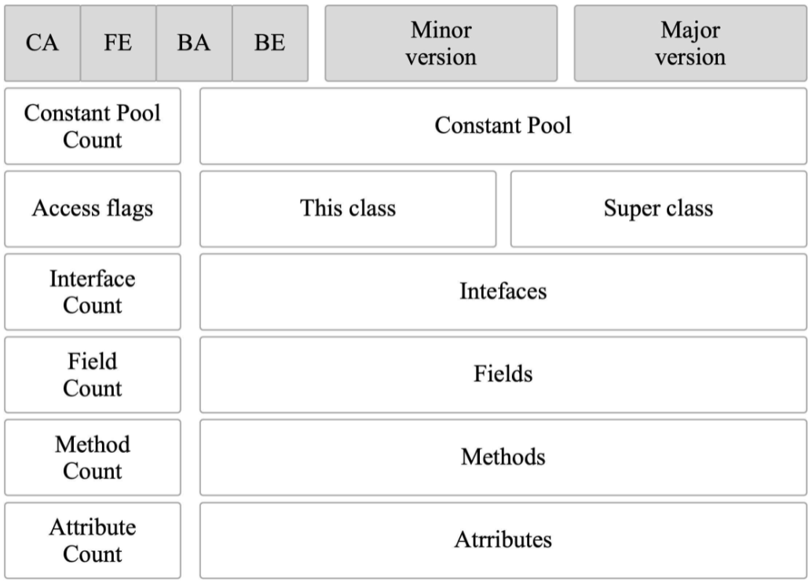

# 类文件结构


## 一、JVM 的“无关性”

- **平台无关性**：各种不同平台的Java虚拟机，以及所有平台都统一支持的程序存储格式——字节码（Byte Code）是构成平台无关性的基石。
- **语言无关性**：实现语言无关性的基础仍然是虚拟机和字节码存储格式。Java虚拟机不与包括Java语言在内的任何程序语言绑定，它只与“Class文件”这种特定的二进制文件格式所关联，Class文件中包含了Java虚拟机指令集、符号表以及若干其他辅助信息。

Java 源代码首先需要使用 Javac 编译器编译成 `.class` 文件，然后由 JVM 执行 `.class` 文件，从而程序开始运行。

JVM 只认识 `.class` 文件，它不关心是何种语言生成了 `.class` 文件，只要 `.class` 文件符合 JVM 的规范就能运行。 目前已经有 JRuby、Jython、Scala 等语言能够在 JVM 上运行。它们有各自的语法规则，不过它们的编译器 都能将各自的源码编译成符合 JVM 规范的 `.class` 文件，从而能够借助 JVM 运行它们。


## 二、Class 类文件的结构

Class文件是一组**以8个字节为基础单位**的**二进制流**，各个数据项目严格按照顺序紧凑地排列在文件之中，中间没有添加任何分隔符，这使得整个Class文件中存储的内容几乎全部是程序运行的必要数据，**没有空隙**存在。当遇到需要占用8个字节以上空间的数据项时，则会按照高位在前的方式分割成若干个8个字节进行存储。 

根据《Java 虚拟机规范》，Class 文件通过 `ClassFile` 定义，有点类似 C 语言的结构体。这种伪结构中只有两种数据类型：`无符号数` 和 `表`：

- **无符号数**：属于**基本的数据类型**，以u1、u2、u4、u8来分别代表1个字节、2个字节、4个字节和8个字节的无符号数，无符号数可以用来描述数字、索引引用、数量值或者按照UTF-8编码构成字符串值。
- **表**：由多个无符号数或者其他表作为数据项构成的**复合数据类型**，以“_info”结尾。表用于描述**有层次关系**的复合结构的数据。

 `ClassFile` 的结构如下： 

```java
ClassFile {
    u4             magic; //Class 文件的标志
    u2             minor_version;//Class 的小版本号
    u2             major_version;//Class 的大版本号
    u2             constant_pool_count;//常量池的数量
    cp_info        constant_pool[constant_pool_count-1];//常量池
    u2             access_flags;//Class 的访问标记
    u2             this_class;//当前类
    u2             super_class;//父类
    u2             interfaces_count;//接口
    u2             interfaces[interfaces_count];//一个类可以实现多个接口
    u2             fields_count;//Class 文件的字段属性
    field_info     fields[fields_count];//一个类会可以有多个字段
    u2             methods_count;//Class 文件的方法数量
    method_info    methods[methods_count];//一个类可以有个多个方法
    u2             attributes_count;//此类的属性表中的属性数
    attribute_info attributes[attributes_count];//属性表集合
}
```

整个Class文件本质上也可以视作是一张表，如下：


下面是 `class` 文件组成的示意图：




### 1. 魔数（Magic Number）

```java
u4	magic; //Class 文件的标志
```

每个Class文件的**头4个字节**被称为**魔数**（Magic Number），它的唯一作用是**确定这个文件是否为一个能被虚拟机接受的Class文件**。

>使用魔数而不是扩展名来进行识别主要是基于安全考虑，因为文件扩展名可以随意改动。文件格式的制定者可以自由地选择魔数值，只要这个魔数值还没有被广泛采用过而且不会引起混淆。


### 2. Class 文件版本号（Minor&Major Version）

```java
u2	minor_version;//Class 的小版本号
u2	major_version;//Class 的大版本号
```

紧接着魔数的四个字节存储的是 **Class 文件的版本号**：第 5 和第 6 位是**次版本号**，第 7 和第 8 位是**主版本号**。

每当 Java 发布大版本（比如 Java 8，Java9）的时候，主版本号都会加 1。可以使用 `javap -v` 命令来快速查看 Class 文件的版本号信息。

高版本的 Java 虚拟机可以执行低版本编译器生成的 Class 文件，但是低版本的 Java 虚拟机不能执行高版本编译器生成的 Class 文件。


### 3. 常量池（Constant Pool）

```java
u2	constant_pool_count;//常量池的数量
cp_info   constant_pool[constant_pool_count-1];//常量池
```

紧接着主、次版本号之后的是**常量池入口**。在常量池的**入口**需要放置一项 u2 类型的数据，代表常量池容量计数值（constant_pool_count）。 常量池的数量是 `constant_pool_count-1`（**常量池计数器是从 1 开始计数的，将第 0 项常量空出来是有特殊考虑的，索引值为 0 代表“不引用任何一个常量池项”**）。 

常量池中主要存放两大类常量：`字面量（Literal）` 和 `符号引用（Symbolic References）`。字面量比较接近于Java语言层面的常量概念，如文本字符串、被声明为final的常量值等。而符号引用则属于编译原理方面的概念，主要包括下面几类常量： 

- 被模块导出或者开放的包（Package） 
- 类和接口的全限定名（Fully Qualified Name） 
- 字段的名称和描述符（Descriptor） 
- 方法的名称和描述符 
- 方法句柄和方法类型（Method Handle、Method Type、Invoke Dynamic） 
- 动态调用点和动态常量（Dynamically-Computed Call Site、Dynamically-Computed Constant）


Java代码在进行Javac编译的时候，并不像C和C++那样有“连接”这一步骤，而是在虚拟机加载Class文件的时候进行**动态连接**。也就是说，在Class文件中不会保存各个方法、字段最终在内存中的布局信息，这些字段、方法的符号引用不经过虚拟机在运行期转换的话是无法得到真正的内存入口地址，也就无法直接被虚拟机使用的。**当虚拟机做类加载时，将会从常量池获得对应的符号引用，再在类创建时或运行时解析、翻译到具体的内存地址之中。**

常量池中每一项常量都是一个表，这17类表都有一个共同的特点，表结构起始的第一位是个u1类型的标志位 `-tag`，代表着当前常量属于哪种常量类型。


### 4. 访问标志（Access Flags）

在常量池结束之后，紧接着的2个字节代表访问标志（access_flags），这个标志用于识别一些类或者接口层次的访问信息，包括：这个Class是类还是接口；是否定义为 `public` 类型；是否定义为 `abstract` 类型；如果是类的话，是否被声明为 `final`；等等。具体的标志位以及标志的含义见下表：


### 5. 类索引（This Class）、父类索引（Super Class）与接口索引（Interfaces）集合

```java
u2  this_class;//当前类
u2  super_class;//父类
u2  interfaces_count;//接口
u2  interfaces[interfaces_count];//一个类可以实现多个接口
```

**类索引（this_class）**和**父类索引（super_class）**都是一个u2类型的数据，而**接口索引集合（interfaces）**是一组u2类型的数据的集合，Class文件中由这三项数据来确定该类型的继承关系。

类索引用于确定这个类的全限定名，父类索引用于确定这个类的父类的全限定名。由于Java语言不允许多重继承，所以父类索引只有一个，除了 `java.lang.Object` 之外，所有的Java类都有父类，因此除了 `java.lang.Object` 外，所有Java类的父类索引都不为 0。接口索引集合就用来描述这个类实现了哪些接口，这些被实现的接口将按 `implements` 关键字（如果这个Class文件表示的是一个接口，则应当是 `extends` 关键字）后的接口顺序从左到右排列在接口索引集合中。 


### 6. 字段表集合（Fields）

```java
u2  fields_count;//Class 文件的字段的个数
field_info  fields[fields_count];//一个类会可以有个字段
```

**字段表（field_info）**用于描述**接口或者类中声明的变量**。Java语言中的“字段”（Field）包括类级变量以及实例级变量，但不包括在方法内部声明的局部变量。

字段可以包括的修饰符有字段的**作用域**（public、private、protected修饰符）、**是实例变量还是类变量**（static修饰符）、**可变性**（final）、**并发可见性**（volatile修饰符，是否强制从主内存读写）、**可否被序列化**（transient修饰符）、**字段数据类型**（基本类型、对象、数组）、 **字段名称**。上述这些信息中，各个修饰符都是布尔值，要么有某个修饰符，要么没有，很适合使用标志位来表示。而字段叫做什么名字、字段被定义为什么数据类型，这些都是无法固定的，只能引用常量池中的常量来描述。

**field info(字段表) 的结构：** 


- **access_flags:** 字段的作用域（`public` ,`private`,`protected`修饰符），是实例变量还是类变量（`static`修饰符），可否被序列化（transient 修饰符），可变性（final），并发可见性（volatile 修饰符，是否强制从主内存读写）。
- **name_index:** 对常量池的引用，表示的字段的名称；
- **descriptor_index:** 对常量池的引用，表示字段和方法的描述符；
- **attributes_count:** 一个字段还会拥有一些额外的属性，attributes_count 存放属性的个数；
- **attributes[attributes_count]:** 存放具体属性具体内容。

**字段的 access_flag 的取值：** 


>字段表集合中不会列出从父类或者父接口中继承而来的字段，但有可能出现原本Java代码之中不存在的字段，譬如在内部类中为了保持对外部类的访问性，编译器就会自动添加指向外部类实例的字 段。另外，在Java语言中字段是无法重载的，两个字段的数据类型、修饰符不管是否相同，都必须使 用不一样的名称，但是对于Class文件格式来讲，只要两个字段的描述符不是完全相同，那字段重名就是合法的。


### 7. 方法表集合（Methods）

```java
u2  methods_count;//Class 文件的方法的数量
method_info  methods[methods_count];//一个类可以有个多个方法
```

Class文件存储格式中对方法的描述与对字段的描述采用了几乎完全一致的方式，方法表的结构如同字段表一样，依 次包括**访问标志**（access_flags）、**名称索引**（name_index）、**描述符索引**（descriptor_index）、**属性表集合**（attributes）几项。

**method_info(方法表的) 结构:** 


**方法表的 access_flag 取值：** 


**注意**：因为`volatile`修饰符和`transient`修饰符不可以修饰方法，所以方法表的访问标志中没有这两个对应的标志，但是增加了`synchronized`、`native`、`abstract`等关键字修饰方法，所以也就多了这些关键字对应的标志。


>**方法中的代码去哪了？**
>
>方法里的Java代码，经过Javac编译器编译成字节码指令之后，存放在方法属性表集合中一个名为“Code”的属性里面，属性表作为Class文件格式中最具扩展性的一种数据项目。


在Java语言中，要重载（Overload）一个方法，除了要与原方法具有相同的简单名称之外，还要求必须拥有一个与原方法不同的特征签名。**特征签名**是指一个方法中各个参数在常量池中的字段符号引用的集合，也正是因为返回值不会包含在特征签名之中，所以Java语言里面是无法仅仅依靠返回值的不同来对一个已有方法进行重载的。但是在Class文件格式之中，特征签名的范围明显要更大一些， 只要描述符不是完全一致的两个方法就可以共存。也就是说，**如果两个方法有相同的名称和特征签名，但返回值不同，那么也是可以合法共存于同一个Class文件中的。** 


### 8. 属性表集合（Attributes）

```java
u2  attributes_count;//此类的属性表中的属性数
attribute_info  attributes[attributes_count];//属性表集合
```

在 Class 文件，字段表，方法表中都可以携带自己的属性表集合，以用于描述某些场景专有的信息。与 Class 文件中其它的数据项目要求的顺序、长度和内容不同，属性表集合的限制稍微宽松一些，**不再要求各个属性表具有严格的顺序，并且只要不与已有的属性名重复，任何人实现的编译器都可以向属性表中写 入自己定义的属性信息，Java 虚拟机运行时会忽略掉它不认识的属性。**


