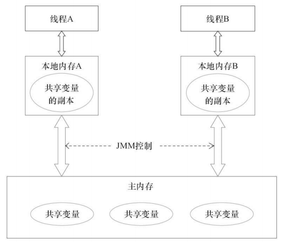
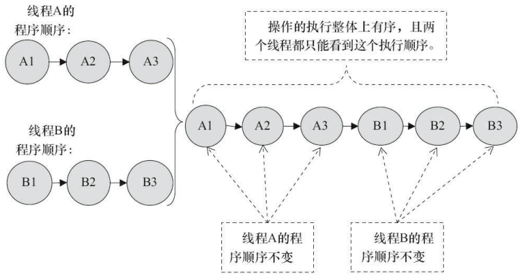
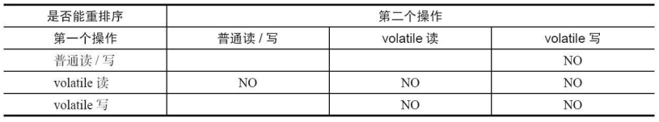
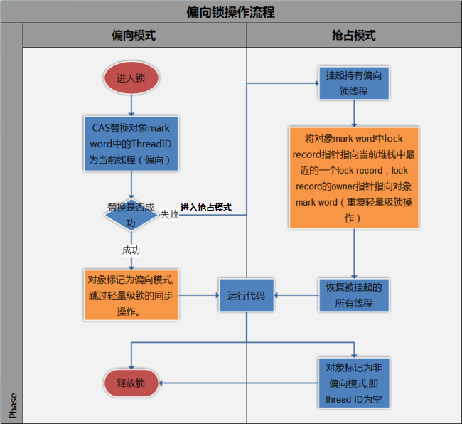

# Java 多线程原理

[toc]


## **一、Java内存模型（JMM）**

### 1. 并发编程模型的两个关键问题

- 线程间如何通信？即：线程之间以何种机制来交换信息
- 线程间如何同步？即：线程以何种机制来控制不同线程间操作发生的相对顺序

有两种并发模型可以解决这两个问题：

- **消息传递**并发模型
- **共享内存**并发模型

这两种模型之间的区别如下表所示：

| 并发模型 | 如何通信                                                     | 如何同步                                                     |
| -------- | :----------------------------------------------------------- | :----------------------------------------------------------- |
| 消息传递 | 线程之间**没有公共状态**，线程之间必须通过**发送消息**来**显式**进行通信。 | 发送消息天然同步，因为消息的发送必须在消息的接收之前，因此同步是**隐式**进行的。 |
| 共享内存 | 线程之间**共享程序的公共状态**，通过**写-读内存中的公共状态**进行**隐式**通信。 | 必须**显式**指定某个方法或某段代码需要在线程之间互斥执行。   |

Java 的并发采用的是**共享内存模型**，**Java 线程之间的通信总是隐式进行**，整个通信过程对程序员完全透明。


### 2. Java 内存模型的抽象结构

#### 2.1 运行时内存的划分（Java 内存结构）

先谈一下运行时数据区，下面这张图展示的是 Java 虚拟机内存空间包括的运行时数据区域：

  

对于每一个线程来说，**栈都是私有的，而堆是共有的**。

在 Java 中，所有**共享变量**（「实例域」、「静态域」和「数组元素」）都存储在**堆内存**中，**堆内存在线程之间共享**。

而在栈中的变量（「局部变量」、「方法定义参数」、「异常处理器参数」）不会在线程之间共享，也就不会有内存可见性（下文会说到）的问题，也不受内存模型的影响。

所以，内存可见性是针对**共享变量**的。


#### 2.2 既然堆是共享的，为什么在堆中会有内存不可见问题？

这是因为现代计算机为了高效，往往会在**高速缓存**区中缓存共享变量，因为 CPU 访问缓存区比访问内存要快得多。

> **线程之间的共享变量存储在主内存中，每个线程都有一个私有的本地内存，存储了该线程以读/写共享变量的副本**。本地内存是 Java 内存模型的一个抽象概念，并不真实存在。它涵盖了缓存、写缓冲区、寄存器以及其他的硬件和编译器优化。

Java 线程之间的通信由 Java 内存模型（简称 JMM）控制，从抽象的角度来说，JMM 定义了线程和主内存之间的抽象关系。JMM 的抽象示意图如图所示：



从图中可以看出：

1. 所有的共享变量都存在主内存中。
2. 每个线程都保存了一份该线程使用到的共享变量的副本。
3. 如果线程A与线程B之间要通信的话，必须经历下面 2 个步骤：
   1. 线程 A 将本地内存 A 中更新过的共享变量刷新到主内存中去。
   2. 线程 B 到主内存中去读取线程 A 之前已经更新过的共享变量。

**所以，线程 A 无法直接访问线程 B 的工作内存，线程间通信必须经过主内存。**

注意，根据 JMM 的规定，**线程对共享变量的所有操作都必须在自己的本地内存中进行，不能直接从主内存中读取**。

所以线程 B 并不是直接去主内存中读取共享变量的值，而是先在本地内存 B 中找到这个共享变量，发现这个共享变量已经被更新了，然后去主内存中读取这个共享变量的新值，并拷贝到本地内存 B 中，最后线程 B 再读取本地内存 B 中的新值。

那么怎么知道这个共享变量被其他线程更新了呢？这就是 JMM 的功劳了，也是 JMM 存在的必要性之一。**JMM 通过控制主内存与每个线程的本地内存之间的交互，来提供内存可见性保证**。

底层原理：在多处理器下，为了保证各个处理器的缓存是一致的，就会实现**缓存一致性协议**——**每个处理器通过嗅探在总线上传播的数据来检查自己缓存的值是不是过期了，当处理器发现自己缓存行对应的内存地址被修改，就会将当前处理器的缓存行设置成无效状态，当处理器对这个数据进行修改操作的时候，会重新从系统内存中把数据读到处理器缓存里。**

> Java 中的 volatile 关键字可以保证多线程操作共享变量的**可见性**以及**禁止指令重排序**，synchronized 关键字不仅保证**可见性**，同时也保证了**原子性**（互斥性）。在更底层，JMM 通过内存屏障来实现内存的可见性以及禁止重排序。为了程序员的方便理解，提出了 happens-before，它更加的简单易懂，从而避免了程序员为了理解内存可见性而去学习复杂的重排序规则以及这些规则的具体实现方法。这里涉及到的所有内容后面都会有专门介绍。


#### 2.3 JMM 与 Java 内存区域的区别与联系

上面分别提到了 JMM 和 Java 运行时内存区域，这两者既有差别又有联系：

- **区别**

  两者是不同的概念层次。JMM 是抽象的，它是用来描述一组规则，通过这个规则来控制各个变量的访问方式，围绕原子性、有序性、可见性等展开的。而 Java 运行时内存的划分是具体的，是 JVM 运行 Java 程序时，必要的内存划分。

- **联系**

  都存在私有数据区域和共享数据区域。一般来说，JMM 中的主内存属于共享数据区域，它包含了堆和方法区；同样，JMM 中的本地内存属于私有数据区域，包含了程序计数器、虚拟机栈、本地方法栈。


## **二、重排序与 happens-before**

### 1. 什么是重排序？

计算机在执行程序时，为了提高性能，编译器和处理器常常会对指令重新排序。

**为什么指令重排序可以提高性能？**

简单地说，每一个指令都会包含多个步骤，每个步骤可能使用不同的硬件。因此，**流水线技术**产生了，它的原理是指令1还没有执行完，就可以开始执行指令2，而不用等到指令1执行结束之后再执行指令2，这样就大大提高了效率。

但是，流水线技术最害怕**中断**，恢复中断的代价是比较大的，所以我们要想尽办法不让流水线中断。指令重排就是减少中断的一种技术。

分析一下下面这个代码的执行情况：

```java
a = b + c;
d = e - f ;
```

先加载 b、c（注意，即有可能先加载 b，也有可能先加载 c），但是在执行 `add(b,c)` 的时候，需要等待 b、c 装载结束才能继续执行，也就是增加了停顿，那么后面的指令也会依次有停顿，这降低了计算机的执行效率。

为了减少这个停顿，我们可以先加载 e 和 f，然后再去加载 `add(b,c)`，这样做对程序（串行）是没有影响的，但却减少了停顿。既然 `add(b,c)` 需要停顿，那还不如去做一些有意义的事情。

综上所述，**指令重排对于提高 CPU 处理性能十分必要。虽然由此带来了乱序的问题，但是这点牺牲是值得的。**

指令重排一般分为以下三种：

- **编译器优化重排**

  编译器在**不改变单线程程序语义**的前提下，可以重新安排语句的执行顺序。

- **指令并行重排**

  现代处理器采用了指令级并行技术来将多条指令重叠执行。如果**不存在数据依赖性**（即后一个执行的语句无需依赖前面执行的语句的结果），处理器可以改变语句对应的机器指令的执行顺序。

- **内存系统重排**

  由于处理器使用缓存和读写缓冲区，这使得 `加载(load)` 和 `存储(store)` 操作看上去可能是在乱序执行，因为三级缓存的存在，导致内存与缓存的数据同步存在时间差。

**指令重排可以保证串行语义一致，但是没有义务保证多线程间的语义也一致**。所以在多线程下，指令重排序可能会导致一些问题。


### 2. 顺序一致性模型与 JMM 的保证

顺序一致性模型是一个**理论参考模型**，内存模型在设计的时候都会以顺序一致性内存模型作为参考。

#### 2.1 数据竞争与顺序一致性

**当程序未正确同步的时候，就可能存在数据竞争**。

> 数据竞争：在一个线程中写一个变量，在另一个线程读同一个变量，并且写和读没有通过同步来排序。

如果程序中包含了数据竞争，那么运行的结果往往充满了**不确定性**，比如读发生在了写之前，可能就会读到错误的值；如果一个线程程序能够正确同步，那么就不存在数据竞争。


Java 内存模型（JMM）对于正确同步的多线程程序的内存一致性做了以下保证：

**如果程序是正确同步的，程序的执行将具有顺序一致性。 即程序的执行结果和该程序在顺序一致性模型中执行的结果相同。**

这里的同步是指广义上的同步，包括了使用 `volatile`、`final`、`synchronized` 等关键字来实现**多线程下的同步**。

> 如果程序员没有正确使用 `volatile`、`final`、`synchronized`，那么即便是使用了同步（单线程下的同步），JMM 也不会有内存可见性的保证，可能会导致程序出错，并且具有不可重现性，很难排查。所以如何正确使用 `volatile`、`final`、`synchronized`，是程序员应该去了解的。


#### 2.2 顺序一致性模型

顺序一致性内存模型是一个**理想化的理论参考模型**，它为程序员提供了极强的内存可见性保证。

顺序一致性模型有两大特性：

- **一个线程中**的所有操作必须按照程序的顺序（即 Java 代码的顺序）来执行。
- **不管程序是否同步，所有线程都只能看到一个单一的操作执行顺序**。即在顺序一致性模型中，每个操作必须是**原子性的，且立刻对所有线程可见**。

为了理解这两个特性，我们举个例子，假设有两个线程 A 和 B 并发执行，线程 A 有3个操作，他们在程序中的顺序是 `A1→A2→A3`，线程 B 也有3个操作，`B1→B2→B3`。

假设**正确使用了同步**，A 线程的3个操作执行后释放锁，B 线程获取同一个锁。那么在**顺序一致性模型**中的执行效果如下所示：



假设**没有使用同步**，那么在**顺序一致性模型**中的执行效果如下所示：


之所以可以得到这个保证，是因为顺序一致性模型中的**每个操作必须立即对任意线程可见**。

**但是 JMM 没有这样的保证。未同步程序在 JMM 中不但整体的执行顺序是无序的，而且所有线程看到的操作执行顺序也可能不一致。**

比如，在当前线程把写过的数据缓存在本地内存中，在没有刷新到主内存之前，这个写操作仅对当前线程可见；从其他线程的角度来观察，这个写操作根本没有被当前线程所执行。只有当前线程把本地内存中写过的数据刷新到主内存之后，这个写操作才对其他线程可见。在这种情况下，当前线程和其他线程看到的执行顺序是不一样的。


#### 2.3 JMM 中同步程序的顺序一致性效果

在顺序一致性模型中，所有操作完全按照程序的顺序串行执行。但是 JMM 中，**临界区内（同步块或同步方法中）的代码可以发生重排序**（但不允许临界区内的代码“逃逸”到临界区之外，因为会破坏锁的内存语义）。

虽然线程 A 在临界区做了重排序，但是因为锁的特性，线程 B 无法观察到线程 A 在临界区的重排序。这种重排序既提高了执行效率，又没有改变程序的执行结果。

同时，JMM 会在退出临界区和进入临界区做特殊的处理，使得在临界区内程序获得与顺序一致性模型相同的内存视图。

由此可见，JMM 的具体实现方针是：**在不改变（正确同步的）程序执行结果的前提下，尽量为编译器和处理器的优化打开方便之门**。


#### 2.4 JMM 中未同步程序的顺序一致性效果

对于未同步的多线程程序，JMM 只提供**最小安全性**：线程读取到的值，要么是之前某个线程写入的值，要么是默认值，不会无中生有。

为了实现这个安全性，JVM 在堆上分配对象时，首先会对内存空间清零，然后才会在上面分配对象（这两个操作是同步的）。

**JMM 没有保证未同步程序的执行结果与该程序在顺序一致性中执行结果一致。因为如果要保证执行结果一致，那么 JMM 需要禁止大量的优化，对程序的执行性能会产生很大的影响。**

未同步程序在 JMM 和顺序一致性内存模型中的执行特性有如下差异：

1. 顺序一致性保证单线程内的操作会按程序的顺序执行；JMM 不保证单线程内的操作会按程序的顺序执行。（因为重排序，但是 JMM 保证单线程下的重排序不影响执行结果）
2. 顺序一致性模型保证所有线程只能看到一致的操作执行顺序，而 JMM 不保证所有线程能看到一致的操作执行顺序。（因为 JMM 不保证所有操作立即可见）
3. 顺序一致性模型保证对所有的内存读/写操作都具有原子性，而 JMM 不保证对64位的 long 型和 double 型变量的写操作具有原子性。


### 3. happens-before

#### 3.1 什么是 happens-before?

> 一方面，程序员需要 JMM 提供一个强的内存模型来编写代码；另一方面，编译器和处理器希望 JMM 对它们的束缚越少越好，这样它们就可以最可能多的做优化来提高性能，希望的是一个弱的内存模型。

JMM 考虑了这两种需求，并且找到了平衡点：

- 对编译器和处理器来说，**只要不改变程序的执行结果（单线程程序和正确同步了的多线程程序），编译器和处理器怎么优化都行。**
- 而对于程序员，JMM 提供了 **happens-before 规则**（JSR-133规范），满足了程序员的需求——**简单易懂，并且提供了足够强的内存可见性保证**。换言之，程序员只要遵循 happens-before 规则，那他写的程序就能保证在 JMM 中具有强的内存可见性。


JMM 使用 happens-before 的概念来定制两个操作之间的执行顺序。这两个操作可以在一个线程以内，也可以是不同的线程之间。因此，JMM 可以通过 happens-before 关系向程序员提供跨线程的内存可见性保证。

happens-before 关系的定义如下：

1. 如果一个操作 happens-before 另一个操作，那么第一个操作的执行结果将对第二个操作可见，而且第一个操作的执行顺序排在第二个操作之前。
2. **两个操作之间存在 happens-before 关系，并不意味着 Java 平台的具体实现必须要按照 happens-before 关系指定的顺序来执行。如果重排序之后的执行结果，与按 happens-before 关系来执行的结果一致，那么 JMM 也允许这样的重排序。**

> happens-before 关系本质上和 as-if-serial 语义是一回事。
>
> as-if-serial 语义保证单线程内重排序后的执行结果和程序代码本身应有的结果是一致的，happens-before 关系保证正确同步的多线程程序的执行结果不被重排序改变。

总之，**如果操作 A happens-before 操作 B，那么操作 A 在内存上所做的操作对操作 B 都是可见的，不管它们在不在一个线程。**


#### 3.2 happens-before 规则

在 Java 中，有以下天然的 happens-before 规则：

- **程序顺序规则**：一个线程中的每一个操作，happens-before 于该线程中的任意后续操作。
- **监视器锁规则**：对一个锁的解锁，happens-before 于随后对这个锁的加锁。
- **volatile 变量规则**：对一个 volatile 域的写，happens-before 于任意后续对这个 volatile 域的读。
- **传递性**：如果 A happens-before B，且 B happens-before C，那么 A happens-before C。
- **start 规则**：如果线程 A 执行操作 `ThreadB.start()` 启动线程 B，那么 A 线程的 `ThreadB.start()` 操作 happens-before 于线程 B 中的任意操作。
- **join 规则**：如果线程 A 执行操作 `ThreadB.join()` 并成功返回，那么线程 B 中的任意操作 happens-before 于线程 A 从 `ThreadB.join()` 操作成功返回。

举例：

```java
int a = 1; // A操作
int b = 2; // B操作
int sum = a + b;// C 操作
System.out.println(sum);
```

根据以上介绍的 happens-before 规则，假如只有一个线程，那么不难得出：

```
1> A happens-before B 
2> B happens-before C 
3> A happens-before C
```

注意，真正在执行指令的时候，其实 JVM 有可能对操作A & B进行重排序，因为无论先执行 A 还是 B，他们都对对方是可见的，并且不影响执行结果。如果这里发生了重排序，这在视觉上违背了 happens-before 原则，但是 JMM 是允许这样的重排序的。

所以，我们只关心 happens-before 规则，不用关心 JVM 到底是怎样执行的。只要确定操作 A happens-before 操作 B 就行了。

重排序有两类，JMM 对这两类重排序有不同的策略：

- 会改变程序执行结果的重排序，比如 `A -> C`，JMM 要求编译器和处理器都禁止这种重排序。
- 不会改变程序执行结果的重排序，比如 `A -> B`，JMM 对编译器和处理器不做要求，允许这种重排序。


## **三、volatile**

### 1. 几个基本概念

在讲解 volatile 之前，先回顾几个基本的概念。

#### 1.1 内存可见性

在讲解 Java 内存模型的时候有介绍过 JMM 有一个主内存，每个线程有自己私有的工作内存，工作内存中保存了一些变量在主内存的拷贝。

**内存可见性，指的是线程之间的可见性，当一个线程修改了共享变量时，另一个线程可以读取到这个修改后的值**。

#### 1.2 重排序

为优化程序性能，对原有的指令执行顺序进行优化重新排序。重排序可能发生在多个阶段，比如编译重排序、CPU 重排序等。

#### 1.3 happens-before 规则

happens-before 是一个给程序员使用的规则，只要程序员在写代码的时候遵循 happens-before 规则，JVM 就能保证指令在多线程之间的顺序性符合程序员的预期。


### 2. volatile 的内存语义

在 Java 中，volatile 关键字有特殊的内存语义。volatile 主要有以下两个功能：

- 保证变量的**内存可见性**
- 禁止 volatile 变量与普通变量**重排序**（JSR133 提出，Java 5 开始才有这个“增强的 volatile 内存语义”）

#### 2.1 内存可见性

以一段示例代码开始：

```java
public class VolatileExample {
    int a = 0;
    volatile boolean flag = false;

    public void writer() {
        a = 1; // step 1
        flag = true; // step 2
    }

    public void reader() {
        if (flag) { // step 3
            System.out.println(a); // step 4
        }
    }
}
```

在这段代码里，我们使用 `volatile` 关键字修饰了一个 `boolean` 类型的变量 `flag`。

所谓内存可见性，指的是当一个线程对 `volatile` 修饰的变量进行**写操作**（比如 step 2）时，JMM 会立即把该线程对应的本地内存中的共享变量的值刷新到主内存；当一个线程对 `volatile` 修饰的变量进行**读操作**（比如 step 3）时，**JMM 会把立即该线程对应的本地内存置为无效，从主内存中读取共享变量的值。**

> 在这一点上，volatile 与锁具有相同的内存效果，volatile 变量的写和锁的释放具有相同的内存语义，volatile 变量的读和锁的获取具有相同的内存语义。

假设在时间线上，线程 A 先执行方法 `writer` 方法，线程 B 后执行 `reader` 方法。那必然会有下图：


而如果 `flag` 变量**没有**用 `volatile` 修饰，在step 2，线程 A 的本地内存里面的变量就不会立即更新到主内存，那随后线程 B 也同样不会去主内存拿最新的值，仍然使用线程 B 本地内存缓存的变量的值 `a = 0，flag = false`。

##### volatile 是如何来保证可见性的呢（底层）？

为了提高处理速度，处理器不直接和内存进行通信，而是先将系统内存的数据读到内部缓存（L1，L2 或其他）后再进行操作，<u>但操作完不知道何时会写到内存</u>。

如果对声明了 volatile 的变量进行写操作，**JVM** 就会向处理器发送一条 **Lock 前缀的指令**，**将这个变量所在缓存行的数据写回到系统内存**。但是，就算写回到内存，如果其他处理器缓存的值还是旧的，再执行计算操作就会有问题。

所以，在多处理器下，为了保证各个处理器的缓存是一致的，就会实现**缓存一致性协议**——**每个处理器通过嗅探在总线上传播的数据来检查自己缓存的值是不是过期了，当处理器发现自己缓存行对应的内存地址被修改，就会将当前处理器的缓存行设置成无效状态，当处理器对这个数据进行修改操作的时候，会重新从系统内存中把数据读到处理器缓存里。**


#### 2.2 禁止重排序

在 JSR-133 之前的旧的 Java 内存模型中，是允许 volatile 变量与普通变量重排序的。那上面的案例中，可能就会被重排序成下列时序来执行：

```text
1.线程 A 写 volatile 变量，step 2，设置 flag 为 true；
2.线程 B 读同一个 volatile，step 3，读取到 flag 为 true；
3.线程 B 读普通变量，step 4，读取到 a = 0；
4.线程 A 修改普通变量，step 1，设置 a = 1；
```

可见，**如果 volatile 变量与普通变量发生了重排序，虽然 volatile 变量能保证内存可见性，也可能导致普通变量读取错误**。

所以在旧的内存模型中，volatile 的写-读就不能与锁的释放-获取具有相同的内存语义了。为了提供一种比锁更轻量级的**线程间的通信机制**，JSR-133 专家组决定增强 volatile 的内存语义：**严格限制编译器和处理器对 volatile 变量与普通变量的重排序。**

编译器还好说，JVM 是怎么还能限制处理器的重排序的呢？它是通过**内存屏障**来实现的。

什么是内存屏障？硬件层面，内存屏障分两种：**读屏障**（Load Barrier）和**写屏障**（Store Barrier）。内存屏障有两个作用：

1. 阻止屏障两侧的指令重排序；
2. 强制把写缓冲区/高速缓存中的脏数据等写回主内存，或者让缓存中相应的数据失效。

> 注意这里的缓存主要指的是 CPU 缓存，如 L1，L2 等

编译器在**生成字节码时**，会在指令序列中插入内存屏障来禁止特定类型的处理器重排序。编译器选择了一个**比较保守的 JMM 内存屏障插入策略**，这样可以保证在任何处理器平台，任何程序中都能得到正确的 volatile 内存语义。这个策略是：

- 在每个 volatile 写操作前插入一个 StoreStore 屏障；
- 在每个 volatile 写操作后插入一个 StoreLoad 屏障；
- 在每个 volatile 读操作后插入一个 LoadLoad 屏障；
- 在每个 volatile 读操作后再插入一个 LoadStore 屏障。

大概示意图是这个样子：


> 下面逐个解释一下这几个屏障。注：下述 Load 代表读操作，Store 代表写操作
>
> - **LoadLoad 屏障**：对于这样的语句 `Load1; LoadLoad; Load2`，在 Load2 及后续读取操作要读取的数据被访问前，保证 Load1 要读取的数据被读取完毕。
> - **StoreStore 屏障**：对于这样的语句 `Store1; StoreStore; Store2`，在 Store2 及后续写入操作执行前，这个屏障会把 Store1 强制刷新到内存，保证 Store1 的写入操作对其它处理器可见。
> - **LoadStore 屏障**：对于这样的语句 `Load1; LoadStore; Store2`，在 Store2 及后续写入操作被刷出前，保证 Load1 要读取的数据被读取完毕。
> - **StoreLoad 屏障**：对于这样的语句 `Store1; StoreLoad; Load2`，在 Load2 及后续所有读取操作执行前，保证 Store1 的写入对所有处理器可见。它的开销是四种屏障中最大的（冲刷写缓冲器，清空无效化队列）。在大多数处理器的实现中，这个屏障是个万能屏障，兼具其它三种内存屏障的功能

对于连续多个 volatile 变量读或者连续多个 volatile 变量写，编译器做了一定的优化来提高性能，比如：

```text
第一个 volatile 读;
LoadLoad 屏障；
第二个 volatile 读；
LoadStore 屏障
```


下表是 JMM 针对编译器制定的 volatile 重排序规则表：



总结出重排序规则如下：

1. 如果第一个操作是 volatile 读，那无论第二个操作是什么，都不能重排序；这个规则确保 volatile 读之后的操作不会被编译器重排序到 volatile 读之前。 
2. 如果第二个操作是 volatile 写，那无论第一个操作是什么，都不能重排序；这个规则确保 volatile 写之前的操作不会被编译器重排序到 volatile 写之后。 
3. 如果第一个操作是 volatile 写，第二个操作是 volatile 读，那不能重排序。

还是举上面那个例子，在案例中 step 1，是普通变量的写，step 2 是 volatile 变量的写，那符合第2个规则，这两个 steps 不能重排序。而 step 3 是 volatile 变量读，step 4 是普通变量读，符合第1个规则，同样不能重排序。

但如果是下列情况：第一个操作是普通变量读，第二个操作是 volatile 变量读，那是可以重排序的：

```java
// 声明变量
int a = 0; // 声明普通变量
volatile boolean flag = false; // 声明volatile变量

// 以下两个变量的读操作是可以重排序的
int i = a; // 普通变量读
boolean j = flag; // volatile变量读
```


### 3. volatile 的用途

从 volatile 的内存语义上来看，volatile 可以**保证内存可见性且禁止重排序**。

在保证内存可见性这一点上，volatile 有着与锁相同的内存语义，所以可以作为一个“轻量级”的锁来使用。但由于 volatile 仅仅保证对**单个 volatile 变量的读/写**具有原子性，而锁可以保证整个**临界区代码**的执行具有原子性。所以**在功能上，锁比 volatile 更强大；在性能上，volatile 更有优势**。

在禁止重排序这一点上，volatile 也是非常有用的。比如我们熟悉的单例模式，其中有一种实现方式是“双重锁检查”，比如这样的代码：

```java
public class Singleton {

    private static Singleton instance; // 不使用volatile关键字

    // 双重锁检验
    public static Singleton getInstance() {
        if (instance == null) { // 第7行
            synchronized (Singleton.class) {
                if (instance == null) {
                    instance = new Singleton(); // 第10行
                }
            }
        }
        return instance;
    }
}
```

如果这里的变量声明不使用 volatile 关键字，是可能会发生错误的。它可能会被重排序：

```java
instance = new Singleton(); // 第10行

// 可以分解为以下三个步骤
1 memory=allocate();// 分配内存 相当于c的malloc
2 ctorInstanc(memory) //初始化对象
3 s=memory //设置s指向刚分配的地址

// 上述三个步骤可能会被重排序为 1-3-2，也就是：
1 memory=allocate();// 分配内存 相当于c的malloc
3 s=memory //设置s指向刚分配的地址
2 ctorInstanc(memory) //初始化对象
```

而一旦假设发生了这样的重排序，比如线程 A 在第 10 行执行了步骤 1 和步骤 3，但是步骤 2 还没有执行完。这个时候另一个线程 B 执行到了第 7 行，它会判定 instance 不为空，然后直接返回了一个未初始化完成的 instance！

所以 JSR-133 对 volatile 做了增强后，volatile 的禁止重排序功能还是非常有用的。


## **四、synchronized 与锁**

**Java 多线程的锁都是基于对象的**，Java 中的每一个对象都可以作为一个锁。

有一点需要注意的是，我们常听到的**类锁**其实也是对象锁。

Java 类只有一个 Class 对象（可以有多个实例对象，多个实例共享这个 Class 对象），而 Class 对象也是特殊的 Java 对象。所以我们常说的类锁，其实就是 Class 对象的锁。


### 1. Synchronized 关键字

说到锁，我们通常会谈到 `synchronized` 这个关键字。它翻译成中文就是“同步”的意思。

通常使用 `synchronized` 关键字来给**一段代码**或**一个方法**上锁。它通常有以下三种形式：

```java
// 关键字在实例方法上，锁为当前实例
public synchronized void instanceLock() {
    // code
}

// 关键字在静态方法上，锁为当前Class对象
public static synchronized void classLock() {
    // code
}

// 关键字在代码块上，锁为括号里面的对象
public void blockLock() {
    Object o = new Object();
    synchronized (o) {
        // code
    }
}
```

这里介绍一下“临界区”的概念。所谓“临界区”，指的是**某一块代码区域，它同一时刻只能由一个线程执行**。在上面的例子中，如果 `synchronized` 关键字在方法上，那临界区就是整个方法内部。而如果是使用 synchronized 代码块，那临界区就指的是代码块内部的区域。

通过上面的例子可以看到，下面这两个写法其实是等价的作用：

```java
// 关键字在实例方法上，锁为当前实例
public synchronized void instanceLock() {
    // code
}

// 关键字在代码块上，锁为括号里面的对象
public void blockLock() {
    synchronized (this) {
        // code
    }
}
```

同理，下面这两个方法也应该是等价的：

```java
// 关键字在静态方法上，锁为当前Class对象
public static synchronized void classLock() {
    // code
}

// 关键字在代码块上，锁为括号里面的对象
public void blockLock() {
    synchronized (this.getClass()) {
        // code
    }
}
```


Synchronized 在 JVM 里的实现原理：

JVM 基于进入和退出 **Monitor 对象**来实现方法同步和代码块同步，但两者的实现细节不一样。代码块同步是使用 **`monitorenter`** 和 **`monitorexit`** 指令实现的，而方法同步是使用另外一种方式实现的，细节在 JVM 规范里并没有详细说明。但是，方法的同步同样可以使用这两个指令来实现。

 - **monitorenter 指令**在编译后插入到**同步代码块的开始位置**。
 - **monitorexit 指令**插入到**方法结束处和异常处**。

 JVM 要保证**每个 monitorenter 必须有对应的 monitorexit 与之配对。任何对象都有一个 monitor 与之关联，当且一个 monitor 被持有后，它将处于锁定状态。线程执行到 monitorenter 指令时，将会尝试获取对象所对应的 monitor 的所有权，即尝试获得对象的锁。**


### 2. 几种锁

Java 6 为了**减少获得锁和释放锁带来的性能消耗**，引入了“偏向锁”和“轻量级锁“。在 Java 6 以前，所有的锁都是”重量级“锁。所以在 Java 6 及其以后，一个对象其实有四种锁状态，它们级别由低到高依次是：

1. 无锁状态
2. 偏向锁状态
3. 轻量级锁状态
4. 重量级锁状态

**无锁**就是**没有对资源进行锁定，任何线程都可以尝试去修改它**，无锁在这里就不再细讲。

几种锁会随着竞争情况逐渐升级，锁的升级很容易发生，但是锁降级发生的条件会比较苛刻，**锁降级发生在 Stop The World 期间，当 JVM 进入安全点的时候，会检查是否有闲置的锁，然后进行降级**。

> 关于锁降级有两点说明：
>
> 1. 虽然大部分文章都说锁不能降级，但实际上 HotSpot JVM 是支持锁降级的。
>
> 2. 上面提到的 Stop The World 期间（暂停其他所有工作线程），以及安全点（在这个时间点上没有正在执行的字节码），这些知识是属于 JVM 的知识范畴，这里不做细讲。

下面分别介绍这几种锁以及它们之间的升级。


#### 2.1 Java 对象头

前面提到，Java 的锁都是基于对象的。首先来看看一个对象的“锁”的信息是存放在什么地方的。

每个 Java 对象都有对象头。如果是非数组类型，则用 2 个字宽来存储对象头，如果是数组，则会用 3 个字宽来存储对象头。在 32 位处理器中，一个字宽是 32 位；在 64 位虚拟机中，一个字宽是 64 位。对象头的内容如下表：

| 长度     | 内容                   | 说明                               |
| -------- | ---------------------- | ---------------------------------- |
| 32/64bit | **Mark Word**          | **存储对象的 hashCode 或锁信息等** |
| 32/64bit | Class Metadata Address | 存储到对象类型数据的指针           |
| 32/64bit | Array length           | 数组的长度（如果当前对象是数组）   |

主要来看看 Mark Word 的格式：

| 锁状态   | 29 bit 或 61 bit             | 1 bit 是否是偏向锁？       | 2 bit 锁标志位 |
| -------- | ---------------------------- | -------------------------- | -------------- |
| 无锁     |                              | 0                          | 01             |
| 偏向锁   | 偏向的线程 ID                | 1                          | 01             |
| 轻量级锁 | 指向栈中锁记录的指针         | 此时这一位不用于标识偏向锁 | 00             |
| 重量级锁 | 指向互斥量（重量级锁）的指针 | 此时这一位不用于标识偏向锁 | 10             |
| GC标记   |                              | 此时这一位不用于标识偏向锁 | 11             |

可以看到，当对象状态为偏向锁时，`Mark Word` 存储的是偏向的线程 ID；当状态为轻量级锁时，`Mark Word` 存储的是指向线程栈中 `Lock Record` 的指针；当状态为重量级锁时，`Mark Word` 为指向堆中的 monitor 对象的指针。


#### 2.2 偏向锁

Hotspot 的作者经过以往的研究发现大多数情况下**锁不仅不存在多线程竞争，而且总是由同一线程多次获得**，于是引入了偏向锁。

偏向锁会**偏向于第一个访问锁的线程，如果在接下来的运行过程中，该锁没有被其他的线程访问，则持有偏向锁的线程将永远不需要触发同步**。也就是说，**偏向锁在资源无竞争情况下消除了同步语句，连 CAS 操作都不做了，提高了程序的运行性能。**

> 简单来讲就是对锁设置一个变量，如果发现为 true，代表资源无竞争，则无需再走各种加锁/解锁流程；如果为 false，代表存在其他线程竞争资源，那么就会走后面的流程。

**实现原理**

一个线程在**第一次**进入同步块时，会在**对象头和栈帧中的锁记录里**存储锁偏向的**线程 ID**。当下次该线程进入这个同步块时，会去检查锁的 Mark Word 里面是不是放的自己的线程 ID。

如果是，表明该线程已经获得了锁，以后该线程在进入和退出同步块时不需要花费 CAS 操作来加锁和解锁 ；如果不是，就代表有另一个线程来竞争这个偏向锁。这个时候会尝试使用 CAS 来替换 Mark Word 里面的线程 ID 为新线程的 ID，这个时候要分两种情况：

- 成功，表示之前的线程不存在了， Mark Word 里面的线程 ID 变为新线程的 ID，锁不会升级，仍然为偏向锁；
- 失败，表示之前的线程仍然存在，那么暂停（挂起）之前的线程，设置偏向锁标识为 0，并将锁标志位设置为 00，升级为轻量级锁，会按照轻量级锁的方式进行竞争锁。

> [CAS（Compare and Swap）](###2. CAS 的概念)：
>
> 比较并交换。用于在硬件层面上提供**原子性**操作。在 Intel 处理器中，比较并交换通过指令 `cmpxchg` 实现。 比较是否和给定的数值一致，如果一致则修改，不一致则不修改。

线程竞争偏向锁的过程如下：



图中涉及到了 lock record 指针指向当前堆栈中的最近一个 lock record，是轻量级锁按照**先来先服务**的模式进行了轻量级锁的加锁。


##### 撤销偏向锁

偏向锁使用了一种**等到竞争出现才释放锁的机制**，所以当其他线程尝试竞争偏向锁时， 持有偏向锁的线程才会释放锁。

**偏向锁升级成轻量级锁时，会暂停拥有偏向锁的线程，重置偏向锁标识**，这个过程看起来容易，实则开销还是很大的，大概的过程如下：

1. 在一个安全点（在这个时间点上没有字节码正在执行）停止拥有锁的线程。
2. 遍历线程栈，如果存在锁记录的话，需要修复锁记录和 Mark Word，使其变成无锁状态。
3. 唤醒被停止的线程，将当前锁升级成轻量级锁。

所以，**如果应用程序里所有的锁通常处于竞争状态，那么偏向锁就会是一种累赘**，对于这种情况，我们可以一开始就把偏向锁这个默认功能给关闭：

```properties
-XX:UseBiasedLocking=false。
```

下图总结了偏向锁的获得和撤销：


#### 2.3 轻量级锁

多个线程在不同时段获取同一把锁，即不存在锁竞争的情况，也就没有线程阻塞。针对这种情况，JVM 采用轻量级锁来**避免线程的阻塞与唤醒**。

##### 轻量级锁的加锁

JVM 会为每个线程在当前线程的栈帧中创建用于存储锁记录的空间，称为 Displaced Mark Word。如果一个线程获得锁的时候发现是轻量级锁，会把锁的 Mark Word 复制到自己的 Displaced Mark Word 里面。

然后线程尝试用 CAS 将锁的 Mark Word 替换为指向锁记录的指针。如果成功，当前线程获得锁，如果失败，表示 Mark Word 已经被替换成了其他线程的锁记录，说明在与其它线程竞争锁，当前线程就尝试使用**自旋**来获取锁。

> 自旋：不断尝试去获取锁，一般用循环来实现。

自旋是需要消耗 CPU 的，如果一直获取不到锁的话，那该线程就一直处在自旋状态，白白浪费 CPU 资源。解决这个问题最简单的办法就是指定自旋的次数，例如让其循环 10 次，如果还没获取到锁就进入阻塞状态。

但是 JDK 采用了更聪明的方式——**适应性自旋**，简单来说就是**线程如果自旋成功了，则下次自旋的次数会更多，如果自旋失败了，则自旋的次数就会减少**。

自旋也不是一直进行下去的，如果自旋到一定程度（和 JVM、操作系统相关），依然没有获取到锁，称为自旋失败，那么这个线程会阻塞。同时这个锁就会**升级成重量级锁**。

**轻量级锁的释放：**

在释放锁时，当前线程会使用 CAS 操作将 Displaced Mark Word 的内容复制回锁的 Mark Word 里面。如果没有发生竞争，那么这个复制的操作会成功。如果有其他线程因为自旋多次导致轻量级锁升级成了重量级锁，那么 CAS 操作会失败，此时会释放锁并唤醒被阻塞的线程。

一张图说明加锁和释放锁的过程：


#### 2.4 重量级锁

重量级锁依赖于操作系统的**互斥量**（mutex） 实现的，而操作系统中线程间状态的转换需要相对比较长的时间，所以重量级锁效率很低，但被阻塞的线程不会消耗 CPU。

前面说到，每一个对象都可以当做一个锁，当多个线程同时请求某个对象锁时，对象锁会设置几种状态用来区分请求的线程：

```
Contention List：所有请求锁的线程将被首先放置到该竞争队列
Entry List：Contention List中那些有资格成为候选人的线程被移到Entry List
Wait Set：那些调用wait方法被阻塞的线程被放置到Wait Set
OnDeck：任何时刻最多只能有一个线程正在竞争锁，该线程称为OnDeck
Owner：获得锁的线程称为Owner
!Owner：释放锁的线程
```

当一个线程尝试获得锁时，如果该锁已经被占用，则会将该线程封装成一个 `ObjectWaiter` 对象插入到 Contention List 的队列的队首，然后调用 `park` 函数挂起当前线程。

当线程释放锁时，会从 Contention List 或 EntryList 中挑选一个线程唤醒，被选中的线程叫做 `Heir presumptive` 即假定继承人，假定继承人被唤醒后会尝试获得锁，但 `synchronized` 是非公平的，所以假定继承人不一定能获得锁。这是因为对于重量级锁，线程先自旋尝试获得锁，这样做的目的是为了减少执行操作系统同步操作带来的开销。如果自旋不成功再进入等待队列。这对那些已经在等待队列中的线程来说，稍微显得不公平，还有一个不公平的地方是自旋线程可能会抢占了 Ready 线程的锁。

如果线程获得锁后调用 `Object.wait` 方法，则会将线程加入到 Wait Set 中，当被 `Object.notify` 唤醒后，会将线程从 WaitSet 移动到 Contention List 或 EntryList 中去。需要注意的是，当调用一个锁对象的 `wait` 或 `notify` 方法时，**如当前锁的状态是偏向锁或轻量级锁则会先膨胀成重量级锁**。


#### 2.5 锁的升级流程总结

每一个线程在准备获取共享资源时： 

第一步，检查 MarkWord 里面是不是放的自己的 ThreadId，如果是，表示当前线程是处于 “偏向锁” 。

第二步，如果 MarkWord 不是自己的 ThreadId，锁升级，这时候，用 CAS 来执行切换，新的线程根据 MarkWord 里面现有的 ThreadId，通知之前线程暂停，之前线程将 Markword 的内容置为空。

第三步，两个线程都把锁对象的 HashCode 复制到自己新建的用于存储锁的记录空间，接着开始通过 CAS 操作， 把锁对象的 MarkWord 的内容修改为自己新建的记录空间的地址的方式竞争 MarkWord。

第四步，第三步中成功执行 CAS 的获得资源，失败的则进入自旋 。

第五步，自旋的线程在自旋过程中，如果成功获得资源（即之前获的资源的线程执行完成并释放了共享资源），则整个状态依然处于轻量级锁的状态；如果自旋失败。

第六步，进入重量级锁的状态，这个时候，自旋的线程进行阻塞，等待之前线程执行完成并唤醒自己。


#### 2.6 各种锁的优缺点对比

| 锁       | 优点                                                         | 缺点                                             | 适用场景                             |
| -------- | ------------------------------------------------------------ | ------------------------------------------------ | ------------------------------------ |
| 偏向锁   | 加锁和解锁不需要额外的消耗，和执行非同步方法比仅存在纳秒级的差距。 | 如果线程间存在锁竞争，会带来额外的锁撤销的消耗。 | 适用于只有一个线程访问同步块场景。   |
| 轻量级锁 | 竞争的线程不会阻塞，提高了程序的响应速度。                   | 如果始终得不到锁竞争的线程使用自旋会消耗 CPU。   | 追求响应时间，同步块执行速度非常快。 |
| 重量级锁 | 线程竞争不使用自旋，不会消耗 CPU。                           | 线程阻塞，响应时间缓慢。                         | 追求吞吐量，同步块执行时间较长。     |


## **五、CAS 与原子操作**

### 1. 乐观锁与悲观锁的概念

锁可以从不同的角度分类。其中，乐观锁和悲观锁是一种分类方式。

**悲观锁：**

悲观锁就是我们常说的锁。对于悲观锁来说，**它总是认为每次访问共享资源时会发生冲突，所以必须对每次数据操作加上锁，以保证临界区的程序同一时间只能有一个线程在执行**。

**乐观锁：**

乐观锁又称为“无锁”，顾名思义，它是乐观派。乐观锁**总是假设对共享资源的访问没有冲突，线程可以不停地执行，无需加锁也无需等待**。而一旦多个线程发生冲突，乐观锁通常是使用一种称为 **CAS** 的技术来保证线程执行的安全性。

由于无锁操作中没有锁的存在，因此不可能出现死锁的情况，也就是说**乐观锁天生免疫死锁**。

> 乐观锁多用于“读多写少“的环境，避免频繁加锁影响性能；而悲观锁多用于”写多读少“的环境，避免频繁失败和重试影响性能。


### 2. CAS 的概念

CAS 的全称是：比较并交换（Compare And Swap）。在CAS中，有这样三个值：

- V：要更新的变量(var)
- E：预期值(expected)
- N：新值(new)

比较并交换的过程如下：

**判断 V 是否等于 E，如果等于，将 V 的值设置为 N；如果不等，说明已经有其它线程更新了 V，则当前线程放弃更新，什么都不做。**

所以这里的**预期值 E 本质上指的是“旧值”**。

以一个简单的例子来解释这个过程：

1. 如果有一个多个线程共享的变量 `i` 原本等于5，现在在线程 A 中，想把它设置为新的值 6;
2. 使用 CAS 来做这个事情；
3. 首先我们用 `i` 去与 5 对比，发现它等于 5，说明没有被其它线程改过，那我就把它设置为新的值 6，此次 CAS 成功，`i` 的值被设置成了 6；
4. 如果不等于 5，说明 `i` 被其它线程改过了（比如现在 `i` 的值为 2），那么我就什么也不做，此次 CAS 失败，`i` 的值仍然为 2。

在这个例子中，`i` 就是 V，5 就是 E，6 就是 N。

那有没有可能我在判断了 `i` 为 5 之后，正准备更新它的新值的时候，被其它线程更改了 `i` 的值呢？

不会的。因为 **CAS 是一种原子操作，它是一种系统原语，是一条 CPU 的原子指令，从 CPU 层面保证它的原子性**。

**当多个线程同时使用 CAS 操作一个变量时，只有一个会胜出，并成功更新，其余均会失败，但失败的线程并不会被挂起，仅是被告知失败，并且允许再次尝试，当然也允许失败的线程放弃操作。**


### 3. Java 实现 CAS 的原理 - Unsafe 类

前面提到，CAS 是一种原子操作。那么 Java 是怎样来使用 CAS 的呢？我们知道，在 Java 中，如果一个方法是 native 的，那 Java 就不负责具体实现它，而是交给底层的 JVM 使用 C/C++去实现。

在 Java 中，有一个 `Unsafe` 类，它在 `sun.misc` 包中。它里面是一些 `native` 方法，其中就有几个关于 CAS 操作的方法：

```java
boolean compareAndSwapObject(Object o, long offset,Object expected, Object x);
boolean compareAndSwapInt(Object o, long offset,int expected,int x);
boolean compareAndSwapLong(Object o, long offset,long expected,long x);
```

当然，这些方法都是 `public native` 的。

Unsafe 中对 CAS 的实现是 C++ 写的，它的具体实现和操作系统、CPU 都有关系。

Linux 的 X86 下主要是通过 `cmpxchgl` 这个指令在 CPU 级完成 CAS 操作的，但在多处理器情况下必须使用 `lock` 指令加锁来完成。当然不同的操作系统和处理器的实现会有所不同，这里不做叙述。

当然，Unsafe 类里面还有其它方法用于不同的用途。比如支持线程挂起和恢复的 `park()` 和 `unpark()`， LockSupport 类底层就是调用了这两个方法。还有支持反射操作的 `allocateInstance()` 方法。


### 4. 原子操作-AtomicInteger 类源码简析

上面介绍了 Unsafe 类的几个支持 CAS 的方法。那 Java 具体是如何使用这几个方法来实现原子操作的呢？

JDK 提供了一些用于原子操作的原子类，在 `java.util.concurrent.atomic` 包下面。在 JDK 11 中，有如下17个原子类：


从名字就可以看得出来这些类大概的用途：

- 原子更新基本类型
- 原子更新数组
- 原子更新引用
- 原子更新字段（属性）

这里以 `AtomicInteger` 类的 `getAndAdd(int delta)` 方法为例，来看看 Java 是如何实现原子操作的。

先看看这个方法的源码：

```java
public final int getAndAdd(int delta) {
    return U.getAndAddInt(this, VALUE, delta);
}
```

这里的 U 其实就是一个`Unsafe`对象：

```java
private static final jdk.internal.misc.Unsafe U = jdk.internal.misc.Unsafe.getUnsafe();
```

所以其实 `AtomicInteger` 类的 `getAndAdd(int delta)` 方法是调用 `Unsafe` 类的方法来实现的：

```java
@HotSpotIntrinsicCandidate
public final int getAndAddInt(Object o, long offset, int delta) {
    int v;
    do {
        v = getIntVolatile(o, offset);
    } while (!weakCompareAndSetInt(o, offset, v, v + delta));
    return v;
}
```

> 注：这个方法是在 JDK 1.8 才新增的。在 JDK1.8 之前，`AtomicInteger`源码实现有所不同，是基于 for 死循环的。

我们来一步步解析这段源码。首先，对象 `o` 是 `this`，也就是一个 `AtomicInteger` 对象。然后 `offset` 是一个常量 `VALUE` 。这个常量是在 `AtomicInteger` 类中声明的：

```java
private static final long VALUE = U.objectFieldOffset(AtomicInteger.class, "value");
```

同样是调用的 `Unsafe` 的方法。从方法名字上来看，是得到了一个对象字段偏移量。

> 用于获取某个字段相对 Java 对象的“起始地址”的偏移量。
>
> 一个 java 对象可以看成是一段内存，各个字段都得按照一定的顺序放在这段内存里，同时考虑到对齐要求，可能这些字段不是连续放置的，用这个方法能准确地告诉你某个字段相对于对象的起始内存地址的字节偏移量，因为是相对偏移量，所以它其实跟某个具体对象又没什么太大关系，跟 class 的定义和虚拟机的内存模型的实现细节更相关。
>

继续看源码。前面讲到，CAS 是“无锁”的基础，它允许更新失败。所以经常会与 while 循环搭配，在失败后不断去重试。

这里声明了一个 v，也就是要返回的值。从 `getAndAddInt` 来看，它返回的应该是原来的值，而新的值为 `v + delta`。

这里使用的是 **do-while 循环**。这种循环不多见，它的目的是**保证循环体内的语句至少会被执行一遍**。这样才能保证 return 的值 `v` 是所期望的值。

循环体的条件是一个 CAS 方法：

```java
public final boolean weakCompareAndSetInt(Object o, long offset,
                                          int expected,
                                          int x) {
    return compareAndSetInt(o, offset, expected, x);
}

public final native boolean compareAndSetInt(Object o, long offset,
                                             int expected,
                                             int x);
```

可以看到，最终其实是调用之前说到的 CAS `native` 方法。那为什么要经过一层 `weakCompareAndSetInt` 呢？从 JDK 源码上看不出来什么。在 JDK 8 及之前的版本，这两个方法是一样的。

> 而在 JDK 9 开始，这两个方法上面增加了 `@HotSpotIntrinsicCandidate` 注解。这个注解允许 HotSpot VM 自己来写汇编或 IR 编译器来实现该方法以提供性能。也就是说虽然外面看到的在 JDK 9 中 `weakCompareAndSet` 和 `compareAndSet` 底层依旧是调用了一样的代码，但是不排除 HotSpot VM 会手动来实现 `weakCompareAndSet` 真正含义的功能的可能性。

简单来说，`weakCompareAndSet` 操作仅保留了 `volatile` 自身变量的特性，而除去了 happens-before 规则带来的内存语义。也就是说，`weakCompareAndSet` **无法保证处理操作目标的 volatile 变量外的其他变量的执行顺序（编译器和处理器为了优化程序性能而对指令序列进行重新排序），同时也无法保证这些变量的可见性**。这在一定程度上可以提高性能。

再回到循环条件上来，可以看到它是在不断尝试去用 CAS 更新。如果更新失败，就继续重试。那为什么要把获取“旧值” v 的操作放到循环体内呢？其实这也很好理解。前面说了，CAS 如果旧值 V 不等于预期值 E，它就会更新失败。说明旧的值发生了变化。那当然需要返回的是被其他线程改变之后的旧值了，因此放在了 do 循环体内。


### 5. CAS实现原子操作的三大问题

这里介绍一下 CAS 实现原子操作的三大问题及其解决方案。

#### 5.1 ABA 问题

所谓 ABA 问题，就是**一个值原来是 A，变成了 B，又变回了 A。这个时候使用 CAS 是检查不出变化的，但实际上却被更新了两次**。

ABA 问题的解决思路是在变量前面追加上**版本号或者时间戳**。从 JDK 1.5 开始，JDK 的 atomic 包里提供了一个类 `AtomicStampedReference` 类来解决 ABA 问题。

这个类的 `compareAndSet` 方法的作用是首先检查当前引用是否等于预期引用，并且检查当前标志是否等于预期标志，如果二者都相等，才使用 CAS 设置为新的值和标志。

```java
public boolean compareAndSet(V   expectedReference,
                             V   newReference,
                             int expectedStamp,
                             int newStamp) {
    Pair<V> current = pair;
    return
        expectedReference == current.reference &&
        expectedStamp == current.stamp &&
        ((newReference == current.reference &&
          newStamp == current.stamp) ||
         casPair(current, Pair.of(newReference, newStamp)));
}
```


#### 5.2 循环时间长开销大

CAS 多与自旋结合。**如果自旋 CAS 长时间不成功，会占用大量的 CPU 资源**。

解决思路是让 JVM 支持处理器提供的 **pause 指令**。

pause 指令能让自旋失败时 CPU 睡眠一小段时间再继续自旋，从而使得读操作的频率低很多，为解决内存顺序冲突而导致的 CPU 流水线重排的代价也会小很多。


#### 5.3 只能保证一个共享变量的原子操作

这个问题有两种解决方案：

1. 使用 JDK 1.5 开始就提供的 `AtomicReference` 类保证对象之间的原子性，**把多个变量放到一个对象里面进行 CAS 操作**；
2. **使用锁**。锁内的临界区代码可以保证只有当前线程能操作。


## **六、AQS**

### 1. AQS 简介

**AQS** 是 `AbstractQueuedSynchronizer` 的简称，即「**抽象队列同步器**」，从字面意思上理解:

- 抽象：**抽象类**，只实现一些主要逻辑，有些方法由子类实现；
- 队列：使用**先进先出**（FIFO）队列存储数据；
- 同步：实现了**同步**的功能。

那 AQS 有什么用呢？AQS 是一个**用来构建锁和同步器的框架**，使用 AQS 能简单且高效地构造出应用广泛的同步器，比如经常被提到的 ReentrantLock，Semaphore，ReentrantReadWriteLock，SynchronousQueue，FutureTask 等等皆是基于 AQS 的。

当然，我们自己也能利用 AQS 非常轻松容易地构造出符合我们自己需求的同步器，只要子类实现它的几个 `protected` 方法就可以了。


### 2. AQS 的数据结构

AQS 内部使用了一个 volatile 的变量 `state` 来作为资源的标识。同时定义了几个获取和改变 `state` 的 protected 方法，子类可以覆盖这些方法来实现自己的逻辑：

```java
getState()
setState()
compareAndSetState()
```

这三种操作均是原子操作，其中 `compareAndSetState()` 的实现依赖于 Unsafe 类的 `compareAndSwapInt()` 方法。

而 AQS 类本身实现的是一些排队和阻塞的机制，比如具体线程等待队列的维护（如获取资源失败入队/唤醒出队等）。 AQS 内部维护着一个**先进先出**（FIFO）的**双端队列**，并使用了两个指针 `head` 和 `tail` 用于标识队列的头部和尾部，即 **CLH 队列**。AQS 的同步机制就是依靠 CLH 队列实现的。CLH 队列实现了**公平锁**。头节点是一个获取同步状态成功的节点。线程通过 AQS 获取锁失败，就会将线程封装成一个 Node 节点，插入队列尾。当有线程释放锁时，会唤醒头节点的 next 节点（第二个节点）尝试占用锁。 

其数据结构如图：


注意：CLH 队列并不是直接储存线程，而是储存拥有线程的 Node 节点。


### 3. 资源共享模式

资源有两种共享模式，或者说两种同步方式：

- 独占模式（Exclusive）：资源是独占的，一次只能一个线程获取。如 ReentrantLock。
- 共享模式（Share）：同时可以被多个线程获取，具体的资源个数可以通过参数指定。如 Semaphore/CountDownLatch。

一般情况下，子类只需要根据需求实现其中一种模式，当然也有同时实现两种模式的同步类，如 `ReadWriteLock`。

AQS 中关于这两种资源共享模式的定义源码（均在内部类 Node 中）。下面来看看 Node 的结构：

```java
static final class Node {
    // 标记一个结点（对应的线程）在共享模式下等待
    static final Node SHARED = new Node();
    // 标记一个结点（对应的线程）在独占模式下等待
    static final Node EXCLUSIVE = null; 

    // waitStatus的值，表示该结点（对应的线程）已被取消
    static final int CANCELLED = 1; 
    // waitStatus的值，表示后继结点（对应的线程）需要被唤醒
    static final int SIGNAL = -1;
    // waitStatus的值，表示该结点（对应的线程）在等待某一条件
    static final int CONDITION = -2;
    /*waitStatus的值，表示有资源可用，新head结点需要继续唤醒后继结点（共享模式下，多线程并发释放资源，而head唤醒其后继结点后，需要把多出来的资源留给后面的结点；设置新的head结点时，会继续唤醒其后继结点）*/
    static final int PROPAGATE = -3;

    // 等待状态，取值范围，-3，-2，-1，0，1
    volatile int waitStatus;
    volatile Node prev; // 前驱结点
    volatile Node next; // 后继结点
    volatile Thread thread; // 结点对应的线程
    Node nextWaiter; // 等待队列里下一个等待条件的结点

    // 判断共享模式的方法
    final boolean isShared() {
        return nextWaiter == SHARED;
    }

    Node(Thread thread, Node mode) {     // Used by addWaiter
        this.nextWaiter = mode;
        this.thread = thread;
    }

    // 其它方法忽略，可以参考具体的源码
}

// AQS里面的addWaiter私有方法
private Node addWaiter(Node mode) {
    // 使用了Node的这个构造函数
    Node node = new Node(Thread.currentThread(), mode);
    // 其它代码省略
}
```

> 注意：通过 Node 我们可以实现两个队列，一是通过 prev 和 next 实现 CLH 队列（线程同步队列，双向队列），二是 nextWaiter 实现 Condition 条件上的等待线程队列（单向队列），这个 Condition 主要用在 ReentrantLock 类中。


### 4. AQS 的主要方法源码解析

AQS 的设计是基于**模板方法模式**的，它有一些方法必须要子类去实现的，它们主要有：

- `isHeldExclusively()`：该线程是否正在独占资源。只有用到 condition 才需要去实现它。
- `tryAcquire(int)`：独占方式。尝试获取资源，成功则返回 true，失败则返回 false。
- `tryRelease(int)`：独占方式。尝试释放资源，成功则返回 true，失败则返回 false。
- `tryAcquireShared(int)`：共享方式。尝试获取资源，负数表示失败；0 表示成功，但没有剩余可用资源；正数表示成功，且有剩余资源。
- `tryReleaseShared(int)`：共享方式。尝试释放资源，如果释放后允许唤醒后续等待结点返回true，否则返回false。

这些方法虽然都是 `protected` 方法，但是它们并没有在 AQS 具体实现，而是直接抛出异常（这里不使用抽象方法的目的是：避免强迫子类中把所有的抽象方法都实现一遍，减少无用功，这样子类只需要实现自己关心的抽象方法即可，比如 Semaphore 只需要实现 `tryAcquire` 方法而不用实现其余不需要用到的模版方法）：

```java
protected boolean tryAcquire(int arg) {
    throw new UnsupportedOperationException();
}
```

而 AQS 实现了一系列主要的逻辑。下面从源码来分析一下获取和释放资源的主要逻辑：


#### 4.1 获取资源

获取资源的入口是 `acquire(int arg)` 方法。arg 是要获取的资源的个数，在独占模式下始终为 1。先来看看这个方法的逻辑：

```java
public final void acquire(int arg) {
    if (!tryAcquire(arg) &&
        acquireQueued(addWaiter(Node.EXCLUSIVE), arg))
        selfInterrupt();
}
```

首先调用 `tryAcquire(arg)` 尝试去获取资源。前面提到了这个方法是在子类具体实现的。

如果获取资源失败，就通过 `addWaiter(Node.EXCLUSIVE)` 方法把这个线程插入到等待队列中。其中传入的参数代表要插入的 Node 是独占式的。这个方法的具体实现：

```java
private Node addWaiter(Node mode) {
    // 生成该线程对应的Node节点
    Node node = new Node(Thread.currentThread(), mode);
    // 将Node插入队列中
    Node pred = tail;
    if (pred != null) {
        node.prev = pred;
        // 使用CAS尝试，如果成功就返回
        if (compareAndSetTail(pred, node)) {
            pred.next = node;
            return node;
        }
    }
    // 如果等待队列为空或者上述CAS失败，再自旋CAS插入
    enq(node);
    return node;
}

// 自旋CAS插入等待队列
private Node enq(final Node node) {
    for (;;) {
        Node t = tail;
        if (t == null) { // Must initialize
            if (compareAndSetHead(new Node()))
                tail = head;
        } else {
            node.prev = t;
            if (compareAndSetTail(t, node)) {
                t.next = node;
                return t;
            }
        }
    }
}
```

> 上面的两个方法比较好理解，就是**在队列的尾部插入新的 Node 节点，但是需要注意的是由于 AQS 中会存在多个线程同时争夺资源的情况，因此肯定会出现多个线程同时插入节点的操作，在这里是通过 CAS 自旋的方式保证了操作的线程安全性**。

回到最开始的 `aquire(int arg)` 方法。现在通过 `addWaiter` 方法，已经把一个 Node 放到等待队列尾部了。而**处于等待队列的结点是从头结点一个一个去获取资源的**。具体的实现来看看 `acquireQueued` 方法：

```java
final boolean acquireQueued(final Node node, int arg) {
    boolean failed = true;
    try {
        boolean interrupted = false;
        // 自旋
        for (;;) {
            final Node p = node.predecessor();
            // 如果node的前驱结点p是head，表示node是第二个结点，就可以尝试去获取资源了
            if (p == head && tryAcquire(arg)) {
                // 拿到资源后，将head指向该结点。
                // 所以head所指的结点，就是当前获取到资源的那个结点或null。
                setHead(node); 
                p.next = null; // help GC
                failed = false;
                return interrupted;
            }
            // 如果自己可以休息了，就进入waiting状态，直到被unpark()
            if (shouldParkAfterFailedAcquire(p, node) &&
                parkAndCheckInterrupt())
                interrupted = true;
        }
    } finally {
        if (failed)
            cancelAcquire(node);
    }
}
```

> 这里 `parkAndCheckInterrupt()` 方法内部使用到了 `LockSupport.park(this)`，顺便简单介绍一下park。
>
> LockSupport 类是 Java 6 引入的一个类，提供了基本的线程同步原语。LockSupport 实际上是调用了 Unsafe 类里的函数，归结到 Unsafe 里，只有两个函数：
>
> - `park(boolean isAbsolute, long time)`：阻塞当前线程
> - `unpark(Thread jthread)`：使给定的线程停止阻塞

所以**结点进入等待队列后，是调用 `park` 使它进入阻塞状态的。只有头结点的线程是处于活跃状态的**。

当然，获取资源的方法除了 `acquire` 外，还有以下三个：

- `acquireInterruptibly`：申请可中断的资源（独占模式）
- `acquireShared`：申请共享模式的资源
- `acquireSharedInterruptibly`：申请可中断的资源（共享模式）

> 可中断的意思是，在线程中断时可能会抛出 `InterruptedException`

总结起来的一个流程图：


#### 4.2 释放资源

释放资源相比于获取资源来说，会简单许多。在 AQS 中只有一小段实现。源码：

```java
public final boolean release(int arg) {
    if (tryRelease(arg)) {
        Node h = head;
        if (h != null && h.waitStatus != 0)
            unparkSuccessor(h);
        return true;
    }
    return false;
}

private void unparkSuccessor(Node node) {
    // 如果状态是负数，尝试把它设置为0
    int ws = node.waitStatus;
    if (ws < 0)
        compareAndSetWaitStatus(node, ws, 0);
    // 得到头结点的后继结点head.next
    Node s = node.next;
    // 如果这个后继结点为空或者状态大于0
    // 通过前面的定义我们知道，大于0只有一种可能，就是这个结点已被取消
    if (s == null || s.waitStatus > 0) {
        s = null;
        // 等待队列中所有还有用的结点，都向前移动
        for (Node t = tail; t != null && t != node; t = t.prev)
            if (t.waitStatus <= 0)
                s = t;
    }
    // 如果后继结点不为空，
    if (s != null)
        LockSupport.unpark(s.thread);//使该后继节点停止阻塞(唤醒)
}
```

