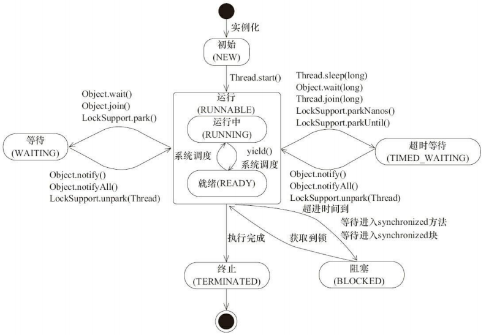

# Java 多线程基础

[toc]


## **一、进程和线程**

### 1. 进程、线程的概念

**什么是进程？**

进程是**程序的一次执行过程**，是系统运行程序的基本单位，因此进程是**动态**的。系统运行一个程序即是一个进程从创建，运行到消亡的过程。

在 Java 中，当我们启动 main 函数时其实就是启动了一个 JVM 的进程，而 main 函数所在的线程就是这个进程中的一个线程，也称主线程。

**什么是线程？**

一个进程在其执行的过程中可以产生多个线程。与进程不同的是同类的多个线程共享进程的**堆**和**方法区**资源，但每个线程有自己的**程序计数器**、**虚拟机栈**和**本地方法栈**，所以系统在产生一个线程，或是在各个线程之间作切换工作时，负担要比进程小得多，也正因为如此，线程也被称为**轻量级进程**。

> **一个 Java 程序的运行不仅仅是 `main()` 方法的运行，而是 main 线程和多个其他线程的同时运行。**

**进程让操作系统的并发性成为了可能，而线程让进程的内部并发成为了可能。** 


**多进程的方式也可以实现并发，为什么我们要使用多线程？**

使用多线程，有以下几个好处：

- 进程间的通信比较复杂，而线程间的通信比较简单，通常情况下，我们需要使用共享资源，这些资源在线程间的通信比较容易。
- 进程是重量级的，进程的创建和切换需要消耗更大的处理器资源，而线程是轻量级的，故多线程方式的系统开销更小。


### 2. 进程和线程的区别

- **拥有资源**：**进程是资源分配的基本单位**，但是线程不拥有资源，线程可以访问隶属进程的资源。
- **调度**：**线程是独立调度的基本单位**，在同一进程中，线程的切换不会引起进程切换，从一个进程内的线程切换到另一个进程中的线程时，会引起进程切换。
- **系统开销**：由于创建或撤销进程时，系统都要为之分配或回收资源，如内存空间、I/O 设备等，所付出的开销远大于创建或撤销线程时的开销。类似地，在进行进程切换时，涉及当前执行进程 CPU 环境的保存及新调度进程 CPU 环境的设置，而线程切换时只需保存和设置少量寄存器内容，开销很小。
- **通信方面**：进程间通信 (IPC) 需要进程同步和互斥手段的辅助，以保证数据的一致性。而线程间可以通过直接读/写同一进程中的数据段（如全局变量）来进行通信。


### 3. 上下文切换

上下文切换（有时也称做进程切换或任务切换）是指 **CPU 从一个进程（或线程）切换到另一个进程（或线程）**。上下文是指**某一时间点 CPU 寄存器和程序计数器的内容。**

> 寄存器是 CPU 内部的少量的速度很快的闪存，通常用来存储和访问计算过程中的中间值以提高计算机程序的运行速度。
>
> 程序计数器是一个专用的寄存器，用于表明指令序列中 CPU 正在执行的位置，其中存储的值为正在执行的指令的位置或者下一个将要被执行的指令的位置，具体实现依赖于特定的系统。

```
举例说明 线程A - B上下文切换过程:

1.先挂起 线程A，将其在 CPU 中的状态保存在内存中。
2.在内存中检索 线程B 的上下文并将其在 CPU 的寄存器中恢复,执行 B线程。
3.当 线程B 执行完，根据程序计数器中指向的位置恢复 线程A。
```

CPU 通过为每个线程分配 **CPU 时间片**来实现多线程机制。CPU 通过时间片分配算法来循环执行任务，当前任务执行一个时间片后会切换到下一个任务。但是，在切换前会保存上一个任务的状态，以便下次切换回这个任务时，可以再加载这个任务的状态。所以**任务从保存到再加载的过程就是一次上下文切换**。

上下文切换通常是计算密集型的，意味着此操作会**消耗大量的 CPU 时间，故线程也不是越多越好**。如何减少系统中上下文切换次数，是提升多线程性能的一个重点课题。


## **二、Java 多线程常用入门类和接口**

### 1. Thread 类和 Runnable 接口

在 Java 中，我们一般是如何使用多线程的呢？

首先，我们需要有一个“线程”类。JDK 提供了 `Thread` 类和 `Runnable` 接口来让我们实现自己的“线程”类。最简单的是下列的两种方式：

- 继承 `Thread` 类，并重写 `run()` 方法；
- 实现 `Runnable` 接口的 `run()` 方法；


#### 1.1 继承 Thread 类

首先自定义一个线程类，这个类要继承 `Thread` 类，并重写其中的 `run()` 方法；在使用时需要先实例化该线程类，再调用这个类对象的 `start()` 方法开启线程。

```java
public class Demo {
    public static class MyThread extends Thread {
        @Override
        public void run() {
            System.out.println("MyThread");
        }
    }

    public static void main(String[] args) {
        Thread myThread = new MyThread();
        myThread.start(); //调用myThread的start()方法，开启线程
    }
}
```

注意要调用 `start()` 方法后，该线程才算启动！！！

> 我们在程序里面调用了 `start()` 方法后，虚拟机会先为我们创建一个线程，然后等到这个线程第一次得到时间片时再调用 `run()` 方法。（可以理解为：调用了 `start` 方法后该线程就进入了操作系统进程状态中的「就绪态」，虽然在 Java 线程状态中「就绪态」与「运行态」统称为**运行态 (RUNNABLE)**）
>
> **注意不可多次调用 `start()` 方法**。在第一次调用 `start()` 方法后，再次调用 `start()` 方法会抛出 `IllegalThreadStateException` 异常。


#### 1.2 实现 Runnable 接口

接着我们来看一下 `Runnable` 接口(JDK 1.8 +)：

```java
@FunctionalInterface
public interface Runnable {
    public abstract void run();
}
```

可以看到 `Runnable` 是一个函数式接口，这意味着我们可以使用 **Java 8 的函数式编程**来简化代码。

示例代码：

```java
public class Demo {
    public static class MyThread implements Runnable {
        @Override
        public void run() {
            System.out.println("MyThread");
        }
    }

    public static void main(String[] args) {
		//第一种使用方式
        new Thread(new MyThread()).start();

        //第二种使用方式: Java 8 函数式编程，可以省略MyThread类
        new Thread(() -> {
            System.out.println("Java8函数式编程");
        }).start();
    }
}
```


#### 1.3 Thread 类构造方法

`Thread` 类是 `Runnable` 接口的实现类，下面来看看 `Thread` 类的源码。

查看 `Thread` 类的构造方法，发现其实是简单调用一个私有的 `init()` 方法来实现初始化。如下是 `init()` 的方法签名以及相关代码片段：

```java
// Thread类源码 

// 片段1 - init方法
private void init(ThreadGroup g, Runnable target, String name,
                      long stackSize, AccessControlContext acc,
                      boolean inheritThreadLocals)

// 片段2 - Thread类构造方法调用init()方法
public Thread(Runnable target) {
    init(null, target, "Thread-" + nextThreadNum(), 0);
}

// 片段3 - 在init()方法里初始化AccessControlContext类型的私有属性
this.inheritedAccessControlContext = 
    acc != null ? acc : AccessController.getContext();

// 片段4 - 两个用于支持ThreadLocal的私有属性
ThreadLocal.ThreadLocalMap threadLocals = null;
ThreadLocal.ThreadLocalMap inheritableThreadLocals = null;
```

下面来逐个解释一下 `init()` 方法的传入参数：

- `ThreadGroup g`：线程组，指定这个线程是在哪个线程组下；
- `Runnable target`：指定要执行的任务；
- `String name`：线程的名字，多个线程的名字是可以重复的。如果不指定名字，见片段2；
- `AccessControlContext acc`：见片段3，用于初始化私有变量 `inheritedAccessControlContext`。
- `boolean inheritThreadLocals`：可继承的 `ThreadLocal`，见片段4，`Thread` 类里面有两个私有属性来支持 `ThreadLocal`，`ThreadLocal` 的相关概念在之后有介绍。

实际情况下，我们大多是直接调用下面两个构造方法：

```java
Thread(Runnable target)
Thread(Runnable target, String name)
```


#### 1.4 Thread 类的几个常用方法

这里介绍一下 Thread 类的几个常用的方法：

- `currentThread()`：静态方法，返回对当前正在执行的线程对象的引用；
- `start()`：开始执行线程的方法，java虚拟机会调用线程内的 `run()` 方法；
- `yield()`：指的是当前线程愿意让出对当前处理器的占用。这里需要注意的是，就算当前线程调用了 `yield()` 方法，程序在调度的时候，也还有可能继续运行这个线程的，因为可能让出处理器后下一刻该线程又抢占到了处理器资源；
- `sleep()`：静态方法，使当前线程睡眠一段时间；不会释放当前线程占用的锁，但会让出 CPU 资源，使那些不需要锁的线程得以执行；
- `join()`：使当前线程等待另一个线程执行完毕之后再继续执行，内部调用的是 Object 类的 `wait()` 方法实现的；


#### 1.5 Thread 类与 Runnable 接口的比较

实现一个自定义的线程类，可以有继承 `Thread` 类或者实现 `Runnable` 接口这两种方式，它们之间有什么优劣呢？

- 由于 Java “单继承，多实现”的特性，Runnable 接口使用起来比 Thread 更灵活。
- Runnable 接口更符合面向对象，将线程单独进行对象的封装。
- Runnable 接口的出现，降低了线程对象和线程任务的耦合性。
- 如果使用线程时不需要使用 Thread 类的诸多方法，显然使用 Runnable 接口更为轻量。

所以，我们通常优先使用“实现 `Runnable` 接口”这种方式来自定义线程类。


### 2. Callable、Future 与 FutureTask

通常来说，我们使用 `Runnable` 和 `Thread` 来创建一个新的线程。但是它们有一个弊端，就是 `run` 方法是没有返回值的。而有时候我们希望开启一个线程去执行一个任务，并且这个**任务执行完成后有一个返回值**。

基于这种情况，JDK 提供了 `Callable` 接口与 `Future` 接口为我们解决这个问题，这也是所谓的“**异步**”模型。

#### 2.1 Callable 接口

`Callable` 与 `Runnable`类似，同样是只有一个抽象方法的函数式接口。不同的是，`Callable` 提供的方法是**有返回值**的，而且支持**泛型**。

```java
@FunctionalInterface
public interface Callable<V> {
    V call() throws Exception;
}
```

那一般是怎么使用 `Callable` 的呢？

`Callable` 一般是配合线程池工具 `ExecutorService` 来使用的，线程池的使用在后续会有介绍。这里只介绍 `ExecutorService` 可以使用 `submit` 方法来让一个 `Callable` 接口执行。它会返回一个 `Future`，后续的程序可以通过这个 `Future` 的 `get` 方法得到结果。

下面是一个简单的使用 demo：

```java
// 自定义Callable
class Task implements Callable<Integer>{
    @Override
    public Integer call() throws Exception {
        // 模拟计算需要一秒
        Thread.sleep(1000);
        return 2; //线程执行完毕后的返回值
    }
    public static void main(String args[]) throws Exception {
        // 使用
        ExecutorService executor = Executors.newCachedThreadPool();
        Task task = new Task();
        Future<Integer> result = executor.submit(task); //开始执行Callable接口线程
        // 注意调用get()方法会阻塞当前线程，直到得到结果
        // 所以实际编码中建议使用可以设置超时时间的重载get方法
        System.out.println(result.get()); 
    }
}
```

输出结果：

```java
2
```


#### 2.2 Future 接口

`Future` 接口只有几个比较简单的方法：

```java
public abstract interface Future<V> {
    public abstract boolean cancel(boolean paramBoolean);
    public abstract boolean isCancelled();
    public abstract boolean isDone();
    public abstract V get() throws InterruptedException, ExecutionException;
    public abstract V get(long paramLong, TimeUnit paramTimeUnit)
            throws InterruptedException, ExecutionException, TimeoutException;
}
```

`cancel` 方法是试图取消一个线程的执行。

注意是**试图**取消，**并不一定能取消成功**。因为任务可能已完成、已取消、或者一些其它因素不能取消，存在取消失败的可能。`boolean` 类型的返回值是“是否取消成功”的意思。参数 `paramBoolean` 表示是否采用中断的方式取消线程执行。

所以有时候，为了让任务有能够取消的功能，就使用 `Callable + Future` 来代替 `Runnable`。如果为了可取消性而使用 `Future` 但又不提供可用的结果，则可以声明 `Future` 形式类型、并返回 `null` 作为底层任务的结果。


#### 2.3 FutureTask 类

上面介绍了 `Future` 接口。这个接口有一个实现类叫 `FutureTask`。`FutureTask` 是实现的 `RunnableFuture` 接口的，而 `RunnableFuture` 接口同时继承了 `Runnable` 接口和 `Future` 接口：

```java
public interface RunnableFuture<V> extends Runnable, Future<V> {
    /**
     * Sets this Future to the result of its computation
     * unless it has been cancelled.
     */
    void run();
}
```

那 `FutureTask` 类有什么用？为什么要有一个 `FutureTask` 类？前面说到了 `Future` 只是一个接口，而它里面的 `cancel()`，`get()`，`isDone()` 等方法要自己实现起来都是**非常复杂**的。所以 JDK 提供了一个 `FutureTask` 类来供我们使用。

示例代码：

```java
// 自定义Callable，与上面一样
class Task implements Callable<Integer>{
    @Override
    public Integer call() throws Exception {
        // 模拟计算需要一秒
        Thread.sleep(1000);
        return 2;
    }
    public static void main(String args[]) throws Exception {
        // 使用
        ExecutorService executor = Executors.newCachedThreadPool();
        FutureTask<Integer> futureTask = new FutureTask<>(new Task());
        executor.submit(futureTask);
        System.out.println(futureTask.get());
    }
}
```

使用上与第一个 Demo 有一点小的区别。首先，调用 `submit` 方法是没有返回值的。这里实际上是调用的 `submit(Runnable task)` 方法，而上面的 Demo，调用的是 `submit(Callable task)` 方法。

然后，这里是使用 `FutureTask` 直接取 `get` 取值，而上面的 Demo 是通过 `submit` 方法返回的 `Future` 对象，再通过该对象的 `get()` 取值。

在很多高并发的环境下，有可能 Callable 和 FutureTask 会创建多次。FutureTask 能够在高并发环境下**确保任务只执行一次**。


#### 2.4 FutureTask 的几个状态

```java
/**
  * state可能的状态转变路径如下：
  * NEW -> COMPLETING -> NORMAL
  * NEW -> COMPLETING -> EXCEPTIONAL
  * NEW -> CANCELLED
  * NEW -> INTERRUPTING -> INTERRUPTED
  */
private volatile int state;
private static final int NEW          = 0;
private static final int COMPLETING   = 1;
private static final int NORMAL       = 2;
private static final int EXCEPTIONAL  = 3;
private static final int CANCELLED    = 4;
private static final int INTERRUPTING = 5;
private static final int INTERRUPTED  = 6;
```

> state 表示任务的运行状态，初始状态为 NEW。运行状态只会在 `set`、`setException`、`cancel` 方法中终止。COMPLETING、INTERRUPTING 是任务完成后的瞬时状态。


## **三、线程组和线程优先级**

### 1. 线程组（ThreadGroup）

Java 中用 ThreadGroup 来表示线程组，**可以使用线程组对线程进行批量控制**。

ThreadGroup 和 Thread 的关系就如同他们的字面意思一样，每个 Thread 必然存在于一个 ThreadGroup 中，Thread 不能独立于 ThreadGroup 存在。执行 `main()` 方法线程的名字是 main，如果在 `new Thread()` 时没有显式指定线程组，那么默认将父线程（当前执行 `new Thread()` 的线程）的线程组设置为自己的线程组。

示例代码：

```java
public class Demo {
    public static void main(String[] args) {
        Thread testThread = new Thread(() -> {
            System.out.println("testThread当前线程组名字：" +
                    Thread.currentThread().getThreadGroup().getName());
            System.out.println("testThread线程名字：" +
                    Thread.currentThread().getName());
        });

        testThread.start();
    	System.out.println("执行main所在线程的线程组名字： " + Thread.currentThread().getThreadGroup().getName());
        System.out.println("执行main方法线程名字：" + Thread.currentThread().getName());
    }
}
```

输出结果：

```java
执行main所在线程的线程组名字： main
执行main方法线程名字：main
testThread当前线程组名字：main
testThread线程名字：Thread-0
```

ThreadGroup 管理着它下面的 Thread，ThreadGroup 是一个标准的**向下引用**的树状结构，这样设计的原因是**防止"上级"线程被"下级"线程引用而无法有效地被 GC 回收**。


### 2. 线程的优先级

Java 中线程优先级可以指定，范围是 1~10。但是并不是所有的操作系统都支持 10 级优先级的划分（比如有些操作系统只支持 3 级划分：低，中，高），Java 只是给操作系统一个优先级的**参考值**，线程最终**在操作系统的优先级**是多少还是由操作系统决定。

Java 默认的线程优先级为 5，**线程的执行顺序由调度程序来决定**，线程的优先级会在线程被调用之前设定。

通常情况下，高优先级的线程将会比低优先级的线程有**更高的几率**得到执行。可以使用 `Thread` 类的 `setPriority()` 实例方法来设定线程的优先级，用 `getPriority()` 实例方法来获取线程的优先级。

```java
public class Demo {
    public static void main(String[] args) {
        Thread a = new Thread();
        System.out.println("我是默认线程优先级："+a.getPriority());
        Thread b = new Thread();
        b.setPriority(10);
        System.out.println("我是设置过的线程优先级："+b.getPriority());
    }
}
```

输出结果：

```java
我是默认线程优先级：5
我是设置过的线程优先级：10
```

需要特别注意的是：

Java 中的优先级来说不是特别的可靠，**Java 程序中对线程所设置的优先级只是给操作系统一个建议，操作系统不一定会采纳。而真正的调用顺序，是由操作系统的线程调度算法决定的**。在业务实现中不能武断地采用设定线程优先级的方法来指定线程执行的先后顺序！

下面可以通过代码来验证一下：

```java
public class Demo {
    public static class T1 extends Thread {
        @Override
        public void run() {
            super.run();
            System.out.println(String.format("当前执行的线程是：%s，优先级：%d",
                    Thread.currentThread().getName(),
                    Thread.currentThread().getPriority()));
        }
    }

    public static void main(String[] args) {
        IntStream.range(1, 10).forEach(i -> {
            Thread thread = new Thread(new T1());
            thread.setPriority(i);
            thread.start();
        });
    }
}
```

某次输出：

```java
当前执行的线程是：Thread-17，优先级：9
当前执行的线程是：Thread-1，优先级：1
当前执行的线程是：Thread-13，优先级：7
当前执行的线程是：Thread-11，优先级：6
当前执行的线程是：Thread-15，优先级：8
当前执行的线程是：Thread-7，优先级：4
当前执行的线程是：Thread-9，优先级：5
当前执行的线程是：Thread-3，优先级：2
当前执行的线程是：Thread-5，优先级：3
```

Java 提供一个**线程调度器**来监视和控制处于 **RUNNABLE 状态**的线程。线程的调度策略采用**抢占式**，优先级高的线程比优先级低的线程会有更大的几率优先执行。在优先级相同的情况下，按照“先到先得”的原则。每个 Java 程序都有一个默认的主线程，就是通过 JVM 启动的第一个线程 main 线程。


还有一种线程称为 **守护线程（Daemon）**，守护线程默认的优先级比较低。

> 如果某线程是守护线程，那如果所有的非守护线程都结束了，这个守护线程也会自动结束。
>
> 应用场景是：当所有非守护线程结束时，其余的子线程（守护线程）将会自动关闭，这就免去了还要继续关闭子线程的麻烦。
>
> 一个线程默认是非守护线程，可以通过 Thread 类的 `setDaemon(boolean on)` 来设置。

一个线程必然存在于一个线程组中，那么当线程和线程组的优先级不一致的时候将会怎样呢？下面可以用一个案例来验证一下：

```java
public static void main(String[] args) {
    ThreadGroup threadGroup = new ThreadGroup("t1"); //定义一个线程组
    threadGroup.setMaxPriority(6);
    Thread thread = new Thread(threadGroup,"thread"); //定义一个存在于上面线程组的线程
    thread.setPriority(9);
    System.out.println("我是线程组的优先级" + threadGroup.getMaxPriority());
    System.out.println("我是线程的优先级" + thread.getPriority());
}
```

输出：

> 我是线程组的优先级6
> 我是线程的优先级6

所以，如果某个线程优先级大于线程所在**线程组的最大优先级**，那么该线程的优先级将会失效，取而代之的是线程组的最大优先级。


### 3. 线程组的常用方法及数据结构

#### 3.1 线程组的常用方法

**获取当前的线程组名字**

```java
Thread.currentThread().getThreadGroup().getName()
```

**复制线程组**

```java
// 获取当前的线程组
ThreadGroup threadGroup = Thread.currentThread().getThreadGroup();
// 复制一个线程组到一个线程数组（获取Thread信息）
Thread[] threads = new Thread[threadGroup.activeCount()];
threadGroup.enumerate(threads);
```

**线程组统一异常处理**

```java
package com.func.axc.threadgroup;

public class ThreadGroupDemo {
    public static void main(String[] args) {
        ThreadGroup threadGroup1 = new ThreadGroup("group1") {
            // 继承ThreadGroup并重新定义以下方法
            // 在线程成员抛出unchecked exception
            // 会执行此方法
            public void uncaughtException(Thread t, Throwable e) {
                System.out.println(t.getName() + ": " + e.getMessage());
            }
        };

        // 这个线程是threadGroup1的一员
        Thread thread1 = new Thread(threadGroup1, new Runnable() {
            public void run() {
                // 抛出unchecked异常
                throw new RuntimeException("测试异常");
            }
        });

        thread1.start();
    }
}
```


#### 3.2 线程组的数据结构

**线程组还可以包含其他的线程组，不仅仅是线程。**

首先看看 `ThreadGroup` 源码中的成员变量：

```java
public class ThreadGroup implements Thread.UncaughtExceptionHandler {
    private final ThreadGroup parent; // 父ThreadGroup
    String name; // ThreadGroup 的名称
    int maxPriority; // 线程最大优先级
    boolean destroyed; // 是否被销毁
    boolean daemon; // 是否守护线程
    boolean vmAllowSuspension; // 是否可以中断

    int nUnstartedThreads = 0; // 还未启动的线程
    int nthreads; // ThreadGroup中线程数目
    Thread threads[]; // ThreadGroup中的线程

    int ngroups; // 线程组数目
    ThreadGroup groups[]; // 线程组数组
}
```

然后看看构造函数：

```java
// 私有构造函数
private ThreadGroup() { 
    this.name = "system";
    this.maxPriority = Thread.MAX_PRIORITY;
    this.parent = null;
}

// 默认是以当前ThreadGroup传入作为parent ThreadGroup，新线程组的父线程组是目前正在运行线程的线程组。
public ThreadGroup(String name) {
    this(Thread.currentThread().getThreadGroup(), name);
}

// 构造函数
public ThreadGroup(ThreadGroup parent, String name) {
    this(checkParentAccess(parent), parent, name);
}

// 私有构造函数，主要的构造函数
private ThreadGroup(Void unused, ThreadGroup parent, String name) {
    this.name = name;
    this.maxPriority = parent.maxPriority;
    this.daemon = parent.daemon;
    this.vmAllowSuspension = parent.vmAllowSuspension;
    this.parent = parent;
    parent.add(this);
}
```

第三个构造函数里调用了 `checkParentAccess` 方法，这里看看这个方法的源码：

```java
// 检查parent ThreadGroup
private static Void checkParentAccess(ThreadGroup parent) {
    parent.checkAccess();
    return null;
}

// 判断当前运行的线程是否具有修改线程组的权限
public final void checkAccess() {
    SecurityManager security = System.getSecurityManager();
    if (security != null) {
        security.checkAccess(this);
    }
}
```

> 这里涉及到 `SecurityManager` 这个类，它是 Java 的安全管理器，它允许应用程序在执行一个可能不安全或敏感的操作前确定该操作是什么，以及是否是在允许执行该操作的安全上下文中执行它。应用程序可以允许或不允许该操作。
>
> 比如引入了第三方类库，但是并不能保证它的安全性。
>
> 其实 Thread 类也有一个 `checkAccess()` 方法，不过是用来决定当前运行的线程是否有权限修改被调用的这个线程实例。

总结来说，线程组是一个**树状**的结构，**每个线程组下面可以有多个线程或者线程组**。线程组可以起到**统一控制线程的优先级和检查线程的权限**的作用。


## **四、Java 线程状态及主要转化方法**

### 1. 现代操作系统中的线程状态及转换（5种）

在现在的操作系统中，线程是被视为轻量级进程的，所以**操作系统线程的状态其实和操作系统进程的状态是一致的**。具有以下 5 种状态：

 

- **创建态(new)** ：进程正在被创建，尚未到就绪状态。
- **就绪态(ready)** ：进程已处于准备运行状态（等待被调度），即**进程获得了除了处理器之外的一切所需资源**，一旦得到处理器资源(处理器分配的时间片)即可运行。
- **运行态(running)** ：进程正在处理器上运行（单核 CPU 下任意时刻只有一个进程处于运行状态）。
- **阻塞态(waiting)** ：又称为等待状态（等待资源），**进程正在等待某一事件而暂停运行**如等待某资源为可用或等待 IO 操作完成。即使处理器空闲，该进程也不能运行。
- **结束/终止态(terminated)** ：进程正在从系统中消失。可能是进程正常结束或其他原因中断退出运行。

状态转换条件：

- **就绪态→运行态：处于就绪态的进程被调度后，获得处理机资源**（分派处理机时间片），于是进程由就绪态转换为运行态。
- **运行态→就绪态：处于运行态的进程在时间片用完**后，不得不让出处理机，从而进程由运行态转换为就绪态。此外，在可剥夺的操作系统中，当有**更高优先级的进程就绪**时，调度程序将正在执行的进程转换为就绪态，让更高优先级的进程执行。
- **运行态→阻塞态：进程请求某一资源（如外设）的使用和分配或等待某一事件的发生（如 I/O 操作的完成）时，它就从运行态转换为阻塞态。进程以系统调用**的形式请求操作系统提供服务，这是一种由运行**用户态**程序调用操作系统内核过程的形式。
- **阻塞态→就绪态：进程等待事件到来**时，如 I/O 操作结束或中断结束时，中断处理程序必须把相应进程的状态由阻塞态转换为就绪态。

应该注意以下内容：

- 只有就绪态和运行态可以相互转换，其它的都是单向转换。就绪状态的进程通过调度算法从而获得 CPU 时间片，转为运行状态；而运行状态的进程，在分配给它的 CPU 时间片用完之后就会转为就绪状态，等待下一次调度。
- 阻塞状态是缺少需要的资源从而由运行状态转换而来，但是该资源不包括 CPU 时间，缺少 CPU 时间会从运行态转换为就绪态。


### 2. Java 线程状态（6种）

```java
// Thread.State 源码
public enum State {
    NEW,
    RUNNABLE,
    BLOCKED,
    WAITING,
    TIMED_WAITING,
    TERMINATED;
}
```


#### 2.1 NEW 创建

处于 NEW 状态的线程此时**尚未启动**。这里的尚未启动指的是**还没调用 Thread 实例的 `start()` 方法**。

```java
private void testStateNew() {
    Thread thread = new Thread(() -> {});
    System.out.println(thread.getState()); // 输出 NEW 
}
```

从上面可以看出，只是创建了线程而并没有调用 `start()` 方法，此时线程处于 NEW 状态。

**关于 `start()` 的两个引申问题：**

1. 反复调用同一个线程的 `start()` 方法是否可行？
2. 假如一个线程执行完毕（此时处于 TERMINATED 状态），再次调用这个线程的 `start()` 方法是否可行？

要分析这两个问题，先来看看 `start()` 的源码：

```java
public synchronized void start() {
    if (threadStatus != 0)
        throw new IllegalThreadStateException();

    group.add(this);

    boolean started = false;
    try {
        start0();
        started = true;
    } finally {
        try {
            if (!started) {
                group.threadStartFailed(this);
            }
        } catch (Throwable ignore) {

        }
    }
}
```

可以看到，在 `start()` 内部，这里有一个 threadStatus 的变量。如果它不等于 0，调用 `start()` 是会直接抛出异常的。

接着往下看，有一个 native 的 `start0()` 方法。这个方法里并没有对 **threadStatus** 的处理。可以通过 debug 的方式再看一下:

```java
@Test
public void testStartMethod() {
    Thread thread = new Thread(() -> {});
    thread.start(); // 第一次调用
    thread.start(); // 第二次调用
}
```

在 `start()` 方法内部的最开始处打的断点，下面是在这里打断点看到的结果：

- 第一次调用时 threadStatus 的值是 0。
- 第二次调用时 threadStatus 的值不为 0。

查看当前线程状态的源码：

```java
// Thread.getState方法源码：
public State getState() {
    // get current thread state
    return sun.misc.VM.toThreadState(threadStatus);
}

// sun.misc.VM 源码：
public static State toThreadState(int var0) {
    if ((var0 & 4) != 0) {
        return State.RUNNABLE;
    } else if ((var0 & 1024) != 0) {
        return State.BLOCKED;
    } else if ((var0 & 16) != 0) {
        return State.WAITING;
    } else if ((var0 & 32) != 0) {
        return State.TIMED_WAITING;
    } else if ((var0 & 2) != 0) {
        return State.TERMINATED;
    } else {
        return (var0 & 1) == 0 ? State.NEW : State.RUNNABLE;
    }
}
```

所以，结合上面的源码可以得到引申的两个问题的结果：

> 两个问题的答案都是不可行，在调用一次 `start()` 之后，threadStatus 的值会改变（threadStatus !=0），此时再次调用 `start()` 方法会抛出 `IllegalThreadStateException` 异常。
>
> 比如，threadStatus 为 2 代表当前线程状态为TERMINATED。


#### 2.2 RUNNABLE 运行

表示当前线程**正在运行**中。处于 RUNNABLE 状态的线程**可能在 Java 虚拟机中运行，也有可能在等待 CPU 分配资源**。

Thread 源码里对 RUNNABLE 状态的定义：

```java
/**
 * Thread state for a runnable thread.  A thread in the runnable
 * state is executing in the Java virtual machine but it may
 * be waiting for other resources from the operating system
 * such as processor.
 */
```

> Java 线程的 **RUNNABLE** 状态其实是包括了传统操作系统线程的 **就绪(ready)** 和 **运行(running)** 两个状态的。


#### 2.3 BLOCKED 阻塞

阻塞状态。处于 BLOCKED 状态的线程**正等待锁的释放以进入同步区**。

可以用 BLOCKED 状态举个生活中的例子：

> 假如你正在银行窗口排队办理业务。你来到银行仅有的一个窗口，发现前面已经有个人在窗口前办理业务了，此时你必须得取一个号，等前面的人从窗口离开才行。
> 假设你是线程 t2，你前面的那个人是线程 t1。此时 t1 占有了锁（银行唯一的窗口），t2 正在等待锁的释放，所以此时 t2 就处于 BLOCKED 状态。


#### 2.4 WAITING 等待

等待状态。处于等待状态的线程变成 RUNNABLE 状态**需要其他线程唤醒**。

调用如下 3 个方法会使线程进入等待状态：

- `Object.wait()`：使当前线程处于等待状态直到另一个线程唤醒它；
- `Thread.join()`：使当前线程等待另一个线程执行完毕之后再继续执行，底层调用的是 Object 实例的 `wait()` 方法；
- `LockSupport.park()`：除非获得调用许可，否则禁用当前线程进行线程调度。

延续上面的例子继续解释一下 WAITING 状态：

> 你等了好几分钟现在终于轮到你开始办理业务了，突然有一个 vip 客户来了。你看到他你就有一种不祥的预感，果然，他是来插队的（因为他是 vip，有优先特权无需取号）。
>
> 他把你挤到一旁让你等他完事了才能办业务。你心里虽然有一万个不愿意但是你还是拿着你的号从窗口走开了。
>
> 此时，假设你还是线程 t2，vip 客户是线程 t1。虽然你此时都占有锁（窗口）了，“不速之客”来了你还是得释放掉锁。此时你 t2 的状态就是 WAITING。然后 vip 客户 t1 获得锁，进入 RUNNABLE 状态。
>
> 要是 vip 客户不主动唤醒你 t2（通过 `notify()`、`notifyAll()` ...），可以说你 t2 只能一直等待了。


#### 2.5 TIMED_WAITING 超时等待

超时等待状态。线程**等待一个具体的时间，时间到后会被自动唤醒**。

调用如下方法会使线程进入超时等待状态：

- `Thread.sleep(long millis)`：使当前线程睡眠指定时间，**`sleep()` 方法不会释放当前锁，但会让出 CPU，所以其他不需要争夺锁的线程可以获取 CPU 执行**；
- `Object.wait(long timeout)`：线程休眠指定时间，等待期间可以通过 `notify()` / `notifyAll()` 唤醒；
- `Thread.join(long millis)`：等待当前线程最多执行 millis 毫秒，如果 millis 为 0，则会一直执行；
- `LockSupport.parkNanos(long nanos)`： 除非获得调用许可，否则禁用当前线程进行线程调度指定时间；
- `LockSupport.parkUntil(long deadline)`：同上，也是禁止线程进行调度指定时间；

继续延续上面的例子来解释一下 TIMED_WAITING 状态：

> 到了第二天中午，又有业务需要在银行办理，你还是到了窗口前。
>
> 突然间想起你的同事叫你等他一起，他说让你等他十分钟他整理一些资料就来。
>
> 好吧，你说那你就等等吧，你就离开了窗口。很快十分钟过去了，你见他还没来，你想都等了这么久了还不来，那你还是先去办理好手上的业务了。
>
> 这时你还是线程 t1，你的同事是线程 t2。t2 让 t1 等待了指定时间，此时 t1 等待期间就属于 TIMED_WATING 状态。
>
> t1 等待 10 分钟后，就自动唤醒，拥有了去争夺锁的资格。


#### 2.6 TERMINATED 终止

终止状态。此时线程已**执行完毕**。


### 3. Java 线程状态转换


 


#### 3.1 BLOCKED 与 RUNNABLE 转换

处于 BLOCKED 状态的线程是因为在**等待锁的释放**。假如有两个线程 a 和 b，a 线程提前获得了锁并且暂未释放锁，此时 b 就处于 BLOCKED 状态。先来看一个例子：

```java
@Test
public void blockedTest() {
    Thread a = new Thread(new Runnable() {
        @Override
        public void run() {
            testMethod();
        }
    }, "a");
    Thread b = new Thread(new Runnable() {
        @Override
        public void run() {
            testMethod();
        }
    }, "b");

    a.start();
    b.start();
    System.out.println(a.getName() + ":" + a.getState()); // 输出？
    System.out.println(b.getName() + ":" + b.getState()); // 输出？
}

// 同步方法争夺锁
private synchronized void testMethod() {
    try {
        Thread.sleep(2000L);
    } catch (InterruptedException e) {
        e.printStackTrace();
    }
}
```

初看之下，可能会觉得线程 a 会先调用同步方法，同步方法内又调用了 `Thread.sleep()` 方法，必然会输出TIMED_WAITING，而线程 b 因为等待线程 a 释放锁所以必然会输出 BLOCKED。

其实不然，有两点需要注意，一是**在测试方法 `blockedTest()` 内还有一个 main 线程**，二是**启动线程后执行 `run()` 方法还是需要消耗一定时间的**。

> 测试方法的 main 线程只保证了 a，b 两个线程调用 `start()` 方法（转化为 RUNNABLE 状态），如果 CPU 执行效率高一点，还没等两个线程真正开始争夺锁，就已经打印此时两个线程的状态（RUNNABLE）了。
>
> 当然，如果 CPU 执行效率低一点，其中某个线程也是可能打印出 BLOCKED 状态的（此时两个线程已经开始争夺锁了）。

那要是想要打印出 BLOCKED 状态该怎么处理呢？BLOCKED 状态的产生需要两个线程争夺锁才行。所以处理下测试方法里的 main 线程就可以了，让它“休息一会儿”，调用一下 `Thread.sleep()` 方法。

这里需要注意的是 main 线程休息的时间，要保证在线程争夺锁的时间内，不要等到前一个线程锁都释放了再去争夺锁，此时还是得不到 BLOCKED 状态的。

把上面的测试方法 `blockedTest()` 改动一下：

```java
public void blockedTest() throws InterruptedException {
    ······
    a.start();
    Thread.sleep(1000L); // 需要注意这里main线程休眠了1000毫秒，而testMethod()里休眠了2000毫秒
    b.start();
    System.out.println(a.getName() + ":" + a.getState()); // 输出？
    System.out.println(b.getName() + ":" + b.getState()); // 输出？
}
```

在这个例子中两个线程的状态转换如下

- a 的状态转换过程：RUNNABLE（`a.start()`） —> TIMED_WATING（`Thread.sleep()`）—> RUNABLE（`sleep()` 时间到）—> *BLOCKED(未抢到锁)* —> TERMINATED
- b 的状态转换过程：RUNNABLE（`b.start()`） —> *BLOCKED(未抢到锁)* —> TERMINATED

> 斜体表示可能出现的状态，这里的输出也可能有多钟结果。


#### 3.2 WAITING 与 RUNNABLE 转换

根据转换图可以知道有 3 个方法可以使线程从 RUNNABLE 状态转为 WAITING 状态。主要介绍下 `Object.wait()` 和 `Thread.join()`。

- **Object.wait()**

调用 `wait()` 方法前线程必须持有对象的锁。

线程调用 `wait()` 方法时，会释放当前的锁，直到有其他线程调用 `notify()` / `notifyAll()` 方法唤醒等待锁的线程。

需要注意的是，其他线程调用 `notify()` 方法只会唤醒单个等待锁的线程，如有有多个线程都在等待这个锁的话不一定会唤醒到之前调用 `wait()` 方法的线程。

同样，调用 `notifyAll()` 方法唤醒所有等待锁的线程之后，也不一定会马上把时间片分给刚才放弃锁的那个线程，具体要看系统的调度。

- **Thread.join()**

调用 `join()` 方法，会一直等待这个 Thread 线程执行完毕（转换为 TERMINATED 状态）再继续执行。

再把上面的例子线程启动那里改变一下：

```java
public void blockedTest() {
    ······
    a.start();
    a.join();
    b.start();
    System.out.println(a.getName() + ":" + a.getState()); // 输出 TERMINATED
    System.out.println(b.getName() + ":" + b.getState());
}
```

要是没有调用 `join()` 方法，main 线程不管 a 线程是否执行完毕都会继续往下走。

a 线程启动之后马上调用了 a 线程的 `join()` 方法，这里 main 线程就会等到 a 线程执行完毕，所以这里 a 线程打印的状态固定是**TERMINATED**。

至于 b 线程的状态，有可能打印 RUNNABLE（尚未进入同步方法），也有可能打印 TIMED_WAITING（进入了同步方法）。


#### 3.3 TIMED_WAITING与RUNNABLE状态转换

TIMED_WAITING 与 WAITING 状态类似，只是 TIMED_WAITING 状态等待的时间是指定的。

- **Thread.sleep(long)**

使当前线程睡眠指定时间。需要注意这里的“睡眠”只是**暂时使线程停止执行，并不会释放锁**。时间到后，线程会重新进入 RUNNABLE 状态。

- **Object.wait(long)**

`wait(long)` 方法使线程进入 TIMED_WAITING 状态。这里的 `wait(long)` 方法与无参方法 `wait()` 相同的地方是，都可以通过其他线程调用 `notify()` 或 `notifyAll()` 方法来唤醒。

不同的地方是，有参方法 `wait(long)` 就算其他线程不来唤醒它，经过指定时间 long 之后它会自动唤醒，拥有去争夺锁的资格。

- **Thread.join(long)**

`join(long)` 使当前线程执行指定时间，并且使线程进入 TIMED_WAITING 状态。

再来改一改刚才的示例:

 ```java
public void blockedTest() {
    ······
    a.start();
    a.join(1000L);
    b.start();
    System.out.println(a.getName() + ":" + a.getState()); // 输出 TIEMD_WAITING
    System.out.println(b.getName() + ":" + b.getState());
}
 ```

这里调用 `a.join(1000L)`，因为是指定了具体 a 线程执行的时间的，并且执行时间是小于 a 线程 sleep 的时间，所以 a 线程状态输出 TIMED_WAITING。b 线程状态仍然不固定（RUNNABLE 或 BLOCKED）。


#### 3.4 线程中断

> 在某些情况下，我们在线程启动后发现并不需要它继续执行下去时，需要中断线程。目前在 Java 里还没有安全直接的方法来停止线程，但是 Java 提供了线程中断机制来处理需要中断线程的情况。

线程中断机制是一种协作机制。需要注意，通过**中断操作并不能直接终止一个线程，而是通知需要被中断的线程自行处理**。

简单介绍下 Thread 类里提供的关于线程中断的几个方法：

- `Thread.interrupt()`：中断线程。这里的中断线程并不会立即停止线程，而是设置线程的中断状态为true（默认是 flase）；
- `Thread.currentThread().isInterrupted()`：测试当前线程是否被中断。线程的中断状态受这个方法的影响，意思是调用一次使线程中断状态设置为 true，连续调用两次会使得这个线程的中断状态重新转为 false；
- `Thread.isInterrupted()`：测试当前线程是否被中断。与上面方法不同的是调用这个方法并不会影响线程的中断状态。

> 在线程中断机制里，当其他线程通知需要被中断的线程后，线程中断的状态被设置为 true，但是具体被要求中断的线程要怎么处理，完全由被中断线程自己而定，可以合适地处理中断请求，也可以完全不处理继续执行下去。


## **五、Java 线程间通信**

合理地使用 Java 多线程可以更好地利用服务器资源。一般来讲，线程内部有自己私有的线程上下文，互不干扰。但是当我们需要多个线程之间相互协作的时候，就需要掌握 Java 线程的通信方式。下文将介绍 Java 线程之间的几种通信机制和原理。 

### 1. 锁与同步

在 Java 中，锁的概念都是基于对象的，所以又经常称它为**对象锁**。

**一个锁同一时间只能被一个线程持有，其他线程如果需要得到这个锁，就得等这个线程释放这个锁**。

在线程之间，有一个同步的概念。什么是同步呢？线程同步是**线程之间按照一定的顺序执行**。

> 为了达到线程同步（目的），我们可以使用锁（手段）来实现它。

先来看看一个无锁的程序：

```java
public class NoneLock {
    static class ThreadA implements Runnable {
        @Override
        public void run() {
            for (int i = 0; i < 100; i++) {
                System.out.println("Thread A " + i);
            }
        }
    }
    static class ThreadB implements Runnable {
        @Override
        public void run() {
            for (int i = 0; i < 100; i++) {
                System.out.println("Thread B " + i);
            }
        }
    }

    public static void main(String[] args) {
        new Thread(new ThreadA()).start();
        new Thread(new ThreadB()).start();
    }
}
```

执行这个程序，会在控制台看到，线程 A 和线程 B 各自独立工作，输出自己的打印值。如下是某一次运行的结果。每一次运行结果都会不一样：

```java
....
Thread A 48
Thread A 49
Thread B 0
Thread A 50
Thread B 1
Thread A 51
Thread A 52
....
```


如果现在有一个需求，我想等 A 先执行完之后，再由 B 去执行，怎么办呢？最简单的方式就是使用一个“对象锁”：

```java
public class ObjectLock {
    private static Object lock = new Object(); //任何对象都可以作为锁

    static class ThreadA implements Runnable {
        @Override
        public void run() {
            synchronized (lock) { //上锁
                for (int i = 0; i < 100; i++) {
                    System.out.println("Thread A " + i);
                }
            }
        }
    }
    static class ThreadB implements Runnable {
        @Override
        public void run() {
            synchronized (lock) { //上锁
                for (int i = 0; i < 100; i++) {
                    System.out.println("Thread B " + i);
                }
            }
        }
    }

    public static void main(String[] args) throws InterruptedException {
        new Thread(new ThreadA()).start();
        Thread.sleep(10);
        new Thread(new ThreadB()).start();
    }
}
```

这里声明了一个名字为 `lock` 的对象锁。在 `ThreadA` 和 `ThreadB` 内需要同步的代码块里，都是用 `synchronized` 关键字加上了同一个对象锁 `lock`。

上文说到了，根据线程和锁的关系，同一时间只有一个线程持有一个锁，那么线程 B 就会等线程 A 执行完成后释放 `lock`，线程 B 才能获得锁 `lock`。

> 这里在主线程里使用 sleep 方法睡眠了 10 毫秒，是为了防止线程 B 先得到锁。因为如果同时 start，线程 A 和线程 B 都是处于就绪状态，操作系统可能会先让 B 运行。这样就会先输出 B 的内容，然后 B 执行完成之后自动释放锁，线程 A 再执行。


### 2. 等待/通知机制

上面一种基于“锁”的方式，线程需要不断地去尝试获得锁，如果失败了，再继续尝试（即**自旋**）。这可能会耗费服务器资源。而等待/通知机制是另一种方式。

Java 多线程的**等待/通知机制是基于 `Object` 类的 `wait()` 方法和 `notify()`，`notifyAll()` 方法来实现的**。

> `notify()` 方法会随机叫醒一个正在等待的线程，而 `notifyAll()` 会叫醒所有正在等待的线程。

前面讲到，一个锁同一时刻只能被一个线程持有。而假如线程 A 现在持有了一个锁 `lock` 并开始执行，它可以使用 `lock.wait()` 让自己进入等待状态。这个时候，`lock` 这个锁是被释放了的。

这时，线程 B 获得了 `lock` 这个锁并开始执行，它可以在某一时刻，使用 `lock.notify()`，通知之前持有 `lock` 锁并进入等待状态的线程 A 可以继续往下执行了。

> 需要注意的是，这个时候线程 B 并没有释放锁 `lock`，除非线程 B 这个时候使用 `lock.wait()` 释放锁，或者线程 B 执行结束自行释放锁，线程 A 才能得到 `lock` 锁。

下面用代码来实现一下：

```java
public class WaitAndNotify {
    private static Object lock = new Object();

    static class ThreadA implements Runnable {
        @Override
        public void run() {
            synchronized (lock) {
                for (int i = 0; i < 5; i++) {
                    try {
                        System.out.println("ThreadA: " + i);
                        lock.notify();
                        lock.wait();
                    } catch (InterruptedException e) {
                        e.printStackTrace();
                    }
                }
                lock.notify();
            }
        }
    }

    static class ThreadB implements Runnable {
        @Override
        public void run() {
            synchronized (lock) {
                for (int i = 0; i < 5; i++) {
                    try {
                        System.out.println("ThreadB: " + i);
                        lock.notify();
                        lock.wait();
                    } catch (InterruptedException e) {
                        e.printStackTrace();
                    }
                }
                lock.notify();
            }
        }
    }

    public static void main(String[] args) throws InterruptedException {
        new Thread(new ThreadA()).start();
        Thread.sleep(1000);
        new Thread(new ThreadB()).start();
    }
}

// 输出：
ThreadA: 0
ThreadB: 0
ThreadA: 1
ThreadB: 1
ThreadA: 2
ThreadB: 2
ThreadA: 3
ThreadB: 3
ThreadA: 4
ThreadB: 4
```

在这个 Demo 里，线程 A 和线程 B 首先打印出自己需要的东西，然后使用 `notify()` 方法叫醒另一个正在等待的线程，然后自己使用 `wait()` 方法陷入等待并释放 `lock` 锁。

> 需要注意的是等待/通知机制使用的是使用**同一个对象锁**，如果两个线程使用的是不同的对象锁，那它们之间是不能用等待/通知机制通信的。


### 3. 信号量

JDK 提供了一个类似于“信号量”功能的类 `Semaphore`。但这里不是要介绍这个类，而是介绍一种**基于 `volatile` 关键字的实现的信号量通信**。

后面会有专门介绍 `volatile` 关键字，这里只是做一个简单的介绍。

> volatile 关键字能够保证内存的**可见性：如果用 volatile 关键字声明了一个变量，在一个线程里面改变了这个变量的值，那其它线程是立马可见更改后的值的**。

比如现在有一个需求，我想让线程 A 输出 0，然后线程 B 输出 1，再然后线程 A 输出 2…。以此类推。应该怎样实现呢？下面是具体代码：

```java
public class Signal {
    private static volatile int signal = 0; // 被volatile修饰地共享变量

    static class ThreadA implements Runnable {
        @Override
        public void run() {
            while (signal < 5) {
                if (signal % 2 == 0) {
                    System.out.println("threadA: " + signal);
                    signal++;
                }
            }
        }
    }

    static class ThreadB implements Runnable {
        @Override
        public void run() {
            while (signal < 5) {
                if (signal % 2 == 1) {
                    System.out.println("threadB: " + signal);
                    signal = signal + 1;
                }
            }
        }
    }

    public static void main(String[] args) throws InterruptedException {
        new Thread(new ThreadA()).start();
        Thread.sleep(1000);
        new Thread(new ThreadB()).start();
    }
}

// 输出：
threadA: 0
threadB: 1
threadA: 2
threadB: 3
threadA: 4
```

可以看到，使用了一个 `volatile` 变量 `signal` 来实现了“信号量”的模型。这里需要注意的是，`volatile` 变量需要进行**原子操作**。

需要注意的是，`signal++` 并不是一个原子操作，所以在实际开发中，会根据需要使用 `synchronized` 给它“上锁”，或者是使用 `AtomicInteger` 等原子类。并且上面的程序也**并不是线程安全的**，因为执行 `while` 语句后，可能当前线程就暂停等待时间片了，等线程醒来，可能 signal 已经大于等于 5 了（多个线程同时执行了 `signal++`）。

> 这种实现方式并不一定高效，本例只是演示信号量


### 4. 管道

管道是基于“管道流”的通信方式。JDK 提供了`PipedWriter`、 `PipedReader`、 `PipedOutputStream`、 `PipedInputStream`。其中，前面两个是基于字符的，后面两个是基于字节流的。

这里的示例代码使用的是基于字符的：

```java
public class Pipe {
    static class ReaderThread implements Runnable {
        private PipedReader reader;

        public ReaderThread(PipedReader reader) {
            this.reader = reader;
        }

        @Override
        public void run() {
            System.out.println("this is reader");
            int receive = 0;
            try {
                while ((receive = reader.read()) != -1) {
                    //调用PipedReader的read方法从管道读出字符
                    System.out.print((char)receive);
                }
            } catch (IOException e) {
                e.printStackTrace();
            }
        }
    }

    static class WriterThread implements Runnable {

        private PipedWriter writer;

        public WriterThread(PipedWriter writer) {
            this.writer = writer;
        }

        @Override
        public void run() {
            System.out.println("this is writer");
            int receive = 0;
            try {
                writer.write("test"); //调用PipedWriter的write方法向管道写入字符
            } catch (IOException e) {
                e.printStackTrace();
            } finally {
                try {
                    writer.close(); //安全关闭管道
                } catch (IOException e) {
                    e.printStackTrace();
                }
            }
        }
    }

    public static void main(String[] args) throws IOException, InterruptedException {
        PipedWriter writer = new PipedWriter();
        PipedReader reader = new PipedReader();
        writer.connect(reader); // 这里注意一定要连接，才能通信

        new Thread(new ReaderThread(reader)).start();
        Thread.sleep(1000);
        new Thread(new WriterThread(writer)).start();
    }
}

// 输出：
this is reader
this is writer
test
```

通过线程的构造函数，传入了 `PipedWrite` 和 `PipedReader` 对象。可以简单分析一下这个示例代码的执行流程：

```text
1. 线程ReaderThread开始执行
2. 线程ReaderThread使用管道reader.read()进入“阻塞”
3. 线程WriterThread开始执行
4. 线程WriterThread用writer.write("test")往管道写入字符串
5. 线程WriterThread使用writer.close()结束管道写入，并执行完毕
6. 线程ReaderThread接受到管道输出的字符串并打印
7. 线程ReaderThread执行完毕
```


**管道通信的应用场景：**

使用管道多半与 I/O 流相关。当我们一个线程需要先另一个线程发送一个信息（比如字符串）或者文件等等时，就需要使用管道通信了。


### 5. 其它通信相关

以上介绍了一些线程间通信的基本原理和方法。除此以外，还有一些与线程通信相关的知识点，这里一并介绍。

#### 5.1 join() 方法

`join()` 方法是 Thread 类的一个实例方法。它的作用是**让当前线程陷入“等待”状态，等 join 的这个线程执行完成后，再继续执行当前线程**。

有时候，主线程创建并启动了子线程，如果子线程中需要进行大量的耗时运算，主线程往往将早于子线程结束之前结束。

如果主线程想等待子线程执行完毕后，获得子线程中的处理完的某个数据，就要用到 `join()` 方法了。

示例代码：

```java
public class Join {
    static class ThreadA implements Runnable {
        @Override
        public void run() {
            try {
                System.out.println("我是子线程，我先睡一秒");
                Thread.sleep(1000);
                System.out.println("我是子线程，我睡完了一秒");
            } catch (InterruptedException e) {
                e.printStackTrace();
            }
        }
    }

    public static void main(String[] args) throws InterruptedException {
        Thread thread = new Thread(new ThreadA());
        thread.start();
        thread.join();
        System.out.println("如果不加join方法，我会先被打印出来，加了就不一样了");
    }
}
```

> 注意 `join()` 方法有两个重载方法，一个是 `join(long)`， 一个是 `join(long, int)`。
>
> 实际上，通过源码会发现，`join()` 方法及其重载方法底层都是利用了 `wait(long)` 这个方法。
>
> 对于 `join(long, int)`，通过查看源码(JDK 1.8)发现，底层并没有精确到纳秒，而是对第二个参数做了简单的判断和处理。


#### 5.2 sleep() 方法

`sleep()` 方法是 Thread 类的一个静态方法。它的作用是**让当前线程睡眠一段时间**。它有这样两个方法：

- `Thread.sleep(long)`
- `Thread.sleep(long, int)`

> 同样，查看源码(JDK 1.8)发现，第二个方法貌似只对第二个参数做了简单的处理，没有精确到纳秒。实际上还是调用的第一个方法。

##### sleep() 与 wait() 的区别

这里需要强调一下：**sleep 方法是不会释放当前的锁的，而 wait 方法会。**

它们还有这些区别：

- wait 可以指定时间，也可以不指定；而 sleep 必须指定时间。
- wait 释放 cpu 资源，同时释放锁；sleep 释放 cpu 资源，但是不释放锁，所以易死锁。
- **wait 必须放在同步块或同步方法中，而 sleep 可以在任意位置**。


#### 5.3 ThreadLocal 类

**ThreadLocal，即线程本地变量，是一个以 ThreadLocal 对象为键、任意对象为值的 Map 存储结构。**这个结构被附带在线程上，也就是说**一个线程可以根据一个 ThreadLocal 对象查询到绑定在这个线程上的一个值**。可以通过 `set(T)` 方法来设置一个值，在当前线程下再通过 `get()` 方法获取到原先设置的值。严格来说，ThreadLocal 类并不属于多线程间的通信，而是**让每个线程有自己”独立“的变量，线程之间互不影响**。它为每个线程都创建一个**副本**，每个线程可以访问自己内部的副本变量。


在下面代码清单所示的例子中，构建了一个常用的 Profiler 类，它具有 `begin()` 和 `end()` 两个方法，而 `end()` 方法返回从 `begin()` 方法调用开始到 `end()` 方法被调用时的时间差，单位是毫秒。

```java
public class Profiler {
    // 第一次 get()方法调用时会进行初始化（如果 set 方法没有调用），每个线程会调用一次
    private static final ThreadLocal<Long> TIME_THREADLOCAL = new ThreadLocal<Long>();
    
    protected Long initialValue() {
    	return System.currentTimeMillis();
    }
    
    public static final void begin() {
    	TIME_THREADLOCAL.set(System.currentTimeMillis());
    }
    
    public static final long end() {
    	return System.currentTimeMillis() - TIME_THREADLOCAL.get();
    }
    
    public static void main(String[] args) throws Exception {
        Profiler.begin();
        TimeUnit.SECONDS.sleep(1);
        System.out.println("Cost: " + Profiler.end() + " mills");
    } 
}
```

输出结果如下所示：

```
Cost: 1001 mills 
```

Profiler 可以被复用在方法调用耗时统计的功能上，在方法的入口前执行 `begin()` 方法，在方法调用后执行 `end()` 方法，好处是**两个方法的调用不用在一个方法或者类中**，比如在 AOP（面向切面编程）中，可以在方法调用前的切入点执行 `begin()` 方法，而在方法调用后的切入点执行 `end()` 方法，这样依旧可以获得方法的执行耗时。

**ThreadLocal 的适用场景：**

当我们只想在本身的线程内使用的变量，可以用 ThreadLocal 来实现，并且这些变量是和线程的生命周期密切相关的，线程结束，变量也就销毁了。 

如果开发者希望将类的某个静态变量（user ID 或者 transaction ID）与线程状态关联，则可以考虑使用 ThreadLocal。

最常见的 ThreadLocal 使用场景为用来解决数据库连接、Session 管理等。数据库连接和 Session 管理涉及多个复杂对象的初始化和关闭。如果在每个线程中声明一些私有变量来进行操作，那这个线程就变得不那么“轻量”了，需要频繁的创建和关闭连接。


#### 5.4 InheritableThreadLocal

InheritableThreadLocal 类与 ThreadLocal 类稍有不同，Inheritable 是继承的意思。它不仅仅是当前线程可以存取副本值，而且它的子线程也可以存取这个副本值。