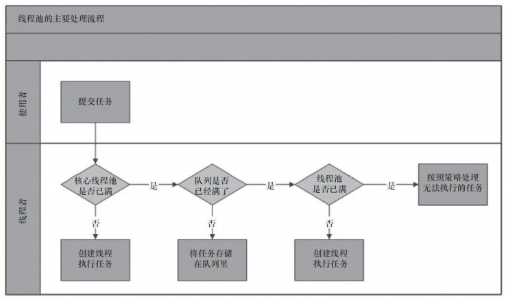
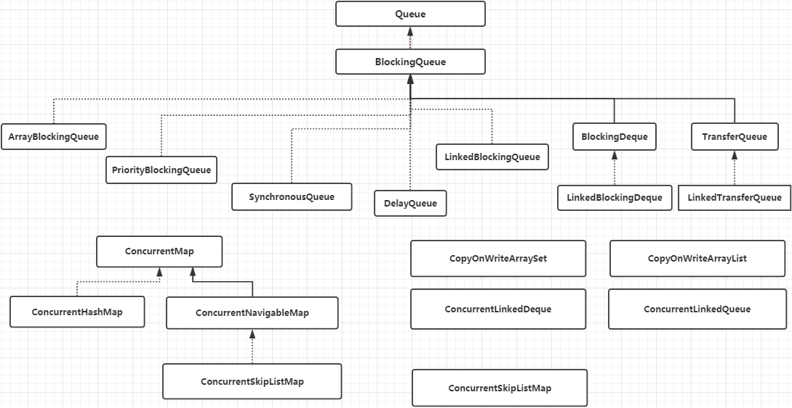
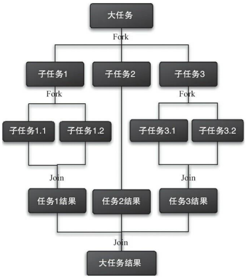
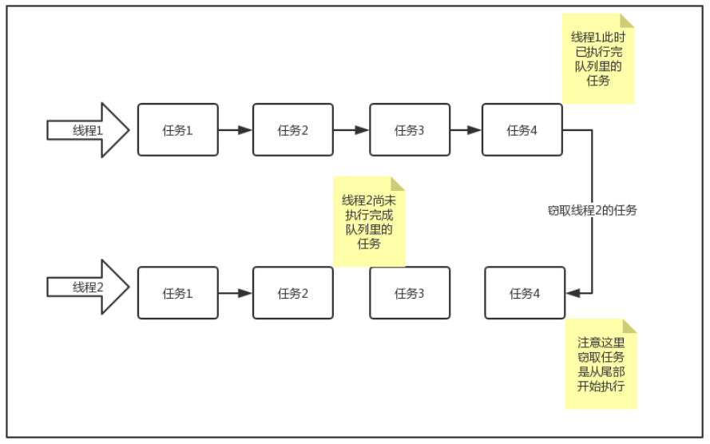

# Java 多线程 : JDK 工具

[toc]


## **一、线程池**

### 1. 为什么要使用线程池

使用线程池主要有以下三个原因：

1. 创建/销毁线程需要消耗系统资源，线程池可以**复用已创建的线程**。
2. **控制并发的数量**。并发数量过多，可能会导致资源消耗过多，从而造成服务器崩溃。（主要原因）
3. **可以对线程做统一管理**。


### 2. 线程池原理

Java 中的线程池顶层接口是 `Executor` 接口，`ThreadPoolExecutor` 是这个接口的实现类。

我们可以通过 `ThreadPoolExecutor` 类来创建一个线程池。

#### 2.1 ThreadPoolExecutor 构造方法及参数

共有四个构造方法：

```java
// 五个参数的构造函数
public ThreadPoolExecutor(int corePoolSize,
                          int maximumPoolSize,
                          long keepAliveTime,
                          TimeUnit unit,
                          BlockingQueue<Runnable> workQueue)

// 六个参数的构造函数-1
public ThreadPoolExecutor(int corePoolSize,
                          int maximumPoolSize,
                          long keepAliveTime,
                          TimeUnit unit,
                          BlockingQueue<Runnable> workQueue,
                          ThreadFactory threadFactory)

// 六个参数的构造函数-2
public ThreadPoolExecutor(int corePoolSize,
                          int maximumPoolSize,
                          long keepAliveTime,
                          TimeUnit unit,
                          BlockingQueue<Runnable> workQueue,
                          RejectedExecutionHandler handler)

// 七个参数的构造函数
public ThreadPoolExecutor(int corePoolSize,
                          int maximumPoolSize,
                          long keepAliveTime,
                          TimeUnit unit,
                          BlockingQueue<Runnable> workQueue,
                          ThreadFactory threadFactory,
                          RejectedExecutionHandler handler)
```

涉及到 5~7 个参数，先看看必须的 5 个参数是什么意思：

- **int corePoolSize**：该线程池中**核心线程数最大值**。

  > 核心线程：线程池中有两类线程，核心线程和非核心线程。核心线程默认情况下会一直存在于线程池中，即使这个核心线程什么都不干（铁饭碗），而非核心线程如果长时间的闲置，就会被销毁（临时工）。

- **int maximumPoolSize**：该线程池中**线程总数最大值** 。

  > 该值等于「核心线程数量 + 非核心线程数量」。

- **long keepAliveTime**：**非核心线程闲置超时时长**。

  > 非核心线程如果处于闲置状态超过该值，就会被销毁。如果设置 `allowCoreThreadTimeOut(true)`，则会也作用于核心线程。

- **TimeUnit unit**：keepAliveTime 的单位。

   ```
  TimeUnit 是一个枚举类型，包括以下属性:
   1.NANOSECONDS: 1微毫秒 = 1微秒 / 1000 
  2.MICROSECONDS: 1微秒 = 1毫秒 / 1000 
   3.MILLISECONDS: 1毫秒 = 1秒 /1000 
  4.SECONDS: 秒 
   5.MINUTES: 分 
  6.HOURS: 小时 
   7.DAYS: 天
  ```
  
- **BlockingQueue workQueue**：阻塞队列，维护着**等待执行的 Runnable 任务对象**。

  常用的几个[阻塞队列](##二、阻塞队列)：

  1. **LinkedBlockingQueue**

     链式阻塞队列，底层数据结构是链表，默认大小是 `Integer.MAX_VALUE`，也可以指定大小。

  2. **ArrayBlockingQueue**

     数组阻塞队列，底层数据结构是数组，需要指定队列的大小。

  3. **SynchronousQueue**

     一个**不存储元素**的同步队列，内部容量为 0，每个插入操作必须等到另一个线程调用移除操作，否则插入操作一直处于阻塞状态，反之亦然。

  4. **DelayQueue**

     延迟队列，该队列中的元素只有当其指定的延迟时间到了，才能够从队列中获取到该元素 。

除了 5 个必须的参数之外，还有两个非必须的参数：

- **ThreadFactory threadFactory**：线程工厂。

  > 创建线程的工厂 ，用于**批量创建线程，统一在创建线程时设置一些参数**，如是否守护线程、线程的优先级等。如果不指定，会新建一个默认的线程工厂。

```java
static class DefaultThreadFactory implements ThreadFactory {
    // 省略属性
    // 构造函数
    DefaultThreadFactory() {
        SecurityManager s = System.getSecurityManager();
        group = (s != null) ? s.getThreadGroup() :
        Thread.currentThread().getThreadGroup();
        namePrefix = "pool-" +
            poolNumber.getAndIncrement() +
            "-thread-";
    }
    // 省略
}
```

- **RejectedExecutionHandler handler**：**拒绝处理策略（饱和策略）**。

  线程数量大于最大线程数就会采用拒绝处理策略，四种拒绝处理的策略为 ：

  1. **ThreadPoolExecutor.AbortPolicy**：**默认拒绝处理策略**，丢弃任务并抛出 `RejectedExecutionException` 异常。
  2. **ThreadPoolExecutor.DiscardPolicy**：丢弃新来的任务，但是不抛出异常。
  3. **ThreadPoolExecutor.DiscardOldestPolicy**：丢弃队列头部（最旧的）的任务，然后重新尝试执行程序（如果再次失败，重复此过程）。
  4. **ThreadPoolExecutor.CallerRunsPolicy**：由调用者所在线程处理该任务。


#### 2.2 ThreadPoolExecutor 的策略

线程池本身有一个**调度线程**，这个线程就是**用于管理布控整个线程池里的各种任务和事务**，例如创建线程、销毁线程、任务队列管理、线程队列管理等等。

故线程池也有自己的状态。`ThreadPoolExecutor` 类中使用了一些 `final int` 常量变量来表示线程池的状态 ，分别为 RUNNING、SHUTDOWN、STOP、TIDYING 、TERMINATED。

```java
// runState is stored in the high-order bits
private static final int RUNNING    = -1 << COUNT_BITS;
private static final int SHUTDOWN   =  0 << COUNT_BITS;
private static final int STOP       =  1 << COUNT_BITS;
private static final int TIDYING    =  2 << COUNT_BITS;
private static final int TERMINATED =  3 << COUNT_BITS;
```

- 线程池创建后处于 **RUNNING** 状态。

- 调用 `shutdown()` 方法后处于 **SHUTDOWN** 状态，线程池不能接受新的任务，清除一些空闲 worker，不会等待阻塞队列的任务完成。

- 调用 `shutdownNow()` 方法后处于 **STOP** 状态，线程池不能接受新的任务，中断所有线程，阻塞队列中没有被执行的任务全部丢弃。此时，`poolsize = 0`，阻塞队列的 size 也为0。

- 当所有的任务已终止，`ctl` 记录的”任务数量”为 0，线程池会变为 **TIDYING** 状态。接着会执行 `terminated()` 函数。

  > ThreadPoolExecutor 中有一个控制状态的属性叫 `ctl`，它是一个 AtomicInteger 类型的变量。线程池状态就是通过 AtomicInteger 类型的成员变量 `ctl` 来获取的。
  >
  > 获取的 `ctl` 值传入 `runStateOf` 方法，与 `~CAPACITY` 位与运算（`CAPACITY` 是低 29 位全 1 的 int 变量）。
  >
  > `~CAPACITY` 在这里相当于掩码，用来获取 `ctl` 的高 3 位，表示线程池状态；而另外的低 29 位用于表示工作线程数。

- 线程池处在 TIDYING 状态时，**执行完 `terminated()` 方法之后**，就会由 **TIDYING → TERMINATED**， 线程池被设置为 TERMINATED 状态。


#### 2.3 线程池主要的任务处理流程

处理任务的核心方法是 `execute`，看看 JDK 1.8 源码中 `ThreadPoolExecutor` 是如何处理线程任务的：

```java
// JDK 1.8 
public void execute(Runnable command) {
    if (command == null)
        throw new NullPointerException();   
    int c = ctl.get();
    // 1.当前线程数小于corePoolSize,则调用addWorker创建核心线程执行任务
    if (workerCountOf(c) < corePoolSize) {
       if (addWorker(command, true))
           return;
       c = ctl.get();
    }
    // 2.如果不小于corePoolSize，则将任务添加到workQueue队列。
    if (isRunning(c) && workQueue.offer(command)) {
        int recheck = ctl.get();
        // 2.1 如果isRunning返回false(状态检查)，则remove这个任务，然后执行拒绝策略。
        if (! isRunning(recheck) && remove(command))
            reject(command);
            // 2.2 线程池处于running状态，但是没有线程，则创建线程
        else if (workerCountOf(recheck) == 0)
            addWorker(null, false);
    }
    // 3.如果放入workQueue失败，则创建非核心线程执行任务，
    // 如果这时创建非核心线程失败(当前线程总数不小于maximumPoolSize时)，就会执行拒绝策略。
    else if (!addWorker(command, false))
         reject(command);
}
```

`ctl.get()` 是获取线程池状态，用 `int` 类型表示。第二步中，入队前进行了一次 `isRunning` 判断，入队之后，又进行了一次 `isRunning` 判断。

**为什么要二次检查线程池的状态?**

在多线程的环境下，线程池的状态是时刻发生变化的。很有可能刚获取线程池状态后线程池状态就改变了。判断是否将 `command` 加入 `workqueue` 是线程池之前的状态，倘若没有二次检查，万一线程池处于非 **RUNNING** 状态（在多线程环境下很有可能发生），那么 `command` 永远不会执行。

**总结一下处理流程：**

1. 线程总数量 < corePoolSize，无论线程是否空闲，都会新建一个核心线程执行任务（让核心线程数量 < corePoolSize 时快速达到 corePoolSize）。**注意，这一步需要获得全局锁**。
2. 线程总数量 >= corePoolSize 时，新来的线程任务会进入任务队列中等待，然后空闲的核心线程会依次去缓存队列中取任务来执行（体现了**线程复用**）。
3. 当缓存队列满了，说明这个时候任务已经多到爆棚，需要一些“临时工”来执行这些任务了。于是会创建非核心线程去执行这个任务。**注意，这一步需要获得全局锁**。
4. 缓存队列满了，且总线程数达到了 maximumPoolSize，则会采取上面提到的拒绝策略进行处理。

整个过程如图所示：




#### 2.4 ThreadPoolExecutor 如何做到线程复用？

我们知道，一个线程在创建的时候会指定一个线程任务，当执行完这个线程任务之后，线程自动销毁。但是线程池却可以复用线程，即**一个线程执行完线程任务后不销毁，继续执行另外的线程任务**。那么，线程池如何做到线程复用呢？

原来，ThreadPoolExecutor 在创建线程时，会将线程封装成**工作线程 worker**，并放入**工作线程组**中，然后**这个 worker 会反复从阻塞队列中拿任务去执行**。下面继续看看源码（一定要仔细看，前后有联系）

这里的 `addWorker` 方法是在上面提到的 `execute` 方法里面调用的，先看看上半部分：

```java
// ThreadPoolExecutor.addWorker方法源码上半部分
private boolean addWorker(Runnable firstTask, boolean core) {
    retry:
    for (;;) {
        int c = ctl.get();
        int rs = runStateOf(c);

        // Check if queue empty only if necessary.
        if (rs >= SHUTDOWN &&
            ! (rs == SHUTDOWN &&
               firstTask == null &&
               ! workQueue.isEmpty()))
            return false;

        for (;;) {
            int wc = workerCountOf(c);
            if (wc >= CAPACITY ||
                // 1.如果core是ture,证明需要创建的线程为核心线程，则先判断当前线程是否大于核心线程
                // 如果core是false,证明需要创建的是非核心线程，则先判断当前线程数是否大于总线程数
                // 如果不小于，则返回false
                wc >= (core ? corePoolSize : maximumPoolSize))
                return false;
            if (compareAndIncrementWorkerCount(c))
                break retry;
            c = ctl.get();  // Re-read ctl
            if (runStateOf(c) != rs)
                continue retry;
            // else CAS failed due to workerCount change; retry inner loop
        }
    }
```

上半部分主要是判断线程数量是否超出阈值，超过了就返回 false。继续看下半部分:

```java
    // ThreadPoolExecutor.addWorker方法源码下半部分
    boolean workerStarted = false;
    boolean workerAdded = false;
    Worker w = null;
    try {
        // 1.创建一个worker对象
        w = new Worker(firstTask);
        // 2.实例化一个Thread对象
        final Thread t = w.thread;
        if (t != null) {
            // 3.线程池全局锁
            final ReentrantLock mainLock = this.mainLock;
            mainLock.lock();
            try {
                // Recheck while holding lock.
                // Back out on ThreadFactory failure or if
                // shut down before lock acquired.
                int rs = runStateOf(ctl.get());

                if (rs < SHUTDOWN ||
                    (rs == SHUTDOWN && firstTask == null)) {
                    if (t.isAlive()) // precheck that t is startable
                        throw new IllegalThreadStateException();
                    workers.add(w);
                    int s = workers.size();
                    if (s > largestPoolSize)
                        largestPoolSize = s;
                    workerAdded = true;
                }
            } finally {
                mainLock.unlock();
            }
            if (workerAdded) {
                // 4.启动这个线程
                t.start();
                workerStarted = true;
            }
        }
    } finally {
        if (! workerStarted)
            addWorkerFailed(w);
    }
    return workerStarted;
}
```

创建 `worker` 对象，并初始化一个 `Thread` 对象，然后启动这个线程对象。

接着看看`Worker`类（仅展示部分源码）：

```java
// Worker类部分源码
private final class Worker extends AbstractQueuedSynchronizer implements Runnable{
    final Thread thread;
    Runnable firstTask;

    Worker(Runnable firstTask) {
        setState(-1); // inhibit interrupts until runWorker
        this.firstTask = firstTask;
        this.thread = getThreadFactory().newThread(this);
    }

    public void run() {
        runWorker(this);
    }
    //其余代码略...
}
```

`Worker` 类实现了 `Runnable` 接口，所以 `Worker` 也是一个线程任务。在构造方法中，创建了一个线程，线程的任务就是自己。故 `addWorker` 方法调用 `addWorker` 方法源码下半部分中的第4步 `t.start`，会触发 `Worker` 类的 `run` 方法被 JVM 调用。

再看看 `runWorker` 的逻辑：

```java
// Worker.runWorker方法源代码
final void runWorker(Worker w) {
    Thread wt = Thread.currentThread();
    Runnable task = w.firstTask;
    w.firstTask = null;
    // 1.线程启动之后，通过unlock方法释放锁
    w.unlock(); // allow interrupts
    boolean completedAbruptly = true;
    try {
        // 2.Worker执行firstTask或从workQueue中获取任务，如果getTask方法不返回null，循环不退出
        while (task != null || (task = getTask()) != null) {
            // 2.1进行加锁操作，保证thread不被其他线程中断（除非线程池被中断）
            w.lock();
            // If pool is stopping, ensure thread is interrupted;
            // if not, ensure thread is not interrupted.  This
            // requires a recheck in second case to deal with
            // shutdownNow race while clearing interrupt
            // 2.2检查线程池状态，倘若线程池处于中断状态，当前线程将中断。 
            if ((runStateAtLeast(ctl.get(), STOP) ||
                 (Thread.interrupted() &&
                  runStateAtLeast(ctl.get(), STOP))) &&
                !wt.isInterrupted())
                wt.interrupt();
            try {
                // 2.3执行beforeExecute 
                beforeExecute(wt, task);
                Throwable thrown = null;
                try {
                    // 2.4执行任务
                    task.run();
                } catch (RuntimeException x) {
                    thrown = x; throw x;
                } catch (Error x) {
                    thrown = x; throw x;
                } catch (Throwable x) {
                    thrown = x; throw new Error(x);
                } finally {
                    // 2.5执行afterExecute方法 
                    afterExecute(task, thrown);
                }
            } finally {
                task = null;
                w.completedTasks++;
                // 2.6解锁操作
                w.unlock();
            }
        }
        completedAbruptly = false;
    } finally {
        processWorkerExit(w, completedAbruptly);
    }
}
```

首先去执行创建这个 worker 时就有的任务，当执行完这个任务后，worker 的生命周期并没有结束，在 `while` 循环中，worker 会不断地调用 `getTask` 方法从**阻塞队列**中获取任务然后调用 `task.run()` 执行任务，从而达到**复用线程**的目的。只要 `getTask` 方法不返回 `null`，此线程就不会退出。

当然，核心线程池中创建的线程想要拿到阻塞队列中的任务，先要判断线程池的状态，如果 **STOP** 或者 **TERMINATED**，返回 `null`。

最后看看 `getTask()` 方法的实现：

```java
// Worker.getTask方法源码
private Runnable getTask() {
    boolean timedOut = false; // Did the last poll() time out?

    for (;;) {
        int c = ctl.get();
        int rs = runStateOf(c);

        // Check if queue empty only if necessary.
        if (rs >= SHUTDOWN && (rs >= STOP || workQueue.isEmpty())) {
            decrementWorkerCount();
            return null;
        }

        int wc = workerCountOf(c);

        // Are workers subject to culling?
        // 1.allowCoreThreadTimeOut变量默认是false,核心线程即使空闲也不会被销毁
        // 如果为true,核心线程在keepAliveTime内仍空闲则会被销毁。 
        boolean timed = allowCoreThreadTimeOut || wc > corePoolSize;
        // 2.如果运行线程数超过了最大线程数，但是缓存队列已经空了，这时递减worker数量。 
　　　　 // 如果有设置允许线程超时或者线程数量超过了核心线程数量，
        // 并且线程在规定时间内均未poll到任务且队列为空则递减worker数量
        if ((wc > maximumPoolSize || (timed && timedOut))
            && (wc > 1 || workQueue.isEmpty())) {
            if (compareAndDecrementWorkerCount(c))
                return null;
            continue;
        }

        try {
            // 3.如果timed为true(想想哪些情况下timed为true),则会调用workQueue的poll方法获取任务.
            // 超时时间是keepAliveTime。如果超过keepAliveTime时长，
            // poll返回了null，上边提到的while循序就会退出，线程也就执行完了。
            // 如果timed为false（allowCoreThreadTimeOut为falsefalse
            // 且wc > corePoolSize为false），则会调用workQueue的take方法阻塞在当前。
            // 队列中有任务加入时，线程被唤醒，take方法返回任务，并执行。
            Runnable r = timed ?
                workQueue.poll(keepAliveTime, TimeUnit.NANOSECONDS) :
                workQueue.take();
            if (r != null)
                return r;
            timedOut = true;
        } catch (InterruptedException retry) {
            timedOut = false;
        }
    }
}
```

核心线程的会一直卡在 `workQueue.take` 方法，被阻塞并挂起，不会占用 CPU 资源，直到拿到 `Runnable` 然后返回（当然如果 **allowCoreThreadTimeOut** 设置为 `true`，那么核心线程就会去调用 `poll` 方法，因为 `poll` 可能会返回 `null`，所以这时候核心线程满足超时条件也会被销毁）。

非核心线程会 `workQueue.poll(keepAliveTime, TimeUnit.NANOSECONDS) `，如果超时还没有拿到，下一次循环判断 **compareAndDecrementWorkerCount** 就会返回 `null`，Worker 对象的 `run()` 方法循环体的判断为 `null`，任务结束，然后线程被系统回收 。


### 3. 四种常见的线程池

`Executors` 类中提供的几个静态方法来创建线程池。

#### 3.1 newCachedThreadPool

```java
public static ExecutorService newCachedThreadPool() {
    return new ThreadPoolExecutor(0, Integer.MAX_VALUE,
                                  60L, TimeUnit.SECONDS,
                                  new SynchronousQueue<Runnable>());
}
```

`CacheThreadPool` 的**运行流程**如下：

1. 提交任务进线程池。
2. 因为 **corePoolSize** 为 0 的关系，不创建核心线程，线程池最大为 Integer.MAX_VALUE。
3. 尝试将任务添加到 **SynchronousQueue** 队列。
4. 如果 SynchronousQueue 入列成功，等待被当前运行的线程空闲后拉取执行。如果当前没有空闲线程，那么就创建一个非核心线程，然后从 SynchronousQueue 拉取任务并在当前线程执行。
5. 如果 SynchronousQueue 已有任务在等待，入列操作将会阻塞。

当需要执行很多**短时间**的任务时，CacheThreadPool 的线程复用率比较高， 会显著的**提高性能**。而且线程 60s 后会回收，意味着即使没有任务进来，CacheThreadPool 并不会占用很多资源。


#### 3.2 newFixedThreadPool

```java
public static ExecutorService newFixedThreadPool(int nThreads) {
        return new ThreadPoolExecutor(nThreads, nThreads,
                                      0L, TimeUnit.MILLISECONDS,
                                      new LinkedBlockingQueue<Runnable>());
}
```

核心线程数量和总线程数量相等，都是传入的参数 nThreads，所以只能创建核心线程，不能创建非核心线程。因为 LinkedBlockingQueue 的默认大小是 Integer.MAX_VALUE，故如果核心线程空闲，则交给核心线程处理；如果核心线程不空闲，则入列等待，直到核心线程空闲。

**与 CachedThreadPool 的区别**：

- 因为 `corePoolSize == maximumPoolSize`，所以 FixedThreadPool 只会创建核心线程。 而 CachedThreadPool 因为 `corePoolSize=0`，所以只会创建非核心线程。
- 在 `getTask()` 方法，如果队列里没有任务可取，线程会一直阻塞在 `LinkedBlockingQueue.take()`，线程不会被回收。 CachedThreadPool 会在 60s 后收回。
- 由于线程不会被回收，会一直卡在阻塞，所以**没有任务的情况下， FixedThreadPool 占用资源更多**。
- 都几乎不会触发拒绝策略，但是原理不同。FixedThreadPool 是因为阻塞队列可以很大（最大为 Integer 最大值），故几乎不会触发拒绝策略；CachedThreadPool 是因为线程池很大（最大为 Integer 最大值），几乎不会导致线程数量大于最大线程数，故几乎不会触发拒绝策略。


#### 3.3 newSingleThreadExecutor

```java
public static ExecutorService newSingleThreadExecutor() {
    return new FinalizableDelegatedExecutorService
        (new ThreadPoolExecutor(1, 1,
                                0L, TimeUnit.MILLISECONDS,
                                new LinkedBlockingQueue<Runnable>()));
}
```

有且仅有一个核心线程（ `corePoolSize == maximumPoolSize = 1`），使用了 LinkedBlockingQueue（容量很大），所以，**不会创建非核心线程**。所有任务按照**先来先执行**的顺序执行。如果这个唯一的线程不空闲，那么新来的任务会存储在任务队列里等待执行。


#### 3.4 newScheduledThreadPool

创建一个定长线程池，支持定时及周期性任务执行。

```java
public static ScheduledExecutorService newScheduledThreadPool(int corePoolSize) {
    return new ScheduledThreadPoolExecutor(corePoolSize);
}

//ScheduledThreadPoolExecutor():
public ScheduledThreadPoolExecutor(int corePoolSize) {
    super(corePoolSize, Integer.MAX_VALUE,
          DEFAULT_KEEPALIVE_MILLIS, MILLISECONDS,
          new DelayedWorkQueue());
}
```

四种常见的线程池基本够我们使用了，但是《阿里巴巴开发手册》不建议我们直接使用 Executors 类中的线程池，而是建议通过 `ThreadPoolExecutor` 的方式，这样的处理方式让写的同学需要更加明确线程池的运行规则，规避资源耗尽的风险。


## **二、阻塞队列**

### 1. 什么是阻塞队列？

阻塞队列（BlockingQueue）是一个**支持两个附加操作的队列**。这两个附加的操作支持**阻塞（线程安全）的**插入和移除方法。 

- 支持阻塞的插入方法：当队列满时，队列会阻塞插入元素的线程，直到队列不满。 

- 支持阻塞的移除方法：在队列为空时，获取元素的线程会等待队列变为非空。

> BlockingQueue 是 `java util.concurrent` 包下重要的数据结构，区别于普通的队列，BlockingQueue 提供了**线程安全的队列访问方式**，并发包下很多高级同步类的实现都是基于 BlockingQueue 实现的。

BlockingQueue 一般用于**生产者-消费者**模式，生产者是往队列里添加元素的线程，消费者是从队列里拿元素的线程；该模式能够简化开发过程，一方面消除了生产者类与消费者类之间的代码依赖性，另一方面将生产数据的过程与使用数据的过程解耦简化负载。。**阻塞队列 BlockingQueue 就是存放元素的容器**。


### 2. BlockingQueue 的基本操作方法

阻塞队列提供了四组不同的方法用于插入、移除、检查元素：

| 方法/处理方式 |  抛出异常  | 返回特殊值 |  一直阻塞   |      超时退出       |
| :-----------: | :--------: | :--------: | :---------: | :-----------------: |
|   插入方法    |  add (e)   | offer (e)  | **put (e)** | offer (e,time,unit) |
|   移除方法    | remove ()  |  poll ()   | **take ()** |  poll (time,unit)   |
|   检查方法    | element () |  peek ()   |      —      |          —          |

- **抛出异常**：如果试图的操作无法立即执行，抛异常。当阻塞队列满时候，再往队列里插入元素，会抛出 `IllegalStateException("Queue full")` 异常。当队列为空时，从队列里获取元素时会抛出 `NoSuchElementException` 异常。
- **返回特殊值**：如果试图的操作无法立即执行，返回一个特殊值，通常是 true / false。
- **一直阻塞**：如果试图的操作无法立即执行，则一直阻塞或者响应中断。
- **超时退出**：如果试图的操作无法立即执行，该方法调用将会发生阻塞，直到能够执行，但等待时间不会超过给定值。返回一个特定值以告知该操作是否成功，通常是 true / false。

**注意之处：**

- 不能往阻塞队列中插入 null，会抛出空指针异常。
- 可以访问阻塞队列中的任意元素，调用 `remove(o)` 可以将队列之中的特定对象移除，但并不高效，尽量避免使用。
- 如果是无界阻塞队列，队列不可能会出现满的情况，所以使用 `put` 或 `offer` 方法永远不会被阻塞，而且使用 `offer` 方法时，该方法永远返回 true。 


### 3. BlockingQueue 的实现类

#### 3.1 ArrayBlockingQueue

由**数组**结构组成的**有界**阻塞队列。内部结构是数组，故具有数组的特性。

```java
public ArrayBlockingQueue(int capacity, boolean fair) {
    if (capacity <= 0) throw new IllegalArgumentException();
    this.items = new Object[capacity];
    lock = new ReentrantLock(fair);
    notEmpty = lock.newCondition();
    notFull = lock.newCondition();
}
```

可以初始化队列大小， 且一旦初始化不能改变。构造方法中的 `fair` 表示控制对象的内部锁是否采用公平锁，默认是**非公平锁**。

> 所谓公平访问队列是**对阻塞的线程而言的**，可以按照阻塞的先后顺序访问队列，即先阻塞线程先访问队列。非公平性是对先等待的线程是非公平的，当队列可用时，阻塞的线程都可以争夺访问队列的资格，有可能先阻塞的线程最后才访问队列。为了保证公平性，通常会降低吞吐量。


#### 3.2 LinkedBlockingQueue

由**链表**结构组成的**有界**阻塞队列。内部结构是链表，具有链表的特性。默认队列的大小是 `Integer.MAX_VALUE`，也可以指定大小。此队列按照**先进先出**的原则对元素进行排序。


#### 3.3 DelayQueue

DelayQueue 是一个**支持延时获取元素**的**无界（不限制大小，故插入不会被阻塞）阻塞队列**。队列使用 PriorityQueue 来实现。队列中的元素必须实现 `java.util.concurrent.Delayed` 接口，在创建元素时可以指定多久才能从队列中获取当前元素。**该队列中的元素只有当其指定的延迟时间到了，才能够从队列中获取到该元素**。 

DelayQueue 非常有用，可以将 DelayQueue 运用在以下应用场景：

- **缓存系统的设计**：可以用 DelayQueue 保存缓存元素的有效期，使用一个线程循环查询 DelayQueue，一旦能从 DelayQueue 中获取元素时，表示缓存有效期到了。 

- **定时任务调度**：使用 DelayQueue 保存当天将会执行的任务和执行时间，一旦从 DelayQueue 中获取到任务就开始执行，比如 TimerQueue 就是使用 DelayQueue 实现的。


#### 3.4 PriorityBlockingQueue

基于**优先级**的**无界阻塞队列**（优先级的判断通过构造函数传入的 Compator 对象来决定，**默认升序自然排序**），内部控制线程同步的锁采用的是**非公平锁**。

```java
public PriorityBlockingQueue(int initialCapacity,
                                  Comparator<? super E> comparator) {
         this.lock = new ReentrantLock(); //默认构造方法-非公平锁
         ...//其余代码略
}
```

**注意：**

**PriorityBlockingQueue** 不会阻塞数据生产者（因为队列是无界的），而只会在没有可消费的数据时，阻塞数据的消费者。因此使用的时候要特别注意，**生产者生产数据的速度绝对不能快于消费者消费数据的速度，否则时间一长，会最终耗尽所有的可用堆内存空间**。对于使用默认大小的 **LinkedBlockingQueue** 也是一样的。


#### 3.5 SynchronousQueue

SynchronousQueue 是一个**不存储元素（无任何内部容量）**的**阻塞队列**。**每一个 put 操作必须等待一个 take 操作，否则不能继续添加元素，反之亦然**。 

它支持公平访问队列。**默认情况下线程采用非公平性策略访问队列**。使用以下构造方法可以创建公平性访问的 SynchronousQueue，如果设置为 true，则等待的线程会采用先进先出的顺序访问队列。

```java
public SynchronousQueue(boolean fair) {
	transferer = fair ? new TransferQueue() :new TransferStack();
}
```

SynchronousQueue 可以看成是一个传球手，负责把生产者线程处理的数据**直接传递**给消费者线程。队列本身并不存储任何元素，非常**适合传递性场景**。SynchronousQueue 的吞吐量高于 LinkedBlockingQueue 和 ArrayBlockingQueue。 

> 需要区别容量为 1 的 ArrayBlockingQueue、LinkedBlockingQueue。

以下方法的返回值，可以帮助理解这个队列：

- `iterator()`：永远返回空，因为里面没有东西。
- `peek()`：永远返回 null。
- `put()`：往 queue 放进去一个 element 以后就一直 wait，直到有其他 thread 进来把这个 element 取走。
- `offer()`：往 queue 里放一个 element 后立即返回，如果碰巧这个 element 被另一个 thread 取走了，offer 方法返回 true，认为 offer 成功；否则返回 false。
- `take()`：取出并且 remove 掉 queue 里的 element，取不到东西他会一直等。
- `poll()`：取出并且 remove 掉 queue 里的 element，只有到碰巧另外一个线程正在往 queue 里 offer 数据或者 put 数据的时候，该方法才会取到东西。否则立即返回 null。
- `isEmpty()`：永远返回 true。
- `remove() & removeAll()`：永远返回 false。


### 4. 阻塞队列的原理

> 如果队列是空的，消费者会一直等待，当生产者添加元素时，消费者是如何知道当前队列有元素的呢？JDK 是如何设计阻塞队列的，如何让生产者和消费者进行高效率的通信呢？

阻塞队列的原理很简单，利用了 Lock 锁的多条件（**Condition**）阻塞控制。接下来以 ArrayBlockingQueue JDK 1.8 的源码来分析。

首先是构造器，除了初始化队列的大小和是否是公平锁之外，还对同一个锁（lock）初始化了**两个监视器**，分别是 `notEmpty` 和 `notFull`。这两个监视器的作用目前可以简单理解为标记分组，当该线程是 `put` 操作时，给他加上监视器 `notFull`，标记这个线程是一个生产者；当线程是 `take` 操作时，给他加上监视器 `notEmpty`，标记这个线程是消费者。

```java
//数据元素数组
final Object[] items;
//下一个待取出元素索引
int takeIndex;
//下一个待添加元素索引
int putIndex;
//元素个数
int count;
//内部锁
final ReentrantLock lock;
//消费者监视器
private final Condition notEmpty;
//生产者监视器
private final Condition notFull;  

public ArrayBlockingQueue(int capacity, boolean fair) {
    //..省略其他代码
    lock = new ReentrantLock(fair);
    notEmpty = lock.newCondition();
    notFull =  lock.newCondition();
}
```

**put 操作的源码：**

```java
public void put(E e) throws InterruptedException {
    checkNotNull(e);
    final ReentrantLock lock = this.lock;
    // 1.自旋拿锁
    lock.lockInterruptibly();
    try {
        // 2.判断队列是否满了
        while (count == items.length)
            // 2.1如果满了，阻塞该线程，并标记为notFull线程，
            // 等待notFull的唤醒，唤醒之后继续执行while循环。
            notFull.await();
        // 3.如果没有满，则进入队列
        enqueue(e);
    } finally {
        lock.unlock();
    }
}
private void enqueue(E x) {
    // assert lock.getHoldCount() == 1;
    // assert items[putIndex] == null;
    final Object[] items = this.items;
    items[putIndex] = x;
    if (++putIndex == items.length)
        putIndex = 0;
    count++;
    // 4 唤醒一个等待的线程
    notEmpty.signal();
}
```

总结 put 的流程：

1. 所有执行 put 操作的线程竞争 lock 锁，拿到了 lock 锁的线程进入下一步，没有拿到 lock 锁的线程自旋竞争锁。
2. 判断阻塞队列是否满了，如果满了，则调用 `await()` 方法阻塞这个线程，并标记为 `notFull`（生产者）线程，同时释放 lock 锁，等待被消费者线程唤醒。
3. 如果没有满，则调用 `enqueue(e)` 方法将元素 put 进阻塞队列。注意这一步的线程还有一种情况是第二步中阻塞的线程被唤醒且又拿到了 lock 锁的线程。
4. 唤醒一个标记为 `notEmpty`（消费者）的线程。

**take 操作的源码：**

```java
public E take() throws InterruptedException {
    final ReentrantLock lock = this.lock;
    lock.lockInterruptibly();
    try {
        while (count == 0)
            notEmpty.await();
        return dequeue();
    } finally {
        lock.unlock();
    }
}
private E dequeue() {
    // assert lock.getHoldCount() == 1;
    // assert items[takeIndex] != null;
    final Object[] items = this.items;
    @SuppressWarnings("unchecked")
    E x = (E) items[takeIndex];
    items[takeIndex] = null;
    if (++takeIndex == items.length)
        takeIndex = 0;
    count--;
    if (itrs != null)
        itrs.elementDequeued();
    notFull.signal();
    return x;
}
```

take 操作和 put 操作的流程是类似的，总结一下 take 操作的流程：

1. 所有执行 take 操作的线程竞争 lock 锁，拿到了 lock 锁的线程进入下一步，没有拿到 lock 锁的线程自旋竞争锁。
2. 判断阻塞队列是否为空，如果是空，则调用 `await()` 方法阻塞这个线程，并标记为 `notEmpty`（消费者）线程，同时释放 lock 锁，等待被生产者线程唤醒。
3. 如果没有空，则调用 `dequeue()` 方法。注意这一步的线程还有一种情况是第二步中阻塞的线程被唤醒且又拿到了 lock 锁的线程。
4. 唤醒一个标记为 `notFull`（生产者）的线程。

**注意**

1. put 和 take 操作都需要**先获取锁**，没有获取到锁的线程会被挡在第一道大门之外自旋拿锁，直到获取到锁。
2. 就算拿到锁了之后，也**不一定**会顺利进行 put/take 操作，需要判断**队列是否可用**（是否满/空），**如果不可用，则会被阻塞，并释放锁**。
3. 在第 2 点被阻塞的线程会被唤醒，但是在唤醒之后，**依然需要拿到锁**才能继续往下执行，否则，自旋拿锁，拿到锁了再 while 判断队列是否可用。


### 5. 示例和使用场景

#### 5.1 生产者-消费者模型

```java
public class Test {
    private int queueSize = 10;
    private ArrayBlockingQueue<Integer> queue = new ArrayBlockingQueue<Integer>(queueSize);

    public static void main(String[] args) {
        Test test = new Test();
        Producer producer = test.new Producer();
        Consumer consumer = test.new Consumer();

        producer.start();
        consumer.start();
    }

    class Consumer extends Thread {
        @Override
        public void run() {
            consume();
        }

        private void consume() {
            while(true){
                try {
                    queue.take();
                    System.out.println("从队列取走一个元素，队列剩余"+queue.size()+"个元素");
                } catch (InterruptedException e) {
                    e.printStackTrace();
                }
            }
        }
    }

    class Producer extends Thread {
        @Override
        public void run() {
            produce();
        }

        private void produce() {
            while(true){
                try {
                    queue.put(1);
                    System.out.println("向队列取中插入一个元素，队列剩余空间："+(queueSize-queue.size()));
                } catch (InterruptedException e) {
                    e.printStackTrace();
                }
            }
        }
    }
}
```

下面是这个例子的输出片段：

```
从队列取走一个元素，队列剩余0个元素
从队列取走一个元素，队列剩余0个元素
向队列取中插入一个元素，队列剩余空间：9
向队列取中插入一个元素，队列剩余空间：9
向队列取中插入一个元素，队列剩余空间：9
向队列取中插入一个元素，队列剩余空间：8
向队列取中插入一个元素，队列剩余空间：7
向队列取中插入一个元素，队列剩余空间：6
向队列取中插入一个元素，队列剩余空间：5
向队列取中插入一个元素，队列剩余空间：4
向队列取中插入一个元素，队列剩余空间：3
向队列取中插入一个元素，队列剩余空间：2
向队列取中插入一个元素，队列剩余空间：1
向队列取中插入一个元素，队列剩余空间：0
从队列取走一个元素，队列剩余1个元素
从队列取走一个元素，队列剩余9个元素
```

注意，这个例子中的输出结果看起来可能有问题，比如有几行在插入一个元素之后，队列的剩余空间不变。这是由于 **`System.out.println` 语句没有锁**。考虑到这样的情况：线程 1 在执行完 put/take 操作后立即失去 CPU 时间片，然后切换到线程 2 执行 put/take 操作，执行完毕后回到线程 1 的 `System.out.println` 语句并输出，发现这个时候阻塞队列的 size 已经被线程 2 改变了，所以这个时候输出的 size 并不是当时线程 1 执行完 put/take 操作之后阻塞队列的 size，但可以确保的是 size 不会超过10个。实际上使用阻塞队列是没有问题的。


#### 5.2 线程池中使用阻塞队列

```java
 public ThreadPoolExecutor(int corePoolSize,
                           int maximumPoolSize,
                           long keepAliveTime,
                           TimeUnit unit,
                           BlockingQueue<Runnable> workQueue) {
        this(corePoolSize, maximumPoolSize, keepAliveTime, unit, workQueue,
             Executors.defaultThreadFactory(), defaultHandler);
}
```

Java 中的线程池就是使用阻塞队列实现的，在了解阻塞队列之后，无论是使用 Executors 类中已经提供的线程池，还是自己通过 ThreadPoolExecutor 实现线程池，都会更加得心应手。


## **三、Lock 锁接口和类**

前面[原理篇](./Java多线程原理.md)讲解过 Java 原生的锁——基于对象的锁，它一般是配合 `synchronized` 关键字来使用的。实际上，Java在 `java.util.concurrent.locks` 包下，还提供了几个关于锁的类和接口。它们有更强大的功能或更高的性能。

### 1. synchronized 的不足之处

先来看看 `synchronized` 有什么不足之处：

- 如果临界区是只读操作，其实可以多线程一起执行，但使用 synchronized 的话，**同一时间只能有一个线程执行**。
- synchronized 无法知道线程有没有成功获取到锁
- 使用 synchronized，如果临界区因为 IO 或者` sleep()` 方法等原因阻塞了，而当前线程又没有释放锁，就会导致**所有线程等待**。

而这些都是 locks 包下的锁可以解决的。


### 2. 锁的几种分类

锁可以根据以下几种方式来进行分类，下面逐一介绍。

#### 2.1 可重入锁和非可重入锁

所谓重入锁，顾名思义。就是支持重新进入的锁，也就是说这个锁**支持一个线程对资源重复加锁**。

synchronized 关键字就是使用的重入锁。比如说，在一个 synchronized 实例方法里面调用另一个本实例的 synchronized 实例方法，它可以重新进入这个锁，不会出现任何异常。

如果我们自己在继承 AQS 实现同步器的时候，没有考虑到占有锁的线程再次获取锁的场景，可能就会导致线程阻塞，那这个就是一个“非可重入锁”。

`ReentrantLock` 的中文意思就是可重入锁。


#### 2.2 公平锁与非公平锁

这里的“公平”，其实通俗意义来说就是“先来后到”，也就是 FIFO。**如果对一个锁来说，先请求获取锁的线程一定会先被满足，后请求获取锁的线程后被满足，那这个锁就是公平的**。反之，那就是不公平的。

一般情况下，**非公平锁能提升一定的效率。但是非公平锁可能会发生线程饥饿（有一些线程长时间得不到锁）的情况**。所以要根据实际的需求来选择非公平锁和公平锁。

`ReentrantLock` 支持非公平锁和公平锁两种。


#### 2.3 读写锁和排它锁

前面讲到的 synchronized 用的锁和 ReentrantLock，其实都是“排它锁”。也就是说，这些锁在同一时刻只允许一个线程进行访问。

而**读写锁可以在同一时刻允许多个读线程访问**。Java 提供了 ReentrantReadWriteLock 类作为读写锁的默认实现，内部维护了两个锁：一个读锁，一个写锁。通过分离读锁和写锁，使得在“读多写少”的环境下，大大地提高了性能。

> 注意：使用读写锁，在写线程访问时，所有的读线程和其它写线程均被阻塞。

**可见，只是 synchronized 是远远不能满足多样化的业务对锁的要求的**。接下来就介绍一下 JDK 中有关锁的一些接口和类。


### 3. JDK 中有关锁的一些接口和类

JDK 中关于并发的类大多都在 `java.util.concurrent`（即 juc）包下。而 `juc.locks` 包见名知意，是提供了一些并发锁的工具类的。前面讲过的 AQS（AbstractQueuedSynchronizer）就是在这个包下。下面分别介绍一下这个包下的类和接口以及它们之间的关系。

#### 3.1 抽象类 AQS/AQLS/AOS

这三个抽象类有一定的关系，所以这里放到一起讲。

首先是 **AQS**（AbstractQueuedSynchronizer），它是在 JDK 1.5 发布的，提供了一个“队列同步器”的基本功能实现。而 AQS 里面的“资源”是用一个 `int` 类型的数据来表示的，有时候我们的业务需求资源的数量超出了 `int` 的范围，所以在 JDK 1.6 中，多了一个 **AQLS**（AbstractQueuedLongSynchronizer）。它的代码跟 AQS 几乎一样，只是把资源的类型变成了 `long` 类型。

AQS 和 AQLS 都继承了一个类叫 **AOS**（AbstractOwnableSynchronizer）。这个类也是在 JDK 1.6 中出现的。这个类只有几行简单的代码。从源码类上的注释可以知道，它是**用于表示锁与持有者之间的关系（独占模式）**。可以看一下它的主要方法：

```java
// 独占模式，锁的持有者  
private transient Thread exclusiveOwnerThread;  

// 设置锁持有者  
protected final void setExclusiveOwnerThread(Thread t) {  
    exclusiveOwnerThread = t;  
}  

// 获取锁的持有线程  
protected final Thread getExclusiveOwnerThread() {  
    return exclusiveOwnerThread;  
}
```


#### 3.2 接口 Condition/Lock/ReadWriteLock

`juc.locks` 包下共有三个接口：`Condition`、`Lock`、`ReadWriteLock`。其中，Lock 和 ReadWriteLock 从名字就可以看得出来，分别是锁和读写锁的意思。Lock 接口里面有一些获取锁和释放锁的方法声明，而 ReadWriteLock 里面只有两个方法，分别返回“读锁”和“写锁”：

```java
public interface ReadWriteLock {
    Lock readLock();
    Lock writeLock();
}
```

Lock接口中有一个方法是可以获得一个 `Condition`：

```java
Condition newCondition();
```

之前提到了每个对象都可以用继承自 `Object` 的 **wait/notify** 方法来实现**等待/通知机制**。而 Condition 接口也提供了类似 Object 监视器的方法，通过与 **Lock** 配合来实现等待/通知模式。

那为什么既然有 Object 的监视器方法了，还要用 Condition 呢？这里有一个二者简单的对比：

| 对比项                                         | Object监视器                     | Condition                                                    |
| ---------------------------------------------- | -------------------------------- | ------------------------------------------------------------ |
| 前置条件                                       | 获取对象的锁                     | 调用 `Lock.lock` 获取锁，调用 `Lock.newCondition` 获取Condition对象 |
| 调用方式                                       | 直接调用，比如 `object.notify()` | 直接调用，比如 `condition.await()`                           |
| 等待队列的个数                                 | 一个                             | 多个                                                         |
| 当前线程释放锁进入等待状态                     | 支持                             | 支持                                                         |
| 当前线程释放锁进入等待状态，在等待状态中不中断 | 不支持                           | 支持                                                         |
| 当前线程释放锁并进入超时等待状态               | 支持                             | 支持                                                         |
| 当前线程释放锁并进入等待状态直到将来的某个时间 | 不支持                           | 支持                                                         |
| 唤醒等待队列中的一个线程                       | 支持                             | 支持                                                         |
| 唤醒等待队列中的全部线程                       | 支持                             | 支持                                                         |

Condition 和 Object 的 wait/notify 基本相似。其中，Condition 的 `await` 方法对应的是 Object 的 `wait` 方法，而 Condition 的 **signal/signalAll** 方法则对应 Object 的 `notify/notifyAll()`。但 Condition 类似于 Object 的等待/通知机制的加强版。看看主要的方法：

| 方法名称               | 描述                                                         |
| ---------------------- | ------------------------------------------------------------ |
| await()                | 当前线程进入等待状态直到被通知（signal）或者中断；当前线程进入运行状态并从 `await()` 方法返回的场景包括：（1）其他线程调用相同 Condition 对象的 `signal/signalAll` 方法，并且当前线程被唤醒；（2）其他线程调用 `interrupt` 方法中断当前线程； |
| awaitUninterruptibly() | 当前线程进入等待状态直到被通知，在此过程中对中断信号不敏感，不支持中断当前线程 |
| awaitNanos(long)       | 当前线程进入等待状态，直到被通知、中断或者超时。如果返回值小于等于 0，可以认定就是超时了 |
| awaitUntil(Date)       | 当前线程进入等待状态，直到被通知、中断或者超时。如果没到指定时间被通知，则返回 true，否则返回 false |
| signal()               | 唤醒一个等待在 Condition 上的线程，被唤醒的线程在方法返回前必须获得与 Condition 对象关联的锁 |
| signalAll()            | 唤醒所有等待在 Condition 上的线程，能够从 `await()` 等方法返回的线程必须先获得与 Condition 对象关联的锁 |


#### 3.3 ReentrantLock

ReentrantLock 是一个非抽象类，它是 Lock 接口的 JDK 默认实现，实现了锁的基本功能。从名字上看，它是一个”可重入“锁，从源码上看，它内部有一个抽象类 `Sync`，是继承了 AQS，自己实现的一个同步器。同时，ReentrantLock 内部有两个非抽象类 `NonfairSync` 和 `FairSync`，它们都继承了 Sync。从名字上看得出，分别是”非公平同步器“和”公平同步器“的意思。这意味着 ReentrantLock 可以支持”公平锁“和”非公平锁“。

通过看这两个同步器的源码可以发现，它们的实现都是”独占“的。都调用了 AOS 的 `setExclusiveOwnerThread` 方法，所以 ReentrantLock 的锁是”独占“的，也就是说，它的锁都是”排他锁“，不能共享。

在 ReentrantLock 的构造方法里，可以传入一个 `boolean` 类型的参数，来指定它是否是一个公平锁，默认情况下是非公平的。这个参数一旦实例化后就不能修改，只能通过 `isFair()` 方法来查看。


#### 3.4 ReentrantReadWriteLock

这个类也是一个非抽象类，它是 ReadWriteLock 接口的 JDK 默认实现。它与 ReentrantLock 的功能类似，同样是可重入的，支持非公平锁和公平锁。不同的是，它还支持”读写锁“。

ReentrantReadWriteLock 内部的结构大概是这样：

```java
// 内部结构
private final ReentrantReadWriteLock.ReadLock readerLock;
private final ReentrantReadWriteLock.WriteLock writerLock;
final Sync sync;
abstract static class Sync extends AbstractQueuedSynchronizer {
    // 具体实现
}
static final class NonfairSync extends Sync {
    // 具体实现
}
static final class FairSync extends Sync {
    // 具体实现
}
public static class ReadLock implements Lock, java.io.Serializable {
    private final Sync sync;
    protected ReadLock(ReentrantReadWriteLock lock) {
            sync = lock.sync;
    }
    // 具体实现
}
public static class WriteLock implements Lock, java.io.Serializable {
    private final Sync sync;
    protected WriteLock(ReentrantReadWriteLock lock) {
            sync = lock.sync;
    }
    // 具体实现
}

// 构造方法，初始化两个锁
public ReentrantReadWriteLock(boolean fair) {
    sync = fair ? new FairSync() : new NonfairSync();
    readerLock = new ReadLock(this);
    writerLock = new WriteLock(this);
}

// 获取读锁和写锁的方法
public ReentrantReadWriteLock.WriteLock writeLock() { return writerLock; }
public ReentrantReadWriteLock.ReadLock  readLock()  { return readerLock; }
```

可以看到，它同样是内部维护了两个同步器。且维护了两个 Lock 的实现类 ReadLock 和 WriteLock。从源码可以发现，这两个内部类用的是外部类的同步器。

ReentrantReadWriteLock 实现了读写锁，但它有一个小弊端，就是在“写”操作的时候，其它线程不能写也不能读。我们称这种现象为“写饥饿”。


#### 3.5 StampedLock

`StampedLock` 类是在 Java 8 才发布的，它没有实现 Lock 接口和 ReadWriteLock 接口，但它其实是实现了“读写锁”的功能，并且性能比 ReentrantReadWriteLock 更高。StampedLock 还把读锁分为了“乐观读锁”和“悲观读锁”两种。

前面提到了 ReentrantReadWriteLock 会发生“写饥饿”的现象，但 StampedLock 不会。它是怎么做到的呢？它的核心思想在于，**在读的时候如果发生了写，应该通过重试的方式来获取新的值，而不应该阻塞写操作。这种模式也就是典型的无锁编程思想，和 CAS 自旋的思想一样**。这种操作方式决定了 StampedLock 在读线程非常多而写线程非常少的场景下非常适用，同时还避免了写饥饿情况的发生。

篇幅有限，就不介绍 StampedLock 的源码了，只是分析一下官方提供的用法：

```java
class Point {
   private double x, y;
   private final StampedLock sl = new StampedLock();

   // 写锁的使用
   void move(double deltaX, double deltaY) {
     long stamp = sl.writeLock(); // 获取写锁
     try {
       x += deltaX;
       y += deltaY;
     } finally {
       sl.unlockWrite(stamp); // 释放写锁
     }
   }

   // 乐观读锁的使用
   double distanceFromOrigin() {
     long stamp = sl.tryOptimisticRead(); // 获取乐观读锁
     double currentX = x, currentY = y;
     if (!sl.validate(stamp)) { // //检查乐观读锁后是否有其他写锁发生，有则返回false
        stamp = sl.readLock(); // 获取一个悲观读锁
        try {
          currentX = x;
          currentY = y;
        } finally {
           sl.unlockRead(stamp); // 释放悲观读锁
        }
     }
     return Math.sqrt(currentX * currentX + currentY * currentY);
   }

   // 悲观读锁以及读锁升级写锁的使用
   void moveIfAtOrigin(double newX, double newY) {
     long stamp = sl.readLock(); // 悲观读锁
     try {
       while (x == 0.0 && y == 0.0) {
         // 读锁尝试转换为写锁：转换成功后相当于获取了写锁，转换失败相当于有写锁被占用
         long ws = sl.tryConvertToWriteLock(stamp); 

         if (ws != 0L) { // 如果转换成功
           stamp = ws; // 读锁的票据更新为写锁的
           x = newX;
           y = newY;
           break;
         }
         else { // 如果转换失败
           sl.unlockRead(stamp); // 释放读锁
           stamp = sl.writeLock(); // 强制获取写锁
         }
       }
     } finally {
       sl.unlock(stamp); // 释放所有锁
     }
   }
}
```

> 乐观读锁的意思就是先假定在这个锁获取期间，共享变量不会被改变，既然假定不会被改变，那就不需要上锁。在获取乐观读锁之后进行了一些操作，然后又调用了 `validate` 方法，这个方法就是用来验证 `tryOptimisticRead` 之后，是否有写操作执行过，如果有，则获取一个悲观读锁，这里的悲观读锁和 ReentrantReadWriteLock 中的读锁类似，也是个共享锁。

可以看到，StampedLock 获取锁会返回一个 `long` 类型的变量，释放锁的时候再把这个变量传进去。简单看看源码：

```java
// 用于操作state后获取stamp的值
private static final int LG_READERS = 7;
private static final long RUNIT = 1L;               //0000 0000 0001
private static final long WBIT  = 1L << LG_READERS; //0000 1000 0000
private static final long RBITS = WBIT - 1L;        //0000 0111 1111
private static final long RFULL = RBITS - 1L;       //0000 0111 1110
private static final long ABITS = RBITS | WBIT;     //0000 1111 1111
private static final long SBITS = ~RBITS;           //1111 1000 0000

// 初始化时state的值
private static final long ORIGIN = WBIT << 1;       //0001 0000 0000

// 锁共享变量state
private transient volatile long state;
// 读锁溢出时用来存储多出的读锁
private transient int readerOverflow;
```

StampedLock 用这个 long 类型的变量的前 7 位（LG_READERS）来表示读锁，每获取一个悲观读锁，就加1（RUNIT），每释放一个悲观读锁，就减 1。而悲观读锁最多只能装 128 个（7 位限制），很容易溢出，所以用一个 int 类型的变量来存储溢出的悲观读锁。

写锁用 state 变量剩下的位来表示，每次获取一个写锁，就加 0000 1000 0000（WBIT）。需要注意的是，**写锁在释放的时候，并不是减WBIT，而是再加WBIT**。这是为了**让每次写锁都留下痕迹**，解决 CAS 中的 ABA 问题，也为**乐观锁检查变化** `validate` 方法提供基础。

乐观读锁就比较简单了，并没有真正改变 state 的值，而是在获取锁的时候记录 state 的写状态，在操作完成后去检查 state 的写状态部分是否发生变化，上文提到了，每次写锁都会留下痕迹，也是为了这里乐观锁检查变化提供方便。

总的来说，StampedLock 的性能是非常优异的，基本上可以取代 ReentrantReadWriteLock 的作用。


## **四、并发容器**

### 1. 同步容器与并发容器

我们知道在 `java.util` 包下提供了一些容器类，而 Vector 和 Hashtable 是线程安全的容器类，但是这些容器实现同步的方式是通过对方法加锁（sychronized）方式实现的，这样读写均需要锁操作，导致性能低下。

而即使是 Vector 这样线程安全的类，在面对多线程下的复合操作的时候也是需要通过客户端加锁的方式保证原子性。如下面例子说明：

```java
public class TestVector {
    private Vector<String> vector;

    //方法一
    public  Object getLast(Vector vector) {
        int lastIndex = vector.size() - 1;
        return vector.get(lastIndex);
    }

    //方法二
    public  void deleteLast(Vector vector) {
        int lastIndex = vector.size() - 1;
        vector.remove(lastIndex);
    }

    //方法三
    public  Object getLastSysnchronized(Vector vector) {
        synchronized(vector){
            int lastIndex = vector.size() - 1;
            return vector.get(lastIndex);
        }
    }

    //方法四
    public  void deleteLastSysnchronized(Vector vector) {
        synchronized (vector){
            int lastIndex = vector.size() - 1;
            vector.remove(lastIndex);
        }
    }

}
```

如果方法一和方法二为一个组合的话。那么如果当方法一获取到了 `vector` 的 size 之后，方法二已经执行完毕，这样就会导致程序的错误。

如果方法三与方法四组合的话。通过锁机制保证了在 `vector` 上的操作的原子性。

并发容器是 Java 5 提供的在多线程编程下用于代替同步容器，针对不同的应用场景进行设计，提高容器的并发访问性，同时定义了线程安全的复合操作。


### 2. 并发容器类介绍

整体架构（列举常用的容器类）：



其中，[阻塞队列](##二、阻塞队列)（BlockingQueue）在上面已有介绍，[CopyOnWrite 容器](##五、CopyOnWrite)（CopyOnWritexxx）将在下面进行介绍，这里不做过多介绍。

下面分别介绍一些常用的并发容器类和接口，因篇幅原因，这里只介绍这些类的用途和基本的原理，不做过多的源码解析。

#### 2.1 并发 Map

##### 2.1.1 ConcurrentMap 接口

ConcurrentMap 接口继承了 Map 接口，在 Map 接口的基础上又定义了四个方法：

```java
public interface ConcurrentMap<K, V> extends Map<K, V> {

    //插入元素
    V putIfAbsent(K key, V value);

    //移除元素
    boolean remove(Object key, Object value);

    //替换元素
    boolean replace(K key, V oldValue, V newValue);

    //替换元素
    V replace(K key, V value);

}
```

**putIfAbsent：**与原有 put 方法不同的是，putIfAbsent 方法中如果插入的 key 相同，则不替换原有的 value 值；

**remove：**与原有 remove 方法不同的是，新 remove 方法中增加了对 value 的判断，如果要删除的 key-value 不能与 Map 中原有的 key-value 对应上，则不会删除该元素;

**replace(K,V,V)：**增加了对 value 值的判断，如果 key-oldValue 能与 Map 中原有的 key-value 对应上，才进行替换操作；

**replace(K,V)：**与上面的 replace 不同的是，此 replace 不会对 Map 中原有的 key-value 进行比较，如果 key 存在则直接替换；


##### [2.1.2 ConcurrentHashMap 类](../Java_Container/Java集合.md)

ConcurrentHashMap 同 HashMap 一样也是基于散列表的 map，但是它提供了一种与 Hashtable 完全不同的加锁策略，提供更高效的并发性和伸缩性。

ConcurrentHashMap 在 JDK 1.7 和 JDK 1.8 中有一些区别。这里我们分开介绍一下。

**JDK 1.7**

ConcurrentHashMap 在 JDK 1.7 中，提供了一种**粒度更细的加锁机制**来实现在多线程下更高的性能，这种机制叫**分段锁(Lock Striping)**。

提供的优点是：在并发环境下将实现更高的吞吐量，而在单线程环境下只损失非常小的性能。

可以这样理解分段锁，就是**将数据分段，对每一段数据分配一把锁**。当一个线程占用锁访问其中一个段数据的时候，其他段的数据也能被其他线程访问。

有些方法需要跨段，比如 `size()`、`isEmpty()`、`containsValue()`，它们可能需要锁定整个表而不仅仅是某个段，这需要按顺序锁定所有段，操作完毕后，又按顺序释放所有段的锁。如下图：


ConcurrentHashMap 是由 Segment 数组结构和 HashEntry 数组结构组成。Segment 是一种可重入锁 ReentrantLock，HashEntry 则用于存储键值对数据。

一个 ConcurrentHashMap 里包含一个 Segment 数组，Segment 的结构和 HashMap 类似，是一种数组和链表结构， 一个 Segment 里包含一个 HashEntry 数组，每个 HashEntry 是一个链表结构的元素， 每个 Segment 守护着一个 HashEntry 数组里的元素，当对 HashEntry 数组的数据进行修改时，必须首先获得它对应的 Segment 锁。

**JDK 1.8**

而在 JDK 1.8 中，ConcurrentHashMap 主要做了两个优化：

- 同 HashMap 一样，链表也会在长度达到 8 的时候转化为红黑树，这样可以提升大量冲突时候的查询效率；
- 以某个位置的头结点（链表的头结点或红黑树的 root 结点）为锁，配合**自旋 + CAS** 避免不必要的锁开销，进一步提升并发性能。


##### 2.1.3 ConcurrentNavigableMap 接口与 ConcurrentSkipListMap 类

ConcurrentNavigableMap 接口继承了 NavigableMap 接口，这个接口提供了**针对给定搜索目标返回最接近匹配项**的导航方法。

ConcurrentNavigableMap 接口的主要实现类是 ConcurrentSkipListMap 类。从名字上来看，它的底层使用的是[跳表](../Data_Structure/常见数据结构详解.md)（SkipList）的数据结构，它是一种”空间换时间“的数据结构，可以使用 CAS 来保证并发安全性。


#### 2.2 并发 Queue

JDK 并没有提供线程安全的 List 类，因为对 List 来说，**很难去开发一个通用并且没有并发瓶颈的线程安全的 List**。因为即使简单的读操作，拿 `contains()` 这样一个操作来说，很难想到搜索的时候如何避免锁住整个 list。

所以退一步，JDK 提供了对队列和双端队列的线程安全的类：`ConcurrentLinkedQueue` 和`ConcurrentLinkedDeque`。因为队列相对于 List 来说，有更多的限制。这两个类是使用 CAS 来实现线程安全的。


#### 2.3 并发 Set

JDK 提供了 ConcurrentSkipListSet，是线程安全的有序的集合。底层是使用 ConcurrentSkipListMap 实现。


## **五、CopyOnWrite**

### 1. 什么是 CopyOnWrite 容器

在说到 CopyOnWrite 容器之前我们先来谈谈什么是 CopyOnWrite 机制，CopyOnWrite 是计算机设计领域中的一种优化策略，也是一种在并发场景下常用的设计思想——**写入时复制**思想。

那什么是写入时复制思想呢？就是**当有多个调用者同时去请求一个资源数据的时候，有一个调用者出于某些原因需要对当前的数据源进行修改，这个时候系统将会复制一个当前数据源的副本给调用者修改**。

CopyOnWrite 容器即**写时复制的容器**，当我们往一个容器中添加元素的时候，不直接往容器中添加，而是将当前容器进行 copy，复制出来一个新的容器，然后向新容器中添加我们需要的元素，最后将原容器的引用指向新容器。

这样做的好处在于，我们可以在并发的场景下对容器进行"读操作"而不需要"加锁"，从而达到读写分离的目的。从 JDK 1.5 开始 Java 并发包里提供了两个使用 CopyOnWrite 机制实现的并发容器 ，分别是 `CopyOnWriteArrayList` 和 `CopyOnWriteArraySet`。


### 2. CopyOnWriteArrayList

**优点**：CopyOnWriteArrayList 经常被用于“读多写少”的并发场景，是因为 CopyOnWriteArrayList 无需任何同步措施，大大增强了读的性能。在 Java 中遍历线程非安全的 List（如：ArrayList 和 LinkedList）的时候，若中途有别的线程对 List 容器进行修改，那么会抛出 `ConcurrentModificationException` 异常。CopyOnWriteArrayList 由于其"读写分离"，遍历和修改操作分别作用在不同的 List 容器，所以在使用迭代器遍历的时候，则不会抛出异常。

**缺点**：第一个缺点是 CopyOnWriteArrayList 每次执行写操作都会将原容器进行拷贝一份，数据量大的时候，内存会存在较大的压力，可能会引起频繁 Full GC。比如这些对象占用的内存 200M 左右，那么再写入 100M 数据进去，内存就会多占用 300M。第二个缺点是 CopyOnWriteArrayList 由于实现的原因，写和读分别作用在不同新老容器上，在写操作执行过程中，读不会阻塞，但读取到的却是老容器的数据。

现在来看一下 CopyOnWriteArrayList 的 `add` 操作源码，它的逻辑很清晰，就是先把原容器进行 copy，然后在新的副本上进行“写操作”，最后再切换引用，在此过程中是加了锁的。

```java
public boolean add(E e) {
    // ReentrantLock加锁，保证线程安全
    final ReentrantLock lock = this.lock;
    lock.lock();
    try {
        Object[] elements = getArray();
        int len = elements.length;
        // 拷贝原容器，长度为原容器长度加一
        Object[] newElements = Arrays.copyOf(elements, len + 1);
        // 在新副本上执行添加操作
        newElements[len] = e;
        // 将原容器引用指向新副本
        setArray(newElements);
        return true;
    } finally {
        // 解锁
        lock.unlock();
    }
}
```

再来看一下 `remove` 操作的源码，remove 的逻辑是将要 remove 元素之外的其他元素拷贝到新的副本中，然后再将原容器的引用指向新的副本中，因为 remove 操作也是“写操作”所以也是要加锁的。

```java
public E remove(int index) {
        // 加锁
        final ReentrantLock lock = this.lock;
        lock.lock();
        try {
            Object[] elements = getArray();
            int len = elements.length;
            E oldValue = get(elements, index);
            int numMoved = len - index - 1;
            if (numMoved == 0)
                // 如果要删除的是列表末端数据，拷贝前len-1个数据到新副本上，再切换引用
                setArray(Arrays.copyOf(elements, len - 1));
            else {
                // 否则，将要删除元素之外的其他元素拷贝到新副本中，并切换引用
                Object[] newElements = new Object[len - 1];
                System.arraycopy(elements, 0, newElements, 0, index);
                System.arraycopy(elements, index + 1, newElements, index,
                                 numMoved);
                setArray(newElements);
            }
            return oldValue;
        } finally {
            // 解锁
            lock.unlock();
        }
    }
```

再来看看 CopyOnWriteArrayList 效率最高的读操作的源码

```java
public E get(int index) {
    return get(getArray(), index);
}
 private E get(Object[] a, int index) {
     return (E) a[index];
 }
```

由上可见“读操作”是没有加锁，直接读取。


### 3. CopyOnWrite 的业务实现

接下来，结合具体业务场景来实现一个 CopyOnWriteMap 的并发容器并且使用它。

```java
import java.util.Collection;
import java.util.Map;
import java.util.Set;

public class CopyOnWriteMap<K, V> implements Map<K, V>, Cloneable {
    private volatile Map<K, V> internalMap;

    public CopyOnWriteMap() {
        internalMap = new HashMap<K, V>();
    }

    public V put(K key, V value) {
        synchronized (this) {
            Map<K, V> newMap = new HashMap<K, V>(internalMap);
            V val = newMap.put(key, value);
            internalMap = newMap;
            return val;
        }
    }

    public V get(Object key) {
        return internalMap.get(key);
    }

    public void putAll(Map<? extends K, ? extends V> newData) {
        synchronized (this) {
            Map<K, V> newMap = new HashMap<K, V>(internalMap);
            newMap.putAll(newData);
            internalMap = newMap;
        }
    }
}
```

上面就是参考 CopyOnWriteArrayList 实现的 CopyOnWriteMap，我们可以用这个容器来做什么呢？结合之前说的 CopyOnWrite 的复制思想，它最适用于“读多写少”的并发场景。

**场景**：假如我们有一个搜索的网站需要屏蔽一些“关键字”，“黑名单”每晚定时更新，每当用户搜索的时候，“黑名单”中的关键字不会出现在搜索结果当中，并且提示用户敏感字。

```java
// 黑名单服务
public class BlackListServiceImpl {
    //　减少扩容开销。根据实际需要，初始化CopyOnWriteMap的大小，避免写时CopyOnWriteMap扩容的开销。
    private static CopyOnWriteMap<String, Boolean> blackListMap = 
        new CopyOnWriteMap<String, Boolean>(1000);

    public static boolean isBlackList(String id) {
        return blackListMap.get(id) == null ? false : true;
    }

    public static void addBlackList(String id) {
        blackListMap.put(id, Boolean.TRUE);
    }

    /**
     * 批量添加黑名单
     * (使用批量添加。因为每次添加，容器每次都会进行复制，所以减少添加次数，可以减少容器的复制次数。
     * 如使用上面代码里的addBlackList方法)
     * @param ids
     */
    public static void addBlackList(Map<String,Boolean> ids) {
        blackListMap.putAll(ids);
    }

}
```

这里需要特别特别注意一个问题，此处的场景是每晚凌晨“黑名单”定时更新，原因是 CopyOnWrite 容器有**数据一致性**的问题，它只能保证**最终数据一致性**。

所以如果我们希望写入的数据马上能准确地读取，就不要使用 CopyOnWrite 容器。


## **六、Java 并发工具类**

JDK 中提供了一些工具类以供开发者使用。这样在遇到一些常见的应用场景时就可以使用这些工具类，而不用自己再重复造轮子了。

它们都在 java.util.concurrent 包下。先总体概括一下都有哪些工具类，它们有什么作用，然后再分别介绍它们的主要使用方法和原理。

| 类             | 作用                                         |
| -------------- | -------------------------------------------- |
| Semaphore      | 限制并发线程的数量                           |
| Exchanger      | 两个线程交换数据                             |
| CountDownLatch | 线程等待直到计数器减为 0 时开始工作          |
| CyclicBarrier  | 作用跟 CountDownLatch 类似，但是可以重复使用 |

下面分别介绍这几个类。


### 1. Semaphore

#### 1.1 Semaphore介绍

Semaphore 翻译过来是信号的意思。顾名思义，这个工具类提供的功能就是多个线程彼此“打信号”。而这个“信号”是一个 `int` 类型的数据，也可以看成是一种“资源”。**Semaphore（信号量）是用来控制同时访问特定资源的线程数量，它通过协调各个线程，以保证合理的使用公共资源。** 

可以在构造函数中传入初始资源总数，以及是否使用“公平”的同步器。默认情况下，是非公平的。

```java
// 默认情况下使用非公平
public Semaphore(int permits) {
    sync = new NonfairSync(permits);
}

public Semaphore(int permits, boolean fair) {
    sync = fair ? new FairSync(permits) : new NonfairSync(permits);
}
```

最主要的方法是 `acquire` 方法和 `release` 方法。`acquire()` 方法会申请一个 permit，而 `release` 方法会释放一个 permit。当然，也可以申请多个 `acquire(int permits)` 或者释放多个 `release(int permits)`。

每次 acquire，permits 就会减少一个或者多个。如果减少到了 0，再有其他线程来 acquire，那就要阻塞这个线程直到有其它线程 release permit 为止。


#### 1.2 Semaphore 案例

Semaphore 往往用于资源有限的场景中，去限制线程的数量。举个例子，我想限制同时只能有3个线程在工作：

```java
public class SemaphoreDemo {
    static class MyThread implements Runnable {

        private int value;
        private Semaphore semaphore;

        public MyThread(int value, Semaphore semaphore) {
            this.value = value;
            this.semaphore = semaphore;
        }

        @Override
        public void run() {
            try {
                semaphore.acquire(); // 获取permit
                System.out.println(String.format("当前线程是%d, 还剩%d个资源，还有%d个线程在等待",
                        value, semaphore.availablePermits(), semaphore.getQueueLength()));
                // 睡眠随机时间，打乱释放顺序
                Random random =new Random();
                Thread.sleep(random.nextInt(1000));
                System.out.println(String.format("线程%d释放了资源", value));
            } catch (InterruptedException e) {
                e.printStackTrace();
            } finally{
                semaphore.release(); // 释放permit
            }
        }
    }

    public static void main(String[] args) {
        Semaphore semaphore = new Semaphore(3);
        for (int i = 0; i < 10; i++) {
            new Thread(new MyThread(i, semaphore)).start();
        }
    }
}
```

输出：

```
当前线程是1, 还剩2个资源，还有0个线程在等待
当前线程是0, 还剩1个资源，还有0个线程在等待
当前线程是6, 还剩0个资源，还有0个线程在等待
线程6释放了资源
当前线程是2, 还剩0个资源，还有6个线程在等待
线程2释放了资源
当前线程是4, 还剩0个资源，还有5个线程在等待
线程0释放了资源
当前线程是7, 还剩0个资源，还有4个线程在等待
线程1释放了资源
当前线程是8, 还剩0个资源，还有3个线程在等待
线程7释放了资源
当前线程是5, 还剩0个资源，还有2个线程在等待
线程4释放了资源
当前线程是3, 还剩0个资源，还有1个线程在等待
线程8释放了资源
当前线程是9, 还剩0个资源，还有0个线程在等待
线程9释放了资源
线程5释放了资源
线程3释放了资源
```

可以看到，在这次运行中，最开始是 1, 0, 6 这三个线程获得了资源，而其它线程进入了等待队列。然后当某个线程释放资源后，就会有等待队列中的线程获得资源。

当然，Semaphore 默认的 `acquire` 方法是会让线程进入等待队列，且会抛出中断异常。但它还有一些方法可以忽略中断或不进入阻塞队列：

```java
// 忽略中断
public void acquireUninterruptibly()
public void acquireUninterruptibly(int permits)

// 不进入等待队列，底层使用CAS
public boolean tryAcquire
public boolean tryAcquire(int permits)
public boolean tryAcquire(int permits, long timeout, TimeUnit unit)
        throws InterruptedException
public boolean tryAcquire(long timeout, TimeUnit unit)
```


#### 1.3 Semaphore 原理

Semaphore 内部有一个继承了 AQS 的同步器 Sync，重写了 `tryAcquireShared` 方法。在这个方法里，会去尝试获取资源。

如果获取失败（想要的资源数量小于目前已有的资源数量），就会返回一个负数（代表尝试获取资源失败）。然后当前线程就会进入 AQS 的等待队列。


### 2. Exchanger

Exchanger 类用于**两个线程交换数据**。它支持泛型，也就是说可以在两个线程之间传送任何数据。先来一个案例看看如何使用，比如两个线程之间想要传送字符串：

```java
public class ExchangerDemo {
    public static void main(String[] args) throws InterruptedException {
        Exchanger<String> exchanger = new Exchanger<>();

        new Thread(() -> {
            try {
                System.out.println("这是线程A，得到了另一个线程的数据："
                        + exchanger.exchange("这是来自线程A的数据"));
            } catch (InterruptedException e) {
                e.printStackTrace();
            }
        }).start();

        System.out.println("这个时候线程A是阻塞的，在等待线程B的数据");
        Thread.sleep(1000);

        new Thread(() -> {
            try {
                System.out.println("这是线程B，得到了另一个线程的数据："
                        + exchanger.exchange("这是来自线程B的数据"));
            } catch (InterruptedException e) {
                e.printStackTrace();
            }
        }).start();
    }
}
```

输出：

```
这个时候线程A是阻塞的，在等待线程B的数据
这是线程B，得到了另一个线程的数据：这是来自线程A的数据
这是线程A，得到了另一个线程的数据：这是来自线程B的数据
```

可以看到，当一个线程调用 `exchange` 方法后，它是处于阻塞状态的，只有当另一个线程也调用了 `exchange` 方法，它才会继续向下执行。看源码可以发现它是使用 `park/unpark` 来实现等待状态的切换的，但是在使用 `park/unpark` 方法之前，使用了 CAS 检查，估计是为了提高性能。

Exchanger 一般用于两个线程之间更方便地在内存中交换数据，因为其支持泛型，所以可以传输任何的数据，比如 IO 流或者 IO 缓存。根据 JDK 里面的注释的说法，可以总结为一下特性：

- 此类提供对外的操作是同步的；
- 用于成对出现的线程之间交换数据；
- 可以视作双向的同步队列；
- 可应用于基因算法、流水线设计等场景。

Exchanger 类还有一个有超时参数的方法，如果在指定时间内没有另一个线程调用 `exchange`，就会抛出一个超时异常。

```java
public V exchange(V x, long timeout, TimeUnit unit)
```

那么问题来了，Exchanger 只能是两个线程交换数据吗？那三个调用同一个实例的 `exchange` 方法会发生什么呢？答案是只有前两个线程会交换数据，第三个线程会进入阻塞状态。

需要注意的是，`exchange` 是可以重复使用的。也就是说。两个线程可以使用 Exchanger 在内存中不断地再交换数据。


### 3. CountDownLatch

#### 3.1 CountDownLatch 介绍

先来解读一下 CountDownLatch 这个类名字的意义。CountDown 代表计数递减，Latch 是“门闩”的意思，也有人把它称为“屏障”。而 CountDownLatch 这个类的作用也很贴合这个名字的意义，**假设某个线程在执行任务之前，需要等待其它线程完成一些前置任务，必须等所有的前置任务都完成，才能开始执行本线程的任务**。

CountDownLatch 的方法也很简单，如下：

```java
// 构造方法：
public CountDownLatch(int count)

public void await() // 等待
public boolean await(long timeout, TimeUnit unit) // 超时等待
public void countDown() // count - 1
public long getCount() // 获取当前还有多少count
```


#### 3.2 CountDownLatch 案例

我们知道，玩游戏的时候，在游戏真正开始之前，一般会等待一些前置任务完成，比如“加载地图数据”，“加载人物模型”，“加载背景音乐”等等。只有当所有的东西都加载完成后，玩家才能真正进入游戏。下面就来模拟一下这个 demo：

```java
public class CountDownLatchDemo {
    // 定义前置任务线程
    static class PreTaskThread implements Runnable {

        private String task;
        private CountDownLatch countDownLatch;

        public PreTaskThread(String task, CountDownLatch countDownLatch) {
            this.task = task;
            this.countDownLatch = countDownLatch;
        }

        @Override
        public void run() {
            try {
                Random random = new Random();
                Thread.sleep(random.nextInt(1000));
                System.out.println(task + " - 任务完成");
                countDownLatch.countDown();
            } catch (InterruptedException e) {
                e.printStackTrace();
            }
        }
    }

    public static void main(String[] args) {
        // 假设有三个模块需要加载
        CountDownLatch countDownLatch = new CountDownLatch(3);

        // 主任务
        new Thread(() -> {
            try {
                System.out.println("等待数据加载...");
                System.out.println(String.format("还有%d个前置任务", countDownLatch.getCount()));
                countDownLatch.await();
                System.out.println("数据加载完成，正式开始游戏！");
            } catch (InterruptedException e) {
                e.printStackTrace();
            }
        }).start();

        // 前置任务
        new Thread(new PreTaskThread("加载地图数据", countDownLatch)).start();
        new Thread(new PreTaskThread("加载人物模型", countDownLatch)).start();
        new Thread(new PreTaskThread("加载背景音乐", countDownLatch)).start();
    }
}
```

输出：

```
等待数据加载...
还有3个前置任务
加载人物模型 - 任务完成
加载背景音乐 - 任务完成
加载地图数据 - 任务完成
数据加载完成，正式开始游戏！
```


#### 3.3 CountDownLatch 原理

CountDownLatch 类内部同样是一个继承了 AQS 的实现类 Sync，且实现起来还很简单，可能是 JDK 里面 AQS 的子类中最简单的实现了。

需要注意的是构造器中的**计数值（count）实际上就是闭锁需要等待的线程数量**。这个值只能被设置一次，而且 CountDownLatch **没有提供任何机制去重新设置这个计数值**。


### 4. CyclicBarrier

#### 14.1 CyclicBarrier 介绍

CyclicBarrirer 从名字上来理解是“循环的屏障”的意思。前面提到了 CountDownLatch 一旦计数值 `count` 被降为0后，就不能再重新设置了，它只能起一次“屏障”的作用。而 CyclicBarrier 拥有 CountDownLatch 的所有功能，还可以使用 `reset()` 方法重置屏障。


#### 4.2 CyclicBarrier Barrier 被破坏

如果参与者（线程）在等待的过程中，Barrier 被破坏，就会抛出 `BrokenBarrierException`。可以用 `isBroken()` 方法检测 Barrier 是否被破坏。

1. 如果有线程已经处于等待状态，调用 `reset` 方法会导致已经在等待的线程出现 `BrokenBarrierException` 异常。并且由于出现了 `BrokenBarrierException`，将会导致始终无法等待。
2. 如果在等待的过程中，线程被中断，会抛出 `InterruptedException` 异常，并且这个异常会传播到其他所有的线程。
3. 如果在执行屏障操作过程中发生异常，则该异常将传播到当前线程中，其他线程会抛出 `BrokenBarrierException`，屏障被损坏。
4. 如果超出指定的等待时间，当前线程会抛出 `TimeoutException` 异常，其他线程会抛出 `BrokenBarrierException` 异常。


#### 4.3 CyclicBarrier 案例

同样用玩游戏的例子。如果玩一个游戏有多个“关卡”，那使用 CountDownLatch 显然不太合适，那需要为每个关卡都创建一个实例。那可以使用 CyclicBarrier 来实现每个关卡的数据加载等待功能。

```java
public class CyclicBarrierDemo {
    static class PreTaskThread implements Runnable {

        private String task;
        private CyclicBarrier cyclicBarrier;

        public PreTaskThread(String task, CyclicBarrier cyclicBarrier) {
            this.task = task;
            this.cyclicBarrier = cyclicBarrier;
        }

        @Override
        public void run() {
            // 假设总共三个关卡
            for (int i = 1; i < 4; i++) {
                try {
                    Random random = new Random();
                    Thread.sleep(random.nextInt(1000));
                    System.out.println(String.format("关卡%d的任务%s完成", i, task));
                    cyclicBarrier.await();
                } catch (InterruptedException | BrokenBarrierException e) {
                    e.printStackTrace();
                }
            }
        }
    }

    public static void main(String[] args) {
        CyclicBarrier cyclicBarrier = new CyclicBarrier(3, () -> {
            System.out.println("本关卡所有前置任务完成，开始游戏...");
        });

        new Thread(new PreTaskThread("加载地图数据", cyclicBarrier)).start();
        new Thread(new PreTaskThread("加载人物模型", cyclicBarrier)).start();
        new Thread(new PreTaskThread("加载背景音乐", cyclicBarrier)).start();
    }
}
```

输出：

```
关卡1的任务加载地图数据完成
关卡1的任务加载背景音乐完成
关卡1的任务加载人物模型完成
本关卡所有前置任务完成，开始游戏...
关卡2的任务加载地图数据完成
关卡2的任务加载背景音乐完成
关卡2的任务加载人物模型完成
本关卡所有前置任务完成，开始游戏...
关卡3的任务加载人物模型完成
关卡3的任务加载地图数据完成
关卡3的任务加载背景音乐完成
本关卡所有前置任务完成，开始游戏...
```

注意这里跟 CountDownLatch 的代码有一些不同。CyclicBarrier 没有分为 `await()` 和 `countDown()`，而是只有单独的一个 `await()` 方法。

一旦调用 `await()` 方法的线程数量等于构造方法中传入的任务总量（这里是 3），就代表达到屏障了。CyclicBarrier 允许在达到屏障的时候可以执行一个任务，可以在构造方法传入一个 Runnable 类型的对象。上述案例就是在达到屏障时，输出“本关卡所有前置任务完成，开始游戏...”。

```java
// 构造方法
public CyclicBarrier(int parties) {
    this(parties, null);
}
public CyclicBarrier(int parties, Runnable barrierAction) {
    // 具体实现
}
```


#### 4.4 CyclicBarrier 原理

CyclicBarrier 虽说功能与 CountDownLatch 类似，但是实现原理却完全不同，CyclicBarrier 内部使用的是 `Lock + Condition` 实现的等待/通知模式。详情可以查看这个方法的源码：

```java
private int dowait(boolean timed, long nanos)
```


## **七、Fork/Join 框架**

### 1. 什么是 Fork/Join

Fork/Join 框架是一个实现了 ExecutorService 接口的多线程处理器，它专为那些可以通过递归分解成更细小的任务而设计，最大化的利用多核处理器来提高应用程序的性能。

与其他 ExecutorService 相关的实现相同的是，Fork/Join 框架会将任务分配给线程池中的线程。而与之不同的是，Fork/Join 框架在执行任务时使用了**工作窃取算法**。

**fork** 在英文里有分叉的意思，**join** 在英文里连接、结合的意思。顾名思义，fork 就是要使一个大任务分解成若干个小任务，而 join 就是最后将各个小任务的结果结合起来得到大任务的结果。

Fork/Join 的运行流程大致如下所示：



需要注意的是，图里的次级子任务可以一直分下去，一直分到子任务足够小为止。用伪代码来表示如下：

```pseudocode
solve(任务):
    if(任务已经划分到足够小):
        顺序执行任务
    else:
        for(划分任务得到子任务)
            solve(子任务)
        结合所有子任务的结果到上一层循环
        return 最终结合的结果
```

通过上面伪代码可以看出，通过递归嵌套的计算得到最终结果，这里有体现**分而治之(divide and conquer)** 的算法思想。


### 2. 工作窃取算法

工作窃取算法指的是**在多线程执行不同任务队列的过程中，某个线程执行完自己队列的任务后从其他线程的任务队列里窃取任务来执行**。

工作窃取流程如下图所示：



值得注意的是，当一个线程窃取另一个线程的时候，为了减少两个任务线程之间的竞争，通常使用**双端队列**来存储任务。被窃取的任务线程都从双端队列的**头部**拿任务执行，而窃取其他任务的线程从双端队列的**尾部**执行任务。

另外，当一个线程在窃取任务时要是没有其他可用的任务了，这个线程会进入**阻塞状态**以等待再次“工作”。


### 3. Fork/Join 的具体实现

前面我们说 Fork/Join 框架简单来讲就是对任务的分割与子任务的合并，所以要实现这个框架，先得有**任务**。在 Fork/Join 框架里提供了抽象类 `ForkJoinTask` 来实现任务。

#### 3.1 ForkJoinTask

ForkJoinTask 是一个类似普通线程的实体，但是比普通线程轻量得多。

**`fork()` 方法**：使用线程池中的空闲线程异步提交任务。

```java
// 本文所有代码都引自Java 8
public final ForkJoinTask<V> fork() {
    Thread t;
    // ForkJoinWorkerThread是执行ForkJoinTask的专有线程，由ForkJoinPool管理
    // 先判断当前线程是否是ForkJoin专有线程，如果是，则将任务push到当前线程所负责的队列里去
    if ((t = Thread.currentThread()) instanceof ForkJoinWorkerThread)
        ((ForkJoinWorkerThread)t).workQueue.push(this);
    else
         // 如果不是则将线程加入队列
        // 没有显式创建ForkJoinPool的时候走这里，提交任务到默认的common线程池中
        ForkJoinPool.common.externalPush(this);
    return this;
}
```

其实 `fork()` 只做了一件事，那就是**把任务推入当前工作线程的工作队列里**。

**`join()` 方法**：等待处理任务的线程处理完毕，获得返回值。

来看下 `join()` 的源码：

```java
public final V join() {
    int s;
    // doJoin()方法来获取当前任务的执行状态
    if ((s = doJoin() & DONE_MASK) != NORMAL)
        // 任务异常，抛出异常
        reportException(s);
    // 任务正常完成，获取返回值
    return getRawResult();
}

/**
 * doJoin()方法用来返回当前任务的执行状态
 **/
private int doJoin() {
    int s; Thread t; ForkJoinWorkerThread wt; ForkJoinPool.WorkQueue w;
    // 先判断任务是否执行完毕，执行完毕直接返回结果（执行状态）
    return (s = status) < 0 ? s :
    // 如果没有执行完毕，先判断是否是ForkJoinWorkThread线程
    ((t = Thread.currentThread()) instanceof ForkJoinWorkerThread) ?
        // 如果是，先判断任务是否处于工作队列顶端（意味着下一个就执行它）
        // tryUnpush()方法判断任务是否处于当前工作队列顶端，是返回true
        // doExec()方法执行任务
        (w = (wt = (ForkJoinWorkerThread)t).workQueue).
        // 如果是处于顶端并且任务执行完毕，返回结果
        tryUnpush(this) && (s = doExec()) < 0 ? s :
        // 如果不在顶端或者在顶端却没未执行完毕，那就调用awitJoin()执行任务
        // awaitJoin()：使用自旋使任务执行完成，返回结果
        wt.pool.awaitJoin(w, this, 0L) :
    // 如果不是ForkJoinWorkThread线程，执行externalAwaitDone()返回任务结果
    externalAwaitDone();
}
```

在之前介绍过说 `Thread.join()` 会使线程阻塞，而 `ForkJoinPool.join()` 会使线程免于阻塞，下面是 `ForkJoinPool.join()` 的流程图：


**RecursiveAction 和 RecursiveTask**

通常情况下，在创建任务的时候我们一般不直接继承 ForkJoinTask，而是继承它的子类 **RecursiveAction** 和 **RecursiveTask**。

两个都是 ForkJoinTask 的子类，**RecursiveAction 可以看做是无返回值的 ForkJoinTask，RecursiveTask 是有返回值的 ForkJoinTask**。

此外，两个子类都有执行主要计算的方法 `compute()`，当然，RecursiveAction 的 `compute()` 返回 void，RecursiveTask 的 `compute()` 有具体的返回值。

ForkJoinTask 与一般任务的主要区别在于它需要实现 `compute` 方法，在这个方法里，首先需要判断任务是否足够小，如果足够小就直接执行任务。如果不足够小，就必须分割成两个子任务，每个子任务在调用 fork 方法时，又会进入 compute 方法，看看当前子任务是否需要继续分割成子任务，如果不需要继续分割，则执行当前子任务并返回结果。使用 join 方法会等待子任务执行完并得到其结果。 


#### 3.2 ForkJoinPool

ForkJoinPool 是用于执行 ForkJoinTask 任务的执行（线程）池。

ForkJoinPool 管理着执行池中的线程和任务队列，此外，执行池是否还接受任务，显示线程的运行状态也是在这里处理。

大致看下 ForkJoinPool 的源码：

```java
@sun.misc.Contended
public class ForkJoinPool extends AbstractExecutorService {
    // 任务队列
    volatile WorkQueue[] workQueues;   

    // 线程的运行状态
    volatile int runState;  

    // 创建ForkJoinWorkerThread的默认工厂，可以通过构造函数重写
    public static final ForkJoinWorkerThreadFactory defaultForkJoinWorkerThreadFactory;

    // 公用的线程池，其运行状态不受shutdown()和shutdownNow()的影响
    static final ForkJoinPool common;

    // 私有构造方法，没有任何安全检查和参数校验，由makeCommonPool直接调用
    // 其他构造方法都是源自于此方法
    // parallelism: 并行度，
    // 默认调用java.lang.Runtime.availableProcessors() 方法返回可用处理器的数量
    private ForkJoinPool(int parallelism,
                         ForkJoinWorkerThreadFactory factory, // 工作线程工厂
                         UncaughtExceptionHandler handler, // 拒绝任务的handler
                         int mode, // 同步模式
                         String workerNamePrefix) { // 线程名prefix
        this.workerNamePrefix = workerNamePrefix;
        this.factory = factory;
        this.ueh = handler;
        this.config = (parallelism & SMASK) | mode;
        long np = (long)(-parallelism); // offset ctl counts
        this.ctl = ((np << AC_SHIFT) & AC_MASK) | ((np << TC_SHIFT) & TC_MASK);
    }

}
```

##### WorkQueue

双端队列，ForkJoinTask 存放在这里。

当工作线程在处理自己的工作队列时，会从队列首取任务来执行（FIFO）；如果是窃取其他队列的任务时，窃取的任务位于所属任务队列的队尾（LIFO）。

ForkJoinPool 与传统线程池最显著的区别就是它维护了一个**工作队列数组**（volatile WorkQueue[] workQueues，ForkJoinPool 中的**每个工作线程都维护着一个工作队列**）。

##### runState

ForkJoinPool 的运行状态。**SHUTDOWN** 状态用负数表示，其他用 2 的幂次表示。


### 4. Fork/Join 的使用

上面我们说 ForkJoinPool 负责管理线程和任务，ForkJoinTask 实现 `fork` 和 `join` 操作，所以要使用 Fork/Join 框架就离不开这两个类了，只是在实际开发中我们常用 ForkJoinTask 的子类 RecursiveTask 和 RecursiveAction 来替代 ForkJoinTask。

下面用一个计算斐波那契数列第 n 项的例子来看一下 Fork/Join 的使用：

> 斐波那契数列数列是一个线性递推数列，从第三项开始，每一项的值都等于前两项之和：
>
> 1, 1, 2, 3, 5, 8, 13, 21, 34, 55, 89······
>
> 如果设 f(n）为该数列的第 n 项（n∈N*），那么有：f(n) = f(n-1) + f(n-2)。

```java
public class FibonacciTest {

    class Fibonacci extends RecursiveTask<Integer> {

        int n;

        public Fibonacci(int n) {
            this.n = n;
        }

        // 主要的实现逻辑都在compute()里
        @Override
        protected Integer compute() {
            // 这里先假设 n >= 0
            if (n <= 1) {
                return n;
            } else {
                // f(n-1)
                Fibonacci f1 = new Fibonacci(n - 1);
                f1.fork();
                // f(n-2)
                Fibonacci f2 = new Fibonacci(n - 2);
                f2.fork();
                // f(n) = f(n-1) + f(n-2)
                return f1.join() + f2.join();
            }
        }
    }

    @Test
    public void testFib() throws ExecutionException, InterruptedException {
        ForkJoinPool forkJoinPool = new ForkJoinPool();
        System.out.println("CPU核数：" + Runtime.getRuntime().availableProcessors());
        long start = System.currentTimeMillis();
        Fibonacci fibonacci = new Fibonacci(40);
        Future<Integer> future = forkJoinPool.submit(fibonacci);
        System.out.println(future.get());
        long end = System.currentTimeMillis();
        System.out.println(String.format("耗时：%d millis", end - start));
    }


}
```

上面例子在本机的输出：

```
CPU核数：4
计算结果：102334155
耗时：9490 millis
```

需要注意的是，上述计算时间复杂度为 `O(2^n)`，随着 n 的增长计算效率会越来越低，这也是上面的例子中 n 不敢取太大的原因。

此外，也并不是所有的任务都适合 Fork/Join 框架，比如上面的例子任务划分过于细小反而体现不出效率，下面我们试试用普通的递归来求 f(n) 的值，看看是不是要比使用 Fork/Join 快：

```java
// 普通递归，复杂度为O(2^n)
public int plainRecursion(int n) {
    if (n == 1 || n == 2) {
        return 1;
    } else {
        return plainRecursion(n -1) + plainRecursion(n - 2);
    }
}

@Test
public void testPlain() {
    long start = System.currentTimeMillis();
    int result = plainRecursion(40);
    long end = System.currentTimeMillis();
    System.out.println("计算结果:" + result);
    System.out.println(String.format("耗时：%d millis",  end -start));
}
```

普通递归的例子输出：

```
计算结果:102334155
耗时：436 millis
```

通过输出可以很明显的看出来，使用普通递归的效率都要比使用 Fork/Join 框架要高很多。

这里我们再用另一种思路来计算：

```java
// 通过循环来计算，复杂度为O(n)
private int computeFibonacci(int n) {
    // 假设n >= 0
    if (n <= 1) {
        return n;
    } else {
        int first = 1;
        int second = 1;
        int third = 0;
        for (int i = 3; i <= n; i ++) {
            // 第三个数是前两个数之和
            third = first + second;
            // 前两个数右移
            first = second;
            second = third;
        }
        return third;
    }
}

@Test
public void testComputeFibonacci() {
    long start = System.currentTimeMillis();
    int result = computeFibonacci(40);
    long end = System.currentTimeMillis();
    System.out.println("计算结果:" + result);
    System.out.println(String.format("耗时：%d millis",  end -start));
}
```

上面例子的输出为：

```
计算结果:102334155
耗时：0 millis
```

这里耗时为 0 不代表没有耗时，是表明这里计算的耗时几乎可以忽略不计，即使是 n 取大很多量级的数据（注意 int 溢出的问题）耗时也是很短的，或者可以用 `System.nanoTime()` 统计纳秒的时间。

为什么在这里普通的递归或循环效率更快呢？因为 **Fork/Join 是使用多个线程协作来计算的，所以会有线程通信和线程切换的开销**。

如果要计算的任务比较简单（比如案例中的斐波那契数列），那当然是直接使用单线程会更快一些。但如果要计算的东西比较复杂，计算机又是多核的情况下，就可以充分利用多核 CPU 来提高计算速度。

