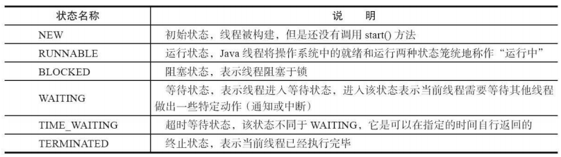
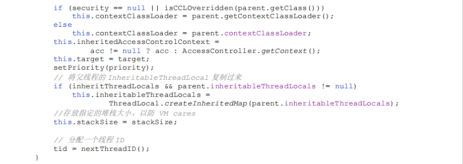
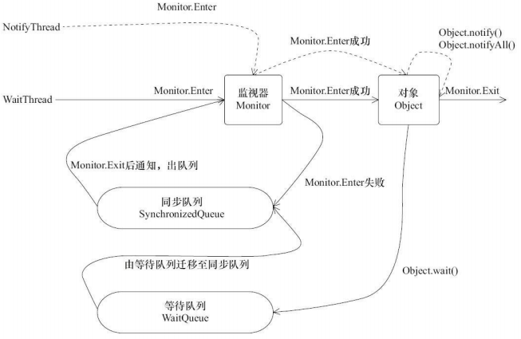

# 4. Java 并发编程基础【重点】

线程作为操作系统调度的最小单元，多个线程能够同时执行，这将显著提升程序性能，在多核环境中表现得更加明显。但是，过多地创建线程和对线程的不当管理也容易造成问题。


## 4.1 线程简介


### 4.1.1 什么是线程

现代操作系统在运行一个程序时，会为其创建一个进程。例如，启动一个 Java 程序，操作系统就会创建一个 Java 进程。现代操作系统**调度的最小单元**是**线程**，也叫**轻量级进程**（Light Weight Process），在一个进程里可以创建多个线程，这些**线程都拥有各自的计数器、堆栈和局部变量等属性，并且能够访问共享的内存变量**。处理器在这些线程上高速切换，让使用者感觉到这些线程在同时执行。

>一个 Java 程序从 `main()` 方法开始执行，然后按照既定的代码逻辑执行，看似没有其他线程参与，但实际上 Java 程序天生就是多线程程序，因为执行 `main()` 方法的是一个名称为 main 的线程。

**一个 Java 程序的运行不仅仅是 `main()` 方法的运行，而是 main 线程和多个其他线程的同时运行。**


### 4.1.2 为什么要使用多线程

- **更多的处理器核心**

  线程是大多数操作系统调度的基本单元，一个程序作为一个进程来运行，程序运行过程中能够创建多个线程，而一个线程在一个时刻只能运行在一个处理器核心上。一个单线程程序在运行时只能使用一个处理器核心，那么再多的处理器核心加入也无法显著提升该程序的执行效率。相反，如果该程序**使用多线程技术，将计算逻辑分配到多个处理器核心上，就会显著减少程序的处理时间，并且随着更多处理器核心的加入而变得更有效率**。

- **更快的响应时间**

  **使用多线程技术，将数据一致性不强的操作派发给其他线程处理（也可以使用消息队列），这样做的好处是响应用户请求的线程能够尽可能快地处理完成，缩短了响应时间，提升了用户体验。** 

- **更好的编程模型**

  Java 为多线程编程提供了良好、考究并且一致的编程模型，使开发人员能够更加专注于问题的解决，即为所遇到的问题建立合适的模型，而不是绞尽脑汁地考虑如何将其多线程化。一旦开发人员建立好了模型，稍做修改总是能够方便地映射到 Java 提供的多线程编程模型上。


### 4.1.3 线程优先级

现代操作系统基本采用**时分**的形式调度运行的线程，操作系统会分出一个个时间片，线程会分配到若干时间片，当线程的时间片用完了就会发生线程调度，并等待着下次分配。线程分配到的时间片多少也就决定了线程使用处理器资源的多少，而**线程优先级就是决定线程需要多或者少分配一些处理器资源的线程属性。**


在 Java 线程中，通过一个整型成员变量 `priority` 来控制优先级，优先级的范围从 **1~10**，在线程构建的时候可以通过 `setPriority(int)`方法来修改优先级，**默认优先级是 5，优先级高的线程分配时间片的数量要多于优先级低的线程。设置线程优先级时，针对频繁阻塞（休眠或者 I/O 操作）的线程需要设置较高优先级，而偏重计算（需要较多 CPU 时间或者偏运算）的线程则设置较低的优先级，确保处理器不会被独占**。在不同的 JVM 以及操作系统上，线程规划会存在差异，有些操作系统甚至会忽略对线程优先级的设定。

注意：

> 线程优先级不能作为程序正确性的依赖，因为操作系统可以完全不用理会 Java 线程对于优先级的设定。


### 4.1.4 线程的状态

Java 线程在运行的生命周期中可能处于下表所示的 6 种不同的状态，在给定的一个时刻，线程只能处于其中的一个状态。 



线程在自身的生命周期中，并不是固定地处于某个状态，而是随着代码的执行在不同的状态之间进行切换，Java 线程状态变迁如下图所示：


线程创建之后，调用 `start()` 方法开始运行。当线程执行 `wait()` 方法之后，线程进入等待状态。进入等待状态的线程需要依靠其他线程的通知才能够返回到运行状态，而**超时等待状态相当于在等待状态的基础上增加了超时限制，也就是超时时间到达时将会返回到运行状态**。当线程调用同步方法时，在没有获取到锁的情况下，线程将会进入到阻塞状态。**线程在执行 Runnable 的 `run()` 方法之后将会进入到终止状态。**


> 注意：Java 将操作系统中的运行和就绪两个状态合并称为运行状态。**阻塞状态是线程阻塞在进入 synchronized 关键字修饰的方法或代码块（获取锁）时的状态，但是阻塞在 `java.concurrent` 包中 Lock 接口的线程状态却是等待状态**，因为 `java.concurrent` 包中 Lock 接口对于阻塞的实现均使用了 LockSupport 类中的相关方法。


### 4.1.5 Daemon 线程

Daemon 线程是一种支持型线程（常被叫做**守护线程**），因为它主要被**用作程序中后台调度以及支持性工作**。这意味着，**当一个 Java 虚拟机中不存在非 Daemon 线程的时候，Java 虚拟机将会退出**。可以通过调用 `Thread.setDaemon(true)` 将线程设置为 Daemon 线程。 

> 注意：Daemon 属性需要在启动线程之前设置，不能在启动线程之后设置。Daemon 线程被用作完成支持性工作，但是**在 Java 虚拟机退出时 Daemon 线程中的 finally 块并不一定会执行**。所以，在构建 Daemon 线程时，不能依靠 finally 块中的内容来确保执行关闭或清理资源的逻辑。

代码示例如下：

```java
public class Concurrency {
    public static void main(String[] args) {
        Thread thread = new Thread(new DaemonRunner(), "DaemonRunner");
        thread.setDaemon(true);
        thread.start();
    }
    static class DaemonRunner implements Runnable {
        @Override
        public void run() {
            try {
            	SleepUtils.second(10);
            } finally {
            	System.out.println("DaemonThread finally run.");
            }
        }
    } 
}
```

运行 Daemon 程序，可以看到在终端或者命令提示符上没有任何输出。main 线程（非 Daemon 线程）在启动了线程 DaemonRunner 之后随着 main 方法执行完毕而终止，而此时 Java 虚拟机中已经没有非 Daemon 线程，虚拟机需要退出。Java 虚拟机中的所有 Daemon 线程都需要立即终止，因此 DaemonRunner 立即终止，但是 DaemonRunner 中的 finally 块并没有执行。


## 4.2 启动和终止线程


### 4.2.1 构造线程

**在运行线程之前首先要构造一个线程对象，线程对象在构造的时候需要提供线程所需要的属性**，如线程所属的线程组、线程优先级、是否是 Daemon 线程等信息。

下面代码清单所示的代码摘自 `java.lang.Thread` 中对线程进行初始化的部分：

Thread.java：




在上述过程中，一个新构造的线程对象是**由其 parent 线程来进行空间分配**的，而 **child 线程继承了 parent 是否为 Daemon、优先级和加载资源的 contextClassLoader 以及可继承的 ThreadLocal，同时还会分配一个唯一的 ID 来标识这个 child 线程**。至此，一个能够运行的线程对象就初始化好了，在堆内存中等待着运行。 


### 4.2.2 启动线程

线程对象在初始化完成之后，调用 `start()` 方法就可以启动这个线程。线程 `start()` 方法的含义是：**当前线程（即 parent 线程）同步告知 Java 虚拟机，只要线程规划器空闲，应立即启动调用 `start()` 方法的线程。**

> 注意：**启动一个线程前，最好为这个线程设置线程名称**，因为这样在使用 jstack 分析程序或者进行问题排查时，就会给开发人员提供一些提示。


### 4.2.3 理解中断

中断可以理解为**线程的一个标识位属性**，它表示**一个运行中的线程是否被其他线程进行了中断操作**。中断好比其他线程对该线程打了个招呼，其他线程通过调用该线程的 `interrupt()` 方法对其进行中断操作。 

线程通过检查自身是否被中断来进行响应，线程通过方法 `isInterrupted()`来进行判断是否被中断，也可以调用静态方法 `Thread.interrupted()`对当前线程的中断标识位进行复位。如果该线程已经处于终结状态，即使该线程被中断过，在调用该线程对象的 `isInterrupted()`时依旧会返回 false。 

从 Java 的 API 中可以看到，许多声明抛出 InterruptedException 的方法（例如 `Thread.sleep(longmillis)`方法）这些方法**在抛出 InterruptedException 之前，Java 虚拟机会先将该线程的中断标识位清除**，然后抛出 InterruptedException，此时调用 `isInterrupted()` 方法将会返回 false。

***

在下面代码清单所示的例子中，首先创建了两个线程，SleepThread 和 BusyThread，前者不停地睡眠，后者一直运行，然后对这两个线程分别进行中断操作，观察二者的中断标识位。 

Concurrency.java：

```java
public class Concurrency {
    public static void main(String[] args) throws Exception {
        // sleepThread 不停的尝试睡眠
        Thread sleepThread = new Thread(new SleepRunner(), "SleepThread");
        sleepThread.setDaemon(true);
        // busyThread 不停的运行
        Thread busyThread = new Thread(new BusyRunner(), "BusyThread");
        busyThread.setDaemon(true);
        sleepThread.start();
        busyThread.start();
        
        // 休眠 5 秒，让 sleepThread 和 busyThread 充分运行
        TimeUnit.SECONDS.sleep(5);
        sleepThread.interrupt();
        busyThread.interrupt();
        System.out.println("SleepThread interrupted is " + sleepThread.isInterrupted());
        System.out.println("BusyThread interrupted is " + busyThread.isInterrupted());

        // 防止 sleepThread 和 busyThread 立刻退出
        TimeUnit.SECONDS.sleep(2);
    }
    static class SleepRunner implements Runnable {
        @Override
        public void run() {
            while (true) {
                try {
                	TimeUnit.SECONDS.sleep(10);
                } catch (InterruptedException e) {
                	e.printStackTrace();
                }
            }
        }
    }
    static class BusyRunner implements Runnable {
        @Override
        public void run() {
            while (true) {
            }
        }
    } 
}
```

输出如下。 

```
SleepThread interrupted is false 
BusyThread interrupted is true 
java.lang.InterruptedException: sleep interrupted
```

从结果可以看出，抛出 InterruptedException 的线程 SleepThread，其中断标识位被清除了，而一直忙碌运作的线程 BusyThread，中断标识位没有被清除。


### 4.2.4 过期的 suspend()、resume() 和 stop()【已淘汰】

如果把 CD 机播放音乐比作一个线程的运作，那么对音乐播放做出的暂停、恢复和停止操作对应在线程 Thread 的 API 就是 `suspend()`、`resume()` 和 `stop()`。 


在下面代码清单所示的例子中，创建了一个线程 PrintThread，它以 1 秒的频率进行打印，而主线程对其进行暂停、恢复和停止操作。

Concurrency.java：

```java
public class Concurrency {
    public static void main(String[] args) throws Exception {
        DateFormat format = new SimpleDateFormat("HH:mm:ss");
        Thread printThread = new Thread(new Runner(), "PrintThread");
        printThread.setDaemon(true);
        printThread.start();
        TimeUnit.SECONDS.sleep(3);
        // 将 PrintThread 进行暂停，输出内容工作停止
        printThread.suspend();
        System.out.println("main suspend PrintThread at " + format.format(new Date()));
        TimeUnit.SECONDS.sleep(3);
        // 将 PrintThread 进行恢复，输出内容继续
        printThread.resume();
        System.out.println("main resume PrintThread at " + format.format(new Date()));
        TimeUnit.SECONDS.sleep(3);
        // 将 PrintThread 进行终止，输出内容停止
        printThread.stop();
        System.out.println("main stop PrintThread at " + format.format(new Date()));
        TimeUnit.SECONDS.sleep(3);
    }
    
    static class Runner implements Runnable {
        @Override
        public void run() {
            DateFormat format = new SimpleDateFormat("HH:mm:ss");
            while (true) {
            	System.out.println(Thread.currentThread().getName() + " Run at " + format.format(new Date()));
            	SleepUtils.second(1);
            }
        }
    } 
}
```

输出如下（输出内容中的时间与示例执行的具体时间相关）：

```
PrintThread Run at 11:21:06 
PrintThread Run at 11:21:07 
PrintThread Run at 11:21:08 
main suspend PrintThread at 11:21:09 
main resume PrintThread at 11:21:12 
PrintThread Run at 11:21:12 
PrintThread Run at 11:21:13 
PrintThread Run at 11:21:14 
main stop PrintThread at 11:21:15 
```

在执行过程中，PrintThread 运行了 3 秒，随后被暂停，3 秒后恢复，最后经过 3 秒被终止。

>这些 API 是过期的，也就是**不建议使用**的。 
>
>不建议使用的原因主要有：以 `suspend()` 方法为例，在调用后，线程不会释放已经占有的资源（比如锁），而是占有着资源进入睡眠状态，这样容易引发死锁问题。同样，`stop()` 方法在终结一个线程时不会保证线程的资源正常释放，通常是没有给予线程完成资源释放工作的机会，因此会导致程序可能工作在不确定状态下。 
>
>暂停和恢复操作可以用后面提到的等待/通知机制来替代。


### 4.2.5 安全地终止线程

中断状态是线程的一个标识位，而**中断操作**是一种简便的线程间交互方式，而这种交互方式最适合**用来取消或停止任务**。除了中断以外，还可以利用一个 boolean 变量来控制是否需要停止任务并终止该线程。 


在下面代码清单所示的例子中，创建了一个线程 CountThread，它不断地进行变量累加，而主线程尝试对其进行中断操作和停止操作。

Shutdown.java：

```java
public class Concurrency {
    public static void main(String[] args) throws Exception {
        Runner one = new Runner();
        Thread countThread = new Thread(one, "CountThread");
        countThread.start();
        // 睡眠 1 秒，main 线程对 CountThread 进行中断，使 CountThread 能够感知中断而结束
        TimeUnit.SECONDS.sleep(1);
        countThread.interrupt();// 中断
        Runner two = new Runner();
        countThread = new Thread(two, "CountThread");
        countThread.start();
        // 睡眠 1 秒，main 线程对 Runner two 进行取消，使 CountThread 能够感知 on 为 false 而结束
        TimeUnit.SECONDS.sleep(1);
        two.cancel();// 取消/停止
    }
    
    private static class Runner implements Runnable {
        private long i;
        private volatile boolean on = true;
        
        @Override
        public void run() {
            while (on && !Thread.currentThread().isInterrupted()) {
            	i++;
            }
            System.out.println("Count i = " + i);
        }
        
        public void cancel() {
        	on = false;
        }
    } 
}
```

输出结果如下所示（输出内容可能不同）。 

```
Count i = 1161971632 
Count i = 1173815036
```

示例在执行过程中，main 线程通过**中断操作**和 **`cancel()` 方法**均可使 CountThread 得以终止。这种**通过标识位或者中断操作的方式能够使线程在终止时有机会去清理资源，而不是武断地将线程停止**，因此这种终止线程的做法显得更加安全和优雅。


## 4.3 线程间通信


### 4.3.1 volatile 和 synchronized 关键字

Java 支持多个线程同时访问一个对象或者对象的成员变量，由于每个线程可以拥有这个变量的拷贝（虽然对象以及成员变量分配的内存是在共享内存中的，但是每个执行的线程还是可以拥有一份拷贝，这样做的目的是加速程序的执行，这是现代多核处理器的一个显著特性），所以**程序在执行过程中，一个线程看到的变量并不一定是最新的。**

- **关键字 `volatile` 可以用来修饰`字段（成员变量）`，就是告知程序任何对该变量的访问均需要从共享内存中获取，而对它的改变必须同步刷新回共享内存，它能保证所有线程对变量访问的可见性。**

- **关键字 `synchronized` 可以修饰`方法`或者以`同步块`的形式来进行使用，它主要确保多个线程在同一个时刻，只能有一个线程处于方法或者同步块中，它保证了线程对变量访问的可见性和排他性。** 


对于**同步块**的实现是使用 `monitorenter` 和 `monitorexit` 指令，而**同步方法**则是依靠方法修饰符上的 `ACC_SYNCHRONIZED` 来完成的。无论采用哪种方式，其**本质是对一个`对象的监视器（monitor）`进行获取**，而这个获取过程是**排他**的，也就是**同一时刻只能有一个线程获取到由 synchronized 所保护对象的监视器。** 

**任意一个对象都拥有自己的监视器，当这个对象由同步块或者这个对象的同步方法调用时，执行方法的线程必须先获取到该对象的监视器才能进入同步块或者同步方法，而没有获取到监视器（执行该方法）的线程将会被阻塞在同步块和同步方法的入口处，进入 BLOCKED 状态。**

***

下图描述了对象、对象的监视器、同步队列和执行线程之间的关系：


任意线程对 Object（Object 由 synchronized 保护）的访问，首先要获得 Object 的监视器。如果获取失败，线程进入同步队列，线程状态变为 BLOCKED。当访问 Object 的前驱（获得了锁的线程）释放了锁，则该释放操作唤醒阻塞在同步队列中的线程，使其重新尝试对监视器的获取。 


### 4.3.2 等待/通知机制

> 一个线程修改了一个对象的值，而另一个线程感知到了变化，然后进行相应的操作，整个过程开始于一个线程，而最终执行又是另一个线程。前者是生产者，后者就是消费者，这种模式在功能层面上实现了解耦，体系结构上具备了良好的伸缩性，但是在 Java 语言中如何实现类似的功能呢？ 

简单的办法是让消费者线程不断地循环检查变量是否符合预期，如下面代码所示，在 while 循环中设置不满足的条件，如果条件满足则退出 while 循环，从而完成消费者的工作。 

```java
while(value!=desire){
	Thread.sleep(1000);
}
doSomething();
```

上面这段伪代码在条件不满足时就睡眠一段时间，这样做的目的是防止过快的“无效”尝试，这种方式看似能够解实现所需的功能，但是却存在如下问题：

1. **难以确保及时性**。在睡眠时，基本不消耗处理器资源，但是如果睡得过久，就不能及时发现条件已经变化，也就是及时性难以保证。 

2. **难以降低开销**。如果降低睡眠的时间，比如休眠 1 毫秒，这样消费者能更加迅速地发现条件变化，但是却可能消耗更多的处理器资源，造成了无端的浪费。

以上两个问题，看似矛盾难以调和，但是 Java 通过**内置的等待/通知机制**能够很好地解决这个矛盾并实现所需的功能。 

等待/通知的相关方法是任意 Java 对象都具备的，因为这些方法被定义在所有对象的超类 `java.lang.Object` 上，方法和描述如下表所示：


**等待/通知机制，是指一个线程 A 调用了对象 O 的 `wait()` 方法进入等待状态，而另一个线程 B 调用了对象 O 的 `notify()` 或者 `notifyAll()` 方法，线程 A 收到通知后从对象 O 的 `wait()` 方法返回，进而执行后续操作**。上述两个线程通过对象 O 来完成交互，而对象上的 `wait()` 和 `notify`/`notifyAll()` 的关系就如同开关信号一样，用来完成等待方和通知方之间的交互工作。 

***

在下面代码清单所示的例子中，创建了两个线程——`WaitThread` 和 `NotifyThread`，前者检查 flag 值是否为 false，如果符合要求，进行后续操作，否则在 lock 上等待，后者在睡眠了一段时间后对 lock 进行通知。


输出如下（输出内容可能不同，主要区别在时间上）：

```
Thread[WaitThread,5,main] flag is true. wa @ 13: 44: 41  
Thread[NotifyThread,5,main] hold lock. notify @ 13: 44: 42  
Thread[NotifyThread,5,main] hold lock again. sleep @ 13: 44: 47  
Thread[WaitThread,5,main] flag is false. running @ 13: 44: 52
```

上述第 3 行和第 4 行输出的顺序可能会互换，而上述例子主要说明了调用 `wait()`、`notify()` 以及 `notifyAll()` 时需要注意的细节如下：

1. 使用 `wait()`、`notify()` 和 `notifyAll()` 时需要先对调用对象加锁。 

2. 调用 `wait()` 方法后，线程状态由 RUNNING 变为 WAITING，并将当前线程放置到对象的等待队列。 

3. **`notify()` 或 `notifyAll()` 方法调用后，等待线程依旧不会从 `wait()` 返回，需要调用 `notify()` 或 `notifyAll()`的线程释放锁之后，等待线程才有机会从 `wait()` 返回。** 

4. `notify()` 方法**将等待队列中的一个等待线程从等待队列中移到同步队列中**，而 `notifyAll()` 方法则是将等待队列中所有的线程全部移到同步队列，被移动的线程状态由 WAITING 变为 BLOCKED。 

5. **从 `wait()` 方法返回的前提是获得了调用对象的锁。**

>等待/通知机制依托于**同步机制**，其目的就是**确保等待线程从 `wait()` 方法返回时能够感知到通知线程对变量做出的修改。** 


下图描述了上述示例的过程：



WaitThread 首先获取了对象的锁，然后调用对象的 `wait()` 方法，从而放弃了锁并进入了对象的等待队列 WaitQueue 中，进入等待状态。由于 WaitThread 释放了对象的锁， NotifyThread 随后获取了对象的锁，并调用对象的 `notify()` 方法，将 WaitThread 从 WaitQueue 移到 SynchronizedQueue 中，此时 WaitThread 的状态变为阻塞状态。NotifyThread 释放了锁之后， WaitThread 再次获取到锁并从 `wait()` 方法返回继续执行。


### 4.3.3 等待/通知的经典范式

等待/通知的经典范式分为两部分，分别针对**等待方（消费者）**和**通知方（生产者）**。

- **等待方遵循如下原则:**
  1. 获取对象的锁。 
  2. 如果条件不满足，那么调用对象的 `wait()` 方法，被通知后仍要检查条件。 
  3. 条件满足则执行对应的逻辑。 

对应的伪代码如下：

```java
synchronized(对象) {
    while(条件不满足) { 
    对象.wait();
    }
    对应的处理逻辑
}
```

- **通知方遵循如下原则:**
  1. 获得对象的锁。 
  2. 改变条件。 
  3. 通知所有等待在对象上的线程。 

对应的伪代码如下：

```java
synchronized(对象){
    改变条件
    对象.notifyAll();
}
```


### 4.3.4 管道输入/输出流

管道输入/输出流主要用于**线程之间的数据传输**，而传输的媒介为**内存**。管道输入/输出流主要包括了如下 4 种具体实现：`PipedOutputStream`、`PipedInputStream`、`PipedReader` 和 `PipedWriter`，前两种面向字节，而后两种面向字符。


在下面代码清单所示的例子中，创建了 printThread，它用来接受 main 线程的输入，任何 main 线程的输入均通过 `PipedWriter` 写入，而 printThread 在另一端通过 `PipedReader` 将内容读出并打印。

Piped.java：

```java
public class Piped {
    public static void main(String[] args) throws Exception {
        PipedWriter out = new PipedWriter();
        PipedReader in = new PipedReader();
        // 将输出流和输入流进行连接，否则在使用时会抛出 IOException
        out.connect(in);
        Thread printThread = new Thread(new Print(in), "PrintThread");
        printThread.start();
        int receive = 0;
        try {
            while ((receive = System.in.read()) != -1) {
            	out.write(receive);
            }
        } finally {
        	out.close();
        }
    }
    
    static class Print implements Runnable {
        private PipedReader in;
        
        public Print(PipedReader in) {
        	this.in = in;
        }
        
        public void run() {
            int receive = 0;
            try {
                while ((receive = in.read()) != -1) {
                System.out.print((char) receive);
                }
            } catch (IOException ex) {
            }
        }
    } 
}
```

运行该示例，输入一组字符串，可以看到被 printThread 进行了原样输出。 

```
Repeat my words. 
Repeat my words. 
```

> 对于 Piped 类型的流，必须先要进行绑定，也就是调用 `connect()` 方法，如果没有将输入/输出流绑定起来，对于该流的访问将会抛出异常。


### 4.3.5 Thread.join() 的使用

如果一个线程 A 执行了 `thread.join()` 语句，其含义是：**当前线程 A 等待 thread 线程终止之后才从 `thread.join()` 返回**。线程 Thread 除了提供 `join()` 方法之外，还提供了 `join(long millis)` 和 `join(longmillis,int nanos)` 两个具备超时特性的方法。这两个超时方法表示，如果线程 thread 在给定的超时时间里没有终止，那么将会从该超时方法中返回。


在下面代码清单所示的例子中，创建了 10 个线程，编号 0~9，每个线程调用前一个线程的 `join()` 方法，也就是线程 0 结束了，线程 1 才能从 `join()` 方法中返回，而线程 0 需要等待 main 线程结束。 

Join.java：

```java
public class Join{
    public static void main(String[] args) throws Exception {
        Thread previous = Thread.currentThread();
        for (int i = 0; i < 10; i++) {
            // 每个线程拥有前一个线程的引用，需要等待前一个线程终止，才能从等待中返回
            Thread thread = new Thread(new Domino(previous), String.valueOf(i));
            thread.start();
            previous = thread;
        }
        TimeUnit.SECONDS.sleep(5);
        System.out.println(Thread.currentThread().getName() + " terminate.");
    }
    
    static class Domino implements Runnable {
        private Thread thread;
        
        public Domino(Thread thread) {
        	this.thread = thread;
        }
        public void run() {
            try {
            	thread.join();
            } catch (InterruptedException e) {
            }
            System.out.println(Thread.currentThread().getName() + " terminate.");
        }
    } 
}
```

输出如下：

```
main terminate.
0 terminate.
1 terminate.
2 terminate.
3 terminate.
4 terminate.
5 terminate.
6 terminate.
7 terminate.
8 terminate.
9 terminate.
```

从上述输出可以看到，每个线程终止的前提是前驱线程的终止，每个线程等待前驱线程终止后，才从 `join()` 方法返回，这里涉及了等待/通知机制（等待前驱线程结束，接收前驱线程结束通知）。

> 下面是 JDK 中 `Thread.join()` 方法的部分源码：
>
> ```java
> // 加锁当前线程对象
> public final synchronized void join() throws InterruptedException{
>  // 条件不满足，继续等待
>  while(isAlive()){
>  	wait(0);
>  }
>  // 条件符合，方法返回
> }
> ```

当线程终止时，会调用线程自身的 `notifyAll()` 方法，会通知所有等待在该线程对象上的线程。可以看到 `join()` 方法的逻辑结构与等待/通知经典范式一致，即加锁、循环和处理逻辑 3 个步骤。


### 4.3.6 ThreadLocal 的使用

**ThreadLocal，即线程变量，是一个以 ThreadLocal 对象为键、任意对象为值的存储结构。**这个结构被附带在线程上，也就是说**一个线程可以根据一个 ThreadLocal 对象查询到绑定在这个线程上的一个值**。可以通过 `set(T)` 方法来设置一个值，在当前线程下再通过 `get()` 方法获取到原先设置的值。


在下面代码清单所示的例子中，构建了一个常用的 Profiler 类，它具有 `begin()` 和 `end()` 两个方法，而 `end()` 方法返回从 `begin()` 方法调用开始到 `end()` 方法被调用时的时间差，单位是毫秒。

Profiler.java：

```java
public class Profiler {
    // 第一次 get()方法调用时会进行初始化（如果 set 方法没有调用），每个线程会调用一次
    private static final ThreadLocal<Long> TIME_THREADLOCAL = new ThreadLocal<Long>();
    
    protected Long initialValue() {
    	return System.currentTimeMillis();
    }
    
    public static final void begin() {
    	TIME_THREADLOCAL.set(System.currentTimeMillis());
    }
    
    public static final long end() {
    	return System.currentTimeMillis() - TIME_THREADLOCAL.get();
    }
    
    public static void main(String[] args) throws Exception {
        Profiler.begin();
        TimeUnit.SECONDS.sleep(1);
        System.out.println("Cost: " + Profiler.end() + " mills");
    } 
}
```

输出结果如下所示：

```
Cost: 1001 mills 
```

Profiler 可以被复用在方法调用耗时统计的功能上，在方法的入口前执行 `begin()` 方法，在方法调用后执行 `end()` 方法，好处是两个方法的调用不用在一个方法或者类中，比如在 AOP（面向切面编程）中，可以在方法调用前的切入点执行 `begin()` 方法，而在方法调用后的切入点执行 `end()` 方法，这样依旧可以获得方法的执行耗时。


## 4.4 线程应用实例

### 4.4.1 等待超时模式

开发人员经常会遇到这样的方法调用场景：**调用一个方法时等待一段时间（一般来说是给定一个时间段），如果该方法能够在给定的时间段之内得到结果，那么将结果立刻返回，反之，超时返回默认结果。** 

等待/通知的经典范式（加锁、条件循环和处理逻辑 3 个步骤）无法做到超时等待。而超时等待的加入，只需要对经典范式做出非常小的改动，改动内容如下所示。假设超时时间段是 T，那么可以推断出在当前时间 `now+T` 之后就会超时。定义如下变量：

- **等待持续时间：REMAINING=T。** 

- **超时时间：FUTURE=now+T。** 

这时仅需要 `wait(REMAINING)` 即可，在 `wait(REMAINING)` 返回之后会将执行： **REMAINING=FUTURE–now**。如果 REMAINING 小于等于 0，表示已经超时，直接退出，否则将继续执行 `wait(REMAINING)`。 

>等待超时模式就是在等待/通知范式基础上增加了超时控制，这使得该模式相比原有范式更具有灵活性，因为即使方法执行时间过长，也不会“永久”阻塞调用者，而是会按照调用者的要求“按时”返回。


### 4.4.2 一个简单的数据库连接池示例

//略