# 5. Java 中的锁【重点】


## 5.1 Lock 接口

锁是**用来控制多个线程访问共享资源**的方式。一般来说，一个锁能够防止多个线程同时访问共享资源（但是有些锁可以允许多个线程并发的访问共享资源，比如读写锁）。

在 Lock 接口出现之前，Java 程序是靠 synchronized 关键字实现锁功能的，而 Java SE 5 之后，并发包中新增了 Lock 接口（以及相关实现类）用来实现锁功能，它提供了与 synchronized 关键字类似的同步功能，只是**在使用时需要显式地获取和释放锁**。虽然它缺少了（通过 synchronized 块或者方法所提供的）隐式获取释放锁的便捷性，但是却**拥有了锁获取与释放的可操作性、可中断的获取锁以及超时获取锁等多种 synchronized 关键字所不具备的同步特性。**

> **使用 synchronized 关键字将会隐式地获取锁，但是它将锁的获取和释放固化了，也就是先获取再释放**。当然，这种方式简化了同步的管理，可是扩展性没有显式的锁获取和释放来的好。例如，针对一个场景，手把手进行锁获取和释放，先获得锁 A，然后再获取锁 B，当锁 B 获得后，释放锁 A 同时获取锁 C，当锁 C 获得后，再释放 B 同时获取锁 D，以此类推。这种场景下，synchronized 关键字就不那么容易实现了，而使用 Lock 却容易许多。


Lock 的使用很简单，下面代码是 Lock 的使用的方式：

LockUseCase.java：

```java
Lock lock = new ReentrantLock();
lock.lock();
try {
} finally {
	lock.unlock();
}
```

**在 finally 块中释放锁，目的是保证在获取到锁之后，最终能够被释放。** 

**不要将获取锁的过程写在 try 块中，因为如果在获取锁（自定义锁的实现）时发生了异常，异常抛出的同时，也会导致锁无故释放。**


Lock 接口提供的 synchronized 关键字所不具备的主要特性如下表所示：


Lock 是一个接口，它定义了锁获取和释放的基本操作，Lock 的 API 如下表所示：

 

>Lock 接口的实现基本都是通过聚合了一个同步器的子类来完成线程访问控制的。


## 5.2 队列同步器

**队列同步器 AbstractQueuedSynchronizer**（以下简称同步器），是**用来构建锁或者其他同步组件的基础框架**，它使用了一个 `int 成员变量` 表示同步状态，通过内置的 FIFO 队列来完成资源获取线程的排队工作。

同步器的主要使用方式是**继承**，**子类通过继承同步器并实现它的抽象方法来管理同步状态**，在抽象方法的实现过程中免不了要对同步状态进行更改，这时就需要使用同步器提供的 3 个方法（`getState()`、`setState(int newState)` 和 `compareAndSetState(int expect,int  update)`）来进行操作，因为它们能够保证状态的改变是安全的。**子类推荐被定义为自定义同步组件的静态内部类**，同步器自身没有实现任何同步接口，它仅仅是定义了若干同步状态获取和释放的方法来供自定义同步组件使用，**同步器既可以支持独占式地获取同步状态，也可以支持共享式地获取同步状态**，这样就可以方便实现不同类型的同步组件（ReentrantLock、ReentrantReadWriteLock 和 CountDownLatch 等）。 

**同步器是实现锁（也可以是任意同步组件）的关键，在锁的实现中聚合同步器，利用同步器实现锁的语义**。可以这样理解二者之间的关系：**锁是面向使用者的**，它定义了使用者与锁交互的接口（比如可以允许两个线程并行访问），隐藏了实现细节；**同步器面向的是锁的实现者**，它简化了锁的实现方式，屏蔽了同步状态管理、线程的排队、等待与唤醒等底层操作。锁和同步器很好地隔离了使用者和实现者所需关注的领域。


### 5.2.1 队列同步器的接口与示例

同步器的设计是基于**模板方法模式**的，也就是说，**使用者需要继承同步器并重写指定的方法，随后将同步器组合在自定义同步组件的实现中，并调用同步器提供的模板方法，而这些模板方法将会调用使用者重写的方法**。重写同步器指定的方法时，需要使用同步器提供的如下 3 个方法来访问或修改同步状态。

- **getState()**：获取当前同步状态。 

- **setState(int newState)**：设置当前同步状态。 

- **compareAndSetState(int expect,int update)**：使用 **CAS** 设置当前状态，该方法能够保证状态设置的原子性。 

同步器可重写的方法与描述如下表所示：


**实现自定义同步组件时，将会调用同步器提供的模板方法**，这些（部分）模板方法与描述如下表所示：

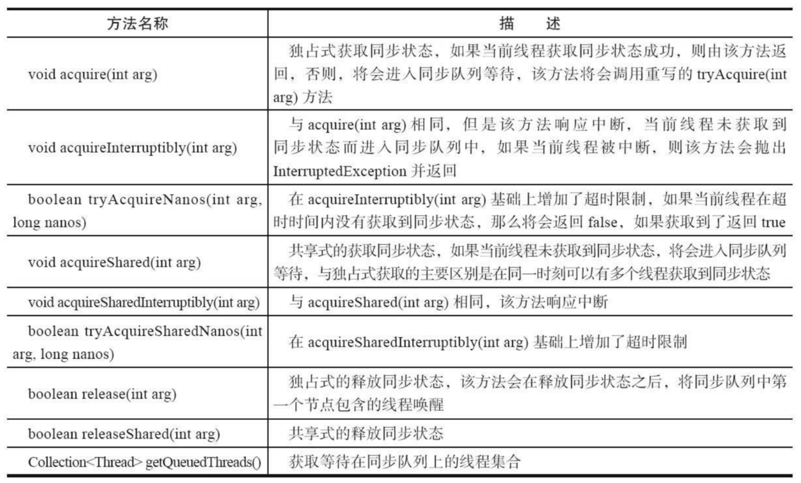

同步器提供的模板方法基本上分为 3 类：**独占式获取与释放同步状态**、**共享式获取与释放同步状态**和**查询同步队列中的等待线程情况**。自定义同步组件将使用同步器提供的模板方法来实现自己的同步语义。 

***

下面通过一个独占锁的示例来深入了解一下同步器的工作原理。 

顾名思义，**独占锁**就是**在同一时刻只能有一个线程获取到锁，而其他获取锁的线程只能处于同步队列中等待，只有获取锁的线程释放了锁，后继的线程才能够获取锁**，如下面代码清单所示：

Mutex.java：

```java
class Mutex implements Lock {
	// 静态内部类，自定义同步器
 	private static class Sync extends AbstractQueuedSynchronizer {
 		// 是否处于占用状态
		protected boolean isHeldExclusively() {
 			return getState() == 1;
		}
        
 		// 当状态为 0 的时候获取锁
 		public boolean tryAcquire(int acquires) {
 			if (compareAndSetState(0, 1)) {
 				setExclusiveOwnerThread(Thread.currentThread());
 				return true;
 			}
 			return false;
	 	}
        
 		// 释放锁，将状态设置为 0
 		protected boolean tryRelease(int releases) {
 			if (getState() == 0) throw new IllegalMonitorStateException();
 			setExclusiveOwnerThread(null);
 			setState(0);
 			return true;
 		}
        
 		// 返回一个 Condition，每个 condition 都包含了一个 condition 队列
 		Condition newCondition() {
 			return new ConditionObject();
 		}
 	}
    
 	// 仅需要将操作代理到 Sync 上即可
 	private final Sync sync = new Sync();
    
 	public void lock() {
 		sync.acquire(1);
 	}
    
    public boolean tryLock() {
    	return sync.tryAcquire(1);
    }

    public void unlock() {
	    sync.release(1);
    }

    public Condition newCondition() {
	    return sync.newCondition();
    }

    public boolean isLocked() {
    	return sync.isHeldExclusively();
    }

    public boolean hasQueuedThreads() {
    	return sync.hasQueuedThreads();
    }

    public void lockInterruptibly() throws InterruptedException {
    	sync.acquireInterruptibly(1);
    }

    public boolean tryLock(long timeout, TimeUnit unit) throws InterruptedException {
    	return sync.tryAcquireNanos(1, unit.toNanos(timeout));
    } 
}
```

上述示例中，独占锁 Mutex 是一个自定义同步组件，它在同一时刻只允许一个线程占有锁。**Mutex 中定义了一个静态内部类，该内部类继承了同步器并实现了独占式获取和释放同步状态**。在 `tryAcquire(int acquires)` 方法中，如果经过 CAS 设置成功（同步状态 设置为 1），则代表获取了同步状态，而在 `tryRelease(int releases)` 方法中只是将同步状态重置为 0。用户使用 Mutex 时并不会直接和内部同步器的实现打交道，而是调用 Mutex 提供的方法，在 Mutex 的实现中，以获取锁的 `lock()` 方法为例，只需要在方法实现中调用同步器的模板方法 `acquire(int args)` 即可，当前线程调用该方法获取同步状态失败后会被加入到同步队列中等待，这样就大大降低了实现一个可靠自定义同步组件的门槛。


### 5.2.2 队列同步器的实现分析

从实现角度分析同步器是如何完成线程同步的，主要包括： 

- 同步队列

- 独占式同步状态获取与释放

- 共享式同步状态获取与释放

- 超时获取同步状态等同步器的核心数据结构与模板方法


#### 1）同步队列

同步器依赖内部的同步队列（一个 **FIFO 双向队列**）来完成同步状态的管理，当前线程获取同步状态失败时，同步器会将当前线程以及等待状态等信息构造成为一个节点（Node）并将其加入同步队列，同时会阻塞当前线程，当同步状态释放时，会把首节点中的线程唤醒，使其再次尝试获取同步状态。 

同步队列中的节点（Node）用来**保存获取同步状态失败的线程引用、等待状态以及前驱和后继节点**，节点的属性类型与名称以及描述如下表所示：


节点是构成同步队列的基础，同步器拥有首节点（head）和尾节点（tail），没有成功获取同步状态的线程将会成为节点加入该队列的尾部，同步队列的基本结构如下图所示：


同步器包含了两个节点类型的引用，一个指向头节点，而另一个指向尾节点。


当一个线程成功地获取了同步状态（或者锁），其他线程将无法获取到同步状态，转而被构造成为节点并加入到同步队列中，而这个加入队列的过程必须要保证线程安全，因此同步器提供了一个**基于 CAS 的设置尾节点的方法**：`compareAndSetTail(Node expect,Node update)`，它需要传递当前线程“认为”的尾节点和当前节点，只有设置成功后，当前节点才正式与之前的尾节点建立关联。

同步器将节点加入到同步队列的过程如下图所示：


同步队列遵循 FIFO，**首节点是获取同步状态成功的节点，首节点的线程在释放同步状态时，将会唤醒后继节点，而后继节点将会在获取同步状态成功时将自己设置为首节点**，该过程如下图所示：


设置首节点是通过获取同步状态成功的线程来完成的，**由于只有一个线程能够成功获取到同步状态，因此设置头节点的方法并不需要使用 CAS 来保证**，它只需要将首节点设置成为原首节点的后继节点并断开原首节点的 next 引用即可。 


#### 2）独占式同步状态获取与释放

通过调用同步器的 `acquire(int arg)` 方法可以获取同步状态，该方法对中断不敏感，也就是由于线程获取同步状态失败后进入同步队列中，后续对线程进行中断操作时，线程不会从同步队列中移出，该方法代码如下所示。

同步器的 `acquire` 方法：

```java
public final void acquire(int arg) {
    if (!tryAcquire(arg) && acquireQueued(addWaiter(Node.EXCLUSIVE), arg)) {
    	selfInterrupt();
    } 
}
```

上述代码主要完成了同步状态获取、节点构造、加入同步队列以及在同步队列中自旋等待的相关工作，其主要逻辑是：**首先调用自定义同步器实现的 `tryAcquire(int arg)` 方法，该方法保证线程安全的获取同步状态，如果同步状态获取失败，则构造同步节点（独占式 Node.EXCLUSIVE，同一时刻只能有一个线程成功获取同步状态）并通过 `addWaiter(Node node)` 方法将该节点加入到同步队列的尾部，最后调用 `acquireQueued(Node node,int arg)` 方法，使得该节点以“死循环”的方式获取同步状态。如果获取不到则阻塞节点中的线程，而被阻塞线程的唤醒主要依靠前驱节点的出队或阻塞线程被中断来实现。**


下面分析一下相关工作。首先是节点的构造以及加入同步队列，如代码清单所示：

同步器的 `addWaiter` 和 `enq` 方法：

```java
private Node addWaiter(Node mode) {
    Node node = new Node(Thread.currentThread(), mode);
    // 快速尝试在尾部添加
    Node pred = tail;
    if (pred != null) {
        node.prev = pred;
        if (compareAndSetTail(pred, node)) {
            pred.next = node;
            return node;
        }
    }
    enq(node);
    return node; 
}

private Node enq(final Node node) {
    for (; ; ) {
        Node t = tail;
        if (t == null) { // Must initialize
        	if (compareAndSetHead(new Node())) tail = head;
        } else {
            node.prev = t;
            if (compareAndSetTail(t, node)) {
                t.next = node;
                return t;
            }
        }
    } 
}
```

上述代码通过使用 `compareAndSetTail(Node expect,Node update)` 方法来确保节点能够被线程安全添加。试想一下：如果使用一个普通的 LinkedList 来维护节点之间的关系， 那么当一个线程获取了同步状态，而其他多个线程由于调用 `tryAcquire(int arg)` 方法获取同步状态失败而并发地被添加到 LinkedList 时，LinkedList 将难以保证 Node 的正确添加，最终的结果可能是节点的数量有偏差，而且顺序也是混乱的。 

在 `enq(final Node node)` 方法中，同步器通过“死循环”来保证节点的正确添加，在“死循环”中只有通过 CAS 将节点设置成为尾节点之后，当前线程才能从该方法返回，否则，当前线程不断地尝试设置。可以看出，`enq(final Node node)` 方法将并发添加节点的请求通过 CAS 变得“串行化”了。 


节点进入同步队列之后，就进入了一个**自旋**的过程，每个节点（或者说每个线程）都在自省地观察，当条件满足，获取到了同步状态，就可以从这个自旋过程中退出，否则依旧留在这个自旋过程中（并会阻塞节点的线程），如代码清单所示：

同步器的 `acquireQueued` 方法：

```java
final boolean acquireQueued(final Node node, int arg) {
    boolean failed = true;
    try {
        boolean interrupted = false;
        for (; ; ) {
            final Node p = node.predecessor();
            if (p == head && tryAcquire(arg)) {
                setHead(node);
                p.next = null; // help GC
                failed = false;
                return interrupted;
            }
            if (shouldParkAfterFailedAcquire(p, node) && parkAndCheckInterrupt()) {
            	interrupted = true;
            }
        }
    } finally {
    	if (failed) cancelAcquire(node);
    } 
}
```

在 `acquireQueued(final Node node,int arg)` 方法中，当前线程在“死循环”中尝试获取同步状态，而**只有前驱节点是头节点才能够尝试获取同步状态**。原因如下：

1. 头节点是成功获取到同步状态的节点，而头节点的线程释放了同步状态之后，将会唤醒其后继节点，后继节点的线程被唤醒后需要检查自己的前驱节点是否是头节点。

2. 维护同步队列的 FIFO 原则。该方法中，节点自旋获取同步状态的行为如下图所示。

   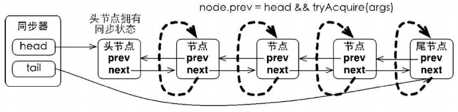 

   >由于**非**首节点线程前驱节点出队或者被中断而从等待状态返回，随后检查自己的前驱是否是头节点，如果是则尝试获取同步状态。可以看到**节点和节点之间在循环检查的过程中基本不相互通信，而是简单地判断自己的前驱是否为头节点**，这样就使得节点的释放规则符合 FIFO，并且也便于对过早通知的处理（过早通知是指前驱节点不是头节点的线程由于中断而被唤醒）。


**独占式同步状态获取**流程，也就是 `acquire(int arg)` 方法调用流程，如图所示：

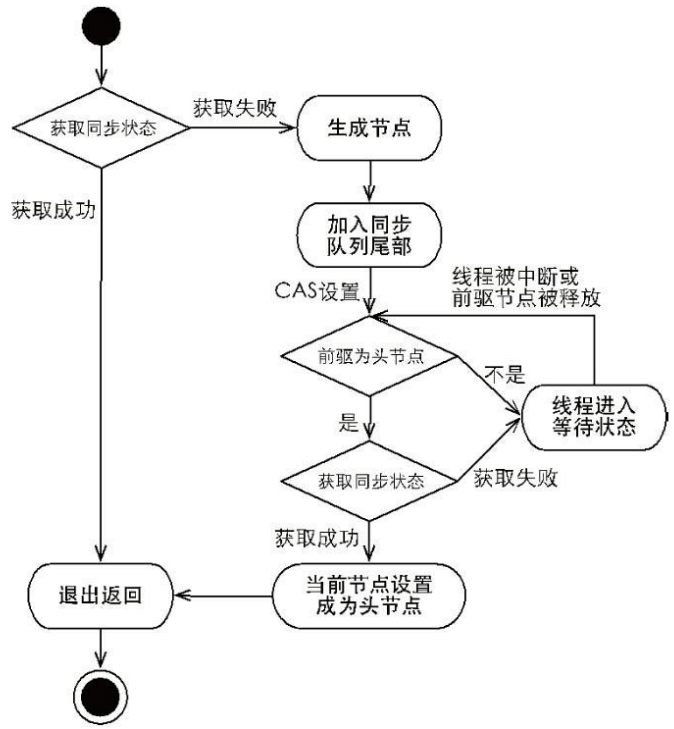

在上图中，**前驱节点为头节点且能够获取同步状态的判断条件和线程进入等待状态**是获取同步状态的**自旋**过程。当同步状态获取成功之后，当前线程从 `acquire(int arg)` 方法返回，**如果对于锁这种并发组件而言，代表着当前线程获取了锁。**


当前线程获取同步状态并执行了相应逻辑之后，就需要释放同步状态，使得后续节点能够继续获取同步状态。**通过调用同步器的 `release(int arg)` 方法可以释放同步状态，该方法在释放了同步状态之后，会唤醒其后继节点（进而使后继节点重新尝试获取同步状态）**。该方法代码如下所示：

同步器的 release 方法：

```java
public final boolean release(int arg) {
    if (tryRelease(arg)) {
        Node h = head;
        if (h != null && h.waitStatus != 0) unparkSuccessor(h);
        return true;
    }
    return false; 
}
```

该方法执行时，会唤醒头节点的后继节点线程，`unparkSuccessor(Node node)` 方法使用 LockSupport 来唤醒处于等待状态的线程。 


**总结：**

在获取同步状态时，同步器维护一个同步队列，获取状态失败的线程都会被加入到队列中并在队列中进行自旋；移出队列（或停止自旋）的条件是前驱节点为头节点且成功获取了同步状态。在释放同步状态时，同步器调用 `tryRelease(int arg)` 方法释放同步状态，然后唤醒头节点的后继节点。 


#### 3）共享式同步状态获取与释放

共享式获取与独占式获取最主要的区别在于**同一时刻能否有多个线程同时获取到同步状态。**

以文件的读写为例，如果一个程序在对文件进行读操作，那么这一时刻对于该文件的写操作均被阻塞，而读操作能够同时进行。**写操作要求对资源的独占式访问，而读操作可以是共享式访问**。两种不同的访问模式在同一时刻对文件或资源的访问情况，如下图所示：

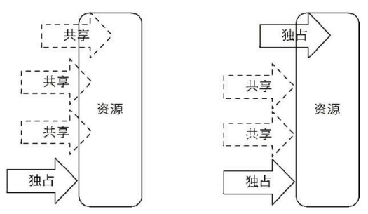

>左半部分，共享式访问资源时，其他共享式的访问均被允许，而独占式访问被阻塞；右半部分是独占式访问资源时，同一时刻其他访问均被阻塞。


通过调用同步器的 `acquireShared(int arg)` 方法可以共享式地获取同步状态，该方法代码如下所示： 

同步器的 acquireShared 和 doAcquireShared 方法：

```java
public final void acquireShared(int arg) {
	if (tryAcquireShared(arg) < 0) doAcquireShared(arg);
}

private void doAcquireShared(int arg) {
    final Node node = addWaiter(Node.SHARED);
    boolean failed = true;
    try {
        boolean interrupted = false;
        for (; ; ) {
            final Node p = node.predecessor();
            if (p == head) {
                int r = tryAcquireShared(arg);
                if (r >= 0) {
                    setHeadAndPropagate(node, r);
                    p.next = null;
                    if (interrupted) selfInterrupt();
                    failed = false;
                    return;
                }
            }
            if (shouldParkAfterFailedAcquire(p, node) && parkAndCheckInterrupt()) 
            interrupted = true;
        }
    } finally {
    	if (failed) cancelAcquire(node);
    } 
}
```

在 `acquireShared(int arg)` 方法中，同步器调用 `tryAcquireShared(int arg)` 方法尝试获取同步状态，`tryAcquireShared(int arg)` 方法返回值为 int 类型，当返回值大于等于 0 时，表示能够获取到同步状态。因此，**在共享式获取的自旋过程中，成功获取到同步状态并退出自旋的条件就是 `tryAcquireShared(int arg)` 方法返回值大于等于 0。**可以看到，在 `doAcquireShared(int arg)` 方法的自旋过程中，如果当前节点的前驱为头节点时，尝试获取同步状态，如果返回值大于等于 0，表示该次获取同步状态成功并从自旋过程中退出。


与独占式一样，共享式获取也需要释放同步状态，通过调用 `releaseShared(int arg)` 方法可以释放同步状态，该方法代码如下所示：

同步器的 releaseShared 方法：

```java
public final boolean releaseShared(int arg) {
    if (tryReleaseShared(arg)) {
        doReleaseShared();
        return true;
    }
    return false; 
}
```

该方法在释放同步状态之后，将会唤醒后续处于等待状态的节点。对于能够支持多个线程同时访问的并发组件（比如 Semaphore），它和独占式主要区别在于 **`tryReleaseShared(int arg)` 方法必须确保同步状态（或者资源数）线程安全释放，一般是通过循环和 CAS 来保证的，因为释放同步状态的操作会同时来自多个线程。** 


#### 4）独占式超时获取同步状态

通过调用同步器的 `doAcquireNanos(int arg,long nanosTimeout)` 方法可以超时获取同步状态，即**在指定的时间段内获取同步状态**，如果获取到同步状态则返回 true，否则，返回 false。该方法提供了传统 Java 同步操作（比如 synchronized 关键字）所不具备的特性。

>响应中断的同步状态获取过程：
>
>在 Java 5 之前，当一个线程获取不到锁而被阻塞在 synchronized 之外时，对该线程进行中断操作， 此时该线程的中断标志位会被修改，但线程依旧会阻塞在 synchronized 上，等待着获取锁。在 Java 5 中，同步器提供了 `acquireInterruptibly(int arg)` 方法，这个方法在等待获取同步状态时，如果当前线程被中断，会立刻返回，并抛出 InterruptedException。 

超时获取同步状态过程可以被视作响应中断获取同步状态过程的“增强版”，`doAcquireNanos(int arg,long nanosTimeout)` 方法在支持响应中断的基础上，增加了超时获取的特性。针对超时获取，主要需要计算出需要睡眠的时间间隔 nanosTimeout，为了防止过早通知， nanosTimeout 计算公式为：**nanosTimeout-=now-lastTime**，其中 now 为当前唤醒时间，lastTime 为上次唤醒时间，如果 nanosTimeout 大于 0 则表示超时时间未到，需要继续睡眠 nanosTimeout 纳秒，反之，表示已经超时，该方法代码如下所示。

同步器的 doAcquireNanos 方法：

```java
private boolean doAcquireNanos(int arg, long nanosTimeout) throws 
InterruptedException {
    long lastTime = System.nanoTime();
    final Node node = addWaiter(Node.EXCLUSIVE);
    boolean failed = true;
    try {
        for (; ; ) {
            final Node p = node.predecessor();
            if (p == head && tryAcquire(arg)) {
                setHead(node);
                p.next = null; // help GC
                failed = false;
                return true;
            }
            if (nanosTimeout <= 0) return false;
            if (shouldParkAfterFailedAcquire(p, node)
             && nanosTimeout > spinForTimeoutThreshold)
            	LockSupport.parkNanos(this, nanosTimeout);
            long now = System.nanoTime();
            //计算时间，当前时间 now 减去睡眠之前的时间 lastTime 得到已经睡眠
            //的时间 delta，然后被原有超时时间 nanosTimeout 减去，得到了
            //还应该睡眠的时间
            nanosTimeout -= now - lastTime;
            lastTime = now;
            if (Thread.interrupted()) throw new InterruptedException();
        }
    } finally {
    	if (failed) cancelAcquire(node);
    } 
}
```

该方法在自旋过程中，当节点的前驱节点为头节点时尝试获取同步状态，如果获取成功则从该方法返回，这个过程和独占式同步获取的过程类似，但是在同步状态获取失败的处理上有所不同。**如果当前线程获取同步状态失败，则判断是否超时（nanosTimeout 小于等于 0 表示已经超时），如果没有超时，重新计算超时间隔 nanosTimeout，然后使当前线程等待 nanosTimeout 纳秒**（当已到设置的超时时间，该线程会从 `LockSupport.parkNanos(Object blocker,long nanos)` 方法返回）。

如果 nanosTimeout 小于等于 spinForTimeoutThreshold（1000 纳秒）时，将不会使该线程进行超时等待，而是进入快速的自旋过程。原因在于，非常短的超时等待无法做到十分精确，如果这时再进行超时等待，相反会让 nanosTimeout 的超时从整体上表现得反而不精确。因此，**在超时非常短的场景下，同步器会进入无条件的快速自旋。**


独占式超时获取同步态的流程如下图所示：

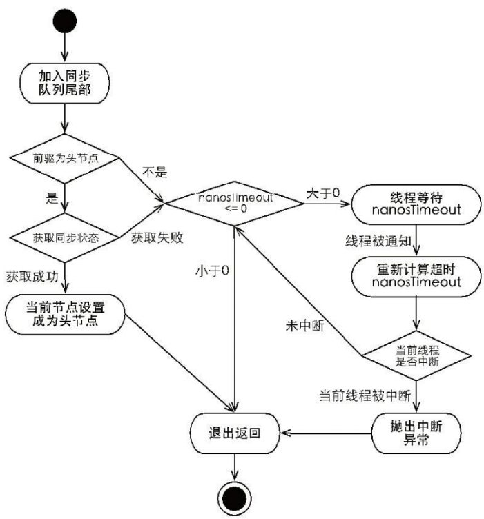

独占式超时获取同步状态 `doAcquireNanos(int arg,long nanosTimeout)` 和独占式获取同步状态 `acquire(int args)` 在流程上非常相似，其主要区别在于未获取到同步状态时的处理逻辑。**`acquire(int args)` 在未获取到同步状态时，将会使当前线程一直处于等待状态，而 `doAcquireNanos(int arg,long nanosTimeout)` 会使当前线程等待 nanosTimeout 纳秒，如果当前线程在 nanosTimeout 纳秒内没有获取到同步状态，将会从等待逻辑中自动返回。**


#### 5）自定义同步组件——TwinsLock

//待补充


## 5.3 重入锁 ReentrantLock

**重入锁 ReentrantLock**是**支持重进入的锁，它表示该锁能够支持一个线程对资源的重复加锁。**除此之外，该锁的还支持获取锁时的公平和非公平性选择。 

>回顾独占锁 Mutex，考虑如下场景：当一个线程调用 Mutex（独占锁）的 `lock()` 方法获取锁之后，如果再次调用 `lock()` 方法，则该线程将会被自己所阻塞，原因是 Mutex 在实现 `tryAcquire(int acquires)` 方法时没有考虑占有锁的线程再次获取锁的场景，而在调用 `tryAcquire(int acquires)` 方法时返回了 false，导致该线程被阻塞。简单地说，Mutex 是一个不支持重进入的锁。而 **synchronized 关键字隐式的支持重进入**，比如一个 synchronized 修饰的递归方法，在方法执行时，执行线程在获取了锁之后仍能连续多次地获得该锁，而不像 Mutex 由于获取了锁，而在下一次获取锁时出现阻塞自己的情况。


ReentrantLock 虽然没能像 synchronized 关键字一样支持隐式的重进入，但是**在调用 `lock()` 方法时，已经获取到锁的线程，能够再次调用 `lock()` 方法获取锁而不被阻塞。**这里提到一个锁获取的公平性问题，**如果在绝对时间上，先对锁进行获取的请求一定先被满足，那么这个锁是公平的，反之，是不公平的。**公平的获取锁，也就是等待时间最长的线程最优先获取锁，也可以说锁获取是**顺序**的。ReentrantLock 提供了一个构造函数，能够控制锁是否是公平的。

>事实上，公平的锁机制往往没有非公平的效率高，但是，并不是任何场景都是以 TPS 作为唯一的指标，**公平锁能够减少“饥饿”发生的概率，等待越久的请求越是能够得到优先满足。** 


### 1）实现重进入

重进入是指**任意线程在获取到锁之后能够再次获取该锁而不会被锁所阻塞**，该特性的实现需要解决以下两个问题：

- **线程再次获取锁**。锁需要去识别获取锁的线程是否为当前占据锁的线程，如果是，则再次成功获取。 

- **锁的最终释放**。线程重复 n 次获取了锁，随后在第 n 次释放该锁后，其他线程能够获取到该锁。锁的最终释放要求锁对于获取进行计数自增，计数表示当前锁被重复获取的次数，而锁被释放时，计数自减，当计数等于 0 时表示锁已经成功释放。


ReentrantLock 是通过**组合自定义同步器来实现锁的获取与释放**，以非公平性（默认的）实现为例，获取同步状态的代码如下所示：

ReentrantLock 的 nonfairTryAcquire 方法：

```java
final boolean nonfairTryAcquire(int acquires) {
    final Thread current = Thread.currentThread();
    int c = getState();
    if (c == 0) {
        if (compareAndSetState(0, acquires)) {
            setExclusiveOwnerThread(current);
            return true;
        }
    } else if (current == getExclusiveOwnerThread()) {
        int nextc = c + acquires;
        if (nextc < 0) throw new Error("Maximum lock count exceeded");
        setState(nextc);
        return true;
    }
    return false; 
}
```

该方法增加了再次获取同步状态的处理逻辑：**通过判断当前线程是否为获取锁的线程来决定获取操作是否成功，如果是获取锁的线程再次请求，则将同步状态值进行增加并返回 true，表示获取同步状态成功。成功获取锁的线程再次获取锁，只是增加了同步状态值，这也就要求 ReentrantLock 在释放同步状态时减少同步状态值**，该方法的代码如下所示：

ReentrantLock 的 tryRelease 方法：

```java
protected final boolean tryRelease(int releases) {
    int c = getState() - releases;
    if (Thread.currentThread() != getExclusiveOwnerThread()) throw new 
    IllegalMonitorStateException();
    boolean free = false;
    if (c == 0) {
        free = true;
        setExclusiveOwnerThread(null);
    }
    setState(c);
    return free;
}
```

**如果该锁被获取了 n 次，那么前(n-1)次 `tryRelease(int releases)` 方法必须返回 false，而只有同步状态完全释放了，才能返回 true。**可以看到，该方法将同步状态是否为 0 作为最终释放的条件，当同步状态为 0 时，将占有线程设置为 null，并返回 true，表示释放成功。 


### 2）公平与非公平获取锁的区别

公平性与否是针对**获取锁**而言的，如果一个锁是公平的，那么锁的获取顺序就应该符合请求的绝对时间顺序，也就是 FIFO。 

对于非公平锁，只要 CAS 设置同步状态成功，则表示当前线程获取了锁，而公平锁则不同，如代码清单所示。 

ReentrantLock 的 tryAcquire 方法：

```java
protected final boolean tryAcquire(int acquires) {
    final Thread current = Thread.currentThread();
    int c = getState();
    if (c == 0) {
        if (!hasQueuedPredecessors() && compareAndSetState(0, acquires)) {
            setExclusiveOwnerThread(current);
            return true;
        }
    } else if (current == getExclusiveOwnerThread()) {
        int nextc = c + acquires;
        if (nextc < 0) throw new Error("Maximum lock count exceeded");
        setState(nextc);
        return true;
    }
    return false; 
}
```

该方法与 `nonfairTryAcquire(int acquires)` 比较，唯一不同的位置为判断条件多了 `hasQueuedPredecessors()` 方法，即加入了同步队列中当前节点是否有前驱节点的判断，如果该方法返回 true，则表示有线程比当前线程更早地请求获取锁，因此需要等待前驱线程获取并释放锁之后才能继续获取锁。

***

下面编写一个测试来观察公平和非公平锁在获取锁时的区别，在测试用例中定义了内部类 ReentrantLock2，该类主要公开了 `getQueuedThreads()` 方法，该方法返回正在等待获取锁的线程列表，由于列表是逆序输出，为了方便观察结果，将其进行反转，测试用例如代码清单所示：

FairAndUnfairTest.java：

```java
public class FairAndUnfairTest {
    private static Lock fairLock = new ReentrantLock2(true);
    private static Lock unfairLock = new ReentrantLock2(false);
    
    @Test
    public void fair() {
    	testLock(fairLock);
    }
    
    @Test
    public void unfair() {
    	testLock(unfairLock);
    }
    private void testLock(Lock lock) {
    	// 启动 5 个 Job（略）
    }
    
    private static class Job extends Thread {
        private Lock lock;
        public Job(Lock lock) {
        	this.lock = lock;
        }
         public void run() {
        	// 连续 2 次打印当前的 Thread 和等待队列中的 Thread（略）
        }
    }
    
    private static class ReentrantLock2 extends ReentrantLock {
        public ReentrantLock2(boolean fair) {
        	super(fair);
        }
        public Collection<Thread> getQueuedThreads() {
            List<Thread> arrayList = new ArrayList<Thread>(super.
             getQueuedThreads());
            Collections.reverse(arrayList);
            return arrayList;
        }
    } 
}
```

分别运行 `fair()` 和 `unfair()` 两个测试方法，输出结果如下表所示：


观察上表所示的结果（其中每个数字代表一个线程），**公平性锁每次都是从同步队列中的第一个节点获取到锁，而非公平性锁出现了一个线程连续获取锁的情况。** 

为什么会出现线程连续获取锁的情况呢？回顾 `nonfairTryAcquire(int acquires)` 方法，**当一个线程请求锁时，只要获取了同步状态即成功获取锁。在这个前提下，刚释放锁的线程再次获取同步状态的几率会非常大，使得其他线程只能在同步队列中等待。**


> 非公平性锁可能使线程“饥饿”，为什么它又被设定成默认的实现呢？

再次观察上表的结果，如果把每次不同线程获取到锁定义为 1 次切换，公平性锁在测试中进行了 10 次切换，而非公平性锁只有 5 次切换，这说明**非公平性锁的开销更小。公平性锁保证了锁的获取按照 FIFO 原则，而代价是进行大量的线程切换。非公平性锁虽然可能造成线程“饥饿”，但极少的线程切换，保证了其更大的吞吐量。**


## 5.4 读写锁

前面提到的锁（如 Mutex 和 ReentrantLock）基本都是**排他锁**，这些锁**在同一时刻只允许一个线程进行访问**，而**读写锁在同一时刻可以允许多个读线程访问，但是在写线程访问时，所有的读线程和其他写线程均被阻塞。**读写锁维护了一对锁，一个读锁和一个写锁，通过分离读锁和写锁，使得并发性相比一般的排他锁有了很大提升。 


除了保证写操作对读操作的可见性以及并发性的提升之外，读写锁能够**简化读写交互场景的编程方式**。

> 假设在程序中定义一个共享的用作缓存的数据结构，它大部分时间提供读服务（例如查询和搜索），而写操作占有的时间很少，但是写操作完成之后的更新需要对后续的读服务可见。 

- 在没有读写锁支持的（Java 5 之前）时候，如果需要完成上述工作就要使用 Java 的等待通知机制，就是当写操作开始时，所有晚于写操作的读操作均会进入等待状态，只有写操作完成并进行通知之后，所有等待的读操作才能继续执行（写操作之间依靠 synchronized 关键字进行同步），这样做的目的是使读操作能读取到正确的数据，不会出现脏读。

- 改用读写锁实现上述功能，只需要在读操作时获取读锁，写操作时获取写锁即可。当写锁被获取到时，后续（非当前写操作线程）的读写操作都会被阻塞，写锁释放之后，所有操作继续执行，编程方式相对于使用等待通知机制的实现方式而言，变得简单明了。


一般情况下，读写锁的性能都会比排他锁好，因为大多数场景读是多于写的。**在读多于写的情况下，读写锁能够提供比排它锁更好的并发性和吞吐量。**Java 并发包提供读写锁的实现是 **ReentrantReadWriteLock**，它提供的特性如下表所示：

 


### 5.4.1 读写锁的接口与示例

**ReadWriteLock** 仅定义了获取读锁和写锁的两个方法，即 `readLock()` 方法和 `writeLock()` 方法，而其实现—— **ReentrantReadWriteLock**，除了接口方法之外，还提供了一些便于外界监控其内部工作状态的方法，这些方法以及描述如下表所示：

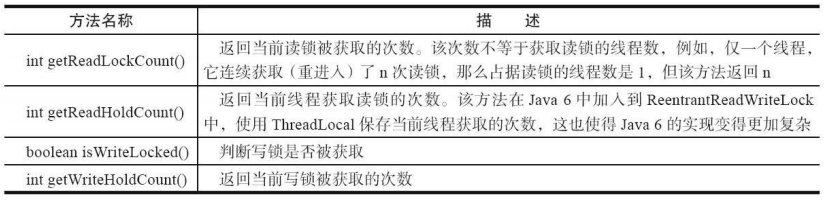


下面通过一个缓存示例说明读写锁的使用方式，示例代码如下所示：

Cache.java：

```java
public class Cache {
    static Map<String, Object> map = new HashMap<String, Object>();
    static ReentrantReadWriteLock rwl = new ReentrantReadWriteLock();
    static Lock r = rwl.readLock();
    static Lock w = rwl.writeLock(); // 获取一个 key 对应的 value
    
    public static final Object get(String key) {
        r.lock();
        try {
        	return map.get(key);
        } finally {
        	r.unlock();
        }
    }
    
    // 设置 key 对应的 value，并返回旧的 value
    public static final Object put(String key, Object value) {
        w.lock();
        try {
        	return map.put(key, value);
        } finally {
        	w.unlock();
        }
    }
    
    // 清空所有的内容
    public static final void clear() {
        w.lock();
        try {
        	map.clear();
        } finally {
        	w.unlock();
        }
    } 
}
```

Cache 组合一个非线程安全的 HashMap 作为缓存的实现，同时使用读写锁的读锁和写锁来保证 Cache 是线程安全的。在读操作 `get(String key)` 方法中，需要获取读锁，这使得**并发访问该方法时不会被阻塞**。写操作 `put(String key,Object value)` 方法和 `clear()` 方法，在更新 HashMap 时必须提前获取写锁，当获取写锁后，其他线程对于读锁和写锁的获取均被阻塞，而只有写锁被释放之后，其他读写操作才能继续。Cache 使用读写锁提升读操作的并发性，也保证每次写操作对所有的读写操作的可见性，同时简化了编程方式。 


### 5.4.2 读写锁的实现分析

> **ReentrantReadWriteLock**

#### 1）读写状态的设计

读写锁同样依赖**自定义同步器**来实现同步功能，而读写状态就是其同步器的同步状态。 

>回想 ReentrantLock 中自定义同步器的实现，同步状态表示锁被一个线程重复获取的次数；而读写锁的自定义同步器需要**在同步状态（一个整型变量）上维护多个读线程和一个写线程的状态**，使得该状态的设计成为读写锁实现的关键。 


如果在一个整型变量上维护多种状态，就一定需要“**按位切割使用**”这个变量，读写锁将变量切分成了两个部分，**高 16 位表示读，低 16 位表示写**，划分方式如图所示：

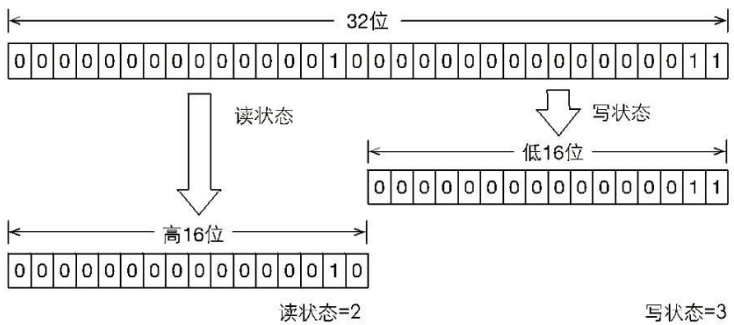

上图读写锁状态的划分方式当前同步状态表示一个线程已经获取了写锁，且重进入了两次，同时也连续获取了两次读锁。

读写锁是如何迅速确定读和写各自的状态呢？答案是通过**位运算**。假设当前同步状态值为 S，写状态等于 `S&0x0000FFFF`（将高 16 位全部抹去），读状态等于 `S>>>16`（无符号补 0 右移 16 位）。当写状态增加 1 时，等于 `S+1`，当读状态增加 1 时，等于 `S+(1<<16)`，也就是 `S+0x00010000`。 

根据状态的划分能得出一个推论：S 不等于 0 时，当写状态（`S&0x0000FFFF`）等于 0 时，则读状态（`S>>>16`）大于 0，即读锁已被获取。


#### 2）写锁的获取与释放

**写锁是一个支持重进入的排他锁**。**如果当前线程已经获取了写锁，则增加写状态。如果当前线程在获取写锁时，读锁已经被获取（读状态不为 0）或者该线程不是已经获取写锁的线程，则当前线程进入等待状态**，获取写锁的代码如下所示：

ReentrantReadWriteLock 的 tryAcquire 方法：

```java
protected final boolean tryAcquire(int acquires) {
    Thread current = Thread.currentThread();
    int c = getState();
    int w = exclusiveCount(c);
    if (c != 0) {
        // 存在读锁或者当前获取线程不是已经获取写锁的线程
        if (w == 0 || current != getExclusiveOwnerThread()) return false;
        if (w + exclusiveCount(acquires) > MAX_COUNT) throw new Error("Maximum lock 
        count exceeded");
        setState(c + acquires);
        return true;
    }
    if (writerShouldBlock() || !compareAndSetState(c, c + acquires)) {
    	return false;
    }
    setExclusiveOwnerThread(current);
    return true; 
}
```

该方法除了重入条件（当前线程为获取了写锁的线程）之外，增加了一个读锁是否存在的判断。如果存在读锁，则写锁不能被获取，原因在于：**读写锁要确保写锁的操作对读锁可见，如果允许读锁在已被获取的情况下对写锁的获取，那么正在运行的其他读线程就无法感知到当前写线程的操作。**因此，只有等待其他读线程都释放了读锁，写锁才能被当前线程获取，而写锁一旦被获取，则其他读写线程的后续访问均被阻塞。 

写锁的释放与 ReentrantLock 的释放过程基本类似，**每次释放均减少写状态，当写状态为 0 时表示写锁已被释放，从而等待的读写线程能够继续访问读写锁，同时前次写线程的修改对后续读写线程可见。**


#### 3）读线程的获取与释放

**读锁是一个支持重进入的共享锁**，它能够被多个线程同时获取，在没有其他写线程访问（或者写状态为 0）时，读锁总会被成功地获取，而所做的也只是（线程安全的）增加读状态。**如果当前线程已经获取了读锁，则增加读状态。如果当前线程在获取读锁时，写锁已被其他线程获取，则进入等待状态。**

> 获取读锁的实现从 Java 5 到 Java 6 变得复杂许多，主要原因是新增了一些功能，例如 `getReadHoldCount()` 方法，作用是返回当前线程获取读锁的次数。

**读状态是所有线程获取读锁次数的总和，而每个线程各自获取读锁的次数只能选择保存在 ThreadLocal 中，由线程自身维护**，这使获取读锁的实现变得复杂。因此，这里将获取读锁的代码做了删减，保留必要的部分，如代码清单所示：

ReentrantReadWriteLock 的 tryAcquireShared 方法：

```java
protected final int tryAcquireShared(int unused) {
    for (; ; ) {
        int c = getState();
        int nextc = c + (1 << 16);
        if (nextc < c) throw new Error("Maximum lock count exceeded");
        if (exclusiveCount(c) != 0 && owner != Thread.currentThread()) return -1;
        if (compareAndSetState(c, nextc)) return 1;
    } 
}
```

在 `tryAcquireShared(int unused)` 方法中，如果其他线程已经获取了写锁，则当前线程获取读锁失败，进入等待状态。如果当前线程获取了写锁或者写锁未被获取，则当前线程（线程安全，依靠 CAS 保证）增加读状态，成功获取读锁。 

**读锁的每次释放（线程安全的，可能有多个读线程同时释放读锁）均减少读状态，减少的值是（`1<<16`）。** 


#### 4）锁降级

锁降级指的是**写锁降级成为读锁**。如果当前线程拥有写锁，然后将其释放，最后再获取读锁，这种分段完成的过程不能称之为锁降级。锁降级是指**把持住（当前拥有的）写锁，再获取到读锁，随后释放（先前拥有的）写锁的过程。** 


下面看一个锁降级的示例。因为数据不常变化，所以多个线程可以并发地进行数据处理，当数据变更后，如果当前线程感知到数据变化，则进行数据的准备工作，同时其他处理线程被阻塞，直到当前线程完成数据的准备工作，如代码清单所示：

processData 方法：

```java
public void processData() {
    readLock.lock();
    if (!update) {
        // 必须先释放读锁
        readLock.unlock();
        // 锁降级从写锁获取到开始
        writeLock.lock();
        try {
            if (!update) {
            // 准备数据的流程（略）
            update = true;
            }
            readLock.lock();
        } finally {
        	writeLock.unlock();
        }
        // 锁降级完成，写锁降级为读锁
    }
    try { // 使用数据的流程（略）
    } finally {
    	readLock.unlock();
    } 
}
```

上述示例中，当数据发生变更后，update 变量（布尔类型且 volatile 修饰）被设置为 false，此时所有访问 `processData()` 方法的线程都能够感知到变化，但只有一个线程能够获取到写锁，其他线程会被阻塞在读锁和写锁的 `lock()` 方法上。当前线程获取写锁完成数据准备之后，再获取读锁，随后释放写锁，完成锁降级。 

锁降级中读锁的获取是否必要呢？答案是必要的。主要是**为了保证数据的可见性，如果当前线程不获取读锁而是直接释放写锁，假设此刻另一个线程（记作线程 T）获取了写锁并修改了数据，那么当前线程无法感知线程 T 的数据更新。如果当前线程获取读锁，即遵循锁降级的步骤，则线程 T 将会被阻塞，直到当前线程使用数据并释放读锁之后，线程 T 才能获取写锁进行数据更新。**


> RentrantReadWriteLock 不支持锁升级（把持读锁、获取写锁，最后释放读锁的过程）。目的也是保证数据可见性，如果读锁已被多个线程获取，其中任意线程成功获取了写锁并更新了数据，则其更新对其他获取到读锁的线程是不可见的。 


## 5.5 LockSupport 工具

当需要阻塞或唤醒一个线程的时候，都会使用 LockSupport 工具类来完成相应工作。LockSupport 定义了一组的公共静态方法，这些方法提供了最基本的线程阻塞和唤醒功能，而 LockSupport 也成为构建同步组件的基础工具。 

LockSupport 定义了一组以 `park` 开头的方法用来阻塞当前线程，以及 `unpark(Thread thread)` 方法来唤醒一个被阻塞的线程。这些方法以及描述如下表所示：

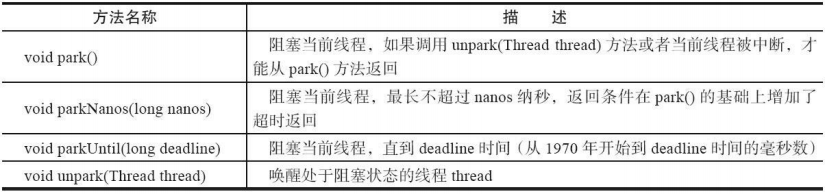 

在 Java 6 中，LockSupport 增加了 `park(Object blocker)`、`parkNanos(Object blocker,long nanos)` 和 `parkUntil(Object blocker,long deadline)` 3 个方法，用于实现阻塞当前线程的功能，其中**参数 blocker 是用来标识当前线程在等待的对象（以下称为阻塞对象），该对象主要用于问题排查和系统监控。** 


blocker 在线程 线程 dump 中的作用：

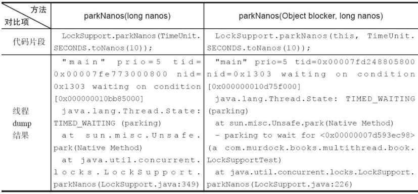

从表中的线程 dump 结果可以看出，代码片段的内容都是阻塞当前线程 10 秒，但从线程 dump 结果可以看出，有阻塞对象的 `parkNanos` 方法能够传递给开发人员更多的现场信息。

> 这是由于在 Java 5 之前，当线程阻塞（使用 synchronized 关键字）在一个对象上时，通过线程 dump 能够查看到该线程的阻塞对象，方便问题定位，而 Java 5 推出的 Lock 等并发工具时却遗漏了这一点，致使在线程 dump 时无法提供阻塞对象的信息。因此，在 Java 6 中，LockSupport 新增了上述 3 个含有阻塞对象的 park 方法，用以替代原有的 park 方法。


## 5.6 Condition 接口

> 任意一个 Java 对象，都拥有一组监视器方法（定义在 java.lang.Object 上），主要包括 `wait()`、 `wait(long timeout)`、`notify()` 以及 `notifyAll()` 方法，这些方法与 synchronized 同步关键字配合，可以实现等待/通知模式。Condition 接口也提供了类似 Object 的监视器方法，与 Lock 配合可以实现等待/通知模式，但是这两者在使用方式以及功能特性上还是有差别的。 


通过对比 Object 的监视器方法和 Condition 接口，可以更详细地了解 Condition 的特性，对比项与结果如下表所示：

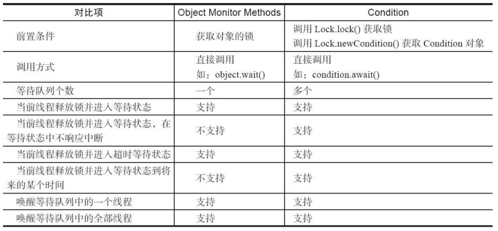


### 5.6.1 Condition 接口与示例

Condition 定义了等待/通知两种类型的方法，当前线程调用这些方法时，需要提前获取到 Condition 对象关联的锁。Condition 对象是由 Lock 对象（调用 Lock 对象的 `newCondition()` 方法）创建出来的，换句话说，**Condition 是依赖 Lock 对象的**。 


Condition 的使用方式比较简单，需要注意**在调用方法前获取锁**，使用方式如代码清单所示：
ConditionUseCase.java：

```java
Lock lock = new ReentrantLock();
Condition condition = lock.newCondition();

public void conditionWait() throws InterruptedException {
    lock.lock();
    try {
    	condition.await();
    } finally {
    	lock.unlock();
    } 
}

public void conditionSignal() throws InterruptedException {
    lock.lock();
    try {
    	condition.signal();
    } finally {
    	lock.unlock();
    } 
}
```

如示例所示，**一般都会将 Condition 对象作为成员变量。**当调用 `await()` 方法后，当前线程会释放锁并在此等待，而其他线程调用 Condition 对象的 `signal()` 方法，通知当前线程后，当前线程才从 `await()` 方法返回，并且在返回前已经获取了锁。

Condition 定义的（部分）方法以及描述如下表所示： 

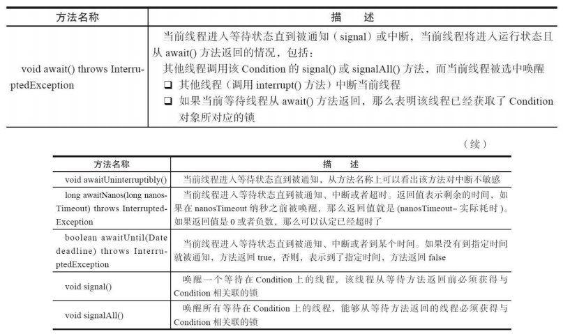


***

获取一个 Condition 必须通过 Lock 的 `newCondition()` 方法。下面通过一个**有界队列**的示例来深入了解 Condition 的使用方式。有界队列是一种特殊的队列，**当队列为空时，队列的获取操作将会阻塞获取线程，直到队列中有新增元素，当队列已满时，队列的插入操作将会阻塞插入线程，直到队列出现“空位”**，如代码清单所示。 

BoundedQueue.java：

```java
public class BoundedQueue<T> {
    private Object[] items;
    // 添加的下标，删除的下标和数组当前数量
    private int addIndex, removeIndex, count;
    private Lock lock = new ReentrantLock();
    private Condition notEmpty = lock.newCondition();
    private Condition notFull = lock.newCondition();
    
    public BoundedQueue(int size) {
    	items = new Object[size];
    }
    
    // 添加一个元素，如果数组满，则添加线程进入等待状态，直到有"空位"
    public void add(T t) throws InterruptedException {
        lock.lock();
        try {
            while (count == items.length) notFull.await();
            items[addIndex] = t;
            if (++addIndex == items.length) addIndex = 0;
            ++count;
            notEmpty.signal();
        } finally {
        	lock.unlock();
        }
    }
    
    // 由头部删除一个元素，如果数组空，则删除线程进入等待状态，直到有新添加元素
    @SuppressWarnings("unchecked")
    public T remove() throws InterruptedException {
        lock.lock();
        try {
            while (count == 0) notEmpty.await();
            Object x = items[removeIndex];
            if (++removeIndex == items.length) removeIndex = 0;
            --count;
            notFull.signal();
            return (T) x;
        } finally {
        	lock.unlock();
        }
    } 
}
```

BoundedQueue 通过 `add(T t)` 方法添加一个元素，通过 `remove()` 方法移出一个元素。以添加方法为例：

首先需要获得锁，目的是确保数组修改的可见性和排他性。当数组数量等于数组长度时，表示数组已满，则调用 `notFull.await()`，当前线程随之释放锁并进入等待状态。如果数组数量不等于数组长度，表示数组未满，则添加元素到数组中，同时通知等待在 notEmpty 上的线程，数组中已经有新元素可以获取。

> 在添加和删除方法中使用 while 循环而非 if 判断，目的是防止过早或意外的通知，只有条件符合才能够退出循环。回想之前提到的等待/通知的经典范式，二者是非常类似的。


### 5.6.2 Condition 的实现分析

**ConditionObject** 是同步器 **AbstractQueuedSynchronizer** 的内部类，因为 Condition 的操作需要获取相关联的锁，所以作为同步器的内部类也较为合理。**每个 Condition 对象都包含着一个队列**（以下称为**等待队列**），该队列是 Condition 对象实现等待/通知功能的关键。


#### 1）等待队列

等待队列是一个 **FIFO** 的队列，在队列中的每个节点都包含了一个线程引用，该线程就是在 Condition 对象上等待的线程，如果一个线程调用了 `Condition.await()` 方法，那么该线程将会释放锁、构造成节点加入等待队列并进入等待状态。事实上，节点的定义复用了同步器中节点的定义，也就是说，**同步队列和等待队列中节点类型都是同步器的静态内部类 AbstractQueuedSynchronizer.Node**。

**一个 Condition 包含一个等待队列**，Condition 拥有首节点（firstWaiter）和尾节点（lastWaiter）。当前线程调用 `Condition.await()` 方法，将**会以当前线程构造节点，并将节点从尾部加入等待队列**，等待队列的基本结构如图所示：

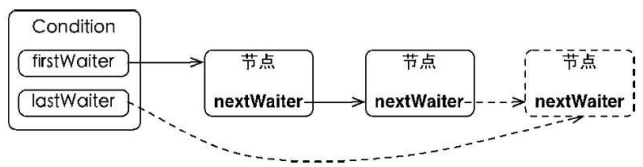

Condition 拥有首尾节点的引用，而新增节点只需要将原有的尾节点 nextWaiter 指向它，并且更新尾节点即可。上述节点引用更新的过程并没有使用 CAS 保证，原因在于**调用 `await()` 方法的线程必定是获取了锁的线程，也就是说该过程是由锁来保证线程安全的。** 


在 Object 的监视器模型上，一个对象拥有一个同步队列和等待队列，而**并发包中的 Lock（更确切地说是同步器）拥有一个同步队列和多个等待队列**，其对应关系如下图所示：

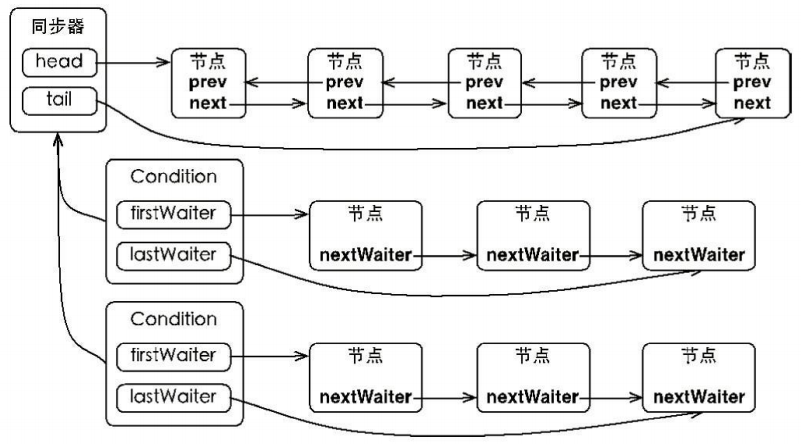

> 如图所示，Condition 的实现是同步器的内部类，因此每个 Condition 实例都能够访问同步器提供的方法，相当于每个 Condition 都拥有所属同步器的引用。


#### 2）等待

调用 Condition 的 `await()` 方法（或者以 await 开头的方法），会使当前线程进入等待队列并释放锁，同时线程状态变为等待状态。当从 `await()` 方法返回时，当前线程一定获取了 Condition 相关联的锁。如果从队列（同步队列和等待队列）的角度看 `await()` 方法，当调用 `await()` 方法时，相当于同步队列的首节点（获取了锁的节点）移动到 Condition 的等待队列中。 


Condition 的 `await()` 方法，如代码清单所示：

ConditionObject 的 await 方法：

```java
public final void await() throws InterruptedException {
     if (Thread.interrupted()) throw new InterruptedException();
     // 当前线程加入等待队列
     Node node = addConditionWaiter();
     // 释放同步状态，也就是释放锁
     int savedState = fullyRelease(node);
     int interruptMode = 0;
     while (!isOnSyncQueue(node)) {
         LockSupport.park(this);
         if ((interruptMode = checkInterruptWhileWaiting(node)) != 0) break;
     }
     if (acquireQueued(node, savedState) && interruptMode != THROW_IE) interruptMode 
    = REINTERRUPT;
     if (node.nextWaiter != null) unlinkCancelledWaiters();
     if (interruptMode != 0) reportInterruptAfterWait(interruptMode);
}
```

**调用该方法的线程是成功获取了锁的线程，也就是同步队列中的首节点，该方法会将当前线程构造成节点并加入等待队列中，然后释放同步状态，唤醒同步队列中的后继节点，然后当前线程会进入等待状态。** 

当等待队列中的节点被唤醒，则唤醒节点的线程开始尝试获取同步状态。如果不是通过其他线程调用 `Condition.signal()` 方法唤醒，而是对等待线程进行中断，则会抛出 InterruptedException。 


如果从队列的角度去看，当前线程加入 Condition 的等待队列，该过程如下面图示。同步队列的首节点并不会直接加入等待队列，而是通过 `addConditionWaiter()` 方法把当前线程构造成一个新的节点并将其加入等待队列中。

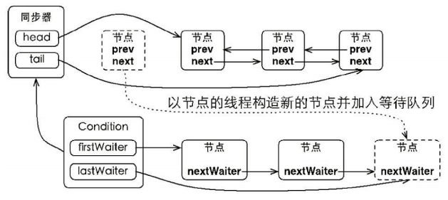


#### 3）通知

调用 Condition 的 `signal()` 方法，将会唤醒在等待队列中**等待时间最长**的节点（**首节点**），**在唤醒节点之前，会将节点移到同步队列中。**

Condition 的 `signal()` 方法，如代码清单所示：

ConditionObject 的 signal 方法：

```java
public final void signal() {
    if (!isHeldExclusively()) throw new IllegalMonitorStateException();
    Node first = firstWaiter;
    if (first != null) doSignal(first);
}
```

调用该方法的前置条件是**当前线程必须获取了锁**，可以看到 `signal()` 方法进行了 `isHeldExclusively()` 检查，也就是当前线程必须是获取了锁的线程。**接着获取等待队列的首节点，将其移动到同步队列并使用 LockSupport 唤醒节点中的线程。**节点从等待队列移动到同步队列的过程如图所示：

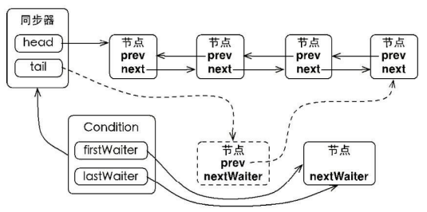

通过调用同步器的 `enq(Node node)` 方法，等待队列中的头节点线程安全地移动到同步队列。当节点移动到同步队列后，当前线程再使用 LockSupport 唤醒该节点的线程。 

被唤醒后的线程，将从 `await()` 方法中的 while 循环中退出（`isOnSyncQueue(Node node)` 方法返回 true，节点已经在同步队列中），进而调用同步器的 `acquireQueued()` 方法加入到获取同步状态的竞争中。

成功获取同步状态（或者说锁）之后，被唤醒的线程将从先前调用的 `await()` 方法返回，此时该线程已经成功地获取了锁。

Condition 的 `signalAll()` 方法，相当于对等待队列中的每个节点均执行一次 `signal()` 方法，效果就是将等待队列中所有节点全部移动到同步队列中，并唤醒每个节点的线程。

