Java集合

> From Mars
>
> 注：笔记内容部分参考自 java3y、帅地玩编程

# 目录大纲

[TOC]

Java 集合，也称作容器，主要是由`两大接口 (Interface)` 派生出来的：`Collection `和` Map`

顾名思义，容器就是用来存放数据的。

那么这两大接口的不同之处在于：

- Collection 存放**单一元素**
- Map 存放 **key-value 键值对**


# Collection

## 一、集合(Collection)概述

### 1. 为什么需要 Collection？

Java是一门面向对象的语言，就免不了处理对象；为了方便操作**多个对象**，就得把这多个对象存储起来；想要存储多个对象(变量)，就需要一个**容器**；常用的容器有：StringBuffered、数组（虽然有对象数组，但是数组的长度是不可变的！）

所以，Java就为我们提供了**集合**(Collection)


### 2. 数组和集合的区别

- 1:长度上

- - **数组的长度固定**
  - **集合的长度可变**

- 2:内容上

- - 数组存储的是**同一种类型**的元素
  - 集合可以存储**不同类型**的元素（但是一般我们不这样干...）

- 3:元素的数据类型上

- - 数组可以存储基本数据类型，也可以存储引用类型
  - **集合只能存储引用类型（如果存储的是简单的int，它会自动装箱成Integer）**


### 3. Collection 的结构体系

集合可以存储多个元素，但我们对多个元素也有不同的需求 ：

- 多个元素，不能有重复相同的 
- 多个元素，能够按照某个规则排序 

针对不同的需求，java 就提供了很多集合类，多个集合类的数据结构不同。但是，结构不重要，重要的是能够存储东西，能够判断、获取 

把集合共性的内容不断往上提取，最终形成集合的继承体系——Collection

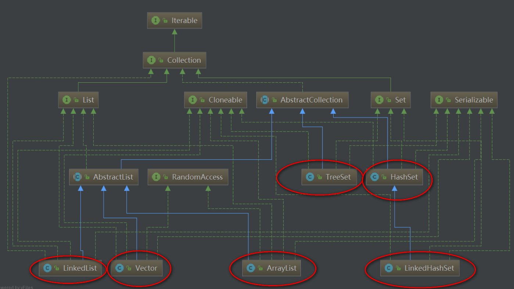

Java 提供多种集合类，它们的底层数据结构不同。但是，它们却有共性的内容（存储、获取、判断等），通过不断向上提取，就能得到一个集合的继承体系结构，这个结构的根就是：**Collection**


### 4. Collection 的基础功能

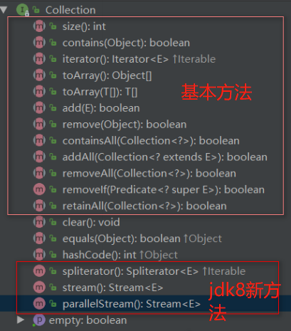

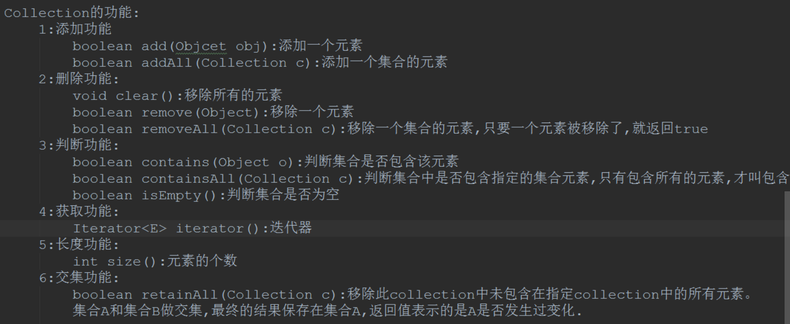


## 二、迭代器(Iterator)

可以发现，在 Collection 的源码中**继承**了 **Iterable**，有 **iterator()** 这个方法

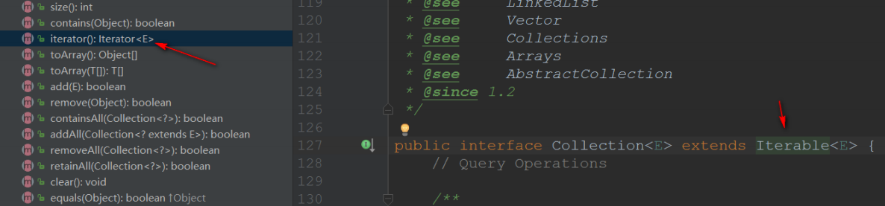

追踪 Iterable，发现其实它是一个**接口**：

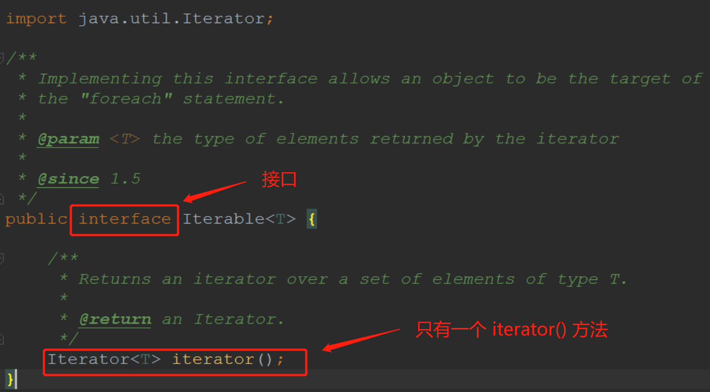

iterator() 方法返回的是 **Iterator**

再来看⼀下，**Iterator 也是⼀个接口**，它只有三个方法： 

- **hasNext()** 
- **next()** 
- **remove()**

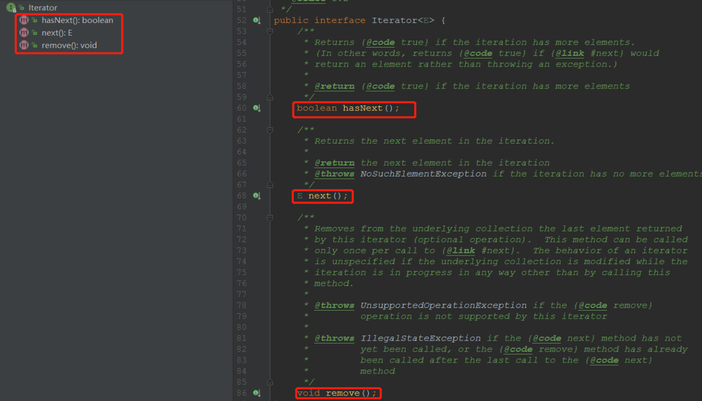

在接口中只有方法的声明，而缺少方法的实现，只能往 Collection 的子类下寻找，这里找到 **ArrayList** 类。

在 ArrayList 下找到了 iterator 实现的身影：它是在ArrayList **以内部类的方式实现**的！

从源码可知：**Iterator **实际上就是在**遍历集合**

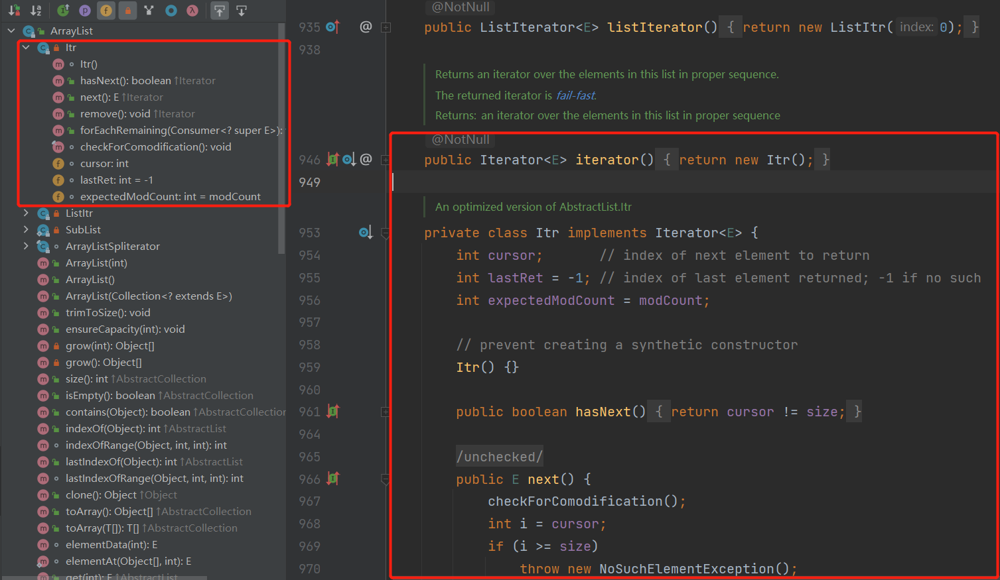

> 我们遍历集合**(Collection)**的元素都可以使用 **Iterator**，至于它的具体实现是以**内部类**的方式实现的！


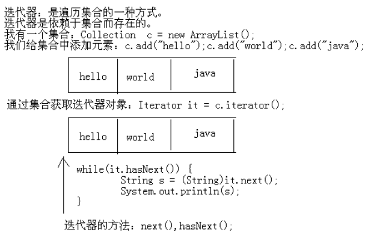

**集合的使用步骤：**

1. 创建集合对象
2. 创建元素对象
3. 把元素添加到集合中
4. 遍历集合
   1. 通过集合对象获取迭代器对象
   2. 通过迭代器对象的 hasNext() 方法判断是否有元素
   3. 通过迭代器对象的 next() 方法获取元素并移动到下一位置


**迭代器为什么不定义成一个类，而是一个接口？**

> Java 中提供了很多种集合类，而这些集合类的底层数据结构是不同的，进而对其存储和遍历的方式也应该是不同的；
>
> 无论是哪种集合，都应该具备获取元素的操作，并且最好附加上判断功能，这样在获取元素前先进行判断可以避免出错。也就是说，判断功能和获取功能应该是遍历一个集合所必需的，而每种集合的实现方式又不太一样，所以把这些功能提取出来作为接口中方法的声明更有优势。


## 三、List 集合

### 1. List 集合概述

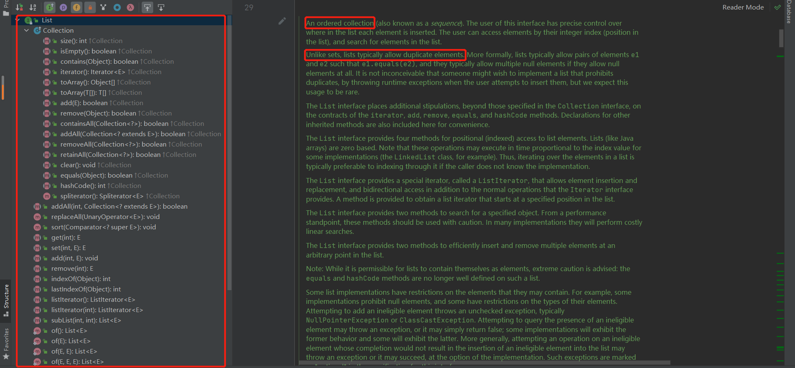

List 集合的**特点**就是：**有序（存储顺序和取出顺序一致），元素可重复**


Collection 返回的是 Iterator 迭代器接口，⽽ List 中⼜有它自己对应的实现—— **ListIterator** 接口 

该接口比普通的 Iterator 接口多了几个方法：

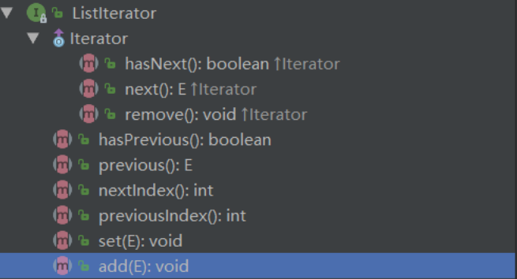

从方法名就可以知道：**ListIterator** 可以往前遍历，添加元素，设置元素


### 2. List 集合常用子类

- **ArrayList** 
  - 底层数据结构是**数组**。线程**不安全** 
- **LinkedList** 
  - 底层数据结构是**链表**。线程**不安全** 
- **Vector** 
  - 底层数据结构是**数组**。线程**安全**


### 3. ArrayList

**类图：**

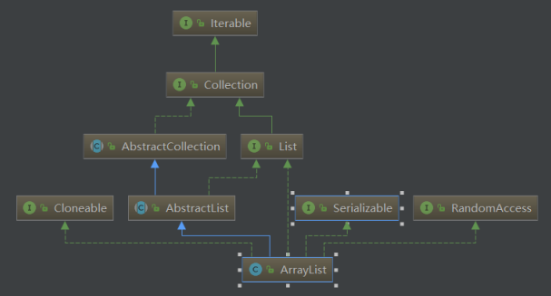

> - 实现了`RandomAccess`接口，可以随机访问
> - 实现了`Cloneable`接口，可以克隆
> - 实现了`Serializable`接口，可以序列化、反序列化
> - 实现了`List`接口，是`List`的实现类之一
> - 实现了`Collection`接口，是`Java Collections Framework`成员之一
> - 实现了`Iterable`接口，可以使用`for-each`迭代


ArrayList 底层是用**数组**实现的存储。

特点：**可自动扩容，查询效率高，增删效率低，线程不安全。**


**ArrayList 类注释释义：**

> - ArrayList 是实现 `List` 接口的可**自动扩容**的数组。实现了所有的 `List` 操作，允许所有的元素，包括 `null` 值。
> - ArrayList 大致和 Vector 相同，除了 ArrayList 是**非同步**的。
> - `size` `isEmpty` `get` `set` `iterator` 和 `listIterator` 方法时间复杂度是`O(1)`，常量时间。其他方法是`O(n)`，线性时间。
> - 每一个 ArrayList 实例都有一个`capacity`（容量）。`capacity`是用于存储列表中元素的数组的大小。`capacity`至少和列表的大小一样大。
> - 如果多个线程同时访问 ArrayList 的实例，并且至少一个线程会修改，必须在外部保证 ArrayList 的同步。修改包括添加删除扩容等操作，仅仅设置值不包括。这种场景可以用其他的一些封装好的同步的`list`。如果不存在这样的`Object`，ArrayList应该用`Collections.synchronizedList`包装起来最好在创建的时候就包装起来，来保证同步访问。
> - `iterator()`和`listIterator(int)`方法是`fail-fast`的，如果在迭代器创建之后，列表进行结构化修改，迭代器会抛出`ConcurrentModificationException`。
> - 面对并发修改，迭代器快速失败、清理，而不是在未知的时间不确定的情况下冒险。请注意，快速失败行为不能被保证。通常来讲，不能同步进行的并发修改几乎不可能做任何保证。因此，写依赖这个异常的程序的代码是错误的，快速失败行为应该仅仅用于防止`bug`。


#### 3.1 ArrayList 的属性

ArrayList 中共有7个属性：

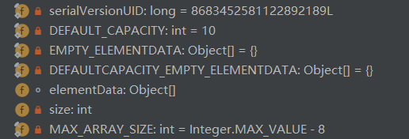

属性解析：

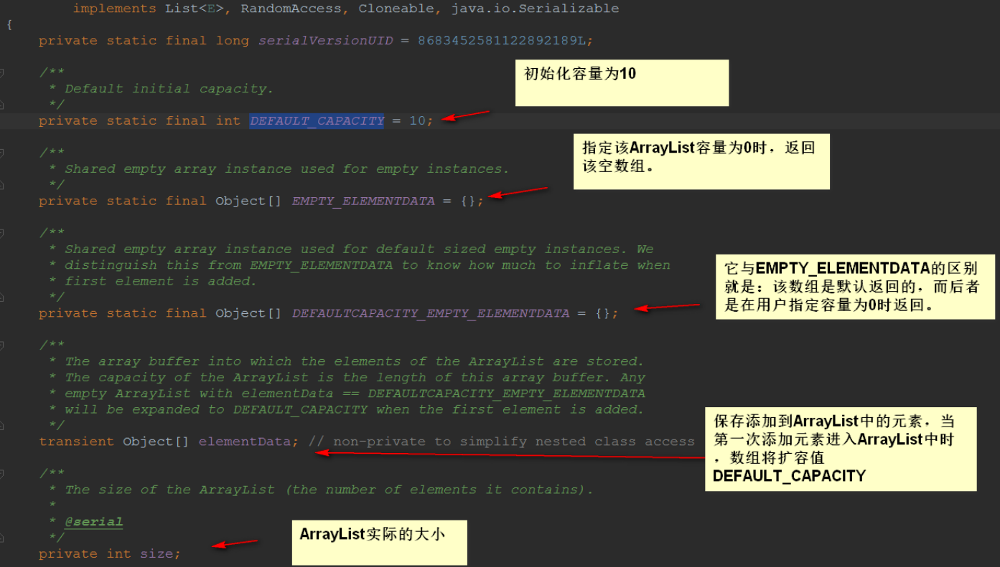

```java
    // 序列化版本UID
    private static final long serialVersionUID = 8683452581122892189L;

    /**
     * 默认的初始容量
     */
    private static final int DEFAULT_CAPACITY = 10;

    /**
     * 用于零容量列表的共享空数组实例
     * new ArrayList(0);
     */
    private static final Object[] EMPTY_ELEMENTDATA = {};

    /**
     * 用于提供默认大小(10)列表的共享空数组实例
     * new ArrayList();
     */
    private static final Object[] DEFAULTCAPACITY_EMPTY_ELEMENTDATA = {};

    /**
     * 存储ArrayList元素的数组缓冲区
     * ArrayList的容量，是数组的长度
     * 
     * non-private to simplify nested class access
     * 非私有以简化嵌套类访问
     */
    transient Object[] elementData;

    /**
     * ArrayList中元素的数量
     */
    private int size;
```

> **transient** 关键字
>
> 1）一旦变量被 transient 修饰，变量将不再是对象持久化的一部分，该变量内容在序列化后无法获得访问。
>
> 2）transient 关键字只能修饰变量，而不能修饰方法和类。注意，本地变量是不能被 transient 关键字修饰的。变量如果是用户自定义类变量，则该类需要实现 Serializable 接口。
>
> 3）被 transient 关键字修饰的变量不再能被序列化，一个静态变量不管是否被 transient 修饰，均不能被序列化。


**ArrayList** 底层其实就是⼀个**数组**，ArrayList 中有**扩容**这么⼀个概念，正因为它扩容，所以它能够**实现“动态”增长**


#### 3.2 构造方法

ArrayList 中有一个无参构造器，两个有参构造器：

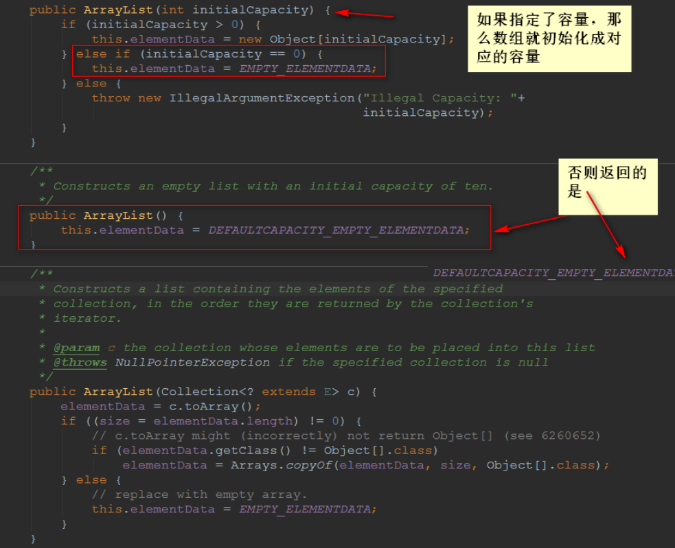


##### 3.2.1 public ArrayList(int initialCapacity)

> 带一个初始容量参数的构造方法 

```java
    /**
     * 构造一个容量为initialCapacity的空列表
     * @param  initialCapacity  人为传入的列表的初始化容量
     * @throws IllegalArgumentException 
     */
    public ArrayList(int initialCapacity) {
        if (initialCapacity > 0) {
            //传入参数>0，则以此容量构造一个空Object数组，赋给底层数组
            this.elementData = new Object[initialCapacity];
        } else if (initialCapacity == 0) {
            //传入参数=0，则将属性中的0容量空数组EMPTY_ELEMENTDATA赋给底层数组
            this.elementData = EMPTY_ELEMENTDATA;
        } else {
            //传入参数<0，参容量非法，抛出异常
            throw new IllegalArgumentException("Illegal Capacity: "+
                                               initialCapacity);
        }
    }
```


##### 3.2.2 public ArrayList()

> 无参构造方法

```java
    /**
     * 构造一个容量为默认值10的空列表
     */    
	public ArrayList() {
        //使用空参构造器，则将属性中的默认的10容量空数组DEFAULTCAPACITY_EMPTY_ELEMENTDATA赋给底层数组
        this.elementData = DEFAULTCAPACITY_EMPTY_ELEMENTDATA;
    }
```


##### 3.2.3 public ArrayList(Collection<? extends E> c)

>  带一个集合参数的构造方法 

```java
    /**
     * 构造一个列表，该列表包含了传入的集合中的所有元素，元素的添加顺序和它们被 传入的集合的迭代器 返回的	  * 顺序一致
     * @param c 元素将被放进新列表的集合
     * @throws NullPointerException
     */
    public ArrayList(Collection<? extends E> c) {
        //将集合中的对象传进一个数组中
        Object[] a = c.toArray();
        if ((size = a.length) != 0) {
            //将数组大小赋给size(新建ArrayList的实际大小)，如果不等于0
            if (c.getClass() == ArrayList.class) {
                //如果传入集合的类型是ArrayList，直接将集合的对象数组赋给底层数组，这里是为了防止 c.toArray 方法不正确的执行导致没有返回Object[]
                elementData = a;
            } else {
                //否则将集合的对象数组中的元素逐个拷贝到大小为size的Object数组中，再赋给底层数组
                elementData = Arrays.copyOf(a, size, Object[].class);
            }
        } else {
            //如果传入的集合是空的，则将属性中的0容量空数组EMPTY_ELEMENTDATA赋给底层数组
            elementData = EMPTY_ELEMENTDATA;
        }
    }
```

>  **什么情况下`c.toArray()`会不返回`Object[]`呢？** 
>
>  `java.util.ArrayList.toArray()`方法会返回`Object[]`没有问题。而`java.util.Arrays`的私有内部类 ArrayList 的`toArray()`方法可能不返回`Object[]`。因为 `java.util.Arrays`的内部 ArrayList 的`toArray()`方法，是构造方法接收什么类型的数组，就返回什么类型的数组。  


#### 3.3 添加方法 add()

总览 add() 方法：

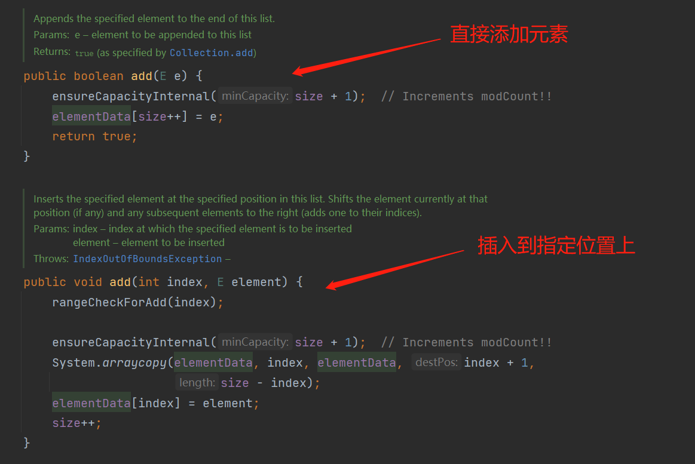


##### 3.3.1 public boolean add(E e)

**在列表最后添加指定元素**

步骤：

- **检查是否需要扩容**
- **插入元素**

```java
    /**
     * 将指定元素添加到列表尾部
     * @param e 需要添加到列表尾部的元素
     * @return <tt>true</tt> (as specified by {@link Collection#add})
     */
    public boolean add(E e) {
        ensureCapacityInternal(size + 1);  // Increments modCount!!——增加modCount
        elementData[size++] = e;
        return true;
    }
```

> 在父类`AbstractList`上，定义了`modCount` 属性，用于记录数组修改的次数。

其中，`ensureCapacityInternal(size + 1);`有如下作用：

- **确认 list 容量，尝试将容量 + 1，看看有无必要**
- **添加元素**

接下来看看这个方法的工作机理：

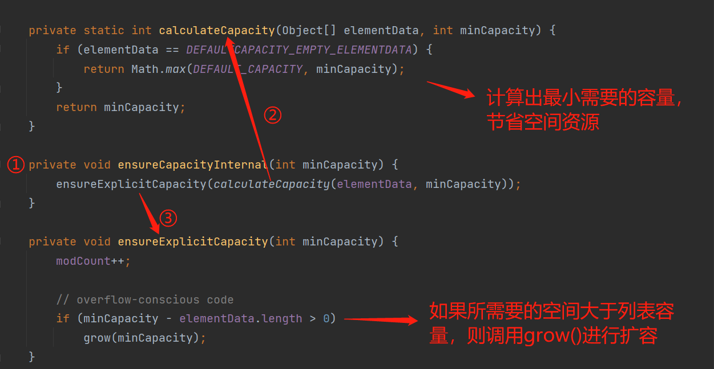

> 当添加第11个元素时，minCapacity 为11，底层数组长度为10，那么就需要扩容了

接下来再来看看`grow()`方法的实现：

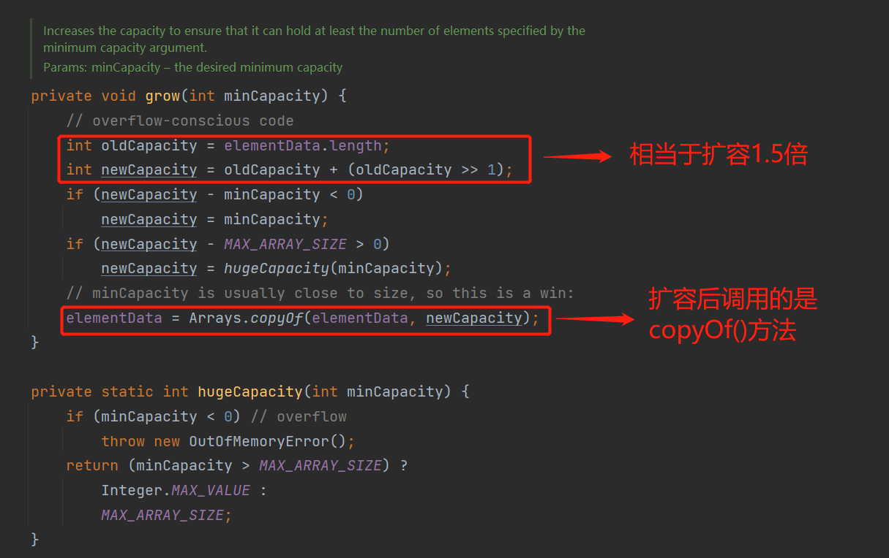

> - 通常情况新容量是原来容量的1.5倍
> - 如果原容量的1.5倍比`minCapacity`小，那么就扩容到`minCapacity`
> - 特殊情况扩容到`Integer.MAX_VALUE`

进入`copyOf()`方法瞧瞧~

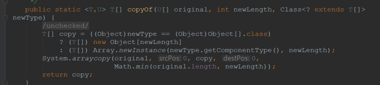

到此为止，`add(E e)`的实现流程如下：

首先去检查一下数组的容量是否足够 

- 足够：直接添加新元素
- 不足够：扩容 
  - 将列表容量扩容到原来的 **1.5** 倍 
  - 第⼀次扩容后，如果容量还是小于minCapacity，就将容量扩充为 **minCapacity**。


##### 3.3.2 add(int index, E element)

**在指定位置添加指定元素**

步骤：

- **检查角标** 
- **空间检查，如果有需要进行扩容** 
- **插入元素**

```java
/**
 * 在指定位置添加指定元素
 * 如果指定位置已经有元素，就将该元素和随后的元素移动到右面一位
 *
 * @param index 待插入元素的下标
 * @param element 待插入的元素
 * @throws 可能抛出 IndexOutOfBoundsException
 */
public void add(int index, E element) {
    rangeCheckForAdd(index);//检查角标是否越界

    // 增加 modCount ！！
    ensureCapacityInternal(size + 1);
    System.arraycopy(elementData, index, elementData, index + 1, size - index);//调用arraycopy()进行插入
    elementData[index] = element;
    size++;
}
```

看到 `arraycopy() `，我们可以发现：该方法是由**C/C++** 来编写的，并不是由 Java 实现：

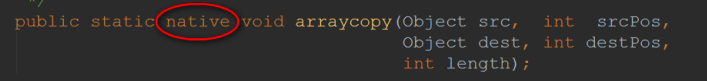


#### 3.4 移除方法 remove()

##### 3.4.1 public E remove(int index)

**移除指定下标元素方法**

步骤： 

- **检查角标** 
- **删除元素** 
- **计算出需要移动的个数，并移动** 
- **设置为null，让Gc回收**

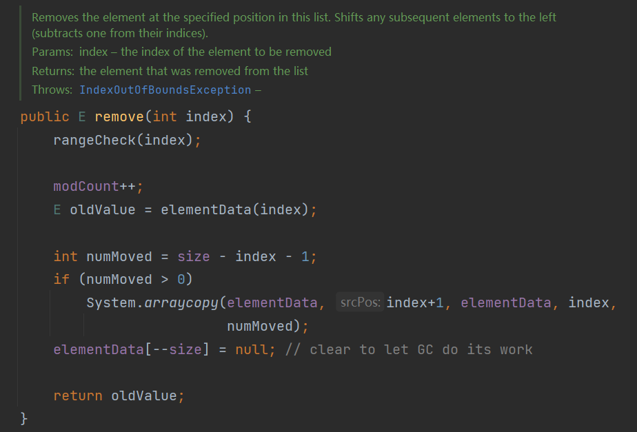

详解：

```java
/**
 * 移除列表中指定下标位置的元素
 * 将所有的后续元素，向左移动
 *
 * @param 要移除的指定下标
 * @return 返回被移除的元素
 * @throws 下标越界会抛出IndexOutOfBoundsException
 */
public E remove(int index) {
    rangeCheck(index);//检查下标合法性

    modCount++;//数组修改的次数+1
    E oldValue = elementData(index);
	
    //将所删除元素的右边元素逐个向左移动
    int numMoved = size - index - 1;
    if (numMoved > 0)
            System.arraycopy(elementData, index+1, elementData, index,  numMoved);
    // 将引用的最后一个置空，让GC回收
    elementData[--size] = null;

    return oldValue;
}
```


##### 3.4.2 public boolean remove(Object o)

**移除指定元素方法**

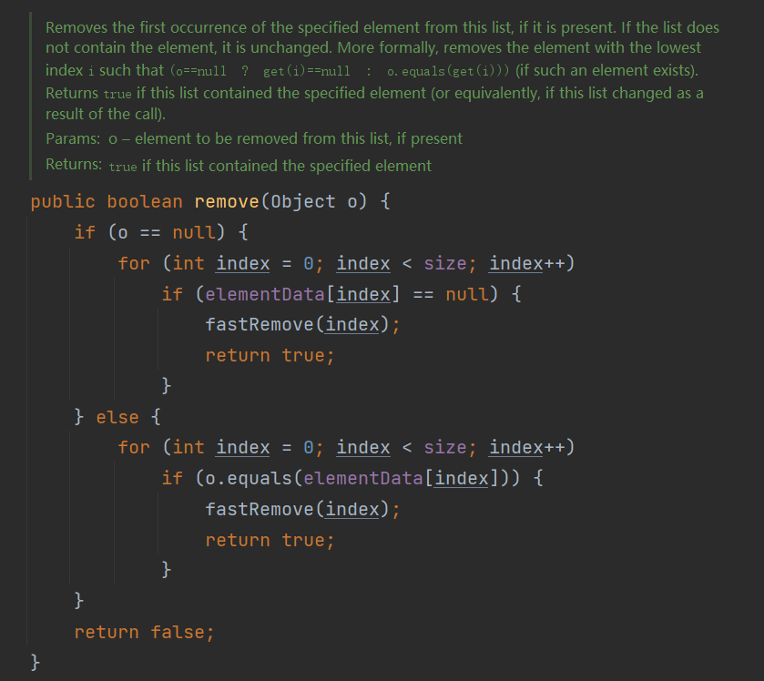

详解：

```java
/**
 * 移除第一个在列表中出现的指定元素
 * 如果存在，移除返回true
 * 否则，返回false
 *
 * @param o 指定元素
 */
public boolean remove(Object o) {
    if (o == null) {
        for (int index = 0; index < size; index++)
            if (elementData[index] == null) {
                fastRemove(index);//私有的移除方法，内部是移除及左移的逻辑
                return true;
            }
    } else {
        for (int index = 0; index < size; index++)
            if (o.equals(elementData[index])) {
                fastRemove(index);//私有的移除方法
                return true;
            }
    }
    return false;
}
```

>  移除方法名字、参数的个数都一样，使用的时候要注意。 


##### 3.4.3 private void fastRemove(int index)

**私有移除方法**

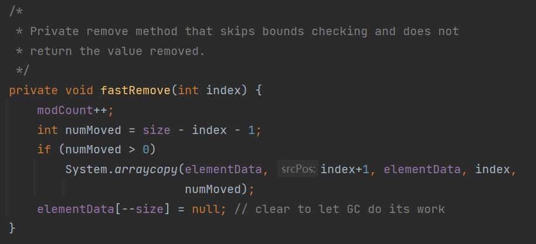

详解：

```java
/*
 * 私有的 移除 方法 跳过边界检查且不返回移除的元素
 */
private void fastRemove(int index) {
    modCount++;
    int numMoved = size - index - 1;
    if (numMoved > 0)
        System.arraycopy(elementData, index+1, elementData, index, numMoved);
    //将引用置空，让GC回收
    elementData[--size] = null;
}
```


#### 3.5 查找方法 get()

##### 3.5.1 public E get(int index)

**查找指定位置的元素**

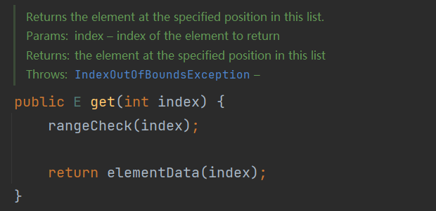

详解：

```java
/**
 * 返回指定位置的元素
 *
 * @param  index 指定元素的位置 
 * @throws index越界会抛出IndexOutOfBoundsException
 */
public E get(int index) {
    rangeCheck(index);//检查角标

    return elementData(index);//返回具体元素
}
```

检查角标：

```java
// 检查⻆标
private void rangeCheck(int index) {
    if (index >= size)
    throw new IndexOutOfBoundsException(outOfBoundsMsg(index));
}
```

返回元素：

```java
@SuppressWarnings("unchecked")
E elementData(int index) {
	return (E) elementData[index];
}
```


##### 3.5.2 public int indexOf(Object o)

**查找指定元素的所在位置**

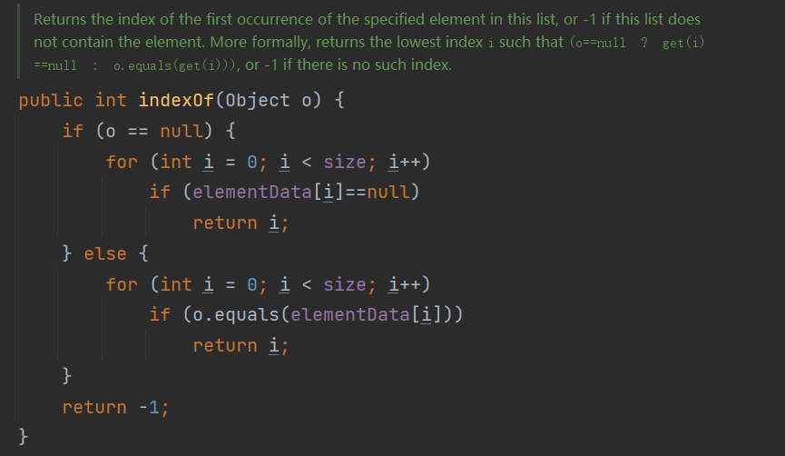

详解：

```java
/**
 * 返回指定元素第一次出现的下标
 * 如果不存在该元素，返回 -1
 * 如果 o == null 会特殊处理
 */
public int indexOf(Object o) {
    if (o == null) {
        for (int i = 0; i < size; i++)
            if (elementData[i] == null)
                return i;
    } else {
        for (int i = 0; i < size; i++)
            if (o.equals(elementData[i]))
                return i;
    }
    return -1;
}
```


#### 3.6 set() 方法

步骤： 

- **检查角标** 
- **替代元素** 
- **返回旧值**

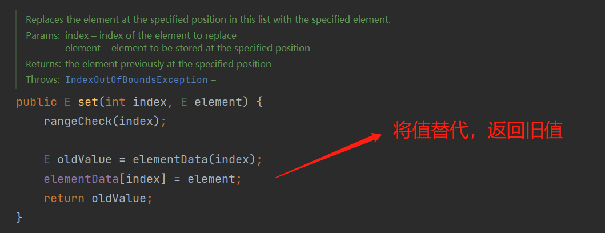


#### 3.7 序列化方法 writeObject()

```java
/**
 * 将ArrayList实例的状态保存到一个流里面
 */
private void writeObject(java.io.ObjectOutputStream s) throws java.io.IOException{
    // Write out element count, and any hidden stuff
    int expectedModCount = modCount;
    s.defaultWriteObject();

    // Write out size as capacity for behavioural compatibility with clone()
    s.writeInt(size);

    // 按照顺序写入所有的元素
    for (int i=0; i<size; i++) {
        s.writeObject(elementData[i]);
    }

    if (modCount != expectedModCount) {
        throw new ConcurrentModificationException();
    }
}
```


#### 3.8 反序列化方法 readObject()

```java
/**
 * 根据一个流(参数)重新生成一个ArrayList
 */
private void readObject(java.io.ObjectInputStream s) throws java.io.IOException, ClassNotFoundException {
    elementData = EMPTY_ELEMENTDATA;

    // Read in size, and any hidden stuff
    s.defaultReadObject();

    // Read in capacity
    s.readInt();

    if (size > 0) {
        // be like clone(), allocate array based upon size not capacity
        ensureCapacityInternal(size);

        Object[] a = elementData;
        // Read in all elements in the proper order.
        for (int i=0; i<size; i++) {
            a[i] = s.readObject();
        }
    }
}
```

> `elementData`之所以用`transient`修饰，是因为 JDK 不想将整个`elementData`都序列化或者反序列化，而只是将`size`和实际存储的元素序列化或反序列化，从而节省空间和时间。 


#### 3.9 subList() 方法

**创建子数组列表**

```java
public List<E> subList(int fromIndex, int toIndex) {
    subListRangeCheck(fromIndex, toIndex, size);//检查传入参数的合理性
    return new SubList(this, 0, fromIndex, toIndex);//返回创建好的子列表
}
```

其中的 `subListRangeCheck()`方法：

```java
static void subListRangeCheck(int fromIndex, int toIndex, int size) {
    if (fromIndex < 0)
        throw new IndexOutOfBoundsException("fromIndex = " + fromIndex);
    if (toIndex > size)
        throw new IndexOutOfBoundsException("toIndex = " + toIndex);
    if (fromIndex > toIndex)
        throw new IllegalArgumentException("fromIndex(" + fromIndex + ") > toIndex(" + toIndex + ")");
}
```

再来看看 SubList 类的定义：

```java
private class SubList extends AbstractList<E> implements RandomAccess {
    private final AbstractList<E> parent;
    private final int parentOffset;
    private final int offset;
    int size;

    SubList(AbstractList<E> parent,
            int offset, int fromIndex, int toIndex) {
        this.parent = parent;
        this.parentOffset = fromIndex;
        this.offset = offset + fromIndex;
        this.size = toIndex - fromIndex;
        this.modCount = ArrayList.this.modCount;
    }

    public E set(int index, E e) {
        rangeCheck(index);
        checkForComodification();
        E oldValue = ArrayList.this.elementData(offset + index);
        ArrayList.this.elementData[offset + index] = e;
        return oldValue;
    }

    // 省略代码...
}
```

注意：

- SubList 的`set()`方法，**是直接修改ArrayList**中`elementData`数组的，使用中应该注意
- SubList 是没有实现`Serializable`接口的，**是不能序列化的**


#### 3.10 迭代器实现

创建迭代器的方法：

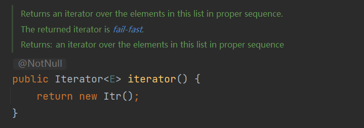

接下来再来看看 **Itr** 这个类：

- **Itr 属性**

  ```java
  // 下一个要返回的元素的下标
  int cursor;
  // 最后一个要返回元素的下标 没有元素返回 -1
  int lastRet = -1;
  // 期望的 modCount
  int expectedModCount = modCount;
  ```

- **Itr的 hasNext() 方法**

  ```java
  public boolean hasNext() {
      return cursor != size;
  }
  ```

- **Itr的 next() 方法**

  ```java
  public E next() {
      checkForComodification(); //检查修改次数和期望修改次数是否一致，这是为了防止并发修改异常
      int i = cursor;
      if (i >= size)
          throw new NoSuchElementException();
      Object[] elementData = ArrayList.this.elementData;
      if (i >= elementData.length)
          throw new ConcurrentModificationException();
      cursor = i + 1;
      return (E) elementData[lastRet = i];
  }
  
  final void checkForComodification() {
      if (modCount != expectedModCount)
          throw new ConcurrentModificationException();
  }
  ```

  > **什么是并发修改异常？**
  >
  > 当我们在对集合进行迭代操作的时候，如果同时对集合对象中的元素进行某些操作，则容易导致并发修改异常的产生。 这经常出现在多个线程同时对一个列表进行操作时。

- **Itr的 remove() 方法**

  ```java
  public void remove() {
      if (lastRet < 0)
          throw new IllegalStateException();
      checkForComodification();
  
      try {
          ArrayList.this.remove(lastRet);
          cursor = lastRet;
          lastRet = -1;
          // 移除之后将modCount 重新赋值给 expectedModCount
          expectedModCount = modCount;
      } catch (IndexOutOfBoundsException ex) {
          throw new ConcurrentModificationException();
      }
  }
  ```

  

#### 3.11 总结

- ArrayList底层的数据结构是**数组**，在增删时候，需要数组的拷贝复制。

- ArrayList可以**自动扩容**，不传初始容量或者初始容量是`0`，都会初始化一个空数组，但是如果添加元素，会自动进行扩容，所以，创建ArrayList的时候，给初始容量是必要的。【**ArrayList**的默认初始化容量是**10**，每次扩容时候增加原先容量的⼀半，也就是变为原来的**1.5**倍】

- `Arrays.asList()`方法返回的是的`Arrays`内部的ArrayList，用的时候需要注意

- `subList()`返回内部类，不能序列化，和ArrayList共用同一个数组

- 迭代删除要用迭代器的`remove`方法，或者可以用倒序的`for`循环

- ArrayList重写了序列化、反序列化方法，避免序列化、反序列化全部数组，浪费时间和空间

- `elementData`不使用`private`修饰，可以简化内部类的访问

- 删除元素时不会减少容量，若希望减少容量则调用 **trimToSize()**

  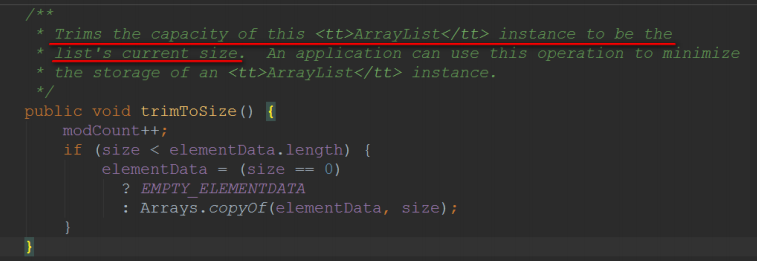

- 它不是线程安全的。它能存放null值。


### 4. Vector 与 ArrayList 区别

**类图：**

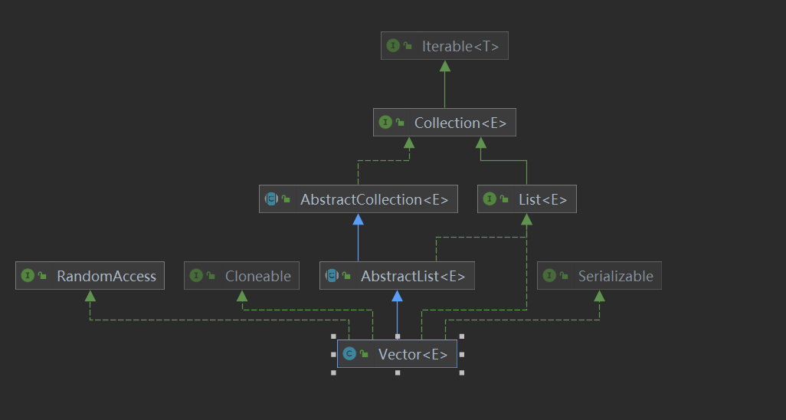

> Vector 是 JDK1.2 的类

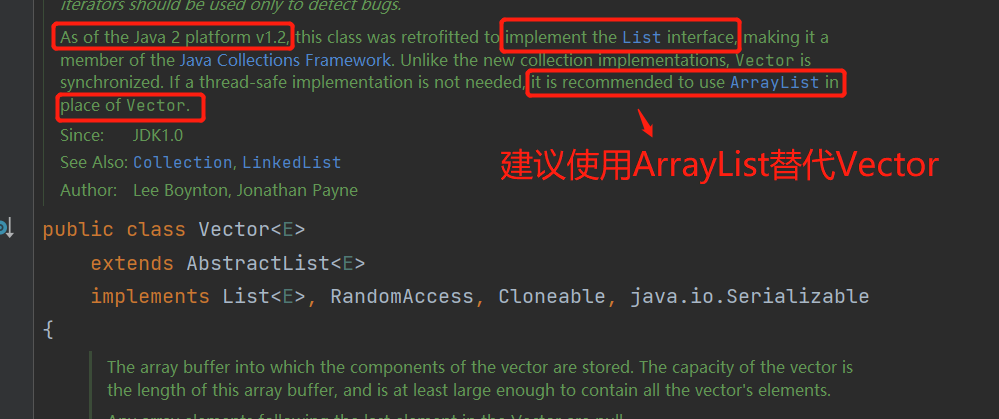

Vector 底层也是**数组**，与 ArrayList 最大的区别就是：**同步(线程安全)**

我们可以看到 Vector 源码中绝大多数方法都上了锁，这就是其线程安全的体现：

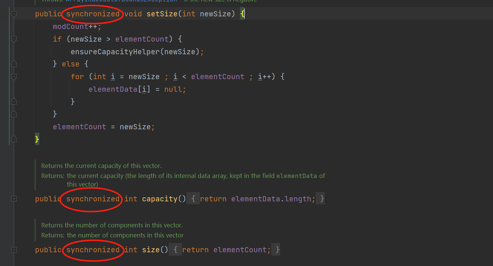


> 在不要求同步的情况下，我们⼀般都是使用 ArrayList 来替代 Vector 。因为... Vector 加了太多的 synchronized！
>
> 任何好处都是有代价的，线程安全的成本就是效率低，在某些系统里很容易成为瓶颈，所以现在都不再在数据结构的层面加 synchronized，而是把这个任务转移给程序员o(*￣▽￣*)o

如果想要 ArrayList 实现同步，可以使用 Collections 的方法： `List list = Collections.synchronizedList(new ArrayList(...)); `，就可以实现同步了


还有另外一个区别：

- **ArrayList** 在底层数组不够用时在原来的基础上扩展**0.5**倍，**Vector**是扩展**1**倍。【即 Arrayist 容量变成原来的**1.5**倍，Vector 容量变成原来的**2**倍】

属性：

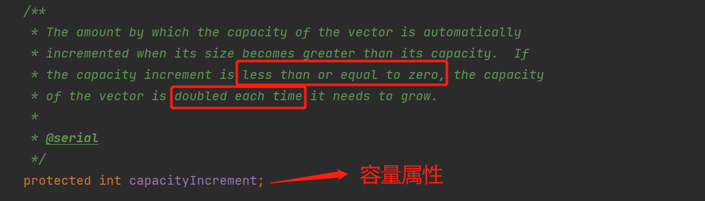

方法：

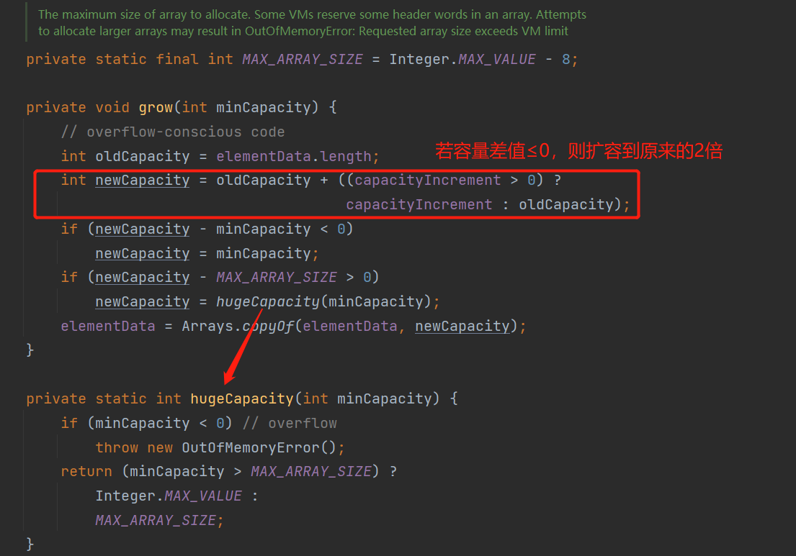


**总结：**

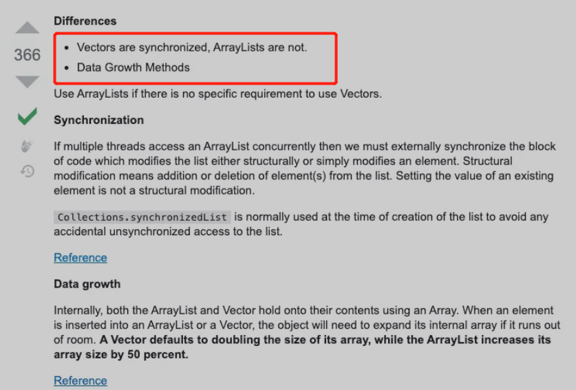

- **ArrayList 线程不安全，Vector 线程安全。**
- **扩容时，Arrayist 容量变成原来的1.5倍，Vector 容量变成原来的2倍**


### 5. LinkedList

**类图：**

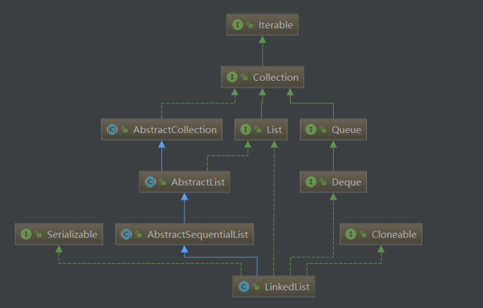


LinkedList 底层是**双向链表**

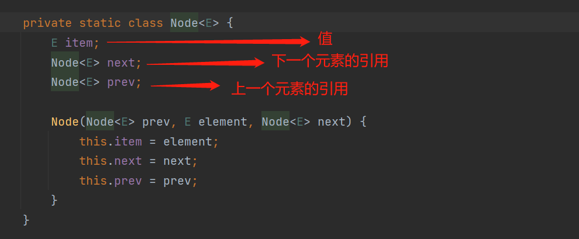

可以看到，LinkedList 实现了 Deque 接口，所以可以像操作队列和栈一样操作 LinkedList：


#### 5.1 LinkedList 的属性

LinkedList 共有4个属性：

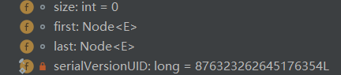

属性解析：


```java
// 序列化版本UID
private static final long serialVersionUID = 876323262645176354L;
```


#### 5.2 构造方法

LinkedList 有一个空参构造器和一个有参构造器：


#### 5.3 添加方法 add()

**add**方法实际上就是往链表**最后**添加元素

```java
public boolean add(E e) {
    linkLast(e);//往链表尾端加元素的方法
    return true;
}

void linkLast(E e) {
    final Node<E> l = last;//先把尾元素赋给l
    final Node<E> newNode = new Node<>(l, e, null);//调用内部类Node的有参构造器构造一个新结点
    last = newNode;//再把新结点的引用赋给last
    if (l == null)
        first = newNode;//如果原本的尾元素为空，则将新结点赋给首元素，此时链表只有一个元素(首尾)
    else
        l.next = newNode;//否则将新元素赋给原尾元素的下一个位置
    size++;//元素数量+1
    modCount++;//链表修改次数+1
}

//内部类Node
private static class Node<E> {
        E item;
        Node<E> next;
        Node<E> prev;
		//有参构造器
        Node(Node<E> prev, E element, Node<E> next) {
            this.item = element;
            this.next = next;
            this.prev = prev;
        }
    }
```


#### 5.4 移除方法 remove()

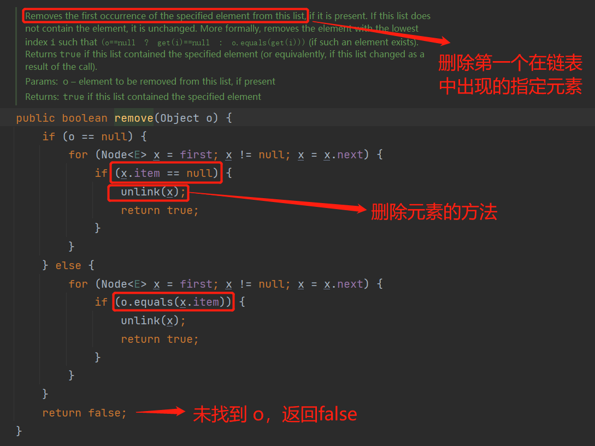

再来看看`unlink()`方法的内部逻辑：

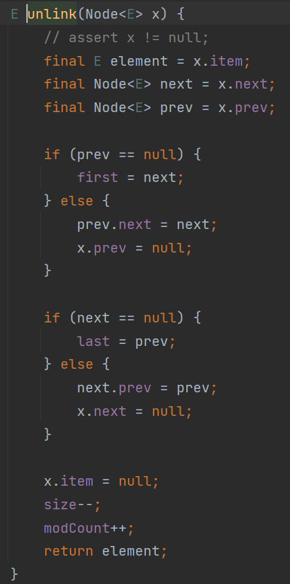

上述代码进行的就是如下的操作：

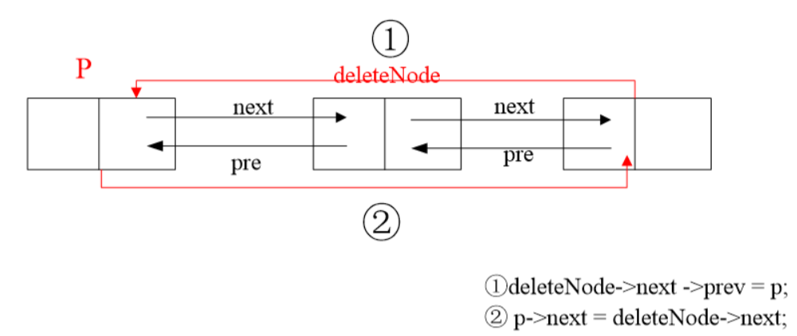


#### 5.5 查找方法 get()

```java
public E get(int index) {
    checkElementIndex(index);//验证索引的合法性
    return node(index).item;
}

//返回指定索引上的非空元素
Node<E> node(int index) {
        // assert isElementIndex(index);能执行到node()方法，认定索引是合法的

        if (index < (size >> 1)) {//用到类似二分查找思想，若index < size的一半，则从首元素开始找
            Node<E> x = first;
            for (int i = 0; i < index; i++)
                x = x.next;
            return x;
        } else {//若index ≥ size的一半，则从尾元素开始向前找
            Node<E> x = last;
            for (int i = size - 1; i > index; i--)
                x = x.prev;
            return x;
        }
    }
```


#### 5.6 set() 方法

set方法和get方法差不多，根据下标来判断是从头遍历还是从尾遍历

```java
public E set(int index, E element) {
    checkElementIndex(index);//验证索引合法性
    Node<E> x = node(index);//查找元素
    E oldVal = x.item;
    x.item = element;
    return oldVal;//将旧元素上的值返回
}
```


#### 5.7 ArrayList 和 LinkedList 对比

- ArrayList 底层是数组，LinkedList 底层是双向链表
- 两者都是非同步的（线程不安全）
- 对比 **ArrayList** 和 **LinkedList** 的 API 的时间复杂度：

| 功能 |        方法         | ArrayList | LinkedList |
| :--- | :-----------------: | :-------: | :--------: |
| 增   |      add(E e)       |   O(1)    |    O(1)    |
| 增   | add(int index, E e) |   O(n)    |    O(n)    |
| 删   |  remove(int index)  |   O(n)    |    O(n)    |
| 删   |     remove(E e)     |   O(n)    |    O(n)    |
| 改   | set(int index, E e) |   O(1)    |    O(n)    |
| 查   |   get(int index)    |   O(1)    |    O(n)    |

**结论：**

> 1. **改查选择 ArrayList；**
> 2. **增删在尾部的选择 ArrayList，增删在中间位置也选择 ArrayList；**
> 3. **其他情况下，如果时间复杂度一样，推荐选择 ArrayList，因为 overhead 更小，或者说内存使用更有效率。**
> 4. **但一般来说，增删多还是用 LinkedList，因为上面的情况比较极端**


## 四、Set 集合

### 1. Set 集合概述

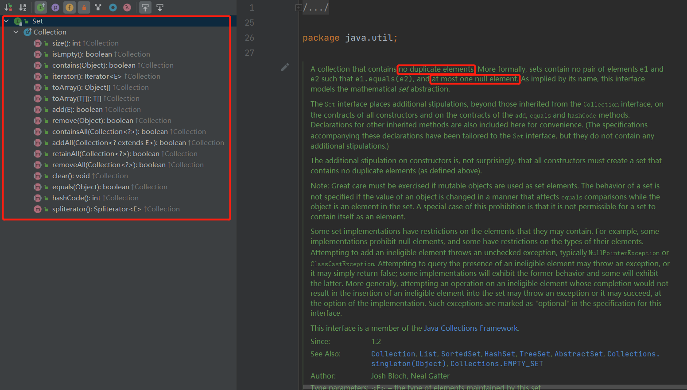

Set 集合的**特点**就是：**无序，元素不可重复，至多只有一个null值**


### 2. Set 集合常用子类

- **HashSet**
  -  (无序，唯一)基于 `HashMap` 实现的，底层采用 `HashMap` 来保存元素 
- **LinkedHashSet** 
  -  `LinkedHashSet` 是 `HashSet` 的子类，并且其内部是通过 `LinkedHashMap` 来实现的。（有点类似于 `LinkedHashMap` 其内部是基于 `HashMap` 实现，不过还是有一点点区别的 ） 
- **TreeSet** 
  -  （有序，唯一）**红黑树**（自平衡的排序二叉树）

以上三个类都是**非线程同步**。


### 3. HashSet

**类图：**

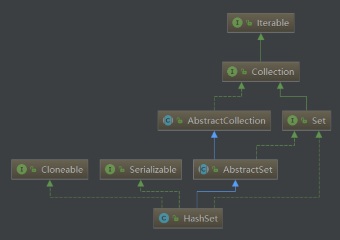

> - 实现了`Cloneable`接口，可以克隆
> - 实现了`Serializable`接口，可以序列化、反序列化
> - 实现了`Set`接口，是`Set`的实现类之一
> - 实现了`Collection`接口，是`Java Collections Framework`成员之一
> - 实现了`Iterable`接口，可以使用`for-each`迭代（但不建议，因为无序）


HashSet 类注释：

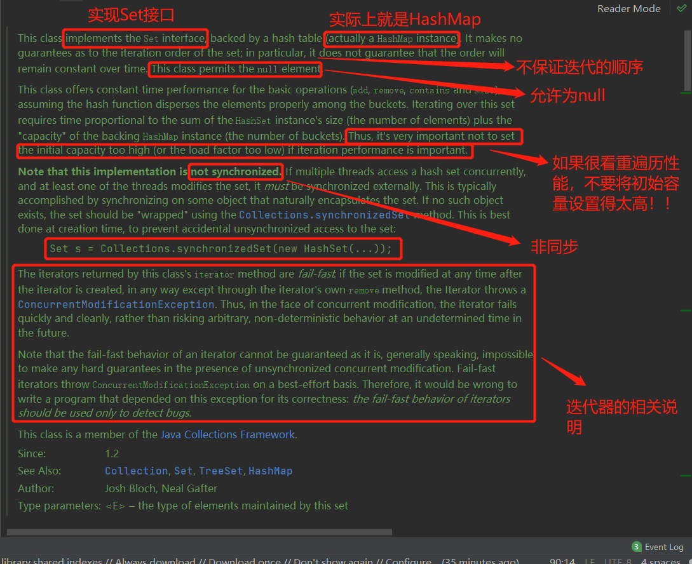

从类注释来看，可以归纳 HashSet 的特点： 

- 实现 Set 接口
- 不保证迭代顺序 
- 允许元素为 null 
- 底层实际上是一个**HashMap**实例（基于哈希表实现）
- 非线程同步 
- 初始容量非常影响迭代性能


HashSet 是对 HashMap 的简单包装，**对 HashSet 的函数调用都会转换成合适的 HashMap 方法**，因此 HashSet 的实现非常简单，只有不到300行代码。 


#### 3.1 HashSet 的属性


```java
public class HashSet<E>
    extends AbstractSet<E>
    implements Set<E>, Cloneable, java.io.Serializable
{
    static final long serialVersionUID = -5024744406713321676L;//序列化版本UID

    private transient HashMap<E,Object> map;//底层用来存储数据的真实容器map

    // Dummy value to associate with an Object in the backing Map
    //由于Set只使用到了HashMap的key，所以此处定义一个静态的常量Object类，来充当HashMap的value
    private static final Object PRESENT = new Object();
    
    ......
```


#### 3.2 HashSet 的构造器


构造器详解：

```java
private transient HashMap<E,Object> map;
//默认构造器，使用HashMap的默认容量大小16和默认加载因子0.75初始化map，构造一个HashSet
public HashSet() {
    map = new HashMap<>();
}
//构造一个指定Collection参数的HashSet，这里不仅仅是Set，只要实现Collection接口的容器都可以
public HashSet(Collection<? extends E> c) {
    map = new HashMap<>(Math.max((int) (c.size()/.75f) + 1, 16));
    addAll(c);
}
//明确初始容量和装载因子的构造器
public HashSet(int initialCapacity, float loadFactor) {
    map = new HashMap<>(initialCapacity, loadFactor);
}
//仅明确初始容量的构造器（装载因子默认0.75）
public HashSet(int initialCapacity) {
    map = new HashMap<>(initialCapacity);
}
//不对外公开的一个构造方法（默认default修饰），底层构造的是LinkedHashMap，dummy只是一个标示参数，无具体意义
HashSet( int initialCapacity, float loadFactor, boolean dummy) {
    map = new LinkedHashMap<E,Object>(initialCapacity, loadFactor);
}
```

通过上面的源码，我们发现了HashSet就像是一些公司，它就对外接活儿，活儿接到了就直接扔给外包 HashMap 处理了。因为底层是通过 HashMap 实现的，这里简单提一嘴:

> HashMap的数据存储是通过数组+链表/红黑树实现的，存储大概流程是通过hash函数计算在数组中存储的位置，如果该位置已经有值了，判断key是否相同，相同则覆盖，不相同则放到元素对应的链表中，如果链表长度大于8，就转化为红黑树，如果容量不够，则需扩容（注：这只是大致流程）。

只有最后一个构造方法有写区别，这里构造的是 LinkedHashMap，该方法不对外公开，实际上是提供给 LinkedHashSet 使用的，而第三个参数 dummy 是无意义的，只是为了区分其他构造方法。 


#### 3.3 add 方法

HashSet 的 add 方法是**通过 HashMap 的 put 方法**实现的，不过 HashMap 是 key-value 键值对，而 HashSet 是集合，那么是怎么存储的呢，我们看一下源码 ：

```java
private static final Object PRESENT = new Object();

public boolean add(E e) {
    return map.put(e, PRESENT)==null;
}
```

看源码知道，HashSet 添加的元素是存放在 HashMap 的 key 位置上，而 value 取了默认常量 PRESENT，是一个Object 对象，至于 map 的 put 方法，下面是其大致工作流程：

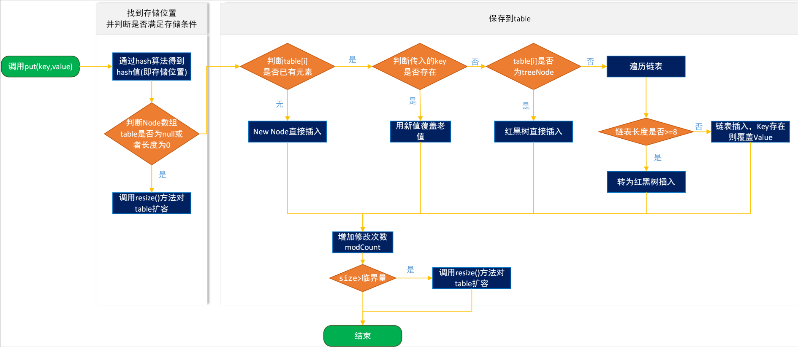


#### 3.4 remove 方法

 HashSet 的 remove 方法通过 HashMap 的 remove 方法来实现 

```java
//HashSet的remove方法，形参其实是key，也就是我们存入Set的值
public boolean remove(Object o) {
    return map.remove(o)==PRESENT;//如果删除key会返回其对应的value，只要存在这个key，它的value绝对是PRESENT，则结果为真，Set中不存在这个key的话自然为假
}

//map的remove方法
public V remove(Object key) {
    Node<K,V> e;
    //通过hash(key)找到元素在数组中的位置，再调用removeNode方法删除
    return (e = removeNode(hash(key), key, null, false, true)) == null ? null : e.value;
}

//真正进行删除元素的逻辑
final Node<K,V> removeNode(int hash, Object key, Object value,
                           boolean matchValue, boolean movable) {
    Node<K,V>[] tab; Node<K,V> p; int n, index;
    //步骤1.需要先找到key所对应Node的准确位置，首先通过(n - 1) & hash找到数组对应位置上的第一个node
    if ((tab = table) != null && (n = tab.length) > 0 &&
        (p = tab[index = (n - 1) & hash]) != null) {
        Node<K,V> node = null, e; K k; V v;
        //1.1 如果这个node刚好key值相同，运气好，找到了
        if (p.hash == hash &&
            ((k = p.key) == key || (key != null && key.equals(k))))
            node = p;
        /**
         * 1.2 运气不好，在数组中找到的Node虽然hash相同了，但key值不同，很明显不对，我们需要遍历继续
         *     往下找；
         */
        else if ((e = p.next) != null) {
            //1.2.1 如果是TreeNode类型，说明HashMap当前是通过数组+红黑树来实现存储的，遍历红黑树找到对应node
            if (p instanceof TreeNode)
                node = ((TreeNode<K,V>)p).getTreeNode(hash, key);
            else {
                //1.2.2 如果是链表，遍历链表找到对应node
                do {
                    if (e.hash == hash &&
                        ((k = e.key) == key ||
                         (key != null && key.equals(k)))) {
                        node = e;
                        break;
                    }
                    p = e;
                } while ((e = e.next) != null);
            }
        }
        //通过前面的步骤1找到了对应的Node,现在我们就需要删除它了
        if (node != null && (!matchValue || (v = node.value) == value ||
                             (value != null && value.equals(v)))) {
            /**
             * 如果是TreeNode类型，删除方法是通过红黑树节点删除实现的
             */
            if (node instanceof TreeNode)
                ((TreeNode<K,V>)node).removeTreeNode(this, tab, movable);
            /** 
             * 如果是链表的情况，当找到的节点就是数组hash位置的第一个元素，那么该元素删除后，直接将数组
             * 第一个位置的引用指向链表的下一个即可
             */
            else if (node == p)
                tab[index] = node.next;
            /**
             * 如果找到的本来就是链表上的节点，也简单，将待删除节点的上一个节点的next指向待删除节点的
             * next,隔离开待删除节点即可
             */
            else
                p.next = node.next;
            ++modCount;
            --size;
            //删除后可能存在存储结构的调整，可参考【LinkedHashMap如何保证顺序性】中remove方法
            afterNodeRemoval(node);
            return node;
        }
    }
    return null;
}
```


#### 3.5 遍历

 HashSet作为集合，有多种遍历方法，如普通for循环，增强for循环，迭代器，我们通过迭代器遍历来看一下 ：

```java
public static void main(String[] args) {
    HashSet<String> setString = new HashSet<> ();
    setString.add("星期一");
    setString.add("星期二");
    setString.add("星期三");
    setString.add("星期四");
    setString.add("星期五");

    Iterator it = setString.iterator();
    while (it.hasNext()) {
        System.out.println(it.next());
    }
}
```

打印结果：

```
星期二
星期三
星期四
星期五
星期一
```

HashSet 是通过 HashMap 来实现的，HashMap 通过 hash(key) 来确定存储的位置，是**不具备存储顺序性**的，因此 HashSet 遍历出的元素也并非按照插入的顺序。 


**通过 for-each 遍历 HashSet**

第一步： 根据 toArray() 获取 HashSet 的元素集合对应的数组。

第二步： 遍历数组，获取各个元素。

```java
//假设set是HashSet对象，并且set中元素是String类型
String[] arr = (String[])set.toArray(new String[0]);
for (String str:arr)
   System.out.printf("for each : %s\n", str);
```


#### 3.6 是否包含

利用 HashMap 的 containsKey 方法实现 contains 方法

```java
//检查是否包含元素o
public boolean contains(Object o) {
   return map.containsKey(o);
}
      
/**
 * 检查是否包含指定集合中所有元素，该方法在AbstractCollection中
 */
public boolean containsAll(Collection<?> c) {
   // 取得集合c的迭代器Iterator
   Iterator<?> e = c.iterator();
   // 遍历迭代器，只要集合c中有一个元素不属于当前HashSet，则返回false
   while (e.hasNext())
     if (!contains(e.next()))
          return false;
   return true;
}
```

由HashMap 基于 hash 表实现，hash 表实现的容器最重要的一点就是可以快速存取，那么 HashSet 对于 contains 方法，利用 HashMap 的 containsKey 方法，效率是非常之快的。 


#### 3.7 总结

- HashSet 中元素不可重复
- 允许元素为 null 
- 不保证迭代顺序  
- 底层实际上是一个 **HashMap** 实例（基于哈希表实现）
- 非线程同步 
- 初始容量非常影响迭代性能


### 4. LinkedHashSet

**类图：**

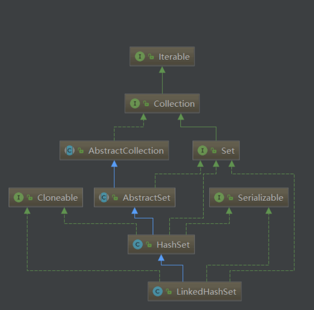


LinkedHashSet 类注释：

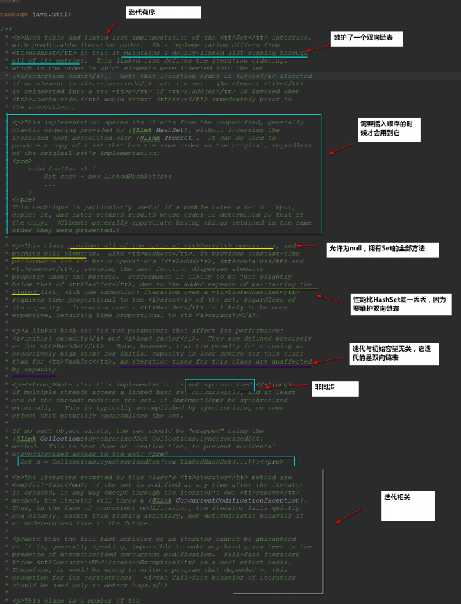

总结：

- 迭代是**有序的**，元素插入和取出顺序满足 FIFO
- 允许为 null
- 底层实际上是一个 **HashMap + 双向链表**实例（其实就是 LinkedHashMap）
- **非同步**
- 性能比 HashSet 稍差，因为要维护一个双向链表
- 初始容量与迭代无关，LinkedHashSet 迭代的是双向链表


### 5. TreeSet

**类图：**

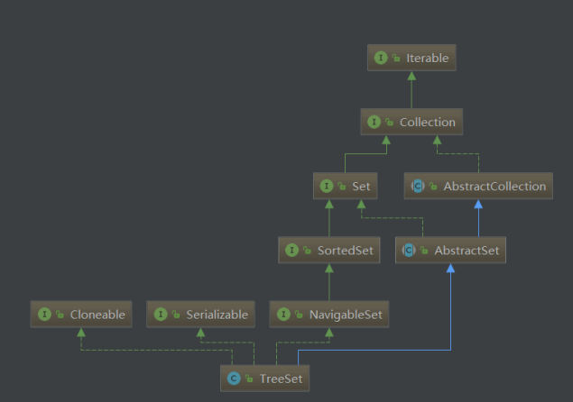


TreeSet 的类注释：

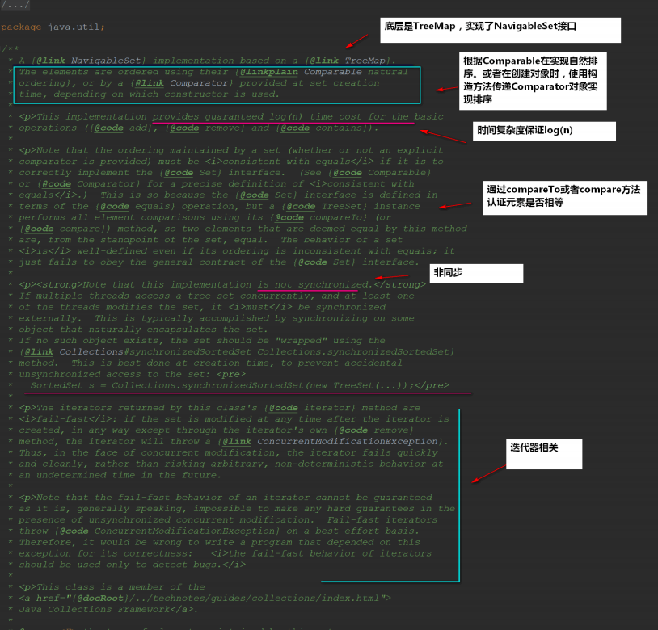

总结：

- 实现 **NavigableSet** 接口
- 可以实现**排序**功能
- 底层实际上是一个 **TreeMap 实例（红黑树）**
- **非同步**


属性和构造器：

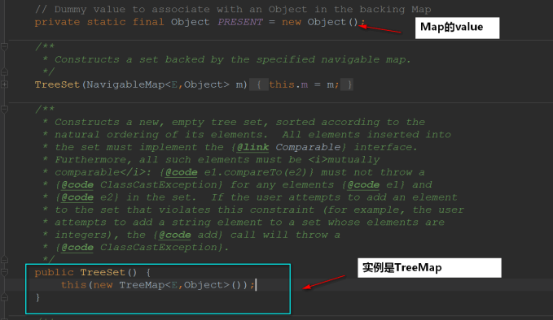

实际上底层是一个 TreeMap 实例，其中的 map 的每个 value 放的是 Object 对象，实际上是用 key 来存储 TreeSet 的值。


### 6. 比较 HashSet、LinkedHashSet 和 TreeSet 三者的异同

- `HashSet`、`LinkedHashSet` 和 `TreeSet` 都是 `Set` 接口的实现类，**都能保证元素唯一，并且都不是线程安全的。**
- `HashSet`、`LinkedHashSet` 和 `TreeSet` 的主要区别在于底层数据结构不同。`HashSet` 的底层数据结构是**哈希表**（基于 `HashMap` 实现）。`LinkedHashSet` 的底层数据结构是**双向链表和哈希表**，元素的插入和取出顺序满足 FIFO。`TreeSet` 底层数据结构是**红黑树**，元素是有序的，排序的方式有自然排序和定制排序。
- 底层数据结构不同又导致这三者的应用场景不同。`HashSet` 用于**不需要保证元素插入和取出顺序**的场景，`LinkHashSet` 用于**保证元素的插入和取出顺序满足 FIFO** 的场景，`TreeSet` 用于支持**对元素自定义排序规则**的场景。


## 五、CopyOnWriteArrayList


# Map

## 一、Map 集合概述

### 1. 什么是 Map？

Map 是一种**键-值对（key-value）**集合，Map 集合中的**每一个元素都包含一个键对象和一个值对象**。其中，**键对象不允许重复，而值对象可以重复**，并且值对象还可以是 Map 类型的，就像数组中的元素还可以是数组一样。 

> 如果需要存储几百万个学生，而且经常需要使用学号来搜索某个学生，那么这个需求有效的数据结构就是Map。 

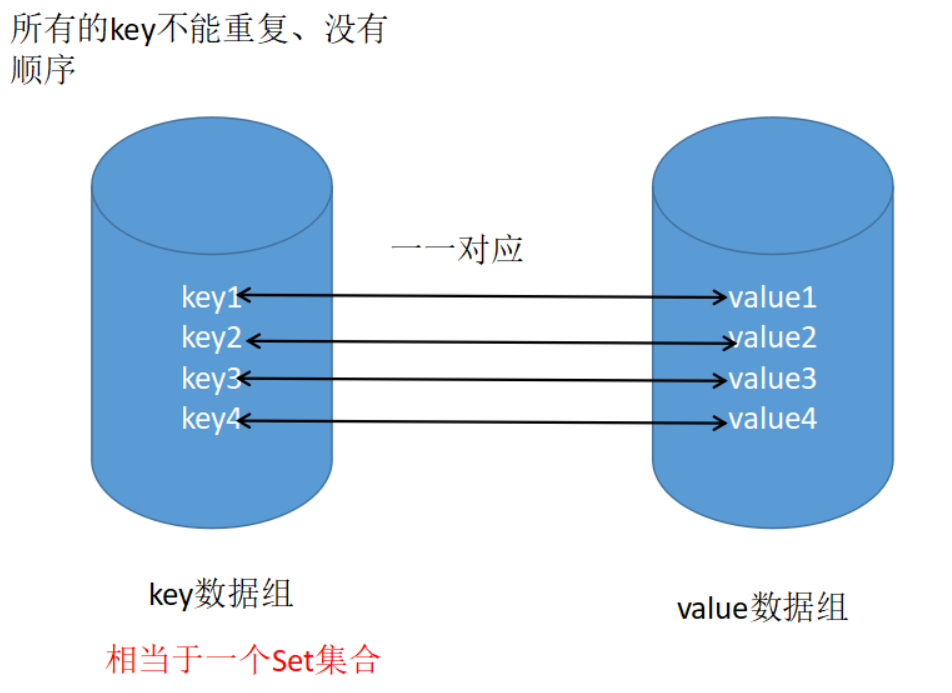


### 2. Map 和 Collection 的区别

- Map 与 Collection 在集合框架中属并列存在。

- Map 存储的是键值对，而 Collection 只存储值（也就是Collection是单列集合, Map 是双列集合）

- Map 存储元素使用 put 方法，Collection 使用 add 方法。

- Map 集合没有直接迭代元素的方法，而是先转成 Set 集合（entrySet），再通过迭代获取元素

- Map 集合中**键要保证唯一性，值是可以重复的。**


### 3. Map 的结构体系

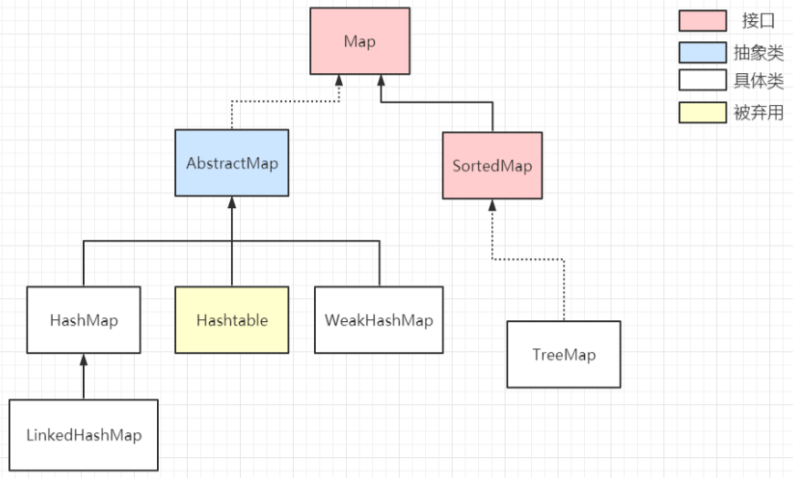


### 4. Map 的基础功能

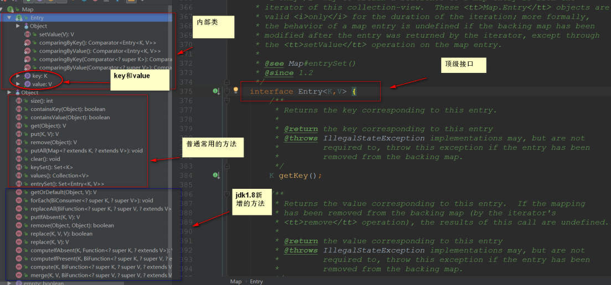

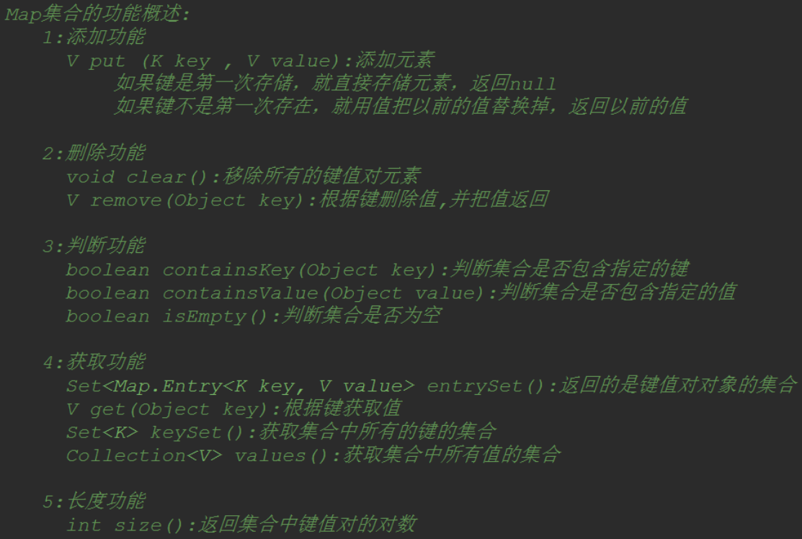


### 5. Map 集合常用子类

- **HashMap** 
  - **无序。**
  - 底层是 **散列表（数组+链表）+红黑树** 数据结构。
  - 线程是**不同步**的，**可以存入 null 键，null 值。**
  - 要保证**键的唯一性**，需要覆盖 hashCode 方法和 equals 方法。
- **LinkedHashMap** 
  - 底层是 **散列表+双向链表**。可以 Map 集合进行增删提高效率。 
  - 插入顺序是**有序**的。
  - **允许为 null，不同步**。
- **HashTable** 
  - 底层是 **散列表**。
  - **同步（线程安全）**，但效率较低。
  - **key 和 value 都不允许为 null。**
- **TreeMap**
  - 底层是 **红黑树**。方法的复杂度大都是 log(n)。
  - **非同步**。
  - TreeMap 实现了 NavigableMap 接口，而 NavigableMap 接口继承了 SortedMap 接口，致使 TreeMap 是**有序**的。
  - 使用 Comparator 或者 Comparable 来比较 key 是否相等与排序问题。

- **ConcurrentHashMap**
  - 底层是 **散列表+红黑树**。
  - **同步（线程安全）**，支持高并发的访问和更新。
  - **key 和 value 都不允许为 null。**
  - 检索操作不用加锁，get 方法是非阻塞的。


## 二、HashMap

**类图：**

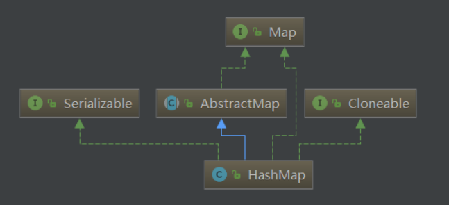

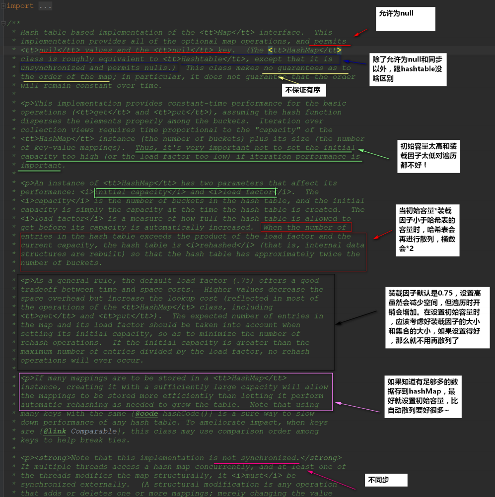

由类注释可以归纳出 HashMap 的特点：

- **允许为 null**， 但 null 作为键只能有一个，null 作为值可以有多个 
- **非同步，无序**
- 底层是 **散列表+(红黑树)**
- 初始容量和装载因子都会影响迭代性能

JDK1.8 之前 HashMap 由 **数组+链表** 组成的，数组是 HashMap 的主体，链表则是主要为了解决哈希冲突而存在的（“拉链法”解决冲突）。 JDK1.8 以后的 HashMap 在解决哈希冲突时有了较大的变化，当链表长度大于阈值（默认为 8）（将链表转换成红黑树前会判断，如果当前数组的长度小于 64，那么会选择先进行数组扩容，而不是转换为红黑树）时，将链表转化为红黑树，以减少搜索时间。 

`HashMap` 默认的初始化大小为 16。之后每次扩充，容量变为原来的 2 倍。并且， `HashMap` 总是使用 2 的幂作为哈希表的大小。 

> HashMap 总是以 2 的整数次方作为大小的原因？
>
> 目的主要是为了减少哈希碰撞，使 table 里的数据分布的更均匀。 

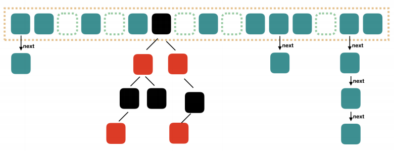


### 1. HashMap 的属性

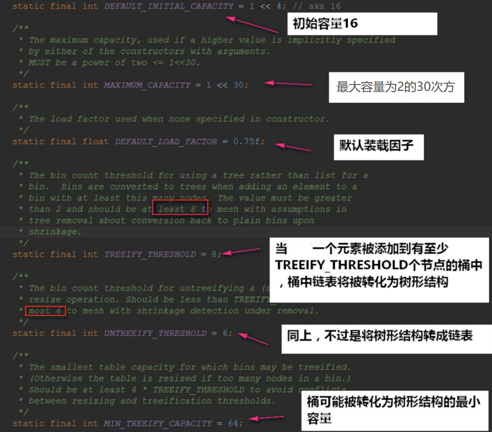

成员属性有如下几个：

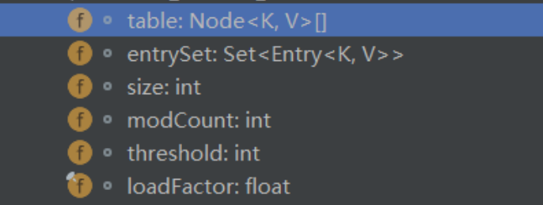

属性详解：

```java
public class HashMap<K,V> extends AbstractMap<K,V> implements Map<K,V>, Cloneable, Serializable {
    // 序列号
    private static final long serialVersionUID = 362498820763181265L;
    // table数组默认的初始容量是16
    static final int DEFAULT_INITIAL_CAPACITY = 1 << 4;
    // table数组最大容量
    static final int MAXIMUM_CAPACITY = 1 << 30;
    // 默认的填充因子
    /**
     *默认的负载因子是0.75f,也就是75% 负载因子的作用就是计算扩容阈值用，比如说使用
     *无参构造方法创建的HashMap 对象，他初始长度默认是16  阈值 = 当前长度 * 0.75  就
     *能算出阈值，当当前长度大于等于阈值的时候HashMap就会进行自动扩容
     */
    static final float DEFAULT_LOAD_FACTOR = 0.75f;
    // 当桶(bucket)上的结点数大于这个值时会转成红黑树
    static final int TREEIFY_THRESHOLD = 8;
    // 当桶(bucket)上的结点数小于这个值时树转链表
    static final int UNTREEIFY_THRESHOLD = 6;
    // 桶中结构转化为红黑树对应的table的最小大小
    static final int MIN_TREEIFY_CAPACITY = 64;
    // 存储元素的数组，总是2的幂次倍
    transient Node<k,v>[] table;
    // 存放具体元素的集
    transient Set<map.entry<k,v>> entrySet;
    // 存放元素的个数，注意这个不等于数组的长度。
    transient int size;
    // 每次扩容和更改map结构的计数器
    transient int modCount;
    // 临界值 当实际大小(容量*填充因子)超过临界值时，会进行扩容
    /**
    * threshold就是在此Load factor和length(数组长度)对应下允许的最大元素数目，超过这个数目就重新resize(扩容)，扩容后的HashMap容量是之前容量的两倍。
    */
    int threshold;
    // 加载因子
    final float loadFactor;
}
```


HashMap 中还有一个**内部类 Node**，用于存放散列表下的链表结构中的节点元素：

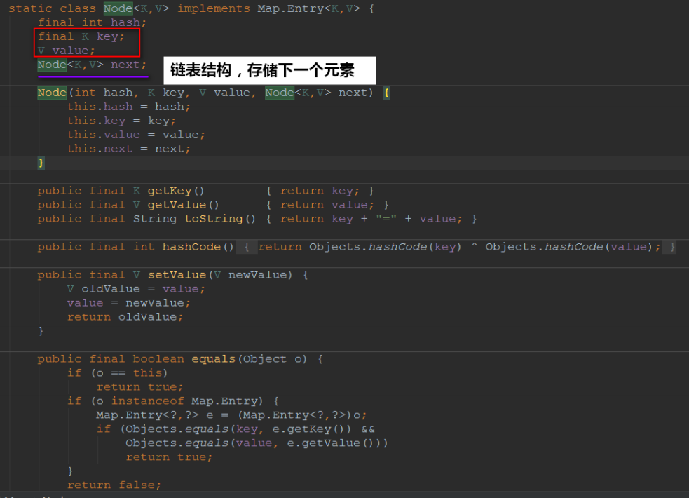


### 2. HashMap 的构造器

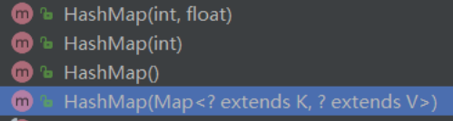


**HashMap(int, float)**

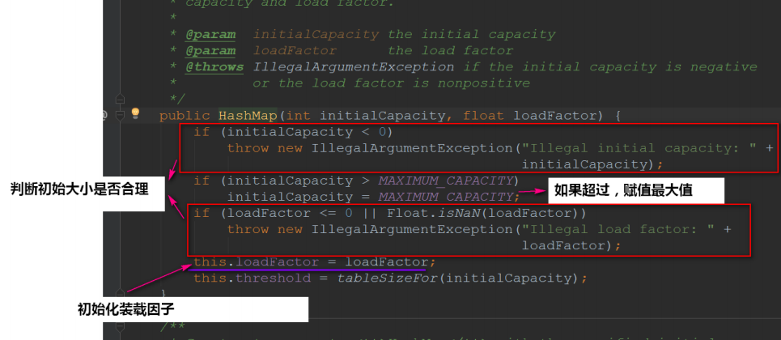

```java
    /**
     * Constructs an empty <tt>HashMap</tt> with the specified initial
     * capacity and load factor.
     * 用确定的初始化容量和装载因子构造一个HashMap
     *
     * @param  initialCapacity the initial capacity 初始化容量
     * @param  loadFactor      the load factor 装载因子
     * @throws IllegalArgumentException if the initial capacity is negative
     *         or the load factor is nonpositive
     */
    public HashMap(int initialCapacity, float loadFactor) {
        if (initialCapacity < 0) //初始容量不能为0
            throw new IllegalArgumentException("Illegal initial capacity: " +
                                               initialCapacity);
        if (initialCapacity > MAXIMUM_CAPACITY) //容量大于最大允许容量(2^30)
            initialCapacity = MAXIMUM_CAPACITY; //赋为最大允许容量
        if (loadFactor <= 0 || Float.isNaN(loadFactor)) //装载因子不能非法
            throw new IllegalArgumentException("Illegal load factor: " +
                                               loadFactor);
        this.loadFactor = loadFactor; //赋为默认装载因子
        this.threshold = tableSizeFor(initialCapacity); 
    }
```

其中最后一行调用的 `tableSizeFor()` 方法如下：

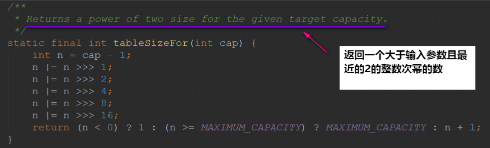

为啥是将**2**的整数幂的数赋给**threshold**？ 

`threshold` 这个成员变量是阈值，决定了是否要将散列表再散列。它的值应该是： `capacity * loadfactor`

其实这里仅仅是一个初始化，当创建哈希表的时候，它会重新赋值的：

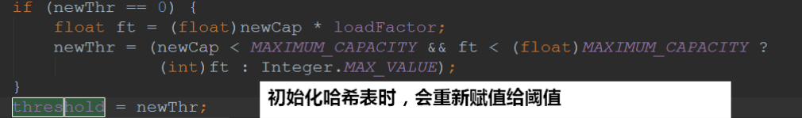


另外几个构造器：

```java
    /**
     * Constructs an empty <tt>HashMap</tt> with the specified initial
     * capacity and the default load factor (0.75).
     * 指定容量大小的构造函数，装载因子为默认值0.75
     * @param  initialCapacity the initial capacity.
     * @throws IllegalArgumentException if the initial capacity is negative.
     */
    public HashMap(int initialCapacity) {
        this(initialCapacity, DEFAULT_LOAD_FACTOR);
    }

    /**
     * Constructs an empty <tt>HashMap</tt> with the default initial capacity
     * (16) and the default load factor (0.75).
     * 默认构造函数，容量为16，装载因子为0.75
     */
    public HashMap() {
        this.loadFactor = DEFAULT_LOAD_FACTOR; // all other fields defaulted
    }

    /**
     * Constructs a new <tt>HashMap</tt> with the same mappings as the
     * specified <tt>Map</tt>.  The <tt>HashMap</tt> is created with
     * default load factor (0.75) and an initial capacity sufficient to
     * hold the mappings in the specified <tt>Map</tt>.
     * 包含另一个“Map”的构造函数
     * @param   m the map whose mappings are to be placed in this map
     * @throws  NullPointerException if the specified map is null
     */
    public HashMap(Map<? extends K, ? extends V> m) {
        this.loadFactor = DEFAULT_LOAD_FACTOR;
        putMapEntries(m, false);
    }
```


### 3. put 方法

```java
    public V put(K key, V value) {
        return putVal(hash(key), key, value, false, true);
        //以key计算哈希值，传入key、value还有两个参数
    }
```

HashMap 只提供了 `put` 用于添加元素，`putVal` 方法只是给 `put` 方法调用的一个方法，并没有提供给用户使用。 

**对 putVal 方法添加元素的分析如下：**

1. 如果定位到的数组位置没有元素就直接插入。
2. 如果定位到的数组位置有元素就和要插入的 key 比较，如果 key 相同就直接覆盖，如果 key 不相同，就判断 p 是否是一个树节点，如果是就调用`e = ((TreeNode)p).putTreeVal(this, tab, hash, key, value)`将元素添加进入。如果不是就遍历链表插入(插入的是链表尾部)。

 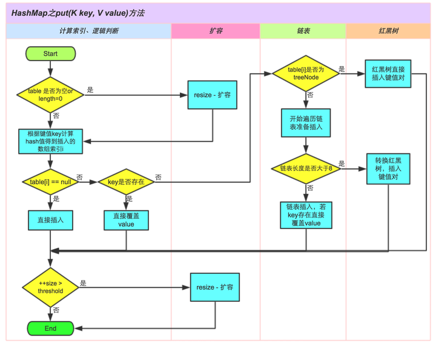 

说明:上图有两个小问题：

- 直接覆盖之后应该就会 return，不会有后续操作。
- 当**链表长度大于阈值（默认为 8）并且 HashMap 数组长度超过 64** 的时候才会执行链表转红黑树的操作，否则就只是对数组扩容。

源码解析：

```java
public V put(K key, V value) {
    // 对key的hashCode()做hash
    return putVal(hash(key), key, value, false, true);
}

final V putVal(int hash, K key, V value, boolean onlyIfAbsent,
                   boolean evict) {
    Node<K,V>[] tab; Node<K,V> p; int n, i;
    // table未初始化或者长度为0，进行扩容
    if ((tab = table) == null || (n = tab.length) == 0)
        n = (tab = resize()).length;
    // (n - 1) & hash 确定元素存放在哪个桶中，桶为空，新生成结点放入桶中(此时，这个结点是放在数组中)
    if ((p = tab[i = (n - 1) & hash]) == null)
        tab[i] = newNode(hash, key, value, null);
    // 桶中已经存在元素
    else {
        Node<K,V> e; K k;
        // 比较桶中第一个元素(数组中的结点)的hash值相等，key相等
        if (p.hash == hash &&
            ((k = p.key) == key || (key != null && key.equals(k))))
                // 将第一个元素赋值给e，用e来记录
                e = p;
        // hash值不相等，即key不相等；如果是红黑树结点
        else if (p instanceof TreeNode)
            // 放入树中
            e = ((TreeNode<K,V>)p).putTreeVal(this, tab, hash, key, value);
        // 如果是链表结点
        else {
            // 在链表最末插入结点
            for (int binCount = 0; ; ++binCount) {
                // 到达链表的尾部
                if ((e = p.next) == null) {
                    // 在尾部插入新结点(尾插法)
                    p.next = newNode(hash, key, value, null);
                    // 结点数量达到阈值(默认为 8 )，执行 treeifyBin 方法
                    // 这个方法会根据 HashMap 数组来决定是否转换为红黑树。
                    // 只有当数组长度大于或者等于 64 的情况下，才会执行转换红黑树操作，以减少搜索时间。否则，就是只是对数组扩容。
                    if (binCount >= TREEIFY_THRESHOLD - 1) // -1 for 1st
                        treeifyBin(tab, hash);
                    // 跳出循环
                    break;
                }
                // 判断链表中结点的key值与插入的元素的key值是否相等
                if (e.hash == hash &&
                    ((k = e.key) == key || (key != null && key.equals(k))))
                    // 相等，跳出循环
                    break;
                // 用于遍历桶中的链表，与前面的e = p.next组合，可以遍历链表
                p = e;
            }
        }
        // 表示在桶中找到key值、hash值与插入元素相等的结点
        if (e != null) {
            // 记录e的value
            V oldValue = e.value;
            // onlyIfAbsent为false或者旧值为null
            if (!onlyIfAbsent || oldValue == null)
                //用新值替换旧值
                e.value = value;
            // 访问后回调
            afterNodeAccess(e);
            // 返回旧值
            return oldValue;
        }
    }
    // 结构性修改
    ++modCount;
    // 实际大小大于阈值则扩容
    if (++size > threshold)
        resize();
    // 插入后回调
    afterNodeInsertion(evict);
    return null;
}
```

>  插入操作在 JDK1.7 和 JDK1.8 是有所不同的，JDK1.7 底层采用 **数组+链表**，插入时采用**头插法** 

 

### 4. resize 方法

进行扩容，会伴随着一次**重新 hash 分配**，并且会遍历 hash 表中所有的元素，是非常耗时的。在编写程序中，要尽量避免 resize。 

分为两步

- 扩容：创建一个新的Entry空数组，长度是原数组的2倍。
- ReHash：遍历原Entry数组，把所有的 Entry 重新 Hash 到新数组。

在初始化的时候要调用这个方法，当散列表元素大于 `capacity * load factor` 的时候也是调用 `resize()`。

每次扩容之后容量都是**翻倍**。扩容后要将原数组中的所有元素找到在新数组中合适的位置。 

```java
final Node<K,V>[] resize() {
    Node<K,V>[] oldTab = table;
    int oldCap = (oldTab == null) ? 0 : oldTab.length;
    int oldThr = threshold;
    int newCap, newThr = 0;
    if (oldCap > 0) {
        // 超过最大值就不再扩充了，就只好容忍碰撞
        if (oldCap >= MAXIMUM_CAPACITY) {
            threshold = Integer.MAX_VALUE;
            return oldTab;//直接返回旧的散列表
        }
        // 没超过最大值，就扩充为原来的2倍
        else if ((newCap = oldCap << 1) < MAXIMUM_CAPACITY && oldCap >= DEFAULT_INITIAL_CAPACITY)
            newThr = oldThr << 1; // double threshold
    }
    else if (oldThr > 0) // initial capacity was placed in threshold
        newCap = oldThr;
    else {
        // signifies using defaults
        newCap = DEFAULT_INITIAL_CAPACITY;
        newThr = (int)(DEFAULT_LOAD_FACTOR * DEFAULT_INITIAL_CAPACITY);
    }
    // 计算新的resize上限
    if (newThr == 0) {
        float ft = (float)newCap * loadFactor;
        newThr = (newCap < MAXIMUM_CAPACITY && ft < (float)MAXIMUM_CAPACITY ? (int)ft : Integer.MAX_VALUE);
    }
    threshold = newThr;
    @SuppressWarnings({"rawtypes","unchecked"})
        Node<K,V>[] newTab = (Node<K,V>[])new Node[newCap];
    table = newTab;
    if (oldTab != null) {
        // 把每个bucket都移动到新的buckets中
        for (int j = 0; j < oldCap; ++j) {
            Node<K,V> e;
            if ((e = oldTab[j]) != null) {
                oldTab[j] = null;
                if (e.next == null)
                    newTab[e.hash & (newCap - 1)] = e;
                else if (e instanceof TreeNode)
                    ((TreeNode<K,V>)e).split(this, newTab, j, oldCap);
                else {
                    Node<K,V> loHead = null, loTail = null;
                    Node<K,V> hiHead = null, hiTail = null;
                    Node<K,V> next;
                    do {
                        next = e.next;
                        // 原索引
                        if ((e.hash & oldCap) == 0) {
                            if (loTail == null)
                                loHead = e;
                            else
                                loTail.next = e;
                            loTail = e;
                        }
                        // 原索引+oldCap
                        else {
                            if (hiTail == null)
                                hiHead = e;
                            else
                                hiTail.next = e;
                            hiTail = e;
                        }
                    } while ((e = next) != null);
                    // 原索引放到bucket里
                    if (loTail != null) {
                        loTail.next = null;
                        newTab[j] = loHead;
                    }
                    // 原索引+oldCap放到bucket里
                    if (hiTail != null) {
                        hiTail.next = null;
                        newTab[j + oldCap] = hiHead;
                    }
                }
            }
        }
    }
    return newTab;
}
```


### 5. get 方法

```java
public V get(Object key) {
    Node<K,V> e;
    return (e = getNode(hash(key), key)) == null ? null : e.value;
    // 计算key的哈希值，调用getNode()获取对应的value
}

final Node<K,V> getNode(int hash, Object key) {
    Node<K,V>[] tab; Node<K,V> first, e; int n; K k;
    if ((tab = table) != null && (n = tab.length) > 0 &&
        (first = tab[(n - 1) & hash]) != null) {// 如果计算出来的哈希值存在该哈希表上
        // 在桶上首位可以找到就直接返回
        if (first.hash == hash && // always check first node
            ((k = first.key) == key || (key != null && key.equals(k))))
            return first;
        // 否则在红黑树中找或者遍历链表来寻找
        if ((e = first.next) != null) {
            // 在树中get
            if (first instanceof TreeNode)
                return ((TreeNode<K,V>)first).getTreeNode(hash, key);
            // 在链表中get
            do {
                if (e.hash == hash &&
                    ((k = e.key) == key || (key != null && key.equals(k))))
                    return e;
            } while ((e = e.next) != null);
        }
    }
    return null;
}
```


### 6. remove 方法

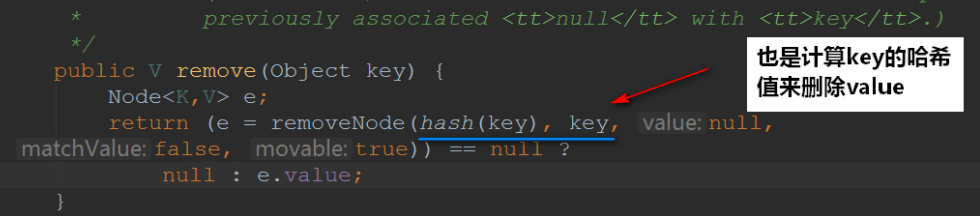

`removeNode()`：

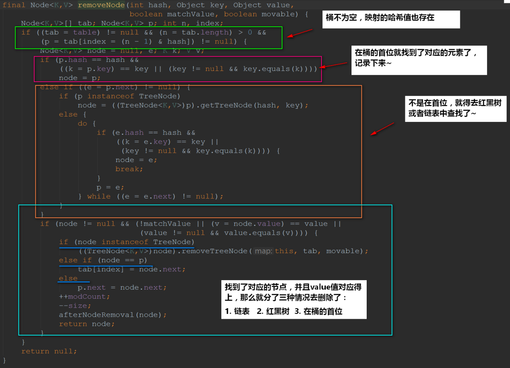


## 三、LinkedHashMap

**类图：**


类注释：

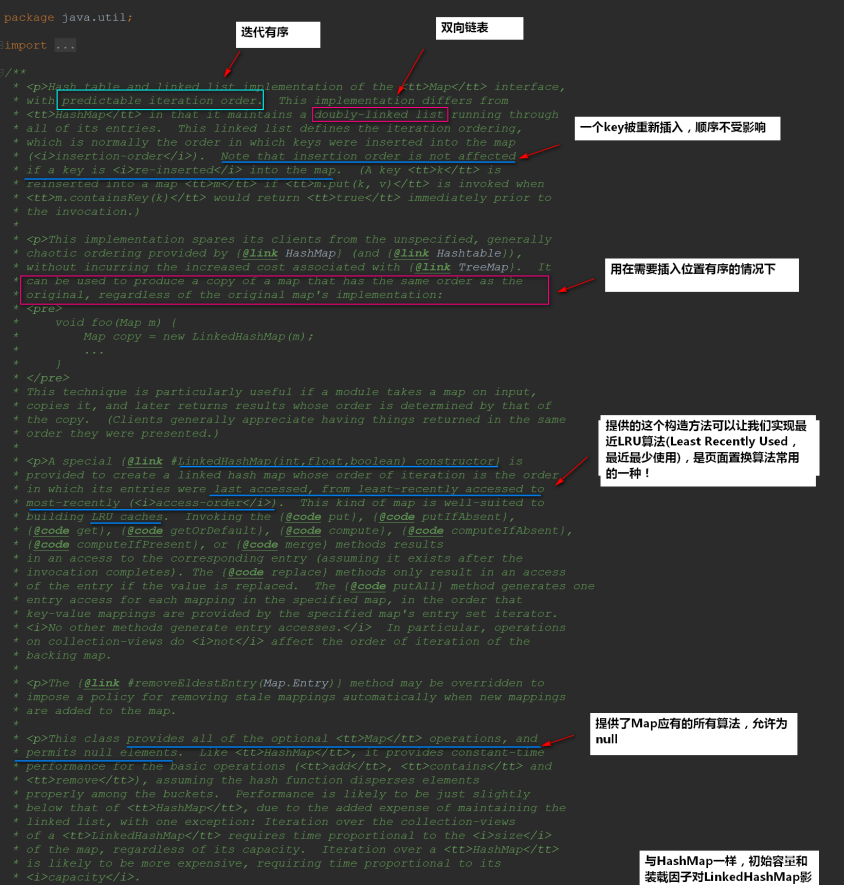

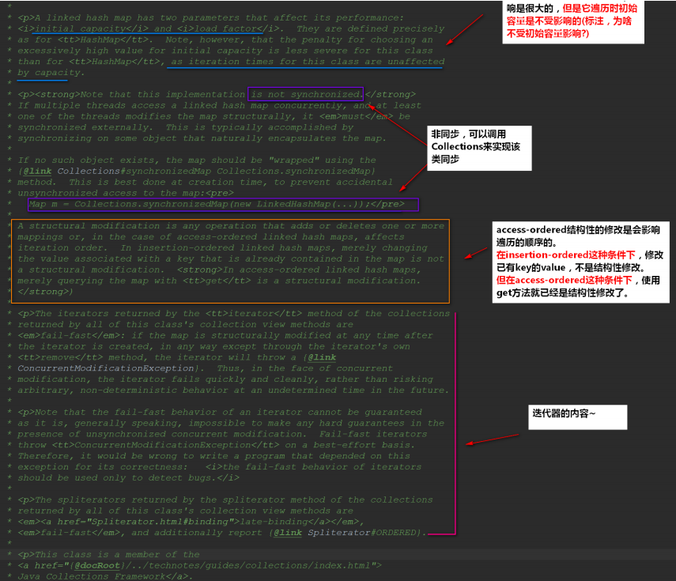

从中可以归纳出 LinkedHashMap 的一些特点：

- 底层是 散列表和双向链表
- 允许为 null，不同步
- 插入的顺序是有序的
- 装载因子和初始容量对 LinkedHashMap 影响很大


通过上面的继承体系，我们知道它继承了 HashMap，所以它的内部也有(数组+链表+红黑树)这三种结构，但是它还额外添加了一种“双向链表”的结构存储所有元素的顺序。

添加删除元素的时候需要同时维护在 HashMap 中的存储，也要维护在 LinkedList 中的存储，所以性能上来说会比HashMap稍慢。

  


### 1. LinkedHashMap 的属性

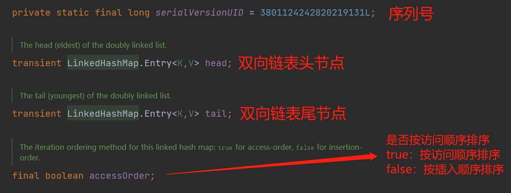

- head

  双向链表的头节点，旧数据存在头节点。

- tail

  双向链表的尾节点，新数据存在尾节点。

- accessOrder

  是否需要按访问顺序排序，通过注释发现该变量为 true 时 access-order，即按访问顺序遍历，此时你任何一次的操作，包括 put、get 操作，都会改变map中已有的存储顺序，如果为 false，则表示按插入顺序遍历。默认为 false 也就是按照插入顺序。


**内部类：**

下面两个内部类都是用于存储节点，继承自HashMap 的 Node类，其 next 属性用于单链表存储于桶中，而 Entry 类的 before 和 after 用于双向链表存储所有元素。 

```java
// 位于LinkedHashMap中
static class Entry<K,V> extends HashMap.Node<K,V> {
    Entry<K,V> before, after;
    Entry(int hash, K key, V value, Node<K,V> next) {
        super(hash, key, value, next);
    }
}
// 位于HashMap中
static class Node<K,V> implements Map.Entry<K,V> {
    final int hash;
    final K key;
    V value;
    Node<K,V> next;
    Node(int hash, K key, V value, Node<K,V> next) {
        this.hash = hash;
        this.key = key;
        this.value = value;
        this.next = next;
    }
    ...
}
```


### 2. LinkedHashMap 的构造方法

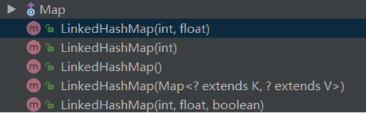

```java
/**
 * 构造方法1，构造一个指定初始容量和负载因子的、按照插入顺序的LinkedList
 */
public LinkedHashMap(int initialCapacity, float loadFactor) {
    super(initialCapacity, loadFactor);
    accessOrder = false;
}

/**
 * 构造方法2，构造一个指定初始容量的LinkedHashMap，取得键值对的顺序是插入顺序
 */
public LinkedHashMap(int initialCapacity) {
    super(initialCapacity);
    accessOrder = false;
}

/**
 * 构造方法3，用默认的初始化容量和负载因子创建一个LinkedHashMap，取得键值对的顺序是插入顺序
 */
public LinkedHashMap() {
    super();  //其实就是调用的hashmap的默认构造方法，默认加载因子0.75
    accessOrder = false;
}

/**
 * 构造方法4，通过传入的map创建一个LinkedHashMap，容量为默认容量（16）和(map.zise()/DEFAULT_LOAD_FACTORY)+1的较大者，加
 *载因子为默认值
 */
public LinkedHashMap(Map<? extends K, ? extends V> m) {
    super(m);
    accessOrder = false;
}

/**
 * 构造方法5，根据指定容量、加载因子和键值对保持顺序创建一个LinkedHashMap
 */
public LinkedHashMap(int initialCapacity, float loadFactor, boolean accessOrder) {
    super(initialCapacity, loadFactor);
    this.accessOrder = accessOrder;
}
```

- 前四个构造方法 `accessOrder` 都等于 `false`，说明双向链表是按插入顺序存储元素。
- 最后一个构造方法 `accessOrder` 从构造方法参数传入，如果传入`true`，则就实现了**按访问顺序存储元素**，这也是实现 **LRU 缓存策略** 的关键。


### 3. newNode 方法

LinkedHashMap 重写了 newNode() 方法，**通过此方法保证了插入的顺序性**，在此之前先看一下 HashMap 的 newNode() 方法 ：

```java
Node<K,V> newNode(int hash, K key, V value, Node<K,V> next) {
    return new Node<>(hash, key, value, next);
}
```

 再看一下 LinkedHashMap 的 newNode() 方法 ：

```java
Node<K,V> newNode(int hash, K key, V value, Node<K,V> e) {
    LinkedHashMap.Entry<K,V> p =
        new LinkedHashMap.Entry<K,V>(hash, key, value, e);//其实还是用的hashmap中的方法
    linkNodeLast(p);
    return p;
}
```

> 在构建新节点时，构建的是 LinkedHashMap.Entry 不再是 Node。

这里调用了一个方法 `linkNodeLast()`，我们看一下这个方法，这个方法不止完成了串联后置，也完成了串联前置，所以`插入的顺序性`是通过这个方法保证的。 

### 4. LinkNodeLast 方法

```java
// link at the end of list 链接当前结点和尾结点
private void linkNodeLast(LinkedHashMap.Entry<K,V> p) {
    //保存尾结点引用
    LinkedHashMap.Entry<K,V> last = tail;
    tail = p;
    //如果这条链表为空。则直接设置为头结点
    if (last == null)
        head = p;
    else {
        //将p结点与尾结点相连通
        p.before = last;
        last.after = p;
    }
}
```

- **插入的顺序的保证是通过newNode()方法再调用linkNodeLast()**
- 将新插入的结点连接到尾结点


### 5. afterNodeAccess 方法

```java
//也就是把p结点从中间拿出来放到尾部
void afterNodeAccess(Node<K,V> e) { // move node to last 将节点移动到最后一个
    LinkedHashMap.Entry<K,V> last;
    // accessOrder 确定是按照访问顺序的，如果当前节点不是最后节点，因为是的话就不用移了
    if (accessOrder && (last = tail) != e) {
        //强转一下e给到p。然后把e的前后结点都取出来
        LinkedHashMap.Entry<K,V> p =
            (LinkedHashMap.Entry<K,V>)e, b = p.before, a = p.after;
        //因为要插到最后所以先给null
        p.after = null;
        //如果p结点前结点为空，将p的后结点变头结点
        if (b == null)
            head = a;
        else
            //将p的前结点指向p的后结点 b>p>a   b>a
            b.after = a;
        //将a也指向b  a<>b
        if (a != null)
            a.before = b;
        else
            //a等于null，就将b作为尾结点
            last = b;
        if (last == null)
            head = p;
        else {
            // last<>p
            p.before = last;
            last.after = p;
        }
        //尾结点p
        tail = p;
        ++modCount;
    }
}
```

- 在 HashMap 中没给具体实现，而在LinkedHashMap 重写了这个方法，目的是**保证操作过的Node节点永远在最后**，从而保证读取的顺序性，在调用 **put 方法和 get 方法**时都会用到。
- 从双向链表中移除访问的节点，把访问的节点加到双向链表的末尾；（末尾为最新访问的元素）


> newNode() 方法中调用的 linkNodeLast(Entry e) 方法和现在的 afterNodeAccess(Node e) 都是**将传入的Node节点放到最后**，那么它们的使用场景如何呢？ 

HashMap 的 put 流程中，如果在对应的 hash 位置上还没有元素，那么直接 new Node() 放到数组 table 中，这个时候对应到 LinkedHashMap 中，**调用了 newNode() 方法，就会用到 linkNodeLast()，将新 node 放到双向链表的最后。**

如果对应的 hash 位置上有元素，进行元素值的覆盖时，就会**调用 afterNodeAccess()，将原本可能不是最后的 node 节点移动到了最后。**


### 6. put 方法

LinkedHashMap 并没有重写 HashMap 中的 put 方法，而是直接继承来使用。所以 LinkedHashMap 和 HashMap 的 put 方法是一样的。

**进行适当删减后的 put 方法逻辑：**

```java
final V putVal(int hash, K key, V value, boolean onlyIfAbsent,boolean evict) {
    if ((p = tab[i = (n - 1) & hash]) == null)
    		// 调用linkNodeLast方法将新元素放到最后
        tab[i] = newNode(hash, key, value, null);
    else {
        if (e != null) {
        	// 如果key已经存在
            V oldValue = e.value;
            if (!onlyIfAbsent || oldValue == null)
                e.value = value;
            // 将存在的节点放到最后(因为存在所以是Access，也就是访问存在的元素)
            afterNodeAccess(e);
            return oldValue;
        }
    }
    ++modCount;
    if (++size > threshold)
        resize();   
    afterNodeInsertion(evict);
    return null;
}
```


### 7. get 方法

```java
public V get(Object key) {
    Node<K,V> e;
    // 调用HashMap定义的方法获取对应的节点
    if ((e = getNode(hash(key), key)) == null)
        return null;
    if (accessOrder)
        afterNodeAccess(e); // 如果是采用访问顺序遍历就会将该节点放到链表尾部
    return e.value;
}
```


### 8. remove 方法

对于 `remove` 方法，在 LinkedHashMap 中也没有重写，它调用的还是父类 HashMap 的 `remove() `方法，在 LinkedHashMap 中重写的是： `afterNodeRemoval(Node<K,V> e)` 这个方法。

### 9. afterNodeRemoval 方法

```java
//就是将e从双链表中移除
void afterNodeRemoval(Node<K,V> e) { // unlink
    // b<>p<>a
    LinkedHashMap.Entry<K,V> p =
        (LinkedHashMap.Entry<K,V>)e, b = p.before, a = p.after;
    //将p脱离
    p.before = p.after = null;
    if (b == null)
        head = a;
    else
        //b>a
        b.after = a;
    if (a == null)
        tail = b;
    else
        //b<>a
        a.before = b;
}
```

- 在节点被删除之后调用的方法
- 因为 LinkedHashMap 的双向链表连接了 LinkedHashMap 中的所有元素，HashMap 中的删除方法可没有考虑这些，它只考虑了如何存红黑树、链表中删除节点，是不维护双向链表的，所以这里才有了这个方法的实现

在 remove 的时候会涉及到这个重写的 afterNodeRemoval 方法：

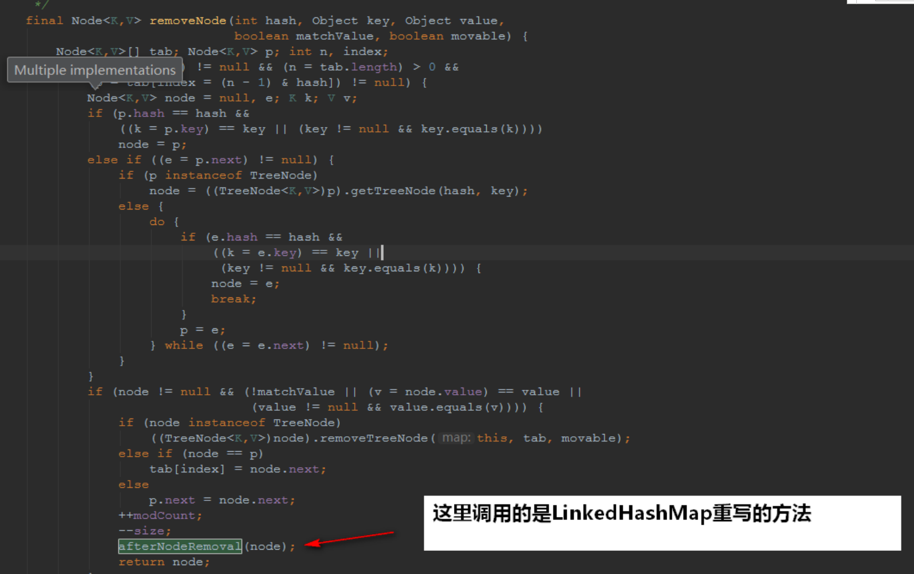


### 10. 遍历

`Set<Map.Entry<K,V>> entrySet() `是被重写的了：

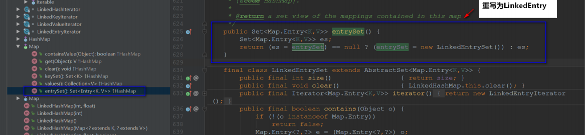

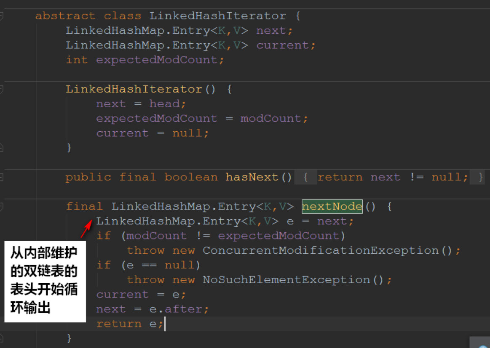

到这就可以解释为什么**初始容量对遍历没有影响**：

因为它遍历的是 LinkedHashMap 内部维护的一个双向链表，而不是散列表。


### 11. 总结

**四个维护双向链表的方法：**

- `afterNodeAccess(Node<K,V> p)`

  访问元素之后维护 

- `afterNodeInsertion(boolean evict)`

  插入元素之后维护 

- `afterNodeRemoval(Node<K,V> p)`

  删除元素之后维护 

- `linkNodeLast(LinkedHashMap.Entry<K,V> p)`

  也是插入元素之后维护，但是只用于桶上的第一个节点，后面的节点都是用afterNodeAccess或者afterNodeInsertion 

**LinkedHashMap**

（1）LinkedHashMap 继承自 HashMap，具有 HashMap 的所有特性；

（2）LinkedHashMap 内部维护了一个**双向链表**存储所有的元素，LinkedHashMap 指的是遍历的时候的有序性，而有序性是通过双向链表实现的，真实的存储之间是没有顺序的。LinkedHashMap 实现了很多方法来维护这个有序性。

（3）如果 accessOrder 为 false，则可以按**插入元素**的顺序遍历元素；

（4）如果 accessOrder 为 true，则可以按**访问元素**的顺序遍历元素，也就是无论 put、get 都会将元素放到链表尾部；

（5）默认的 LinkedHashMap 并不会移除旧元素，如果需要移除旧元素，则需要重写 removeEldestEntry() 方法设定移除策略；

（6）LinkedHashMap 可以用来实现 **LRU 缓存淘汰策略**；

（7）如何实现一个固定大小的 LinkedHashMap？继承 LinkedHashMap 实现 removeEldestEntry 方法，当插入成功后，判断是否要删除最老节点。


## 四、TreeMap

**类图：**

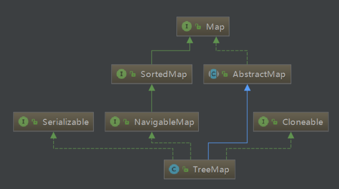

类注释：

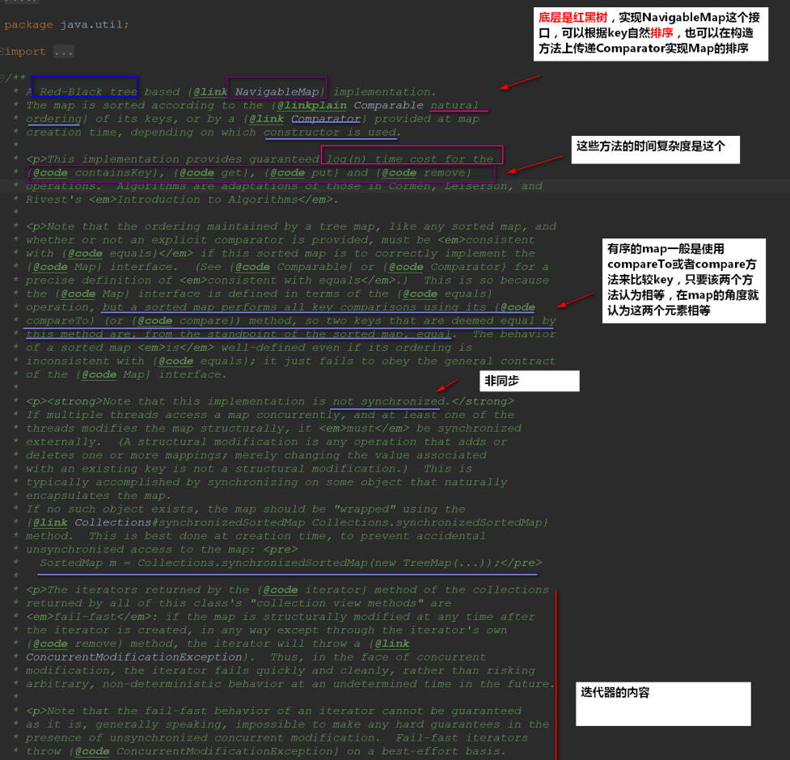

- TreeMap 实现了 NavigableMap 接口，而 NavigableMap 接口继承着 SortedMap 接口，致使 **TreeMap 是有序的** 
- TreeMap底层是**红黑树**，它方法的时间复杂度大都是 log(n) 
- **非同步** 
- 使用 Comparator 或者 Comparable 来比较 key 是否相等与排序的问题


### 1. TreeMap 的属性

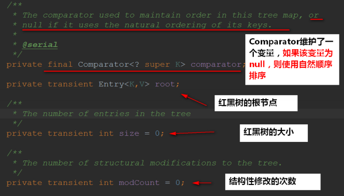

```java
/**
 * 比较器，因为TreeMap是有序的，通过comparator接口我们可以对TreeMap的内部排序进行控制
 */
private final Comparator<? super K> comparator;

/**
 *TreeMap红-黑节点，为TreeMap的内部类 root红黑树的根节点
 */
private transient Entry<K,V> root;

/**
 * TreeMap中存放的键值对的数量
 */
private transient int size = 0;

/**
 * 修改的次数
 */
private transient int modCount = 0;
```


### 2. TreeMap 的构造方法


```java
/**
 * 默认构造方法，比较器为null,那么会使用key的比较器,也就意味着key必须实现Comparable接口,否则在比较的时候就会出现异常
 */
public TreeMap() {
    comparator = null;
}

/**
 * 使用传入的comparator比较两个key的大小
 */
public TreeMap(Comparator<? super K> comparator) {
    this.comparator = comparator;
}

/**
 * key必须实现Comparable接口，把传入map中的所有元素保存到新的TreeMap中
 */
public TreeMap(Map<? extends K, ? extends V> m) {
    comparator = null;
    putAll(m);
}

/**
 * 使用传入map的比较器，并把传入map中的所有元素保存到新的TreeMap中
 */
public TreeMap(SortedMap<K, ? extends V> m) {
    comparator = m.comparator();
    try {
        buildFromSorted(m.size(), m.entrySet().iterator(), null, null);
    } catch (java.io.IOException cannotHappen) {
    } catch (ClassNotFoundException cannotHappen) {
    }
}
```

TreeMap构造方法主要分成两类，一类是**使用 comparator 比较器**，一类是 **key 必须实现 Comparable 接口**。构造方法中比较器的值为 null，采用**自然排序**的方法，如果指定了比较器则称之为**定制排序**：

- **自然排序**：TreeMap 的所有 key 必须实现 Comparable 接口，所有的 key 都是同一个类的对象
- **定制排序**：创建 TreeMap 对象传入了一个 Comparator 对象，该对象负责对 TreeMap 中所有的 key 进行排序，采用定制排序不要求 Map 的 key 实现 Comparable 接口。


### 3. 红黑树结点结构

```java
static final class Entry<K,V> implements Map.Entry<K,V> {
    K key;// 键
    V value;// 值
    Entry<K,V> left;// 左节点
    Entry<K,V> right;// 右节点
    Entry<K,V> parent;// 父节点
    /**
     * 结点颜色 默认为黑 只有两种颜色，红色和黑色
     */
    boolean color = BLACK;
}
```


### 4. put 方法

```java
public V put(K key, V value) {
    Entry<K,V> t = root;
    //如果根结点为null，还没建立
    if (t == null) {
        //官方给的是：类型（可能为null）检查
        compare(key, key); // type (and possibly null) check
        //制造一个根结点，默认为黑
        root = new Entry<>(key, value, null);
        size = 1;
        modCount++;
        return null;
    }
    //定义一个cmp，这个变量用来进行二分查找时的比较
    int cmp;
    Entry<K,V> parent;
    // split comparator and comparable paths 拆分比较器和可比较路径
    //也就是 cpr表示有无自己定义的排序规则，分两种情况遍历执行，主要目的就是找到要插入结点的父结点
    Comparator<? super K> cpr = comparator;
    if (cpr != null) {
        do {
            //存取要插入结点的父结点
            parent = t;
            //比较新的key与根结点key的大小，相当于维护了二叉排序树
            cmp = cpr.compare(key, t.key);
            //小的就放左边
            if (cmp < 0)
                t = t.left;
            //大的就放右边
            else if (cmp > 0)
                t = t.right;
            //一样就覆盖，并返回旧的值
            else
                return t.setValue(value);
        } while (t != null);
    }
    //如果比较器为空，则使用key作为比较器进行比较
    else {
        //这里要求key不能为空，并且必须实现Comparable接口
        if (key == null)
            throw new NullPointerException();
        @SuppressWarnings("unchecked")
        //类型转换，也就相当于实现Comparable接口
        Comparable<? super K> k = (Comparable<? super K>) key;
        do {
            parent = t;
            cmp = k.compareTo(t.key);
            if (cmp < 0)
                t = t.left;
            else if (cmp > 0)
                t = t.right;
            else
                return t.setValue(value);
        } while (t != null);
    }
    //构建新的结点，其父结点就是上面找到的
    Entry<K,V> e = new Entry<>(key, value, parent);
    //判断插左边还是右边
    if (cmp < 0)
        parent.left = e;
    else
        parent.right = e;
    //新插入节点为了保持红黑树平衡，对红黑树进行调整 进行平衡处置，如【变色】【左旋】【右旋】
    fixAfterInsertion(e);
    size++;
    modCount++;
    return null;
}
```

`compare`

```java
//比较方法，如果comparator==null ,采用comparable.compartTo进行比较，否则采用指定比较器比较大小
final int compare(Object k1, Object k2) {
    return comparator==null ? ((Comparable<? super K>)k1).compareTo((K)k2)
        : comparator.compare((K)k1, (K)k2);
}
```


### 5. fixAfterInsertion 调整红黑树 

```java
private void fixAfterInsertion(Entry<K,V> x) {
    //插入结点的颜色默认是红色
    x.color = RED;
    //非空，非根结点，父结点为红结点，否则不用操作
    while (x != null && x != root && x.parent.color == RED) {
        //判断x父结点是否是x爷爷结点的左节结点
        if (parentOf(x) == leftOf(parentOf(parentOf(x)))) {
            //找到爷爷结点的右结点给到y
            Entry<K,V> y = rightOf(parentOf(parentOf(x)));
            //如果x的父结点的兄弟结点y是红色，则x的父结点肯定也是红色的
            if (colorOf(y) == RED) {
                //父结点和叔结节点都为红色,此时通过变色即可实现平衡
                //x的父结点设置为黑色
                setColor(parentOf(x), BLACK);
                //x的父结点的兄弟结点y也设置成黑色
                setColor(y, BLACK);
                //x的爷爷结点设置为红色
                setColor(parentOf(parentOf(x)), RED);
                //将x的爷爷结点重置给x
                x = parentOf(parentOf(x));
                //如果x的父结点和叔父结点是黑色
            } else {
                //如果x是父结点的右结点
                if (x == rightOf(parentOf(x))) {
                    //将x的父结点重置给x
                    x = parentOf(x);
                    //然后左旋
                    rotateLeft(x);
                }
                //设置x的父结点为黑色
                setColor(parentOf(x), BLACK);
                //设置x的爷爷结点为红色
                setColor(parentOf(parentOf(x)), RED);
                //将x的爷爷结点右旋
                rotateRight(parentOf(parentOf(x)));
            }
            //x父结点是x爷爷结点的右节结点
        } else {
            //找到爷爷结点的左结点给到y
            Entry<K,V> y = leftOf(parentOf(parentOf(x)));
            //如果父结点和叔结节点都为红色,此时通过变色即可实现平衡 和上面一样
            if (colorOf(y) == RED) {
                setColor(parentOf(x), BLACK);
                setColor(y, BLACK);
                setColor(parentOf(parentOf(x)), RED);
                x = parentOf(parentOf(x));
                //都为黑
            } else {
                //如果x是父结点的左结点
                if (x == leftOf(parentOf(x))) {
                    //将父结点重置给x
                    x = parentOf(x);
                    //右旋x
                    rotateRight(x);
                }
                //设置x的父结点为黑色
                setColor(parentOf(x), BLACK);
                //设置x的爷爷结点为红色
                setColor(parentOf(parentOf(x)), RED);
                //左旋爷爷结点
                rotateLeft(parentOf(parentOf(x)));
            }
        }
    }
    //根结点一定是黑色
    root.color = BLACK;
}
```

- `设置颜色`、`左右旋`的目的就是保证红黑树的规则

红黑树是一个更高效的检索二叉树，有如下特点：

1. 每个节点只能是红色或者黑色
2. 根节点永远是黑色的
3. 每个叶子节点（NIL）是黑色。（注意：这里叶子节点，是指为空(NIL或NULL)的叶子节点！）
4. 如果一个节点是红色的，则它的子节点必须是黑色的。
5. 从一个节点到该节点的子孙节点的所有路径上包含相同数目的黑节点

由于红黑树的左右旋等调整过程较复杂，这里不再花大篇幅去解释红黑树的原理。

**左旋**

 

- 其实就是 P结点为树的结构改变，**将P结点的右结点V作为父结点，将V的左结点给到P结点的右结点，将P结点给到V结点的左结点**，重新变成以V结点为树节点的二叉树

```java
/** 
 *  以p为树 左旋
 */
private void rotateLeft(Entry<K,V> p) {
    if (p != null) {
        //取出P的右结点给r
        Entry<K,V> r = p.right;
        //将r的左结点给p的右结点，其实就是p的右结点指向p的右结点的左结点
        p.right = r.left;
        //不为空则反过来指向
        if (r.left != null)
            r.left.parent = p;
        //将r的父结点指向p的父结点
        r.parent = p.parent;
        //如果p本来就是整个树的根结点，则将r作为根结点
        if (p.parent == null)
            root = r;
        //将r作为此树的根结点
        else if (p.parent.left == p)
            //原来p是父结点的左结点  就将r作为p父结点的左结点
            p.parent.left = r;
        else
            p.parent.right = r;
        //再将r左结点指向p
        r.left = p;
        p.parent = r;
    }
}
```

**右旋**

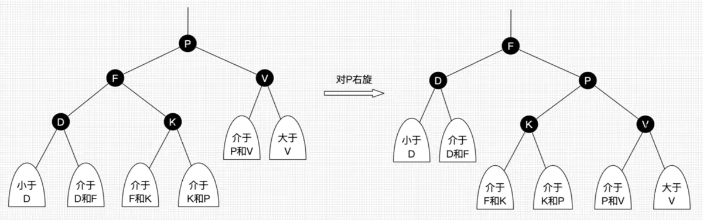 

- 其实就是 P结点为树的结构改变，**将P结点的左结点F作为父结点，将F的右结点给到P结点的左结点，将P结点给到F结点的右结点**，重新变成以F结点为树节点的二叉树

```JAVA
/**
 * 以p为树 右旋  原理和左旋一样
 */
private void rotateRight(Entry<K,V> p) {
    if (p != null) {
        Entry<K,V> l = p.left;
        p.left = l.right;
        if (l.right != null) l.right.parent = p;
        l.parent = p.parent;
        if (p.parent == null)
            root = l;
        else if (p.parent.right == p)
            p.parent.right = l;
        else p.parent.left = l;
        l.right = p;
        p.parent = l;
    }
}
```


### 6. get 方法

```java
public V get(Object key) {
    Entry<K,V> p = getEntry(key);
    return (p==null ? null : p.value);
    // 找到返回value，否则返回null
}

final Entry<K,V> getEntry(Object key) {
    // Offload comparator-based version for sake of performance
    //如果comparator不为空，使用comparator的版本获取元素
    if (comparator != null)
        //代码和根节点遍历一样
        return getEntryUsingComparator(key);
    if (key == null)
        throw new NullPointerException();
    @SuppressWarnings("unchecked")
        //类型转换 就是去实现Comparable
        Comparable<? super K> k = (Comparable<? super K>) key;
    //从根节点开始遍历
    Entry<K,V> p = root;
    while (p != null) {
        int cmp = k.compareTo(p.key);
        //小就从左边找  因为在put的时候满足二叉排序树
        if (cmp < 0)
            p = p.left;
        //大就从右边找
        else if (cmp > 0)
            p = p.right;
        else
            return p;
    }
    return null;
}
```

如果 Comparator 不为 null，则执行`getEntryUsingComparator(Object key)`：

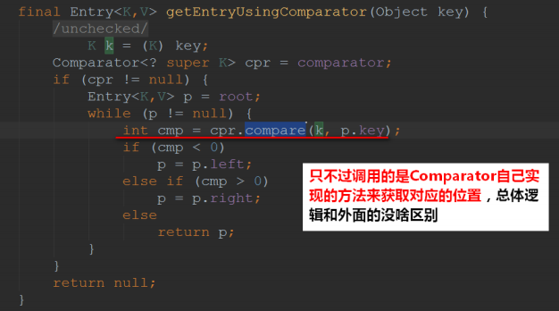


### 7. remove 方法

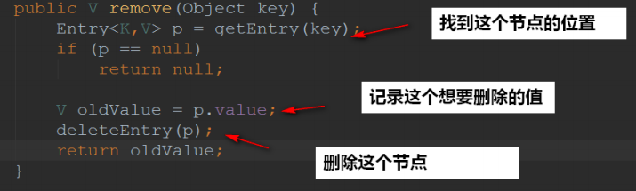

删除节点的时候调用的是 `deleteEntry(Entry<K,V> p) `方法，这个方法主要是删除节点并且平衡红黑树

```java
/**
 * Delete node p, and then rebalance the tree.
 * 删除结点p, 重新平衡树木
 */
private void deleteEntry(Entry<K,V> p) {
    modCount++;
    size--;

    // If strictly internal, copy successor's element to p and then make p
    // point to successor.
    //p结点左右不为空
    if (p.left != null && p.right != null) {
        //寻找到p的右结点中最小的结点
        Entry<K,V> s = successor(p);
        //将最小结点s的key和vaule给p结点
        p.key = s.key;
        p.value = s.value;
        p = s;
        // 这种情况实际上并没有删除p节点，而是把p节点的值改了，实际删除的是p的后继节点
    } // p has 2 children

    // Start fixup at replacement node, if it exists.
    // 如果原来的当前节点（p）有2个子节点，则当前节点已经变成原来p的右子树中的最小节点了，也就是说其没有左子节点了
    // 到这一步，p肯定只有一个子节点了
    //如果当前节点有子节点，则用子节点替换当前节点
    Entry<K,V> replacement = (p.left != null ? p.left : p.right);


    if (replacement != null) {
        // Link replacement to parent
        // 把替换节点直接放到当前节点的位置上（相当于删除了p，并把替换节点移动过来了）
        replacement.parent = p.parent;
        if (p.parent == null)
            root = replacement;
        else if (p == p.parent.left)
            p.parent.left  = replacement;
        else
            p.parent.right = replacement;

        // Null out links so they are OK to use by fixAfterDeletion.
        // 将p的各项属性都设为空 方便gc
        p.left = p.right = p.parent = null;

        // Fix replacement
        // 如果p是黑节点，则需要再平衡
        if (p.color == BLACK)
            fixAfterDeletion(replacement);
    } else if (p.parent == null) { // return if we are the only node.
        // 如果当前节点就是根节点，则直接将根节点设为空即可
        root = null;
    } else { //  No children. Use self as phantom replacement and unlink.
        // 如果当前节点没有子节点且其为黑节点，则把自己当作虚拟的替换节点进行再平衡
        if (p.color == BLACK)
            fixAfterDeletion(p);
        // 平衡完成后删除当前节点（与父节点断绝关系）
        if (p.parent != null) {
            if (p == p.parent.left)
                p.parent.left = null;
            else if (p == p.parent.right)
                p.parent.right = null;
            p.parent = null;
        }
    }
}
```


### 8. 遍历

**TreeMap**遍历是使用 **EntryIterator**这个内部类的

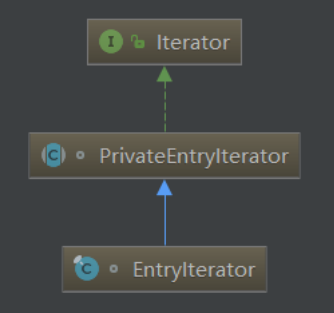

可以发现，EntryIterator 大多的实现都是在父类中：

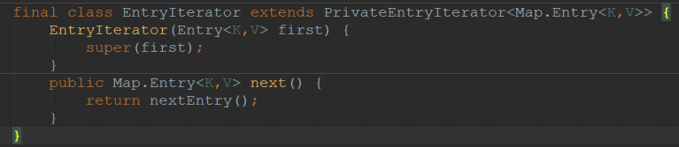

接下来看看 PrivateEntryIterator 比较重要的方法：

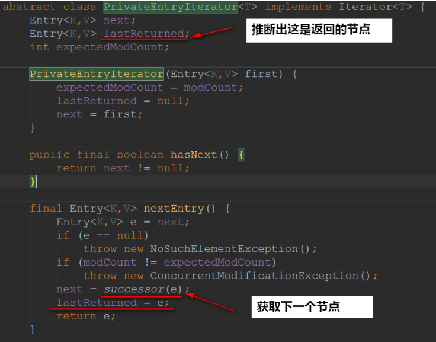

进去 successor(e) 方法看看实现： 

> successor 其实就是一个结点的 下一个结点，所谓 下一个，是按次序排序后的下一个结点。从代码中可以看出，如果右子树不为空，就返回右子树中最小结点。如果右子树为空，就要向上回溯了。在这种情况下，t 是以其为根的树的最后一个结点。如果它是其父结点的左孩子，那么父结点就是它的下一个结点，否则，t 就是以其父结点为根的树的最后一个结点，需要再次向上回溯。一直到 ch 是 p 的左孩子为止。

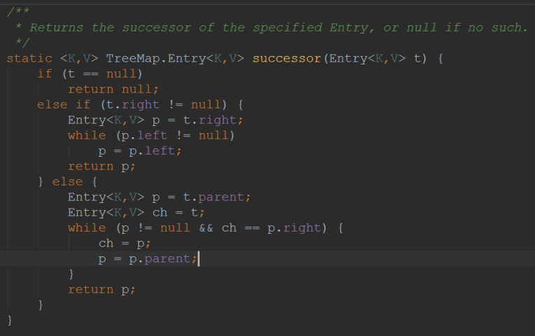


### 9. 总结

（1）TreeMap 的存储结构只有一颗红黑树；

（2）TreeMap 中的元素是有序的，按  key的顺序排列；

（3）TreeMap 比 HashMap 要慢一些，因为 HashMap 前面还做了一层桶，寻找元素要快很多；

（4）TreeMap 没有扩容的概念；

（5）TreeMap 可以按范围查找元素，查找最近的元素；

（6）key 不能为 null，为 null 会抛出 NullPointException

（6）如果在构造方法中传递了 Comparator 对象，那么就会以 Comparator 对象的方法进行比较。否则，则使用  Comparable 的 compareTo(To) 方法来比较。 

- 需要说明的是：如果使用的是 compareTo(To) 方法来比较，**key** ⼀定是不能为 **null**，并且得实现了 Comparable 接口的。 

- 即使是传入了 Comparator 对象，不用 compareTo(To) 方法来比较，key 也是不能为 null 的


## 五、Hashtable

**类图：**

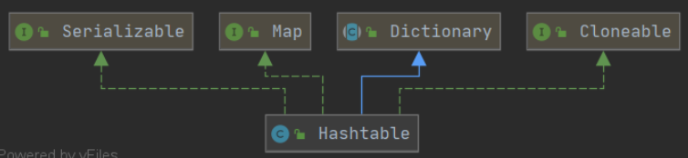

Hashtable 的函数都是**同步**的，这意味着它是线程安全的，能用于多线程环境中, 但是 HashTable 线程安全的策略实现代价却太大了，简单粗暴，get/put 所有相关操作都是 synchronized 的，这相当于给整个哈希表加了一把大锁，多线程访问时候，只要有一个线程访问或操作该对象，那其他线程只能阻塞，相当于将所有的操作串行化，在竞争激烈的并发场景中性能就会非常差。

**它的key、value都不可以为null。**

Hashtable中的映射**不是有序**的。

Hashtable采用"**拉链法**"实现哈希表。


### 1. Hashtable 的属性

```java
/**
 * 哈希表数据
 */
private transient Entry<?,?>[] table;

/**
 * 哈希表中元素的总数
 */
private transient int count;

/**
 * Hashtable的阈值，用于判断是否需要调整Hashtable的容量。threshold的值="容量*加载因子"
 */
private int threshold;

/**
 * 装载因子
 */
private float loadFactor;

/**
 * Hashtable被改变的次数，用于fail-fast机制的实现
 * 所谓快速失败就是在并发集合中，其进行迭代操作时，若有其他线程对其进行结构性的修改，这时迭代器会立马感知到，并且立即抛出ConcurrentModificationException异常，而不是等到迭代完成之后才告诉你（你已经出错了）
 */
private transient int modCount = 0;
```


### 2. Hashtable 的构造方法

```java
/**
 * 用指定初始容量和指定装载因子构造一个新的空哈希表。
 */
public Hashtable(int initialCapacity, float loadFactor) {
    if (initialCapacity < 0)
        throw new IllegalArgumentException("Illegal Capacity: "+
                                           initialCapacity);
    //加载因子必须为正且必须是数字
    if (loadFactor <= 0 || Float.isNaN(loadFactor))
        throw new IllegalArgumentException("Illegal Load: "+loadFactor);
    //如果初始容量为0则让其等于1
    if (initialCapacity==0)
        initialCapacity = 1;
    //初始化加载因子
    this.loadFactor = loadFactor;
    //创建一个Entry类型的数组长度为参数initialCapacity的值
    table = new Entry<?,?>[initialCapacity];
    //计算阀值在初始容量乘以加载因子的值和后者（整数最大32位）之间取最小值。
    threshold = (int)Math.min(initialCapacity * loadFactor, MAX_ARRAY_SIZE + 1);
}

/**
 * 用指定初始容量和默认的加载因子 (0.75) 构造一个新的空哈希表。
 */
public Hashtable(int initialCapacity) {
    this(initialCapacity, 0.75f);
}

/**
 * 默认构造函数，容量为11，加载因子为0.75。
 */
public Hashtable() {
    this(11, 0.75f);
}

/**
 * 根据传入的Map集合直接初始化HashTable,容量为传入Map集合容量大小*2与11进行比较，取值较大者
 */
public Hashtable(Map<? extends K, ? extends V> t) {
    this(Math.max(2*t.size(), 11), 0.75f);
    putAll(t);
}
```

**在初始化阶段，Hashtable 就已经为 table 属性开辟了内存空间**，这和 HashMap 中不同，HashMap 是在第一次调用 put 方法时才为 table 开辟内存的。还有就是默认初始容量不同，一个16一个11。 


### 3. put 方法

```java
public synchronized V put(K key, V value) {
    // Make sure the value is not null
    // 值不能等于null 与hashmap不同
    if (value == null) {
        throw new NullPointerException();
    }

    // Makes sure the key is not already in the hashtable.
    //确保该键不在哈希表中

    //迭代table，将其赋值给局部变量tab
    Entry<?,?> tab[] = table;
    //计算key的hash值，确认在table[]中的索引位置
    //这里如果key为null调用Object的hashCode方法就会报空指针异常，所以key也不能为null
    int hash = key.hashCode();
    // 计算索引位置，这里与hashmap不同
    /**
    * 0x7FFFFFFF: 16进制表示的整型,是整型里面的最大值
    * 0x7FFFFFFF: 0111 1111 1111 1111 1111 1111 1111 1111：除符号位外的所有1
    * (hash & 0x7FFFFFFF) 将产生正整数
    * (hash & 0x7FFFFFFF) % tab.length 将在标签长度的范围内
    * 所以hashtable采用奇数导致的hash冲突会比较少，采用偶数会导致的冲突会增多
    * 4%2 = 6%2 = 8%2 ……
    */
    int index = (hash & 0x7FFFFFFF) % tab.length;
    @SuppressWarnings("unchecked")
    Entry<K,V> entry = (Entry<K,V>)tab[index];
    //遍历对应index位置的链表
    for(; entry != null ; entry = entry.next) {
        //如果已经有了相同key的元素 ，则更新数据，返回原来的元素
        if ((entry.hash == hash) && entry.key.equals(key)) {
            V old = entry.value;
            entry.value = value;
            return old;
        }
    }
    // 增加新Entry元素
    addEntry(hash, key, value, index);
    return null;
}
```

- 可以看到 put 方法加了 `synchronized` 维护，所以这个方法是**线程安全**的
- 从计算 hash 就可以看出为什么采用 11 奇数作为初始容量
- `put` 方法不允许 key 和 value 为 `null` 值，如果发现是 `null`，则直接抛出异常

**addEntry 方法**

```java
private void addEntry(int hash, K key, V value, int index) {
    modCount++;

    Entry<?,?> tab[] = table;
    //元素个数大于阈值则将扩容
    if (count >= threshold) {
        // Rehash the table if the threshold is exceeded
        rehash();
        //扩容后也找到index，也就是链表对应的索引
        tab = table;
        hash = key.hashCode();
        index = (hash & 0x7FFFFFFF) % tab.length;
    }

    // Creates the new entry.
    @SuppressWarnings("unchecked")
    //拿到该index下的链表的头结点
    Entry<K,V> e = (Entry<K,V>) tab[index];
    //然后采用头插法将元素插入,这里和jdk8中hashmap不同
    tab[index] = new Entry<>(hash, key, value, e);
    count++;
}
```

- Hashtable 采用的是**头插法**插入元素，与 jdk8 中的 HashMap 不同。

**rehash 方法**

```java
protected void rehash() {
    //原来的容量(旧的数组的长度)
    int oldCapacity = table.length;
    //将原来的table保存起来
    Entry<?,?>[] oldMap = table;

    // overflow-conscious code
    //新容量 原来两倍加一  保证奇数
    int newCapacity = (oldCapacity << 1) + 1;
    //太大了就完蛋了
    if (newCapacity - MAX_ARRAY_SIZE > 0) {
        if (oldCapacity == MAX_ARRAY_SIZE)
            // Keep running with MAX_ARRAY_SIZE buckets
            return;
        newCapacity = MAX_ARRAY_SIZE;
    }
    //新容量定义新数组
    Entry<?,?>[] newMap = new Entry<?,?>[newCapacity];

    modCount++;
    //求出新的阈值
    threshold = (int)Math.min(newCapacity * loadFactor, MAX_ARRAY_SIZE + 1);
    //进行数组转换
    table = newMap;

    // 把旧哈希表的键值对重新哈希到新哈希表中去（双重循环，十分耗时！）
    // 这个方法类似于HashMap扩容后，将旧数组数据赋给新数组，
    // 在HashMap中会将其旧数组每个桶位进一步‘打散'，放置到新数组对应的桶位上（有一个重新计算桶位的过程）
    for (int i = oldCapacity ; i-- > 0 ;) {
        //遍历每条链表
        for (Entry<K,V> old = (Entry<K,V>)oldMap[i] ; old != null ; ) {
            Entry<K,V> e = old;
            old = old.next;
            //将每条链表的每个结点打乱重新hash 重新组建找到自己的位置，还是头结点插入
            int index = (e.hash & 0x7FFFFFFF) % newCapacity;
            e.next = (Entry<K,V>)newMap[index];
            newMap[index] = e;
        }
    }
}
```

- 扩容 **2倍+1**
- 更新阈值，更新 table
- 遍历旧表中的节点，计算在新表中的 index，插入到对应位置链表的**头部**


### 4. get 方法

```java
public synchronized V get(Object key) {
    Entry<?,?> tab[] = table;
    int hash = key.hashCode();
    int index = (hash & 0x7FFFFFFF) % tab.length;
    for (Entry<?,?> e = tab[index] ; e != null ; e = e.next) {
        if ((e.hash == hash) && e.key.equals(key)) {
            return (V)e.value;
        }
    }
    return null;
}
```

- `synchronized` 保证线程安全


### 5. remove 方法

```java
public synchronized V remove(Object key) {
    Entry<?,?> tab[] = table;
    int hash = key.hashCode();
    int index = (hash & 0x7FFFFFFF) % tab.length;
    @SuppressWarnings("unchecked")
    Entry<K,V> e = (Entry<K,V>)tab[index];
    //找到删除结点的前结点prev
    for(Entry<K,V> prev = null ; e != null ; prev = e, e = e.next) {
        if ((e.hash == hash) && e.key.equals(key)) {
            modCount++;
            //e的前结点不为空
            if (prev != null) {
                //把e删除了 
                prev.next = e.next;
                //e是头结点
            } else {
                //把e的下一个节点左头结点
                tab[index] = e.next;
            }
            count--;
            V oldValue = e.value;
            //交给gc处理e
            e.value = null;
            //返回旧的值
            return oldValue;
        }
    }
    return null;
}
```

- `synchronized` 保证线程安全
- 存在就删除并返回删除的值，不存在返回 `null`


### 6. Hashtable 和 HashMap 的区别

**共同点：**

- 从存储结构和实现来讲基本上是相同的，底层都是 **散列表（数组+链表）**

**不同点：**

- 同步性：
  - HashMap 非同步（可以通过 `Collections.synchronizedMap(hashMap)`，使其实现同步。 ）
  - Hashtable 同步（但不常使用，而是选择 ConcurrentHashMap）
- 是否允许为 null
  - HashMap 允许为 null（一个为 null 的 key 和任意个为 null 的 value；遇到 key 为 null 的时候，调用 putForNullKey 方法进行处理，而对 value 没有处理 ）
  - Hashtable 不允许为 null（key、value 都不能为 null；遇到 null，直接返回 NullPointerException。）
- 默认初始大小和扩容方式
  - HashMap 中 table 大小默认为 16，扩容为原来 `2倍`
  - Hashtable 中 table 大小默认为 11，扩容方式为 `old * 2 + 1`

- 哈希值的使用

  - HashMap 得到 hashCode 后需要进行高位运算

  - Hashtable 直接使用对象的 hashCode

  - ```java
    // HashTable
    int hash = key.hashCode();
    ========================
    // HashMap
    int  hash =  hash(key)
    static final int hash(Object key) {
        int h;
        return (key == null) ? 0 : (h = key.hashCode()) ^ (h >>> 16);
    }
    ```

- 继承

  - HashMap 基于 AbstractMap，AbstractMap 是基于 Map 接口的实现，它以最大限度地减少实现此接口所需的工作。 
  - Hashtable 基于 Dictionary 类，Dictionary 是任何可将键映射到相应值的类的抽象父类 。


## 六、ConcurrentHashMap

**类图：**


类注释：

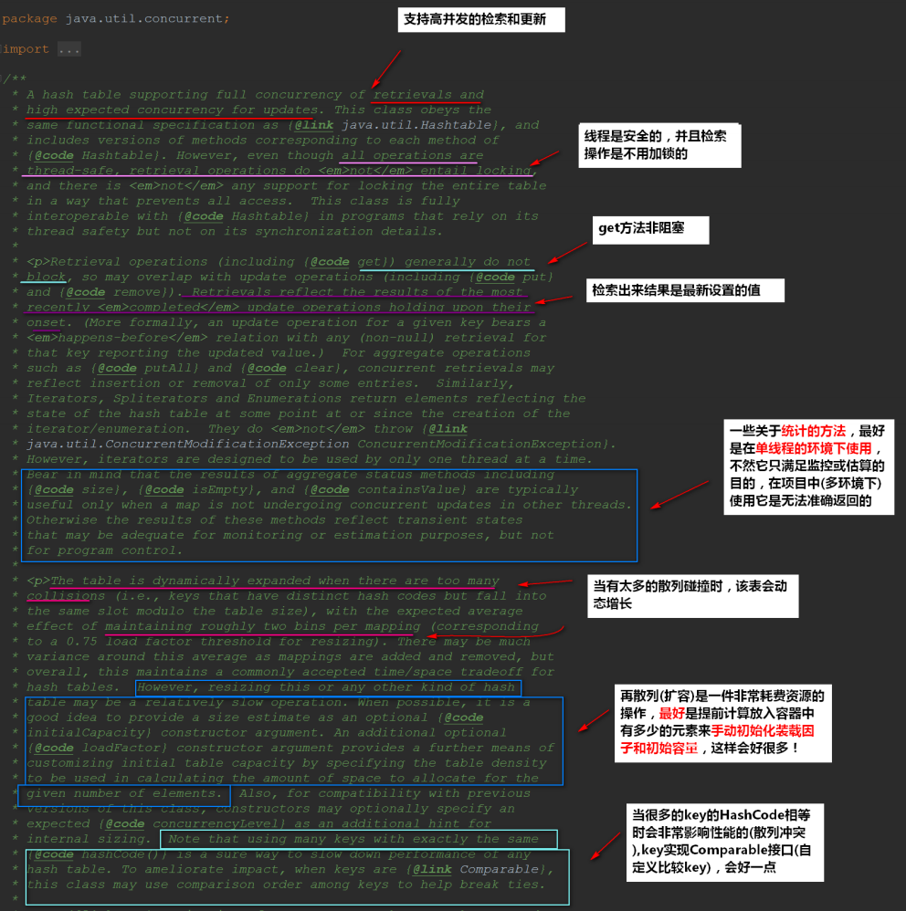

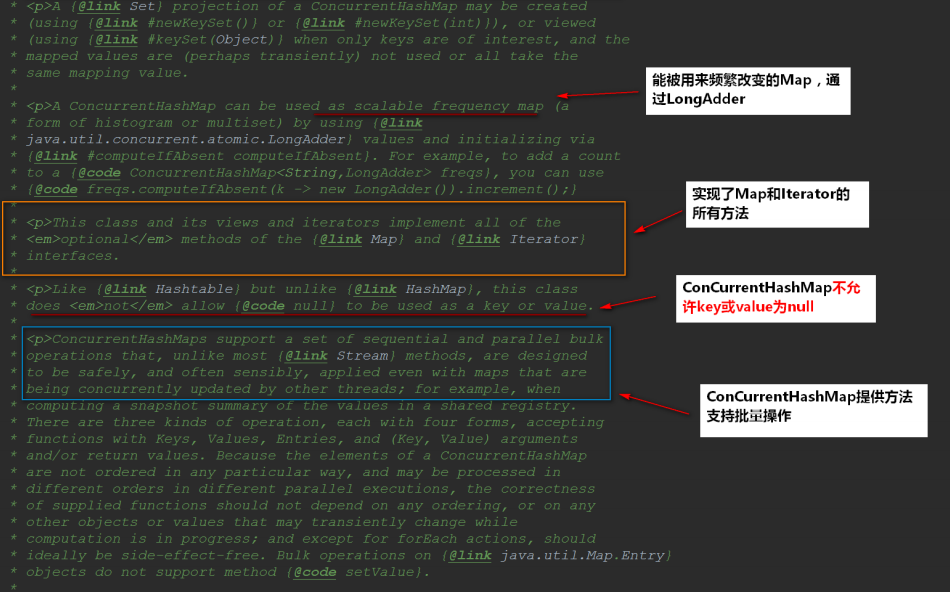

根据上面可以简单归纳出 ConcurrentHashMap 的一些特性：

- jdk8 底层是 **散列表+红黑树**
- ConcurrentHashMap 支持**高并发**的检索和更新，是**线程安全**的
- **检索操作不加锁，get 方法是非阻塞的**
- key、value 都**不允许为 null**


### 1. 为什么有了 Hashtable 还需要 ConcurrentHashMap？

- Hashtable 是在每个方法上都加上了 **Synchronized** 来实现同步，效率低下。
- ConcurrentHashMap 通过**部分加锁**和利用 **CAS 算法**来实现同步。


### 2. ConcurrentHashMap 结构

- JDK 1.8 ：**数组+链表 / 红黑树**，和 HashMap 一样


- JDK 1.7：**segments+HashEntry数组**

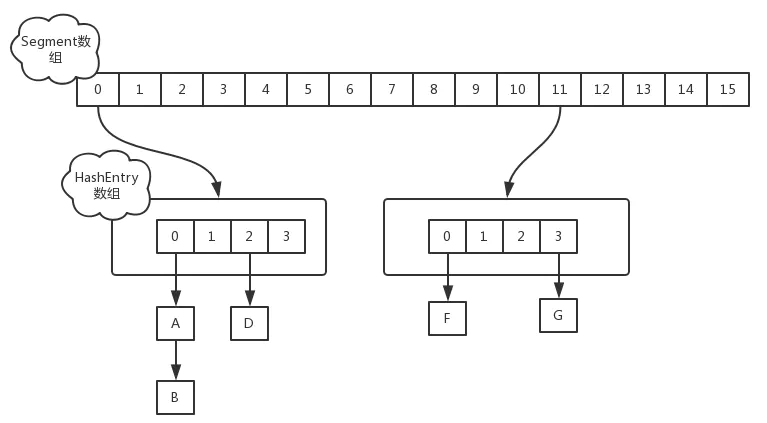 

>  Java 7 中 `ConcurrentHashMap` 的存储结构如上图，`ConcurrnetHashMap` 由很多个 `Segment` 组合，而每一个 `Segment` 是一个类似于 HashMap 的结构，所以每一个 `HashMap` 的内部可以进行扩容。但是 `Segment` 的个数一旦**初始化就不能改变**，默认 `Segment` 的个数是 16 个，可以认为 `ConcurrentHashMap` 默认支持最多 16 个线程并发。 
>
> Segment 继承了 ReentrantLock，每个片段都有一个锁，这叫做“锁分段”


### 3. ConcurrentHashMap 的属性

```java
private static final int MAXIMUM_CAPACITY = 1 << 30; // table数组最大容量
private static final int DEFAULT_CAPACITY = 16; // 默认初始化容量
// 当桶(bucket)上的结点数大于这个值时会转成红黑树
static final int TREEIFY_THRESHOLD = 8;
// 当桶(bucket)上的结点数小于这个值时树转链表
static final int UNTREEIFY_THRESHOLD = 6;
/**
*当一个元素被添加到至少TREEIFY_THRESHOLD个节点的桶中，桶中链表将被转为为树形结构
*/
static final int MIN_TREEIFY_CAPACITY = 64;
static final int MOVED     = -1; // 表示正在转移
static final int TREEBIN   = -2; // 表示已经转换成树
static final int RESERVED  = -3; // 不进行序列化的hash值
static final int HASH_BITS = 0x7fffffff; // usable bits of normal node hash
transient volatile Node<K,V>[] table;//默认没初始化的数组，用来保存元素
private transient volatile Node<K,V>[] nextTable;//转移的时候用的数组,除了扩容的时候，其余时间它都为null
/**
* 用来控制表初始化和扩容的，默认值为0，当在初始化的时候指定了大小，这会将这个大小保存在sizeCtl中，大小为数组的0.75
* 当为负的时候，说明表正在初始化或扩张，
*     -1表示正在初始化
*     -(1+n)  n:表示活动的扩张线程
*/
private transient volatile int sizeCtl;
```


还有几个比较重要的成员如下：

**Node**

和 `HashMap` 一样的。但是注意这个地方采用了 `volatile` 关键字。其他的一样，只有两个是 `volatile` 原因在于这两个是在多线程环境下会被修改，是会变的。 

```java
static class Node<K, V> implements Map.Entry<K, V> {
    final int hash;
    final K key;
    volatile V val;
    volatile Node<K, V> next;
    
    // hashcode 比较有意思 HashMap 中使用了 Objects.hashCode(key) ^ Objects.hashCode(value)
    // 但是 Objects 里面还是调用了 key 和 val 的 hashCode 所以原理一样
    public final int hashCode() {
        return key.hashCode() ^ val.hashCode();
    }

    // 虽然 val 是 volatile 的变量但是不提供修改方法，否则抛异常  
    public final V setValue(V value) {
        throw new UnsupportedOperationException();
    }
}
```


**TreeNode**

由于直接继承了 `Node 节点` 所以相比 `HashMap` 中的 `TreeNode` 少了 before 和 after 属性。它的方法比较少主要是因为红黑树已经不用这个数据结构了而是采用的 `TreeBin` ，但是它存在是因为在转成红黑树的时候是先把 `Node` 封装成 `TreeNode` 然后再封装到 `TreeBin` 中的。 

```java
static final class TreeNode<K, V> extends Node<K, V> {
       TreeNode<K, V> parent;  // red-black tree links
       TreeNode<K, V> left;
       TreeNode<K, V> right;
       TreeNode<K, V> prev;    // needed to unlink next upon deletion
       boolean red;
    ......
}
```


**TreeBin**

```java
static final class TreeBin<K, V> extends Node<K, V> {
       TreeNode<K, V> root;  //用了上文中的 TreeNode
       volatile TreeNode<K, V> first;
       volatile Thread waiter;
       volatile int lockState;
       // values for lockState
       static final int WRITER = 1; // set while holding write lock
       static final int WAITER = 2; // set when waiting for write lock
       static final int READER = 4; // increment value for setting read lock
       
       //  大量的 rb-tree 的方法  不分析了
}
```


### 4. ConcurrentHashMap 的构造方法

在构造方法中类似于 `HashMap` 的做法，在构造方法里面只进行一下参数的判断以及对一些属性进行赋值，但是**没有对数组进行初始化**。还是那个原理：**延时加载**，在 `put` 方法中肯定会对数组进行初始化。    

在这里主要设置的值肯是前面提到的 `sizeCtl` 属性，当它为整数的时候就是阈值，还有需要设置的属性就是负载因子和初始的数组大小，默认是 `0.75` 和 `16` 。 

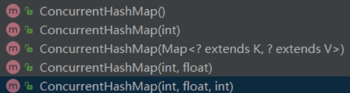

具体说一下每一个方法的实现:

1. 第一个无参的就是空方法，所有的值采用默认。
2. 有初始大小的，就按照 **1.5*n 转成 2^n** 这个格式。
3. 如果传入一个 Map 就和 HashMap 一样，调用 `putAll` 方法，然后 `putAll` 就是循环原来的数组，然后 `put` 到新的数组中。
4. 其他的就是手动设置大小和阈值。

```java
// 空方法，注释说会创建大小为 16 的数组，估计是延时加载 在put方法里面
public ConcurrentHashMap() {
}

// 设置了 sizeCtl 就是下一次扩容的容量
public ConcurrentHashMap(int initialCapacity) {
    if (initialCapacity < 0)
        throw new IllegalArgumentException();
    // 如果要开的数组比最大的一半还大，那就直接分配最大容量
    // 否则分配 1.5n+1 向上取 2^n
    int cap = ((initialCapacity >= (MAXIMUM_CAPACITY >>> 1)) ? MAXIMUM_CAPACITY : tableSizeFor(initialCapacity + (initialCapacity >>> 1) + 1));
    this.sizeCtl = cap;
}

// 同 HashMap
public ConcurrentHashMap(Map<? extends K, ? extends V> m) {
    this.sizeCtl = DEFAULT_CAPACITY;
    putAll(m);
}

public ConcurrentHashMap(int initialCapacity, float loadFactor) {
    this(initialCapacity, loadFactor, 1);
}

// 设置容量和负载因子
public ConcurrentHashMap(int initialCapacity,
                         float loadFactor, int concurrencyLevel) {
    if (!(loadFactor > 0.0f) || initialCapacity < 0 || concurrencyLevel <= 0)
        throw new IllegalArgumentException();
    // 容量不能小于并发数
    if (initialCapacity < concurrencyLevel)   // Use at least as many bins
        initialCapacity = concurrencyLevel;   // as estimated threads
    long size = (long) (1.0 + (long) initialCapacity / loadFactor);
    int cap = (size >= (long) MAXIMUM_CAPACITY) ?
        MAXIMUM_CAPACITY : tableSizeFor((int) size);
    this.sizeCtl = cap;
}
```


### 5. size / sumCount 方法

`size` 方法直接调用了 `sumCount` ，然后 `sumCount` 作用就是统计一下 `cellCount` 数组中的值的和，这时候我们会发现 `cellCount` 是一个类，自己**定义了一个静态内部类，作用就是专门来统计节点的数量。**可见统计节点在并发情况是一件很困难的事，这里还专门设计了一个类来进行统计。里面就一个字段 volatile 的 long 。 

```java
public int size() {
    long n = sumCount();
    // 如果有一些奇怪的值，比如大于最大小于最小就设置为最大，或者最小
    // 否则就是正常的值
    return ((n < 0L) ? 0 : (n > (long) Integer.MAX_VALUE) ? Integer.MAX_VALUE : (int) n);
}

static final class CounterCell {
    volatile long value;

    CounterCell(long x) {
        value = x;
    }
}

final long sumCount() {
    CounterCell[] as = counterCells;
    CounterCell a;
    long sum = baseCount;
    if (as != null) {
        for (int i = 0; i < as.length; ++i) {
            if ((a = as[i]) != null)
                sum += a.value;
        }
    }
    return sum;
}
```


### 6. get 方法

get 方法就和 HashMap 差不多，因为它连锁都没有加，直接就以前的那个套路，首先计算 hash 然后找到数组的节点，看第一个是不是，然后看是否是红黑树或者是链表，它们采用了顺序查找，就 while 循环。

那么需要考虑一下为什么不需要加锁，难道在读元素的时候同时有别的线程在写不会出现安全问题？

举个例子，当我们在遍历一个链表寻找元素的时候刚好有线程在链表的结尾做插入操作，要么我们读到链表结尾的时候，写线程没有更新链表的结尾元素那么我们就认为读先于写也就没有安全问题，因为我们在读的时候不会发现尾节点指针正好发生变化，简单来说写线程的节点指针操作是原子的，对其他线程也是可见的，这时你应该清楚为什么链表的 `next` 是 `volatile` 。

```java
public V get(Object key) {
    Node<K, V>[] tab;
    Node<K, V> e, p;
    int n, eh;
    K ek;
    int h = spread(key.hashCode());
    if ((tab = table) != null && (n = tab.length) > 0 && (e = tabAt(tab, (n - 1) & h)) != null) {
        // 判断头结点是不是
        if ((eh = e.hash) == h) {
            if ((ek = e.key) == key || (ek != null && key.equals(ek)))
                return e.val;
            // 红黑树查找
        } else if (eh < 0)
            return (p = e.find(h, key)) != null ? p.val : null;
        // 顺序查找
        while ((e = e.next) != null) {
            if (e.hash == h && ((ek = e.key) == key || (ek != null && key.equals(ek))))
                return e.val;
        }
    }
    return null;
}
```


### 7. put 方法

`put` 方法里面直接调用了 `putVal`， `putVal` 的逻辑有点复杂，就单看代码来说，代码量是比较大的。    

下面先介绍一下 `putVal` 的大概的逻辑然后再看代码。 

1. 首先就判断了 key 和 value 不能为空的情况。

   > 为什么 HashMap 就允许 null 作为键值 ConcurrentHashMap 却不行？
   >
   > 当我们调用 `map.get(key)` 时候返回 `null` 的时候假如根本不存在这个 `key` ，但是我们由于不清楚这个地方的值到底是 `null` 还是这个 `key` 根本不存在，我们就会调用 `containsKey` 来检查，但是在这个时间间隙中有其他线程往里面放了一个 `key -> null` 导致我们检测的结果是有这个键值对，从而误判！ 

2. 然后前面也提到了，在构造方法中没有任何初始化表的操作，所以说在 putVal 中如果判断到表空，就需要进行初始化工作。这个初始化调用了一个 `initTable()` 方法。 

3. 接着就是利用 hash 值来获取数组的索引了，首先还是判断那个对应的位置有没有元素，如果没有的话就简单了，采用 **CAS 操作**添加一个新节点，此时添加工作就完成了可以返回了。如果不是这种情况就继续往下看。 

4. 看头结点的 Hash 值是否是 `MOVED` ，如果是就说明当前的表正在进行 `transfer` 我们就让当前线程去帮助 `transfer` 。 

5. 否则的话就是一个正常的链表或者红黑树了，这时候就和 HashMap 一样，如果是一个链表就遍历链表，然后遇到相同的 key 进行 value 的替换，否则插入到链表的结尾。 如果是一个红黑树就执行红黑树的插入操作。 注意这个操作是在同步代码块中进行的，因为我们不能保证多线程的修改安全，但是这个代码块的锁是头结点，也就是数组有多少元素我们就可以同时操作多少把锁，这样并发数就是数组的长度。而前面定义的并发数没有实质的作用。 

6. 最后由于我们插入了一个节点需要判断一下当前的节点数是不是大于转红黑树的阈值（默认为8）。是则调用 `treeifyBin`。 

```java
// 直接调用
public V put(K key, V value) {
    return putVal(key, value, false);
}

final V putVal(K key, V value, boolean onlyIfAbsent) {
    // 不允许 null 键值 因为我们没办法判断是没有对应的值还是值为 null 。
    // 在非并发的情况下我们可以使用 containsKey/Value(null) 来明确知道 是不是有 null key/val
    // 这也就解释了为什么 hashmap 在查找的时候采用了先使用 null 来查找的策略
    // 但是并发的话，底层调用了 get 方法，而 get 方法不是同步的，有可能会发生改变产生歧义
    if (key == null || value == null) throw new NullPointerException();
    // 得到 hash 值
    int hash = spread(key.hashCode());
    // 用于记录相应链表的长度
    int binCount = 0;
    for (Node<K, V>[] tab = table; ; ) {
        Node<K, V> f;
        int n, i, fh;
        // 如果数组为 null 也就是没有初始化(延时加载)或者数组没有元素，进行数组初始化
        if (tab == null || (n = tab.length) == 0)
            // 初始化数组
            tab = initTable();
        // 找该 hash 值对应的数组下标，得到第一个节点 f
        else if ((f = tabAt(tab, i = (n - 1) & hash)) == null) {
            // 如果数组该位置为空， 用一次 CAS 操作将这个新值放入其中即可，这个 put 操作差不多就结束了，可以拉到方法的最后面了
            // 如果 CAS 成功，那就是没有并发操作 方法可以结束了  有并发操作就进行下一次循环，注意外面的循环是死循环
            if (casTabAt(tab, i, null, new Node<K, V>(hash, key, value, null)))
                break;                   // no lock when adding to empty bin
        }
        // hash 居然可以等于 MOVED，这个需要到后面才能看明白，不过从名字上也能猜到，肯定是因为在扩容
        else if ((fh = f.hash) == MOVED)
            // 帮助数据迁移，这个等到看完数据迁移部分的介绍后，再理解这个就很简单了
            tab = helpTransfer(tab, f);
        // 到这里就是说，f 是该位置的头结点，而且不为空  也就是一般情况
        else {
            V oldVal = null;
            // 获取数组该位置的头结点的监视器锁
            synchronized (f) {
                // 判断是否有新的节点插入到头部，或者删除头部节点造成不匹配  进行下一次循环
                if (tabAt(tab, i) == f) {
                    if (fh >= 0) { // 头结点的 hash 值大于等于 0，说明是链表
                        binCount = 1;
                        // 遍历链表
                        for (Node<K, V> e = f; ; ++binCount) {
                            K ek;
                            // 如果发现了"相等"的 key，直接覆盖他的 value ，方法结束
                            if (e.hash == hash && ((ek = e.key) == key || (ek != null && key.equals(ek)))) {
                                oldVal = e.val;
                                if (!onlyIfAbsent)
                                    e.val = value;
                                break;
                            }
                            // 到了链表的最末端，将这个新值放到链表的最后面
                            Node<K, V> pred = e;
                            if ((e = e.next) == null) {
                                pred.next = new Node<K, V>(hash, key,
                                        value, null);
                                break;
                            }
                        }
                    } else if (f instanceof TreeBin) { // 红黑树
                        Node<K, V> p;
                        binCount = 2;
                        // 调用红黑树的插值方法插入新节点
                        if ((p = ((TreeBin<K, V>) f).putTreeVal(hash, key,
                                value)) != null) {
                            oldVal = p.val;
                            if (!onlyIfAbsent)
                                p.val = value;
                        }
                    }
                }
            }
            // 退出链表/红黑树的操作  的同步代码块
            // binCount != 0 说明上面在做链表操作
            if (binCount != 0) {
                // 判断是否要将链表转换为红黑树，临界值和 HashMap 一样，也是 8
                if (binCount >= TREEIFY_THRESHOLD)
                    // 这个方法和 HashMap 中稍微有一点点不同，那就是它不是一定会进行红黑树转换，
                    // 如果当前数组的长度小于 64，那么会选择进行数组扩容，而不是转换为红黑树
                    // 具体源码我们就不看了，扩容部分后面说
                    treeifyBin(tab, i);
                if (oldVal != null)
                    return oldVal;
                break;
            }
        }
    }
    addCount(1L, binCount);
    return null;
}
```

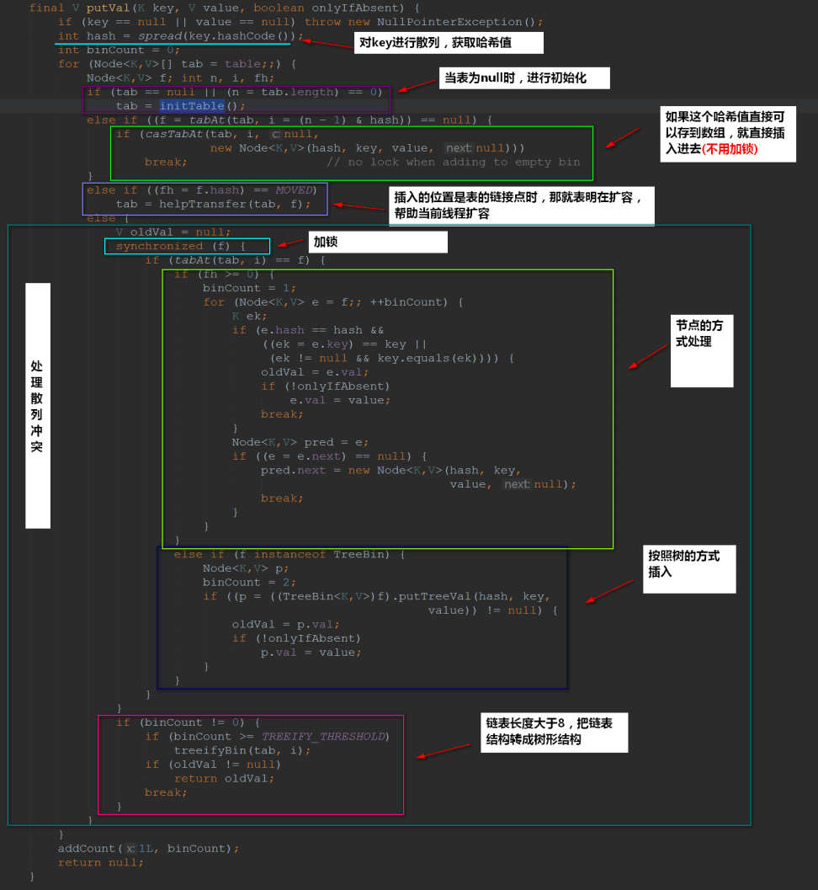


### 8. initTable 方法

HashMap 是采用同样的延时加载然后在 `resize` 方法中进行了表的初始化工作。也就是 HashMap 的 `resize` 方法同时进行了初始化和扩容以及迁移的工作，在 ConcurrentHashMap 中划分的更细致，初始化就只进行初始化，因为并发要考虑到更多。 

**大致逻辑：**

1. 首先需要看是不是有别的线程在进行初始化，如果是就不要进行初始化了让出 cpu 资源让别的线程继续初始化。这个如何判断别的线程是否在初始化？就涉及到了前面的 `sizeCtl` 属性，当它是 -1 的时候就说明在进行表的初始化工作。 
2. 显然当别的线程没有初始化，当前线程就要初始化。并且不让别的线程进行争夺，就把 `sizeCtl` 用 CAS 置为 -1，并开始初始化。 
3. 初始化的工作有两个，一是 new 一个容量为 16 的新数组，其次设置扩容的阈值也就是 `sizeCtl` 的值，设置好了也说明初始化完毕。

```java
private final Node<K, V>[] initTable() {
    Node<K, V>[] tab;
    int sc;
    while ((tab = table) == null || tab.length == 0) {
        // 别的线程已经初始化好了或者正在初始化 sizeCtl 为 -1
        if ((sc = sizeCtl) < 0)
            Thread.yield(); // 让出线程的执行权
        // CAS 一下，将 sizeCtl 设置为 -1，代表抢到了锁 基本在这就相当于同步代码块
        else if (U.compareAndSwapInt(this, SIZECTL, sc, -1)) {
            try {
                if ((tab = table) == null || tab.length == 0) {
                    // DEFAULT_CAPACITY 默认初始容量是 16
                    int n = (sc > 0) ? sc : DEFAULT_CAPACITY;
                    // 初始化数组，长度为 16 或初始化时提供的长度
                    Node<K, V>[] nt = (Node<K, V>[]) new Node<?, ?>[n];
                    // 将这个数组赋值给 table，table 是 volatile 的  他的写发生在别人的读之前
                    table = tab = nt;
                    // 如果 n 为 16 的话，那么这里 sc = 12 其实就是 0.75 * n
                    sc = n - (n >>> 2);
                }
            } finally {
                // 设置下次扩容的时候的阈值
                sizeCtl = sc;
            }
            break;
        }
    }
    return tab;
}
```


### 9. treeifyBin 方法

 当链表长度大于等于 16  但数组长度小于 64 时，需要进行一次扩容操作（还未转成树），扩容操作又委托给了 `tryPresize` 扩容是预计扩容到原来的两倍。注意区分链表长度和数组长度不要弄混了！！！    

接下来就是真正的链表转成树的操作了。 

```java
private final void treeifyBin(Node<K, V>[] tab, int index) {
    Node<K, V> b;
    int n, sc;
    if (tab != null) {
        // MIN_TREEIFY_CAPACITY 为 64
        // 所以，如果数组长度小于 64 的时候，其实也就是 32 或者 16 或者更小的时候，会进行数组扩容
        if ((n = tab.length) < MIN_TREEIFY_CAPACITY)
            // 扩容操作 大小扩容为 (3*n+1)--> 2^n
            tryPresize(n << 1);
        // b 是头结点
        else if ((b = tabAt(tab, index)) != null && b.hash >= 0) {
            // 加锁
            synchronized (b) {

                if (tabAt(tab, index) == b) {
                    // 下面就是遍历链表，建立一颗红黑树
                    TreeNode<K, V> hd = null, tl = null;
                    for (Node<K, V> e = b; e != null; e = e.next) {
                        TreeNode<K, V> p =
                            new TreeNode<K, V>(e.hash, e.key, e.val,
                                               null, null);
                        if ((p.prev = tl) == null)
                            hd = p;
                        else
                            tl.next = p;
                        tl = p;
                    }
                    // 将红黑树设置到数组相应位置中
                    setTabAt(tab, index, new TreeBin<K, V>(hd));
                }
            }
        }
    }
}
```


**tryPresize** 方法：

1. 首先判断表是否为空，空则进行初始化，代码同 `initTable`  
2. 如果 `3*tableSize+1 < 扩容阈值` 就不扩容，这个情况基本不会发生。 
3. 将 `sizeCtl` 设置为下次要进行扩容的阈值，然后进行 `transfer` ，这个方法里面才是真正的将数组大小扩充为原来的两倍并且进行数据迁移。 

整体看起来还是以前的 HashMap 的套路，它的 `resize` 进行初始化、扩容、数据迁移。而这里把这三步拆成了三个方法分别来做，以保证高并发。

```java
private final void tryPresize(int size) {
    // c：size*1.5+1 ，再往上取最近的 2 的 n 次方。
    int c = (size >= (MAXIMUM_CAPACITY >>> 1)) ? MAXIMUM_CAPACITY : tableSizeFor(size + (size >>> 1) + 1);
    int sc;
    // sizeCtl > 0 表示下次扩容的阈值
    while ((sc = sizeCtl) >= 0) {
        Node<K, V>[] tab = table;
        int n;
        // 数组初始化
        // 这个 if 分支和之前说的初始化数组的代码基本上是一样的，在这里，我们可以不用管这块代码
        if (tab == null || (n = tab.length) == 0) {
            n = (sc > c) ? sc : c;
            if (U.compareAndSwapInt(this, SIZECTL, sc, -1)) {
                try {
                    if (table == tab) {
                        @SuppressWarnings("unchecked")
                        Node<K, V>[] nt = (Node<K, V>[]) new Node<?, ?>[n];
                        table = nt;
                        sc = n - (n >>> 2); // 0.75 * n
                    }
                } finally {
                    sizeCtl = sc;
                }
            }
            // 如果扩容后的值还小于等于阈值或者，当前数组长度已经达到最大了 不进行扩容
        } else if (c <= sc || n >= MAXIMUM_CAPACITY)
            break;
        // 进行扩容操作
        else if (tab == table) {
            int rs = resizeStamp(n);
            // 不可能发生
            if (sc < 0) {
                Node<K, V>[] nt;
                if ((sc >>> RESIZE_STAMP_SHIFT) != rs ||
                    sc == rs + 1 ||
                    sc == rs + MAX_RESIZERS ||
                    (nt = nextTable) == null ||
                    transferIndex <= 0
                   )
                    break;
                if (U.compareAndSwapInt(this, SIZECTL, sc, sc + 1))
                    transfer(tab, nt);
            }
            // 1. 将 SIZECTL 设置为 (rs << RESIZE_STAMP_SHIFT) + 2  这个值等于
            //  (n的32位二进制中空位数 << 16 ) + 2 肯定是正数 也就是下次扩容的阈值
            //  调用 transfer 方法，此时 nextTab 参数为 null

            // 2. 这个 cas 操作保证了只有一个线程会最先进行 transfer 操作
            else if (U.compareAndSwapInt(this, SIZECTL, sc, (rs << RESIZE_STAMP_SHIFT) + 2))
                transfer(tab, null);
        }
    }
}
```


### 10. transfer

`transfer` 是这个类中最麻烦也是最精巧的一个方法，还是先说思路再阅读代码。

1. 如果当前的 `nextTab` 是空，也就是说需要进行扩容的数组还没有初始化，那么初始化一个大小是原来两倍的数组出来，作为扩容后的新数组。 
2. 我们分配几个变量，来把原来的数组拆分成几个完全相同的段，可以把他们想象成一个个大小相同的短数组，每个短数组的长度是 `stride` 。 
3. 我们先取最后一个短数组，用 `i` 表示一个可变的指针，可指向短数组的任意一个位置，最开始指向的是短数组的结尾。`bound` 表示短数组的下界，也就是开始的位置。也就是我们在短数组选择的时候是采用从后往前进行的。 
4. 然后使用了一个全局的属性 `transferIndex`（线程共享），来记录当前已经选择过的短数组和还没有被选择的短数组之间的分隔。 
5. 那么当前的线程选择的这个短数组其实就是当前线程应该进行的数据迁移任务，也就是说当前线程就负责完成这一个小数组的迁移任务就行了。那么很显然在 `transferIndex` 之前的，没有被线程处理过的短数组就需要其他线程来帮忙进行数据迁移，其他线程来的时候看到的是 `transferIndex` 那么他们就会从 `transferIndex` 往前数 `stride` 个元素作为一个小数组当做自己的迁移任务。

总结一下：当前的数组的迁移被分为很多的任务包，每一个任务包中有 `stride` 个元素，然后这些任务包需要被从后往前的分配给不同的线程。分配过程依赖于共享的全局变量 `transferIndex` 。这样做的原因就是为了**高并发** 。

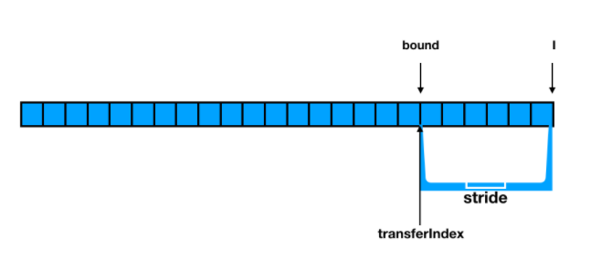

 现在线程收到自己的任务包了，就需要进行数据迁移的工作了。迁移工作就比较简单了，由于是需要对链表或红黑树节点进行操作，必须要对过程同步，锁还是头结点。进行节点迁移的时候，就是和 HashMap 一样，把原来的链表和树拆成两部分，分别放到 i 和 i+n 上。    

主要看链表的拆分，采用的看 hash 值的某一特定位是 0 还是 1 来决定放在哪个位置，节点采用的**头插法**，也就是部分的节点的顺序是反的。为什么说部分是反的？那是因为它在里面一大段代码都在干一件事，去找原链表的最后一段特定位相同的完整序列保持顺序不变。这个比较难说清楚还是用一张图来说明一下。 

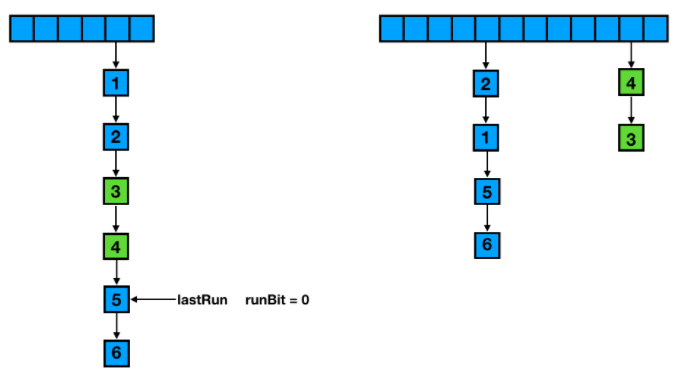

```java
// 把节点拷贝到新数组里面
// 调用情况： 1.在 put 中的转红黑树的时候，如果大小不足 64 试着扩容 时候调用了 transfer
//           2.在调用 put 完成以后，有一个 addCount 操作里面也调用了 transfer
//           3.helpTransfer 中
private final void transfer(Node<K, V>[] tab, Node<K, V>[] nextTab) {
    int n = tab.length, stride;
    // 将这些节点分成若干个任务迁移，每一个任务里面的节点数就是 stride
    // 所以当只有一个 cpu 的时候就是一个任务，多个 cpu 按下面的规则
    if ((stride = (NCPU > 1) ? (n >>> 3) / NCPU : n) < MIN_TRANSFER_STRIDE)
        stride = MIN_TRANSFER_STRIDE; // subdivide range

    // 如果 nextTab 为 null，先进行一次初始化，在属性字段里面我们就看到了这个字段是只有在迁移的时候不是 null
    // 其他时间都是 null

    //由于前面的 cas 操作已经保证了只有一个线程进行 transfer 所以不担心每个线程都会 new 出自己的新数组
    if (nextTab == null) {
        try {
            // 容量翻倍，所以说前面那个 tryPresize 方法里面计算的希望要扩容的大小只是为了与阈值比较一下
            // 真正在扩容的时候只扩充为原来的 2 倍
            Node<K, V>[] nt = (Node<K, V>[]) new Node<?, ?>[n << 1];
            nextTab = nt;
        } catch (Throwable ex) {      // try to cope with OOME
            sizeCtl = Integer.MAX_VALUE;
            return;
        }
        // volatile 赋值
        nextTable = nextTab;
        // 用于控制迁移的位置
        transferIndex = n;
    }
    // 新数组长度
    int nextn = nextTab.length;
    // 标志节点
    // 这个构造方法会生成一个Node，key、value 和 next 都为 null，关键是 hash 为 MOVED
    // 后面我们会看到，原数组中位置 i 处的节点完成迁移工作后，
    // 就会将位置 i 处设置为这个 ForwardingNode，用来告诉其他线程该位置已经处理过了
    ForwardingNode<K, V> fwd = new ForwardingNode<K, V>(nextTab);
    // advance 指的是做完了一个位置的迁移工作，可以准备做下一个位置的了
    boolean advance = true;
    // 在对 nextTable 赋值后记得清理节点  待会说
    boolean finishing = false;


    // 死循环
    for (int i = 0, bound = 0; ; ) {
        Node<K, V> f;
        int fh;

        // 说了这么多 很多都是废话，其实就一句话就是：我们从数组的结尾开始把元素分成任务，其中每一个任务的节点数就是 stride
        // 任务是从后往前分配的，也就是最先分出去的是数组结尾的那一段。任务开始的元素下标是 i 结束的下标是 bound 注意 bound < i
        // 因为是从后往前来的
        while (advance) {
            int nextIndex, nextBound;
            // 刚领取的任务完成了 也就是 i>=bound  一开始我找了半天的 --i 竟然藏在这里
            if (--i >= bound || finishing)
                advance = false;
            // 任务领完了 transferIndex 本来是数组的长度，现在都成0 了说明任务都分派完了
            else if ((nextIndex = transferIndex) <= 0) {
                i = -1;
                advance = false;
                // 实施任务分派，更新了 TRANSFERINDEX 其他线程能看到
            } else if (U.compareAndSwapInt(this, TRANSFERINDEX, nextIndex, nextBound = (nextIndex > stride ? nextIndex - stride : 0))) {
                bound = nextBound;
                i = nextIndex - 1;
                advance = false;
            }
        }

        // 主要就是判断 i<0 ， 也就是是不是都迁移完了  至于 i>=n 是 i = n 导致的
        if (i < 0 || i >= n || i + n >= nextn) {
            int sc;
            // 所有的迁移操作已经完成
            // 将新的 nextTab 赋值给 table 属性，完成迁移
            // 重新计算 sizeCtl = 1.5*n 下次的阈值 结束迁移方法
            if (finishing) {
                nextTable = null;
                table = nextTab;
                sizeCtl = (n << 1) - (n >>> 1);
                return;
            }

            // 之前我们说过，SIZECTL 在迁移前会设置为 (rs << RESIZE_STAMP_SHIFT) + 2
            // d但是怎么会出现这种情况？？？？？
            if (U.compareAndSwapInt(this, SIZECTL, sc = sizeCtl, sc - 1)) {
                // 任务结束，方法退出
                if ((sc - 2) != resizeStamp(n) << RESIZE_STAMP_SHIFT)
                    return;

                // 到这里，说明 (sizeCtl - 2) == resizeStamp(n) << RESIZE_STAMP_SHIFT，
                // 也就是说，所有的迁移任务都做完了，也就会进入到上面的 if(finishing){} 分支了
                finishing = advance = true;
                i = n; // recheck before commit
            }
        }
        // 如果原数组 i 处是空的，没有任何节点，那么放入 ForwardingNode 作为标志
        else if ((f = tabAt(tab, i)) == null)
            advance = casTabAt(tab, i, null, fwd);
        // 该位置处是一个 ForwardingNode，代表该位置已经迁移过了
        else if ((fh = f.hash) == MOVED)
            advance = true; // already processed
        // 原数组处有值
        else {
            // 对数组该位置处的结点加锁，开始处理数组该位置处的迁移工作
            // 迁移干的事同样的事 就是把链表拆成两部分，树也分裂成两部分  和 HashMap 真的几乎一样
            synchronized (f) {
                // 重复判断防止多线程修改
                if (tabAt(tab, i) == f) {
                    Node<K, V> ln, hn;
                    // 头结点的 hash 大于 0，说明是链表的 Node 节点
                    if (fh >= 0) {
                        int runBit = fh & n;
                        Node<K, V> lastRun = f;
                        // p.hash & n 其实是取某一特定的位，只能是 0/1 所以这个做法是把原来一个链表分成两个
                        // lastRun 指向最后一段 runBit 相同的连续的节点的开始
                        // 感觉这一段代码写得有点蠢，就是为了找到最后一段完整的同类型的节点遍历了整个链表 ？ 还是我理解错了？
                        for (Node<K, V> p = f.next; p != null; p = p.next) {
                            int b = p.hash & n;
                            if (b != runBit) {
                                runBit = b;
                                lastRun = p;
                            }
                        }

                        // 分链表的准备工作
                        if (runBit == 0) {
                            ln = lastRun;
                            hn = null;
                        } else {
                            hn = lastRun;
                            ln = null;
                        }
                        // 最后还是按照那个特定的位是 0/1 分成两个链表
                        // 链表的顺序翻转了，采用的头插
                        for (Node<K, V> p = f; p != lastRun; p = p.next) {
                            int ph = p.hash;
                            K pk = p.key;
                            V pv = p.val;
                            if ((ph & n) == 0)
                                ln = new Node<K, V>(ph, pk, pv, ln);
                            else
                                hn = new Node<K, V>(ph, pk, pv, hn);
                        }
                        // 链表放在新数组的位置 i 和 i+n
                        setTabAt(nextTab, i, ln);
                        setTabAt(nextTab, i + n, hn);
                        // 将原数组该位置处设置为 fwd，代表该位置已经处理完毕，
                        // 其他线程一旦看到该位置的 hash 值为 MOVED，就不会进行迁移了
                        setTabAt(tab, i, fwd);
                        // advance 设置为 true，代表该位置已经迁移完毕
                        advance = true;
                    } else if (f instanceof TreeBin) {
                        // 红黑树的迁移
                        TreeBin<K, V> t = (TreeBin<K, V>) f;
                        TreeNode<K, V> lo = null, loTail = null;
                        TreeNode<K, V> hi = null, hiTail = null;
                        int lc = 0, hc = 0;
                        for (Node<K, V> e = t.first; e != null; e = e.next) {
                            int h = e.hash;
                            TreeNode<K, V> p = new TreeNode<K, V>
                                (h, e.key, e.val, null, null);
                            if ((h & n) == 0) {
                                if ((p.prev = loTail) == null)
                                    lo = p;
                                else
                                    loTail.next = p;
                                loTail = p;
                                ++lc;
                            } else {
                                if ((p.prev = hiTail) == null)
                                    hi = p;
                                else
                                    hiTail.next = p;
                                hiTail = p;
                                ++hc;
                            }
                        }

                        // 如果一分为二后，节点数少于 8，那么将红黑树转换回链表
                        ln = (lc <= UNTREEIFY_THRESHOLD) ? untreeify(lo) :
                        (hc != 0) ? new TreeBin<K, V>(lo) : t;
                        hn = (hc <= UNTREEIFY_THRESHOLD) ? untreeify(hi) :
                        (lc != 0) ? new TreeBin<K, V>(hi) : t;
                        // 处理同链表
                        setTabAt(nextTab, i, ln);
                        setTabAt(nextTab, i + n, hn);
                        setTabAt(tab, i, fwd);
                        advance = true;
                    }
                }
            }
        }
    }
}
```


### 11. 总结

- 底层结构是 **散列表（数组+链表）+红黑树**
- Hashtable 是将所有的方法进行同步，效率低下。而ConcurrentHashMap 作为⼀个高并发的容器，它是通过 **部分锁定+CAS 算法** 来进行实现线程安全的。CAS 算法也可以认为是乐观锁的一种
- 在高并发环境下，统计数据（计算 size 等等）其实是无意义的，因为在下一刻 size 的值就变化了
- get 方法是非阻塞的，无锁的。重写 Node 类，通过 volatile 修饰 next 来实现每次获取都是最新设置的值
- **ConcurrentHashMap** 的 **key** 和 **Value** 都不能为 **null**


# 常见面试题


## Java 中常用的容器有哪些？

常见容器主要包括 `Collection` 和 `Map` 两种，`Collection` 存储着对象的集合，而 `Map` 存储着键值对（两个对象）的映射表 。

**Collection**

- **List** ：存储元素是有序的、可重复的。

1. `ArrayList`：基于**动态数组**实现，支持随机访问。
2. `Vector`：和 ArrayList 类似，但它是**线程安全**的（这里需要注意：vector的单个操作时原子性的，也就是线程安全的。但是如果两个原子操作复合而来，这个组合的方法是非线程安全的，需要使用锁来保证线程安全）
3. `LinkedList`：基于**双向链表**实现，只能顺序访问，但是可以快速地在链表中间插入和删除元素。不仅如此，LinkedList 还可以用作栈、队列和双向队列。

- **Queue** ：按特定的排队规则来确定先后顺序，存储的元素是有序的、可重复的。 

1. `LinkedList`：可以用它来实现双向队列。
2. `PriorityQueue`：基于堆结构实现，可以用它来实现优先队列。

- **Set** ：存储的元素是无序的、不可重复的。 

1. `TreeSet`：基于**红黑树**实现，支持**有序**性操作，例如：根据一个范围查找元素的操作。但是查找效率不如 HashSet，HashSet 查找的时间复杂度为 O(1)，TreeSet 则为 O(logN)。
2. `HashSet`：基于**哈希表**实现，支持快速查找，但**不支持有序**性操作。并且失去了元素的插入顺序信息，也就是说使用 Iterator 遍历 HashSet 得到的结果是不确定的。
3. `LinkedHashSet`：具有 HashSet 的查找效率，且内部使用**双向链表**维护元素的插入顺序。

**Map** ：使用键值对（key-value）存储，key 是无序的、不可重复的，value 是无序的、可重复的，每个键最多映射到一个值。 

1. `TreeMap`：基于**红黑树**实现。
2. `HashMap`：基于**哈希表**实现。
3. `HashTable`：和 HashMap 类似，但它是**线程安全**的，这意味着同一时刻多个线程可以同时写入 HashTable 并且不会导致数据不一致。它是遗留类，不应该去使用它。现在可以使用 `ConcurrentHashMap` 来支持线程安全，并且 ConcurrentHashMap 的效率会更高，因为 ConcurrentHashMap 引入了分段锁。
4. `LinkedHashMap`：使用**双向链表**来维护元素的顺序，顺序为插入顺序或者最近最少使用（LRU）顺序。


## ArrayList 和 LinkedList 的区别？

**ArrayList：**底层是基于**数组**实现的，查找快，增删较慢；

**LinkedList：**底层是基于**双向链表**实现的。确切的说是循环双向链表（JDK1.6 之前是双向循环链表、JDK1.7 之后取消了循环），查找慢、增删快。LinkedList 链表由一系列表项连接而成，一个表项包含 3 个部分：元素内容、前驱表和后驱表。链表内部有一个 header 表项，既是链表的开始也是链表的结尾。header 的后继表项是链表中的第一个元素，header 的前驱表项是链表中的最后一个元素。

> **ArrayList 的增删未必就是比 LinkedList 要慢：**
>
> 1. 如果增删都是在末尾来操作【每次调用的都是 remove() 和 add()】，此时 ArrayList 就不需要移动和复制数组来进行操作了。如果数据量有百万级的时，速度是会比 LinkedList 要快的。
> 2. 如果删除操作的位置是在中间。由于 LinkedList 的消耗主要是在遍历上，ArrayList 的消耗主要是在移动和复制上（底层调用的是 arrayCopy() 方法，是 native 方法）。LinkedList 的遍历速度是要慢于 ArrayList 的复制移动速度的如果数据量有百万级的时，还是 ArrayList 要快。


## ArrayList 和 Vector 的区别？

**共同点：** 

- 这两个类都实现了 List 接口，它们都是**有序**的集合(存储有序)，底层是**数组**。可以按位置索引号取出某个元素，**允许元素重复**和为**null**。 

**区别：** 

- 同步性： 

  - ArrayList是**非同步**的 

  - Vector是**同步**的 

  > 即便需要同步的时候，我们可以使用 Collections 工具类来构建出同步的 ArrayList 而不用 Vector 

- 扩容大小： 
  
  - Vector增长原来的**一倍（×2）**，ArrayList增长原来的 **0.5 倍（×1.5）**


## Array 和 ArrayList 有何区别？什么时候更适合用 Array？

1. Array 可以容纳基本类型和对象，而 ArrayList 只能容纳对象；
2. Array 是指定大小的，而 ArrayList 大小是不固定的。

**什么时候更适合使用 Array：**

1. 如果列表的大小已经指定，大部分情况下是存储和遍历它们；
2. 对于遍历基本数据类型，尽管 Collections 使用自动装箱来减轻编码任务，在指定大小的基本类型的列表上工作也会变得很慢；
3. 如果你要使用多维数组，使用 \[ ][ ] 比 List 更容易。


## ArrayList 实现 RandomAccess 接口有何作用？为何 LinkedList 却没实现这个接口？

1. RandomAccess 接口只是一个标志接口，只要 List 集合实现这个接口，就能支持**快速随机访问**。通过查看 Collections 类中的 `binarySearch()` 方法，可以看出，判断 List 是否实现 RandomAccess 接口来实行`indexedBinarySerach(list, key)` 或 `iteratorBinarySerach(list, key)` 方法。再通过查看这两个方法的源码发现：实现 RandomAccess 接口的 List 集合采用一般的 for 循环遍历，而未实现这接口则采用迭代器，即 ArrayList 一般采用 for 循环遍历，而 LinkedList 一般采用迭代器遍历；
2. ArrayList 用 for 循环遍历比 iterator 迭代器遍历快，LinkedList 用 iterator 迭代器遍历比 for 循环遍历快。所以说，当我们在做项目时，应该考虑到 List 集合的不同子类采用不同的遍历方式，能够提高性能。


## ArrayList 的扩容机制？

1. 当使用 `add` 方法的时候首先调用 `ensureCapacityInternal` 方法，传入 `size+1` 进去，检查是否需要扩充 `elementData` 数组的大小；
2. `newCapacity` = 扩充数组为**原来的 1.5 倍**(不能自定义)，如果还不够，就使用它指定要扩充的大小 `minCapacity`，然后判断 `minCapacity` 是否大于 `MAX_ARRAY_SIZE`(Integer.MAX_VALUE – 8) ，如果大于，就取 Integer.MAX_VALUE；
3. 扩容的主要方法：`grow`；
4. ArrayList 中 copy 数组的核心就是 `System.arraycopy` 方法，将 original 数组的所有数据复制到 copy 数组中，这是一个本地方法。


## HashMap 的实现原理/底层数据结构？JDK1.7 和 JDK1.8

**JDK1.7**：Entry数组 + 链表

**JDK1.8**：Node 数组 + 链表/红黑树，**当链表上的元素个数超过 8 个并且数组长度 >= 64 时自动转化成红黑树**，节点变成树节点，以提高搜索效率和插入效率到 **O(logN)**。Entry 和 Node 都包含 key、value、hash、next 属性。


## HashMap 的 size 为什么必须是 2 的整数次方？

1. 这样做总是能够保证 HashMap 的底层数组长度为 2 的 n 次方。当 length 为 2 的 n 次方时，` index = HashCode(Key) & (Length-1) ` 就相当于对 length 取模，而且速度比直接取模快得多，这是 HashMap 在速度上的一个优化。而且每次扩容时都是翻倍。

2. 如果 length 为 2 的次幂，则 `length – 1` 转化为二进制必定是 11111……的形式，在与 hashcode 的二进制进行与操作时效率会非常的快，而且空间不浪费。

   但是，如果 length 不是 2 的次幂，比如：length 为 15，则 length – 1 为 14，对应的二进制为 1110，在和 hashcode 与操作，最后一位都为 0 ，而 0001，0011，0101，1001，1011，0111，1101 这几个位置永远都不能存放元素了，空间浪费相当大，更糟的是这种情况中，数组可以使用的位置比数组长度小了很多，这意味着进一步增加了碰撞的几率，减慢了查询的效率，这样就会造成空间的浪费。


## HashMap 的加载因子为什么是 0.75？

这是“哈希冲突”和“空间利用率”的折中。

**加载因子**是表示 Hsah 表中元素的填满的程度。加载因子越大，填满的元素越多，空间利用率越高，但冲突的机会加大了。反之，加载因子越小，填满的元素越少，冲突的机会减小，但空间浪费多了。

冲突的机会越大，则查找的成本越高。反之，查找的成本越小。

因此，必须在 "冲突的机会"与"空间利用率"之间寻找一种平衡与折中。

### 


## HashMap 的 put 方法的执行过程？

当我们想往一个 HashMap 中添加一对 key-value 时，系统首先会计算 key 的 hash 值，然后根据 hash 值确认在 table 中存储的位置。若该位置没有元素，则直接插入。否则迭代该处元素链表并依次比较其 key 的 hash 值。如果两个 hash 值相等且 key 值相等 `(p.hash == hash &&
((k = p.key) == key || (key != null && key.equals(k))))`，则用新的 Entry 的 value 覆盖原来节点的 value。如果两个 hash 值相等但 key 值不等，则进行插入操作。

不过呢，插入操作在 JDK1.7 和 JDK1.8 是有所不同的，JDK1.7 底层采用数组+链表，插入时采用**头插法**，JDK1.8，底层采用**数组 + 链表 / 红黑树**，并且把头插法改成了**尾插法**，主要是为了减少线程安全的问题，另外，当链表长度大于8，且数组长度大于64时，会把链表转化为红黑树处理，这个时候，就无关是头插还是尾插了，得按照红黑树的规则来插了。


## HashMap 的 get 方法的执行过程？

通过 key 的 hash 值找到在 table 数组中的索引处的 Entry，然后返回该 key 对应的 value 即可。

在这里能够根据 key 快速的取到 value 除了和 HashMap 的数据结构密不可分外，还和 Entry 有莫大的关系。HashMap 在存储过程中并没有将 key，value 分开来存储，而是当做一个整体 key-value 来处理的，这个整体就是Entry 对象。同时 value 也只相当于 key 的附属而已。在存储的过程中，系统根据 key 的 HashCode 来决定 Entry 在 table 数组中的存储位置，在取的过程中同样根据 key 的 HashCode 取出相对应的 Entry 对象（value 就包含在里面）。


## HashMap 的 resize 方法的执行过程？

**有两种情况会调用 resize 方法：**

1. 第一次调用 HashMap 的 put 方法时，会调用 resize 方法对 table 数组进行初始化，如果不传入指定值，默认大小为 16 。
2. 扩容时会调用 resize，即 size > threshold 时，table 数组大小翻倍。

每次扩容之后容量都是**翻倍**。扩容后要将原数组中的所有元素找到在新数组中合适的位置。

当我们把 table[i] 位置的所有 Node 迁移到 newtab 中去的时候：这里面的 node 要么在 newtab 的 i 位置（不变），要么在 newtab 的 i + n 位置。也就是我们可以这样处理：把 table[i] 这个桶中的 node 拆分为两个链表 l1 和 l2：如果  **(e.hash & oldCap) == 0** ，那么当前这个 node 被连接到 l1 链表；否则连接到 l2 链表。这样下来，当遍历完 table[i] 处的所有 node 的时候，我们得到两个链表 l1 和 l2，这时我们令 newtab[i] = l1，newtab[i + n] = l2，这就完成了 table[i] 位置所有 node 的迁移（rehash），这也是 HashMap 中容量一定的是 2 的整数次幂带来的方便之处。


## JDK1.8之后，为什么 HashMap 头插法改为尾插法？

1. 头插法在并发下有致命问题，就是可能形成**数据环**，get 数据时死循环。

   在 1.8 之前因为处理 hash 冲突的方式是用链表存放数据，使用头插法可以提升一定效率。

   但是在 1.8 之后这个效率提升就可有可无了，链表长度超过 7 就要考虑升级红黑树了，所以哪怕进行尾插遍历次数也会很有限，效率影响不大。

2. 就是因为 1.8 之后数据结构的变动，当链表长度达到阈值，升级为红黑树后头插法就不适用了，因为构建红黑树需要进行比对更新序列，也就不能去说是头插法还是尾插了。


## HashMap 多线程死循环问题？

详细见下面链接：

https://blog.csdn.net/xuefeng0707/article/details/40797085

https://blog.csdn.net/dgutliangxuan/article/details/78779448

主要是多线程同时 put 时，如果同时触发了 rehash 操作，会导致 HashMap 中的链表中出现循环节点，进而使得后面 get 的时候，会死循环。


## HashMap 的 get 方法能否判断某个元素是否在 map 中？

HashMap 的 get 函数的返回值不能判断一个 key 是否包含在 map 中，因为 get 返回 null 有可能是不包含该 key，也有可能该 key 对应的 value 为 null。因为 HashMap 中允许 key 为 null，也允许 value 为 null。 


## HashMap 的 key 值要是为类对象则该类需要满足什么条件？

需要同时重写该类的 **hashCode()** 方法和它的 **equals()** 方法。 

- 从源码可以得知，在插入元素的时候是先算出该对象的 **hashCode**。如果 hashcode 相等的话，那么表明该对象是存储在同一个位置上的。 
- 如果调用 equals() 方法，两个 **key** 相同，则**替换元素**。
- 如果调用 equals() 方法，两个 **key** 不相同，则说明该 **hashCode** 仅仅是碰巧相同，此时是散列冲突，将新增的元素放在桶上 。

一般来说，我们会认为：只要两个对象的成员变量的值是相等的，那么我们就认为这两个对象是相等的！因为，Object 底层比较的是两个对象的地址，而对我们开发来说这样的意义并不大~这也就为什么我们要重写 equals() 方法 。

重写了 equals() 方法，就要重写 hashCode() 方法。因为 **equals()** 认定了这两个对象相同，而同⼀个对象调用**hashCode()** 方法时，是应该返回相同的值的！


## HashMap 与 HashTable 的区别是什么？

**共同点：**

- 从存储结构和实现来讲基本上是相同的，底层都是 **散列表（数组+链表）**

**不同点：**

- 同步性：

  - **HashMap 非同步**（可以通过 `Collections.synchronizedMap(hashMap)`，使其实现同步。 ）
  - **Hashtable 同步**（但不常使用，而是选择 ConcurrentHashMap）

- 是否允许为 null

  - **HashMap 允许为 null**（一个为 null 的 key 和任意个为 null 的 value；遇到 key 为 null 的时候，调用 putForNullKey 方法进行处理，而对 value 没有处理 ）
  - **Hashtable 不允许为 null**（key、value 都不能为 null；遇到 null，直接返回 NullPointerException。）

- 默认初始大小和扩容方式

  - HashMap 中 table 大小**默认为 16，扩容为原来 `2倍`**
  - Hashtable 中 table 大小**默认为 11，扩容方式为 `old * 2 + 1`**

- 哈希值的使用

  - HashMap 得到 hashCode 后需要进行高位运算

  - Hashtable 直接使用对象的 hashCode

  - ```java
    // HashTable
    int hash = key.hashCode();
    ========================
    // HashMap
    int  hash =  hash(key)
    static final int hash(Object key) {
        int h;
        return (key == null) ? 0 : (h = key.hashCode()) ^ (h >>> 16);
    }
    ```

- 继承

  - HashMap 基于 AbstractMap，AbstractMap 是基于 Map 接口的实现，它以最大限度地减少实现此接口所需的工作。 
  - Hashtable 基于 Dictionary 类，Dictionary 是任何可将键映射到相应值的类的抽象父类 。


## HashMap 与 ConcurrentHashMap 的区别是什么?

HashMap 不是线程安全的，而 ConcurrentHashMap 是线程安全的。

ConcurrentHashMap 采用锁分段技术，将整个Hash桶进行了分段segment，也就是将这个大的数组分成了几个小的片段 segment，而且每个小的片段 segment 上面都有锁存在，那么在插入元素的时候就需要先找到应该插入到哪一个片段 segment，然后再在这个片段上面进行插入，而且这里还需要获取 segment 锁，这样做明显减小了锁的粒度。


## HashTable 和 ConcurrentHashMap 的区别？

- **底层数据结构：** JDK1.7 的 `ConcurrentHashMap` 底层采用 **分段的数组+链表** 实现，JDK1.8 采用的数据结构跟 `HashMap1.8` 的结构一样，**数组+链表/红黑二叉树**。`Hashtable` 和 JDK1.8 之前的 `HashMap` 的底层数据结构类似都是采用 **数组+链表** 的形式，数组是 HashMap 的主体，链表则是主要为了解决哈希冲突而存在的；

- **实现线程安全的方式（重要）：**Hashtable 是在每个方法上都加上了 **Synchronized** 来实现同步，效率低下。ConcurrentHashMap 通过**部分加锁**和利用 **CAS 算法**来实现同步。

HashTable 和 ConcurrentHashMap 相比，效率低：

 ① **在 JDK1.7 的时候，`ConcurrentHashMap`（分段锁）** 对整个桶数组进行了分割分段(`Segment`)，每一把锁只锁容器其中一部分数据，多线程访问容器里不同数据段的数据，就不会存在锁竞争，提高并发访问率。

**到了 JDK1.8 的时候已经摒弃了 `Segment` 的概念，而是直接用 `Node` 数组+链表+红黑树的数据结构来实现，并发控制使用 `synchronized` 和 CAS 来操作。（JDK1.6 以后 对 `synchronized` 锁做了很多优化）** 整个看起来就像是优化过且线程安全的 `HashMap`，虽然在 JDK1.8 中还能看到 `Segment` 的数据结构，但是已经简化了属性，只是为了兼容旧版本；

② **`Hashtable`(同一把锁)** :使用 `synchronized` 来保证线程安全，效率非常低下。当一个线程访问同步方法时，其他线程也访问同步方法，可能会进入阻塞或轮询状态，如使用 put 添加元素，另一个线程不能使用 put 添加元素，也不能使用 get，竞争会越来越激烈效率越低。 

**两者的对比图：**

**Hashtable：**

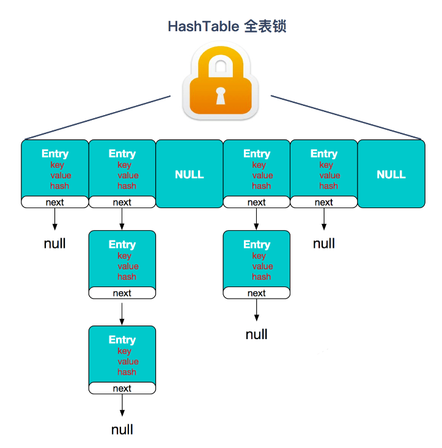

**JDK1.7 的 ConcurrentHashMap：**

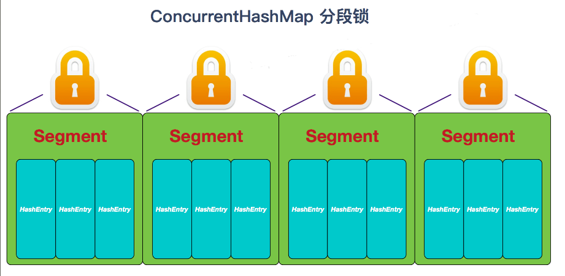

**JDK1.8 的 ConcurrentHashMap：**


> JDK1.8 的 `ConcurrentHashMap` 不再是 **Segment 数组 + HashEntry 数组 + 链表**，而是 **Node 数组 + 链表 / 红黑树**。不过，Node 只能用于链表的情况，红黑树的情况需要使用 **`TreeNode`**。当冲突链表达到一定长度时，链表会转换成红黑树。 


## ConcurrentHashMap 的实现原理是什么？

JDK 7：中 ConcurrentHashMap 采用了**数组 + Segment + 分段锁**的方式实现。

JDK 8：中 ConcurrentHashMap 参考了 JDK 8 HashMap 的实现，采用了**数组 + 链表 + 红黑树**的实现方式来设计，内部大量采用 **CAS 操作**。

ConcurrentHashMap 采用了非常精妙的”分段锁”策略，ConcurrentHashMap 的主干是个 Segment 数组。

```java
final  Segment<K,V>[]  segments;
```

Segment 继承了 ReentrantLock，所以它就是一种可重入锁（ReentrantLock)。在 ConcurrentHashMap，一个 Segment 就是一个子哈希表，Segment 里维护了一个 HashEntry 数组，并发环境下，对于不同 Segment 的数据进行操作是不用考虑锁竞争的。就按默认的 ConcurrentLevel 为 16 来讲，理论上就允许 16 个线程并发执行。

所以，**对于同一个 Segment 的操作才需考虑线程同步，不同的 Segment 则无需考虑**。Segment 类似于 HashMap，一个 Segment 维护着一个HashEntry 数组：

```java
transient  volatile  HashEntry<K,V>[]  table;
```

HashEntry 是目前我们提到的最小的逻辑处理单元了。一个 ConcurrentHashMap 维护一个 Segment 数组，一个 Segment 维护一个 HashEntry 数组。因此，ConcurrentHashMap 定位一个元素的过程需要进行两次 Hash 操作。第一次 Hash 定位到 Segment，第二次 Hash 定位到元素所在的链表的头部。


## HashSet 的实现原理？

HashSet 的实现是依赖于 HashMap 的，HashSet 的值都是存储在 HashMap 中的。在 HashSet 的构造方法中会初始化一个 HashMap 对象，HashSet 不允许值重复。因为 HashSet 的值是作为 HashMap 的 key 存储在 HashMap 中的，当存储的值已经存在时返回 false。 


## HashSet 怎么保证元素不重复的？

```java
public boolean add(E e) {
    return map.put(e, PRESENT)==null;
 }
```

**元素值作为的是 map 的 key，map 的 value 则是 PRESENT 变量**，这个变量只作为放入 map 时的一个占位符而存在，所以没什么实际用处。HashMap 的 key 是不能重复的，而这里HashSet 的元素又是作为了 map 的 key，当然也不能重复了。 


## LinkedHashMap 的实现原理?

LinkedHashMap 也是基于 HashMap 实现的，不同的是它定义了一个 Entry header，这个 header 不是放在 Table 里，它是额外独立出来的。LinkedHashMap 通过继承 hashMap 中的 Entry，并添加两个属性 Entry before、after 和 header 结合起来组成一个双向链表，来实现按插入顺序或访问顺序排序。

LinkedHashMap 定义了排序模式 accessOrder，该属性为 boolean 型变量，对于访问顺序，为 true；对于插入顺序，则为 false。一般情况下，不必指定排序模式，其迭代顺序即为默认为插入顺序。 


## Iterator 怎么使用？有什么特点？

迭代器是一种设计模式，它是一个对象，它可以遍历并选择序列中的对象，而开发人员不需要了解该序列的底层结构。迭代器通常被称为“轻量级”对象，因为创建它的代价小。Java 中的 Iterator 功能比较简单，并且只能单向移动：　　

1. 使用方法 iterator() 要求容器返回一个 Iterator。第一次调用 Iterator 的 next() 方法时，它返回序列的第一个元素。

   注意：iterator() 方法是 java.lang.Iterable 接口，被 Collection 继承。　　

2. 使用 next() 获得序列中的下一个元素。　

3. 使用 hasNext() 检查序列中是否还有元素。　　

4. 使用 remove() 将迭代器新返回的元素删除。　


## Iterator 和 ListIterator 有什么区别？

Iterator 可用来遍历 Set 和 List 集合，但是 ListIterator 只能用来遍历 List。Iterator 对集合只能是前向遍历，ListIterator 既可以前向也可以后向。ListIterator 实现了 Iterator 接口，并包含其他的功能，比如：增加元素，替换元素，获取前一个和后一个元素的索引等等。 


## Iterator 和 Enumeration 接口的区别？

与 Enumeration 相比，Iterator 更加安全，因为当一个集合正在被遍历的时候，它会阻止其它线程去修改集合。否则会抛出 ConcurrentModificationException 异常。这其实就是 fail-fast 机制。具体区别有三点：

1. Iterator 的方法名比 Enumeration 更科学；
2. Iterator 有 fail-fast 机制，比 Enumeration 更安全；
3. Iterator 能够删除元素，Enumeration 并不能删除元素。


## 什么是 fail-fast？它的原理是怎样的？说说它的场景？

1. **快速失败（fail—fast）**是java集合中的一种机制， 在用迭代器遍历一个集合对象时，如果遍历过程中对集合对象的内容进行了修改（增加、删除、修改），则会抛出`Concurrent Modification Exception`。 

2. 迭代器在遍历时直接访问集合中的内容，并且在遍历过程中使用一个 `modCount` 变量。集合在被遍历期间如果内容发生变化，就会改变 `modCount` 的值。

   每当迭代器使用 `hashNext()/next()` 遍历下一个元素之前，都会检测 `modCount` 变量是否为 `expectedmodCount` 值，是的话就返回遍历；否则抛出异常，终止遍历。

   > Tip：这里异常的抛出条件是检测到 `modCount ！= expectedmodCount` 这个条件。如果集合发生变化时修改 `modCount` 值刚好又设置为了 `expectedmodCount` 值，则异常不会抛出。

   因此，不能依赖于这个异常是否抛出而进行并发操作的编程，这个异常只建议用于检测并发修改的bug。

3. java.util 包下的集合类都是快速失败的，不能在多线程下发生并发修改（迭代过程中被修改）算是一种安全机制吧。

   **Tip**：**安全失败（fail—safe）** java.util.concurrent包下的容器都是安全失败，可以在多线程下并发使用，并发修改。


## 什么是 fail-safe？

fail-safe（安全失败）采用安全失败机制的集合容器，在遍历时不是直接在集合内容上访问的，而是先复制原有集合内容，在拷贝的集合上进行遍历。 

**原理：**由于迭代时是对原集合的拷贝进行遍历，所以在遍历过程中对原集合所作的修改并不能被迭代器检测到，所以不会触发Concurrent Modification Exception。

**缺点：**基于拷贝内容的优点是避免了ConcurrentModificationException，但同样地，迭代器并不能访问到修改后的内容，即：**迭代器遍历的是开始遍历那一刻拿到的集合拷贝，在遍历期间原集合发生的修改迭代器是不知道的。**

**场景：**java.util.concurrent 包下的容器都是安全失败，可以在多线程下并发使用，并发修改。


## fail-fast 和 fail-safe 有什么区别？

java.util 包下面的所有的集合类都是快速失败的，而 java.util.concurrent 包下面的所有的类都是安全失败的。fail-fast（快速失败）的迭代器会抛出 ConcurrentModificationException 异常，而因为 fail-safe（安全失败）是基于对底层集合做拷贝，所以，它不受源集合上修改的影响，安全失败的迭代器永远不会抛出这样的异常。


## Collection 和 Collections 有什么区别？

**Collection：**是最基本的集合接口，一个 Collection 代表一组 Object，即 Collection 的元素。它的直接继承接口有 List，Set 和 Queue。

**Collections：**是不属于 Java 的集合框架的，它是集合类的一个**工具类/帮助类**。此类不能被实例化， 服务于 Java 的 Collection 框架。它包含有关集合操作的静态多态方法，实现对各种集合的搜索、排序、线程安全等操作。


## 并发集合类是什么？

Java1.5并发包（java.util.concurrent）包含线程安全集合类，允许在迭代时修改集合。 

- Utils 包下的集合迭代器被设计为 fail-fast 的，会抛出 ConcurrentModificationException，但 java.util.concurrent 的并不会。
- 一部分类为： 
  - CopyOnWriteArrayList 
  - ConcurrentHashMap 
  - CopyOnWriteArraySet


## 同步控制

`Collections` 提供了多个`synchronizedXxx()`方法·，该方法可以将指定集合包装成线程同步的集合，从而解决多线程并发访问集合时的线程安全问题。

我们知道 `HashSet`，`TreeSet`，`ArrayList`,`LinkedList`,`HashMap`,`TreeMap` 都是线程不安全的。`Collections` 提供了多个静态方法可以把他们包装成线程同步的集合。

**最好不要用下面这些方法，效率非常低，需要线程安全的集合类型时请考虑使用 JUC 包下的并发集合。**

方法如下：

```java
synchronizedCollection(Collection<T>  c) //返回指定 collection 支持的同步（线程安全的）collection。
synchronizedList(List<T> list)//返回指定列表支持的同步（线程安全的）List。
synchronizedMap(Map<K,V> m) //返回由指定映射支持的同步（线程安全的）Map。
synchronizedSet(Set<T> s) //返回指定 set 支持的同步（线程安全的）set。
```


## 与 Java 集合框架相关的有哪些好的实践？

1. 根据需要确定集合的类型。如果是单列的集合，我们考虑用 Collection 下的子接口 ArrayList 和 Set。如果是映射，我们就考虑使用 Map。 

2. 确定完我们的集合类型，我们接下来确定使用该集合类型下的哪个子类~我认为可以简单分成几个步骤： 

- 是否需要同步 
  - 去找线程安全的集合类使用
- 迭代时是否需要有序(插入顺序有序) 
  - 去找 Linked 双向列表结构的 
- 是否需要排序(自然顺序或者定制排序) 
  - 去找Tree红黑树类型的（JDK1.8） 

3. 估算存放集合的数据量有多大，无论是 List 还是 Map，它们实现动态增长，都是有性能消耗的。在初始化集合的时候给出⼀个合理的容量会减少动态增长时的消耗~。

4. 使用泛型，避免在运行时出现 ClassCastException 

5. 尽可能使用 Collections 工具类，或者获取只读、同步或空的集合，而非编写自己的实现。它将会提供代码重用性，它有着更好的稳定性和可维护性。