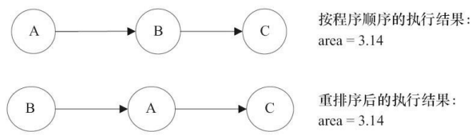

# Java并发编程

> 笔记在阅读完《Java并发编程的艺术》和《Java并发编程实战》二书时所写。

[toc]


# 1. 并发编程的挑战

并发编程的目的是为了让程序运行得更快，但是，并不是启动更多的线程就能让程序最大限度地并发执行。在进行并发编程时，如果希望通过多线程执行任务让程序运行得更快，会面临非常多的挑战：**上下文切换**的问题、**死锁**的问题，以及**受限于硬件和软件的资源限制**问题。


## 1.1上下文切换

即使是单核处理器也支持多线程执行代码，CPU 通过给每个线程分配 **CPU 时间片** 来实现这个机制。

CPU 通过不停地切换线程执行，让我们感觉多个线程是同时执行的，时间片一般是几十毫秒（ms）。

**任务从保存到再加载的过程就是一次上下文切换。** 


### 1.1.1 多线程一定快吗？

下面的代码演示串行和并发执行并累加操作的时间，但是其**并发执行的速度不一定比串行执行快**。


下表是测试结果：


为什么并发执行的速度会比串行慢呢？这是因为线程有创建和上下文切换的开销。 


### 1.1.2 测试上下文切换次数和时长

以下两种工具可以度量上下文切换的消耗：

- 使用 `Lmbench3` 可以测量上下文切换的时长。 

- 使用 `vmstat` 可以测量上下文切换的次数。


### 1.1.3 如何减少上下文切换

减少上下文切换的方法有**无锁并发编程**、**CAS 算法**、**使用最少线程**和**使用协程**。

- **无锁并发编程**：多线程竞争锁时，会引起上下文切换，所以多线程处理数据时，可以用一些办法来避免使用锁，如将数据的 ID 按照 Hash 算法取模分段，不同的线程处理不同段的数据。 

- **CAS 算法**：Java 的 Atomic 包使用 CAS 算法来更新数据，而不需要加锁。 

- **使用最少线程**：避免创建不需要的线程，比如任务很少，但是创建了很多线程来处理，这样会造成大量线程都处于等待状态。 

- **协程**：在单线程里实现多任务的调度，并在单线程里维持多个任务间的切换。

> 什么是 CAS 操作？
>
> **CAS（Compare and Swap 比较和交换）**的思想：一种无锁算法，是原子操作的一种。一共有三个参数，一个当前内存值 V、旧的预期值 A、即将更新的值 B，当且仅当预期值 A 和内存值 V 相同时，将内存值修改为 B 并返回 true，否则什么都不做，并返回 false。


### 1.1.4 减少上下文切换实战流程

> 通过减少线上大量 WAITING 的线程，来减少上下文切换次数。

1. 用 `jstack` 命令 `dump` 线程信息，看看指定 pid 的进程里的线程都在做什么。

2. 统计所有线程分别处于什么状态。
3. 打开 dump 文件查看处于 WAITING（onobjectmonitor）的线程在做什么。
4. 减少工作线程数，可以通过修改该进程的线程池配置信息，降低其最大线程数。
5. 重启进程。再 dump 线程信息，然后统计 WAITING（onobjectmonitor）的线程。

**WAITING 的线程少了，系统上下文切换的次数就会少，因为每一次从 WAITTING 到 RUNNABLE 都会进行一次上下文的切换。**


## 1.2 死锁

死锁代码示例：以下程序中，持有A锁的线程 t1 试图获取B锁，而持有B锁的线程 t2 试图获取A锁，这将会引起死锁。


一旦出现死锁，只能通过 `dump` 线程查看到底是哪个线程出现了问题，以下线程信息告诉我们是 DeadLockDemo 类的第 42 行和第 31 行引起的死锁。


### 1.2.1 避免死锁的常见方法

- 避免一个线程同时获取多个锁。 

- 避免一个线程在锁内同时占用多个资源，尽量保证每个锁只占用一个资源。 

- 尝试使用定时锁，使用 lock.tryLock（timeout）来替代使用内部锁机制。 

- 对于数据库锁，加锁和解锁必须在一个数据库连接里，否则会出现解锁失败的情况。 


## 1.3 资源限制的挑战

### 1.3.1 什么是资源限制

资源限制是指**在进行并发编程时，程序的执行速度受限于计算机硬件资源或软件资源。**

> 硬件资源限制有带宽的上传/下载速度、硬盘读写速度和 CPU 的处理速度。软件资源限制有数据库的连接数和 socket 连接数等。


### 1.3.2 资源限制引发的问题

在并发编程中，将代码执行速度加快的原则是**将代码中串行执行的部分变成并发执行**，但是如果将某段串行的代码并发执行，因为受限于资源，仍然在串行执行，这时候程序不仅不会加快执行，反而会更慢，因为**增加了上下文切换和资源调度的时间**。


### 1.3.3 在资源限制情况下进行并发编程

**根据不同的资源限制调整程序的并发度。**

> 比如下载文件程序依赖于两个资源——带宽和硬盘读写速度。有数据库操作时，涉及数据库连接数，如果 SQL 语句执行非常快，而线程的数量比数据库连接数大很多，则某些线程会被阻塞，等待数据库连接。


### 1.3.4 如何解决资源限制的问题

- **对于硬件资源限制，可以考虑使用集群并行执行程序。**既然单机的资源有限制，那么就让程序在多机上运行。比如使用 ODPS、Hadoop 或者自己搭建服务器集群，不同的 机器处理不同的数据。可以通过“数据 ID%机器数”，计算得到一个机器编号，然后由对应编号的机器处理这笔数据。
- **对于软件资源限制，可以考虑使用资源池将资源复用。**比如使用连接池将数据库和 Socket 连接复用，或者在调用对方 webservice 接口获取数据时，只建立一个连接。 


# 2. Java 并发机制的底层实现原理

Java 代码在编译后会变成 Java 字节码，字节码被类加载器加载到 JVM 里，JVM 执行字节码，最终需要转化为汇编指令在 CPU 上执行。

**Java 中所使用的并发机制依赖于 JVM 的实现和 CPU 的指令。**

实现 Java 并发有两个重要的关键字：

- **volatile**
- **synchronized**


## 2.1 volatile 的应用

`volatile` 是**轻量级**的 `synchronized`，它在多处理器开发中保证了共享变量的“**可见性**”（当一个线程修改一个共享变量时，另外一个线程能读到这个修改的值。）。

> 如果 volatile 变量修饰符使用恰当的话，它比 synchronized 的使用和执行成本更低，因为它不会引起线程上下文的切换和调度。


### 2.1.1 volatile 的定义与实现原理

Java 编程语言允许线程访问共享变量，为了确保共享变量能被准确和一致地更新，线程应该确保通过**排他锁**单独获得这个变量。

如果一个字段被声明成 `volatile`，Java 线程内存模型确保**所有线程看到这个变量的值是一致的**。 

下面是与 `volatile` 实现原理相关的 CPU 术语与说明：


- volatile 是如何来保证可见性的呢？

为了提高处理速度，处理器不直接和内存进行通信，而是先将系统内存的数据读到内部缓存（L1，L2 或其他）后再进行操作，<u>但操作完不知道何时会写到内存</u>。

如果对声明了 volatile 的变量进行写操作，**JVM** 就会向处理器发送一条 **Lock 前缀的指令**，**将这个变量所在缓存行的数据写回到系统内存**。但是，就算写回到内存，如果其他处理器缓存的值还是旧的，再执行计算操作就会有问题。

所以，在多处理器下，为了保证各个处理器的缓存是一致的，就会实现**缓存一致性协议**，每个处理器通过**嗅探在总线上传播的数据**来检查自己缓存的值是不是过期了，当处理器发现自己缓存行对应的内存地址被修改，就会将当前处理器的缓存行设置成无效状态，当处理器对这个数据进行修改操作的时候，会重新从系统内存中把数据读到处理器缓存里。


volatile 的两条实现原则：

- **Lock** **前缀指令会引起处理器缓存回写到内存。**

  Lock 前缀指令导致在执行指令期间，声言处理器的 **LOCK#信号**。在多处理器环境中，**LOCK#信号确保在声言该信号期间，处理器可以独占任何共享内存**【因为 LOCK#信号会锁住总线，导致其他 CPU 不能访问总线，不能访问总线就意味着不能访问系统内存】。

  但是，在最近的处理器里，LOCK＃信号一般不锁总线，而是锁缓存，毕竟锁总线开销的比较大。

  在目前的处理器中，如果访问的内存区域已经缓存在处理器内部，则不会声言 LOCK#信号。相反，它会**锁定这块内存区域的缓存并回写到内存，并使用缓存一致性机制来确保修改的原子性**，此操作被称为“**缓存锁定**”，**缓存一致性机制会阻止同时修改由两个以上处理器缓存的内存区域数据。**

- **一个处理器的缓存回写到内存会导致其他处理器的缓存无效。**

  IA-32 处理器和 Intel 64 处理器使用 `MESI（修改、独占、共享、无效）控制协议` 去维护内部缓存和其他处理器缓存的一致性。在多核处理器系统中进行操作的时候，IA-32 和 Intel 64 处理器能嗅探其他处理器访问系统内存和它们的内部缓存。**处理器使用嗅探技术保证它的内部缓存、系统内存和其他处理器的缓存的数据在总线上保持一致。**


### 2.1.2 volatile 的使用优化

这里举的是一个 JDK 7 并发包中的一个队列集合类 `LinkedTransferQueue` 的例子，它在使用 volatile 变量时，用一种**追加字节**的方式来优化队列出队和入队的性能。

LinkedTransferQueue 代码：


> LinkedTransferQueue 使用一个内部类类型（PaddedAtomicReference）来定义队列的头节点（head）和尾节点（tail），而这个内部类相对于父类 AtomicReference 只做了一件事情，就是将共享变量追加到 64 字节。

为什么追加 64 字节能够提高并发编程的效率呢？

因为许多处理器的 L1、L2 或 L3 缓存的高速缓存行是 64 个字节宽，不支持部分填充缓存行，这意味着，如果队列的头节点和尾节点都不足 64 字节的话，处理器会将它们都读到同一个高速缓存行中，在多处理器下每个处理器都会缓存同样的头、尾节点，当一个处理器试图修改头节点时，会将整个缓存行锁定，那么在缓存一致性机制的作用下，会导致其他处理器不能访问自己高速缓存中的尾节 点，而队列的入队和出队操作则需要不停修改头节点和尾节点，所以在多处理器的情况下将会严重影响到队列的入队和出队效率。使用追加到 64 字节的方式来**填满高速缓冲区的缓存行，避免头节点和尾节点加载到同一个缓存行，使头、尾节点在修改时不会互相锁定。**

***

在以下两种场景下不应该使用追加字节的方式：

- **缓存行非 64 字节宽的处理器**

  如 P6 系列和奔腾处理器，它们的 L1 和 L2 高速缓存 行是 32 个字节宽。 

- **共享变量不会被频繁地写**

  因为使用追加字节的方式需要处理器读取更多的字节到高速缓冲区，这本身就会带来一定的性能消耗，如果共享变量不被频繁写的话，锁的几率也非常小，就没必要通过追加字节的方式来避免相互锁定。


## 2.2 synchronized 的实现原理与应用

`synchronized` 实现同步的基础：**Java 中的每一个对象都可以作为锁。** 

具体表现为：

- 对于**普通同步方法**，锁是**当前实例对象**。 

- 对于**静态同步方法**，锁是**当前类的 Class 对象**。 

- 对于**同步方法块**，锁是 **Synchonized 括号里配置的对象**。

当一个线程试图访问同步代码块时，它首先必须得到锁，退出或抛出异常时必须释放锁。

 

Synchronized 在 JVM 里的实现原理：

> JVM 基于进入和退出 **Monitor 对象**来实现方法同步和代码块同步，但两者的实现细节不一样。代码块同步是使用 **`monitorenter`** 和 **`monitorexit`** 指令实现的，而方法同步是使用另外一种方式实现的，细节在 JVM 规范里并没有详细说明。但是，方法的同步同样可以使用这两个指令来实现。
>
> - **monitorenter 指令**在编译后插入到同步代码块的开始位置。
> - **monitorexit 指令**插入到方法结束处和异常处。
>
> JVM 要保证**每个 monitorenter 必须有对应的 monitorexit 与之配对。任何对象都有一个 monitor 与之关联，当且一个 monitor 被持有后，它将处于锁定状态。线程执行到 monitorenter 指令时，将会尝试获取对象所对应的 monitor 的所有权，即尝试获得对象的锁。**


锁是存在哪里的？锁里面会存储什么信息？

### 2.2.1 Java 对象头

**synchronized 用的锁是存在 Java 对象头里的。**

如果对象是**数组类型**，则虚拟机用 **3 个字宽**（Word）存储对象头，如果对象是**非数组类型**，则用 **2 字宽**存储对象头。在 32 位虚拟机中，**1 字宽 = 4 字节，即 32bit。**

Java 对象头的内容和对应长度如下表：


Java 对象头里的 Mark Word 里默认存储对象的 **HashCode**、**分代年龄**和**锁标记位**。32 位 JVM 的 Mark Word 的默认存储结构如下表所示：


在运行期间，Mark Word 里存储的数据会随着锁标志位的变化而变化，其 4 种数据状态如下：


64 位虚拟机下，Mark Word 是 64 bit 大小的，其存储结构如下：


### 2.2.2 锁的升级与对比

在 Java SE 1.6 中，锁一共有 4 种状态，级别**从低到高**依次是：**无锁**状态、**偏向锁**状态、**轻量级锁**状态和**重量级锁**状态，这几个状态会随着竞争情况逐渐升级。

**锁可以升级但不能降级**，意味着偏向锁升级成轻量级锁后不能降级成偏向锁。这种锁升级却不能降级的策略，目的是为了**提高获得锁和释放锁的效率**。

#### 1. 偏向锁

大多数情况下，锁不仅不存在多线程竞争，而且总是由同一线程多次获得，为了让线程获得锁的代价更低而引入了**偏向锁**。

当一个线程访问同步块并获取锁时，会在对象头和栈帧中的锁记录里存储锁偏向的线程 ID，以后该线程在进入和退出同步块时不需要进行 CAS 操作来加锁和解锁，只需简单地测试一下对象头的 Mark Word 里是否存储着指向当前线程的偏向锁。

如果测试成功，表示线程已经获得了锁。如果测试失败，则需要再测试一下 Mark Word 中偏向锁的标识是否设置成 1（表示当前是偏向锁）：如果没有设置，则使用 CAS 竞争锁；如果设置了，则尝试使用 CAS 将对象头的偏向锁指向当前线程。

##### 偏向锁的撤销

偏向锁使用了一种**等到竞争出现才释放锁**的机制，所以当其他线程尝试竞争偏向锁时，持有偏向锁的线程才会释放锁。

偏向锁的撤销，需要等待**全局安全点**（在这个时间点上没有正在执行的字节码）。

> 它会首先暂停拥有偏向锁的线程，然后检查持有偏向锁的线程是否活着，如果线程不处于活动状态，则将对象头设置成无锁状态；如果线程仍然活着，拥有偏向锁的栈会被执行，遍历偏向对象的锁记录，栈中的锁记录和对象头的 Mark Word 要么重新偏向于其他线程，要么恢复到无锁或者标记对象不适合作为偏向锁，最后唤醒暂停的线程。

下图中的线程 1 演示了偏向锁初始化的流程，线程 2 演示了偏向锁撤销的流程：


##### 关闭偏向锁

偏向锁在 Java 6 和 Java 7 里是默认启用的，但是它在应用程序启动几秒钟之后才激活，如有必要可以使用 JVM 参数来关闭延迟：`-XX:BiasedLockingStartupDelay=0` 。如果确定应用程序里所有的锁通常情况下处于竞争状态，可以通过 JVM 参数关闭偏向锁：`-XX:- UseBiasedLocking=false`，那么程序默认会进入轻量级锁状态。 


#### 2. 轻量级锁

##### 轻量级锁加锁

线程在执行同步块之前，JVM 会**先在当前线程的栈桢中创建用于存储锁记录的空间，并将对象头中的 Mark Word 复制到锁记录中**，官方称为 Displaced Mark Word。

然后线程尝试使用 CAS 将对象头中的 Mark Word 替换为**指向锁记录的指针**。如果成功，当前线程获得锁，如果失败，表示其他线程竞争锁，当前线程便尝试使用**自旋**来获取锁。

##### 轻量级锁解锁

轻量级解锁时，会使用原子的 CAS 操作将 Displaced Mark Word 替换回到对象头，如果成功，则表示没有竞争发生。如果失败，表示当前锁存在竞争，锁就会膨胀成重量级锁。

下图是两个线程同时争夺锁，导致锁膨胀的流程图：


因为自旋会消耗 CPU，为了避免无用的自旋（比如获得锁的线程被阻塞住了），**一旦锁升级成重量级锁，就不会再恢复到轻量级锁状态。当锁处于这个状态下，其他线程试图获取锁时，都会被阻塞住**，当持有锁的线程释放锁之后会唤醒这些线程，被唤醒的线程就会进行新一轮的锁争夺。


#### 3. 锁的优缺点对比


## 2.3 原子操作的实现原理

原子操作（atomic operation）意为“**不可被中断的一个或一系列操作**”。

下面是与原子操作相关的几个术语：


> 比较并交换即 CAS	


### 2.3.1 处理器如何实现原子操作

处理器提供**总线锁定**和**缓存锁定**两个机制来保证复杂内存操作的原子性。

#### 1. 使用总线锁保证原子性

> 如果多个处理器同时对共享变量进行读改写操作（i++就是经典的读改写操作），那么共享变量就会被多个处理器同时进行操作，这样读改写操作就不是原子的，操作完之后共享变量的值会和期望的不一致。

所谓总线锁就是**使用处理器提供的一个 LOCK＃信号，当一个处理器在总线上输出此信号时，其他处理器的请求将被阻塞住，那么该处理器可以独占共享内存。**


#### 2. 使用缓存锁保证原子性

**在同一时刻，我们只需保证对某个内存地址的操作是原子性即可**，但总线锁定把 CPU 和内存之间的通信锁住了，这使得锁定期间，其他处理器不能操作其他内存地址的数据，所以总线锁定的开销比较大，目前处理器在某些场合下使用缓存锁定代替总线锁定来进行优化。

频繁使用的内存会缓存在处理器的 L1、L2 和 L3 高速缓存里，那么原子操作就可以直接在处理器内部缓存中进行，并不需要声明总线锁。

所谓“缓存锁定”是指**内存区域如果被缓存在处理器的缓存行中，并且在 Lock 操作期间被锁定，那么当它执行锁操作回写到内存时，处理器不在总线上声言 LOCK＃信号，而是修改内部的内存地址，并允许它的缓存一致性机制来保证操作的原子性，因为缓存一致性机制会阻止同时修改由两个以上处理器缓存的内存区域数据，当其他处理器回写已被锁定的缓存行的数据时，会使缓存行无效。**


**处理器不会使用缓存锁的情况：**

1. 当操作的数据不能被缓存在处理器内部，或操作的数据跨多个缓存行（cache line）时，则处理器会调用总线锁定。 
2. 有些处理器不支持缓存锁定。


### 2.3.2 Java 如何实现原子操作

在 Java 中可以通过**锁**和**循环 CAS** 的方式来实现原子操作。

#### 1. 使用循环 CAS 实现原子操作

JVM 中的 CAS 操作正是利用了处理器提供的 `CMPXCHG` 指令实现的。

**自旋 CAS** 实现的基本思路就是**循环进行 CAS 操作直到成功为止。**

以下代码实现了一个基于 CAS 线程安全的计数器方法 safeCount 和一个非线程安全的计数器 count：


> 以上代码运行后会发现 CAS 实现的线程安全计数器能够准确将 i 累加到 10000，而非线程安全的计数器每次运行结果都不同。


##### CAS 实现原子操作的三大问题

- **ABA 问题**

  因为 CAS 需要在操作值的时候，检查值有没有发生变化，如果没有发生变化则更新，但是如果一个值原来是 A，变成了 B，又变成了 A，那么使用 CAS 进行检查时会发现它的值没有发生变化，但是实际上却变化了。

  ABA 问题的解决思路就是**使用版本号**。在变量前面追加上版本号，每次变量更新的时候把版本号加 1，那么A→B→A 就会变成 1A→2B→3A。

- **循环时间长开销大**

  自旋 CAS 如果长时间不成功，会给 CPU 带来非常大的执行开销。

  > 如果 JVM 能支持处理器提供的 `pause` 指令，那么效率会有一定的提升。pause 指令有两个作用：第一，它可以延迟流水线执行指令（de-pipeline），使 CPU 不会消耗过多的执行资源，延迟的时间取决于具体实现的版本，在一些处理器上延迟时间是零；第二，它可以避免在退出循环的时候因内存顺序冲突（Memory Order Violation）而引起 CPU 流水线被清空（CPU Pipeline Flush），从而提高 CPU 的执行效率。 

- **只能保证一个共享变量的原子操作**

  当对一个共享变量执行操作时，我们可以使用循环 CAS 的方式来保证原子操作，但是对多个共享变量操作时，循环 CAS 就无法保证操作的原子性，这个时候就可以用锁。


#### 2. 使用锁机制实现原子操作

锁机制保证了**只有获得锁的线程才能够操作锁定的内存区域。**

JVM 实现锁的方式都用了循环 CAS，即当一个线程想进入同步块的时候使用循环 CAS 的方式来获取锁，当它退出同步块的时候使用循环 CAS 释放锁


# 3. Java 内存模型


## 3.1 Java 内存模型的基础

### 3.1.1 并发编程模型的两个关键问题

- **线程之间如何通信**
- **线程之间如何同步**


> 通信：线程之间以何种机制来交换信息。

在命令式编程中，线程之间的通信机制有两种：**共享内存**和**消息传递**。

- 在**共享内存**的并发模型里，线程之间**共享程序的公共状态**，通过写-读内存中的公共状态进行**隐式**通信。
- 在**消息传递**的并发模型里，线程之间没有公共状态，线程之间必须通过**发送消息**来**显式**进行通信。


> 同步：指程序中用于控制不同线程间操作发生相对顺序的机制。

- 在**共享内存**并发模型里，同步是**显式**进行的。必须显式指定某个方法或某段代码需要在线程之间互斥执行。
- 在**消息传递**的并发模型里，由于消息的发送必须在消息的接收之前，因此同步是**隐式**进行的。 


Java 的并发采用的是**共享内存模型**，**Java 线程之间的通信总是隐式进行**，整个通信过程对程序员完全透明。


### 3.1.2 Java 内存模型的抽象结构

在 Java 中，所有`实例域`、`静态域`和`数组元素`都存储在**堆内存**中，**堆内存在线程之间共享**。

> 这里用“**共享变量**”代指`实例域`、`静态域`和`数组元素`。

`局部变量`（Local Variables），`方法定义参数`（Formal Method Parameters）和`异常处理器参数`（ExceptionHandler Parameters）**不会在线程之间共享**，它们不会有内存可见性问题，也不受内存模型的影响。


Java 线程之间的通信由 **Java 内存模型（JMM）**控制，JMM 决定**一个线程对共享变量的写入何时对另一个线程可见**。从抽象的角度来看，JMM 定义了线程和主内存之间的抽象关系：**线程之间的共享变量存储在主内存（Main Memory）中，每个线程都有一个私有的本地内存（Local Memory），本地内存中存储了该线程以读/写共享变量的副本。**本地内存是 JMM 的一个抽象概念，并不真实存在。它涵盖了缓存、写缓冲区、寄存器以及其他的硬件和编译器优化。

Java 内存模型的抽象示意图如下：


从上图来看，如果线程 A 与线程 B 之间要通信的话，必须要经历下面 2 个步骤：

1. 线程 A 把本地内存 A 中更新过的共享变量刷新到主内存中去。
2. 线程 B 到主内存中去读取线程 A 之前已更新过的共享变量。 

下面通过示意图来说明这两个步骤：


> 如上图所示，本地内存 A 和本地内存 B 有主内存中共享变量 x 的副本。假设初始时，这 3 个内存中的 x 值都为 0。线程 A 在执行时，把更新后的 x 值（假设值为 1）临时存放在自己的本地内存 A 中。当线程 A 和线程 B 需要通信时，线程 A 首先会把自己本地内存中修改后的 x 值刷新到主内存中，此时主内存中的 x 值变为了 1。随后，线程 B 到主内存中去读取线程 A 更新后的 x 值，此时线程 B 的本地内存的 x 值也变为了 1。 

从整体来看，这两个步骤实质上是线程 A 在向线程 B 发送消息，而且这个**通信过程必须要经过主内存**。**JMM 通过控制主内存与每个线程的本地内存之间的交互，来提供内存可见性保证。**


### 3.1.3 从源代码到指令序列的重排序

在执行程序时，为了提高性能，编译器和处理器常常会对指令做**重排序**。重排序分 3 种类型：

1. **编译器优化的重排序。**编译器在不改变单线程程序语义的前提下，可以重新安排语句的执行顺序。 

2. **指令级并行的重排序。**现代处理器采用了`指令级并行技术（Instruction-LevelParallelism，ILP）`来将多条指令重叠执行。如果不存在数据依赖性，处理器可以改变语句对应机器指令的执行顺序。 

3. **内存系统的重排序。**由于处理器使用缓存和读/写缓冲区，这使得加载和存储操作看上去可能是在乱序执行。 

从 Java 源代码到最终实际执行的指令序列，会分别经历下面 3 种重排序：


> 上述的 1 属于编译器重排序，2 和 3 属于处理器重排序。

这些重排序可能会导致多线程程序出现内存可见性问题：

- 对于编译器，JMM 的编译器重排序规则会禁止特定类型的编译器重排序（不是所有的编译器重排序都要禁止）。
- 对于处理器重排序，JMM 的处理器重排序规则会要求 Java 编译器在生成指令序列时，插入特定类型的内存屏障（Memory Barriers，Intel 称之为 Memory Fence）指令，通过内存屏障指令来禁止特定类型的处理器重排序。 

JMM 属于**语言级的内存模型**，它确保在不同的编译器和不同的处理器平台之上，通过禁止特定类型的编译器重排序和处理器重排序，为程序员提供一致的内存可见性保证。


### 3.1.4 并发编程模型的分类

现代的处理器使用**写缓冲区**临时保存向内存写入的数据。写缓冲区可以**保证指令流水线持续运行，它可以避免由于处理器停顿下来等待向内存写入数据而产生的延迟。**同时，通过以批处理的方式刷新写缓冲区，以及合并写缓冲区中对同一内存地址的多次写，减少对内存总线的占用。

**每个处理器上的写缓冲区，仅仅对它所在的处理器可见。**这个特性会对内存操作的执行顺序产生重要的影响：**处理器对内存的读/写操作的执行顺序，不一定与内存实际发生的读/写操作顺序一致！**

***

具体说明如下：


假设处理器 A 和处理器 B 按程序的顺序并行执行内存访问，最终可能得到 x=y=0 的结果。具体的原因如下图所示。 


这里处理器 A 和处理器 B 可以同时把共享变量写入自己的写缓冲区（A1，B1），然后从内存中读取另一个共享变量（A2，B2），最后才把自己写缓存区中保存的脏数据刷新到内存中（A3， B3）。当以这种时序执行时，程序就可以得到 x=y=0 的结果。 

从内存操作实际发生的顺序来看，直到处理器 A 执行 A3 来刷新自己的写缓存区，写操作 A1 才算真正执行了。虽然处理器 A 执行内存操作的顺序为：A1→A2，但内存操作实际发生的顺序却是 A2→A1。此时，处理器 A 的内存操作顺序被重排序了（处理器 B 的情况和处理器 A 一样，这里就不赘述了）。

这里的关键是，**由于写缓冲区仅对自己的处理器可见，它会导致处理器执行内存操作的顺序可能会与内存实际的操作执行顺序不一致。**由于现代的处理器都会使用写缓冲区，因此现代的处理器都会允许对写-读操作进行重排序。

***

为了保证内存可见性，Java 编译器在生成指令序列的适当位置会插入**内存屏障指令**来禁止特定类型的处理器重排序。JMM 把内存屏障指令分为 4 类：


### 3.1.5 happens-before 简介

> 从 JDK 5 开始，Java 使用新的 JSR-133 内存模型。

在 JMM 中，如果一个操作执行的结果需要对另一个操作可见，那么这两个操作之间必须要存在 **happens-before** 关系。【这里两个操作既可以是在一个线程之内，也可以是在不同线程之间。】 

happens-before 规则如下：

- **程序顺序规则**：一个线程中的每个操作，happens-before 于该线程中的任意后续操作。 

- **监视器锁规则**：对一个锁的解锁，happens-before 于随后对这个锁的加锁。 

- **volatile 变量规则**：对一个 volatile 域的写，happens-before 于任意后续对这个volatile 域的读。 

- **传递性**：如果 A happens-before B，且 B happens-before C，那么 A happens-before C。

注意：

>两个操作之间具有 happens-before 关系，并不意味着前一个操作必须要在后一个操作之前执行！happens-before 仅仅要求前一个操作（执行的结果）对后一个操作可见，且前一个操作按顺序排在第二个操作之前。

happens-before 与 JMM 的关系如图：


一个 happens-before 规则对应于一个或多个编译器和处理器重排序规则。


## 3.2 重排序

重排序是指**编译器和处理器为了优化程序性能而对指令序列进行重新排序的一种手段。**


### 3.2.1 数据依赖性

如果两个操作访问同一个变量，且这**两个操作中有一个为写操作**，此时这两个操作之间就存在数据依赖性。

数据依赖分为下列 3 种类型：


> 上面 3 种情况，只要重排序两个操作的执行顺序，程序的执行结果就会被改变。

编译器和处理器在重排序时，会遵守数据依赖性，**编译器和处理器不会改变存在数据依赖关系的两个操作的执行顺序。**【这里所说的数据依赖性仅针对单个处理器中执行的指令序列和单个线程中执行的操作，**不同处理器之间和不同线程之间的数据依赖性不被编译器和处理器考虑。** 】


### 3.2.2 as-if-serial 语义

**不管怎么重排序（编译器和处理器为了提高并行度），（单线程）程序的执行结果不能被改变。**

>编译器、runtime 和处理器都必须遵守 as-if-serial 语义。

为了遵守 as-if-serial 语义，编译器和处理器不会对存在数据依赖关系的操作做重排序，因为这种重排序会改变执行结果。但是，如果操作之间不存在数据依赖关系，这些操作就可能被编译器和处理器重排序。

***

具体说明如下：

下面是计算圆面积的代码示例：

```java
double pi = 3.14;
double r = 1.0;
double area = pi * r * r;
```

上面 3 个操作的数据依赖关系如下图所示： 


A 和 C 之间存在数据依赖关系，同时 B 和 C 之间也存在数据依赖关系。因此在最终执行的指令序列中，C 不能被重排序到 A 和 B 的前面（C 排到 A 和 B 的前面，程序的结果将会被改变）。但 A 和 B 之间没有数据依赖关系，编译器和处理器可以重排序 A 和 B 之间的执行顺序。下图是该程序的两种执行顺序：



***

**as-if-serial 语义把单线程程序保护了起来**，遵守 as-if-serial 语义的编译器、runtime 和处理器共同为编写单线程程序的程序员创建了一个幻觉：单线程程序是按程序的顺序来执行的。asif-serial 语义使单线程程序员无需担心重排序会干扰他们，也无需担心内存可见性问题。


### 3.2.3 程序顺序规则

根据 happens-before 规则，上面计算圆的面积的示例代码存在 3 个 happens-before：

```
A happens-before B。 
B happens-before C。 
A happens-before C。 
```

这里的第 3 个 happens-before 关系，是根据 happens-before 的传递性推导出来的。这里 A happens-before B，但实际执行时 B 却可以排在 A 之前执行（看上面的重排序后的执行顺序）。如果 A happens-before B，JMM 并不要求 A 一定要在 B 之前执行。**JMM 仅仅要求前一个操作（执行的结果）对后一个操作可见，且前一个操作按顺序排在第二个操作之前。**这里操作 A 的执行结果不需要对操作 B 可见；而且重排序操作 A 和操作 B 后的执行结果，与操作 A 和操作 B 按 happens-before 顺序执行的结果一致。在这种情况下，JMM 会认为这种重排序并不非法（not illegal），JMM 允许这种重排序。 

在计算机中，软件技术和硬件技术有一个共同的目标：**在不改变程序执行结果的前提下，尽可能提高并行度。**编译器和处理器遵从这一目标，从 happens-before 的定义可以看出， JMM 同样遵从这一目标。 


### 3.2.4 重排序对多线程的影响

示例代码：

```java
class ReorderExample {
    int a = 0;
    boolean flag = false;
    
    public void writer() {
        a = 1; // 1
        flag = true; // 2
    }
    
    public void reader() {
        if (flag) { // 3
            int i = a * a; // 4
            ……
        }
    } 
}
```

flag 变量是个标记，用来标识变量 a 是否已被写入。这里假设有两个线程 A 和 B，A 首先执行 writer()方法，随后 B 线程接着执行 reader()方法。线程 B 在执行操作 4 时，能否看到线程 A 在操作 1 对共享变量 a 的写入呢？答案是：不一定能看到。 

由于操作 1 和操作 2 没有数据依赖关系，编译器和处理器可以对这两个操作重排序；同样，操作 3 和操作 4 没有数据依赖关系，编译器和处理器也可以对这两个操作重排序。先来看看，当操作 1 和操作 2 重排序时，可能会产生什么效果？请看下面的程序执行时序图：


> 这里虚箭线标识错误的操作

如上图所示，操作 1 和操作 2 做了重排序。程序执行时，线程 A 首先写标记变量 flag，随后线程 B 读这个变量。由于条件判断为真，线程 B 将读取变量 a。此时，变量 a 还没有被线程 A 写入，在这里多线程程序的语义被重排序破坏了！


下面再看看，当操作 3 和操作 4 重排序时会产生什么效果（借助这个重排序，可以顺便说明**控制依赖性**）。下面是操作 3 和操作 4 重排序后，程序执行的时序图：


在程序中，操作 3 和操作 4 存在控制依赖关系。**当代码中存在控制依赖性时，会影响指令序列执行的并行度。**为此，编译器和处理器会采用**猜测（Speculation）执行**来克服控制相关性对并行度的影响。以处理器的猜测执行为例，执行线程 B 的处理器可以提前读取并计算 a*a，然后把计算结果临时保存到一个名为重排序缓冲（Reorder Buffer，ROB）的硬件缓存中。当操作 3 的条件判断为真时，就把该计算结果写入变量 i 中。 

从上图中可以看出，猜测执行实质上对操作 3 和 4 做了重排序。重排序在这里破坏了多线程程序的语义！ 

**在单线程程序中，对存在控制依赖的操作重排序，不会改变执行结果（这也是 as-if-serial 语义允许对存在控制依赖的操作做重排序的原因）；但在多线程程序中，对存在控制依赖的操作重排序，可能会改变程序的执行结果。**


