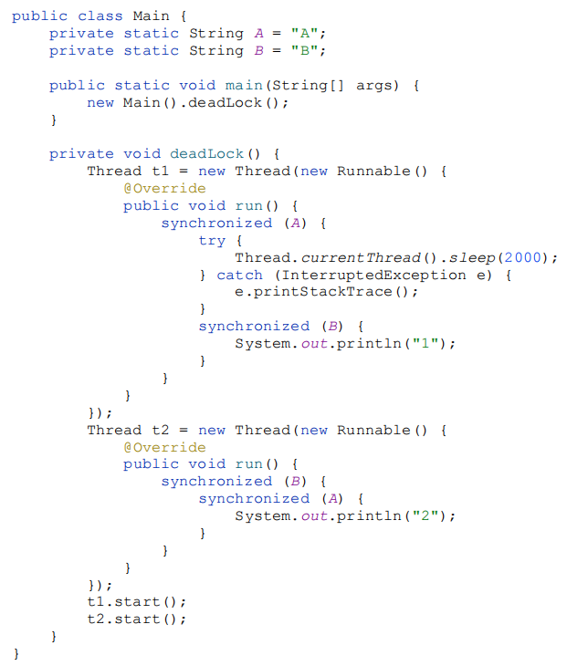
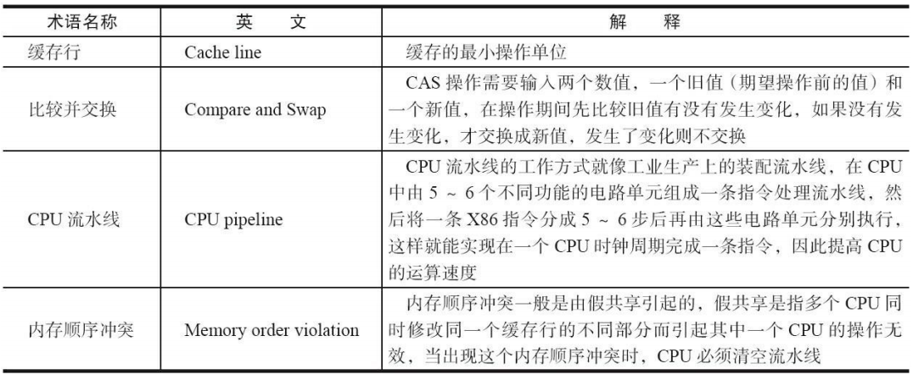
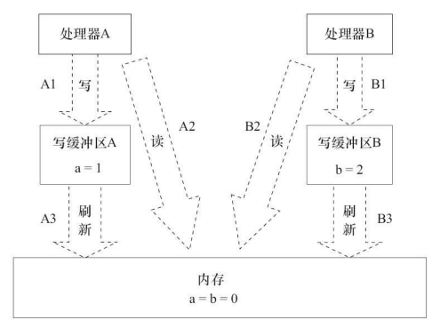
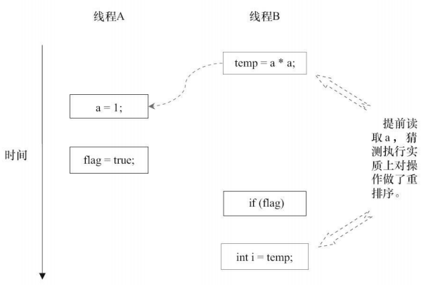
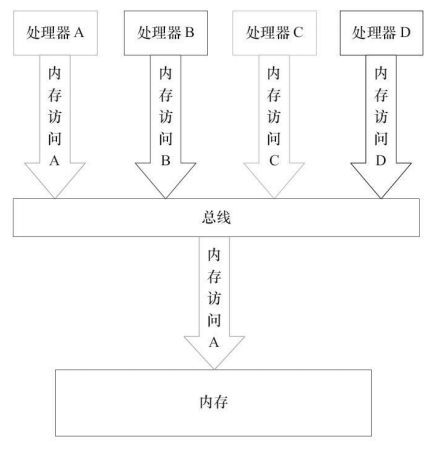

# Java并发编程

> 笔记在阅读《Java并发编程的艺术》和《Java并发编程实战》二书时所整理

[toc]


# 1. 并发编程的挑战

并发编程的目的是为了让程序运行得更快，但是，并不是启动更多的线程就能让程序最大限度地并发执行。在进行并发编程时，如果希望通过多线程执行任务让程序运行得更快，会面临非常多的挑战：**上下文切换**的问题、**死锁**的问题，以及**受限于硬件和软件的资源限制**问题。


## 1.1上下文切换

即使是单核处理器也支持多线程执行代码，CPU 通过给每个线程分配 **CPU 时间片** 来实现这个机制。

CPU 通过不停地切换线程执行，让我们感觉多个线程是同时执行的，时间片一般是几十毫秒（ms）。

**任务从保存到再加载的过程就是一次上下文切换。** 


### 1.1.1 多线程一定快吗？

下面的代码演示串行和并发执行并累加操作的时间，但是其**并发执行的速度不一定比串行执行快**。


下表是测试结果：


为什么并发执行的速度会比串行慢呢？这是因为线程有创建和上下文切换的开销。 


### 1.1.2 测试上下文切换次数和时长

以下两种工具可以度量上下文切换的消耗：

- 使用 `Lmbench3` 可以测量上下文切换的时长。 

- 使用 `vmstat` 可以测量上下文切换的次数。


### 1.1.3 如何减少上下文切换

减少上下文切换的方法有**无锁并发编程**、**CAS 算法**、**使用最少线程**和**使用协程**。

- **无锁并发编程**：多线程竞争锁时，会引起上下文切换，所以多线程处理数据时，可以用一些办法来避免使用锁，如将数据的 ID 按照 Hash 算法取模分段，不同的线程处理不同段的数据。 

- **CAS 算法**：Java 的 Atomic 包使用 CAS 算法来更新数据，而不需要加锁。 

- **使用最少线程**：避免创建不需要的线程，比如任务很少，但是创建了很多线程来处理，这样会造成大量线程都处于等待状态。 

- **协程**：在单线程里实现多任务的调度，并在单线程里维持多个任务间的切换。

> 什么是 CAS 操作？
>
> **CAS（Compare and Swap 比较和交换）**的思想：一种无锁算法，是原子操作的一种。一共有三个参数，一个当前内存值 V、旧的预期值 A、即将更新的值 B，当且仅当预期值 A 和内存值 V 相同时，将内存值修改为 B 并返回 true，否则什么都不做，并返回 false。


### 1.1.4 减少上下文切换实战流程

> 通过减少线上大量 WAITING 的线程，来减少上下文切换次数。

1. 用 `jstack` 命令 `dump` 线程信息，看看指定 pid 的进程里的线程都在做什么。

2. 统计所有线程分别处于什么状态。
3. 打开 dump 文件查看处于 WAITING（onobjectmonitor）的线程在做什么。
4. 减少工作线程数，可以通过修改该进程的线程池配置信息，降低其最大线程数。
5. 重启进程。再 dump 线程信息，然后统计 WAITING（onobjectmonitor）的线程。

**WAITING 的线程少了，系统上下文切换的次数就会少，因为每一次从 WAITTING 到 RUNNABLE 都会进行一次上下文的切换。**


## 1.2 死锁

死锁代码示例：以下程序中，持有A锁的线程 t1 试图获取B锁，而持有B锁的线程 t2 试图获取A锁，这将会引起死锁。



一旦出现死锁，只能通过 `dump` 线程查看到底是哪个线程出现了问题，以下线程信息告诉我们是 DeadLockDemo 类的第 42 行和第 31 行引起的死锁。


### 1.2.1 避免死锁的常见方法

- 避免一个线程同时获取多个锁。 

- 避免一个线程在锁内同时占用多个资源，尽量保证每个锁只占用一个资源。 

- 尝试使用定时锁，使用 lock.tryLock（timeout）来替代使用内部锁机制。 

- 对于数据库锁，加锁和解锁必须在一个数据库连接里，否则会出现解锁失败的情况。 


## 1.3 资源限制的挑战

### 1.3.1 什么是资源限制

资源限制是指**在进行并发编程时，程序的执行速度受限于计算机硬件资源或软件资源。**

> 硬件资源限制有带宽的上传/下载速度、硬盘读写速度和 CPU 的处理速度。软件资源限制有数据库的连接数和 socket 连接数等。


### 1.3.2 资源限制引发的问题

在并发编程中，将代码执行速度加快的原则是**将代码中串行执行的部分变成并发执行**，但是如果将某段串行的代码并发执行，因为受限于资源，仍然在串行执行，这时候程序不仅不会加快执行，反而会更慢，因为**增加了上下文切换和资源调度的时间**。


### 1.3.3 在资源限制情况下进行并发编程

**根据不同的资源限制调整程序的并发度。**

> 比如下载文件程序依赖于两个资源——带宽和硬盘读写速度。有数据库操作时，涉及数据库连接数，如果 SQL 语句执行非常快，而线程的数量比数据库连接数大很多，则某些线程会被阻塞，等待数据库连接。


### 1.3.4 如何解决资源限制的问题

- **对于硬件资源限制，可以考虑使用集群并行执行程序。**既然单机的资源有限制，那么就让程序在多机上运行。比如使用 ODPS、Hadoop 或者自己搭建服务器集群，不同的 机器处理不同的数据。可以通过“数据 ID%机器数”，计算得到一个机器编号，然后由对应编号的机器处理这笔数据。
- **对于软件资源限制，可以考虑使用资源池将资源复用。**比如使用连接池将数据库和 Socket 连接复用，或者在调用对方 webservice 接口获取数据时，只建立一个连接。 


# 2. Java 并发机制的底层实现原理

Java 代码在编译后会变成 Java 字节码，字节码被类加载器加载到 JVM 里，JVM 执行字节码，最终需要转化为汇编指令在 CPU 上执行。

**Java 中所使用的并发机制依赖于 JVM 的实现和 CPU 的指令。**

实现 Java 并发有两个重要的关键字：

- **volatile**
- **synchronized**


## 2.1 volatile 的应用

`volatile` 是**轻量级**的 `synchronized`，它在多处理器开发中保证了共享变量的“**可见性**”（当一个线程修改一个共享变量时，另外一个线程能读到这个修改的值。）。

> 如果 volatile 变量修饰符使用恰当的话，它比 synchronized 的使用和执行成本更低，因为它不会引起线程上下文的切换和调度。


### 2.1.1 volatile 的定义与实现原理

Java 编程语言允许线程访问共享变量，为了确保共享变量能被准确和一致地更新，线程应该确保通过**排他锁**单独获得这个变量。

如果一个字段被声明成 `volatile`，Java 线程内存模型确保**所有线程看到这个变量的值是一致的**。 

下面是与 `volatile` 实现原理相关的 CPU 术语与说明：


- volatile 是如何来保证可见性的呢？

为了提高处理速度，处理器不直接和内存进行通信，而是先将系统内存的数据读到内部缓存（L1，L2 或其他）后再进行操作，<u>但操作完不知道何时会写到内存</u>。

如果对声明了 volatile 的变量进行写操作，**JVM** 就会向处理器发送一条 **Lock 前缀的指令**，**将这个变量所在缓存行的数据写回到系统内存**。但是，就算写回到内存，如果其他处理器缓存的值还是旧的，再执行计算操作就会有问题。

所以，在多处理器下，为了保证各个处理器的缓存是一致的，就会实现**缓存一致性协议**，每个处理器通过**嗅探在总线上传播的数据**来检查自己缓存的值是不是过期了，当处理器发现自己缓存行对应的内存地址被修改，就会将当前处理器的缓存行设置成无效状态，当处理器对这个数据进行修改操作的时候，会重新从系统内存中把数据读到处理器缓存里。


volatile 的两条实现原则：

- **Lock** **前缀指令会引起处理器缓存回写到内存。**

  Lock 前缀指令导致在执行指令期间，声言处理器的 **LOCK#信号**。在多处理器环境中，**LOCK#信号确保在声言该信号期间，处理器可以独占任何共享内存**【因为 LOCK#信号会锁住总线，导致其他 CPU 不能访问总线，不能访问总线就意味着不能访问系统内存】。

  但是，在最近的处理器里，LOCK＃信号一般不锁总线，而是锁缓存，毕竟锁总线开销的比较大。

  在目前的处理器中，如果访问的内存区域已经缓存在处理器内部，则不会声言 LOCK#信号。相反，它会**锁定这块内存区域的缓存并回写到内存，并使用缓存一致性机制来确保修改的原子性**，此操作被称为“**缓存锁定**”，**缓存一致性机制会阻止同时修改由两个以上处理器缓存的内存区域数据。**

- **一个处理器的缓存回写到内存会导致其他处理器的缓存无效。**

  IA-32 处理器和 Intel 64 处理器使用 `MESI（修改、独占、共享、无效）控制协议` 去维护内部缓存和其他处理器缓存的一致性。在多核处理器系统中进行操作的时候，IA-32 和 Intel 64 处理器能嗅探其他处理器访问系统内存和它们的内部缓存。**处理器使用嗅探技术保证它的内部缓存、系统内存和其他处理器的缓存的数据在总线上保持一致。**


### 2.1.2 volatile 的使用优化

这里举的是一个 JDK 7 并发包中的一个队列集合类 `LinkedTransferQueue` 的例子，它在使用 volatile 变量时，用一种**追加字节**的方式来优化队列出队和入队的性能。

LinkedTransferQueue 代码：


> LinkedTransferQueue 使用一个内部类类型（PaddedAtomicReference）来定义队列的头节点（head）和尾节点（tail），而这个内部类相对于父类 AtomicReference 只做了一件事情，就是将共享变量追加到 64 字节。

为什么追加 64 字节能够提高并发编程的效率呢？

因为许多处理器的 L1、L2 或 L3 缓存的高速缓存行是 64 个字节宽，不支持部分填充缓存行，这意味着，如果队列的头节点和尾节点都不足 64 字节的话，处理器会将它们都读到同一个高速缓存行中，在多处理器下每个处理器都会缓存同样的头、尾节点，当一个处理器试图修改头节点时，会将整个缓存行锁定，那么在缓存一致性机制的作用下，会导致其他处理器不能访问自己高速缓存中的尾节 点，而队列的入队和出队操作则需要不停修改头节点和尾节点，所以在多处理器的情况下将会严重影响到队列的入队和出队效率。使用追加到 64 字节的方式来**填满高速缓冲区的缓存行，避免头节点和尾节点加载到同一个缓存行，使头、尾节点在修改时不会互相锁定。**

***

在以下两种场景下不应该使用追加字节的方式：

- **缓存行非 64 字节宽的处理器**

  如 P6 系列和奔腾处理器，它们的 L1 和 L2 高速缓存 行是 32 个字节宽。 

- **共享变量不会被频繁地写**

  因为使用追加字节的方式需要处理器读取更多的字节到高速缓冲区，这本身就会带来一定的性能消耗，如果共享变量不被频繁写的话，锁的几率也非常小，就没必要通过追加字节的方式来避免相互锁定。


## 2.2 synchronized 的实现原理与应用

`synchronized` 实现同步的基础：**Java 中的每一个对象都可以作为锁。** 

具体表现为：

- 对于**普通同步方法**，锁是**当前实例对象**。 

- 对于**静态同步方法**，锁是**当前类的 Class 对象**。 

- 对于**同步方法块**，锁是 **Synchonized 括号里配置的对象**。

当一个线程试图访问同步代码块时，它首先必须得到锁，退出或抛出异常时必须释放锁。

 

Synchronized 在 JVM 里的实现原理：

> JVM 基于进入和退出 **Monitor 对象**来实现方法同步和代码块同步，但两者的实现细节不一样。代码块同步是使用 **`monitorenter`** 和 **`monitorexit`** 指令实现的，而方法同步是使用另外一种方式实现的，细节在 JVM 规范里并没有详细说明。但是，方法的同步同样可以使用这两个指令来实现。
>
> - **monitorenter 指令**在编译后插入到同步代码块的开始位置。
> - **monitorexit 指令**插入到方法结束处和异常处。
>
> JVM 要保证**每个 monitorenter 必须有对应的 monitorexit 与之配对。任何对象都有一个 monitor 与之关联，当且一个 monitor 被持有后，它将处于锁定状态。线程执行到 monitorenter 指令时，将会尝试获取对象所对应的 monitor 的所有权，即尝试获得对象的锁。**


锁是存在哪里的？锁里面会存储什么信息？

### 2.2.1 Java 对象头

**synchronized 用的锁是存在 Java 对象头里的。**

如果对象是**数组类型**，则虚拟机用 **3 个字宽**（Word）存储对象头，如果对象是**非数组类型**，则用 **2 字宽**存储对象头。在 32 位虚拟机中，**1 字宽 = 4 字节，即 32bit。**

Java 对象头的内容和对应长度如下表：


Java 对象头里的 Mark Word 里默认存储对象的 **HashCode**、**分代年龄**和**锁标记位**。32 位 JVM 的 Mark Word 的默认存储结构如下表所示：


在运行期间，Mark Word 里存储的数据会随着锁标志位的变化而变化，其 4 种数据状态如下：


64 位虚拟机下，Mark Word 是 64 bit 大小的，其存储结构如下：


### 2.2.2 锁的升级与对比

在 Java SE 1.6 中，锁一共有 4 种状态，级别**从低到高**依次是：**无锁**状态、**偏向锁**状态、**轻量级锁**状态和**重量级锁**状态，这几个状态会随着竞争情况逐渐升级。

**锁可以升级但不能降级**，意味着偏向锁升级成轻量级锁后不能降级成偏向锁。这种锁升级却不能降级的策略，目的是为了**提高获得锁和释放锁的效率**。

#### 1. 偏向锁

大多数情况下，锁不仅不存在多线程竞争，而且总是由同一线程多次获得，为了让线程获得锁的代价更低而引入了**偏向锁**。

当一个线程访问同步块并获取锁时，会在对象头和栈帧中的锁记录里存储锁偏向的线程 ID，以后该线程在进入和退出同步块时不需要进行 CAS 操作来加锁和解锁，只需简单地测试一下对象头的 Mark Word 里是否存储着指向当前线程的偏向锁。

如果测试成功，表示线程已经获得了锁。如果测试失败，则需要再测试一下 Mark Word 中偏向锁的标识是否设置成 1（表示当前是偏向锁）：如果没有设置，则使用 CAS 竞争锁；如果设置了，则尝试使用 CAS 将对象头的偏向锁指向当前线程。

##### 偏向锁的撤销

偏向锁使用了一种**等到竞争出现才释放锁**的机制，所以当其他线程尝试竞争偏向锁时，持有偏向锁的线程才会释放锁。

偏向锁的撤销，需要等待**全局安全点**（在这个时间点上没有正在执行的字节码）。

> 它会首先暂停拥有偏向锁的线程，然后检查持有偏向锁的线程是否活着，如果线程不处于活动状态，则将对象头设置成无锁状态；如果线程仍然活着，拥有偏向锁的栈会被执行，遍历偏向对象的锁记录，栈中的锁记录和对象头的 Mark Word 要么重新偏向于其他线程，要么恢复到无锁或者标记对象不适合作为偏向锁，最后唤醒暂停的线程。

下图中的线程 1 演示了偏向锁初始化的流程，线程 2 演示了偏向锁撤销的流程：


##### 关闭偏向锁

偏向锁在 Java 6 和 Java 7 里是默认启用的，但是它在应用程序启动几秒钟之后才激活，如有必要可以使用 JVM 参数来关闭延迟：`-XX:BiasedLockingStartupDelay=0` 。如果确定应用程序里所有的锁通常情况下处于竞争状态，可以通过 JVM 参数关闭偏向锁：`-XX:- UseBiasedLocking=false`，那么程序默认会进入轻量级锁状态。 


#### 2. 轻量级锁

##### 轻量级锁加锁

线程在执行同步块之前，JVM 会**先在当前线程的栈桢中创建用于存储锁记录的空间，并将对象头中的 Mark Word 复制到锁记录中**，官方称为 Displaced Mark Word。

然后线程尝试使用 CAS 将对象头中的 Mark Word 替换为**指向锁记录的指针**。如果成功，当前线程获得锁，如果失败，表示其他线程竞争锁，当前线程便尝试使用**自旋**来获取锁。

##### 轻量级锁解锁

轻量级解锁时，会使用原子的 CAS 操作将 Displaced Mark Word 替换回到对象头，如果成功，则表示没有竞争发生。如果失败，表示当前锁存在竞争，锁就会膨胀成重量级锁。

下图是两个线程同时争夺锁，导致锁膨胀的流程图：


因为自旋会消耗 CPU，为了避免无用的自旋（比如获得锁的线程被阻塞住了），**一旦锁升级成重量级锁，就不会再恢复到轻量级锁状态。当锁处于这个状态下，其他线程试图获取锁时，都会被阻塞住**，当持有锁的线程释放锁之后会唤醒这些线程，被唤醒的线程就会进行新一轮的锁争夺。


#### 3. 锁的优缺点对比


## 2.3 原子操作的实现原理

原子操作（atomic operation）意为“**不可被中断的一个或一系列操作**”。

下面是与原子操作相关的几个术语：



> 比较并交换即 CAS	


### 2.3.1 处理器如何实现原子操作

处理器提供**总线锁定**和**缓存锁定**两个机制来保证复杂内存操作的原子性。

#### 1. 使用总线锁保证原子性

> 如果多个处理器同时对共享变量进行读改写操作（i++就是经典的读改写操作），那么共享变量就会被多个处理器同时进行操作，这样读改写操作就不是原子的，操作完之后共享变量的值会和期望的不一致。

所谓总线锁就是**使用处理器提供的一个 LOCK＃信号，当一个处理器在总线上输出此信号时，其他处理器的请求将被阻塞住，那么该处理器可以独占共享内存。**


#### 2. 使用缓存锁保证原子性

**在同一时刻，我们只需保证对某个内存地址的操作是原子性即可**，但总线锁定把 CPU 和内存之间的通信锁住了，这使得锁定期间，其他处理器不能操作其他内存地址的数据，所以总线锁定的开销比较大，目前处理器在某些场合下使用缓存锁定代替总线锁定来进行优化。

频繁使用的内存会缓存在处理器的 L1、L2 和 L3 高速缓存里，那么原子操作就可以直接在处理器内部缓存中进行，并不需要声明总线锁。

所谓“缓存锁定”是指**内存区域如果被缓存在处理器的缓存行中，并且在 Lock 操作期间被锁定，那么当它执行锁操作回写到内存时，处理器不在总线上声言 LOCK＃信号，而是修改内部的内存地址，并允许它的缓存一致性机制来保证操作的原子性，因为缓存一致性机制会阻止同时修改由两个以上处理器缓存的内存区域数据，当其他处理器回写已被锁定的缓存行的数据时，会使缓存行无效。**


**处理器不会使用缓存锁的情况：**

1. 当操作的数据不能被缓存在处理器内部，或操作的数据跨多个缓存行（cache line）时，则处理器会调用总线锁定。 
2. 有些处理器不支持缓存锁定。


### 2.3.2 Java 如何实现原子操作

在 Java 中可以通过**锁**和**循环 CAS** 的方式来实现原子操作。

#### 1. 使用循环 CAS 实现原子操作

JVM 中的 CAS 操作正是利用了处理器提供的 `CMPXCHG` 指令实现的。

**自旋 CAS** 实现的基本思路就是**循环进行 CAS 操作直到成功为止。**

以下代码实现了一个基于 CAS 线程安全的计数器方法 safeCount 和一个非线程安全的计数器 count：


> 以上代码运行后会发现 CAS 实现的线程安全计数器能够准确将 i 累加到 10000，而非线程安全的计数器每次运行结果都不同。


##### CAS 实现原子操作的三大问题

- **ABA 问题**

  因为 CAS 需要在操作值的时候，检查值有没有发生变化，如果没有发生变化则更新，但是如果一个值原来是 A，变成了 B，又变成了 A，那么使用 CAS 进行检查时会发现它的值没有发生变化，但是实际上却变化了。

  ABA 问题的解决思路就是**使用版本号**。在变量前面追加上版本号，每次变量更新的时候把版本号加 1，那么A→B→A 就会变成 1A→2B→3A。

- **循环时间长开销大**

  自旋 CAS 如果长时间不成功，会给 CPU 带来非常大的执行开销。

  > 如果 JVM 能支持处理器提供的 `pause` 指令，那么效率会有一定的提升。pause 指令有两个作用：第一，它可以延迟流水线执行指令（de-pipeline），使 CPU 不会消耗过多的执行资源，延迟的时间取决于具体实现的版本，在一些处理器上延迟时间是零；第二，它可以避免在退出循环的时候因内存顺序冲突（Memory Order Violation）而引起 CPU 流水线被清空（CPU Pipeline Flush），从而提高 CPU 的执行效率。 

- **只能保证一个共享变量的原子操作**

  当对一个共享变量执行操作时，我们可以使用循环 CAS 的方式来保证原子操作，但是对多个共享变量操作时，循环 CAS 就无法保证操作的原子性，这个时候就可以用锁。


#### 2. 使用锁机制实现原子操作

锁机制保证了**只有获得锁的线程才能够操作锁定的内存区域。**

JVM 实现锁的方式都用了循环 CAS，即当一个线程想进入同步块的时候使用循环 CAS 的方式来获取锁，当它退出同步块的时候使用循环 CAS 释放锁


# 3. Java 内存模型


## 3.1 Java 内存模型的基础

### 3.1.1 并发编程模型的两个关键问题

- **线程之间如何通信**
- **线程之间如何同步**


> 通信：线程之间以何种机制来交换信息。

在命令式编程中，线程之间的通信机制有两种：**共享内存**和**消息传递**。

- 在**共享内存**的并发模型里，线程之间**共享程序的公共状态**，通过写-读内存中的公共状态进行**隐式**通信。
- 在**消息传递**的并发模型里，线程之间没有公共状态，线程之间必须通过**发送消息**来**显式**进行通信。


> 同步：指程序中用于控制不同线程间操作发生相对顺序的机制。

- 在**共享内存**并发模型里，同步是**显式**进行的。必须显式指定某个方法或某段代码需要在线程之间互斥执行。
- 在**消息传递**的并发模型里，由于消息的发送必须在消息的接收之前，因此同步是**隐式**进行的。 


Java 的并发采用的是**共享内存模型**，**Java 线程之间的通信总是隐式进行**，整个通信过程对程序员完全透明。


### 3.1.2 Java 内存模型的抽象结构

在 Java 中，所有`实例域`、`静态域`和`数组元素`都存储在**堆内存**中，**堆内存在线程之间共享**。

> 这里用“**共享变量**”代指`实例域`、`静态域`和`数组元素`。

`局部变量`（Local Variables），`方法定义参数`（Formal Method Parameters）和`异常处理器参数`（ExceptionHandler Parameters）**不会在线程之间共享**，它们不会有内存可见性问题，也不受内存模型的影响。


Java 线程之间的通信由 **Java 内存模型（JMM）**控制，JMM 决定**一个线程对共享变量的写入何时对另一个线程可见**。从抽象的角度来看，JMM 定义了线程和主内存之间的抽象关系：**线程之间的共享变量存储在主内存（Main Memory）中，每个线程都有一个私有的本地内存（Local Memory），本地内存中存储了该线程以读/写共享变量的副本。**本地内存是 JMM 的一个抽象概念，并不真实存在。它涵盖了缓存、写缓冲区、寄存器以及其他的硬件和编译器优化。

Java 内存模型的抽象示意图如下：


从上图来看，如果线程 A 与线程 B 之间要通信的话，必须要经历下面 2 个步骤：

1. 线程 A 把本地内存 A 中更新过的共享变量刷新到主内存中去。
2. 线程 B 到主内存中去读取线程 A 之前已更新过的共享变量。 

下面通过示意图来说明这两个步骤：


> 如上图所示，本地内存 A 和本地内存 B 有主内存中共享变量 x 的副本。假设初始时，这 3 个内存中的 x 值都为 0。线程 A 在执行时，把更新后的 x 值（假设值为 1）临时存放在自己的本地内存 A 中。当线程 A 和线程 B 需要通信时，线程 A 首先会把自己本地内存中修改后的 x 值刷新到主内存中，此时主内存中的 x 值变为了 1。随后，线程 B 到主内存中去读取线程 A 更新后的 x 值，此时线程 B 的本地内存的 x 值也变为了 1。 

从整体来看，这两个步骤实质上是线程 A 在向线程 B 发送消息，而且这个**通信过程必须要经过主内存**。**JMM 通过控制主内存与每个线程的本地内存之间的交互，来提供内存可见性保证。**


### 3.1.3 从源代码到指令序列的重排序

在执行程序时，为了提高性能，编译器和处理器常常会对指令做**重排序**。重排序分 3 种类型：

1. **编译器优化的重排序。**编译器在不改变单线程程序语义的前提下，可以重新安排语句的执行顺序。 

2. **指令级并行的重排序。**现代处理器采用了`指令级并行技术（Instruction-LevelParallelism，ILP）`来将多条指令重叠执行。如果不存在数据依赖性，处理器可以改变语句对应机器指令的执行顺序。 

3. **内存系统的重排序。**由于处理器使用缓存和读/写缓冲区，这使得加载和存储操作看上去可能是在乱序执行。 

从 Java 源代码到最终实际执行的指令序列，会分别经历下面 3 种重排序：


> 上述的 1 属于编译器重排序，2 和 3 属于处理器重排序。

这些重排序可能会导致多线程程序出现内存可见性问题：

- 对于编译器，JMM 的编译器重排序规则会禁止特定类型的编译器重排序（不是所有的编译器重排序都要禁止）。
- 对于处理器重排序，JMM 的处理器重排序规则会要求 Java 编译器在生成指令序列时，插入特定类型的内存屏障（Memory Barriers，Intel 称之为 Memory Fence）指令，通过内存屏障指令来禁止特定类型的处理器重排序。 

JMM 属于**语言级的内存模型**，它确保在不同的编译器和不同的处理器平台之上，通过禁止特定类型的编译器重排序和处理器重排序，为程序员提供一致的内存可见性保证。


### 3.1.4 并发编程模型的分类

现代的处理器使用**写缓冲区**临时保存向内存写入的数据。写缓冲区可以**保证指令流水线持续运行，它可以避免由于处理器停顿下来等待向内存写入数据而产生的延迟。**同时，通过以批处理的方式刷新写缓冲区，以及合并写缓冲区中对同一内存地址的多次写，减少对内存总线的占用。

**每个处理器上的写缓冲区，仅仅对它所在的处理器可见。**这个特性会对内存操作的执行顺序产生重要的影响：**处理器对内存的读/写操作的执行顺序，不一定与内存实际发生的读/写操作顺序一致！**

***

具体说明如下：


假设处理器 A 和处理器 B 按程序的顺序并行执行内存访问，最终可能得到 x=y=0 的结果。具体的原因如下图所示。 



这里处理器 A 和处理器 B 可以同时把共享变量写入自己的写缓冲区（A1，B1），然后从内存中读取另一个共享变量（A2，B2），最后才把自己写缓存区中保存的脏数据刷新到内存中（A3， B3）。当以这种时序执行时，程序就可以得到 x=y=0 的结果。 

从内存操作实际发生的顺序来看，直到处理器 A 执行 A3 来刷新自己的写缓存区，写操作 A1 才算真正执行了。虽然处理器 A 执行内存操作的顺序为：A1→A2，但内存操作实际发生的顺序却是 A2→A1。此时，处理器 A 的内存操作顺序被重排序了（处理器 B 的情况和处理器 A 一样，这里就不赘述了）。

这里的关键是，**由于写缓冲区仅对自己的处理器可见，它会导致处理器执行内存操作的顺序可能会与内存实际的操作执行顺序不一致。**由于现代的处理器都会使用写缓冲区，因此现代的处理器都会允许对写-读操作进行重排序。

***

为了保证内存可见性，Java 编译器在生成指令序列的适当位置会插入**内存屏障指令**来禁止特定类型的处理器重排序。JMM 把内存屏障指令分为 4 类：


### 3.1.5 happens-before 简介

> 从 JDK 5 开始，Java 使用新的 JSR-133 内存模型。

在 JMM 中，如果一个操作执行的结果需要对另一个操作可见，那么这两个操作之间必须要存在 **happens-before** 关系。【这里两个操作既可以是在一个线程之内，也可以是在不同线程之间。】 

happens-before 规则如下：

- **程序顺序规则**：一个线程中的每个操作，happens-before 于该线程中的任意后续操作。 

- **监视器锁规则**：对一个锁的解锁，happens-before 于随后对这个锁的加锁。 

- **volatile 变量规则**：对一个 volatile 域的写，happens-before 于任意后续对这个volatile 域的读。 

- **传递性**：如果 A happens-before B，且 B happens-before C，那么 A happens-before C。

注意：

>两个操作之间具有 happens-before 关系，并不意味着前一个操作必须要在后一个操作之前执行！happens-before 仅仅要求前一个操作（执行的结果）对后一个操作可见，且前一个操作按顺序排在第二个操作之前。

happens-before 与 JMM 的关系如图：


一个 happens-before 规则对应于一个或多个编译器和处理器重排序规则。


## 3.2 重排序

重排序是指**编译器和处理器为了优化程序性能而对指令序列进行重新排序的一种手段。**


### 3.2.1 数据依赖性

如果两个操作访问同一个变量，且这**两个操作中有一个为写操作**，此时这两个操作之间就存在数据依赖性。

数据依赖分为下列 3 种类型：


> 上面 3 种情况，只要重排序两个操作的执行顺序，程序的执行结果就会被改变。

编译器和处理器在重排序时，会遵守数据依赖性，**编译器和处理器不会改变存在数据依赖关系的两个操作的执行顺序。**【这里所说的数据依赖性仅针对单个处理器中执行的指令序列和单个线程中执行的操作，**不同处理器之间和不同线程之间的数据依赖性不被编译器和处理器考虑。** 】


### 3.2.2 as-if-serial 语义

**不管怎么重排序（编译器和处理器为了提高并行度），（单线程）程序的执行结果不能被改变。**

>编译器、runtime 和处理器都必须遵守 as-if-serial 语义。

为了遵守 as-if-serial 语义，编译器和处理器不会对存在数据依赖关系的操作做重排序，因为这种重排序会改变执行结果。但是，如果操作之间不存在数据依赖关系，这些操作就可能被编译器和处理器重排序。

***

具体说明如下：

下面是计算圆面积的代码示例：

```java
double pi = 3.14;
double r = 1.0;
double area = pi * r * r;
```

上面 3 个操作的数据依赖关系如下图所示： 


A 和 C 之间存在数据依赖关系，同时 B 和 C 之间也存在数据依赖关系。因此在最终执行的指令序列中，C 不能被重排序到 A 和 B 的前面（C 排到 A 和 B 的前面，程序的结果将会被改变）。但 A 和 B 之间没有数据依赖关系，编译器和处理器可以重排序 A 和 B 之间的执行顺序。下图是该程序的两种执行顺序：


***

**as-if-serial 语义把单线程程序保护了起来**，遵守 as-if-serial 语义的编译器、runtime 和处理器共同为编写单线程程序的程序员创建了一个幻觉：单线程程序是按程序的顺序来执行的。asif-serial 语义使单线程程序员无需担心重排序会干扰他们，也无需担心内存可见性问题。


### 3.2.3 程序顺序规则

根据 happens-before 规则，上面计算圆的面积的示例代码存在 3 个 happens-before：

```
A happens-before B。 
B happens-before C。 
A happens-before C。 
```

这里的第 3 个 happens-before 关系，是根据 happens-before 的传递性推导出来的。这里 A happens-before B，但实际执行时 B 却可以排在 A 之前执行（看上面的重排序后的执行顺序）。如果 A happens-before B，JMM 并不要求 A 一定要在 B 之前执行。**JMM 仅仅要求前一个操作（执行的结果）对后一个操作可见，且前一个操作按顺序排在第二个操作之前。**这里操作 A 的执行结果不需要对操作 B 可见；而且重排序操作 A 和操作 B 后的执行结果，与操作 A 和操作 B 按 happens-before 顺序执行的结果一致。在这种情况下，JMM 会认为这种重排序并不非法（not illegal），JMM 允许这种重排序。 

在计算机中，软件技术和硬件技术有一个共同的目标：**在不改变程序执行结果的前提下，尽可能提高并行度。**编译器和处理器遵从这一目标，从 happens-before 的定义可以看出， JMM 同样遵从这一目标。 


### 3.2.4 重排序对多线程的影响

示例代码：

```java
class ReorderExample {
    int a = 0;
    boolean flag = false;
    
    public void writer() {
        a = 1; // 1
        flag = true; // 2
    }
    
    public void reader() {
        if (flag) { // 3
            int i = a * a; // 4
            ……
        }
    } 
}
```

flag 变量是个标记，用来标识变量 a 是否已被写入。这里假设有两个线程 A 和 B，A 首先执行 writer()方法，随后 B 线程接着执行 reader()方法。线程 B 在执行操作 4 时，能否看到线程 A 在操作 1 对共享变量 a 的写入呢？答案是：不一定能看到。 

由于操作 1 和操作 2 没有数据依赖关系，编译器和处理器可以对这两个操作重排序；同样，操作 3 和操作 4 没有数据依赖关系，编译器和处理器也可以对这两个操作重排序。先来看看，当操作 1 和操作 2 重排序时，可能会产生什么效果？请看下面的程序执行时序图：


> 这里虚箭线标识错误的操作

如上图所示，操作 1 和操作 2 做了重排序。程序执行时，线程 A 首先写标记变量 flag，随后线程 B 读这个变量。由于条件判断为真，线程 B 将读取变量 a。此时，变量 a 还没有被线程 A 写入，在这里多线程程序的语义被重排序破坏了！


下面再看看，当操作 3 和操作 4 重排序时会产生什么效果（借助这个重排序，可以顺便说明**控制依赖性**）。下面是操作 3 和操作 4 重排序后，程序执行的时序图：



在程序中，操作 3 和操作 4 存在控制依赖关系。**当代码中存在控制依赖性时，会影响指令序列执行的并行度。**为此，编译器和处理器会采用**猜测（Speculation）执行**来克服控制相关性对并行度的影响。以处理器的猜测执行为例，执行线程 B 的处理器可以提前读取并计算 a*a，然后把计算结果临时保存到一个名为重排序缓冲（Reorder Buffer，ROB）的硬件缓存中。当操作 3 的条件判断为真时，就把该计算结果写入变量 i 中。 

从上图中可以看出，猜测执行实质上对操作 3 和 4 做了重排序。重排序在这里破坏了多线程程序的语义！ 

**在单线程程序中，对存在控制依赖的操作重排序，不会改变执行结果（这也是 as-if-serial 语义允许对存在控制依赖的操作做重排序的原因）；但在多线程程序中，对存在控制依赖的操作重排序，可能会改变程序的执行结果。**


## 3.3 顺序一致性

顺序一致性内存模型是一个**理论参考模型**，在设计的时候，处理器的内存模型和编程语言的内存模型都会以顺序一致性内存模型作为参照。

### 3.3.1 数据竞争与顺序一致性

**当程序未正确同步时，就可能会存在数据竞争。**Java 内存模型规范对数据竞争的定义如下： 

- 在一个线程中写一个变量， 

- 在另一个线程读同一个变量， 

- 而且写和读没有通过同步来排序。

当代码中包含数据竞争时，程序的执行往往产生违反直觉的结果。如果一个多线程程序能正确同步，这个程序将是一个没有数据竞争的程序。 

JMM 对正确同步的多线程程序的内存一致性做了如下保证：

如果程序是**正确同步**的，程序的执行将具有**顺序一致性**（Sequentially Consistent）——即**程序的执行结果与该程序在顺序一致性内存模型中的执行结果相同。**【这里的同步是指广义上的同步，包括对常用同步原语（synchronized、volatile 和 final）的正确使用。】


### 3.3.2 顺序一致性内存模型

顺序一致性内存模型有两大特性：

- 一个线程中的所有操作必须按照程序的顺序来执行。 

- （不管程序是否同步）**所有线程都只能看到一个单一的操作执行顺序。在顺序一致性内存模型中，每个操作都必须原子执行且立刻对所有线程可见。**

顺序一致性内存模型为程序员提供的视图如下图所示：


顺序一致性模型有一个单一的全局内存，这个内存通过一个左右摆动的开关可以连接到任意一个线程，同时**每一个线程必须按照程序的顺序来执行内存读/写操作。**从上面的示意图可以看出，在任意时间点最多只能有一个线程可以连接到内存。当多个线程并发执行时，图中的开关装置能把所有线程的所有内存读/写操作**串行化**（即在顺序一致性模型中，所有操作之间具有全序关系）。 

***

下面通过两个示意图来对顺序一致性模型的特性做进一步的说明。假设有两个线程 A 和 B 并发执行。其中 A 线程有 3 个操作，它们在程序中的顺序是： `A1→A2→A3`。B 线程也有 3 个操作，它们在程序中的顺序是：`B1→B2→B3`。 

假设这两个线程使用**监视器锁**来正确同步：A 线程的 3 个操作执行后释放监视器锁，随后 B 线程获取同一个监视器锁。那么程序在顺序一致性模型中的执行效果将如下图所示：


现在再假设这两个线程没有做同步，下面是这个未同步程序在顺序一致性模型中的执行示意图：


未同步程序在顺序一致性模型中虽然整体执行顺序是无序的，但所有线程都只能看到一个一致的整体执行顺序。以上图为例，线程 A 和 B 看到的执行顺序都是： 

`B1→A1→A2→B2→A3→B3`。之所以能得到这个保证是因为**顺序一致性内存模型中的每个操作必须立即对任意线程可见。** 

***

但是，在 JMM 中就没有这个保证。**未同步程序在 JMM 中不但整体的执行顺序是无序的，而且所有线程看到的操作执行顺序也可能不一致。**比如，在当前线程把写过的数据缓存在本地内存中，在没有刷新到主内存之前，这个写操作仅对当前线程可见；从其他线程的角度来观察，会认为这个写操作根本没有被当前线程执行。只有当前线程把本地内存中写过的数据刷新到主内存之后，这个写操作才能对其他线程可见。在这种情况下，当前线程和其他线程看到的操作执行顺序将不一致。


### 3.3.3 同步程序的顺序一致性效果

下面，对前面的示例程序 ReorderExample 用锁来同步，看看正确同步的程序如何具有顺序一致性。


在上面示例代码中，假设 A 线程执行 writer()方法后，B 线程执行 reader()方法。这是一个正确同步的多线程程序。根据 JMM 规范，该程序的执行结果将与该程序在顺序一致性模型中的执行结果相同。下面是该程序在两个内存模型中的执行时序对比图：


**顺序一致性模型中，所有操作完全按程序的顺序串行执行。而在 JMM 中，临界区内的代码可以重排序（但 JMM 不允许临界区内的代码“逸出”到临界区之外，那样会破坏监视器的语义）。**JMM 会在退出临界区和进入临界区这两个关键时间点做一些特别处理，使得线程在这两个时间点具有与顺序一致性模型相同的内存视图。虽然线程 A 在临界区内做了重排序，但由于监视器互斥执行的特性，这里的线程 B 根本无法“观察”到线程 A 在临界区内的重排序。这种重排序既提高了执行效率，又没有改变程序的执行结果。 

JMM 在具体实现上的基本方针为：**在不改变（正确同步的）程序执行结果的前提下，尽可能地为编译器和处理器的优化打开方便之门。**


### 3.3.4 未同步程序的执行特性

对于**未同步或未正确同步**的多线程程序，JMM 只提供最小安全性：线程执行时读取到的值，要么是之前某个线程写入的值，要么是默认值（0，Null，False），JMM 保证线程读操作读取到的值不会无中生有的冒出来。

为了实现最小安全性，JVM 在堆上分配对象时，首先会对内存空间进行清零，然后才会在上面分配对象（JVM 内部会同步这两个操作）。因此，在已清零的内存空间（Pre-zeroed Memory）分配对象时，域的默认初始化已经完成了。

**JMM 不保证未同步程序的执行结果与该程序在顺序一致性模型中的执行结果一致。**


**未同步程序在 JMM 中的执行时，整体上是无序的，其执行结果无法预知。**未同步程序在两个模型中的执行特性有如下几个差异：

- 顺序一致性模型保证单线程内的操作会按程序的顺序执行，而 JMM 不保证单线程内的操作会按程序的顺序执行（比如上面正确同步的多线程程序在临界区内的重排序）。

- 顺序一致性模型保证所有线程只能看到一致的操作执行顺序，而 JMM 不保证所有线程能看到一致的操作执行顺序。

- JMM 不保证对 64 位的 long 型和 double 型变量的写操作具有原子性，而顺序一致性模型保证对所有的内存读/写操作都具有原子性。

第 3 个差异与**处理器总线**的工作机制密切相关。**在计算机中，数据通过总线在处理器和内存之间传递。**每次处理器和内存之间的数据传递都是通过一系列步骤来完成的，这一系列步骤称之为**总线事务**（Bus Transaction）。总线事务包括**读事务**（Read Transaction）和**写事务**（WriteTransaction）。读事务从内存传送数据到处理器，写事务从处理器传送数据到内存，每个事务会读/写内存中一个或多个物理上连续的字。这里的关键是，**总线会同步试图并发使用总线的事务。在一个处理器执行总线事务期间，总线会禁止其他的处理器和 I/O 设备执行内存的读/写。**

***



假设处理器 A，B 和 C 同时向总线发起总线事务，这时**总线仲裁**（Bus Arbitration）会对竞争做出裁决，这里假设总线在仲裁后判定处理器 A 在竞争中获胜（总线仲裁会确保所有处理器都能公平的访问内存）。此时处理器 A 继续它的总线事务，而其他两个处理器则要等待处理器 A 的总线事务完成后才能再次执行内存访问。假设在处理器 A 执行总线事务期间（不管这个总线事务是读事务还是写事务），处理器 D 向总线发起了总线事务，此时处理器 D 的请求会被总线禁止。 

总线的这些工作机制可以把所有处理器对内存的访问以**串行化**的方式来执行。**在任意时间点，最多只能有一个处理器可以访问内存。这个特性确保了单个总线事务之中的内存读/写操作具有原子性。** 

***

**Java 语言规范鼓励但不强求 JVM 对 64 位的 long 型变量和 double 型变量的写操作具有原子性。**当 JVM 在这种 32 位处理器上运行时，可能会把一个 64 位 long/double 型变量的写操作拆分为两个 32 位的写操作来执行。这两个 32 位的写操作可能会被分配到不同的总线事务中执行，此时对这个 64 位变量的写操作将不具有原子性。 


当单个内存操作不具有原子性时，可能会产生意想不到后果。如下示意图：


如上图所示，假设处理器 A 写一个 long 型变量，同时处理器 B 要读这个 long 型变量。处理器 A 中 64 位的写操作被拆分为两个 32 位的写操作，且这两个 32 位的写操作被分配到不同的写事务中执行。同时，处理器 B 中 64 位的读操作被分配到单个的读事务中执行。当处理器 A 和 B 按上图的时序来执行时，处理器 B 将看到仅仅被处理器 A“写了一半”的无效值。 

>注意，在 JSR-133 之前的旧内存模型中，一个 64 位 long/double 型变量的读/写操作可以被拆分为两个 32 位的读/写操作来执行。从 JSR-133 内存模型开始（即从 JDK5 开始），**仅仅只允许把一个 64 位 long/double 型变量的写操作拆分为两个 32 位的写操作来执行，任意的读操作在 JSR-133 中都必须具有原子性（即任意读操作必须要在单个读事务中执行）。**


## 3.4 volatile 的内存语义


### 3.4.1 volatile 的特性

**对 volatile 变量的单个读/写，等价于使用同一个锁对这些单个读/写操作做了同步。**

***

下面通过具体的示例来说明：


假设有多个线程分别调用上面的 3 个方法，这个程序在语义上和下面程序等价。


如上面示例程序所示，一个 volatile 变量的单个读/写操作，与一个普通变量的读/写操作都是使用同一个锁来同步，它们之间的执行效果相同。 

***

锁的 happens-before 规则保证释放锁和获取锁的两个线程之间的内存可见性，这意味着**对一个 volatile 变量的读，总是能看到（任意线程）对这个 volatile 变量最后的写入**。锁的语义决定了**临界区代码的执行具有原子性**。这意味着，**即使是 64 位的 long 型和 double 型变量，只要它是 volatile 变量，对该变量的读/写就具有原子性。如果是多个 volatile 操作或类似于 volatile++这种复合操作，这些操作整体上不具有原子性。** 

简而言之，volatile 变量自身具有下列特性：

- **可见性。**对一个 volatile 变量的读，总是能看到（任意线程）对这个 volatile 变量最后的写入。 

- **原子性**：对任意单个 volatile 变量的读/写具有原子性，但类似于 volatile++这种复合操作不具有原子性。 


### 3.4.2 volatile 写-读建立的 happens-before 关系

从 JDK5 开始，**volatile 变量的写-读可以实现线程之间的通信。**从内存语义的角度来说，volatile 的写-读与锁的释放-获取有相同的内存效果：**volatile 写和锁的释放有相同的内存语义；volatile 读与锁的获取有相同的内存语义。**

下面是使用 volatile 变量的示例代码：

```java
class VolatileExample {
    int a = 0;
    volatile boolean flag = false;
    
    public void writer() {
        a = 1; // 1
        flag = true; // 2
    }
    
    public void reader() {
        if (flag) { // 3
        int i = a; // 4
        ……
    	}
    } 
}
```

假设线程 A 执行 writer()方法之后，线程 B 执行 reader()方法。根据 happens-before 规则，这个过程建立的 happens-before 关系可以分为 3 类： 

- 根据程序次序规则，1 happens-before 2; 3 happens-before 4。 

- 根据 volatile 规则，2 happens-before 3。 

- 根据 happens-before 的传递性规则，1 happens-before 4。 

上述 happens-before 关系的图形化表现形式如下：


> 在上图中，每一个箭头链接的两个节点，代表了一个 happens-before 关系。黑色箭头表示程序顺序规则；橙色箭头表示 volatile 规则；蓝色箭头表示组合这些规则后提供的 happens-before 保证。

这里 A 线程写一个 volatile 变量后，B 线程读同一个 volatile 变量。A 线程在写 volatile 变量之前所有可见的共享变量，在 B 线程读同一个 volatile 变量后，将立即变得对 B 线程可见。


### 3.4.4 volatile 写-读的内存语义

volatile 写的内存语义如下：**当写一个 volatile 变量时，JMM 会把该线程对应的本地内存中的共享变量值刷新到主内存。**以上面示例程序 VolatileExample 为例，假设线程 A 首先执行 writer()方法，随后线程 B 执行 reader()方法，初始时两个线程的本地内存中的 flag 和 a 都是初始状态。

下图是线程 A 执行 volatile 写后，共享变量的状态示意图。 


线程 A 在写 flag 变量后，本地内存 A 中被线程 A 更新过的两个共享变量的值被刷新到主内存中。此时，本地内存 A 和主内存中的共享变量的值是一致的。

volatile 读的内存语义如下：**当读一个 volatile 变量时，JMM 会把该线程对应的本地内存置为无效。线程接下来将从主内存中读取共享变量。**

下图为线程 B 读同一个 volatile 变量后，共享变量的状态示意图。


在读 flag 变量后，本地内存 B 包含的值已经被置为无效。此时，线程 B 必须从主内存中读取共享变量。线程 B 的读取操作将导致本地内存 B 与主内存中的共享变量的值变成一致。 

> 如果把 volatile 写和 volatile 读两个步骤综合起来看的话，在读线程 B 读一个 volatile 变量后，写线程 A 在写这个 volatile 变量之前所有可见的共享变量的值都将立即变得对读线程 B 可见。 


下面对 volatile 写和 volatile 读的内存语义做个总结：

- 线程 A 写一个 volatile 变量，实质上是线程 A 向接下来将要读这个 volatile 变量的某个线程发出了（其对共享变量所做修改的）消息。 

- 线程 B 读一个 volatile 变量，实质上是线程 B 接收了之前某个线程发出的（在写这个 volatile 变量之前对共享变量所做修改的）消息。 

- 线程 A 写一个 volatile 变量，随后线程 B 读这个 volatile 变量，这个过程实质上是线程 A 通过主内存向线程 B 发送消息。


### 3.4.4 volatile 内存语义的实现

为了实现 volatile 内存语义，JMM 会分别限制这编译器重排序和处理器重排序的重排序类型。下表是 JMM 针对编译器制定的 volatile 重排序规则表：


>举例来说，第三行最后一个单元格的意思是：在程序中，当第一个操作为普通变量的读或写时，如果第二个操作为 volatile 写，则编译器不能重排序这两个操作。 

从上表可以看出：

- 当第二个操作是 volatile 写时，不管第一个操作是什么，都不能重排序。这个规则确保 volatile 写之前的操作不会被编译器重排序到 volatile 写之后。 

- 当第一个操作是 volatile 读时，不管第二个操作是什么，都不能重排序。这个规则确保 volatile 读之后的操作不会被编译器重排序到 volatile 读之前。 

- 当第一个操作是 volatile 写，第二个操作是 volatile 读时，不能重排序。 


为了实现 volatile 的内存语义，**编译器在生成字节码时，会在指令序列中插入内存屏障来禁止特定类型的处理器重排序。**对于编译器来说，发现一个最优布置来最小化插入屏障的总数几乎不可能。为此，JMM 采取保守策略。下面是基于保守策略的 JMM 内存屏障插入策略：

- 在每个 volatile 写操作的前面插入一个 StoreStore 屏障。 

- 在每个 volatile 写操作的后面插入一个 StoreLoad 屏障。 

- 在每个 volatile 读操作的后面插入一个 LoadLoad 屏障。
- 在每个 volatile 读操作的后面插入一个 LoadStore 屏障。 

上述内存屏障插入策略非常保守，但它可以保证在任意处理器平台，任意的程序中都能得到正确的 volatile 内存语义。 

下面是保守策略下，volatile 写插入内存屏障后生成的指令序列示意图：


图中的 StoreStore 屏障可以保证在 volatile 写之前，其前面的所有普通写操作已经对任意处理器可见了。这是因为 StoreStore 屏障将保障上面所有的普通写在 volatile 写之前刷新到主内存。

这里比较有意思的是，volatile 写后面的 StoreLoad 屏障。此屏障的作用是避免 volatile 写与后面可能有的 volatile 读/写操作重排序。因为编译器常常无法准确判断在一个 volatile 写的后面是否需要插入一个 StoreLoad 屏障（比如，一个 volatile 写之后方法立即 return）。为了保证能正确实现 volatile 的内存语义，JMM 在采取了保守策略：在每个 volatile 写的后面，或者在每个 volatile 读的前面插入一个 StoreLoad 屏障。从整体执行效率的角度考虑，**JMM 最终选择了在每个 volatile 写的后面插入一个 StoreLoad 屏障。**因为 volatile 写-读内存语义的常见使用模式是：**一个写线程写 volatile 变量，多个读线程读同一个 volatile 变量。当读线程的数量大大超过写线程时，选择在 volatile 写之后插入StoreLoad 屏障将带来可观的执行效率的提升。**从这里可以看到 JMM 在实现上的一个特点：首先确保正确性，然后再去追求执行效率。 

下面是在保守策略下，volatile 读插入内存屏障后生成的指令序列示意图：


图中的 LoadLoad 屏障用来禁止处理器把上面的 volatile 读与下面的普通读重排序。 LoadStore 屏障用来禁止处理器把上面的 volatile 读与下面的普通写重排序。 


上述 volatile 写和 volatile 读的内存屏障插入策略非常保守。在实际执行时，只要不改变 volatile 写-读的内存语义，编译器可以根据具体情况省略不必要的屏障。下面通过具体的示例代码进行说明。

```java
class VolatileBarrierExample {
    int a;
    volatile int v1 = 1;
    volatile int v2 = 2;
    
    void readAndWrite() {
        int i = v1; // 第一个 volatile 读
        int j = v2; // 第二个 volatile 读
        a = i + j; // 普通写
        v1 = i + 1; // 第一个 volatile 写
        v2 = j * 2; // 第二个 volatile 写
    }
    … // 其他方法
}
```

针对 readAndWrite()方法，编译器在生成字节码时可以做如下的优化：


注意，最后的 StoreLoad 屏障不能省略。因为第二个 volatile 写之后，方法立即 return。此时编译器可能无法准确断定后面是否会有 volatile 读或写，为了安全起见，编译器通常会在这里插入一个 StoreLoad 屏障。 


### 3.4.5 JSR-133 为什么要增强 volatile 的内存语义

在 JSR-133 之前的旧 Java 内存模型中，虽然不允许 volatile 变量之间重排序，但旧的 Java 内存模型允许 volatile 变量与普通变量重排序。在旧的内存模型中，VolatileExample 示例程序可能被重排序成下列时序来执行。


在旧的内存模型中，当 1 和 2 之间没有数据依赖关系时，1 和 2 之间就可能被重排序（3 和 4 类似）。其结果就是：读线程 B 执行 4 时，不一定能看到写线程 A 在执行 1 时对共享变量的修改。因此，在旧的内存模型中，volatile 的写-读没有锁的释放-获所具有的内存语义。为了提供一种**比锁更轻量级的线程之间通信的机制**，JSR-133 专家组决定增 强 volatile 的内存语义：**严格限制编译器和处理器对 volatile 变量与普通变量的重排序，确保 volatile 的写-读和锁的释放-获取具有相同的内存语义。**从编译器重排序规则和处理器内存屏障插入策略来看，只要 volatile 变量与普通变量之间的重排序可能会破坏 volatile 的内存语义，这种重排序就会被编译器重排序规则和处理器内存屏障插入策略禁止。 


由于 **volatile 仅仅保证对单个 volatile 变量的读/写具有原子性**，而**锁的互斥执行的特性可以确保对整个临界区代码的执行具有原子性。**在功能上，锁比 volatile 更强大；在可伸缩性和执行性能上，volatile 更有优势。


## 3.5 锁的内存语义

锁可以让临界区互斥执行。


### 3.5.1 锁的释放-获取建立的 happens-before 关系

锁是 Java 并发编程中最重要的同步机制。锁除了让临界区互斥执行外，还可以让释放锁的线程向获取同一个锁的线程发送消息。

下面是锁释放-获取的示例代码：

```java
class MonitorExample {
    int a = 0;
    
    public synchronized void writer() { // 1
        a++; // 2
    } // 3
    
    public synchronized void reader() { // 4
        int i = a; // 5
        ……
    } // 6
}
```

假设线程 A 执行 writer()方法，随后线程 B 执行 reader()方法。根据 happens-before 规则，这个过程包含的 happens-before 关系可以分为 3 类。 

- 根据程序次序规则，1 happens-before 2，2 happens-before 3；4 happens-before 5，5 happensbefore 6。 

- 根据监视器锁规则，3 happens-before 4。 

- 根据 happens-before 的传递性，2 happens-before 5。 

上述 happens-before 关系的图形化表现形式如下图所示。


>每一个箭头链接的两个节点，代表了一个 happens-before 关系。黑色箭头表示程序顺序规则；橙色箭头表示监视器锁规则；蓝色箭头表示组合这些规则后提供的 happensbefore 保证。 

在线程 A 释放了锁之后，随后线程 B 获取同一个锁。在上图中，2  happens-before5。因此，线程 A 在释放锁之前所有可见的共享变量，在线程 B 获取同一个锁之后，将立刻变得对 B 线程可见。


### 3.5.2 锁的释放和获取的内存语义

**当线程释放锁时，JMM 会把该线程对应的本地内存中的共享变量刷新到主内存中。**以上面的 MonitorExample 程序为例，A 线程释放锁后，共享数据的状态示意图如下图所示。 


**当线程获取锁时，JMM 会把该线程对应的本地内存置为无效。从而使得被监视器保护的临界区代码必须从主内存中读取共享变量。**下面是锁获取的状态示意图。


**锁释放与 volatile 写有相同的内存语义；锁获取与 volatile 读有相同的内存语义。**

下面对锁释放和锁获取的内存语义做个总结：

- 线程 A 释放一个锁，实质上是线程 A 向接下来将要获取这个锁的某个线程发出了（线程 A 对共享变量所做修改的）消息。 

- 线程 B 获取一个锁，实质上是线程 B 接收了之前某个线程发出的（在释放这个锁之前对共享变量所做修改的）消息。 

- 线程 A 释放锁，随后线程 B 获取这个锁，这个过程实质上是线程 A 通过主内存向线程 B 发送消息。


### 3.5.3 锁内存语义的实现

//待补充


# 4. Java 并发编程基础

线程作为操作系统调度的最小单元，多个线程能够同时执行，这将显著提升程序性能，在多核环境中表现得更加明显。但是，过多地创建线程和对线程的不当管理也容易造成问题。


## 4.1 线程简介


### 4.1.1 什么是线程

现代操作系统在运行一个程序时，会为其创建一个进程。例如，启动一个 Java 程序，操作系统就会创建一个 Java 进程。现代操作系统**调度的最小单元**是**线程**，也叫**轻量级进程**（Light Weight Process），在一个进程里可以创建多个线程，这些**线程都拥有各自的计数器、堆栈和局部变量等属性，并且能够访问共享的内存变量。**处理器在这些线程上高速切换，让使用者感觉到这些线程在同时执行。

>一个 Java 程序从 main()方法开始执行，然后按照既定的代码逻辑执行，看似没有其他线程参与，但实际上 Java 程序天生就是多线程程序，因为执行 main()方法的是一个名称为 main 的线程。

**一个 Java 程序的运行不仅仅是 main()方法的运行，而是 main 线程和多个其他线程的同时运行。**


### 4.1.2 为什么要使用多线程

- **更多的处理器核心**

  线程是大多数操作系统调度的基本单元，一个程序作为一个进程来运行，程序运行过程中能够创建多个线程，而一个线程在一个时刻只能运行在一个处理器核心上。一个单线程程序在运行时只能使用一个处理器核心，那么再多的处理器核心加入也无法显著提升该程序的执行效率。相反，如果该程序使用多线程技术，将计算逻辑分配到多个处理器核心上，就会显著减少程序的处理时间，并且随着更多处理器核心的加入而变得更有效率。

- **更快的响应时间**

  使用多线程技术，将数据一致性不强的操作派发给其他线程处理（也可以使用消息队列），这样做的好处是响应用户请求的线程能够尽可能快地处理完成，缩短了响应时间，提升了用户体验。 

- **更好的编程模型**

  Java 为多线程编程提供了良好、考究并且一致的编程模型，使开发人员能够更加专注于问题的解决，即为所遇到的问题建立合适的模型，而不是绞尽脑汁地考虑如何将其多线程化。一旦开发人员建立好了模型，稍做修改总是能够方便地映射到 Java 提供的多线程编程模型上。


### 4.1.3 线程优先级

现代操作系统基本采用**时分**的形式调度运行的线程，操作系统会分出一个个时间片，线程会分配到若干时间片，当线程的时间片用完了就会发生线程调度，并等待着下次分配。线程分配到的时间片多少也就决定了线程使用处理器资源的多少，而**线程优先级就是决定线程需要多或者少分配一些处理器资源的线程属性。**


在 Java 线程中，通过一个整型成员变量 `priority` 来控制优先级，优先级的范围从 **1~10**，在线程构建的时候可以通过 `setPriority(int)`方法来修改优先级，**默认优先级是 5，优先级高的线程分配时间片的数量要多于优先级低的线程。设置线程优先级时，针对频繁阻塞（休眠或者 I/O 操作）的线程需要设置较高优先级，而偏重计算（需要较多 CPU 时间或者偏运算）的线程则设置较低的优先级，确保处理器不会被独占。**在不同的 JVM 以及操作系统上，线程规划会存在差异，有些操作系统甚至会忽略对线程优先级的设定。

> 注意：
>
> 线程优先级不能作为程序正确性的依赖，因为操作系统可以完全不用理会 Java 线程对于优先级的设定。


### 4.1.4 线程的状态

Java 线程在运行的生命周期中可能处于下表所示的 6 种不同的状态，在给定的一个时刻，线程只能处于其中的一个状态。 


线程在自身的生命周期中，并不是固定地处于某个状态，而是随着代码的执行在不同的状态之间进行切换，Java 线程状态变迁如下图所示：


线程创建之后，调用 `start()` 方法开始运行。当线程执行 `wait()` 方法之后，线程进入等待状态。进入等待状态的线程需要依靠其他线程的通知才能够返回到运行状态，而**超时等待状态相当于在等待状态的基础上增加了超时限制，也就是超时时间到达时将会返回到运行状态。**当线程调用同步方法时，在没有获取到锁的情况下，线程将会进入到阻塞状态。**线程在执行 Runnable 的 `run()` 方法之后将会进入到终止状态。**


> 注意：Java 将操作系统中的运行和就绪两个状态合并称为运行状态。阻塞状态是线程阻塞在进入 synchronized 关键字修饰的方法或代码块（获取锁）时的状态，但是阻塞在 java.concurrent 包中 Lock 接口的线程状态却是等待状态，因为 java.concurrent 包中 Lock 接口对于阻塞的实现均使用了 LockSupport 类中的相关方法。


### 4.1.5 Daemon 线程

Daemon 线程是一种支持型线程(常被叫做**守护线程**)，因为它主要被**用作程序中后台调度以及支持性工作**。这意味着，**当一个 Java 虚拟机中不存在非 Daemon 线程的时候，Java 虚拟机将会退出。**可以通过调用 `Thread.setDaemon(true)` 将线程设置为 Daemon 线程。 

> 注意：Daemon 属性需要在启动线程之前设置，不能在启动线程之后设置。Daemon 线程被用作完成支持性工作，但是**在 Java 虚拟机退出时 Daemon 线程中的 finally 块并不一定会执行。**所以，在构建 Daemon 线程时，不能依靠 finally 块中的内容来确保执行关闭或清理资源的逻辑。

代码示例如下：

```java
public class Concurrency {
    public static void main(String[] args) {
        Thread thread = new Thread(new DaemonRunner(), "DaemonRunner");
        thread.setDaemon(true);
        thread.start();
    }
    static class DaemonRunner implements Runnable {
        @Override
        public void run() {
            try {
            	SleepUtils.second(10);
            } finally {
            	System.out.println("DaemonThread finally run.");
            }
        }
    } 
}
```

运行 Daemon 程序，可以看到在终端或者命令提示符上没有任何输出。main 线程（非 Daemon 线程）在启动了线程 DaemonRunner 之后随着 main 方法执行完毕而终止，而此时 Java 虚拟机中已经没有非 Daemon 线程，虚拟机需要退出。Java 虚拟机中的所有 Daemon 线程都需要立即终止，因此 DaemonRunner 立即终止，但是 DaemonRunner 中的 finally 块并没有执行。


## 4.2 启动和终止线程


### 4.2.1 构造线程

在运行线程之前首先要构造一个线程对象，线程对象在构造的时候需要提供线程所需要的属性，如线程所属的线程组、线程优先级、是否是 Daemon 线程等信息。

下面代码清单所示的代码摘自 `java.lang.Thread` 中对线程进行初始化的部分：

Thread.java：


在上述过程中，一个新构造的线程对象是**由其 parent 线程来进行空间分配**的，而 child 线程继承了 parent 是否为 Daemon、优先级和加载资源的 contextClassLoader 以及可继承的 ThreadLocal，同时还会分配一个唯一的 ID 来标识这个 child 线程。至此，一个能够运行的线程对象就初始化好了，在堆内存中等待着运行。 


### 4.2.2 启动线程

线程对象在初始化完成之后，调用 `start()` 方法就可以启动这个线程。线程 `start()` 方法的含义是：**当前线程（即 parent 线程）同步告知 Java 虚拟机，只要线程规划器空闲，应立即启动调用 `start()` 方法的线程。**

> 注意：**启动一个线程前，最好为这个线程设置线程名称**，因为这样在使用 jstack 分析程序或者进行问题排查时，就会给开发人员提供一些提示。


### 4.2.3 理解中断

中断可以理解为**线程的一个标识位属性**，它表示**一个运行中的线程是否被其他线程进行了中断操作。**中断好比其他线程对该线程打了个招呼，其他线程通过调用该线程的 `interrupt()` 方法对其进行中断操作。 

线程通过检查自身是否被中断来进行响应，线程通过方法 `isInterrupted()`来进行判断是否被中断，也可以调用静态方法 `Thread.interrupted()`对当前线程的中断标识位进行复位。如果该线程已经处于终结状态，即使该线程被中断过，在调用该线程对象的 `isInterrupted()`时依旧会返回 false。 

从 Java 的 API 中可以看到，许多声明抛出 InterruptedException 的方法（例如 `Thread.sleep(longmillis)`方法）这些方法**在抛出 InterruptedException 之前，Java 虚拟机会先将该线程的中断标识位清除**，然后抛出 InterruptedException，此时调用 `isInterrupted()` 方法将会返回 false。

***

在下面代码清单所示的例子中，首先创建了两个线程，SleepThread 和 BusyThread，前者不停地睡眠，后者一直运行，然后对这两个线程分别进行中断操作，观察二者的中断标识位。 

Concurrency.java：

```java
public class Concurrency {
    public static void main(String[] args) throws Exception {
        // sleepThread 不停的尝试睡眠
        Thread sleepThread = new Thread(new SleepRunner(), "SleepThread");
        sleepThread.setDaemon(true);
        // busyThread 不停的运行
        Thread busyThread = new Thread(new BusyRunner(), "BusyThread");
        busyThread.setDaemon(true);
        sleepThread.start();
        busyThread.start();
        
        // 休眠 5 秒，让 sleepThread 和 busyThread 充分运行
        TimeUnit.SECONDS.sleep(5);
        sleepThread.interrupt();
        busyThread.interrupt();
        System.out.println("SleepThread interrupted is " + sleepThread.isInterrupted());
        System.out.println("BusyThread interrupted is " + busyThread.isInterrupted());

        // 防止 sleepThread 和 busyThread 立刻退出
        TimeUnit.SECONDS.sleep(2);
    }
    static class SleepRunner implements Runnable {
        @Override
        public void run() {
            while (true) {
                try {
                	TimeUnit.SECONDS.sleep(10);
                } catch (InterruptedException e) {
                	e.printStackTrace();
                }
            }
        }
    }
    static class BusyRunner implements Runnable {
        @Override
        public void run() {
            while (true) {
            }
        }
    } 
}
```

输出如下。 

```
SleepThread interrupted is false 
BusyThread interrupted is true 
java.lang.InterruptedException: sleep interrupted
```

从结果可以看出，抛出 InterruptedException 的线程 SleepThread，其中断标识位被清除了，而一直忙碌运作的线程 BusyThread，中断标识位没有被清除。


### 4.2.4 过期的 suspend()、resume() 和 stop()【已淘汰】

如果把 CD 机播放音乐比作一个线程的运作，那么对音乐播放做出的暂停、恢复和停止操作对应在线程 Thread 的 API 就是 `suspend()`、`resume()` 和 `stop()`。 


在下面代码清单所示的例子中，创建了一个线程 PrintThread，它以 1 秒的频率进行打印，而主线程对其进行暂停、恢复和停止操作。

Concurrency.java：

```java
public class Concurrency {
    public static void main(String[] args) throws Exception {
        DateFormat format = new SimpleDateFormat("HH:mm:ss");
        Thread printThread = new Thread(new Runner(), "PrintThread");
        printThread.setDaemon(true);
        printThread.start();
        TimeUnit.SECONDS.sleep(3);
        // 将 PrintThread 进行暂停，输出内容工作停止
        printThread.suspend();
        System.out.println("main suspend PrintThread at " + format.format(new Date()));
        TimeUnit.SECONDS.sleep(3);
        // 将 PrintThread 进行恢复，输出内容继续
        printThread.resume();
        System.out.println("main resume PrintThread at " + format.format(new Date()));
        TimeUnit.SECONDS.sleep(3);
        // 将 PrintThread 进行终止，输出内容停止
        printThread.stop();
        System.out.println("main stop PrintThread at " + format.format(new Date()));
        TimeUnit.SECONDS.sleep(3);
    }
    
    static class Runner implements Runnable {
        @Override
        public void run() {
            DateFormat format = new SimpleDateFormat("HH:mm:ss");
            while (true) {
            	System.out.println(Thread.currentThread().getName() + " Run at " + format.format(new Date()));
            	SleepUtils.second(1);
            }
        }
    } 
}
```

输出如下（输出内容中的时间与示例执行的具体时间相关）：

```
PrintThread Run at 11:21:06 
PrintThread Run at 11:21:07 
PrintThread Run at 11:21:08 
main suspend PrintThread at 11:21:09 
main resume PrintThread at 11:21:12 
PrintThread Run at 11:21:12 
PrintThread Run at 11:21:13 
PrintThread Run at 11:21:14 
main stop PrintThread at 11:21:15 
```

在执行过程中，PrintThread 运行了 3 秒，随后被暂停，3 秒后恢复，最后经过 3 秒被终止。

>这些 API 是过期的，也就是**不建议使用**的。 
>
>不建议使用的原因主要有：以 suspend()方法为例，在调用后，线程不会释放已经占有的资源（比如锁），而是占有着资源进入睡眠状态，这样容易引发死锁问题。同样，stop()方法在终结一个线程时不会保证线程的资源正常释放，通常是没有给予线程完成资源释放工作的机会，因此会导致程序可能工作在不确定状态下。 
>
>暂停和恢复操作可以用后面提到的等待/通知机制来替代。


### 4.2.5 安全地终止线程

中断状态是线程的一个标识位，而**中断操作**是一种简便的线程间交互方式，而这种交互方式最适合**用来取消或停止任务。**除了中断以外，还可以利用一个 boolean 变量来控制是否需要停止任务并终止该线程。 


在下面代码清单所示的例子中，创建了一个线程 CountThread，它不断地进行变量累加，而主线程尝试对其进行中断操作和停止操作。

Shutdown.java：

```java
public class Concurrency {
    public static void main(String[] args) throws Exception {
        Runner one = new Runner();
        Thread countThread = new Thread(one, "CountThread");
        countThread.start();
        // 睡眠 1 秒，main 线程对 CountThread 进行中断，使 CountThread 能够感知中断而结束
        TimeUnit.SECONDS.sleep(1);
        countThread.interrupt();// 中断
        Runner two = new Runner();
        countThread = new Thread(two, "CountThread");
        countThread.start();
        // 睡眠 1 秒，main 线程对 Runner two 进行取消，使 CountThread 能够感知 on 为 false 而结束
        TimeUnit.SECONDS.sleep(1);
        two.cancel();// 取消/停止
    }
    
    private static class Runner implements Runnable {
        private long i;
        private volatile boolean on = true;
        
        @Override
        public void run() {
            while (on && !Thread.currentThread().isInterrupted()) {
            	i++;
            }
            System.out.println("Count i = " + i);
        }
        
        public void cancel() {
        	on = false;
        }
    } 
}
```

输出结果如下所示（输出内容可能不同）。 

```
Count i = 1161971632 
Count i = 1173815036
```

示例在执行过程中，main 线程通过**中断操作**和 **cancel()**方法均可使 CountThread 得以终止。这种**通过标识位或者中断操作的方式能够使线程在终止时有机会去清理资源，而不是武断地将线程停止**，因此这种终止线程的做法显得更加安全和优雅。


## 4.3 线程间通信


### 4.3.1 volatile 和 synchronized 关键字

Java 支持多个线程同时访问一个对象或者对象的成员变量，由于每个线程可以拥有这个变量的拷贝（虽然对象以及成员变量分配的内存是在共享内存中的，但是每个执行的线程还是可以拥有一份拷贝，这样做的目的是加速程序的执行，这是现代多核处理器的一个显著特性），所以**程序在执行过程中，一个线程看到的变量并不一定是最新的。**

- **关键字 `volatile` 可以用来修饰`字段（成员变量）`，就是告知程序任何对该变量的访问均需要从共享内存中获取，而对它的改变必须同步刷新回共享内存，它能保证所有线程对变量访问的可见性。**

- **关键字 `synchronized` 可以修饰`方法`或者以`同步块`的形式来进行使用，它主要确保多个线程在同一个时刻，只能有一个线程处于方法或者同步块中，它保证了线程对变量访问的可见性和排他性。** 


对于**同步块**的实现是使用 `monitorenter` 和 `monitorexit` 指令，而**同步方法**则是依靠方法修饰符上的 `ACC_SYNCHRONIZED` 来完成的。无论采用哪种方式，其本质是对一个**`对象的监视器（monitor）`**进行获取，而这个获取过程是**排他**的，也就是**同一时刻只能有一个线程获取到由 synchronized 所保护对象的监视器。** 

**任意一个对象都拥有自己的监视器，当这个对象由同步块或者这个对象的同步方法调用时，执行方法的线程必须先获取到该对象的监视器才能进入同步块或者同步方法，而没有获取到监视器（执行该方法）的线程将会被阻塞在同步块和同步方法的入口处，进入 BLOCKED 状态。**

下图描述了对象、对象的监视器、同步队列和执行线程之间的关系：


任意线程对 Object（Object 由 synchronized 保护）的访问，首先要获得 Object 的监视器。如果获取失败，线程进入同步队列，线程状态变为 BLOCKED。当访问 Object 的前驱（获得了锁的线程）释放了锁，则该释放操作唤醒阻塞在同步队列中的线程，使其重新尝试对监视器的获取。 


### 4.3.2 等待/通知机制

> 一个线程修改了一个对象的值，而另一个线程感知到了变化，然后进行相应的操作，整个过程开始于一个线程，而最终执行又是另一个线程。前者是生产者，后者就是消费者，这种模式隔离了“做什么”（what）和“怎么做”（How），在功能层面上实现了解耦，体系结构上具备了良好的伸缩性，但是在 Java 语言中如何实现类似的功能呢？ 

简单的办法是让消费者线程不断地循环检查变量是否符合预期，如下面代码所示，在 while 循环中设置不满足的条件，如果条件满足则退出 while 循环，从而完成消费者的工作。 

```java
while(value!=desire){
	Thread.sleep(1000);
}
doSomething();
```

上面这段伪代码在条件不满足时就睡眠一段时间，这样做的目的是防止过快的“无效”尝试，这种方式看似能够解实现所需的功能，但是却存在如下问题：

1. **难以确保及时性。**在睡眠时，基本不消耗处理器资源，但是如果睡得过久，就不能及时发现条件已经变化，也就是及时性难以保证。 

2. **难以降低开销。**如果降低睡眠的时间，比如休眠 1 毫秒，这样消费者能更加迅速地发现条件变化，但是却可能消耗更多的处理器资源，造成了无端的浪费。

以上两个问题，看似矛盾难以调和，但是 Java 通过**内置的等待/通知机制**能够很好地解决这个矛盾并实现所需的功能。 

等待/通知的相关方法是任意 Java 对象都具备的，因为这些方法被定义在所有对象的超类 java.lang.Object 上，方法和描述如下表所示：


**等待/通知机制，是指一个线程 A 调用了对象 O 的 `wait()` 方法进入等待状态，而另一个线程 B 调用了对象 O 的 `notify()` 或者 `notifyAll()` 方法，线程 A 收到通知后从对象 O 的 wait()方法返回，进而执行后续操作。**上述两个线程通过对象 O 来完成交互，而对象上的 `wait()` 和 `notify`/`notifyAll()` 的关系就如同开关信号一样，用来完成等待方和通知方之间的交互工作。 

***

在下面代码清单所示的例子中，创建了两个线程——`WaitThread` 和 `NotifyThread`，前者检查 flag 值是否为 false，如果符合要求，进行后续操作，否则在 lock 上等待，后者在睡眠了一段时间后对 lock 进行通知。


输出如下（输出内容可能不同，主要区别在时间上）：

```
Thread[WaitThread,5,main] flag is true. wa @ 13: 44: 41  
Thread[NotifyThread,5,main] hold lock. notify @ 13: 44: 42  
Thread[NotifyThread,5,main] hold lock again. sleep @ 13: 44: 47  
Thread[WaitThread,5,main] flag is false. running @ 13: 44: 52
```

上述第 3 行和第 4 行输出的顺序可能会互换，而上述例子主要说明了调用 `wait()`、`notify()` 以及 `notifyAll()` 时需要注意的细节如下：

1. 使用 `wait()`、`notify()` 和 `notifyAll()` 时需要先对调用对象加锁。 

2. 调用 `wait()` 方法后，线程状态由 RUNNING 变为 WAITING，并将当前线程放置到对象的等待队列。 

3. **`notify()` 或 `notifyAll()` 方法调用后，等待线程依旧不会从 `wait()` 返回，需要调用 `notify()` 或 `notifyAll()`的线程释放锁之后，等待线程才有机会从 `wait()` 返回。** 

4. `notify()` 方法**将等待队列中的一个等待线程从等待队列中移到同步队列中**，而 `notifyAll()` 方法则是将等待队列中所有的线程全部移到同步队列，被移动的线程状态由 WAITING 变为 BLOCKED。 

5. 从 `wait()` 方法返回的**前提是获得了调用对象的锁**。

>等待/通知机制依托于**同步机制**，其目的就是**确保等待线程从 `wait()` 方法返回时能够感知到通知线程对变量做出的修改。** 


下图描述了上述示例的过程：


WaitThread 首先获取了对象的锁，然后调用对象的 `wait()` 方法，从而放弃了锁并进入了对象的等待队列 WaitQueue 中，进入等待状态。由于 WaitThread 释放了对象的锁， NotifyThread 随后获取了对象的锁，并调用对象的 `notify()` 方法，将 WaitThread 从 WaitQueue 移到 SynchronizedQueue 中，此时 WaitThread 的状态变为阻塞状态。NotifyThread 释放了锁之后， WaitThread 再次获取到锁并从 `wait()` 方法返回继续执行。


### 4.3.3 等待/通知的经典范式

等待/通知的经典范式分为两部分，分别针对**等待方（消费者）**和**通知方（生产者）**。

- **等待方遵循如下原则:**
  1. 获取对象的锁。 
  2. 如果条件不满足，那么调用对象的 `wait()` 方法，被通知后仍要检查条件。 
  3. 条件满足则执行对应的逻辑。 

对应的伪代码如下：

```java
synchronized(对象) {
    while(条件不满足) { 
    对象.wait();
    }
    对应的处理逻辑
}
```

- **通知方遵循如下原则:**
  1. 获得对象的锁。 
  2. 改变条件。 
  3. 通知所有等待在对象上的线程。 

对应的伪代码如下：

```java
synchronized(对象){
    改变条件
    对象.notifyAll();
}
```


### 4.3.4 管道输入/输出流

管道输入/输出流主要用于**线程之间的数据传输**，而传输的媒介为**内存**。管道输入/输出流主要包括了如下 4 种具体实现：`PipedOutputStream`、`PipedInputStream`、`PipedReader` 和 `PipedWriter`，前两种面向字节，而后两种面向字符。


在下面代码清单所示的例子中，创建了 printThread，它用来接受 main 线程的输入，任何 main 线程的输入均通过 `PipedWriter` 写入，而 printThread 在另一端通过 `PipedReader` 将内容读出并打印。

Piped.java：

```java
public class Piped {
    public static void main(String[] args) throws Exception {
        PipedWriter out = new PipedWriter();
        PipedReader in = new PipedReader();
        // 将输出流和输入流进行连接，否则在使用时会抛出 IOException
        out.connect(in);
        Thread printThread = new Thread(new Print(in), "PrintThread");
        printThread.start();
        int receive = 0;
        try {
            while ((receive = System.in.read()) != -1) {
            	out.write(receive);
            }
        } finally {
        	out.close();
        }
    }
    
    static class Print implements Runnable {
        private PipedReader in;
        
        public Print(PipedReader in) {
        	this.in = in;
        }
        
        public void run() {
            int receive = 0;
            try {
                while ((receive = in.read()) != -1) {
                System.out.print((char) receive);
                }
            } catch (IOException ex) {
            }
        }
    } 
}
```

运行该示例，输入一组字符串，可以看到被 printThread 进行了原样输出。 

```
Repeat my words. 
Repeat my words. 
```

> 对于 Piped 类型的流，必须先要进行绑定，也就是调用 `connect()` 方法，如果没有将输入/输出流绑定起来，对于该流的访问将会抛出异常。


### 4.3.5 Thread.join() 的使用

如果一个线程 A 执行了 `thread.join()` 语句，其含义是：**当前线程 A 等待 thread 线程终止之后才从 `thread.join()` 返回。**线程 Thread 除了提供 `join()` 方法之外，还提供了 `join(long millis)` 和 `join(longmillis,int nanos)` 两个具备超时特性的方法。这两个超时方法表示，如果线程 thread 在给定的超时时间里没有终止，那么将会从该超时方法中返回。


在下面代码清单所示的例子中，创建了 10 个线程，编号 0~9，每个线程调用前一个线程的 `join()` 方法，也就是线程 0 结束了，线程 1 才能从 `join()` 方法中返回，而线程 0 需要等待 main 线程结束。 

Join.java：

```java
public class Join{
    public static void main(String[] args) throws Exception {
        Thread previous = Thread.currentThread();
        for (int i = 0; i < 10; i++) {
            // 每个线程拥有前一个线程的引用，需要等待前一个线程终止，才能从等待中返回
            Thread thread = new Thread(new Domino(previous), String.valueOf(i));
            thread.start();
            previous = thread;
        }
        TimeUnit.SECONDS.sleep(5);
        System.out.println(Thread.currentThread().getName() + " terminate.");
    }
    
    static class Domino implements Runnable {
        private Thread thread;
        
        public Domino(Thread thread) {
        	this.thread = thread;
        }
        public void run() {
            try {
            	thread.join();
            } catch (InterruptedException e) {
            }
            System.out.println(Thread.currentThread().getName() + " terminate.");
        }
    } 
}
```

输出如下：

```
main terminate.
0 terminate.
1 terminate.
2 terminate.
3 terminate.
4 terminate.
5 terminate.
6 terminate.
7 terminate.
8 terminate.
9 terminate.
```

从上述输出可以看到，每个线程终止的前提是前驱线程的终止，每个线程等待前驱线程终止后，才从 `join()` 方法返回，这里涉及了等待/通知机制（等待前驱线程结束，接收前驱线程结束通知）。

> 下面是 JDK 中 Thread.join() 方法的部分源码：
>
> ```java
> // 加锁当前线程对象
> public final synchronized void join() throws InterruptedException{
>     // 条件不满足，继续等待
>     while(isAlive()){
>     	wait(0);
>     }
>     // 条件符合，方法返回
> }
> ```

当线程终止时，会调用线程自身的 `notifyAll()` 方法，会通知所有等待在该线程对象上的线程。可以看到 `join()` 方法的逻辑结构与等待/通知经典范式一致，即加锁、循环和处理逻辑 3 个步骤。


### 4.3.6 ThreadLocal 的使用

**ThreadLocal，即线程变量，是一个以 ThreadLocal 对象为键、任意对象为值的存储结构。**这个结构被附带在线程上，也就是说**一个线程可以根据一个 ThreadLocal 对象查询到绑定在这个线程上的一个值**。可以通过 `set(T)` 方法来设置一个值，在当前线程下再通过 `get()` 方法获取到原先设置的值。


在下面代码清单所示的例子中，构建了一个常用的 Profiler 类，它具有 `begin()` 和 `end()` 两个方法，而 `end()` 方法返回从 `begin()` 方法调用开始到 `end()` 方法被调用时的时间差，单位是毫秒。

Profiler.java：

```java
public class Profiler {
    // 第一次 get()方法调用时会进行初始化（如果 set 方法没有调用），每个线程会调用一次
    private static final ThreadLocal<Long> TIME_THREADLOCAL = new ThreadLocal<Long>();
    
    protected Long initialValue() {
    	return System.currentTimeMillis();
    }
    
    public static final void begin() {
    	TIME_THREADLOCAL.set(System.currentTimeMillis());
    }
    
    public static final long end() {
    	return System.currentTimeMillis() - TIME_THREADLOCAL.get();
    }
    
    public static void main(String[] args) throws Exception {
        Profiler.begin();
        TimeUnit.SECONDS.sleep(1);
        System.out.println("Cost: " + Profiler.end() + " mills");
    } 
}
```

输出结果如下所示：

```
Cost: 1001 mills 
```

Profiler 可以被复用在方法调用耗时统计的功能上，在方法的入口前执行 `begin()` 方法，在方法调用后执行 `end()` 方法，好处是两个方法的调用不用在一个方法或者类中，比如在 AOP（面向方面编程）中，可以在方法调用前的切入点执行 `begin()` 方法，而在方法调用后的切入点执行 `end()` 方法，这样依旧可以获得方法的执行耗时。


## 4.4 线程应用实例


### 4.4.1 等待超时模式

开发人员经常会遇到这样的方法调用场景：调用一个方法时等待一段时间（一般来说是给定一个时间段），如果该方法能够在给定的时间段之内得到结果，那么将结果立刻返回，反之，超时返回默认结果。 

等待/通知的经典范式（加锁、条件循环和处理逻辑 3 个步骤）无法做到超时等待。而超时等待的加入，只需要对经典范式做出非常小的改动，改动内容如下所示。假设超时时间段是 T，那么可以推断出在当前时间 now+T 之后就会超时。定义如下变量：

- **等待持续时间：REMAINING=T。** 

- **超时时间：FUTURE=now+T。** 

这时仅需要 `wait(REMAINING)` 即可，在 `wait(REMAINING)` 返回之后会将执行： **REMAINING=FUTURE–now**。如果 REMAINING 小于等于 0，表示已经超时，直接退出，否则将继续执行 `wait(REMAINING)`。 

>等待超时模式就是在等待/通知范式基础上增加了超时控制，这使得该模式相比原有范式更具有灵活性，因为即使方法执行时间过长，也不会“永久”阻塞调用者，而是会按照调用者的要求“按时”返回。


### 4.4.2 一个简单的数据库连接池示例

//待补充


# 5. Java 中的锁


## 5.1 Lock 接口

锁是**用来控制多个线程访问共享资源**的方式。一般来说，一个锁能够防止多个线程同时访问共享资源（但是有些锁可以允许多个线程并发的访问共享资源，比如读写锁）。

在 Lock 接口出现之前，Java 程序是靠 synchronized 关键字实现锁功能的，而 Java SE 5 之后，并发包中新增了 Lock 接口（以及相关实现类）用来实现锁功能，它提供了与 synchronized 关键字类似的同步功能，只是**在使用时需要显式地获取和释放锁**。虽然它缺少了（通过 synchronized 块或者方法所提供的）隐式获取释放锁的便捷性，但是却**拥有了锁获取与释放的可操作性、可中断的获取锁以及超时获取锁等多种 synchronized 关键字所不具备的同步特性。**

> **使用 synchronized 关键字将会隐式地获取锁，但是它将锁的获取和释放固化了，也就是先获取再释放。**当然，这种方式简化了同步的管理，可是扩展性没有显式的锁获取和释放来的好。例如，针对一个场景，手把手进行锁获取和释放，先获得锁 A，然后再获取锁 B，当锁 B 获得后，释放锁 A 同时获取锁 C，当锁 C 获得后，再释放 B 同时获取锁 D，以此类推。这种场景下，synchronized 关键字就不那么容易实现了，而使用 Lock 却容易许多。


Lock 的使用很简单，下面代码是 Lock 的使用的方式：

LockUseCase.java：

```java
Lock lock = new ReentrantLock();
lock.lock();
try {
} finally {
	lock.unlock();
}
```

**在 finally 块中释放锁**，目的是保证**在获取到锁之后，最终能够被释放。** 

不要将获取锁的过程写在 try 块中，因为如果在获取锁（自定义锁的实现）时发生了异常，异常抛出的同时，也会导致锁无故释放。


Lock 接口提供的 synchronized 关键字所不具备的主要特性如下表所示：


Lock 是一个接口，它定义了锁获取和释放的基本操作，Lock 的 API 如下表所示：

 

>Lock 接口的实现基本都是通过聚合了一个同步器的子类来完成线程访问控制的。


## 5.2 队列同步器

**队列同步器 AbstractQueuedSynchronizer**（以下简称同步器），是**用来构建锁或者其他同步组件的基础框架**，它使用了一个 int 成员变量表示同步状态，通过内置的 FIFO 队列来完成资源获取线程的排队工作。

同步器的主要使用方式是**继承**，**子类通过继承同步器并实现它的抽象方法来管理同步状态**，在抽象方法的实现过程中免不了要对同步状态进行更改，这时就需要使用同步器提供的 3 个方法（`getState()`、`setState(int newState)` 和 `compareAndSetState(int expect,int  update)`）来进行操作，因为它们能够保证状态的改变是安全的。**子类推荐被定义为自定义同步组件的静态内部类**，同步器自身没有实现任何同步接口，它仅仅是定义了若干同步状态获取和释放的方法来供自定义同步组件使用，**同步器既可以支持独占式地获取同步状态，也可以支持共享式地获取同步状态**，这样就可以方便实现不同类型的同步组件（ReentrantLock、ReentrantReadWriteLock 和 CountDownLatch 等）。 

**同步器是实现锁（也可以是任意同步组件）的关键，在锁的实现中聚合同步器，利用同步器实现锁的语义。**可以这样理解二者之间的关系：**锁是面向使用者的**，它定义了使用者与锁交互的接口（比如可以允许两个线程并行访问），隐藏了实现细节；**同步器面向的是锁的实现者**，它简化了锁的实现方式，屏蔽了同步状态管理、线程的排队、等待与唤醒等底层操作。锁和同步器很好地隔离了使用者和实现者所需关注的领域。


### 5.2.1 队列同步器的接口与示例

同步器的设计是基于**模板方法模式**的，也就是说，**使用者需要继承同步器并重写指定的方法，随后将同步器组合在自定义同步组件的实现中，并调用同步器提供的模板方法，而这些模板方法将会调用使用者重写的方法。**重写同步器指定的方法时，需要使用同步器提供的如下 3 个方法来访问或修改同步状态。

- **getState()：**获取当前同步状态。 

- **setState(int newState)：**设置当前同步状态。 

- **compareAndSetState(int expect,int update)：**使用 **CAS** 设置当前状态，该方法能够保证状态设置的原子性。 

同步器可重写的方法与描述如下表所示：


**实现自定义同步组件时，将会调用同步器提供的模板方法**，这些（部分）模板方法与描述如下表所示：


同步器提供的模板方法基本上分为 3 类：**独占式获取与释放同步状态**、**共享式获取与释放同步状态**和**查询同步队列中的等待线程情况**。自定义同步组件将使用同步器提供的模板方法来实现自己的同步语义。 

***

下面通过一个独占锁的示例来深入了解一下同步器的工作原理。 

顾名思义，**独占锁**就是**在同一时刻只能有一个线程获取到锁，而其他获取锁的线程只能处于同步队列中等待，只有获取锁的线程释放了锁，后继的线程才能够获取锁**，如下面代码清单所示：

Mutex.java：

```java
class Mutex implements Lock {
	// 静态内部类，自定义同步器
 	private static class Sync extends AbstractQueuedSynchronizer {
 		// 是否处于占用状态
		protected boolean isHeldExclusively() {
 			return getState() == 1;
		}
        
 		// 当状态为 0 的时候获取锁
 		public boolean tryAcquire(int acquires) {
 			if (compareAndSetState(0, 1)) {
 				setExclusiveOwnerThread(Thread.currentThread());
 				return true;
 			}
 			return false;
	 	}
        
 		// 释放锁，将状态设置为 0
 		protected boolean tryRelease(int releases) {
 			if (getState() == 0) throw new IllegalMonitorStateException();
 			setExclusiveOwnerThread(null);
 			setState(0);
 			return true;
 		}
        
 		// 返回一个 Condition，每个 condition 都包含了一个 condition 队列
 		Condition newCondition() {
 			return new ConditionObject();
 		}
 	}
    
 	// 仅需要将操作代理到 Sync 上即可
 	private final Sync sync = new Sync();
    
 	public void lock() {
 		sync.acquire(1);
 	}
    
    public boolean tryLock() {
    	return sync.tryAcquire(1);
    }

    public void unlock() {
	    sync.release(1);
    }

    public Condition newCondition() {
	    return sync.newCondition();
    }

    public boolean isLocked() {
    	return sync.isHeldExclusively();
    }

    public boolean hasQueuedThreads() {
    	return sync.hasQueuedThreads();
    }

    public void lockInterruptibly() throws InterruptedException {
    	sync.acquireInterruptibly(1);
    }

    public boolean tryLock(long timeout, TimeUnit unit) throws InterruptedException {
    	return sync.tryAcquireNanos(1, unit.toNanos(timeout));
    } 
}
```

上述示例中，独占锁 Mutex 是一个自定义同步组件，它在同一时刻只允许一个线程占有锁。**Mutex 中定义了一个静态内部类，该内部类继承了同步器并实现了独占式获取和释放同步状态。**在 `tryAcquire(int acquires)` 方法中，如果经过 CAS 设置成功（同步状态 设置为 1），则代表获取了同步状态，而在 `tryRelease(int releases)` 方法中只是将同步状态重置为 0。用户使用 Mutex 时并不会直接和内部同步器的实现打交道，而是调用 Mutex 提供的方法，在 Mutex 的实现中，以获取锁的 `lock()` 方法为例，只需要在方法实现中调用同步器的模板方法 `acquire(int args)` 即可，当前线程调用该方法获取同步状态失败后会被加入到同步队列中等待，这样就大大降低了实现一个可靠自定义同步组件的门槛。


### 5.2.2 队列同步器的实现分析

从实现角度分析同步器是如何完成线程同步的，主要包括： 

- 同步队列

- 独占式同步状态获取与释放

- 共享式同步状态获取与释放

- 超时获取同步状态等同步器的核心数据结构与模板方法


#### 1）同步队列

同步器依赖内部的同步队列（一个 **FIFO 双向队列**）来完成同步状态的管理，当前线程获取同步状态失败时，同步器会将当前线程以及等待状态等信息构造成为一个节点（Node）并将其加入同步队列，同时会阻塞当前线程，当同步状态释放时，会把首节点中的线程唤醒，使其再次尝试获取同步状态。 

同步队列中的节点（Node）用来**保存获取同步状态失败的线程引用、等待状态以及前驱和后继节点**，节点的属性类型与名称以及描述如下表所示：


节点是构成同步队列的基础，同步器拥有首节点（head）和尾节点（tail），没有成功获取同步状态的线程将会成为节点加入该队列的尾部，同步队列的基本结构如下图所示：


同步器包含了两个节点类型的引用，一个指向头节点，而另一个指向尾节点。


当一个线程成功地获取了同步状态（或者锁），其他线程将无法获取到同步状态，转而被构造成为节点并加入到同步队列中，而这个加入队列的过程必须要保证线程安全，因此同步器提供了一个**基于 CAS 的设置尾节点的方法**：`compareAndSetTail(Node expect,Node update)`，它需要传递当前线程“认为”的尾节点和当前节点，只有设置成功后，当前节点才正式与之前的尾节点建立关联。

同步器将节点加入到同步队列的过程如下图所示：


同步队列遵循 FIFO，**首节点是获取同步状态成功的节点，首节点的线程在释放同步状态时，将会唤醒后继节点，而后继节点将会在获取同步状态成功时将自己设置为首节点**，该过程如下图所示：


设置首节点是通过获取同步状态成功的线程来完成的，**由于只有一个线程能够成功获取到同步状态，因此设置头节点的方法并不需要使用 CAS 来保证**，它只需要将首节点设置成为原首节点的后继节点并断开原首节点的 next 引用即可。 


#### 2）独占式同步状态获取与释放

通过调用同步器的 `acquire(int arg)` 方法可以获取同步状态，该方法对中断不敏感，也就是由于线程获取同步状态失败后进入同步队列中，后续对线程进行中断操作时，线程不会从同步队列中移出，该方法代码如下所示。

同步器的 acquire 方法：

```java
public final void acquire(int arg) {
    if (!tryAcquire(arg) && acquireQueued(addWaiter(Node.EXCLUSIVE), arg)) {
    	selfInterrupt();
    } 
}
```

上述代码主要完成了同步状态获取、节点构造、加入同步队列以及在同步队列中自旋等待的相关工作，其主要逻辑是：**首先调用自定义同步器实现的 `tryAcquire(int arg)` 方法，该方法保证线程安全的获取同步状态，如果同步状态获取失败，则构造同步节点（独占式 Node.EXCLUSIVE，同一时刻只能有一个线程成功获取同步状态）并通过 `addWaiter(Node node)` 方法将该节点加入到同步队列的尾部，最后调用 `acquireQueued(Node node,int arg)` 方法，使得该节点以“死循环”的方式获取同步状态。如果获取不到则阻塞节点中的线程，而被阻塞线程的唤醒主要依靠前驱节点的出队或阻塞线程被中断来实现。**


下面分析一下相关工作。首先是节点的构造以及加入同步队列，如代码清单所示：

同步器的 addWaiter 和 enq 方法：

```java
private Node addWaiter(Node mode) {
    Node node = new Node(Thread.currentThread(), mode);
    // 快速尝试在尾部添加
    Node pred = tail;
    if (pred != null) {
        node.prev = pred;
        if (compareAndSetTail(pred, node)) {
            pred.next = node;
            return node;
        }
    }
    enq(node);
    return node; 
}

private Node enq(final Node node) {
    for (; ; ) {
        Node t = tail;
        if (t == null) { // Must initialize
        	if (compareAndSetHead(new Node())) tail = head;
        } else {
            node.prev = t;
            if (compareAndSetTail(t, node)) {
                t.next = node;
                return t;
            }
        }
    } 
}
```

上述代码通过使用 `compareAndSetTail(Node expect,Node update)` 方法来确保节点能够被线程安全添加。试想一下：如果使用一个普通的 LinkedList 来维护节点之间的关系， 那么当一个线程获取了同步状态，而其他多个线程由于调用 `tryAcquire(int arg)` 方法获取同步状态失败而并发地被添加到 LinkedList 时，LinkedList 将难以保证 Node 的正确添加，最终的结果可能是节点的数量有偏差，而且顺序也是混乱的。 

在 `enq(final Node node)` 方法中，同步器通过“死循环”来保证节点的正确添加，在“死循环”中只有通过 CAS 将节点设置成为尾节点之后，当前线程才能从该方法返回，否则，当前线程不断地尝试设置。可以看出，`enq(final Node node)` 方法将并发添加节点的请求通过 CAS 变得“串行化”了。 


节点进入同步队列之后，就进入了一个**自旋**的过程，每个节点（或者说每个线程）都在自省地观察，当条件满足，获取到了同步状态，就可以从这个自旋过程中退出，否则依旧留在这个自旋过程中（并会阻塞节点的线程），如代码清单所示：

同步器的 acquireQueued 方法：

```java
final boolean acquireQueued(final Node node, int arg) {
    boolean failed = true;
    try {
        boolean interrupted = false;
        for (; ; ) {
            final Node p = node.predecessor();
            if (p == head && tryAcquire(arg)) {
                setHead(node);
                p.next = null; // help GC
                failed = false;
                return interrupted;
            }
            if (shouldParkAfterFailedAcquire(p, node) && parkAndCheckInterrupt()) {
            	interrupted = true;
            }
        }
    } finally {
    	if (failed) cancelAcquire(node);
    } 
}
```

在 `acquireQueued(final Node node,int arg)` 方法中，当前线程在“死循环”中尝试获取同步状态，而**只有前驱节点是头节点才能够尝试获取同步状态。**原因如下：

1. 头节点是成功获取到同步状态的节点，而头节点的线程释放了同步状态之后，将会唤醒其后继节点，后继节点的线程被唤醒后需要检查自己的前驱节点是否是头节点。

2. 维护同步队列的 FIFO 原则。该方法中，节点自旋获取同步状态的行为如下图所示。

    

   >由于非首节点线程前驱节点出队或者被中断而从等待状态返回，随后检查自己的前驱是否是头节点，如果是则尝试获取同步状态。可以看到**节点和节点之间在循环检查的过程中基本不相互通信，而是简单地判断自己的前驱是否为头节点**，这样就使得节点的释放规则符合 FIFO，并且也便于对过早通知的处理（过早通知是指前驱节点不是头节点的线程由于中断而被唤醒）。


