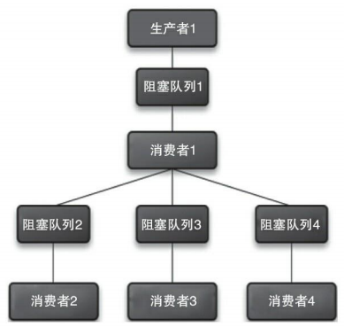
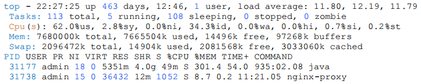
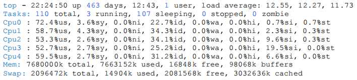
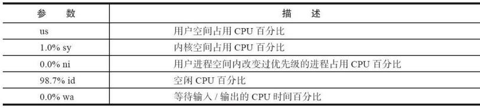
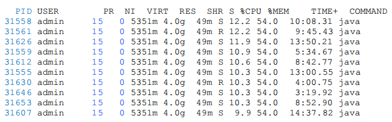
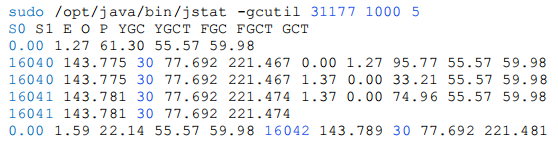
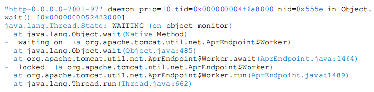
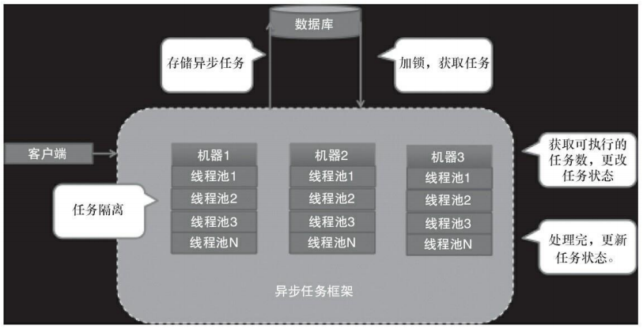

# 11. Java 并发编程实践


## 11.1 生产者和消费者模式

该模式通过**平衡生产线程和消费线程的工作能力**来提高程序整体处理数据的速度。

在线程世界里，生产者就是生产数据的线程，消费者就是消费数据的线程。在多线程开发中，如果生产者处理速度很快，而消费者处理速度很慢，那么生产者就必须等待消费者处理完，才能继续生产数据。同样的道理，如果消费者的处理能力大于生产者，那么消费者就必须等待生产者。为了解决这种生产消费能力不均衡的问题，便有了生产者和消费者模式。 

**什么是生产者和消费者模式？**

>生产者和消费者模式是通过一个容器来解决生产者和消费者的强耦合问题。生产者和消费者彼此之间不直接通信，而是通过阻塞队列来进行通信，所以生产者生产完数据之后不用等待消费者处理，直接扔给阻塞队列，消费者不找生产者要数据，而是直接从阻塞队列里取，阻塞队列就相当于一个缓冲区，平衡了生产者和消费者的处理能力。


### 11.1.1多生产者和多消费者场景

在多核时代，多线程并发处理速度比单线程处理速度更快，所以可以使用多个线程来生产数据，同样可以使用多个消费线程来消费数据。而更复杂的情况是，**消费者消费的数据，有可能需要继续处理，于是消费者处理完数据之后，它又要作为生产者把数据放在新的队列里，交给其他消费者继续处理**，如图所示：




### 11.1.2 线程池与生产消费者模式

Java 中的线程池类其实就是一种生产者和消费者模式的实现方式。生产者把任务丢给线程池，线程池创建线程并处理任务，如果将要运行的任务数大于线程池的基本线程数就把任务扔到阻塞队列里，这种做法比只使用一个阻塞队列来实现生产者和消费者模式显然要高明很多，因为消费者能够处理直接就处理掉了，这样速度更快，而生产者先存，消费者再取这种方式显然慢一些。 

我们的系统也可以使用线程池来实现多生产者和消费者模式。例如，创建 N 个不同规模的 Java 线程池来处理不同性质的任务，比如线程池 1 将数据读到内存之后，交给线程池 2 里的线程继续处理压缩数据。线程池 1 主要处理 IO 密集型任务，线程池 2 主要处理 CPU 密集型任务。 


**在平时的工作中哪些场景可以使用生产者消费者模式?**

> 需要处理任务时间比较长的场景，比如上传附件并处理，用户把文件上传到系统后，系统把文件丢到队列里，然后立刻返回告诉用户上传成功，最后消费者再去队列里取出文件处理。再如，调用一个远程接口查询数据，如果远程服务接口查询时需要几十秒的时间，那么它可以提供一个申请查询的接口，这个接口把要申请查询任务放数据库中，然后该接口立刻返回。然后服务器端用线程轮询并获取申请任务进行处理，处理完之后发消息给调用方，让调用方再来调用另外一个接口取数据。


## 11.2 线上问题定位

有时候，有很多问题只有在线上或者预发环境才能发现，而线上又不能调试代码，所以线上问题定位就只能`看日志`、`系统状态`和 `dump 线程`，这里简单地介绍一些常用的工具来定位线上问题：

1）在 Linux 命令行下使用 `TOP` 命令查看**每个进程的情况**，显示如下：



我们的程序是 Java 应用，所以**只需要关注 COMMAND 是 Java 的性能数据**，COMMAND 表示启动当前进程的命令，在 Java 进程这一行里可以看到 CPU 利用率是 300%，不用担心，这个是当前机器所有核加在一起的 CPU 利用率。

2）再使用 `top` 的`交互命令数字 1` 查看**每个 CPU 的性能数据**。



命令行显示了 CPU4，说明这是一个 5 核的虚拟机，平均每个 CPU 利用率在 60%以上。如果这里显示 CPU 利用率 100%，则很有可能程序里写了一个死循环。这些参数的含义，可以对比下表来查看：



3）使用 `top` 的`交互命令 H` 查看**每个线程的性能信息**。 



在这里可能会出现 3 种情况：

- 第一种情况，某个线程 CPU 利用率一直 100%，则说明是这个线程有可能有死循环，那么请记住这个 PID。 

- 第二种情况，某个线程一直在 TOP 10 的位置，这说明这个线程可能有性能问题。 

- 第三种情况，CPU 利用率高的几个线程在不停变化，说明并不是由某一个线程导致CPU 偏高。 

如果是第一种情况，也有可能是 GC 造成，可以用 `jstat` 命令看一下 GC 情况，看看是不是因为持久代或年老代满了，产生 Full GC，导致 CPU 利用率持续飙高，命令和回显如下：




还可以把线程 `dump` 下来，看看究竟是哪个线程、执行什么代码造成的 CPU 利用率高。执行以下命令，把线程 dump 到文件 dump17 里：

```shell
sudo -u admin /opt/taobao/java/bin/jstack 31177 >/home/tengfei.fangtf/dump17
```

dump 出来内容的类似下面内容：



`dump` 出来的线程 ID（nid）是十六进制的，而我们用 `TOP` 命令看到的线程 ID 是十进制的，所以要用 `printf` 命令转换一下进制。然后用十六进制的 ID 去 dump 里找到对应的线程。

```shell
printf "%x\n" 31558
输出：7b46
```


## 11.3 异步任务池

Java 中的线程池设计得非常巧妙，可以高效并发执行多个任务，但是在某些场景下需要对线程池进行扩展才能更好地服务于系统。例如，如果一个任务仍进线程池之后，运行线程池的程序重启了，那么线程池里的任务就会丢失。另外，线程池只能处理本机 的任务，在集群环境下不能有效地调度所有机器的任务。所以，需要结合线程池开发一个异步任务处理池。下图为异步任务池设计图：

 

任务池的主要处理流程是，每台机器会启动一个任务池，每个任务池里有多个线程池，当某台机器将一个任务交给任务池后，任务池会先将这个任务保存到数据中，然后某台机器上的任务池会从数据库中获取待执行的任务，再执行这个任务。 

每个任务有几种状态，分别是`创建（NEW）`、`执行中（EXECUTING）`、`RETRY（重试）`、`挂起（SUSPEND）`、`中止（TEMINER）`和`执行完成（FINISH）`。 

- **创建**：提交给任务池之后的状态。 
- **执行中**：任务池从数据库中拿到任务执行时的状态。
- **重试**：当执行任务时出现错误，程序显式地告诉任务池这个任务需要重试，并设置下一次执行时间。 
- **挂起**：当一个任务的执行依赖于其他任务完成时，可以将这个任务挂起，当收到消息后，再开始执行。 
- **中止**：任务执行失败，让任务池停止执行这个任务，并设置错误消息告诉调用端。 
- **执行完成**：任务执行结束。 


**任务池的任务隔离。**异步任务有很多种类型，比如抓取网页任务、同步数据任务等，不同类型的任务优先级不一样，但是系统资源是有限的，如果低优先级的任务非常多，高优先级的任务就可能得不到执行，所以必须对任务进行隔离执行。使用不同的线程池处理不同的任务，或者不同的线程池处理不同优先级的任务，如果任务类型非常少，建议用任务类型来隔离，如果任务类型非常多，比如几十个，建议采用优先级的方式来隔离。 

**任务池的重试策略。**根据不同的任务类型设置不同的重试策略，有的任务对实时性要求高，那么每次的重试间隔就会非常短，如果对实时性要求不高，可以采用默认的重试策略，重试间隔随着次数的增加，时间不断增长，比如间隔几秒、几分钟到几小时。每个任务类型可以设置执行该任务类型线程池的最小和最大线程数、最大重试次数。 

**使用任务池的注意事项。**任务必须无状态：任务不能在执行任务的机器中保存数据，比如某个任务是处理上传的文件，任务的属性里有文件的上传路径，如果文件上传到机器 1，机器 2 获取到了任务则会处理失败，所以上传的文件必须存在其他的集群里，比如 OSS 或 SFTP。 

**异步任务的属性。**包括任务名称、下次执行时间、已执行次数、任务类型、任务优先级和执行时的报错信息（用于快速定位问题）

