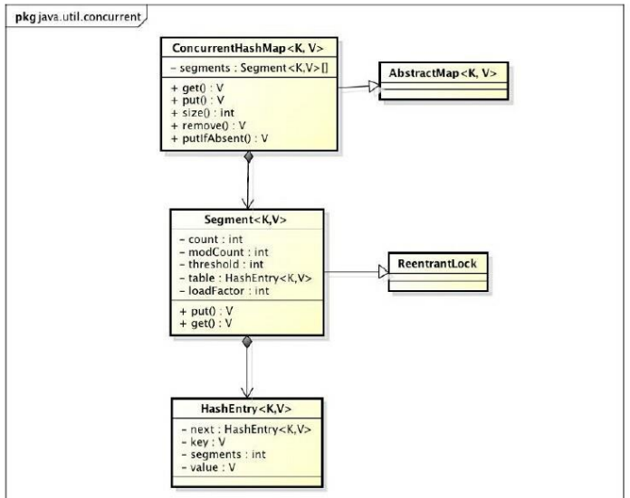
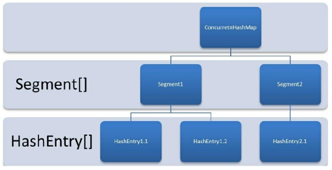
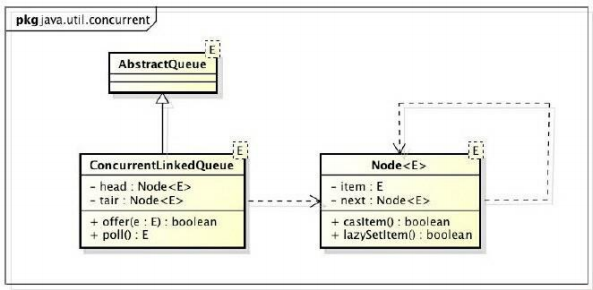
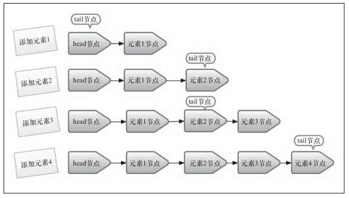
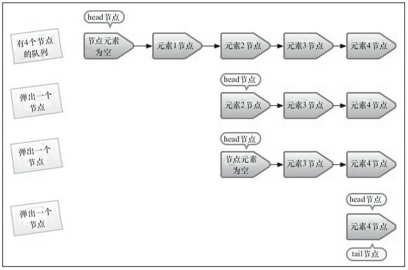
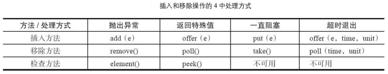
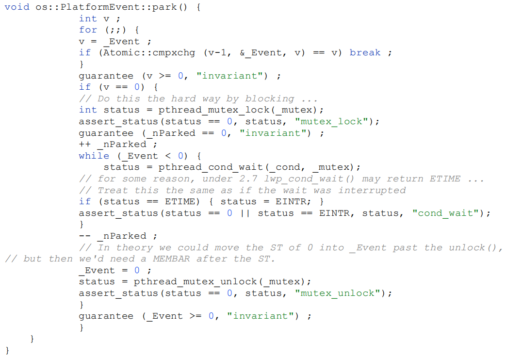
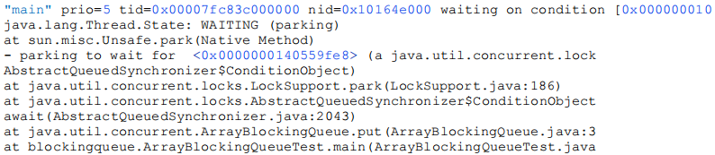
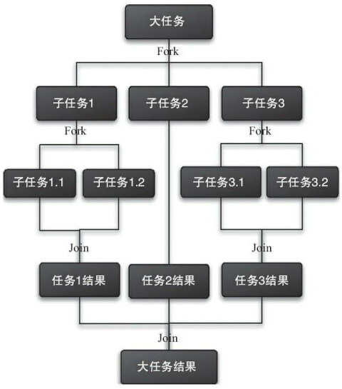

# 6. Java 并发容器和框架【重点】


## 6.1 ConcurrentHashMap 的实现原理与使用

ConcurrentHashMap 是**线程安全且高效**的 HashMap。

### 6.1.1 为什么要使用 ConcurrentHashMap

在并发编程中使用 HashMap 可能导致程序死循环。而使用线程安全的 HashTable 效率又非常低下，基于以上两个原因，便有了 ConcurrentHashMap 的登场机会。


#### 1）线程不安全的 HashMap

**在多线程环境下，使用 HashMap 进行 put 操作会引起死循环，导致 CPU 利用率接近 100%**，所以在并发情况下不能使用 HashMap。例如，执行以下代码会引起死循环。

```java
final HashMap<String, String> map = new HashMap<String, String>(2);
Thread t = new Thread(new Runnable() {
    @Override
    public void run() {
        for (int i = 0; i < 10000; i++) {
            new Thread(new Runnable() {
                @Override
                public void run() {
                	map.put(UUID.randomUUID().toString(), "");
                }
            }, "ftf" + i).start();
        }
    }
}, "ftf");
t.start();
t.join();
```

HashMap 在并发执行 put 操作时会引起死循环，是因为**多线程会导致 HashMap 的 Entry 链表形成环形数据结构，一旦形成环形数据结构，Entry 的 next 节点永远不为空，就会产生死循环获取 Entry。**


#### 2）效率低下的 HashTable

**HashTable 容器使用 synchronized 来保证线程安全**，但在线程竞争激烈的情况下 HashTable 的效率非常低下。因为**当一个线程访问 HashTable 的同步方法，其他线程也访问 HashTable 的同步方法时，会进入阻塞或轮询状态。**如线程 1 使用 put 进行元素添加，线程 2 不但不能使用 put 方法添加元素，也不能使用 get 方法来获取元素，所以竞争越激烈效率越低。 


#### 3）ConcurrentHashMap 的锁分段技术可有效提升并发访问率

HashTable 容器在竞争激烈的并发环境下表现出效率低下的原因是所有访问 HashTable 的线程都必须竞争同一把锁；

假如容器里有多把锁，每一把锁用于锁容器其中一部分数据，那么当多线程访问容器里不同数据段的数据时，线程间就不会存在锁竞争，从而可以有效提高并发访问效率，这就是 ConcurrentHashMap 所使用的**锁分段技术**。**首先将数据分成一段一段地存储，然后给每一段数据配一把锁，当一个线程占用锁访问其中一个段数据的时候，其他段的数据也能被其他线程访问。** 


### 6.1.2 ConcurrentHashMap 的结构

通过 ConcurrentHashMap 的**类图**来分析 ConcurrentHashMap 的结构，如下图所示：



ConcurrentHashMap**（JDK 1.7）**是由 **Segment 数组结构**和 **HashEntry 数组结构**组成。**Segment 是一种可重入锁（ReentrantLock），在 ConcurrentHashMap 里扮演锁的角色；HashEntry 则用于存储键值对数据**。**一个 ConcurrentHashMap 里包含一个 Segment 数组。**Segment 的结构和 HashMap 类似，是一种数组和链表结构。**一个 Segment 里包含一个 HashEntry 数组，每个 HashEntry 是一个链表结构的元素，每个 Segment 守护着一个 HashEntry 数组里的元素，当对 HashEntry 数组的数据进行修改时，必须首先获得与它对应的 Segment 锁**，如下图所示：



 

### 6.1.3 ConcurrentHashMap 的初始化

ConcurrentHashMap 初始化方法是通过 `initialCapacity`、`loadFactor` 和 `concurrencyLevel` 等几个参数来初始化 **segment 数组**、**段偏移量 segmentShift**、**段掩码 segmentMask** 和每个 segment 里的 **HashEntry 数组**来实现的。 

#### 1）初始化 segments 数组

源代码：

```java
if (concurrencyLevel > MAX_SEGMENTS) concurrencyLevel = MAX_SEGMENTS;
int sshift = 0;
int ssize = 1;
while (ssize < concurrencyLevel) {
    ++sshift;
    ssize <<= 1; 
}
segmentShift = 32 - sshift;
segmentMask = ssize - 1;
this.segments = Segment.newArray(ssize);
```

由上面的代码可知，segments 数组的长度 ssize 是通过 concurrencyLevel 计算得出的。为了能通过**按位与**的散列算法来定位 segments 数组的索引，**必须保证 segments 数组的长度是 2 的 N 次方（power-of-two size）**，所以必须计算出一个**大于或等于 concurrencyLevel 的最小的 2 的 N 次方值来作为 segments 数组的长度**。假如 concurrencyLevel 等于 14、15 或 16，ssize 都会等于 16，即容器里锁的个数也是 16。 

> 注意： 
>
> concurrencyLevel 的最大值是 65535，这意味着 segments 数组的长度最大为 65536，对应的二进制是 16 位。


#### 2）初始化 segmentShift(段偏移量) 和 segmentMask(段掩码)

这两个全局变量需要在定位 segment 时的散列算法里使用，**sshift 等于 ssize 从 1 向左移位的次数**，在默认情况下 concurrencyLevel 等于 16，1 需要向左移位移动 4 次，所以 sshift 等于 4。 

**segmentShift 用于定位参与散列运算的位数，segmentShift 等于 32 减 sshift，所以等于 28**，这里之所以用 32 是因为 ConcurrentHashMap 里的 `hash()` 方法输出的最大数是 32 位的，后面的测试中可以看到这点。**segmentMask 是散列运算的掩码，等于 ssize 减1，即 15**，掩码的二进制各个位的值都是 1。因为 ssize 的最大长度是 65536，所以 segmentShift 最大值是 16，segmentMask 最大值是 65535，对应的二进制是 16 位，每个位都是 1。 


#### 3）初始化每个 segment

**输入参数 `initialCapacity` 是 ConcurrentHashMap 的初始化容量，`loadfactor` 是每个 segment 的负载因子，在构造方法里需要通过这两个参数来初始化数组中的每个 segment。**

```java
if (initialCapacity > MAXIMUM_CAPACITY) initialCapacity = MAXIMUM_CAPACITY;
int c = initialCapacity / ssize;
if (c * ssize < initialCapacity)
	++c;
int cap = 1;
while (cap < c) cap <<= 1;
for (int i = 0; i < this.segments.length; ++i) {
	this.segments[i] = new Segment<K, V>(cap, loadFactor);
}
```

上面代码中的变量 `cap` 就是 segment 里 HashEntry 数组的长度，它等于 initialCapacity 除以 ssize 的倍数 c，如果 c 大于 1，就会取大于等于 c 的 2 的 N 次方值，所以 `cap` 不是 1，就是 2 的 N 次方。

segment 的容量 `threshold＝（int）cap*loadFactor`，默认情况下 initialCapacity 等于 16，loadfactor 等于 0.75，通过运算 cap 等于 1，threshold 等于零。 


### 6.1.4 定义 Segment

既然 ConcurrentHashMap 使用分段锁 Segment 来保护不同段的数据，那么在插入和获取元素的时候，必须先通过散列算法定位到 Segment。可以看到 ConcurrentHashMap 会首先使用 `Wang/Jenkins hash` 的变种算法对元素的 hashCode 进行一次再散列。

```java
private static int hash(int h) {
    h += (h << 15) ^ 0xffffcd7d;
    h ^= (h >>> 10);
    h += (h << 3);
    h ^= (h >>> 6);
    h += (h << 2) + (h << 14);
    return h ^ (h >>> 16);
}
```

之所以进行再散列，目的是**减少散列冲突**，使元素能够均匀地分布在不同的 Segment 上，从而提高容器的存取效率。假如散列的质量差到极点，那么所有的元素都在一个 Segment 中，不仅存取元素缓慢，分段锁也会失去意义。

通过再散列能**让数字的每一位都参加到散列运算当中**，从而减少散列冲突。ConcurrentHashMap 通过以下散列算法定位 segment。

```java
final Segment<K, V> segmentFor(int hash) {
	return segments[(hash >>> segmentShift) & segmentMask];
}
```

默认情况下 segmentShift 为 28，segmentMask 为 15，再散列后的数最大是 32 位二进制数据，向右无符号移动 28 位，意思是让高 4 位参与到散列运算中，`(hash>>>segmentShift) &segmentMask` 的运算结果分别是 4、15、7 和 8，可以看到散列值没有发生冲突。


### 6.1.5 ConcurrentHashMap 的操作

#### 1）get 操作

Segment 的 get 操作实现非常简单和高效。先经过一次再散列，然后使用这个散列值通过散列运算定位到 Segment，再通过散列算法定位到元素，代码如下：

```java
public V get(Object key) {
	int hash = hash(key.hashCode());
	return segmentFor(hash).get(key, hash);
}
```

get 操作的高效之处在于**整个 get 过程不需要加锁，除非读到的值是空才会加锁重读**。

***

我们知道 HashTable 容器的 get 方法是需要加锁的，那么 ConcurrentHashMap 的 get 操作是如何做到不加锁的呢？原因是**它的 get 方法里将要使用的共享变量都定义成 volatile 类型**，如用于统计当前 Segement 大小的 count 字段和用于存储值的 HashEntry 的 value。

```java
transient volatile int count;
volatile V value;
```

**定义成 volatile 的变量，能够在线程之间保持可见性，能够被多线程同时读，并且保证不会读到过期的值，但是只能被单线程写**（有一种情况可以被多线程写，就是写入的值不依赖于原值），在 get 操作里只需要读不需要写共享变量 count 和 value，所以可以不用加锁。之所以不会读到过期的值，是因为**根据 Java 内存模型的 happen before 原则，对 volatile 字段的写入操作先于读操作，即使两个线程同时修改和获取 volatile 变量，get 操作也能拿到最新的值，这是用 volatile 替换锁的经典应用场景。** 

***

```java
hash >>> segmentShift) &segmentMask // 定位 Segment 所使用的 hash 算法
int index = hash & (tab.length - 1); // 定位 HashEntry 所使用的 hash 算法
```

在定位元素的代码里可以发现，定位 HashEntry 和定位 Segment 的散列算法虽然一样，都与数组的长度减去 1 再相“与”，但是相“与”的值不一样，定位 Segment 使用的是元素的 hashcode 通过再散列后得到的值的高位，而定位 HashEntry 直接使用的是再散列后的值。其目的是避免两次散列后的值一样，虽然元素在 Segment 里散列开了，但是却没有在 HashEntry 里散列开。 


#### 2）put 操作

由于 put 方法里需要对共享变量进行写入操作，所以为了线程安全，在操作共享变量时必须加锁。**put 方法首先定位到 Segment，然后在 Segment 里进行插入操作。插入操作需要经历两个步骤，第一步判断是否需要对 Segment 里的 HashEntry 数组进行扩容，第二步定位添加元素的位置，然后将其放在 HashEntry 数组里。**

##### a. 是否需要扩容

在插入元素前会先判断 Segment 里的 HashEntry 数组是否超过容量（threshold），如果超过阈值，则对数组进行扩容。值得一提的是，Segment 的扩容判断比 HashMap 更恰当，因为 HashMap 是在插入元素后判断元素是否已经到达容量的，如果到达了就进行扩容，但是很有可能扩容之后没有新元素插入，这时 HashMap 就进行了一次无效的扩容。

##### b. 如何扩容

在扩容的时候，首先会创建一个**容量是原来容量两倍的数组**，然后**将原数组里的元素进行再散列后插入到新的数组里**。为了高效，**ConcurrentHashMap 不会对整个容器进行扩容，而只对某个 segment 进行扩容。** 


#### 3）size 操作

如果要统计整个 ConcurrentHashMap 里元素的大小，就必须统计所有 Segment 里元素的大小后求和。Segment 里的全局变量 count 是一个 volatile 变量，那么在多线程场景下，是不是直接把所有 Segment 的 count 相加就可以得到整个 ConcurrentHashMap 大小了呢？不是的，虽然相加时可以获取每个 Segment 的 count 的最新值，但是可能累加前使用的 count 发生了变化，那么统计结果就不准了。所以，最安全的做法是在统计 size 的时候把所有 Segment 的 put、remove 和 clean 方法全部锁住，但是这种做法显然非常低效。

因为在累加 count 操作过程中，之前累加过的 count 发生变化的几率非常小，所以 ConcurrentHashMap 的做法是**先尝试 2 次通过不锁住 Segment 的方式来统计各个 Segment 大小，如果统计的过程中，容器的 count 发生了变化，则再采用加锁的方式来统计所有 Segment 的大小。**

那么 ConcurrentHashMap 是如何判断在统计的时候容器是否发生了变化呢？使用 **modCount 变量**，**在 put、remove 和 clean 方法里操作元素前都会将变量 modCount 进行加 1**，那么在统计 size 前后比较 modCount 是否发生变化，从而得知容器的大小是否发生变化。


## 6.2 ConcurrentLinkedQueue

在并发编程中，有时候需要使用线程安全的队列。如果要实现一个线程安全的队列有两种方式：一种是使用阻塞算法，另一种是使用非阻塞算法。使用阻塞算法的队列可以用一个锁（入队和出队用同一把锁）或两个锁（入队和出队用不同的锁）等方式来实现。非阻塞的实现方式则可以使用循环 CAS 的方式来实现。

**ConcurrentLinkedQueue 是一个基于链接节点的无界线程安全队列**，它采用**先进先出**的规则对节点进行排序，当我们添加一个元素的时候，它会添加到队列的尾部；当我们获取一个元素时，它会返回队列头部的元素。它采用了“**wait-free**”算法（即 CAS 算法）来实现。


### 6.2.1 ConcurrentLinkedQueue 的结构

通过 ConcurrentLinkedQueue 的类图来分析一下它的结构：



ConcurrentLinkedQueue 由 head 节点和 tail 节点组成，每个节点（Node）由节点元素（item）和指向下一个节点（next）的引用组成，节点与节点之间就是通过这个 next 关联起来，从而组成一张链表结构的队列。**默认情况下 head 节点存储的元素为空，tail 节点等于 head 节点。**

```java
private transient volatile Node<E> tail = head;
```

 

### 6.2.2 入队列

#### 1）入队列的过程

入队列就是**将入队节点添加到队列的尾部**。

为了方便理解入队时队列的变化，以及 head 节点和 tail 节点的变化，这里以一个示例来展开介绍。假设在一个队列中依次插入 4 个节点，为了便于理解，每添加一个节点就做了一个队列的快照图，如图所示。 



- 添加元素 1。队列更新 head 节点的 next 节点为元素 1 节点。又因为 tail 节点默认情况下等于 head 节点，所以它们的 next 节点都指向元素 1 节点。 

- 添加元素 2。队列首先设置元素 1 节点的 next 节点为元素 2 节点，然后更新 tail 节点指向元素 2 节点。

- 添加元素 3，设置 tail 节点的 next 节点为元素 3 节点。 

- 添加元素 4，设置元素 3 的 next 节点为元素 4 节点，然后将 tail 节点指向元素 4 节点。

通过调试入队过程并观察 head 节点和 tail 节点的变化，发现入队主要做两件事情：第一是**将入队节点设置成当前队列尾节点的下一个节点**；第二是**更新 tail 节点**，如果 tail 节点的 next 节点不为空，则将入队节点设置成 tail 节点，如果 tail 节点的 next 节点为空，则将入队节点设置成 tail 的 next 节点，所以 **tail 节点不总是尾节点**。 


通过对上面的分析，我们从单线程入队的角度理解了入队过程，但是多个线程同时进行入队的情况就变得更加复杂了，因为可能会出现其他线程插队的情况。**如果有一个线程正在入队，那么它必须先获取尾节点，然后设置尾节点的下一个节点为入队节点，但这时可能有另外一个线程插队了，那么队列的尾节点就会发生变化，这时当前线程要暂停入队操作，然后重新获取尾节点。**通过源码来详细分析一下它是如何使用 CAS 算法来入队的：

```java
public boolean offer(E e) {
    if (e == null) throw new NullPointerException();
    // 入队前，创建一个入队节点
    Node<E> n = new Node<E>(e);
    retry:
    // 死循环，入队不成功反复入队。
    for (; ; ) {
        // 创建一个指向 tail 节点的引用
        Node<E> t = tail;
        // p 用来表示队列的尾节点，默认情况下等于 tail 节点。
        Node<E> p = t;
        for (int hops = 0; ; hops++) { // 获得 p 节点的下一个节点。
            Node<E> next = succ(p);
            // next 节点不为空，说明 p 不是尾节点，需要更新 p 后在将它指向 next 节点
            if (next != null) {
                // 循环了两次及其以上，并且当前节点还是不等于尾节点
                if (hops > HOPS && t != tail) continue retry;
                p = next;
            }
            // 如果 p 是尾节点，则设置 p 节点的 next 节点为入队节点。
            else if (p.casNext(null, n)) {
                /*如果 tail 节点有大于等于 1 个 next 节点，则将入队节点设置成 tail 节点， 
                更新失败了也没关系，因为失败了表示有其他线程成功更新了 tail 节点*/
                if (hops >= HOPS)
                	casTail(t, n); // 更新 tail 节点，允许失败
                return true;
            }
            // p 有 next 节点,表示 p 的 next 节点是尾节点，则重新设置 p 节点
            else {
            	p = succ(p);
            }
        }
    } 
}
```

从源代码角度来看，整个入队过程主要做两件事情：第一是**定位出尾节点**；第二是**使用 CAS 算法将入队节点设置成尾节点的 next 节点，如不成功则重试。**


#### 2）定位尾节点

tail 节点并不总是尾节点，所以每次入队都必须先通过 tail 节点来找到尾节点。**尾节点可能是 tail 节点，也可能是 tail 节点的 next 节点。**代码中循环体中的第一个 if 就是判断 tail 是否有 next 节点，有则表示 next 节点可能是尾节点。获取 tail 节点的 next 节点需要注意的是 p 节点等于 p 的 next 节点的情况，只有一种可能就是 p 节点和 p 的 next 节点都等于空，表示这个队列刚初始化，正准备添加节点，所以需要返回 head 节点。

获取 p 节点的 next 节点代码如下：

```java
final Node<E> succ(Node<E> p) {
	Node<E> next = p.getNext();
	return (p == next) head:
	next; 
}
```


#### 3）设置入队节点为尾节点

`p.casNext(null，n)` 方法用于将入队节点设置为当前队列尾节点的 next 节点，如果 p 是 null，表示 p 是当前队列的尾节点，如果不为 null，表示有其他线程更新了尾节点，则需要重新获取当前队列的尾节点。


#### 4）HOPS 的设计意图

```java
private static final int HOPS = 1;
```

使用 hops 变量来**控制并减少 tail 节点的更新频率**，并不是每次节点入队后都将 tail 节点更新成尾节点，而是当 tail 节点和尾节点的距离大于等于常量 HOPS 的值（默认等于 1）时才更新 tail 节点，tail 和尾节点的距离越长，使用 CAS 更新 tail 节点的次数就会越少，但是距离越长带来的负面效果就是每次入队时定位尾节点的时间就越长，因为循环体需要多循环一次来定位出尾节点，但是这样仍然能提高入队的效率，因为从本质上来看它**通过增加对 volatile 变量的读操作来减少对 volatile 变量的写操作，而对 volatile 变量的写操作开销要远远大于读操作，所以入队效率会有所提升。** 

> **注意：**入队方法永远返回 true，所以不要通过返回值判断是否成功。


### 6.2.3 出队列

出队列的就是**从队列里返回一个节点元素，并清空该节点对元素的引用。**

通过每个节点出队的快照来观察一下 head 节点的变化，如图所示：



从图中可知，**并不是每次出队时都更新 head 节点，当 head 节点里有元素时，直接弹出 head 节点里的元素，而不会更新 head 节点。只有当 head 节点里没有元素时，出队操作才会更新 head 节点。**这种做法也是通过 hops 变量来减少使用 CAS 更新 head 节点的消耗，从而提高出队效率。 

***

通过源码来深入分析下出队过程：

```java
public E poll() {
    Node<E> h = head;
    // p 表示头节点，需要出队的节点
    Node<E> p = h;
    for (int hops = 0; ; hops++) {
        // 获取 p 节点的元素
        E item = p.getItem();
        // 如果 p 节点的元素不为空，使用 CAS 设置 p 节点引用的元素为 null, 
        // 如果成功则返回 p 节点的元素。
        if (item != null && p.casItem(item, null)) {
            if (hops >= HOPS) {
                // 将 p 节点下一个节点设置成 head 节点
                Node<E> q = p.getNext();
                updateHead(h, (q != null)q :p);
            }
            return item;
        }
        // 如果头节点的元素为空或头节点发生了变化，这说明头节点已经被另外
        // 一个线程修改了。那么获取 p 节点的下一个节点
        Node<E> next = succ(p);
        // 如果 p 的下一个节点也为空，说明这个队列已经空了
        if (next == null) { // 更新头节点。
            updateHead(h, p);
            break;
        }
        // 如果下一个元素不为空，则将头节点的下一个节点设置成头节点
        p = next;
    }
    return null; 
}
```

首先获取头节点的元素，然后判断头节点元素是否为空，如果为空，表示另外一个线程已经进行了一次出队操作将该节点的元素取走，如果不为空，则使用 CAS 的方式将头节点的引用设置成 null，如果 CAS 成功，则直接返回头节点的元素，如果不成功，表示另外一个线程已经进行了一次出队操作更新了 head 节点，导致元素发生了变化，需要重新获取头节点。 


## 6.3 Java 中的阻塞队列


### 6.3.1 什么是阻塞队列

阻塞队列（BlockingQueue）是一个**支持两个附加操作的队列**。这两个附加的操作支持阻塞的插入和移除方法。 

- 支持阻塞的插入方法：当队列满时，队列会阻塞插入元素的线程，直到队列不满。 

- 支持阻塞的移除方法：在队列为空时，获取元素的线程会等待队列变为非空。

阻塞队列常用于**生产者和消费者**的场景，生产者是向队列里添加元素的线程，消费者是从队列里取元素的线程。阻塞队列就是生产者用来存放元素、消费者用来获取元素的容器。在阻塞队列不可用时，这两个附加操作提供了 4 种处理方式，如下表所示：



- **抛出异常**：当队列满时，如果再往队列里插入元素，会抛出 IllegalStateException（"Queue full"）异常。当队列空时，从队列里获取元素会抛出 NoSuchElementException 异常。 

- **返回特殊值**：当往队列插入元素时，会返回元素是否插入成功，成功返回 true。如果是移除方法，则是从队列里取出一个元素，如果没有则返回 null。 

- **一直阻塞**：当阻塞队列满时，如果生产者线程往队列里 put 元素，队列会一直阻塞生产者线程，直到队列可用或者响应中断退出。当队列空时，如果消费者线程从队列里 take 元素，队列会阻塞住消费者线程，直到队列不为空。 

- **超时退出**：当阻塞队列满时，如果生产者线程往队列里插入元素，队列会阻塞生产者线程一段时间，如果超过了指定的时间，生产者线程就会退出。 

>注意:
>
>如果是无界阻塞队列，队列不可能会出现满的情况，所以使用 put 或 offer 方法永远不会被阻塞，而且使用 offer 方法时，该方法永远返回 true。 


### 6.3.2 Java 里的阻塞队列

JDK 7 提供了 7 个阻塞队列，如下：

- **ArrayBlockingQueue**：一个由数组结构组成的有界阻塞队列
- **LinkedBlockingQueue**：一个由链表结构组成的有界阻塞队列
- **PriorityBlockingQueue**：一个支持优先级排序的无界阻塞队列
- **DelayQueue**：一个使用优先级队列实现的无界阻塞队列
- **SynchronousQueue**：一个不存储元素的阻塞队列
- **LinkedTransferQueue**：一个由链表结构组成的无界阻塞队列
- **LinkedBlockingDeque**：一个由链表结构组成的双向阻塞队列


#### 1）ArrayBlockingQueue

ArrayBlockingQueue 是一个用**数组**实现的**有界阻塞队列**。此队列按照**先进先出（FIFO）**的原则对元素进行排序。

默认情况下不保证线程公平的访问队列，所谓公平访问队列是指阻塞的线程，可以按照阻塞的先后顺序访问队列，即先阻塞线程先访问队列。非公平性是对先等待的线程是非公平的，当队列可用时，阻塞的线程都可以争夺访问队列的资格，有可能先阻塞的线程最后才访问队列。为了保证公平性，通常会降低吞吐量。可以使用以下代码创建一个公平的阻塞队列：

```java
ArrayBlockingQueue fairQueue = new ArrayBlockingQueue(1000, true);
```

**访问者的公平性是使用可重入锁实现的**，代码如下：

```java
public ArrayBlockingQueue(int capacity, boolean fair) {
    if (capacity <= 0) throw new IllegalArgumentException();
    this.items = new Object[capacity];
    lock = new ReentrantLock(fair);
    notEmpty = lock.newCondition();
    notFull = lock.newCondition();
}
```


#### 2）LinkedBlockingQueue

LinkedBlockingQueue 是一个用**链表**实现的**有界阻塞队列**。此队列的默认和最大长度为 Integer.MAX_VALUE。此队列按照**先进先出**的原则对元素进行排序。


#### 3）PriorityBlockingQueue

PriorityBlockingQueue 是一个**支持优先级**的**无界阻塞队列**。默认情况下元素采取**自然顺序升序排列**。也可以自定义类实现 `compareTo()` 方法来指定元素排序规则，或者初始化 PriorityBlockingQueue 时，指定构造参数 `Comparator` 来对元素进行排序。需要注意的是**不能保证同优先级元素的顺序。** 


#### 4）DelayQueue

DelayQueue 是一个**支持延时获取元素**的**无界阻塞队列**。队列使用 PriorityQueue 来实现。**队列中的元素必须实现 Delayed 接口，在创建元素时可以指定多久才能从队列中获取当前元素。只有在延迟期满时才能从队列中提取元素。** 

DelayQueue 非常有用，可以将 DelayQueue 运用在以下应用场景：

- 缓存系统的设计：可以用 DelayQueue 保存缓存元素的有效期，使用一个线程循环查询 DelayQueue，一旦能从 DelayQueue 中获取元素时，表示缓存有效期到了。 

- 定时任务调度：使用 DelayQueue 保存当天将会执行的任务和执行时间，一旦从 DelayQueue 中获取到任务就开始执行，比如 TimerQueue 就是使用 DelayQueue 实现的。


**1. 如何实现 Delayed 接口**

DelayQueue 队列的元素必须实现 Delayed 接口。可以参考 ScheduledThreadPoolExecutor 里 ScheduledFutureTask 类的实现，一共有三步：

**第一步：**在对象创建的时候，初始化基本数据。使用 time 记录当前对象延迟到什么时候可以使用，使用 sequenceNumber 来标识元素在队列中的先后顺序。代码如下：

```java
private static final AtomicLong sequencer = new AtomicLong(0);

ScheduledFutureTask(Runnable r, V result, long ns, long period) {
    ScheduledFutureTask(Runnable r, V result, long ns, long period){
        super(r, result);
        this.time = ns;
        this.period = period;
        this.sequenceNumber = sequencer.getAndIncrement();
    } 
}
```

**第二步：**实现 `getDelay` 方法，该方法返回当前元素还需要延时多长时间，单位是纳秒，代码如下：

```java
public long getDelay(TimeUnit unit) {
	return unit.convert(time - now(), TimeUnit.NANOSECONDS);
}
```

通过构造函数可以看出延迟时间参数 ns 的单位是纳秒，自己设计的时候最好使用纳秒，因为实现 `getDelay()` 方法时可以指定任意单位，一旦以秒或分作为单位，而延时时间又精确不到纳秒就麻烦了。使用时请注意当 time 小于当前时间时，`getDelay` 会返回负数。 

**第三步：**实现 `compareTo` 方法来指定元素的顺序。例如，让延时时间最长的放在队列的末尾。实现代码如下：

```java
public int compareTo(Delayed other) {
    if (other == this)// compare zero ONLY if same object
    	return 0;
    if (other instanceof ScheduledFutureTask) {
        ScheduledFutureTask<> x = (ScheduledFutureTask<>) other; long diff = time - x.time;
        if (diff < 0) return -1;
        else if (diff > 0) return 1;
        else if (sequenceNumber < x.sequenceNumber) return -1;
        else return 1;
    }
    
    long d = (getDelay(TimeUnit.NANOSECONDS) other.getDelay(TimeUnit.NANOSECONDS));
     return (d == 0) ? 0 : ((d < 0) ? -1 : 1);
}
```


**2. 如何实现延时阻塞队列**

延时阻塞队列的实现很简单，**当消费者从队列里获取元素时，如果元素没有达到延时时间，就阻塞当前线程。** 

```java
long delay = first.getDelay(TimeUnit.NANOSECONDS);
if (delay <= 0) return q.poll();
else if (leader != null) available.await();
else {
    Thread thisThread = Thread.currentThread();
    leader = thisThread;
    try {
    	available.awaitNanos(delay);
    } finally {
    	if (leader == thisThread) leader = null;
    } 
}
```

代码中的变量 leader 是一个等待获取队列头部元素的线程。如果 leader 不等于空，表示已经有线程在等待获取队列的头元素。所以，使用 `await()` 方法让当前线程等待信号。如果 leader 等于空，则把当前线程设置成 leader，并使用 `awaitNanos()` 方法让当前线程等待接收信号或等待 delay 时间。


#### 5）SynchronousQueue

SynchronousQueue 是一个**不存储元素**的**阻塞队列**。**每一个 put 操作必须等待一个 take 操作，否则不能继续添加元素。** 

它支持公平访问队列。默认情况下线程采用非公平性策略访问队列。使用以下构造方法可以创建公平性访问的 SynchronousQueue，如果设置为 true，则等待的线程会采用先进先出的顺序访问队列。

```java
public SynchronousQueue(boolean fair) {
	transferer = fair new TransferQueue() :new TransferStack();
}
```

SynchronousQueue 可以看成是一个传球手，负责把生产者线程处理的数据**直接传递**给消费者线程。队列本身并不存储任何元素，非常**适合传递性场景**。SynchronousQueue 的吞吐量高于 LinkedBlockingQueue 和 ArrayBlockingQueue。 


#### 6) LinkedTransferQueue

LinkedTransferQueue 是一个由**链表**结构组成的**无界阻塞 TransferQueue 队列**。相对于其他阻塞队列，LinkedTransferQueue 多了 `tryTransfer` 和 `transfer` 方法。 

**1. transfer 方法**

如果当前有消费者正在等待接收元素（消费者使用 `take()`方法或带时间限制的 `poll()` 方法时），transfer 方法可以把生产者传入的元素立刻 transfer（传输）给消费者。如果没有消费者在等待接收元素，transfer 方法会将元素存放在队列的 tail 节点，并**等到该元素被消费者消费了才返回**。transfer 方法的关键代码如下：

```java
Node pred = tryAppend(s, haveData);
return awaitMatch(s, pred, e, (how == TIMED), nanos);
```

第一行代码是试图把存放当前元素的 s 节点作为 tail 节点。第二行代码是让 CPU 自旋等待消费者消费元素。因为自旋会消耗 CPU，所以自旋一定的次数后使用 `Thread.yield()` 方法来暂停当前正在执行的线程，并执行其他线程。


**2. tryTransfer 方法**

tryTransfer 方法是用来试探生产者传入的元素是否能直接传给消费者。如果没有消费者等待接收元素，则返回 false。和 transfer 方法的区别是 tryTransfer 方法**无论消费者是否接收，方法立即返回**，而 transfer 方法是必须等到消费者消费了才返回。

对于带有时间限制的 `tryTransfer(E e，long timeout，TimeUnit unit)` 方法，试图把生产者传入的元素直接传给消费者，但是如果没有消费者消费该元素则等待指定的时间再返回，如果超时还没消费元素，则返回 false，如果在超时时间内消费了元素，则返回 true。


#### 7) LinkedBlockingDeque

LinkedBlockingDeque 是一个由**链表**结构组成的**双向阻塞队列**。所谓双向队列指的是可以从队列的两端插入和移出元素。双向队列因为多了一个操作队列的入口，在多线程同时入队时，也就减少了一半的竞争。

相比其他的阻塞队列，LinkedBlockingDeque 多了 `addFirst`、`addLast`、`offerFirst`、`offerLast`、`peekFirst` 和 `peekLast` 等方法，以 First 单词结尾的方法，表示插入、获取（peek）或移除双端队列的第一个元素。以 Last 单词结尾的方法，表示插入、获取或移除双端队列的最后一个元素。另外，插入方法 add 等同于 addLast，移除方法 remove 等效于 removeFirst。但是 take 方法却等同于 takeFirst。

> 在初始化 LinkedBlockingDeque 时可以设置容量防止其过度膨胀。另外，双向阻塞队列可以运用在“工作窃取”模式中。


### 6.3.3 阻塞队列的实现原理

> 如果队列是空的，消费者会一直等待，当生产者添加元素时，消费者是如何知道当前队列有元素的呢？JDK 是如何设计阻塞队列的，如何让生产者和消费者进行高效率的通信呢？

**使用通知模式实现。**所谓通知模式，就是**当生产者往满的队列里添加元素时会阻塞住生产者，当消费者消费了一个队列中的元素后，会通知生产者当前队列可用。**

通过查看 JDK 源码发现 ArrayBlockingQueue 使用了 **Condition** 来实现，代码如下：

```java
private final Condition notFull;
private final Condition notEmpty;

public ArrayBlockingQueue(int capacity, boolean fair) {
    // 省略其他代码
    notEmpty = lock.newCondition();
    notFull = lock.newCondition();
}

public void put(E e) throws InterruptedException {
    checkNotNull(e);
    final ReentrantLock lock = this.lock;
    lock.lockInterruptibly();
    try {
        while (count == items.length) notFull.await();
        insert(e);
    } finally {
    	lock.unlock();
    } 
}

public E take() throws InterruptedException {
    final ReentrantLock lock = this.lock;
    lock.lockInterruptibly();
    try {
        while (count == 0) notEmpty.await();
        return extract();
    } finally {
    	lock.unlock();
    } 
}

private void insert(E x) {
    items[putIndex] = x;
    putIndex = inc(putIndex);
    ++count;
    notEmpty.signal();
}
```

当往队列里插入一个元素时，如果队列不可用，那么阻塞生产者主要通过 `LockSupport.park(this)`来实现。

```java
public final void await() throws InterruptedException {
    if (Thread.interrupted()) throw new InterruptedException();
    Node node = addConditionWaiter();
    int savedState = fullyRelease(node);
    int interruptMode = 0;
    while (!isOnSyncQueue(node)) {
        LockSupport.park(this);
        if ((interruptMode = checkInterruptWhileWaiting(node)) != 0) break;
    }
    if (acquireQueued(node, savedState) && interruptMode != THROW_IE) interruptMode 
    = REINTERRUPT;
    if (node.nextWaiter != null) // clean up if cancelled
    	unlinkCancelledWaiters();
    if (interruptMode != 0) reportInterruptAfterWait(interruptMode);
}
```

继续进入源码，发现调用 `setBlocker` 先保存一下将要阻塞的线程，然后调用 `unsafe.park` 阻塞当前线程。

```java
public static void park(Object blocker) {
    Thread t = Thread.currentThread();
    setBlocker(t, blocker);
    unsafe.park(false, 0L);
    setBlocker(t, null);
}
```

`unsafe.park` 是个 native 方法，代码如下：

```java
public native void park(boolean isAbsolute, long time);
```


`park` 这个方法会阻塞当前线程，只有以下 4 种情况中的一种发生时，该方法才会返回： 

- 与 park 对应的 unpark 执行或已经执行时。“已经执行”是指 unpark 先执行，然后再执行 park 的情况。 

- 线程被中断时。 

- 等待完 time 参数指定的毫秒数时。 

- 异常现象发生时，这个异常现象没有任何原因。 


继续看一下 JVM 是如何实现 park 方法：park 在不同的操作系统中使用不同的方式实现，在 Linux 下使用的是系统方法 `pthread_cond_wait` 实现。实现代码在 JVM 源码路径 `src/os/linux/vm/os_linux.cpp` 里的 `os::PlatformEvent::park` 方法，代码如下：



pthread_cond_wait 是一个多线程的条件变量函数，cond 是 condition 的缩写，字面意思可以理解为线程在等待一个条件发生，这个条件是一个全局变量。这个方法接收两个参数：一个共享变量_cond，一个互斥量\_mutex。而 unpark 方法在 Linux 下是使用 pthread_cond_signal 实现的。 park 方法在 Windows 下则是使用 WaitForSingleObject 实现的。想知道 pthread_cond_wait 是如何实现的，可以参考 glibc-2.5 的 nptl/sysdeps/pthread/pthread_cond_wait.c。 

当线程被阻塞队列阻塞时，线程会进入 WAITING（parking）状态。我们可以使用 `jstack dump` 阻塞的生产者线程看到这点，如下：




## 6.4 Fork/Join 框架


### 6.4.1 什么是 Fork/Join 框架

Fork/Join 框架是 Java 7 提供的一个用于**并行执行任务**的框架，是一个**把大任务分割成若干个小任务，最终汇总每个小任务结果后得到大任务结果**的框架。

Fork 就是把一个大任务切分为若干子任务并行的执行，Join 就是合并这些子任务的执行结果，最后得到这个大任务的结果。比如计算 1+2+…+10000，可以分割成 10 个子任务，每个子任务分别对 1000 个数进行求和，最终汇总这 10 个子任务的结果。Fork/Join 的运行流程如下图所示。 




### 6.4.2 工作窃取算法

工作窃取（work-stealing）算法是指**某个线程从其他队列里窃取任务来执行。**

> 为什么需要使用工作窃取算法呢？
>
> 假如我们需要做一个比较大的任务，可以把这个任务分割为若干互不依赖的子任务，为了减少线程间的竞争，把这些子任务分别放到不同的队列里，并为每个队列创建一个单独的线程来执行队列里的任务，线程和队列一一对应。比如 A 线程负责处理 A 队列里的任务。但是，有的线程会先把自己队列里的任务干完，而其他线程对应的队列里还有任务等待处理。干完活的线程与其等着，不如去帮其他线程干活，于是它就去其他线程的队列里窃取一个任务来执行。而在这时它们会访问同一个队列，所以为了减少窃取任务线程和被窃取任务线程之间的竞争，通常会使用双端队列，被窃取任务线程永远从双端队列的头部拿任务执行，而窃取任务的线程永远从双端队列的尾部拿任务执行。

工作窃取的运行流程如下图所示： 


**工作窃取算法的优点：**充分利用线程进行并行计算，减少了线程间的竞争。 

**工作窃取算法的缺点：**在某些情况下还是存在竞争，比如双端队列里只有一个任务时。并且该算法会消耗了更多的系统资源，比如创建多个线程和多个双端队列。


### 6.4.3 Fork/Join 框架的设计

如何设计一个 Fork/Join 框架？

步骤 1：**分割任务**。首先需要有一个 fork 类来把大任务分割成子任务，有可能子任务还是很大，所以还需要不停地分割，直到分割出的子任务足够小。 

步骤 2：**执行任务并合并结果**。分割的子任务分别放在双端队列里，然后几个启动线程分别从双端队列里获取任务执行。子任务执行完的结果都统一放在一个队列里，启动一个线程从队列里拿数据，然后合并这些数据。


Fork/Join 使用两个类来完成以上两件事情：

1) **ForkJoinTask**：要使用 ForkJoin 框架，必须首先创建一个 ForkJoin 任务。它**提供在任务中执行 `fork()` 和 `join()` 操作的机制。**通常情况下，我们不需要直接继承 ForkJoinTask 类，只需要继承它的子类，Fork/Join 框架提供了以下两个子类。 

- RecursiveAction：用于没有返回结果的任务。 

- RecursiveTask：用于有返回结果的任务。 

2) **ForkJoinPool**：ForkJoinTask 需要通过 ForkJoinPool 来执行。 

任务分割出的子任务会添加到当前工作线程所维护的双端队列中，进入队列的头部。当一个工作线程的队列里暂时没有任务时，它会随机从其他工作线程的队列的尾部获取一个任务。


### 6.4.4 使用 Fork/Join 框架

> 通过一个简单的需求来使用 Fork/Join 框架，需求是：计算 1+2+3+4 的结果。

使用 Fork/Join 框架首先要考虑到的是如何分割任务，如果希望每个子任务最多执行两个数的相加，那么我们设置分割的阈值是 2，由于是 4 个数字相加，所以 Fork/Join 框架会把这个任务 fork 成两个子任务，子任务一负责计算 1+2，子任务二负责计算 3+4，然后再 join 两个子任务的结果。因为是有结果的任务，所以必须继承 RecursiveTask，实现代码如下：

```java
public class CountTask extends RecursiveTask<Integer> {
    private static final int THRESHOLD = 2; // 阈值
    private int start;
    private int end;
    
    public CountTask(int start, int end) {
        this.start = start;
        this.end = end;
    }
    
    @Override
    protected Integer compute() {
        int sum = 0;
        // 如果任务足够小就计算任务
        boolean canCompute = (end - start) <= THRESHOLD;
        if (canCompute) {
            for (int i = start; i <= end; i++) {
            	sum += i;
            }
        } else {
            // 如果任务大于阈值，就分裂成两个子任务计算
            int middle = (start + end) / 2;
            CountTask leftTask = new CountTask(start, middle);
            CountTask rightTask = new CountTask(middle + 1, end);
            // 执行子任务
            leftTask.fork();
            rightTask.fork();
            // 等待子任务执行完，并得到其结果
            int leftResult = leftTask.join();
            int rightResult = rightTask.join();
            // 合并子任务
            sum = leftResult + rightResult;
        }
        return sum;
    }
    public static void main(String[] args) {
        ForkJoinPool forkJoinPool = new ForkJoinPool();
        // 生成一个计算任务，负责计算 1+2+3+4
        CountTask task = new CountTask(1, 4);
        // 执行一个任务
        Future<Integer> result = forkJoinPool.submit(task);
        try {
        	System.out.println(result.get());
        } catch (InterruptedException e) {
        } catch (ExecutionException e) {
        }
    } 
}
```


ForkJoinTask 与一般任务的主要区别在于它需要实现 `compute` 方法，在这个方法里，首先需要判断任务是否足够小，如果足够小就直接执行任务。如果不足够小，就必须分割成两个子任务，每个子任务在调用 fork 方法时，又会进入 compute 方法，看看当前子任务是否需要继续分割成子任务，如果不需要继续分割，则执行当前子任务并返回结果。使用 join 方法会等待子任务执行完并得到其结果。 


### 6.4.5 Fork/Join 框架的异常处理

ForkJoinTask 在执行的时候可能会抛出异常，但是我们没办法在主线程里直接捕获异常，所以 ForkJoinTask 提供了 `isCompletedAbnormally()` 方法来检查任务是否已经抛出异常或已经被取消了，并且可以通过 ForkJoinTask 的 `getException` 方法获取异常。使用如下代码：

```java
if (task.isCompletedAbnormally()) {
	System.out.println(task.getException());
}
```

`getException` 方法返回 Throwable 对象，如果任务被取消了则返 CancellationException。如果任务没有完成或者没有抛出异常则返回 null。 


### 6.4.6 Fork/Join 框架的实现原理

ForkJoinPool 由 **ForkJoinTask 数组**和 **ForkJoinWorkerThread 数组**组成，ForkJoinTask 数组负责将存放程序提交给 ForkJoinPool 的任务，而 ForkJoinWorkerThread 数组负责执行这些任务。 


**1) ForkJoinTask 的 fork 方法实现原理**

当我们调用 ForkJoinTask 的 fork 方法时，程序会调用 ForkJoinWorkerThread 的 `pushTask` 方法**异步**地执行这个任务，然后立即返回结果。代码如下：

```java
public final ForkJoinTask<V> fork() {
	((ForkJoinWorkerThread) Thread.currentThread()).pushTask(this);
	return this; 
}
```

`pushTask` 方法**把当前任务存放在 ForkJoinTask 数组队列里。然后再调用 ForkJoinPool 的 `signalWork()` 方法唤醒或创建一个工作线程来执行任务**。代码如下：

```java
final void pushTask(ForkJoinTask<> t) {
    ForkJoinTask<>[] q; int s, m;
    if ((q = queue) != null) { // ignore if queue removed
        long u = (((s = queueTop) & (m = q.length - 1)) << ASHIFT) + ABASE;
        UNSAFE.putOrderedObject(q, u, t);
        queueTop = s + 1; // or use putOrderedInt
        if ((s -= queueBase) <= 2) pool.signalWork();
        else if (s == m) growQueue();
    } 
}
```


**2) ForkJoinTask 的 join 方法实现原理**

Join 方法的主要作用是**阻塞当前线程并等待获取结果。**看看 ForkJoinTask 的 join 方法的实现，代码如下：

```java
public final V join() {
    if (doJoin() != NORMAL) return reportResult();
    else return getRawResult();
}

private V reportResult() {
    int s;
    Throwable ex;
    if ((s = status) == CANCELLED) throw new CancellationException();
    if (s == EXCEPTIONAL && (ex = getThrowableException()) != null)
    	UNSAFE.throwException(ex);
    return getRawResult();
}
```

首先，它调用了 `doJoin()` 方法，通过 `doJoin()` 方法得到当前任务的状态来判断返回什么结果，任务状态有 4 种：`已完成(NORMAL)`、`被取消(CANCELLED)`、`信号(SIGNAL)`和`出现异常(EXCEPTIONAL)`。 

- 如果任务状态是已完成，则直接返回任务结果。 

- 如果任务状态是被取消，则直接抛出 CancellationException。 

- 如果任务状态是抛出异常，则直接抛出对应的异常。

  

再来分析一下 `doJoin()` 方法的实现代码：

```java
private int doJoin() {
    Thread t;
    ForkJoinWorkerThread w;
    int s;
    boolean completed;
    if ((t = Thread.currentThread()) instanceof ForkJoinWorkerThread) {
        if ((s = status) < 0) return s;
        if ((w = (ForkJoinWorkerThread) t).unpushTask(this)) {
            try {
            	completed = exec();
            } catch (Throwable rex) {
            	return setExceptionalCompletion(rex);
            }
            if (completed) return setCompletion(NORMAL);
        }
        return w.joinTask(this);
    } else return externalAwaitDone();
}
```

在 `doJoin()` 方法里，首先通过查看任务的状态，看任务是否已经执行完成，如果执行完成，则直接返回任务状态；如果没有执行完，则从任务数组里取出任务并执行。如果任务顺利执行完成，则设置任务状态为 `NORMAL`，如果出现异常，则记录异常，并将任务状态设置为 `EXCEPTIONAL`。 