# Java并发编程


[toc]


# 1. 并发编程的挑战

- **上下文切换**
- **死锁**
- **受限于硬件和软件的资源限制**


## 1.1上下文切换

即使是单核处理器也支持多线程执行代码，CPU 通过给每个线程分配 **CPU 时间片** 来实现这个机制。

CPU 通过不停地切换线程执行，让我们感觉多个线程是同时执行的，时间片一般是几十毫秒（ms）。

**任务从保存到再加载的过程就是一次上下文切换。** 


### 1.1.1 多线程一定快吗？

下面的代码演示串行和并发执行并累加操作的时间，但是其**并发执行的速度不一定比串行执行快**。

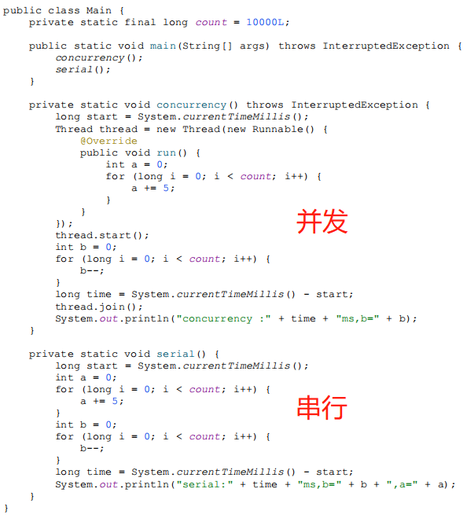

下表是测试结果：

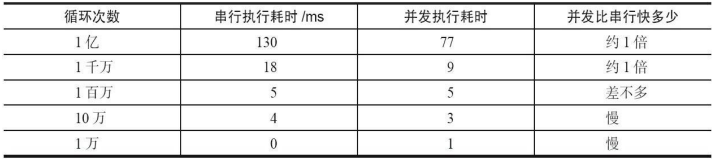

为什么并发执行的速度会比串行慢呢？这是因为**线程有创建和上下文切换的开销**。 


### 1.1.2 测试上下文切换次数和时长

以下两种工具可以度量上下文切换的消耗：

- 使用 `Lmbench3` 可以测量上下文切换的时长。 

- 使用 `vmstat` 可以测量上下文切换的次数。


### 1.1.3 如何减少上下文切换

减少上下文切换的方法有**无锁并发编程**、**CAS 算法**、**使用最少线程**和**使用协程**。

- **无锁并发编程**：多线程竞争锁时，会引起上下文切换，所以多线程处理数据时，可以用一些办法来避免使用锁，如将数据的 ID 按照 Hash 算法取模分段，不同的线程处理不同段的数据。 

- **CAS 算法**：Java 的 Atomic 包使用 CAS 算法来更新数据，而不需要加锁。 

- **使用最少线程**：避免创建不需要的线程，比如任务很少，但是创建了很多线程来处理，这样会造成大量线程都处于等待状态。 

- **协程**：在单线程里实现多任务的调度，并在单线程里维持多个任务间的切换。

> 什么是 CAS 操作？
>
> **CAS（Compare and Swap 比较和交换）**的思想：一种无锁算法，是原子操作的一种。一共有三个参数，一个当前内存值 V、旧的预期值 A、即将更新的值 B，当且仅当预期值 A 和内存值 V 相同时，将内存值修改为 B 并返回 true，否则什么都不做，并返回 false。


### 1.1.4 减少上下文切换实战流程

> 通过减少线上大量 WAITING 的线程，来减少上下文切换次数。

1. 用 `jstack` 命令 `dump` 线程信息，看看指定 pid 的进程里的线程都在做什么。

2. 统计所有线程分别处于什么状态。
3. 打开 dump 文件查看处于 WAITING（onobjectmonitor）的线程在做什么。
4. 减少工作线程数，可以通过修改该进程的线程池配置信息，降低其最大线程数。
5. 重启进程。再 dump 线程信息，然后统计 WAITING（onobjectmonitor）的线程。

**WAITING 的线程少了，系统上下文切换的次数就会少，因为每一次从 WAITTING 到 RUNNABLE 都会进行一次上下文的切换。**


## 1.2 死锁

死锁代码示例：以下程序中，**持有 A 锁的线程 t1 试图获取 B 锁，而持有 B 锁的线程 t2 试图获取 A 锁，这将会引起死锁**。

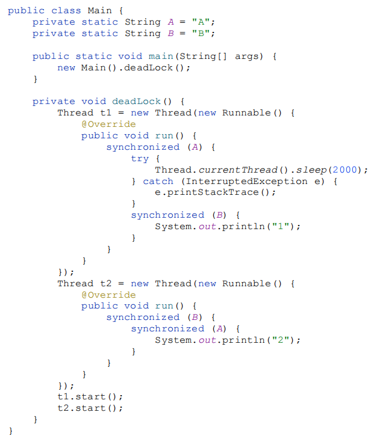

一旦出现死锁，只能通过 `dump` 线程查看到底是哪个线程出现了问题，以下线程信息告诉我们是 DeadLockDemo 类的第 42 行和第 31 行引起的死锁。

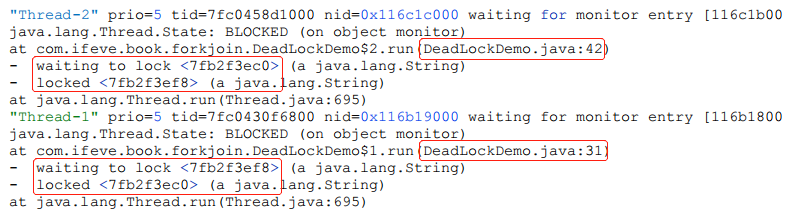


### 1.2.1 避免死锁的常见方法

- 避免一个线程同时获取多个锁。 

- 避免一个线程在锁内同时占用多个资源，尽量保证每个锁只占用一个资源。 

- 尝试使用定时锁，使用 `lock.tryLock(timeout)` 来替代使用内部锁机制。 

- 对于数据库锁，加锁和解锁必须在一个数据库连接里，否则会出现解锁失败的情况。 


## 1.3 资源限制的挑战

### 1.3.1 什么是资源限制

资源限制是指**在进行并发编程时，程序的执行速度受限于计算机硬件资源或软件资源。**

> 硬件资源限制有带宽的上传/下载速度、硬盘读写速度和 CPU 的处理速度。软件资源限制有数据库的连接数和 socket 连接数等。


### 1.3.2 资源限制引发的问题

在并发编程中，将代码执行速度加快的原则是**将代码中串行执行的部分变成并发执行**，但是如果将某段串行的代码并发执行，因为受限于资源，仍然在串行执行，这时候程序不仅不会加快执行，反而会更慢，因为**增加了上下文切换和资源调度的时间**。


### 1.3.3 在资源限制情况下进行并发编程

**根据不同的资源限制调整程序的并发度。**

> 比如下载文件程序依赖于两个资源——带宽和硬盘读写速度。有数据库操作时，涉及数据库连接数，如果 SQL 语句执行非常快，而线程的数量比数据库连接数大很多，则某些线程会被阻塞，等待数据库连接。


### 1.3.4 如何解决资源限制的问题

- **对于硬件资源限制，可以考虑使用集群并行执行程序。**既然单机的资源有限制，那么就让程序在多机上运行。比如使用 ODPS、Hadoop 或者自己搭建服务器集群，不同的机器处理不同的数据。可以通过“数据 ID%机器数”，计算得到一个机器编号，然后由对应编号的机器处理这笔数据。
- **对于软件资源限制，可以考虑使用资源池将资源复用。**比如使用连接池将数据库和 Socket 连接复用，或者在调用对方 webservice 接口获取数据时，只建立一个连接。 


# 2. Java 并发机制的底层实现原理

Java 代码在编译后会变成 Java 字节码，字节码被类加载器加载到 JVM 里，JVM 执行字节码，最终需要转化为汇编指令在 CPU 上执行。

**Java 中所使用的并发机制依赖于 JVM 的实现和 CPU 的指令。**

实现 Java 并发有两个重要的关键字：

- **volatile**
- **synchronized**


## 2.1 volatile 的应用

`volatile` 是**轻量级**的 `synchronized`，它在多处理器开发中保证了共享变量的“**可见性**”（当一个线程修改一个共享变量时，另外一个线程能读到这个修改的值。）。

> 如果 volatile 变量修饰符使用恰当的话，它比 synchronized 的使用和执行成本更低，因为它**不会引起线程上下文的切换和调度**。


### 2.1.1 volatile 的定义与实现原理

Java 编程语言允许线程访问共享变量，为了确保共享变量能被准确和一致地更新，线程应该确保通过**排他锁**单独获得这个变量。

如果一个字段被声明成 `volatile`，Java 线程内存模型确保**所有线程看到这个变量的值是一致的**。 

下面是与 `volatile` 实现原理相关的 CPU 术语与说明：

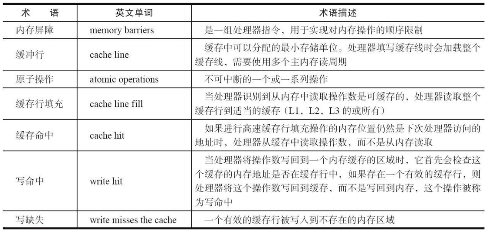

​	 

- volatile 是如何来保证可见性的呢？

为了提高处理速度，处理器不直接和内存进行通信，而是先将系统内存的数据读到内部缓存（L1，L2 或其他）后再进行操作，<u>但操作完不知道何时会写到内存</u>。

如果对声明了 volatile 的变量进行写操作，**JVM** 就会向处理器发送一条 **Lock 前缀的指令**，**将这个变量所在缓存行的数据写回到系统内存**。但是，就算写回到内存，如果其他处理器缓存的值还是旧的，再执行计算操作就会有问题。

所以，在多处理器下，为了保证各个处理器的缓存是一致的，就会实现**缓存一致性协议**——**每个处理器通过嗅探在总线上传播的数据来检查自己缓存的值是不是过期了，当处理器发现自己缓存行对应的内存地址被修改，就会将当前处理器的缓存行设置成无效状态，当处理器对这个数据进行修改操作的时候，会重新从系统内存中把数据读到处理器缓存里。**


volatile 的两条实现原则：

- **Lock** **前缀指令会引起处理器缓存回写到内存。**

  Lock 前缀指令导致在执行指令期间，声言处理器的 **LOCK#信号**。在多处理器环境中，**LOCK#信号确保在声言该信号期间，处理器可以独占任何共享内存**【因为 LOCK#信号会锁住总线，导致其他 CPU 不能访问总线，不能访问总线就意味着不能访问系统内存】。

  但是，在最近的处理器里，LOCK＃信号一般不锁总线，而是锁缓存，毕竟锁总线开销的比较大。

  在目前的处理器中，如果访问的内存区域已经缓存在处理器内部，则不会声言 LOCK#信号。相反，它会**锁定这块内存区域的缓存并回写到内存，并使用缓存一致性机制来确保修改的原子性**，此操作被称为“**缓存锁定**”，**缓存一致性机制会阻止同时修改由两个以上处理器缓存的内存区域数据。**

- **一个处理器的缓存回写到内存会导致其他处理器的缓存无效。**

  IA-32 处理器和 Intel 64 处理器使用 `MESI（修改、独占、共享、无效）控制协议` 去维护内部缓存和其他处理器缓存的一致性。在多核处理器系统中进行操作的时候，IA-32 和 Intel 64 处理器能嗅探其他处理器访问系统内存和它们的内部缓存。**处理器使用嗅探技术保证它的内部缓存、系统内存和其他处理器的缓存的数据在总线上保持一致。**


### 2.1.2 volatile 的使用优化

这里举的是一个 JDK 7 并发包中的一个队列集合类 `LinkedTransferQueue` 的例子，它在使用 volatile 变量时，用一种**追加字节**的方式来优化队列出队和入队的性能。

LinkedTransferQueue 代码：


> LinkedTransferQueue 使用一个内部类类型（PaddedAtomicReference）来定义队列的头节点（head）和尾节点（tail），而这个内部类相对于父类 AtomicReference 只做了一件事情，就是将共享变量追加到 64 字节。

为什么追加 64 字节能够提高并发编程的效率呢？

因为许多处理器的 L1、L2 或 L3 缓存的高速缓存行是 64 个字节宽，不支持部分填充缓存行，这意味着，如果队列的头节点和尾节点都不足 64 字节的话，处理器会将它们都读到同一个高速缓存行中，在多处理器下每个处理器都会缓存同样的头、尾节点，当一个处理器试图修改头节点时，会将整个缓存行锁定，那么在缓存一致性机制的作用下，会导致其他处理器不能访问自己高速缓存中的尾节点，而队列的入队和出队操作则需要不停修改头节点和尾节点，所以在多处理器的情况下将会严重影响到队列的入队和出队效率。使用追加到 64 字节的方式来**填满高速缓冲区的缓存行，避免头节点和尾节点加载到同一个缓存行，使头、尾节点在修改时不会互相锁定。**

***

在以下两种场景下不应该使用追加字节的方式：

- **缓存行非 64 字节宽的处理器**

  如 P6 系列和奔腾处理器，它们的 L1 和 L2 高速缓存 行是 32 个字节宽。 

- **共享变量不会被频繁地写**

  因为使用追加字节的方式需要处理器读取更多的字节到高速缓冲区，这本身就会带来一定的性能消耗，如果共享变量不被频繁写的话，锁的几率也非常小，就没必要通过追加字节的方式来避免相互锁定。


## 2.2 synchronized 的实现原理与应用

`synchronized` 实现同步的基础：**Java 中的每一个对象都可以作为锁。** 

具体表现为：

- 对于**普通同步方法**，锁是**当前实例对象**。 

- 对于**静态同步方法**，锁是**当前类的 Class 对象**。 

- 对于**同步方法块**，锁是 **Synchonized 括号里配置的对象**。

当一个线程试图访问同步代码块时，它首先必须得到锁，退出或抛出异常时必须释放锁。

 

Synchronized 在 JVM 里的实现原理：

> JVM 基于进入和退出 **Monitor 对象**来实现方法同步和代码块同步，但两者的实现细节不一样。代码块同步是使用 **`monitorenter`** 和 **`monitorexit`** 指令实现的，而方法同步是使用另外一种方式实现的，细节在 JVM 规范里并没有详细说明。但是，方法的同步同样可以使用这两个指令来实现。
>
> - **monitorenter 指令**在编译后插入到**同步代码块的开始位置**。
> - **monitorexit 指令**插入到**方法结束处和异常处**。
>
> JVM 要保证**每个 monitorenter 必须有对应的 monitorexit 与之配对。任何对象都有一个 monitor 与之关联，当且一个 monitor 被持有后，它将处于锁定状态。线程执行到 monitorenter 指令时，将会尝试获取对象所对应的 monitor 的所有权，即尝试获得对象的锁。**


锁是存在哪里的？锁里面会存储什么信息？

### 2.2.1 Java 对象头

**synchronized 用的锁是存在 Java 对象头里的。**

如果对象是**数组类型**，则虚拟机用 **3 个字宽**（Word）存储对象头，如果对象是**非数组类型**，则用 **2 字宽**存储对象头。在 32 位虚拟机中，**1 字宽 = 4 字节，即 32bit。**

Java 对象头的内容和对应长度如下表：

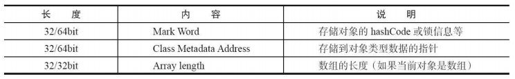

Java 对象头里的 Mark Word 里默认存储对象的 **HashCode**、**分代年龄**和**锁标记位**。32 位 JVM 的 Mark Word 的默认存储结构如下表所示：


在运行期间，Mark Word 里存储的数据会随着锁标志位的变化而变化，其 4 种数据状态如下：

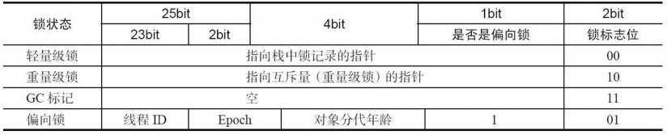

64 位虚拟机下，Mark Word 是 64 bit 大小的，其存储结构如下：


### 2.2.2 锁的升级与对比

在 Java SE 1.6 中，锁一共有 4 种状态，级别**从低到高**依次是：**无锁**状态、**偏向锁**状态、**轻量级锁**状态和**重量级锁**状态，这几个状态会随着竞争情况逐渐升级。

**锁可以升级但不能降级**，意味着偏向锁升级成轻量级锁后不能降级成偏向锁。这种锁升级却不能降级的策略，目的是为了**提高获得锁和释放锁的效率**。

#### 1. 偏向锁

大多数情况下，锁不仅不存在多线程竞争，而且总是由同一线程多次获得，为了让线程获得锁的代价更低而引入了**偏向锁**。

当一个线程访问同步块并获取锁时，会在对象头和栈帧中的锁记录里存储锁偏向的线程 ID，以后该线程在进入和退出同步块时不需要进行 CAS 操作来加锁和解锁，只需简单地测试一下对象头的 Mark Word 里是否存储着指向当前线程的偏向锁。

如果测试成功，表示线程已经获得了锁。如果测试失败，则需要再测试一下 Mark Word 中偏向锁的标识是否设置成 1（表示当前是偏向锁）：如果没有设置，则使用 CAS 竞争锁；如果设置了，则尝试使用 CAS 将对象头的偏向锁指向当前线程。

##### 偏向锁的撤销

偏向锁使用了一种**等到竞争出现才释放锁**的机制，所以当其他线程尝试竞争偏向锁时，持有偏向锁的线程才会释放锁。

偏向锁的撤销，需要等待**全局安全点**（在这个时间点上没有正在执行的字节码）。

> 它会首先暂停拥有偏向锁的线程，然后检查持有偏向锁的线程是否活着，如果线程不处于活动状态，则将对象头设置成无锁状态；如果线程仍然活着，拥有偏向锁的栈会被执行，遍历偏向对象的锁记录，栈中的锁记录和对象头的 Mark Word 要么重新偏向于其他线程，要么恢复到无锁或者标记对象不适合作为偏向锁，最后唤醒暂停的线程。

下图中的线程 1 演示了偏向锁初始化的流程，线程 2 演示了偏向锁撤销的流程：

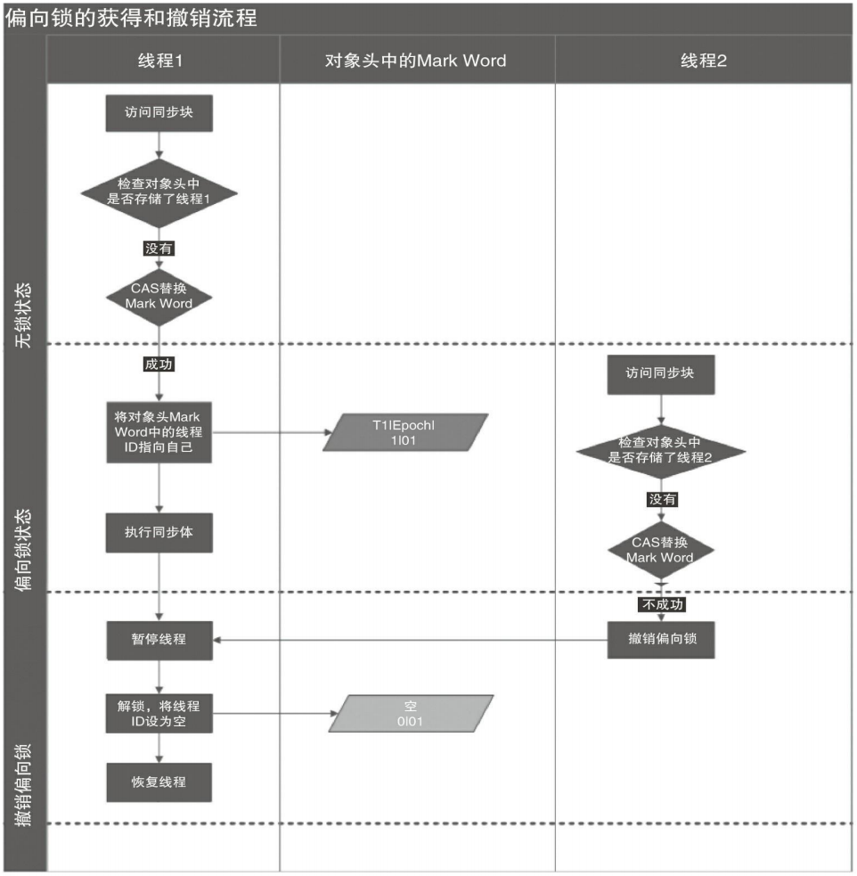


##### 关闭偏向锁

偏向锁在 Java 6 和 Java 7 里是默认启用的，但是它在应用程序启动几秒钟之后才激活，如有必要可以使用 JVM 参数来关闭延迟：`-XX:BiasedLockingStartupDelay=0` 。如果确定应用程序里所有的锁通常情况下处于竞争状态，可以通过 JVM 参数关闭偏向锁：`-XX:- UseBiasedLocking=false`，那么程序默认会进入轻量级锁状态。 


#### 2. 轻量级锁

##### 轻量级锁加锁

线程在执行同步块之前，JVM 会**先在当前线程的栈桢中创建用于存储锁记录的空间，并将对象头中的 Mark Word 复制到锁记录中**，官方称为 `Displaced Mark Word`。

然后线程尝试使用 CAS 将对象头中的 Mark Word 替换为**指向锁记录的指针**。如果成功，当前线程获得锁，如果失败，表示其他线程竞争锁，当前线程便尝试使用**自旋**来获取锁。

##### 轻量级锁解锁

轻量级解锁时，会使用原子的 CAS 操作将 Displaced Mark Word 替换回到对象头，如果成功，则表示没有竞争发生。如果失败，表示当前锁存在竞争，锁就会膨胀成重量级锁。

下图是两个线程同时争夺锁，导致锁膨胀的流程图：

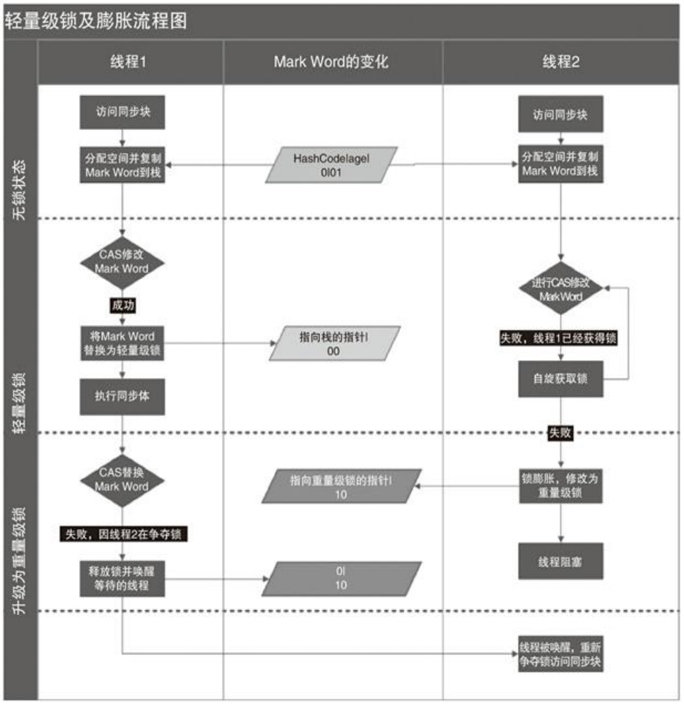

因为自旋会消耗 CPU，为了避免无用的自旋（比如获得锁的线程被阻塞住了），**一旦锁升级成重量级锁，就不会再恢复到轻量级锁状态。当锁处于这个状态下，其他线程试图获取锁时，都会被阻塞住**，当持有锁的线程释放锁之后会唤醒这些线程，被唤醒的线程就会进行新一轮的锁争夺。


#### 3. 锁的优缺点对比

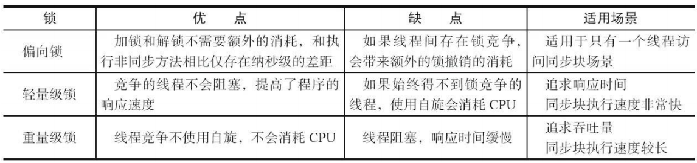


## 2.3 原子操作的实现原理

原子操作（atomic operation）意为“**不可被中断的一个或一系列操作**”。

下面是与原子操作相关的几个术语：

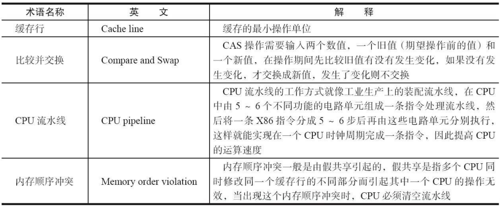

> 比较并交换即 CAS	


### 2.3.1 处理器如何实现原子操作

处理器提供**总线锁定**和**缓存锁定**两个机制来保证复杂内存操作的原子性。

#### 1. 使用总线锁保证原子性

> 如果多个处理器同时对共享变量进行读改写操作（i++就是经典的读改写操作），那么共享变量就会被多个处理器同时进行操作，这样读改写操作就不是原子的，操作完之后共享变量的值会和期望的不一致。

所谓总线锁就是**使用处理器提供的一个 LOCK＃信号，当一个处理器在总线上输出此信号时，其他处理器的请求将被阻塞住，那么该处理器可以独占共享内存。**


#### 2. 使用缓存锁保证原子性

**在同一时刻，我们只需保证对某个内存地址的操作是原子性即可**，但总线锁定把 CPU 和内存之间的通信锁住了，这使得锁定期间，其他处理器不能操作其他内存地址的数据，所以总线锁定的开销比较大，目前处理器在某些场合下使用缓存锁定代替总线锁定来进行优化。

频繁使用的内存会缓存在处理器的 L1、L2 和 L3 高速缓存里，那么原子操作就可以直接在处理器内部缓存中进行，并不需要声明总线锁。

所谓“缓存锁定”是指**内存区域如果被缓存在处理器的缓存行中，并且在 Lock 操作期间被锁定，那么当它执行锁操作回写到内存时，处理器不在总线上声言 LOCK＃信号，而是修改内部的内存地址，并允许它的缓存一致性机制来保证操作的原子性，因为缓存一致性机制会阻止同时修改由两个以上处理器缓存的内存区域数据，当其他处理器回写已被锁定的缓存行的数据时，会使缓存行无效。**


**处理器不会使用缓存锁的情况：**

1. 当操作的数据不能被缓存在处理器内部，或操作的数据跨多个缓存行（cache line）时，则处理器会调用总线锁定。 
2. 有些处理器不支持缓存锁定。


### 2.3.2 Java 如何实现原子操作

在 Java 中可以通过**锁**和**循环 CAS** 的方式来实现原子操作。

#### 1. 使用循环 CAS 实现原子操作

JVM 中的 CAS 操作正是利用了处理器提供的 `CMPXCHG` 指令实现的。

**自旋 CAS** 实现的基本思路就是**循环进行 CAS 操作直到成功为止。**

以下代码实现了一个基于 CAS 线程安全的计数器方法 safeCount 和一个非线程安全的计数器 count：

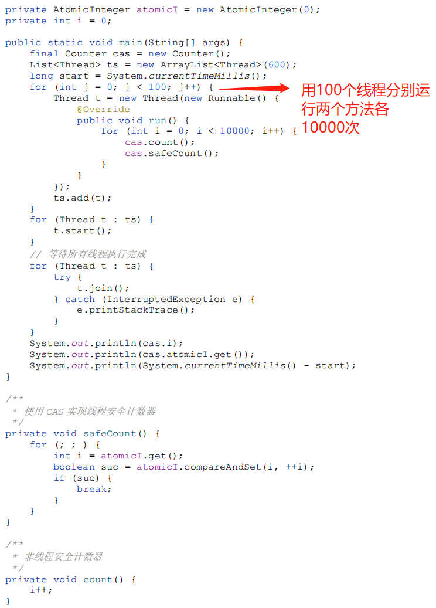

> 以上代码运行后会发现 CAS 实现的线程安全计数器能够准确将 i 累加到 10000，而非线程安全的计数器每次运行结果都不同。


##### CAS 实现原子操作的三大问题

- **ABA 问题**

  因为 CAS 需要在操作值的时候，检查值有没有发生变化，如果没有发生变化则更新，但是如果一个值原来是 A，变成了 B，又变成了 A，那么使用 CAS 进行检查时会发现它的值没有发生变化，但是实际上却变化了。

  ABA 问题的解决思路就是**使用版本号**。在变量前面追加上版本号，每次变量更新的时候把版本号加 1，那么A→B→A 就会变成 1A→2B→3A。

- **循环时间长开销大**

  自旋 CAS 如果长时间不成功，会给 CPU 带来非常大的执行开销。

  > 如果 JVM 能支持处理器提供的 `pause` 指令，那么效率会有一定的提升。`pause` 指令有两个作用：① 它可以延迟流水线执行指令（de-pipeline），使 CPU 不会消耗过多的执行资源，延迟的时间取决于具体实现的版本，在一些处理器上延迟时间是零；② 它可以避免在退出循环的时候因内存顺序冲突（Memory Order Violation）而引起 CPU 流水线被清空（CPU Pipeline Flush），从而提高 CPU 的执行效率。 

- **只能保证一个共享变量的原子操作**

  当对一个共享变量执行操作时，我们可以使用循环 CAS 的方式来保证原子操作，但是对多个共享变量操作时，循环 CAS 就无法保证操作的原子性，这个时候就可以用锁。


#### 2. 使用锁机制实现原子操作

锁机制保证了**只有获得锁的线程才能够操作锁定的内存区域。**

JVM 实现锁的方式都用了**循环 CAS**，即当一个线程想进入同步块的时候使用循环 CAS 的方式来获取锁，当它退出同步块的时候使用循环 CAS 释放锁


# 3. Java 内存模型


## 3.1 Java 内存模型的基础

### 3.1.1 并发编程模型的两个关键问题

- **线程之间如何通信**
- **线程之间如何同步**


> 通信：线程之间以何种机制来交换信息。

在命令式编程中，线程之间的通信机制有两种：**共享内存**和**消息传递**。

- 在**共享内存**的并发模型里，线程之间**共享程序的公共状态**，通过**写-读内存中的公共状态**进行**隐式**通信。
- 在**消息传递**的并发模型里，线程之间**没有公共状态**，线程之间必须通过**发送消息**来**显式**进行通信。


> 同步：指程序中用于控制不同线程间操作发生相对顺序的机制。

- 在**共享内存**并发模型里，同步是**显式**进行的。必须显式指定某个方法或某段代码需要在线程之间互斥执行。
- 在**消息传递**的并发模型里，由于消息的发送必须在消息的接收之前，因此同步是**隐式**进行的。 


Java 的并发采用的是**共享内存模型**，**Java 线程之间的通信总是隐式进行**，整个通信过程对程序员完全透明。


### 3.1.2 Java 内存模型的抽象结构

在 Java 中，所有`实例域`、`静态域`和`数组元素`都存储在**堆内存**中，**堆内存在线程之间共享**。

> 这里用“**共享变量**”代指`实例域`、`静态域`和`数组元素`。

`局部变量`（Local Variables），`方法定义参数`（Formal Method Parameters）和`异常处理器参数`（ExceptionHandler Parameters）**不会在线程之间共享**，它们不会有内存可见性问题，也不受内存模型的影响。


Java 线程之间的通信由 **Java 内存模型（JMM）**控制，JMM 决定**一个线程对共享变量的写入何时对另一个线程可见**。从抽象的角度来看，JMM 定义了线程和主内存之间的抽象关系：**线程之间的共享变量存储在主内存（Main Memory）中，每个线程都有一个私有的本地内存（Local Memory），本地内存中存储了该线程以读/写共享变量的副本**。本地内存是 JMM 的一个抽象概念，并不真实存在。它涵盖了缓存、写缓冲区、寄存器以及其他的硬件和编译器优化。

Java 内存模型的抽象示意图如下：

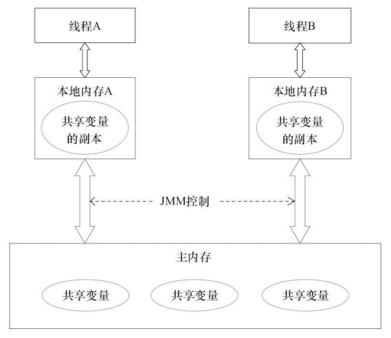

从上图来看，如果线程 A 与线程 B 之间要通信的话，必须要经历下面 2 个步骤：

1. 线程 A 把本地内存 A 中更新过的共享变量刷新到主内存中去。
2. 线程 B 到主内存中去读取线程 A 之前已更新过的共享变量。 

下面通过示意图来说明这两个步骤：

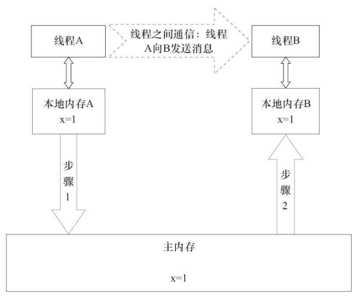

> 如上图所示，本地内存 A 和本地内存 B 有主内存中共享变量 x 的副本。假设初始时，这 3 个内存中的 x 值都为 0。线程 A 在执行时，把更新后的 x 值（假设值为 1）临时存放在自己的本地内存 A 中。当线程 A 和线程 B 需要通信时，线程 A 首先会把自己本地内存中修改后的 x 值刷新到主内存中，此时主内存中的 x 值变为了 1。随后，线程 B 到主内存中去读取线程 A 更新后的 x 值，此时线程 B 的本地内存的 x 值也变为了 1。 

从整体来看，这两个步骤实质上是线程 A 在向线程 B 发送消息，而且这个**通信过程必须要经过主内存**。**JMM 通过控制主内存与每个线程的本地内存之间的交互，来提供内存可见性保证。**


### 3.1.3 从源代码到指令序列的重排序

在执行程序时，为了提高性能，编译器和处理器常常会对指令做**重排序**。重排序分 3 种类型：

1. **编译器优化的重排序。**编译器在不改变单线程程序语义的前提下，可以重新安排语句的执行顺序。 

2. **指令级并行的重排序。**现代处理器采用了`指令级并行技术（Instruction-LevelParallelism，ILP）`来将多条指令重叠执行。如果不存在数据依赖性，处理器可以改变语句对应机器指令的执行顺序。 

3. **内存系统的重排序。**由于处理器使用缓存和读/写缓冲区，这使得加载和存储操作看上去可能是在乱序执行。 

从 Java 源代码到最终实际执行的指令序列，会分别经历下面 3 种重排序：


> 上述的 1 属于编译器重排序，2 和 3 属于处理器重排序。

这些重排序可能会导致多线程程序出现内存可见性问题：

- 对于编译器，JMM 的编译器重排序规则会禁止特定类型的编译器重排序（不是所有的编译器重排序都要禁止）。
- 对于处理器重排序，JMM 的处理器重排序规则会要求 Java 编译器在生成指令序列时，插入特定类型的内存屏障（Memory Barriers，Intel 称之为 Memory Fence）指令，通过内存屏障指令来禁止特定类型的处理器重排序。 

JMM 属于**语言级的内存模型**，它确保在不同的编译器和不同的处理器平台之上，通过禁止特定类型的编译器重排序和处理器重排序，为程序员提供一致的内存可见性保证。


### 3.1.4 并发编程模型的分类

现代的处理器使用**写缓冲区**临时保存向内存写入的数据。写缓冲区可以**保证指令流水线持续运行，它可以避免由于处理器停顿下来等待向内存写入数据而产生的延迟。**同时，通过以批处理的方式刷新写缓冲区，以及合并写缓冲区中对同一内存地址的多次写，减少对内存总线的占用。

**每个处理器上的写缓冲区，仅仅对它所在的处理器可见。**这个特性会对内存操作的执行顺序产生重要的影响：**处理器对内存的读/写操作的执行顺序，不一定与内存实际发生的读/写操作顺序一致！**

***

具体说明如下：


假设处理器 A 和处理器 B 按程序的顺序并行执行内存访问，最终可能得到 x=y=0 的结果。具体的原因如下图所示。 

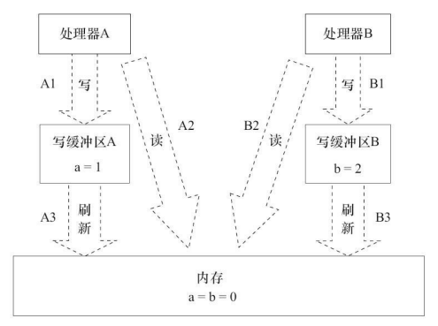

这里处理器 A 和处理器 B 可以同时把共享变量写入自己的写缓冲区（A1，B1），然后从内存中读取另一个共享变量（A2，B2），最后才把自己写缓存区中保存的脏数据刷新到内存中（A3， B3）。当以这种时序执行时，程序就可以得到 x=y=0 的结果。 

从内存操作实际发生的顺序来看，直到处理器 A 执行 A3 来刷新自己的写缓存区，写操作 A1 才算真正执行了。虽然处理器 A 执行内存操作的顺序为：A1→A2，但内存操作实际发生的顺序却是 A2→A1。此时，处理器 A 的内存操作顺序被重排序了（处理器 B 的情况和处理器 A 一样，这里就不赘述了）。

这里的关键是，**由于写缓冲区仅对自己的处理器可见，它会导致处理器执行内存操作的顺序可能会与内存实际的操作执行顺序不一致。**由于现代的处理器都会使用写缓冲区，因此现代的处理器都会允许对写-读操作进行重排序。

***

为了保证内存可见性，Java 编译器在生成指令序列的适当位置会插入**内存屏障指令**来禁止特定类型的处理器重排序。JMM 把内存屏障指令分为 4 类：

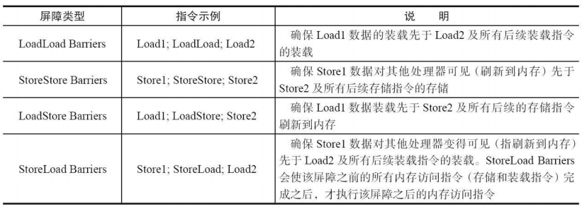


### 3.1.5 happens-before 简介

> 从 JDK 5 开始，Java 使用新的 JSR-133 内存模型。

在 JMM 中，**如果一个操作执行的结果需要对另一个操作可见**，那么这两个操作之间必须要存在 **happens-before** 关系。【这里两个操作既可以是在一个线程之内，也可以是在不同线程之间。】 

happens-before 规则如下：

- **程序顺序规则**：一个线程中的每个操作，happens-before 于该线程中的任意后续操作。 

- **监视器锁规则**：对一个锁的解锁，happens-before 于随后对这个锁的加锁。 

- **volatile 变量规则**：对一个 volatile 域的写，happens-before 于任意后续对这个volatile 域的读。 

- **传递性**：如果 A happens-before B，且 B happens-before C，那么 A happens-before C。

注意：

>两个操作之间具有 happens-before 关系，并不意味着前一个操作必须要在后一个操作之前执行！happens-before **仅仅要求前一个操作（执行的结果）对后一个操作可见，且前一个操作按顺序排在第二个操作之前。**
>
>【就是前面代码的结果对后面的可见，且顺序在前，但是前面的代码不一定要在前面被执行】

happens-before 与 JMM 的关系如图：

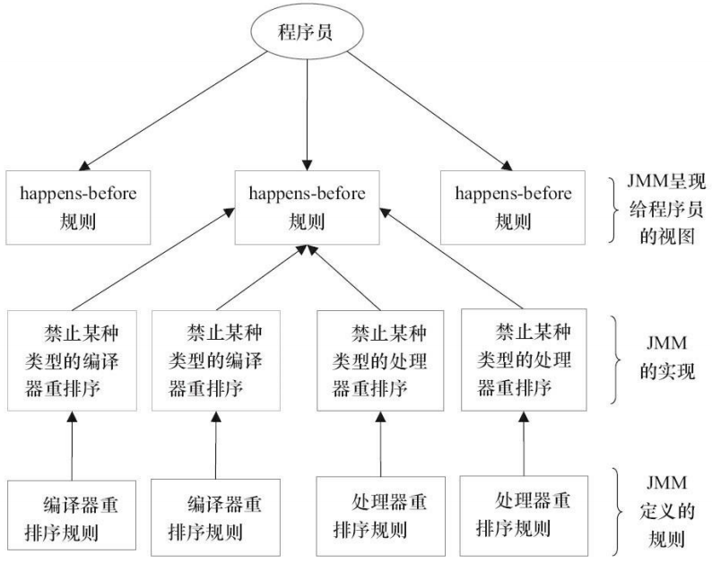

一个 happens-before 规则对应于一个或多个编译器和处理器重排序规则。


## 3.2 重排序

重排序是指**编译器和处理器为了优化程序性能而对指令序列进行重新排序的一种手段。**


### 3.2.1 数据依赖性

如果两个操作访问同一个变量，且这**两个操作中有一个为写操作**，此时这两个操作之间就存在数据依赖性。

数据依赖分为下列 3 种类型：


> 上面 3 种情况，只要重排序两个操作的执行顺序，程序的执行结果就会被改变。

编译器和处理器在重排序时，会遵守数据依赖性，**编译器和处理器不会改变存在数据依赖关系的两个操作的执行顺序。**【这里所说的数据依赖性**仅针对单个处理器中执行的指令序列和单个线程中执行的操作，不同处理器之间和不同线程之间的数据依赖性不被编译器和处理器考虑。** 】


### 3.2.2 as-if-serial 语义

**不管怎么重排序（编译器和处理器为了提高并行度），（单线程）程序的执行结果不能被改变。**

>编译器、runtime 和处理器都必须遵守 as-if-serial 语义。

为了遵守 as-if-serial 语义，编译器和处理器不会对存在数据依赖关系的操作做重排序，因为这种重排序会改变执行结果。但是，如果操作之间不存在数据依赖关系，这些操作就可能被编译器和处理器重排序。

***

具体说明如下：

下面是计算圆面积的代码示例：

```java
double pi = 3.14;
double r = 1.0;
double area = pi * r * r;
```

上面 3 个操作的数据依赖关系如下图所示： 

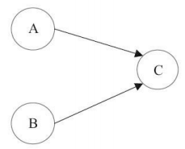

A 和 C 之间存在数据依赖关系，同时 B 和 C 之间也存在数据依赖关系。因此在最终执行的指令序列中，C 不能被重排序到 A 和 B 的前面（C 排到 A 和 B 的前面，程序的结果将会被改变）。但 A 和 B 之间没有数据依赖关系，编译器和处理器可以重排序 A 和 B 之间的执行顺序。下图是该程序的两种执行顺序：

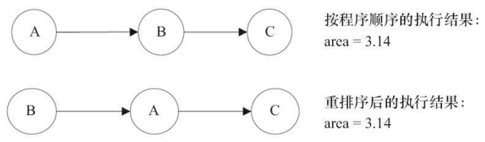

***

**as-if-serial 语义把单线程程序保护了起来**，遵守 as-if-serial 语义的编译器、runtime 和处理器共同为编写单线程程序的程序员创建了一个幻觉：单线程程序是按程序的顺序来执行的。asif-serial 语义使单线程程序员无需担心重排序会干扰他们，也无需担心内存可见性问题。


### 3.2.3 程序顺序规则

根据 happens-before 规则，上面计算圆的面积的示例代码存在 3 个 happens-before：

```
A happens-before B。 
B happens-before C。 
A happens-before C。 
```

这里的第 3 个 happens-before 关系，是根据 happens-before 的传递性推导出来的。这里 A happens-before B，但实际执行时 B 却可以排在 A 之前执行（看上面的重排序后的执行顺序）。如果 A happens-before B，JMM 并不要求 A 一定要在 B 之前执行。**JMM 仅仅要求前一个操作（执行的结果）对后一个操作可见，且前一个操作按顺序排在第二个操作之前。**这里操作 A 的执行结果不需要对操作 B 可见；而且重排序操作 A 和操作 B 后的执行结果，与操作 A 和操作 B 按 happens-before 顺序执行的结果一致。在这种情况下，JMM 会认为这种重排序并不非法（not illegal），JMM 允许这种重排序。 

在计算机中，软件技术和硬件技术有一个共同的目标：**在不改变程序执行结果的前提下，尽可能提高并行度。**编译器和处理器遵从这一目标，从 happens-before 的定义可以看出， JMM 同样遵从这一目标。 


### 3.2.4 重排序对多线程的影响

示例代码：

```java
class ReorderExample {
    int a = 0;
    boolean flag = false;
    
    public void writer() {
        a = 1; // 1
        flag = true; // 2
    }
    
    public void reader() {
        if (flag) { // 3
            int i = a * a; // 4
            ...
        }
    } 
}
```

`flag` 变量是个标记，用来标识变量 a 是否已被写入。这里假设有两个线程 A 和 B，A 首先执行 `writer()` 方法，随后 B 线程接着执行 `reader()` 方法。线程 B 在执行操作 4 时，能否看到线程 A 在操作 1 对共享变量 a 的写入呢？答案是：不一定能看到。 

由于操作 1 和操作 2 没有数据依赖关系，编译器和处理器可以对这两个操作重排序；同样，操作 3 和操作 4 没有数据依赖关系，编译器和处理器也可以对这两个操作重排序。先来看看，当操作 1 和操作 2 重排序时，可能会产生什么效果？请看下面的程序执行时序图：

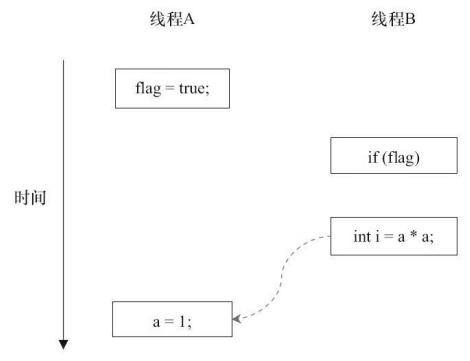

> 这里虚箭线标识错误的操作

如上图所示，操作 1 和操作 2 做了重排序。程序执行时，线程 A 首先写标记变量 `flag`，随后线程 B 读这个变量。由于条件判断为真，线程 B 将读取变量 a。此时，变量 a 还没有被线程 A 写入，在这里多线程程序的语义被重排序破坏了！


下面再看看，当操作 3 和操作 4 重排序时会产生什么效果（借助这个重排序，可以顺便说明**控制依赖性**）。下面是操作 3 和操作 4 重排序后，程序执行的时序图：

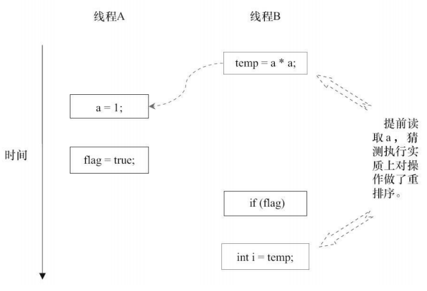

在程序中，操作 3 和操作 4 存在控制依赖关系。**当代码中存在控制依赖性时，会影响指令序列执行的并行度。**为此，编译器和处理器会采用**猜测（Speculation）执行**来克服控制相关性对并行度的影响。以处理器的猜测执行为例，执行线程 B 的处理器可以提前读取并计算 a*a，然后把计算结果临时保存到一个名为重排序缓冲（Reorder Buffer，ROB）的硬件缓存中。当操作 3 的条件判断为真时，就把该计算结果写入变量 i 中。 

从上图中可以看出，猜测执行实质上对操作 3 和 4 做了重排序。重排序在这里破坏了多线程程序的语义！ 

**在单线程程序中，对存在控制依赖的操作重排序，不会改变执行结果（这也是 as-if-serial 语义允许对存在控制依赖的操作做重排序的原因）；但在多线程程序中，对存在控制依赖的操作重排序，可能会改变程序的执行结果。**


## 3.3 顺序一致性

顺序一致性内存模型是一个**理论参考模型**，在设计的时候，处理器的内存模型和编程语言的内存模型都会以顺序一致性内存模型作为参照。

### 3.3.1 数据竞争与顺序一致性

**当程序未正确同步时，就可能会存在数据竞争**。Java 内存模型规范对数据竞争的定义如下： 

- 在一个线程中写一个变量， 

- 在另一个线程读同一个变量， 

- 而且写和读没有通过同步来排序。

当代码中包含数据竞争时，程序的执行往往产生违反直觉的结果。如果一个多线程程序能正确同步，这个程序将是一个没有数据竞争的程序。 

JMM 对正确同步的多线程程序的内存一致性做了如下保证：

如果程序是**正确同步**的，程序的执行将具有**顺序一致性**（Sequentially Consistent）——即**程序的执行结果与该程序在顺序一致性内存模型中的执行结果相同。**【这里的同步是指广义上的同步，包括对常用同步原语（synchronized、volatile 和 final）的正确使用。】


### 3.3.2 顺序一致性内存模型

顺序一致性内存模型有两大特性：

- 一个线程中的所有操作必须按照程序的顺序来执行。 

- （不管程序是否同步）**所有线程都只能看到一个单一的操作执行顺序。在顺序一致性内存模型中，每个操作都必须原子执行且立刻对所有线程可见。**

顺序一致性内存模型为程序员提供的视图如下图所示：

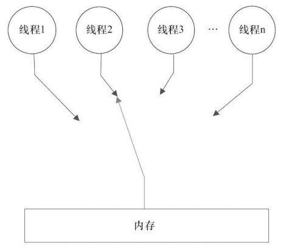

顺序一致性模型有一个单一的全局内存，这个内存通过一个左右摆动的开关可以连接到任意一个线程，同时**每一个线程必须按照程序的顺序来执行内存读/写操作。**从上面的示意图可以看出，在任意时间点最多只能有一个线程可以连接到内存。当多个线程并发执行时，图中的开关装置能把所有线程的所有内存读/写操作**串行化**（即在顺序一致性模型中，所有操作之间具有全序关系）。 

***

下面通过两个示意图来对顺序一致性模型的特性做进一步的说明。假设有两个线程 A 和 B 并发执行。其中 A 线程有 3 个操作，它们在程序中的顺序是： `A1→A2→A3`。B 线程也有 3 个操作，它们在程序中的顺序是：`B1→B2→B3`。 

假设这两个线程使用**监视器锁**来正确同步：A 线程的 3 个操作执行后释放监视器锁，随后 B 线程获取同一个监视器锁。那么程序在顺序一致性模型中的执行效果将如下图所示：

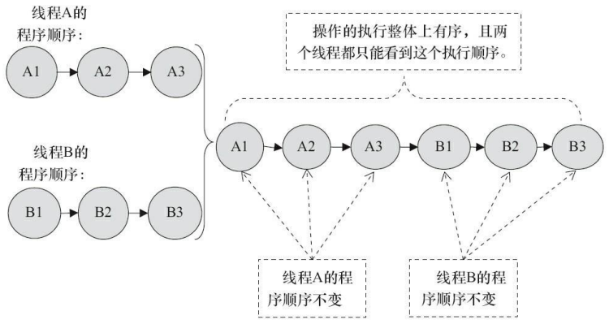

现在再假设这两个线程没有做同步，下面是这个未同步程序在顺序一致性模型中的执行示意图：


未同步程序在顺序一致性模型中虽然整体执行顺序是无序的，但所有线程都只能看到一个一致的整体执行顺序。以上图为例，线程 A 和 B 看到的执行顺序都是： 

`B1→A1→A2→B2→A3→B3`。之所以能得到这个保证是因为**顺序一致性内存模型中的每个操作必须立即对任意线程可见。** 

***

但是，在 JMM 中就没有这个保证。**未同步程序在 JMM 中不但整体的执行顺序是无序的，而且所有线程看到的操作执行顺序也可能不一致**。比如，在当前线程把写过的数据缓存在本地内存中，在没有刷新到主内存之前，这个写操作仅对当前线程可见；从其他线程的角度来观察，会认为这个写操作根本没有被当前线程执行。只有当前线程把本地内存中写过的数据刷新到主内存之后，这个写操作才能对其他线程可见。在这种情况下，当前线程和其他线程看到的操作执行顺序将不一致。


### 3.3.3 同步程序的顺序一致性效果

下面，对前面的示例程序 ReorderExample 用锁来同步，看看正确同步的程序如何具有顺序一致性。

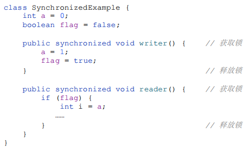

在上面示例代码中，假设 A 线程执行 writer()方法后，B 线程执行 reader()方法。这是一个正确同步的多线程程序。根据 JMM 规范，该程序的执行结果将与该程序在顺序一致性模型中的执行结果相同。下面是该程序在两个内存模型中的执行时序对比图：

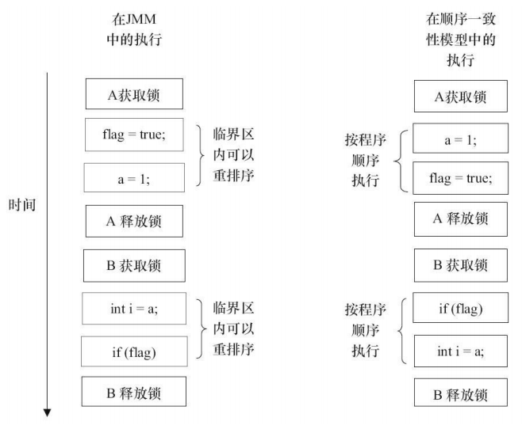

**顺序一致性模型中，所有操作完全按程序的顺序串行执行。而在 JMM 中，临界区内的代码可以重排序（但 JMM 不允许临界区内的代码“逸出”到临界区之外，那样会破坏监视器的语义）。**JMM 会在退出临界区和进入临界区这两个关键时间点做一些特别处理，使得线程在这两个时间点具有与顺序一致性模型相同的内存视图。虽然线程 A 在临界区内做了重排序，但由于监视器互斥执行的特性，这里的线程 B 根本无法“观察”到线程 A 在临界区内的重排序。这种重排序既提高了执行效率，又没有改变程序的执行结果。 

JMM 在具体实现上的基本方针为：**在不改变（正确同步的）程序执行结果的前提下，尽可能地为编译器和处理器的优化打开方便之门。**


### 3.3.4 未同步程序的执行特性

对于**未同步或未正确同步**的多线程程序，JMM 只提供最小安全性：线程执行时读取到的值，要么是之前某个线程写入的值，要么是默认值（0，Null，False），JMM 保证线程读操作读取到的值不会无中生有的冒出来。

为了实现最小安全性，JVM 在堆上分配对象时，首先会对内存空间进行清零，然后才会在上面分配对象（JVM 内部会同步这两个操作）。因此，在已清零的内存空间（Pre-zeroed Memory）分配对象时，域的默认初始化已经完成了。

**JMM 不保证未同步程序的执行结果与该程序在顺序一致性模型中的执行结果一致。**


**未同步程序在 JMM 中的执行时，整体上是无序的，其执行结果无法预知。**未同步程序在两个模型中的执行特性有如下几个差异：

- 顺序一致性模型保证单线程内的操作会按程序的顺序执行，而 JMM 不保证单线程内的操作会按程序的顺序执行（比如上面正确同步的多线程程序在临界区内的重排序）。

- 顺序一致性模型保证所有线程只能看到一致的操作执行顺序，而 JMM 不保证所有线程能看到一致的操作执行顺序。

- JMM 不保证对 64 位的 long 型和 double 型变量的写操作具有原子性，而顺序一致性模型保证对所有的内存读/写操作都具有原子性。

第 3 个差异与**处理器总线**的工作机制密切相关。**在计算机中，数据通过总线在处理器和内存之间传递。**每次处理器和内存之间的数据传递都是通过一系列步骤来完成的，这一系列步骤称之为**总线事务**（Bus Transaction）。总线事务包括**读事务**（Read Transaction）和**写事务**（WriteTransaction）。读事务从内存传送数据到处理器，写事务从处理器传送数据到内存，每个事务会读/写内存中一个或多个物理上连续的字。这里的关键是，**总线会同步试图并发使用总线的事务。在一个处理器执行总线事务期间，总线会禁止其他的处理器和 I/O 设备执行内存的读/写。**

***

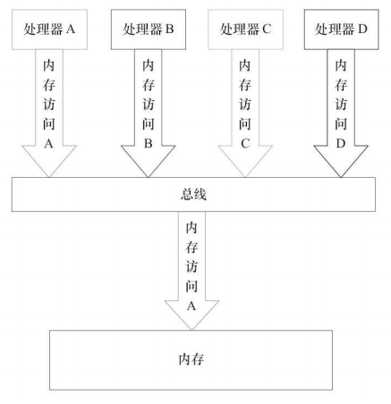

假设处理器 A，B 和 C 同时向总线发起总线事务，这时**总线仲裁**（Bus Arbitration）会对竞争做出裁决，这里假设总线在仲裁后判定处理器 A 在竞争中获胜（总线仲裁会确保所有处理器都能公平的访问内存）。此时处理器 A 继续它的总线事务，而其他两个处理器则要等待处理器 A 的总线事务完成后才能再次执行内存访问。假设在处理器 A 执行总线事务期间（不管这个总线事务是读事务还是写事务），处理器 D 向总线发起了总线事务，此时处理器 D 的请求会被总线禁止。 

总线的这些工作机制可以把所有处理器对内存的访问以**串行化**的方式来执行。**在任意时间点，最多只能有一个处理器可以访问内存。这个特性确保了单个总线事务之中的内存读/写操作具有原子性。** 

***

**Java 语言规范鼓励但不强求 JVM 对 64 位的 long 型变量和 double 型变量的写操作具有原子性。**当 JVM 在这种 32 位处理器上运行时，可能会把一个 64 位 long/double 型变量的写操作拆分为两个 32 位的写操作来执行。这两个 32 位的写操作可能会被分配到不同的总线事务中执行，此时对这个 64 位变量的写操作将不具有原子性。 


当单个内存操作不具有原子性时，可能会产生意想不到后果。如下示意图：

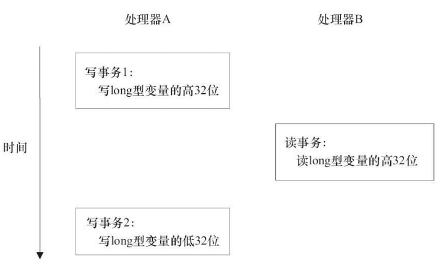

如上图所示，假设处理器 A 写一个 long 型变量，同时处理器 B 要读这个 long 型变量。处理器 A 中 64 位的写操作被拆分为两个 32 位的写操作，且这两个 32 位的写操作被分配到不同的写事务中执行。同时，处理器 B 中 64 位的读操作被分配到单个的读事务中执行。当处理器 A 和 B 按上图的时序来执行时，处理器 B 将看到仅仅被处理器 A“写了一半”的无效值。 

>注意，在 JSR-133 之前的旧内存模型中，一个 64 位 long/double 型变量的读/写操作可以被拆分为两个 32 位的读/写操作来执行。从 JSR-133 内存模型开始（即从 JDK5 开始），**仅仅只允许把一个 64 位 long/double 型变量的写操作拆分为两个 32 位的写操作来执行，任意的读操作在 JSR-133 中都必须具有原子性（即任意读操作必须要在单个读事务中执行）。**


## 3.4 volatile 的内存语义


### 3.4.1 volatile 的特性

**对 volatile 变量的单个读/写，等价于使用同一个锁对这些单个读/写操作做了同步。**

***

下面通过具体的示例来说明：

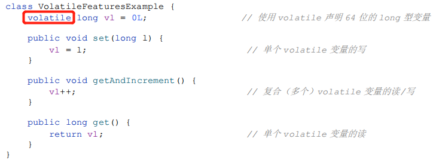

假设有多个线程分别调用上面的 3 个方法，这个程序在语义上和下面程序等价。

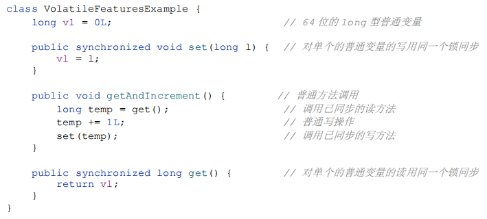

如上面示例程序所示，一个 volatile 变量的单个读/写操作，与一个普通变量的读/写操作都是使用同一个锁来同步，它们之间的执行效果相同。 

***

锁的 happens-before 规则保证释放锁和获取锁的两个线程之间的内存可见性，这意味着**对一个 volatile 变量的读，总是能看到（任意线程）对这个 volatile 变量最后的写入**。锁的语义决定了**临界区代码的执行具有原子性**。这意味着，**即使是 64 位的 long 型和 double 型变量，只要它是 volatile 变量，对该变量的读/写就具有原子性。如果是多个 volatile 操作或类似于 volatile++这种复合操作，这些操作整体上不具有原子性。** 

简而言之，volatile 变量自身具有下列特性：

- **可见性：**对一个 volatile 变量的读，总是能看到（任意线程）对这个 volatile 变量最后的写入。 

- **原子性：**对任意单个 volatile 变量的读/写具有原子性，但类似于 volatile++这种复合操作不具有原子性。 


### 3.4.2 volatile 写-读建立的 happens-before 关系

从 JDK5 开始，**volatile 变量的写-读可以实现线程之间的通信。**从内存语义的角度来说，volatile 的写-读与锁的释放-获取有相同的内存效果：**volatile 写和锁的释放有相同的内存语义；volatile 读与锁的获取有相同的内存语义。**

下面是使用 volatile 变量的示例代码：

```java
class VolatileExample {
    int a = 0;
    volatile boolean flag = false;
    
    public void writer() {
        a = 1; // 1
        flag = true; // 2
    }
    
    public void reader() {
        if (flag) { // 3
        int i = a; // 4
        ……
    	}
    } 
}
```

假设线程 A 执行 writer()方法之后，线程 B 执行 reader()方法。根据 happens-before 规则，这个过程建立的 happens-before 关系可以分为 3 类： 

- 根据程序次序规则，1 happens-before 2; 3 happens-before 4。 

- 根据 volatile 规则，2 happens-before 3。 

- 根据 happens-before 的传递性规则，1 happens-before 4。 

上述 happens-before 关系的图形化表现形式如下：

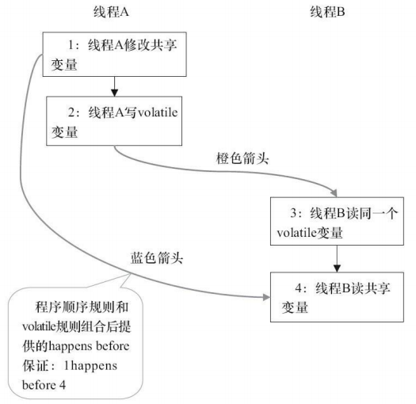

> 在上图中，每一个箭头链接的两个节点，代表了一个 happens-before 关系。黑色箭头表示程序顺序规则；橙色箭头表示 volatile 规则；蓝色箭头表示组合这些规则后提供的 happens-before 保证。

这里 A 线程写一个 volatile 变量后，B 线程读同一个 volatile 变量。A 线程在写 volatile 变量之前所有可见的共享变量，在 B 线程读同一个 volatile 变量后，将立即变得对 B 线程可见。


### 3.4.4 volatile 写-读的内存语义

volatile 写的内存语义如下：**当写一个 volatile 变量时，JMM 会把该线程对应的本地内存中的共享变量值刷新到主内存。**以上面示例程序 VolatileExample 为例，假设线程 A 首先执行 writer() 方法，随后线程 B 执行 reader() 方法，初始时两个线程的本地内存中的 flag 和 a 都是初始状态。

下图是线程 A 执行 volatile 写后，共享变量的状态示意图。 

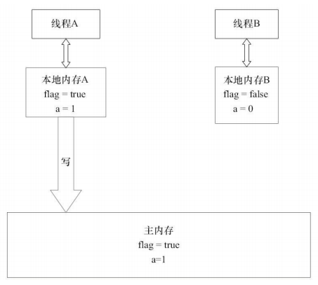

线程 A 在写 flag 变量后，本地内存 A 中被线程 A 更新过的两个共享变量的值被刷新到主内存中。此时，本地内存 A 和主内存中的共享变量的值是一致的。

volatile 读的内存语义如下：**当读一个 volatile 变量时，JMM 会把该线程对应的本地内存置为无效。线程接下来将从主内存中读取共享变量。**

下图为线程 B 读同一个 volatile 变量后，共享变量的状态示意图。

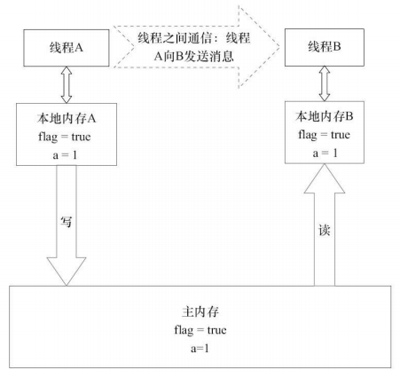

在读 flag 变量后，本地内存 B 包含的值已经被置为无效。此时，线程 B 必须从主内存中读取共享变量。线程 B 的读取操作将导致本地内存 B 与主内存中的共享变量的值变成一致。 

> 如果把 volatile 写和 volatile 读两个步骤综合起来看的话，在读线程 B 读一个 volatile 变量后，写线程 A 在写这个 volatile 变量之前所有可见的共享变量的值都将立即变得对读线程 B 可见。 


下面对 volatile 写和 volatile 读的内存语义做个总结：

- 线程 A 写一个 volatile 变量，实质上是线程 A 向接下来将要读这个 volatile 变量的某个线程发出了（其对共享变量所做修改的）消息。 

- 线程 B 读一个 volatile 变量，实质上是线程 B 接收了之前某个线程发出的（在写这个 volatile 变量之前对共享变量所做修改的）消息。 

- 线程 A 写一个 volatile 变量，随后线程 B 读这个 volatile 变量，这个过程实质上是线程 A 通过主内存向线程 B 发送消息。


### 3.4.4 volatile 内存语义的实现

为了实现 volatile 内存语义，JMM 会分别限制这编译器重排序和处理器重排序的重排序类型。下表是 JMM 针对编译器制定的 volatile 重排序规则表：

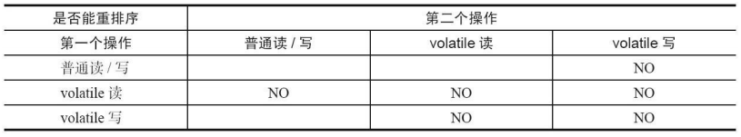

>举例来说，第三行最后一个单元格的意思是：在程序中，当第一个操作为普通变量的读或写时，如果第二个操作为 volatile 写，则编译器不能重排序这两个操作。 

从上表可以看出：

- 当第二个操作是 volatile 写时，不管第一个操作是什么，都不能重排序。这个规则确保 volatile 写之前的操作不会被编译器重排序到 volatile 写之后。 

- 当第一个操作是 volatile 读时，不管第二个操作是什么，都不能重排序。这个规则确保 volatile 读之后的操作不会被编译器重排序到 volatile 读之前。 

- 当第一个操作是 volatile 写，第二个操作是 volatile 读时，不能重排序。 


为了实现 volatile 的内存语义，**编译器在生成字节码时，会在指令序列中插入内存屏障来禁止特定类型的处理器重排序。**对于编译器来说，发现一个最优布置来最小化插入屏障的总数几乎不可能。为此，JMM 采取保守策略。下面是基于保守策略的 JMM 内存屏障插入策略：

- 在每个 volatile 写操作的前面插入一个 StoreStore 屏障。 

- 在每个 volatile 写操作的后面插入一个 StoreLoad 屏障。 

- 在每个 volatile 读操作的后面插入一个 LoadLoad 屏障。
- 在每个 volatile 读操作的后面插入一个 LoadStore 屏障。 

上述内存屏障插入策略非常保守，但它可以保证在任意处理器平台，任意的程序中都能得到正确的 volatile 内存语义。 

下面是保守策略下，volatile 写插入内存屏障后生成的指令序列示意图：

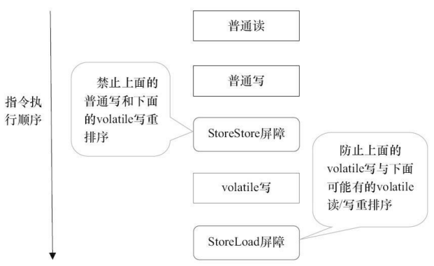

图中的 StoreStore 屏障可以保证在 volatile 写之前，其前面的所有普通写操作已经对任意处理器可见了。这是因为 StoreStore 屏障将保障上面所有的普通写在 volatile 写之前刷新到主内存。

这里比较有意思的是，volatile 写后面的 StoreLoad 屏障。此屏障的作用是避免 volatile 写与后面可能有的 volatile 读/写操作重排序。因为编译器常常无法准确判断在一个 volatile 写的后面是否需要插入一个 StoreLoad 屏障（比如，一个 volatile 写之后方法立即 return）。为了保证能正确实现 volatile 的内存语义，JMM 在采取了保守策略：在每个 volatile 写的后面，或者在每个 volatile 读的前面插入一个 StoreLoad 屏障。从整体执行效率的角度考虑，**JMM 最终选择了在每个 volatile 写的后面插入一个 StoreLoad 屏障。**因为 volatile 写-读内存语义的常见使用模式是：**一个写线程写 volatile 变量，多个读线程读同一个 volatile 变量。当读线程的数量大大超过写线程时，选择在 volatile 写之后插入StoreLoad 屏障将带来可观的执行效率的提升。**从这里可以看到 JMM 在实现上的一个特点：首先确保正确性，然后再去追求执行效率。 

下面是在保守策略下，volatile 读插入内存屏障后生成的指令序列示意图：

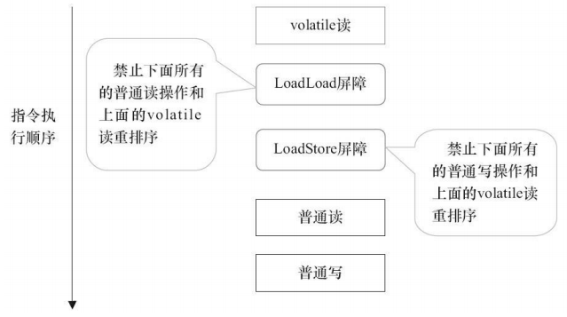

图中的 LoadLoad 屏障用来禁止处理器把上面的 volatile 读与下面的普通读重排序。 LoadStore 屏障用来禁止处理器把上面的 volatile 读与下面的普通写重排序。 


上述 volatile 写和 volatile 读的内存屏障插入策略非常保守。在实际执行时，只要不改变 volatile 写-读的内存语义，编译器可以根据具体情况省略不必要的屏障。下面通过具体的示例代码进行说明。

```java
class VolatileBarrierExample {
    int a;
    volatile int v1 = 1;
    volatile int v2 = 2;
    
    void readAndWrite() {
        int i = v1; // 第一个 volatile 读
        int j = v2; // 第二个 volatile 读
        a = i + j; // 普通写
        v1 = i + 1; // 第一个 volatile 写
        v2 = j * 2; // 第二个 volatile 写
    }
    … // 其他方法
}
```

针对 readAndWrite()方法，编译器在生成字节码时可以做如下的优化：

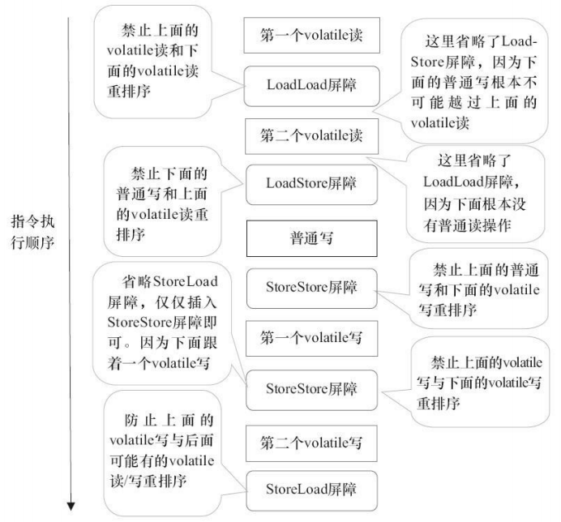

注意，最后的 StoreLoad 屏障不能省略。因为第二个 volatile 写之后，方法立即 return。此时编译器可能无法准确断定后面是否会有 volatile 读或写，为了安全起见，编译器通常会在这里插入一个 StoreLoad 屏障。 


### 3.4.5 JSR-133 为什么要增强 volatile 的内存语义

在 JSR-133 之前的旧 Java 内存模型中，虽然不允许 volatile 变量之间重排序，但旧的 Java 内存模型允许 volatile 变量与普通变量重排序。在旧的内存模型中，VolatileExample 示例程序可能被重排序成下列时序来执行。

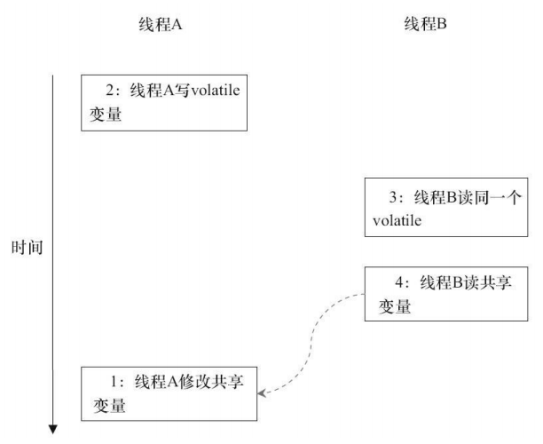

在旧的内存模型中，当 1 和 2 之间没有数据依赖关系时，1 和 2 之间就可能被重排序（3 和 4 类似）。其结果就是：读线程 B 执行 4 时，不一定能看到写线程 A 在执行 1 时对共享变量的修改。因此，在旧的内存模型中，volatile 的写-读没有锁的释放-获所具有的内存语义。为了提供一种**比锁更轻量级的线程之间通信的机制**，JSR-133 专家组决定增 强 volatile 的内存语义：**严格限制编译器和处理器对 volatile 变量与普通变量的重排序，确保 volatile 的写-读和锁的释放-获取具有相同的内存语义。**从编译器重排序规则和处理器内存屏障插入策略来看，只要 volatile 变量与普通变量之间的重排序可能会破坏 volatile 的内存语义，这种重排序就会被编译器重排序规则和处理器内存屏障插入策略禁止。 


由于 **volatile 仅仅保证对单个 volatile 变量的读/写具有原子性**，而**锁的互斥执行的特性可以确保对整个临界区代码的执行具有原子性。**在功能上，锁比 volatile 更强大；在可伸缩性和执行性能上，volatile 更有优势。


## 3.5 锁的内存语义

锁可以让临界区互斥执行。


### 3.5.1 锁的释放-获取建立的 happens-before 关系

锁是 Java 并发编程中最重要的同步机制。锁除了让临界区互斥执行外，还可以让释放锁的线程向获取同一个锁的线程发送消息。

下面是锁释放-获取的示例代码：

```java
class MonitorExample {
    int a = 0;
    
    public synchronized void writer() { // 1
        a++; // 2
    } // 3
    
    public synchronized void reader() { // 4
        int i = a; // 5
        ……
    } // 6
}
```

假设线程 A 执行 writer()方法，随后线程 B 执行 reader()方法。根据 happens-before 规则，这个过程包含的 happens-before 关系可以分为 3 类。 

- 根据程序次序规则，1 happens-before 2，2 happens-before 3；4 happens-before 5，5 happensbefore 6。 

- 根据监视器锁规则，3 happens-before 4。 

- 根据 happens-before 的传递性，2 happens-before 5。 

上述 happens-before 关系的图形化表现形式如下图所示。

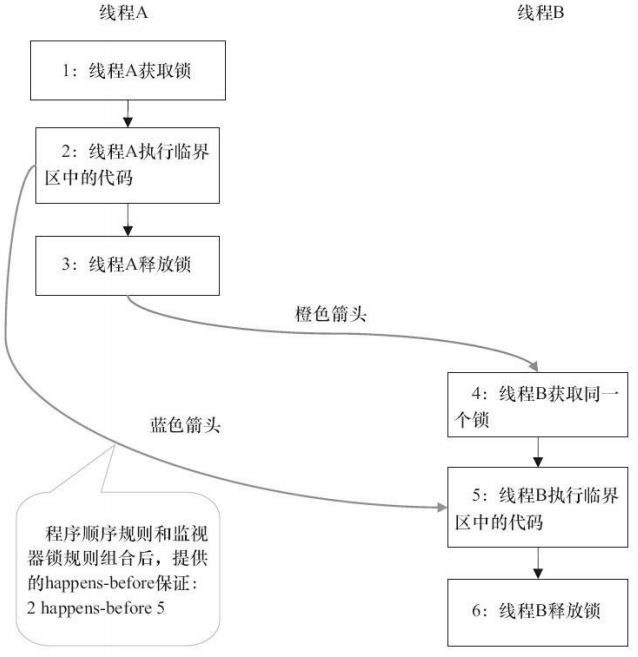

>每一个箭头链接的两个节点，代表了一个 happens-before 关系。黑色箭头表示程序顺序规则；橙色箭头表示监视器锁规则；蓝色箭头表示组合这些规则后提供的 happensbefore 保证。 

在线程 A 释放了锁之后，随后线程 B 获取同一个锁。在上图中，2  happens-before5。因此，线程 A 在释放锁之前所有可见的共享变量，在线程 B 获取同一个锁之后，将立刻变得对 B 线程可见。


### 3.5.2 锁的释放和获取的内存语义

**当线程释放锁时，JMM 会把该线程对应的本地内存中的共享变量刷新到主内存中。**以上面的 MonitorExample 程序为例，A 线程释放锁后，共享数据的状态示意图如下图所示。 

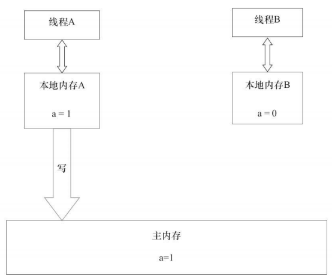

**当线程获取锁时，JMM 会把该线程对应的本地内存置为无效。从而使得被监视器保护的临界区代码必须从主内存中读取共享变量。**下面是锁获取的状态示意图。

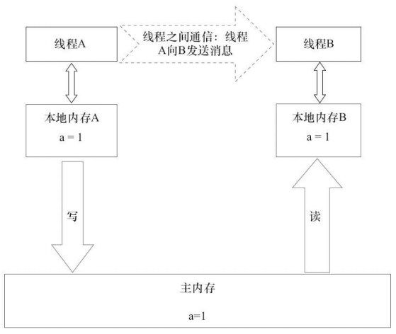

**锁释放与 volatile 写有相同的内存语义；锁获取与 volatile 读有相同的内存语义。**

下面对锁释放和锁获取的内存语义做个总结：

- 线程 A 释放一个锁，实质上是线程 A 向接下来将要获取这个锁的某个线程发出了（线程 A 对共享变量所做修改的）消息。 

- 线程 B 获取一个锁，实质上是线程 B 接收了之前某个线程发出的（在释放这个锁之前对共享变量所做修改的）消息。 

- 线程 A 释放锁，随后线程 B 获取这个锁，这个过程实质上是线程 A 通过主内存向线程 B 发送消息。


### 3.5.3 锁内存语义的实现

//待补充


# 4. Java 并发编程基础【重点】

线程作为操作系统调度的最小单元，多个线程能够同时执行，这将显著提升程序性能，在多核环境中表现得更加明显。但是，过多地创建线程和对线程的不当管理也容易造成问题。


## 4.1 线程简介


### 4.1.1 什么是线程

现代操作系统在运行一个程序时，会为其创建一个进程。例如，启动一个 Java 程序，操作系统就会创建一个 Java 进程。现代操作系统**调度的最小单元**是**线程**，也叫**轻量级进程**（Light Weight Process），在一个进程里可以创建多个线程，这些**线程都拥有各自的计数器、堆栈和局部变量等属性，并且能够访问共享的内存变量**。处理器在这些线程上高速切换，让使用者感觉到这些线程在同时执行。

>一个 Java 程序从 `main()` 方法开始执行，然后按照既定的代码逻辑执行，看似没有其他线程参与，但实际上 Java 程序天生就是多线程程序，因为执行 `main()` 方法的是一个名称为 main 的线程。

**一个 Java 程序的运行不仅仅是 `main()` 方法的运行，而是 main 线程和多个其他线程的同时运行。**


### 4.1.2 为什么要使用多线程

- **更多的处理器核心**

  线程是大多数操作系统调度的基本单元，一个程序作为一个进程来运行，程序运行过程中能够创建多个线程，而一个线程在一个时刻只能运行在一个处理器核心上。一个单线程程序在运行时只能使用一个处理器核心，那么再多的处理器核心加入也无法显著提升该程序的执行效率。相反，如果该程序**使用多线程技术，将计算逻辑分配到多个处理器核心上，就会显著减少程序的处理时间，并且随着更多处理器核心的加入而变得更有效率**。

- **更快的响应时间**

  **使用多线程技术，将数据一致性不强的操作派发给其他线程处理（也可以使用消息队列），这样做的好处是响应用户请求的线程能够尽可能快地处理完成，缩短了响应时间，提升了用户体验。** 

- **更好的编程模型**

  Java 为多线程编程提供了良好、考究并且一致的编程模型，使开发人员能够更加专注于问题的解决，即为所遇到的问题建立合适的模型，而不是绞尽脑汁地考虑如何将其多线程化。一旦开发人员建立好了模型，稍做修改总是能够方便地映射到 Java 提供的多线程编程模型上。


### 4.1.3 线程优先级

现代操作系统基本采用**时分**的形式调度运行的线程，操作系统会分出一个个时间片，线程会分配到若干时间片，当线程的时间片用完了就会发生线程调度，并等待着下次分配。线程分配到的时间片多少也就决定了线程使用处理器资源的多少，而**线程优先级就是决定线程需要多或者少分配一些处理器资源的线程属性。**


在 Java 线程中，通过一个整型成员变量 `priority` 来控制优先级，优先级的范围从 **1~10**，在线程构建的时候可以通过 `setPriority(int)`方法来修改优先级，**默认优先级是 5，优先级高的线程分配时间片的数量要多于优先级低的线程。设置线程优先级时，针对频繁阻塞（休眠或者 I/O 操作）的线程需要设置较高优先级，而偏重计算（需要较多 CPU 时间或者偏运算）的线程则设置较低的优先级，确保处理器不会被独占**。在不同的 JVM 以及操作系统上，线程规划会存在差异，有些操作系统甚至会忽略对线程优先级的设定。

注意：

> 线程优先级不能作为程序正确性的依赖，因为操作系统可以完全不用理会 Java 线程对于优先级的设定。


### 4.1.4 线程的状态

Java 线程在运行的生命周期中可能处于下表所示的 6 种不同的状态，在给定的一个时刻，线程只能处于其中的一个状态。 


线程在自身的生命周期中，并不是固定地处于某个状态，而是随着代码的执行在不同的状态之间进行切换，Java 线程状态变迁如下图所示：


线程创建之后，调用 `start()` 方法开始运行。当线程执行 `wait()` 方法之后，线程进入等待状态。进入**等待状态的线程需要依靠其他线程的通知才能够返回到运行状态**，而**超时等待状态相当于在等待状态的基础上增加了超时限制，也就是超时时间到达时将会返回到运行状态**。当线程调用同步方法时，在没有获取到锁的情况下，线程将会进入到阻塞状态。**线程在执行 Runnable 的 `run()` 方法之后将会进入到终止状态。**


> 注意：Java 将操作系统中的运行和就绪两个状态合并称为运行状态。**阻塞状态是线程阻塞在进入 synchronized 关键字修饰的方法或代码块（获取锁）时的状态，但是阻塞在 `java.concurrent` 包中 Lock 接口的线程状态却是等待状态**，因为 `java.concurrent` 包中 Lock 接口对于阻塞的实现均使用了 LockSupport 类中的相关方法。


### 4.1.5 Daemon 线程

Daemon 线程是一种支持型线程（常被叫做**守护线程**），因为它主要被**用作程序中后台调度以及支持性工作**。这意味着，**当一个 Java 虚拟机中不存在非 Daemon 线程的时候，Java 虚拟机将会退出**。可以通过调用 `Thread.setDaemon(true)` 将线程设置为 Daemon 线程。 

> 注意：Daemon 属性需要在启动线程之前设置，不能在启动线程之后设置。Daemon 线程被用作完成支持性工作，但是**在 Java 虚拟机退出时 Daemon 线程中的 finally 块并不一定会执行**。所以，在构建 Daemon 线程时，不能依靠 finally 块中的内容来确保执行关闭或清理资源的逻辑。

代码示例如下：

```java
public class Concurrency {
    public static void main(String[] args) {
        Thread thread = new Thread(new DaemonRunner(), "DaemonRunner");
        thread.setDaemon(true);
        thread.start();
    }
    static class DaemonRunner implements Runnable {
        @Override
        public void run() {
            try {
            	SleepUtils.second(10);
            } finally {
            	System.out.println("DaemonThread finally run.");
            }
        }
    } 
}
```

运行 Daemon 程序，可以看到在终端或者命令提示符上没有任何输出。main 线程（非 Daemon 线程）在启动了线程 DaemonRunner 之后随着 main 方法执行完毕而终止，而此时 Java 虚拟机中已经没有非 Daemon 线程，虚拟机需要退出。Java 虚拟机中的所有 Daemon 线程都需要立即终止，因此 DaemonRunner 立即终止，但是 DaemonRunner 中的 finally 块并没有执行。


## 4.2 启动和终止线程


### 4.2.1 构造线程

**在运行线程之前首先要构造一个线程对象，线程对象在构造的时候需要提供线程所需要的属性**，如线程所属的线程组、线程优先级、是否是 Daemon 线程等信息。

下面代码清单所示的代码摘自 `java.lang.Thread` 中对线程进行初始化的部分：

Thread.java：


在上述过程中，一个新构造的线程对象是**由其 parent 线程来进行空间分配**的，而 **child 线程继承了 parent 是否为 Daemon、优先级和加载资源的 contextClassLoader 以及可继承的 ThreadLocal，同时还会分配一个唯一的 ID 来标识这个 child 线程**。至此，一个能够运行的线程对象就初始化好了，在堆内存中等待着运行。 


### 4.2.2 启动线程

线程对象在初始化完成之后，调用 `start()` 方法就可以启动这个线程。线程 `start()` 方法的含义是：**当前线程（即 parent 线程）同步告知 Java 虚拟机，只要线程规划器空闲，应立即启动调用 `start()` 方法的线程。**

> 注意：**启动一个线程前，最好为这个线程设置线程名称**，因为这样在使用 jstack 分析程序或者进行问题排查时，就会给开发人员提供一些提示。


### 4.2.3 理解中断

中断可以理解为**线程的一个标识位属性**，它表示**一个运行中的线程是否被其他线程进行了中断操作**。中断好比其他线程对该线程打了个招呼，其他线程通过调用该线程的 `interrupt()` 方法对其进行中断操作。 

线程通过检查自身是否被中断来进行响应，线程通过方法 `isInterrupted()`来进行判断是否被中断，也可以调用静态方法 `Thread.interrupted()`对当前线程的中断标识位进行复位。如果该线程已经处于终结状态，即使该线程被中断过，在调用该线程对象的 `isInterrupted()`时依旧会返回 false。 

从 Java 的 API 中可以看到，许多声明抛出 InterruptedException 的方法（例如 `Thread.sleep(longmillis)`方法）这些方法**在抛出 InterruptedException 之前，Java 虚拟机会先将该线程的中断标识位清除**，然后抛出 InterruptedException，此时调用 `isInterrupted()` 方法将会返回 false。

***

在下面代码清单所示的例子中，首先创建了两个线程，SleepThread 和 BusyThread，前者不停地睡眠，后者一直运行，然后对这两个线程分别进行中断操作，观察二者的中断标识位。 

Concurrency.java：

```java
public class Concurrency {
    public static void main(String[] args) throws Exception {
        // sleepThread 不停的尝试睡眠
        Thread sleepThread = new Thread(new SleepRunner(), "SleepThread");
        sleepThread.setDaemon(true);
        // busyThread 不停的运行
        Thread busyThread = new Thread(new BusyRunner(), "BusyThread");
        busyThread.setDaemon(true);
        sleepThread.start();
        busyThread.start();
        
        // 休眠 5 秒，让 sleepThread 和 busyThread 充分运行
        TimeUnit.SECONDS.sleep(5);
        sleepThread.interrupt();
        busyThread.interrupt();
        System.out.println("SleepThread interrupted is " + sleepThread.isInterrupted());
        System.out.println("BusyThread interrupted is " + busyThread.isInterrupted());

        // 防止 sleepThread 和 busyThread 立刻退出
        TimeUnit.SECONDS.sleep(2);
    }
    static class SleepRunner implements Runnable {
        @Override
        public void run() {
            while (true) {
                try {
                	TimeUnit.SECONDS.sleep(10);
                } catch (InterruptedException e) {
                	e.printStackTrace();
                }
            }
        }
    }
    static class BusyRunner implements Runnable {
        @Override
        public void run() {
            while (true) {
            }
        }
    } 
}
```

输出如下。 

```
SleepThread interrupted is false 
BusyThread interrupted is true 
java.lang.InterruptedException: sleep interrupted
```

从结果可以看出，抛出 InterruptedException 的线程 SleepThread，其中断标识位被清除了，而一直忙碌运作的线程 BusyThread，中断标识位没有被清除。


### 4.2.4 过期的 suspend()、resume() 和 stop()【已淘汰】

如果把 CD 机播放音乐比作一个线程的运作，那么对音乐播放做出的暂停、恢复和停止操作对应在线程 Thread 的 API 就是 `suspend()`、`resume()` 和 `stop()`。 


在下面代码清单所示的例子中，创建了一个线程 PrintThread，它以 1 秒的频率进行打印，而主线程对其进行暂停、恢复和停止操作。

Concurrency.java：

```java
public class Concurrency {
    public static void main(String[] args) throws Exception {
        DateFormat format = new SimpleDateFormat("HH:mm:ss");
        Thread printThread = new Thread(new Runner(), "PrintThread");
        printThread.setDaemon(true);
        printThread.start();
        TimeUnit.SECONDS.sleep(3);
        // 将 PrintThread 进行暂停，输出内容工作停止
        printThread.suspend();
        System.out.println("main suspend PrintThread at " + format.format(new Date()));
        TimeUnit.SECONDS.sleep(3);
        // 将 PrintThread 进行恢复，输出内容继续
        printThread.resume();
        System.out.println("main resume PrintThread at " + format.format(new Date()));
        TimeUnit.SECONDS.sleep(3);
        // 将 PrintThread 进行终止，输出内容停止
        printThread.stop();
        System.out.println("main stop PrintThread at " + format.format(new Date()));
        TimeUnit.SECONDS.sleep(3);
    }
    
    static class Runner implements Runnable {
        @Override
        public void run() {
            DateFormat format = new SimpleDateFormat("HH:mm:ss");
            while (true) {
            	System.out.println(Thread.currentThread().getName() + " Run at " + format.format(new Date()));
            	SleepUtils.second(1);
            }
        }
    } 
}
```

输出如下（输出内容中的时间与示例执行的具体时间相关）：

```
PrintThread Run at 11:21:06 
PrintThread Run at 11:21:07 
PrintThread Run at 11:21:08 
main suspend PrintThread at 11:21:09 
main resume PrintThread at 11:21:12 
PrintThread Run at 11:21:12 
PrintThread Run at 11:21:13 
PrintThread Run at 11:21:14 
main stop PrintThread at 11:21:15 
```

在执行过程中，PrintThread 运行了 3 秒，随后被暂停，3 秒后恢复，最后经过 3 秒被终止。

>这些 API 是过期的，也就是**不建议使用**的。 
>
>不建议使用的原因主要有：以 `suspend()` 方法为例，在调用后，线程不会释放已经占有的资源（比如锁），而是占有着资源进入睡眠状态，这样容易引发死锁问题。同样，`stop()` 方法在终结一个线程时不会保证线程的资源正常释放，通常是没有给予线程完成资源释放工作的机会，因此会导致程序可能工作在不确定状态下。 
>
>暂停和恢复操作可以用后面提到的等待/通知机制来替代。


### 4.2.5 安全地终止线程

中断状态是线程的一个标识位，而**中断操作**是一种简便的线程间交互方式，而这种交互方式最适合**用来取消或停止任务**。除了中断以外，还可以利用一个 boolean 变量来控制是否需要停止任务并终止该线程。 


在下面代码清单所示的例子中，创建了一个线程 CountThread，它不断地进行变量累加，而主线程尝试对其进行中断操作和停止操作。

Shutdown.java：

```java
public class Concurrency {
    public static void main(String[] args) throws Exception {
        Runner one = new Runner();
        Thread countThread = new Thread(one, "CountThread");
        countThread.start();
        // 睡眠 1 秒，main 线程对 CountThread 进行中断，使 CountThread 能够感知中断而结束
        TimeUnit.SECONDS.sleep(1);
        countThread.interrupt();// 中断
        Runner two = new Runner();
        countThread = new Thread(two, "CountThread");
        countThread.start();
        // 睡眠 1 秒，main 线程对 Runner two 进行取消，使 CountThread 能够感知 on 为 false 而结束
        TimeUnit.SECONDS.sleep(1);
        two.cancel();// 取消/停止
    }
    
    private static class Runner implements Runnable {
        private long i;
        private volatile boolean on = true;
        
        @Override
        public void run() {
            while (on && !Thread.currentThread().isInterrupted()) {
            	i++;
            }
            System.out.println("Count i = " + i);
        }
        
        public void cancel() {
        	on = false;
        }
    } 
}
```

输出结果如下所示（输出内容可能不同）。 

```
Count i = 1161971632 
Count i = 1173815036
```

示例在执行过程中，main 线程通过**中断操作**和 **`cancel()` 方法**均可使 CountThread 得以终止。这种**通过标识位或者中断操作的方式能够使线程在终止时有机会去清理资源，而不是武断地将线程停止**，因此这种终止线程的做法显得更加安全和优雅。


## 4.3 线程间通信


### 4.3.1 volatile 和 synchronized 关键字

Java 支持多个线程同时访问一个对象或者对象的成员变量，由于每个线程可以拥有这个变量的拷贝（虽然对象以及成员变量分配的内存是在共享内存中的，但是每个执行的线程还是可以拥有一份拷贝，这样做的目的是加速程序的执行，这是现代多核处理器的一个显著特性），所以**程序在执行过程中，一个线程看到的变量并不一定是最新的。**

- **关键字 `volatile` 可以用来修饰`字段（成员变量）`，就是告知程序任何对该变量的访问均需要从共享内存中获取，而对它的改变必须同步刷新回共享内存，它能保证所有线程对变量访问的可见性。**

- **关键字 `synchronized` 可以修饰`方法`或者以`同步块`的形式来进行使用，它主要确保多个线程在同一个时刻，只能有一个线程处于方法或者同步块中，它保证了线程对变量访问的可见性和排他性。** 


对于**同步块**的实现是使用 `monitorenter` 和 `monitorexit` 指令，而**同步方法**则是依靠方法修饰符上的 `ACC_SYNCHRONIZED` 来完成的。无论采用哪种方式，其**本质是对一个`对象的监视器（monitor）`进行获取**，而这个获取过程是**排他**的，也就是**同一时刻只能有一个线程获取到由 synchronized 所保护对象的监视器。** 

**任意一个对象都拥有自己的监视器，当这个对象由同步块或者这个对象的同步方法调用时，执行方法的线程必须先获取到该对象的监视器才能进入同步块或者同步方法，而没有获取到监视器（执行该方法）的线程将会被阻塞在同步块和同步方法的入口处，进入 BLOCKED 状态。**

***

下图描述了对象、对象的监视器、同步队列和执行线程之间的关系：


任意线程对 Object（Object 由 synchronized 保护）的访问，首先要获得 Object 的监视器。如果获取失败，线程进入同步队列，线程状态变为 BLOCKED。当访问 Object 的前驱（获得了锁的线程）释放了锁，则该释放操作唤醒阻塞在同步队列中的线程，使其重新尝试对监视器的获取。 


### 4.3.2 等待/通知机制

> 一个线程修改了一个对象的值，而另一个线程感知到了变化，然后进行相应的操作，整个过程开始于一个线程，而最终执行又是另一个线程。前者是生产者，后者就是消费者，这种模式在功能层面上实现了解耦，体系结构上具备了良好的伸缩性，但是在 Java 语言中如何实现类似的功能呢？ 

简单的办法是让消费者线程不断地循环检查变量是否符合预期，如下面代码所示，在 while 循环中设置不满足的条件，如果条件满足则退出 while 循环，从而完成消费者的工作。 

```java
while(value!=desire){
	Thread.sleep(1000);
}
doSomething();
```

上面这段伪代码在条件不满足时就睡眠一段时间，这样做的目的是防止过快的“无效”尝试，这种方式看似能够解实现所需的功能，但是却存在如下问题：

1. **难以确保及时性**。在睡眠时，基本不消耗处理器资源，但是如果睡得过久，就不能及时发现条件已经变化，也就是及时性难以保证。 

2. **难以降低开销**。如果降低睡眠的时间，比如休眠 1 毫秒，这样消费者能更加迅速地发现条件变化，但是却可能消耗更多的处理器资源，造成了无端的浪费。

以上两个问题，看似矛盾难以调和，但是 Java 通过**内置的等待/通知机制**能够很好地解决这个矛盾并实现所需的功能。 

等待/通知的相关方法是任意 Java 对象都具备的，因为这些方法被定义在所有对象的超类 `java.lang.Object` 上，方法和描述如下表所示：


**等待/通知机制，是指一个线程 A 调用了对象 O 的 `wait()` 方法进入等待状态，而另一个线程 B 调用了对象 O 的 `notify()` 或者 `notifyAll()` 方法，线程 A 收到通知后从对象 O 的 `wait()` 方法返回，进而执行后续操作**。上述两个线程通过对象 O 来完成交互，而对象上的 `wait()` 和 `notify`/`notifyAll()` 的关系就如同开关信号一样，用来完成等待方和通知方之间的交互工作。 

***

在下面代码清单所示的例子中，创建了两个线程——`WaitThread` 和 `NotifyThread`，前者检查 flag 值是否为 false，如果符合要求，进行后续操作，否则在 lock 上等待，后者在睡眠了一段时间后对 lock 进行通知。


输出如下（输出内容可能不同，主要区别在时间上）：

```
Thread[WaitThread,5,main] flag is true. wa @ 13: 44: 41  
Thread[NotifyThread,5,main] hold lock. notify @ 13: 44: 42  
Thread[NotifyThread,5,main] hold lock again. sleep @ 13: 44: 47  
Thread[WaitThread,5,main] flag is false. running @ 13: 44: 52
```

上述第 3 行和第 4 行输出的顺序可能会互换，而上述例子主要说明了调用 `wait()`、`notify()` 以及 `notifyAll()` 时需要注意的细节如下：

1. 使用 `wait()`、`notify()` 和 `notifyAll()` 时需要先对调用对象加锁。 

2. 调用 `wait()` 方法后，线程状态由 RUNNING 变为 WAITING，并将当前线程放置到对象的等待队列。 

3. **`notify()` 或 `notifyAll()` 方法调用后，等待线程依旧不会从 `wait()` 返回，需要调用 `notify()` 或 `notifyAll()`的线程释放锁之后，等待线程才有机会从 `wait()` 返回。** 

4. `notify()` 方法**将等待队列中的一个等待线程从等待队列中移到同步队列中**，而 `notifyAll()` 方法则是将等待队列中所有的线程全部移到同步队列，被移动的线程状态由 WAITING 变为 BLOCKED。 

5. **从 `wait()` 方法返回的前提是获得了调用对象的锁。**

>等待/通知机制依托于**同步机制**，其目的就是**确保等待线程从 `wait()` 方法返回时能够感知到通知线程对变量做出的修改。** 


下图描述了上述示例的过程：


WaitThread 首先获取了对象的锁，然后调用对象的 `wait()` 方法，从而放弃了锁并进入了对象的等待队列 WaitQueue 中，进入等待状态。由于 WaitThread 释放了对象的锁， NotifyThread 随后获取了对象的锁，并调用对象的 `notify()` 方法，将 WaitThread 从 WaitQueue 移到 SynchronizedQueue 中，此时 WaitThread 的状态变为阻塞状态。NotifyThread 释放了锁之后， WaitThread 再次获取到锁并从 `wait()` 方法返回继续执行。


### 4.3.3 等待/通知的经典范式

等待/通知的经典范式分为两部分，分别针对**等待方（消费者）**和**通知方（生产者）**。

- **等待方遵循如下原则:**
  1. 获取对象的锁。 
  2. 如果条件不满足，那么调用对象的 `wait()` 方法，被通知后仍要检查条件。 
  3. 条件满足则执行对应的逻辑。 

对应的伪代码如下：

```java
synchronized(对象) {
    while(条件不满足) { 
    对象.wait();
    }
    对应的处理逻辑
}
```

- **通知方遵循如下原则:**
  1. 获得对象的锁。 
  2. 改变条件。 
  3. 通知所有等待在对象上的线程。 

对应的伪代码如下：

```java
synchronized(对象){
    改变条件
    对象.notifyAll();
}
```


### 4.3.4 管道输入/输出流

管道输入/输出流主要用于**线程之间的数据传输**，而传输的媒介为**内存**。管道输入/输出流主要包括了如下 4 种具体实现：`PipedOutputStream`、`PipedInputStream`、`PipedReader` 和 `PipedWriter`，前两种面向字节，而后两种面向字符。


在下面代码清单所示的例子中，创建了 printThread，它用来接受 main 线程的输入，任何 main 线程的输入均通过 `PipedWriter` 写入，而 printThread 在另一端通过 `PipedReader` 将内容读出并打印。

Piped.java：

```java
public class Piped {
    public static void main(String[] args) throws Exception {
        PipedWriter out = new PipedWriter();
        PipedReader in = new PipedReader();
        // 将输出流和输入流进行连接，否则在使用时会抛出 IOException
        out.connect(in);
        Thread printThread = new Thread(new Print(in), "PrintThread");
        printThread.start();
        int receive = 0;
        try {
            while ((receive = System.in.read()) != -1) {
            	out.write(receive);
            }
        } finally {
        	out.close();
        }
    }
    
    static class Print implements Runnable {
        private PipedReader in;
        
        public Print(PipedReader in) {
        	this.in = in;
        }
        
        public void run() {
            int receive = 0;
            try {
                while ((receive = in.read()) != -1) {
                System.out.print((char) receive);
                }
            } catch (IOException ex) {
            }
        }
    } 
}
```

运行该示例，输入一组字符串，可以看到被 printThread 进行了原样输出。 

```
Repeat my words. 
Repeat my words. 
```

> 对于 Piped 类型的流，必须先要进行绑定，也就是调用 `connect()` 方法，如果没有将输入/输出流绑定起来，对于该流的访问将会抛出异常。


### 4.3.5 Thread.join() 的使用

如果一个线程 A 执行了 `thread.join()` 语句，其含义是：**当前线程 A 等待 thread 线程终止之后才从 `thread.join()` 返回**。线程 Thread 除了提供 `join()` 方法之外，还提供了 `join(long millis)` 和 `join(longmillis,int nanos)` 两个具备超时特性的方法。这两个超时方法表示，如果线程 thread 在给定的超时时间里没有终止，那么将会从该超时方法中返回。


在下面代码清单所示的例子中，创建了 10 个线程，编号 0~9，每个线程调用前一个线程的 `join()` 方法，也就是线程 0 结束了，线程 1 才能从 `join()` 方法中返回，而线程 0 需要等待 main 线程结束。 

Join.java：

```java
public class Join{
    public static void main(String[] args) throws Exception {
        Thread previous = Thread.currentThread();
        for (int i = 0; i < 10; i++) {
            // 每个线程拥有前一个线程的引用，需要等待前一个线程终止，才能从等待中返回
            Thread thread = new Thread(new Domino(previous), String.valueOf(i));
            thread.start();
            previous = thread;
        }
        TimeUnit.SECONDS.sleep(5);
        System.out.println(Thread.currentThread().getName() + " terminate.");
    }
    
    static class Domino implements Runnable {
        private Thread thread;
        
        public Domino(Thread thread) {
        	this.thread = thread;
        }
        public void run() {
            try {
            	thread.join();
            } catch (InterruptedException e) {
            }
            System.out.println(Thread.currentThread().getName() + " terminate.");
        }
    } 
}
```

输出如下：

```
main terminate.
0 terminate.
1 terminate.
2 terminate.
3 terminate.
4 terminate.
5 terminate.
6 terminate.
7 terminate.
8 terminate.
9 terminate.
```

从上述输出可以看到，每个线程终止的前提是前驱线程的终止，每个线程等待前驱线程终止后，才从 `join()` 方法返回，这里涉及了等待/通知机制（等待前驱线程结束，接收前驱线程结束通知）。

> 下面是 JDK 中 `Thread.join()` 方法的部分源码：
>
> ```java
> // 加锁当前线程对象
> public final synchronized void join() throws InterruptedException{
>     // 条件不满足，继续等待
>     while(isAlive()){
>     	wait(0);
>     }
>     // 条件符合，方法返回
> }
> ```

当线程终止时，会调用线程自身的 `notifyAll()` 方法，会通知所有等待在该线程对象上的线程。可以看到 `join()` 方法的逻辑结构与等待/通知经典范式一致，即加锁、循环和处理逻辑 3 个步骤。


### 4.3.6 ThreadLocal 的使用

**ThreadLocal，即线程变量，是一个以 ThreadLocal 对象为键、任意对象为值的存储结构。**这个结构被附带在线程上，也就是说**一个线程可以根据一个 ThreadLocal 对象查询到绑定在这个线程上的一个值**。可以通过 `set(T)` 方法来设置一个值，在当前线程下再通过 `get()` 方法获取到原先设置的值。


在下面代码清单所示的例子中，构建了一个常用的 Profiler 类，它具有 `begin()` 和 `end()` 两个方法，而 `end()` 方法返回从 `begin()` 方法调用开始到 `end()` 方法被调用时的时间差，单位是毫秒。

Profiler.java：

```java
public class Profiler {
    // 第一次 get()方法调用时会进行初始化（如果 set 方法没有调用），每个线程会调用一次
    private static final ThreadLocal<Long> TIME_THREADLOCAL = new ThreadLocal<Long>();
    
    protected Long initialValue() {
    	return System.currentTimeMillis();
    }
    
    public static final void begin() {
    	TIME_THREADLOCAL.set(System.currentTimeMillis());
    }
    
    public static final long end() {
    	return System.currentTimeMillis() - TIME_THREADLOCAL.get();
    }
    
    public static void main(String[] args) throws Exception {
        Profiler.begin();
        TimeUnit.SECONDS.sleep(1);
        System.out.println("Cost: " + Profiler.end() + " mills");
    } 
}
```

输出结果如下所示：

```
Cost: 1001 mills 
```

Profiler 可以被复用在方法调用耗时统计的功能上，在方法的入口前执行 `begin()` 方法，在方法调用后执行 `end()` 方法，好处是两个方法的调用不用在一个方法或者类中，比如在 AOP（面向切面编程）中，可以在方法调用前的切入点执行 `begin()` 方法，而在方法调用后的切入点执行 `end()` 方法，这样依旧可以获得方法的执行耗时。


## 4.4 线程应用实例

### 4.4.1 等待超时模式

开发人员经常会遇到这样的方法调用场景：**调用一个方法时等待一段时间（一般来说是给定一个时间段），如果该方法能够在给定的时间段之内得到结果，那么将结果立刻返回，反之，超时返回默认结果。** 

等待/通知的经典范式（加锁、条件循环和处理逻辑 3 个步骤）无法做到超时等待。而超时等待的加入，只需要对经典范式做出非常小的改动，改动内容如下所示。假设超时时间段是 T，那么可以推断出在当前时间 `now+T` 之后就会超时。定义如下变量：

- **等待持续时间：REMAINING=T。** 

- **超时时间：FUTURE=now+T。** 

这时仅需要 `wait(REMAINING)` 即可，在 `wait(REMAINING)` 返回之后会将执行： **REMAINING=FUTURE–now**。如果 REMAINING 小于等于 0，表示已经超时，直接退出，否则将继续执行 `wait(REMAINING)`。 

>等待超时模式就是在等待/通知范式基础上增加了超时控制，这使得该模式相比原有范式更具有灵活性，因为即使方法执行时间过长，也不会“永久”阻塞调用者，而是会按照调用者的要求“按时”返回。


### 4.4.2 一个简单的数据库连接池示例

//略


# 5. Java 中的锁【重点】


## 5.1 Lock 接口

锁是**用来控制多个线程访问共享资源**的方式。一般来说，一个锁能够防止多个线程同时访问共享资源（但是有些锁可以允许多个线程并发的访问共享资源，比如读写锁）。

在 Lock 接口出现之前，Java 程序是靠 synchronized 关键字实现锁功能的，而 Java SE 5 之后，并发包中新增了 Lock 接口（以及相关实现类）用来实现锁功能，它提供了与 synchronized 关键字类似的同步功能，只是**在使用时需要显式地获取和释放锁**。虽然它缺少了（通过 synchronized 块或者方法所提供的）隐式获取释放锁的便捷性，但是却**拥有了锁获取与释放的可操作性、可中断的获取锁以及超时获取锁等多种 synchronized 关键字所不具备的同步特性。**

> **使用 synchronized 关键字将会隐式地获取锁，但是它将锁的获取和释放固化了，也就是先获取再释放**。当然，这种方式简化了同步的管理，可是扩展性没有显式的锁获取和释放来的好。例如，针对一个场景，手把手进行锁获取和释放，先获得锁 A，然后再获取锁 B，当锁 B 获得后，释放锁 A 同时获取锁 C，当锁 C 获得后，再释放 B 同时获取锁 D，以此类推。这种场景下，synchronized 关键字就不那么容易实现了，而使用 Lock 却容易许多。


Lock 的使用很简单，下面代码是 Lock 的使用的方式：

LockUseCase.java：

```java
Lock lock = new ReentrantLock();
lock.lock();
try {
} finally {
	lock.unlock();
}
```

**在 finally 块中释放锁，目的是保证在获取到锁之后，最终能够被释放。** 

**不要将获取锁的过程写在 try 块中，因为如果在获取锁（自定义锁的实现）时发生了异常，异常抛出的同时，也会导致锁无故释放。**


Lock 接口提供的 synchronized 关键字所不具备的主要特性如下表所示：

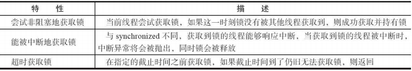

Lock 是一个接口，它定义了锁获取和释放的基本操作，Lock 的 API 如下表所示：

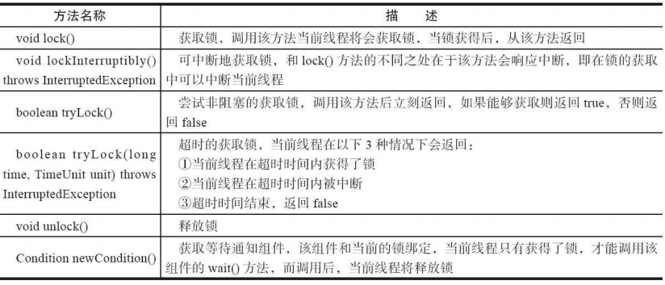 

>Lock 接口的实现基本都是通过聚合了一个同步器的子类来完成线程访问控制的。


## 5.2 队列同步器

**队列同步器 AbstractQueuedSynchronizer**（以下简称同步器），是**用来构建锁或者其他同步组件的基础框架**，它使用了一个 `int 成员变量` 表示同步状态，通过内置的 FIFO 队列来完成资源获取线程的排队工作。

同步器的主要使用方式是**继承**，**子类通过继承同步器并实现它的抽象方法来管理同步状态**，在抽象方法的实现过程中免不了要对同步状态进行更改，这时就需要使用同步器提供的 3 个方法（`getState()`、`setState(int newState)` 和 `compareAndSetState(int expect,int  update)`）来进行操作，因为它们能够保证状态的改变是安全的。**子类推荐被定义为自定义同步组件的静态内部类**，同步器自身没有实现任何同步接口，它仅仅是定义了若干同步状态获取和释放的方法来供自定义同步组件使用，**同步器既可以支持独占式地获取同步状态，也可以支持共享式地获取同步状态**，这样就可以方便实现不同类型的同步组件（ReentrantLock、ReentrantReadWriteLock 和 CountDownLatch 等）。 

**同步器是实现锁（也可以是任意同步组件）的关键，在锁的实现中聚合同步器，利用同步器实现锁的语义**。可以这样理解二者之间的关系：**锁是面向使用者的**，它定义了使用者与锁交互的接口（比如可以允许两个线程并行访问），隐藏了实现细节；**同步器面向的是锁的实现者**，它简化了锁的实现方式，屏蔽了同步状态管理、线程的排队、等待与唤醒等底层操作。锁和同步器很好地隔离了使用者和实现者所需关注的领域。


### 5.2.1 队列同步器的接口与示例

同步器的设计是基于**模板方法模式**的，也就是说，**使用者需要继承同步器并重写指定的方法，随后将同步器组合在自定义同步组件的实现中，并调用同步器提供的模板方法，而这些模板方法将会调用使用者重写的方法**。重写同步器指定的方法时，需要使用同步器提供的如下 3 个方法来访问或修改同步状态。

- **getState()**：获取当前同步状态。 

- **setState(int newState)**：设置当前同步状态。 

- **compareAndSetState(int expect,int update)**：使用 **CAS** 设置当前状态，该方法能够保证状态设置的原子性。 

同步器可重写的方法与描述如下表所示：


**实现自定义同步组件时，将会调用同步器提供的模板方法**，这些（部分）模板方法与描述如下表所示：

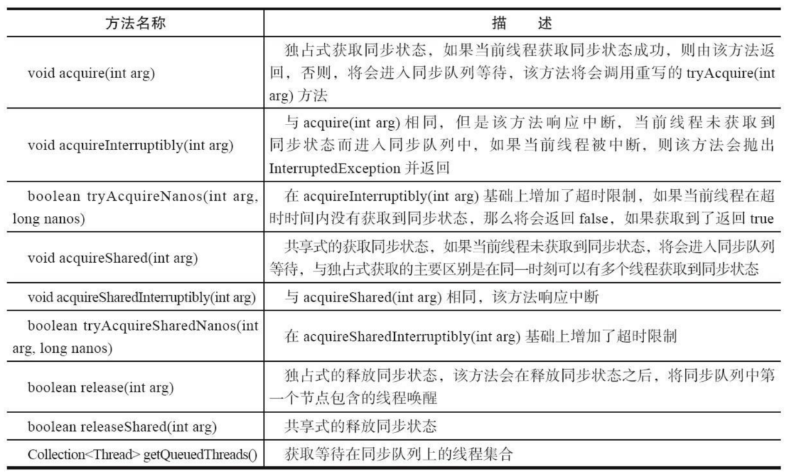

同步器提供的模板方法基本上分为 3 类：**独占式获取与释放同步状态**、**共享式获取与释放同步状态**和**查询同步队列中的等待线程情况**。自定义同步组件将使用同步器提供的模板方法来实现自己的同步语义。 

***

下面通过一个独占锁的示例来深入了解一下同步器的工作原理。 

顾名思义，**独占锁**就是**在同一时刻只能有一个线程获取到锁，而其他获取锁的线程只能处于同步队列中等待，只有获取锁的线程释放了锁，后继的线程才能够获取锁**，如下面代码清单所示：

Mutex.java：

```java
class Mutex implements Lock {
	// 静态内部类，自定义同步器
 	private static class Sync extends AbstractQueuedSynchronizer {
 		// 是否处于占用状态
		protected boolean isHeldExclusively() {
 			return getState() == 1;
		}
        
 		// 当状态为 0 的时候获取锁
 		public boolean tryAcquire(int acquires) {
 			if (compareAndSetState(0, 1)) {
 				setExclusiveOwnerThread(Thread.currentThread());
 				return true;
 			}
 			return false;
	 	}
        
 		// 释放锁，将状态设置为 0
 		protected boolean tryRelease(int releases) {
 			if (getState() == 0) throw new IllegalMonitorStateException();
 			setExclusiveOwnerThread(null);
 			setState(0);
 			return true;
 		}
        
 		// 返回一个 Condition，每个 condition 都包含了一个 condition 队列
 		Condition newCondition() {
 			return new ConditionObject();
 		}
 	}
    
 	// 仅需要将操作代理到 Sync 上即可
 	private final Sync sync = new Sync();
    
 	public void lock() {
 		sync.acquire(1);
 	}
    
    public boolean tryLock() {
    	return sync.tryAcquire(1);
    }

    public void unlock() {
	    sync.release(1);
    }

    public Condition newCondition() {
	    return sync.newCondition();
    }

    public boolean isLocked() {
    	return sync.isHeldExclusively();
    }

    public boolean hasQueuedThreads() {
    	return sync.hasQueuedThreads();
    }

    public void lockInterruptibly() throws InterruptedException {
    	sync.acquireInterruptibly(1);
    }

    public boolean tryLock(long timeout, TimeUnit unit) throws InterruptedException {
    	return sync.tryAcquireNanos(1, unit.toNanos(timeout));
    } 
}
```

上述示例中，独占锁 Mutex 是一个自定义同步组件，它在同一时刻只允许一个线程占有锁。**Mutex 中定义了一个静态内部类，该内部类继承了同步器并实现了独占式获取和释放同步状态**。在 `tryAcquire(int acquires)` 方法中，如果经过 CAS 设置成功（同步状态 设置为 1），则代表获取了同步状态，而在 `tryRelease(int releases)` 方法中只是将同步状态重置为 0。用户使用 Mutex 时并不会直接和内部同步器的实现打交道，而是调用 Mutex 提供的方法，在 Mutex 的实现中，以获取锁的 `lock()` 方法为例，只需要在方法实现中调用同步器的模板方法 `acquire(int args)` 即可，当前线程调用该方法获取同步状态失败后会被加入到同步队列中等待，这样就大大降低了实现一个可靠自定义同步组件的门槛。


### 5.2.2 队列同步器的实现分析

从实现角度分析同步器是如何完成线程同步的，主要包括： 

- 同步队列

- 独占式同步状态获取与释放

- 共享式同步状态获取与释放

- 超时获取同步状态等同步器的核心数据结构与模板方法


#### 1）同步队列

同步器依赖内部的同步队列（一个 **FIFO 双向队列**）来完成同步状态的管理，当前线程获取同步状态失败时，同步器会将当前线程以及等待状态等信息构造成为一个节点（Node）并将其加入同步队列，同时会阻塞当前线程，当同步状态释放时，会把首节点中的线程唤醒，使其再次尝试获取同步状态。 

同步队列中的节点（Node）用来**保存获取同步状态失败的线程引用、等待状态以及前驱和后继节点**，节点的属性类型与名称以及描述如下表所示：

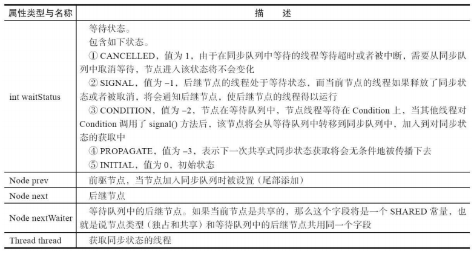


节点是构成同步队列的基础，同步器拥有首节点（head）和尾节点（tail），没有成功获取同步状态的线程将会成为节点加入该队列的尾部，同步队列的基本结构如下图所示：

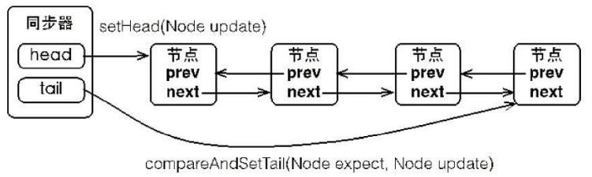

同步器包含了两个节点类型的引用，一个指向头节点，而另一个指向尾节点。


当一个线程成功地获取了同步状态（或者锁），其他线程将无法获取到同步状态，转而被构造成为节点并加入到同步队列中，而这个加入队列的过程必须要保证线程安全，因此同步器提供了一个**基于 CAS 的设置尾节点的方法**：`compareAndSetTail(Node expect,Node update)`，它需要传递当前线程“认为”的尾节点和当前节点，只有设置成功后，当前节点才正式与之前的尾节点建立关联。

同步器将节点加入到同步队列的过程如下图所示：

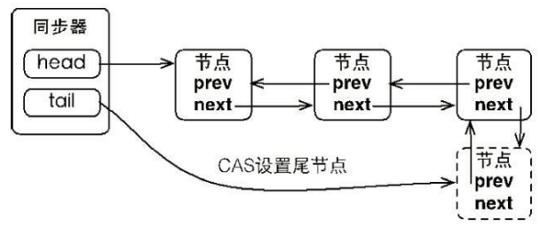


同步队列遵循 FIFO，**首节点是获取同步状态成功的节点，首节点的线程在释放同步状态时，将会唤醒后继节点，而后继节点将会在获取同步状态成功时将自己设置为首节点**，该过程如下图所示：

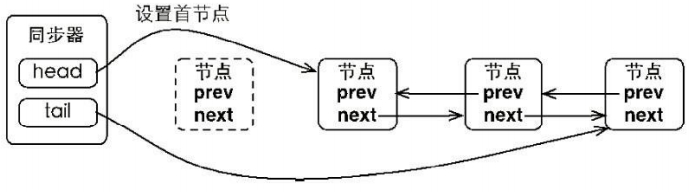

设置首节点是通过获取同步状态成功的线程来完成的，**由于只有一个线程能够成功获取到同步状态，因此设置头节点的方法并不需要使用 CAS 来保证**，它只需要将首节点设置成为原首节点的后继节点并断开原首节点的 next 引用即可。 


#### 2）独占式同步状态获取与释放

通过调用同步器的 `acquire(int arg)` 方法可以获取同步状态，该方法对中断不敏感，也就是由于线程获取同步状态失败后进入同步队列中，后续对线程进行中断操作时，线程不会从同步队列中移出，该方法代码如下所示。

同步器的 `acquire` 方法：

```java
public final void acquire(int arg) {
    if (!tryAcquire(arg) && acquireQueued(addWaiter(Node.EXCLUSIVE), arg)) {
    	selfInterrupt();
    } 
}
```

上述代码主要完成了同步状态获取、节点构造、加入同步队列以及在同步队列中自旋等待的相关工作，其主要逻辑是：**首先调用自定义同步器实现的 `tryAcquire(int arg)` 方法，该方法保证线程安全的获取同步状态，如果同步状态获取失败，则构造同步节点（独占式 Node.EXCLUSIVE，同一时刻只能有一个线程成功获取同步状态）并通过 `addWaiter(Node node)` 方法将该节点加入到同步队列的尾部，最后调用 `acquireQueued(Node node,int arg)` 方法，使得该节点以“死循环”的方式获取同步状态。如果获取不到则阻塞节点中的线程，而被阻塞线程的唤醒主要依靠前驱节点的出队或阻塞线程被中断来实现。**


下面分析一下相关工作。首先是节点的构造以及加入同步队列，如代码清单所示：

同步器的 `addWaiter` 和 `enq` 方法：

```java
private Node addWaiter(Node mode) {
    Node node = new Node(Thread.currentThread(), mode);
    // 快速尝试在尾部添加
    Node pred = tail;
    if (pred != null) {
        node.prev = pred;
        if (compareAndSetTail(pred, node)) {
            pred.next = node;
            return node;
        }
    }
    enq(node);
    return node; 
}

private Node enq(final Node node) {
    for (; ; ) {
        Node t = tail;
        if (t == null) { // Must initialize
        	if (compareAndSetHead(new Node())) tail = head;
        } else {
            node.prev = t;
            if (compareAndSetTail(t, node)) {
                t.next = node;
                return t;
            }
        }
    } 
}
```

上述代码通过使用 `compareAndSetTail(Node expect,Node update)` 方法来确保节点能够被线程安全添加。试想一下：如果使用一个普通的 LinkedList 来维护节点之间的关系， 那么当一个线程获取了同步状态，而其他多个线程由于调用 `tryAcquire(int arg)` 方法获取同步状态失败而并发地被添加到 LinkedList 时，LinkedList 将难以保证 Node 的正确添加，最终的结果可能是节点的数量有偏差，而且顺序也是混乱的。 

在 `enq(final Node node)` 方法中，同步器通过“死循环”来保证节点的正确添加，在“死循环”中只有通过 CAS 将节点设置成为尾节点之后，当前线程才能从该方法返回，否则，当前线程不断地尝试设置。可以看出，`enq(final Node node)` 方法将并发添加节点的请求通过 CAS 变得“串行化”了。 


节点进入同步队列之后，就进入了一个**自旋**的过程，每个节点（或者说每个线程）都在自省地观察，当条件满足，获取到了同步状态，就可以从这个自旋过程中退出，否则依旧留在这个自旋过程中（并会阻塞节点的线程），如代码清单所示：

同步器的 `acquireQueued` 方法：

```java
final boolean acquireQueued(final Node node, int arg) {
    boolean failed = true;
    try {
        boolean interrupted = false;
        for (; ; ) {
            final Node p = node.predecessor();
            if (p == head && tryAcquire(arg)) {
                setHead(node);
                p.next = null; // help GC
                failed = false;
                return interrupted;
            }
            if (shouldParkAfterFailedAcquire(p, node) && parkAndCheckInterrupt()) {
            	interrupted = true;
            }
        }
    } finally {
    	if (failed) cancelAcquire(node);
    } 
}
```

在 `acquireQueued(final Node node,int arg)` 方法中，当前线程在“死循环”中尝试获取同步状态，而**只有前驱节点是头节点才能够尝试获取同步状态**。原因如下：

1. 头节点是成功获取到同步状态的节点，而头节点的线程释放了同步状态之后，将会唤醒其后继节点，后继节点的线程被唤醒后需要检查自己的前驱节点是否是头节点。

2. 维护同步队列的 FIFO 原则。该方法中，节点自旋获取同步状态的行为如下图所示。

   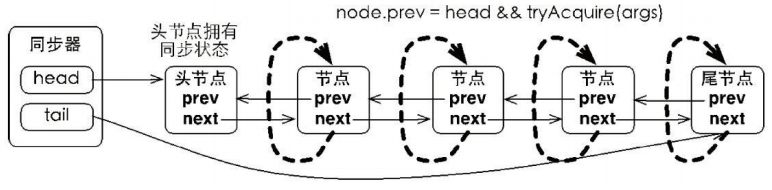 

   >由于**非**首节点线程前驱节点出队或者被中断而从等待状态返回，随后检查自己的前驱是否是头节点，如果是则尝试获取同步状态。可以看到**节点和节点之间在循环检查的过程中基本不相互通信，而是简单地判断自己的前驱是否为头节点**，这样就使得节点的释放规则符合 FIFO，并且也便于对过早通知的处理（过早通知是指前驱节点不是头节点的线程由于中断而被唤醒）。


**独占式同步状态获取**流程，也就是 `acquire(int arg)` 方法调用流程，如图所示：

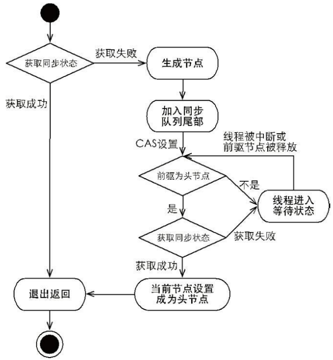

在上图中，**前驱节点为头节点且能够获取同步状态的判断条件和线程进入等待状态**是获取同步状态的**自旋**过程。当同步状态获取成功之后，当前线程从 `acquire(int arg)` 方法返回，**如果对于锁这种并发组件而言，代表着当前线程获取了锁。**


当前线程获取同步状态并执行了相应逻辑之后，就需要释放同步状态，使得后续节点能够继续获取同步状态。**通过调用同步器的 `release(int arg)` 方法可以释放同步状态，该方法在释放了同步状态之后，会唤醒其后继节点（进而使后继节点重新尝试获取同步状态）**。该方法代码如下所示：

同步器的 release 方法：

```java
public final boolean release(int arg) {
    if (tryRelease(arg)) {
        Node h = head;
        if (h != null && h.waitStatus != 0) unparkSuccessor(h);
        return true;
    }
    return false; 
}
```

该方法执行时，会唤醒头节点的后继节点线程，`unparkSuccessor(Node node)` 方法使用 LockSupport 来唤醒处于等待状态的线程。 


**总结：**

在获取同步状态时，同步器维护一个同步队列，获取状态失败的线程都会被加入到队列中并在队列中进行自旋；移出队列（或停止自旋）的条件是前驱节点为头节点且成功获取了同步状态。在释放同步状态时，同步器调用 `tryRelease(int arg)` 方法释放同步状态，然后唤醒头节点的后继节点。 


#### 3）共享式同步状态获取与释放

共享式获取与独占式获取最主要的区别在于**同一时刻能否有多个线程同时获取到同步状态。**

以文件的读写为例，如果一个程序在对文件进行读操作，那么这一时刻对于该文件的写操作均被阻塞，而读操作能够同时进行。**写操作要求对资源的独占式访问，而读操作可以是共享式访问**。两种不同的访问模式在同一时刻对文件或资源的访问情况，如下图所示：

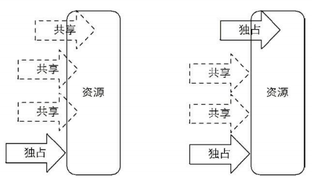

>左半部分，共享式访问资源时，其他共享式的访问均被允许，而独占式访问被阻塞；右半部分是独占式访问资源时，同一时刻其他访问均被阻塞。


通过调用同步器的 `acquireShared(int arg)` 方法可以共享式地获取同步状态，该方法代码如下所示： 

同步器的 acquireShared 和 doAcquireShared 方法：

```java
public final void acquireShared(int arg) {
	if (tryAcquireShared(arg) < 0) doAcquireShared(arg);
}

private void doAcquireShared(int arg) {
    final Node node = addWaiter(Node.SHARED);
    boolean failed = true;
    try {
        boolean interrupted = false;
        for (; ; ) {
            final Node p = node.predecessor();
            if (p == head) {
                int r = tryAcquireShared(arg);
                if (r >= 0) {
                    setHeadAndPropagate(node, r);
                    p.next = null;
                    if (interrupted) selfInterrupt();
                    failed = false;
                    return;
                }
            }
            if (shouldParkAfterFailedAcquire(p, node) && parkAndCheckInterrupt()) 
            interrupted = true;
        }
    } finally {
    	if (failed) cancelAcquire(node);
    } 
}
```

在 `acquireShared(int arg)` 方法中，同步器调用 `tryAcquireShared(int arg)` 方法尝试获取同步状态，`tryAcquireShared(int arg)` 方法返回值为 int 类型，当返回值大于等于 0 时，表示能够获取到同步状态。因此，**在共享式获取的自旋过程中，成功获取到同步状态并退出自旋的条件就是 `tryAcquireShared(int arg)` 方法返回值大于等于 0。**可以看到，在 `doAcquireShared(int arg)` 方法的自旋过程中，如果当前节点的前驱为头节点时，尝试获取同步状态，如果返回值大于等于 0，表示该次获取同步状态成功并从自旋过程中退出。


与独占式一样，共享式获取也需要释放同步状态，通过调用 `releaseShared(int arg)` 方法可以释放同步状态，该方法代码如下所示：

同步器的 releaseShared 方法：

```java
public final boolean releaseShared(int arg) {
    if (tryReleaseShared(arg)) {
        doReleaseShared();
        return true;
    }
    return false; 
}
```

该方法在释放同步状态之后，将会唤醒后续处于等待状态的节点。对于能够支持多个线程同时访问的并发组件（比如 Semaphore），它和独占式主要区别在于 **`tryReleaseShared(int arg)` 方法必须确保同步状态（或者资源数）线程安全释放，一般是通过循环和 CAS 来保证的，因为释放同步状态的操作会同时来自多个线程。** 


#### 4）独占式超时获取同步状态

通过调用同步器的 `doAcquireNanos(int arg,long nanosTimeout)` 方法可以超时获取同步状态，即**在指定的时间段内获取同步状态**，如果获取到同步状态则返回 true，否则，返回 false。该方法提供了传统 Java 同步操作（比如 synchronized 关键字）所不具备的特性。

>响应中断的同步状态获取过程：
>
>在 Java 5 之前，当一个线程获取不到锁而被阻塞在 synchronized 之外时，对该线程进行中断操作， 此时该线程的中断标志位会被修改，但线程依旧会阻塞在 synchronized 上，等待着获取锁。在 Java 5 中，同步器提供了 `acquireInterruptibly(int arg)` 方法，这个方法在等待获取同步状态时，如果当前线程被中断，会立刻返回，并抛出 InterruptedException。 

超时获取同步状态过程可以被视作响应中断获取同步状态过程的“增强版”，`doAcquireNanos(int arg,long nanosTimeout)` 方法在支持响应中断的基础上，增加了超时获取的特性。针对超时获取，主要需要计算出需要睡眠的时间间隔 nanosTimeout，为了防止过早通知， nanosTimeout 计算公式为：**nanosTimeout-=now-lastTime**，其中 now 为当前唤醒时间，lastTime 为上次唤醒时间，如果 nanosTimeout 大于 0 则表示超时时间未到，需要继续睡眠 nanosTimeout 纳秒，反之，表示已经超时，该方法代码如下所示。

同步器的 doAcquireNanos 方法：

```java
private boolean doAcquireNanos(int arg, long nanosTimeout) throws 
InterruptedException {
    long lastTime = System.nanoTime();
    final Node node = addWaiter(Node.EXCLUSIVE);
    boolean failed = true;
    try {
        for (; ; ) {
            final Node p = node.predecessor();
            if (p == head && tryAcquire(arg)) {
                setHead(node);
                p.next = null; // help GC
                failed = false;
                return true;
            }
            if (nanosTimeout <= 0) return false;
            if (shouldParkAfterFailedAcquire(p, node)
             && nanosTimeout > spinForTimeoutThreshold)
            	LockSupport.parkNanos(this, nanosTimeout);
            long now = System.nanoTime();
            //计算时间，当前时间 now 减去睡眠之前的时间 lastTime 得到已经睡眠
            //的时间 delta，然后被原有超时时间 nanosTimeout 减去，得到了
            //还应该睡眠的时间
            nanosTimeout -= now - lastTime;
            lastTime = now;
            if (Thread.interrupted()) throw new InterruptedException();
        }
    } finally {
    	if (failed) cancelAcquire(node);
    } 
}
```

该方法在自旋过程中，当节点的前驱节点为头节点时尝试获取同步状态，如果获取成功则从该方法返回，这个过程和独占式同步获取的过程类似，但是在同步状态获取失败的处理上有所不同。**如果当前线程获取同步状态失败，则判断是否超时（nanosTimeout 小于等于 0 表示已经超时），如果没有超时，重新计算超时间隔 nanosTimeout，然后使当前线程等待 nanosTimeout 纳秒**（当已到设置的超时时间，该线程会从 `LockSupport.parkNanos(Object blocker,long nanos)` 方法返回）。

如果 nanosTimeout 小于等于 spinForTimeoutThreshold（1000 纳秒）时，将不会使该线程进行超时等待，而是进入快速的自旋过程。原因在于，非常短的超时等待无法做到十分精确，如果这时再进行超时等待，相反会让 nanosTimeout 的超时从整体上表现得反而不精确。因此，**在超时非常短的场景下，同步器会进入无条件的快速自旋。**


独占式超时获取同步态的流程如下图所示：

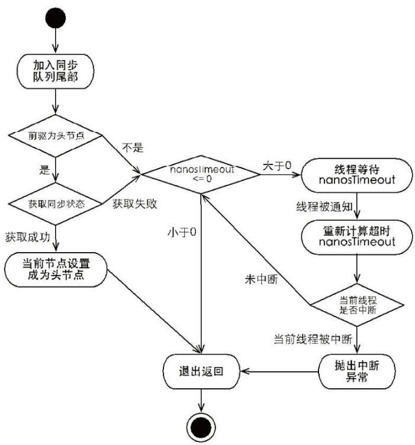

独占式超时获取同步状态 `doAcquireNanos(int arg,long nanosTimeout)` 和独占式获取同步状态 `acquire(int args)` 在流程上非常相似，其主要区别在于未获取到同步状态时的处理逻辑。**`acquire(int args)` 在未获取到同步状态时，将会使当前线程一直处于等待状态，而 `doAcquireNanos(int arg,long nanosTimeout)` 会使当前线程等待 nanosTimeout 纳秒，如果当前线程在 nanosTimeout 纳秒内没有获取到同步状态，将会从等待逻辑中自动返回。**


#### 5）自定义同步组件——TwinsLock

//待补充


## 5.3 重入锁 ReentrantLock

**重入锁 ReentrantLock**是**支持重进入的锁，它表示该锁能够支持一个线程对资源的重复加锁。**除此之外，该锁的还支持获取锁时的公平和非公平性选择。 

>回顾独占锁 Mutex，考虑如下场景：当一个线程调用 Mutex（独占锁）的 `lock()` 方法获取锁之后，如果再次调用 `lock()` 方法，则该线程将会被自己所阻塞，原因是 Mutex 在实现 `tryAcquire(int acquires)` 方法时没有考虑占有锁的线程再次获取锁的场景，而在调用 `tryAcquire(int acquires)` 方法时返回了 false，导致该线程被阻塞。简单地说，Mutex 是一个不支持重进入的锁。而 **synchronized 关键字隐式的支持重进入**，比如一个 synchronized 修饰的递归方法，在方法执行时，执行线程在获取了锁之后仍能连续多次地获得该锁，而不像 Mutex 由于获取了锁，而在下一次获取锁时出现阻塞自己的情况。


ReentrantLock 虽然没能像 synchronized 关键字一样支持隐式的重进入，但是**在调用 `lock()` 方法时，已经获取到锁的线程，能够再次调用 `lock()` 方法获取锁而不被阻塞。**这里提到一个锁获取的公平性问题，**如果在绝对时间上，先对锁进行获取的请求一定先被满足，那么这个锁是公平的，反之，是不公平的。**公平的获取锁，也就是等待时间最长的线程最优先获取锁，也可以说锁获取是**顺序**的。ReentrantLock 提供了一个构造函数，能够控制锁是否是公平的。

>事实上，公平的锁机制往往没有非公平的效率高，但是，并不是任何场景都是以 TPS 作为唯一的指标，**公平锁能够减少“饥饿”发生的概率，等待越久的请求越是能够得到优先满足。** 


### 1）实现重进入

重进入是指**任意线程在获取到锁之后能够再次获取该锁而不会被锁所阻塞**，该特性的实现需要解决以下两个问题：

- **线程再次获取锁**。锁需要去识别获取锁的线程是否为当前占据锁的线程，如果是，则再次成功获取。 

- **锁的最终释放**。线程重复 n 次获取了锁，随后在第 n 次释放该锁后，其他线程能够获取到该锁。锁的最终释放要求锁对于获取进行计数自增，计数表示当前锁被重复获取的次数，而锁被释放时，计数自减，当计数等于 0 时表示锁已经成功释放。


ReentrantLock 是通过**组合自定义同步器来实现锁的获取与释放**，以非公平性（默认的）实现为例，获取同步状态的代码如下所示：

ReentrantLock 的 nonfairTryAcquire 方法：

```java
final boolean nonfairTryAcquire(int acquires) {
    final Thread current = Thread.currentThread();
    int c = getState();
    if (c == 0) {
        if (compareAndSetState(0, acquires)) {
            setExclusiveOwnerThread(current);
            return true;
        }
    } else if (current == getExclusiveOwnerThread()) {
        int nextc = c + acquires;
        if (nextc < 0) throw new Error("Maximum lock count exceeded");
        setState(nextc);
        return true;
    }
    return false; 
}
```

该方法增加了再次获取同步状态的处理逻辑：**通过判断当前线程是否为获取锁的线程来决定获取操作是否成功，如果是获取锁的线程再次请求，则将同步状态值进行增加并返回 true，表示获取同步状态成功。成功获取锁的线程再次获取锁，只是增加了同步状态值，这也就要求 ReentrantLock 在释放同步状态时减少同步状态值**，该方法的代码如下所示：

ReentrantLock 的 tryRelease 方法：

```java
protected final boolean tryRelease(int releases) {
    int c = getState() - releases;
    if (Thread.currentThread() != getExclusiveOwnerThread()) throw new 
    IllegalMonitorStateException();
    boolean free = false;
    if (c == 0) {
        free = true;
        setExclusiveOwnerThread(null);
    }
    setState(c);
    return free;
}
```

**如果该锁被获取了 n 次，那么前(n-1)次 `tryRelease(int releases)` 方法必须返回 false，而只有同步状态完全释放了，才能返回 true。**可以看到，该方法将同步状态是否为 0 作为最终释放的条件，当同步状态为 0 时，将占有线程设置为 null，并返回 true，表示释放成功。 


### 2）公平与非公平获取锁的区别

公平性与否是针对**获取锁**而言的，如果一个锁是公平的，那么锁的获取顺序就应该符合请求的绝对时间顺序，也就是 FIFO。 

对于非公平锁，只要 CAS 设置同步状态成功，则表示当前线程获取了锁，而公平锁则不同，如代码清单所示。 

ReentrantLock 的 tryAcquire 方法：

```java
protected final boolean tryAcquire(int acquires) {
    final Thread current = Thread.currentThread();
    int c = getState();
    if (c == 0) {
        if (!hasQueuedPredecessors() && compareAndSetState(0, acquires)) {
            setExclusiveOwnerThread(current);
            return true;
        }
    } else if (current == getExclusiveOwnerThread()) {
        int nextc = c + acquires;
        if (nextc < 0) throw new Error("Maximum lock count exceeded");
        setState(nextc);
        return true;
    }
    return false; 
}
```

该方法与 `nonfairTryAcquire(int acquires)` 比较，唯一不同的位置为判断条件多了 `hasQueuedPredecessors()` 方法，即加入了同步队列中当前节点是否有前驱节点的判断，如果该方法返回 true，则表示有线程比当前线程更早地请求获取锁，因此需要等待前驱线程获取并释放锁之后才能继续获取锁。

***

下面编写一个测试来观察公平和非公平锁在获取锁时的区别，在测试用例中定义了内部类 ReentrantLock2，该类主要公开了 `getQueuedThreads()` 方法，该方法返回正在等待获取锁的线程列表，由于列表是逆序输出，为了方便观察结果，将其进行反转，测试用例如代码清单所示：

FairAndUnfairTest.java：

```java
public class FairAndUnfairTest {
    private static Lock fairLock = new ReentrantLock2(true);
    private static Lock unfairLock = new ReentrantLock2(false);
    
    @Test
    public void fair() {
    	testLock(fairLock);
    }
    
    @Test
    public void unfair() {
    	testLock(unfairLock);
    }
    private void testLock(Lock lock) {
    	// 启动 5 个 Job（略）
    }
    
    private static class Job extends Thread {
        private Lock lock;
        public Job(Lock lock) {
        	this.lock = lock;
        }
         public void run() {
        	// 连续 2 次打印当前的 Thread 和等待队列中的 Thread（略）
        }
    }
    
    private static class ReentrantLock2 extends ReentrantLock {
        public ReentrantLock2(boolean fair) {
        	super(fair);
        }
        public Collection<Thread> getQueuedThreads() {
            List<Thread> arrayList = new ArrayList<Thread>(super.
             getQueuedThreads());
            Collections.reverse(arrayList);
            return arrayList;
        }
    } 
}
```

分别运行 `fair()` 和 `unfair()` 两个测试方法，输出结果如下表所示：

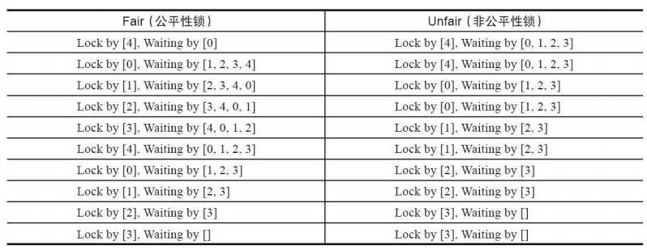

观察上表所示的结果（其中每个数字代表一个线程），**公平性锁每次都是从同步队列中的第一个节点获取到锁，而非公平性锁出现了一个线程连续获取锁的情况。** 

为什么会出现线程连续获取锁的情况呢？回顾 `nonfairTryAcquire(int acquires)` 方法，**当一个线程请求锁时，只要获取了同步状态即成功获取锁。在这个前提下，刚释放锁的线程再次获取同步状态的几率会非常大，使得其他线程只能在同步队列中等待。**


> 非公平性锁可能使线程“饥饿”，为什么它又被设定成默认的实现呢？

再次观察上表的结果，如果把每次不同线程获取到锁定义为 1 次切换，公平性锁在测试中进行了 10 次切换，而非公平性锁只有 5 次切换，这说明**非公平性锁的开销更小。公平性锁保证了锁的获取按照 FIFO 原则，而代价是进行大量的线程切换。非公平性锁虽然可能造成线程“饥饿”，但极少的线程切换，保证了其更大的吞吐量。**


## 5.4 读写锁

前面提到的锁（如 Mutex 和 ReentrantLock）基本都是**排他锁**，这些锁**在同一时刻只允许一个线程进行访问**，而**读写锁在同一时刻可以允许多个读线程访问，但是在写线程访问时，所有的读线程和其他写线程均被阻塞。**读写锁维护了一对锁，一个读锁和一个写锁，通过分离读锁和写锁，使得并发性相比一般的排他锁有了很大提升。 


除了保证写操作对读操作的可见性以及并发性的提升之外，读写锁能够**简化读写交互场景的编程方式**。

> 假设在程序中定义一个共享的用作缓存的数据结构，它大部分时间提供读服务（例如查询和搜索），而写操作占有的时间很少，但是写操作完成之后的更新需要对后续的读服务可见。 

- 在没有读写锁支持的（Java 5 之前）时候，如果需要完成上述工作就要使用 Java 的等待通知机制，就是当写操作开始时，所有晚于写操作的读操作均会进入等待状态，只有写操作完成并进行通知之后，所有等待的读操作才能继续执行（写操作之间依靠 synchronized 关键字进行同步），这样做的目的是使读操作能读取到正确的数据，不会出现脏读。

- 改用读写锁实现上述功能，只需要在读操作时获取读锁，写操作时获取写锁即可。当写锁被获取到时，后续（非当前写操作线程）的读写操作都会被阻塞，写锁释放之后，所有操作继续执行，编程方式相对于使用等待通知机制的实现方式而言，变得简单明了。


一般情况下，读写锁的性能都会比排他锁好，因为大多数场景读是多于写的。**在读多于写的情况下，读写锁能够提供比排它锁更好的并发性和吞吐量。**Java 并发包提供读写锁的实现是 **ReentrantReadWriteLock**，它提供的特性如下表所示：

 


### 5.4.1 读写锁的接口与示例

**ReadWriteLock** 仅定义了获取读锁和写锁的两个方法，即 `readLock()` 方法和 `writeLock()` 方法，而其实现—— **ReentrantReadWriteLock**，除了接口方法之外，还提供了一些便于外界监控其内部工作状态的方法，这些方法以及描述如下表所示：

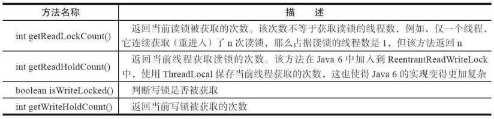


下面通过一个缓存示例说明读写锁的使用方式，示例代码如下所示：

Cache.java：

```java
public class Cache {
    static Map<String, Object> map = new HashMap<String, Object>();
    static ReentrantReadWriteLock rwl = new ReentrantReadWriteLock();
    static Lock r = rwl.readLock();
    static Lock w = rwl.writeLock(); // 获取一个 key 对应的 value
    
    public static final Object get(String key) {
        r.lock();
        try {
        	return map.get(key);
        } finally {
        	r.unlock();
        }
    }
    
    // 设置 key 对应的 value，并返回旧的 value
    public static final Object put(String key, Object value) {
        w.lock();
        try {
        	return map.put(key, value);
        } finally {
        	w.unlock();
        }
    }
    
    // 清空所有的内容
    public static final void clear() {
        w.lock();
        try {
        	map.clear();
        } finally {
        	w.unlock();
        }
    } 
}
```

Cache 组合一个非线程安全的 HashMap 作为缓存的实现，同时使用读写锁的读锁和写锁来保证 Cache 是线程安全的。在读操作 `get(String key)` 方法中，需要获取读锁，这使得**并发访问该方法时不会被阻塞**。写操作 `put(String key,Object value)` 方法和 `clear()` 方法，在更新 HashMap 时必须提前获取写锁，当获取写锁后，其他线程对于读锁和写锁的获取均被阻塞，而只有写锁被释放之后，其他读写操作才能继续。Cache 使用读写锁提升读操作的并发性，也保证每次写操作对所有的读写操作的可见性，同时简化了编程方式。 


### 5.4.2 读写锁的实现分析

> **ReentrantReadWriteLock**

#### 1）读写状态的设计

读写锁同样依赖**自定义同步器**来实现同步功能，而读写状态就是其同步器的同步状态。 

>回想 ReentrantLock 中自定义同步器的实现，同步状态表示锁被一个线程重复获取的次数；而读写锁的自定义同步器需要**在同步状态（一个整型变量）上维护多个读线程和一个写线程的状态**，使得该状态的设计成为读写锁实现的关键。 


如果在一个整型变量上维护多种状态，就一定需要“**按位切割使用**”这个变量，读写锁将变量切分成了两个部分，**高 16 位表示读，低 16 位表示写**，划分方式如图所示：

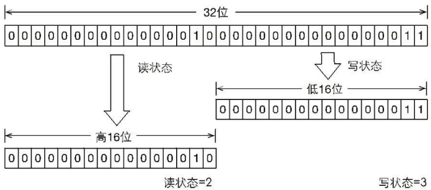

上图读写锁状态的划分方式当前同步状态表示一个线程已经获取了写锁，且重进入了两次，同时也连续获取了两次读锁。

读写锁是如何迅速确定读和写各自的状态呢？答案是通过**位运算**。假设当前同步状态值为 S，写状态等于 `S&0x0000FFFF`（将高 16 位全部抹去），读状态等于 `S>>>16`（无符号补 0 右移 16 位）。当写状态增加 1 时，等于 `S+1`，当读状态增加 1 时，等于 `S+(1<<16)`，也就是 `S+0x00010000`。 

根据状态的划分能得出一个推论：S 不等于 0 时，当写状态（`S&0x0000FFFF`）等于 0 时，则读状态（`S>>>16`）大于 0，即读锁已被获取。


#### 2）写锁的获取与释放

**写锁是一个支持重进入的排他锁**。**如果当前线程已经获取了写锁，则增加写状态。如果当前线程在获取写锁时，读锁已经被获取（读状态不为 0）或者该线程不是已经获取写锁的线程，则当前线程进入等待状态**，获取写锁的代码如下所示：

ReentrantReadWriteLock 的 tryAcquire 方法：

```java
protected final boolean tryAcquire(int acquires) {
    Thread current = Thread.currentThread();
    int c = getState();
    int w = exclusiveCount(c);
    if (c != 0) {
        // 存在读锁或者当前获取线程不是已经获取写锁的线程
        if (w == 0 || current != getExclusiveOwnerThread()) return false;
        if (w + exclusiveCount(acquires) > MAX_COUNT) throw new Error("Maximum lock 
        count exceeded");
        setState(c + acquires);
        return true;
    }
    if (writerShouldBlock() || !compareAndSetState(c, c + acquires)) {
    	return false;
    }
    setExclusiveOwnerThread(current);
    return true; 
}
```

该方法除了重入条件（当前线程为获取了写锁的线程）之外，增加了一个读锁是否存在的判断。如果存在读锁，则写锁不能被获取，原因在于：**读写锁要确保写锁的操作对读锁可见，如果允许读锁在已被获取的情况下对写锁的获取，那么正在运行的其他读线程就无法感知到当前写线程的操作。**因此，只有等待其他读线程都释放了读锁，写锁才能被当前线程获取，而写锁一旦被获取，则其他读写线程的后续访问均被阻塞。 

写锁的释放与 ReentrantLock 的释放过程基本类似，**每次释放均减少写状态，当写状态为 0 时表示写锁已被释放，从而等待的读写线程能够继续访问读写锁，同时前次写线程的修改对后续读写线程可见。**


#### 3）读线程的获取与释放

**读锁是一个支持重进入的共享锁**，它能够被多个线程同时获取，在没有其他写线程访问（或者写状态为 0）时，读锁总会被成功地获取，而所做的也只是（线程安全的）增加读状态。**如果当前线程已经获取了读锁，则增加读状态。如果当前线程在获取读锁时，写锁已被其他线程获取，则进入等待状态。**

> 获取读锁的实现从 Java 5 到 Java 6 变得复杂许多，主要原因是新增了一些功能，例如 `getReadHoldCount()` 方法，作用是返回当前线程获取读锁的次数。

**读状态是所有线程获取读锁次数的总和，而每个线程各自获取读锁的次数只能选择保存在 ThreadLocal 中，由线程自身维护**，这使获取读锁的实现变得复杂。因此，这里将获取读锁的代码做了删减，保留必要的部分，如代码清单所示：

ReentrantReadWriteLock 的 tryAcquireShared 方法：

```java
protected final int tryAcquireShared(int unused) {
    for (; ; ) {
        int c = getState();
        int nextc = c + (1 << 16);
        if (nextc < c) throw new Error("Maximum lock count exceeded");
        if (exclusiveCount(c) != 0 && owner != Thread.currentThread()) return -1;
        if (compareAndSetState(c, nextc)) return 1;
    } 
}
```

在 `tryAcquireShared(int unused)` 方法中，如果其他线程已经获取了写锁，则当前线程获取读锁失败，进入等待状态。如果当前线程获取了写锁或者写锁未被获取，则当前线程（线程安全，依靠 CAS 保证）增加读状态，成功获取读锁。 

**读锁的每次释放（线程安全的，可能有多个读线程同时释放读锁）均减少读状态，减少的值是（`1<<16`）。** 


#### 4）锁降级

锁降级指的是**写锁降级成为读锁**。如果当前线程拥有写锁，然后将其释放，最后再获取读锁，这种分段完成的过程不能称之为锁降级。锁降级是指**把持住（当前拥有的）写锁，再获取到读锁，随后释放（先前拥有的）写锁的过程。** 


下面看一个锁降级的示例。因为数据不常变化，所以多个线程可以并发地进行数据处理，当数据变更后，如果当前线程感知到数据变化，则进行数据的准备工作，同时其他处理线程被阻塞，直到当前线程完成数据的准备工作，如代码清单所示：

processData 方法：

```java
public void processData() {
    readLock.lock();
    if (!update) {
        // 必须先释放读锁
        readLock.unlock();
        // 锁降级从写锁获取到开始
        writeLock.lock();
        try {
            if (!update) {
            // 准备数据的流程（略）
            update = true;
            }
            readLock.lock();
        } finally {
        	writeLock.unlock();
        }
        // 锁降级完成，写锁降级为读锁
    }
    try { // 使用数据的流程（略）
    } finally {
    	readLock.unlock();
    } 
}
```

上述示例中，当数据发生变更后，update 变量（布尔类型且 volatile 修饰）被设置为 false，此时所有访问 `processData()` 方法的线程都能够感知到变化，但只有一个线程能够获取到写锁，其他线程会被阻塞在读锁和写锁的 `lock()` 方法上。当前线程获取写锁完成数据准备之后，再获取读锁，随后释放写锁，完成锁降级。 

锁降级中读锁的获取是否必要呢？答案是必要的。主要是**为了保证数据的可见性，如果当前线程不获取读锁而是直接释放写锁，假设此刻另一个线程（记作线程 T）获取了写锁并修改了数据，那么当前线程无法感知线程 T 的数据更新。如果当前线程获取读锁，即遵循锁降级的步骤，则线程 T 将会被阻塞，直到当前线程使用数据并释放读锁之后，线程 T 才能获取写锁进行数据更新。**


> RentrantReadWriteLock 不支持锁升级（把持读锁、获取写锁，最后释放读锁的过程）。目的也是保证数据可见性，如果读锁已被多个线程获取，其中任意线程成功获取了写锁并更新了数据，则其更新对其他获取到读锁的线程是不可见的。 


## 5.5 LockSupport 工具

当需要阻塞或唤醒一个线程的时候，都会使用 LockSupport 工具类来完成相应工作。LockSupport 定义了一组的公共静态方法，这些方法提供了最基本的线程阻塞和唤醒功能，而 LockSupport 也成为构建同步组件的基础工具。 

LockSupport 定义了一组以 `park` 开头的方法用来阻塞当前线程，以及 `unpark(Thread thread)` 方法来唤醒一个被阻塞的线程。这些方法以及描述如下表所示：

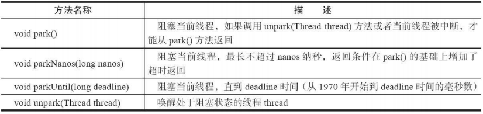 

在 Java 6 中，LockSupport 增加了 `park(Object blocker)`、`parkNanos(Object blocker,long nanos)` 和 `parkUntil(Object blocker,long deadline)` 3 个方法，用于实现阻塞当前线程的功能，其中**参数 blocker 是用来标识当前线程在等待的对象（以下称为阻塞对象），该对象主要用于问题排查和系统监控。** 


blocker 在线程 线程 dump 中的作用：

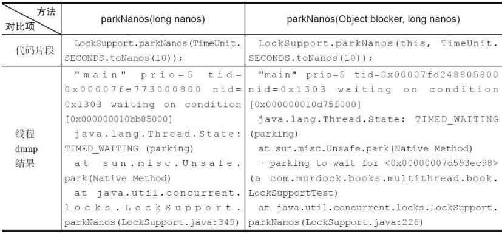

从表中的线程 dump 结果可以看出，代码片段的内容都是阻塞当前线程 10 秒，但从线程 dump 结果可以看出，有阻塞对象的 `parkNanos` 方法能够传递给开发人员更多的现场信息。

> 这是由于在 Java 5 之前，当线程阻塞（使用 synchronized 关键字）在一个对象上时，通过线程 dump 能够查看到该线程的阻塞对象，方便问题定位，而 Java 5 推出的 Lock 等并发工具时却遗漏了这一点，致使在线程 dump 时无法提供阻塞对象的信息。因此，在 Java 6 中，LockSupport 新增了上述 3 个含有阻塞对象的 park 方法，用以替代原有的 park 方法。


## 5.6 Condition 接口

> 任意一个 Java 对象，都拥有一组监视器方法（定义在 java.lang.Object 上），主要包括 `wait()`、 `wait(long timeout)`、`notify()` 以及 `notifyAll()` 方法，这些方法与 synchronized 同步关键字配合，可以实现等待/通知模式。Condition 接口也提供了类似 Object 的监视器方法，与 Lock 配合可以实现等待/通知模式，但是这两者在使用方式以及功能特性上还是有差别的。 


通过对比 Object 的监视器方法和 Condition 接口，可以更详细地了解 Condition 的特性，对比项与结果如下表所示：

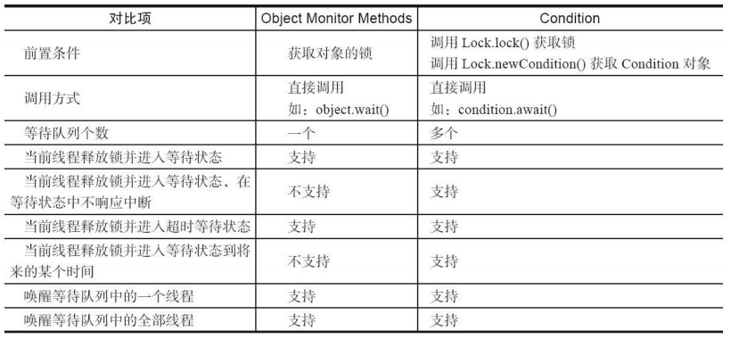


### 5.6.1 Condition 接口与示例

Condition 定义了等待/通知两种类型的方法，当前线程调用这些方法时，需要提前获取到 Condition 对象关联的锁。Condition 对象是由 Lock 对象（调用 Lock 对象的 `newCondition()` 方法）创建出来的，换句话说，**Condition 是依赖 Lock 对象的**。 


Condition 的使用方式比较简单，需要注意**在调用方法前获取锁**，使用方式如代码清单所示：
ConditionUseCase.java：

```java
Lock lock = new ReentrantLock();
Condition condition = lock.newCondition();

public void conditionWait() throws InterruptedException {
    lock.lock();
    try {
    	condition.await();
    } finally {
    	lock.unlock();
    } 
}

public void conditionSignal() throws InterruptedException {
    lock.lock();
    try {
    	condition.signal();
    } finally {
    	lock.unlock();
    } 
}
```

如示例所示，**一般都会将 Condition 对象作为成员变量。**当调用 `await()` 方法后，当前线程会释放锁并在此等待，而其他线程调用 Condition 对象的 `signal()` 方法，通知当前线程后，当前线程才从 `await()` 方法返回，并且在返回前已经获取了锁。

Condition 定义的（部分）方法以及描述如下表所示： 

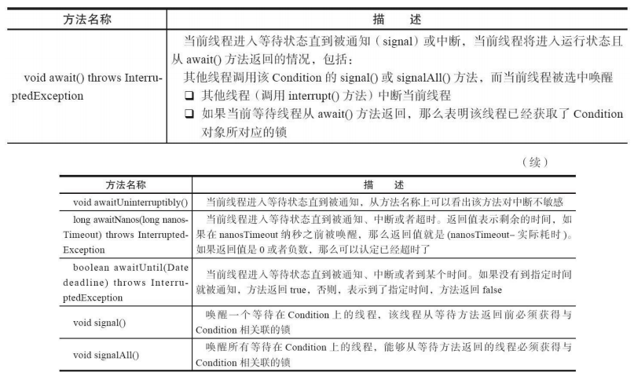


***

获取一个 Condition 必须通过 Lock 的 `newCondition()` 方法。下面通过一个**有界队列**的示例来深入了解 Condition 的使用方式。有界队列是一种特殊的队列，**当队列为空时，队列的获取操作将会阻塞获取线程，直到队列中有新增元素，当队列已满时，队列的插入操作将会阻塞插入线程，直到队列出现“空位”**，如代码清单所示。 

BoundedQueue.java：

```java
public class BoundedQueue<T> {
    private Object[] items;
    // 添加的下标，删除的下标和数组当前数量
    private int addIndex, removeIndex, count;
    private Lock lock = new ReentrantLock();
    private Condition notEmpty = lock.newCondition();
    private Condition notFull = lock.newCondition();
    
    public BoundedQueue(int size) {
    	items = new Object[size];
    }
    
    // 添加一个元素，如果数组满，则添加线程进入等待状态，直到有"空位"
    public void add(T t) throws InterruptedException {
        lock.lock();
        try {
            while (count == items.length) notFull.await();
            items[addIndex] = t;
            if (++addIndex == items.length) addIndex = 0;
            ++count;
            notEmpty.signal();
        } finally {
        	lock.unlock();
        }
    }
    
    // 由头部删除一个元素，如果数组空，则删除线程进入等待状态，直到有新添加元素
    @SuppressWarnings("unchecked")
    public T remove() throws InterruptedException {
        lock.lock();
        try {
            while (count == 0) notEmpty.await();
            Object x = items[removeIndex];
            if (++removeIndex == items.length) removeIndex = 0;
            --count;
            notFull.signal();
            return (T) x;
        } finally {
        	lock.unlock();
        }
    } 
}
```

BoundedQueue 通过 `add(T t)` 方法添加一个元素，通过 `remove()` 方法移出一个元素。以添加方法为例：

首先需要获得锁，目的是确保数组修改的可见性和排他性。当数组数量等于数组长度时，表示数组已满，则调用 `notFull.await()`，当前线程随之释放锁并进入等待状态。如果数组数量不等于数组长度，表示数组未满，则添加元素到数组中，同时通知等待在 notEmpty 上的线程，数组中已经有新元素可以获取。

> 在添加和删除方法中使用 while 循环而非 if 判断，目的是防止过早或意外的通知，只有条件符合才能够退出循环。回想之前提到的等待/通知的经典范式，二者是非常类似的。


### 5.6.2 Condition 的实现分析

**ConditionObject** 是同步器 **AbstractQueuedSynchronizer** 的内部类，因为 Condition 的操作需要获取相关联的锁，所以作为同步器的内部类也较为合理。**每个 Condition 对象都包含着一个队列**（以下称为**等待队列**），该队列是 Condition 对象实现等待/通知功能的关键。


#### 1）等待队列

等待队列是一个 **FIFO** 的队列，在队列中的每个节点都包含了一个线程引用，该线程就是在 Condition 对象上等待的线程，如果一个线程调用了 `Condition.await()` 方法，那么该线程将会释放锁、构造成节点加入等待队列并进入等待状态。事实上，节点的定义复用了同步器中节点的定义，也就是说，**同步队列和等待队列中节点类型都是同步器的静态内部类 AbstractQueuedSynchronizer.Node**。

**一个 Condition 包含一个等待队列**，Condition 拥有首节点（firstWaiter）和尾节点（lastWaiter）。当前线程调用 `Condition.await()` 方法，将**会以当前线程构造节点，并将节点从尾部加入等待队列**，等待队列的基本结构如图所示：

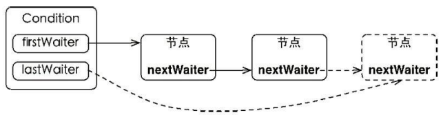

Condition 拥有首尾节点的引用，而新增节点只需要将原有的尾节点 nextWaiter 指向它，并且更新尾节点即可。上述节点引用更新的过程并没有使用 CAS 保证，原因在于**调用 `await()` 方法的线程必定是获取了锁的线程，也就是说该过程是由锁来保证线程安全的。** 


在 Object 的监视器模型上，一个对象拥有一个同步队列和等待队列，而**并发包中的 Lock（更确切地说是同步器）拥有一个同步队列和多个等待队列**，其对应关系如下图所示：

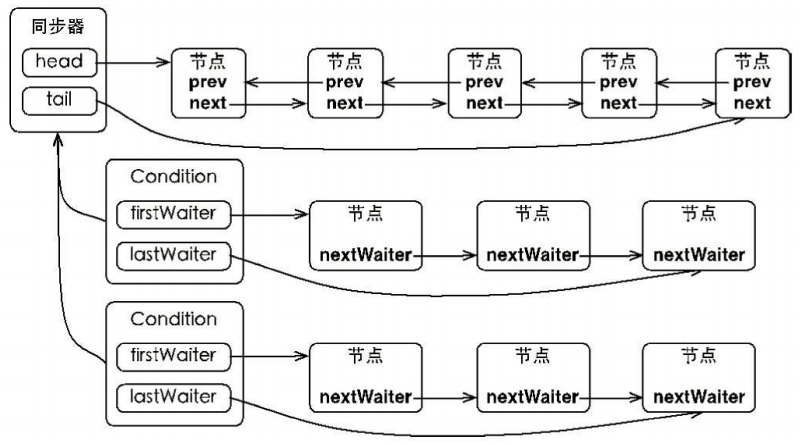

> 如图所示，Condition 的实现是同步器的内部类，因此每个 Condition 实例都能够访问同步器提供的方法，相当于每个 Condition 都拥有所属同步器的引用。


#### 2）等待

调用 Condition 的 `await()` 方法（或者以 await 开头的方法），会使当前线程进入等待队列并释放锁，同时线程状态变为等待状态。当从 `await()` 方法返回时，当前线程一定获取了 Condition 相关联的锁。如果从队列（同步队列和等待队列）的角度看 `await()` 方法，当调用 `await()` 方法时，相当于同步队列的首节点（获取了锁的节点）移动到 Condition 的等待队列中。 


Condition 的 `await()` 方法，如代码清单所示：

ConditionObject 的 await 方法：

```java
public final void await() throws InterruptedException {
     if (Thread.interrupted()) throw new InterruptedException();
     // 当前线程加入等待队列
     Node node = addConditionWaiter();
     // 释放同步状态，也就是释放锁
     int savedState = fullyRelease(node);
     int interruptMode = 0;
     while (!isOnSyncQueue(node)) {
         LockSupport.park(this);
         if ((interruptMode = checkInterruptWhileWaiting(node)) != 0) break;
     }
     if (acquireQueued(node, savedState) && interruptMode != THROW_IE) interruptMode 
    = REINTERRUPT;
     if (node.nextWaiter != null) unlinkCancelledWaiters();
     if (interruptMode != 0) reportInterruptAfterWait(interruptMode);
}
```

**调用该方法的线程是成功获取了锁的线程，也就是同步队列中的首节点，该方法会将当前线程构造成节点并加入等待队列中，然后释放同步状态，唤醒同步队列中的后继节点，然后当前线程会进入等待状态。** 

当等待队列中的节点被唤醒，则唤醒节点的线程开始尝试获取同步状态。如果不是通过其他线程调用 `Condition.signal()` 方法唤醒，而是对等待线程进行中断，则会抛出 InterruptedException。 


如果从队列的角度去看，当前线程加入 Condition 的等待队列，该过程如下面图示。同步队列的首节点并不会直接加入等待队列，而是通过 `addConditionWaiter()` 方法把当前线程构造成一个新的节点并将其加入等待队列中。

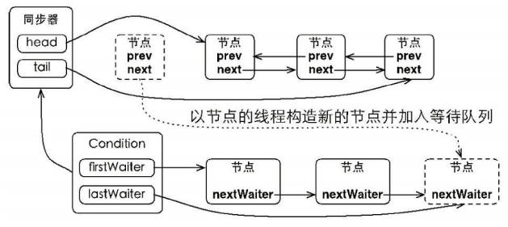


#### 3）通知

调用 Condition 的 `signal()` 方法，将会唤醒在等待队列中**等待时间最长**的节点（**首节点**），**在唤醒节点之前，会将节点移到同步队列中。**

Condition 的 `signal()` 方法，如代码清单所示：

ConditionObject 的 signal 方法：

```java
public final void signal() {
    if (!isHeldExclusively()) throw new IllegalMonitorStateException();
    Node first = firstWaiter;
    if (first != null) doSignal(first);
}
```

调用该方法的前置条件是**当前线程必须获取了锁**，可以看到 `signal()` 方法进行了 `isHeldExclusively()` 检查，也就是当前线程必须是获取了锁的线程。**接着获取等待队列的首节点，将其移动到同步队列并使用 LockSupport 唤醒节点中的线程。**节点从等待队列移动到同步队列的过程如图所示：

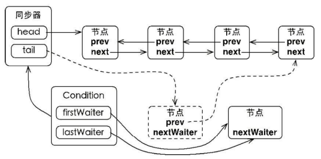

通过调用同步器的 `enq(Node node)` 方法，等待队列中的头节点线程安全地移动到同步队列。当节点移动到同步队列后，当前线程再使用 LockSupport 唤醒该节点的线程。 

被唤醒后的线程，将从 `await()` 方法中的 while 循环中退出（`isOnSyncQueue(Node node)` 方法返回 true，节点已经在同步队列中），进而调用同步器的 `acquireQueued()` 方法加入到获取同步状态的竞争中。

成功获取同步状态（或者说锁）之后，被唤醒的线程将从先前调用的 `await()` 方法返回，此时该线程已经成功地获取了锁。

Condition 的 `signalAll()` 方法，相当于对等待队列中的每个节点均执行一次 `signal()` 方法，效果就是将等待队列中所有节点全部移动到同步队列中，并唤醒每个节点的线程。


# 6. Java 并发容器和框架【重点】


## 6.1 ConcurrentHashMap 的实现原理与使用

ConcurrentHashMap 是**线程安全且高效**的 HashMap。

### 6.1.1 为什么要使用 ConcurrentHashMap

在并发编程中使用 HashMap 可能导致程序死循环。而使用线程安全的 HashTable 效率又非常低下，基于以上两个原因，便有了 ConcurrentHashMap 的登场机会。


#### 1）线程不安全的 HashMap

**在多线程环境下，使用 HashMap 进行 put 操作会引起死循环，导致 CPU 利用率接近 100%**，所以在并发情况下不能使用 HashMap。例如，执行以下代码会引起死循环。

```java
final HashMap<String, String> map = new HashMap<String, String>(2);
Thread t = new Thread(new Runnable() {
    @Override
    public void run() {
        for (int i = 0; i < 10000; i++) {
            new Thread(new Runnable() {
                @Override
                public void run() {
                	map.put(UUID.randomUUID().toString(), "");
                }
            }, "ftf" + i).start();
        }
    }
}, "ftf");
t.start();
t.join();
```

HashMap 在并发执行 put 操作时会引起死循环，是因为**多线程会导致 HashMap 的 Entry 链表形成环形数据结构，一旦形成环形数据结构，Entry 的 next 节点永远不为空，就会产生死循环获取 Entry。**


#### 2）效率低下的 HashTable

**HashTable 容器使用 synchronized 来保证线程安全**，但在线程竞争激烈的情况下 HashTable 的效率非常低下。因为**当一个线程访问 HashTable 的同步方法，其他线程也访问 HashTable 的同步方法时，会进入阻塞或轮询状态。**如线程 1 使用 put 进行元素添加，线程 2 不但不能使用 put 方法添加元素，也不能使用 get 方法来获取元素，所以竞争越激烈效率越低。 


#### 3）ConcurrentHashMap 的锁分段技术可有效提升并发访问率

HashTable 容器在竞争激烈的并发环境下表现出效率低下的原因是所有访问 HashTable 的线程都必须竞争同一把锁；

假如容器里有多把锁，每一把锁用于锁容器其中一部分数据，那么当多线程访问容器里不同数据段的数据时，线程间就不会存在锁竞争，从而可以有效提高并发访问效率，这就是 ConcurrentHashMap 所使用的**锁分段技术**。**首先将数据分成一段一段地存储，然后给每一段数据配一把锁，当一个线程占用锁访问其中一个段数据的时候，其他段的数据也能被其他线程访问。** 


### 6.1.2 ConcurrentHashMap 的结构

通过 ConcurrentHashMap 的**类图**来分析 ConcurrentHashMap 的结构，如下图所示：


ConcurrentHashMap**（JDK 1.7）**是由 **Segment 数组结构**和 **HashEntry 数组结构**组成。**Segment 是一种可重入锁（ReentrantLock），在 ConcurrentHashMap 里扮演锁的角色；HashEntry 则用于存储键值对数据**。**一个 ConcurrentHashMap 里包含一个 Segment 数组。**Segment 的结构和 HashMap 类似，是一种数组和链表结构。**一个 Segment 里包含一个 HashEntry 数组，每个 HashEntry 是一个链表结构的元素，每个 Segment 守护着一个 HashEntry 数组里的元素，当对 HashEntry 数组的数据进行修改时，必须首先获得与它对应的 Segment 锁**，如下图所示：


 

### 6.1.3 ConcurrentHashMap 的初始化

ConcurrentHashMap 初始化方法是通过 `initialCapacity`、`loadFactor` 和 `concurrencyLevel` 等几个参数来初始化 **segment 数组**、**段偏移量 segmentShift**、**段掩码 segmentMask** 和每个 segment 里的 **HashEntry 数组**来实现的。 

#### 1）初始化 segments 数组

源代码：

```java
if (concurrencyLevel > MAX_SEGMENTS) concurrencyLevel = MAX_SEGMENTS;
int sshift = 0;
int ssize = 1;
while (ssize < concurrencyLevel) {
    ++sshift;
    ssize <<= 1; 
}
segmentShift = 32 - sshift;
segmentMask = ssize - 1;
this.segments = Segment.newArray(ssize);
```

由上面的代码可知，segments 数组的长度 ssize 是通过 concurrencyLevel 计算得出的。为了能通过**按位与**的散列算法来定位 segments 数组的索引，**必须保证 segments 数组的长度是 2 的 N 次方（power-of-two size）**，所以必须计算出一个**大于或等于 concurrencyLevel 的最小的 2 的 N 次方值来作为 segments 数组的长度**。假如 concurrencyLevel 等于 14、15 或 16，ssize 都会等于 16，即容器里锁的个数也是 16。 

> 注意： 
>
> concurrencyLevel 的最大值是 65535，这意味着 segments 数组的长度最大为 65536，对应的二进制是 16 位。


#### 2）初始化 segmentShift(段偏移量) 和 segmentMask(段掩码)

这两个全局变量需要在定位 segment 时的散列算法里使用，**sshift 等于 ssize 从 1 向左移位的次数**，在默认情况下 concurrencyLevel 等于 16，1 需要向左移位移动 4 次，所以 sshift 等于 4。 

**segmentShift 用于定位参与散列运算的位数，segmentShift 等于 32 减 sshift，所以等于 28**，这里之所以用 32 是因为 ConcurrentHashMap 里的 `hash()` 方法输出的最大数是 32 位的，后面的测试中可以看到这点。**segmentMask 是散列运算的掩码，等于 ssize 减1，即 15**，掩码的二进制各个位的值都是 1。因为 ssize 的最大长度是 65536，所以 segmentShift 最大值是 16，segmentMask 最大值是 65535，对应的二进制是 16 位，每个位都是 1。 


#### 3）初始化每个 segment

**输入参数 `initialCapacity` 是 ConcurrentHashMap 的初始化容量，`loadfactor` 是每个 segment 的负载因子，在构造方法里需要通过这两个参数来初始化数组中的每个 segment。**

```java
if (initialCapacity > MAXIMUM_CAPACITY) initialCapacity = MAXIMUM_CAPACITY;
int c = initialCapacity / ssize;
if (c * ssize < initialCapacity)
	++c;
int cap = 1;
while (cap < c) cap <<= 1;
for (int i = 0; i < this.segments.length; ++i) {
	this.segments[i] = new Segment<K, V>(cap, loadFactor);
}
```

上面代码中的变量 `cap` 就是 segment 里 HashEntry 数组的长度，它等于 initialCapacity 除以 ssize 的倍数 c，如果 c 大于 1，就会取大于等于 c 的 2 的 N 次方值，所以 `cap` 不是 1，就是 2 的 N 次方。

segment 的容量 `threshold＝（int）cap*loadFactor`，默认情况下 initialCapacity 等于 16，loadfactor 等于 0.75，通过运算 cap 等于 1，threshold 等于零。 


### 6.1.4 定义 Segment

既然 ConcurrentHashMap 使用分段锁 Segment 来保护不同段的数据，那么在插入和获取元素的时候，必须先通过散列算法定位到 Segment。可以看到 ConcurrentHashMap 会首先使用 `Wang/Jenkins hash` 的变种算法对元素的 hashCode 进行一次再散列。

```java
private static int hash(int h) {
    h += (h << 15) ^ 0xffffcd7d;
    h ^= (h >>> 10);
    h += (h << 3);
    h ^= (h >>> 6);
    h += (h << 2) + (h << 14);
    return h ^ (h >>> 16);
}
```

之所以进行再散列，目的是**减少散列冲突**，使元素能够均匀地分布在不同的 Segment 上，从而提高容器的存取效率。假如散列的质量差到极点，那么所有的元素都在一个 Segment 中，不仅存取元素缓慢，分段锁也会失去意义。

通过再散列能**让数字的每一位都参加到散列运算当中**，从而减少散列冲突。ConcurrentHashMap 通过以下散列算法定位 segment。

```java
final Segment<K, V> segmentFor(int hash) {
	return segments[(hash >>> segmentShift) & segmentMask];
}
```

默认情况下 segmentShift 为 28，segmentMask 为 15，再散列后的数最大是 32 位二进制数据，向右无符号移动 28 位，意思是让高 4 位参与到散列运算中，`(hash>>>segmentShift) &segmentMask` 的运算结果分别是 4、15、7 和 8，可以看到散列值没有发生冲突。


### 6.1.5 ConcurrentHashMap 的操作

#### 1）get 操作

Segment 的 get 操作实现非常简单和高效。先经过一次再散列，然后使用这个散列值通过散列运算定位到 Segment，再通过散列算法定位到元素，代码如下：

```java
public V get(Object key) {
	int hash = hash(key.hashCode());
	return segmentFor(hash).get(key, hash);
}
```

get 操作的高效之处在于**整个 get 过程不需要加锁，除非读到的值是空才会加锁重读**。

***

我们知道 HashTable 容器的 get 方法是需要加锁的，那么 ConcurrentHashMap 的 get 操作是如何做到不加锁的呢？原因是**它的 get 方法里将要使用的共享变量都定义成 volatile 类型**，如用于统计当前 Segement 大小的 count 字段和用于存储值的 HashEntry 的 value。

```java
transient volatile int count;
volatile V value;
```

**定义成 volatile 的变量，能够在线程之间保持可见性，能够被多线程同时读，并且保证不会读到过期的值，但是只能被单线程写**（有一种情况可以被多线程写，就是写入的值不依赖于原值），在 get 操作里只需要读不需要写共享变量 count 和 value，所以可以不用加锁。之所以不会读到过期的值，是因为**根据 Java 内存模型的 happen before 原则，对 volatile 字段的写入操作先于读操作，即使两个线程同时修改和获取 volatile 变量，get 操作也能拿到最新的值，这是用 volatile 替换锁的经典应用场景。** 

***

```java
hash >>> segmentShift) &segmentMask // 定位 Segment 所使用的 hash 算法
int index = hash & (tab.length - 1); // 定位 HashEntry 所使用的 hash 算法
```

在定位元素的代码里可以发现，定位 HashEntry 和定位 Segment 的散列算法虽然一样，都与数组的长度减去 1 再相“与”，但是相“与”的值不一样，定位 Segment 使用的是元素的 hashcode 通过再散列后得到的值的高位，而定位 HashEntry 直接使用的是再散列后的值。其目的是避免两次散列后的值一样，虽然元素在 Segment 里散列开了，但是却没有在 HashEntry 里散列开。 


#### 2）put 操作

由于 put 方法里需要对共享变量进行写入操作，所以为了线程安全，在操作共享变量时必须加锁。**put 方法首先定位到 Segment，然后在 Segment 里进行插入操作。插入操作需要经历两个步骤，第一步判断是否需要对 Segment 里的 HashEntry 数组进行扩容，第二步定位添加元素的位置，然后将其放在 HashEntry 数组里。**

##### a. 是否需要扩容

在插入元素前会先判断 Segment 里的 HashEntry 数组是否超过容量（threshold），如果超过阈值，则对数组进行扩容。值得一提的是，Segment 的扩容判断比 HashMap 更恰当，因为 HashMap 是在插入元素后判断元素是否已经到达容量的，如果到达了就进行扩容，但是很有可能扩容之后没有新元素插入，这时 HashMap 就进行了一次无效的扩容。

##### b. 如何扩容

在扩容的时候，首先会创建一个**容量是原来容量两倍的数组**，然后**将原数组里的元素进行再散列后插入到新的数组里**。为了高效，**ConcurrentHashMap 不会对整个容器进行扩容，而只对某个 segment 进行扩容。** 


#### 3）size 操作

如果要统计整个 ConcurrentHashMap 里元素的大小，就必须统计所有 Segment 里元素的大小后求和。Segment 里的全局变量 count 是一个 volatile 变量，那么在多线程场景下，是不是直接把所有 Segment 的 count 相加就可以得到整个 ConcurrentHashMap 大小了呢？不是的，虽然相加时可以获取每个 Segment 的 count 的最新值，但是可能累加前使用的 count 发生了变化，那么统计结果就不准了。所以，最安全的做法是在统计 size 的时候把所有 Segment 的 put、remove 和 clean 方法全部锁住，但是这种做法显然非常低效。

因为在累加 count 操作过程中，之前累加过的 count 发生变化的几率非常小，所以 ConcurrentHashMap 的做法是**先尝试 2 次通过不锁住 Segment 的方式来统计各个 Segment 大小，如果统计的过程中，容器的 count 发生了变化，则再采用加锁的方式来统计所有 Segment 的大小。**

那么 ConcurrentHashMap 是如何判断在统计的时候容器是否发生了变化呢？使用 **modCount 变量**，**在 put、remove 和 clean 方法里操作元素前都会将变量 modCount 进行加 1**，那么在统计 size 前后比较 modCount 是否发生变化，从而得知容器的大小是否发生变化。


## 6.2 ConcurrentLinkedQueue

在并发编程中，有时候需要使用线程安全的队列。如果要实现一个线程安全的队列有两种方式：一种是使用阻塞算法，另一种是使用非阻塞算法。使用阻塞算法的队列可以用一个锁（入队和出队用同一把锁）或两个锁（入队和出队用不同的锁）等方式来实现。非阻塞的实现方式则可以使用循环 CAS 的方式来实现。

**ConcurrentLinkedQueue 是一个基于链接节点的无界线程安全队列**，它采用**先进先出**的规则对节点进行排序，当我们添加一个元素的时候，它会添加到队列的尾部；当我们获取一个元素时，它会返回队列头部的元素。它采用了“**wait-free**”算法（即 CAS 算法）来实现。


### 6.2.1 ConcurrentLinkedQueue 的结构

通过 ConcurrentLinkedQueue 的类图来分析一下它的结构：


ConcurrentLinkedQueue 由 head 节点和 tail 节点组成，每个节点（Node）由节点元素（item）和指向下一个节点（next）的引用组成，节点与节点之间就是通过这个 next 关联起来，从而组成一张链表结构的队列。**默认情况下 head 节点存储的元素为空，tail 节点等于 head 节点。**

```java
private transient volatile Node<E> tail = head;
```

 

### 6.2.2 入队列

#### 1）入队列的过程

入队列就是**将入队节点添加到队列的尾部**。

为了方便理解入队时队列的变化，以及 head 节点和 tail 节点的变化，这里以一个示例来展开介绍。假设在一个队列中依次插入 4 个节点，为了便于理解，每添加一个节点就做了一个队列的快照图，如图所示。 


- 添加元素 1。队列更新 head 节点的 next 节点为元素 1 节点。又因为 tail 节点默认情况下等于 head 节点，所以它们的 next 节点都指向元素 1 节点。 

- 添加元素 2。队列首先设置元素 1 节点的 next 节点为元素 2 节点，然后更新 tail 节点指向元素 2 节点。

- 添加元素 3，设置 tail 节点的 next 节点为元素 3 节点。 

- 添加元素 4，设置元素 3 的 next 节点为元素 4 节点，然后将 tail 节点指向元素 4 节点。

通过调试入队过程并观察 head 节点和 tail 节点的变化，发现入队主要做两件事情：第一是**将入队节点设置成当前队列尾节点的下一个节点**；第二是**更新 tail 节点**，如果 tail 节点的 next 节点不为空，则将入队节点设置成 tail 节点，如果 tail 节点的 next 节点为空，则将入队节点设置成 tail 的 next 节点，所以 **tail 节点不总是尾节点**。 


通过对上面的分析，我们从单线程入队的角度理解了入队过程，但是多个线程同时进行入队的情况就变得更加复杂了，因为可能会出现其他线程插队的情况。**如果有一个线程正在入队，那么它必须先获取尾节点，然后设置尾节点的下一个节点为入队节点，但这时可能有另外一个线程插队了，那么队列的尾节点就会发生变化，这时当前线程要暂停入队操作，然后重新获取尾节点。**通过源码来详细分析一下它是如何使用 CAS 算法来入队的：

```java
public boolean offer(E e) {
    if (e == null) throw new NullPointerException();
    // 入队前，创建一个入队节点
    Node<E> n = new Node<E>(e);
    retry:
    // 死循环，入队不成功反复入队。
    for (; ; ) {
        // 创建一个指向 tail 节点的引用
        Node<E> t = tail;
        // p 用来表示队列的尾节点，默认情况下等于 tail 节点。
        Node<E> p = t;
        for (int hops = 0; ; hops++) { // 获得 p 节点的下一个节点。
            Node<E> next = succ(p);
            // next 节点不为空，说明 p 不是尾节点，需要更新 p 后在将它指向 next 节点
            if (next != null) {
                // 循环了两次及其以上，并且当前节点还是不等于尾节点
                if (hops > HOPS && t != tail) continue retry;
                p = next;
            }
            // 如果 p 是尾节点，则设置 p 节点的 next 节点为入队节点。
            else if (p.casNext(null, n)) {
                /*如果 tail 节点有大于等于 1 个 next 节点，则将入队节点设置成 tail 节点， 
                更新失败了也没关系，因为失败了表示有其他线程成功更新了 tail 节点*/
                if (hops >= HOPS)
                	casTail(t, n); // 更新 tail 节点，允许失败
                return true;
            }
            // p 有 next 节点,表示 p 的 next 节点是尾节点，则重新设置 p 节点
            else {
            	p = succ(p);
            }
        }
    } 
}
```

从源代码角度来看，整个入队过程主要做两件事情：第一是**定位出尾节点**；第二是**使用 CAS 算法将入队节点设置成尾节点的 next 节点，如不成功则重试。**


#### 2）定位尾节点

tail 节点并不总是尾节点，所以每次入队都必须先通过 tail 节点来找到尾节点。**尾节点可能是 tail 节点，也可能是 tail 节点的 next 节点。**代码中循环体中的第一个 if 就是判断 tail 是否有 next 节点，有则表示 next 节点可能是尾节点。获取 tail 节点的 next 节点需要注意的是 p 节点等于 p 的 next 节点的情况，只有一种可能就是 p 节点和 p 的 next 节点都等于空，表示这个队列刚初始化，正准备添加节点，所以需要返回 head 节点。

获取 p 节点的 next 节点代码如下：

```java
final Node<E> succ(Node<E> p) {
	Node<E> next = p.getNext();
	return (p == next) head:
	next; 
}
```


#### 3）设置入队节点为尾节点

`p.casNext(null，n)` 方法用于将入队节点设置为当前队列尾节点的 next 节点，如果 p 是 null，表示 p 是当前队列的尾节点，如果不为 null，表示有其他线程更新了尾节点，则需要重新获取当前队列的尾节点。


#### 4）HOPS 的设计意图

```java
private static final int HOPS = 1;
```

使用 hops 变量来**控制并减少 tail 节点的更新频率**，并不是每次节点入队后都将 tail 节点更新成尾节点，而是当 tail 节点和尾节点的距离大于等于常量 HOPS 的值（默认等于 1）时才更新 tail 节点，tail 和尾节点的距离越长，使用 CAS 更新 tail 节点的次数就会越少，但是距离越长带来的负面效果就是每次入队时定位尾节点的时间就越长，因为循环体需要多循环一次来定位出尾节点，但是这样仍然能提高入队的效率，因为从本质上来看它**通过增加对 volatile 变量的读操作来减少对 volatile 变量的写操作，而对 volatile 变量的写操作开销要远远大于读操作，所以入队效率会有所提升。** 

> **注意：**入队方法永远返回 true，所以不要通过返回值判断是否成功。


### 6.2.3 出队列

出队列的就是**从队列里返回一个节点元素，并清空该节点对元素的引用。**

通过每个节点出队的快照来观察一下 head 节点的变化，如图所示：


从图中可知，**并不是每次出队时都更新 head 节点，当 head 节点里有元素时，直接弹出 head 节点里的元素，而不会更新 head 节点。只有当 head 节点里没有元素时，出队操作才会更新 head 节点。**这种做法也是通过 hops 变量来减少使用 CAS 更新 head 节点的消耗，从而提高出队效率。 

***

通过源码来深入分析下出队过程：

```java
public E poll() {
    Node<E> h = head;
    // p 表示头节点，需要出队的节点
    Node<E> p = h;
    for (int hops = 0; ; hops++) {
        // 获取 p 节点的元素
        E item = p.getItem();
        // 如果 p 节点的元素不为空，使用 CAS 设置 p 节点引用的元素为 null, 
        // 如果成功则返回 p 节点的元素。
        if (item != null && p.casItem(item, null)) {
            if (hops >= HOPS) {
                // 将 p 节点下一个节点设置成 head 节点
                Node<E> q = p.getNext();
                updateHead(h, (q != null)q :p);
            }
            return item;
        }
        // 如果头节点的元素为空或头节点发生了变化，这说明头节点已经被另外
        // 一个线程修改了。那么获取 p 节点的下一个节点
        Node<E> next = succ(p);
        // 如果 p 的下一个节点也为空，说明这个队列已经空了
        if (next == null) { // 更新头节点。
            updateHead(h, p);
            break;
        }
        // 如果下一个元素不为空，则将头节点的下一个节点设置成头节点
        p = next;
    }
    return null; 
}
```

首先获取头节点的元素，然后判断头节点元素是否为空，如果为空，表示另外一个线程已经进行了一次出队操作将该节点的元素取走，如果不为空，则使用 CAS 的方式将头节点的引用设置成 null，如果 CAS 成功，则直接返回头节点的元素，如果不成功，表示另外一个线程已经进行了一次出队操作更新了 head 节点，导致元素发生了变化，需要重新获取头节点。 


## 6.3 Java 中的阻塞队列


### 6.3.1 什么是阻塞队列

阻塞队列（BlockingQueue）是一个**支持两个附加操作的队列**。这两个附加的操作支持阻塞的插入和移除方法。 

- 支持阻塞的插入方法：当队列满时，队列会阻塞插入元素的线程，直到队列不满。 

- 支持阻塞的移除方法：在队列为空时，获取元素的线程会等待队列变为非空。

阻塞队列常用于**生产者和消费者**的场景，生产者是向队列里添加元素的线程，消费者是从队列里取元素的线程。阻塞队列就是生产者用来存放元素、消费者用来获取元素的容器。在阻塞队列不可用时，这两个附加操作提供了 4 种处理方式，如下表所示：


- **抛出异常**：当队列满时，如果再往队列里插入元素，会抛出 IllegalStateException（"Queue full"）异常。当队列空时，从队列里获取元素会抛出 NoSuchElementException 异常。 

- **返回特殊值**：当往队列插入元素时，会返回元素是否插入成功，成功返回 true。如果是移除方法，则是从队列里取出一个元素，如果没有则返回 null。 

- **一直阻塞**：当阻塞队列满时，如果生产者线程往队列里 put 元素，队列会一直阻塞生产者线程，直到队列可用或者响应中断退出。当队列空时，如果消费者线程从队列里 take 元素，队列会阻塞住消费者线程，直到队列不为空。 

- **超时退出**：当阻塞队列满时，如果生产者线程往队列里插入元素，队列会阻塞生产者线程一段时间，如果超过了指定的时间，生产者线程就会退出。 

>注意:
>
>如果是无界阻塞队列，队列不可能会出现满的情况，所以使用 put 或 offer 方法永远不会被阻塞，而且使用 offer 方法时，该方法永远返回 true。 


### 6.3.2 Java 里的阻塞队列

JDK 7 提供了 7 个阻塞队列，如下：

- **ArrayBlockingQueue**：一个由数组结构组成的有界阻塞队列
- **LinkedBlockingQueue**：一个由链表结构组成的有界阻塞队列
- **PriorityBlockingQueue**：一个支持优先级排序的无界阻塞队列
- **DelayQueue**：一个使用优先级队列实现的无界阻塞队列
- **SynchronousQueue**：一个不存储元素的阻塞队列
- **LinkedTransferQueue**：一个由链表结构组成的无界阻塞队列
- **LinkedBlockingDeque**：一个由链表结构组成的双向阻塞队列


#### 1）ArrayBlockingQueue

ArrayBlockingQueue 是一个用**数组**实现的**有界阻塞队列**。此队列按照**先进先出（FIFO）**的原则对元素进行排序。

默认情况下不保证线程公平的访问队列，所谓公平访问队列是指阻塞的线程，可以按照阻塞的先后顺序访问队列，即先阻塞线程先访问队列。非公平性是对先等待的线程是非公平的，当队列可用时，阻塞的线程都可以争夺访问队列的资格，有可能先阻塞的线程最后才访问队列。为了保证公平性，通常会降低吞吐量。可以使用以下代码创建一个公平的阻塞队列：

```java
ArrayBlockingQueue fairQueue = new ArrayBlockingQueue(1000, true);
```

**访问者的公平性是使用可重入锁实现的**，代码如下：

```java
public ArrayBlockingQueue(int capacity, boolean fair) {
    if (capacity <= 0) throw new IllegalArgumentException();
    this.items = new Object[capacity];
    lock = new ReentrantLock(fair);
    notEmpty = lock.newCondition();
    notFull = lock.newCondition();
}
```


#### 2）LinkedBlockingQueue

LinkedBlockingQueue 是一个用**链表**实现的**有界阻塞队列**。此队列的默认和最大长度为 Integer.MAX_VALUE。此队列按照**先进先出**的原则对元素进行排序。


#### 3）PriorityBlockingQueue

PriorityBlockingQueue 是一个**支持优先级**的**无界阻塞队列**。默认情况下元素采取**自然顺序升序排列**。也可以自定义类实现 `compareTo()` 方法来指定元素排序规则，或者初始化 PriorityBlockingQueue 时，指定构造参数 `Comparator` 来对元素进行排序。需要注意的是**不能保证同优先级元素的顺序。** 


#### 4）DelayQueue

DelayQueue 是一个**支持延时获取元素**的**无界阻塞队列**。队列使用 PriorityQueue 来实现。**队列中的元素必须实现 Delayed 接口，在创建元素时可以指定多久才能从队列中获取当前元素。只有在延迟期满时才能从队列中提取元素。** 

DelayQueue 非常有用，可以将 DelayQueue 运用在以下应用场景：

- 缓存系统的设计：可以用 DelayQueue 保存缓存元素的有效期，使用一个线程循环查询 DelayQueue，一旦能从 DelayQueue 中获取元素时，表示缓存有效期到了。 

- 定时任务调度：使用 DelayQueue 保存当天将会执行的任务和执行时间，一旦从 DelayQueue 中获取到任务就开始执行，比如 TimerQueue 就是使用 DelayQueue 实现的。


**1. 如何实现 Delayed 接口**

DelayQueue 队列的元素必须实现 Delayed 接口。可以参考 ScheduledThreadPoolExecutor 里 ScheduledFutureTask 类的实现，一共有三步：

**第一步：**在对象创建的时候，初始化基本数据。使用 time 记录当前对象延迟到什么时候可以使用，使用 sequenceNumber 来标识元素在队列中的先后顺序。代码如下：

```java
private static final AtomicLong sequencer = new AtomicLong(0);

ScheduledFutureTask(Runnable r, V result, long ns, long period) {
    ScheduledFutureTask(Runnable r, V result, long ns, long period){
        super(r, result);
        this.time = ns;
        this.period = period;
        this.sequenceNumber = sequencer.getAndIncrement();
    } 
}
```

**第二步：**实现 `getDelay` 方法，该方法返回当前元素还需要延时多长时间，单位是纳秒，代码如下：

```java
public long getDelay(TimeUnit unit) {
	return unit.convert(time - now(), TimeUnit.NANOSECONDS);
}
```

通过构造函数可以看出延迟时间参数 ns 的单位是纳秒，自己设计的时候最好使用纳秒，因为实现 `getDelay()` 方法时可以指定任意单位，一旦以秒或分作为单位，而延时时间又精确不到纳秒就麻烦了。使用时请注意当 time 小于当前时间时，`getDelay` 会返回负数。 

**第三步：**实现 `compareTo` 方法来指定元素的顺序。例如，让延时时间最长的放在队列的末尾。实现代码如下：

```java
public int compareTo(Delayed other) {
    if (other == this)// compare zero ONLY if same object
    	return 0;
    if (other instanceof ScheduledFutureTask) {
        ScheduledFutureTask<> x = (ScheduledFutureTask<>) other; long diff = time - x.time;
        if (diff < 0) return -1;
        else if (diff > 0) return 1;
        else if (sequenceNumber < x.sequenceNumber) return -1;
        else return 1;
    }
    
    long d = (getDelay(TimeUnit.NANOSECONDS) other.getDelay(TimeUnit.NANOSECONDS));
     return (d == 0) ? 0 : ((d < 0) ? -1 : 1);
}
```


**2. 如何实现延时阻塞队列**

延时阻塞队列的实现很简单，**当消费者从队列里获取元素时，如果元素没有达到延时时间，就阻塞当前线程。** 

```java
long delay = first.getDelay(TimeUnit.NANOSECONDS);
if (delay <= 0) return q.poll();
else if (leader != null) available.await();
else {
    Thread thisThread = Thread.currentThread();
    leader = thisThread;
    try {
    	available.awaitNanos(delay);
    } finally {
    	if (leader == thisThread) leader = null;
    } 
}
```

代码中的变量 leader 是一个等待获取队列头部元素的线程。如果 leader 不等于空，表示已经有线程在等待获取队列的头元素。所以，使用 `await()` 方法让当前线程等待信号。如果 leader 等于空，则把当前线程设置成 leader，并使用 `awaitNanos()` 方法让当前线程等待接收信号或等待 delay 时间。


#### 5）SynchronousQueue

SynchronousQueue 是一个**不存储元素**的**阻塞队列**。**每一个 put 操作必须等待一个 take 操作，否则不能继续添加元素。** 

它支持公平访问队列。默认情况下线程采用非公平性策略访问队列。使用以下构造方法可以创建公平性访问的 SynchronousQueue，如果设置为 true，则等待的线程会采用先进先出的顺序访问队列。

```java
public SynchronousQueue(boolean fair) {
	transferer = fair ? new TransferQueue() :new TransferStack();
}
```

SynchronousQueue 可以看成是一个传球手，负责把生产者线程处理的数据**直接传递**给消费者线程。队列本身并不存储任何元素，非常**适合传递性场景**。SynchronousQueue 的吞吐量高于 LinkedBlockingQueue 和 ArrayBlockingQueue。 


#### 6) LinkedTransferQueue

LinkedTransferQueue 是一个由**链表**结构组成的**无界阻塞 TransferQueue 队列**。相对于其他阻塞队列，LinkedTransferQueue 多了 `tryTransfer` 和 `transfer` 方法。 

**1. transfer 方法**

如果当前有消费者正在等待接收元素（消费者使用 `take()`方法或带时间限制的 `poll()` 方法时），transfer 方法可以把生产者传入的元素立刻 transfer（传输）给消费者。如果没有消费者在等待接收元素，transfer 方法会将元素存放在队列的 tail 节点，并**等到该元素被消费者消费了才返回**。transfer 方法的关键代码如下：

```java
Node pred = tryAppend(s, haveData);
return awaitMatch(s, pred, e, (how == TIMED), nanos);
```

第一行代码是试图把存放当前元素的 s 节点作为 tail 节点。第二行代码是让 CPU 自旋等待消费者消费元素。因为自旋会消耗 CPU，所以自旋一定的次数后使用 `Thread.yield()` 方法来暂停当前正在执行的线程，并执行其他线程。


**2. tryTransfer 方法**

tryTransfer 方法是用来试探生产者传入的元素是否能直接传给消费者。如果没有消费者等待接收元素，则返回 false。和 transfer 方法的区别是 tryTransfer 方法**无论消费者是否接收，方法立即返回**，而 transfer 方法是必须等到消费者消费了才返回。

对于带有时间限制的 `tryTransfer(E e，long timeout，TimeUnit unit)` 方法，试图把生产者传入的元素直接传给消费者，但是如果没有消费者消费该元素则等待指定的时间再返回，如果超时还没消费元素，则返回 false，如果在超时时间内消费了元素，则返回 true。


#### 7) LinkedBlockingDeque

LinkedBlockingDeque 是一个由**链表**结构组成的**双向阻塞队列**。所谓双向队列指的是可以从队列的两端插入和移出元素。双向队列因为多了一个操作队列的入口，在多线程同时入队时，也就减少了一半的竞争。

相比其他的阻塞队列，LinkedBlockingDeque 多了 `addFirst`、`addLast`、`offerFirst`、`offerLast`、`peekFirst` 和 `peekLast` 等方法，以 First 单词结尾的方法，表示插入、获取（peek）或移除双端队列的第一个元素。以 Last 单词结尾的方法，表示插入、获取或移除双端队列的最后一个元素。另外，插入方法 add 等同于 addLast，移除方法 remove 等效于 removeFirst。但是 take 方法却等同于 takeFirst。

> 在初始化 LinkedBlockingDeque 时可以设置容量防止其过度膨胀。另外，双向阻塞队列可以运用在“工作窃取”模式中。


### 6.3.3 阻塞队列的实现原理

> 如果队列是空的，消费者会一直等待，当生产者添加元素时，消费者是如何知道当前队列有元素的呢？JDK 是如何设计阻塞队列的，如何让生产者和消费者进行高效率的通信呢？

**使用通知模式实现**。所谓通知模式，就是**当生产者往满的队列里添加元素时会阻塞住生产者，当消费者消费了一个队列中的元素后，会通知生产者当前队列可用。**

通过查看 JDK 源码发现 ArrayBlockingQueue 使用了 **Condition** 来实现，代码如下：

```java
private final Condition notFull;
private final Condition notEmpty;

public ArrayBlockingQueue(int capacity, boolean fair) {
    // 省略其他代码
    notEmpty = lock.newCondition();
    notFull = lock.newCondition();
}

public void put(E e) throws InterruptedException {
    checkNotNull(e);
    final ReentrantLock lock = this.lock;
    lock.lockInterruptibly();
    try {
        while (count == items.length) notFull.await();
        insert(e);
    } finally {
    	lock.unlock();
    } 
}

public E take() throws InterruptedException {
    final ReentrantLock lock = this.lock;
    lock.lockInterruptibly();
    try {
        while (count == 0) notEmpty.await();
        return extract();
    } finally {
    	lock.unlock();
    } 
}

private void insert(E x) {
    items[putIndex] = x;
    putIndex = inc(putIndex);
    ++count;
    notEmpty.signal();
}
```

当往队列里插入一个元素时，如果队列不可用，那么阻塞生产者主要通过 `LockSupport.park(this)`来实现。

```java
public final void await() throws InterruptedException {
    if (Thread.interrupted()) throw new InterruptedException();
    Node node = addConditionWaiter();
    int savedState = fullyRelease(node);
    int interruptMode = 0;
    while (!isOnSyncQueue(node)) {
        LockSupport.park(this);
        if ((interruptMode = checkInterruptWhileWaiting(node)) != 0) break;
    }
    if (acquireQueued(node, savedState) && interruptMode != THROW_IE) interruptMode 
    = REINTERRUPT;
    if (node.nextWaiter != null) // clean up if cancelled
    	unlinkCancelledWaiters();
    if (interruptMode != 0) reportInterruptAfterWait(interruptMode);
}
```

继续进入源码，发现调用 `setBlocker` 先保存一下将要阻塞的线程，然后调用 `unsafe.park` 阻塞当前线程。

```java
public static void park(Object blocker) {
    Thread t = Thread.currentThread();
    setBlocker(t, blocker);
    unsafe.park(false, 0L);
    setBlocker(t, null);
}
```

`unsafe.park` 是个 native 方法，代码如下：

```java
public native void park(boolean isAbsolute, long time);
```


`park` 这个方法会阻塞当前线程，只有以下 4 种情况中的一种发生时，该方法才会返回： 

- 与 park 对应的 unpark 执行或已经执行时。“已经执行”是指 unpark 先执行，然后再执行 park 的情况。 

- 线程被中断时。 

- 等待完 time 参数指定的毫秒数时。 

- 异常现象发生时，这个异常现象没有任何原因。 


继续看一下 JVM 是如何实现 park 方法：park 在不同的操作系统中使用不同的方式实现，在 Linux 下使用的是系统方法 `pthread_cond_wait` 实现。实现代码在 JVM 源码路径 `src/os/linux/vm/os_linux.cpp` 里的 `os::PlatformEvent::park` 方法，代码如下：


pthread_cond_wait 是一个多线程的条件变量函数，cond 是 condition 的缩写，字面意思可以理解为线程在等待一个条件发生，这个条件是一个全局变量。这个方法接收两个参数：一个共享变量_cond，一个互斥量\_mutex。而 unpark 方法在 Linux 下是使用 pthread_cond_signal 实现的。 park 方法在 Windows 下则是使用 WaitForSingleObject 实现的。想知道 pthread_cond_wait 是如何实现的，可以参考 glibc-2.5 的 nptl/sysdeps/pthread/pthread_cond_wait.c。 

当线程被阻塞队列阻塞时，线程会进入 WAITING（parking）状态。我们可以使用 `jstack dump` 阻塞的生产者线程看到这点，如下：


## 6.4 Fork/Join 框架


### 6.4.1 什么是 Fork/Join 框架

Fork/Join 框架是 Java 7 提供的一个用于**并行执行任务**的框架，是一个**把大任务分割成若干个小任务，最终汇总每个小任务结果后得到大任务结果**的框架。

Fork 就是把一个大任务切分为若干子任务并行的执行，Join 就是合并这些子任务的执行结果，最后得到这个大任务的结果。比如计算 1+2+…+10000，可以分割成 10 个子任务，每个子任务分别对 1000 个数进行求和，最终汇总这 10 个子任务的结果。Fork/Join 的运行流程如下图所示。 


### 6.4.2 工作窃取算法

工作窃取（work-stealing）算法是指**某个线程从其他队列里窃取任务来执行。**

> 为什么需要使用工作窃取算法呢？
>
> 假如我们需要做一个比较大的任务，可以把这个任务分割为若干互不依赖的子任务，为了减少线程间的竞争，把这些子任务分别放到不同的队列里，并为每个队列创建一个单独的线程来执行队列里的任务，线程和队列一一对应。比如 A 线程负责处理 A 队列里的任务。但是，有的线程会先把自己队列里的任务干完，而其他线程对应的队列里还有任务等待处理。干完活的线程与其等着，不如去帮其他线程干活，于是它就去其他线程的队列里窃取一个任务来执行。而在这时它们会访问同一个队列，所以为了减少窃取任务线程和被窃取任务线程之间的竞争，通常会使用双端队列，被窃取任务线程永远从双端队列的头部拿任务执行，而窃取任务的线程永远从双端队列的尾部拿任务执行。

工作窃取的运行流程如下图所示： 


**工作窃取算法的优点：**充分利用线程进行并行计算，减少了线程间的竞争。 

**工作窃取算法的缺点：**在某些情况下还是存在竞争，比如双端队列里只有一个任务时。并且该算法会消耗了更多的系统资源，比如创建多个线程和多个双端队列。


### 6.4.3 Fork/Join 框架的设计

如何设计一个 Fork/Join 框架？

步骤 1：**分割任务**。首先需要有一个 fork 类来把大任务分割成子任务，有可能子任务还是很大，所以还需要不停地分割，直到分割出的子任务足够小。 

步骤 2：**执行任务并合并结果**。分割的子任务分别放在双端队列里，然后几个启动线程分别从双端队列里获取任务执行。子任务执行完的结果都统一放在一个队列里，启动一个线程从队列里拿数据，然后合并这些数据。


Fork/Join 使用两个类来完成以上两件事情：

1) **ForkJoinTask**：要使用 ForkJoin 框架，必须首先创建一个 ForkJoin 任务。它**提供在任务中执行 `fork()` 和 `join()` 操作的机制。**通常情况下，我们不需要直接继承 ForkJoinTask 类，只需要继承它的子类，Fork/Join 框架提供了以下两个子类。 

- RecursiveAction：用于没有返回结果的任务。 

- RecursiveTask：用于有返回结果的任务。 

2) **ForkJoinPool**：ForkJoinTask 需要通过 ForkJoinPool 来执行。 

任务分割出的子任务会添加到当前工作线程所维护的双端队列中，进入队列的头部。当一个工作线程的队列里暂时没有任务时，它会随机从其他工作线程的队列的尾部获取一个任务。


### 6.4.4 使用 Fork/Join 框架

> 通过一个简单的需求来使用 Fork/Join 框架，需求是：计算 1+2+3+4 的结果。

使用 Fork/Join 框架首先要考虑到的是如何分割任务，如果希望每个子任务最多执行两个数的相加，那么我们设置分割的阈值是 2，由于是 4 个数字相加，所以 Fork/Join 框架会把这个任务 fork 成两个子任务，子任务一负责计算 1+2，子任务二负责计算 3+4，然后再 join 两个子任务的结果。因为是有结果的任务，所以必须继承 RecursiveTask，实现代码如下：

```java
public class CountTask extends RecursiveTask<Integer> {
    private static final int THRESHOLD = 2; // 阈值
    private int start;
    private int end;
    
    public CountTask(int start, int end) {
        this.start = start;
        this.end = end;
    }
    
    @Override
    protected Integer compute() {
        int sum = 0;
        // 如果任务足够小就计算任务
        boolean canCompute = (end - start) <= THRESHOLD;
        if (canCompute) {
            for (int i = start; i <= end; i++) {
            	sum += i;
            }
        } else {
            // 如果任务大于阈值，就分裂成两个子任务计算
            int middle = (start + end) / 2;
            CountTask leftTask = new CountTask(start, middle);
            CountTask rightTask = new CountTask(middle + 1, end);
            // 执行子任务
            leftTask.fork();
            rightTask.fork();
            // 等待子任务执行完，并得到其结果
            int leftResult = leftTask.join();
            int rightResult = rightTask.join();
            // 合并子任务
            sum = leftResult + rightResult;
        }
        return sum;
    }
    public static void main(String[] args) {
        ForkJoinPool forkJoinPool = new ForkJoinPool();
        // 生成一个计算任务，负责计算 1+2+3+4
        CountTask task = new CountTask(1, 4);
        // 执行一个任务
        Future<Integer> result = forkJoinPool.submit(task);
        try {
        	System.out.println(result.get());
        } catch (InterruptedException e) {
        } catch (ExecutionException e) {
        }
    } 
}
```


ForkJoinTask 与一般任务的主要区别在于它需要实现 `compute` 方法，在这个方法里，首先需要判断任务是否足够小，如果足够小就直接执行任务。如果不足够小，就必须分割成两个子任务，每个子任务在调用 fork 方法时，又会进入 compute 方法，看看当前子任务是否需要继续分割成子任务，如果不需要继续分割，则执行当前子任务并返回结果。使用 join 方法会等待子任务执行完并得到其结果。 


### 6.4.5 Fork/Join 框架的异常处理

ForkJoinTask 在执行的时候可能会抛出异常，但是我们没办法在主线程里直接捕获异常，所以 ForkJoinTask 提供了 `isCompletedAbnormally()` 方法来检查任务是否已经抛出异常或已经被取消了，并且可以通过 ForkJoinTask 的 `getException` 方法获取异常。使用如下代码：

```java
if (task.isCompletedAbnormally()) {
	System.out.println(task.getException());
}
```

`getException` 方法返回 Throwable 对象，如果任务被取消了则返 CancellationException。如果任务没有完成或者没有抛出异常则返回 null。 


### 6.4.6 Fork/Join 框架的实现原理

ForkJoinPool 由 **ForkJoinTask 数组**和 **ForkJoinWorkerThread 数组**组成，ForkJoinTask 数组负责将存放程序提交给 ForkJoinPool 的任务，而 ForkJoinWorkerThread 数组负责执行这些任务。 


**1) ForkJoinTask 的 fork 方法实现原理**

当我们调用 ForkJoinTask 的 fork 方法时，程序会调用 ForkJoinWorkerThread 的 `pushTask` 方法**异步**地执行这个任务，然后立即返回结果。代码如下：

```java
public final ForkJoinTask<V> fork() {
	((ForkJoinWorkerThread) Thread.currentThread()).pushTask(this);
	return this; 
}
```

`pushTask` 方法**把当前任务存放在 ForkJoinTask 数组队列里。然后再调用 ForkJoinPool 的 `signalWork()` 方法唤醒或创建一个工作线程来执行任务**。代码如下：

```java
final void pushTask(ForkJoinTask<> t) {
    ForkJoinTask<>[] q; int s, m;
    if ((q = queue) != null) { // ignore if queue removed
        long u = (((s = queueTop) & (m = q.length - 1)) << ASHIFT) + ABASE;
        UNSAFE.putOrderedObject(q, u, t);
        queueTop = s + 1; // or use putOrderedInt
        if ((s -= queueBase) <= 2) pool.signalWork();
        else if (s == m) growQueue();
    } 
}
```


**2) ForkJoinTask 的 join 方法实现原理**

Join 方法的主要作用是**阻塞当前线程并等待获取结果。**看看 ForkJoinTask 的 join 方法的实现，代码如下：

```java
public final V join() {
    if (doJoin() != NORMAL) return reportResult();
    else return getRawResult();
}

private V reportResult() {
    int s;
    Throwable ex;
    if ((s = status) == CANCELLED) throw new CancellationException();
    if (s == EXCEPTIONAL && (ex = getThrowableException()) != null)
    	UNSAFE.throwException(ex);
    return getRawResult();
}
```

首先，它调用了 `doJoin()` 方法，通过 `doJoin()` 方法得到当前任务的状态来判断返回什么结果，任务状态有 4 种：`已完成(NORMAL)`、`被取消(CANCELLED)`、`信号(SIGNAL)`和`出现异常(EXCEPTIONAL)`。 

- 如果任务状态是已完成，则直接返回任务结果。 

- 如果任务状态是被取消，则直接抛出 CancellationException。 

- 如果任务状态是抛出异常，则直接抛出对应的异常。

  

再来分析一下 `doJoin()` 方法的实现代码：

```java
private int doJoin() {
    Thread t;
    ForkJoinWorkerThread w;
    int s;
    boolean completed;
    if ((t = Thread.currentThread()) instanceof ForkJoinWorkerThread) {
        if ((s = status) < 0) return s;
        if ((w = (ForkJoinWorkerThread) t).unpushTask(this)) {
            try {
            	completed = exec();
            } catch (Throwable rex) {
            	return setExceptionalCompletion(rex);
            }
            if (completed) return setCompletion(NORMAL);
        }
        return w.joinTask(this);
    } else return externalAwaitDone();
}
```

在 `doJoin()` 方法里，首先通过查看任务的状态，看任务是否已经执行完成，如果执行完成，则直接返回任务状态；如果没有执行完，则从任务数组里取出任务并执行。如果任务顺利执行完成，则设置任务状态为 `NORMAL`，如果出现异常，则记录异常，并将任务状态设置为 `EXCEPTIONAL`。 


# 7. Java 中的 13 个原子操作类【重点】

Java 从 JDK 1.5 开始提供了 `java.util.concurrent.atomic` 包（以下简称 Atomic 包），这个包中的原子操作类提供了一种用法简单、性能高效、线程安全地更新一个变量的方式。因为变量的类型有很多种，所以在 Atomic 包里一共提供了 13 个类，属于 4 种类型的原子更新方式，分别是**原子更新基本类型**、**原子更新数组**、**原子更新引用**和**原子更新属性（字段）**。Atomic 包里的类基本都是使用 Unsafe 实现的包装类。


## 7.1 原子更新基本类型类

使用原子的方式更新**基本类型**，Atomic 包提供了以下 3 个类：

- **AtomicBoolean**：原子更新布尔类型。 

- **AtomicInteger**：原子更新整型。 

- **AtomicLong**：原子更新长整型。 

以上 3 个类提供的方法几乎一模一样，所以这里仅以 AtomicInteger 为例进行讲解，AtomicInteger 的常用方法如下：

- `int addAndGet(int delta)`：以原子方式将输入的数值与实例中的值（AtomicInteger 里的 value）相加，并返回结果。 

- `boolean compareAndSet(int expect，int update)`：如果输入的数值等于预期值，则以原子方式将该值设置为输入的值。

- `int getAndIncrement()`：以原子方式将当前值加 1，注意，这里返回的是自增前的值。 

- `void lazySet(int newValue)`：最终会设置成 newValue，使用 lazySet 设置值后，可能导致其他线程在之后的一小段时间内还是可以读到旧的值。

- `int getAndSet(int newValue)`：以原子方式设置为 newValue 的值，并返回旧值。 


AtomicInteger 示例代码如下所示：

> AtomicIntegerTest.java：

```java
import java.util.concurrent.atomic.AtomicInteger;

public class AtomicIntegerTest {
    static AtomicInteger ai = new AtomicInteger(1);
    public static void main(String[] args) {
        System.out.println(ai.getAndIncrement());
        System.out.println(ai.get());
    } 
}
```

输出结果如下：

```
1
2
```


`getAndIncrement` 原子操作的实现原理：

`getAndIncrement` 的源码如下代码清单所示：

> AtomicInteger.java：

```java
public final int getAndIncrement() {
    for (; ; ) {
        int current = get();
        int next = current + 1;
        if (compareAndSet(current, next)) return current;
    } 
}

public final boolean compareAndSet(int expect, int update) {
	return unsafe.compareAndSwapInt(this, valueOffset, expect, update);
}
```

源码中 for 循环体的第一步先取得 AtomicInteger 里存储的数值，第二步对 AtomicInteger 的当前数值进行加 1 操作，关键的第三步调用 `compareAndSet` 方法来进行原子更新操作，该方法**先检查当前数值是否等于 current，等于意味着 AtomicInteger 的值没有被其他线程修改过，则将 AtomicInteger 的当前数值更新成 next 的值，如果不等 compareAndSet 方法会返回 false，程序会进入 for 循环重新进行 compareAndSet 操作。**


Atomic 包提供了 3 种基本类型的原子更新，但是 Java 的基本类型里还有 char、float 和 double 等。那么问题来了，如何原子的更新其他的基本类型呢？Atomic 包里的类基本都是使用 Unsafe 实现的，看一下 Unsafe 的源码，如代码清单所示：

> Unsafe.java：

```java
/**
* 如果当前数值是 expected，则原子的将 Java 变量更新成 x 
*
* @return 如果更新成功则返回 true
*/
public final native boolean compareAndSwapObject(Object o, long offset,
Object expected, Object x);
public final native boolean compareAndSwapInt(Object o, long offset, int expected, int x);
public final native boolean compareAndSwapLong(Object o, long offset, long expected, long x);
```

通过代码，发现 Unsafe 只提供了 3 种 CAS 方法：`compareAndSwapObject`、`compareAndSwapInt` 和 `compareAndSwapLong`，再看 AtomicBoolean 源码，发现它是先把 Boolean 转换成整型，再使用 compareAndSwapInt 进行 CAS，所以原子更新 char、float 和 double 变量也可以用类似的思路来实现。 


## 7.2 原子更新数组

通过原子的方式更新**数组里的某个元素**，Atomic 包提供了以下 3 个类：

- **AtomicIntegerArray**：原子更新整型数组里的元素。 

- **AtomicLongArray**：原子更新长整型数组里的元素。 

- **AtomicReferenceArray**：原子更新引用类型数组里的元素。


**AtomicIntegerArray** 类主要是提供原子的方式更新数组里的整型，其常用方法如下：

- `int addAndGet(int i, int delta)`：以原子方式将输入值与数组中索引 i 的元素相加。 

- `boolean compareAndSet(int i, int expect, int update)`：如果当前值等于预期值，则以原子方式将数组位置 i 的元素设置成 update 值。 


以上几个类提供的方法几乎一样，所以这里仅以 AtomicIntegerArray 为例进行讲解， AtomicIntegerArray 的使用实例代码如下代码清单所示：

> AtomicIntegerArrayTest.java：

```java
public static void main(String[] args) {
    static int[] value = new int[]{1，2};
    static AtomicIntegerArray ai = new AtomicIntegerArray(value);
    ai.getAndSet(0， 3);
    System.out.println(ai.get(0));
    System.out.println(value[0]);
}
```

以下是输出的结果：

```
3
1
```

>需要注意的是，数组 value 通过构造方法传递进去，然后 AtomicIntegerArray 会将当前数组复制一份，所以当 AtomicIntegerArray 对内部的数组元素进行修改时，不会影响传入的数组。


## 7.3 原子更新引用类型

原子更新基本类型的 AtomicInteger，只能更新一个变量，如果要**原子更新多个变量**，就需要使用这个原子更新**引用类型**提供的类。Atomic 包提供了以下 3 个类：

- **AtomicReference**：原子更新引用类型。 

- **AtomicReferenceFieldUpdater**：原子更新引用类型里的字段。

- **AtomicMarkableReference**：原子更新带有标记位的引用类型。可以原子更新一个布尔类型的标记位和引用类型。构造方法是 `AtomicMarkableReference(V initialRef, boolean initialMark)`

以上几个类提供的方法几乎一样，所以这里仅以 AtomicReference 为例进行讲解，AtomicReference 的使用示例代码如代码清单所示：

> AtomicReferenceTest.java：

```java
public class AtomicReferenceTest {
    public static AtomicReference<user> atomicUserRef = new
    AtomicReference<user>();
    
    public static void main(String[] args) {
        User user = new User("conan"， 15);
        atomicUserRef.set(user);
        User updateUser = new User("Shinichi"， 17); 
        atomicUserRef.compareAndSet(user， updateUser);
        System.out.println(atomicUserRef.get().getName());
        System.out.println(atomicUserRef.get().getOld());
    }
    
    static class User {
        private String name;
        private int old;
        
        public User(String name， int old) {
            this.name = name;
            this.old = old;
        }
        
        public String getName() {
        	return name;
        }
        
        public int getOld() {
        	return old;
        }
    } 
}
```

代码中首先构建一个 user 对象，然后把 user 对象设置进 AtomicReferenc 中，最后调用 `compareAndSet` 方法进行原子更新操作，实现原理同 AtomicInteger 里的 `compareAndSet` 方法。代码执行后输出结果如下：

```
Shinichi
17
```


## 7.4 原子更新字段类

如果需原子地更新**某个类里的某个字段**时，就需要使用原子更新字段类，Atomic 包提供了以下 3 个类进行原子字段更新：

- **AtomicIntegerFieldUpdater**：原子更新整型的字段的更新器。 

- **AtomicLongFieldUpdater**：原子更新长整型字段的更新器。 

- **AtomicStampedReference**：原子更新带有版本号的引用类型。该类将整数值与引用关联起来，可用于原子的更新数据和数据的版本号，可以解决使用 CAS 进行原子更新时可能出现的 ABA 问题。 


要想原子地更新字段类需要两步：

1. 第一步，因为原子更新字段类都是抽象类，每次使用的时候必须使用静态方法 `newUpdater()`创建一个更新器，并且需要设置想要更新的类和属性。

2. 第二步，更新类的字段（属性）必须使用 `public volatile` 修饰符。


以上 3 个类提供的方法几乎一样，所以这里仅以 AtomicIntegerFieldUpdater 为例进行讲解， AtomicIntegerFieldUpdater 的示例代码如代码清单所示：

> AtomicIntegerFieldUpdaterTest.java：

```java
public class AtomicIntegerFieldUpdaterTest {
    // 创建原子更新器，并设置需要更新的对象类和对象的属性
    private static AtomicIntegerFieldUpdater<User> a = AtomicIntegerFieldUpdater.
    newUpdater(User.class， "old");
    
    public static void main(String[] args) { // 设置柯南的年龄是 10 岁
        User conan = new User("conan"， 10);
        // 柯南长了一岁，但是仍然会输出旧的年龄
        System.out.println(a.getAndIncrement(conan));
        // 输出柯南现在的年龄
        System.out.println(a.get(conan));
    }
    
    public static class User {
        private String name;
        public volatile int old;
        
        public User(String name， int old) {
            this.name = name;
            this.old = old;
        }
        
        public String getName() {
        	return name;
        }
        
        public int getOld() {
        	return old;
        }
    } 
}
```

代码执行后输出如下：

```
10
11
```


# 8. Java 中的并发工具类【重点】

在 JDK 的并发包里提供了几个并发工具类：**CountDownLatch**、**CyclicBarrier** 和 **Semaphore** 工具类提供了一种并发流程控制的手段，**Exchanger** 工具类则提供了在线程间交换数据的一种手段。


## 8.1 等待多线程完成的 CountDownLatch

**CountDownLatch 允许一个或多个线程等待其他线程完成操作。** 

假如有这样一个需求：我们需要解析一个 Excel 里多个 sheet 的数据，此时可以考虑使用多线程，每个线程解析一个 sheet 里的数据，等到所有的 sheet 都解析完之后，程序需要提示解析完成。在这个需求中，要实现主线程等待所有线程完成 sheet 的解析操作，最简单的做法是使用 `join()` 方法，如代码清单所示：

>  JoinCountDownLatchTest.java：

```java
public class JoinCountDownLatchTest {
    public static void main(String[] args) throws InterruptedException {
        Thread parser1 = new Thread(new Runnable() {
            @Override
            public void run() {
            }
        });
        Thread parser2 = new Thread(new Runnable() {
            @Override
            public void run() {
            	System.out.println("parser2 finish");
            }
        });
        parser1.start();
        parser2.start();
        parser1.join();
        parser2.join();
        System.out.println("all parser finish");
    } 
}
```

`join` 用于**让当前执行线程等待 join 线程执行结束**。其实现原理是不停检查 join 线程是否存活，如果 join 线程存活则让当前线程永远等待。其中，`wait(0)` 表示永远等待下去，代码片段如下：

```java
while (isAlive()) {
	wait(0);
}
```

直到 join 线程中止后，线程的 `this.notifyAll()` 方法会被调用，调用 `notifyAll()` 方法是在 JVM 里实现的，所以在 JDK 里看不到，可以查看 JVM 源码。 


在 JDK 1.5 之后的并发包中提供的 CountDownLatch 也可以实现 join 的功能，并且比 join 的功能更多，如代码清单所示：

> CountDownLatchTest.java：

```java
public class CountDownLatchTest {
    staticCountDownLatch c = new CountDownLatch(2);

    public static void main(String[] args) throws InterruptedException {
        new Thread(new Runnable() {
            @Override
            public void run() {
                System.out.println(1);
                c.countDown();
                System.out.println(2);
                c.countDown();
            }
        }).start();
        c.await();
        System.out.println("3");
    } 
}
```

CountDownLatch 的构造函数接收一个 int 类型的参数作为计数器，如果你想等待 N 个点完成，这里就传入 N。当我们调用 CountDownLatch 的 `countDown` 方法时，N 就会减 1，CountDownLatch 的 `await` 方法会阻塞当前线程，直到 N 变成零。由于 `countDown` 方法可以用在任何地方，所以这里说的 N 个点，可以是 N 个线程，也可以是 1 个线程里的 N 个执行步骤。用在多个线程时，只需要把这个 CountDownLatch 的引用传递到线程里即可。 


如果有某个解析 sheet 的线程处理得比较慢，我们不可能让主线程一直等待，所以可以使用另外一个带指定时间的 `await` 方法——`await(long time, TimeUnit unit)`，这个方法等待特定时间后，就会不再阻塞当前线程。`join` 也有类似的方法。 

>**注意** 
>
>计数器必须大于等于 0，只是等于 0 时候，计数器就是零，调用 `await` 方法时不会阻塞当前线程。CountDownLatch 不可能重新初始化或者修改 CountDownLatch 对象的内部计数器的值。一个线程调用 `countDown` 方法 happen-before，另外一个线程调用 `await` 方法。


## 8.2 同步屏障 CyclicBarrier

**CyclicBarrier 让一组线程到达一个屏障（也可以叫同步点）时被阻塞，直到最后一个线程到达屏障时，屏障才会开门，所有被屏障拦截的线程才会继续运行。** 


### 8.2.1 CyclicBarrier 简介

CyclicBarrier 默认的构造方法是 `CyclicBarrier(int parties)`，其参数表示屏障拦截的线程数量，每个线程调用 `await` 方法告诉 CyclicBarrier 我已经到达了屏障，然后当前线程被阻塞。示例代码如代码清单所示：

CyclicBarrierTest.java：

```java
public class CyclicBarrierTest {
    staticCyclicBarrier c = new CyclicBarrier(2);
    
    public static void main(String[] args) {
        new Thread(new Runnable() {
            @Override
            public void run() {
                try {
                	c.await();
                } catch (Exception e) {
                }
                System.out.println(1);
            }
        }).start();
        try {
        	c.await();
        } catch (Exception e) {
        }
        System.out.println(2);
    } 
}
```

因为主线程和子线程的调度是由 CPU 决定的，两个线程都有可能先执行，所以会产生两种输出，第一种可能输出如下：

```
1
2
```

第二种如下：

```
2
1
```

> 如果把 `new CyclicBarrier(2)` 修改成 `new CyclicBarrier(3)`，则主线程和子线程会永远等待，因为没有第三个线程执行 `await` 方法，即没有第三个线程到达屏障，所以之前到达屏障的两个线程都不会继续执行。


CyclicBarrier 还提供一个更高级的构造函数 `CyclicBarrier(int parties, Runnable barrier-Action)`，用于在线程到达屏障时，优先执行 barrierAction，方便处理更复杂的业务场景，如代码清单所示：

> CyclicBarrierTest2.java：

```java
import java.util.concurrent.CyclicBarrier;

public class CyclicBarrierTest2 {
    static CyclicBarrier c = new CyclicBarrier(2, new A());
    
    public static void main(String[] args) {
        new Thread(new Runnable() {
        @Override
        public void run() {
            try {
            	c.await();
            } catch (Exception e) {
            }
            System.out.println(1);
        }
        }).start();
        try {
        	c.await();
        } catch (Exception e) {
        }
        System.out.println(2);
    }
    
    static class A implements Runnable {
        @Override
        public void run() {
        	System.out.println(3);
        }
    } 
}
```

因为 CyclicBarrier 设置了拦截线程的数量是 2，所以必须等代码中的第一个线程和线程 A 都执行完之后，才会继续执行主线程，然后输出 2，所以代码执行后的输出如下：

```
3
1
2
```


### 8.2.2 CyclicBarrier 的应用场景

**CyclicBarrier 可以用于多线程计算数据，最后合并计算结果的场景。**

例如，用一个 Excel 保存了用户所有银行流水，每个 Sheet 保存一个账户近一年的每笔银行流水，现在需要统计用户的日均银行流水，先用多线程处理每个 sheet 里的银行流水，都执行完之后，得到每个 sheet 的日均银行流水，最后，再用 barrierAction 用这些线程的计算结果，计算出整个 Excel 的日均银行流水，如代码清单所示：

> BankWaterService.java：

```java
/**
* 银行流水处理服务类
*/
public class BankWaterService implements Runnable {
    /**
    * 创建 4 个屏障，处理完之后执行当前类的 run 方法
    */
    private CyclicBarrier c = new CyclicBarrier(4, this);
    /**
    * 假设只有 4 个 sheet，所以只启动 4 个线程
    */
    private Executor executor = Executors.newFixedThreadPool(4);
    /**
    * 保存每个 sheet 计算出的银流结果
    */
    private ConcurrentHashMap<String, Integer> sheetBankWaterCount = new
    ConcurrentHashMap<String, Integer>();
    
    private void count() {
        for (int i = 0; i < 4; i++) {
            executor.execute(new Runnable() {
                @Override
                public void run() {
                    // 计算当前 sheet 的银流数据，计算代码省略
                    sheetBankWaterCount
                     .put(Thread.currentThread().getName(), 1);
                    // 银流计算完成，插入一个屏障
                    try {
                    	c.await();
                    } catch (InterruptedException |
                    BrokenBarrierException e) {
                    	e.printStackTrace();
                    }
                }
            });
    	}
    }
    
    @Override
    public void run() {
        int result = 0;
        // 汇总每个 sheet 计算出的结果
        for (Entry<String, Integer> sheet : sheetBankWaterCount.entrySet()) {
        	result += sheet.getValue();
        }
        // 将结果输出 sheetBankWaterCount.put("result", result);
        System.out.println(result);
    }
    
    public static void main(String[] args) {
        BankWaterService bankWaterCount = new BankWaterService();
        bankWaterCount.count();
    } 
}
```

使用线程池创建 4 个线程，分别计算每个 sheet 里的数据，每个 sheet 计算结果是 1，再由 BankWaterService 线程汇总 4 个 sheet 计算出的结果，输出结果如下：

```
1
```


### 8.2.3 CyclicBarrier 和 CountDownLatch 的区别

**CountDownLatch 的计数器只能使用一次，而 CyclicBarrier 的计数器可以使用 `reset()` 方法重置。**所以 **CyclicBarrier 能处理更为复杂的业务场景**。例如，如果计算发生错误，可以重置计数器，并让线程重新执行一次。 

CyclicBarrier 还提供其他有用的方法，比如 `getNumberWaiting` 方法可以获得 Cyclic-Barrier 阻塞的线程数量。`isBroken()` 方法用来了解阻塞的线程是否被中断。其中 isBroken 的使用代码如代码清单所示：

> CyclicBarrierTest3.java：

```java
public class CyclicBarrierTest3 {
    staticCyclicBarrier c = new CyclicBarrier(2);
    
    public static void main(String[] args) throws InterruptedException, 
    BrokenBarrierException {
        Thread thread = new Thread(new Runnable() {
            @Override
            public void run() {
                try {
                    c.await();
                } catch (Exception e) {
                }
            }
        });
        thread.start();
        thread.interrupt();
        try {
        	c.await();
        } catch (Exception e) {
        	System.out.println(c.isBroken());
        }
    } 
}
```

输出如下所示： 

```
True
```


## 8.3 控制并发线程数的 Semaphore

**Semaphore（信号量）是用来控制同时访问特定资源的线程数量，它通过协调各个线程，以保证合理的使用公共资源。** 

> 如何理解 Semaphore？
>
> 把它比作是控制流量的红绿灯。比如××马路要限制流量，只允许同时有一百辆车在这条路上行驶，其他的都必须在路口等待，所以前一百辆车会看到绿灯，可以开进这条马路，后面的车会看到红灯，不能驶入××马路，但是如果前一百辆中有 5 辆车已经离开了××马路，那么后面就允许有 5 辆车驶入马路，这个例子里说的车就是线程，驶入马路就表示线程在执行，离开马路就表示线程执行完成，看见红灯就表示线程被阻塞，不能执行。 


### 8.3.1 应用场景

**Semaphore 可以用于做流量控制，特别是公用资源有限的应用场景，比如数据库连接。**

假如有一个需求，要读取几万个文件的数据，因为都是 IO 密集型任务，我们可以启动几十个线程并发地读取，但是如果读到内存后，还需要存储到数据库中，而数据库的连接数只有 10 个，这时我们必须控制只有 10 个线程同时获取数据库连接保存数据，否则会报错无法获取数据库连接。这个时候，就可以使用 Semaphore 来做流量控制，如代码清单所示：

> SemaphoreTest.java：

```java
public class SemaphoreTest {
    private static final int THREAD_COUNT = 30;
    private static ExecutorService threadPool = 
    Executors.newFixedThreadPool(THREAD_COUNT);
    private static Semaphore s = new Semaphore(10);
    
    public static void main(String[] args) {
        for (int i = 0; i < THREAD_COUNT; i++) {
        threadPool.execute(new Runnable() {
            @Override
            public void run() {
                try {
                    s.acquire();
                    System.out.println("save data");
                    s.release();
                } catch (InterruptedException e) {
                }
            }
            });
        }
        threadPool.shutdown();
    } 
}
```

在代码中，虽然有 30 个线程在执行，但是只允许 10 个并发执行。Semaphore 的构造方法 `Semaphore(int permits)`接受一个整型的数字，表示可用的许可证数量。`Semaphore(10)`表示允许 10 个线程获取许可证，也就是最大并发数是 10。Semaphore 的用法也很简单，首先线程使用 Semaphore 的 `acquire()`方法获取一个许可证，使用完之后调用 `release()` 方法归还许可证。还可以用 `tryAcquire()` 方法尝试获取许可证。


### 8.3.2 其他方法

Semaphore 还提供一些其他方法，具体如下：

- `intavailablePermits()`：返回此信号量中当前可用的许可证数。 

- `intgetQueueLength()`：返回正在等待获取许可证的线程数。 

- `booleanhasQueuedThreads()`：是否有线程正在等待获取许可证。 

- `void reducePermits(int reduction)`：减少 reduction 个许可证，是个 protected 方法。
- `Collection getQueuedThreads()`：返回所有等待获取许可证的线程集合，是个 protected 方法。 


## 8.4 线程间交换数据的 Exchanger

**Exchanger（交换者）是一个用于线程间协作的工具类。Exchanger 用于进行线程间的数据交换。**它提供一个同步点，在这个同步点，两个线程可以交换彼此的数据。这两个线程通过 `exchange` 方法交换数据，如果第一个线程先执行 `exchange()` 方法，它会一直等待第二个线程也执行 `exchange` 方法，当两个线程都到达同步点时，这两个线程就可以交换数据，将本线程生产出来的数据传递给对方。

下面来看一下 Exchanger 的应用场景。

Exchanger 可以用于**遗传算法**，遗传算法里需要选出两个人作为交配对象，这时候会交换两人的数据，并使用交叉规则得出 2 个交配结果。Exchanger 也可以用于**校对工作**，比如我们需要将纸制银行流水通过人工的方式录入成电子银行流水，为了避免错误，采用 AB 岗两人进行录入，录入到 Excel 之后，系统需要加载这两个 Excel，并对两个 Excel 数据进行校对，看看是否录入一致，代码如代码清单所示：

> ExchangerTest.java：

```java
public class ExchangerTest {
    private static final Exchanger<String> exgr = new Exchanger<String>();
    private static ExecutorService threadPool = Executors.newFixedThreadPool(2);
    
    public static void main(String[] args) {
        threadPool.execute(new Runnable() {
            @Override
            public void run() {
                try {
                    String A = "银行流水 A"; // A 录入银行流水数据
                    exgr.exchange(A);
                } catch (InterruptedException e) {
                }
            }
    	});
        threadPool.execute(new Runnable() {
            @Override
            public void run() {
                try {
                    String B = "银行流水 B"; // B 录入银行流水数据
                    String A = exgr.exchange("B");
                    System.out.println("A 和 B 数据是否一致：" + A.equals(B) + "，A 录入的是："
                     + A + "，B 录入是：" + B);
                } catch (InterruptedException e) {
                }
            }
        });
        threadPool.shutdown();
    } 
}
```

如果两个线程有一个没有执行 `exchange()` 方法，则会一直等待，如果担心有特殊情况发生，避免一直等待，可以使用 `exchange(V x, longtimeout, TimeUnit unit)` 设置最大等待时长。 


# 9. Java 中的线程池【重点】

Java 中的线程池是运用场景最多的并发框架，几乎所有需要异步或并发执行任务的程序都可以使用线程池。在开发过程中，合理地使用线程池能够带来 3 个好处：

第一：**降低资源消耗。**通过重复利用已创建的线程降低线程创建和销毁造成的消耗。

第二：**提高响应速度。**当任务到达时，任务可以不需要等到线程创建就能立即执行。 

第三：**提高线程的可管理性。**线程是稀缺资源，如果无限制地创建，不仅会消耗系统资源，还会降低系统的稳定性，使用线程池可以进行统一分配、调优和监控。


## 9.1 线程池的实现原理

当向线程池提交一个任务之后，线程池是如何处理这个任务的呢？下面来看一下**线程池的主要处理流程**，处理流程如下图所示：


从图中可以看出，当提交一个新任务到线程池时，线程池的处理流程如下：

1. 线程池**判断核心线程池里的线程是否都在执行任务**。如果不是，则创建一个新的工作线程来执行任务。如果核心线程池里的线程都在执行任务，则进入下个流程。
2. 线程池**判断工作队列是否已经满**。如果工作队列没有满，则将新提交的任务存储在这个工作队列里。如果工作队列满了，则进入下个流程。 
3. 线程池**判断线程池的线程是否都处于工作状态**。如果没有，则创建一个新的工作线程来执行任务。如果已经满了，则交给饱和策略来处理这个任务。 


ThreadPoolExecutor 执行 `execute()` 方法的示意图如下图所示：

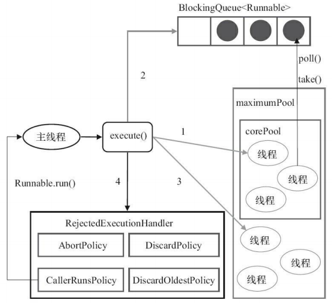

ThreadPoolExecutor 执行 `execute` 方法分下面 4 种情况：

- 如果当前运行的线程**少于** `corePoolSize`，则创建新线程来执行任务（注意，执行这一步骤**需要获取全局锁**）。 
- 如果运行的线程**等于或多于** `corePoolSize`，则将任务加入 BlockingQueue。 
- 如果无法将任务加入 BlockingQueue（队列已满），则创建新的线程来处理任务（注意，执行这一步骤**需要获取全局锁**）。 
- 如果创建新线程将使当前运行的线程超出 `maximumPoolSize`，任务将被拒绝，并调用 `RejectedExecutionHandler.rejectedExecution()`方法。 

ThreadPoolExecutor 采取上述步骤的总体设计思路，是为了**在执行 `execute()` 方法时，尽可能地避免获取全局锁**（那将会是一个严重的可伸缩瓶颈）。在 ThreadPoolExecutor 完成预热之后（当前运行的线程数大于等于 corePoolSize），几乎所有的 `execute()` 方法调用都是执行步骤 2，而步骤 2 不需要获取全局锁。


**源码分析：**线程池执行任务的方法如下：

```java
public void execute(Runnable command) {
    if (command == null) throw new NullPointerException();
    // 如果线程数小于基本线程数，则创建线程并执行当前任务
    if (poolSize >= corePoolSize || !addIfUnderCorePoolSize(command)) {
    // 如线程数大于等于基本线程数或线程创建失败，则将当前任务放到工作队列中。
        if (runState == RUNNING && workQueue.offer(command)) {
            if (runState != RUNNING || poolSize == 0) 
            	ensureQueuedTaskHandled(command);
        }
        // 如果线程池不处于运行中或任务无法放入队列，并且当前线程数量小于最大允许的线程数量，
        // 则创建一个线程执行任务。
        else if (!addIfUnderMaximumPoolSize(command))
        // 抛出 RejectedExecutionException 异常
        reject(command); // is shutdown or saturated
    } 
}
```

**工作线程：**线程池创建线程时，会将线程封装成工作线程 Worker，**Worker 在执行完任务后，还会循环获取工作队列里的任务来执行**。可以从 Worker 类的 `run()` 方法里看到这点：

```java
public void run() {
    try {
        Runnable task = firstTask;
        firstTask = null;
        while (task != null || (task = getTask()) != null) {
            runTask(task);
            task = null;
        }
    } finally {
    	workerDone(this);
    } 
}
```

ThreadPoolExecutor 中线程执行任务的示意图如下：

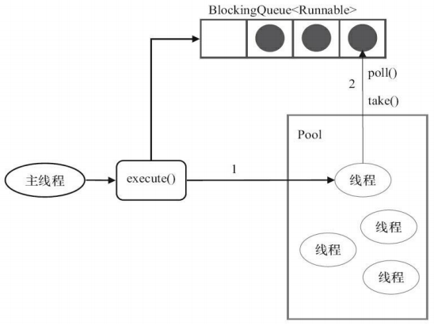

线程池中的线程执行任务分两种情况，如下：

1. 在 `execute()` 方法中创建一个线程时，会让这个线程执行当前任务。 
2. 这个线程执行完上图中 1 的任务后，会反复从 BlockingQueue 获取任务来执行。


## 9.2 线程池的使用

### 9.2.1 线程池的创建

**我们可以通过 ThreadPoolExecutor 来创建一个线程池**：

```java
new ThreadPoolExecutor(corePoolSize, maximumPoolSize, keepAliveTime, 
milliseconds,runnableTaskQueue, handler);
```

创建一个线程池时需要输入几个参数，如下。 

- **corePoolSize（线程池的基本大小）**：当提交一个任务到线程池时，线程池会创建一个线程来执行任务，**即使其他空闲的基本线程能够执行新任务也会创建线程，等到需要执行的任务数大于线程池基本大小时就不再创建。**如果调用了线程池的 `prestartAllCoreThreads()` 方法，线程池会提前创建并启动所有基本线程。 

- **runnableTaskQueue（任务队列）**：**用于保存等待执行的任务的阻塞队列。**可以选择以下几个阻塞队列。 

  - **ArrayBlockingQueue**：是一个基于**数组**结构的**有界**阻塞队列，此队列按 **FIFO**（先进先出）原则对元素进行排序。 

  - **LinkedBlockingQueue**：一个基于**链表**结构的阻塞队列，此队列按 **FIFO** 排序元素，吞吐量通常要高于 ArrayBlockingQueue。静态工厂方法 `Executors.newFixedThreadPool()` 使用了这个队列。 

  - **SynchronousQueue**：一个**不存储元素**的阻塞队列。每个插入操作必须等到另一个线程调用移除操作，否则插入操作一直处于阻塞状态，吞吐量通常要高于 LinkedBlockingQueue，静态工厂方法 `Executors.newCachedThreadPool` 使用了这个队列。

  - **PriorityBlockingQueue**：一个**具有优先级**的**无限**阻塞队列。 

- **maximumPoolSize（线程池最大数量）**：**线程池允许创建的最大线程数。**如果队列满了，并且已创建的线程数小于最大线程数，则线程池会再创建新的线程执行任务。值得注意的是，如果使用了无界的任务队列这个参数就没什么效果。

- **ThreadFactory**：用于**设置创建线程的工厂**，可以通过线程工厂给每个创建出来的线程设置更有意义的名字。使用开源框架 guava 提供的 **ThreadFactoryBuilder** 可以快速给线程池里的线程设置有意义的名字，代码如下：

  ```java
  new ThreadFactoryBuilder().setNameFormat("XX-task-%d").build();
  ```

- **RejectedExecutionHandler（饱和策略）**：**当队列和线程池都满了，说明线程池处于饱和状态，那么必须采取一种策略处理提交的新任务。**这个策略默认情况下是 AbortPolicy，表示无法处理新任务时抛出异常。在 JDK 1.5 中 Java 线程池框架提供了以下 4 种策略：

  - **AbortPolicy**：直接抛出异常。 

  - **CallerRunsPolicy**：只用调用者所在线程来运行任务。 

  - **DiscardOldestPolicy**：丢弃队列里最近的一个任务，并执行当前任务。 

  - **DiscardPolicy**：不处理，丢弃掉。 

> 也可以根据应用场景需要来实现RejectedExecutionHandler 接口自定义策略。如记录日志或持久化存储不能处理的任务。 

- **keepAliveTime（线程活动保持时间）**：线程池的**工作线程空闲后，保持存活的时间。**所以，如果任务很多，并且每个任务执行的时间比较短，可以调大时间，提高线程的利用率。 

- **TimeUnit（线程活动保持时间的单位）**：可选的单位有 `天(DAYS)`、`小时(HOURS)`、`分钟(MINUTES)`、`毫秒(MILLISECONDS)`、`微秒(MICROSECONDS)` 和 `纳秒(NANOSECONDS)` 。


### 9.2.2 向线程池提交任务

可以使用两个方法向线程池提交任务，分别为 `execute()` 和 `submit()` 方法。 


`execute()` 方法**用于提交不需要返回值的任务，所以无法判断任务是否被线程池执行成功。**通过以下代码可知 `execute()` 方法输入的任务是一个 Runnable 类的实例：

```java
threadsPool.execute(new Runnable() {
    @Override
    public void run () {
    	// TODO Auto-generated method stub
    }
});
```


`submit()` 方法**用于提交需要返回值的任务。**线程池会返回一个 future 类型的对象，通过这个 future 对象可以判断任务是否执行成功，并且可以通过 future 的 `get()` 方法来获取返回值，`get()` 方法会阻塞当前线程直到任务完成，而使用 `get(long timeout，TimeUnit unit)`方法则会阻塞当前线程一段时间后立即返回，这时候有可能任务没有执行完。

```java
Future<Object> future = executor.submit(harReturnValuetask);
try {
	Object s = future.get();
} catch (InterruptedException e) {
	// 处理中断异常
} catch (ExecutionException e) {
	// 处理无法执行任务异常
} finally {
	// 关闭线程池
	executor.shutdown();
}
```


### 9.2.3 关闭线程池

可以通过调用线程池的 `shutdown` 或 `shutdownNow` 方法来关闭线程池。它们的**原理是遍历线程池中的工作线程，然后逐个调用线程的 `interrupt` 方法来中断线程，所以无法响应中断的任务可能永远无法终止。**

但是它们存在一定的区别，`shutdownNow` 首先将线程池的状态设置成 **STOP**，然后尝试停止所有的正在执行或暂停任务的线程，并返回等待执行任务的列表，而 `shutdown` 只是将线程池的状态设置成 **SHUTDOWN** 状态，然后中断所有没有正在执行任务的线程。

只要调用了这两个关闭方法中的任意一个，`isShutdown` 方法就会返回 true。**当所有的任务都已关闭后，才表示线程池关闭成功，这时调用 `isTerminaed` 方法会返回 true。**至于应该调用哪一种方法来关闭线程池，应该由提交到线程池的任务特性决定，通常调用 `shutdown` 方法来关闭线程池，如果任务不一定要执行完，则可以调用 `shutdownNow` 方法。 


### 9.2.4 合理地配置线程池

要想合理地配置线程池，就必须首先分析任务特性，可以从以下几个角度来分析：

- **任务的性质**：CPU 密集型任务、IO 密集型任务和混合型任务。 

- **任务的优先级**：高、中和低。 

- **任务的执行时间**：长、中和短。 

- **任务的依赖性**：是否依赖其他系统资源，如数据库连接。

***

- **性质不同的任务可以用不同规模的线程池分开处理：**
  1. **CPU 密集型任务应配置尽可能小的线程**，如配置 Ncpu+1 个线程的线程池。
  2. 由于 **IO 密集型任务**线程并不是一直在执行任务，则**应配置尽可能多的线程**，如 2*Ncpu。
  3. **混合型的任务**，如果可以拆分，将其拆分成一个 CPU 密集型任务和一个 IO 密集型任务，只要这两个任务执行的时间相差不是太大，那么分解后执行的吞吐量将高于串行执行的吞吐量。如果这两个任务执行时间相差太大，则没必要进行分解。可以通过 `Runtime.getRuntime().availableProcessors()` 方法获得当前设备的 CPU 个数。 

- **优先级不同的任务可以使用优先级队列 PriorityBlockingQueue 来处理。**它可以让优先级高的任务先执行。 

>**注意**：如果一直有优先级高的任务提交到队列里，那么优先级低的任务可能永远不能执行。

- **执行时间不同的任务可以交给不同规模的线程池来处理，或者可以使用优先级队列，让执行时间短的任务先执行。**
- 依赖数据库连接池的任务，因为线程提交 SQL 后需要等待数据库返回结果，等待的时间越长，则 CPU 空闲时间就越长，那么线程数应该设置得越大，这样才能更好地利用 CPU。 

***

建议使用有界队列。**有界队列能增加系统的稳定性和预警能力**，可以根据需要设大一点，比如几千。

> 有一次，我们系统里后台任务线程池的队列和线程池全满了，不断抛出抛弃任务的异常，通过排查发现是数据库出现了问题，导致执行 SQL 变得非常缓慢，因为后台任务线程池里的任务全是需要向数据库查询和插入数据的，所以导致线程池里的工作线程全部阻塞，任务积压在线程池里。如果当时我们设置成无界队列，那么线程池的队列就会越来越多，有可能会撑满内存，导致整个系统不可用，而不只是后台任务出现问题。当然，我们的系统所有的任务是用单独的服务器部署的，我们使用不同规模的线程池完成不同类型的任务，但是出现这样问题时也会影响到其他任务。


### 9.2.5 线程池的监控

如果在系统中大量使用线程池，则有必要对线程池进行监控，方便在出现问题时，可以根据线程池的使用状况快速定位问题。可以通过线程池提供的参数进行监控，在监控线程池的时候可以使用以下属性：

-  **taskCount**：线程池需要执行的任务数量。 

- **completedTaskCount**：线程池在运行过程中已完成的任务数量，小于或等于 taskCount。 

- **largestPoolSize**：线程池里曾经创建过的最大线程数量。通过这个数据可以知道线程池是否曾经满过。如该数值等于线程池的最大大小，则表示线程池曾经满过。 

- **getPoolSize**：线程池的线程数量。如果线程池不销毁的话，线程池里的线程不会自动销毁，所以这个大小只增不减。 

- **getActiveCount**：获取活动的线程数。

**通过扩展线程池进行监控。**可以通过继承线程池来自定义线程池，重写线程池的 `beforeExecute`、`afterExecute` 和 `terminated` 方法，也可以在任务执行前、执行后和线程池关闭前执行一些代码来进行监控。例如，监控任务的平均执行时间、最大执行时间和最小执行时间等。 

> 这几个方法在线程池里是空方法。 
>
> ```java
> protected void beforeExecute(Thread t, Runnable r) { 
> } 
> ```


# 10. Executor 框架

在 Java 中，使用线程来异步执行任务。Java 线程的创建与销毁需要一定的开销，如果为每一个任务创建一个新线程来执行，这些线程的创建与销毁将消耗大量的计算资源。同时，为每一个任务创建一个新线程来执行，这种策略可能会使处于高负荷状态的应用最终崩溃。 

Java 的线程既是工作单元，也是执行机制。从 JDK 5 开始，把工作单元与执行机制分离开来。**工作单元包括 Runnable 和 Callable，而执行机制由 Executor 框架提供。** 


## 10.1 Executor 框架简介

### 10.1.1 Executor 框架的两级调度模型

在 HotSpot VM 的线程模型中，Java 线程（java.lang.Thread）被一对一映射为本地操作系统线程。Java 线程启动时会创建一个本地操作系统线程；当该 Java 线程终止时，这个操作系统线程也会被回收。操作系统会调度所有线程并将它们分配给可用的 CPU。 

**在上层，Java 多线程程序通常把应用分解为若干个任务，然后使用用户级的调度器（Executor 框架）将这些任务映射为固定数量的线程；在底层，操作系统内核将这些线程映射到硬件处理器上。**这种两级调度模型的示意图如下所示：

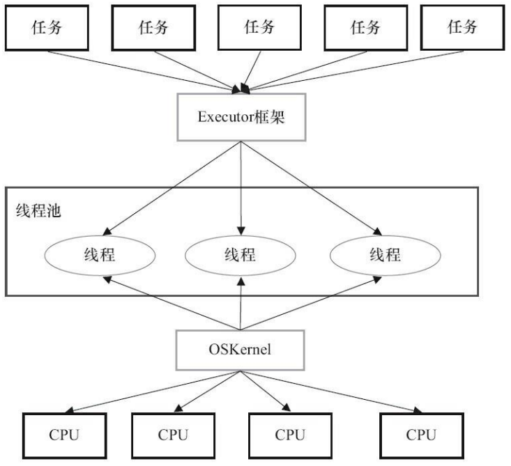

从图中可以看出，**应用程序通过 Executor 框架控制上层的调度；而下层的调度由操作系统内核控制，下层的调度不受应用程序的控制。**


### 10.1.2 Executor 框架的结构与成员

#### 1）Executor 框架的结构

Executor 框架主要由 3 大部分组成：

1. **任务**。包括被执行任务需要实现的接口：Runnable 接口或 Callable 接口。 

2. **任务的执行**。包括任务执行机制的核心接口 Executor，以及继承自 Executor 的 ExecutorService 接口。Executor 框架有两个关键类实现了 ExecutorService 接口（ThreadPoolExecutor 和 ScheduledThreadPoolExecutor）。 

3. **异步计算的结果**。包括接口 Future 和实现 Future 接口的 FutureTask 类


Executor 框架包含的主要的类与接口如下图所示：

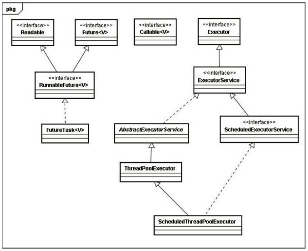

- Executor 是一个接口，它是 Executor 框架的基础，它将任务的提交与任务的执行分离开来。 

- ThreadPoolExecutor 是线程池的核心实现类，用来执行被提交的任务。

- ScheduledThreadPoolExecutor 是一个实现类，可以在给定的延迟后运行命令，或者定期执行命令。ScheduledThreadPoolExecutor 比 Timer 更灵活，功能更强大。 
- Future 接口和实现 Future 接口的 FutureTask 类，代表异步计算的结果。 
- Runnable 接口和 Callable 接口的实现类，都可以被 ThreadPoolExecutor 或 ScheduledThreadPoolExecutor 执行。


Executor 框架的使用示意图如下所示：

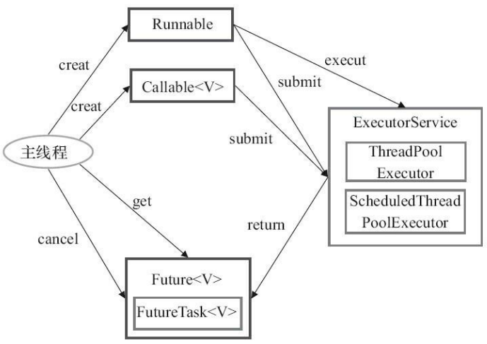

主线程首先要创建实现 Runnable 或者 Callable 接口的任务对象。工具类 Executors 可以把一个 Runnable 对象封装为一个 Callable 对象（`Executors.callable(Runnable task)`或 `Executors.callable(Runnable task，Object resule)`）。

然后可以把 Runnable 对象直接交给 ExecutorService 执行（`ExecutorService.execute(Runnable command)`）；或者也可以把 Runnable 对象或 Callable 对象提交给 ExecutorService 执行（`ExecutorService.submit(Runnable task)`或` ExecutorService.submit(Callable<T>task)`）。 

如果执行 `ExecutorService.submit(…)`，ExecutorService 将返回一个实现 Future 接口的对象（到目前为止的 JDK 中，返回的是 FutureTask 对象）。由于 FutureTask 实现了 Runnable，程序员也可以创建 FutureTask，然后直接交给 ExecutorService 执行。 

最后，主线程可以执行 `FutureTask.get()` 方法来等待任务执行完成。主线程也可以执行  `FutureTask.cancel(boolean mayInterruptIfRunning)`来取消此任务的执行。


#### 2）Executor 框架的成员

##### 1. ThreadPoolExecutor

ThreadPoolExecutor 通常使用工厂类 Executors 来创建。Executors 可以创建 3 种类型的 ThreadPoolExecutor：`SingleThreadExecutor`、`FixedThreadPool` 和 `CachedThreadPool`。 

1. **FixedThreadPool**。下面是 Executors 提供的，创建使用**固定线程数**的 FixedThreadPool 的 API。 

   ```java
   public static ExecutorService newFixedThreadPool(int nThreads)
   public static ExecutorService newFixedThreadPool(int nThreads, ThreadFactory threadFactory)
   ```

   FixedThreadPool 适用于**为了满足资源管理的需求，而需要限制当前线程数量的应用场景，它适用于负载比较重的服务器。** 

2. **SingleThreadExecutor**。下面是 Executors 提供的，创建使用**单个线程**的 SingleThreadExecutor 的 API。

   ```java
   public static ExecutorService newSingleThreadExecutor()
   public static ExecutorService newSingleThreadExecutor(ThreadFactory threadFactory)
   ```

   SingleThreadExecutor 适用于**需要保证顺序地执行各个任务；并且在任意时间点，不会有多个线程是活动的应用场景。** 

3. **CachedThreadPool**。下面是 Executors 提供的，创建一个会**根据需要创建新线程**的 CachedThreadPool 的 API。

   ```java
   public static ExecutorService newCachedThreadPool()
   public static ExecutorService newCachedThreadPool(ThreadFactory threadFactory)
   ```

   CachedThreadPool 是**大小无界**的线程池，适用于**执行很多的短期异步任务的小程序，或者是负载较轻的服务器。**


##### 2. ScheduledThreadPoolExecutor

ScheduledThreadPoolExecutor 通常使用工厂类 Executors 来创建。Executors 可以创建 2 种类型的 ScheduledThreadPoolExecutor 如下：

- **ScheduledThreadPoolExecutor**。包含**若干个线程** ScheduledThreadPoolExecutor。 

- **SingleThreadScheduledExecutor**。只包含**一个线程** ScheduledThreadPoolExecutor


1. 下面是工厂类 Executors 提供的，创建固定个数线程的 ScheduledThreadPoolExecutor 的 API。 

   ```java
   public static ScheduledExecutorService newScheduledThreadPool(int corePoolSize)
   public static ScheduledExecutorService newScheduledThreadPool(int corePoolSize, 
   ThreadFactory threadFactory)
   ```

   ScheduledThreadPoolExecutor 适用于**需要多个后台线程执行周期任务，同时为了满足资源管理的需求而需要限制后台线程的数量的应用场景。**

2. 下面是 Executors 提供的，创建单个线程的 SingleThreadScheduledExecutor 的 API。 

   ```java
   public static ScheduledExecutorService newSingleThreadScheduledExecutor()
   public static ScheduledExecutorService newSingleThreadScheduledExecutor(ThreadFactory threadFactory)
   ```

   SingleThreadScheduledExecutor 适用于**需要单个后台线程执行周期任务，同时需要保证顺序地执行各个任务的应用场景。** 


##### 3. Future 接口 

Future 接口和实现 Future 接口的 FutureTask 类用来**表示异步计算的结果。**当我们把 Runnable 接口或 Callable 接口的实现类提交（submit）给 ThreadPoolExecutor 或 ScheduledThreadPoolExecutor 时，ThreadPoolExecutor 或 ScheduledThreadPoolExecutor 会向我们返回一个 FutureTask 对象。下面是对应的 API。

```java
<T> Future<T> submit(Callable<T> task)
<T> Future<T> submit(Runnable task, T result) 
Future<> submit(Runnable task)
```

> **注意：**到 JDK 8 为止，Java 通过上述 API 返回的是一个FutureTask 对象。但从 API 可以看到，Java 仅仅保证返回的是一个实现了 Future 接口的对象。在后面的 JDK 实现中，返回的可能不一定是 FutureTask。 


##### 4. Runnable 接口和 Callable 接口

Runnable 接口和 Callable 接口的实现类，都可以被 ThreadPoolExecutor 或 ScheduledThreadPoolExecutor 执行。它们之间的区别是 **Runnable 不会返回结果，而 Callable 可以返回结果。** 

除了可以自己创建实现 Callable 接口的对象外，还可以使用工厂类 Executors 来把一个 Runnable 包装成一个 Callable。 


下面是 Executors 提供的，把一个 Runnable 包装成一个 Callable 的 API。 

```java
public static Callable<Object> callable(Runnable task) // 假设返回对象 Callable1
```

下面是 Executors 提供的，把一个 Runnable 和一个待返回的结果包装成一个 Callable 的 API。 

```java
public static <T> Callable<T> callable(Runnable task, T result) // 假设返回对象 Callable2
```

>当我们把一个 Callable 对象（比如上面的 Callable1 或 Callable2）提交给 ThreadPoolExecutor 或 ScheduledThreadPoolExecutor 执行时，`submit(…)`会向我们返回一个 FutureTask 对象。我们可以执行 `FutureTask.get()` 方法来等待任务执行完成。当任务成功完成后 `FutureTask.get()` 将返回该任务的结果。例如，如果提交的是对象 Callable1，`FutureTask.get()` 方法将返回 null；如果提交的是对象 Callable2，`FutureTask.get()`方法将返回 result 对象。


## 10.2 ThreadPoolExecutor 详解

Executor 框架最核心的类是 ThreadPoolExecutor，它是线程池的实现类，主要由下列 4 个组件构成。 

- corePoolSize：核心线程池的大小。 

- maximumPoolSize：最大线程池的大小。 

- BlockingQueue：用来暂时保存任务的工作队列。 

- RejectedExecutionHandler：当 ThreadPoolExecutor 已经关闭或 ThreadPoolExecutor 已经饱和时（达到了最大线程池大小且工作队列已满），`execute()` 方法将要调用的 Handler。


通过 Executor 框架的工具类 Executors，可以创建 3 种类型的 ThreadPoolExecutor。 

- FixedThreadPool。 

- SingleThreadExecutor。 

- CachedThreadPool。 


### 10.2.1 FixedThreadPool 详解

FixedThreadPool 被称为**可重用固定线程数的线程池**。下面是 FixedThreadPool 的源代码实现： 

```java
public static ExecutorService newFixedThreadPool(int nThreads) {
    return new ThreadPoolExecutor(nThreads, nThreads,
                                0L, TimeUnit.MILLISECONDS,
    							new LinkedBlockingQueue<Runnable>());
}
```

FixedThreadPool 的 corePoolSize 和 maximumPoolSize 都被设置为创建 FixedThreadPool 时指定的参数 `nThreads`。

当线程池中的线程数大于 corePoolSize 时，keepAliveTime 为多余的空闲线程等待新任务的最长时间，超过这个时间后多余的线程将被终止。这里把 keepAliveTime 设置为 0L，意味着多余的空闲线程会被立即终止。 


FixedThreadPool 的 `execute()` 方法的运行示意图如下所示：

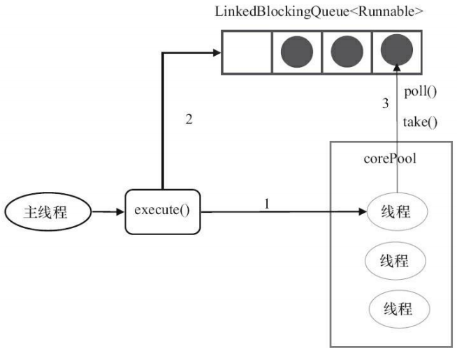

1. 如果当前运行的线程数少于 corePoolSize，则创建新线程来执行任务。 

2. 在线程池完成预热之后（当前运行的线程数等于 corePoolSize），将任务加入 LinkedBlockingQueue。 

3. 线程执行完 1 中的任务后，会在循环中反复从 LinkedBlockingQueue 获取任务来执行。

4. FixedThreadPool 使用**无界队列 LinkedBlockingQueue** 作为线程池的工作队列（队列的容量为 Integer.MAX_VALUE）。使用无界队列作为工作队列会对线程池带来如下影响：
   1. 当线程池中的线程数达到 corePoolSize 后，新任务将在无界队列中等待，因此线程池中的线程数不会超过 corePoolSize。 
   2. 由于 1，使用无界队列时 maximumPoolSize 将是一个无效参数。 
   3. 由于 1 和 2，使用无界队列时 keepAliveTime 将是一个无效参数。 
   4. 由于使用无界队列，运行中的 FixedThreadPool（未执行方法 `shutdown()`或 `shutdownNow()`）不会拒绝任务（不会调用 `RejectedExecutionHandler.rejectedExecution` 方法）。


### 10.2.2 SingleThreadExecutor 详解

SingleThreadExecutor 是使用单个 worker 线程的 Executor。下面是 SingleThreadExecutor 的源代码实现：

```java
public static ExecutorService newSingleThreadExecutor() {
    return new FinalizableDelegatedExecutorService(
        new ThreadPoolExecutor(1, 1, 
                               0L, TimeUnit.MILLISECONDS, 
                               new LinkedBlockingQueue<Runnable>()
        )
    );
}
```

SingleThreadExecutor 的 corePoolSize 和 maximumPoolSize 被设置为 1。其他参数与 FixedThreadPool 相同。SingleThreadExecutor 使用**无界队列 LinkedBlockingQueue** 作为线程池的工作队列（队列的容量为 Integer.MAX_VALUE）。SingleThreadExecutor 使用无界队列作为工作队列对线程池带来的影响与 FixedThreadPool 相同，这里不赘述。


SingleThreadExecutor 的运行示意图如下所示：

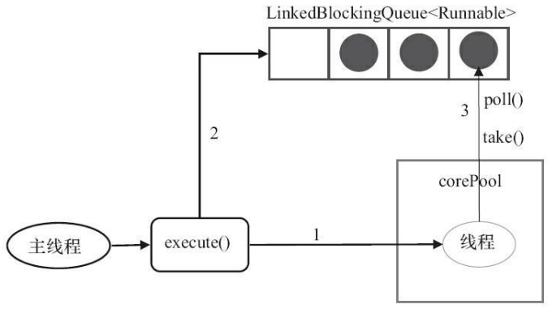

1. 如果当前运行的线程数少于 corePoolSize（即线程池中无运行的线程），则创建一个新线程来执行任务。 

2. 在线程池完成预热之后（当前线程池中有一个运行的线程），将任务加入 LinkedBlockingQueue。 

3. 线程执行完 1 中的任务后，会在一个无限循环中反复从 LinkedBlockingQueue 获取任务来执行。


### 10.2.3 CachedThreadPool 详解

CachedThreadPool 是一个会**根据需要创建新线程**的线程池。下面是创建 CachedThreadPool 的源代码：

```java
public static ExecutorService newCachedThreadPool() {
    return new ThreadPoolExecutor(0, Integer.MAX_VALUE, 60L, TimeUnit.SECONDS,
    							new SynchronousQueue<Runnable>());
}
```

CachedThreadPool 的 corePoolSize 被设置为 0，即 corePool 为空；maximumPoolSize 被设置为 Integer.MAX_VALUE，即 maximumPool 是无界的。这里把 keepAliveTime 设置为 60L，意味着 CachedThreadPool 中的空闲线程等待新任务的最长时间为 60 秒，空闲线程超过 60 秒后将会被终止。

CachedThreadPool 使用**没有容量的 SynchronousQueue** 作为线程池的工作队列，但 CachedThreadPool 的 maximumPool 是无界的。这意味着，**如果主线程提交任务的速度高于 maximumPool 中线程处理任务的速度时，CachedThreadPool 会不断创建新线程。**极端情况下， CachedThreadPool 会因为创建过多线程而耗尽 CPU 和内存资源。


CachedThreadPool 的 `execute()` 方法的执行示意图如下所示：

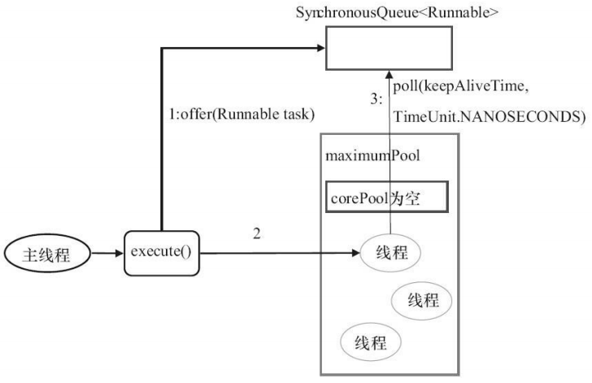

1. 首先执行 `SynchronousQueue.offer(Runnable task)`。如果当前 maximumPool 中有空闲线程正在执行 `SynchronousQueue.poll(keepAliveTime, TimeUnit.NANOSECONDS)`，那么主线程执行 `offer` 操作与空闲线程执行的 `poll` 操作配对成功，主线程把任务交给空闲线程执行，`execute()` 方法执行完成；否则执行下面的步骤 2。 

2. 当初始 maximumPool 为空，或者 maximumPool 中当前没有空闲线程时，将没有线程执行 `SynchronousQueue.poll(keepAliveTime,  TimeUnit.NANOSECONDS)`。这种情况下，步骤 1 将失败。此时 CachedThreadPool 会创建一个新线程执行任务，`execute()` 方法执行完成。 

3. 在步骤 2 中新创建的线程将任务执行完后，会执行 `SynchronousQueue.poll(keepAliveTime, TimeUnit.NANOSECONDS)`。这个 `poll` 操作会让空闲线程最多在 SynchronousQueue 中等待 60 秒钟。如果 60 秒钟内主线程提交了一个新任务（主线程执行步骤 1），那么这个空闲线程将执行主线程提交的新任务；否则，这个空闲线程将终止。由于空闲 60 秒的空闲线程会被终止，因此长时间保持空闲的 CachedThreadPool 不会使用任何资源。 


前面提到过，SynchronousQueue 是一个没有容量的阻塞队列。**每个插入操作必须等待另一个线程的对应移除操作**，反之亦然。CachedThreadPool 使用 SynchronousQueue，把主线程提交的任务传递给空闲线程执行。CachedThreadPool 中任务传递的示意图如图下所示：

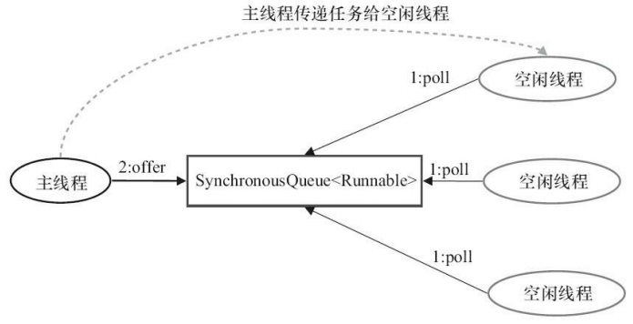


## 10.3 ScheduledThreadPoolExecutor 详解

ScheduledThreadPoolExecutor 继承自 ThreadPoolExecutor。它主要**用来在给定的延迟之后运行任务，或者定期执行任务。**ScheduledThreadPoolExecutor 的功能与 Timer 类似，但 ScheduledThreadPoolExecutor 功能更强大、更灵活。**Timer 对应的是单个后台线程，而 ScheduledThreadPoolExecutor 可以在构造函数中指定多个对应的后台线程数。** 


### 10.3.1 ScheduledThreadPoolExecutor 的运行机制

ScheduledThreadPoolExecutor 的执行示意图（这里基于 JDK 6）如下所示：

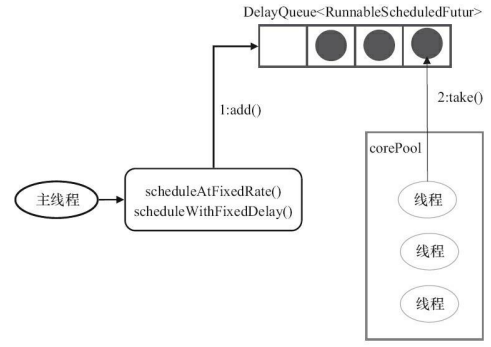 

DelayQueue 是一个无界队列，所以 ThreadPoolExecutor 的 maximumPoolSize 在 ScheduledThreadPoolExecutor 中没有什么意义（设置 maximumPoolSize 的大小没有什么效果）。ScheduledThreadPoolExecutor 的执行主要分为两大部分：

1. 当调用 ScheduledThreadPoolExecutor 的 `scheduleAtFixedRate()` 方法或者 `scheduleWithFixedDelay()` 方法时，会向 ScheduledThreadPoolExecutor 的 DelayQueue 添加一个实现了 RunnableScheduledFutur 接口的 ScheduledFutureTask。 

2. 线程池中的线程从 DelayQueue 中获取 ScheduledFutureTask，然后执行任务。


ScheduledThreadPoolExecutor 为了实现周期性的执行任务，对 ThreadPoolExecutor 做了如下的修改：

- 使用 DelayQueue 作为任务队列。 

- 获取任务的方式不同（后文会说明）。 

- 执行周期任务后，增加了额外的处理（后文会说明）。


### 10.3.2 ScheduledThreadPoolExecutor 的实现

ScheduledThreadPoolExecutor 会把待调度的任务（ScheduledFutureTask）放到一个 DelayQueue 中。


ScheduledFutureTask 主要包含 3 个成员变量如下： 

- long 型成员变量 time，表示这个任务将要被执行的具体时间。 

- long 型成员变量 sequenceNumber，表示这个任务被添加到 ScheduledThreadPoolExecutor 中的序号。 

- long 型成员变量 period，表示任务执行的间隔周期。

DelayQueue 封装了一个 **PriorityQueue**，这个 PriorityQueue 会对队列中的 ScheduledFutureTask 进行排序。排序时，**time 小的排在前面（时间早的任务将被先执行）**。如果两个 ScheduledFutureTask 的 time 相同，就比较 sequenceNumber，sequenceNumber 小的排在前面（也就是说，**如果两个任务的执行时间相同，那么先提交的任务将被先执行**）。


首先看看 ScheduledThreadPoolExecutor 中的线程执行周期任务的过程。下图是 ScheduledThreadPoolExecutor 中的线程 1 执行某个周期任务的 4 个步骤：


1. 线程 1 从 DelayQueue 中获取已到期的 ScheduledFutureTask（`DelayQueue.take()`）。到期任务是指 ScheduledFutureTask 的 time 大于等于当前时间。 
2. 线程 1 执行这个 ScheduledFutureTask。 
3. 线程 1 修改 ScheduledFutureTask 的 time 变量为下次将要被执行的时间。 
4. 线程 1 把这个修改 time 之后的 ScheduledFutureTask 放回 DelayQueue 中（`DelayQueue.add()`）。 


下面是 `DelayQueue.take()` 方法（即上面步骤 1 获取任务过程）的源代码实现：

```java
public E take() throws InterruptedException {
    final ReentrantLock lock = this.lock;
    lock.lockInterruptibly(); // 1
    try {
        for (; ; ) {
        E first = q.peek();
        if (first == null) {
        	available.await(); // 2.1
        } else {
            long delay = first.getDelay(TimeUnit.NANOSECONDS);
            if (delay > 0) {
            	long tl = available.awaitNanos(delay); // 2.2
            } else {
                E x = q.poll(); // 2.3.1
                assert x != null;
                if (q.size() != 0)
                	available.signalAll(); // 2.3.2
                return x;
            }
        }
        }
    } finally {
    	lock.unlock(); // 3
    } 
}
```

下图是 `DelayQueue.take()` 的执行示意图：

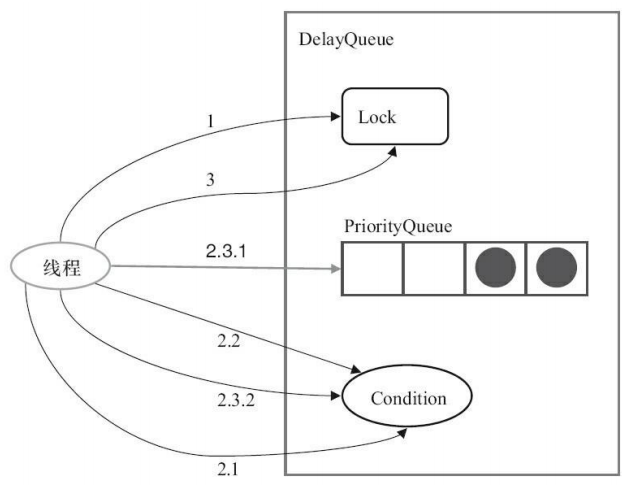 

如图所示，获取任务分为 3 大步骤：

1) 获取 Lock。 

2) 获取周期任务。 

- 如果 PriorityQueue 为空，当前线程到 Condition 中等待；否则执行下面的 2.2。 

- 如果 PriorityQueue 的头元素的 time 时间比当前时间大，到 Condition 中等待到 time 时间；否则执行下面的 2.3。 

- 获取 PriorityQueue 的头元素（2.3.1）；如果 PriorityQueue 不为空，则唤醒在 Condition 中等待的所有线程（2.3.2）。 

3) 释放 Lock。 

ScheduledThreadPoolExecutor 在一个循环中执行步骤 2，直到线程从 PriorityQueue 获取到一个元素之后（执行 2.3.1 之后），才会退出无限循环（结束步骤 2）。 


最后看看 ScheduledThreadPoolExecutor 中的线程执行任务的步骤 4，把 ScheduledFutureTask 放入 DelayQueue 中的过程。下面是 `DelayQueue.add()` 的源代码实现：

```java
public boolean offer(E e) {
    final ReentrantLock lock = this.lock;
    lock.lock(); // 1
    try {
        E first = q.peek();
        q.offer(e); // 2.1
        if (first == null || e.compareTo(first) < 0) available.signalAll(); // 2.2
        return true;
    } finally {
    	lock.unlock(); // 3
    } 
}
```

下面是 `DelayQueue.add()` 的执行示意图：

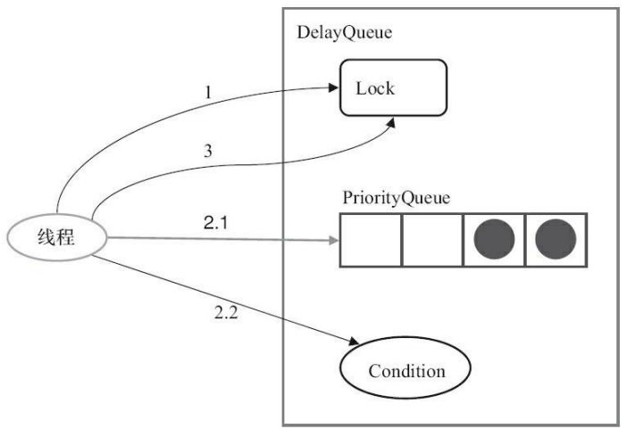

如图所示，添加任务分为 3 大步骤：

1) 获取 Lock。 

2) 添加任务。 

- 向 PriorityQueue 添加任务。 

- 如果在上面 2.1 中添加的任务是 PriorityQueue 的头元素，唤醒在 Condition 中等待的所有线程。 

3) 释放 Lock。


## 10.4 FutureTask 详解

Future 接口和实现 Future 接口的 FutureTask 类，代表**异步计算的结果**。


### 10.4.1 FutureTask 简介 

FutureTask 除了实现 Future 接口外，还实现了 Runnable 接口。因此，FutureTask 可以交给 Executor 执行，也可以由调用线程直接执行（`FutureTask.run()`）。根据 `FutureTask.run()` 方法被执行的时机，FutureTask 可以处于下面 3 种状态：

- **未启动**。`FutureTask.run()` 方法还没有被执行之前，FutureTask 处于未启动状态。当创建一个 FutureTask，且没有执行 `FutureTask.run()` 方法之前，这个 FutureTask 处于未启动状态。 

- **已启动**。`FutureTask.run()` 方法被执行的过程中，FutureTask 处于已启动状态。 

- **已完成**。`FutureTask.run()` 方法执行完后正常结束，或被取消（`FutureTask.cancel(…)`），或执行 `FutureTask.run()` 方法时抛出异常而异常结束，FutureTask 处于已完成状态。

下面是 FutureTask 的状态迁移的示意图：

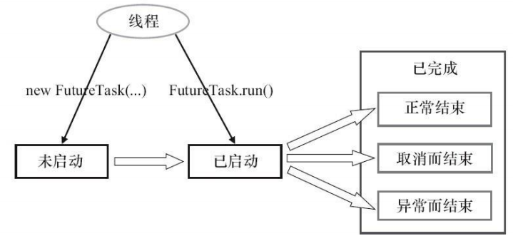


当 FutureTask 处于未启动或已启动状态时，执行 `FutureTask.get()` 方法将导致调用线程阻塞；当 FutureTask 处于已完成状态时，执行 `FutureTask.get()` 方法将导致调用线程立即返回结果或抛出异常。 

当 FutureTask 处于未启动状态时，执行 `FutureTask.cancel()` 方法将导致此任务永远不会被执行；当 FutureTask 处于已启动状态时，执行 `FutureTask.cancel(true)` 方法将以**中断执行此任务线程**的方式来试图停止任务；当 FutureTask 处于已启动状态时，执行 `FutureTask.cancel(false)`方法将不会对正在执行此任务的线程产生影响（让正在执行的任务运行完成）；当 FutureTask 处于已完成状态时，执行 `FutureTask.cancel(…)` 方法将返回 false。 


下面是 `get` 方法和 `cancel` 方法的执行示意图：

 


### 10.4.2 FutureTask 的使用

可以把 FutureTask 交给 Executor 执行；也可以通过 `ExecutorService.submit(…)`方法返回一个 FutureTask，然后执行 `FutureTask.get()` 方法或 `FutureTask.cancel(…)` 方法。除此以外，还可以单独使用 FutureTask。 

当一个线程需要等待另一个线程把某个任务执行完后它才能继续执行，此时可以使用 FutureTask。假设有多个线程执行若干任务，每个任务最多只能被执行一次。当多个线程试图同时执行同一个任务时，只允许一个线程执行任务，其他线程需要等待这个任务执行完后才能继续执行。下面是对应的示例代码：

```java
private final ConcurrentMap<Object, Future<String>> taskCache = new 
ConcurrentHashMap<Object, Future<String>>();

private String executionTask(final String taskName) throws ExecutionException, 
InterruptedException {
    while (true) {
        Future<String> future = taskCache.get(taskName); // 1.1,2.1
        if (future == null) {
            Callable<String> task = new Callable<String>() {
                public String call() throws InterruptedException {
                	return taskName;
                }
            };
            FutureTask<String> futureTask = new FutureTask<String>(task);
            future = taskCache.putIfAbsent(taskName, futureTask); // 1.3
            if (future == null) {
                future = futureTask;
                futureTask.run(); // 1.4 执行任务
            }
        }
        try {
        	return future.get(); // 1.5,
        } catch (CancellationException e) {
        	taskCache.remove(taskName, future);
        }
    } 
}
```

上述代码的执行示意图如下所示：

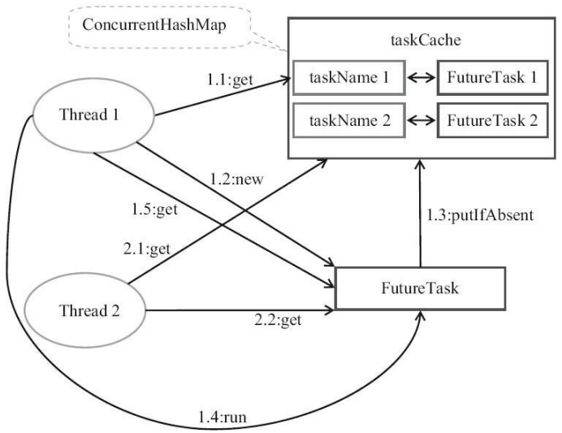

当两个线程试图同时执行同一个任务时，如果 Thread 1 执行 1.3 后 Thread 2 执行 2.1，那么接下来 Thread 2 将在 2.2 等待，直到 Thread 1 执行完 1.4 后 Thread 2 才能从 2.2（`FutureTask.get()`）返回。 


### 10.4.3 FutureTask 的实现

FutureTask 的实现基于 **AbstractQueuedSynchronizer**（以下简称为 **AQS**）。java.util.concurrent 中的很多可阻塞类（比如 ReentrantLock）都是基于 AQS 来实现的。**AQS 是一个同步框架，它提供通用机制来原子性管理同步状态、阻塞和唤醒线程，以及维护被阻塞线程的队列。**JDK 6 中 AQS 被广泛使用，基于 AQS 实现的同步器包括：`ReentrantLock`、`Semaphore`、`ReentrantReadWriteLock`、`CountDownLatch` 和 `FutureTask`。每一个基于 AQS 实现的同步器都会包含两种类型的操作，如下：

1. 至少一个 **acquire** 操作。这个操作**阻塞调用线程，除非/直到 AQS 的状态允许这个线程继续执行。**FutureTask 的 acquire 操作为 `get()` / `get(long timeout, TimeUnit unit)` 方法调用。 

2. 至少一个 **release** 操作。这个操作**改变 AQS 的状态，改变后的状态可允许一个或多个阻塞线程被解除阻塞。**FutureTask 的 release 操作包括 `run()` 方法和 `cancel(…)` 方法。


基于“**复合优先于继承**”的原则，FutureTask 声明了一个内部私有的继承于 AQS 的子类 **Sync**，对 FutureTask 所有公有方法的调用都会委托给这个内部子类。 

AQS 被作为“模板方法模式”的基础类提供给 FutureTask 的内部子类 Sync，这个内部子类只需要实现状态检查和状态更新的方法即可，这些方法将控制 FutureTask 的获取和释放操作。具体来说，Sync 实现了 AQS 的 `tryAcquireShared(int)` 方法和 `tryReleaseShared(int)` 方法，Sync 通过这两个方法来检查和更新同步状态。

FutureTask 的设计示意图如下所示：

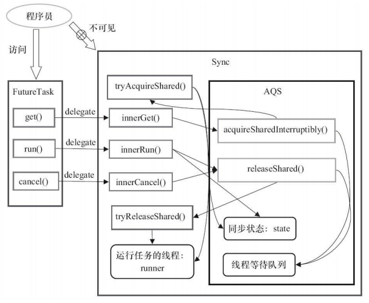

如图所示，Sync 是 FutureTask 的内部私有类，它继承自 AQS。创建 FutureTask 时会创建内部私有的成员对象 Sync，FutureTask 所有的的公有方法都直接委托给了内部私有的 Sync。 

`FutureTask.get()` 方法会调用 `AQS.acquireSharedInterruptibly(int arg)` 方法，这个方法的执行过程如下：

1. 调用 `AQS.acquireSharedInterruptibly(int arg)`方法，这个方法首先会回调在子类 Sync 中实现的 `tryAcquireShared()` 方法来判断 acquire 操作是否可以成功。acquire 操作可以成功的条件为： state 为执行完成状态 RAN 或已取消状态 CANCELLED，且 runner 不为 null。 

2. 如果成功则 `get()` 方法立即返回。如果失败则到线程等待队列中去等待其他线程执行 release 操作。 

3. 当其他线程执行 release 操作（比如 `FutureTask.run()` 或 `FutureTask.cancel(…)`）唤醒当前线程后，当前线程再次执行 `tryAcquireShared()` 将返回正值 1，当前线程将离开线程等待队列并唤醒它的后继线程（这里会产生级联唤醒的效果，后面会介绍）。 

4. 最后返回计算的结果或抛出异常。 


`FutureTask.run()` 的执行过程如下：

1. 执行在构造函数中指定的任务（`Callable.call()`）。 

2. 以原子方式来更新同步状态（调用 `AQS.compareAndSetState(int expect，int update)`，设置 state 为执行完成状态 RAN）。如果这个原子操作成功，就设置代表计算结果的变量 result 的值为 `Callable.call()` 的返回值，然后调用 `AQS.releaseShared(int arg)`。 

3. `AQS.releaseShared(int arg)` 首先会回调在子类 Sync 中实现的 `tryReleaseShared(arg)` 来执行 release 操作（设置运行任务的线程 runner 为 null，然会返回 true）；`AQS.releaseShared(int arg)`，然后唤醒线程等待队列中的第一个线程。 

4. 调用 `FutureTask.done()`。


当执行 `FutureTask.get()` 方法时，如果 FutureTask 不是处于执行完成状态 RAN 或已取消状态 CANCELLED，当前执行线程将到 AQS 的线程等待队列中等待（见下图的线程 A、B、C 和 D）。当某个线程执行 `FutureTask.run()` 方法或 `FutureTask.cancel(...)` 方法时，会唤醒线程等待队列的第一个线程（见下图所示的线程 E 唤醒线程 A）。 

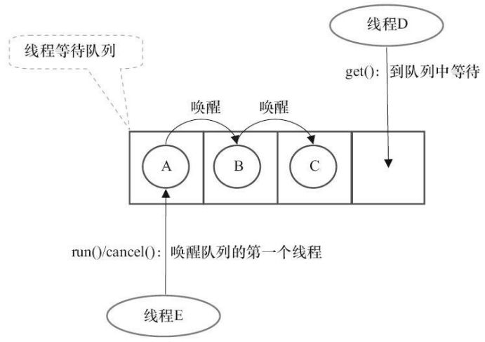

假设开始时 FutureTask 处于未启动状态或已启动状态，等待队列中已经有 3 个线程（A、B 和 C）在等待。此时，线程 D 执行 `get()` 方法将导致线程 D 也到等待队列中去等待。 

当线程 E 执行 `run()` 方法时，会唤醒队列中的第一个线程 A。线程 A 被唤醒后，首先把自己从队列中删除，然后唤醒它的后继线程 B，最后线程 A 从 `get()` 方法返回。线程 B、C 和 D 重复 A 线程的处理流程。最终，在队列中等待的所有线程都被**级联唤醒**并从 `get()` 方法返回。


# 11. Java 并发编程实践


## 11.1 生产者和消费者模式

该模式通过**平衡生产线程和消费线程的工作能力**来提高程序整体处理数据的速度。

在线程世界里，生产者就是生产数据的线程，消费者就是消费数据的线程。在多线程开发中，如果生产者处理速度很快，而消费者处理速度很慢，那么生产者就必须等待消费者处理完，才能继续生产数据。同样的道理，如果消费者的处理能力大于生产者，那么消费者就必须等待生产者。为了解决这种生产消费能力不均衡的问题，便有了生产者和消费者模式。 

**什么是生产者和消费者模式？**

>生产者和消费者模式是通过一个容器来解决生产者和消费者的强耦合问题。生产者和消费者彼此之间不直接通信，而是通过阻塞队列来进行通信，所以生产者生产完数据之后不用等待消费者处理，直接扔给阻塞队列，消费者不找生产者要数据，而是直接从阻塞队列里取，阻塞队列就相当于一个缓冲区，平衡了生产者和消费者的处理能力。


### 11.1.1多生产者和多消费者场景

在多核时代，多线程并发处理速度比单线程处理速度更快，所以可以使用多个线程来生产数据，同样可以使用多个消费线程来消费数据。而更复杂的情况是，**消费者消费的数据，有可能需要继续处理，于是消费者处理完数据之后，它又要作为生产者把数据放在新的队列里，交给其他消费者继续处理**，如图所示：


### 11.1.2 线程池与生产消费者模式

Java 中的线程池类其实就是一种生产者和消费者模式的实现方式。生产者把任务丢给线程池，线程池创建线程并处理任务，如果将要运行的任务数大于线程池的基本线程数就把任务扔到阻塞队列里，这种做法比只使用一个阻塞队列来实现生产者和消费者模式显然要高明很多，因为消费者能够处理直接就处理掉了，这样速度更快，而生产者先存，消费者再取这种方式显然慢一些。 

我们的系统也可以使用线程池来实现多生产者和消费者模式。例如，创建 N 个不同规模的 Java 线程池来处理不同性质的任务，比如线程池 1 将数据读到内存之后，交给线程池 2 里的线程继续处理压缩数据。线程池 1 主要处理 IO 密集型任务，线程池 2 主要处理 CPU 密集型任务。 


**在平时的工作中哪些场景可以使用生产者消费者模式?**

> 需要处理任务时间比较长的场景，比如上传附件并处理，用户把文件上传到系统后，系统把文件丢到队列里，然后立刻返回告诉用户上传成功，最后消费者再去队列里取出文件处理。再如，调用一个远程接口查询数据，如果远程服务接口查询时需要几十秒的时间，那么它可以提供一个申请查询的接口，这个接口把要申请查询任务放数据库中，然后该接口立刻返回。然后服务器端用线程轮询并获取申请任务进行处理，处理完之后发消息给调用方，让调用方再来调用另外一个接口取数据。


## 11.2 线上问题定位

有时候，有很多问题只有在线上或者预发环境才能发现，而线上又不能调试代码，所以线上问题定位就只能`看日志`、`系统状态`和 `dump 线程`，这里简单地介绍一些常用的工具来定位线上问题：

1）在 Linux 命令行下使用 `TOP` 命令查看**每个进程的情况**，显示如下：


我们的程序是 Java 应用，所以**只需要关注 COMMAND 是 Java 的性能数据**，COMMAND 表示启动当前进程的命令，在 Java 进程这一行里可以看到 CPU 利用率是 300%，不用担心，这个是当前机器所有核加在一起的 CPU 利用率。

2）再使用 `top` 的`交互命令数字 1` 查看**每个 CPU 的性能数据**。


命令行显示了 CPU4，说明这是一个 5 核的虚拟机，平均每个 CPU 利用率在 60%以上。如果这里显示 CPU 利用率 100%，则很有可能程序里写了一个死循环。这些参数的含义，可以对比下表来查看：


3）使用 `top` 的`交互命令 H` 查看**每个线程的性能信息**。 


在这里可能会出现 3 种情况：

- 第一种情况，某个线程 CPU 利用率一直 100%，则说明是这个线程有可能有死循环，那么请记住这个 PID。 

- 第二种情况，某个线程一直在 TOP 10 的位置，这说明这个线程可能有性能问题。 

- 第三种情况，CPU 利用率高的几个线程在不停变化，说明并不是由某一个线程导致CPU 偏高。 

如果是第一种情况，也有可能是 GC 造成，可以用 `jstat` 命令看一下 GC 情况，看看是不是因为持久代或年老代满了，产生 Full GC，导致 CPU 利用率持续飙高，命令和回显如下：


还可以把线程 `dump` 下来，看看究竟是哪个线程、执行什么代码造成的 CPU 利用率高。执行以下命令，把线程 dump 到文件 dump17 里：

```shell
sudo -u admin /opt/taobao/java/bin/jstack 31177 >/home/tengfei.fangtf/dump17
```

dump 出来内容的类似下面内容：


`dump` 出来的线程 ID（nid）是十六进制的，而我们用 `TOP` 命令看到的线程 ID 是十进制的，所以要用 `printf` 命令转换一下进制。然后用十六进制的 ID 去 dump 里找到对应的线程。

```shell
printf "%x\n" 31558
输出：7b46
```


## 11.3 异步任务池

Java 中的线程池设计得非常巧妙，可以高效并发执行多个任务，但是在某些场景下需要对线程池进行扩展才能更好地服务于系统。例如，如果一个任务仍进线程池之后，运行线程池的程序重启了，那么线程池里的任务就会丢失。另外，线程池只能处理本机 的任务，在集群环境下不能有效地调度所有机器的任务。所以，需要结合线程池开发一个异步任务处理池。下图为异步任务池设计图：

 

任务池的主要处理流程是，每台机器会启动一个任务池，每个任务池里有多个线程池，当某台机器将一个任务交给任务池后，任务池会先将这个任务保存到数据中，然后某台机器上的任务池会从数据库中获取待执行的任务，再执行这个任务。 

每个任务有几种状态，分别是`创建（NEW）`、`执行中（EXECUTING）`、`RETRY（重试）`、`挂起（SUSPEND）`、`中止（TEMINER）`和`执行完成（FINISH）`。 

- **创建**：提交给任务池之后的状态。 
- **执行中**：任务池从数据库中拿到任务执行时的状态。
- **重试**：当执行任务时出现错误，程序显式地告诉任务池这个任务需要重试，并设置下一次执行时间。 
- **挂起**：当一个任务的执行依赖于其他任务完成时，可以将这个任务挂起，当收到消息后，再开始执行。 
- **中止**：任务执行失败，让任务池停止执行这个任务，并设置错误消息告诉调用端。 
- **执行完成**：任务执行结束。 


**任务池的任务隔离。**异步任务有很多种类型，比如抓取网页任务、同步数据任务等，不同类型的任务优先级不一样，但是系统资源是有限的，如果低优先级的任务非常多，高优先级的任务就可能得不到执行，所以必须对任务进行隔离执行。使用不同的线程池处理不同的任务，或者不同的线程池处理不同优先级的任务，如果任务类型非常少，建议用任务类型来隔离，如果任务类型非常多，比如几十个，建议采用优先级的方式来隔离。 

**任务池的重试策略。**根据不同的任务类型设置不同的重试策略，有的任务对实时性要求高，那么每次的重试间隔就会非常短，如果对实时性要求不高，可以采用默认的重试策略，重试间隔随着次数的增加，时间不断增长，比如间隔几秒、几分钟到几小时。每个任务类型可以设置执行该任务类型线程池的最小和最大线程数、最大重试次数。 

**使用任务池的注意事项。**任务必须无状态：任务不能在执行任务的机器中保存数据，比如某个任务是处理上传的文件，任务的属性里有文件的上传路径，如果文件上传到机器 1，机器 2 获取到了任务则会处理失败，所以上传的文件必须存在其他的集群里，比如 OSS 或 SFTP。 

**异步任务的属性。**包括任务名称、下次执行时间、已执行次数、任务类型、任务优先级和执行时的报错信息（用于快速定位问题）


