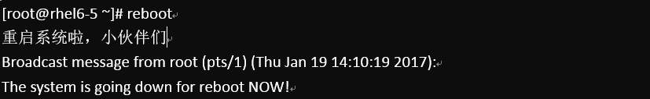
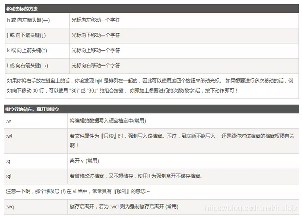
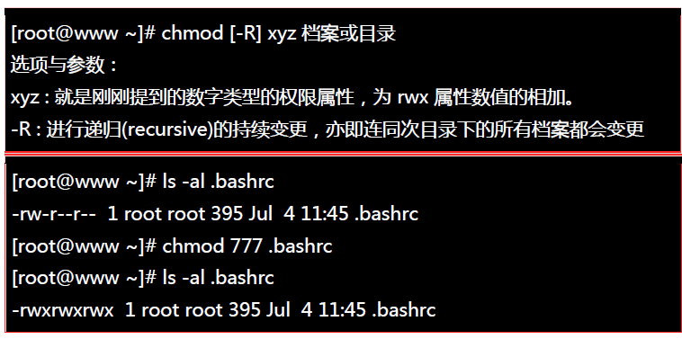
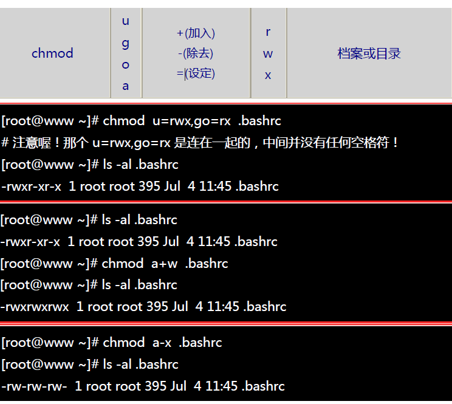

# Linux 常用命令

[toc]

## 一、基本操作命令

**首先先来几个热键，非常方便，一定要记住**

- **`Tab` 按键——命令补齐功能**
- **`Ctrl+c` 按键——停掉正在运行的程序**
- **`Ctrl+d` 按键——相当于exit，退出**
- **`Ctrl+l` 按键——清屏**


### 1. 关机和重启

#### 1.1 关机命令：`shutdown`

> 正确的关机流程： **`sync` > `shutdown` > `reboot` > `halt`** 

 可以运行如下命令关机： 

```
sync 将数据由内存同步到硬盘中。

shutdown 关机指令，可以 man shutdown 来看一下帮助文档。例如可以运行如下命令关机：
	shutdown –h 10 ‘This server will shutdown after 10 mins’ 这个命令告诉大家，计算机将在10分钟后关机，并且会显示在登陆用户的当前屏幕中。
	shutdown –h now 立马关机
	shutdown –h 20:25 系统会在今天20:25关机
	shutdown –h +10 十分钟后关机
	shutdown –r now 系统立马重启
	shutdown –r +10 系统十分钟后重启

reboot 就是重启，等同于 shutdown –r now

halt 关闭系统，等同于 shutdown –h now 和 poweroff
```

 下面是一个简单的样例 ：

 


**取消定时关机命令：`shutdown -c`**

最后总结一下，不管是重启系统还是关闭系统，首先要运行 **`sync`** 命令，**把内存中的数据写到磁盘中。**

关机的命令有 **`shutdown –h now halt poweroff`** 和 **`init 0`** , 重启系统的命令有 **`shutdown –r now reboot init 6`**。


#### 1.2 重启命令：`reboot`

 


### 2. 帮助命令

**`-help` 命令**

```shell
shutdown --help：查询关机命令的使用方法 
ifconfig --help：查看网卡信息
```

 **`man` 命令**

```shell
man shutdown
注意：man shutdown打开命令说明书之后，使用按键q退出
```


## 二、目录操作命令

我们知道Linux的目录结构为树状结构，最顶级的目录为**根目录 /**。

其他目录通过挂载可以将它们添加到树中，通过解除挂载可以移除它们。

首先我们需要先知道什么是绝对路径与相对路径。

- **绝对路径：**
  路径的写法，由根目录 / 写起，例如： /usr/share/doc 这个目录。
- **相对路径：**
  路径的写法，不是由 / 写起，例如由 /usr/share/doc 要到 /usr/share/man 底下时，可以写成： cd ../man 这就是相对路径的写法。


### 1. 目录切换 `cd`

**命令：`cd 目录`**

 `cd` 是 change directory 的缩写，这是用来**变换工作目录**的命令。 

```shell
cd /        切换到根目录
cd /usr     切换到根目录下的usr目录
cd ../      切换到上一级目录 或者 cd ..
cd ~        切换到home目录
cd -        切换到上次访问的目录
```


### 2. 目录切换 `ls [-al]`

**命令：`ls [-al]`**

```shell
ls [-aAdfFhilnrRSt] 目录名称
ls [--color={never,auto,always}] 目录名称
ls [--full-time] 目录名称

选项与参数： 
-a ：全部的文件和目录，连同隐藏文件（开头为 . 的文件）一起列出来（常用） 
-A ：全部的文件，连同隐藏文件，但不包括 . 与 .. 这两个目录 
-d ：仅列出目录本身，而不是列出目录内的文件数据（常用） 
-f ：直接列出结果，而不进行排序 （ls 默认会以文件名排序！） 
-F ：根据文件、目录等信息，给予附加数据结构，例如：
	 *:代表可执行文件； /:代表目录； =:代表 socket 文件； &#124;:代表 FIFO 文件； 
-h ：将文件大小以人类较易读的方式（例如 GB, KB 等等）列出来； 
-i ：列出 inode 号码，inode 的意义下一章将会介绍； 
-l ：长数据串行出，包含文件的属性与权限等等数据；（常用） 
-n ：列出 UID 与 GID 而非使用者与群组的名称 （UID与GID会在帐号管理提到！） 
-r ：将排序结果反向输出，例如：原本文件名由小到大，反向则为由大到小； 
-R ：连同子目录内容一起列出来，等于该目录下的所有文件都会显示出来； 
-S ：以文件大小大小排序，而不是用文件名排序； 
-t ：依时间排序，而不是用文件名。 
--color=never ：不要依据文件特性给予颜色显示； 
--color=always ：显示颜色 
--color=auto ：让系统自行依据设置来判断是否给予颜色 
--full-time ：以完整时间模式 （包含年、月、日、时、分） 输出 
--time={atime,ctime} ：输出 access 时间或改变权限属性时间 （ctime） 
					   而非内容变更时间 （modification time）
```

常用的：

- **`ls` 查看当前目录下的所有目录和文件**（默认显示的只有：非隐藏文件的文件名、 以文件名进行排序及文件名代表的颜色显示如此而已。）
- **`ls -a` 查看当前目录下的所有目录和文件（包括隐藏的文件）**
- **`ls -l` 或 `ll` 列表查看当前目录下的所有目录和文件（列表查看，显示更多信息）**
- **`ls /dir` 查看指定目录下的所有目录和文件** 如：ls /usr 

将家目录下的所有文件列出来(含属性与隐藏档)

```shell
ls -al ~
```


### 3. 目录操作【增/删/改/查】

#### 3.1 【增】创建目录 `mkdir`

**命令：`mkdir [-mp] 目录名称`**

`mkdir` 是 make directory 的缩写，用来**创建新的目录。**

```shell
选项与参数：
-m ：配置文件的权限。直接配置，不需要看默认权限 (umask) 的脸色～
-p ：帮助你直接将所需要的目录(包含上一级目录)递归创建起来！
```


 实例：请到/tmp底下尝试创建数个新目录看看： 

```shell
cd /tmp
[root@www tmp] mkdir test       <== 创建一名为 test 的新目录
[root@www tmp] mkdir test1/test2/test3/test4
mkdir: cannot create directory `test1/test2/test3/test4': 
No such file or directory       <== 没办法直接创建此目录啊！
[root@www tmp] mkdir -p test1/test2/test3/test4
```

加了这个 `-p` 的选项，可以自行帮你**创建多层目录**！

实例：创建权限为 **rwx–x--x** 的目录：

```shell
[root@www tmp] mkdir -m 711 test2
[root@www tmp] ls -l
drwxr-xr-x  3 root  root 4096 Jul 18 12:50 test
drwxr-xr-x  3 root  root 4096 Jul 18 12:53 test1
drwx--x--x  2 root  root 4096 Jul 18 12:54 test2
```

上面的权限部分，如果没有加上 `-m` 来强制配置属性，系统会使用默认属性。

如果我们使用 `-m` ，如上例我们给予 `-m 711` 来给予新的目录 drwx–x--x 的权限。（d表示目录）

> - **[r]** 可读（read）：可以读取、查看
> - **[w]** 可写（write）：可以修改，但不代表可以删除该文件，删除一个文件的前提条件是对该文件的所在目录有写权限，才能删除该文件
> - **[x]** 可执行（execute）：可以被执行
>
> 数字表示：r=4，w=2，x=1 因此 rwx=4+2+1=7


#### 3.2 【删】删除目录或文件 `rm`

**命令：`rm [-fir] 文件或目录`**

`rm` 是 remove 的缩写，用来**删除目录或文件**。

```shell
选项与参数：
-f ：就是 force 的意思，忽略不存在的文件，不会出现警告信息；
-i ：互动模式，在删除前会询问使用者是否动作
-r ：递归删除啊！最常用在目录的删除了！这是非常危险的选项！！！
```

**删除文件：**

```shell
rm 文件 删除当前目录下的文件
rm -f 文件 删除当前目录的的文件（不询问）
```

**删除目录：**

```shell
rm -r aaa 递归删除当前目录下的aaa目录
rm -rf aaa 递归删除当前目录下的aaa目录（不询问）
```

**全部删除：**

```shell
rm -rf * 将当前目录下的所有目录和文件全部删除
rm -rf /* 【自杀命令！慎用！慎用！慎用！】将根目录下的所有文件全部删除
```

> 注意：`rm` 不仅可以删除目录，也可以删除其他文件或压缩包，为了方便大家的记忆，无论删除任何目录或文件，都直接使用 **`rm -rf 目录/文件/压缩包`** 


**`rmdir` 删除空目录**

**命令：`rmdir [-p] 目录名称`**

```shell
选项与参数：
-p ：连同上一级『空的』目录也一起删除
```

删除 runoob 目录

```shell
[root@www tmp] rmdir runoob/
```

将 mkdir 实例中创建的目录(/tmp 底下)删除掉！

```shell
[root@www tmp] ls -l   <==看看有多少目录存在？
drwxr-xr-x  3 root  root 4096 Jul 18 12:50 test
drwxr-xr-x  3 root  root 4096 Jul 18 12:53 test1
drwx--x--x  2 root  root 4096 Jul 18 12:54 test2
[root@www tmp] rmdir test   <==可直接删除掉，没问题
[root@www tmp] rmdir test1  <==因为尚有内容，所以无法删除！
rmdir: `test1': Directory not empty
[root@www tmp] rmdir -p test1/test2/test3/test4
[root@www tmp] ls -l        <==您看看，底下的输出中test与test1不见了！
drwx--x--x  2 root  root 4096 Jul 18 12:54 test2
```

利用 `-p` 这个选项，立刻就可以将 test1/test2/test3/test4 一次删除。

> 不过要注意的是，这个 `rmdir` 仅能删除空的目录，可以使用 `rm` 命令来删除非空目录。


#### 3.3 【改】目录修改 `mv` 和 `cp`

**命令：`mv 源文件 目的地`**	

```shell
[root@www ~] mv [-fiu] source destination
[root@www ~] mv [options] source1 source2 source3 ... directory

选项与参数：
-f ：force 强制的意思，如果目标文件已经存在，不会询问而直接覆盖；
-i ：若目标文件 (destination) 已经存在时，就会询问是否覆盖！
-u ：若目标文件已经存在，且 source 比较新，才会升级 (update)
```


**命令：`cp 源文件 目的地`**

```shell
[root@www ~] cp [-adfilprsu] 来源档(source) 目标档(destination)
[root@www ~] cp [options] source1 source2 source3 ... directory

选项与参数：
-a：相当於 -pdr 的意思，至于 pdr 请参考下列说明；(常用)
-d：若来源档为连结档的属性(link file)，则复制连结档属性而非文件本身；
-f：为强制(force)的意思，若目标文件已经存在且无法开启，则移除后再尝试一次；
-i：若目标档(destination)已经存在时，在覆盖时会先询问动作的进行(常用)
-l：进行硬式连结(hard link)的连结档创建，而非复制文件本身；
-p：连同文件的属性一起复制过去，而非使用默认属性(备份常用)；
-r：递归持续复制，用于目录的复制行为；(常用)
-s：复制成为符号连结档 (symbolic link)，亦即『捷径』文件；
-u：若 destination 比 source 旧才升级 destination ！
```


**常用操作**

**（1）重命名目录**

命令：`mv 当前目录 新目录`
示例：`mv aaa bbb` 将目录aaa改为bbb
注意：`mv` 的语法不仅可以对目录进行重命名而且也可以对各种文件，压缩包等进行重命名的操作。

**（2）剪切(移动)目录** 

命令：`mv 目录名称 目录的新位置`
示例：将/usr/tmp目录下的aaa目录剪切到 /usr目录下面 `mv /usr/tmp/aaa /usr`
注意：`mv` 语法不仅可以对目录进行剪切操作，对文件和压缩包等都可执行剪切操作。

**（3）拷贝目录** 

命令：`cp -r 目录名称 目录拷贝的目标位置 ` ，`-r`代表**递归**
示例：将/usr/tmp目录下的aaa目录复制到 /usr目录下面 `cp /usr/tmp/aaa /usr`
注意：`cp` 命令不仅可以拷贝目录还可以拷贝文件，压缩包等，拷贝文件和压缩包时不用写`-r`递归。


#### 3.4 【查】搜索目录 `find`

Linux `find` 命令用来**在指定目录下查找文件**。任何位于参数之前的字符串都将被视为欲查找的目录名。如果使用该命令时，不设置任何参数，则 `find` 命令将在当前目录下查找子目录与文件。并且将查找到的子目录和文件全部进行显示。 

命令：` find 目录 参数 文件名称 `

```shell
find   path   -option   [   -print ]   [ -exec   -ok   command ]   {} \;
```

**部分参数：**

`find` 根据下列规则判断 `path` 和 `expression`，在命令列上第一个 `- ( ) , !` **之前**的部分为 `path`，**之后**的是 `expression`。如果 `path` 是**空字串则使用目前路径**，如果 `expression` 是**空字串则使用 `-print`** 为预设 expression。

expression 中可使用的选项有二三十个之多，在此只介绍最常用的部分：

`-mount`, `-xdev` : 只检查和指定目录在同一个文件系统下的文件，避免列出其它文件系统中的文件

`-amin n` : 在过去 n 分钟内被读取过

`-anewer file` : 比文件 file 更晚被读取过的文件

`-atime n` : 在过去n天内被读取过的文件

`-cmin n` : 在过去 n 分钟内被修改过

`-cnewer file` :比文件 file 更新的文件

`-ctime n` : 在过去n天内被修改过的文件

**示例：**

将目前目录及其子目录下所有延伸档名是 c 的文件列出来 

```shell
find . -name "*.c"
```

将目前目录其其下子目录中所有一般文件列出

```shell
find . -type f
```

将目前目录及其子目录下所有最近 20 天内更新过的文件列出

```shell
find . -ctime -20
```


### 4. 显示当前目录 `pwd`

**命令：`pwd [-P]`**

`pwd` 是 **Print Working Directory** 的缩写，也就是**显示目前所在目录**的命令。 

```shell
选项与参数：
-P ：显示出确实的路径，而非使用连结 (link) 路径。
```

实例：单纯显示出目前的工作目录：

```shell
[root@www ~] pwd
/root   <== 显示出目录啦～
```

 实例显示出实际的工作目录，而非连结档本身的目录名而已。 

```shell
[root@www ~] cd /var/mail   <==注意，/var/mail是一个连结档
[root@www mail] pwd
/var/mail         <==列出目前的工作目录
[root@www mail] pwd -P
/var/spool/mail   <==怎么回事？有没有加 -P 差很多～
[root@www mail] ls -ld /var/mail
lrwxrwxrwx 1 root root 10 Sep  4 17:54 /var/mail -> spool/mail
# 看到这里应该知道为啥了吧？因为 /var/mail 是连结档，连结到 /var/spool/mail 
# 所以，加上 pwd -P 的选项后，会不以连结档的数据显示，而是显示正确的完整路径啊！
```


## 三、文件操作命令

### 1. 文件操作【增/删/改/查】

#### 1.1 【增】新建文件 `touch`

Linux `touch`命令用于**修改文件或者目录的时间属性，包括存取时间和更改时间。若文件不存在，系统会建立一个新的文件。**

ls -l 可以显示档案的时间记录。

```shell
touch [-acfm][-d<日期时间>][-r<参考文件或目录>] [-t<日期时间>][--help][--version][文件或目录…]

参数说明：
a 改变档案的读取时间记录。
m 改变档案的修改时间记录。
c 假如目的档案不存在，不会建立新的档案。与 --no-create 的效果一样。
f 不使用，是为了与其他 unix 系统的相容性而保留。
r 使用参考档的时间记录，与 --file 的效果一样。
d 设定时间与日期，可以使用各种不同的格式。
t 设定档案的时间记录，格式与 date 指令相同。
–no-create 不会建立新档案。
–help 列出指令格式。
–version 列出版本讯息。
```

**实例**

使用指令"touch"修改文件"testfile"的时间属性为当前系统时间，输入如下命令：

```shell
$ touch testfile                #修改文件的时间属性 
```

首先，使用ls命令查看testfile文件的属性，如下所示：

```shell
$ ls -l testfile                #查看文件的时间属性  
#原来文件的修改时间为16:09  
-rw-r--r-- 1 hdd hdd 55 2011-08-22 16:09 testfile  
```

执行指令`touch`修改文件属性以后，并再次查看该文件的时间属性，如下所示：

```shell
$ touch testfile                #修改文件时间属性为当前系统时间  
$ ls -l testfile                #查看文件的时间属性  
#修改后文件的时间属性为当前系统时间  
-rw-r--r-- 1 hdd hdd 55 2011-08-22 19:53 testfile  
```

使用指令`touch`时，如果指定的文件不存在，则将创建一个新的空白文件。例如，在当前目录下，使用该指令创建一个空白文件"file"，输入如下命令：

```shell
$ touch file            #创建一个名为“file”的新的空白文件 
```


#### 1.2 【删】删除文件 `rm`

**命令：`rm [-fir] 文件或目录`**

```shell
选项与参数：

-f ：就是 force 的意思，忽略不存在的文件，不会出现警告信息；

-i ：互动模式，在删除前会询问使用者是否动作

-r ：递归删除啊！最常用在目录的删除了！这是非常危险的选项！！！
```

将创建的 bashrc 删除掉！

```shell
[root@www tmp]# rm -i bashrc
rm: remove regular file `bashrc'? y
```

如果加上 `-i` 的选项就会主动询问，避免你删除到错误的档名！


#### 1.3 【改】修改文件 `vi` 或 `vim`

  

#### vi/vim 的使用

基本上 vi/vim 共分为三种模式，分别是**命令模式**（Command mode），**输入模式**（Insert mode）和**底线命令模式**（Last line mode）。 这三种模式的作用分别是：

##### 命令模式

用户刚刚启动 vi/vim，便进入了命令模式。

此状态下敲击键盘动作会被 Vim 识别为命令，而非输入字符。比如我们此时按下`i`，并不会输入一个字符，`i`被当作了一个命令。

以下是常用的几个命令：

- **`i`** 切换到输入模式，以输入字符。
- **`x`** 删除当前光标所在处的字符。
- **`:`** 切换到底线命令模式，以在最底一行输入命令。

若想要编辑文本：启动 Vim，进入了命令模式，按下`i`，切换到输入模式。

命令模式只有一些最基本的命令，因此仍要依靠底线命令模式输入更多命令。

##### 输入模式

在命令模式下按下`i`就进入了输入模式。

在输入模式中，可以使用以下按键：

- **字符按键以及Shift组合**：输入字符
- **ENTER**：回车键，换行
- **BACK SPACE**：退格键，删除光标前一个字符
- **DEL**：删除键，删除光标后一个字符
- **方向键**：在文本中移动光标
- **HOME/END**：移动光标到行首/行尾
- **Page Up/Page Down**：上/下翻页
- **Insert**：切换光标为输入/替换模式，光标将变成竖线/下划线
- **ESC**：退出输入模式，切换到命令模式

##### 底线命令模式

在命令模式下按下`:`（英文冒号）就进入了底线命令模式。

底线命令模式可以输入单个或多个字符的命令，可用的命令非常多。

在底线命令模式中，基本的命令有（已经省略了冒号）：

- **`q`** 退出程序
- **`w`** 保存文件

按`ESC`键可随时退出底线命令模式。

简单的说，我们可以将这三个模式想成底下的图标来表示：

 


**打开文件**

命令：`vi 文件名`

示例：打开当前目录下的aa.txt文件 vi aa.txt 或者 vim aa.txt

注意：使用 vi 编辑器打开文件后，并不能编辑，因为此时处于命令模式，点击键盘 `i/a/o` 进入编辑模式。

**编辑文件**

使用 vi 编辑器打开文件后点击按键：`i` ，`a` 或者 `o` 即可进入编辑模式。

`i`：在光标所在字符前开始插入
`a`：在光标所在字符后开始插入
`o`：在光标所在行的下面另起一新行插入

 

**保存文件**

第一步：`ESC` 进入命令行模式
第二步：`:` 进入底行模式
第三步：`wq` 保存并退出编辑

**取消编辑**

第一步：`ESC` 进入命令行模式
第二步：`:` 进入底行模式
第三步：`q!` 撤销本次修改并退出编辑


#### 1.4 【查】查看文件

Linux系统中使用以下命令来查看文件的内容：

- `cat` 由第一行开始显示文件内容
- `tac` 从最后一行开始显示，可以看出 tac 是 cat 的倒着写！
- `nl` 显示的时候，顺道输出行号！
- `more` 一页一页的显示文件内容
- `less` 与 more 类似，但是比 more 更好的是，他可以往前翻页！
- `head` 只看头几行
- `tail` 只看尾巴几行

你可以使用 `man [命令]` 来查看各个命令的使用文档，如 ：man cp


##### `cat`

由**第一行开始**显示文件内容

**语法：`cat [-AbEnTv]`**

```shell
选项与参数：
-A ：相当於 -vET 的整合选项，可列出一些特殊字符而不是空白而已；
-b ：列出行号，仅针对非空白行做行号显示，空白行不标行号！
-E ：将结尾的断行字节 $ 显示出来；
-n ：列印出行号，连同空白行也会有行号，与 -b 的选项不同；
-T ：将 [tab] 按键以 ^I 显示出来；
-v ：列出一些看不出来的特殊字符
```

查看 /etc/issue 这个文件的内容：

```shell
[root@www ~] cat /etc/issue
CentOS release 6.4 (Final)
Kernel \r on an \m
```

```shell
cat -n textfile1 > textfile2 
#把 textfile1 的文档内容加上行号后输入 textfile2 这个文档里。
```


##### `tac`

`tac` 与 cat 命令刚好相反，文件内容从**最后一行开始**显示，可以看出 tac 是 cat 的倒着写！如：

```shell
[root@www ~] tac /etc/issue

Kernel \r on an \m
CentOS release 6.4 (Final)
```


##### `nl`

显示行号

**语法：`nl [-bnw] 文件`**

```shell
选项与参数：
-b ：指定行号指定的方式，主要有两种：
-b a ：表示不论是否为空行，也同样列出行号(类似 cat -n)；
-b t ：如果有空行，空的那一行不要列出行号(默认值)；
-n ：列出行号表示的方法，主要有三种：
-n ln ：行号在荧幕的最左方显示；
-n rn ：行号在自己栏位的最右方显示，且不加 0 ；
-n rz ：行号在自己栏位的最右方显示，且加 0 ；
-w ：行号栏位的占用的位数。
```

实例一：用 nl 列出 /etc/issue 的内容

```shell
[root@www ~] nl /etc/issue
     1  CentOS release 6.4 (Final)
     2  Kernel \r on an \m
```


##### `more`

 一页一页翻动 

```shell
[root@www ~] more /etc/man_db.config 
#
# Generated automatically from man.conf.in by the
# configure script.
#
# man.conf from man-1.6d
....(中间省略)....
--More--(28%)  <== 重点在这一行喔！你的光标也会在这里等待你的命令
```

在 `more` 这个程序的运行过程中，你有几个按键可以按的：

- `空白键 (space)`：代表向下翻一页；
- `Enter` ：代表向下翻『一行』；
- `/ 字串` ：代表在这个显示的内容当中，向下搜寻『字串』这个关键字；
- `:f` ：立刻显示出档名以及目前显示的行数；
- `q` ：代表立刻离开 more ，不再显示该文件内容。
- `b` 或 `[ctrl]-b` ：代表往回翻页，不过这动作只对文件有用，对管线无用。

```shell
more -num  #一次显示行数
more +num  #从第num行开始显示
```


##### `less`

 一页一页翻动，以下实例输出/etc/man.config文件的内容： 

```shell
[root@www ~] less /etc/man.config
#
# Generated automatically from man.conf.in by the
# configure script.
#
# man.conf from man-1.6d
....(中间省略)....
:   <== 这里可以等待你输入命令！
```

`less`运行时可以输入的命令有：

- `空白键` ：向下翻动一页；
- `[pagedown]`：向下翻动一页；
- `[pageup]` ：向上翻动一页；
- `/ 字串` ：向下搜寻『字串』的功能；
- `? 字串` ：向上搜寻『字串』的功能；
- `n` ：重复前一个搜寻 (与 / 或 ? 有关！)
- `N` ：反向的重复前一个搜寻 (与 / 或 ? 有关！)
- `q` ：离开 less 这个程序；


##### `head`

取出文件前面几行

**语法：`head [-n number] 文件`** 

```shell
选项与参数：
-n ：后面接数字，代表显示几行的意思
```

```shell
[root@www ~] head /etc/man.config
# 默认的情况中，显示前面 10 行！若要显示前 20 行，就得要这样：
[root@www ~] head -n 20 /etc/man.config
```


##### `tail`

取出文件后面几行

**语法：`tail [-n number] 文件 `**

```shell
选项与参数：
-n ：后面接数字，代表显示几行的意思
-f ：表示持续侦测后面所接的档名，要等到按下[ctrl]-c才会结束tail的侦测
```

```shell
[root@www ~] tail /etc/man.config
# 默认的情况中，显示最后的十行！若要显示最后的 20 行，就得要这样：
[root@www ~] tail -n 20 /etc/man.config
```

> 这条命令一般用于查看正在变动的日志。


### 2. 权限修改 `chmod`

Linux/Unix 的文件调用权限分为三级 : **文件拥有者**、**群组**、**其他**。利用 `chmod` 可以控制文件如何被他人所调用。

**使用权限** : 所有使用者

**语法：`chmod [-cfvR] [--help] [--version] mode file...`**

```shell
参数说明:
-c : 若该文件权限确实已经更改，才显示其更改动作
-f : 若该文件权限无法被更改也不要显示错误讯息
-v : 显示权限变更的详细资料
-R : 对目前目录下的所有文件与子目录进行相同的权限变更(即以递回的方式逐个变更)
–help : 显示辅助说明
–version : 显示版本

mode : 权限设定字串，格式如下:
[ugoa...][[+-=][rwxX]...][,...]
其中:
u 表示该文件的拥有者，g 表示与该文件的拥有者属于同一个群体(group)者，o 表示其他以外的人，a 表示这三者皆是。
+ 表示增加权限、- 表示取消权限、= 表示唯一设定权限。
r 表示可读取，w 表示可写入，x 表示可执行，X 表示只有当该文件是个子目录或者该文件已经被设定过为可执行。
```

权限的设定方法有两种， 分别可以使用**数字**或者是**符号**来进行权限的变更。

**数字类型改变档案权限：**

 r=4,w=2,x=1，所以想要rxw 读写和可执行权限，那就是`4+2+1=7`，而一个位数表示一个角色 

 

 **符号类型改变档案权限：** 

 


### 3. 计算字数 `wc`

**命令：`wc [-clw][--help][--version][文件...]`**

```shell
常用选项：
-c或--bytes或--chars 只显示Bytes数。
-l或--lines 显示行数。
-w或--words 只显示字数。
--help 在线帮助。
--version 显示版本信息。
```

**实例：**

```shell
$ wc testfile           # testfile文件的统计信息  
3 92 598 testfile       # testfile文件的行数为3、单词数92、字节数598 
```

其中，3 个数字分别表示testfile文件的行数、单词数，以及该文件的字节数。

如果想同时统计多个文件的信息，例如同时统计testfile、testfile_1、testfile_2，可使用如下命令：

```shell
$ wc testfile testfile_1 testfile_2  #统计三个文件的信息  
3 92 598 testfile                    #第一个文件行数为3、单词数92、字节数598  
9 18 78 testfile_1                   #第二个文件的行数为9、单词数18、字节数78  
3 6 32 testfile_2                    #第三个文件的行数为3、单词数6、字节数32  
15 116 708 总用量                    #三个文件总共的行数为15、单词数116、字节数708
```


### 4. 其他常用命令

- `du`：用于显示目录或文件的大小。一般用来查看文件的大小，比如说看一些dump的日志的文件的大小。
- `du -sh *`：查询当前目录下所有的文件的大小以K，M，G为单位，提高信息的可读性。 
  - 场景：查看服务器中一个文件（比如日志）大小，在删除磁盘文件的时候能有一个对比，哪个文件占用磁盘最大。
- `diff`： 用于比较文件的差异。如  `diff log1.log log2.log -y -W 50` 并排输出两个文件的不同。 
- `source`： 这个命令一般就是和 **点（.）**是一样的效果，就是修改了某个文件不用重启，而可以立马生效。
  -  `source fileName` 等于 `. fileName`是一个效果，使改动的文件立即生效 。


## 四、压缩文件操作命令

Linux 常用的压缩与解压缩命令有：`tar`、`gzip`、`gunzip`、`bzip2`、`bunzip2`、`compress` 、`uncompress`、`zip`、`unzip`、`rar`、`unrar` 等。 

> Windows的压缩文件的扩展名 `.zip` / `.rar`
> linux中的打包文件：`aa.tar`
> linux中的压缩文件：`bb.gz`
> linux中打包并压缩的文件：`.tar.gz` 
>
> Linux中的打包文件一般是以`.tar`结尾的，压缩的命令一般是以`.gz`结尾的。
> 而一般情况下打包和压缩是一起进行的，打包并压缩后的文件的后缀名一般`.tar.gz`。 


### `tar`

最常用的打包命令是 `tar`，使用 `tar` 程序打出来的包我们常称为 `tar包`，`tar` 包文件的命令通常都是以 `.tar` 结尾的。生成 `tar` 包后，就可以用其它的程序来进行压缩了，所以首先就来讲讲 `tar` 命令的基本用法。 

#### `tar` 命令做打包操作

**命令：` tar [-cvfA] 源文件或目录 `**

```shell
常用选项：
-c :将多个文件或目录进行打包。
-A :追加 tar 文件到归档(打包)文件。
-f 包名 :指定包的文件名。包的扩展名是用来给管理员识别格式的，所以一定要正确指定扩展名；
-v :显示打包文件过程；
```

> 需要注意的是，在使用 tar 命令指定选项时可以不在选项前面输入“-”。例如，使用“cvf”选项和 “-cvf”起到的作用一样。 

**示例：**

```shell
[root@localhost ~] tar -cvf anaconda-ks.cfg.tar anaconda-ks.cfg
#把anacondehks.cfg打包为 anacondehks.cfg.tar文件
```

 选项 `-cvf` 一般是习惯用法，记住打包时需要指定打包之后的文件名，而且要用 ".tar" 作为扩展名。打包目录也是如此： 

```shell
[root@localhost ~] ll -d test/
drwxr-xr-x 2 root root 4096 6月 17 21:09 test/
#test是我们之前的测试目录
[root@localhost ~] tar -cvf test.tar test/
test/
test/test3
test/test2
test/test1
#把目录打包为test.tar文件
tar命令也可以打包多个文件或目录，只要用空格分开即可。例如:
[root@localhost ~] tar -cvf ana.tar anaconda-ks.cfg /tmp/
#把anaconda-ks.cfg文件和/tmp目录打包成ana.tar文件包
```

首先声明一点，**压缩命令不能直接压缩目录，必须先用 tar 命令将目录打包，然后才能用 gzip 命令或 bzip2 命令对打包文件进行压缩。**例如： 

```shell
[root@localhost ~]ll -d test test.tar
drwxr-xr-x 2 root root 4096 6月 17 21:09 test
-rw-r--r-- 1 root root 10240 6月 18 01:06 test.tar
#我们之前已经把test目录打包成test.tar文件
[root@localhost ~] gzip test.tar
[root@localhost ~] ll test.tar.gz
-rw-r--r-- 1 root root 176 6月 18 01:06 test.tar.gz
#gzip命令会把test.tar压缩成test.tar.gz
```


#### `tar` 命令做解打包操作

**命令：` tar [-xvftC] 压缩包 `**

```shell
常用选项：
-x :对 tar 包做解打包操作。
-f :指定要解压的 tar 包的包名。
-t :只查看 tar 包中有哪些文件或目录，不对 tar 包做解打包操作。
-C 目录 :指定解打包位置。
-v :显示解打包的具体过程。
```

 其实解打包和打包相比，只是把打包选项 "-cvf" 更换为 "-xvf"。我们来试试： 

```shell
[root@localhost ~] tar -xvf anaconda-ks.cfg.tar
#解打包到当前目录下
```

如果使用 "-xvf" 选项，则会把包中的文件解压到当前目录下。如果想要指定解压位置，则需要使用 "-C(大写)" 选项。例如：

```shell
[root@localhost ~] tar -xvf test.tar -C /tmp
#把文件包test.tar解打包到/tmp/目录下
```

 如果只想查看文件包中有哪些文件，则可以把解打包选项 "-x" 更换为测试选项 "-t"。例如 :

```shell
[root@localhost ~] tar -tvf test.tar
drwxr-xr-x root/root 0 2016-06-17 21:09 test/
-rw-r-r- root/root 0 2016-06-17 17:51 test/test3
-rw-r-r- root/root 0 2016-06-17 17:51 test/test2
-rw-r-r- root/root 0 2016-06-17 17:51 test/test1
#会用长格式显示test.tar文件包中文件的详细信息
```


#### `tar` 命令做打包压缩（解压缩解打包）操作

 `tar` 命令是可以同时打包压缩的 

**命令：` tar [选项] 压缩包 源文件或目录 `**

```shell
常用选项：
-z：压缩和解压缩 ".tar.gz" 格式；
-j：压缩和解压缩 ".tar.bz2"格式。
```

**示例：**

压缩与解压缩 ".tar.gz"格式：

压缩

```shell
[root@localhost ~] tar -zcvf tmp.tar.gz /tmp/
#把/temp/目录直接打包压缩为".tar.gz"格式，通过"-z"来识别格式，"-cvf"和打包选项一致
```

解压缩也只是在解打包选项 "-xvf" 前面加了一个 "-z" 选项

```shell
[root@localhost ~] tar -zxvf tmp.tar.gz
#解压缩与解打包".tar.gz"格式
```

> 前面讲的选项 "-C" 用于指定解压位置、"-t" 用于查看压缩包内容，在这里同样适用。 

 压缩与解压缩 ".tar.bz2" 格式只需像上面一样，仅把 `z` 改成 `j` 即可。


### `zip` 

**命令：` zip [选项] 压缩包名 源文件或源目录列表 `**

```shell
常用选项：
-r	递归压缩目录，及将制定目录下的所有文件以及子目录全部压缩。
-m	将文件压缩之后，删除原始文件，相当于把文件移到压缩文件中。
-v	显示详细的压缩过程信息。
-q	在压缩的时候不显示命令的执行过程。
-压缩级别	压缩级别是从 1~9 的数字，-1 代表压缩速度更快，-9 代表压缩效果更好。
-u	更新压缩文件，即往压缩文件中添加新文件。
```

> 注意，zip 压缩命令需要手工指定压缩之后的压缩包名，注意写清楚扩展名，以便解压缩时使用。 

**示例：**

 zip 命令的基本使用：

```shell
[root@localhost ~] zip ana.zip anaconda-ks.cfg
adding: anaconda-ks.cfg (deflated 37%)
#压缩
[root@localhost ~] ll ana.zip
-rw-r--r-- 1 root root 935 6月 1716:00 ana.zip
#压缩文件生成
```

 不仅如此，所有的压缩命令都可以同时压缩多个文件，例如： 

```shell
[root@localhost ~] zip test.zip install.log install.log.syslog
adding: install.log (deflated 72%)
adding: install.log.syslog (deflated 85%)
#同时压缩多个文件到test.zip压缩包中
[root@localhost ~] ll test.zip
-rw-r--r-- 1 root root 8368 6月 1716:03 test.zip
#压缩文件生成
```

 使用 zip 命令压缩目录，需要使用“-r”选项，例如： 

```shell
[root@localhost ~] mkdir dir1
#建立测试目录
[root@localhost ~] zip -r dir1.zip dir1
adding: dir1/(stored 0%)
#压缩目录
[root@localhost ~] ls -dl dir1.zip
-rw-r--r-- 1 root root 160 6月 1716:22 dir1.zip
#压缩文件生成
```


### `unzip`

**命令：` unzip [选项] 压缩包名 `**

```shell
常用选项：
-d 目录名	将压缩文件解压到指定目录下。
-n	解压时并不覆盖已经存在的文件。
-o	解压时覆盖已经存在的文件，并且无需用户确认。
-v	查看压缩文件的详细信息，包括压缩文件中包含的文件大小、文件名以及压缩比等，但并不做解压操作。
-t	测试压缩文件有无损坏，但并不解压。
-x 文件列表	解压文件，但不包含文件列表中指定的文件。
```

**示例：**

 不论是文件压缩包，还是目录压缩包，都可以直接解压缩，例如： 

```shell
[root@localhost ~] unzip dir1.zip
Archive: dir1.zip
creating: dirl/
#解压缩
```

 使用 -d 选项手动指定解压缩位置，例如： 

```shell
[root@localhost ~] unzip -d /tmp/ ana.zip
Archive: ana.zip
inflating: /tmp/anaconda-ks.cfg
#把压缩包解压到指定位置
```


### `gzip`

`gzip` 是 Linux 系统中经常用来对文件进行压缩和解压缩的命令，通过此命令压缩得到的新文件，**其扩展名通常标记为“.gz”**。 

**`gzip` 命令只能用来压缩文件，不能压缩目录，即便指定了目录，也只能压缩目录内的所有文件。** 

**命令：` gzip [选项] 源文件 `**

```shell
常用选项：
-c	将压缩数据输出到标准输出中，并保留源文件。
-d	对压缩文件进行解压缩。
-r	递归压缩指定目录下以及子目录下的所有文件。
-v	对于每个压缩和解压缩的文件，显示相应的文件名和压缩比。
-l	对每一个压缩文件，显示以下字段：
压缩文件的大小；
未压缩文件的大小；
压缩比；
未压缩文件的名称。
-数字	用于指定压缩等级，-1 压缩等级最低，压缩比最差；-9 压缩比最高。默认压缩比是 -6。
```

示例：

```shell
gzip gc.log.20210506151038  #压缩一下文件gc.log.20210506151038，压缩之后会生成一个文件gc.log.20210506151038.gz，这个比较简单，压缩完可以使用上面的 ll 或者 du 等相关命令再查看下文件的大小。
gzip -<压缩等级> gc.log.20210506151038  #压缩效率是一个介于1－9的数值，预设值为"6"，指定愈大的数值，压缩效率就会愈高，控制压缩比例。
```


### `gunzip`

用于解压被 gzip 压缩过的文件（扩展名为 .gz）。 

**命令：` gunzip [选项] 文件 `**

```shell
常用选项：
-r	递归处理，解压缩指定目录下以及子目录下的所有文件。
-c	把解压缩后的文件输出到标准输出设备。
-f	强制解压缩文件，不理会文件是否已存在等情况。
-l	列出压缩文件内容。
-v	显示命令执行过程。
-t	测试压缩文件是否正常，但不对其做解压缩操作。
```


## 五、系统管理命令

### 1. `ps` 查看正在运行的进程

ps 命令是最常用的监控进程的命令，通过此命令可以**查看系统中所有运行进程的详细信息**。 

**命令：**

```shell
[root@localhost ~]# ps aux
#查看系统中所有的进程，使用 BS 操作系统格式
[root@localhost ~]# ps -le
#查看系统中所有的进程，使用 Linux 标准命令格式
```

```shell
常用选项：
a：显示一个终端的所有进程，除会话引线外；
u：显示进程的归属用户及内存的使用情况；
x：显示没有控制终端的进程；
-l：长格式显示更加详细的信息；
-e：显示所有进程；

最常用的固定搭配：
"ps aux" 可以查看系统中所有的进程；
"ps -le" 可以查看系统中所有的进程，而且还能看到进程的父进程的 PID 和进程优先级；
"ps -l" 只能看到当前 Shell 产生的进程；
```


**实例：**

【例1】

```shell
[root@localhost ~]# ps aux
#查看系统中所有的进程
USER PID %CPU %MEM  VSZ  RSS   TTY STAT START TIME COMMAND
root   1  0.0  0.2 2872 1416   ?   Ss   Jun04 0:02 /sbin/init
root   2  0.0  0.0    0    0   ?    S   Jun04 0:00 [kthreadd]
root   3  0.0  0.0    0    0   ?    S   Jun04 0:00 [migration/0]
root   4  0.0  0.0    0    0   ?    S   Jun04 0:00 [ksoftirqd/0]
……
```

下表列出了以上输出信息中各列的具体含义：

|  表头   | 含义                                                         |
| :-----: | :----------------------------------------------------------- |
|  USER   | 该进程是由哪个用户产生的。                                   |
|   PID   | 进程的 ID。                                                  |
|  %CPU   | 该进程占用 CPU 资源的百分比，占用的百分比越高，进程越耗费资源。 |
|  %MEM   | 该进程占用物理内存的百分比，占用的百分比越高，进程越耗费资源。 |
|   VSZ   | 该进程占用虚拟内存的大小，单位为 KB。                        |
|   RSS   | 该进程占用实际物理内存的大小，单位为 KB。                    |
|   TTY   | 该进程是在哪个终端运行的。其中，tty1 ~ tty7 代表本地控制台终端（可以通过 Alt+F1 ~ F7 快捷键切换不同的终端），tty1~tty6 是本地的字符界面终端，tty7 是图形终端。pts/0 ~ 255 代表虚拟终端，一般是远程连接的终端，第一个远程连接占用 pts/0，第二个远程连接占用 pts/1，依次増长。 |
|  STAT   | 进程状态。常见的状态有以下几种：<br />1. -D：不可被唤醒的睡眠状态，通常用于 I/O 情况。<br />2. -R：该进程正在运行。<br />3. -S：该进程处于睡眠状态，可被唤醒。<br />4. -T：停止状态，可能是在后台暂停或进程处于除错状态。<br />5. -W：内存交互状态（从 2.6 内核开始无效）。<br />6. -X：死掉的进程（应该不会出现）。<br />7. -Z：僵尸进程。进程已经中止，但是部分程序还在内存当中。<br />8. -<：高优先级（以下状态在 BSD 格式中出现）。<br />9. -N：低优先级。<br />10. -L：被锁入内存。<br />11.-s：包含子进程。<br />12. -l：多线程（小写 L）。<br />13. -+：位于后台。 |
|  START  | 该进程的启动时间。                                           |
|  TIME   | 该进程占用 CPU 的运算时间，注意不是系统时间。                |
| COMMAND | 产生此进程的命令名。                                         |

【例2】

"ps aux"命令可以看到系统中所有的进程，"ps -le"命令也能看到系统中所有的进程。由于 "-l" 选项的作用，所以 "ps -le" 命令能够看到更加详细的信息，比如父进程的 PID、优先级等。但是这两个命令的基本作用是一致的，掌握其中一个就足够了。 

```shell
[root@localhost ~]# ps -le
F S UID PID PPID C  PRI Nl ADDR  SZ WCHAN TTY      TIME  CMD
4 S   0   1    0 0  80   0 -    718 -     ?    00:00:02  init
1 S   0   2    0 0  80   0 -      0 -     ?    00:00:00  kthreadd
1 S   0   3    2 0 -40   - -      0 -     ?    00:00:00  migration/0
1 S   0   4    2 0  80   0 -      0 -     ?    00:00:00  ksoflirqd/0
1 S   0   5    2 0 -40   - -      0 -     ?    00:00:00  migration/0
……
```

下表罗列出以上输出信息中各列的含义：

| 表头  | 含义                                                         |
| :---: | ------------------------------------------------------------ |
|   F   | 进程标志，说明进程的权限，常见的标志有两个:<br /> 1：进程可以被复制，但是不能被执行；<br />4：进程使用超级用户权限； |
|   S   | 进程状态。具体的状态和"psaux"命令中的 STAT 状态一致；        |
|  UID  | 运行此进程的用户的 ID；                                      |
|  PID  | 进程的 ID；                                                  |
| PPID  | 父进程的 ID；                                                |
|   C   | 该进程的 CPU 使用率，单位是百分比；                          |
|  PRI  | 进程的优先级，数值越小，该进程的优先级越高，越早被 CPU 执行； |
|  NI   | 进程的优先级，数值越小，该进程越早被执行；                   |
| ADDR  | 该进程在内存的哪个位置；                                     |
|  SZ   | 该进程占用多大内存；                                         |
| WCHAN | 该进程是否运行。"-"代表正在运行；                            |
|  TTY  | 该进程由哪个终端产生；                                       |
| TIME  | 该进程占用 CPU 的运算时间，注意不是系统时间；                |
|  CMD  | 产生此进程的命令名；                                         |

【例 3】

如果不想看到所有的进程，只想查看一下当前登录产生了哪些进程，那只需使用 "ps -l" 命令就足够了：

```shell
[root@localhost ~]# ps -l
#查看当前登录产生的进程
F S UID   PID  PPID C PRI NI ADDR SZ WCHAN TTY       TIME CMD
4 S 0   18618 18614 0  80  0 - 1681  -     pts/1 00:00:00 bash
4 R 0   18683 18618 4  80  0 - 1619  -     pts/1 00:00:00 ps
```

可以看到，这次从 pts/1 虚拟终端登录，只产生了两个进程：一个是登录之后生成的 Shell，也就是 bash；另一个是正在执行的 ps 命令。

【例4】

常用：查看某特定进程的状态

```shell
ps -ef | grep 进程关键字  #查询某个关键字的进程。
```


### 2. `top` 持续监听进程运行状态

`top` 命令可以**动态地持续监听进程地运行状态**，与此同时，该命令还提供了一个交互界面，用户可以根据需要，人性化地定制自己的输出，进而更清楚地了进程的运行状态。 

**命令：` top [选项] `**

```shell
常用选项：
-d 秒数：指定 top 命令每隔几秒更新。默认是 3 秒；
-b：使用批处理模式输出。一般和"-n"选项合用，用于把 top 命令重定向到文件中；
-n 次数：指定 top 命令执行的次数。一般和"-"选项合用；
-p 进程PID：仅查看指定 ID 的进程；
-s：使 top 命令在安全模式中运行，避免在交互模式中出现错误；
-u 用户名：只监听某个用户的进程；
```


在 top 命令的显示窗口中，还可以使用如下按键，进行一下交互操作：

- ? 或 h：显示交互模式的帮助；
- P：按照 CPU 的使用率排序，默认就是此选项；
- M：按照内存的使用率排序；
- N：按照 PID 排序；
- T：按照 CPU 的累积运算时间排序，也就是按照 TIME+ 项排序；
- k：按照 PID 给予某个进程一个信号。一般用于中止某个进程，信号 9 是强制中止的信号；
- r：按照 PID 给某个进程重设优先级（Nice）值；
- q：退出 top 命令；


看看 top 命令的执行结果，如下：

```shell
[root@localhost ~]# top
top - 12:26:46 up 1 day, 13:32, 2 users, load average: 0.00, 0.00, 0.00
Tasks: 95 total, 1 running, 94 sleeping, 0 stopped, 0 zombie
Cpu(s): 0.1%us, 0.1%sy, 0.0%ni, 99.7%id, 0.1%wa, 0.0%hi, 0.1%si, 0.0%st
Mem: 625344k total, 571504k used, 53840k free, 65800k buffers
Swap: 524280k total, 0k used, 524280k free, 409280k cached
PID   USER PR NI VIRT  RES  SHR S %CPU %MEM   TIME+ COMMAND
19002 root 20  0 2656 1068  856 R  0.3  0.2 0:01.87 top
1     root 20  0 2872 1416 1200 S  0.0  0.2 0:02.55 init
2     root 20  0    0    0    0 S  0.0  0.0 0:00.03 kthreadd
3     root RT  0    0    0    0 S  0.0  0.0 0:00.00 migration/0
4     root 20  0    0    0    0 S  0.0  0.0 0:00.15 ksoftirqd/0
5     root RT  0    0    0    0 S  0.0  0.0 0:00.00 migration/0
6     root RT  0    0    0    0 S  0.0  0.0 0:10.01 watchdog/0
7     root 20  0    0    0    0 S  0.0  0.0 0:05.01 events/0
8     root 20  0    0    0    0 S  0.0  0.0 0:00.00 cgroup
9     root 20  0    0    0    0 S  0.0  0.0 0:00.00 khelper
10    root 20  0    0    0    0 S  0.0  0.0 0:00.00 netns
11    root 20  0    0    0    0 S  0.0  0.0 0:00.00 async/mgr
12    root 20  0    0    0    0 S  0.0  0.0 0:00.00 pm
13    root 20  0    0    0    0 S  0.0  0.0 0:01.70 sync_supers
14    root 20  0    0    0    0 S  0.0  0.0 0:00.63 bdi-default
15    root 20  0    0    0    0 S  0.0  0.0 0:00.00 kintegrityd/0
16    root 20  0    0    0    0 S  0.0  0.0 0:02.52 kblockd/0
17    root 20  0    0    0    0 S  0.0  0.0 0:00.00 kacpid
18    root 20  0    0    0    0 S  0.0  0.0 0:00.00 kacpi_notify
```

top 命令的输出内容是动态的，默认每隔 3 秒刷新一次。命令的输出主要分为两部分：

1. 第一部分是前五行，显示的是整个系统的资源使用状况，我们就是通过这些输出来判断服务器的资源使用状态的；
2. 第二部分从第六行开始，显示的是系统中进程的信息；

第一部分：

- 第一行为**任务队列信息**

| 内 容                         | 说 明                                                        |
| ----------------------------- | ------------------------------------------------------------ |
| 12:26:46                      | 系统当前时间                                                 |
| up 1 day, 13:32               | 系统的运行时间.本机己经运行 1 天 13 小时 32 分钟             |
| 2 users                       | 当前登录了两个用户                                           |
| load average: 0.00,0.00，0.00 | 系统在之前 1 分钟、5 分钟、15 分钟的平均负载。如果 CPU 是单核的，则这个数值超过 1 就是高负载：如果 CPU 是四核的，则这个数值超过 4 就是高负载 （这个平均负载完全是依据个人经验来进行判断的，一般认为不应该超过服务器 CPU 的核数） |

- 第二行为**进程信息**

| 内 容           | 说 明                                          |
| --------------- | ---------------------------------------------- |
| Tasks: 95 total | 系统中的进程总数                               |
| 1 running       | 正在运行的进程数                               |
| 94 sleeping     | 睡眠的进程数                                   |
| 0 stopped       | 正在停止的进程数                               |
| 0 zombie        | 僵尸进程数。如果不是 0，则需要手工检查僵尸进程 |

- 第三行为**CPU信息**

| 内 容           | 说 明                                                        |
| --------------- | ------------------------------------------------------------ |
| Cpu(s): 0.1 %us | 用户模式占用的 CPU 百分比                                    |
| 0.1%sy          | 系统模式占用的 CPU 百分比                                    |
| 0.0%ni          | 改变过优先级的用户进程占用的 CPU 百分比                      |
| 99.7%id         | 空闲 CPU 占用的 CPU 百分比                                   |
| 0.1%wa          | 等待输入/输出的进程占用的 CPU 百分比                         |
| 0.0%hi          | 硬中断请求服务占用的 CPU 百分比                              |
| 0.1%si          | 软中断请求服务占用的 CPU 百分比                              |
| 0.0%st          | st（steal time）意为虚拟时间百分比，就是当有虚拟机时，虚拟 CPU 等待实际 CPU 的时间百分比 |

- 第四行为**物理内存信息**

| 内 容              | 说 明                                                        |
| ------------------ | ------------------------------------------------------------ |
| Mem: 625344k total | 物理内存的总量，单位为KB                                     |
| 571504k used       | 己经使用的物理内存数量                                       |
| 53840k&ee          | 空闲的物理内存数量。我们使用的是虚拟机，共分配了 628MB内存，所以只有53MB的空闲内存 |
| 65800k buffers     | 作为缓冲的内存数量                                           |

- 第五行为**交换分区（swap）信息**

| 内 容              | 说 明                                                        |
| ------------------ | ------------------------------------------------------------ |
| Mem: 625344k total | 物理内存的总量，单位为KB                                     |
| 571504k used       | 己经使用的物理内存数量                                       |
| 53840k&ee          | 空闲的物理内存数量。我们使用的是虚拟机，共分配了 628MB内存，所以只有53MB的空闲内存 |
| 65800k buffers     | 作为缓冲的内存数量                                           |

> 通过 top 命令的第一部分就可以判断服务器的健康状态。如果 1 分钟、5 分钟、15 分钟的平均负载高于 1，则证明系统压力较大。如果 CPU 的使用率过高或空闲率过低，则证明系统压力较大。如果物理内存的空闲内存过小，则也证明系统压力较大。 

第二部分：

主要是系统进程信息，各个字段的含义如下：

- PID：进程的 ID。
- USER：该进程所属的用户。
- PR：优先级，数值越小优先级越高。
- NI：优先级，数值越小、优先级越高。
- VIRT：该进程使用的虚拟内存的大小，单位为 KB。
- RES：该进程使用的物理内存的大小，单位为 KB。
- SHR：共享内存大小，单位为 KB。
- S：进程状态。
- %CPU：该进程占用 CPU 的百分比。
- %MEM：该进程占用内存的百分比。
- TIME+：该进程共占用的 CPU 时间。
- COMMAND：进程的命令名。


**实例：**

【例 1】如果只想让 top 命令查看某个进程，就可以使用 "-p 选项"。命令如下：

```shell
[root@localhost ~]# top -p 15273
#只查看 PID为 15273的apache进程
top - 14:28:47 up 1 day, 15:34, 3 users, load average: 0.00,0.00,0.00
Tasks: 1 total, 0 running, 1 sleeping, 0 stopped, 0 zombie
Cpu(s): 0.0%us, 0.0%sy, 0.0%ni,100.0%id, 0.0%wa, 0.0%hi, 0.0%si, 0.0%st
Mem: 625344k total, 574124k used, 51220k free, 67024k buffers
Swap: 524280k total, Ok used, 524280k free, 409344k cached
PID     USER PR NI VIRT  RES SHR S %CPU %MEM  TIME+  COMMAND
15273 daemon 20 0  4520 1192 580 S  0.0  0.2 0:00.00   httpd
```

【例 2】top 命令如果不正确退出，则会持续运行。在 top 命令的交互界面中按 "q" 键会退出 top 命令；也可以按 "?" 或 "h" 键得到 top 命令交互界面的帮助信息；还可以按键中止某个进程。比如： 

```shell
[root@localhost ~]# top
top - 14:10:15 up 1 day, 15:15， 3 users, load average: 0.00，0.00, 0.00
Tasks: 97 total, 1 running, 96 sleeping, 0 stopped, 0 zombie
Cpu(s): 0.0%us, 0.0%sy, 0.0%ni,100.0%id, 0.0%wa, 0.0%hi, 0.0%si, 0.0%st
Mem: 625344k total, 574248k used, 51096k free, 66840k buffers
Swap: 524280k total, Ok used, 524280k free, 409324k cached
PID to kill:15273
#按"k"键，会提示输入要杀死进程的PID
PID     USER PR NI VIRT  RES SHR S %CPU %MEM   TIME+ COMMAND
15273 daemon 20  0 4520 1192 580 S  0.0 0.2  0:00.00 httpd
.....
```


### 3. `kill` 终止进程

 kill 命令会向操作系统内核发送一个信号（多是终止信号）和目标进程的 PID，然后系统内核根据收到的信号类型，对指定进程进行相应的操作。

**命令：` kill [信号] PID `**

> kill 命令是按照 PID 来确定进程的，所以 kill 命令只能识别 PID，而不能识别进程名。 

**kill命令常用信号及其含义：**（编号前要加**"-"**）

| 信号编号 | 信号名   | 含义                                                         |
| -------- | -------- | ------------------------------------------------------------ |
| 0        | EXIT     | 程序退出时收到该信息。                                       |
| 1        | HUP      | 挂掉电话线或终端连接的挂起信号，这个信号也会造成某些进程在没有终止的情况下重新初始化。 |
| 2        | INT      | 表示结束进程，但并不是强制性的，常用的 "Ctrl+C" 组合键发出就是一个 kill -2 的信号。 |
| 3        | QUIT     | 退出。                                                       |
| **9**    | **KILL** | **杀死进程，即强制结束进程。**                               |
| 11       | SEGV     | 段错误。                                                     |
| 15       | TERM     | 正常结束进程，是 kill 命令的默认信号。                       |

> 注意：
>
> kill 命令只是“发送”一个信号，因此，只有当信号被程序成功“捕获”，系统才会执行 kill 命令指定的操作；反之，如果信号被“封锁”或者“忽略”，则 kill 命令将会失效。 

示例：

```shell
kill 14269 #杀死14269这个进程
kill -KILL 14269 #强制杀死14269这个进程
kill -9 14269 #彻底杀死14269这个进程
```


## 六、Linux 三剑客

### 1. `grep`

很多时候，我们并不需要列出文件的全部内容，而是从文件中找到包含指定信息的那些行，要实现这个目的，可以使用 grep 命令。 

grep 命令支持下表所示的这几种正则表达式的元字符（也就是通配符）：

| 通配符 | 功能                                                |
| ------ | --------------------------------------------------- |
| c*     | 将匹配 0 个（即空白）或多个字符 c（c 为任一字符）。 |
| .      | 将匹配任何一个字符，且只能是一个字符。              |
| [xyz]  | 匹配方括号中的任意一个字符。                        |
| [^xyz] | 匹配除方括号中字符外的所有字符。                    |
| ^      | 锁定行的开头。                                      |
| $      | 锁定行的结尾。                                      |

 > 需要注意的是，在基本正则表达式中，如通配符 *、+、{、|、( 和 )等，已经失去了它们原本的含义，而若要恢复它们原本的含义，则要在之前添加反斜杠 \，如 \*、\+、\{、\|、\( 和 \)。


**命令：`grep [-abcEFGhHilLnqrsvVwxy][-A<显示列数>][-B<显示列数>][-C<显示列数>][-d<进行动作>][-e<范本样式>][-f<范本文件>][--help][范本样式][文件或目录...]`**

```shell
常用选项：
-a 或 --text : 不要忽略二进制的数据。
-A<显示行数> 或 --after-context=<显示行数> : 除了显示符合范本样式的那一列之外，并显示该行之后的内容。
-b 或 --byte-offset : 在显示符合样式的那一行之前，标示出该行第一个字符的编号。
-B<显示行数> 或 --before-context=<显示行数> : 除了显示符合样式的那一行之外，并显示该行之前的内容。
-c 或 --count : 计算符合样式的列数。
-C<显示行数> 或 --context=<显示行数>或-<显示行数> : 除了显示符合样式的那一行之外，并显示该行之前后的内容。
-d <动作> 或 --directories=<动作> : 当指定要查找的是目录而非文件时，必须使用这项参数，否则grep指令将回报信息并停止动作。
-e<范本样式> 或 --regexp=<范本样式> : 指定字符串做为查找文件内容的样式。
-E 或 --extended-regexp : 将样式为延伸的正则表达式来使用。
-f<规则文件> 或 --file=<规则文件> : 指定规则文件，其内容含有一个或多个规则样式，让grep查找符合规则条件的文件内容，格式为每行一个规则样式。
-F 或 --fixed-regexp : 将样式视为固定字符串的列表。
-G 或 --basic-regexp : 将样式视为普通的表示法来使用。
-h 或 --no-filename : 在显示符合样式的那一行之前，不标示该行所属的文件名称。
-H 或 --with-filename : 在显示符合样式的那一行之前，表示该行所属的文件名称。
-i 或 --ignore-case : 忽略字符大小写的差别。
-l 或 --file-with-matches : 列出文件内容符合指定的样式的文件名称。
-L 或 --files-without-match : 列出文件内容不符合指定的样式的文件名称。
-n 或 --line-number : 在显示符合样式的那一行之前，标示出该行的列数编号。
-o 或 --only-matching : 只显示匹配PATTERN 部分。
-q 或 --quiet或–silent : 不显示任何信息。
-r 或 --recursive : 此参数的效果和指定"-d recurse"参数相同。
-s 或 --no-messages : 不显示错误信息。
-v 或 --revert-match : 显示不包含匹配文本的所有行。
-V 或 --version : 显示版本信息。
-w 或 --word-regexp : 只显示全字符合的列。
-x --line-regexp : 只显示全列符合的列。
-y : 此参数的效果和指定"-i"参数相同。
```

**实例：**

1、在当前目录中，查找后缀有 file 字样的文件中包含 test 字符串的文件，并打印出该字符串的行。此时，可以使用如下命令：

```shell
grep test *file 
```

结果如下所示：

```shell
$ grep test test* #查找前缀有“test”的文件包含“test”字符串的文件  
testfile1:This a Linux testfile! #列出testfile1 文件中包含test字符的行  
testfile_2:This is a linux testfile! #列出testfile_2 文件中包含test字符的行  
testfile_2:Linux test #列出testfile_2 文件中包含test字符的行 
```

 2、以递归的方式查找符合条件的文件。例如，查找指定目录/etc/acpi 及其子目录（如果存在子目录的话）下所有文件中包含字符串"update"的文件，并打印出该字符串所在行的内容，使用的命令为： 

```shell
grep -r update /etc/acpi 
```

输出结果如下：

```shell
$ grep -r update /etc/acpi #以递归的方式查找“etc/acpi”  
#下包含“update”的文件  
/etc/acpi/ac.d/85-anacron.sh:# (Things like the slocate updatedb cause a lot of IO.)  
Rather than  
/etc/acpi/resume.d/85-anacron.sh:# (Things like the slocate updatedb cause a lot of  
IO.) Rather than  
/etc/acpi/events/thinkpad-cmos:action=/usr/sbin/thinkpad-keys--update 
```

3、反向查找。前面各个例子是查找并打印出符合条件的行，通过"-v"参数可以打印出不符合条件行的内容。

查找文件名中包含 test 的文件中不包含test 的行，此时，使用的命令为：

```shell
grep -v test *test*
```

结果如下所示：

```shell
$ grep-v test* #查找文件名中包含test 的文件中不包含test 的行  
testfile1:helLinux!  
testfile1:Linis a free Unix-type operating system.  
testfile1:Lin  
testfile_1:HELLO LINUX!  
testfile_1:LINUX IS A FREE UNIX-TYPE OPTERATING SYSTEM.  
testfile_1:THIS IS A LINUX TESTFILE!  
testfile_2:HELLO LINUX!  
testfile_2:Linux is a free unix-type opterating system.  
```

4、其他示例：

```shell
grep "aaa" log.log -A 10  #除了显示符合搜索条件的那一列之外，并显示该行之后的10行内容。
grep "aaa" log.log -B 10  #除了显示符合搜索条件的那一列之外，并显示该行之前的10行内容。
grep "aaa" log.log | grep "bb" -A 10 #同时搜索满足条件以上两个条件的结果，并向下在打印剩下的10行。
grep "aaa" log.log ｜ wc -l #统计满足条件的的次数
```


> `grep` 命令通常搭配 `ps` 命令使用，用来查询给定的进程

**实例：**

```shell
ps -ef | grep sshd  查找指定ssh服务进程 
ps -ef | grep sshd | grep -v grep 查找指定服务进程，排除gerp身 
ps -ef | grep sshd -c 查找指定进程个数 
```


### 2. `sed` 

Vim 采用的是交互式文本编辑模式，可以用键盘命令来交互性地插入、删除或替换数据中的文本。但 sed 命令不同，它采用的是流编辑模式，最明显的特点是，在 sed 处理数据之前，需要预先提供一组规则，sed 会按照此规则来编辑数据。 

sed 会根据脚本命令来处理文本文件中的数据，这些命令要么从命令行中输入，要么存储在一个文本文件中，此命令执行数据的顺序如下：

1. 每次仅读取一行内容；
2. 根据提供的规则命令匹配并修改数据。注意，sed 默认不会直接修改源文件数据，而是会将数据复制到缓冲区中，修改也仅限于缓冲区中的数据；
3. 将执行结果输出。

当一行数据匹配完成后，它会继续读取下一行数据，并重复这个过程，直到将文件中所有数据处理完毕。


**命令：` sed [选项] [脚本命令] 文件名 `**

```shell
常用选项：
-e 脚本命令	  该选项会将其后跟的脚本命令添加到已有的命令中。
-f 脚本命令文件	该选项会将其后文件中的脚本命令添加到已有的命令中。
-n	默认情况下，sed 会在所有的脚本指定执行完毕后，会自动输出处理后的内容，而该选项会屏蔽启动输出，需使用 print 命令来完成输出。
-i	此选项会直接修改源文件，要慎用。
```


#### sed 脚本命令

##### sed s 替换脚本命令

此命令的基本格式为：

```
[address]s/pattern/replacement/flags
```

其中，`address` 表示指定要操作的具体行，`pattern` 指的是需要替换的内容，`replacement` 指的是要替换的新内容。
此命令中常用的 flags 标记如下表所示：

| flags 标记 | 功能                                                         |
| ---------- | ------------------------------------------------------------ |
| n          | 1~512 之间的数字，表示指定要替换的字符串出现第几次时才进行替换，例如，一行中有 3 个 A，但用户只想替换第二个 A，这是就用到这个标记； |
| g          | 对数据中所有匹配到的内容进行替换，如果没有 g，则只会在第一次匹配成功时做替换操作。例如，一行数据中有 3 个 A，则只会替换第一个 A； |
| p          | 会打印与替换命令中指定的模式匹配的行。此标记通常与 -n 选项一起使用。 |
| w file     | 将缓冲区中的内容写到指定的 file 文件中；                     |
| &          | 用正则表达式匹配的内容进行替换；                             |
| \n         | 匹配第 n 个子串，该子串之前在 pattern 中用 \(\) 指定。       |
| \          | 转义（转义替换部分包含：&、\ 等）。                          |

比如，可以指定 sed 用新文本替换第几处模式匹配的地方：

```shell
[root@localhost ~]# sed 's/test/trial/2' data4.txt
This is a test of the trial script.
This is the second test of the trial script.
```

可以看到，使用数字 2 作为标记的结果就是，sed 编辑器只替换每行中第 2 次出现的匹配模式。

如果要用新文件替换所有匹配的字符串，可以使用 g 标记：

```shell
[root@localhost ~]# sed 's/test/trial/g' data4.txt
This is a trial of the trial script.
This is the second trial of the trial script.
```


-n 选项会禁止 sed 输出，但 p 标记会输出修改过的行，将二者匹配使用的效果就是只输出被替换命令修改过的行，例如： 

```shell
[root@localhost ~]# cat data5.txt
This is a test line.
This is a different line.
[root@localhost ~]# sed -n 's/test/trial/p' data5.txt
This is a trial line. 
```


w 标记会将匹配后的结果保存到指定文件中，比如：

```shell
[root@localhost ~]# sed 's/test/trial/w test.txt' data5.txt
This is a trial line.
This is a different line.
[root@localhost ~]#cat test.txt
This is a trial line.
```


在使用 s 脚本命令时，替换类似文件路径的字符串会比较麻烦，需要将路径中的正斜线进行转义，例如：

```shell
[root@localhost ~]# sed 's/\/bin\/bash/\/bin\/csh/' /etc/passwd
```


##### sed d 替换脚本命令

此命令的基本格式为：

```
[address]d
```

如果需要删除文本中的特定行，可以用 d 脚本命令，它会删除指定行中的所有内容。但使用该命令时要特别小心，如果你忘记指定具体行的话，文件中的所有内容都会被删除，举个例子：

```shell
[root@localhost ~]# cat data1.txt
The quick brown fox jumps over the lazy dog
The quick brown fox jumps over the lazy dog
The quick brown fox jumps over the lazy dog
The quick brown fox jumps over the lazy dog
[root@localhost ~]# sed 'd' data1.txt
#什么也不输出，证明成了空文件
```

当和指定地址一起使用时，删除命令显然能发挥出大的功用。可以从数据流中删除特定的文本行。 

- 通过行号指定，比如删除 data6.txt 文件内容中的第 3 行：

  ```
  [root@localhost ~]# cat data6.txt
  This is line number 1.
  This is line number 2.
  This is line number 3.
  This is line number 4.
  [root@localhost ~]# sed '3d' data6.txt
  This is line number 1.
  This is line number 2.
  This is line number 4.
  ```

- 或者通过特定行区间指定，比如删除 data6.txt 文件内容中的第 2、3行：

  ```
  [root@localhost ~]# sed '2,3d' data6.txt
  This is line number 1.
  This is line number 4.
  ```

- 也可以使用两个文本模式来删除某个区间内的行，但这么做时要小心，你指定的第一个模式会“打开”行删除功能，第二个模式会“关闭”行删除功能，因此，sed 会删除两个指定行之间的所有行（包括指定的行），例如：

  ```
  [root@localhost ~]#sed '/1/,/3/d' data6.txt
  \#删除第 1~3 行的文本数据
  This is line number 4.
  ```

- 或者通过特殊的文件结尾字符，比如删除 data6.txt 文件内容中第 3 行开始的所有的内容：

  ```
  [root@localhost ~]# sed '3,$d' data6.txt
  This is line number 1.
  This is line number 2.
  ```

  > 在此强调，在默认情况下 sed 并不会修改原始文件，这里被删除的行只是从 sed 的输出中消失了，原始文件没做任何改变。


##### sed a 和 i 脚本命令

a 命令表示在指定行的后面附加一行，i 命令表示在指定行的前面插入一行，这里之所以要同时介绍这 2 个脚本命令，因为它们的基本格式完全相同，如下所示：

```
[address]a（或 i）\新文本内容
```

将一个新行插入到数据流第三行前，执行命令如下：

```
[root@localhost ~]# sed '3i\
> This is an inserted line.' data6.txt
This is line number 1.
This is line number 2.
This is an inserted line.
This is line number 3.
This is line number 4.
```

再比如说，将一个新行附加到数据流中第三行后，执行命令如下：

```
[root@localhost ~]# sed '3i\
> This is an inserted line.' data6.txt
This is line number 1.
This is line number 2.
This is an inserted line.
This is line number 3.
This is line number 4.
```

如果你想将一个多行数据添加到数据流中，只需对要插入或附加的文本中的每一行末尾（除最后一行）添加反斜线即可，例如：

```
[root@localhost ~]# sed '1i\
> This is one line of new text.\
> This is another line of new text.' data6.txt
This is one line of new text.
This is another line of new text.
This is line number 1.
This is line number 2.
This is line number 3.
This is line number 4.
```

 可以看到，指定的两行都会被添加到数据流中。 


##### sed c 替换脚本命令

c 命令表示将指定行中的所有内容，替换成该选项后面的字符串。该命令的基本格式为：

```
[address]c\用于替换的新文本
```

举个例子：

```
[root@localhost ~]# sed '3c\
> This is a changed line of text.' data6.txt
This is line number 1.
This is line number 2.
This is a changed line of text.
This is line number 4.
在这个例子中，sed 编辑器会修改第三行中的文本，其实，下面的写法也可以实现此目的：
[root@localhost ~]# sed '/number 3/c\
> This is a changed line of text.' data6.txt
This is line number 1.
This is line number 2.
This is a changed line of text.
This is line number 4.
```


##### sed y 转换脚本命令

y 转换命令是唯一可以处理单个字符的 sed 脚本命令，其基本格式如下：

```
[address]y/inchars/outchars/
```

转换命令会对 inchars 和 outchars 值进行一对一的映射，即 inchars 中的第一个字符会被转换为 outchars 中的第一个字符，第二个字符会被转换成 outchars 中的第二个字符...这个映射过程会一直持续到处理完指定字符。如果 inchars 和 outchars 的长度不同，则 sed 会产生一条错误消息。

举个简单例子：

```
[root@localhost ~]# sed 'y/123/789/' data8.txt
This is line number 7.
This is line number 8.
This is line number 9.
This is line number 4.
This is line number 7 again.
This is yet another line.
This is the last line in the file.
```

转换命令是一个全局命令，也就是说，它会文本行中找到的所有指定字符自动进行转换，而不会考虑它们出现的位置，再打个比方：

```
[root@localhost ~]# echo "This 1 is a test of 1 try." | sed 'y/123/456/'
This 4 is a test of 4 try.
```

 sed 转换了在文本行中匹配到的字符 1 的两个实例，我们无法限定只转换在特定地方出现的字符。 


##### sed p 打印脚本命令

p 命令表示搜索符合条件的行，并输出该行的内容，此命令的基本格式为：

```
[address]p
```

p 命令常见的用法是打印包含匹配文本模式的行，例如：

```
[root@localhost ~]# cat data6.txt
This is line number 1.
This is line number 2.
This is line number 3.
This is line number 4.
[root@localhost ~]# sed -n '/number 3/p' data6.txt
This is line number 3.
```

可以看到，用 -n 选项和 p 命令配合使用，我们可以禁止输出其他行，只打印包含匹配文本模式的行。

如果需要在修改之前查看行，也可以使用打印命令，比如与替换或修改命令一起使用。可以创建一个脚本在修改行之前显示该行，如下所示：

```
[root@localhost ~]# sed -n '/3/{
> p
> s/line/test/p
> }' data6.txt
This is line number 3.
This is test number 3.
```

sed 命令会查找包含数字 3 的行，然后执行两条命令。首先，脚本用 p 命令来打印出原始行；然后它用 s 命令替换文本，并用 p 标记打印出替换结果。输出同时显示了原来的行文本和新的行文本。


##### sed w 脚本命令

w 命令用来将文本中指定行的内容写入文件中，此命令的基本格式如下：

```
[address]w filename
```

这里的 filename 表示文件名，可以使用相对路径或绝对路径，但不管是哪种，运行 sed 命令的用户都必须有文件的写权限。
下面的例子是将数据流中的前两行打印到一个文本文件中：

```
[root@localhost ~]# sed '1,2w test.txt' data6.txt
This is line number 1.
This is line number 2.
This is line number 3.
This is line number 4.
[root@localhost ~]# cat test.txt
This is line number 1.
This is line number 2.
```

当然，如果不想让行直接输出，可以用 -n 选项，再举个例子：

```
[root@localhost ~]# cat data11.txt
Blum, R       Browncoat
McGuiness, A  Alliance
Bresnahan, C  Browncoat
Harken, C     Alliance
[root@localhost ~]# sed -n '/Browncoat/w Browncoats.txt' data11.txt
cat Browncoats.txt
Blum, R       Browncoat
Bresnahan, C  Browncoat
```

可以看到，通过使用 w 脚本命令，sed 可以实现将包含文本模式的数据行写入目标文件。


##### sed r 脚本命令

r 命令用于将一个独立文件的数据插入到当前数据流的指定位置，该命令的基本格式为：

```
[address]r filename
```

sed 命令会将 filename 文件中的内容插入到 address 指定行的后面，比如说：

```
[root@localhost ~]# cat data12.txt
This is an added line.
This is the second added line.
[root@localhost ~]# sed '3r data12.txt' data6.txt
This is line number 1.
This is line number 2.
This is line number 3.
This is an added line.
This is the second added line.
This is line number 4.
```

如果你想将指定文件中的数据插入到数据流的末尾，可以使用 $ 地址符，例如：

```
[root@localhost ~]# sed '$r data12.txt' data6.txt
This is line number 1.
This is line number 2.
This is line number 3.
This is line number 4.
This is an added line.
This is the second added line.
```


##### sed q 退出脚本命令

q 命令的作用是使 sed 命令在第一次匹配任务结束后，退出 sed 程序，不再进行对后续数据的处理。
比如：

```
[root@localhost ~]# sed '2q' test.txt
This is line number 1.
This is line number 2.
```

可以看到，sed 命令在打印输出第 2 行之后，就停止了，是 q 命令造成的，再比如：

```
[root@localhost ~]# sed '/number 1/{ s/number 1/number 0/;q; }' test.txt
This is line number 0.
```

使用 q 命令之后，sed 命令会在匹配到 number 1 时，将其替换成 number 0，然后直接退出。


#### sed 脚本命令的寻址方式

前面在介绍各个脚本命令时，一直忽略了对 address 部分的介绍。对各个脚本命令来说，address 用来表明该脚本命令作用到文本中的具体行。
默认情况下，sed 命令会作用于文本数据的所有行。如果只想将命令作用于特定行或某些行，则必须写明 address 部分，表示的方法有以下 2 种：

1. 以数字形式指定行区间；
2. 用文本模式指定具体行区间。


以上两种形式都可以使用如下这 2 种格式，分别是：

```
[address]脚本命令

或者

address {
    多个脚本命令
}
```

以上两种形式在前面例子中都有具体实例，因此这里不再做过多赘述。

##### 以数字形式指定行区间

当使用数字方式的行寻址时，可以用行在文本流中的行位置来引用。sed 会将文本流中的第一行编号为 1，然后继续按顺序为接下来的行分配行号。

在脚本命令中，指定的地址可以是单个行号，或是用起始行号、逗号以及结尾行号指定的一定区间范围内的行。这里举一个 sed 命令作用到指定行号的例子：

```
[root@localhost ~]#sed '2s/dog/cat/' data1.txt
The quick brown fox jumps over the lazy dog
The quick brown fox jumps over the lazy cat
The quick brown fox jumps over the lazy dog
The quick brown fox jumps over the lazy dog
```

可以看到，sed 只修改地址指定的第二行的文本。下面的例子中使用了行地址区间：

```
[root@localhost ~]# sed '2,3s/dog/cat/' data1.txt
The quick brown fox jumps over the lazy dog
The quick brown fox jumps over the lazy cat
The quick brown fox jumps over the lazy cat
The quick brown fox jumps over the lazy dog
```

在此基础上，如果想将命令作用到文本中从某行开始的所有行，可以用特殊地址——美元符（$）：

```
[root@localhost ~]# sed '2,$s/dog/cat/' data1.txt
The quick brown fox jumps over the lazy dog
The quick brown fox jumps over the lazy cat
The quick brown fox jumps over the lazy cat
The quick brown fox jumps over the lazy cat
```


##### 用文本模式指定行区间

sed 允许指定文本模式来过滤出命令要作用的行，格式如下：

```
/pattern/command
```

注意，必须用正斜线将要指定的 pattern 封起来，sed 会将该命令作用到包含指定文本模式的行上。

举个例子，如果你想只修改用户 demo 的默认 shell，可以使用 sed 命令，执行命令如下：

```
[root@localhost ~]# grep demo /etc/passwd
demo:x:502:502::/home/Samantha:/bin/bash
[root@localhost ~]# sed '/demo/s/bash/csh/' /etc/passwd
root:x:0:0:root:/root:/bin/bash
...
demo:x:502:502::/home/demo:/bin/csh
...
```


### 3. `awk`

和 sed 命令类似，awk 命令也是逐行扫描文件（从第 1 行到最后一行），寻找含有目标文本的行，如果匹配成功，则会在该行上执行用户想要的操作；反之，则不对行做任何处理。

awk 命令的基本格式为：

```
[root@localhost ~]# awk [选项] '脚本命令' 文件名
```

此命令常用的选项以及各自的含义，如下表所示：

| 选项       | 含义                                                         |
| ---------- | ------------------------------------------------------------ |
| -F fs      | 指定以 fs 作为输入行的分隔符，awk 命令默认分隔符为空格或制表符。 |
| -f file    | 从脚本文件中读取 awk 脚本指令，以取代直接在命令行中输入指令。 |
| -v var=val | 在执行处理过程之前，设置一个变量 var，并给其设备初始值为 val。 |

awk 的强大之处在于脚本命令，它由 2 部分组成，分别为匹配规则和执行命令，如下所示：

```
'匹配规则{执行命令}'
```

这里的匹配规则，和 sed 命令中的 address 部分作用相同，用来指定脚本命令可以作用到文本内容中的具体行，可以使用字符串（比如 /demo/，表示查看含有 demo 字符串的行）或者正则表达式指定。另外需要注意的是，整个脚本命令是用单引号（''）括起，而其中的执行命令部分需要用大括号（{}）括起来。

```
在 awk 程序执行时，如果没有指定执行命令，则默认会把匹配的行输出；如果不指定匹配规则，则默认匹配文本中所有的行。
```

举个简单的例子：

```
[root@localhost ~]# awk '/^$/ {print "Blank line"}' test.txt
```

在此命令中， ` /^$/ `是一个正则表达式，功能是匹配文本中的空白行，同时可以看到，执行命令使用的是 print 命令，此命令经常会使用，它的作用很简单，就是将指定的文本进行输出。因此，整个命令的功能是，如果 test.txt 有 N 个空白行，那么执行此命令会输出 N 个 Blank line。


#### awk 使用数据字段变量

awk 的主要特性之一是其处理文本文件中数据的能力，它会自动给一行中的每个数据元素分配一个变量。
默认情况下，awk 会将如下变量分配给它在文本行中发现的数据字段：

- $0 代表整个文本行；
- $1 代表文本行中的第 1 个数据字段；
- $2 代表文本行中的第 2 个数据字段；
- $n 代表文本行中的第 n 个数据字段。

前面说过，在 awk 中，默认的字段分隔符是任意的空白字符（例如空格或制表符）。 在文本行中，每个数据字段都是通过字段分隔符划分的。awk 在读取一行文本时，会用预定义的字段分隔符划分每个数据字段。 

所以在下面的例子中，awk 程序读取文本文件，只显示第 1 个数据字段的值：

```
[root@localhost ~]# cat data2.txt
One line of test text.
Two lines of test text.
Three lines of test text.
[root@localhost ~]# awk '{print $1}' data2.txt
One
Two
Three
```

该程序用 $1 字段变量来表示“仅显示每行文本的第 1 个数据字段”。当然，如果你要读取采用了其他字段分隔符的文件，可以用 -F 选项手动指定。


#### awk 脚本命令使用多个命令

awk 允许将多条命令组合成一个正常的程序。要在命令行上的程序脚本中使用多条命令，只要在命令之间放个分号即可，例如：

```
[root@localhost ~]# echo "My name is Rich" | awk '{$4="Christine"; print $0}'
My name is Christine
```

第一条命令会给字段变量 $4 赋值。第二条命令会打印整个数据字段。可以看到，awk 程序在输出中已经将原文本中的第四个数据字段替换成了新值。

除此之外，也可以一次一行地输入程序脚本命令，比如说：

```
[root@localhost ~]# awk '{
> $4="Christine"
> print $0}'
My name is Rich
My name is Christine
```

在你用了表示起始的单引号后，bash shell 会使用 > 来提示输入更多数据，我们可以每次在每行加一条命令，直到输入了结尾的单引号。

> 注意，此例中因为没有在命令行中指定文件名，awk 程序需要用户输入获得数据，因此当运行这个程序的时候，它会一直等着用户输入文本，此时如果要退出程序，只需按下 Ctrl+D 组合键即可。


#### awk从文件中读取程序

跟 sed 一样，awk 允许将脚本命令存储到文件中，然后再在命令行中引用，比如：

```
[root@localhost ~]# cat awk.sh
{print $1 "'s home directory is " $6}
[root@localhost ~]# awk -F: -f awk.sh /etc/passwd
root's home directory is /root
bin's home directory is /bin
daemon's home directory is /sbin
adm's home directory is /var/adm
lp's home directory is /var/spool/lpd
...
Christine's home directory is /home/Christine
Samantha's home directory is /home/Samantha
Timothy's home directory is /home/Timothy
```

awk.sh 脚本文件会使用 print 命令打印 /etc/passwd 文件的主目录数据字段（字段变量 $6），以及 userid 数据字段（字段变量 $1）。注意，在程序文件中，也可以指定多条命令，只要一条命令放一行即可，之间不需要用分号。


#### awk BEGIN关键字

awk 中还可以指定脚本命令的运行时机。默认情况下，awk 会从输入中读取一行文本，然后针对该行的数据执行程序脚本，但有时可能需要在处理数据前运行一些脚本命令，这就需要使用 BEGIN 关键字。

BEGIN 会强制 awk 在读取数据前执行该关键字后指定的脚本命令，例如：

```
[root@localhost ~]# cat data3.txt
Line 1
Line 2
Line 3
[root@localhost ~]# awk 'BEGIN {print "The data3 File Contents:"}
> {print $0}' data3.txt
The data3 File Contents:
Line 1
Line 2
Line 3
```

可以看到，这里的脚本命令中分为 2 部分，BEGIN 部分的脚本指令会在 awk 命令处理数据前运行，而真正用来处理数据的是第二段脚本命令。


#### awk END关键字

和 BEGIN 关键字相对应，END 关键字允许我们指定一些脚本命令，awk 会在读完数据后执行它们，例如：

```
[root@localhost ~]# awk 'BEGIN {print "The data3 File Contents:"}
> {print $0}
> END {print "End of File"}' data3.txt
The data3 File Contents:
Line 1
Line 2
Line 3
End of File
```

可以看到，当 awk 程序打印完文件内容后，才会执行 END 中的脚本命令。


## 七、Java开发常见排查问题命令

一般对于服务器的问题排查主要从三方面着手考虑：

1. **负载**
2. **CPU**
3. **内存**


### 负载

负载是对当前CPU的工作量的一个度量，通常负载越低，说明机器工作轻松，反之则越累，高负载的情况下就可能会出现机器无法处理其他的业务请求了。

查看负载的命令有很多，top、uptime 等都可以查看

`uptime`

```shell
$uptime
 01:13:53 up 319 days, 14:05,  1 user,  load average: 0.39, 0.34, 0.39
```

从这个信息看，要关注的是后面的 **load average** 显示的信息

> - load average：0.39, 0.34, 0.39  这三个数字的意思分别是1分钟、5分钟、15分钟内系统的平均负荷
>
> - user：1 user，当前一个用户登入
>
>   前面显示的信息就是服务器启动到现在已经有多长时间了。

`top`

```shell
$top
top - 01:19:56 up 319 days, 14:11,  1 user,  load average: 0.13, 0.25, 0.35
Tasks: 145 total,   1 running, 144 sleeping,   0 stopped,   0 zombie
%Cpu(s):  2.8 us,  0.9 sy,  0.3 ni, 95.6 id,  0.1 wa,  0.0 hi,  0.2 si,  0.2 st
KiB Mem :  8173324 total,   142188 free,  5861548 used,  2169588 buff/cache
KiB Swap:        0 total,        0 free,        0 used.  1634952 avail Mem

  PID USER      PR  NI    VIRT    RES    SHR S  %CPU %MEM     TIME+ COMMAND
 7704 www       20   0 9714024 4.824g   5932 S  27.6 61.9   3717:34 java
 2150 root      30  10  785008  58672  35804 S   1.7  0.7   3254:22 polaris-agent
16043 www       20   0 3800732 402604   3788 S   0.3  4.9 603:29.85 java
    1 root      20   0   43536   3396   1948 S   0.0  0.0  56:12.32 systemd
```

这里可以看到除了显示平均负载的情况下还能显示 CPU相关信息。还有每个进程占用的资源情况。 

针对负载的问题，我们怎么能确定负载当前是高还是低？

一般来说只要**负载超过0.7**可能就表示当前负载有点高了，需要排查一下，这个是针对单核CPU来说的，如果是多核CPU来说，我们就是CPU核数乘以0.7来计算的。

在top显示的进程信息的时候，我们可能看到当前进程中 7704这个进程占用CPU最高，而且是我们的Java进程。假设现在是CPU被这个进程占用百分之90，那我们就可以重点排查一下这个进程到底在做什么导致CPU占用这么高。

```shell
$top -Hp 7704
top - 01:33:05 up 319 days, 14:24,  1 user,  load average: 0.12, 0.23, 0.31
Threads: 651 total,   5 running, 646 sleeping,   0 stopped,   0 zombie
%Cpu(s):  2.1 us,  0.8 sy,  0.3 ni, 96.4 id,  0.1 wa,  0.0 hi,  0.3 si,  0.1 st
KiB Mem :  8173324 total,   143612 free,  5862648 used,  2167064 buff/cache
KiB Swap:        0 total,        0 free,        0 used.  1633376 avail Mem

  PID USER      PR  NI    VIRT    RES    SHR S %CPU %MEM     TIME+ COMMAND
 9046 www       20   0 9714024 4.824g   5932 S  4.6 61.9  13:12.99 java
 8415 www       20   0 9714024 4.824g   5932 R  2.6 61.9 442:19.10 java
 8418 www       20   0 9714024 4.824g   5932 R  2.6 61.9 424:18.67 java
```

`top -Hp` 是**查看当前进程中的所有的线程情况**，同样的可以看到 9046 这个线程占用比较高，那么我们再接着分析这个线程在处理什么逻辑就可以了。

```shell
$printf %s 9046
2356
```

使用`printf`命令**查看这个线程的16进制**

最后使用`jstack`命令查看当前线程正在执行的什么方法：

```shell
$jstack 7704 | grep -A 10  2356
"DubboServerHandler-10.33.130.247:2201-thread-154" #867 daemon prio=5 os_prio=0 tid=0x00007f4ef005a800 nid=0x2356 waiting on condition [0x00007f4ec1acf000]
   java.lang.Thread.State: WAITING (parking)
 at sun.misc.Unsafe.park(Native Method)
 - parking to wait for  <0x0000000708513d48> (a java.util.concurrent.SynchronousQueue$TransferStack)
 at java.util.concurrent.locks.LockSupport.park(LockSupport.java:175)
 at java.util.concurrent.SynchronousQueue$TransferStack.awaitFulfill(SynchronousQueue.java:458)
 at java.util.concurrent.SynchronousQueue$TransferStack.transfer(SynchronousQueue.java:362)
 at java.util.concurrent.SynchronousQueue.take(SynchronousQueue.java:924)
 at java.util.concurrent.ThreadPoolExecutor.getTask(ThreadPoolExecutor.java:1067)
 at java.util.concurrent.ThreadPoolExecutor.runWorker(ThreadPoolExecutor.java:1127)
 at java.util.concurrent.ThreadPoolExecutor$Worker.run(ThreadPoolExecutor.java:617)
```

从这里就能大致做一个分析了，但是这个不一定都能确定出来问题，但是能展示出一些有用的信息。具体的还需要我们再去看下这里执行了什么方法。

再或者我们直接使用 `jmap` 来dump内存。


### CPU

在看CPU信息的时候主要关注的点就是CPU的使用率。

在上面使用top能查看CPU的使用情况之后，还有一个`vmstat`命令，这个命令有一个好处可以看到内存使用，虚拟内存还有IO等信息。

```shell
$vmstat
procs -----------memory---------- ---swap-- -----io---- -system-- ------cpu-----
 r  b   swpd   free   buff  cache   si   so    bi    bo   in   cs us sy id wa st
 0  0      0 172572      0 2133780    0    0     1    51    0    0  4  1 95  0  0
```

> - us：用户进程执行时间百分比（如果当前值比较高，说明用户进程消耗高）
> - sy：内核系统进程执行时间百分比（如果系统比较高，那么你可以找运维了）
> - id：空闲时间百分比
> - wa：IO等待时间百分比（如果IO时间长，那说明机器在大量的处理磁盘的读写操作，这个也是关注的重点，可能写日志啊等都有可能）
> - st：虚拟 CPU 等待实际 CPU 的时间的百分比


### 内存

内存是保证我们程序能正常运行的关键，这个也是需要我们查看的一个关键指标数据。

查看内存的命令除了上面的top之外还有一个`free`来查看内存数据。

```shell
$free 
              total        used        free      shared  buff/cache   available
Mem:        8173324     5870868      126448      401812     2176008     1625028
Swap:             0           0           0
```

Mem行，顾名思义也就是**展示内存的使用情况**

> - total：表示物理内存总大小
> - used：已经被使用的物理内存和交换空间
> - free：表示未被分配的内存
> - shared：共享使用的物理内存大小
> - buff/cache buffer 和 cache 使用的物理内存大小
> - available：当前剩余实际可用内存（还可以被应用程序使用的物理内存大小）

Swap：这个被称之为交换区，当系统内存不够使用时，释放磁盘内存，来保证当前运行的程序能正常使用(Linux会将一些不常访问的数据保存在交换区，但是目前一般不会配置)。

> - Total：Swap内存总大小
> - Used：已分配的Swap大小
> - Free：未被分配的内存


现在我们最常用的基本都是看 `top` 一下看看各个指标，如果确定是Java进程的问题，很多时候都会去dump一下内存，来分析一下对象信息。如果有很多大对象，一直被引用那就具体看代码了。一般的问题大部分都是因为我们的代码引起的。 


