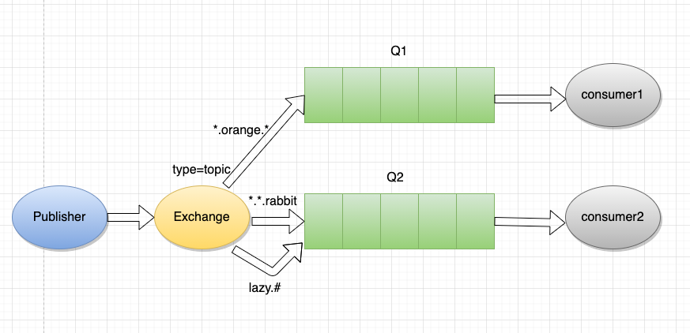

# RabbitMQ

[toc]

## 一、前言

RabbitMQ 是一款目前非常流行的「消息中间件」，有着非常丰富的特性和优势：**低延迟、高可靠、路由灵活、集群扩张性高、高可用、支持多种协议、支持多种客户端和有着丰富的插件系统**。 

RabbitMQ 目前被广泛应用于 **交易、充值、流计算、消息推送、日志流式处理、binglog 分发** 等场景。 


## 二、概念

RabbitMQ 是一款轻量级的，支持多种消息传递协议的高可用的开源「消息队列」。它是一个由 Erlang 语言开发的 `AMQP` 的开源实现。

> `AMQP` ：Advanced Message Queue，**高级消息队列协议**。它是应用层协议的一个开放标准，为面向消息的中间件设计，基于此协议的客户端与消息中间件可传递消息，并不受产品、开发语言等条件的限制。

RabbitMQ 最初起源于金融系统，用于**在分布式系统中存储转发消息**，在**易用性、扩展性、高可用性**等方面表现不俗。 

 

## 三、主要特点

- **可靠性**：RabbitMQ 使用了一些机制来保证可靠性，如 `持久化`、`传输确认`、`发布确认`。

- **灵活的路由**：在消息进入队列之前，是通过「Exchange 」来路由消息的。对于典型的路由功能，RabbitMQ 已经提供了一些 **内置** 的 `Exchange` 来实现；针对更复杂的路由功能，可以将 **多个**  `Exchange` 绑定在一起，也可以通过 **插件机制** 实现自己的 `Exchange`。

- **消息集群**：多个 RabbitMQ 服务器可以组成一个集群，形成一个逻辑 `Broker(代理)` 。 

  > Broker：指 MQ 的服务端实体，帮你把消息从发送端传送到接收端。  

- **高可用**：队列可以在集群中的机器上进行 **镜像**，使得在部分节点出问题的情况下队列仍然可用。

-  **多种协议**：RabbitMQ 支持多种消息队列协议，比如 `STOMP`、`MQTT` 等等。 

- **多语言客户端**：RabbitMQ 几乎支持所有常用语言，比如 `Java`、`.NET`、`Ruby` 等等。 

- **管理界面**：RabbitMQ 提供了一个易用的用户界面，使得用户可以 **监控和管理** 消息 `Broker` 的许多方面。 

- **跟踪机制**：如果消息异常，RabbitMQ 提供了 **消息跟踪机制**，使用者可以找出发生了什么。 

- **插件机制**：RabbitMQ 提供了许多 **插件** 从多方面进行扩展，也可以编写自己的插件。 


## 四、架构模型

架构图：


### 1. Message

消息。消息是 **不具名** 的，它由 **「消息头」和「消息体」** 组成。消息体是 **不透明** 的，而消息头则由一系列的可选属性组成，这些属性包括 `routing-key(路由键)`、`priority(相对于其他消息的优先权)`、`delivery-mode(指出该消息可能需要持久性存储)` 等。 


### 2. Publisher

**消息的生产者**，也是一个**向交换器发布消息的客户端应用程序**。 


### 3. Exchange

交换器，用来**接收生产者发送的消息并将这些消息路由给服务器中的队列**。 

#### Exchange 类型

Exchange 分发消息时根据类型的不同在分发策略上有所不同，目前共四种类型：`direct`、`fanout`、`topic`、`headers` 。

`headers` 匹配的是 `AMQP` 消息的 `header` 而非路由键，此外 `headers` 交换器和 `direct` 交换器**完全一致**，但性能差很多，目前几乎用不到了，所以直接看另外三种类型： 

**(1) Direct Exchange**

Direct：消息中的**路由键**（routing key）如果和 Binding 中的**绑定键**（binding key）一致，交换器就将消息发到对应的队列中。它是 **完全匹配、单播** 的模式。

> 这种模式会处理路由键，也就是所谓的按需索取。需要将一个队列绑定到 Exchange 上面，要求该消息与一个特定的路由键完全匹配，消息才会进入到该队列中。如果一个队列绑定到该交换器上要求路由键“dog”，则只有被标记为“dog”的消息才被转发，不会转发“dog.puppy”，也不会转发“dog.guard”，只会转发“dog”。

 

我们以 `routingKey="error"` 发送消息到 Exchange ，则消息会路由到 `Queue1`（`amqp.gen-S9b…`，这是由 RabbitMQ **自动生成**的 Queue 名称）和 Queue2（`amqp.gen-Agl…`）；如果我们以 `routingKey="info"` 或 `routingKey="warning"` 来发送消息，则消息只会路由到 Queue2。如果我们以其他 routingKey 发送消息，则消息不会路由到这两个 Queue 中。 


**(2) Fanout Exchange**

Fanout：每个发到 Fanout 类型交换器的消息都会**分到所有绑定的队列**上去。很像子网**广播**，每台子网内的主机都获得了一份复制的消息。Fanout 类型转发消息是**最快的**。

 

生产者 Publisher 发送到 Exchange 的所有消息都会**路由**到图中的两个 `Queue`，并最终被两个消费者（Consumer1 与 Comsumer2）**消费**。 

> 在这种模式中我们需要注意，如果将消息发送到一个没有队列绑定的 Exchange 上面，那么该消息将会丢失，这是因为在 RabbitMQ 中 Exchange 是不具备存储消息的能力的，只有队列具备存储消息的能力。 


**(3) Topic Exchange**

Topic： 这种模式和Direct模式的原理是一样的，都是根据路由键进行消息的路由。Topic 交换器通过 **模式匹配** 分配消息的路由键属性，将路由键和某个模式进行匹配，此时队列需要**绑定**到一个模式上。它将路由键（routing key）和绑定键（binding key）的字符串**切分**成单词，这些单词之间用点隔开。它会识别两个通配符：符号 `#` 和符号 `*`。`#` 匹配 `0` 个或多个单词，`*` 匹配不多不少一个单词。

 

`routingKey="quick.orange.rabbit"` 的消息会**同时路由**到 `Q1` 与 `Q2`，`routingKey="lazy.orange.fox"` 的消息会路由到 `Q1`，`routingKey="lazy.brown.fox"` 的消息会路由到`Q2`，`routingKey="lazy.pink.rabbit"` 的消息会路由到 `Q2`（只会投递给 `Q2` **一次**，虽然这个 routingKey 与 `Q2` 的两个 bindingKey 都匹配）；`routingKey="quick.brown.fox"`、`routingKey="orange"`、`routingKey="quick.orange.male.rabbit"` 的消息将会被**丢弃**，因为它们没有匹配任何 bindingKey。 


### 4. Binding

绑定，用于**消息队列和交换器之间的关联**。一个绑定就是基于路由键将 `交换器(Exchange)` 和 `消息队列(Queue)` 连接起来的路由规则，所以可以将交换器理解成一个**由绑定构成的路由表**。 

 


### 5. Queue

队列，是 RabbitMQ 的内部对象，用于**存储消息的容器**，也是消息的终点。一个消息可投入 **一个或多个** 队列。消息一直在队列里面，等待消费者连接到这个队列将其取走。 

 


### 6. Connection

网络连接，比如一个 `TCP` 连接，可 **多路复用**。 


### 7. Channel

信道，**多路复用** 连接中的一条独立的 **双工** 通道。信道是建立在真实的 `TCP` 连接内的虚拟连接，`AMQP` 命令都是通过信道发出去的，不管是发布消息、订阅队列还是接收消息，这些动作都是通过信道完成。因为对于操作系统来说建立和销毁 `TCP` 都是非常昂贵的开销，所以引入了信道的概念，以 **复用** 一条 `TCP` 连接。


### 8. Consumer

**消息的消费者**，表示一个**从消息队列中取得消息的客户端应用程序**。


### 9. Virtual Host

虚拟主机，表示一批交换器、消息队列和相关对象。虚拟主机是**共享相同的身份认证和加密环境的独立服务器域**。


### 10. Broker

表示消息队列服务器**实体**。消息从 `Producer` 发往 `Broker`，`Broker` 将消息存储至本地，然后 `Consumer` 从 `Broker` 拉取消息，或者 `Broker` 推送消息至 `Consumer`，最后消费。 

 


## 五、适用场景

### 应用解耦

以「订单系统」来举例，一般都会在订单系统调用库存系统的接口（如：减库存），如下：

 

这种处理方案会引发很多问题，当库存系统无法访问时，我们订单系统的减库存操作就会失败。

而当我们使用了**消息队列**后，用户下单后，订单系统会进行**持久化处理**，返回用户订单下单成功的消息，并将消息写入消息队列；库存系统订阅下单的消息，采用 `拉/推` 的方式，获取下单信息，库存系统根据下单信息，进行减库存的操作。

 

这样即使下单时库存系统出现问题，也不影响正常下单，因为下单后，订单系统已经将订单消息写入了消息队列，其他操作就不关心了，实现订单系统与库存系统的**应用解耦**。 


### 异步处理

以「用户注册」来举例，用户注册之后需要发送注册邮件和注册短信，如下：

**(1) 串行方式**：将注册信息持久化后，**先发送注册邮件，再发送注册短信**。三个业务全部完成后，返回给客户端。 

 

**(2) 并行方式**： 将注册信息持久化后，**发送注册邮件的同时，发送注册短信**。三个业务全部完成后，返回给客户端。与串行的差别是，并行的方式可以提高处理的时间。 

> 假设三个业务节点每个使用 50 ms，不考虑其他开销，则串行方式的时间是 150 ms，并行的时间可能是 100 ms。则串行的方式 1 秒内可处理 6 次请求，并行方式 1 秒内可处理 10 次请求，综上所述，传统的方式系统的性能（并发量，吞吐量，响应时间）会有瓶颈。如何解决这个问题呢？ 

当我们使用消息队列，**将不是必须立马进行的业务逻辑进行异步处理**。如下：

 

按照上图，用户的响应时间相当于是注册信息写入数据库的时间和将消息插入消息队列，也就是 55 ms。邮件、短信消息写入队列后，直接返回，。如此消息队列异步处理后，1 秒内可处理 18 次请求，大大提高了系统的性能。

再举一个例子：随着公司的发展你可能会发现你项目的**请求链路越来越长**，例如刚开始的电商项目，可以就是粗暴的扣库存、下单。后面慢慢地又加上积分服务、短信服务等。这一路同步调用下来客户可能等急了，这时候就是消息队列登场的好时机。

**调用链路长、响应就慢了**，并且相对于扣库存和下单，积分和短信没必要这么的 "及时"。因此只需要在下单结束那个流程，扔个消息到消息队列中就可以直接返回响应了。而且积分服务和短信服务可以并行的消费这条消息。

可以看出消息队列可以**减少请求的等待，还能让服务异步并发处理，提升系统总体性能**。


### 流量削峰

 

以「秒杀」来举例，每逢天猫淘宝双11的时候，系统会在特定的那个时间，比如凌晨 0 点的每秒需求会突然暴增，如果不进行系统结构升级，是经不起这么多的请求的，会导致系统崩溃。

 

当我们使用了消息队列之后，如果在这个**高峰期**有很多用户进来，每秒有 5000 个请求，我们只需要将这 5000 个请求放在消息队列里，系统每秒处理 2000 个请求，会从消息队列里拉取出对应的数量，每秒只会处理这 2000 个请求。这样在秒杀持续的这个时间段内，会有几十万或者更多的**请求都放在消息队列**里。因为毕竟秒杀只是会在短暂的那一段时间，等它过去之后，每秒可能就只有几十、几百个请求进入消息队列，但是系统还会按照每秒 2000 个请求的速度去处理。所以，秒杀结束，系统会把那些**剩下的消息都消费掉**。这就保证了系统不会在高峰期间被冲垮掉。


## 六、安装步骤

- **Linux**：https://blog.csdn.net/qq_45173404/article/details/116429302
- **Windows**：https://www.jianshu.com/p/a2c9a4242508
- **MacOS**：https://juejin.cn/post/6844904110160871437


## 七、SpringBoot 集成演示

springboot 集成 RabbitMQ 非常简单，如果只是简单的使用，配置非常少， springboot 提供了 `spring-boot-starter-amqp` 对消息各种支持。

配置 `pom` 文件，主要是添加 `spring-boot-starter-amqp` 的支持。在 pom.xml 中添加以下配置：

```xml
<dependency>
   <groupId>org.springframework.boot</groupId>
   <artifactId>spring-boot-starter-amqp</artifactId>
</dependency>
```

接着配置 `application.properties/application.yml` 文件，配置 rabbitmq 的**安装地址、端口以及账户信息**，下面以 `application.properties` 为例：

```properties
spring.application.name=spirng-boot-rabbitmq
spring.rabbitmq.host=127.0.0.1
spring.rabbitmq.port=5672
spring.rabbitmq.username=admin
spring.rabbitmq.password=admin
```

配置队列：

```java
package com.mars.rabbitmq
import org.springframework.amqp.core.Queue;
import org.springframework.context.annotation.Bean;
import org.springframework.context.annotation.Configuration
@Configuration
public class RabbitConfig {
    @Bean
    public Queue queue() {
        return new Queue("q_hello");
    }
}
```

发送者：

```java
package com.mars.rabbitmq
import org.springframework.amqp.core.AmqpTemplate;
import org.springframework.beans.factory.annotation.Autowired;
import org.springframework.stereotype.Component
import java.text.SimpleDateFormat;
import java.util.Date
@Component
public class HelloSender {
    @Autowired
    private AmqpTemplate rabbitTemplate;
    public void send() {
        String date = new SimpleDateFormat("yyyy-MM-dd HH:mm:ss").format(new Date());//24小时制
        String context = "hello " + date;
        System.out.println("Sender : " + context);
        //简单队列的情况下routingKey即为Q名
        this.rabbitTemplate.convertAndSend("q_hello", context);
    }
}
```

接收者：

```java
package com.mars.rabbitmq
import org.springframework.amqp.rabbit.annotation.RabbitHandler;
import org.springframework.amqp.rabbit.annotation.RabbitListener;
import org.springframework.stereotype.Component
@Component
@RabbitListener(queues = "q_hello")//监听的队列
public class HelloReceiver 
    @RabbitHandler
    public void process(String hello) {
        System.out.println("Receiver  : " + hello);
    }
}
```

测试：

```java
package com.mars.rabbitmq
import org.junit.Test;
import org.junit.runner.RunWith;
import org.springframework.beans.factory.annotation.Autowired;
import org.springframework.boot.test.context.SpringBootTest;
import org.springframework.test.context.junit4.SpringRunner
@RunWith(SpringRunner.class)
@SpringBootTest
public class RabbitMqHelloTest 
    @Autowired
    private HelloSender helloSender
    @Test
    public void hello() throws Exception {
        helloSender.send();
    }
}
```


## 八、内建集群

RabbitMQ 支持 **内建集群**，这个功能设计的目的是允许消费者和生产者**在节点崩溃的情况下继续运行**，以及通过添加更多的节点来**线性扩展消息通信吞吐量**。RabbitMQ 内部利用 Erlang 提供的分布式通信框架 `OTP` 来满足上述需求，使客户端在失去一个 RabbitMQ 节点连接的情况下，还是能够重新连接到集群中的任何其他节点**继续生产、消费消息**。 

RabbitMQ 集群中的基本概念：

**队列元数据**：包括**队列名称**和它们的**属性**，比如是否可持久化，是否自动删除。

**交换器元数据**：交换器**名称**、**类型**、**属性**。

**绑定元数据**：内部是一张**表格**记录如何将消息路由到队列。

**vhost 元数据**：为 vhost 内部的队列、交换器、绑定提供**命名空间和安全属性**。


## 九、技术选型

> 日常开发中面对不同场景我们该如何选择消息队列 MQ 呢？

`ActiveMQ`：如果用户访问量在 ActiveMQ 的可承受范围内，而且主要是基于**解耦和异步**来用的，可以考虑 ActiveMQ，也比较贴近 Java 工程师的使用习惯，但是 ActiveMQ 现在停止维护了，同时 ActiveMQ **并发度不高**，所以**业务量一定**的情况下可以考虑使用。 

`RabbitMQ`：作为一个有着纯正血统的消息中间件，有着**高级消息协议** `AMQP` 的完美结合，在消息中间件中地位无可取代。但是 erlang 语言阻止了我们去深入研究和掌控，对公司而言，底层技术无法控制，但是确实是**开源**的，有比较**稳定**的支持，活跃度也高。 

`RocketMQ`：RocketMQ 诞生比较晚，并且**更新迭代很快**，这个意味着在使用过程中有可能会遇到很多坑，所以如果公司 Java 技术不是很强，不推荐使用。 

> **中小型公司**，技术实力较为一般，技术挑战不是特别高，用 `ActiveMQ`、`RabbitMQ` 是不错的选择；**大型公司**，基础架构研发实力较强，用 `RocketMQ` 是很好的选择。 

`Kafka`：如果是**大数据领域**的实时计算、日志采集等场景，用 `Kafka` 是业内标准的，绝对没问题，**社区活跃度很高**，几乎是全世界这个领域的事实性规范。 


从**性能**上来看，使用文件系统的消息中间件（Kafka、RokcetMq）性能是最好的，所以基于文件系统存储的消息中间件是发展趋势。（从**存储方式和效率**来看 `文件系统 > KV存储 > 关系型数据库` ） 


## 十、消息队列常见考点

### 如何保证消息不丢失

 

从上图可以看到一共有三个阶段，分别是**生产消息、存储消息和消费消息**。从这三个阶段分别入手来看看如何确保消息不会丢失。 

**生产消息**

生产者发送消息至 `Broker`，需要处理 `Broker` 的响应，不论是同步还是异步发送消息，同步和异步回调都需要做好 `try-catch`，妥善地处理响应，如果 `Broker` 返回写入失败等错误消息，需要重试发送。当多次发送失败需要作报警，日志记录等。

这样就能保证在生产消息阶段消息不会丢失。

**存储消息**

存储消息阶段需要在**消息刷盘之后**再给生产者响应，假设消息写入缓存中就返回响应，那么机器突然断电这条消息就没了，而生产者以为已经发送成功了。

如果 `Broker` 是集群部署，有多副本机制，则消息不仅仅要写入当前 `Broker`，还需要写入副本机中。那配置成至少写入两台机子后再给生产者响应。这样基本上就能保证存储的可靠了。一台挂了还有一台还在呢（假如怕两台都挂了...那就再多些）。

**消费消息**

在**消费者真正执行完业务逻辑之后，再发送给 `Broker` 消费成功**，这才是真正的消费了。

所以只要我们在消息业务逻辑处理完成之后再给 `Broker` 响应，那么消费阶段消息就不会丢失。

**小结**

保证消息的可靠性需要**三方配合**：

- `生产者` 需要处理好 `Broker` 的响应，出错情况下利用重试、报警等手段。
- `Broker` 需要控制响应的时机，单机情况下是消息刷盘后返回响应；集群多副本情况下，则需要发送至两个副本及以上的情况下再返回响应。
- `消费者` 需要在执行完真正的业务逻辑之后再返回响应给`Broker`。

但是要注意**消息可靠性增强了，性能就下降了**，等待消息刷盘、多副本同步后返回都会影响性能。因此还是看业务，例如日志的传输可能丢那么一两条关系不大，因此没必要等消息刷盘再响应。


### 如何处理重复消息

>我们先来看看能不能避免消息的重复。
>
>假设我们发送消息，就管发，不管 `Broker` 的响应，那么我们发往 `Broker` 是不会重复的。
>
>但是一般情况我们是不允许这样的，这样消息就完全不可靠了，我们的基本需求是消息至少得发到 `Broker` 上，那就得等 `Broker` 的响应，那么就可能存在 `Broker` 已经写入了，但当时响应由于网络原因生产者没有收到，然后生产者又重发了一次，此时消息就重复了。
>
>再看消费者消费的时候，假设消费者拿到消息消费了，业务逻辑已经走完了，事务提交了，此时需要更新 `Consumer offset` 了，然后这个消费者挂了，另一个消费者顶上，此时 `Consumer offset` 还没更新，于是又拿到刚才那条消息，业务又被执行了一遍。于是消息又重复了。

可以看到正常业务而言**消息重复是不可避免的**，因此只能从**另一个角度**来解决重复消息的问题。

关键点就是**幂等**。既然不能防止重复消息的产生，那么只能在业务上处理重复消息所带来的影响。 

#### 幂等处理重复消息

幂等是数学上的概念，可以理解为**同样的参数多次调用同一个接口和调用一次产生的结果是一致的**。

> 例如这条 SQL：`update t1 set money = 150 where id = 1 and money = 100;` 执行多少遍 `money` 都是150，这就叫幂等。

因此需要改造业务处理逻辑，使得在重复消息的情况下也不会影响最终的结果。

可以通过上面那条 SQL 一样，做了个**前置条件判断**，即 `money = 100` 情况，并且直接修改；更通用的是做个 `version` 即**版本号控制**，对比消息中的版本号和数据库中的版本号。

或者通过**数据库的约束例如唯一键**，例如 `insert into update on duplicate key...`。

或者**记录关键的 key**，比如处理订单这种，记录订单 ID，假如有重复的消息过来，先判断下这个 ID 是否已经被处理过了，如果没处理再进行下一步。当然也可以用全局唯一 ID 等等。

基本上就这么几个套路，真正应用到实际中还是得看具体业务细节。


### 如何保证消息的有序性

有序性：**全局有序 和 部分有序**。 

#### 全局有序

如果要保证消息的全局有序，首先只能由一个生产者往 `Topic` 发送消息，并且一个 `Topic` 内部只能有一个队列（分区）。消费者也必须是单线程消费这个队列。这样的消息就是全局有序的！

> 不过一般情况下我们都不需要全局有序，即使是同步 `MySQL Binlog` 也只需要保证单表消息有序即可。

 


#### 部分有序

绝大部分的有序需求是部分有序，部分有序我们就可以将 `Topic` 内部划分成我们需要的队列数，把消息通过特定的策略发往固定的队列中，然后每个队列对应一个单线程处理的消费者。这样即完成了部分有序的需求，又可以通过队列数量的并发来提高消息处理效率。 

 


### 如何处理消息的堆积

消息的堆积往往是因为**生产者的生产速度与消费者的消费速度不匹配**。有可能是因为消息消费失败反复重试造成的，也有可能就是消费者消费能力弱，渐渐地消息就积压了。

因此我们需要**先定位消费慢的原因**，如果是 `bug` 则处理 `bug` ，如果是因为本身消费能力较弱，我们可以优化下消费逻辑，比如之前是一条一条消息消费处理的，这次我们批量处理，比如数据库的插入，一条一条插和批量插效率是不一样的。

假如逻辑已经都优化了，但还是慢，那就得考虑水平扩容了，增加 `Topic` 的队列数和消费者数量，**注意队列数一定要增加**，不然新增加的消费者是没东西消费的。**一个 Topic 中，一个队列只会分配给一个消费者**。

当然消费者内部是单线程还是多线程消费那看具体场景。不过要注意上面提到的消息丢失的问题，如果消费者是将接收到的消息写入**内存队列**之后，然后就返回响应给 `Broker`，然后多线程向内存队列消费消息，假设此时消费者宕机了，内存队列里面还未消费的消息也就丢了。