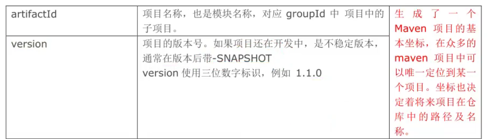
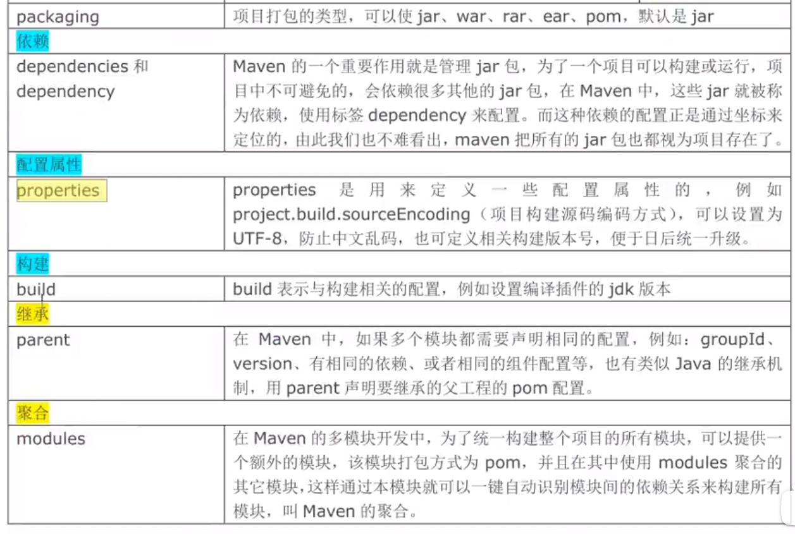

# Maven 学习笔记

> 学习动力节点Maven教程所做笔记。


## 第一部分

### 1.完成一个java项目，需要做哪些工作

 1.分析项目要做什么，知道项目有哪些组成部分。
 2.设计项目，通过哪些步骤，使用哪些技术。需要多少人， 多长的时间。
 3.组建团队，招人， 购置设备，服务器， 软件， 笔记本。
 4.开发人员写代码。 开发人员需要测试自己写代码。 重复多次的工作。
 5.测试人员，测试项目功能是否符合要求。
  测试开发人员提交代码-如果测试有问题--需要开发人员修改--在提交代码给测试--测试人员在测试代码-如果还有问题-在交给开发人员-开发人员在提交-再测试直到-测试代码通过。

### 2.传统开发项目的问题，没有使用maven管理的项目

  1）很多模块，模块之间有关系， 手工管理关系，比较繁琐。
  2）需要很多第三方功能， 需要很多jar文件，需要手工从网络中获取各个jar
  3）需要管理jar的版本， 你需要的是mysql.5.1.5.jar 拿你不能给给一个mysql.4.0.jar
  4）管理jar文件之间的依赖， 你的项目要使用a.jar 需要使用b.jar里面的类。
     必须首先获取到b.jar才可以， 然后才能使用a.jar. 

     a.jar需要b.jar这个关系叫做依赖， 或者你的项目中要使用mysql的驱动， 也可以叫做项目依赖mysql驱动。
     a.class使用b.class， a依赖b类

###  3.需要改进项目的开发和管理，需要maven

1. ​    maven可以管理jar文件

2. ​    自动下载jar和他的文档，源代码

3. ​    管理jar直接的依赖， a.jar需要b.jar ， maven会自动下载b.jar

4. ​    管理你需要的jar版本

5. ​    帮你编译程序，把java编译为class

6. ​    帮你测试你的代码是否正确。

7. ​    帮你打包文件，形成jar文件，或者war文件

8. ​    帮你部署项目

   

###  4.构建:项目的构建

构建是面向过程的，就是一些步骤，完成项目代码的编译，测试，运行，打包，部署等等。
   maven支持的构建包括有：
    1.清理， 把之前项目编译的东西删除掉，为新的编译代码做准备。
    2.编译， 把程序源代码编译为执行代码， java-class文件
             批量的，maven可以同时把成千上百的文件编译为class。
	     javac 不一样，javac一次编译一个文件。
    3.测试， maven可以执行测试程序代码，验证你的功能是否正确。
             批量的，maven同时执行多个测试代码，同时测试很多功能。
    4.报告， 生成测试结果的文件， 测试通过没有。
    5.打包， 把你的项目中所有的class文件，配置文件等所有资源放到一个压缩文件中。
              这个压缩文件就是项目的结果文件， 通常java程序，压缩文件是jar扩展名的。
	          对于web应用，压缩文件扩展名是.war
    6.安装， 把5中生成的文件jar，war安装到本机仓库
    7.部署， 把程序安装好可以执行。


###  5.maven核心概念： 用好maven，了解这些概念

①POM ： 一个文件， 名称是pom.xml ,  pom翻译过来叫做项目对象模型。 
         maven把一个项目当做一个模型使用。控制maven构建项目的过程，管理jar依赖。

②约定的目录结构 ： maven项目的目录和文件的位置都是规定的。

③坐标 ：是一个唯一的字符串，用来表示资源的。

④依赖管理 ： 管理你的项目可以使用jar文件

⑤仓库管理（了解） ：你的资源存放的位置

⑥生命周期 (了解) ： maven工具构建项目的过程，就是生命周期。

⑦插件和目标（了解）：执行maven构建的时候用的工具是插件

⑧继承

⑨聚合

讲maven的使用，先难后易的。 难是说使用maven的命令，完成maven使用 ， 在idea中直接使用maven，代替命令。

### 6.maven工具的安装和配置。

  1）需要从maven的官网下载maven的安装包 apache-maven-3.3.9-bin.zip    我用3.8.1
  2）解压安装包，解压到一个目录，非中文目录。
        子目录 bin ：执行程序，主要是mvn.cmd
		          conf ：maven工具本身的配置文件 settings.xml
  3）配置环境变量
     在系统的环境变量中，指定一个M2_HOME的名称， 指定它的值是maven工具安装目录，bin之前的目录

    M2_HOME=D:\work\maven_work\apache-maven-3.3.9
    
     再把M2_HOME加入到path之中，在所有路径之前加入 %M2_HOME%\bin;

  4）验证，新的命令行中，执行mvn -v

	注意：需要配置JAVA_HOME ，指定jdk路径

  


	C:\Users\Administrator>mvn -v
	 出现如下内容，maven安装，配置正确。
	Apache Maven 3.3.9 (bb52d8502b132ec0a5a3f4c09453c07478323dc5; 2015-11-11T00:41:4
	Maven home: D:\work\maven_work\apache-maven-3.3.9
	Java version: 1.8.0_40, vendor: Oracle Corporation
	Java home: C:\java\JDK8-64\jre
	Default locale: zh_CN, platform encoding: GBK
	OS name: "windows 7", version: "6.1", arch: "amd64", family: "dos"


## 第二部分

###  1.maven约定的目录结构， 约定是大家都遵循的一个规则。

   每一个maven项目在磁盘中都是一个文件夹（项目-Hello）
	Hello/
	  -------/src
	         ------/main           #放你主程序java代码和配置文件
	            ----------/java       #你的程序包和包中的java文件
	            ----------/resources  #你的java程序中要使用的配置文件

	  ------/test  #放测试程序代码和文件的（可以没有）
	  ----------/java       #测试程序包和包中的java文件
	  ----------/resources  #测试java程序中要使用的配置文件
	
	  ---/pom.xml  #maven的核心文件（maven项目必须有）

###  2.疑问： 命令行中 mvn compile  指令是编译src/main目录下的所有java文件的。

   1）命令行中为什么有下载现象
	   maven工具执行的操作需要很多插件（java类--jar文件）完成
	2）下载什么东西了
	    jar文件--叫做插件--插件用来完成某些功能

	3）下载的东西存放到哪里了。
	    默认仓库（本机仓库）：
	   C:\Users\（登录操作系统的用户名）Administrator\.m2\repository


	Downloading: https://repo.maven.apache.org/maven2/org/apache/maven/maven-plugin-parameter-documenter-2.0.9.pom

   https://repo.maven.apache.org ：中央仓库的地址


	执行mvn compile， 结果是在项目的根目录下生成target目录（结果目录，与src同级），
	maven编译的java程序，最后的class文件都放在target目录中


	设置本机存放资源的目录位置(设置本机仓库)：
	 1. 修改maven的配置文件， maven安装目录/conf/settings.xml
	    先备份 settings.xml
	
	 2. 修改 <localRepository>  指定你的目录（不要使用中文目录）
	
	 D:\work\maven_work\maven_repository
	 
	 我的：D:\JavaEnvironment\Maven\maven_repository
	 【记得上面的 \ 统统得改成 / 】

###  3.仓库

  1）仓库是什么： 仓库是存放东西的， 存放maven使用的jar 和 我们项目使用的jar
     > maven使用的插件（各种jar）

	  > 我项目使用的jar(第三方的工具)

  2）仓库的分类
     >本地仓库， 就是你的个人计算机上的文件夹，存放各种jar
	 >远程仓库， 在互联网上的，使用网络才能使用的仓库
	    ①：中央仓库，最权威的， 所有的开发人员都共享使用的一个集中的仓库，
			      https://repo.maven.apache.org ：中央仓库的地址
		②：中央仓库的镜像：就是中央仓库的备份， 在各大洲，重要的城市都是镜像。

		③：私服，在公司内部，在局域网中使用的， 不是对外使用的。


  3）仓库的使用，maven仓库的使用不需要人为参与。 

	如：	开发人员需要使用mysql驱动--->maven首先查本地仓库--->私服--->镜像--->中央仓库


###  4.pom:项目对象模型，是一个pom.xml文件







​    1）坐标：唯一值， 在互联网中唯一标识一个项目的

```xml
	 <groupId>公司域名的倒写</groupId>
     <artifactId>自定义项目名称</artifactId>
     <version>自定版本号</version>
```

	   https://mvnrepository.com/ 搜索使用的中央仓库， 使用groupId 或者 artifactId作为搜索条件


	  2） packaging： 打包后压缩文件的扩展名，默认是jar ，web应用是war 
	      packaging 可以不写， 默认是jar


	 3) 依赖
	    dependencies 和dependency ，相当于是 java代码中import
	
		 你的项目中要使用的各种资源说明， 比如我的项目要使用mysql驱动
	
		 <dependencies>
			<!--配置依赖  相当于java代码中 import -->
		  <dependency>
			<groupId>mysql</groupId>
			<artifactId>mysql-connector-java</artifactId>
			<version>5.1.9</version>
		 </dependency>
	 
	 </dependencies>
	
	  4）properties：设置属性
	
	  5）build ： maven在进行项目的构建时， 配置信息，例如指定编译java代码使用的jdk的版本等


###   5.maven生命周期， maven的命令，maven的插件

​    maven的生命周期：就是maven构建项目的过程，清理，编译，测试，报告，打包，安装，部署
​	 maven的命令：maven独立使用，通过命令，完成maven的生命周期的执行。
​	              maven可以使用命令，完成项目的清理，编译，测试等等

	 maven的插件： maven命令执行时，真正完成功能的是插件，插件就是一些jar文件， 一些类。


   1）单元测试（测试方法）：用的是junit， junit是一个专门用于测试的框架（工具）。
	   junit测试的内容： 测试的是类中的方法， 每一个方法都是独立测试的。
		                   方法是测试的基本单位（单元）。


      maven借助单元测试，批量的测试你类中的大量方法是否符合预期的。


  2）使用步骤
     1.加入依赖，在pom.xml加入单元测试依赖

```xml
	  	 <!-- 单元测试 -->
		 <dependency>
			<groupId>junit</groupId>
			<artifactId>junit</artifactId>
			<version>4.11</version>
			<scope>test</scope>
		</dependency>
```


     2.在maven项目中的src/test/java目录下，创建测试程序。
        推荐的创建类和方法的提示：
    	 1.测试类的名称 是Test + 你要测试的类名
    	 2.测试的方法名称 是：Test + 方法名称
    
    	 例如你要测试HelloMaven ,
    	 创建测试类 TestHelloMaven
       @Test
    	 public void testAdd(){
          测试HelloMaven的add方法是否正确
    	 }


		 其中testAdd叫做测试方法，它的定义规则
		 1.方法是public的，必须的
		 2.方法没有返回值， 必须的
		 3.方法名称是自定义的，推荐是test + 方法名称
		 4.在方法的上面加入 @Test


	 3)mvn compile 
	   编译main/java/目录下的 java 为class文件， 同时把class拷贝到 target/classes目录下面
		把main/resources目录下的所有文件 都拷贝到target/classes目录下


**插件的配置**


### 6.Maven的常用命令


## 第三部分（重点！！）

### IDEA使用Maven

 1.在idea中设置maven ，让idea和maven结合使用。 
   idea中内置了maven ，一般不使用内置的， 因为用内置修改maven的设置不方便。
	使用自己安装的maven， 需要覆盖idea中的默认的设置。让idea知道maven安装位置等信息

	配置的入口 ①：配置当前工程的设置， file--settings ---Build, Excution,Deployment--Build Tools
	               --Maven 
						   Maven Home directory: maven的安装目录
							User Settings File :  就是maven安装目录conf/setting.xml配置文件
							Local Repository :    本机仓库的目录位置
	
					   --Build Tools--Maven--Runner  
						  VM Options : -DarchetypeCatalog=internal
						  JRE: 你项目的jdk


                    -DarchetypeCatalog=internal : maven项目创建时，会联网下载模版文件，
    					  比较大， 使用-DarchetypeCatalog=internal，不用下载， 创建maven项目速度快。


	           （现在没有other settings了） ②：配置以后新建工程的设置， file--other settings--Settings for New Project


2.使用模版创建项目
  1）maven-archetype-quickstart : 普通的java项目
  2）maven-archetype-webapp : web工程


**添加模板的流程：**

这里会需要坐标的三个值，以quickstart为例，直接到这个网址找：https://maven.apache.org/archetypes/maven-archetype-quickstart/summary.html


进入网址后：可以看到Build Information即为我们需要的坐标值，将坐标值填入上面即可


用maven-archetype-quickstart 模板创建了java项目后得自己手动在main和test添加目录下添加resources文件夹，右键new下面的Directory选中后下面可以选resources类型的文件夹，选中回车就好了

**普通java项目的完整目录：**


其中App和AppTest是默认生成的，可以删掉

**Web工程的完整目录：**


其中main下的java、resource还有test及其下所有文件夹都得自己添加，new Directory后会有提示


### **普通java项目的pom.xml**

```xml
<?xml version="1.0" encoding="UTF-8"?>

<project xmlns="http://maven.apache.org/POM/4.0.0" xmlns:xsi="http://www.w3.org/2001/XMLSchema-instance"
  xsi:schemaLocation="http://maven.apache.org/POM/4.0.0 http://maven.apache.org/xsd/maven-4.0.0.xsd">
  <modelVersion>4.0.0</modelVersion>

  <!-- 自己的项目坐标（gav） -->
  <groupId>com.kaho</groupId>
  <artifactId>ch01-javase-maven</artifactId>
  <version>1.0</version>
    <!-- 这里指明包的类型 -->
  <packaging>jar</packaging> 


  <properties>
    <!-- maven构建项目使用的是utf-8，避免中文的乱码 -->
    <project.build.sourceEncoding>UTF-8</project.build.sourceEncoding>
    <!-- 编译java代码使用的jdk版本 -->
    <maven.compiler.source>1.8</maven.compiler.source>
    <!-- 你的java项目应该运行在什么样的jdk版本 -->
    <maven.compiler.target>1.8</maven.compiler.target>
  </properties>

  <!-- 依赖 -->
  <dependencies>
    <!-- 单元测试 -->
    <dependency>
      <groupId>junit</groupId>
      <artifactId>junit</artifactId>
      <version>4.11</version>
      <scope>test</scope>
    </dependency>
  </dependencies>

  <!-- 插件配置管理，这一块自动生成的，可以删掉，写不写都实际存在 -->
  <build>
    <pluginManagement><!-- lock down plugins versions to avoid using Maven defaults (may be moved to parent pom) -->
      <plugins>
        <!-- clean lifecycle, see https://maven.apache.org/ref/current/maven-core/lifecycles.html#clean_Lifecycle -->
        <plugin>
          <artifactId>maven-clean-plugin</artifactId>
          <version>3.1.0</version>
        </plugin>
        <!-- default lifecycle, jar packaging: see https://maven.apache.org/ref/current/maven-core/default-bindings.html#Plugin_bindings_for_jar_packaging -->
        <plugin>
          <artifactId>maven-resources-plugin</artifactId>
          <version>3.0.2</version>
        </plugin>
        <plugin>
          <artifactId>maven-compiler-plugin</artifactId>
          <version>3.8.0</version>
        </plugin>
        <plugin>
          <artifactId>maven-surefire-plugin</artifactId>
          <version>2.22.1</version>
        </plugin>
        <plugin>
          <artifactId>maven-jar-plugin</artifactId>
          <version>3.0.2</version>
        </plugin>
        <plugin>
          <artifactId>maven-install-plugin</artifactId>
          <version>2.5.2</version>
        </plugin>
        <plugin>
          <artifactId>maven-deploy-plugin</artifactId>
          <version>2.8.2</version>
        </plugin>
        <!-- site lifecycle, see https://maven.apache.org/ref/current/maven-core/lifecycles.html#site_Lifecycle -->
        <plugin>
          <artifactId>maven-site-plugin</artifactId>
          <version>3.7.1</version>
        </plugin>
        <plugin>
          <artifactId>maven-project-info-reports-plugin</artifactId>
          <version>3.0.0</version>
        </plugin>
      </plugins>
    </pluginManagement>
  </build>
</project>

```

### Web项目的pom.xml

```xml
<?xml version="1.0" encoding="UTF-8"?>

<project xmlns="http://maven.apache.org/POM/4.0.0" xmlns:xsi="http://www.w3.org/2001/XMLSchema-instance"
  xsi:schemaLocation="http://maven.apache.org/POM/4.0.0 http://maven.apache.org/xsd/maven-4.0.0.xsd">
  <modelVersion>4.0.0</modelVersion>

  <groupId>com.kaho</groupId>
  <artifactId>ch02-maven-web</artifactId>
  <version>1.0</version>
  <!-- web项目是war文件 -->
  <packaging>war</packaging>


  <properties>
    <project.build.sourceEncoding>UTF-8</project.build.sourceEncoding>
    <maven.compiler.source>1.8</maven.compiler.source>
    <maven.compiler.target>1.8</maven.compiler.target>
  </properties>

  <dependencies>
    <dependency>
      <groupId>junit</groupId>
      <artifactId>junit</artifactId>
      <version>4.11</version>
      <scope>test</scope>
    </dependency>
  </dependencies>

  <build>
    <finalName>ch02-maven-web</finalName>
    <pluginManagement><!-- lock down plugins versions to avoid using Maven defaults (may be moved to parent pom) -->
      <plugins>
        <plugin>
          <artifactId>maven-clean-plugin</artifactId>
          <version>3.1.0</version>
        </plugin>
        <!-- see http://maven.apache.org/ref/current/maven-core/default-bindings.html#Plugin_bindings_for_war_packaging -->
        <plugin>
          <artifactId>maven-resources-plugin</artifactId>
          <version>3.0.2</version>
        </plugin>
        <plugin>
          <artifactId>maven-compiler-plugin</artifactId>
          <version>3.8.0</version>
        </plugin>
        <plugin>
          <artifactId>maven-surefire-plugin</artifactId>
          <version>2.22.1</version>
        </plugin>
        <plugin>
          <artifactId>maven-war-plugin</artifactId>
          <version>3.2.2</version>
        </plugin>
        <plugin>
          <artifactId>maven-install-plugin</artifactId>
          <version>2.5.2</version>
        </plugin>
        <plugin>
          <artifactId>maven-deploy-plugin</artifactId>
          <version>2.8.2</version>
        </plugin>
      </plugins>
    </pluginManagement>
  </build>
</project>

```


### Maven工具窗口


例如：双击clean，则会把左侧目录中的target目录清除


双击compile，则会编译生成target

双击test，则会执行test中的测试代码，如：


双击package，则会将工程打包并生成在target目录下，如：


双击install，就会将工程jar安装到本地仓库中，如：


插件和依赖：


### Maven配置Web环境

不需要和以往一样，而是用依赖的方式，在pom.xml文件中加入下面代码，这样就可以写servlet程序了

```xml
    <!-- 加入servlet依赖（servlet的jar）-->
    <dependency>
      <groupId>javax.servlet</groupId>
      <artifactId>javax.servlet-api</artifactId>
      <version>3.1.0</version>
      <scope>provided</scope>
    </dependency>
    <!-- jsp的依赖（jsp相关的jar加入进来） -->
    <dependency>
      <groupId>javax.servlet.jsp</groupId>
      <artifactId>jsp-api</artifactId>
      <version>2.1</version>
      <scope>provided</scope>
    </dependency>
    <!-- Tomcat的依赖，添加后就能在new中就可以找到servlet了 -->
    <dependency>
      <groupId>org.apache.tomcat</groupId>
      <artifactId>tomcat</artifactId>
      <version>8.0.50</version>
      <type>pom</type>
    </dependency>    
```

**注意：**在加入上述代码后可能会爆红，只需要进入maven工具窗口中刷新一下即可


### IDEA中导入模块module


选择项目文件夹，点击OK


导入后记得在这设置JDK


## 第四部分

 1依赖范围， 使用scope表示的。
   scope的值有 compile, test, provided ,  默认是compile（所有过程都起作用）
	scope:表示依赖使用的范围，也就是在maven构建项目的哪些阶段中起作用。
	    maven构建项目  编译， 测试 ，打包， 安装 ，部署 过程（阶段）


   junit的依赖范围是 test， 即只在测试过程中起作用

```xml
<dependency>
      <groupId>junit</groupId>
      <artifactId>junit</artifactId>
      <version>4.11</version>
      <scope>test</scope>
</dependency>
```


```xml
<dependency>
  <groupId>a</groupId>
  <artifactId>b</artifactId>   b.jar 是compile，即所有过程都起作用
  <version>4.11</version>
  <scope>compile</scope>
</dependency>
```


```xml
 <dependency>
  <groupId>javax.servlet</groupId>
  <artifactId>javax.servlet-api</artifactId>
  <version>3.1.0</version>          servlet.jar
  <scope>provided</scope> 提供者：在编译、测试过程起作用，但打包、安装、部署不需要
</dependency>
```


   在写项目的过程中的用到的所有依赖（jar） ，必须在本地仓库中有。

​	没有的话必须通过maven下载， 包括provided的都必须下载。

	你在servlet需要继承HttpServlet( provided) , 你使用的HttpServlet是maven仓库中的。
	
	当你的写好的程序， 放到 tomat服务器中运行时， 此时你的程序中不包含servlet的jar
	因为tomcat提供了 servlet的.jar


## 第五部分

  maven常用操作

###   1.maven的属性设置

​     \<properties> 设置maven的常用属性


###   2.maven的全局变量

​     自定义的属性，1.在\<properties> 通过自定义标签声明变量（标签名就是变量名）
​	                 2.在pom.xml文件中的其它位置，使用 ${标签名} 使用变量的值

	自定义全局变量一般是定义 依赖的版本号， 当你的项目中要使用多个相同的版本号，
	先在<properties>中使用全局变量定义，再在<version>中使用${变量名}表示这个统一的版本号


###   3.资源插件

```xml
 <build>
	<resources>
	<resource>
	<directory>src/main/java</directory><!--所在的目录-->
	<includes><!--包括目录下的.properties,.xml 文件都会扫描到-->
	<include>**/*.properties</include>
	<include>**/*.xml</include>
	</includes>
	<!--filtering 选项 false 不启用过滤器， *.property 已经起到过滤的作用了 -->
	<filtering>false</filtering>
	</resource>
	</resources>
 </build>
```

  作用： mybatis中会用到这个

    1. 默认没有使用resources的时候， maven执行编译代码时， 会把src/main/resources目录中的文件拷贝到target/classes目录中。对于src/main/java目录下的非java文件不处理，不拷贝到target/classes目录中
    
    2.我们的程序有需要把一些文件放在src/main/java目录中，当执行java程序时，需要用到src/main/java目录中的文件。需要告诉maven 在 mvn compile 编译 src/main/java目录下的程序时，需要把这些文件一同拷贝到target/classes目录中。此时就需要在 <build> 中加入 <resources>


# 慕课网

## Maven的坐标

GroupId：机构或者团体的英文，采用“逆向域名”形式书写

ArtifactId：项目名称，说明其用途，例如：cms、oa...

Version：版本号，一般采用“版本+单词”形式，例如：1.0.0.RELEASE


## Maven项目标准结构


## 创建Maven项目流程

右击目录栏----->new----->other:


选择Maven Project，然后Next


填好这几项就可以next


这样，一个Maven项目就创建好了


## Maven的依赖管理

+ Maven利用dependency（依赖）自动下载、管理第三方jar
+ 在pom.xml文件中配置项目依赖的第三方组件
+ maven自动将依赖从**远程仓库**下载至**本地仓库**，并在工程中引用

远程仓库即远程Apache服务器中存放jar的仓库，本地仓库即为电脑上的一个目录


### 标准的依赖配置


#### 配置依赖流程

maven中央仓库的检索网站：maven.search.org

进入网站：


在网站搜索框中输入需要的依赖：（例如：java mysql）


点击右侧放大镜进入搜索页：


点击所需依赖的已发布版本数量：例如mysql   （84）


选择与自己的mysql版本相匹配的依赖（例如8.9.11）


右侧找到Maven的配置文件代码：


在pom.xml文件中的`<project>`标签中添加`<dependencies></dependencies>`标签，并将所复制的配置文件代码粘贴进去：


保存后文件目录中在工程中会出现一个Maven Dependencies的目录：


### 本地仓库与中央仓库

本地仓库和中央仓库的关系

开启maven项目时会先加载pom.xml文件，再在本地仓库(.m2\repository目录中)查找是否有相关依赖，如果没有，则会从中央仓库下载需要的maven依赖


Local Repository即为本地仓库


#### 私服

通过国外网站下载依赖速度太慢，可以通过国内的一些私服（比如阿里巴巴的：maven.aliyun.com）下载已经从中央仓库备份好的依赖，这样能节省很多时间。


找到 public ，这是公开的地址，将其后的地址url复制


 https://maven.aliyun.com/repository/public 

在pom.xml文件中进行如下配置，在`<version>`版本号标签后面添加`<repositories>`标签，当写好这些项后，需要下载依赖时会优先在aliyun私服里进行下载，如果aliyun私服没有的话，就会去maven官网进行下载


### 项目打包

- Maven可将Java项目打包为jar(普通的java项目)、war(javaEE项目)包
- Maven项目打包是通过Plugins（插件）技术实现的
- Maven输出Jar包插件：maven-assembly-plugin

流程：

在pom.xml文件的尾标签前加一对`<build></build>`标签，意思是 构建

下面为配置打包插件的代码


那么如何运行这个assembly呢？

需要新建一个执行的命令


找到Maven Build，这是Maven运行的地方


右键选择new configuration


Name：说明性的，告诉我们它的作用

Base dir：运行的目录

Goals： assembly:assembly    前面的指的是插件的名字，这是官方的要求，后面则是装配的意思；对于这条命令，就是帮助我们将整个工程打包输出


写完后点击右下角Apply 和 Run。

这里Run可能因为版本问题出错(Maven Build时显示【ERROR】不再支持源选项5。请使用7或更高版本。)，需要去settings.xml中配置

> 在setting.xml文件中添加jdk版本说明，
> 在settings.xml文件中找到标签，在里面新建一个字标签 在里面添加jdk版本说明。根据自己的jdk版本进行相应修改。

```xml
<profile>  
     <id>jdk-1.8</id>  
     <activation>  
         <activeByDefault>true</activeByDefault>  
         <jdk>1.8</jdk>  
     </activation>
     <properties>
         <project.build.sourceEncoding>UTF-8</project.build.sourceEncoding>
         <maven.compiler.source>1.8</maven.compiler.source>  
         <maven.compiler.target>1.8</maven.compiler.target>   
     </properties>   
</profile>

```


打包完成，上面有生成的jar所在的目录


运行导出的jar包


