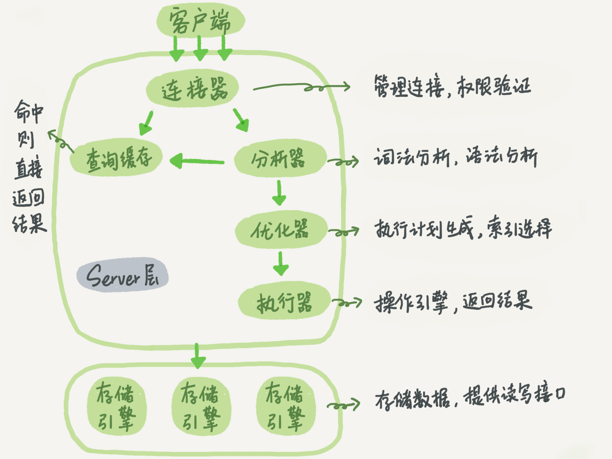
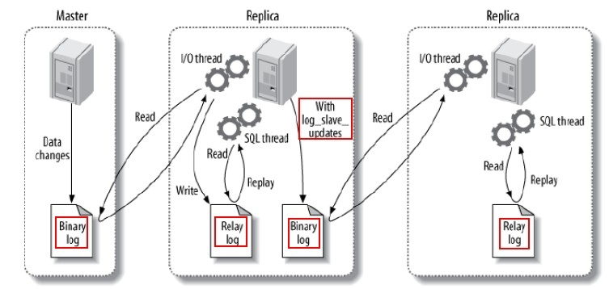

[toc]


# 1. 请说下你对 MySQL 架构的了解？



大体来说，MySQL 可以分为 **Server 层**和**存储引擎**两部分。

Server 层包括**连接器、查询缓存、分析器、优化器、执行器**等，涵盖了 MySQL 的大多数核心服务功能，以及所有的内置函数（如：日期、时间、数学和加密函数等），所有跨存储引擎的功能都在这一层实现，比如：存储过程、触发器、视图等等。

存储引擎层**负责数据的存储和提取**。其架构是插件式的，支持 InnoDB、MyISAM 等多个存储引擎。从 MySQL 5.5.5 版本开始默认的是InnoDB，但是在建表时可以通过 engine = MyISAM 来指定存储引擎。不同存储引擎的表数据存取方式不同，支持的功能也不同。

不同的存储引擎共用一个 Server 层，也就是从连接器到执行器的部分。


# 2. 一条 SQL 语句在数据库框架中的执行流程？

1. 应用程序把查询 SQL 语句发送给服务器端执行；
2. 查询缓存，如果查询缓存是打开的，服务器在接收到查询请求后，并不会直接去数据库查询，而是在数据库的查询缓存中找是否有相对应的查询数据，如果存在，则直接返回给客户端。只有缓存不存在时，才会进行下面的操作；
3. 查询优化处理，生成执行计划。这个阶段主要包括解析 SQL、预处理、优化 SQL 执行计划；
4. MySQL 根据相应的执行计划完成整个查询；
5. 将查询结果返回给客户端。

[详细流程见](./《MySQL实战45讲》笔记/MySQL实战45讲(1~15).md#1-基础架构一条sql-查询语句是如何执行的)


# 3. 数据库的三范式是什么？

1. 第一范式：强调的是列的原子性，即**数据库表的每一列都是不可分割的原子数据项**；
2. 第二范式：要求数据库表中的每个实例或行必须可以被惟一地区分。通常需要为表加上一个列，以存储各个实例的惟一标识。这个惟一属性列被称为主关键字或主键。 **有主键，非主键字段依赖主键**。
3. 第三范式：**任何非主属性不依赖于其它非主属性**。即每一个表都不包含其他表已经包含的非主关键字信息。

>1NF：关系中每一分量不可再分。即不能以集合、序列等作为属性。（也就是不能表中套表，要保证数据的原子性。）
>
>2NF：在1NF基础上，消除非主属性对键的部分依赖，则称它符合2NF。
>
>3NF：在2NF基础上，消除非主属性对键的传递依赖，则称它符合3NF。
>
>BCNF：对于关系模式R，如果每一个函数依赖的决定因素都包含键，则R属于BCNF范式。


# 4. char 和 varchar 的区别？

**char(n) ：固定长度类型**，比如：订阅 char(10)，当你输入”abc”三个字符的时候，它们占的空间还是 10 个字节，其他 7 个是空字节。char 优点：**效率高**；缺点：占用空间；适用场景：存储密码的 md5 值，固定长度的，使用 char 非常合适。

**varchar(n) ：可变长度**，存储的值是每个值占用的字节再加上一个用来记录其长度的字节的长度。

所以，**从空间上考虑 varchar 比较合适；从效率上考虑 char 比较合适**，二者使用需要权衡。


# 5. varchar(10) 和 varchar(20) 的区别？

varchar(10) 中 10 的含义是最多存放 10 个字符，varchar(10) 和 varchar(20) 存储 hello 所占空间一样，但后者在排序时会消耗更多内存，因为 order by col 采用 fixed_length 计算 col 长度 


# 6. 谈谈你对索引的理解？

索引的出现是为了**提高数据的查询效率**，就像书的目录一样。一本500页的书，如果想快速找到其中的某一个知识点，在不借助目录的情况下，估计可得找一会儿。同样，对于数据库的表而言，索引其实就是它的“目录”。

同样索引也会带来很多负面影响：创建索引和维护索引需要耗费时间，这个时间随着数据量的增加而增加；索引需要占用物理空间，不光是表需要占用数据空间，每个索引也需要占用物理空间；当对表进行增、删、改、的时候索引也要动态维护，这样就降低了数据的维护速度。

**建立索引的原则：**

1. 在最频繁使用的、用以缩小查询范围的字段上建立索引；
2. 在频繁使用的、需要排序的字段上建立索引。

**不适合建立索引的情况：**

1. 对于查询中很少涉及的列或者重复值比较多的列，不宜建立索引；
2. 对于一些特殊的数据类型，不宜建立索引，比如：文本字段（text）等。


# 7. 索引的底层使用的是什么数据结构？

索引的数据结构和具体存储引擎的实现有关，在MySQL中使用较多的索引有 **Hash 索引**、**B+树索引**等。而我们经常使用的 InnoDB 存储引擎的默认索引实现为 B+ 树索引。 


# 8. 谈谈你对 B+ 树的理解？

1. B+ 树是**基于 B 树和叶子节点顺序访问指针进行实现**，它具有 B 树的平衡性，并且通过顺序访问指针来提高区间查询的性能。
2. 在 B+ 树中，**一个节点中的 key 从左到右非递减排列**，如果某个指针的左右相邻 key 分别是 key i 和 key i+1，且不为 null，则该指针指向节点的所有 key 大于等于 key i 且小于等于 key i+1。
3. 进行查找操作时，首先在根节点进行**二分查找**，找到一个 key 所在的指针，然后递归地在指针所指向的节点进行查找。直到查找到叶子节点，然后在叶子节点上进行二分查找，找出 key 所对应的 data。
4. 插入、删除操作会破坏平衡树的平衡性，因此在插入删除操作之后，需要对树进行一个分裂、合并、旋转等操作来维护平衡性。


# 9. 为什么 InnoDB 存储引擎选用 B+ 树而不是 B 树呢？

用 B+ 树不用 B 树考虑的是 **IO 对性能的影响**，B 树的每个节点都存储数据，而 B+ 树只有叶子节点才存储数据，所以查找相同数据量的情况下，B 树的高度更高，IO 更频繁。数据库索引是存储在磁盘上的，当数据量大时，就不能把整个索引全部加载到内存了，只能逐一加载每一个磁盘页（对应索引树的节点）。 


# 10. 谈谈你对聚簇索引的理解？

聚簇索引是对磁盘上实际数据重新组织以按指定的一个或多个列的值排序的算法。特点是**存储数据的顺序和索引顺序一致。一般情况下主键会默认创建聚簇索引，且一张表只允许存在一个聚簇索引。**

**聚簇索引和非聚簇索引的区别：**

聚簇索引的叶子节点就是数据节点，而非聚簇索引的叶子节点仍然是索引节点，只不过有指向对应数据块的指针。


# 11. 谈谈你对哈希索引的理解？

哈希索引能以 **O(1)** 时间复杂度进行查找，但是**失去了有序性。无法用于排序与分组、只支持精确查找，无法用于部分查找和范围查找。**

InnoDB 存储引擎有一个特殊的功能叫“**自适应哈希索引**”，当某个索引值被使用的非常频繁时，会在 B+ 树索引之上再创建一个哈希索引，这样就让 B+Tree 索引具有哈希索引的一些优点，比如：快速的哈希查找。


# 12. 谈谈你对覆盖索引的认识？

**如果一个索引包含了满足查询语句中字段与条件的数据就叫做覆盖索引。**具有以下优点：

1. 索引通常远小于数据行的大小，只读取索引能大大减少数据访问量。
2. 一些存储引擎（例如：MyISAM）在内存中只缓存索引，而数据依赖于操作系统来缓存。因此，只访问索引可以不使用系统调用（通常比较费时）。
3. **对于 InnoDB 引擎，若辅助索引能够覆盖查询，则无需访问主索引。（不需要回表）**


# 13. 索引的分类？

- **从数据结构角度**
  1. 树索引 （O(log(n))）
  2. Hash 索引

- **从物理存储角度**
  1. 聚集（聚簇）索引（clustered index）
  2. 非聚集索引（non-clustered index）

- **从逻辑角度**
  1. 普通索引
  2. 唯一索引
  3. 主键索引
  4. 联合索引
  5. 全文索引


# 14. 谈谈你对最左前缀原则的理解？

MySQL 使用**联合索引**时，需要满足最左前缀原则。下面举例对其进行说明： 

```
1. 一个 2 列的索引 (name, age)，对 (name)、(name, age) 上建立了索引；
2. 一个 3 列的索引 (name, age, sex)，对 (name)、(name, age)、(name, age, sex) 上建立了索引。
```

1、 B+ 树的数据项是复合的数据结构，比如：(name, age, sex) 的时候，B+ 树是按照从左到右的顺序来建立搜索树的，比如：当使用（小明, 22, 男）这样的数据来检索的时候，B+ 树会优先比较 name 来确定下一步的所搜方向，如果 name 相同再依次比较 age 和 sex，最后得到检索的数据。但当（22, 男）这样没有 name 的数据来的时候，B+ 树就不知道第一步该查哪个节点，因为建立搜索树的时候 name 就是第一个比较因子，必须要先根据 name 来搜索才能知道下一步去哪里查询。

2、 当使用（小明, 男）这样的数据来检索时，B+ 树可以用 name 来指定搜索方向，但下一个字段 age 的缺失，所以只能把名字等于小明的数据都找到，然后再匹配性别是男的数据了， 这个是非常重要的性质，即索引的最左匹配特性。

**关于最左前缀的补充：**

1. **最左前缀匹配原则会一直向右匹配直到遇到范围查询（>、<、between、like）就停止匹配**。比如：a = 1 and b = 2 and c > 3 and d = 4 如果建立 (a, b, c, d) 顺序的索引，d 是用不到索引的。如果建立 (a, b, d, c) 的索引则都可以用到，a、b、d 的顺序可以任意调整。
2. **= 和 in 可以乱序**。比如：a = 1 and b = 2 and c = 3 建立 (a, b ,c) 索引可以任意顺序，MySQL 的优化器会优化成索引可以识别的形式。


# 15. 怎么知道创建的索引有没有被使用到？或者说怎么才可以知道这条语句运行很慢的原因?

使用 `Explain` 命令来查看语句的执行计划，MySQL 在执行某个语句之前，会将该语句过一遍查询优化器，之后会拿到对语句的分析，也就是执行计划，其中包含了许多信息。可以通过其中和索引有关的信息来分析是否命中了索引，例如：`possilbe_key`、`key`、`key_len` 等字段，分别说明了此语句可能会使用的索引、实际使用的索引以及使用的索引长度。


# 16. 什么情况下索引会失效？即查询不走索引？

下面列举几种不走索引的 SQL 语句：

**1、索引列参与表达式计算**

```mysql
SELECT 'sname' FROM 'stu' WHERE 'age' + 10 = 30;
```

**2、函数运算**

```mysql
SELECT 'sname' FROM 'stu' WHERE LEFT('date',4) < 1990; 
```

**3、字符串匹配--%词语%--模糊查询**

```mysql
SELECT * FROM 'manong' WHERE `uname` LIKE '码农%' -- 走索引 

SELECT * FROM 'manong' WHERE `uname` LIKE '%码农%' -- 不走索引 
```

**4、字符串与数字比较不走索引**

```mysql
CREATE TABLE 'a' ('a' char(10));
EXPLAIN SELECT * FROM 'a' WHERE 'a'="1" — 走索引
EXPLAIN SELECT * FROM 'a'WHERE 'a'=1 — 不走索引，同样也是使用了函数运算
```

**5、 查询条件中有 or ，即使其中有条件带索引也不会使用。**

**换言之，就是要求使用的所有字段，都必须建立索引**

```mysql
select * from dept where dname='xxx' or loc='xx' or deptno = 45;
```

**6、正则表达式不使用索引。**

**7、MySQL 内部优化器会对 SQL 语句进行优化，如果优化器估计使用全表扫描要比使用索引快，则不使用索引。**


# 17. 查询性能的优化方法？

**减少请求的数据量**

1. 只返回必要的列：最好不要使用 `SELECT *` 语句。
2. 只返回必要的行：使用 `LIMIT` 语句来限制返回的数据。
3. 缓存重复查询的数据：使用缓存可以避免在数据库中进行查询，特别在要查询的数据经常被重复查询时，缓存带来的查询性能提升将会是非常明显的。

**减少服务器端扫描的行数**

1. 最有效的方式是使用索引来覆盖查询。


# 18. InnoDB 和 MyISAM 的比较？

1. 事务：MyISAM 不支持事务，InnoDB 支持事务；
2. 全文索引：MyISAM 支持全文索引，InnoDB 5.6 之前不支持全文索引；
3. 关于 `count(*)`：MyISAM会直接存储总行数，InnoDB 则不会，需要按行扫描。意思就是对于 `select count(*) from table;` 如果数据量大，MyISAM 会瞬间返回，而 InnoDB 则会一行行扫描；
4. 外键：MyISAM 不支持外键，InnoDB 支持外键；
5. 锁：MyISAM 只支持表锁，InnoDB 可以支持行锁。


# 19. 谈谈你对水平切分和垂直切分的理解？

- **水平切分**

水平切分是**将同一个表中的记录拆分到多个结构相同的表中。**当一个表的数据不断增多时，水平切分是必然的选择，它可以将数据分布到集群的不同节点上，从而缓存单个数据库的压力。


- **垂直切分**

垂直切分是**将一张表按列切分成多个表，通常是按照列的关系密集程度进行切分，也可以利用垂直切分将经常被使用的列和不经常被使用的列切分到不同的表中。**例如：将原来的电商数据库垂直切分成商品数据库、用户数据库等。


# 20. 主从复制中涉及到哪三个线程？

主要涉及三个线程：**binlog 线程**、**I/O 线程**和 **SQL 线程**。

1. binlog 线程 ：负责将主服务器上的数据更改写入二进制日志（Binary log）中。
2. I/O 线程 ：负责从主服务器上读取二进制日志，并写入从服务器的重放日志（Relay log）中。
3. SQL 线程 ：负责读取重放日志并重放其中的 SQL 语句。




# 21. 主从同步的延迟原因及解决办法？

**主从同步的延迟的原因：**

假如一个服务器开放 Ｎ 个连接给客户端，这样如果会有大并发的更新操作, 但是从服务器的里面读取 binlog 的线程仅有一个， 当某个 SQL 在从服务器上执行的时间稍长或者由于某个 SQL 要进行锁表就会导致主服务器的 SQL 大量积压，未被同步到从服务器里。这就导致了主从不一致， 也就是主从延迟。

**主从同步延迟的解决办法：**

实际上主从同步延迟根本没有什么一招制敌的办法， **因为所有的 SQL 必须都要在从服务器里面执行一遍，但是主服务器如果不断的有更新操作源源不断的写入，那么一旦有延迟产生，那么延迟加重的可能性就会原来越大。**当然我们可以做一些缓解的措施。

1. 因为主服务器要负责更新操作，它对安全性的要求比从服务器高，所有有些设置可以修改，比如`sync_binlog=1`，`innodb_flush_log_at_trx_commit = 1` 之类的设置，而 slave 则不需要这么高的数据安全，完全可以将 `sync_binlog` 设置为 0 或者关闭 `binlog`、`innodb_flushlog`、`innodb_flush_log_at_trx_commit` 也可以设置为 0 来提高 SQL 的执行效率。
2. 增加从服务器，这个目的还是分散读的压力，从而降低服务器负载。


# 22. 谈谈你对数据库读写分离的理解？

读写分离常用**代理方式**来实现，代理服务器接收应用层传来的读写请求，然后决定转发到哪个服务器。**主服务器处理写操作以及实时性要求比较高的读操作，而从服务器处理读操作。**

**读写分离能提高性能的原因在于：**

1. 主从服务器负责各自的读和写，极大程度缓解了锁的争用；
2. 从服务器可以使用 MyISAM，提升查询性能以及节约系统开销；
3. 增加冗余，提高可用性。


# 23. 请描述下事务的特性？

1. **原子性**：事务是最小的执行单位，不允许分割。事务的原子性确保动作要么全部完成，要么完全不起作用；
2. **一致性**：执行事务前后，数据库从一个一致性状态转换到另一个一致性状态。
3. **隔离性**：并发访问数据库时，一个用户的事务不被其他事务所干扰，各并发事务之间数据库是独立的；
4. **持久性**：一个事务被提交之后。它对数据库中数据的改变是持久的，即使数据库发生故障也不应该对其有任何影响。


# 24. 谈谈你对事务隔离级别的理解？

1. **READ_UNCOMMITTED（未提交读）**: 最低的隔离级别，允许读取尚未提交的数据变更，可能会导致脏读、幻读或不可重复读；
2. **READ_COMMITTED（提交读）**: 允许读取并发事务已经提交的数据，可以阻止脏读，但是幻读或不可重复读仍有可能发生；
3. **REPEATABLE_READ（可重复读）**: 对同一字段的多次读取结果都是一致的，除非数据是被本身事务自己所修改，可以阻止脏读和不可重复读，但幻读仍有可能发生；
4. **SERIALIZABLE（串行化）**: 最高的隔离级别，完全服从 ACID 的隔离级别。所有的事务依次逐个执行，这样事务之间就完全不可能产生干扰，也就是说，该级别可以防止脏读、不可重复读以及幻读。但是这将严重影响程序的性能。通常情况下也不会用到该级别。


# 25. 解释下什么叫脏读、不可重复读和幻读？

- **脏读：**

表示**一个事务能够读取另一个事务中还未提交的数据。**比如：某个事务尝试插入记录 A，此时该事务还未提交，然后另一个事务尝试读取到了记录 A。

- **不可重复读 ：**

是指在一个事务内，多次读同一数据。在这个事务还没有结束时，另外一个事务也访问该数据。那么，在第一个事务中的两次读数据之间，由于第二个事务的修改，第一个事务两次读到的的数据可能是不一样的。这样就发生了**在一个事务内两次读到的数据是不一样的**，因此称为是不可重复读。例如，一个编辑人员两次读取同一文档，但在两次读取之间，作者重写了该文档。当编辑人员第二次读取文档时，文档已更改。原始读取不可重复。如果只有在作者全部完成编写后编辑人员才可以读取文档，则可以避免该问题。

**不可重复读的重点是修改**：同样的条件 , 你读取过的数据 , 再次读取出来发现值不一样了。

- **幻读：**

指同一个事务内多次查询返回的结果集不一样。比如同一个事务 A 第一次查询时候有 n 条记录，但是第二次同等条件下查询却有 n+1 条记录，这就好像产生了幻觉。发生幻读的原因也是另外一个事务新增或者删除或者修改了第一个事务结果集里面的数据，同一个记录的数据内容被修改了，所有数据行的记录就变多或者变少了。

**幻读的重点在于新增或者删除**：同样的条件，第 1 次和第 2 次读出来的记录数不一样。


# 26. MySQL 默认的隔离级别是什么？

MySQL 默认采用的 **REPEATABLE_READ** 隔离级别。

Oracle 默认采用的 **READ_COMMITTED** 隔离级别。


# 27. 谈谈你对MVCC 的了解？

**数据库并发场景：**

1. 读 - 读：不存在任何问题，也不需要并发控制；
2. 读 - 写：有线程安全问题，可能会造成事务隔离性问题，可能遇到脏读、幻读、不可重复读；
3. 写 - 写：有线程安全问题，可能会存在更新丢失问题。

**多版本并发控制（MVCC）是一种用来解决读-写冲突的无锁并发控制，也就是为事务分配单向增长的时间戳，为每个修改保存一个版本，版本与事务时间戳关联，读操作只读该事务开始前的数据库的快照。**

**MVCC 可以为数据库解决以下问题：**

1. 在并发读写数据库时，可以做到在读操作时不用阻塞写操作，写操作也不用阻塞读操作，提高了数据库并发读写的性能；
2. 同时还可以解决脏读，幻读，不可重复读等事务隔离问题，但不能解决更新丢失问题。


# 28. 说一下 MySQL 的行锁和表锁？

MyISAM 只支持表锁，InnoDB 支持表锁和行锁，默认为行锁。

表级锁：开销小，加锁快，不会出现死锁。锁定粒度大，发生锁冲突的概率最高，并发量最低。

行级锁：开销大，加锁慢，会出现死锁。锁粒度小，发生锁冲突的概率小，并发度最高。


# 29. InnoDB 存储引擎的行锁的种类有哪些？

1. **Record lock**：单个行记录上的锁；
2. **Gap lock**：间隙锁，锁定一个范围，不包括记录本身；
3. **Next-key lock**：record+gap 锁定一个范围，包含记录本身。


# 30. MySQL 问题排查都有哪些手段？

1. 使用 `show processlist` 命令查看当前所有连接信息；
2. 使用 `Explain` 命令查询 SQL 语句执行计划；
3. 开启慢查询日志，查看慢查询的 SQL。


# 31. MySQL 数据库 CPU 飙升到 500% 的话他怎么处理？

当 CPU 飙升到 500% 时，先用操作系统命令 `top` 命令观察是不是 mysqld 占用导致的，如果不是，找出占用高的进程，并进行相关处理。

如果是 mysqld 造成的，通过 `SHOW PROCESSLIST` 查看正在运行的线程，是不是有消耗资源的 SQL 在运行，找出其中消耗高的 SQL，看看执行计划是否准确，index 是否缺失，或者是数据量太大造成。

然后 `kill` 掉这些线程（同时观察 CPU 使用率是否下降），等进行相应的调整（比如说加索引、改 SQL、改内存参数）之后，再重新跑这些 SQL。

若每个 SQL 消耗资源都不多，只是同一时间大量的 session 连进来导致 CPU 飙升，这种情况就需要分析为何连接数会激增，再做出相应的调整，比如说限制连接数等。


# 32. MySQL的 redo log，undo log，bin log 都是干什么的

redo log 是 InnoDB 引擎特有的，只记录该引擎中表的修改记录。binlog 是 MySQL 的 Server 层实现的，会记录所有引擎对数据库的修改。

redo log 是物理日志，记录的是在具体某个数据页上做了什么修改；binlog 是逻辑日志，记录的是这个语句的原始逻辑。

redo log 是循环写的，空间固定会用完；binlog 是可以追加写入的，binlog 文件写到一定大小后会切换到下一个，并不会覆盖以前的日志。

undo log 是回滚日志，保存了事务发生之前的数据的一个版本，可以用于回滚，同时可以提供多版本并发控制下的读（MVCC），也即非锁定读 。


# 33. SQL 与 MySQL 有什么区别

- SQL 是一种 结构化查询语言，用于在数据库上执行各种操作，但 MySQL 是一个 关系数据库管理系统（RDBMS），使用 SQL 执行所有数据库操作。
- SQL 用于访问，更新和操作数据库中的数据，用户使用时需要学习该语言，然后编写查询，而 MySQL 是一个软件，会为用户提供一个界面，只需单击一些按钮即可用于执行各种数据库操作。
- 由于 MySQL 是一个软件，所以它会定期获得各种更新，但在 SQL 中，命令总是相同的。


# 34. 添加索引的原则

- **在查询中很少使用或者参考的列不要创建索引。**由于这些列很少使用到，增加索引反而会降低系统的维护速度和增大空间需求。
- **只有很少数据值的列也不应该增加索引。**由于这些列的取值很少，区分度太低，例如人事表中的性别，在查询时，需要在表中搜索的数据行的比例很大。增加索引，并不能明显加快检索速度。
- **定义为 text、image 和 bit 数据类型的列不应该增加索引。**这是因为，这些列的数据量要么相当大，要么取值很少。
- **当修改性能远远大于检索性能时，不应该创建索引。**这时因为，二者是相互矛盾的，当增加索引时，会提高检索性能，但是会降低修改性能。
- **定义有 外键 的数据列一定要创建索引。**


# 35. 有哪些事务状态

- **活跃状态**：事务的第一个状态，任何正在执行的事务都处于此状态，所做的更改存储在主内存的缓冲区 中。
- **部分提交状态**：执行上次操作后，事务进入部分提交状态。之所以是部分提交，是因为所做的更改仍然在主内存的缓冲区中。
- **失败状态**：如果某个检查在活动状态下失败，在活动状态或部分提交状态发生一些错误，并且事务无法进一步执行，则事务进入失败状态。
- **中止状态**：如果任何事务已达到失败状态，则恢复管理器将数据库回滚到开始执行的原始状态。
- **提交状态**：如果所有操作成功执行，则来自部分提交状态的事务进入提交状态。无法从此状态回滚，它是一个新的一致状态。


