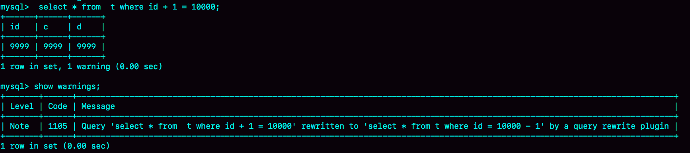
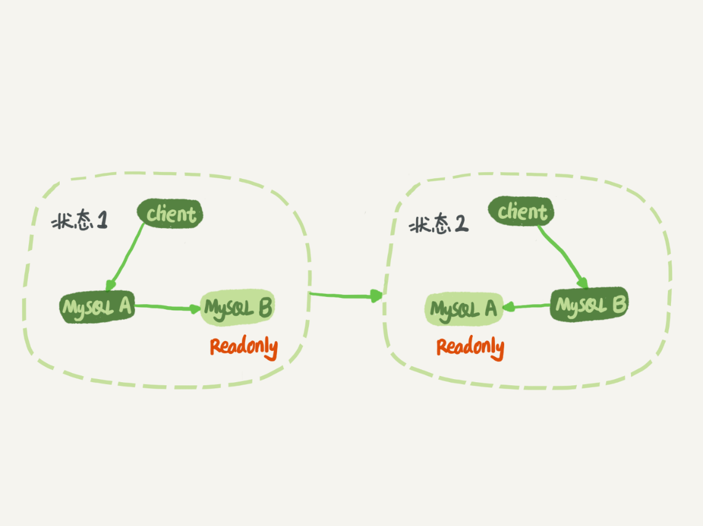

# 极客时间《MySQL实战45讲》学习笔记(16-30)


[toc]


# 18. 为什么这些SQL语句逻辑相同，性能却差异巨大(函数操作使索引失效)

在 MySQL 中，有很多看上去逻辑相同，但性能却差异巨大的 SQL 语句。对这些语句使用不当的话，就会不经意间导致整个数据库的压力变大。

下面是三个案例：

## 1. 条件字段函数操作

假设现在维护一个交易系统，其中交易记录表 `tradelog` 包含交易流水号（tradeid）、交易员 id（operator）、交易时间（t_modified）等字段。这个表的建表语句如下： 

```mysql
mysql> CREATE TABLE `tradelog` (
  `id` int(11) NOT NULL,
  `tradeid` varchar(32) DEFAULT NULL,
  `operator` int(11) DEFAULT NULL,
  `t_modified` datetime DEFAULT NULL,
  PRIMARY KEY (`id`),
  KEY `tradeid` (`tradeid`),
  KEY `t_modified` (`t_modified`)
) ENGINE=InnoDB DEFAULT CHARSET=utf8mb4;
```

假设表中记录了从 2016 年初到 2018 年底的所有数据，有一个需求是：要统计发生在所有年份中 7 月份的交易记录总数。这个逻辑看上去并不复杂，SQL 语句可能会这么写：

```mysql
mysql> select count(*) from tradelog where month(t_modified)=7;
```

由于 `t_modified` 字段上有索引，于是很放心地在生产库中执行了这条语句，但却发现执行了特别久才返回了结果。

出现这种情况的原因：**如果对条件字段做了函数计算，就用不上索引了**。

但是为什么条件是 `where t_modified='2018-7-1'` 的时候可以用上索引，而改成 `where month(t_modified)=7` 的时候就不行了？

下面是这个 `t_modified` 索引的示意图。方框上面的数字就是 `month()` 函数对应的值：

 

> 如果 SQL 语句条件用的是 `where t_modified='2018-7-1'` 的话，引擎就会按照上面绿色箭头的路线，快速定位到 `t_modified='2018-7-1'` 需要的结果。

实际上，B+ 树提供的这个快速定位能力，来源于**同一层兄弟节点的有序性**。

但是，如果计算 `month()` 函数的话，会看到直接传入 7 的时候，在树的第一层就不知道该怎么办了，因为无法通过有序性进行定位。

也就是说，**对索引字段做函数操作，可能会破坏索引值的有序性，因此优化器就决定放弃走树搜索功能。**

> 需要注意的是，优化器并不是要放弃使用这个索引。

在这个例子里，放弃了树搜索功能，优化器可以选择遍历主键索引，也可以选择遍历索引 `t_modified`，优化器对比索引大小后发现，索引 `t_modified` 更小，遍历这个索引比遍历主键索引来得更快。因此最终还是会选择索引 `t_modified`。

使用 `explain` 命令，查看一下这条 SQL 语句的执行结果：

 

`key="t_modified"` 表示的是，使用了 `t_modified` 这个索引；在测试表数据中插入了10万行数据，`rows=100335`，说明这条语句扫描了整个索引的所有值；`Extra` 字段的 `Using index`，表示的是使用了覆盖索引。

也就是说，由于在 `t_modified` 字段加了 `month()` 函数操作，导致了全索引扫描。为了能够用上索引的快速定位能力，就要把 SQL 语句改成基于字段本身的范围查询。按照下面这个写法，优化器就能按照预期，用上 `t_modified` 索引的快速定位能力了。

```mysql
mysql> select count(*) from tradelog where
    -> (t_modified >= '2016-7-1' and t_modified<'2016-8-1') or
    -> (t_modified >= '2017-7-1' and t_modified<'2017-8-1') or 
    -> (t_modified >= '2018-7-1' and t_modified<'2018-8-1');
```


> 不过优化器有时确实有“偷懒”行为，即使是对于不改变有序性的函数，也不会考虑使用索引。比如**索引字段参与某种表达式运算**：
>
> 对于 `select * from tradelog where id + 1 = 10000` 这个 SQL 语句，这个加 1 操作并不会改变有序性，但是 MySQL 优化器还是不能用 `id` 索引快速定位到 9999 这一行。所以需要在写 SQL 语句的时候，手动改写成  `where id = 10000 -1` 才可以。 


## 2. 隐式类型转换

对于这条SQL语句：

```mysql
mysql> select * from tradelog where tradeid=110717;
```

交易编号 `tradeid` 这个字段上，本来就有索引，但是 `explain` 的结果却显示，这条语句需要走全表扫描。原因就是：`tradeid` 的字段类型是 `varchar(32)`，而输入的参数却是整型，所以需要做类型转换。

这里就有两个问题：

1. 数据类型转换的规则是什么？
2. 为什么有数据类型转换，就需要走全索引扫描？

先解答第一个问题：**在 MySQL 中，字符串和数字做比较的话，是将字符串转换成数字**。 

所以上面的全表扫描的语句对于优化器来说相当于：

```mysql
mysql> select * from tradelog where  CAST(tradid AS signed int) = 110717;
```

也就是说，这条语句触发了上面说到的规则：**对索引字段做函数操作，优化器会放弃走树搜索功能**。

> 注意：
>
> ```mysql
> select * from tradelog where id="83126";
> ```
>
> 这种情况下，`id` 是 `int` 类型，不会导致全表扫描。因为是字符串转整数，所以**会先将入参转化成数字，再进入索引搜索**。 


## 3. 隐式字符编码转换

假设系统里还有另外一个表 `trade_detail`，用于记录交易的操作细节。为了便于量化分析和复现，往交易日志表 `tradelog` 和交易详情表 `trade_detail` 这两个表里插入一些数据：

```mysql
mysql> CREATE TABLE `trade_detail` (
  `id` int(11) NOT NULL,
  `tradeid` varchar(32) DEFAULT NULL,
  `trade_step` int(11) DEFAULT NULL, /*操作步骤*/
  `step_info` varchar(32) DEFAULT NULL, /*步骤信息*/
  PRIMARY KEY (`id`),
  KEY `tradeid` (`tradeid`)
) ENGINE=InnoDB DEFAULT CHARSET=utf8;

insert into tradelog values(1, 'aaaaaaaa', 1000, now());
insert into tradelog values(2, 'aaaaaaab', 1000, now());
insert into tradelog values(3, 'aaaaaaac', 1000, now());

insert into trade_detail values(1, 'aaaaaaaa', 1, 'add');
insert into trade_detail values(2, 'aaaaaaaa', 2, 'update');
insert into trade_detail values(3, 'aaaaaaaa', 3, 'commit');
insert into trade_detail values(4, 'aaaaaaab', 1, 'add');
insert into trade_detail values(5, 'aaaaaaab', 2, 'update');
insert into trade_detail values(6, 'aaaaaaab', 3, 'update again');
insert into trade_detail values(7, 'aaaaaaab', 4, 'commit');
insert into trade_detail values(8, 'aaaaaaac', 1, 'add');
insert into trade_detail values(9, 'aaaaaaac', 2, 'update');
insert into trade_detail values(10, 'aaaaaaac', 3, 'update again');
insert into trade_detail values(11, 'aaaaaaac', 4, 'commit');
```

这时候，如果要查询 `id=2` 的交易的所有操作步骤信息，SQL 语句可以这么写：

```mysql
mysql> select d.* from tradelog l, trade_detail d where d.tradeid=l.tradeid and l.id=2; /*语句Q1*/
```


上图是语句Q1的 `explain` 结果：

1. 第一行显示优化器会先在交易记录表 `tradelog` 上查到 `id=2` 的行，这个步骤用上了主键索引，`rows=1` 表示只扫描一行；
2. 第二行 `key=NULL`，表示没有用上交易详情表 `trade_detail` 上的 `tradeid` 索引，进行了全表扫描。

在这个执行计划里，是从 `tradelog` 表中取 `tradeid` 字段，再去 `trade_detail` 表里查询匹配字段。因此，`tradelog` 称为「驱动表」，`trade_detail` 称为「被驱动表」，把 `tradeid` 称为关联字段。

接下来看下这个 `explain` 结果表示的执行流程：

 

- 第 1 步，是根据 `id` 在 `tradelog` 表里找到 L2 这一行；
- 第 2 步，是从 L2 中取出 `tradeid` 字段的值；
- 第 3 步，是根据 `tradeid` 值到 `trade_detail` 表中查找条件匹配的行。`explain` 的结果里面第二行的 `key=NULL` 表示的就是，这个过程是通过遍历主键索引的方式，一个一个地判断 `tradeid` 的值是否匹配。

第 3 步不符合预期。因为表 `trade_detail` 里 `tradeid` 字段上是有索引的，本来是希望通过使用 `tradeid` 索引能够快速定位到等值的行，但这里并没有。

出现这种情况是**因为这两个表的字符集不同，一个是 `utf8`，一个是 `utf8mb4`，所以做表连接查询的时候用不上关联字段的索引**。

为什么字符集不同就用不上索引呢？

单独把第 3 步改成 SQL 语句：

```MYSQL
mysql> select * from trade_detail where tradeid=$L2.tradeid.value; 
```

其中，`$L2.tradeid.value` 的字符集是 `utf8mb4`。

参照前面的两个例子，字符集 `utf8mb4` 是 `utf8` 的超集，所以当这两个类型的字符串在做比较的时候，MySQL 内部的操作是，先把 `utf8` 字符串转成 `utf8mb4` 字符集，再做比较。

> 在程序设计语言里面，做自动类型转换的时候，为了避免数据在转换过程中由于截断导致数据错误，也都是“按数据长度增加的方向”进行转换的。

因此，在执行上面这个语句的时候，需要将被驱动数据表里的字段一个个地转换成 `utf8mb4`，再跟 L2 做比较。

也就是说，实际上这个语句等同于下面这个写法：

```MYSQL
select * from trade_detail  where CONVERT(traideid USING utf8mb4)=$L2.tradeid.value; 
```

`CONVERT()` 函数把输入的字符串转成 `utf8mb4` 字符集。

这就再次触发了上面说到的原则：**对索引字段做函数操作，优化器会放弃走树搜索功能**。

因此，字符集不同只是条件之一，**连接过程中要求在被驱动表的索引字段上加函数操作**，是直接导致对被驱动表做全表扫描的原因。

***

理解了原理以后，就可以用来指导操作了。如果要优化语句：

```mysql
select d.* from tradelog l, trade_detail d where d.tradeid=l.tradeid and l.id=2;
```

的执行过程，有两种做法：

- 比较常见的优化方法是，把 `trade_detail` 表上的 `tradeid` 字段的字符集也改成 `utf8mb4`，这样就没有字符集转换的问题了：

```mysql
alter table trade_detail modify tradeid varchar(32) CHARACTER SET utf8mb4 default null;
```

- 如果能够修改字段的字符集的话，是最好不过了。但如果数据量比较大， 或者业务上暂时不能做这个 DDL 的话，那就只能采用修改 SQL 语句的方法了：

```mysql
mysql> select d.* from tradelog l , trade_detail d where d.tradeid=CONVERT(l.tradeid USING utf8) and l.id=2; 
```


这里，主动把 `l.tradeid` 转成 `utf8`，就避免了被驱动表上的字符编码转换，从 `explain` 结果可以看到，这次索引走对了。


## 4. 总结

**对索引字段做函数操作，可能会破坏索引值的有序性，因此优化器就决定放弃走树搜索功能。** 

**索引字段不能进行函数操作，但是索引字段的参数可以进行函数操作。**


# 22. MySQL有哪些“饮鸩止渴”提高性能的方法

在业务高峰期，生产环境的 MySQL 可能会压力太大，没法正常响应，这就需要 **短期内、临时性** 地提升一些性能。 

下面主要讲解三个问题以及相应提升性能的方法：

- **短连接暴增**
- **慢查询性能问题**
- **QPS 突增问题**


## 1. 短连接暴增

正常的 **短连接模式** 就是**连接到数据库后，执行很少的 SQL 语句就断开，下次需要的时候再重连**。

**如果使用的是短连接，在业务高峰期的时候，就可能出现连接数突然暴涨的情况。** 

> MySQL 建立连接的过程，成本是很高的。除了正常的网络连接三次握手外，还需要做登录权限判断和获得这个连接的数据读写权限。在数据库压力比较小的时候，这些额外的成本并不明显。

但是，**短连接模型存在一个风险，就是一旦数据库处理得慢一些，连接数就会暴涨**。`max_connections` 参数用来控制一个 MySQL 实例同时存在的连接数的上限，超过这个值，系统就会拒绝接下来的连接请求，并报错提示 `“Too many connections”`。对于被拒绝连接的请求来说，从业务角度看就是数据库不可用。

**在机器负载比较高的时候，处理现有请求的时间变长，每个连接保持的时间也更长**。这时，再有新建连接的话，就可能会超过 `max_connections` 的限制。

**错误做法：**

碰到这种情况时，一个比较自然的想法，就是调高 `max_connections` 的值。但这样做是有风险的：因为设计 `max_connections` 这个参数的目的是想保护 MySQL，如果把它改得太大，使得更多的连接可以进来，那么系统的负载可能会进一步加大，大量的资源耗费在权限验证等逻辑上，导致已经连接的线程拿不到 CPU 资源去执行业务的 SQL 请求。 

所以一般是不建议调整 `max_connections` 的值，下面有两种（有损的）方法更加合适：

### 1.1 先处理掉那些占着连接但是不工作的线程

`max_connections` 的计算，并不是看谁在 running，而是只要连着就占用一个计数位置。**对于那些不需要保持的连接，可以通过 `kill connection` 主动踢掉**。

> 这个行为跟事先设置 `wait_timeout` 的效果是一样的。设置 `wait_timeout` 参数表示的是，一个线程空闲 `wait_timeout` 这么多秒之后，就会被 MySQL 直接断开连接。 

但是需要注意，在 `show processlist` 的结果里，踢掉显示为 sleep 的线程，**可能是有损的**。来看下面这个例子：

 

在上面这个例子里，如果断开 session A 的连接，因为这时候 session A 还没有提交，所以 MySQL 只能按照回滚事务来处理；而断开 session B 的连接，就没什么大影响。所以，如果按照优先级来说，应该优先断开像 session B 这样的事务外空闲的连接。

但是，怎么判断哪些是事务外空闲的呢？session C 在 T 时刻之后的 30 秒执行 `show processlist`，看到的结果是这样的：

 

图中 `id=4` 和 `id=5` 的两个会话都是 Sleep 状态。而要看事务具体状态的话，可以查 `information_schema` 库的 `innodb_trx` 表：

 

这个结果里，`trx_mysql_thread_id=4`，表示 `id=4` 的线程还处在事务中。

因此，**如果是连接数过多，可以优先断开事务外空闲太久的连接；如果这样还不够，再考虑断开事务内空闲太久的连接**。

从服务端断开连接使用的是 `kill connection + id` 的命令， 一个客户端处于 sleep 状态时，它的连接被服务端主动断开后，这个客户端并不会马上知道。直到客户端在发起下一个请求的时候，才会收到这样的报错 `“ERROR 2013 (HY000): Lost connection to MySQL server during query”`。

从数据库端主动断开连接可能是有损的，尤其是有的应用端收到这个错误后，不重新连接，而是直接用这个已经不能用的句柄重试查询。这会导致从应用端看上去：“MySQL 一直没恢复”。


### 1.2 减少连接过程的消耗 

有的业务代码会在短时间内先大量申请数据库连接做备用，如果现在数据库确认是被连接行为打挂了，那么一种可能的做法，是**让数据库跳过权限验证阶段**。

跳过权限验证的方法是：**重启数据库，并使用 `--skip-grant-tables` 参数启动**。这样，整个 MySQL 会跳过所有的权限验证阶段，包括连接过程和语句执行过程在内。

但是，这种方法**风险极高**，是特别不建议使用的方案。尤其库外网可访问的话，就更不能这么做了。

> 在 MySQL 8.0 版本里，如果启用 `--skip-grant-tables` 参数，MySQL 会默认把 `--skip-networking` 参数打开，表示这时候数据库只能被本地的客户端连接。可见，MySQL 官方对 `skip-grant-tables` 这个参数的安全问题也很重视。

除了短连接数暴增可能会带来性能问题外，实际上，在线上碰到更多的是**查询或者更新语句导致的性能问题**。其中，查询问题比较典型的有两类，一类是由新出现的慢查询导致的，一类是由 QPS（每秒查询数）突增导致的。而关于更新语句导致的性能问题，见下一篇文章。


## 2. 慢查询性能问题

在 MySQL 中，会引发性能问题的慢查询，大体有以下三种可能：

- **索引没有设计好**
- **SQL 语句没写好**
- **MySQL 选错了索引**

接下来就具体分析一下这三种可能，以及对应的解决方案：

### 2.1 索引没有设计好

这种场景一般就是通过 **紧急创建索引** 来解决。MySQL 5.6 版本以后，创建索引都支持 Online DDL 了，对于那种高峰期数据库已经被这个语句打挂了的情况，最高效的做法就是直接执行 `alter table` 语句。

比较理想的是能够在备库先执行。假设现在的服务是一主一备（主库A、备库B），这个方案的大致流程是这样的：

1. 在备库 B 上执行 `set sql_log_bin=off`，也就是不写 binlog，然后执行 `alter table` 语句加上索引；
2. 执行主备切换；
3. 这时候主库是 B，备库是 A。在 A 上执行 `set sql_log_bin=off`，然后执行 `alter table` 语句加上索引。

这是一个“古老”的 DDL 方案。平时在做变更的时候，应该考虑类似 `gh-ost` 这样的方案，更加稳妥。但是在需要紧急处理时，上面这个方案的效率是最高的。


### 2.2 语句没写好

比如犯了 [18. 为什么这些SQL语句逻辑相同，性能却差异巨大？](# 18. 为什么这些SQL语句逻辑相同，性能却差异巨大) 中的哪些错误，导致语句没有使用上索引。

这时可以通过 **改写 SQL 语句** 来处理。MySQL 5.7 提供了 `query_rewrite` 功能，可以把输入的一种语句改写成另外一种模式。

比如，语句被错误地写成了 `select * from t where id + 1 = 10000`，可以通过下面的方式，增加一个语句改写规则：

```sql
mysql> insert into query_rewrite.rewrite_rules(pattern, replacement, pattern_database) values ("select * from t where id + 1 = ?", "select * from t where id = ? - 1", "db1");

call query_rewrite.flush_rewrite_rules();
```

这里，`call query_rewrite.flush_rewrite_rules()` 这个存储过程，是让插入的新规则生效，也就是我们说的“查询重写”。可以用下图中的方法来确认改写规则是否生效：

 


### 2.3 MySQL 选错了索引

这时候，应急方案就是 **给这个语句加上 `force index`**。

同样地，使用查询重写功能，给原来的语句加上 `force index`，也可以解决这个问题。


上面讨论的由慢查询导致性能问题的三种可能情况，实际上出现最多的是前两种，即：**索引没设计好** 和 **SQL 语句没写好**。而这两种情况，恰恰是完全可以避免的。比如，通过下面这个过程就可以预先发现问题：

1. 上线前，在测试环境，把慢查询日志（slow log）打开，并且把 `long_query_time` 设置成 0，确保每个语句都会被记录入慢查询日志；
2. 在测试表里插入模拟线上的数据，做一遍**回归测试**；
3. 观察慢查询日志里每类语句的输出，特别留意 `Rows_examined` 字段是否与预期一致。

> 如果新增的 SQL 语句不多，手动跑一下就可以。而如果是新项目的话，或者是修改了原有项目的 表结构设计，全量回归测试都是必要的。这时候，需要工具帮助检查所有的 SQL 语句的返回结果。比如，可以使用开源工具 [pt-query-digest](https://www.percona.com/doc/percona-toolkit/3.0/pt-query-digest.html)。


## 3. QPS 突增问题

有时候由于业务突然出现高峰，或者应用程序 bug，导致某个语句的 QPS 突然暴涨，也可能导致 MySQL 压力过大，影响服务。

有一类情况，是由一个新功能的 bug 导致的。当然，最理想的情况是让业务把这个功能下掉，服务自然就会恢复。

而下掉一个功能，如果从数据库端处理的话，对应于不同的背景，有不同的方法可用。这里展开说明一下：

1. 一种是**由全新业务的 bug 导致**的。假设 DB 运维是比较规范的，也就是说白名单是一个个加的。这种情况下，如果能够确定业务方会下掉这个功能，只是时间上没那么快，那么就可以**从数据库端直接把白名单去掉**。
2. 如果这个**新功能使用的是单独的数据库用户**，可以**用管理员账号把这个用户删掉，然后断开现有连接**。这样，这个新功能的连接不成功，由它引发的 QPS 就会变成 0。
3. 如果这个**新增的功能跟主体功能是部署在一起的**，那么只能**通过处理语句来限制**。这时，可以使用上面提到的**查询重写功能**，把压力最大的 SQL 语句直接重写成 `"select 1"` 返回。

当然，这个操作的风险很高，需要特别细致。它可能存在两个副作用：

1. 如果别的功能里面也用到了这个 SQL 语句模板，会有误伤；
2. 很多业务并不是靠这一个语句就能完成逻辑的，所以如果单独把这一个语句以 `select 1` 的结果返回的话，可能会导致后面的业务逻辑一起失败。

所以，方案 3 是用于止血的，跟前面提到的去掉权限验证一样，应该是所有选项里优先级最低的一个方案。

并且其实方案 1 和 2 都要依赖于规范的运维体系：虚拟化、白名单机制、业务账号分离。由此可见，更多的准备，往往意味着更稳定的系统。


## 4. 总结

MySQL 业务高峰期可能产生的性能问题以及对应的临时解决方法：

- 短连接暴增
  - 如果是连接数过多，可以优先断开事务外空闲太久的连接；如果这样还不够，再考虑断开事务内空闲太久的连接。通过 `kill connection + id` 指令。
  - 重启数据库，并使用 `--skip-grant-tables` 参数启动，让数据库跳过权限验证阶段。
- 慢查询
  - 执行 `alter table` 语句紧急创建索引。
  - 改写 SQL 语句。
  - 给语句加上 `force index` 强制选择查询快的索引。
- QPS 突增
  - 不同情况下使用不同手段阻断新功能的 bug 带来的影响。


# 24. MySQL是怎么保证主备一致的

binlog 可以用来归档，也可以用来做**主备同步**，但它的内容是什么样的呢？为什么备库执行了 binlog 就可以跟主库保持一致了呢？ 

## 1. MySQL主备的基本原理

下如图所示就是基本的主备切换流程：

 

在状态 1 中，客户端的读写都直接访问节点 A，而节点 B 是 A 的备库，只是将 A 的更新都同步过来到本地执行。这样可以**保持节点 B 和 A 的数据是相同的**。

当需要切换的时候，就切成状态 2。这时候客户端读写访问的都是节点 B，而节点 A 是 B 的备库。

在状态 1 中，虽然节点 B 没有被直接访问，但是建议把节点 B（也就是备库）设置成只读（readonly）模式。这样做有以下几个考虑：

1. 有时候一些运营类的查询语句会被放到备库上去查，设置为只读可以防止误操作；
2. 防止切换逻辑有 bug，比如切换过程中出现双写，造成主备不一致；
3. 可以用 readonly 状态，来判断节点的角色。

但是把备库设置成只读了，还怎么跟主库保持同步更新呢？

这不用担心，因为 `readonly` 设置对超级(super)权限用户是无效的，而**用于同步更新的线程就拥有超级权限**。

接下来再看看**节点 A 到 B 这条线的内部流程是什么样的**。下图中就是一个 `update` 语句在节点 A 执行，然后同步到节点 B 的完整流程图：


图中包含了上一篇文章中讲到的 binlog 和 redo log 的写入机制相关的内容，可以看到：主库接收到客户端的更新请求后，执行内部事务的更新逻辑，同时写 binlog。

备库 B 跟主库 A 之间维持了一个长连接。主库 A 内部有一个线程 `dump_thread`，专门用于服务备库 B 的这个长连接。一个事务日志同步的完整过程是这样的：

1. 在备库 B 上通过 `change master` 命令，设置主库 A 的 IP、端口、用户名、密码，以及要从哪个位置开始请求 binlog，这个位置包含文件名和日志偏移量。
2. 在备库 B 上执行 `start slave` 命令，这时候备库会启动两个线程，就是图中的 `io_thread` 和 `sql_thread`。其中 `io_thread` 负责与主库建立连接。
3. 主库 A 校验完用户名、密码后，开始按照备库 B 传过来的位置，从本地读取 binlog，发给 B。
4. 备库 B 拿到 binlog 后，写到本地文件，称为**中转日志**（relay log）。
5. `sql_thread` 读取中转日志，解析出日志里的命令并执行。

分析完了这个长连接的逻辑，再来看一个问题：binlog 里面到底是什么内容，为什么备库拿过去可以直接执行。


## 2. binlog 三种格式对比

- statement
- row
- mixed（statement + row）

为了便于描述 binlog 的这三种格式间的区别，创建了一个表，并初始化几行数据。

```mysql
mysql> CREATE TABLE `t` (
  `id` int(11) NOT NULL,
  `a` int(11) DEFAULT NULL,
  `t_modified` timestamp NOT NULL DEFAULT CURRENT_TIMESTAMP,
  PRIMARY KEY (`id`),
  KEY `a` (`a`),
  KEY `t_modified`(`t_modified`)
) ENGINE=InnoDB;

insert into t values(1,1,'2018-11-13');
insert into t values(2,2,'2018-11-12');
insert into t values(3,3,'2018-11-11');
insert into t values(4,4,'2018-11-10');
insert into t values(5,5,'2018-11-09');
```

如果要在表中删除一行数据的话，看看这个 `delete` 语句的 binlog 是怎么记录的。

注意，下面这个语句包含注释，如果用 MySQL 客户端来做这个实验的话，要记得加 `-c` 参数，否则客户端会自动去掉注释。

```
mysql> delete from t /*comment*/  where a>=4 and t_modified<='2018-11-10' limit 1;
```

当 `binlog_format=statement` 时，binlog 里面记录的就是 SQL 语句的原文。可以用

```MYSQL
mysql> show binlog events in 'master.000001';
```

命令看 binlog 中的内容：


- 第一行 `SET @@SESSION.GTID_NEXT='ANONYMOUS'` 可以先忽略，后面文章会在介绍主备切换的时候再提到；
- 第二行是一个 `BEGIN`，跟第四行的 `commit` 对应，表示中间是一个事务；
- 第三行就是真实执行的语句了。可以看到，在真实执行的 `delete` 命令之前，还有一个 `“use ‘test’”`命令。这条命令不是我们主动执行的，而是 MySQL 根据当前要操作的表所在的数据库，自行添加的。这样做可以保证日志传到备库去执行的时候，不论当前的工作线程在哪个库里，都能够正确地更新到 test 库的表 t。
  `use 'test'`命令之后的 `delete` 语句，就是我们输入的 SQL 原文了。可以看到，binlog “忠实”地记录了 SQL 命令，甚至连注释也一并记录了。
- 最后一行是一个 `COMMIT`。可以看到里面写着 `xid=61`。


