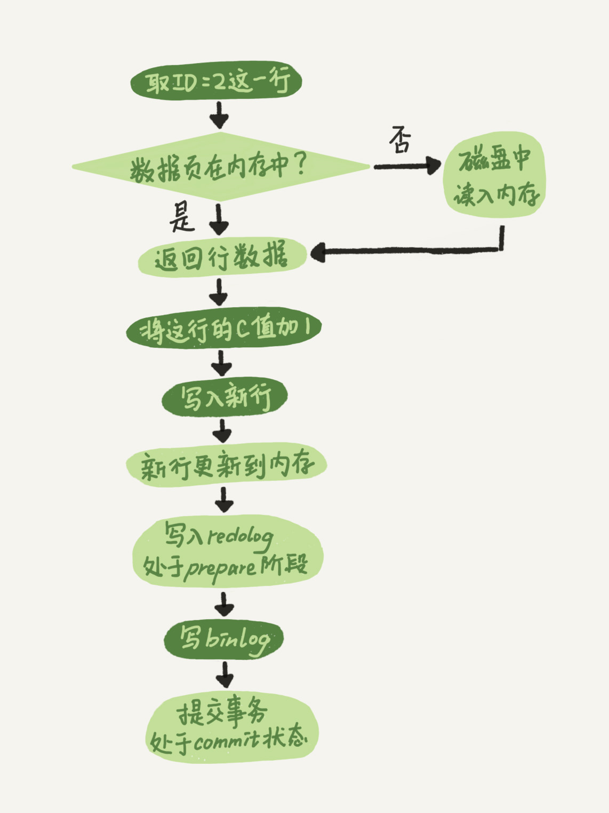
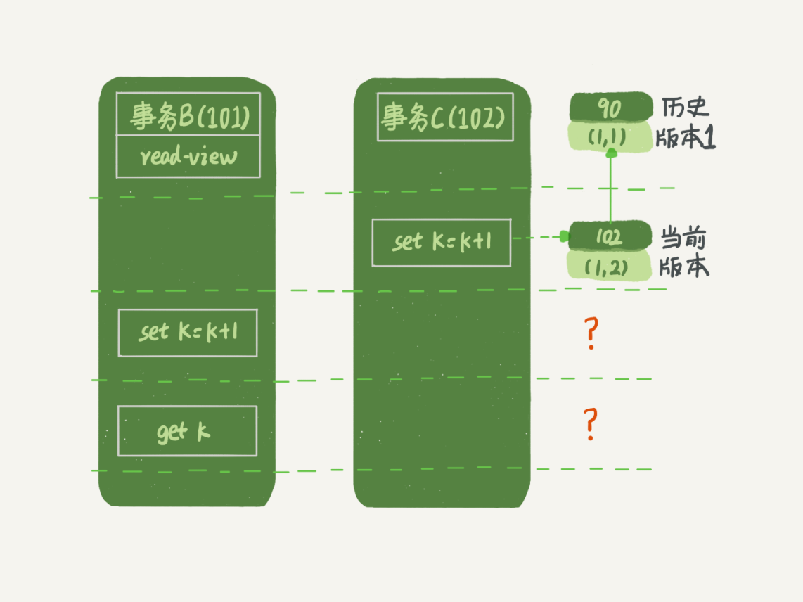
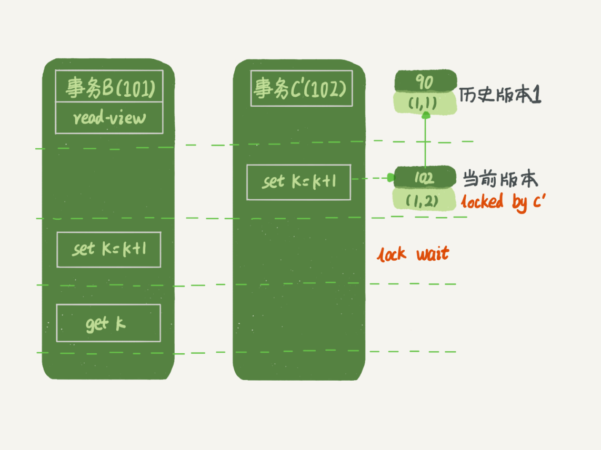
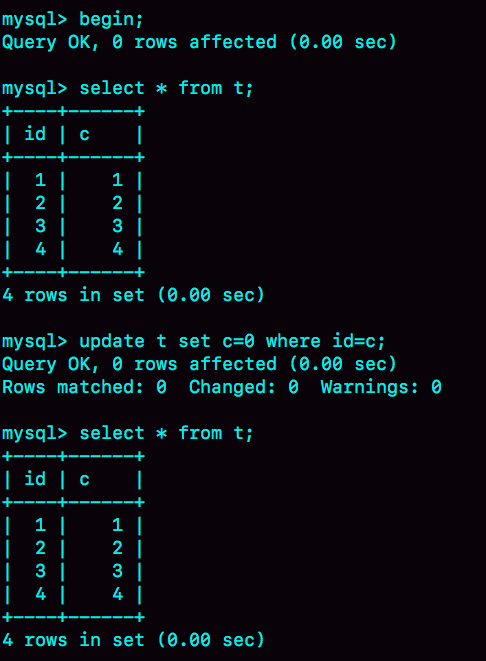
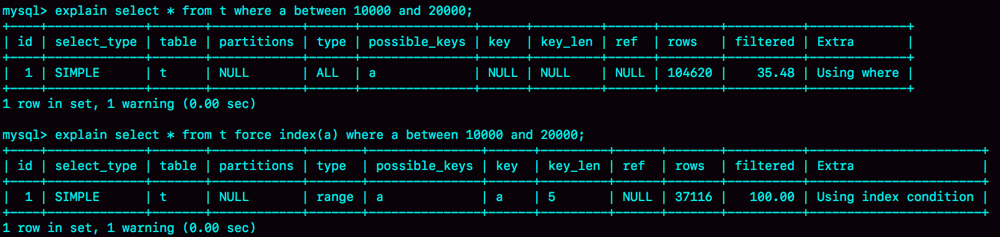
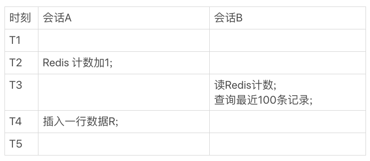
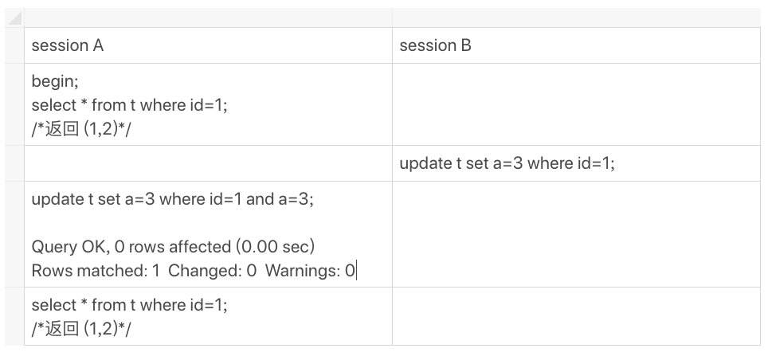

# 极客时间《MySQL实战45讲》学习笔记(1-15)


[toc]


# 1. 基础架构：一条SQL 查询语句是如何执行的

## 1.1 基本架构

  MySQL的基本架构示意图 ： 

MySQL 可以分为 **Server 层** 和 **存储引擎层** 两部分 。

- Server 层包括**连接器、查询缓存、分析器、优化器、执行器**等，涵盖 MySQL 的大多数核心服务功能，以及所有的**内置函数**（如日期、时间、数学和加密函数等），所有跨存储引擎的功能都在这一层实现，比如存储过程、触发器、视图等。 

- 存储引擎层**负责数据的存储和提取**。其架构模式是**插件式**的，支持 InnoDB、MyISAM、Memory 等多个存储引擎。现在**最常用的存储引擎是 InnoDB**，它从 MySQL 5.5.5 版本开始成为了默认存储引擎。 

> 不同的存储引擎共用一个 **Server 层**，也就是从连接器到执行器的部分。 


## 1.2 连接器

 

连接器负责**跟客户端建立连接、获取权限、维持和管理连接**。连接命令一般是这么写的： 

```shell
 mysql -h$ip -P$port -u$user -p 
```

> 输完命令之后，就需要在交互对话里面输入密码。虽然密码也可以直接跟在 `-p` 后面写在命令行中，但这样可能会导致密码泄露。 

**连接命令中的 `mysql` 是客户端工具，用来跟服务端建立连接**。在完成 **TCP 握手**后，连接器开始认证用户身份，这个时候用的就是输入的用户名和密码。 

- 如果用户名或密码不对，就会收到一个"Access denied for user"的错误，然后客户端程序结束执行。
- 如果**用户名密码认证通过，连接器会到权限表里面查出你拥有的权限**。之后，**这个连接里面的权限判断逻辑，都将依赖于此时读到的权限。**

> 这就意味着，一个用户成功建立连接后，即使你用管理员账号对这个用户的权限做了修改，也不会影响已经存在连接的权限。修改完成后，只有再新建的连接才会使用新的权限设置。 

连接完成后，如果用户没有后续的动作，这个连接就处于**空闲**状态，可以在 `show processlist` 命令中看到它。  

其中的 Command 列显示为“Sleep”的这一行，就表示现在系统里面有一个空闲连接。 

客户端如果太长时间没动静，连接器就会自动将它断开。这个时间是由参数 `wait_timeout` 控制的，默认值是 **8 小时**。如果在连接被断开之后，客户端再次发送请求的话，就会收到一个错误提醒： `Lost connection to MySQL server during query`。这时候如果要继续，就**需要重连**，然后再执行请求了。 


数据库里面，**长连接**是指**连接成功后，如果客户端持续有请求，则一直使用同一个连接**。**短连接**则是指**每次执行完很少的几次查询就断开连接，下次查询再重新建立一个**。 

> 建议在使用中要尽量减少建立连接的动作，也就是尽量使用长连接。 

但是全部使用长连接后，有些时候 MySQL 占用内存会涨得特别快，这是因为 **MySQL 在执行过程中临时使用的内存是管理在连接对象里面的。这些资源会在连接断开的时候才释放**。所以如果长连接累积下来，可能导致内存占用太大，被系统强行杀掉（OOM：Out of Memory），从现象看就是 MySQL 异常重启了。 

怎么解决这个问题呢？可以考虑以下两种方案：

1. **定期断开长连接**。使用一段时间，或者程序里面判断执行过一个占用内存的大查询后，断开连接，之后要查询再重连。
2. 如果用的是 MySQL 5.7 或更新版本，可以**在每次执行一个比较大的操作后，通过执行 `mysql_reset_connection` 来重新初始化连接资源**。该过程不需要重连和重新做权限验证，但是会将连接恢复到刚刚创建完时的状态。


## 1.3 查询缓存

 

连接建立完成后，就可以执行 select 语句了。执行逻辑就会来到第二步：**查询缓存**。 

MySQL 拿到一个查询请求后，会**先到查询缓存看看**，之前是不是执行过这条语句。之前执行过的语句及其结果可能会以 **key（查询的语句）— value （查询的结果）对** 的形式，被直接缓存在内存中。如果用户的查询能够直接在这个缓存中找到 key，那么这个 value 就会被直接返回给客户端。 

如果语句不在查询缓存中，就会继续后面的执行阶段。

**执行完成后，执行结果会被存入查询缓存中**。可以看到，如果查询命中缓存，MySQL 不需要执行后面的复杂操作，就可以直接返回结果，这个效率会很高。 


多数情况下建议不要使用查询缓存，为什么？因为**查询缓存往往弊大于利**。 

> **查询缓存的失效非常频繁，只要有对一个表的更新，这个表上所有的查询缓存都会被清空**。因此很可能费劲地把结果存起来，还没使用呢，就被一个更新全清空了。对于更新压力大的数据库来说，查询缓存的命中率会非常低。除非业务就是有一张静态表，很长时间才会更新一次。比如，一个系统配置表，那这张表上的查询才适合使用查询缓存。 

好在 MySQL 也提供了“按需使用”的方式。可以将参数 `query_cache_type` 设置成 DEMAND，这样对于默认的 SQL 语句都不使用查询缓存。而对于确定要使用查询缓存的语句，可以用 **SQL_CACHE 显式指定**，像下面这个语句一样： 

```sql
mysql> select SQL_CACHE * from T where ID=10； 
```

> 需要注意的是，MySQL 8.0 版本直接将查询缓存的整块功能删掉了。


## 1.4 分析器（做什么）


如果没有命中查询缓存，就要开始真正执行语句了。首先，MySQL 需要知道要做什么，因此需要对 SQL 语句做解析。 

分析器先会做「词法分析」。SQL 语句是由多个字符串和空格组成的一条语句，**MySQL 需要识别出 SQL 语句里面的字符串分别是什么，代表什么**。 （在这个阶段就可以分析出语句中的字段是否在数据库中存在、别名是否有歧义等。）

MySQL 从输入的 "select" 这个关键字识别出来，这是一个查询语句。它也要把字符串 “T” 识别成 “表名T”，把字符串 “ID” 识别成 “列ID”。 

做完了这些识别以后，就要做「语法分析」。**根据词法分析的结果，语法分析器会根据语法规则，判断输入的这个 SQL 语句是否满足 MySQL 语法**。

如果语句不对，就会收到 “You have an error in your SQL syntax” 的错误提醒，比如下面这个语句 select 少打了开头的字母 “s”。

```sql
mysql> elect * from t where ID=1; 

ERROR 1064 (42000): You have an error in your SQL syntax; check the manual that corresponds to your MySQL server version for the right syntax to use near 'elect * from t where ID=1' at line 1 
```

> 一般语法错误会提示第一个出现错误的位置，所以要关注的是**紧接“use near”的内容**。 


## 1.5 优化器（怎么做）

经过了分析器，MySQL 就知道用户要做什么了。在开始执行之前，还要先经过**优化器**的处理。

优化器是**在表里面有多个索引的时候，决定使用哪个索引**；或者**在一个语句有多表关联（join）的时候，决定各个表的连接顺序**。比如执行下面这样的语句，这个语句是执行两个表的 join：

```sql
mysql> select * from t1 join t2 using(ID)  where t1.c=10 and t2.d=20; 
```

- 既可以先从表 t1 里面取出 c=10 的记录的 ID 值，再根据 ID 值关联到表 t2，再判断 t2 里面 d 的值是否等于 20。
- 也可以先从表 t2 里面取出 d=20 的记录的 ID 值，再根据 ID 值关联到表 t1，再判断 t1 里面 c 的值是否等于 10。

这两种执行方法的逻辑结果是一样的，但是执行的效率会有不同，而优化器的作用就是决定选择使用哪一个方案。

优化器作用：**选择索引，生产执行方案**。

优化器阶段完成后，这个语句的执行方案就确定下来了，然后进入执行器阶段。


## 1.6 执行器（开始做）

 

MySQL 通过分析器知道了要做什么，通过优化器知道了该怎么做，于是就进入了**执行器**阶段，开始执行语句。

开始执行的时候，要**先判断一下用户对这个表 T 有没有执行查询的权限**，如果没有，就会返回没有权限的错误，如下所示（在工程实现上，如果命中查询缓存，会在查询缓存放回结果的时候，做权限验证。查询也会在优化器之前调用 `precheck` 验证权限）。

```sql
mysql> select * from T where ID=10;

ERROR 1142 (42000): SELECT command denied to user 'b'@'localhost' for table 'T'
```

如果有权限，就打开表继续执行。打开表的时候，执行器就会**根据表的引擎定义，去使用这个引擎提供的接口**。

比如这个例子中的表 T 中，ID 字段没有索引（按顺序一行行找），那么执行器的执行流程是这样的：

1. 调用 InnoDB 引擎接口取这个表的第一行，判断 ID 值是不是 10，如果不是则跳过，如果是则将这行存在结果集中；
2. 调用引擎接口取“下一行”，重复相同的判断逻辑，直到取到这个表的最后一行。
3. 执行器将上述遍历过程中所有满足条件的行组成的记录集作为结果集返回给客户端。

至此，这个语句就执行完成了。

对于有[索引](#4. 深入浅出索引（上）)的表，执行的逻辑也差不多，但受益于索引的组织形式，查询会更快。第一次调用的是“取满足条件的第一行”这个接口，之后循环取“满足条件的下一行”这个接口，这些接口都是引擎中已经定义好的。

> 可以在数据库的慢查询日志中看到一个 `rows_examined` 的字段，表示**这个语句执行过程中扫描了多少行**。这个值就是**在执行器每次调用引擎获取数据行的时候累加**的。
>
> 在有些场景下，执行器调用一次，在引擎内部则扫描了多行，因此**引擎扫描行数跟 `rows_examined` 并不是完全相同的。**


# 2. 日志系统：一条SQL更新语句是如何执行的(redo log/bin log)

一条更新语句的执行流程是怎样的呢？ 

还是从一个表的一条更新语句说起，下面是这个表的创建语句，这个表有一个主键 ID（会建立索引）和一个整型字段 c： 

```sql
mysql> create table T(ID int primary key, c int);
```

如果要将 `ID=2` 这一行的值加 1，SQL 语句就会这么写：

```sql
mysql> update T set c=c+1 where ID=2;
```

首先，可以确定的说，**查询语句的那一套流程，更新语句也是同样会走一遍**。除此之外，**更新语句还需要写两个日志（redolog 和 binlog）。** 

 

前面说过，在一个表上有更新的时候，跟这个表有关的查询缓存会失效，所以这条更新语句就会把表 T 上所有缓存结果都清空。这也就是一般不建议使用查询缓存的原因。

接下来，分析器会通过词法和语法解析知道这是一条更新语句。优化器决定要使用 ID 这个索引。然后，执行器负责具体执行，找到这一行，然后更新。

与查询流程不一样的是，更新流程还涉及两个重要的**日志**模块：**redo log**「重做日志」和 **binlog**「归档日志」。


## 2.1 redo log

在 MySQL 里有个问题，如果每一次的更新操作都需要写进磁盘，然后磁盘也要找到对应的那条记录，然后再更新，整个过程 IO 成本、查找成本都很高。为了解决这个问题，redo log 应运而生。

通过酒店掌柜记账思路剖析 redo log 工作原理：

 

> 日志和磁盘配合的整个过程，就是 MySQL 里经常说到的 **WAL 技术**（Write-Ahead Logging），关键点就是**先写日志，再写磁盘**。 

InnoDB 的 redo log 是**固定大小**的，比如可以配置为一组 4 个文件，每个文件的大小是 1 GB，那么这个日志总共就可以记录 4 GB 的操作。从头开始写，写到末尾就又回到开头**循环写**，如下面这个图（顺时针）所示：  

  

`write pos` 是**当前记录的位置**，一边写一边后移，写到第 3 号文件末尾后就回到 0 号文件开头。`checkpoint` 是**当前要擦除的位置**，也是往后推移并且循环的，擦除记录前要把记录更新到数据文件。 

图中 `write pos` 和 `checkpoint` 之间的（绿色部分）是 redo log 上还空着的部分，可以用来记录新的操作。如果 `write pos` 追上 `checkpoint`，表示 redo log 满了，这时候不能再执行新的更新，得停下来先擦掉一些记录，把 `checkpoint` 推进一下。

> 只要赊账记录在了粉板上或写了账本上，之后即使掌柜忘记了，比如停业几天，恢复生意后依然可以通过账本和粉板上的数据明确赊账账目。

有了 redo log，InnoDB 就可以保证**即使数据库发生异常重启，之前提交的记录都不会丢失**，这个能力称为 **crash-safe**。


## 2.2 binlog

> **redo log（重做日志）是 InnoDB 引擎特有的日志**，而 Server 层也有自己的日志，称为 **binlog（归档日志）**。 

为什么会有两份日志呢？

因为最开始 MySQL 里并没有 InnoDB 引擎。MySQL 自带的引擎是 MyISAM，但是 MyISAM 没有 crash-safe 的能力，binlog 日志只能用于归档。而 InnoDB 是另一个公司以插件形式引入 MySQL 的，既然只依靠 binlog 是没有 crash-safe 能力的，所以 InnoDB 使用另外一套日志系统——也就是 redo log 来实现 crash-safe 能力。 

**redo log 和 binlog 的区别**：

 

> - redo log 记录在某个数据页上做了什么改动。
> - binlog 有两种模式，`statement` 模式的话是记录 sql 语句； `row` 模式会记录数据行的内容（记两条，更新前和更新后都有）。 

**binglog 几大模式**：

 

一般采用 `row`，因为遇到事件，从库可能会出现不一致的情况，但是 `row` 更新前后都有，会导致日志变大。

1. 互联网公司，使用 MySQL 的功能相对少（存储过程、触发器、函数），选择默认的语句模式 Statement Level（默认）。

2. 公司如果用到使用 MySQL 的特殊功能（存储过程、触发器、函数），则选择 Mixed 模式。

3. 公司如果用到使用 MySQL 的特殊功能（存储过程、触发器、函数）又希望数据最大化一直，此时最好选择 Row level 模式。

**行模式（row）和语句模式（statement）的区别**：

 


## 2.3 update 语句执行流程

有了对这两个日志的概念性理解，再来看执行器和 InnoDB 引擎在执行上面这个简单的 update 语句 `update T set c=c+1 where ID=2;` 时的内部流程：

1. 执行器先找引擎取 `ID=2` 这一行。ID 是主键，引擎直接用树搜索找到这一行。如果 `ID=2` 这一行所在的数据页本来就在内存中，就直接返回给执行器；否则，需要先从磁盘读入内存，然后再返回。
2. 执行器拿到引擎给的行数据，把这个值加上 1，比如原来是 N，现在就是 N+1，得到新的一行数据，再调用引擎接口写入这行新数据。
3. 引擎将这行新数据更新到内存中，同时将这个更新操作记录到 redo log 里面，此时 redo log 处于 prepare 状态。然后告知执行器执行完成了，随时可以提交事务。
4. 执行器生成这个操作的 binlog，并把 binlog 写入磁盘。
5. 执行器调用引擎的提交事务接口，引擎把刚刚写入的 redo log 改成提交（commit）状态，更新完成。

下面是这个 update 语句的执行流程图，图中浅色框表示是在 InnoDB 内部执行的，深色框表示是在执行器中执行的：

 

最后三步将 redo log 的写入拆成了两个步骤：`prepare` 和 `commit`，这就是「两阶段提交」。 


## 2.4 两阶段提交

两阶段提交的目的：**为了让两份日志之间的逻辑一致**。要说明这个问题，得先了解一下误删表数据后的数据恢复流程。

前面说过，binlog 会记录所有的**逻辑操作**，并且是采用“追加写”的形式。一般备份系统中会保存近来某段时间内的所有 binlog，同时系统会定期做整库备份。

数据恢复流程：

比如在某个时间点发生了一次误删表，需要找回数据，那可以这么做：

1. 找到最近的一次全量备份，从这个备份恢复到临时库；
2. 从备份的时间点开始，将备份的 binlog 依次取出，重放到删表之前的那个时刻。

这样临时库就跟误删之前的线上库一样了，然后就可以把表数据从临时库取出来，按需要恢复到线上库去。

***

为什么日志需要“两阶段提交”？这里用反证法来进行解释：

由于 redo log 和 binlog 是两个独立的逻辑，如果不用两阶段提交，要么就是先写完 redo log 再写 binlog，要么相反。这两种方式都会存在一些问题：

仍然用前面的 update 语句来做例子。假设当前 `ID=2` 的行，字段 c 的值是 0，再假设执行 update 语句过程中在写完第一个日志后，第二个日志还没有写完期间发生了 crash，会出现什么情况呢？

1. **先写 redo log 后写 binlog**。假设在 redo log 写完（redo log 写完后就会提交本次更新事务，库中该行的字段 c 成功修改为 1），binlog 还没有写完的时候，MySQL 进程异常重启。由于前面说过的，redo log 写完之后，系统即使崩溃，仍然能够把数据恢复回来，所以恢复后这一行 c 的值是 1。
   
   但是由于 binlog 没写完就 crash 了，这时候 binlog 里面就没有记录这个语句。因此，之后备份日志的时候，存起来的 binlog 里面就没有这条语句。
   
   然后你就会发现，如果需要用这个 binlog 来恢复临时库的话，由于这个语句的 binlog 丢失，这个临时库就会少了这一次更新，恢复出来的这一行 c 的值就是 0，与原库的值不同。
   
2. **先写 binlog 后写 redo log**。如果在 binlog 写完之后 crash，由于 redo log 还没写，崩溃恢复以后这个事务无效（redo log 没写完不会提交事务，c 不变），所以这一行 c 的值是0。但是 binlog 里面已经记录了 “把 c 从 0 改成 1” 这个日志。所以，在之后用 binlog 来恢复的时候就多了一个事务出来，恢复出来的这一行 c 的值就是 1，与原库的值不同。

可以看到，**如果不使用“两阶段提交”，那么数据库的状态就有可能和用它的日志恢复出来的库的状态不一致。**

***

简单说，redo log 和 binlog 都可以用于表示事务的提交状态，而两阶段提交就是让这两个状态保持逻辑上的一致。

「两阶段提交」在哪些场景避免了恢复库状态不一致？

> 不只是误操作后需要用这个过程来恢复数据。当需要扩容的时候，也就是需要再多搭建一些备库来增加系统的读能力的时候，现在常见的做法也是用全量备份加上应用 binlog 来实现的，这个“不一致”就会导致线上出现主从数据库不一致的情况。

- redo log 用于保证 crash-safe 能力。`innodb_flush_log_at_trx_commit` 这个参数设置成 1 的时候，表示每次事务的 redo log 都直接持久化到磁盘。这个参数建议设置成 1，这样可以保证 MySQL 异常重启之后数据不丢失。

- `sync_binlog` 这个参数设置成 1 的时候，表示每次事务的 binlog 都持久化到磁盘。这个参数也建议设置成 1，这样可以保证 MySQL 异常重启之后 binlog 不丢失。

> 两阶段提交是跨系统维持数据逻辑一致性时常用的一个方案。


# 3. 事务隔离：为什么你改了我还看不见

简单来说，事务就是**要保证一组数据库操作，要么全部成功，要么全部失败**。在 MySQL 中，事务支持是在引擎层实现的，但并不是所有的引擎都支持事务（InnoDB 引擎支持事务，MyISAM 引擎不支持）。

## 3.1 隔离性与隔离级别

### 3.1.1 事务的 ACID 特性

- **原子性**（Atomicity）：事务被视为不可分割的最小单元，要么全部提交成功，要么全部失败回滚。
- **一致性**（Consistency）：事务执行前后都保持一致性状态。在一致性状态下，所有事务对一个数据的读取结果都是相同的。
- **隔离性**（Isolation）：一个事务所做的修改在最终提交以前，对其它事务是不可见的。 
- **持久性**（Durability）：一旦事务提交，其所做的修改将会永远保存到数据库中。即使系统发生崩溃，事务执行的结果也不能丢失，可以通过数据库备份和恢复来保证持久性。 


### 3.1.2 不同事务隔离级别的区别

- **读未提交**（read uncommitted）：别人改数据的事务尚未提交，我在我的事务中也能读到。
- **读已提交**（read committed）：别人改数据的事务已经提交，我在我的事务中才能读到。
- **可重复读**（repeatable read）：一个事务执行过程中看到的数据，总是跟这个事务在启动时看到的数据是一致的。 
- **串行化**（serializable）：对于同一行记录，“写” 会加 “写锁”，“读” 会加 “读锁”。当出现读写锁冲突的时候，后访问的事务必须等前一个事务执行完成，才能继续执行。 

这 4 种隔离级别，并行性能依次降低，安全性依次提高。

> MySQL 的默认隔离级别是「可重复读」，Oracle 的默认隔离级别是「读提交」。


### 3.1.3 多事务执行时可能出现的问题

多事务同时执行的时候，可能会出现的问题：**脏读、不可重复读、幻读**

- **脏读**：
  当一个事务正在访问数据并且对数据进行了修改，而这种修改还没有提交到数据库中，这时另外一个事务也访问了这个数据，然后使用了这个数据。因为这个数据是还没有提交的数据，那么另外一个事务读到的这个数据是 “脏数据”，依据 “脏数据” 所做的操作可能是不正确的。 

  **此情况仅会发生在： 读未提交的的隔离级别**

- **不可重复读**：
  在事务 A 内多次读同一数据，在事务 A 还没有结束时，事务 B 也访问该数据。那么，在事务 A 中的两次读数据之间，由于事务 B 的修改导致事务 A 两次读取的数据可能不太一样。这就发生了在一个事务内两次读到的数据是不一样的情况，即为不可重复读。

  **此情况仅会发生在：读未提交、读提交的隔离级别**

- **幻读**：
  在一个事务（T1）读取了几行数据，接着另一个并发事务（T2）插入了一些数据时。在随后的查询中，第一个事务（T1）就会发现多了一些原本不存在的记录，就好像发生了幻觉一样，所以称为幻读。 
  
  **此情况仅会发生在：读未提交、读提交、可重复读的隔离级别**

**不可重复读和幻读区别：**

不可重复读的重点是修改，比如多次读取一条记录发现其中某些列的值被修改；幻读的重点在于新增或者删除，比如多次查询同一条查询语句（DQL）时，记录发现记录增多或减少了。


### 3.1.3 “读提交” 和 “可重复读”

假设数据表 T 中只有一列，其中一行的值为 1，下面是按照时间顺序执行两个事物的行为：

   

下面看看在不同隔离级别下，事务 A 会有哪些不同的返回结果，也就是图里面 V1、V2、V3 的返回值分别是什么？ 

  


### 3.1.4 隔离级别的配置方法

配置方法：启动参数 `transaction-isolation`

```sql
mysql> show variables like 'transaction_isolation';
+-----------------------+-----------------+
| Variable_name         | Value           |
+-----------------------+-----------------+
| transaction_isolation | REPEATABLE-READ |
+-----------------------+-----------------+
1 row in set (0.01 sec)
```


### 3.1.5 可重复读场景

假设你在管理一个个银行账户表，一个表存了每个月月底的余额，一个表存了账单明细，这时候你要做数据校对，也就是判断上个月的余额和当前余额的差额，是否与本月的账单明细一致，你一定希望在校对的过程中，即使有用户发生了一笔新的交易，也不影响你的校对结果。

这时候 "可重复读" 隔离级别就很方便，**事务启动时的视图可以认为是静态的，不受其他事务更新的影响**。


## 3.2 事务隔离的实现

### 3.2.1 事务隔离的实现

在 MySQL 中，实际上每条记录在更新的时候都会同时记录一条回滚操作。记录上的最新值，通过回滚操作，都可以得到前一个状态的值。 

假设一个值 1 被按顺序改成 2、3、4，在回滚日志（undo log）里面就会有类似下面的记录：

 

**每条记录在更新的时候都会同时记录一条回滚操作。同一条记录在系统中可以存在多个版本，这就是数据库的多版本并发控制（MVCC）**。

对于read-view A ，要得到 1 就必须将当前值依次执行途中所有回滚操作得到。

### 3.2.2 事务隔离的几个问题

1. 回滚日志什么时候删除？

   系统会判断当没有事务需要用到这些回滚日志的时候，回滚日志会被删除。

2. 什么时候不需要了？

   当系统里没有比这个回滚日志更早的 read-view 的时候。

3. 为什么尽量不要使用长事务

   长事务意味着系统里面会存在很老的事务视图，在这个事务提交之前，回滚记录都要保留，这会导致大量占用存储空间。除此之外，长事务还占用锁资源，可能会拖垮库。


## 3.3 事务启动方式

### 3.3.1 启动方式

- 方式一

  显式启动事务语句，`begin` 或者 `start transaction`，提交 `commit`，回滚 `rollback`；

- 方式二

  `set autocommit=0`，该命令会把这个线程的自动提交关掉。这样只要执行一个 select 语句，事务就启动，并不会自动提交，直到主动执行 `commit` 或 `rollback` 或断开连接。

**建议使用方式一**

如果考虑多一次交互问题，可以使用 `commit work and chain` 语法。在 `autocommit=1` 的情况下用 `begin` 显式启动事务，如果执行 `commit` 则提交事务。如果执行 `commit work and chain` 则提交事务并自动启动下一个事务。


### 3.3.2 如何查询长事务

下面语句用于查找持续时间超过 60s 的事务：

```sql
select * from information_schema.innodb_trx where TIME_TO_SEC(timediff(now(),trx_started))>60
```


## 3.4 问题

如何避免长事务对业务的影响？ 

这个问题，可以从应用开发端和数据库端来看。

**首先，从应用开发端来看：**

1. 确认是否使用了 `set autocommit=0`。这个确认工作可以在测试环境中开展，把 MySQL 的 general_log 开起来，然后随便跑一个业务逻辑，通过 general_log 的日志来确认。一般框架如果会设置这个值，也就会提供参数来控制行为，你的目标就是把它改成 1。
2. 确认是否有不必要的只读事务。有些框架会习惯不管什么语句先用 `begin/commit` 框起来。有些是业务并没有这个需要，在只读事务中可以去掉。
3. 业务连接数据库的时候，根据业务本身的预估，通过 `SET MAX_EXECUTION_TIME` 命令，来控制每个语句执行的最长时间，避免单个语句意外执行太长时间。

**其次，从数据库端来看：**

1. 监控 information_schema.Innodb_trx 表，设置长事务阈值，超过就报警/或者 `kill`；
2. Percona 的 pt-kill 这个工具不错，推荐使用；
3. 在业务功能测试阶段要求输出所有的 general_log，分析日志行为提前发现问题；
4. 如果使用的是 MySQL 5.6 或者更新版本，把 `innodb_undo_tablespaces` 设置成 2（或更大的值）。如果真的出现大事务导致回滚段过大，这样设置后清理起来更方便。


# 4. 深入浅出索引（上）

## 4.1 索引模型

### 4.1.1 索引的作用

索引的出现其实是为了**提高数据查询的效率**，就像书的目录一样。

### 4.1.2 索引模型比较

 

为什么二叉树是搜索效率最高的，但是实际上大多数的数据库存储却并不适用二叉树？

其原因是，**索引不止在内存中，还要写到磁盘上**。

> N 叉树由于在读写上的性能优点，以及适配磁盘的访问模式，已经被广泛应用在数据库引擎中了。

数据库底层存储的核心就是基于这些数据模型的，每碰到一个新数据库，我们需要先关注它的数据模型，这样才能从理论上给分析出数据库的适应场景。

下面是以平衡二叉树和 N 叉树两种形式存储数据的对比：


## 4.2 InnoDB 索引模型

在 MySQL 中，索引是在**存储引擎层**实现的，所以并没有统一的索引标准，即不同存储引擎的索引的工作方式并不一样。而即使多个存储引擎支持同一种类型的索引，其底层的实现也可能不同。 


### 4.2.1 InnoDB 索引数据结构

在 InnoDB 中，表都是根据主键顺序以索引的形式存放的，这种存储方式的表称为**索引组织表**。又因为前面提到的，InnoDB 使用了 B+ 树索引模型，所以数据都是存储在 B+ 树中的。

**每一个索引在InnoDB里面对应一棵 B+ 树**。

假设，有一个主键列为 ID 的表，表中有字段 k，并且在 k 上有索引。这个表的建表语句如下：

```sql
mysql> create table T(
id int primary key, 
k int not null, 
name varchar(16),
index (k))engine=InnoDB;
```

表中 R1~R5 的 (ID,k) 值分别为 (100,1)、(200,2)、(300,3)、(500,5) 和 (600,6)，则两棵索引树的示例示意图如下：


 其中主键的索引树叶子节点保存了整行数据，而非主键索引树叶子节点只保存主键值。


### 4.2.2 索引类型

**主键索引**：主键索引的叶子节点存的是整行的数据（聚簇索引）

**非主键索引**：非主键索引的叶子节点内容是主键的值（二级索引）


### 4.2.3 主键索引和普通索引的区别

- 主键索引只要搜索主键索引树这个 B+Tree 即可拿到数据。

  如果语句是 `select * from T where ID=500`，即主键查询方式，则只需要搜索 ID 这棵 B+ 树

- 普通索引先搜索索引拿到主键值，再到主键索引树搜索一次（**回表**）。

  如果语句是 `select * from T where k=5`，即普通索引查询方式，则需要先搜索 k 索引树，得到到 ID 的值为 500，再到 ID 索引树搜索一次。这个过程为回表。 

**也就是说，基于非主键索引的查询需要多扫描一棵树，因此，在应用中应该尽量使用主键查询** 。


## 4.3 索引维护

B+ 树为了维护索引有序性，在插入新值的时候需要做必要的维护。以上面的图为例，如果插入新的行 ID 值为 700，则只需要在 R5 的记录后面插入一个新记录。如果新插入的 ID 值为 400，就相对麻烦了，需要逻辑上挪动后面的数据，空出位置。

### 4.3.1 页分裂/页合并

一个数据页满了，按照 B+Tree 算法，需要**申请一个新的数据页，然后挪动部分数据过去**，**叫做页分裂**，会导致性能下降。空间利用率降低大概 50%。

**当相邻的两个数据页利用率很低的时候会做数据页合并**，**合并**的过程是分裂过程的逆过程。

**页分裂**


**页合并**

 


### 4.3.2 什么是自增主键？

自增主键是指**自增列上定义的主键**，在建表语句中一般是这么定义的： `NOT NULL PRIMARY KEY AUTO_INCREMENT`。 插入新记录的时候可以不指定 ID 的值，系统会获取当前 ID 最大值加 1 作为下一条记录的 ID 值。

也就是说，自增主键的插入数据模式，正符合前面提到的递增插入的场景。**每次插入一条新记录，都是追加操作，都不涉及到挪动其他记录，也不会触发叶子节点的分裂**。


### 4.3.3 为什么要选择自增主键？

1. 自增主键的插入数据模式，正符合递增插入的场景。**每次插入一条新记录，都是追加操作，都不涉及到挪动其他记录，也不会触发叶子节点的分裂**。

2. **主键长度越小，普通索引的叶子节点就越小，普通索引占用的空间也就越小。**

   由于每个非主键索引的叶子节点上都有主键的值：

   1. 如果用身份证号做主键，那么每个二级索引的叶子节点占用的 20 个字节，

   2. 而如果用整型做主键，则只要 4 个字节，

   3. 如果是长整型则是 8 个字节

**从性能和存储空间方面考量，自增主键往往是更合理的选择。**


### 4.3.4 什么场景适合直接用业务字段做主键？

1. 只有一个索引；
2. 该索引必须是唯一索引。

这就是典型的 KV 场景。由于没有其他索引，所以也就不用考虑其他索引的叶子节点大小的问题。

**这时候就要优先考虑的“尽量使用主键查询”原则，直接将这个索引设置为主键，可以避免每次查询需要搜索两棵树。**


## 4.4 问题

对于上面例子中的 InnoDB 表 T，如果你要重建索引 k，你的两个 SQL 语句可以这么写： 

```sql
alter table T drop index k;
alter table T add index(k);
```

如果你要重建主键索引，也可以这么写： 

```sql
alter table T drop primary key;
alter table T add primary key(id);
```

我的问题是，对于上面这两个重建索引的作法，说出你的理解。如果有不合适的，为什么，更好的方法是什么？ 

重建索引 k 的做法是合理的，可以达到省空间的目的。但是，重建主键的过程不合理。不论是删除主键还是创建主键，都会将整个表重建。所以连着执行这两个语句的话，第一个语句就白做了。这两个语句，可以用这个语句代替 ： `alter table T engine=InnoDB`。 


# 5. 深入浅出索引（下）

## 5.1 需要回表的案例

在下面表 T 中，执行下面语句，需要执行几次树的搜索操作？会扫描多少行？

```sql
select * from T where k between 3 and 5
```

表初始化语句：

```sql
mysql> create table T (
ID int primary key,
k int NOT NULL DEFAULT 0,
s varchar(16) NOT NULL DEFAULT '',
index k(k))
engine=InnoDB;
 
insert into T values(100,1, 'aa'),(200,2,'bb'),(300,3,'cc'),(500,5,'ee'),(600,6,'ff'),(700,7,'gg');
```

这条SQL语句的执行流程：

 

1. 在 k 索引树上找到 k=3 的记录，取得 ID = 300；
2. 再到 ID 索引树查到 ID=300 对应的 R3；
3. 在 k 索引树取下一个值 k=5，取得 ID=500；
4. 再回到 ID 索引树查到 ID=500 对应的 R4；
5. 在 k 索引树取下一个值 k=6，不满足条件，循环结束。

在这个过程中，**回到主键索引树搜索的过程，我们称为回表**。可以看到，这个查询过程读了 k 索引树的 3 条记录（步骤 1、3 和 5），回表了两次（步骤 2 和 4）。 


## 5.2 如何避免回表？

在上面的例子中，由于**查询结果所需要的数据只在主键索引上有，所以不得不回表**。那么有没有可能经过索引优化，避免回表过程？ 


### 5.2.1 覆盖索引

对于这条查询语句：

```sql
select ID from T where k between 3 and 5
```

索引 k 已经"覆盖了"我们的查询需求（k 索引树叶子节点存储了 k 和 主键 ID）。我们称为**覆盖索引**。

**由于覆盖索引可以减少树的搜索次数，显著提升查询性能，所以使用覆盖索引是一个常用的性能优化手段。**

> 需要注意的是，在引擎内部使用覆盖索引在索引 k 上其实读了三个记录，R3~R5（对应的索引 k 上的记录项），但是对于 MySQL 的 Server 层来说，它就是找引擎拿到了两条记录，因此 MySQL 认为扫描行数是 2。 


基于上面覆盖索引的说明，讨论一个问题：**在一个市民信息表上，是否有必要将身份证号和名字建立联合索引？**

假设这个市民表的定义是这样的：

```sql
CREATE TABLE `tuser` (
  `id` int(11) NOT NULL,
  `id_card` varchar(32) DEFAULT NULL,
  `name` varchar(32) DEFAULT NULL,
  `age` int(11) DEFAULT NULL,
  `ismale` tinyint(1) DEFAULT NULL,
  PRIMARY KEY (`id`),
  KEY `id_card` (`id_card`),
  KEY `name_age` (`name`,`age`)
) ENGINE=InnoDB
```

如果现在有一个高频请求，要根据市民的身份证号查询他的姓名，这个联合索引就有意义了。它可以在这个高频请求上用覆盖索引，不再需要回表查整行记录，减少语句的执行时间 。


## 5.3 最左前缀原则

### 5.3.1 什么是最左前缀原则？

1. 疑问

   单独为一个不频繁的请求创建一个索引感觉有点浪费，应该怎么做呢？ 

2. 解决方案

   **B+ 树这种索引结构，可以利用索引的"最左前缀"，来定位记录**。在查询条件中使用了联合索引的左边第一个字段，索引才会被使用。

为了直观地说明这个概念，用 (name、age) 这个联合索引来分析：

 

可以看到，索引项是按照索引定义里面出现的字段顺序排序的（先按主键 name 排序，再按 age 排序）。 

1. 当逻辑需求是查到所有名字是 “张三” 的人时，可以快速定位到 ID4，然后向后遍历得到所有需要的结果。 

2. 如果要查的是所有名字第一个字是 “张” 的人

   ```sql
   where name like ‘张%’
   ```

   这时，也能够用上这个索引，查找到第一个符合条件的记录是 ID3，然后向后遍历，直到不满足条件为止。 

**不只是索引的全部定义，只要满足最左前缀，就可以利用索引来加速检索。这个最左前缀可以是联合索引的最左 N 个字段，也可以是字符串索引的最左 M 个字符。** 


### 5.3.2 在建立联合索引的时候，如何安排索引内的字段顺序？

这里评估标准是，**索引的复用能力**。因为可以支持最左前缀，所以当已经有了 (a,b) 这个联合索引后，一般就不需要单独在 a 上建立索引了。因此，**第一原则是，如果通过调整顺序，可以少维护一个索引，那么这个顺序往往就是需要优先考虑采用的。** 

如果既有联合查询，又有基于 a、b 各自的查询呢？查询条件里面只有 b 的语句，是无法使用 (a,b) 这个联合索引的，这时候不得不维护另外一个索引，也就是说需要同时维护 (a,b)、(b) 这两个索引。

这时候，要**考虑的原则就是空间**了。

比如上面这个市民表的情况，name 字段是比 age 字段大的 ，那建议创建一个 (name,age) 的联合索引和一个 (age) 的单字段索引。 


## 5.4 索引下推

还是以市民表的联合索引（name, age）为例。如果现在有一个需求：检索出表中“名字第一个字是张，而且年龄是 10 岁的所有男孩”。那么，SQL 语句是这么写的： 

```sql
mysql> select * from tuser where name like '张%' and age=10 and ismale=1;
```

1. 找到第一个满足条件的记录 ID3（这还不错，总比全表扫描要好）
2. 判断其他是否满足条件 

在 MySQL 5.6 之前（无索引下推），只能从 ID3 开始一个个回表。到主键索引上找出数据行，再对比字段值。如下图：

 

而 MySQL 5.6 引入的**索引下推**优化（index condition pushdown)，**可以在索引遍历过程中，对索引中包含的字段先做判断，直接过滤掉不满足条件的记录，减少回表次数**。如下图：

 

每一个虚线箭头表示回表一次

1. InnoDB 内部就判断了 age 是否等于10；
2. 对不等于 10 的记录，直接判断跳过，在这个例子中只需要对 ID4、ID5 这两条记录**回表2次**。


## 5.5 总结联合索引的技巧

1. **覆盖索引**：

   如果查询条件使用的是普通索引（或是联合索引的最左原则字段），查询结果是联合索引的字段或是主键，不用回表操作，直接返回结果，减少 IO 磁盘读写读取整行数据。

2. **最左前缀**：

   联合索引的最左 N 个字段，也可以是字符串索引的最左 M 个字符。

3. **联合索引**：

   根据创建联合索引的顺序，以最左原则进行 where 检索，比如（age，name）以 `age=1` 或 `age= 1 and name=‘张三’` 可以使用索引，单以 `name=‘张三’` 不会使用索引，考虑到存储空间的问题，还请根据业务需求，**将查找频繁的数据进行靠左创建索引**。

4. **索引下推**：

   `like 'hello%’and age >10` 检索，MySQL 5.6 版本之前，会对匹配的数据进行回表查询。5.6 版本后，会先过滤掉 `age<10` 的数据，再进行回表查询，减少回表率，提升检索速度 


## 5.6 问题

实际上主键索引也是可以使用多个字段的。DBA 小吕在入职新公司的时候，就发现自己接手维护的库里面，有这么一个表，表结构定义类似这样的：

```sql
CREATE TABLE `geek` (
  `a` int(11) NOT NULL,
  `b` int(11) NOT NULL,
  `c` int(11) NOT NULL,
  `d` int(11) NOT NULL,
  PRIMARY KEY (`a`,`b`),
  KEY `c` (`c`),
  KEY `ca` (`c`,`a`),
  KEY `cb` (`c`,`b`)
) ENGINE=InnoDB;
```

公司的同事告诉他说，由于历史原因，这个表需要a、b做联合主键，这个小吕理解了。

但是，学过本章内容的小吕又纳闷了，既然主键包含了a、b这两个字段，那意味着单独在字段c上创建一个索引，就已经包含了三个字段了呀，为什么要创建“ca”“cb”这两个索引？

同事告诉他，是因为他们的业务里面有这样的两种语句：

```
select * from geek where c=N order by a limit 1;
select * from geek where c=N order by b limit 1;
```

我给你的问题是，这位同事的解释对吗，为了这两个查询模式，这两个索引是否都是必须的？为什么呢？

```
表记录
–a--|–b--|–c--|–d--
1 2 3 d
1 3 2 d
1 4 3 d
2 1 3 d
2 2 2 d
2 3 4 d
主键 a，b的聚簇索引组织顺序相当于 order by a,b ，也就是先按a排序，再按b排序，c无序。

索引 ca 的组织是先按c排序，再按a排序，同时记录主键
–c--|–a--|–主键部分b-- （注意，这里不是ab，而是只有b）
2 1 3
2 2 2
3 1 2
3 1 4
3 2 1
4 2 3
这个跟索引c的数据是一模一样的。

索引 cb 的组织是先按c排序，在按b排序，同时记录主键
–c--|–b--|–主键部分a-- （同上）
2 2 2
2 3 1
3 1 2
3 2 1
3 4 1
4 3 2

所以，结论是ca可以去掉，cb需要保留。
```


# 6. 全局锁和表锁：给表加个字段怎么又这么多阻碍

数据库锁设计的初衷是处理并发问题。作为多用户共享的资源，**当出现并发访问的时候，数据库需要合理地控制资源的访问规则**。而锁就是用来实现这些访问规则的重要数据结构。

根据加锁的范围，MySQL 里面的锁大致可以分成**全局锁**、**表级锁**和**行锁**三类。

> 这里不会涉及锁的具体实现细节，主要介绍的是碰到锁时的现象和其背后的原理。

## 6.1全局锁

### 6.1.1 什么是全局锁？

顾名思义，全局锁就是**对整个数据库实例加锁**。
MySQL 提供了一个**加全局读锁**的方法，命令是 `Flush tables with read lock (FTWRL)`。当需要让整个库处于**只读**状态的时候，可以使用这个命令，之后其他线程的以下语句会被阻塞：

- 数据更新语句（数据的增删改）
- 数据定义语句（包括建表、修改表结构等）
- 更新类事务的提交语句

### 6.1.2 全局锁的使用场景

全局锁的典型使用场景是：**做全库逻辑备份**，也就是把整库每个表都 select 出来存成文本。 

### 6.1.3 全局锁的风险

以前有一种做法，是通过 `FTWRL` 确保不会有其他线程对数据库做更新，然后对整个库做备份。注意，在备份过程中整个库完全处于只读状态。

但是让整库都只读，听上去就很危险： 

1. 如果在**主库**上备份，那么在**备份期间都不能执行更新**，业务基本上就得**停摆**；
2. 如果在**从库**上备份，那么**备份期间从库不能执行主库同步过来的 binlog**，会导致**主从延迟**。

***

看来加全局锁不太好。但是细想一下，备份为什么要加锁呢？来看一下不加锁会有什么问题。 

假设你现在要维护“极客时间”的购买系统，关注的是用户账户余额表和用户课程表。

现在发起一个逻辑备份。假设备份期间，有一个用户，他购买了一门课程，业务逻辑里就要扣掉他的余额，然后往已购课程里面加上一门课。

如果时间顺序上是先备份账户余额表 (u_account)，然后用户购买，然后备份用户课程表 (u_course)，会怎么样呢？可以看一下这个图：

 

可以看到，这个备份结果里，用户 A 的数据状态是“账户余额没扣，但是用户课程表里面已经多了一门课”。如果后面用这个备份来恢复数据的话，用户 A 就发现，自己赚了。

作为用户可别觉得这样可真好啊，可以试想一下：如果备份表的顺序反过来，先备份用户课程表再备份账户余额表，又可能会出现什么结果？

也就是说，**不加锁的话，备份系统备份的得到的库不是一个逻辑时间点，这个视图是逻辑不一致的**。

***

### 6.1.4 mysqldump

官方自带的逻辑备份工具「mysqldump」，当 mysqldump 使用参数 `--single-transaction` 的时候，**会启动一个事务，确保拿到一致性视图。而由于 MVCC 的支持，这个过程中数据是可以正常更新的。**


**1. 有了 mysqldump 为什么还需要 FTWRL？**

**一致性读是好，但前提是引擎要支持这个隔离级别**。比如，对于 MyISAM 这种不支持事务的引擎，如果备份过程中有更新，总是只能取到最新的数据，那么就破坏了备份的一致性。这时，就需要使用 `FTWRL` 命令了。

所以，`single-transaction` 方法**只适用于所有的表使用事务引擎的库**。如果有的表使用了不支持事务的引擎，那么备份就只能通过 `FTWRL` 方法。


**2. 如果要全库只读，为什么不使用 `set global readonly=true` 的方式？**

确实 `readonly` 方式也可以让全库进入只读状态，但还是会建议使用 `FTWRL` 方式，主要有两个原因：

1. 在有些系统中，`readonly` 的值会被用来做其他逻辑，比如判断主备库。所以修改 `global` 变量的方式影响太大。
2. 在异常处理机制上有差异。如果执行 `FTWRL` 命令之后由于客户端发生异常断开，那么 MySQL 会自动释放这个全局锁，整个库回到可以正常更新的状态。**而将整个库设置为 `readonly` 之后，如果客户端发生异常，则数据库就会一直保持 `readonly` 状态，这样会导致整个库长时间处于不可写状态，风险较高。**


## 6.2 表级锁

MySQL 里面表级锁有两种，一种是**表锁**，一种是**元数据锁（meta data lock，MDL）**

### 6.2.1 表锁

表锁的语法是 `lock tables … read/write`。与 `FTWRL` 类似，可以用 `unlock tables` 主动释放锁，也可以在客户端断开的时候自动释放。

需要注意，`lock tables` 语法除了会限制别的线程的读写外，也限定了本线程接下来的操作对象。 

> 举个例子，如果在某个线程 A 中执行 `lock tables t1 read, t2 write; ` 这个语句，则其他线程写 t1、读写 t2 的语句都会被阻塞。同时，线程 A 在执行 `unlock tables` 之前，也只能执行读 t1、读写 t2 的操作。连写 t1 都不允许，自然也不能访问其他表。

在还没有出现更细粒度的锁的时候，表锁是最常用的处理并发的方式。而对于 InnoDB 这种支持行锁的引擎，一般不使用 `lock tables` 命令来控制并发，毕竟锁住整个表的影响面还是太大。


### 6.2.2 元数据锁

另一类表级的锁是**MDL（metadata lock)**。MDL不需要显式使用，**在访问一个表的时候会被自动加上**。MDL的作用是，**保证读写的正确性**。

可以想象一下，如果一个查询正在遍历一个表中的数据，而执行期间另一个线程对这个表结构做变更，删了一列，那么查询线程拿到的结果跟表结构对不上，肯定是不行的。

因此，在 MySQL 5.5 版本中引入了 MDL，**当对一个表做增删改查操作的时候，加 MDL 读锁；当要对表做结构变更操作的时候，加 MDL 写锁**。

- **读锁之间不互斥**，因此可以有多个线程同时对一张表增删改查。
- **读写锁之间、写锁之间是互斥的**，用来保证变更表结构操作的安全性。因此，如果有两个线程要同时给一个表加字段，其中一个要等另一个执行完才能开始执行。

***

虽然 MDL 锁是系统默认会加的，但却是不能忽略的一个机制。比如下面这个例子，经常有人掉到这个坑里：**给一个小表加个字段，导致整个库挂了。**

给一个表加字段，或者修改字段，或者加索引，需要扫描全表的数据。必须特别小心，以免对线上服务造成影响。看一下下面的操作序列，假设表 t 是一个小表。

> 备注：这里的实验环境是 MySQL 5.6。

 

可以看到 session A 先启动，这时候会对表 t 加一个 MDL 读锁。由于 session B 需要的也是 MDL 读锁，因此可以正常执行（读锁之间不互斥）。

之后 session C 会被 blocked，是因为 session A 的 MDL 读锁还没有释放，而 session C 需要 MDL 写锁，因此只能被阻塞（读写锁之间互斥）。

如果只有 session C 自己被阻塞还没什么关系，但是之后所有要在表 t 上新申请 MDL 读锁的请求也会被 session C 阻塞。前面说了，所有对表的增删改查操作都需要先申请 MDL 读锁，就都被锁住，等于这个表现在完全不可读写了。

如果某个表上的查询语句频繁，而且客户端有重试机制，也就是说超时后会再起一个新 session 再请求的话，这个库的线程很快就会爆满。

**事务中的 MDL 锁，在语句执行开始时申请，但是语句结束后并不会马上释放，而会等到整个事务提交后再释放。在做表结构变更的时候，一定要小心不要导致锁住线上查询和更新**。 

***

### 6.2.3 如何安全地给小表加字段？

首先要解决长事务，事务不提交，就会一直占着 MDL 锁。在 MySQL 的 information_schema 库的 innodb_trx 表中，可以查到当前执行中的事务。**如果要做 DDL 变更的表刚好有长事务在执行，要考虑先暂停 DDL，或者 kill 掉这个长事务**。

但考虑一下这个场景。如果要变更的表是一个热点表，虽然数据量不大，但是上面的请求很频繁，而不得不加个字段，该怎么做呢？

这时候 kill 可能未必管用，因为新的请求马上就来了。比较理想的机制是，**在 `alter table` 语句里面设定等待时间，如果在这个指定的等待时间里面能够拿到 MDL 写锁最好，拿不到也不要阻塞后面的业务语句，先放弃。之后开发人员或者 DBA 再通过重试命令重复这个过程**。

> MariaDB 已经合并了 AliSQL 的这个功能，所以这两个开源分支目前都支持 `DDL NOWAIT/WAIT n` 这个语法。
>
> ```sql
> ALTER TABLE tbl_name NOWAIT add column ...
> ALTER TABLE tbl_name WAIT N add column ... 
> ```


## 6.3 小结

**全局锁主要用在逻辑备份过程中**。对于全部是 InnoDB 引擎的库，建议选择使用 `–single-transaction` 参数，对应用会更友好。

**表锁一般是在数据库引擎不支持行锁的时候才会被用到的**。如果发现应用程序里有 `lock tables` 这样的语句，需要追查一下，比较可能的情况是：

- 要么是该系统现在还在用 MyISAM 这类不支持事务的引擎，那要安排升级换引擎；
- 要么是引擎升级了，但是代码还没升级。解决方法就是把 `lock tables` 和 `unlock tables` 改成 `begin` 和 `commit`。

MDL 会直到事务提交才释放，在做表结构变更的时候，一定要小心不要导致锁住线上查询和更新。


## 6.4 问题

备份一般都会在备库上执行，你在用 `–single-transaction` 方法做逻辑备份的过程中，如果主库上的一个小表做了一个 DDL，比如给一个表上加了一列。这时候，从备库上会看到什么现象呢？ 

假设这个 DDL 是针对表 t1 的， 这里我把备份过程中几个关键的语句列出来：

```sql
Q1:SET SESSION TRANSACTION ISOLATION LEVEL REPEATABLE READ;
Q2:START TRANSACTION  WITH CONSISTENT SNAPSHOT；
/* other tables */
Q3:SAVEPOINT sp;
/* 时刻 1 */
Q4:show create table `t1`;
/* 时刻 2 */
Q5:SELECT * FROM `t1`;
/* 时刻 3 */
Q6:ROLLBACK TO SAVEPOINT sp;
/* 时刻 4 */
/* other tables */
```

在备份开始的时候，为了确保RR（可重复读）隔离级别，再设置一次RR隔离级别(Q1);

启动事务，这里用 WITH CONSISTENT SNAPSHOT确保这个语句执行完就可以得到一个一致性视图（Q2)；

设置一个保存点，这个很重要（Q3）；

show create 是为了拿到表结构(Q4)，然后正式导数据 （Q5），回滚到SAVEPOINT sp，在这里的作用是释放 t1的MDL锁 （Q6。当然这部分属于“超纲”，上文正文里面都没提到。)

DDL从主库传过来的时间按照效果不同，我打了四个时刻。题目设定为小表，我们假定到达后，如果开始执行，则很快能够执行完成。

参考答案如下：

1. 如果在 Q4 语句执行之前到达，现象：没有影响，备份拿到的是 DDL 后的表结构。
2. 如果在“时刻 2”到达，则表结构被改过，Q5 执行的时候，报 Table definition has changed, please retry transaction，现象：mysqldump 终止；
3. 如果在“时刻2”和“时刻3”之间到达，mysqldump占着 t1 的 MDL 读锁，binlog 被阻塞，现象：主从延迟，直到Q6执行完成。
4. 从“时刻4”开始，mysqldump 释放了 MDL 读锁，现象：没有影响，备份拿到的是 DDL 前的表结构。


# 7. 行锁功过：怎么减少行锁对性能的影响

MySQL 的行锁是在**引擎层**由各个引擎自己实现的。但并不是所有的引擎都支持行锁，比如 **MyISAM 引擎不支持行锁。不支持行锁意味着并发控制只能使用表锁，对于这种引擎的表，同一张表上任何时刻只能有一个更新在执行，这就会影响到业务并发度**。InnoDB 是支持行锁的，这也是 MyISAM 被 InnoDB 替代的重要原因之一。 

顾名思义，行锁就是**针对数据表中行记录的锁**。比如事务 A 更新了一行，而这时候事务 B 也要更新同一行，则必须等事务 A 的操作完成后才能进行更新。 

**InnoDB 行级锁是通过锁索引记录实现的，只有通过索引条件检索数据，InnoDB才使用行级锁，否则，InnoDB将使用表锁。** 

在实际应用中，要特别注意 InnoDB 行锁的这一特性，不然的话，可能导致大量的锁冲突，从而影响并发性能。下面通过一些实际例子来加以说明：

（1）在不通过索引条件查询的时候，InnoDB 确实使用的是表锁，而不是行锁。

（2）由于 MySQL 的行锁是针对索引加的锁，不是针对记录加的锁，所以虽然是访问不同行的记录，但是如果是使用相同的索引键，是会出现锁冲突的。

（3）当表有多个索引的时候，不同的事务可以使用不同的索引锁定不同的行，另外，不论是使用主键索引、唯一索引或普通索引，InnoDB 都会使用行锁来对数据加锁。

（4）即便在条件中使用了索引字段，但是否使用索引来检索数据是由 MySQL 通过判断不同执行计划的代价来决定的，如果 MySQL 认为全表扫描效率更高，比如对一些很小的表，它就不会使用索引，这种情况下 InnoDB 将使用表锁，而不是行锁。因此，**在分析锁冲突时，别忘了检查 SQL 的执行计划，以确认是否真正使用了索引**。


## 7.1 从两阶段锁说起

在下面的操作序列中，事务 B 的 update 语句执行时会是什么现象呢？假设字段 id 是表 t 的主键。 

 

这个问题的结论取决于事务 A 在执行完两条 update 语句后，持有哪些锁，以及在什么时候释放。实际上事务 B 的 update 语句会被阻塞，直到事务 A 执行 commit 之后，事务 B 才能继续执行。

事务 A 持有的两个记录的行锁，都是在 commit 的时候才释放的。

也就是说，**在 InnoDB 事务中，行锁是在需要的时候才加上，等到事务结束时才释放。这个就是两阶段锁协议。**

知道了这个设定，对使用事务有什么帮助呢？那就是：**如果事务中需要锁多个行，要把最可能造成锁冲突、最可能影响并发度的锁尽量往后放。** 

***

例子：

假设你负责实现一个电影票在线交易业务，顾客 A 要在影院 B 购买电影票。我们简化一点，这个业务需要涉及到以下操作： 

```
1.从顾客A账户余额中扣除电影票价；
2.给影院B的账户余额增加这张电影票价；
3.记录一条交易日志。
```

要完成这个交易，需要 update 两条记录，并 insert 一条记录。为了保证交易的原子性，要把这三个操作放在一个事务中。那么，怎样安排这三个语句在事务中的顺序呢？

试想如果同时有另外一个顾客 C 要在影院 B 买票，那么这两个事务冲突的部分就是语句 2 了。因为它们要更新同一个影院账户的余额，需要修改同一行数据。

根据两阶段锁协议，不论怎样安排语句顺序，所有的操作需要的行锁都是在事务提交的时候才释放的。所以，如果把语句 2 安在最后，比如按照 3、1、2 这样的顺序，那么影院账户余额这一行的锁时间就最少。这就最大程度地减少了事务之间的锁等待，提升了并发度。

由于正确的设计，影院余额这一行的行锁在一个事务中不会停留很长时间。但是，这并没有完全解决困扰。

如果这个影院做活动，可以低价预售一年内所有的电影票，而且这个活动只做一天。于是在活动时间开始的时候， MySQL 就挂了。登上服务器一看，CPU 消耗接近 100%，但整个数据库每秒就执行不到 100 个事务。这是什么原因呢？

 这里，就要说到**死锁和死锁检测**了。 

***


## 7.2 死锁和死锁检测

### 7.2.1 什么是死锁？

死锁：**当并发系统中不同线程出现循环资源依赖，涉及的线程都在等待别的线程释放资源时，就会导致这几个线程都进入无限等待的状态** 。

这里用数据库中的行锁举个例子：

 

这时候，事务 A 在等待事务 B 释放 `id=2` 的行锁，而事务 B 在等待事务 A 释放 `id=1` 的行锁。 事务 A 和事务 B 在互相等待对方的资源释放，就是进入了死锁状态。 


### 7.2.2 出现死锁的解决策略

1. 直接**进入等待，直到超时**。通过参数 `innodb_lock_wait_timeout` 根据实际业务场景来设置超时时间，InnoDB 引擎默认值是 50s。
2.  **发起死锁检测，发现死锁后，主动回滚死锁链条中的某一个事务，让其他事务得以继续执行**。将参数 `innodb_deadlock_detect` 设置为 on，表示开启这个逻辑（默认是开启状态）。 

正常情况下我们是采用第二种策略，即：主动死锁检测。主动死锁检测在发生死锁的时候，是能够快速发现并进行处理的，但是它也是**有额外负担**的。 

可以想象一下这个过程：每当一个事务被锁的时候，就要看看它所依赖的线程有没有被别人锁住，如此循环，最后判断是否出现了循环等待，也就是死锁。 

> 那如果是上面说到的所有事务都要更新同一行（热点行数据）的场景呢？
>
> 每个新来的被堵住的线程，都要判断会不会由于自己的加入导致了死锁，这是一个时间复杂度是 `O(n)` 的操作。假设有 1000 个并发线程要同时更新同一行，那么死锁检测操作就是 100 万这个量级的。虽然最终检测的结果是没有死锁，但是这期间要消耗大量的 CPU 资源。因此，就会看到 CPU 利用率很高，但是每秒却执行不了几个事务。

怎么解决由这种热点行更新导致的性能问题呢？问题的症结在于，**死锁检测要耗费大量的 CPU 资源**。 

1. 如果能确保这个业务一定不会出现死锁，可以临时把死锁检测关闭掉。一般不建议采用。

2. 控制并发度，对应相同行的更新，在进入引擎之前排队（使用中间件）。这样在 InnoDB 内部就不会有大量的死锁检测工作了。

3. 将热更新的行数据拆分成逻辑上的多行来减少锁冲突，但是业务复杂度可能会大大提高。


## 7.3 问题

如果你要删除一个表里面的前 10000 行数据，有以下三种方法可以做到：

- 第一种，直接执行delete from T limit 10000;
- 第二种，在一个连接中循环执行20次 delete from T limit 500;
- 第三种，在20个连接中同时执行delete from T limit 500。

你会选择哪一种方法呢？为什么呢？

第二种方式是相对较好的。

第一种方式（即：直接执行delete from T limit 10000）里面，单个语句占用时间长，锁的时间也比较长；而且大事务还会导致主从延迟。

第三种方式（即：在20个连接中同时执行delete from T limit 500），会人为造成锁冲突。


# 8. 事务到底是隔离的还是不隔离的(MVCC)

## 8.1 内容概要

**如果是可重复读隔离级别，事务 T 启动的时候会创建一个视图 read-view**，之后事务 T 执行期间，即使有其他事务修改了数据，事务 T 看到的仍然跟在启动时看到的一样。也就是说，一个在可重复读隔离级别下执行的事务，好像与世无争，不受外界影响。 

但是上一篇文章中又提到，一个事务要更新一行，如果刚好有另外一个事务拥有这一行的行锁，它又不能这么超然了，会被锁住，进入等待状态。问题是，既然进入了等待状态，那么等到这个事务自己获取到行锁要更新数据的时候，它读到的值又是什么呢？ 

举一个例子，下面是一个只有两行的表的初始化语句：

```sql
mysql> CREATE TABLE `t` (
  `id` int(11) NOT NULL,
  `k` int(11) DEFAULT NULL,
  PRIMARY KEY (`id`)
) ENGINE=InnoDB;
insert into t(id, k) values(1,1),(2,2);
```

 

这里，需要注意的是事务的启动时机：`begin/start transaction` 命令并不是一个事务的起点，在执行到它们之后的第一个操作 InnoDB 表的语句（第一个快照读语句），事务才真正启动。如果想要马上启动一个事务，可以使用 `start transaction with consistent snapshot` 这个命令（意思是**从这个语句开始，创建一个持续整个事务的一致性快照**）。

> 还需要注意的是，在整个专栏里面，例子中如果没有特别说明，都是默认 `autocommit=1`。 

在这个例子中，事务 C 没有显式地使用 `begin/commit`，表示这个 update 语句本身就是一个事务，语句完成的时候会自动提交。事务 B 在更新了行之后查询；事务 A 在一个只读事务中查询，并且时间顺序上是在事务 B 的查询之后。

图中执行流程的结果是：事务 B 查到的 k 的值是 3，而事务 A 查到的 k 的值是 1，具体原因见下面讲解。

***

在 MySQL 里，有两个 “视图” 的概念：

- 一个是「view」。它是一个用查询语句定义的虚拟表，在调用的时候执行查询语句并生成结果。创建视图的语法是 `create view ...` ，而它的查询方法与表一样。

- 另一个是 InnoDB 在实现 MVCC 时用到的「一致性读视图」，即 **consistent read view**，用于支持 **RC (Read Committed，读提交)** 和 **RR (Repeatable Read，可重复读)** 隔离级别的实现。

  它没有物理结构，作用是事务执行期间用来定义 “我能看到什么数据”。


## 8.2 "快照"在 MVCC 里是怎么工作的？

在**可重复读**隔离级别下，**事务在启动的时候就“拍了个快照”**。注意，这个快照是基于**整库**的。 【基于整个库的意思就是说一个事务内，整个库的修改对于该事务都是不可见的 (对于仅执行快照读的情况)】

先来看看这个快照是怎么实现的：

InnoDB 里面每个事务有一个唯一的事务 ID，叫作 `transaction id`。它是在事务开始的时候向 InnoDB 的事务系统申请的，是**按申请顺序严格递增**的。

而每行数据也都是有多个版本的。每次事务更新数据的时候，都会生成一个新的数据版本，并且把 `transaction id` 赋值给这个数据版本的事务 ID，记为 `row trx_id`。同时，**旧的数据版本要保留，并且在新的数据版本中，能够有信息 (回滚日志) 可以直接拿到它**。

也就是说，**数据表中的一行记录，其实可能有多个版本(row)，每个版本有自己的 `row trx_id`。**

如下图，就是一个记录被多个事务连续更新后的状态：

  

> 图中虚线框里是同一行数据的 4 个版本，当前最新版本是 V4，k 的值是 22，它是被 `transaction id` 为 25 的事务更新的，因此它的 `row trx_id` 也是 25。 

语句更新会生成 undo log（回滚日志）。那么，**undo log 在哪呢？** 

实际上，上图中的三个虚线箭头 (U3、U2、U1)，就是 undo log；而 V1、V2、V3 并不是物理上真实存在的，而是每次需要的时候**根据当前版本和 undo log 计算出来**的。比如，需要 V2 的时候，就是通过 V4 依次执行 U3、U2 算出来。 


按照**可重复读**的定义，一个事务启动的时候，能够看到所有已经提交的事务结果。但是之后，这个事务执行期间，其他事务的更新对它不可见。

因此，一个事务只需要在启动的时候声明：

1. 以我启动的时刻为准，如果一个数据版本是在我启动之前生成的，我就认；
2. 如果是我启动以后才生成的，我就不认，我必须要找到它的上一个版本。

当然，如果 “上一个版本” 也不可见，那就得继续往前找。还有，如果是这个事务自己更新的数据，它自己还是要认的。


### 8.2.1 如何实现数据版本的可见性规则？

在实现上，InnoDB 为每个事务构造了一个**数组**，用来**保存这个事务启动瞬间，当前正在“活跃”的所有事务 ID**。“活跃” 指的就是，启动了但还没提交。

数组里面**事务 ID 的最小值记为低水位**，当前系统里面**已经创建过的事务 ID 的最大值加 1 记为高水位**。

这个视图数组和高水位，就组成了当前事务的一致性视图（read-view）。

而数据版本的可见性规则，就是**基于数据的 `row trx_id` 和这个一致性视图的对比结果**得到的。

这个视图数组把所有的 `row trx_id` 分成了几种不同的情况：

 

对于**当前事务的启动瞬间**来说，一个数据版本的 `row trx_id`，有以下几种可能：

1. 如果落在绿色部分，表示这个版本是已提交的事务或者是当前事务自己生成的，这个数据是可见的；

2. 如果落在红色部分，表示这个版本是由将来启动的事务生成的，是肯定不可见的；

3. 如果落在黄色部分，那就包括两种情况：
   
   a. 若 `row trx_id` 在数组中，表示这个版本是由还没提交的事务生成的，不可见；
   
   b. 若 `row trx_id` 不在数组中，表示这个版本是已经提交了的事务生成的，可见。

> 比如，对于图 2 中的数据来说，如果有一个事务，它的低水位是 18，那么当它访问这一行数据时，就会从 V4 通过 U3 计算出 V3，所以在它看来，这一行的值是 11。

有了这个声明后，系统里面随后发生的更新，就跟这个事务看到的内容无关了。因为之后的更新，生成的版本一定属于上面的 2 或者 3(a) 的情况，而对它来说，这些新的数据版本是不存在的，所以这个事务的快照，就是“静态”的了。

**InnoDB 利用了“所有数据都有多个版本”的这个特性，实现了“秒级创建快照”的能力。** 


### 8.2.2 接内容概要疑问（一致性读）

**图 1 中事务 A 的语句返回的结果为什么 k=1？**

这里，不妨做如下假设：

1. 事务 A 开始前，系统里面只有一个活跃事务 ID 是 99；
2. 事务 A、B、C 的版本号分别是 100、101、102，且当前系统里只有这四个事务；
3. 三个事务开始前，(1,1）这一行数据的 `row trx_id` 是 90。

这样，事务 A 的视图数组就是 [99,100]，事务 B 的视图数组是 [99,100,101]，事务 C 的视图数组是 [99,100,101,102]。

为了简化分析，先把其他干扰语句去掉，只画出跟事务 A 查询逻辑有关的操作：

 

从图中可以看到，第一个有效更新是事务 C，把数据从 (1,1) 改成了 (1,2)。这时候，这个数据的最新版本的 `row trx_id` 是 102，而 90 这个版本已经成为了历史版本。

第二个有效更新是事务 B，把数据从 (1,2) 改成了 (1,3)。这时候，这个数据的最新版本（即 `row trx_id`）是 101，而 102 又成为了历史版本。

> **注意**：在事务 A 查询的时候，其实事务 B 还没有提交，但是它生成的 (1,3) 这个版本已经变成当前版本了。但这个版本对事务 A 是不可见的，否则就变成脏读了。

现在事务 A 要来读数据了，它的视图数组是 [99,100]。当然了，读数据都是从当前版本读起的。所以，事务 A 查询语句的读数据流程是这样的：

- 找到 (1,3) 的时候，判断出 `row trx_id=101`，比高水位大，处于红色区域，不可见；
- 接着，找到上一个历史版本，一看 `row trx_id=102`，比高水位大，处于红色区域，不可见；
- 再往前找，终于找到了 (1,1)，它的 `row trx_id=90`，比低水位小，处于绿色区域，可见。

这样执行下来，虽然期间这一行数据被修改过，但是事务 A **不论在什么时候查询，看到这行数据的结果都是一致的**，所以称之为**一致性读**。

***

以下是对上面数据的 `row trx_id` 和一致性视图的对比流程的规则总结：

一个数据版本，对于一个事务视图来说，除了自己的更新总是可见以外，有三种情况：

1. 版本未提交，不可见；
2. 版本已提交，但是是在视图创建后提交的，不可见；
3. 版本已提交，而且是在视图创建前提交的，可见。

现在，用这个规则来判断图 4 中的查询结果，事务 A 的查询语句的视图数组是在事务 A 启动的时候生成的，这时候：

- (1,3) 还没提交，属于情况 1，不可见；
- (1,2) 虽然提交了，但是是在视图数组创建之后提交的，属于情况 2，不可见；
- (1,1) 是在视图数组创建之前提交的，可见。

***


## 8.3 更新的逻辑

**事务 B 的 update 语句，如果按照一致性读，好像结果不对哦？** 

### 8.3.1 当前读

看下图（图5）中，事务 B 的视图数组是先生成的，之后事务 C 才提交，不是应该看不见 (1,2) 吗，怎么能算出 (1,3) 来？ 

 

**如果事务 B 在更新之前查询一次数据，这个查询返回的 k 的值确实是 1。**

但是，当它要去更新数据的时候，就不能再在历史版本上更新了，否则事务 C 的更新就丢失了。因此，事务 B 此时的 `set k=k+1` 是在 (1,2) 的基础上进行的操作。

所以，这里就用到了这样一条规则：**更新数据都是先读后写的，而这个读，只能读当前的值，称为「当前读」（current read）。**

因此，在事务 B 更新语句的时候，当前读拿到的数据是 (1,2)，更新后生成了新版本的数据 (1,3)，这个新版本的 `row trx_id` 是 101。

在执行事务 B 查询语句的时候，一看自己的版本号是 101，最新数据的版本号也是 101，是自己的更新，可以直接使用，所以查询得到的 k 的值是 3。


### 8.3.2 两阶段锁

**其实，除了 update 语句外，select 语句如果加锁，也是当前读。** 

所以，如果把事务 A 的查询语句 `select * from t where id=1` 修改一下，加上 `lock in share mode` 或 `for update`，也都可以读到版本号是 101 的数据，返回的 k 的值是 3。下面这两个 select 语句，就是分别加了**读锁（S锁，共享锁）**和**写锁（X锁，排他锁）**。

```sql
mysql> select k from t where id=1 lock in share mode;
mysql> select k from t where id=1 for update;
```


再往前一步，假设事务 C 不是马上提交的，而是变成了下面的事务 C’，会怎么样呢？

 

事务 C’ 的不同是，更新后并没有马上提交，在它提交前，事务 B 的更新语句先发起了。前面说过了，虽然事务 C’ 还没提交，但是 (1,2) 这个版本也已经生成了，并且是当前的最新版本。那么，事务 B 的更新语句会怎么处理呢？

这时候，之前提到的[「两阶段锁协议」](##7.1 从两阶段锁说起)就要上场了。事务 C’ 没提交，也就是说 (1,2) 这个版本上的写锁还没释放。而事务 B 是当前读，必须要读最新版本，而且必须加锁，因此就事务 B 就被阻塞住了了，必须等到事务 C’ 释放这个锁，才能继续它的当前读。

 


回到开头的问题：**事务的可重复读的能力是怎么实现的？**

可重复读的核心就是**一致性读 (consistent read)**；而事务**更新数据**的时候，只能用**当前读**。如果当前的记录的行锁被其他事务占用的话，就需要进入锁等待。 

 

### 8.3.3 读提交和可重复读的主要区别？

- 在**可重复读**隔离级别下，只需要**在事务开始的时候创建一致性视图**，之后事务里的其他查询都共用这个一致性视图；
- 在**读提交**隔离级别下，**每一个语句执行前都会重新算出一个新的视图**。

***

在读提交隔离级别下，事务 A 和事务 B 的查询语句查到的 k，分别应该是多少呢？

这里需要说明一下，`start transaction with consistent snapshot;` 的意思是从这个语句开始，创建一个持续整个事务的一致性快照。所以，在读提交隔离级别下，这个用法就没意义了，等效于普通的 `start transaction`。

下面是读提交时的状态图，可以看到这两个查询语句的创建视图数组的时机发生了变化，就是图中的 `read view` 框。（注意：这里用的还是事务 C 的逻辑直接提交，而不是事务 C’）

 

这时，事务 A 的查询语句的视图数组是在执行这个语句的时候创建的，时序上 (1,2)、(1,3) 的生成时间都在创建这个视图数组的时刻之前。但是，在这个时刻：

- (1,3) 还没提交，属于情况 1，不可见；
- (1,2) 提交了，属于情况 3，可见。

所以，这时候事务 A 查询语句返回的是 `k=2`。

显然地，事务 B 查询结果 `k=3`。


## 8.4 小结

InnoDB 的行数据有多个版本，每个数据版本有自己的 `row trx_id`，每个事务或者语句有自己的一致性视图。**普通查询语句是一致性读**，一致性读会根据 `row trx_id` 和「一致性视图」确定数据版本的可见性。 

- 对于可重复读，查询只承认在事务启动前就已经提交完成的数据；
- 对于读提交，查询只承认在语句启动前就已经提交完成的数据；

而当前读，总是读取已经提交完成的最新版本。

为什么表结构不支持 “可重复读” ？这是因为表结构没有对应的行数据，也没有 `row trx_id`，因此只能遵循当前读的逻辑。 


## 8.5 问题

我用下面的表结构和初始化语句作为试验环境，事务隔离级别是可重复读。现在，我要把所有“字段c和id值相等的行”的c值清零，但是却发现了一个“诡异”的、改不掉的情况。请你构造出这种情况，并说明其原理。

```sql
mysql> CREATE TABLE `t` (
  `id` int(11) NOT NULL,
  `c` int(11) DEFAULT NULL,
  PRIMARY KEY (`id`)
) ENGINE=InnoDB;
insert into t(id, c) values(1,1),(2,2),(3,3),(4,4);
```

 

 复现出来以后，请你再思考一下，在实际的业务开发中有没有可能碰到这种情况？你的应用代码会不会掉进这个“坑”里，你又是怎么解决的呢？ 

分析： 假设有两个事务A和B， 且A事务是更新c=0的事务； 给定条件： 1， 事务A update 语句已经执行成功， 说明没有另外一个活动中的事务在执行修改条件为id in 1,2,3,4或c in 1,2,3,4, 否则update会被锁阻塞； 2，事务A再次执行查询结果却是一样， 说明什么？说明事务B把id或者c给修改了， 而且已经提交了， 导致事务A“当前读”没有匹配到对应的条件； 事务A的查询语句说明了事务B执行更新后，提交事务B一定是在事务A第一条查询语句之后执行的；

所以执行顺序应该是：
1， 事务A select * from t;
2, 事务B update t set c = c + 4; // 只要c或者id大于等于5就行; 当然这行也可以和1调换， 不影响
3, 事务B commit;
4, 事务A update t set c = 0 where id = c; // 当前读； 此时已经没有匹配的行
5， 事务A select * from t; 


# 9. 普通索引和唯一索引应该怎么选择(change buffer)

## 9.1 内容概要

**在不同的业务场景下，应该选择普通索引，还是唯一索引？** 

假设你在维护一个市民系统，每个人都有一个唯一的身份证号，而且业务代码已经保证了不会写入两个重复的身份证号。如果市民系统需要按照身份证号查姓名，就会执行类似这样的 SQL 语句：

```sql
select name from CUser where id_card = 'xxxxxxxyyyyyyzzzzz';
```

所以，你一定会考虑在 `id_card` 字段上建索引。

由于身份证号字段比较大，不建议把身份证号当做主键，那么现在有两个选择，要么给 `id_card` 字段创建唯一索引，要么创建一个普通索引。如果业务代码已经保证了不会写入重复的身份证号，那么这两个选择逻辑上都是正确的。

现在问题是，从性能的角度考虑，选择**唯一索引**还是**普通索引**呢？选择的依据是什么呢？

简单起见，还是用[第4篇文章《深入浅出索引（上）》](#4. 深入浅出索引（上）)中的例子来说明，假设字段 k 上的值都不重复。 

 

接下来，就从这两种索引对查询语句和更新语句的性能影响来进行分析。 


## 9.2 数据的查询过程

假设，执行查询的语句是 `select id from T where k=5`。这个查询语句在索引树上查找的过程，先是通过 B+ 树从树根开始，按层搜索到叶子节点，也就是图中右下角的这个数据页，然后可以认为数据页内部通过 **二分法** 来定位记录。

- 对于普通索引来说，查找到满足条件的第一个记录 (5,500) 后，需要查找下一个记录，直到碰到第一个不满足 `k=5` 条件的记录。
- 对于唯一索引来说，由于索引定义了唯一性，查找到第一个满足条件的记录后，就会停止继续检索。

两者的性能差距其实是微乎其微的。

> InnoDB 的数据是按 **数据页** 为单位来读写的。也就是说，当需要读一条记录的时候，并不是将这个记录本身从磁盘读出来，而是以页为单位，将其整体读入内存。**在 InnoDB 中，每个数据页的大小默认是 16 KB。**
>
> 因为引擎是按页读写的，所以说，当找到 `k=5` 的记录的时候，它所在的数据页就都在内存里了。那么，对于普通索引来说，要多做的那一次“查找和判断下一条记录”的操作，就只需要一次指针寻找和一次计算。
>
> 当然，如果 `k=5` 这个记录刚好是这个数据页的最后一个记录，那么要取下一个记录，必须读取下一个数据页，这个操作会稍微复杂一些。
>
> 但是，**对于整型字段，一个数据页可以放近千个 key**，因此出现这种情况的概率会很低。所以，计算平均性能差异时，仍可以认为这个操作成本对于现在的 CPU 来说可以忽略不计。


## 9.3 数据更新过程

### 9.3.1 change buffer

当需要更新一个数据页时，**如果数据页在内存中就直接更新**，而如果这个数据页还没有在内存中的话，在不影响数据一致性的前提下，**InooDB 会将这些更新操作缓存在 change buffer 中**，这样就不需要从磁盘中读入这个数据页了。**在下次查询需要访问这个数据页的时候，将数据页读入内存，然后执行 change buffer 中与这个页有关的操作 (merge)**。通过这种方式就能保证这个数据逻辑的正确性。 

> 需要说明的是，虽然名字叫作 change buffer，实际上它是可以**持久化**的数据。也就是说，change buffer 在内存中有拷贝，也会被**写入到磁盘上 (系统表空间 ibadta1)**。 

**merge**：将 change buffer 中的操作应用到原数据页，得到最新结果的过程。 

***

**merge 的执行流程**：

1. 从磁盘读入数据页到内存（老版本的数据页）；
2. 从 change buffer 里找出这个数据页的 change buffer 记录(可能有多个），依次应用，得到新版数据页；
3. 写 redo log。这个 redo log 包含了数据的变更和 change buffer 的变更。

到这里 merge 过程就结束了。这时候，数据页和内存中 change buffer 对应的磁盘位置都还没有修改，属于**脏页**，之后各自刷回自己的物理数据，就是另外一个过程了。

***

除了访问这个数据页会触发 merge 外，系统有后台线程会定期 merge。在数据库正常关闭（shutdown）的过程中，也会执行 merge 操作。 


### 9.3.2 使用change buffer的优点

1. 如果能够将更新操作先记录在 change buffer，减少读磁盘，语句的执行速度会得到明显的提升。
2. 数据读入内存是需要占用 buffer pool 的，所以这种方式还能够避免占用内存，提高内存利用率。 


### 9.3.3 使用change buffer的条件

对于**唯一索引**来说，**所有的更新操作都要先判断这个操作是否违反唯一性约束**。比如，要插入 (4,400) 这个记录，就要先判断现在表中是否已经存在 `k=4` 的记录，而这**必须要将数据页读入内存才能判断。如果都已经读入到内存了，那直接更新内存会更快，就没必要使用 change buffer 了。**

因此，**唯一索引的更新就不能使用 change buffer，只有普通索引可以使用。**

> change buffer 用的是 buffer pool 里的内存，因此不能无限增大。change buffer 的大小，可以通过参数 `innodb_change_buffer_max_size` 来动态设置。这个参数设置为 50 的时候，表示 change buffer 的大小最多只能占用 buffer pool 的 50%。 


### 9.3.4  在这张表中插入一个新记录 (4,400) 的话，InnoDB的处理流程

第一种情况是，**这个记录要更新的目标页在内存中**。这时，InnoDB 的处理流程如下：

- 对于唯一索引来说，找到 3 和 5 之间的位置，判断到没有冲突，插入这个值，语句执行结束；
- 对于普通索引来说，找到 3 和 5 之间的位置，插入这个值，语句执行结束。

这样看来，普通索引和唯一索引对更新语句性能影响的差别，只是一个判断，只会耗费微小的 CPU 时间。

第二种情况是，**这个记录要更新的目标页不在内存中**。这时，InnoDB 的处理流程如下：

- 对于唯一索引来说，需要将数据页读入内存，判断到没有冲突，插入这个值，语句执行结束；
- 对于普通索引来说，则是将更新记录在 change buffer，语句执行就结束了。

**将数据从磁盘读入内存涉及随机 IO 的访问，是数据库里面成本最高的操作之一**。change buffer 因为减少了随机磁盘访问，所以对更新性能的提升是会很明显的。


### 9.3.5 change buffer的使用场景

因为 merge 的时候是真正进行数据更新的时刻，而 change buffer 的主要目的就是将记录的变更动作缓存下来，所以**在一个数据页做 merge 之前，change buffer 记录的变更越多（也就是这个页面上要更新的次数越多），收益就越大。** 

对于**写多读少**的业务来说，页面在写完以后马上被访问到的概率比较小，此时 change buffer 的使用效果最好。这种业务模型常见的就是账单类、日志类的系统。

反过来，假设一个业务的更新模式是写入之后马上会做查询，那么即使满足了条件，将更新先记录在 change buffer，但之后由于马上要访问这个数据页，会立即触发 merge 过程。这样随机访问 IO 的次数不会减少，反而增加了 change buffer 的维护代价。所以，对于这种业务模式来说，change buffer 反而起到了副作用。

> **写多读少适用，写少读多不适用**。


## 9.4 索引选择和实践

这两类索引在查询能力上是没差别的，主要考虑的是对更新性能的影响。所以，**尽量选择普通索引。** 

如果所有的更新后面，都马上伴随着对这个记录的查询，那么应该关闭 change buffer。而在其他情况下，change buffer 都能提升更新性能。 


## 9.5 change buffer 和 redo log

由于 redo log 是基于 [WAL](##2.1 redo log)（先写日志，再写磁盘），提升性能的核心机制也是尽量减少随机读写，所以 redo log 和 change buffer 的概念容易混淆。这里将这两者放到同一个流程来说明，便于区分这两个概念。

### 9.5.1 带 change buffer 的更新过程

在表上执行这个插入语句：

```sql
mysql> insert into t(id,k) values(id1,k1),(id2,k2);
```

这里，假设当前 k 索引树的状态：查找到位置后，k1 所在的数据页在内存 (InnoDB buffer pool) 中，k2 所在的数据页不在内存中。下图是带 change buffer 的更新状态图：

 

这条更新语句涉及了四个部分：`内存`、`redo log(ib_log_fileX)`、 `数据表空间(t.ibd)`、`系统表空间(ibdata1)`。

> **系统表空间**就是用来放**系统信息**的，比如数据字典什么的，对应的磁盘文件是 `ibdata1`；
>
> **数据表空间**就是一个个的**表数据文件**，对应的磁盘文件就是  `表名.ibd` 。

这条更新语句做了如下的操作（按照图中的数字顺序）：

1. Page 1 在内存中，直接更新内存；
2. Page 2 没有在内存中，就在内存的 change buffer 区域，记录下 “我要往 Page 2 插入一行” 这个信息
3. 将上述两个动作记入 redo log中（图中 3 和 4）。

做完上面这些，事务就可以完成了。所以，执行这条更新语句的成本很低，就是写了两处内存，然后写了一处磁盘（两次操作合在一起写了一次磁盘），而且还是顺序写的。

同时，图中的两个虚线箭头（把 change buffer 存入系统表空间，把内存中修改过的 Page 1 刷回数据表空间 (磁盘)），是后台操作，不影响更新的响应时间。

**在这之后的读请求，要怎么处理呢？**

### 9.5.2 带 change buffer 的读过程

比如，现在要执行 `select * from t where k in (k1, k2)`。

如果读语句发生在更新语句后不久，内存中的数据都还在，那么此时的这两个读操作就与系统表空间（ibdata1）和 redo log（ib_log_fileX）无关了。所以图中就没画出这两部分：

 

从图中可以看到：

1. 读 Page 1 的时候，直接从内存返回。

   这里有个疑问：WAL之后如果读数据，是不是一定要读盘，是不是一定要从 redo log 里面把数据更新以后才可以返回？其实是不用的。可以看一下上图的这个状态，虽然磁盘上还是之前的数据，但是这里可以直接从内存返回结果，结果是正确的。

2. 要读 Page 2 的时候，需要把 Page 2 从磁盘读入内存中，然后应用 change buffer 里面的操作日志，生成一个正确的版本并返回结果。

可以看到，直到**需要读 Page 2 的时候，这个数据页才会被读入内存**。

所以，如果要简单地对比这两个机制（change buffer 和 redo log）在提升更新性能上的收益的话，**redo log 主要节省的是随机写磁盘的 IO 消耗（转成顺序写），而 change buffer 主要节省的则是随机读磁盘的 IO 消耗。**


## 9.6 问题

通过图 2 你可以看到，change buffer 一开始是写内存的，那么如果这个时候机器掉电重启，会不会导致 change buffer 丢失呢？change buffer 丢失可不是小事儿，再从磁盘读入数据可就没有了 merge 过程，就等于是数据丢失了。会不会出现这种情况呢？ 

答案是不会丢失 。虽然是只更新内存，但是在事务提交的时候，我们把 change buffer 的操作也记录到 redo log 里了，所以崩溃恢复的时候，change buffer 也能找回来。 


# 10. MySQL为什么有时会选错索引

## 10.1 内容概要

一条本来可以执行得很快的语句，却由于 MySQL 选错了索引，会导致执行速度变得很慢。

**示例：**

先建一个简单的表，表里有 a、b 两个字段，并分别建上索引：

```sql
CREATE TABLE `t` (
  `id` int(11) NOT NULL,
  `a` int(11) DEFAULT NULL,
  `b` int(11) DEFAULT NULL,
  PRIMARY KEY (`id`),
  KEY `a` (`a`),
  KEY `b` (`b`)
) ENGINE=InnoDB；
```

往表 t 中插入 10 万行记录，取值按整数递增，即：(1,1,1)，(2,2,2)，(3,3,3) 直到 (100000,100000,100000)。

> 用存储过程可以自动循环插入100000条数据。

接下来，分析一条 SQL 语句：

```sql
mysql> select * from t where a between 10000 and 20000;
```

这条语句正确地选择了索引 a 来进行查询。

下图显示的就是使用 **`explain` 命令** 看到的这条语句的执行情况：

 

从图看上去，这条查询语句的执行也确实符合预期，`key` 这个字段值是 `a`，表示优化器选择了索引 a。


在已经准备好的包含了 10 万行数据的表上，再做如下操作：

 

这里，session A 的操作就是开启了一个事务。随后，session B 把数据都删除后，又调用了上面的存储过程，插入了 10 万行数据。

这时候，session B 的查询语句 `select * from t where a between 10000 and 20000` 就不会再选择索引 a 了。可以通过慢查询日志（slow log）来查看一下具体的执行情况。

为了说明优化器选择的结果是否正确，增加一个对照，即：**使用 `force index(a)` 来让优化器强制使用索引 a**。

下面的三条 SQL 语句，就是这个实验过程：

```sql
set long_query_time=0;
select * from t where a between 10000 and 20000; /*Q1*/
select * from t force index(a) where a between 10000 and 20000;/*Q2*/
```

- 第一句，是将慢查询日志的阈值设置为 0，表示这个线程接下来的语句都会被记录入慢查询日志中；
- 第二句，Q1 是 session B 原来的查询；
- 第三句，Q2 是加了 `force index(a)` 来和 session B 原来的查询语句执行情况对比。

 如下图所示是这三条 SQL 语句执行完成后的慢查询日志：

 

可以看到，Q1 扫描了 10 万行，显然是走了全表扫描，执行时间是 40 毫秒。Q2 扫描了 10001 行，执行了 21 毫秒。**也就是说，在没有使用 `force index` 的时候，MySQL 用错了索引，导致了更长的执行时间。**

> 这个例子对应的是平常不断地删除历史数据和新增数据而导致 MySQL 选错索引的场景。


## 10.2 优化器的逻辑

选择索引是**优化器**的工作。而优化器选择索引的目的，是找到一个最优的执行方案，并用最小的代价去执行语句。在数据库里面，**扫描行数**是影响执行代价的因素之一。**扫描的行数越少，意味着访问磁盘数据的次数越少，消耗的 CPU 资源越少。**

当然，扫描行数并不是唯一的判断标准，优化器还会结合**是否使用临时表**、**是否排序**等因素进行综合判断。

这个简单的查询语句并没有涉及到临时表和排序，所以 MySQL 选错索引肯定是在判断扫描行数的时候出问题了。


### 10.2.1 扫描行数是怎么判断的？

MySQL 在真正开始执行语句之前，并不能精确地知道满足这个条件的记录有多少条，而只能根据统计信息来估算记录数。

这个统计信息就是索引的「**区分度**」。显然，**一个索引上不同的值越多，这个索引的区分度就越好**。而**一个索引上不同的值的个数**，我们称之为 **基数**（cardinality）。也就是说，这个基数越大，索引的区分度越好。

可以使用 `show index` 方法，看到一个索引的基数。如下图所示，就是表 t 的 `show index` 的结果 。虽然这个表的每一行的三个字段值都是一样的，但是在统计信息中，这三个索引的基数值并不同，而且其实都不准确。 

 


### 10.2.2 MySQL是怎样得到索引的基数的？

简单介绍一下 **MySQL 采样统计**的方法。

为什么要采样统计呢？因为把整张表取出来一行行统计，虽然可以得到精确的结果，但是代价太高了，所以只能选择“采样统计”。

采样统计的时候，**InnoDB 默认会选择 N 个数据页，统计这些页面上的不同值，得到一个平均值，然后乘以这个索引的页面数，就得到了这个索引的基数。**

而数据表是会持续更新的，索引统计信息也不会固定不变。所以，**当变更的数据行数超过 1/M 的时候，会自动触发重新做一次索引统计。**

在 MySQL 中，有两种存储索引统计的方式，可以通过设置参数 `innodb_stats_persistent` 的值来选择：

1. 设置为 `on` 的时候，表示统计信息会持久化存储。这时，默认的 N 是 20，M 是 10。
2. 设置为 `off` 的时候，表示统计信息只存储在内存中。这时，默认的 N 是 8，M 是 16。

由于是采样统计，所以不管 N 是 20 还是 8，这个基数都是很容易不准的。

但，这还不是全部。可以从上图中看到，这次的索引统计值（cardinality 列）虽然不够精确，但大体上还是差不多的，选错索引一定还有别的原因。

其实索引统计只是一个输入，对于一个具体的语句来说，**优化器还要判断，执行这个语句本身要扫描多少行。**

接下来，再看看优化器预估的，这两个语句的扫描行数是多少：

 

`rows` 这个字段表示的是预计扫描行数。 

其中，Q1 的结果还是符合预期的，`rows` 的值是 104620；但是 Q2 的 `rows` 值是37116，偏差就大了。而图 1 中用 `explain` 命令看到的 `rows` 是只有 10001 行，是这个偏差误导了优化器的判断。 

优化器为什么放着扫描 37000 行的执行计划不用，却选择了扫描行数是 100000 的执行计划呢？

这是因为，如果使用索引 a，每次从索引 a 上拿到一个值，都要回到主键索引上查出整行数据，这个代价优化器也要算进去的。而如果选择扫描 10 万行，是直接在主键索引上扫描的，没有额外的代价。优化器会估算这两个选择的代价，从结果看来，优化器认为直接扫描主键索引更快。当然，从执行时间看来，这个选择并不是最优的。

**使用普通索引需要把回表的代价算进去**，在图 1 执行 `explain` 的时候，也考虑了这个策略的代价 ，但图 1 的选择是对的。也就是说，这个策略并没有问题。

所以冤有头债有主，MySQL 选错索引，这件事儿还得归咎到没能准确地判断出扫描行数。

既然是统计信息不对，那就修正。 

### 10.2.3 使用 analyze table t 命令重新统计索引信息

**`analyze table` 命令可以重新统计索引信息。**

 

这回对了。

所以在实践中，如果发现 `explain` 的结果预估的 `rows` 值跟实际情况差距比较大，可以采用这个方法来处理。

其实，如果只是索引统计不准确，通过 `analyze` 命令可以解决很多问题，但是前面说了，优化器可不止是看扫描行数。

依然是基于这个表 t，看看另外一个语句：

```sql
mysql> select * from t where (a between 1 and 1000)  and (b between 50000 and 100000) order by b limit 1;
```

从条件上看，这个查询没有符合条件的记录，因此会返回空集合。 但 MySQL 会选择哪个索引呢？

为了便于分析，先来看一下 a、b 这两个索引的结构图：

 

- 如果使用索引 a 进行查询，那么就是扫描索引 a 的前1000个值，然后取到对应的 id，再到主键索引上去查出每一行，然后根据字段 b 来过滤。显然这样需要扫描 1000 行。

- 如果使用索引 b 进行查询，那么就是扫描索引 b 的最后 50001 个值，与上面的执行过程相同，也是需要回到主键索引上取值再判断，所以需要扫描 50001 行。


显然，如果使用索引 a 的话，执行速度明显会快很多。那么，下面就来看看到底是不是这么一回事。

下图是执行 `explain` 的结果：

```sql
mysql> explain select * from t where (a between 1 and 1000) and (b between 50000 and 100000) order by b limit 1;
```

 

可以看到，返回结果中 `key` 字段显示，这次优化器选择了索引 b，而 `rows` 字段显示需要扫描的行数是 50198。从这个结果中，可以得到两个结论：

1. 扫描行数的估计值依然不准确；

2. 这个例子里 MySQL 又选错了索引。


## 10.3 索引选择异常和处理

其实大多数时候优化器都能找到正确的索引，但偶尔你还是会碰到上面举例的这两种情况：原本可以执行得很快的 SQL 语句，执行速度却比预期的慢很多，应该怎么办呢？ 

1. **采用 `force index` 强行选择一个索引。** 

   MySQL 会根据词法解析的结果分析出可能可以使用的索引作为候选项，然后在候选列表中依次判断每个索引需要扫描多少行。如果 `force index` 指定的索引在候选索引列表中，就直接选择这个索引，不再评估其他索引的执行代价。 

2. **修改语句，引导 MySQL 使用我们期望的索引。** 

3. **在有些场景下，可以新建一个更合适的索引，来提供给优化器做选择，或删掉误用的索引。** 


## 10.4 问题

前面我们在构造第一个例子的过程中，通过session A的配合，让session B删除数据后又重新插入了一遍数据，然后就发现explain结果中，rows字段从10001变成37000多。

而如果没有session A的配合，只是单独执行delete from t 、call idata()、explain这三句话，会看到rows字段其实还是10000左右。你可以自己验证一下这个结果。

这是什么原因呢？也请你分析一下吧。

要检查一下隔离级别是不是RR（Repeatable Read，可重复读），创建的表t是不是InnoDB引擎。我把复现过程做成了一个视频供参考。 

https://static001.geekbang.org/resource/video/2a/76/2a3ac914a325cdff1ca6ba999d1b8c76.mp4


delete 语句删掉了所有的数据，然后再通过call idata()插入了10万行数据，看上去是覆盖了原来的10万行。

但是，session A开启了事务并没有提交，所以之前插入的10万行数据是不能删除的。这样，之前的数据每一行数据都有两个版本，旧版本是delete之前的数据，新版本是标记为deleted的数据。

这样，索引a上的数据其实就有两份。

然后你会说，不对啊，主键上的数据也不能删，那没有使用force index的语句，使用explain命令看到的扫描行数为什么还是100000左右？（潜台词，如果这个也翻倍，也许优化器还会认为选字段a作为索引更合适）

是的，不过这个是主键，主键是直接按照表的行数来估计的。而表的行数，优化器直接用的是show table status的值。

这个值的计算方法，我会在后面有文章为你详细讲解。


# 11. 怎么给字符串字段加索引(前缀索引)


## 11.1 如何在邮箱这样(字符串)的字段上建立合理的索引

维护一个支持邮箱登录的系统，用户表是这么定义的：

```sql
mysql> create table SUser(
ID bigint unsigned primary key,
email varchar(64), 
... 
)engine=innodb; 
```

由于要使用邮箱登录，所以业务代码中一定会出现类似于这样的语句：

```sql
mysql> select f1, f2 from SUser where email='xxx';
```

如果 email 这个字段上**没有索引，那么这个语句就只能做全表扫描。**

同时，MySQL 是支持**前缀索引**的，也就是说，可以定义字符串的一部分作为索引。默认地，**如果创建索引的语句不指定前缀长度，那么索引就会包含整个字符串**。


### 11.1.1 使用完整索引和前缀索引的区别 

比如这两个在 email 字段上创建索引的语句：

```sql
mysql> alter table SUser add index index1(email);
或
mysql> alter table SUser add index index2(email(6));
```

第一个语句创建的 index1 索引里面，包含了每个记录的整个字符串；而第二个语句创建的 index2 索引里面，对于每个记录都是只取前 6 个字节。

下面是两个索引的数据结构和存储示意图：

   

从图中可以看到，由于 `email(6)` 这个索引结构中每个邮箱字段都只取前 6 个字节（即：zhangs），所以**占用的空间会更小**，这就是使用前缀索引的优势。

但这同时带来的损失是，**可能会增加额外的记录扫描次数**。

***

例如下面这个语句，在这两个索引定义下分别是怎么执行的：

```sql
select id,name,email from SUser where email='zhangssxyz@xxx.com';
```

**如果使用的是 index1**（即 email 整个字符串的索引结构），执行顺序是这样的：

1. 从 index1 索引树找到满足索引值是 `zhangssxyz@xxx.com` 的这条记录，取得 ID2 的值；
2. 到主键上查到主键值是 ID2 的行（查询字段有 name，必须回表），判断 email 的值是正确的，将这行记录加入结果集；
3. 取 index1 索引树上刚刚查到的位置的下一条记录，发现已经不满足 `email=zhangssxyz@xxx.com` 的条件了，循环结束。

这个过程中，只需要回主键索引取一次数据，所以系统认为只扫描了一行。

**如果使用的是 index2**（即 `email(6)` 索引结构），执行顺序是这样的：

1. 从 index2 索引树找到满足索引值是 `zhangs` 的记录，找到的第一个是 ID1；
2. 到主键上查到主键值是 ID1 的行，判断出 email 的值不是 `zhangssxyz@xxx.com`，这行记录丢弃；
3. 取 index2 上刚刚查到的位置的下一条记录，发现仍然是 `zhangs`，取出 ID2，再到 ID 索引上取整行然后判断，这次值对了，将这行记录加入结果集；
4. 重复上一步，直到在 index2 上取到的值不是 `zhangs` 时，循环结束。

在这个过程中，要回主键索引取 4 次数据，也就是扫描了 4 行。

***

使用前缀索引后，可能会导致查询语句读数据的次数变多。

但是，对于这个查询语句来说，如果定义的 index2 不是 `email(6)` 而是 `email(7)`，也就是说取 email 字段的前 7 个字节来构建索引的话，即满足前缀 ’zhangss’ 的记录只有一个，也能够直接查到 ID2，只扫描一行就结束了。

也就是说**使用前缀索引，定义好长度，就可以做到既节省空间，又不用额外增加太多的查询成本。**


### 11.1.2 当要给字符串创建前缀索引时，有什么方法能够确定应该使用多长的前缀？

实际上，在建立索引时要关注的是**区分度**，区分度越高越好。因为**区分度越高，意味着重复的键值越少。**因此，可以通过统计索引上有多少个不同的值来判断要使用多长的前缀。

首先，可以使用下面这个语句，算出这个列上有多少个不同的值 `L`：

```sql
mysql> select count(distinct email) as L from SUser;
```

然后，依次选取不同长度的前缀来看这个值，比如我们要看一下 4~7 个字节的前缀索引，可以用这个语句：

```sql
mysql> select 
  count(distinct left(email,4)）as L4,
  count(distinct left(email,5)）as L5,
  count(distinct left(email,6)）as L6,
  count(distinct left(email,7)）as L7,
from SUser;
```

使用前缀索引很可能会损失区分度，所以需要预先设定一个可以接受的损失比例，比如 5%。然后，在返回的 L4~L7 中，找出不小于 `L * 95%` 的值，假设这里 L6、L7 都满足，就可以选择前缀长度为 6。


## 11.2 前缀索引对覆盖索引的影响

使用前缀索引可能会增加扫描行数，这会影响到性能。其实，前缀索引的影响不止如此，再看一下另外一个场景。

先来看看这个 SQL 语句：

```sql
select id,email from SUser where email='zhangssxyz@xxx.com';
```

与前面例子中的 SQL 语句

```sql
select id,name,email from SUser where email='zhangssxyz@xxx.com';
```

相比，这个语句只要求返回 id 和 email 字段（正好覆盖了 index1 索引树叶子节点的内容）。

所以，如果使用 index1（即 email 整个字符串的索引结构）的话，可以利用覆盖索引，从 index1 查到结果后直接就返回了，不需要回到 ID 索引再去查一次。而如果使用 index2（即 `email(6)` 索引结构）的话，就不得不回到 ID 索引再去判断 email 字段的值。

即使将 index2 的定义修改为 `email(18)` 的前缀索引，这时候虽然 index2 已经包含了所有的信息，但 InnoDB 还是要回到 ID 索引再查一下，因为**系统并不确定前缀索引的定义是否截断了完整信息。**

也就是说，**使用前缀索引就用不上覆盖索引对查询性能的优化了，这也是在选择是否使用前缀索引时需要考虑的一个因素。**


## 11.3 在邮箱上建立合理索引的其他方式

对于类似于邮箱这样的字段来说，使用前缀索引的效果可能还不错。但是，遇到前缀的区分度不够好的情况时要怎么办呢？

> 比如，我们国家的身份证号，一共 18 位，其中前 6 位是地址码，所以同一个县的人的身份证号前 6 位一般会是相同的。
>
> 假设你维护的数据库是一个市的公民信息系统，这时候如果对身份证号做长度为 6 的前缀索引的话，这个索引的区分度就非常低了。
>
> 按照前面说的方法，可能你需要创建长度为 12 以上的前缀索引，才能够满足区分度要求。但是，索引选取的越长，占用的磁盘空间就越大，相同的数据页能放下的索引值就越少，搜索的效率也就会越低。
>
> 那么，如果我们能够确定业务需求里面只有按照身份证进行等值查询的需求，还有没有别的处理方法呢？这种方法，既可以占用更小的空间，也能达到相同的查询效率。

### 11.3.1 倒序存储

**第一种方式是使用倒序存储**。如果存储身份证号的时候把它倒过来存，每次查询的时候，你可以这么写：

```sql
mysql> select field_list from t where id_card = reverse('input_id_card_string');
```

由于身份证号的最后 6 位没有地址码这样的重复逻辑，所以最后这 6 位很可能就提供了足够的区分度。当然了，实践中不要忘记使用 `count(distinct)` 方法去做个验证。

### 11.3.2 hash字段

**第二种方式是使用 hash 字段**。可以在表上再创建一个整数字段，来保存身份证的校验码，同时在这个字段上创建索引。

```sql
mysql> alter table t add id_card_crc int unsigned, add index(id_card_crc);
```

然后每次插入新记录的时候，都同时用 `crc32()` 这个函数得到校验码填到这个新字段。由于校验码可能存在冲突，也就是说两个不同的身份证号通过 `crc32()` 函数得到的结果可能是相同的，所以你的查询语句 where 部分要判断 `id_card` 的值是否精确相同，如下：

```sql
mysql> select field_list from t where id_card_crc=crc32('input_id_card_string') and id_card='input_id_card_string'
```

这样，索引的长度变成了 4 个字节，比原来小了很多。


### 11.3.3 使用倒序存储和使用hash字段的异同点

首先，它们的相同点是，**都不支持范围查询**。倒序存储的字段上创建的索引是按照倒序字符串的方式排序的，已经没有办法利用索引方式查出身份证号码在 `[ID_X, ID_Y]` 的所有市民了。同样地，hash 字段的方式也**只能支持等值查询**。

它们的区别，主要体现在以下三个方面：

1. 从占用的额外空间来看，倒序存储方式在主键索引上，不会消耗额外的存储空间，而 hash 字段方法需要增加一个字段。当然，倒序存储方式使用 4 个字节的前缀长度应该是不够的，如果再长一点，这个消耗跟额外这个 hash 字段也差不多抵消了。
2. 在 CPU 消耗方面，倒序方式每次写和读的时候，都需要额外调用一次 `reverse` 函数，而hash字段的方式需要额外调用一次 `crc32()` 函数。如果只从这两个函数的计算复杂度来看的话，`reverse` 函数额外消耗的 CPU 资源会更小些。
3. 从查询效率上看，使用 hash 字段方式的查询性能相对更稳定一些。因为 `crc32` 算出来的值虽然有冲突的概率，但是概率非常小，可以认为每次查询的平均扫描行数接近 1。而倒序存储方式毕竟还是用的前缀索引的方式，也就是说还是会增加扫描行数。


## 11.4 小结

字符串创建索引可以采取的方式：

1. 直接创建**完整索引**，这样可能比较**占用空间**；
2. 创建**前缀索引**，节省空间，但会**增加查询扫描次数**，并且**不能使用覆盖索引**；
3. **倒序存储，再创建前缀索引**，用于绕过字符串本身前缀的区分度不够的问题；
4. **创建hash字段索引**，查询性能稳定，有额外的存储和计算消耗，跟第三种方式一样，都不支持范围扫描。


## 11.5 问题

如果你在维护一个学校的学生信息数据库，学生登录名的统一格式是”学号@gmail.com", 而学号的规则是：十五位的数字，其中前三位是所在城市编号、第四到第六位是学校编号、第七位到第十位是入学年份、最后五位是顺序编号。

系统登录的时候都需要学生输入登录名和密码，验证正确后才能继续使用系统。就只考虑登录验证这个行为的话，你会怎么设计这个登录名的索引呢？

由于这个学号的规则，无论是正向还是反向的前缀索引，重复度都比较高。因为维护的只是一个学校的，因此前面6位（其中，前三位是所在城市编号、第四到第六位是学校编号）其实是固定的，邮箱后缀都是@gmail.com，因此可以只存入学年份加顺序编号，它们的长度是9位。

而其实在此基础上，可以用数字类型来存这9位数字。比如201100001，这样只需要占4个字节。其实这个就是一种hash，只是它用了最简单的转换规则：字符串转数字的规则，而刚好我们设定的这个背景，可以保证这个转换后结果的唯一性。


# 12. 为什么我的MySQL会“抖”一下(刷脏页)

**现象：**

一条SQL语句，正常执行的时候特别快，但是有时也不知道怎么回事，它就会变得特别慢，并且这样的场景很难复现，它不只随机，而且持续时间还很短。 

## 12.1 你的SQL语句为什么变“慢”了

### 12.1.1 类比

InnoDB 在处理更新语句的时候，只做了写日志这一个磁盘操作。这个日志叫作 **redo log（重做日志）**，也就是《孔乙己》里咸亨酒店掌柜用来**记账的粉板**，在更新内存写完 redo log 后，就返回给客户端，本次更新成功。 

 


### 12.1.2 flush

掌柜总要找时间把账本更新一下，这对应的就是把内存里的数据写入磁盘的过程，术语就是「flush」。

 


### 12.1.3 脏页 & 干净页

**当内存数据页跟磁盘数据页内容不一致的时候，称这个内存页为「脏页」。内存数据写入到磁盘后，内存和磁盘上的数据页的内容就一致了，称为「干净页」**。 

不论是脏页还是干净页，都在内存中。在这个例子里，内存对应的就是掌柜的记忆。 


### 12.1.4 孔乙己赊账(更新+刷脏页)的整个操作过程

假设原来孔乙己欠账 10 文，这次又要赊 9 文。 

 

所以回到开头的问题，平时执行很快的更新操作，其实就是在写内存和日志，而 MySQL 偶尔“抖”一下的那个瞬间，可能就是在**刷脏页（flush）**。 


## 12.2 什么情况会引发数据库的flush过程？

还是继续用咸亨酒店掌柜的这个例子，想一想：掌柜在什么情况下会把粉板上的赊账记录改到账本上？ 

### 12.2.1 场景一

> 粉板满了，记不下了。这时候如果再有人来赊账，掌柜就只得放下手里的活儿，将粉板上的记录擦掉一些，留出空位以便继续记账。当然在擦掉之前，他必须先将正确的账目记录到账本中才行。 

这个场景，对应的就是 **InnoDB 的 redo log 写满了。这时候系统会停止所有更新操作，把 checkpoint 往前推进，redo log 留出空间可以继续写。**

下面是这个过程在 redo log 的示意图：

 

checkpoint 不是随便往前修改一下位置就可以的。如上图，把 checkpoint 位置从 CP 推进到 CP’，就需要将两个点之间的日志（浅绿色部分），对应的所有脏页都 flush 到磁盘上。之后，图中从 write pos 到 CP’ 之间就是可以再写入的 redo log 的区域。 

### 12.2.2 场景二

> 这一天生意太好，要记住的事情太多，掌柜发现自己快记不住了，赶紧找出账本把孔乙己这笔账先加进去。 

这种场景，对应的就是**系统内存不足。当需要新的内存页（比如查询的某个数据在磁盘中），而内存不够用的时候，就要淘汰一些数据页，空出内存给别的数据页使用。如果淘汰的是“脏页”，就要先将脏页写到磁盘。**

疑问：这时候难道不能直接把内存淘汰掉，下次需要请求的时候，从磁盘读入数据页，然后拿 redo log 出来应用不就行了？这里其实是从性能考虑的。如果刷脏页一定会写盘，就保证了每个数据页有两种状态： 

- 一种是内存里存在，内存里就肯定是正确的结果，直接返回；
- 另一种是内存里没有数据，就可以肯定数据文件上是正确的结果，读入内存后返回。这样的效率最高。

### 12.2.3 场景三

> 生意不忙的时候，或者打烊之后。这时候柜台没事，掌柜闲着也是闲着，不如更新账本。 

这种场景，对应的就是 **MySQL 认为系统“空闲”的时候。当然，MySQL “这家酒店”的生意好起来可是会很快就能把粉板记满的，所以“掌柜”要合理地安排时间，即使是“生意好”的时候，也要见缝插针地找时间，只要有机会就刷一点“脏页”。** 

### 12.2.4 场景四

> 年底了咸亨酒店要关门几天，需要把账结清一下。这时候掌柜要把所有账都记到账本上，这样过完年重新开张的时候，就能就着账本明确账目情况了。 

这种场景，对应的就是 **MySQL 正常关闭的情况。这时候，MySQL 会把内存的脏页都 flush 到磁盘上，这样下次 MySQL 启动的时候，就可以直接从磁盘上读数据，启动速度会很快。** 


## 12.3 四种引发数据库flush过程的场景对性能的影响

### 12.3.1 第三四种场景

其中，第三种情况是属于 MySQL 空闲时的操作，这时系统没什么压力，而第四种场景是数据库本来就要关闭了。这两种情况下，不会太关注 “性能” 问题。

### 12.3.2 第一种场景

第一种是 “redo log 写满了，要 flush 脏页”，这种情况是 **InnoDB 要尽量避免**的。**因为出现这种情况的时候，整个系统就不能再接受更新了，所有的更新都必须堵住**。如果从监控上看，这时候更新数会跌为 0。 

### 12.3.3 第二种场景

第二种是 “内存不够用了，要先将脏页写到磁盘”，这种情况其实是常态。**InnoDB 用缓冲池（buffer pool）管理内存，缓冲池中的内存页有三种状态：**

- 第一种是，还没有使用的；
- 第二种是，使用了并且是干净页；
- 第三种是，使用了并且是脏页。

InnoDB 的策略是**尽量使用内存**，因此对于一个长时间运行的库来说，未被使用的页面很少。

而当要读入的数据页没有在内存的时候，就必须到缓冲池中申请一个数据页。这时候只能**把「最久不使用」的数据页从内存中淘汰掉：如果要淘汰的是一个干净页，就直接释放出来复用；但如果是脏页呢，就必须将脏页先刷到磁盘，变成干净页后才能复用。**

所以，刷脏页虽然是常态，但是出现以下这两种情况，都是会明显影响性能的：

1. **一个查询要淘汰的脏页个数太多，会导致查询的响应时间明显变长；**
2. **日志写满，更新全部堵住，写性能跌为 0，这种情况对敏感业务来说，是不能接受的。**

所以，InnoDB 需要有控制脏页比例的机制，来尽量避免上面的这两种情况。


## 12.4 InnoDB刷脏页的控制策略

### 12.4.1 正确告诉InnoDB所在主机的IO能力

首先，要正确地告诉 InnoDB 所在主机的 IO 能力，这样 InnoDB 才能知道需要全力刷脏页的时候，可以刷多快。

这就要用到 `innodb_io_capacity` 这个参数了，它会告诉 InnoDB 主机磁盘能力。这个值建议设置成磁盘的 `IOPS`。磁盘的 `IOPS` 可以通过 `fio` 这个工具来测试，下面的语句是用来测试磁盘随机读写的命令：

```
fio -filename=$filename -direct=1 -iodepth 1 -thread -rw=randrw -ioengine=psync -bs=16k -size=500M -numjobs=10 -runtime=10 -group_reporting -name=mytest 
```


### 12.4.2 如果要设计策略控制刷脏页的速度，要参考哪些因素呢？ 

这个问题可以这么想，如果刷太慢，会出现什么情况？首先是内存脏页太多，其次是 redo log 写满。

所以，InnoDB 的刷盘速度就是要参考这两个因素：一个是**脏页比例**，一个是 **redo log 写盘速度**。

InnoDB 会根据这两个因素先单独算出两个数字。

参数 `innodb_max_dirty_pages_pct` 是**脏页比例上限，默认值是 75%**。InnoDB 会根据当前的脏页比例（假设为 M），算出一个范围在 0 到 100 之间的数字，计算这个数字的伪代码类似这样：

```
F1(M)
{
  if M>=innodb_max_dirty_pages_pct then
      return 100;
  return 100*M/innodb_max_dirty_pages_pct;
}
```

InnoDB 每次写入的日志都有一个序号，当前写入的序号跟 checkpoint 对应的序号之间的差值，假设为 N。InnoDB 会根据这个 N 算出一个范围在 0 到 100 之间的数字，这个计算公式可以记为 `F2(N)`。`F2(N)` 算法比较复杂，只要知道 N 越大，算出来的值越大就好了。

然后，**根据上述算得的 `F1(M)` 和 `F2(N)` 两个值，取其中较大的值记为 R，之后引擎就可以按照 `innodb_io_capacity` 定义的能力乘以 R% 来控制刷脏页的速度。**

下面是这个过程的一个简单的流程图。图中的 F1、F2 就是上面通过脏页比例和 redo log 写入速度算出来的两个值。 

 

现在你知道了，InnoDB 会在后台刷脏页，而刷脏页的过程是要将内存页写入磁盘。所以，无论是查询语句在需要内存的时候可能要求淘汰一个脏页，还是由于刷脏页的逻辑会占用 IO 资源并可能影响到了更新语句，都可能是造成从业务端感知到 MySQL “抖” 了一下的原因。 


### 12.4.3 脏页比例设置

要尽量避免这种情况，就要合理地设置 `innodb_io_capacity` 的值，并且**平时要多关注脏页比例，不要让它经常接近 75%**。

其中，脏页比例是通过 `Innodb_buffer_pool_pages_dirty/Innodb_buffer_pool_pages_total` 得到的，具体的命令参考下面的代码：

```sql
mysql> select VARIABLE_VALUE into @a from global_status where VARIABLE_NAME = 'Innodb_buffer_pool_pages_dirty';
select VARIABLE_VALUE into @b from global_status where VARIABLE_NAME = 'Innodb_buffer_pool_pages_total';
select @a/@b;
```


刷脏页的 “连坐” 机制：

一旦一个查询请求需要在执行过程中先 flush 掉一个脏页时，这个查询就可能要比平时慢了。而 MySQL 中的一个机制，可能会让查询更慢：**在准备刷一个脏页的时候，如果这个数据页旁边的数据页刚好是脏页，就会把这个“邻居”也带着一起刷掉；而且这个把“邻居”拖下水的逻辑还可以继续蔓延，也就是对于每个邻居数据页，如果跟它相邻的数据页也还是脏页的话，也会被放到一起刷。** 

在InnoDB中，`innodb_flush_neighbors` 参数就是用来控制这个行为的，值为 1 的时候会有上述的“连坐”机制，值为 0 时表示不找邻居，自己刷自己的。

> 找“邻居”这个优化在机械硬盘时代是很有意义的，可以减少很多随机 IO。机械硬盘的随机 IOPS 一般只有几百，相同的逻辑操作减少随机 IO 就意味着系统性能的大幅度提升。
>
> 而如果使用的是 SSD 这类 IOPS 比较高的设备的话，建议把 `innodb_flush_neighbors` 的值设置成 0。因为这时候 IOPS 往往不是瓶颈，而“只刷自己”，就能更快地执行完必要的刷脏页操作，减少 SQL 语句响应时间。
>
> 在 MySQL 8.0 中，`innodb_flush_neighbors` 参数的默认值已经是 0 了。


## 12.5 问题

一个内存配置为128GB、innodb_io_capacity设置为20000的大规格实例，正常会建议你将redo log设置成4个1GB的文件。

但如果你在配置的时候不慎将redo log设置成了1个100M的文件，会发生什么情况呢？又为什么会出现这样的情况呢？

每次事务提交都要写redo log，如果设置太小，很快就会被写满，也就是下面这个图的状态，这个“环”将很快被写满，write pos一直追着CP。 


这时候系统不得不停止所有更新，去推进checkpoint。

这时，你看到的现象就是**磁盘压力很小，但是数据库出现间歇性的性能下跌。**


# 13. 为什么表数据删掉一半，表文件大小不变(数据库表重建及空间回收)

一个 InnoDB 表包含两部分，即：**表结构定义**和**数据**。在 MySQL 8.0 版本以前，表结构是存在以 `.frm` 为后缀的文件里。而 MySQL 8.0 版本，则已经允许把表结构定义放在系统数据表中了。因为表结构定义占用的空间很小，所以主要讨论的是表数据。

接下来，会先说明为什么**简单地删除表数据达不到表空间回收的效果**，然后再介绍正确回收空间的方法。


## 13.1 参数innodb_file_per_table

表数据既可以存在共享表空间里，也可以是单独的文件。这个行为是由参数 `innodb_file_per_table` 控制的：

1. 这个参数设置为 `OFF` 表示的是，**表的数据放在系统共享表空间**，也就是跟数据字典放在一起；
2. 这个参数设置为 `ON` 表示的是，**每个 InnoDB 表数据存储在一个以 `.ibd` 为后缀的文件中**。

从 MySQL 5.6.6 版本开始，它的默认值就是 `ON` 了。

建议不论使用 MySQL 的哪个版本，都将这个值设置为 `ON`。因为，一个表单独存储为一个文件**更容易管理**，而且**在不需要这个表的时候，通过 `drop table` 命令，系统就会直接删除这个文件。而如果是放在共享表空间中，即使表删掉了，空间也是不会回收的**。

所以，**将 `innodb_file_per_table` 设置为 `ON`，是推荐做法，接下来的讨论都是基于这个设置展开的。**

在删除整个表的时候，可以使用 `drop table` 命令回收表空间。但是，我们遇到的更多的删除数据的场景是删除某些行，这时就遇到了开头的问题：表中的数据被删除了，但是表空间却没有被回收。

要彻底搞明白这个问题的话，就要从数据删除流程说起了。


## 13.2 数据删除流程

先再来看一下 InnoDB 中一个索引的示意图。InnoDB 里的数据都是用 B+ 树的结构组织的。

 

假设要删掉 R4 这个记录，InnoDB 引擎只会把 R4 这个记录**标记为删除**。如果之后要再插入一个 ID 在 300 和 600 之间的记录时，可能会**复用**这个位置。但是，**磁盘文件的大小并不会缩小**。

InnoDB 的数据是**按页存储**的，那么**如果删掉了一个数据页上的所有记录，整个数据页就可以被复用了**。

但是，**数据页的复用跟记录的复用是不同的**：

- **记录的复用，只限于符合范围条件的数据**。比如上面的这个例子，R4 这条记录被删除后，如果插入一个 ID 是 400 的行，可以直接复用这个空间；但如果插入的是一个 ID 是 800 的行，就不能复用这个位置了。
- 而**当整个页从 B+ 树里面摘掉以后，可以复用到任何位置**。以上图为例，如果将数据页 page A 上的所有记录删除以后，page A 会被标记为可复用。这时候如果要插入一条 `ID=50` 的记录需要使用新页的时候，page A 是可以被复用的。


**如果相邻的两个数据页利用率都很小，系统就会把这两个页上的数据合到其中一个页上，另外一个数据页就被标记为可复用。**

进一步地，如果用 `delete` 命令把整个表的数据删除呢？结果就是，所有的数据页都会被标记为可复用。但是磁盘上，文件不会变小。


所以，**`delete` 命令其实只是把记录的位置，或者数据页标记为了“可复用”，但磁盘文件的大小是不会变的**。也就是说，**通过 `delete` 命令是不能回收表空间的**。这些可以复用，而没有被使用的空间，看起来就像是“空洞”。

实际上，**不止是删除数据会造成空洞，插入数据也会。**

如果数据是按照索引递增顺序插入的，那么索引是紧凑的。但**如果数据是随机插入的，就可能造成索引的数据页分裂**。

假设图 1 中 page A 已经满了，这时再插入一行数据，会怎样呢？

 

可以看到，由于 page A 满了，再插入一个 ID 是 550 的数据时，就不得不再申请一个新的页面 page B 来保存数据了。页分裂完成后，page A 的末尾就留下了空洞（注意：实际上，可能不止 1 个记录的位置是空洞）。

另外，**更新索引上的值，可以理解为删除一个旧的值，再插入一个新值。这也是会造成空洞的。**

也就是说，经过大量增删改的表，都是可能是存在空洞的。所以，如果能够把这些空洞去掉，就能达到收缩表空间的目的。

而**重建表**，就可以达到这样的目的。


## 13.3 重建表

如果现在有一个表 A，需要做空间收缩，为了把表中存在的空洞去掉，可以怎么做呢？

> 可以新建一个与表 A 结构相同的表 B，然后按照主键 ID 递增的顺序，把数据一行一行地从表 A 里读出来再插入到表 B 中。
>
> 由于表 B 是新建的表，所以表 A 主键索引上的空洞，在表 B 中就都不存在了。显然地，表 B 的主键索引更紧凑，数据页的利用率也更高。如果把表 B 作为临时表，数据从表 A 导入表 B 的操作完成后，用表 B 替换 A，从效果上看，就起到了收缩表 A 空间的作用。

这里，可以使用 `alter table A engine=InnoDB` 命令来重建表。在 MySQL 5.5 版本之前，这个命令的执行流程跟前面描述的差不多，区别只是这个临时表 B 不需要自己创建，MySQL 会自动完成**转存数据、交换表名、删除旧表**的操作。

图 3：

 

显然，花时间最多的步骤是往临时表插入数据的过程，如果在这个过程中，有新的数据要写入到表 A 的话，就会造成数据丢失。因为在整个 DDL 过程中，表 A 中不能有更新。也就是说，这个 DDL 不是 Online 的。

而在 **MySQL 5.6 版本开始引入的 Online DDL，对这个操作流程做了优化。**

简单描述一下引入了Online DDL之后，重建表的流程：

1. 建立一个临时文件，扫描表 A 主键的所有数据页；
2. 用数据页中表 A 的记录生成 B+ 树，存储到临时文件中；
3. **生成临时文件的过程中，将所有对 A 的操作记录在一个日志文件（row log）中**，对应的是下图中 state2 的状态；
4. 临时文件生成后，将日志文件中的操作应用到临时文件，得到一个逻辑数据上与表 A 相同的数据文件，对应的就是图中 state3 的状态；
5. 用临时文件替换表 A 的数据文件。

图 4：

 

由于**日志文件记录**和**重放操作**这个功能的存在，这个方案在重建表的过程中，允许对表 A 做增删改操作。这也就是 Online DDL 名字的来源。 

> Online DDL 的方式是可以考虑在业务低峰期使用的。

**注意：**

上图的流程中，`alter` 语句在启动的时候需要获取 MDL 写锁，但是**这个写锁在真正拷贝数据之前就退化成读锁了**。

为什么要退化呢？为了实现 Online，MDL 读锁不会阻塞增删改操作。

那为什么不干脆直接解锁呢？为了保护自己，禁止其他线程对这个表同时做 DDL。

而对于一个大表来说，Online DDL 最耗时的过程就是拷贝数据到临时表的过程，这个步骤的执行期间可以接受增删改操作。所以，相对于整个 DDL 过程来说，锁的时间非常短。对业务来说，就可以认为是 Online 的。

需要补充说明的是，上述的这些重建方法都会扫描原表数据和构建临时文件。对于很大的表来说，这个操作是很消耗 IO 和 CPU 资源的。因此，如果是线上服务，要很小心地控制操作时间。

> 如果想要比较安全的操作的话，推荐使用 GitHub 开源的 gh-ost 来做。


## 13.4 Online 和 inplace

在图 3 中，把表 A 中的数据导出来的存放位置叫作 `tmp_table`。这是一个临时表，是在 server 层创建的。

在图 4 中，根据表 A 重建出来的数据是放在 `tmp_file` 里的，这个临时文件是 InnoDB 在内部创建出来的。整个 DDL 过程都在 InnoDB 内部完成。**对于 server 层来说，没有把数据挪动到临时表，是一个“原地”操作，这就是“inplace”名称的来源。**

> 所以，如果有一个 1 TB的表，现在磁盘空间是 1.2 TB，是不能做一个 inplace 的 DDL 的，因为 `tmp_file` 也是要占用临时空间的。

重建表的这个语句 `alter table t engine=InnoDB`，其实隐含的意思是：

```sql
alter table t engine=innodb,ALGORITHM=inplace;
```

跟 inplace 对应的就是拷贝表的方式了，用法是：

```sql
alter table t engine=innodb,ALGORITHM=copy;
```

当使用 `ALGORITHM=copy` 的时候，表示的是**强制拷贝表**，对应的流程就是图 3 的操作过程。


疑问：inplace 跟 Online 是不是就是一个意思？

其实不是的，只是在重建表这个逻辑中刚好是这样而已。

> 比如，如果要给 InnoDB 表的一个字段加全文索引，写法是：
>
> ```sql
> alter table t add FULLTEXT(field_name);
> ```
>
> 这个过程是 inplace 的，但会阻塞增删改操作，是非 Online 的。

如果说这两个逻辑之间的关系是什么的话，可以概括为：

1. DDL 过程如果是 Online 的，就一定是 inplace 的；
2. 反过来未必，也就是说 inplace 的 DDL，有可能不是 Online 的。截止到 MySQL 8.0，添加全文索引（FULLTEXT index）和空间索引（SPATIAL index）就属于这种情况。


## 13.5  使用optimize table、analyze table和alter table这三种方式重建表的区别 

- 从 MySQL 5.6 版本开始，`alter table t engine = InnoDB`（也就是 `recreate`）默认的就是上面图 4 的流程（仅仅**重建表**）；
- `analyze table t` 其实不是重建表，只是**对表的索引信息做重新统计，没有修改数据**，这个过程中加了MDL读锁；
- `optimize table t` 等于 `recreate + analyze`（**重建表并重新统计索引信息**）。


## 13.6 问题

假设现在有人碰到了一个“想要收缩表空间，结果适得其反”的情况，看上去是这样的：

1. 一个表t文件大小为1TB；
2. 对这个表执行 alter table t engine=InnoDB；
3. 发现执行完成后，空间不仅没变小，还稍微大了一点儿，比如变成了1.01TB。

你觉得可能是什么原因呢 ？

在重建表的时候，InnoDB不会把整张表占满，每个页留了1/16给后续的更新用。也就是说，其实重建表之后不是“最”紧凑的。

假如是这么一个过程：

1. 将表t重建一次；
2. 插入一部分数据，但是插入的这些数据，用掉了一部分的预留空间；
3. 这种情况下，再重建一次表t，就可能会出现问题中的现象。


# 14. count(*) 这么慢，我该怎么办(统计行数方式及其保存方式)

随着系统中记录数越来越多，` select count(*) from t ` 这条语句执行得也会越来越慢。

这一讲就来聊聊 `count(*)` 语句到底是怎样实现的，以及 MySQL 为什么会这么实现。然后再说说，如果应用中有这种频繁变更并需要统计表行数的需求，业务设计上可以怎么做。 

## 14.1 count(*) 的实现方式

### 14.1.1 MyISAM表虽然count(*)很快，但是不支持事务 

在不同的 MySQL 引擎中，`count(*)` 有不同的实现方式：

- MyISAM 引擎把一个表的**总行数存在了磁盘上**，因此执行 `count(*)` 的时候会直接返回这个数，效率很高；
- InnoDB 引擎就麻烦了，它执行 `count(*)` 的时候，需要**把数据一行一行地从引擎里面读出来，然后累积计数**。

这里需要注意的是，这里讨论的是没有过滤条件的 `count(*)`，如果加了 where 条件的话，MyISAM 表也是不能返回得这么快的。


### 14.1.2 show table status 命令虽然返回很快，但是不准确

如果用过 `show table status` 命令的话，就会发现这个命令的输出结果里面也有一个 `TABLE_ROWS` 用于显示这个表当前有多少行，这个命令执行挺快的，那这个 `TABLE_ROWS` 能代替 `count(*)` 吗？

在[第10讲《 MySQL为什么有时候会选错索引？》](#10. MySQL为什么有时会选错索引)中提到过，索引统计的值是通过采样来估算的。实际上，`TABLE_ROWS` 就是从这个采样估算得来的，因此它也很不准，误差可能达到 40% 到 50%。

**所以，`show table status` 命令显示的行数也不能直接使用。** 


### 14.1.3 InnoDB表直接count(*)会遍历全表，虽然结果准确，但会导致性能问题

**为什么 InnoDB 不跟 MyISAM 一样，也把数字存起来呢？**

这是因为**即使是在同一个时刻的多个查询，由于多版本并发控制 (MVCC) 的原因，InnoDB 表 “应该返回多少行” 也是不确定的**。

这里用一个算 `count(*)` 的例子来解释一下：

假设表 t 中现在有 10000 条记录，设计了三个用户并行的会话：

- 会话 A 先启动事务并查询一次表的总行数；
- 会话 B 启动事务，插入一行后记录后，查询表的总行数；
- 会话 C 先启动一个单独的语句，插入一行记录后，查询表的总行数。

假设从上到下是按照时间顺序执行的，同一行语句是在同一时刻执行的。

 

会看到，在最后一个时刻，三个会话 A、B、C 会同时查询表 t 的总行数，但拿到的结果却不同。

这和 InnoDB 的事务设计有关系，**可重复读是默认的隔离级别**，在代码上就是通过多版本并发控制，也就是 MVCC来实现 的。每一行记录都要判断自己是否对这个会话可见，因此对于 `count(*)` 请求来说，InnoDB 只好把数据一行一行地读出依次判断，可见的行才能够用于计算 “基于这个查询” 的表的总行数。

>当然，MySQL 在执行 `count(*)` 操作的时候还是做了优化的：
>
>InnoDB 是索引组织表，主键索引树的叶子节点是数据，而普通索引树的叶子节点是主键值。所以，普通索引树比主键索引树小很多。对于 `count(*)` 这样的操作，遍历哪个索引树得到的结果逻辑上都是一样的。因此，**MySQL 优化器会找到最小的那棵树来遍历。在保证逻辑正确的前提下，尽量减少扫描的数据量，是数据库系统设计的通用法则之一**。


回到开头的问题，如果现在有一个页面经常要显示交易系统的操作记录总数，到底应该怎么办呢？答案是，只能自己计数。需要自己找一个地方，把操作记录表的行数存起来。 

## 14.2 用缓存系统保存计数

对于更新很频繁的库，可能会第一时间想到，用**缓存系统**来支持。

可以用一个 **Redis** 服务来保存这个表的总行数。这个表每被插入一行 Redis 计数就加 1，每被删除一行 Redis 计数就减 1。这种方式下，读和更新操作都很快，但这种方式存在一个问题：

**缓存系统可能会丢失更新。**

Redis 的数据不能永久地留在内存里，所以要找一个地方把这个值定期地持久化存储起来。但即使这样，仍然可能丢失更新。试想如果刚刚在数据表中插入了一行，Redis 中保存的值也加了 1，然后 Redis 异常重启了，重启后要从存储 Redis 数据的地方把这个值读回来，而刚刚加 1 的这个计数操作却丢失了。

当然了，这还是有解的。比如，Redis 异常重启以后，到数据库里面单独执行一次 `count(*)` 获取真实的行数，再把这个值写回到 Redis 里就可以了。异常重启毕竟不是经常出现的情况，这一次全表扫描的成本，还是可以接受的。

但实际上，**将计数保存在缓存系统中的方式，还不只是丢失更新的问题。即使 Redis 正常工作，这个值还是逻辑上不精确的**。下面是一个示例：

可以设想一下有这么一个页面，要显示操作记录的总数，同时还要显示最近操作的 100 条记录。那么，这个页面的逻辑就需要先到 Redis 里面取出计数，再到数据表里面取数据记录。

我们是这么定义不精确的：

1. 一种是，查到的 100 行结果里面有最新插入记录，而 Redis 的计数里还没加 1；
2. 另一种是，查到的 100 行结果里没有最新插入的记录，而Redis的计数里已经加了 1。

这两种情况，都是逻辑不一致的。

下面是这个时序图：

 

上图中，会话 A 是一个插入交易记录的逻辑，往数据表里插入一行 R，然后 Redis 计数加 1；会话 B 就是查询页面显示时需要的数据。

在上图的这个时序里，在 T3 时刻会话 B 来查询的时候，会显示出新插入的 R 这个记录，但是 Redis 的计数还没加 1。这时候，就会出现数据不一致。

而就算改变一下会话 A 的更新顺序（先 Redis 计数加 1，再插入数据 R），也无法避免数据不一致的情况：

 

会话 B 在 T3 时刻查询的时候，Redis 计数加了 1 了，但还查不到新插入的R这一行，也是数据不一致的情况。

在并发系统里面，是无法精确控制不同线程的执行时刻的，因为存在图中的这种操作序列，所以，即使 Redis 正常工作，这个计数值还是逻辑上不精确的。

因此，使用缓存系统保存计数无法保证数据一致的原因是：**这两个不同的存储构成的系统，不支持分布式事务，无法拿到精确一致的视图。** 


## 14.3 在数据库保存计数

根据上面的分析，用缓存系统保存计数有丢失数据和计数不精确的问题。那么，**如果把这个计数直接放到数据库里单独的一张计数表 C 中，又会怎么样呢？** 

首先，这解决了崩溃丢失的问题，InnoDB 是支持崩溃恢复不丢数据的。 

然后再利用 InnoDB 的“事务”这一特性将问题解决掉。

 

虽然会话 B 的读操作仍然是在 T3 执行的，但是因为这时候**更新事务还没有提交，所以计数值加 1 这个操作对会话 B 还不可见。**

因此，会话 B 看到的结果里， 查计数值和 “最近100条记录” 看到的结果，逻辑上就是一致的。


## 14.4 不同的count用法

**问题：** 在 `select count(?) from t` 这样的查询语句里面，`count(*)`、`count(主键id)`、`count(字段)` 和 `count(1)` 等不同用法的性能，有哪些差别。 

> 下面的讨论是基于 InnoDB 引擎的。 

这里，首先要弄清楚 `count()` 的语义。**`count()` 是一个聚合函数，对于返回的结果集，一行行地判断，如果 `count` 函数的参数不是 NULL，累计值就加 1，否则不加。最后返回累计值。**

所以，`count(*)`、`count(主键id)` 和 `count(1)` 都表示返回**满足条件的结果集的总行数**；而 `count(字段)` 则表示返回**满足条件的数据行里面，参数 “字段” 不为 NULL 的总个数。**

至于分析性能差别的时候，可以记住这么几个原则：

1. server 层要什么就给什么；
2. InnoDB 只给必要的值；
3. 现在的优化器只优化了 `count(*)` 的语义为 “取行数”，其他“显而易见”的优化并没有做。


这是什么意思呢？接下来一个个地来看看：

### 对于 `count(主键id)` 来说

InnoDB 引擎会遍历整张表，把每一行的 id 值都取出来，返回给 server 层。server 层拿到 id 后，判断是不可能为空的，就按行累加。

### 对于 `count(1)` 来说

InnoDB 引擎遍历整张表，但**不取值**。server 层对于返回的每一行，放一个数字 “1” 进去，判断是不可能为空的，按行累加。

单看这两个用法的差别的话，能对比出来，`count(1)` 执行得要比 `count(主键id)` 快。因为从引擎返回 id 会涉及到解析数据行，以及拷贝字段值的操作。

### 对于 `count(字段)` 来说

1. 如果这个 “字段” 是定义为 not null 的话，一行行地从记录里面读出这个字段，判断不能为 null，按行累加；
2. 如果这个 “字段” 定义允许为 null，那么执行的时候，判断到有可能是 null，还要把值取出来再判断一下，不是 null 才累加。

也就是前面的第一条原则，server 层要什么字段，InnoDB 就返回什么字段。

### 但是 `count(*)` 是例外

并不会把全部字段取出来，而是专门做了优化，不取值。`count(*)` 肯定不是null，按行累加。


**按照效率排序的话，`count(字段) < count(主键id) < count(1) ≈ count(*)`，所以尽量使用 `count(*)`。** 


## 14.5 问题

由于事务可以保证中间结果不被别的事务读到，因此修改计数值和插入新记录的顺序是不影响逻辑结果的。但是，从并发系统性能的角度考虑，你觉得在这个事务序列里，应该先插入操作记录，还是应该先更新计数表呢？ 


逻辑实现上是启动一个事务，执行两个语句：

1. insert into 数据表；
2. update 计数表，计数值加1。

从系统并发能力的角度考虑，怎么安排这两个语句的顺序。 应该先插入操作记录，再更新计数表。
知识点在[《行锁功过：怎么减少行锁对性能的影响？》](https://time.geekbang.org/column/article/70215)
因为更新计数表涉及到行锁的竞争，先插入再更新能最大程度地减少事务之间的锁等待，提升并发度。 


# 15. 答疑：日志和索引相关问题


## 15.1 日志相关

### 15.1 在两阶段提交的不同瞬间，MySQL如果发生异常重启，是怎么保证数据完整性的？ 

 

这里要先解释一个误会式的问题：这个图不是一个update 语句的执行流程吗，怎么还会调用 commit 语句？

产生这个疑问的原因，是把两个“commit”的概念混淆了：

- 问题说的“commit 语句”，是指 MySQL 语法中，用于提交一个事务的命令。一般跟begin/start transaction 配对使用。
- 而图中用到的这个“commit 步骤”，指的是事务提交过程中的一个小步骤，也是最后一步。当这个步骤执行完成后，这个事务就提交完成了。
- “commit 语句”执行的时候，会包含“commit 步骤”。

而这个例子里面，没有显式地开启事务，因此这个update语句自己就是一个事务，在执行完成后提交事务时，就会用到这个“commit步骤“。

接下来，分析一下**在两阶段提交的不同时刻，MySQL异常重启会出现什么现象。**

如果在图中时刻A的地方，也就是**写入redo log 处于prepare阶段之后、写binlog之前，发生了崩溃（crash），由于此时binlog还没写，redo log也还没提交，所以崩溃恢复的时候，这个事务会回滚。这时候，binlog还没写，所以也不会传到备库。**

出现问题的地方，主要集中在时刻B，也就是**binlog写完，redo log还没commit前发生crash**，那崩溃恢复的时候MySQL会怎么处理？

先来看一下崩溃恢复时的判断规则。

1. 如果redo log里面的事务是完整的，也就是已经有了commit标识，则直接提交；
2. 如果redo log里面的事务只有完整的prepare，则判断对应的事务binlog是否存在并完整：
   a. 如果是，则提交事务；
   b. 否则，回滚事务。

这里，时刻B发生crash对应的就是2(a)的情况，崩溃恢复过程中事务会被提交。


 延展一下这个问题：

#### 追问1：MySQL怎么知道binlog是完整的?

一个事务的binlog是有完整格式的：

- statement格式的binlog，最后会有COMMIT；
- row格式的binlog，最后会有一个XID event。

另外，在MySQL 5.6.2版本以后，还引入了binlog-checksum参数，用来验证binlog内容的正确性。对于binlog日志由于磁盘原因，可能会在日志中间出错的情况，MySQL可以通过校验checksum的结果来发现。所以，MySQL还是有办法验证事务binlog的完整性的。


#### 追问2：redo log 和 binlog是怎么关联起来的?

它们有一个共同的数据字段，叫XID。崩溃恢复的时候，会按顺序扫描redo log：

- 如果碰到既有prepare、又有commit的redo log，就直接提交；
- 如果碰到只有parepare、而没有commit的redo log，就拿着XID去binlog找对应的事务。


#### 追问3：处于prepare阶段的redo log加上完整binlog，重启就能恢复，MySQL为什么要这么设计?

其实，这个问题还是跟数据与备份的一致性有关。在时刻B，也就是binlog写完以后MySQL发生崩溃，这时候binlog已经写入了，之后就会被从库（或者用这个binlog恢复出来的库）使用。

所以，在主库上也要提交这个事务。采用这个策略，主库和备库的数据就保证了一致性。


#### 追问4：如果这样的话，为什么还要两阶段提交呢？干脆先redo log写完，再写binlog。崩溃恢复的时候，必须得两个日志都完整才可以。是不是一样的逻辑？

其实，两阶段提交是经典的分布式系统问题，并不是MySQL独有的。

如果必须要举一个场景，来说明这么做的必要性的话，那就是事务的持久性问题。

对于InnoDB引擎来说，如果redo log提交完成了，事务就不能回滚（如果这还允许回滚，就可能覆盖掉别的事务的更新）。而如果redo log直接提交，然后binlog写入的时候失败，InnoDB又回滚不了，数据和binlog日志又不一致了。

两阶段提交就是为了给所有人一个机会，当每个人都说“我ok”的时候，再一起提交。


#### 追问5：不引入两个日志，也就没有两阶段提交的必要了。只用binlog来支持崩溃恢复，又能支持归档，不就可以了？

这段话的意思是：

保留binlog，然后可以把提交流程改成这样：… -> “数据更新到内存” -> “写 binlog” -> “提交事务”，是不是也可以提供崩溃恢复的能力？

答案是**不可以**。

如果说**历史原因**的话，那就是InnoDB并不是MySQL的原生存储引擎。MySQL的原生引擎是MyISAM，设计之初就有没有支持崩溃恢复。

InnoDB在作为MySQL的插件加入MySQL引擎家族之前，就已经是一个提供了崩溃恢复和事务支持的引擎了。

InnoDB接入了MySQL后，发现既然binlog没有崩溃恢复的能力，那就用InnoDB原有的redo log好了。

而如果说**实现上的原因**的话，就有很多了。就按照问题中说的，只用binlog来实现崩溃恢复的流程，下面是一张示意图，这里就没有redo log了。

 

这样的流程下，binlog还是不能支持崩溃恢复的。说一个不支持的点吧：**binlog没有能力恢复“数据页”。**

如果在图中标的位置，也就是binlog2写完了，但是整个事务还没有commit的时候，MySQL发生了crash。

重启后，引擎内部事务2会回滚，然后应用binlog2可以补回来；但是对于事务1来说，系统已经认为提交完成了，不会再应用一次binlog1。

但是，InnoDB引擎使用的是WAL技术，**执行事务的时候，写完内存和日志，事务就算完成了。**如果之后崩溃，要依赖于日志来恢复数据页。

也就是说在图中这个位置发生崩溃的话，事务1也是可能丢失了的，而且是数据页级的丢失。此时，binlog里面并没有记录数据页的更新细节，是补不回来的。


#### 追问6：那能不能反过来，只用redo log，不要binlog？

如果只从崩溃恢复的角度来讲是可以的。可以把binlog关掉，这样就没有两阶段提交了，但系统依然是crash-safe的。

但是，如果了解一下业界各个公司的使用场景的话，就会发现在正式的生产库上，binlog都是开着的。因为binlog有着redo log无法替代的功能。

一个是**归档**。redo log是循环写，写到末尾是要回到开头继续写的。这样历史日志没法保留，redo log也就起不到归档的作用。

一个就是MySQL系统依赖于binlog。binlog作为MySQL一开始就有的功能，被用在了很多地方。其中，MySQL系统高可用的基础，就是binlog复制。

还有很多公司有异构系统（比如一些数据分析系统），这些系统就靠消费MySQL的binlog来更新自己的数据。关掉binlog的话，这些下游系统就没法输入了。

总之，由于现在包括MySQL高可用在内的很多系统机制都依赖于binlog，所以“鸠占鹊巢”redo log还做不到。


#### 追问7：redo log一般设置多大？

redo log太小的话，会导致很快就被写满，然后不得不强行刷redo log，这样WAL机制的能力就发挥不出来了。

所以，如果是现在常见的几个TB的磁盘的话，就不要太小气了，**直接将redo log设置为4个文件、每个文件1GB**吧。


#### 追问8：正常运行中的实例，数据写入后的最终落盘，是从redo log更新过来的还是从buffer pool更新过来的呢？

这里涉及到了，“redo log里面到底是什么”的问题。

实际上，redo log并没有记录数据页的完整数据，所以它并没有能力自己去更新磁盘数据页，也就不存在“数据最终落盘，是由redo log更新过去”的情况。

1. 如果是正常运行的实例的话，数据页被修改以后，跟磁盘的数据页不一致，称为脏页。**最终数据落盘，就是把内存中的数据页写盘。这个过程，甚至与redo log毫无关系。**
2. 在崩溃恢复场景中，InnoDB如果判断到一个数据页可能在崩溃恢复的时候丢失了更新，就会将它读到内存，然后让redo log更新内存内容。更新完成后，内存页变成脏页，就回到了第一种情况的状态。


#### 追问9：redo log buffer是什么？是先修改内存，还是先写redo log文件？

在一个事务的更新过程中，日志是要写多次的。比如下面这个事务：

```sql
begin;
insert into t1 ...
insert into t2 ...
commit;
```

这个事务要往两个表中插入记录，插入数据的过程中，生成的日志都得先保存起来，但又不能在还没commit的时候就直接写到redo log文件里。

所以，redo log buffer就是一块内存，用来先存redo日志的。也就是说，在执行第一个insert的时候，数据的内存被修改了，redo log buffer也写入了日志。

但是，真正把日志写到redo log文件（文件名是 ib_logfile+数字），是在执行commit语句的时候做的。

（这里说的是事务执行过程中不会“主动去刷盘”，以减少不必要的IO消耗。但是可能会出现“被动写入磁盘”，比如内存不够、其他事务提交等情况。）。

单独执行一个更新语句的时候，InnoDB会自己启动一个事务，在语句执行完成的时候提交。过程跟上面是一样的，只不过是“压缩”到了一个语句里面完成。


## 15.2 业务设计问题

> 业务上有这样的需求，A、B两个用户，如果互相关注，则成为好友。设计上是有两张表，一个是like表，一个是friend表，like表有user_id、liker_id两个字段，我设置为复合唯一索引即uk_user_id_liker_id。语句执行逻辑是这样的：
>
> 以A关注B为例：
> 第一步，先查询对方有没有关注自己（B有没有关注A）
>
> ```sql
> select * from like where user_id = B and liker_id = A;
> ```
>
> 如果有，则成为好友
>
> ```sql
> insert into friend;
> ```
>
> 没有，则只是单向关注关系
>
> ```sql
> insert into like;
> ```
>
> 但是如果A、B**同时**关注对方，会出现不会成为好友的情况。因为上面第1步，双方都没关注对方。第1步即使使用了排他锁也不行，因为记录不存在，行锁无法生效。请问这种情况，在MySQL锁层面有没有办法处理？

下面是对表结构的模拟：

```sql
CREATE TABLE `like` (
  `id` int(11) NOT NULL AUTO_INCREMENT,
  `user_id` int(11) NOT NULL,
  `liker_id` int(11) NOT NULL,
  PRIMARY KEY (`id`),
  UNIQUE KEY `uk_user_id_liker_id` (`user_id`,`liker_id`)
) ENGINE=InnoDB;

CREATE TABLE `friend` (
  id` int(11) NOT NULL AUTO_INCREMENT,
  `friend_1_id` int(11) NOT NULL,
  `firned_2_id` int(11) NOT NULL,
  UNIQUE KEY `uk_friend` (`friend_1_id`,`firned_2_id`)
  PRIMARY KEY (`id`)
) ENGINE=InnoDB;
```

> 顺便说明一下，“like”是关键字，一般不建议使用关键字作为库名、表名、字段名或索引名。 

把上面的疑问翻译一下，在并发场景下，同时有两个人，设置为关注对方，就可能导致无法成功加为朋友关系。 

现在，用时刻顺序表的形式把这两个事务的执行语句列出来： 

 

由于一开始A和B之间没有关注关系，所以两个事务里面的select语句查出来的结果都是空。

因此，session 1的逻辑就是“既然B没有关注A，那就只插入一个单向关注关系”。session 2也同样是这个逻辑。

这个结果对业务来说就是bug了。因为在业务设定里面，这两个逻辑都执行完成以后，是应该在friend表里面插入一行记录的。

如提问里面说的，“第1步即使使用了排他锁也不行，因为记录不存在，行锁无法生效”。不过，有另外一个方法，来解决这个问题。

首先，要给“like”表增加一个字段，比如叫作 relation_ship，并设为整型，取值1、2、3。

> 值是1的时候，表示user_id 关注 liker_id;
> 值是2的时候，表示liker_id 关注 user_id;
> 值是3的时候，表示互相关注。

然后，当 A关注B的时候，逻辑改成如下所示的样子：

应用代码里面，比较A和B的大小，如果A<B，就执行下面的逻辑

```sql
mysql> begin; /*启动事务*/
insert into `like`(user_id, liker_id, relation_ship) values(A, B, 1) on duplicate key update relation_ship=relation_ship | 1;
select relation_ship from `like` where user_id=A and liker_id=B;
/*代码中判断返回的 relation_ship，
  如果是1，事务结束，执行 commit
  如果是3，则执行下面这两个语句：
  */
insert ignore into friend(friend_1_id, friend_2_id) values(A,B);
commit;
```

如果A>B，则执行下面的逻辑 

```sql
mysql> begin; /*启动事务*/
insert into `like`(user_id, liker_id, relation_ship) values(B, A, 2) on duplicate key update relation_ship=relation_ship | 2;
select relation_ship from `like` where user_id=B and liker_id=A;
/*代码中判断返回的 relation_ship，
  如果是2，事务结束，执行 commit
  如果是3，则执行下面这两个语句：
*/
insert ignore into friend(friend_1_id, friend_2_id) values(B,A);
commit;
```

这个设计里，让“like”表里的数据保证user_id < liker_id，这样不论是A关注B，还是B关注A，在操作“like”表的时候，如果反向的关系已经存在，就会出现行锁冲突。

然后，`insert … on duplicate`语句，确保了在事务内部，执行了这个SQL语句后，就强行占住了这个行锁，之后的select 判断relation_ship这个逻辑时就确保了是在行锁保护下的读操作。

操作符 “|” 是按位或，连同最后一句insert语句里的ignore，是为了保证重复调用时的幂等性。

这样，即使在双方“同时”执行关注操作，最终数据库里的结果，也是like表里面有一条关于A和B的记录，而且relation_ship的值是3， 并且friend表里面也有了A和B的这条记录。


## 15.3 问题

我们创建了一个简单的表t，并插入一行，然后对这一行做修改。

```sql
mysql> CREATE TABLE `t` (
`id` int(11) NOT NULL primary key auto_increment,
`a` int(11) DEFAULT NULL
) ENGINE=InnoDB;
insert into t values(1,2);
```

这时候，表t里有唯一的一行数据(1,2)。假设，我现在要执行：

```sql
mysql> update t set a=2 where id=1;
```

你会看到这样的结果：

 

结果显示，匹配(rows matched)了一行，修改(Changed)了0行。

仅从现象上看，MySQL内部在处理这个命令的时候，可以有以下三种选择：

1. 更新都是先读后写的，MySQL读出数据，发现a的值本来就是2，不更新，直接返回，执行结束；
2. MySQL调用了InnoDB引擎提供的“修改为(1,2)”这个接口，但是引擎发现值与原来相同，不更新，直接返回；
3. InnoDB认真执行了“把这个值修改成(1,2)"这个操作，该加锁的加锁，该更新的更新。

你觉得实际情况会是以上哪种呢？你可否用构造实验的方式，来证明你的结论？进一步地，可以思考一下，MySQL为什么要选择这种策略呢？


第一个选项是，MySQL读出数据，发现值与原来相同，不更新，直接返回，执行结束。这里我们可以用一个锁实验来确认。

假设，当前表t里的值是(1,2)。

 

session B的update 语句被blocked了，加锁这个动作是InnoDB才能做的，所以排除选项1。

第二个选项是，MySQL调用了InnoDB引擎提供的接口，但是引擎发现值与原来相同，不更新，直接返回。有没有这种可能呢？这里我用一个可见性实验来确认。

假设当前表里的值是(1,2)。

 

session A的第二个select 语句是一致性读（快照读)，它是不能看见session B的更新的。

现在它返回的是(1,3)，表示它看见了某个新的版本，这个版本只能是session A自己的update语句做更新的时候生成。

所以答案应该是选项3，即：InnoDB认真执行了“把这个值修改成(1,2)"这个操作，该加锁的加锁，该更新的更新。

然后你会说，MySQL怎么这么笨，就不会更新前判断一下值是不是相同吗？如果判断一下，不就不用浪费InnoDB操作，多去更新一次了？

其实MySQL是确认了的。只是在这个语句里面，MySQL认为读出来的值，只有一个确定的 (id=1), 而要写的是(a=3)，只从这两个信息是看不出来“不需要修改”的。

作为验证，可以看一下下面这个例子。

 


