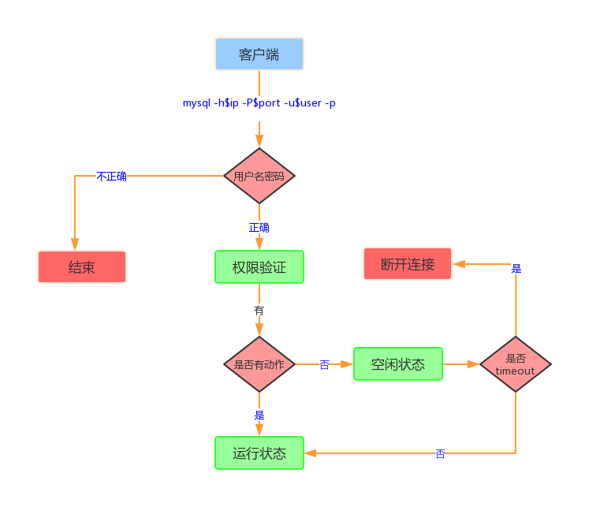
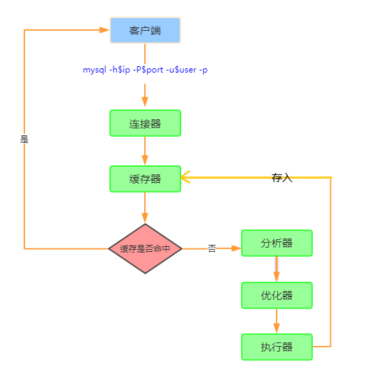
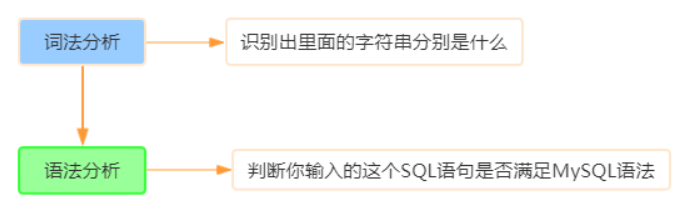
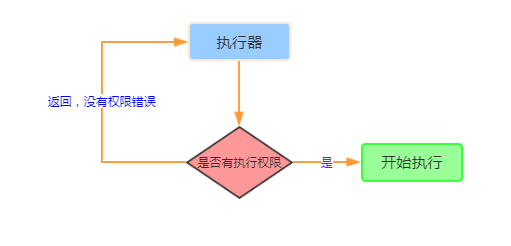
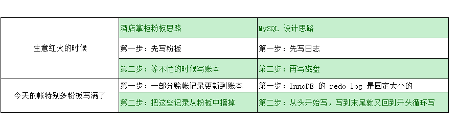
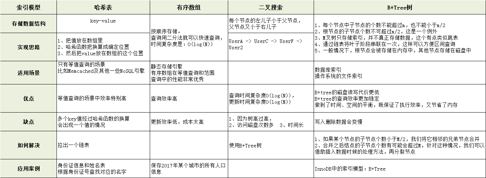
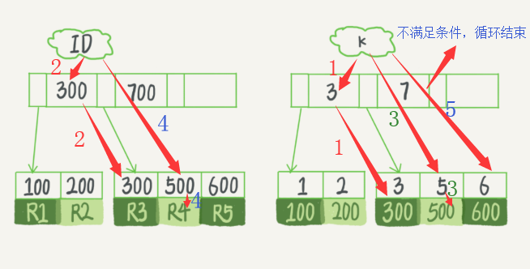
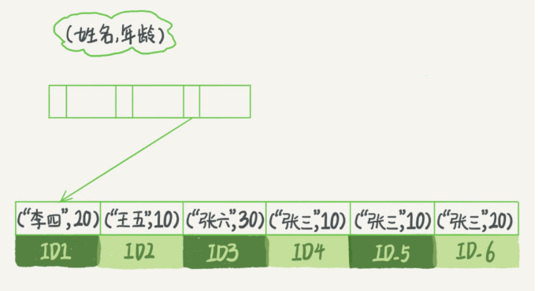
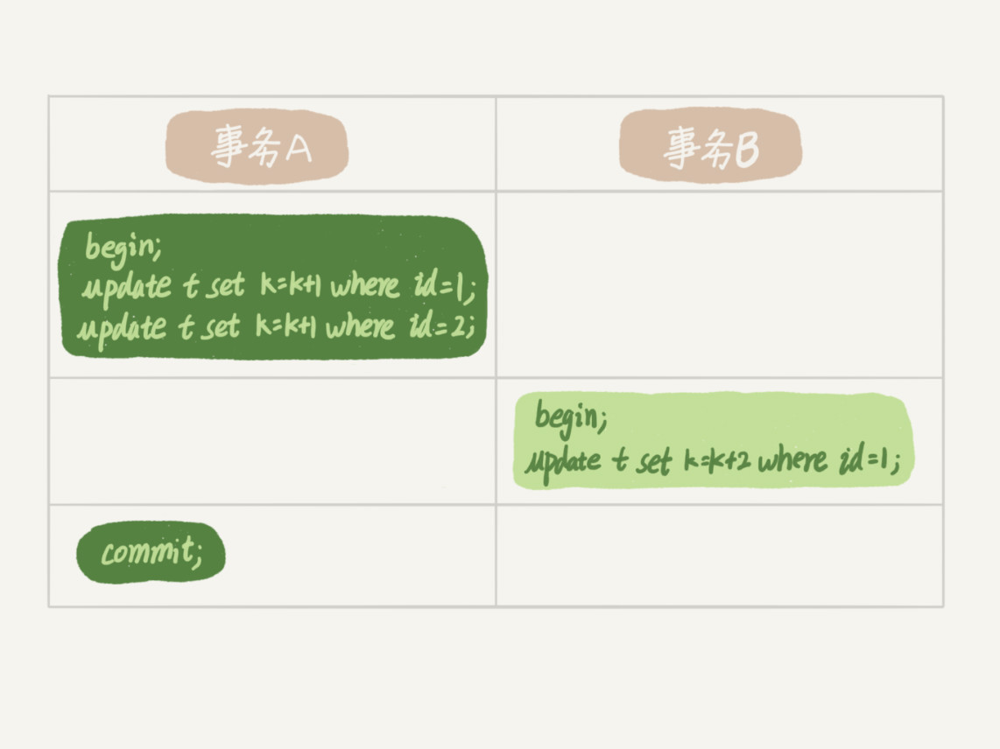

# 极客时间《MySQL实战45讲》学习笔记—基础篇

[toc]


# 1. 基础架构：一条SQL 查询语句是如何执行的

## 1.1 基本架构

  MySQL的基本架构示意图 ： 

MySQL可以分为 **Server层** 和 **存储引擎层** 两部分 。

- Server层包括**连接器、查询缓存、分析器、优化器、执行器**等，涵盖MySQL的大多数核心服务功能，以及所有的**内置函数**（如日期、时间、数学和加密函数等），所有跨存储引擎的功能都在这一层实现，比如存储过程、触发器、视图等。 

- 存储引擎层**负责数据的存储和提取**。其架构模式是**插件式**的，支持InnoDB、MyISAM、Memory等多个存储引擎。现在**最常用的存储引擎是InnoDB**，它从MySQL 5.5.5版本开始成为了默认存储引擎。 

> 不同的存储引擎共用一个**Server层**，也就是从连接器到执行器的部分。 


## 1.2 连接器

 

第一步，先连接到这个数据库上，这时候接待你的就是**连接器**。

**连接器负责跟客户端建立连接、获取权限、维持和管理连接。**连接命令一般是这么写的： 

```shell
 mysql -h$ip -P$port -u$user -p 
```

> 输完命令之后，你就需要在交互对话里面输入密码。虽然密码也可以直接跟在-p后面写在命令行中，但这样可能会导致你的密码泄露。 

**连接命令中的`mysql`是客户端工具，用来跟服务端建立连接。**在完成经典的**TCP握手**后，连接器就要开始认证你的身份，这个时候用的就是你输入的用户名和密码。 

- 如果用户名或密码不对，就会收到一个**"Access denied for user"**的错误，然后客户端程序结束执行。
- 如果**用户名密码认证通过，连接器会到权限表里面查出你拥有的权限。**之后，**这个连接里面的权限判断逻辑，都将依赖于此时读到的权限。**

> 这就意味着，一个用户成功建立连接后，即使你用管理员账号对这个用户的权限做了修改，也不会影响已经存在连接的权限。修改完成后，只有再新建的连接才会使用新的权限设置。 

连接完成后，如果你没有后续的动作，这个连接就处于**空闲**状态，你可以在`show processlist`命令中看到它。  

其中的Command列显示为“Sleep”的这一行，就表示现在系统里面有一个空闲连接。 

客户端如果太长时间没动静，连接器就会自动将它断开。这个时间是由参数**wait_timeout**控制的，默认值是**8小时**。如果在连接被断开之后，客户端再次发送请求的话，就会收到一个错误提醒： **Lost connection to MySQL server during query**。这时候如果你要继续，就**需要重连**，然后再执行请求了。 


数据库里面，**长连接**是指**连接成功后，如果客户端持续有请求，则一直使用同一个连接**。**短连接**则是指**每次执行完很少的几次查询就断开连接，下次查询再重新建立一个**。 

> 建议在使用中要尽量减少建立连接的动作，也就是尽量使用长连接。 

但是全部使用长连接后，你可能会发现，有些时候MySQL占用内存涨得特别快，这是因为**MySQL在执行过程中临时使用的内存是管理在连接对象里面的。这些资源会在连接断开的时候才释放。**所以如果长连接累积下来，可能导致内存占用太大，被系统强行杀掉（OOM：Out of Memory），从现象看就是MySQL异常重启了。 

怎么解决这个问题呢？可以考虑以下两种方案：

1. **定期断开长连接。**使用一段时间，或者程序里面判断执行过一个占用内存的大查询后，断开连接，之后要查询再重连。
2. 如果用的是MySQL 5.7或更新版本，可以**在每次执行一个比较大的操作后，通过执行 `mysql_reset_connection`来重新初始化连接资源。**这个过程不需要重连和重新做权限验证，但是会将连接恢复到刚刚创建完时的状态。


## 1.3 查询缓存

 

连接建立完成后，就可以执行select语句了。执行逻辑就会来到第二步：**查询缓存**。 

MySQL拿到一个查询请求后，会**先到查询缓存看看**，之前是不是执行过这条语句。之前执行过的语句及其结果可能会以**key-value对**的形式，被直接缓存在内存中。**key是查询的语句，value是查询的结果。**如果你的查询能够直接在这个缓存中找到key，那么这个value就会被直接返回给客户端。 

如果语句不在查询缓存中，就会继续后面的执行阶段。

**执行完成后，执行结果会被存入查询缓存中**。可以看到，**如果查询命中缓存，MySQL不需要执行后面的复杂操作，就可以直接返回结果，这个效率会很高。** 

**但是多数情况下建议不要使用查询缓存，为什么？因为查询缓存往往弊大于利。** 

> 查询缓存的失效非常频繁，只要有对一个表的更新，这个表上所有的查询缓存都会被清空。因此很可能你费劲地把结果存起来，还没使用呢，就被一个更新全清空了。对于更新压力大的数据库来说，查询缓存的命中率会非常低。除非你的业务就是有一张静态表，很长时间才会更新一次。比如，一个系统配置表，那这张表上的查询才适合使用查询缓存。 

好在MySQL也提供了这种“按需使用”的方式。你可以将参数**query_cache_type**设置成**DEMAND**，这样**对于默认的SQL语句都不使用查询缓存**。而对于你确定要使用查询缓存的语句，可以用**SQL_CACHE显式指定**，像下面这个语句一样： 

```sql
mysql> select SQL_CACHE * from T where ID=10； 
```

> 需要注意的是，MySQL 8.0版本直接将查询缓存的整块功能删掉了，也就是说8.0开始彻底没有这个功能了。 


## 1.4 分析器（做什么）



如果没有命中查询缓存，就要开始真正执行语句了。首先，MySQL需要知道你要做什么，因此需要对SQL语句做解析。 

分析器先会做**“词法分析”**。你输入的是由多个字符串和空格组成的一条SQL语句，**MySQL需要识别出SQL语句里面的字符串分别是什么，代表什么。** 

MySQL从你输入的"select"这个关键字识别出来，这是一个查询语句。它也要把字符串“T”识别成“表名T”，把字符串“ID”识别成“列ID”。 

做完了这些识别以后，就要做**“语法分析”**。**根据词法分析的结果，语法分析器会根据语法规则，判断你输入的这个SQL语句是否满足MySQL语法。**

如果你的语句不对，就会收到**“You have an error in your SQL syntax”**的错误提醒，比如下面这个语句select少打了开头的字母“s”。

```sql
mysql> elect * from t where ID=1; 

ERROR 1064 (42000): You have an error in your SQL syntax; check the manual that corresponds to your MySQL server version for the right syntax to use near 'elect * from t where ID=1' at line 1 
```

> 一般语法错误会提示第一个出现错误的位置，所以你要关注的是**紧接“use near”的内容**。 


## 1.5 优化器（怎么做）

经过了分析器，MySQL就知道你要做什么了。在开始执行之前，还要先经过**优化器**的处理。

优化器是**在表里面有多个索引的时候，决定使用哪个索引**；或者**在一个语句有多表关联（join）的时候，决定各个表的连接顺序**。比如执行下面这样的语句，这个语句是执行两个表的join：

```sql
mysql> select * from t1 join t2 using(ID)  where t1.c=10 and t2.d=20; 
```

- 既可以先从表t1里面取出c=10的记录的ID值，再根据ID值关联到表t2，再判断t2里面d的值是否等于20。
- 也可以先从表t2里面取出d=20的记录的ID值，再根据ID值关联到t1，再判断t1里面c的值是否等于10。

这两种执行方法的逻辑结果是一样的，但是执行的效率会有不同，而优化器的作用就是决定选择使用哪一个方案。

优化器阶段完成后，这个语句的执行方案就确定下来了，然后进入执行器阶段。如果你还有一些疑问，比如优化器是怎么选择索引的，有没有可能选择错等等，后面会单独展开说明优化器的内容。


## 1.6 执行器（开始做）

 

MySQL通过分析器知道了你要做什么，通过优化器知道了该怎么做，于是就进入了**执行器**阶段，开始执行语句。

开始执行的时候，要**先判断一下你对这个表T有没有执行查询的权限**，如果没有，就会返回没有权限的错误，如下所示(在工程实现上，如果命中查询缓存，会在查询缓存放回结果的时候，做权限验证。查询也会在优化器之前调用precheck验证权限)。

```sql
mysql> select * from T where ID=10;

ERROR 1142 (42000): SELECT command denied to user 'b'@'localhost' for table 'T'
```

如果有权限，就打开表继续执行。打开表的时候，执行器就会根据表的引擎定义，去使用这个引擎提供的接口。

比如我们这个例子中的表T中，ID字段没有索引，那么执行器的执行流程是这样的：

1. 调用InnoDB引擎接口取这个表的第一行，判断ID值是不是10，如果不是则跳过，如果是则将这行存在结果集中；
2. 调用引擎接口取“下一行”，重复相同的判断逻辑，直到取到这个表的最后一行。
3. 执行器将上述遍历过程中所有满足条件的行组成的记录集作为结果集返回给客户端。

至此，这个语句就执行完成了。

对于有索引的表，执行的逻辑也差不多。第一次调用的是“取满足条件的第一行”这个接口，之后循环取“满足条件的下一行”这个接口，这些接口都是引擎中已经定义好的。

你会在数据库的慢查询日志中看到一个**rows_examined**的字段，表示**这个语句执行过程中扫描了多少行**。这个值就是在**执行器每次调用引擎获取数据行的时候累加的。**

在有些场景下，执行器调用一次，在引擎内部则扫描了多行，因此**引擎扫描行数跟rows_examined并不是完全相同的。**


## 1.7 问题

如果表T中没有字段k，而你执行了这个语句 `select * from T where k=1`, 那肯定是会报“不存在这个列”的错误： `“Unknown column ‘k’ in ‘where clause’”`。你觉得这个错误是在我们上面提到的哪个阶段报出来的呢？ 

**答：**分析器。  分析器可以分为解析器和预处理器，解析器处理语法和解析查询, 生成一棵对应的解析树。预处理器进一步检查解析树的合法。比如: 数据表和数据列是否存在, 别名是否有歧义等。如果通过则生成新的解析树，再提交给优化器。 


# 2. 日志系统：一条SQL更新语句是如何执行的

 一条更新语句的执行流程是怎样的呢？ 

我们还是从一个表的一条更新语句说起，下面是这个表的创建语句，这个表有一个主键ID和一个整型字段c： 

```sql
mysql> create table T(ID int primary key, c int);
```

如果要将ID=2这一行的值加1，SQL语句就会这么写：

```sql
mysql> update T set c=c+1 where ID=2;
```

首先，可以确定的说，查询语句的那一套流程，更新语句也是同样会走一遍。 

 

你执行语句前要先连接数据库，这是连接器的工作。

前面我们说过，在一个表上有更新的时候，跟这个表有关的查询缓存会失效，所以这条语句就会把表T上所有缓存结果都清空。这也就是我们一般不建议使用查询缓存的原因。

接下来，分析器会通过词法和语法解析知道这是一条更新语句。优化器决定要使用ID这个索引。然后，执行器负责具体执行，找到这一行，然后更新。

与查询流程不一样的是，更新流程还涉及两个重要的**日志**模块：**redo log（重做日志）**和 **binlog（归档日志）**。


## 2.1 redo log

在MySQL里有个问题，如果每一次的更新操作都需要写进磁盘，然后磁盘也要找到对应的那条记录，然后再更新，整个过程IO成本、查找成本都很高。为了解决这个问题，redo log应运而生。

通过酒店掌柜记账思路剖析redo log工作原理：

 


> 日志和磁盘配合的整个过程，就是MySQL里经常说到的**WAL技术**，WAL的全称是Write-Ahead Logging，它的关键点就是**先写日志，再写磁盘**。 

InnoDB的redo log是**固定大小**的，比如可以配置为一组4个文件，每个文件的大小是1GB，那么这个日志总共就可以记录4GB的操作。从头开始写，写到末尾就又回到开头**循环写**，如下面这个图所示：  

  

`write pos`是**当前记录的位置**，一边写一边后移，写到第3号文件末尾后就回到0号文件开头。`checkpoint`是**当前要擦除的位置**，也是往后推移并且循环的，擦除记录前要把记录更新到数据文件。 

write pos和checkpoint之间的是redo log上还空着的部分，可以用来记录新的操作。如果write pos追上checkpoint，表示redo log满了，这时候不能再执行新的更新，得停下来先擦掉一些记录，把checkpoint推进一下。

> 只要赊账记录在了粉板上或写了账本上，之后即使掌柜忘记了，比如停业几天，回复生意后依然可以通过账本和粉板上的数据明确赊账账目。

有了redo log，InnoDB就可以保证**即使数据库发生异常重启，之前提交的记录都不会丢失**，这个能力称为**crash-safe**。


## 2.2 binlog

> **redo log（重做日志）是InnoDB引擎特有的日志**，而Server层也有自己的日志，称为**binlog（归档日志）**。 

为什么会有两份日志呢？

因为最开始MySQL里并没有InnoDB引擎。MySQL自带的引擎是MyISAM，但是MyISAM没有crash-safe的能力，binlog日志只能用于归档。而InnoDB是另一个公司以插件形式引入MySQL的，既然只依靠binlog是没有crash-safe能力的，所以InnoDB使用另外一套日志系统——也就是redo log来实现crash-safe能力。 

***

**redo log和 binlog 的不同：**

 

***

**binglog几大模式**

 

一般采用row，因为遇到事件，从库可能会出现不一致的情况，但是row更新前后都有，会导致日志变大。
最后2个参数，保证事务成功，日志必须落盘，这样，数据库crash后，就不会丢失某个事务的数据了 。

1. 互联网公司，使用MySQL的功能相对少（存储过程、触发器、函数），选择默认的语句模式，Statement Level（默认）

2. 公司如果用到使用MySQL的特殊功能（存储过程、触发器、函数），则选择Mixed模式

3. 公司如果用到使用MySQL的特殊功能（存储过程、触发器、函数）又希望数据最大化一直，此时最好选择Row level模式

**行模式和语句模式的区别**

 


## 2.3 update 语句执行流程

有了对这两个日志的概念性理解，再来看执行器和InnoDB引擎在执行上面这个简单的update语句`update T set c=c+1 where ID=2;`时的内部流程。

1. 执行器先找引擎取ID=2这一行。ID是主键，引擎直接用树搜索找到这一行。如果ID=2这一行所在的数据页本来就在内存中，就直接返回给执行器；否则，需要先从磁盘读入内存，然后再返回。
2. 执行器拿到引擎给的行数据，把这个值加上1，比如原来是N，现在就是N+1，得到新的一行数据，再调用引擎接口写入这行新数据。
3. 引擎将这行新数据更新到内存中，同时将这个更新操作记录到redo log里面，此时redo log处于prepare状态。然后告知执行器执行完成了，随时可以提交事务。
4. 执行器生成这个操作的binlog，并把binlog写入磁盘。
5. 执行器调用引擎的提交事务接口，引擎把刚刚写入的redo log改成提交（commit）状态，更新完成。

下面是这个update语句的执行流程图，图中浅色框表示是在InnoDB内部执行的，深色框表示是在执行器中执行的：

 

最后三步看上去有点“绕”，将redo log的写入拆成了两个步骤：prepare和commit，这就是"两阶段提交"。 


**流程说明：**

1.首先客户端通过tcp/ip发送一条sql语句到server层的SQL interface

2.SQL interface接到该请求后，先对该条语句进行解析，验证权限是否匹配

3.验证通过以后，分析器会对该语句分析,是否语法有错误等

4.接下来是优化器器生成相应的执行计划，选择最优的执行计划

5.之后会是执行器根据执行计划执行这条语句。在这一步会去open table,如果该table上有MDL，则等待。如果没有，则加在该表上加短暂的MDL(S)，

(如果opend_table太大,表明open_table_cache太小。需要不停的去打开frm文件)

6.进入到引擎层，首先会去innodb_buffer_pool里的data dictionary(元数据信息)得到表信息

7.通过元数据信息,去lock info里查出是否会有相关的锁信息，并把这条update语句需要的锁信息写入到lock info里(锁这里还有待补充)

8.然后涉及到的老数据通过快照的方式存储到innodb_buffer_pool里的undo page里,并且记录undo log修改的redo

(如果data page里有就直接载入到undo page里，如果没有，则需要去磁盘里取出相应page的数据，载入到undo page里)

9.在innodb_buffer_pool的data page做update操作。并把操作的物理数据页修改记录到redo log buffer里

由于update这个事务会涉及到多个页面的修改，所以redo log buffer里会记录多条页面的修改信息。

因为group commit的原因，这次事务所产生的redo log buffer可能会跟随其它事务一同flush并且sync到磁盘上

10.同时修改的信息，会按照event的格式,记录到binlog_cache中。(这里注意binlog_cache_size是transaction级别的,不是session级别的参数,

一旦commit之后，dump线程会从binlog_cache里把event主动发送给slave的I/O线程)

11.之后把这条sql,需要在二级索引上做的修改，写入到change buffer page，等到下次有其他sql需要读取该二级索引时，再去与二级索引做merge
(随机I/O变为顺序I/O,但是由于现在的磁盘都是SSD,所以对于寻址来说,随机I/O和顺序I/O差距不大)

12.此时update语句已经完成，需要commit或者rollback。这里讨论commit的情况，并且双1

13.commit操作，由于存储引擎层与server层之间采用的是内部XA(保证两个事务的一致性,这里主要保证redo log和binlog的原子性),
所以提交分为prepare阶段与commit阶段

14.prepare阶段,将事务的xid写入，将binlog_cache里的进行flush以及sync操作(大事务的话这步非常耗时)

15.commit阶段，由于之前该事务产生的redo log已经sync到磁盘了。所以这步只是在redo log里标记commit

16.当binlog和redo log都已经落盘以后，如果触发了刷新脏页的操作，先把该脏页复制到doublewrite buffer里，把doublewrite buffer里的刷新到共享表空间，然后才是通过page cleaner线程把脏页写入到磁盘中

**其实在实现上5是调用了6的过程了的，所以是一回事。MySQL server 层和InnoDB层都保存了表结构，所以有书上描述时会拆开说。**


## 2.4 两阶段提交

为什么必须有“两阶段提交”呢？这是**为了让两份日志之间的逻辑一致**。要说明这个问题，得从一个问题说起：**怎样让数据库恢复到半个月内任意一秒的状态？**

前面我们说过了，binlog会记录所有的逻辑操作，并且是采用“追加写”的形式。如果DBA承诺说半个月内可以恢复，那么备份系统中一定会保存最近半个月的所有binlog，同时系统会定期做整库备份。这里的“定期”取决于系统的重要性，可以是一天一备，也可以是一周一备。

当需要恢复到指定的某一秒时，比如某天下午两点发现中午十二点有一次误删表，需要找回数据，那你可以这么做：

- 首先，找到最近的一次全量备份，如果你运气好，可能就是昨天晚上的一个备份，从这个备份恢复到临时库；
- 然后，从备份的时间点开始，将备份的binlog依次取出来，重放到中午误删表之前的那个时刻。

这样你的临时库就跟误删之前的线上库一样了，然后你可以把表数据从临时库取出来，按需要恢复到线上库去。

好了，说完了数据恢复过程，我们回来说说，为什么日志需要“两阶段提交”。这里不妨用反证法来进行解释。

由于redo log和binlog是两个独立的逻辑，如果不用两阶段提交，要么就是先写完redo log再写binlog，或者采用反过来的顺序。我们看看这两种方式会有什么问题。

仍然用前面的update语句来做例子。假设当前ID=2的行，字段c的值是0，再假设执行update语句过程中在写完第一个日志后，第二个日志还没有写完期间发生了crash，会出现什么情况呢？

1. **先写redo log后写binlog**。假设在redo log写完，binlog还没有写完的时候，MySQL进程异常重启。由于我们前面说过的，redo log写完之后，系统即使崩溃，仍然能够把数据恢复回来，所以恢复后这一行c的值是1。
   但是由于binlog没写完就crash了，这时候binlog里面就没有记录这个语句。因此，之后备份日志的时候，存起来的binlog里面就没有这条语句。
   然后你会发现，如果需要用这个binlog来恢复临时库的话，由于这个语句的binlog丢失，这个临时库就会少了这一次更新，恢复出来的这一行c的值就是0，与原库的值不同。
2. **先写binlog后写redo log**。如果在binlog写完之后crash，由于redo log还没写，崩溃恢复以后这个事务无效，所以这一行c的值是0。但是binlog里面已经记录了“把c从0改成1”这个日志。所以，在之后用binlog来恢复的时候就多了一个事务出来，恢复出来的这一行c的值就是1，与原库的值不同。

可以看到，**如果不使用“两阶段提交”，那么数据库的状态就有可能和用它的日志恢复出来的库的状态不一致。**

你可能会说，这个概率是不是很低，平时也没有什么动不动就需要恢复临时库的场景呀？

其实不是的，不只是误操作后需要用这个过程来恢复数据。当你需要扩容的时候，也就是需要再多搭建一些备库来增加系统的读能力的时候，现在常见的做法也是用全量备份加上应用binlog来实现的，这个“不一致”就会导致你的线上出现主从数据库不一致的情况。

简单说，redo log和binlog都可以用于表示事务的提交状态，而两阶段提交就是让这两个状态保持逻辑上的一致。


> redo log用于保证crash-safe能力。innodb_flush_log_at_trx_commit这个参数设置成1的时候，表示每次事务的redo log都直接持久化到磁盘。这个参数建议设置成1，这样可以保证MySQL异常重启之后数据不丢失。
>
> sync_binlog这个参数设置成1的时候，表示每次事务的binlog都持久化到磁盘。这个参数也建议设置成1，这样可以保证MySQL异常重启之后binlog不丢失。
>
> 两阶段提交是跨系统维持数据逻辑一致性时常用的一个方案。


## 2.5 问题

定期全量备份的周期“取决于系统重要性，有的是一天一备，有的是一周一备”。那么在什么场景下，一天一备会比一周一备更有优势呢？或者说，它影响了这个数据库系统的哪个指标？

备份时间周期的长短，感觉有2个方便

首先，是恢复数据丢失的时间，既然需要恢复，肯定是数据丢失了。如果一天一备份的话，只要找到这天的全备，加入这天某段时间的binlog来恢复，如果一周一备份，假设是周一，而你要恢复的数据是周日某个时间点，那就，需要全备+周一到周日某个时间点的全部binlog用来恢复，时间相比前者需要增加很多；看业务能忍受的程度

其次，是数据库丢失，如果一周一备份的话，需要确保整个一周的binlog都完好无损，否则将无法恢复；而一天一备，只要保证这天的binlog都完好无损；当然这个可以通过校验，或者冗余等技术来实现，相比之下，上面那点更重要


# 3. 事务隔离：为什么你改了我还看不见

## 3.1 隔离性与隔离级别

### 3.1.1 事务的特性

- 原子性 A
- 一致性 C
- 隔离性 I
- 持久性 D


### 3.1.2 不同事务隔离级别的区别

- 读未提交：别人改数据的事务尚未提交，我在我的事务中也能读到。
- 读已提交：别人改数据的事务已经提交，我在我的事务中才能读到。
- 可重复读：别人改数据的事务已经提交，我在我的事务中也不去读。
- 串行：我的事务尚未提交，别人就别想改数据。

这4种隔离级别，并行性能依次降低，安全性依次提高。


### 3.1.3 多事务执行时可能出现的问题

多事务同时执行的时候，可能会出现的问题：**脏读、不可重复读、幻读**

- 脏读：
  当数据库中一个事务A正在修改一个数据但是还未提交或者回滚，另一个事务B 来读取了修改后的内容并且使用了，之后事务A提交了，此时就引起了脏读。

  **此情况仅会发生在： 读未提交的的隔离级别.**

- 不可重复读：
  在一个事务A中多次操作数据，在事务操作过程中(未最终提交)，事务B也才做了处理，并且该值发生了改变，这时候就会导致A在事务操作的时候，发现数据与第一次不一样了。 就是不可重复读。

  **此情况仅会发生在：读未提交、读提交的隔离级别.**

- 幻读：
  一个事务按相同的查询条件重新读取以前检索过的数据，却发现其他事务插入了满足其查询条件的新数据，这种现象就称为幻读。

  幻读是指当事务不是独立执行时发生的一种现象，例如第一个事务对一个表中的数据进行了修改，比如这种修改涉及到表中的“全部数据行”。同时，第二个事务也修改这个表中的数据，这种修改是向表中插入“一行新数据”。那么，以后就会发生操作第一个事务的用户发现表中还存在没有修改的数据行，就好象发生了幻觉一样.
  一般解决幻读的方法是增加范围锁RangeS，锁定检索范围为只读，这样就避免了幻读。 


### 3.1.3 “读提交” 和 “可重复读”

假设数据表T中只有一列，其中一行的值为1，下面是按照时间顺序执行两个事物的行为

   

看看在不同隔离级别下，事务A会有哪些不同的返回结果，也就是图里面V1、V2、V3的返回值分别是什么？ 

  


### 3.1.4 隔离级别的配置方法

配置方法：启动参数 `transaction-isolation`

```sql
mysql> show variables like 'transaction_isolation';
+-----------------------+-----------------+
| Variable_name         | Value           |
+-----------------------+-----------------+
| transaction_isolation | REPEATABLE-READ |
+-----------------------+-----------------+
1 row in set (0.01 sec)
```


### 3.1.5 可重复读场景

假设你在管理一个个银行账户表，一个表存了每个月月底的余额，一个表存了账单明细，这时候你要做数据校对，也就是判断上个月的余额和当前余额的差额，是否与本月的账单明细一致，你一定希望在校对的过程中，即使有用户发生了一笔新的交易，也不影响你的校对结果。

这时候"可重复读"隔离级别就很方便，**事务启动时的视图可以认为是静态的，不受其他食物更新的影响**


## 3.2 事务隔离的实现

### 3.2.1 事务隔离的实现

假设一个值1被按顺序改成2、3、4，在回滚日志里面就会有类似下面的记录：

 

**每条记录在更新的时候都会同时记录一条回滚操作。同一条记录在系统中可以存在多个版本，这就是数据库的多版本并发控制（MVCC）**

对于read-view A ，要得到 1 就必须将当前值依次执行途中所有回滚操作得到。

### 3.2.2 事务隔离的几个问题

1. 回滚日志什么时候删除？

   系统会判断当没有事务需要用到这些回滚日志的时候，回滚日志会被删除。

2. 什么时候不需要了？

   当系统里没有比这个回滚日志更早的read-view的时候。

3. 为什么尽量不要使用长事务

   长事务意味着系统里面会存在很老的事务视图，在这个事务提交之前，回滚记录都要保留，这会导致大量占用存储空间。除此之外，长事务还占用锁资源，可能会拖垮库。


## 3.3 事务启动方式

### 3.3.1 启动方式

- 方式一

  显式启动事务语句，**begin**或者**start transaction**，提交**commit**，回滚**rollback**；

- 方式二

  `set autocommit=0`，该命令会把这个线程的自动提交关掉。这样只要执行一个select语句，事务就启动，并不会自动提交，直到主动执行**commit**或**rollback**或断开连接。

**建议使用方式一**

如果考虑多一次交互问题，可以使用`commit work and chain`语法。在`autocommit=1`的情况下用begin显式启动事务，如果执行`commit`则提交事务。如果执行`commit work and chain`则提交事务并自动启动下一个事务。


### 3.3.2 如何查询长事务

```sql
select * from information_schema.innodb_trx where TIME_TO_SEC(timediff(now(),trx_started))>60
```


## 3.4 问题

如何避免长事务对业务的影响？ 

这个问题，我们可以从应用开发端和数据库端来看。

**首先，从应用开发端来看：**

1. 确认是否使用了set autocommit=0。这个确认工作可以在测试环境中开展，把MySQL的general_log开起来，然后随便跑一个业务逻辑，通过general_log的日志来确认。一般框架如果会设置这个值，也就会提供参数来控制行为，你的目标就是把它改成1。
2. 确认是否有不必要的只读事务。有些框架会习惯不管什么语句先用begin/commit框起来。我见过有些是业务并没有这个需要，但是也把好几个select语句放到了事务中。这种只读事务可以去掉。
3. 业务连接数据库的时候，根据业务本身的预估，通过SET MAX_EXECUTION_TIME命令，来控制每个语句执行的最长时间，避免单个语句意外执行太长时间。（为什么会意外？在后续的文章中会提到这类案例）

**其次，从数据库端来看：**

1. 监控 information_schema.Innodb_trx表，设置长事务阈值，超过就报警/或者kill；
2. Percona的pt-kill这个工具不错，推荐使用；
3. 在业务功能测试阶段要求输出所有的general_log，分析日志行为提前发现问题；
4. 如果使用的是MySQL 5.6或者更新版本，把innodb_undo_tablespaces设置成2（或更大的值）。如果真的出现大事务导致回滚段过大，这样设置后清理起来更方便。


# 4. 深入浅出索引（上）

## 4.1 索引模型

### 4.1.1 索引的作用

索引的出现其实是为了提高数据查询的效率，就像书的目录一样。

提高数据查询效率

### 4.1.2 索引模型比较

 


## 4.2 InnoDB索引模型

### 4.2.1 二叉树是搜索效率最高的，但是实际上大多数的数据库存储却并不适用二叉树？

**1、其原因是，索引不止在内存中，还要写到磁盘上**

2、N叉树由于在读写上的性能优点，以及适配磁盘的访问模式，已经被广泛应用在数据库引擎中了

**3、数据库底层存储的核心就是基于这些数据模型的，每碰到一个新数据库，我们需要先关注它的数据模型，这样才能从理论上给分析出数据库的适应场景**

4、不同存储引擎的索引的工作方式并不一样，而即使多个存储引擎支持同一类型的索引，其底层的实现也可能不同

  


### 4.2.2 索引类型

**主键索引：**主键索引的叶子节点存的是整行的数据（聚簇索引）

**非主键索引：**非主键索引的叶子节点内容是主键的值（二级索引）


### 4.2.3 主键索引和普通索引的区别

1、主键索引只要搜索ID这个B+Tree即可拿到数据。

如果语句是 `select * from T where ID=500`，即主键查询方式，则只需要搜索 ID 这棵 B+ 树

2、普通索引先搜索索引拿到主键值，再到主键索引树搜索一次（**回表**）。

如果语句是 `select * from T where k=5`，即普通索引查询方式，则需要先搜索 k 索引树，得到到 ID 的值为 500，再到 ID 索引树搜索一次。这个过程为回表。 

**也就是说，基于非主键索引的查询需要多扫描一棵树，因此，我们在应用中应该尽量使用主键查询** 


## 4.3 索引维护

### 4.3.1 什么是自增主键？

自增主键是指**自增列上定义的主键**，插入新记录的时候可以不指定ID的值，系统会获取当前ID最大值加1作为下一条记录的ID值。

也就是说，自增主键的插入数据模式，正符合我们前面提到的递增插入的场景。每次插入一条新记录，都是追加操作，都不涉及到挪动其他记录，也不会触发叶子节点的分裂。

 

### 4.3.2 数据页满了怎么办？

一个数据页满了，按照B+Tree算法，新增加一个数据页，叫做页分裂，会导致性能下降。空间利用率降低大概50%。

当相邻的两个数据页利用率很低的时候会做数据页合并，合并的过程是分裂过程的逆过程。

**分裂合并示意图**

 


### 4.3.3 为什么要选择自增主键？

1. 自增主键的插入数据模式，正符合我们前面提到的递增插入的场景。每次插入一条新记录，都是追加操作，都不涉及到挪动其他记录，也不会触发叶子节点的分裂。

2. **主键长度越小，普通索引的叶子节点就越小，普通索引占用的空间也就越小。**

   由于每个非主键索引的叶子节点上都有主键的值：

   1. 如果用身份证号做主键，那么每个二级索引的叶子节点占用的20个字节，

   2. 而如果用整型做主键，则只要4个字节，

   3. 如果是长整型则是8个字节

**从性能和存储空间方面考量，自增主键往往是更合理的选择。**


### 4.3.4 什么场景适合直接用业务字段做主键？

1、只有一个索引；

2、该索引必须是唯一索引。

你一定看出来了，这就是典型的KV场景

由于没有其他索引，所以也就不用考虑其他索引的叶子节点大小的问题。

**这时候我们就要优先考虑上一段的“尽量使用主键查询”原则，直接将这个索引设置为主键，可以避免每次查询需要搜索两棵树。**


## 4.4 问题

对于上面例子中的InnoDB表T，如果你要重建索引 k，你的两个SQL语句可以这么写： 

```sql
alter table T drop index k;
alter table T add index(k);
```

如果你要重建主键索引，也可以这么写： 

```sql
alter table T drop primary key;
alter table T add primary key(id);
```

我的问题是，对于上面这两个重建索引的作法，说出你的理解。如果有不合适的，为什么，更好的方法是什么？ 

重建索引k的做法是合理的，可以达到省空间的目的。但是，重建主键的过程不合理。不论是删除主键还是创建主键，都会将整个表重建。所以连着执行这两个语句的话，第一个语句就白做了。这两个语句，你可以用这个语句代替 ： alter table T engine=InnoDB。 


# 5. 深入浅出索引（下）

## 5.1 需要回表的案例

**在下面表T中，执行下面语句，需要执行几次树的搜索操作？会扫描多少行？**

```sql
`select` `* ``from` `T ``where` `k ``between` `3 ``and` `5`
```

1、表初始化语句

```sql
mysql> create table T (
ID int primary key,
k int NOT NULL DEFAULT 0,
s varchar(16) NOT NULL DEFAULT '',
index k(k))
engine=InnoDB;
 
insert into T values(100,1, 'aa'),(200,2,'bb'),(300,3,'cc'),(500,5,'ee'),(600,6,'ff'),(700,7,'gg');
```

2、这条SQL语句的执行流程

 

1. 在k索引树上找到k=3的记录，取得 ID = 300；
2. 再到ID索引树查到ID=300对应的R3；
3. 在k索引树取下一个值k=5，取得ID=500；
4. 再回到ID索引树查到ID=500对应的R4；
5. 在k索引树取下一个值k=6，不满足条件，循环结束。

在这个过程中，**回到主键索引树搜索的过程，我们称为回表**。可以看到，这个查询过程读了k索引树的3条记录（步骤1、3和5），回表了两次（步骤2和4）。 


## 5.2 如何避免回表？

在上面的例子中，由于查询结果所需要的数据只在主键索引上有，所以不得不回表。那么有没有可能经过索引优化，避免回表过程？ 


### 5.2.1 覆盖索引

对于这条查询语句：

```sql
select ID from T where k between 3 and 5
```

索引k已经"覆盖了"我们的查询需求。我们称为**覆盖索引**。

**由于覆盖索引可以减少树的搜索次数，显著提升查询性能，所以使用覆盖索引是一个常用的性能优化手段。**

> 需要注意的是，在引擎内部使用覆盖索引在索引k上其实读了三个记录，R3~R5（对应的索引k上的记录项），但是对于MySQL的Server层来说，它就是找引擎拿到了两条记录，因此MySQL认为扫描行数是2。 


基于上面覆盖索引的说明，讨论一个问题：**在一个市民信息表上，是否有必要将身份证号和名字建立联合索引？**

假设这个市民表的定义是这样的：

```sql
CREATE TABLE `tuser` (
  `id` int(11) NOT NULL,
  `id_card` varchar(32) DEFAULT NULL,
  `name` varchar(32) DEFAULT NULL,
  `age` int(11) DEFAULT NULL,
  `ismale` tinyint(1) DEFAULT NULL,
  PRIMARY KEY (`id`),
  KEY `id_card` (`id_card`),
  KEY `name_age` (`name`,`age`)
) ENGINE=InnoDB
```

如果现在有一个高频请求，要根据市民的身份证号查询他的姓名，这个联合索引就有意义了。它可以在这个高频请求上用覆盖索引、不再需要回表查整行记录，减少语句的执行时间 。


## 5.3 最左前缀原则

### 5.3.1 什么是最左前缀原则？

1、疑问

 独为一个不频繁的请求创建一个索引又感觉有点浪费，应该怎么做呢？ 

2、解决方案

**B+树这种索引结构，可以利用索引的"最左前缀"，来定位记录。** 

为了直观地说明这个概念，用(name、age)这个联合索引来分析

 

可以看到，索引项是按照索引定义里面出现的字段顺序排序的。 

1. 当逻辑需求是查到所有名字是“张三”的人时，可以快速定位到ID4，然后向后遍历得到所有需要的结果。 

2. 如果要查的是所有名字第一个字是“张”的人

   ```sql
   where name like ‘张%’
   ```

   这时，你也能够用上这个索引，查找到第一个符合条件的记录是ID3，然后向后遍历，直到不满足条件为止。 

**不只是索引的全部定义，只要满足最左前缀，就可以利用索引来加速检索。这个最左前缀可以是联合索引的最左N个字段，也可以是字符串索引的最左M个字符。** 


### 5.3.2 在建立联合索引的时候，如何安排索引内的字段顺序？

这里评估标准是，**索引的复用能**力。因为可以支持最左前缀，所以当已经有了(a,b)这个联合索引后，一般就不需要单独在a上建立索引了。因此，**第一原则是，如果通过调整顺序，可以少维护一个索引，那么这个顺序往往就是需要优先考虑采用的。** 

如果既有联合查询，又有基于a、b各自的查询呢？查询条件里面只有b的语句，是无法使用(a,b)这个联合索引的，这时候你不得不维护另外一个索引，也就是说需要同时维护(a,b)、(b) 这两个索引。

这时候，要**考虑的原则就是空间**了。

比如上面这个市民表的情况，name字段是比age字段大的 ，那建议创建一个（name,age)的联合索引和一个(age)的单字段索引。 


## 5.4 索引下推

还是以市民表的联合索引（name, age）为例。如果现在有一个需求：检索出表中“名字第一个字是张，而且年龄是10岁的所有男孩”。那么，SQL语句是这么写的： 

```sql
mysql> select * from tuser where name like '张%' and age=10 and ismale=1;
```

1. 找到第一个满足条件的记录ID3**（这还不错，总比全表扫描要好）**
2. 判断其他是否满足条件 

在MySQL 5.6之前（无索引下推），只能从ID3开始一个个回表。到主键索引上找出数据行，再对比字段值。如下图：

 

而MySQL 5.6 引入的**索引下推**优化（index condition pushdown)， **可以在索引遍历过程中，对索引中包含的字段先做判断，直接过滤掉不满足条件的记录，减少回表次数。**如下图：

 

每一个虚线箭头表示回表一次

1. InnoDB 内部就判断了age是否等于10；
2. 对不等于10的记录，直接判断跳过，在我们这个例子中只需要对ID4、ID5这两条记录**回表2次**。


## 5.5 联合索引的技巧

 1、覆盖索引：

如果查询条件使用的是普通索引（或是联合索引的最左原则字段），查询结果是联合索引的字段或是主键，不用回表操作，直接返回结果，减少IO磁盘读写读取正行数据

2、最左前缀：

联合索引的最左 N 个字段，也可以是字符串索引的最左 M 个字符

3、联合索引：

根据创建联合索引的顺序，以最左原则进行where检索，比如（age，name）以age=1 或 age= 1 and name=‘张三’可以使用索引，单以name=‘张三’ 不会使用索引，考虑到存储空间的问题，还请根据业务需求，将查找频繁的数据进行靠左创建索引。

4、索引下推：

like 'hello%’and age >10 检索，MySQL5.6版本之前，会对匹配的数据进行回表查询。5.6版本后，会先过滤掉age<10的数据，再进行回表查询，减少回表率，提升检索速度 


## 5.6 问题

实际上主键索引也是可以使用多个字段的。DBA小吕在入职新公司的时候，就发现自己接手维护的库里面，有这么一个表，表结构定义类似这样的：

```sql
CREATE TABLE `geek` (
  `a` int(11) NOT NULL,
  `b` int(11) NOT NULL,
  `c` int(11) NOT NULL,
  `d` int(11) NOT NULL,
  PRIMARY KEY (`a`,`b`),
  KEY `c` (`c`),
  KEY `ca` (`c`,`a`),
  KEY `cb` (`c`,`b`)
) ENGINE=InnoDB;
```

公司的同事告诉他说，由于历史原因，这个表需要a、b做联合主键，这个小吕理解了。

但是，学过本章内容的小吕又纳闷了，既然主键包含了a、b这两个字段，那意味着单独在字段c上创建一个索引，就已经包含了三个字段了呀，为什么要创建“ca”“cb”这两个索引？

同事告诉他，是因为他们的业务里面有这样的两种语句：

```
select * from geek where c=N order by a limit 1;
select * from geek where c=N order by b limit 1;
```

我给你的问题是，这位同事的解释对吗，为了这两个查询模式，这两个索引是否都是必须的？为什么呢？

```
表记录
–a--|–b--|–c--|–d--
1 2 3 d
1 3 2 d
1 4 3 d
2 1 3 d
2 2 2 d
2 3 4 d
主键 a，b的聚簇索引组织顺序相当于 order by a,b ，也就是先按a排序，再按b排序，c无序。

索引 ca 的组织是先按c排序，再按a排序，同时记录主键
–c--|–a--|–主键部分b-- （注意，这里不是ab，而是只有b）
2 1 3
2 2 2
3 1 2
3 1 4
3 2 1
4 2 3
这个跟索引c的数据是一模一样的。

索引 cb 的组织是先按c排序，在按b排序，同时记录主键
–c--|–b--|–主键部分a-- （同上）
2 2 2
2 3 1
3 1 2
3 2 1
3 4 1
4 3 2

所以，结论是ca可以去掉，cb需要保留。
```


# 6. 全局锁和表锁：给表加个字段怎么又这么多阻碍

数据库锁设计的初衷是处理并发问题。作为多用户共享的资源，当出现并发访问的时候，数据库需要合理地控制资源的访问规则。而锁就是用来实现这些访问规则的重要数据结构。

根据加锁的范围，MySQL 里面的锁大致可以分成**全局锁**、**表级锁**和**行锁**三类。

这里需要说明的是，锁的设计比较复杂，这里不会涉及锁的具体实现细节，主要介绍的是碰到锁时的现象和其背后的原理。

## 6.1全局锁

### 6.1.1 什么是全局锁？

顾名思义，全局锁就是对整个数据库实例加锁。
MySQL 提供了一个**加全局读锁**的方法，命令是 `Flush tables with read lock (FTWRL)`。当你需要让整个库处于**只读**状态的时候，可以使用这个命令，之后其他线程的以下语句会被阻塞：

- 数据更新语句（数据的增删改）
- 数据定义语句（包括建表、修改表结构等）
- 更新类事务的提交语句

### 6.1.2 全局锁的使用场景

全局锁的典型使用场景是，**做全库逻辑备份**，也就是把整库每个表都 select 出来存成文本。 

### 6.1.3 全局锁的风险

以前有一种做法，是通过 FTWRL 确保不会有其他线程对数据库做更新，然后对整个库做备份。注意，在备份过程中整个库完全处于只读状态。
但是让整库都只读，听上去就很危险： 

1. 如果你在主库上备份，那么在备份期间都不能执行更新，业务基本上就得**停摆**；
2. 如果你在从库上备份，那么备份期间从库不能执行主库同步过来的 binlog，会导致**主从延迟**。

***

看来加全局锁不太好。但是细想一下，备份为什么要加锁呢？来看一下不加锁会有什么问题。 

假设你现在要维护“极客时间”的购买系统，关注的是用户账户余额表和用户课程表。

现在发起一个逻辑备份。假设备份期间，有一个用户，他购买了一门课程，业务逻辑里就要扣掉他的余额，然后往已购课程里面加上一门课。

如果时间顺序上是先备份账户余额表(u_account)，然后用户购买，然后备份用户课程表(u_course)，会怎么样呢？你可以看一下这个图：

 

可以看到，这个备份结果里，用户A的数据状态是“账户余额没扣，但是用户课程表里面已经多了一门课”。如果后面用这个备份来恢复数据的话，用户A就发现，自己赚了。

作为用户可别觉得这样可真好啊，你可以试想一下：如果备份表的顺序反过来，先备份用户课程表再备份账户余额表，又可能会出现什么结果？

也就是说，不加锁的话，备份系统备份的得到的库不是一个逻辑时间点，这个视图是逻辑不一致的。

***

### 6.1.4 mysqldump

官方自带的逻辑备份工具**mysqldump**，当mysqldump使用参数`--single-transaction`的时候，**会启动一个事务，确保拿到一致性视图。而由于MVCC的支持，这个过程中数据是可以正常更新的。**


**有了mysqldump为什么还需要FTWRL？**

**一致性读是好，但前提是引擎要支持这个隔离级别。**比如，对于MyISAM这种不支持事务的引擎，如果备份过程中有更新，总是只能取到最新的数据，那么就破坏了备份的一致性。这时，我们就需要使用FTWRL命令了。

所以，**single-transaction方法只适用于所有的表使用事务引擎的库。**如果有的表使用了不支持事务的引擎，那么备份就只能通过FTWRL方法。


**如果要全库只读，为什么不使用set global readonly=true的方式？**

确实 readonly 方式也可以让全库进入只读状态，但我还是会建议你用 FTWRL 方式，主要有连个原因：

1. 在有些系统中，readonly的值会被用来做其他逻辑，比如判断主备库。所以修改global变量的方式影响太大。
2. 在异常处理机制上有差异。如果执行FTWRL命令之后由于客户端发生异常断开，那么MySQL会自动释放这个全局锁，整个库回到可以正常更新的状态。**而将整个库设置为readonly之后，如果客户端发生异常，则数据库就会一直保持readonly状态，这样会导致整个库长时间处于不可写状态，风险较高。**


## 6.2 表级锁

MySQL里面表级锁有两种，一种是**表锁**，一种是**元数据锁（meta data lock，MDL）**

### 6.2.1 表锁

表锁的语法是 `lock tables … read/write`。与 FTWRL 类似，可以用 `unlock tables` 主动释放锁，也可以在客户端断开的时候自动释放。

需要注意，`lock tables` 语法除了会限制别的线程的读写外，也限定了本线程接下来的操作对象。 

> 举个例子, 如果在某个线程A中执行 `lock tables t1 read, t2 write; ` 这个语句，则其他线程写t1、读写t2的语句都会被阻塞。同时，线程A在执行 `unlock tables` 之前，也只能执行读t1、读写t2的操作。连写t1都不允许，自然也不能访问其他表。

在还没有出现更细粒度的锁的时候，表锁是最常用的处理并发的方式。而对于InnoDB这种支持行锁的引擎，一般不使用 `lock tables` 命令来控制并发，毕竟锁住整个表的影响面还是太大。


### 6.2.2 元数据锁

**另一类表级的锁是MDL（metadata lock)。**MDL不需要显式使用，**在访问一个表的时候会被自动加上**。MDL的作用是，**保证读写的正确性**。你可以想象一下，如果一个查询正在遍历一个表中的数据，而执行期间另一个线程对这个表结构做变更，删了一列，那么查询线程拿到的结果跟表结构对不上，肯定是不行的。

因此，在MySQL 5.5版本中引入了MDL，当对一个表做增删改查操作的时候，加MDL读锁；当要对表做结构变更操作的时候，加MDL写锁。

- **读锁之间不互斥**，因此你可以有多个线程同时对一张表增删改查。
- **读写锁之间、写锁之间是互斥的**，用来保证变更表结构操作的安全性。因此，如果有两个线程要同时给一个表加字段，其中一个要等另一个执行完才能开始执行。

***

虽然MDL锁是系统默认会加的，但却是你不能忽略的一个机制。比如下面这个例子，经常有人掉到这个坑里：**给一个小表加个字段，导致整个库挂了。**

你肯定知道，给一个表加字段，或者修改字段，或者加索引，需要扫描全表的数据。在对大表操作的时候，你肯定会特别小心，以免对线上服务造成影响。而实际上，即使是小表，操作不慎也会出问题。我们来看一下下面的操作序列，假设表t是一个小表。

> 备注：这里的实验环境是MySQL 5.6。

 

我们可以看到session A先启动，这时候会对表t加一个MDL读锁。由于session B需要的也是MDL读锁，因此可以正常执行。

之后session C会被blocked，是因为session A的MDL读锁还没有释放，而session C需要MDL写锁，因此只能被阻塞。

如果只有session C自己被阻塞还没什么关系，但是之后所有要在表t上新申请MDL读锁的请求也会被session C阻塞。前面我们说了，所有对表的增删改查操作都需要先申请MDL读锁，就都被锁住，等于这个表现在完全不可读写了。

如果某个表上的查询语句频繁，而且客户端有重试机制，也就是说超时后会再起一个新session再请求的话，这个库的线程很快就会爆满。

**事务中的MDL锁，在语句执行开始时申请，但是语句结束后并不会马上释放，而会等到整个事务提交后再释放。在做表结构变更的时候，一定要小心不要导致锁住线上查询和更新。 **

***

### 6.2.3 如何安全的给小表加字段？

首先我们要解决长事务，事务不提交，就会一直占着MDL锁。在MySQL的 information_schema 库的 innodb_trx 表中，你可以查到当前执行中的事务。**如果你要做DDL变更的表刚好有长事务在执行，要考虑先暂停DDL，或者kill掉这个长事务。**

但考虑一下这个场景。如果你要变更的表是一个热点表，虽然数据量不大，但是上面的请求很频繁，而你不得不加个字段，你该怎么做呢？

这时候kill可能未必管用，因为新的请求马上就来了。比较理想的机制是，**在alter table语句里面设定等待时间，如果在这个指定的等待时间里面能够拿到MDL写锁最好，拿不到也不要阻塞后面的业务语句，先放弃。之后开发人员或者DBA再通过重试命令重复这个过程。**

> MariaDB已经合并了AliSQL的这个功能，所以这两个开源分支目前都支持DDL NOWAIT/WAIT n这个语法。
>
> ```sql
> ALTER TABLE tbl_name NOWAIT add column ...
> ALTER TABLE tbl_name WAIT N add column ... 
> ```


## 6.3 小结

全局锁主要用在逻辑备份过程中。对于全部是InnoDB引擎的库，我建议你选择使用`–single-transaction`参数，对应用会更友好。

表锁一般是在数据库引擎不支持行锁的时候才会被用到的。如果你发现你的应用程序里有`lock tables`这样的语句，你需要追查一下，比较可能的情况是：

- 要么是你的系统现在还在用MyISAM这类不支持事务的引擎，那要安排升级换引擎；
- 要么是你的引擎升级了，但是代码还没升级。我见过这样的情况，最后业务开发就是把 `lock tables` 和 `unlock tables` 改成 `begin` 和 `commit`，问题就解决了。

MDL会直到事务提交才释放，在做表结构变更的时候，你一定要小心不要导致锁住线上查询和更新。


## 6.4 问题

备份一般都会在备库上执行，你在用–single-transaction方法做逻辑备份的过程中，如果主库上的一个小表做了一个DDL，比如给一个表上加了一列。这时候，从备库上会看到什么现象呢？ 

假设这个DDL是针对表t1的， 这里我把备份过程中几个关键的语句列出来：

```sql
Q1:SET SESSION TRANSACTION ISOLATION LEVEL REPEATABLE READ;
Q2:START TRANSACTION  WITH CONSISTENT SNAPSHOT；
/* other tables */
Q3:SAVEPOINT sp;
/* 时刻 1 */
Q4:show create table `t1`;
/* 时刻 2 */
Q5:SELECT * FROM `t1`;
/* 时刻 3 */
Q6:ROLLBACK TO SAVEPOINT sp;
/* 时刻 4 */
/* other tables */
```

在备份开始的时候，为了确保RR（可重复读）隔离级别，再设置一次RR隔离级别(Q1);

启动事务，这里用 WITH CONSISTENT SNAPSHOT确保这个语句执行完就可以得到一个一致性视图（Q2)；

设置一个保存点，这个很重要（Q3）；

show create 是为了拿到表结构(Q4)，然后正式导数据 （Q5），回滚到SAVEPOINT sp，在这里的作用是释放 t1的MDL锁 （Q6。当然这部分属于“超纲”，上文正文里面都没提到。

DDL从主库传过来的时间按照效果不同，我打了四个时刻。题目设定为小表，我们假定到达后，如果开始执行，则很快能够执行完成。

参考答案如下：

1. 如果在Q4语句执行之前到达，现象：没有影响，备份拿到的是DDL后的表结构。
2. 如果在“时刻 2”到达，则表结构被改过，Q5执行的时候，报 Table definition has changed, please retry transaction，现象：mysqldump终止；
3. 如果在“时刻2”和“时刻3”之间到达，mysqldump占着t1的MDL读锁，binlog被阻塞，现象：主从延迟，直到Q6执行完成。
4. 从“时刻4”开始，mysqldump释放了MDL读锁，现象：没有影响，备份拿到的是DDL前的表结构。


# 7. 行锁功过：怎么减少行锁对性能的影响

MySQL的行锁是在**引擎层**由各个引擎自己实现的。但并不是所有的引擎都支持行锁，比如**MyISAM引擎就不支持行锁**。**不支持行锁意味着并发控制只能使用表锁，对于这种引擎的表，同一张表上任何时刻只能有一个更新在执行，这就会影响到业务并发度。**InnoDB是支持行锁的，这也是MyISAM被InnoDB替代的重要原因之一。 

顾名思义，行锁就是**针对数据表中行记录的锁**。这很好理解，比如事务A更新了一行，而这时候事务B也要更新同一行，则必须等事务A的操作完成后才能进行更新。 

**InnoDB行级锁是通过锁索引记录实现的，如果更新的列没建索引是会锁住整个表的。** 


## 7.1 从两阶段锁说起

在下面的操作序列中，事务B的update语句执行时会是什么现象呢？假设字段id是表t的主键。 

 

这个问题的结论取决于事务A在执行完两条update语句后，持有哪些锁，以及在什么时候释放。你可以验证一下：实际上事务B的update语句会被阻塞，直到事务A执行commit之后，事务B才能继续执行。

事务A持有的两个记录的行锁，都是在commit的时候才释放的。

也就是说，**在InnoDB事务中，行锁是在需要的时候才加上的，但并不是不需要了就立刻释放，而是要等到事务结束时才释放。这个就是两阶段锁协议。**

知道了这个设定，对我们使用事务有什么帮助呢？那就是，**如果你的事务中需要锁多个行，要把最可能造成锁冲突、最可能影响并发度的锁尽量往后放。** 

***

例子：

假设你负责实现一个电影票在线交易业务，顾客A要在影院B购买电影票。我们简化一点，这个业务需要涉及到以下操作： 

```
1.从顾客A账户余额中扣除电影票价；
2.给影院B的账户余额增加这张电影票价；
3.记录一条交易日志。
```

要完成这个交易，需要update两条记录，并insert一条记录。为了保证交易的原子性，要把这三个操作放在一个事务中。那么，怎样安排这三个语句在事务中的顺序呢？

试想如果同时有另外一个顾客C要在影院B买票，那么这两个事务冲突的部分就是语句2了。因为它们要更新同一个影院账户的余额，需要修改同一行数据。

根据两阶段锁协议，不论怎样安排语句顺序，所有的操作需要的行锁都是在事务提交的时候才释放的。所以，如果把语句2安在最后，比如按照3、1、2这样的顺序，那么影院账户余额这一行的锁时间就最少。这就最大程度地减少了事务之间的锁等待，提升了并发度。

好了，现在由于正确的设计，影院余额这一行的行锁在一个事务中不会停留很长时间。但是，这并没有完全解决困扰。

如果这个影院做活动，可以低价预售一年内所有的电影票，而且这个活动只做一天。于是在活动时间开始的时候，MySQL就挂了。登上服务器一看，CPU消耗接近100%，但整个数据库每秒就执行不到100个事务。这是什么原因呢？

 这里，就要说到死锁和死锁检测了。 

***


## 7.2 死锁和死锁检测

### 7.2.1 什么是死锁？

死锁：当并发系统中不同线程出现循环资源依赖，涉及的线程都在等待别的线程释放资源时，就会导致这几个线程都进入无限等待的状态 。

这里用数据库中的行锁举个例子：

 

这时候，事务A在等待事务B释放id=2的行锁，而事务B在等待事务A释放id=1的行锁。 事务A和事务B在互相等待对方的资源释放，就是进入了死锁状态。 


### 7.2.2 出现死锁的解决策略

1. 直接进入等待，直到超时。通过参数 `innodb_lock_wait_timeout` 根据实际业务场景来设置超时时间，InnoDB引擎默认值是50s。
2.  发起死锁检测，发现死锁后，主动回滚死锁链条中的某一个事务，让其他事务得以继续执行。将参数`innodb_deadlock_detect`设置为on，表示开启这个逻辑（默认是开启状态）。 

正常情况下我们是采用第二种策略，即：主动死锁检测。主动死锁检测在发生死锁的时候，是能够快速发现并进行处理的，但是它也是有额外负担的。 

可以想象一下这个过程：每当一个事务被锁的时候，就要看看它所依赖的线程有没有被别人锁住，如此循环，最后判断是否出现了循环等待，也就是死锁。 

> 那如果是我们上面说到的所有事务都要更新同一行的场景呢？
>
> 每个新来的被堵住的线程，都要判断会不会由于自己的加入导致了死锁，这是一个时间复杂度是O(n)的操作。假设有1000个并发线程要同时更新同一行，那么死锁检测操作就是100万这个量级的。虽然最终检测的结果是没有死锁，但是这期间要消耗大量的CPU资源。因此，就会看到CPU利用率很高，但是每秒却执行不了几个事务。

**怎么解决由这种热点行更新导致的性能问题呢？**问题的症结在于，死锁检测要耗费大量的CPU资源。 

1. 如果能确保这个业务一定不会出现死锁，可以临时把死锁检测关闭掉。一般不建议采用。

2. 控制并发度，对应相同行的更新，在进入引擎之前排队。这样在InnoDB内部就不会有大量的死锁检测工作了。

3. 将热更新的行数据拆分成逻辑上的多行来减少锁冲突，但是业务复杂度可能会大大提高。


## 7.3 问题

如果你要删除一个表里面的前10000行数据，有以下三种方法可以做到：

- 第一种，直接执行delete from T limit 10000;
- 第二种，在一个连接中循环执行20次 delete from T limit 500;
- 第三种，在20个连接中同时执行delete from T limit 500。

你会选择哪一种方法呢？为什么呢？

第二种方式是相对较好的。

第一种方式（即：直接执行delete from T limit 10000）里面，单个语句占用时间长，锁的时间也比较长；而且大事务还会导致主从延迟。

第三种方式（即：在20个连接中同时执行delete from T limit 500），会人为造成锁冲突。


# 08事务到底是隔离的还是不隔离的

 1.innodb支持RC和RR隔离级别实现是用的一致性视图(consistent read view)

2.事务在启动时会拍一个快照,这个快照是基于整个库的.
基于整个库的意思就是说一个事务内,整个库的修改对于该事务都是不可见的(对于快照读的情况)
如果在事务内select t表,另外的事务执行了DDL t表,根据发生时间,要嘛锁住要嘛报错(参考第六章)

3.事务是如何实现的MVCC呢?
(1)每个事务都有一个事务ID,叫做transaction id(严格递增)
(2)事务在启动时,找到已提交的最大事务ID记为up_limit_id。
(3)事务在更新一条语句时,比如id=1改为了id=2.会把id=1和该行之前的row trx_id写到undo log里,
并且在数据页上把id的值改为2,并且把修改这条语句的transaction id记在该行行头
(4)再定一个规矩,一个事务要查看一条数据时,必须先用该事务的up_limit_id与该行的transaction id做比对,
如果up_limit_id>=transaction id,那么可以看.如果up_limit_id<transaction id,则只能去undo log里去取。去undo log查找数据的时候,也需要做比对,必须up_limit_id>transaction id,才返回数据

4.什么是当前读,由于当前读都是先读后写,只能读当前的值,所以为当前读.会更新事务内的up_limit_id为该事务的transaction id

5.为什么rr能实现可重复读而rc不能,分两种情况
(1)快照读的情况下,rr不能更新事务内的up_limit_id,
而rc每次会把up_limit_id更新为快照读之前最新已提交事务的transaction id,则rc不能可重复读
(2)当前读的情况下,rr是利用record lock+gap lock来实现的,而rc没有gap,所以rc不能可重复读 


