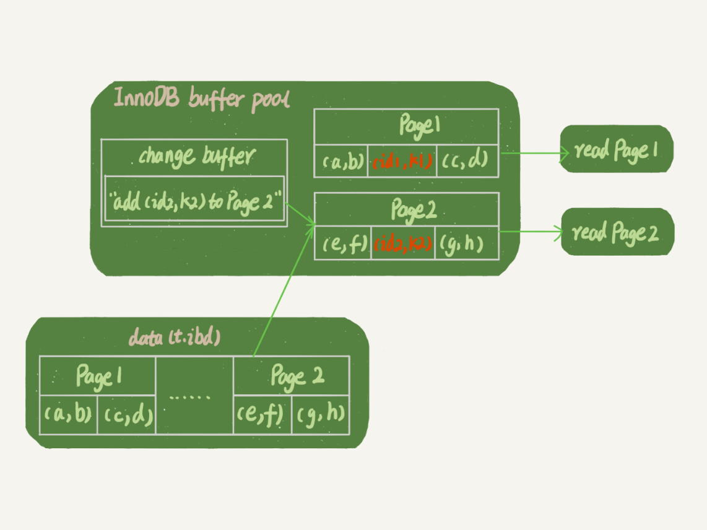

# 极客时间《MySQL实战45讲》学习笔记—实践篇

[toc]


# 9. 普通索引和唯一索引应该怎么选择

## 9.1 内容概要

**在不同的业务场景下，应该选择普通索引，还是唯一索引？** 

假设你在维护一个市民系统，每个人都有一个唯一的身份证号，而且业务代码已经保证了不会写入两个重复的身份证号。如果市民系统需要按照身份证号查姓名，就会执行类似这样的SQL语句：

```sql
select name from CUser where id_card = 'xxxxxxxyyyyyyzzzzz';
```

所以，你一定会考虑在id_card字段上建索引。

由于身份证号字段比较大，我不建议你把身份证号当做主键，那么现在你有两个选择，要么给id_card字段创建唯一索引，要么创建一个普通索引。如果业务代码已经保证了不会写入重复的身份证号，那么这两个选择逻辑上都是正确的。

现在我要问你的是，从性能的角度考虑，你选择**唯一索引**还是**普通索引**呢？选择的依据是什么呢？

简单起见，还是用第4篇文章《深入浅出索引（上）》中的例子来说明，假设字段 k 上的值都不重复。 

 

接下来，我们就从这两种索引对查询语句和更新语句的性能影响来进行分析。 


## 9.2 数据的查询过程

假设，执行查询的语句是 `select id from T where k=5`。这个查询语句在索引树上查找的过程，先是通过B+树从树根开始，按层搜索到叶子节点，也就是图中右下角的这个数据页，然后可以认为数据页内部通过**二分法**来定位记录。

- 对于普通索引来说，查找到满足条件的第一个记录(5,500)后，需要查找下一个记录，直到碰到第一个不满足k=5条件的记录。
- 对于唯一索引来说，由于索引定义了唯一性，查找到第一个满足条件的记录后，就会停止继续检索。

两者的性能差距其实是微乎其微的。

> InnoDB的数据是按**数据页**为单位来读写的。也就是说，当需要读一条记录的时候，并不是将这个记录本身从磁盘读出来，而是以页为单位，将其整体读入内存。**在InnoDB中，每个数据页的大小默认是16KB。**
>
> 因为引擎是按页读写的，所以说，当找到k=5的记录的时候，它所在的数据页就都在内存里了。那么，对于普通索引来说，要多做的那一次“查找和判断下一条记录”的操作，就只需要一次指针寻找和一次计算。
>
> 当然，如果k=5这个记录刚好是这个数据页的最后一个记录，那么要取下一个记录，必须读取下一个数据页，这个操作会稍微复杂一些。
>
> 但是，**对于整型字段，一个数据页可以放近千个key**，因此出现这种情况的概率会很低。所以，计算平均性能差异时，仍可以认为这个操作成本对于现在的CPU来说可以忽略不计。


## 9.3 数据更新过程

### 9.3.1 change buffer

当需要更新一个数据页时，如果数据页在内存中就直接更新，而如果这个数据页还没有在内存中的话，在不影响数据一致性的前提下，**InooDB会将这些更新操作缓存在change buffer中**，这样就不需要从磁盘中读入这个数据页了。在下次查询需要访问这个数据页的时候，将数据页读入内存，然后执行change buffer中与这个页有关的操作。通过这种方式就能保证这个数据逻辑的正确性。 

> 需要说明的是，虽然名字叫作change buffer，实际上它是可以持久化的数据。也就是说，change buffer在内存中有拷贝，也会被写入到磁盘上。 

**merge：**将change buffer中的操作应用到原数据页，得到最新结果的过程。 

***

**merge的执行流程**是这样的：

1. 从磁盘读入数据页到内存（老版本的数据页）；
2. 从change buffer里找出这个数据页的change buffer 记录(可能有多个），依次应用，得到新版数据页；
3. 写redo log。这个redo log包含了数据的变更和change buffer的变更。

到这里merge过程就结束了。这时候，数据页和内存中change buffer对应的磁盘位置都还没有修改，属于脏页，之后各自刷回自己的物理数据，就是另外一个过程了。

***

除了访问这个数据页会触发merge外，系统有后台线程会定期merge。在数据库正常关闭（shutdown）的过程中，也会执行merge操作。 

### 9.3.2 使用change buffer的优点

1. 如果能够将更新操作先记录在change buffer，减少读磁盘，语句的执行速度会得到明显的提升。
2. 数据读入内存是需要占用buffer pool的，所以这种方式还能够避免占用内存，提高内存利用率。 

### 9.3.3 使用change buffer的条件

对于**唯一索引**来说，所有的更新操作都要先判断这个操作是否违反唯一性约束。比如，要插入(4,400)这个记录，就要先判断现在表中是否已经存在k=4的记录，而这**必须要将数据页读入内存才能判断。如果都已经读入到内存了，那直接更新内存会更快，就没必要使用change buffer了。**

因此，**唯一索引的更新就不能使用change buffer，实际上也只有普通索引可以使用。**

> change buffer用的是buffer pool里的内存，因此不能无限增大。change buffer的大小，可以通过参数innodb_change_buffer_max_size来动态设置。这个参数设置为50的时候，表示change buffer的大小最多只能占用buffer pool的50%。 


### 9.3.4  在这张表中插入一个新记录(4,400)的话，InnoDB的处理流程

第一种情况是，**这个记录要更新的目标页在内存中**。这时，InnoDB的处理流程如下：

- 对于唯一索引来说，找到3和5之间的位置，判断到没有冲突，插入这个值，语句执行结束；
- 对于普通索引来说，找到3和5之间的位置，插入这个值，语句执行结束。

这样看来，普通索引和唯一索引对更新语句性能影响的差别，只是一个判断，只会耗费微小的CPU时间。

第二种情况是，**这个记录要更新的目标页不在内存中**。这时，InnoDB的处理流程如下：

- 对于唯一索引来说，需要将数据页读入内存，判断到没有冲突，插入这个值，语句执行结束；
- 对于普通索引来说，则是将更新记录在change buffer，语句执行就结束了。

**将数据从磁盘读入内存涉及随机IO的访问，是数据库里面成本最高的操作之一。**change buffer因为减少了随机磁盘访问，所以对更新性能的提升是会很明显的。


### 9.3.5 change buffer的使用场景

因为merge的时候是真正进行数据更新的时刻，而change buffer的主要目的就是将记录的变更动作缓存下来，所以**在一个数据页做merge之前，change buffer记录的变更越多（也就是这个页面上要更新的次数越多），收益就越大。** 

对于**写多读少**的业务来说，页面在写完以后马上被访问到的概率比较小，此时change buffer的使用效果最好。这种业务模型常见的就是账单类、日志类的系统。

反过来，假设一个业务的更新模式是写入之后马上会做查询，那么即使满足了条件，将更新先记录在change buffer，但之后由于马上要访问这个数据页，会立即触发merge过程。这样随机访问IO的次数不会减少，反而增加了change buffer的维护代价。所以，对于这种业务模式来说，change buffer反而起到了副作用。

```
写多读少适用，写少读多不适用。
```


## 9.4 索引选择和实践

这两类索引在查询能力上是没差别的，主要考虑的是对更新性能的影响。所以，**尽量选择普通索引。** 

如果所有的更新后面，都马上伴随着对这个记录的查询，那么应该关闭change buffer。而在其他情况下，change buffer都能提升更新性能。 


## 9.5 change buffer 和 redo log

由于redo log是基于WAL（先写日志，再写磁盘），提升性能的核心机制也是尽量减少随机读写，所以redo log和change buffer的概念容易混淆。这里将这两者放到同一个流程来说明，便于区分这两个概念。

### 9.5.1 带change buffer的更新过程

现在，要在表上执行这个插入语句：

```sql
mysql> insert into t(id,k) values(id1,k1),(id2,k2);
```

这里，假设当前k索引树的状态，查找到位置后，k1所在的数据页在内存(InnoDB buffer pool)中，k2所在的数据页不在内存中。下图是带change buffer的更新状态图：

 

这条更新语句涉及了四个部分：内存、redo log（ib_log_fileX）、 数据表空间（t.ibd）、系统表空间（ibdata1）。

这条更新语句做了如下的操作（按照图中的数字顺序）：

1. Page 1在内存中，直接更新内存；
2. Page 2没有在内存中，就在内存的change buffer区域，记录下“我要往Page 2插入一行”这个信息
3. 将上述两个动作记入redo log中（图中3和4）。

做完上面这些，事务就可以完成了。所以，执行这条更新语句的成本很低，就是写了两处内存，然后写了一处磁盘（两次操作合在一起写了一次磁盘），而且还是顺序写的。

同时，图中的两个虚线箭头，是后台操作，不影响更新的响应时间。

那在这之后的读请求，要怎么处理呢？

### 9.5.2 带change buffer的读过程

比如，现在要执行 `select * from t where k in (k1, k2)`。

如果读语句发生在更新语句后不久，内存中的数据都还在，那么此时的这两个读操作就与系统表空间（ibdata1）和 redo log（ib_log_fileX）无关了。所以图中就没画出这两部分。

 

从图中可以看到：

1. 读Page 1的时候，直接从内存返回。

   这里有个疑问：WAL之后如果读数据，是不是一定要读盘，是不是一定要从redo log里面把数据更新以后才可以返回？其实是不用的。可以看一下上图的这个状态，虽然磁盘上还是之前的数据，但是这里直接从内存返回结果，结果是正确的。

2. 要读Page 2的时候，需要把Page 2从磁盘读入内存中，然后应用change buffer里面的操作日志，生成一个正确的版本并返回结果。

可以看到，直到需要读Page 2的时候，这个数据页才会被读入内存。

所以，如果要简单地对比这两个机制（change buffer和redo log）在提升更新性能上的收益的话，**redo log 主要节省的是随机写磁盘的IO消耗（转成顺序写），而change buffer主要节省的则是随机读磁盘的IO消耗。**


## 9.6 问题

通过图2你可以看到，change buffer一开始是写内存的，那么如果这个时候机器掉电重启，会不会导致change buffer丢失呢？change buffer丢失可不是小事儿，再从磁盘读入数据可就没有了merge过程，就等于是数据丢失了。会不会出现这种情况呢？ 

 答案是不会丢失 。虽然是只更新内存，但是在事务提交的时候，我们把change buffer的操作也记录到redo log里了，所以崩溃恢复的时候，change buffer也能找回来。 


# 10MySQL为什么有时会选错索引

 mysql 索引异常：
1 通常的异常情况为，使用错索引，导致慢查询。
2 为什么会使用错索引呢？
  因为在执行 sql 之前，优化器会 分析语句，选择不同的索引 导致不同的 扫描行数， 排序等操作，因此存在选错索引的情况。
  优化器会判断使用这个索引需要扫描多少行的数据。
3 不同的索引会有不同的基数：就是这个索引被多少不同的数据引用（索引的这一列大概有多少数据。） 计算方法即使，随机选取几个数据页，计算出数据量的平均值，然后乘以页数。
4 在 MySQL 中，有两种存储索引统计的方式，可以通过设置参数 innodb_stats_persistent 的值来选择：
 设置为 on 的时候，表示统计信息会持久化存储。这时，默认的 N 是 20，M 是 10。
  设置为 off 的时候，表示统计信息只存储在内存中。这时，默认的 N 是 8，M 是 16。
5 应对索引异常的情况，可以采取下面三种方式应对：
 5.1 强制使用某个索引。
 5.2 修改语句引导mysql使用期望的索引。
 5.3 删除或者新建索引。
6 analyze table t 命令，可以用来重新统计索引信息。 


# 11怎么给字符串字段加索引

 怎么给字符串字段加索引？

1：直接创建完整索引，这样可能比较占用空间；

这种方式最简单，如果性能没问题，我会这么创建，简单直接且存储空间的费用越来越低

2：创建前缀索引，节省空间，但会增加查询扫描次数，并且不能使用覆盖索引；

这种方式需要判断出前缀的长度多少合适，需要根据自己的业务来定，主要是看区分度多少合适

3：倒序存储，再创建前缀索引，用于绕过字符串本身前缀的区分度不够的问题；

这种方式用于前缀区分度不高后缀区分度高的场景，目的还是要提高索引的区分度，使用这种方式不适合范围检索

4：创建 hash 字段索引，查询性能稳定，有额外的存储和计算消耗，跟第三种方式一样，都不支持范围扫描。 


