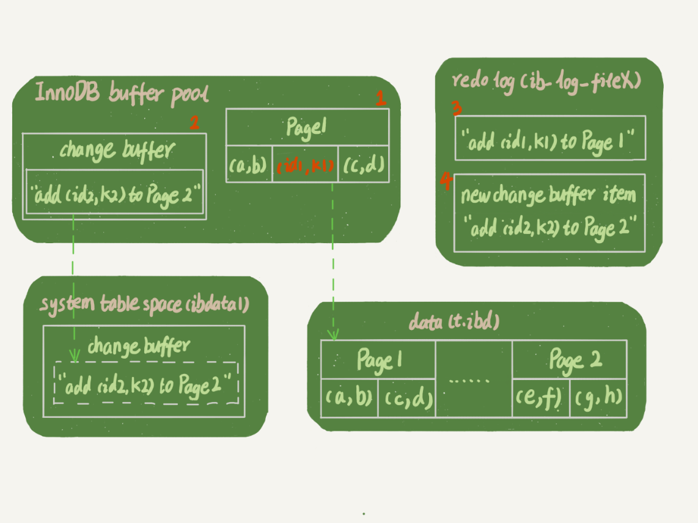
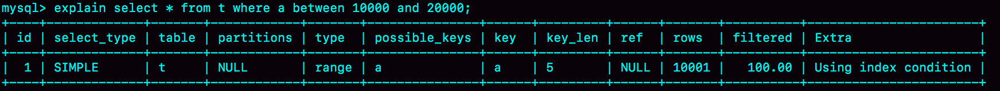
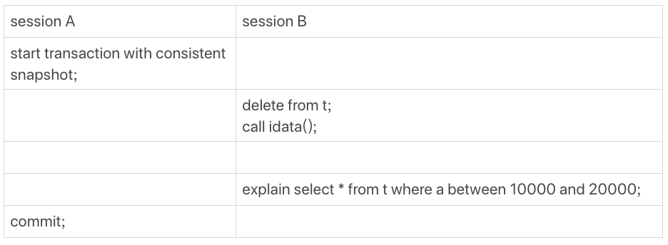
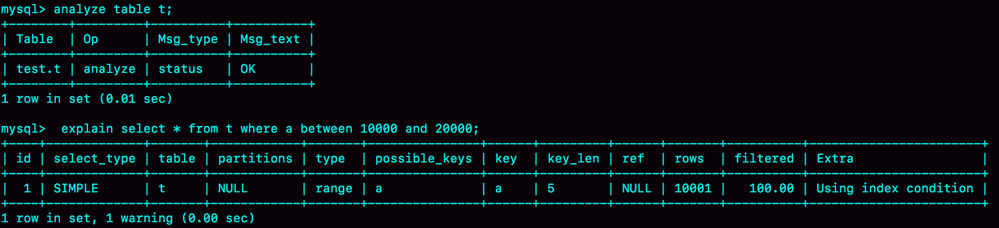
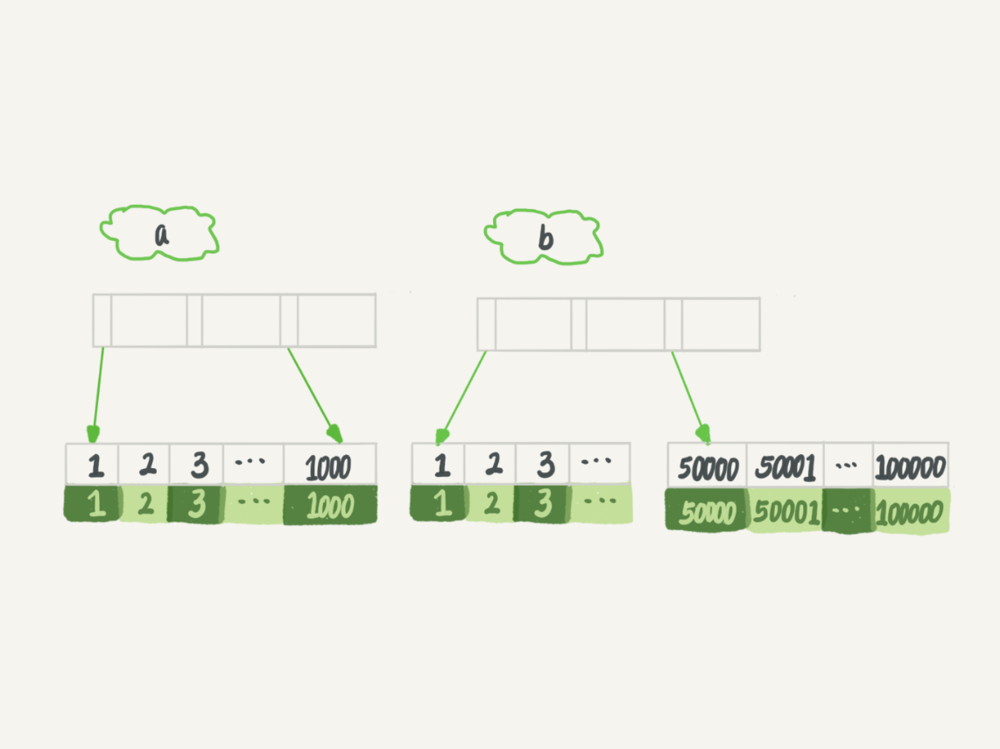
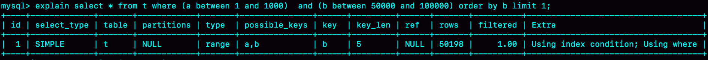
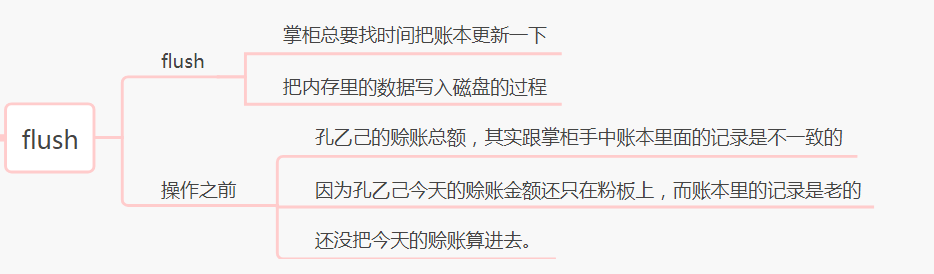
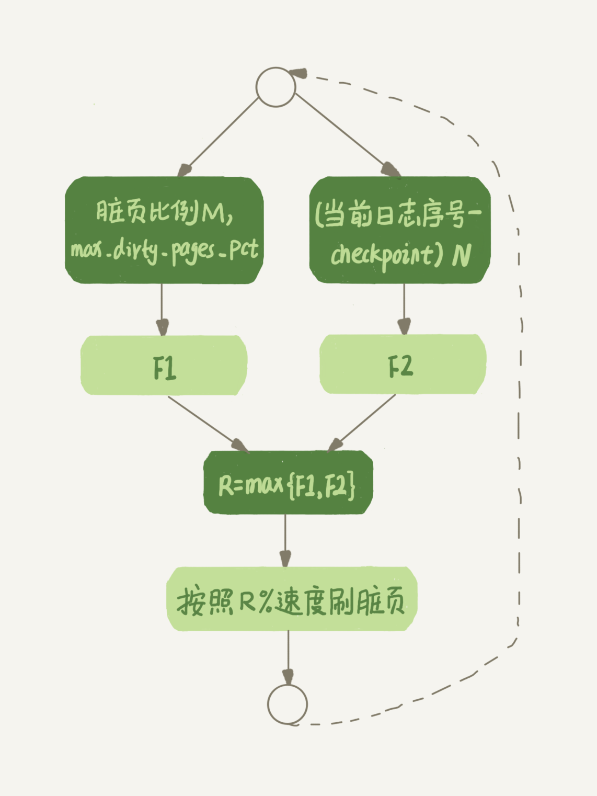
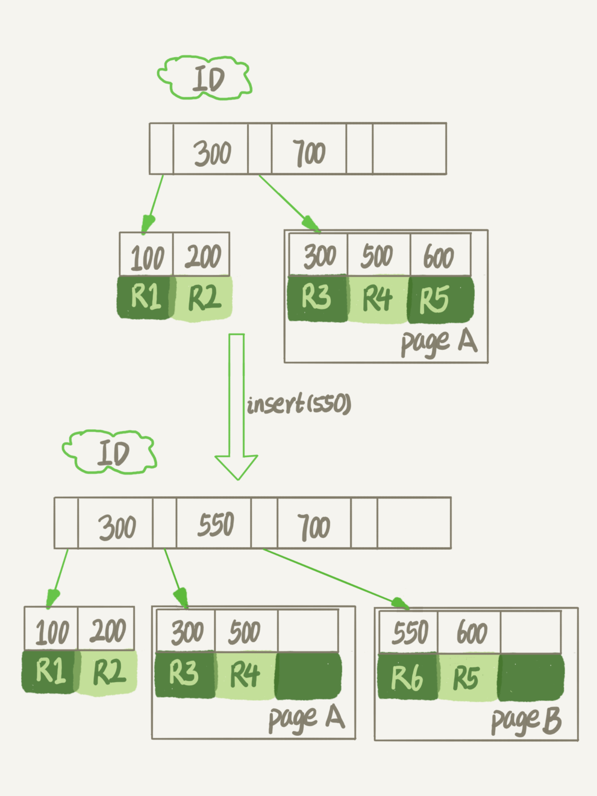
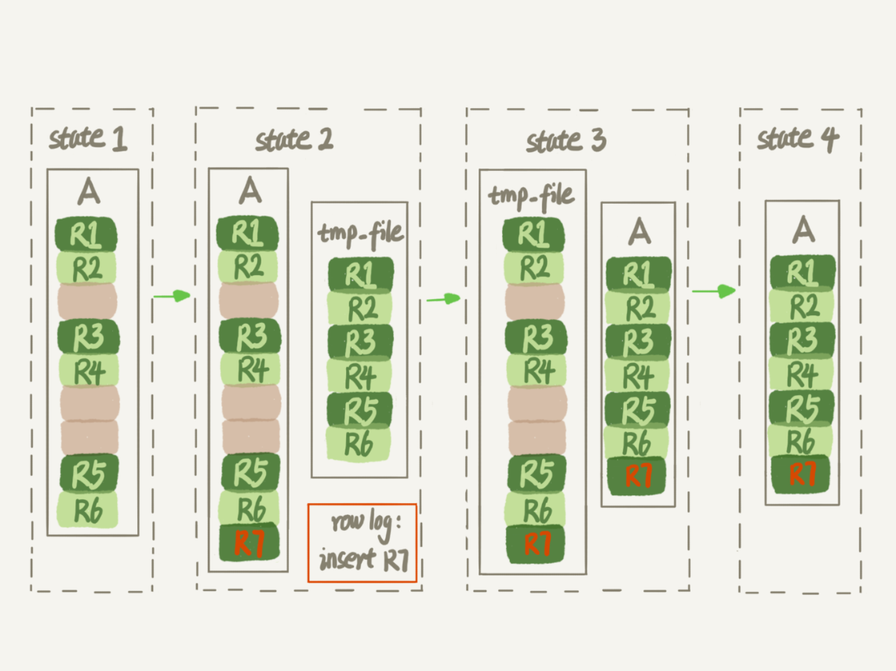

# 极客时间《MySQL实战45讲》学习笔记—实践篇

[toc]


# 9. 普通索引和唯一索引应该怎么选择

## 9.1 内容概要

**在不同的业务场景下，应该选择普通索引，还是唯一索引？** 

假设你在维护一个市民系统，每个人都有一个唯一的身份证号，而且业务代码已经保证了不会写入两个重复的身份证号。如果市民系统需要按照身份证号查姓名，就会执行类似这样的SQL语句：

```sql
select name from CUser where id_card = 'xxxxxxxyyyyyyzzzzz';
```

所以，你一定会考虑在id_card字段上建索引。

由于身份证号字段比较大，我不建议你把身份证号当做主键，那么现在你有两个选择，要么给id_card字段创建唯一索引，要么创建一个普通索引。如果业务代码已经保证了不会写入重复的身份证号，那么这两个选择逻辑上都是正确的。

现在我要问你的是，从性能的角度考虑，你选择**唯一索引**还是**普通索引**呢？选择的依据是什么呢？

简单起见，还是用第4篇文章《深入浅出索引（上）》中的例子来说明，假设字段 k 上的值都不重复。 

 

接下来，我们就从这两种索引对查询语句和更新语句的性能影响来进行分析。 


## 9.2 数据的查询过程

假设，执行查询的语句是 `select id from T where k=5`。这个查询语句在索引树上查找的过程，先是通过B+树从树根开始，按层搜索到叶子节点，也就是图中右下角的这个数据页，然后可以认为数据页内部通过**二分法**来定位记录。

- 对于普通索引来说，查找到满足条件的第一个记录(5,500)后，需要查找下一个记录，直到碰到第一个不满足k=5条件的记录。
- 对于唯一索引来说，由于索引定义了唯一性，查找到第一个满足条件的记录后，就会停止继续检索。

两者的性能差距其实是微乎其微的。

> InnoDB的数据是按**数据页**为单位来读写的。也就是说，当需要读一条记录的时候，并不是将这个记录本身从磁盘读出来，而是以页为单位，将其整体读入内存。**在InnoDB中，每个数据页的大小默认是16KB。**
>
> 因为引擎是按页读写的，所以说，当找到k=5的记录的时候，它所在的数据页就都在内存里了。那么，对于普通索引来说，要多做的那一次“查找和判断下一条记录”的操作，就只需要一次指针寻找和一次计算。
>
> 当然，如果k=5这个记录刚好是这个数据页的最后一个记录，那么要取下一个记录，必须读取下一个数据页，这个操作会稍微复杂一些。
>
> 但是，**对于整型字段，一个数据页可以放近千个key**，因此出现这种情况的概率会很低。所以，计算平均性能差异时，仍可以认为这个操作成本对于现在的CPU来说可以忽略不计。


## 9.3 数据更新过程

### 9.3.1 change buffer

当需要更新一个数据页时，如果数据页在内存中就直接更新，而如果这个数据页还没有在内存中的话，在不影响数据一致性的前提下，**InooDB会将这些更新操作缓存在change buffer中**，这样就不需要从磁盘中读入这个数据页了。在下次查询需要访问这个数据页的时候，将数据页读入内存，然后执行change buffer中与这个页有关的操作。通过这种方式就能保证这个数据逻辑的正确性。 

> 需要说明的是，虽然名字叫作change buffer，实际上它是可以持久化的数据。也就是说，change buffer在内存中有拷贝，也会被写入到磁盘上。 

**merge：**将change buffer中的操作应用到原数据页，得到最新结果的过程。 

***

**merge的执行流程**是这样的：

1. 从磁盘读入数据页到内存（老版本的数据页）；
2. 从change buffer里找出这个数据页的change buffer 记录(可能有多个），依次应用，得到新版数据页；
3. 写redo log。这个redo log包含了数据的变更和change buffer的变更。

到这里merge过程就结束了。这时候，数据页和内存中change buffer对应的磁盘位置都还没有修改，属于脏页，之后各自刷回自己的物理数据，就是另外一个过程了。

***

除了访问这个数据页会触发merge外，系统有后台线程会定期merge。在数据库正常关闭（shutdown）的过程中，也会执行merge操作。 

### 9.3.2 使用change buffer的优点

1. 如果能够将更新操作先记录在change buffer，减少读磁盘，语句的执行速度会得到明显的提升。
2. 数据读入内存是需要占用buffer pool的，所以这种方式还能够避免占用内存，提高内存利用率。 

### 9.3.3 使用change buffer的条件

对于**唯一索引**来说，所有的更新操作都要先判断这个操作是否违反唯一性约束。比如，要插入(4,400)这个记录，就要先判断现在表中是否已经存在k=4的记录，而这**必须要将数据页读入内存才能判断。如果都已经读入到内存了，那直接更新内存会更快，就没必要使用change buffer了。**

因此，**唯一索引的更新就不能使用change buffer，实际上也只有普通索引可以使用。**

> change buffer用的是buffer pool里的内存，因此不能无限增大。change buffer的大小，可以通过参数innodb_change_buffer_max_size来动态设置。这个参数设置为50的时候，表示change buffer的大小最多只能占用buffer pool的50%。 


### 9.3.4  在这张表中插入一个新记录(4,400)的话，InnoDB的处理流程

第一种情况是，**这个记录要更新的目标页在内存中**。这时，InnoDB的处理流程如下：

- 对于唯一索引来说，找到3和5之间的位置，判断到没有冲突，插入这个值，语句执行结束；
- 对于普通索引来说，找到3和5之间的位置，插入这个值，语句执行结束。

这样看来，普通索引和唯一索引对更新语句性能影响的差别，只是一个判断，只会耗费微小的CPU时间。

第二种情况是，**这个记录要更新的目标页不在内存中**。这时，InnoDB的处理流程如下：

- 对于唯一索引来说，需要将数据页读入内存，判断到没有冲突，插入这个值，语句执行结束；
- 对于普通索引来说，则是将更新记录在change buffer，语句执行就结束了。

**将数据从磁盘读入内存涉及随机IO的访问，是数据库里面成本最高的操作之一。**change buffer因为减少了随机磁盘访问，所以对更新性能的提升是会很明显的。


### 9.3.5 change buffer的使用场景

因为merge的时候是真正进行数据更新的时刻，而change buffer的主要目的就是将记录的变更动作缓存下来，所以**在一个数据页做merge之前，change buffer记录的变更越多（也就是这个页面上要更新的次数越多），收益就越大。** 

对于**写多读少**的业务来说，页面在写完以后马上被访问到的概率比较小，此时change buffer的使用效果最好。这种业务模型常见的就是账单类、日志类的系统。

反过来，假设一个业务的更新模式是写入之后马上会做查询，那么即使满足了条件，将更新先记录在change buffer，但之后由于马上要访问这个数据页，会立即触发merge过程。这样随机访问IO的次数不会减少，反而增加了change buffer的维护代价。所以，对于这种业务模式来说，change buffer反而起到了副作用。

```
写多读少适用，写少读多不适用。
```


## 9.4 索引选择和实践

这两类索引在查询能力上是没差别的，主要考虑的是对更新性能的影响。所以，**尽量选择普通索引。** 

如果所有的更新后面，都马上伴随着对这个记录的查询，那么应该关闭change buffer。而在其他情况下，change buffer都能提升更新性能。 


## 9.5 change buffer 和 redo log

由于redo log是基于WAL（先写日志，再写磁盘），提升性能的核心机制也是尽量减少随机读写，所以redo log和change buffer的概念容易混淆。这里将这两者放到同一个流程来说明，便于区分这两个概念。

### 9.5.1 带change buffer的更新过程

现在，要在表上执行这个插入语句：

```sql
mysql> insert into t(id,k) values(id1,k1),(id2,k2);
```

这里，假设当前k索引树的状态，查找到位置后，k1所在的数据页在内存(InnoDB buffer pool)中，k2所在的数据页不在内存中。下图是带change buffer的更新状态图：

 

这条更新语句涉及了四个部分：内存、redo log（ib_log_fileX）、 数据表空间（t.ibd）、系统表空间（ibdata1）。

> 系统表空间就是用来放系统信息的，比如数据字典什么的，对应的磁盘文件是 ibdata1；
> 数据表空间就是一个个的表数据文件，对应的磁盘文件就是  表名.ibd 。

这条更新语句做了如下的操作（按照图中的数字顺序）：

1. Page 1在内存中，直接更新内存；
2. Page 2没有在内存中，就在内存的change buffer区域，记录下“我要往Page 2插入一行”这个信息
3. 将上述两个动作记入redo log中（图中3和4）。

做完上面这些，事务就可以完成了。所以，执行这条更新语句的成本很低，就是写了两处内存，然后写了一处磁盘（两次操作合在一起写了一次磁盘），而且还是顺序写的。

同时，图中的两个虚线箭头，是后台操作，不影响更新的响应时间。

那在这之后的读请求，要怎么处理呢？

### 9.5.2 带change buffer的读过程

比如，现在要执行 `select * from t where k in (k1, k2)`。

如果读语句发生在更新语句后不久，内存中的数据都还在，那么此时的这两个读操作就与系统表空间（ibdata1）和 redo log（ib_log_fileX）无关了。所以图中就没画出这两部分。

 

从图中可以看到：

1. 读Page 1的时候，直接从内存返回。

   这里有个疑问：WAL之后如果读数据，是不是一定要读盘，是不是一定要从redo log里面把数据更新以后才可以返回？其实是不用的。可以看一下上图的这个状态，虽然磁盘上还是之前的数据，但是这里直接从内存返回结果，结果是正确的。

2. 要读Page 2的时候，需要把Page 2从磁盘读入内存中，然后应用change buffer里面的操作日志，生成一个正确的版本并返回结果。

可以看到，直到需要读Page 2的时候，这个数据页才会被读入内存。

所以，如果要简单地对比这两个机制（change buffer和redo log）在提升更新性能上的收益的话，**redo log 主要节省的是随机写磁盘的IO消耗（转成顺序写），而change buffer主要节省的则是随机读磁盘的IO消耗。**


## 9.6 问题

通过图2你可以看到，change buffer一开始是写内存的，那么如果这个时候机器掉电重启，会不会导致change buffer丢失呢？change buffer丢失可不是小事儿，再从磁盘读入数据可就没有了merge过程，就等于是数据丢失了。会不会出现这种情况呢？ 

 答案是不会丢失 。虽然是只更新内存，但是在事务提交的时候，我们把change buffer的操作也记录到redo log里了，所以崩溃恢复的时候，change buffer也能找回来。 


# 10. MySQL为什么有时会选错索引

## 10.1 内容概要

一条本来可以执行得很快的语句，却由于 MySQL 选错了索引，会导致执行速度变得很慢。

**示例：**

先建一个简单的表，表里有 a、b 两个字段，并分别建上索引：

```sql
CREATE TABLE `t` (
  `id` int(11) NOT NULL,
  `a` int(11) DEFAULT NULL,
  `b` int(11) DEFAULT NULL,
  PRIMARY KEY (`id`),
  KEY `a` (`a`),
  KEY `b` (`b`)
) ENGINE=InnoDB；
```

然后，往表t中插入10万行记录，取值按整数递增，即：(1,1,1)，(2,2,2)，(3,3,3) 直到(100000,100000,100000)。

> 用存储过程可以自动循环插入100000条数据。

接下来，分析一条SQL语句：

```sql
mysql> select * from t where a between 10000 and 20000;
```

这条语句正确地选择了索引a来进行查询。

下图显示的就是使用**`explain`命令**看到的这条语句的执行情况：

 

从图看上去，这条查询语句的执行也确实符合预期，key这个字段值是’a’，表示优化器选择了索引a。


在已经准备好的包含了10万行数据的表上，再做如下操作：

 

这里，session A的操作就是开启了一个事务。随后，session B把数据都删除后，又调用了 idata这个存储过程，插入了10万行数据。

这时候，session B的查询语句select * from t where a between 10000 and 20000就不会再选择索引a了。可以通过慢查询日志（slow log）来查看一下具体的执行情况。

为了说明优化器选择的结果是否正确，增加一个对照，即：**使用force index(a)来让优化器强制使用索引a**（这部分内容，还会在这篇文章的后半部分中提到）。

下面的三条SQL语句，就是这个实验过程。

```sql
set long_query_time=0;
select * from t where a between 10000 and 20000; /*Q1*/
select * from t force index(a) where a between 10000 and 20000;/*Q2*/
```

- 第一句，是将慢查询日志的阈值设置为0，表示这个线程接下来的语句都会被记录入慢查询日志中；
- 第二句，Q1是session B原来的查询；
- 第三句，Q2是加了force index(a)来和session B原来的查询语句执行情况对比。

 如下图所示是这三条SQL语句执行完成后的慢查询日志：

 

可以看到，Q1扫描了10万行，显然是走了全表扫描，执行时间是40毫秒。Q2扫描了10001行，执行了21毫秒。**也就是说，我们在没有使用force index的时候，MySQL用错了索引，导致了更长的执行时间。**

这个例子对应的是我们平常不断地删除历史数据和新增数据的场景。这时，MySQL竟然会选错索引，是不是有点奇怪呢？今天，我们就从这个奇怪的结果说起吧。


## 10.2 优化器的逻辑

选择索引是**优化器**的工作。而优化器选择索引的目的，是找到一个最优的执行方案，并用最小的代价去执行语句。在数据库里面，**扫描行数**是影响执行代价的因素之一。**扫描的行数越少，意味着访问磁盘数据的次数越少，消耗的 CPU 资源越少。**

当然，扫描行数并不是唯一的判断标准，优化器还会结合**是否使用临时表**、**是否排序**等因素进行综合判断。

这个简单的查询语句并没有涉及到临时表和排序，所以 MySQL 选错索引肯定是在判断扫描行数的时候出问题了。


### 10.2.1 扫描行数是怎么判断的？

MySQL 在真正开始执行语句之前，并不能精确地知道满足这个条件的记录有多少条，而只能根据统计信息来估算记录数。

这个统计信息就是索引的**“区分度”**。显然，**一个索引上不同的值越多，这个索引的区分度就越好。**而**一个索引上不同的值的个数**，我们称之为**“基数”**（cardinality）。也就是
说，这个基数越大，索引的区分度越好。

可以使用 `show index` 方法，看到一个索引的基数。如下图所示，就是表 t 的 showindex 的结果 。虽然这个表的每一行的三个字段值都是一样的，但是在统计信息中，这三
个索引的基数值并不同，而且其实都不准确。 

 


### 10.2.2 MySQL是怎样得到索引的基数的？

简单介绍一下 **MySQL 采样统计**的方法。

为什么要采样统计呢？因为把整张表取出来一行行统计，虽然可以得到精确的结果，但是代价太高了，所以只能选择“采样统计”。

采样统计的时候，**InnoDB 默认会选择 N 个数据页，统计这些页面上的不同值，得到一个平均值，然后乘以这个索引的页面数，就得到了这个索引的基数。**

而数据表是会持续更新的，索引统计信息也不会固定不变。所以，**当变更的数据行数超过1/M 的时候，会自动触发重新做一次索引统计。**

在 MySQL 中，有两种存储索引统计的方式，可以通过设置参数 `innodb_stats_persistent` 的值来选择：

1. 设置为 on 的时候，表示统计信息会持久化存储。这时，默认的 N 是 20，M 是 10。
2. 设置为 off 的时候，表示统计信息只存储在内存中。这时，默认的 N 是 8，M 是 16。

由于是采样统计，所以不管 N 是 20 还是 8，这个基数都是很容易不准的。但，这还不是全部。

可以从上图中看到，这次的索引统计值（cardinality列）虽然不够精确，但大体上还是差不多的，选错索引一定还有别的原因。

其实索引统计只是一个输入，对于一个具体的语句来说，**优化器还要判断，执行这个语句本身要扫描多少行。**

接下来，再看看优化器预估的，这两个语句的扫描行数是多少：

 

rows 这个字段表示的是预计扫描行数。 

其中，Q1 的结果还是符合预期的，rows 的值是 104620；但是 Q2 的 rows 值是37116，偏差就大了。而图 1 中我们用 explain 命令看到的 rows 是只有 10001 行，是这个偏差误导了优化器的判断。 

优化器为什么放着扫描 37000 行的执行计划不用，却选择了扫描行数是 100000 的执行计划呢？

这是因为，如果使用索引 a，每次从索引 a 上拿到一个值，都要回到主键索引上查出整行数据，这个代价优化器也要算进去的。而如果选择扫描 10 万行，是直接在主键索引上扫描的，没有额外的代价。

优化器会估算这两个选择的代价，从结果看来，优化器认为直接扫描主键索引更快。当然，从执行时间看来，这个选择并不是最优的。

使用普通索引需要把回表的代价算进去，在图 1 执行 explain 的时候，也考虑了这个策略的代价 ，但图 1 的选择是对的。也就是说，这个策略并没有问题。

所以冤有头债有主，MySQL 选错索引，这件事儿还得归咎到没能准确地判断出扫描行数。

 既然是统计信息不对，那就修正。 

### 10.2.3 使用 analyze table t 命令重新统计索引信息

**`analyze table` 命令可以重新统计索引信息。**

 

这回对了。

所以在实践中，如果你发现 explain 的结果预估的 rows 值跟实际情况差距比较大，可以采用这个方法来处理。

其实，如果只是索引统计不准确，通过analyze命令可以解决很多问题，但是前面说了，优化器可不止是看扫描行数。

依然是基于这个表t，看看另外一个语句：

```sql
mysql> select * from t where (a between 1 and 1000)  and (b between 50000 and 100000) order by b limit 1;
```

从条件上看，这个查询没有符合条件的记录，因此会返回空集合。 

在开始执行这条语句之前，可以先设想一下，如果你来选择索引，会选择哪一个呢？

为了便于分析，先来看一下a、b这两个索引的结构图。

 

如果使用索引a进行查询，那么就是扫描索引a的前1000个值，然后取到对应的id，再到主键索引上去查出每一行，然后根据字段b来过滤。显然这样需要扫描1000行。

如果使用索引b进行查询，那么就是扫描索引b的最后50001个值，与上面的执行过程相同，也是需要回到主键索引上取值再判断，所以需要扫描50001行。

所以你一定会想，如果使用索引a的话，执行速度明显会快很多。那么，下面就来看看到底是不是这么一回事儿。

下图是执行explain的结果：

```sql
mysql> explain select * from t where (a between 1 and 1000) and (b between 50000 and 100000) order by b limit 1;
```

 

可以看到，返回结果中 key 字段显示，这次优化器选择了索引 b，而 rows 字段显示需要扫描的行数是 50198。从这个结果中，你可以得到两个结论：

- 1. 扫描行数的估计值依然不准确；
- 2. 这个例子里 MySQL 又选错了索引。


## 10.3 索引选择异常和处理

其实大多数时候优化器都能找到正确的索引，但偶尔你还是会碰到上面举例的这两种情况：原本可以执行得很快的SQL语句，执行速度却比预期的慢很多，应该怎么办呢？ 

1.  **采用force index强行选择一个索引。** 

   MySQL会根据词法解析的结果分析出可能可以使用的索引作为候选项，然后在候选列表中依次判断每个索引需要扫描多少行。如果force index指定的索引在候选索引列表中，就直接选择这个索引，不再评估其他索引的执行代价。 

2.  **修改语句，引导MySQL使用我们期望的索引。** 

3.  **在有些场景下，我们可以新建一个更合适的索引，来提供给优化器做选择，或删掉误用的索引。** 

   

## 10.4 问题

前面我们在构造第一个例子的过程中，通过session A的配合，让session B删除数据后又重新插入了一遍数据，然后就发现explain结果中，rows字段从10001变成37000多。

而如果没有session A的配合，只是单独执行delete from t 、call idata()、explain这三句话，会看到rows字段其实还是10000左右。你可以自己验证一下这个结果。

这是什么原因呢？也请你分析一下吧。

要检查一下隔离级别是不是RR（Repeatable Read，可重复读），创建的表t是不是InnoDB引擎。我把复现过程做成了一个视频供参考。 

https://static001.geekbang.org/resource/video/2a/76/2a3ac914a325cdff1ca6ba999d1b8c76.mp4


delete 语句删掉了所有的数据，然后再通过call idata()插入了10万行数据，看上去是覆盖了原来的10万行。

但是，session A开启了事务并没有提交，所以之前插入的10万行数据是不能删除的。这样，之前的数据每一行数据都有两个版本，旧版本是delete之前的数据，新版本是标记为deleted的数据。

这样，索引a上的数据其实就有两份。

然后你会说，不对啊，主键上的数据也不能删，那没有使用force index的语句，使用explain命令看到的扫描行数为什么还是100000左右？（潜台词，如果这个也翻倍，也许优化器还会认为选字段a作为索引更合适）

是的，不过这个是主键，主键是直接按照表的行数来估计的。而表的行数，优化器直接用的是show table status的值。

这个值的计算方法，我会在后面有文章为你详细讲解。


# 11. 怎么给字符串字段加索引


## 11.1 如何在邮箱这样的字段上建立合理的索引

维护一个支持邮箱登录的系统，用户表是这么定义的：

```sql
mysql> create table SUser(
ID bigint unsigned primary key,
email varchar(64), 
... 
)engine=innodb; 
```

由于要使用邮箱登录，所以业务代码中一定会出现类似于这样的语句：

```sql
mysql> select f1, f2 from SUser where email='xxx';
```

如果email这个字段上**没有索引，那么这个语句就只能做全表扫描。**

同时，MySQL是支持前缀索引的，也就是说，可以定义字符串的一部分作为索引。默认地，如果创建索引的语句不指定前缀长度，那么索引就会包含整个字符串。


### 11.1.1 使用完整索引和前缀索引的区别 

比如，这两个在email字段上创建索引的语句：

```sql
mysql> alter table SUser add index index1(email);
或
mysql> alter table SUser add index index2(email(6));
```

第一个语句创建的index1索引里面，包含了每个记录的整个字符串；而第二个语句创建的index2索引里面，对于每个记录都是只取前6个字节。

那么，这两种不同的定义在数据结构和存储上有什么区别呢？下面是两个索引的示意图：

   

从图中可以看到，由于email(6)这个索引结构中每个邮箱字段都只取前6个字节（即：zhangs），所以**占用的空间会更小**，这就是使用前缀索引的优势。

但，这同时带来的损失是，可能会增加额外的记录扫描次数。

***

例如下面这个语句，在这两个索引定义下分别是怎么执行的。

```sql
select id,name,email from SUser where email='zhangssxyz@xxx.com';
```

**如果使用的是index1**（即email整个字符串的索引结构），执行顺序是这样的：

1. 从index1索引树找到满足索引值是 `zhangssxyz@xxx.com` 的这条记录，取得ID2的值；
2. 到主键上查到主键值是ID2的行，判断email的值是正确的，将这行记录加入结果集；
3. 取index1索引树上刚刚查到的位置的下一条记录，发现已经不满足email=`zhangssxyz@xxx.com`的条件了，循环结束。

这个过程中，只需要回主键索引取一次数据，所以系统认为只扫描了一行。

**如果使用的是index2**（即email(6)索引结构），执行顺序是这样的：

1. 从index2索引树找到满足索引值是 `zhangs` 的记录，找到的第一个是ID1；
2. 到主键上查到主键值是ID1的行，判断出email的值不是 `zhangssxyz@xxx.com`，这行记录丢弃；
3. 取index2上刚刚查到的位置的下一条记录，发现仍然是 `zhangs`，取出ID2，再到ID索引上取整行然后判断，这次值对了，将这行记录加入结果集；
4. 重复上一步，直到在idxe2上取到的值不是 `zhangs` 时，循环结束。

在这个过程中，要回主键索引取4次数据，也就是扫描了4行。

***

使用前缀索引后，可能会导致查询语句读数据的次数变多。

但是，对于这个查询语句来说，如果定义的index2不是email(6)而是email(7），也就是说取email字段的前7个字节来构建索引的话，即满足前缀’zhangss’的记录只有一个，也能够直接查到ID2，只扫描一行就结束了。

也就是说**使用前缀索引，定义好长度，就可以做到既节省空间，又不用额外增加太多的查询成本。**


### 11.1.2 当要给字符串创建前缀索引时，有什么方法能够确定应该使用多长的前缀？

实际上，我们在建立索引时关注的是**区分度**，区分度越高越好。因为**区分度越高，意味着重复的键值越少。**因此，我们可以通过统计索引上有多少个不同的值来判断要使用多长的前缀。

首先，你可以使用下面这个语句，算出这个列上有多少个不同的值：

```sql
mysql> select count(distinct email) as L from SUser;
```

然后，依次选取不同长度的前缀来看这个值，比如我们要看一下4~7个字节的前缀索引，可以用这个语句：

```sql
mysql> select 
  count(distinct left(email,4)）as L4,
  count(distinct left(email,5)）as L5,
  count(distinct left(email,6)）as L6,
  count(distinct left(email,7)）as L7,
from SUser;
```

当然，使用前缀索引很可能会损失区分度，所以你需要预先设定一个可以接受的损失比例，比如5%。然后，在返回的L4~L7中，找出不小于 L * 95%的值，假设这里L6、L7都满足，你就可以选择前缀长度为6。


## 11.2 前缀索引对覆盖索引的影响

使用前缀索引可能会增加扫描行数，这会影响到性能。其实，前缀索引的影响不止如此，再看一下另外一个场景。

先来看看这个SQL语句：

```sql
select id,email from SUser where email='zhangssxyz@xxx.com';
```

与前面例子中的SQL语句

```sql
select id,name,email from SUser where email='zhangssxyz@xxx.com';
```

相比，这个语句只要求返回id和email字段（正好覆盖了index1索引树叶子节点的内容）。

所以，如果使用index1（即email整个字符串的索引结构）的话，可以利用覆盖索引，从index1查到结果后直接就返回了，不需要回到ID索引再去查一次。而如果使用index2（即email(6)索引结构）的话，就不得不回到ID索引再去判断email字段的值。

即使将index2的定义修改为email(18)的前缀索引，这时候虽然index2已经包含了所有的信息，但InnoDB还是要回到id索引再查一下，因为**系统并不确定前缀索引的定义是否截断了完整信息。**

也就是说，**使用前缀索引就用不上覆盖索引对查询性能的优化了，这也是你在选择是否使用前缀索引时需要考虑的一个因素。**


## 11.3 在邮箱上建立合理索引的其他方式

对于类似于邮箱这样的字段来说，使用前缀索引的效果可能还不错。但是，遇到前缀的区分度不够好的情况时要怎么办呢？

> 比如，我们国家的身份证号，一共18位，其中前6位是地址码，所以同一个县的人的身份证号前6位一般会是相同的。
>
> 假设你维护的数据库是一个市的公民信息系统，这时候如果对身份证号做长度为6的前缀索引的话，这个索引的区分度就非常低了。
>
> 按照前面说的方法，可能你需要创建长度为12以上的前缀索引，才能够满足区分度要求。
>
> 但是，索引选取的越长，占用的磁盘空间就越大，相同的数据页能放下的索引值就越少，搜索的效率也就会越低。
>
> 那么，如果我们能够确定业务需求里面只有按照身份证进行等值查询的需求，还有没有别的处理方法呢？这种方法，既可以占用更小的空间，也能达到相同的查询效率。

### 11.3.1 倒序存储

**第一种方式是使用倒序存储。**如果你存储身份证号的时候把它倒过来存，每次查询的时候，你可以这么写：

```sql
mysql> select field_list from t where id_card = reverse('input_id_card_string');
```

由于身份证号的最后6位没有地址码这样的重复逻辑，所以最后这6位很可能就提供了足够的区分度。当然了，实践中你不要忘记使用count(distinct)方法去做个验证。

### 11.3.2 hash字段

**第二种方式是使用hash字段。**你可以在表上再创建一个整数字段，来保存身份证的校验码，同时在这个字段上创建索引。

```sql
mysql> alter table t add id_card_crc int unsigned, add index(id_card_crc);
```

然后每次插入新记录的时候，都同时用 `crc32()` 这个函数得到校验码填到这个新字段。由于校验码可能存在冲突，也就是说两个不同的身份证号通过 `crc32()` 函数得到的结果可能是相同的，所以你的查询语句where部分要判断id_card的值是否精确相同。

```sql
mysql> select field_list from t where id_card_crc=crc32('input_id_card_string') and id_card='input_id_card_string'
```

这样，索引的长度变成了4个字节，比原来小了很多。


### 11.3.3 使用倒序存储和使用hash字段的异同点

首先，它们的相同点是，**都不支持范围查询。**倒序存储的字段上创建的索引是按照倒序字符串的方式排序的，已经没有办法利用索引方式查出身份证号码在[ID_X, ID_Y]的所有市民了。同样地，hash字段的方式也**只能支持等值查询。**

它们的区别，主要体现在以下三个方面：

1. 从占用的额外空间来看，倒序存储方式在主键索引上，不会消耗额外的存储空间，而hash字段方法需要增加一个字段。当然，倒序存储方式使用4个字节的前缀长度应该是不够的，如果再长一点，这个消耗跟额外这个hash字段也差不多抵消了。
2. 在CPU消耗方面，倒序方式每次写和读的时候，都需要额外调用一次 `reverse` 函数，而hash字段的方式需要额外调用一次 `crc32()` 函数。如果只从这两个函数的计算复杂度来看的话，`reverse` 函数额外消耗的CPU资源会更小些。
3. 从查询效率上看，使用hash字段方式的查询性能相对更稳定一些。因为 `crc32` 算出来的值虽然有冲突的概率，但是概率非常小，可以认为每次查询的平均扫描行数接近1。而倒序存储方式毕竟还是用的前缀索引的方式，也就是说还是会增加扫描行数。


## 11.4 小结

字符串创建索引可以采取的方式：

1. 直接创建完整索引，这样可能比较占用空间；
2. 创建前缀索引，节省空间，但会增加查询扫描次数，并且不能使用覆盖索引；
3. 倒序存储，再创建前缀索引，用于绕过字符串本身前缀的区分度不够的问题；
4. 创建hash字段索引，查询性能稳定，有额外的存储和计算消耗，跟第三种方式一样，都不支持范围扫描。


## 11.5 问题

如果你在维护一个学校的学生信息数据库，学生登录名的统一格式是”学号@gmail.com", 而学号的规则是：十五位的数字，其中前三位是所在城市编号、第四到第六位是学校编号、第七位到第十位是入学年份、最后五位是顺序编号。

系统登录的时候都需要学生输入登录名和密码，验证正确后才能继续使用系统。就只考虑登录验证这个行为的话，你会怎么设计这个登录名的索引呢？

由于这个学号的规则，无论是正向还是反向的前缀索引，重复度都比较高。因为维护的只是一个学校的，因此前面6位（其中，前三位是所在城市编号、第四到第六位是学校编号）其实是固定的，邮箱后缀都是@gmail.com，因此可以只存入学年份加顺序编号，它们的长度是9位。

而其实在此基础上，可以用数字类型来存这9位数字。比如201100001，这样只需要占4个字节。其实这个就是一种hash，只是它用了最简单的转换规则：字符串转数字的规则，而刚好我们设定的这个背景，可以保证这个转换后结果的唯一性。


# 12. 为什么我的MySQL会“抖”一下

**现象：**

一条SQL语句，正常执行的时候特别快，但是有时也不知道怎么回事，它就会变得特别慢，并且这样的场景很难复现，它不只随机，而且持续时间还很短。 

## 12.1 你的SQL语句为什么变“慢”了

### 12.1.1 类比

InnoDB在处理更新语句的时候，只做了写日志这一个磁盘操作。这个日志叫作**redo log（重做日志）**，也就是《孔乙己》里咸亨酒店掌柜用来**记账的粉板**，在更新内存写完redo log后，就返回给客户端，本次更新成功。 

 


### 12.1.2 flush

掌柜总要找时间把账本更新一下，这对应的就是把内存里的数据写入磁盘的过程，术语就是 **flush**。

 


### 12.1.3 脏页 & 干净页

**当内存数据页跟磁盘数据页内容不一致的时候，我们称这个内存页为“脏页”。内存数据写入到磁盘后，内存和磁盘上的数据页的内容就一致了，称为“干净页”**。 

不论是脏页还是干净页，都在内存中。在这个例子里，内存对应的就是掌柜的记忆。 


### 12.1.4 孔乙己赊账的整个操作过程

假设原来孔乙己欠账10文，这次又要赊9文。 

 

所以回到开头的问题，平时执行很快的更新操作，其实就是在写内存和日志，而MySQL偶尔“抖”一下的那个瞬间，可能就是在**刷脏页（flush）**。 


## 12.2 什么情况会引发数据库的flush过程？

还是继续用咸亨酒店掌柜的这个例子，想一想：掌柜在什么情况下会把粉板上的赊账记录改到账本上？ 

### 12.2.1 场景一

> 粉板满了，记不下了。这时候如果再有人来赊账，掌柜就只得放下手里的活儿，将粉板上的记录擦掉一些，留出空位以便继续记账。当然在擦掉之前，他必须先将正确的账目记录到账本中才行。 

这个场景，对应的就是**InnoDB的redo log写满了。这时候系统会停止所有更新操作，把checkpoint往前推进，redo log留出空间可以继续写。**

下面是这个过程在 redo log 的示意图：

 

checkpoint可不是随便往前修改一下位置就可以的。如上图，把checkpoint位置从CP推进到CP’，就需要将两个点之间的日志（浅绿色部分），对应的所有脏页都flush到磁盘上。之后，图中从write pos到CP’之间就是可以再写入的redo log的区域。 

### 12.2.2 场景二

> 这一天生意太好，要记住的事情太多，掌柜发现自己快记不住了，赶紧找出账本把孔乙己这笔账先加进去。 

这种场景，对应的就是**系统内存不足。当需要新的内存页，而内存不够用的时候，就要淘汰一些数据页，空出内存给别的数据页使用。如果淘汰的是“脏页”，就要先将脏页写到磁盘。**
你一定会说，这时候难道不能直接把内存淘汰掉，下次需要请求的时候，从磁盘读入数据页，然后拿redo log出来应用不就行了？这里其实是从性能考虑的。如果刷脏页一定会写盘，就保证了每个数据页有两种状态： 

- 一种是内存里存在，内存里就肯定是正确的结果，直接返回；
- 另一种是内存里没有数据，就可以肯定数据文件上是正确的结果，读入内存后返回。这样的效率最高。

### 12.2.3 场景三

> 生意不忙的时候，或者打烊之后。这时候柜台没事，掌柜闲着也是闲着，不如更新账本。 

这种场景，对应的就是**MySQL认为系统“空闲”的时候。当然，MySQL“这家酒店”的生意好起来可是会很快就能把粉板记满的，所以“掌柜”要合理地安排时间，即使是“生意好”的时候，也要见缝插针地找时间，只要有机会就刷一点“脏页”。** 

### 12.2.4 场景四

> 年底了咸亨酒店要关门几天，需要把账结清一下。这时候掌柜要把所有账都记到账本上，这样过完年重新开张的时候，就能就着账本明确账目情况了。 

这种场景，对应的就是**MySQL正常关闭的情况。这时候，MySQL会把内存的脏页都flush到磁盘上，这样下次MySQL启动的时候，就可以直接从磁盘上读数据，启动速度会很快。** 


## 12.3 四种引发数据库flush过程的场景对性能的影响

### 12.3.1 第三四种场景

其中，第三种情况是属于MySQL空闲时的操作，这时系统没什么压力，而第四种场景是数据库本来就要关闭了。这两种情况下，不会太关注“性能”问题。

### 12.3.2 第一种场景

第一种是“redo log写满了，要flush脏页”，这种情况是**InnoDB要尽量避免**的。**因为出现这种情况的时候，整个系统就不能再接受更新了，所有的更新都必须堵住。**如果你从监控上看，这时候更新数会跌为0。 

### 12.3.3 第二种场景

第二种是“内存不够用了，要先将脏页写到磁盘”，这种情况其实是常态。**InnoDB用缓冲池（buffer pool）管理内存，缓冲池中的内存页有三种状态：**

- 第一种是，还没有使用的；
- 第二种是，使用了并且是干净页；
- 第三种是，使用了并且是脏页。


InnoDB的策略是**尽量使用内存**，因此对于一个长时间运行的库来说，未被使用的页面很少。

而当要读入的数据页没有在内存的时候，就必须到缓冲池中申请一个数据页。这时候只能**把最久不使用的数据页从内存中淘汰掉：如果要淘汰的是一个干净页，就直接释放出来复用；但如果是脏页呢，就必须将脏页先刷到磁盘，变成干净页后才能复用。**

所以，刷脏页虽然是常态，但是出现以下这两种情况，都是会明显影响性能的：

1. **一个查询要淘汰的脏页个数太多，会导致查询的响应时间明显变长；**
2. **日志写满，更新全部堵住，写性能跌为0，这种情况对敏感业务来说，是不能接受的。**

所以，InnoDB需要有控制脏页比例的机制，来尽量避免上面的这两种情况。


## 12.4 InnoDB刷脏页的控制策略

### 12.4.1 正确告诉InnoDB所在主机的IO能力

首先，要正确地告诉InnoDB所在主机的IO能力，这样InnoDB才能知道需要全力刷脏页的时候，可以刷多快。

这就要用到 `innodb_io_capacity` 这个参数了，它会告诉InnoDB你的磁盘能力。这个值建议设置成磁盘的IOPS。磁盘的IOPS可以通过`fio`这个工具来测试，下面的语句是用来测试磁盘随机读写的命令：

```
fio -filename=$filename -direct=1 -iodepth 1 -thread -rw=randrw -ioengine=psync -bs=16k -size=500M -numjobs=10 -runtime=10 -group_reporting -name=mytest 
```


### 12.4.2 如果要设计策略控制刷脏页的速度，要参考哪些因素呢？ 

这个问题可以这么想，如果刷太慢，会出现什么情况？首先是内存脏页太多，其次是redo log写满。

所以，InnoDB的刷盘速度就是要参考这两个因素：一个是**脏页比例**，一个是**redo log写盘速度**。

InnoDB会根据这两个因素先单独算出两个数字。

参数 `innodb_max_dirty_pages_pct` 是**脏页比例上限，默认值是75%。**InnoDB会根据当前的脏页比例（假设为M），算出一个范围在0到100之间的数字，计算这个数字的伪代码类似这样：

```
F1(M)
{
  if M>=innodb_max_dirty_pages_pct then
      return 100;
  return 100*M/innodb_max_dirty_pages_pct;
}
```

InnoDB每次写入的日志都有一个序号，当前写入的序号跟checkpoint对应的序号之间的差值，假设为N。InnoDB会根据这个N算出一个范围在0到100之间的数字，这个计算公式可以记为F2(N)。F2(N)算法比较复杂，只要知道N越大，算出来的值越大就好了。

然后，**根据上述算得的F1(M)和F2(N)两个值，取其中较大的值记为R，之后引擎就可以按照innodb_io_capacity定义的能力乘以R%来控制刷脏页的速度。**

下面是这个过程的一个简单的流程图。图中的F1、F2就是上面通过脏页比例和redo log写入速度算出来的两个值。 

 

现在你知道了，InnoDB会在后台刷脏页，而刷脏页的过程是要将内存页写入磁盘。所以，无论是你的查询语句在需要内存的时候可能要求淘汰一个脏页，还是由于刷脏页的逻辑会占用IO资源并可能影响到了你的更新语句，都可能是造成你从业务端感知到MySQL“抖”了一下的原因。 


### 12.4.3 脏页比例设置

要尽量避免这种情况，就要合理地设置 `innodb_io_capacity` 的值，并且**平时要多关注脏页比例，不要让它经常接近75%**。

其中，脏页比例是通过`Innodb_buffer_pool_pages_dirty/Innodb_buffer_pool_pages_total`得到的，具体的命令参考下面的代码：

```sql
mysql> select VARIABLE_VALUE into @a from global_status where VARIABLE_NAME = 'Innodb_buffer_pool_pages_dirty';
select VARIABLE_VALUE into @b from global_status where VARIABLE_NAME = 'Innodb_buffer_pool_pages_total';
select @a/@b;
```


接下来，再看一个有趣的策略。

一旦一个查询请求需要在执行过程中先flush掉一个脏页时，这个查询就可能要比平时慢了。而MySQL中的一个机制，可能让你的查询会更慢：**在准备刷一个脏页的时候，如果这个数据页旁边的数据页刚好是脏页，就会把这个“邻居”也带着一起刷掉；而且这个把“邻居”拖下水的逻辑还可以继续蔓延，也就是对于每个邻居数据页，如果跟它相邻的数据页也还是脏页的话，也会被放到一起刷。** 

在InnoDB中，`innodb_flush_neighbors` 参数就是用来控制这个行为的，值为1的时候会有上述的“连坐”机制，值为0时表示不找邻居，自己刷自己的。

> 找“邻居”这个优化在机械硬盘时代是很有意义的，可以减少很多随机IO。机械硬盘的随机IOPS一般只有几百，相同的逻辑操作减少随机IO就意味着系统性能的大幅度提升。
>
> 而如果使用的是SSD这类IOPS比较高的设备的话，建议把`innodb_flush_neighbors`的值设置成0。因为这时候IOPS往往不是瓶颈，而“只刷自己”，就能更快地执行完必要的刷脏页操作，减少SQL语句响应时间。
>
> 在MySQL 8.0中，`innodb_flush_neighbors`参数的默认值已经是0了。


## 12.5 问题

一个内存配置为128GB、innodb_io_capacity设置为20000的大规格实例，正常会建议你将redo log设置成4个1GB的文件。

但如果你在配置的时候不慎将redo log设置成了1个100M的文件，会发生什么情况呢？又为什么会出现这样的情况呢？

每次事务提交都要写redo log，如果设置太小，很快就会被写满，也就是下面这个图的状态，这个“环”将很快被写满，write pos一直追着CP。 


这时候系统不得不停止所有更新，去推进checkpoint。

这时，你看到的现象就是**磁盘压力很小，但是数据库出现间歇性的性能下跌。**


# 13. 为什么表数据删掉一半，表文件大小不变

一个InnoDB表包含两部分，即：**表结构定义**和**数据**。在MySQL 8.0版本以前，表结构是存在以 `.frm` 为后缀的文件里。而MySQL 8.0版本，则已经允许把表结构定义放在系统数据表中了。因为表结构定义占用的空间很小，所以主要讨论的是表数据。

接下来，会先说明为什么简单地删除表数据达不到表空间回收的效果，然后再介绍正确回收空间的方法。


## 13.1 参数innodb_file_per_table

表数据既可以存在共享表空间里，也可以是单独的文件。这个行为是由参数 `innodb_file_per_table` 控制的：

1. 这个参数设置为OFF表示的是，表的数据放在系统共享表空间，也就是跟数据字典放在一起；
2. 这个参数设置为ON表示的是，每个InnoDB表数据存储在一个以 `.ibd` 为后缀的文件中。

从MySQL 5.6.6版本开始，它的默认值就是ON了。

建议不论使用MySQL的哪个版本，都将这个值设置为ON。因为，一个表单独存储为一个文件更容易管理，而且在不需要这个表的时候，通过 `drop table` 命令，系统就会直接删除这个文件。而如果是放在共享表空间中，即使表删掉了，空间也是不会回收的。

所以，**将innodb_file_per_table设置为ON，是推荐做法，接下来的讨论都是基于这个设置展开的。**

在删除整个表的时候，可以使用 `drop table` 命令回收表空间。但是，我们遇到的更多的删除数据的场景是删除某些行，这时就遇到了文章开头的问题：表中的数据被删除了，但是表空间却没有被回收。

要彻底搞明白这个问题的话，就要从数据删除流程说起了。


## 13.2 数据删除流程

先再来看一下InnoDB中一个索引的示意图。InnoDB里的数据都是用B+树的结构组织的。

 

假设，要删掉R4这个记录，InnoDB引擎只会把R4这个记录**标记为删除**。如果之后要再插入一个ID在300和600之间的记录时，可能会复用这个位置。但是，磁盘文件的大小并不会缩小。

InnoDB的数据是按页存储的，那么如果删掉了一个数据页上的所有记录，会怎么样？

答案是，整个数据页就可以被复用了。

但是，**数据页的复用跟记录的复用是不同的。**

**记录的复用，只限于符合范围条件的数据。**比如上面的这个例子，R4这条记录被删除后，如果插入一个ID是400的行，可以直接复用这个空间。但如果插入的是一个ID是800的行，就不能复用这个位置了。

而**当整个页从B+树里面摘掉以后，可以复用到任何位置。**以上图为例，如果将数据页page A上的所有记录删除以后，page A会被标记为可复用。这时候如果要插入一条ID=50的记录需要使用新页的时候，page A是可以被复用的。

**如果相邻的两个数据页利用率都很小，系统就会把这两个页上的数据合到其中一个页上，另外一个数据页就被标记为可复用。**

进一步地，如果我们用delete命令把整个表的数据删除呢？结果就是，所有的数据页都会被标记为可复用。但是磁盘上，文件不会变小。


你现在知道了，**delete命令其实只是把记录的位置，或者数据页标记为了“可复用”，但磁盘文件的大小是不会变的。**也就是说，**通过delete命令是不能回收表空间的。**这些可以复用，而没有被使用的空间，看起来就像是“空洞”。

实际上，**不止是删除数据会造成空洞，插入数据也会。**

如果数据是按照索引递增顺序插入的，那么索引是紧凑的。但如果数据是随机插入的，就可能造成索引的数据页分裂。

假设图1中page A已经满了，这时再插入一行数据，会怎样呢？

 

可以看到，由于page A满了，再插入一个ID是550的数据时，就不得不再申请一个新的页面page B来保存数据了。页分裂完成后，page A的末尾就留下了空洞（注意：实际上，可能不止1个记录的位置是空洞）。

另外，**更新索引上的值，可以理解为删除一个旧的值，再插入一个新值。不难理解，这也是会造成空洞的。**

也就是说，经过大量增删改的表，都是可能是存在空洞的。所以，如果能够把这些空洞去掉，就能达到收缩表空间的目的。

而**重建表**，就可以达到这样的目的。


## 13.3 重建表

如果现在有一个表A，需要做空间收缩，为了把表中存在的空洞去掉，可以怎么做呢？

> 可以新建一个与表A结构相同的表B，然后按照主键ID递增的顺序，把数据一行一行地从表A里读出来再插入到表B中。
>
> 由于表B是新建的表，所以表A主键索引上的空洞，在表B中就都不存在了。显然地，表B的主键索引更紧凑，数据页的利用率也更高。如果把表B作为临时表，数据从表A导入表B的操作完成后，用表B替换A，从效果上看，就起到了收缩表A空间的作用。

这里，你可以使用 `alter table A engine=InnoDB` 命令来重建表。在MySQL 5.5版本之前，这个命令的执行流程跟前面描述的差不多，区别只是这个临时表B不需要自己创建，MySQL会自动完成**转存数据、交换表名、删除旧表**的操作。

图3：

 

显然，花时间最多的步骤是往临时表插入数据的过程，如果在这个过程中，有新的数据要写入到表A的话，就会造成数据丢失。因为在整个DDL过程中，表A中不能有更新。也就是说，这个DDL不是Online的。

而在**MySQL 5.6版本开始引入的Online DDL，对这个操作流程做了优化。**

简单描述一下引入了Online DDL之后，重建表的流程：

1. 建立一个临时文件，扫描表A主键的所有数据页；
2. 用数据页中表A的记录生成B+树，存储到临时文件中；
3. **生成临时文件的过程中，将所有对A的操作记录在一个日志文件（row log）中**，对应的是下图中state2的状态；
4. 临时文件生成后，将日志文件中的操作应用到临时文件，得到一个逻辑数据上与表A相同的数据文件，对应的就是图中state3的状态；
5. 用临时文件替换表A的数据文件。

图4：

 

由于**日志文件记录**和**重放操作**这个功能的存在，这个方案在重建表的过程中，允许对表A做增删改操作。这也就是Online DDL名字的来源。 

> Online DDL的方式是可以考虑在业务低峰期使用的。

**注意：**

上图的流程中，alter语句在启动的时候需要获取MDL写锁，但是**这个写锁在真正拷贝数据之前就退化成读锁了**。

为什么要退化呢？为了实现Online，MDL读锁不会阻塞增删改操作。

那为什么不干脆直接解锁呢？为了保护自己，禁止其他线程对这个表同时做DDL。

而对于一个大表来说，Online DDL最耗时的过程就是拷贝数据到临时表的过程，这个步骤的执行期间可以接受增删改操作。所以，相对于整个DDL过程来说，锁的时间非常短。对业务来说，就可以认为是Online的。

需要补充说明的是，上述的这些重建方法都会扫描原表数据和构建临时文件。对于很大的表来说，这个操作是很消耗IO和CPU资源的。因此，如果是线上服务，要很小心地控制操作时间。

> 如果想要比较安全的操作的话，推荐使用GitHub开源的gh-ost来做。


## 13.4 Online 和 inplace

你可能注意到了，在图3中，我们把表A中的数据导出来的存放位置叫作tmp_table。这是一个临时表，是在server层创建的。

在图4中，根据表A重建出来的数据是放在“tmp_file”里的，这个临时文件是InnoDB在内部创建出来的。整个DDL过程都在InnoDB内部完成。**对于server层来说，没有把数据挪动到临时表，是一个“原地”操作，这就是“inplace”名称的来源。**

所以，如果有一个1TB的表，现在磁盘空间是1.2TB，能不能做一个inplace的DDL呢？

答案是不能。因为，tmp_file也是要占用临时空间的。

我们重建表的这个语句 `alter table t engine=InnoDB`，其实隐含的意思是：

```sql
alter table t engine=innodb,ALGORITHM=inplace;
```

跟inplace对应的就是拷贝表的方式了，用法是：

```sql
alter table t engine=innodb,ALGORITHM=copy;
```

当你使用`ALGORITHM=copy`的时候，表示的是强制拷贝表，对应的流程就是图3的操作过程。


但这样说你可能会觉得，inplace跟Online是不是就是一个意思？

其实不是的，只是在重建表这个逻辑中刚好是这样而已。

> 比如，如果要给InnoDB表的一个字段加全文索引，写法是：
>
> ```sql
> alter table t add FULLTEXT(field_name);
> ```
>
> 这个过程是inplace的，但会阻塞增删改操作，是非Online的。

如果说这两个逻辑之间的关系是什么的话，可以概括为：

1. DDL过程如果是Online的，就一定是inplace的；
2. 反过来未必，也就是说inplace的DDL，有可能不是Online的。截止到MySQL 8.0，添加全文索引（FULLTEXT index）和空间索引(SPATIAL index)就属于这种情况。


## 13.5  使用optimize table、analyze table和alter table这三种方式重建表的区别 

- 从MySQL 5.6版本开始，`alter table t engine = InnoDB`（也就是recreate）默认的就是上面图4的流程了；
- `analyze table t` 其实不是重建表，只是对表的索引信息做重新统计，没有修改数据，这个过程中加了MDL读锁；
- `optimize table t` 等于recreate+analyze。


## 13.6 问题

假设现在有人碰到了一个“想要收缩表空间，结果适得其反”的情况，看上去是这样的：

1. 一个表t文件大小为1TB；
2. 对这个表执行 alter table t engine=InnoDB；
3. 发现执行完成后，空间不仅没变小，还稍微大了一点儿，比如变成了1.01TB。

你觉得可能是什么原因呢 ？

在重建表的时候，InnoDB不会把整张表占满，每个页留了1/16给后续的更新用。也就是说，其实重建表之后不是“最”紧凑的。

假如是这么一个过程：

1. 将表t重建一次；
2. 插入一部分数据，但是插入的这些数据，用掉了一部分的预留空间；
3. 这种情况下，再重建一次表t，就可能会出现问题中的现象。


