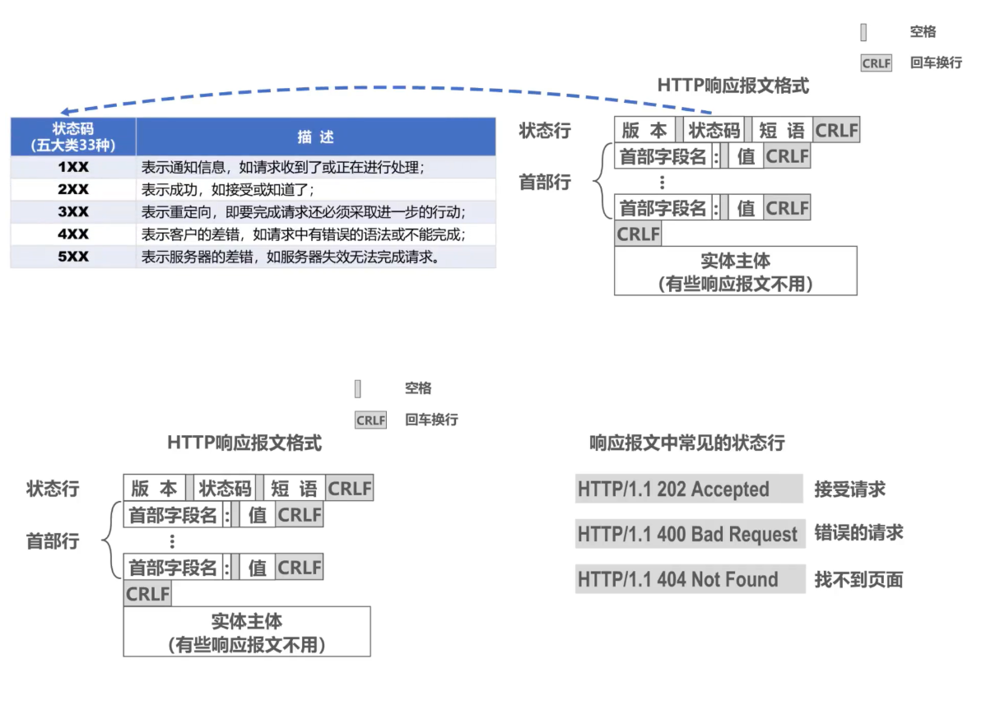

# HTTP 详解

> 参考资料：
>
> - 《图解 HTTP》
> - 《图解网络》小林coding


[toc]


# 一 、基本概念


## 1. HTTP 基本概念

HTTP（HyperText Transfer Protocol，超文本传输协议）是一个在计算机世界里专门在「两点」之间**「传输」**文字、图片、音频、视频等「超文本」数据的「约定和规范」。


## 2. URI 和 URL

- URI（Uniform Resource Indentifier，统一资源标识符）：可以唯一标识一个资源。
- URL（Uniform Resource Locator，统一资源定位符）：可以提供该资源的路径。它是一种具体的 URI，即 URL 可以用来标识一个资源，而且还指明了如何 locate（定位）这个资源。 
- URN（Uniform Resource Name，统一资源名称），例如 urn:isbn:0-486-27557-4 。

URI 包含 URL 和 URN，目前 WEB 只有 URL 比较流行，所以见到的基本都是 URL。URI 用字符串标识某一互联网资源，而 URL表示资源的地点（互联网上所处的位置）。可见 **URL 是 URI 的子集**。 


## 3. 请求和响应报文

HTTP 报文大致可分为**报文首部**和**报文主体**两块。两者由最初出现的空行（CR+LF）来划分。通常，并不一定要有报文主体。 

### 1. 请求报文

 

### 2. 响应报文

 


# 二、HTTP 方法

客户端发送的 **请求报文** 第一行为请求行，包含了方法字段。


## GET

> 请求从服务器获取资源

当前网络请求中，绝大部分使用的是 GET 方法。比如：在浏览器打开一篇文章，浏览器就会发送 GET 请求给服务器，服务器就会返回文章的所有文字及资源。


## POST

> 传输实体主体：向 URI 指定的资源提交数据，数据就放在报文的 body 里

**POST 主要目的不是获取资源，而是传输存储在内容实体（body）中的数据。**

比如：在文章底部，敲入了留言后点击「提交」，浏览器就会执行一次 POST 请求，把留言信息放进了报文 body 里，然后拼接好 POST 请求头，通过 TCP 协议发送给服务器。


### GET 和 POST 的区别

**1. 传参方式**

GET 和 POST 的请求都能使用额外的参数，但是 **GET 的参数是以查询字符串出现在 URL 中**，而 **POST 的参数存储在内容实体**。所以 GET 有长度限制，而 POST 数据大小无限制。

```properties
GET /test/demo_form.asp?name1=value1&name2=value2 HTTP/1.1
```

```properties
POST /test/demo_form.asp HTTP/1.1
Host: w3schools.com
name1=value1&name2=value2
```

GET 的传参方式相比于 POST 安全性较差，因为 GET 传的参数在 URL 中是可见的，可能会泄露私密信息。并且 **GET 只支持 ASCII 字符**，如果参数为中文则可能会出现乱码，而 **POST 支持标准字符集**。

**2. 安全幂等**

> - 安全：请求方法不会「破坏」服务器上的资源。
> - 幂等：多次执行相同的操作，结果都是「相同」的。

GET 方法是**安全幂等**的，因为它是**只读**操作，无论操作多少次，服务器上的数据都是安全的，且每次结果都是相同的。

POST 因为是新增或提交数据等操作，会修改服务器上的资源，所以是**不安全**的；且多次提交数据就会创建多个资源，所以是**不幂等**的。

**3. 发送**

使用 GET 方法，浏览器会把 **HTTP Header 和 Data 一并发送**出去，服务器响应 200（OK）并返回数据。而使用 POST 方法，浏览器**先发送 Header**，服务器响应 100（Continue）之后，浏览器**再发送 Data**，最后服务器响应 200（OK）并返回数据。


## HEAD

> 获取报文首部

和 GET 方法一样，但是**不返回报文实体主体部分**。

主要用于确认 URL 的有效性以及资源更新的日期时间等。

## PUT

> 上传文件

由于自身不带验证机制，任何人都可以上传文件，因此存在安全性问题，一般不使用该方法。

```properties
PUT /new.html HTTP/1.1
Host: example.com
Content-type: text/html
Content-length: 16
<p>New File</p>
```

## PATCH

> 对资源进行部分修改

PUT 也可以用于修改资源，但是只能完全替代原始资源，PATCH 允许部分修改。

```properties
PATCH /file.txt HTTP/1.1
Host: www.example.com
Content-Type: application/example
If-Match: "e0023aa4e"
Content-Length: 100
[description of changes]
```

## DELETE

> 删除文件

与 PUT 功能相反，并且同样不带验证机制。

```properties
DELETE /file.html HTTP/1.1
```

## OPTIONS

> 查询支持的方法

查询指定的 URL 能够支持的方法。

会返回 `Allow: GET, POST, HEAD, OPTIONS` 这样的内容。

## CONNECT

> 要求用隧道协议连接代理

要求在与代理服务器通信时建立隧道，使用 SSL（Secure Sokets Layer，安全套接字）和 TLS（Transport Layer Security，传输层安全）协议把通信内容加密后经网络隧道传输。

```properties
CONNECT www.example.com:443 HTTP/1.1
```


## TRACE

> 追踪路径

服务器会将通信路径返回给客户端。

发送请求时，在 `Max-Forwards` 首部字段中填入数值，每经过一个服务器就会减 1，当数值为 0 时就停止传输。

通常不会使用 TRACE，并且它容易受到 XST 攻击（Cross-Site Tracing，跨站追踪），因此更不会去使用它。


# 三、HTTP 状态码

服务器返回的 **响应报文** 中第一行为状态行，包含了状态码以及原因短语，用来告知客户端请求的结果。

| 状态码 |               类别               |          原因短语          |
| :----: | :------------------------------: | :------------------------: |
|  1XX   |  Informational（信息性状态码）   |     接收的请求正在处理     |
|  2XX   |      Success（成功状态码）       |      请求正常处理完毕      |
|  3XX   |   Redirection（重定向状态码）    | 需要进行附加操作以完成请求 |
|  4XX   | Client Error（客户端错误状态码） |     服务器无法处理请求     |
|  5XX   | Server Error（服务器错误状态码） |     服务器处理请求出错     |

## 1XX 提示信息

`1XX`：属于**提示信息**，表示目前是协议处理中的中间状态，还需要后续的操作。实际中较少用。

## 2XX 成功

`2XX`：表示服务器**成功**处理了客户端的请求，也是我们最愿意看到的状态。

- **200 OK**：最常见的成功状态码，表示一切正常。如果是非 HEAD 请求，服务器返回的响应头都会有 body 

  数据。

- **204 No Content** ：请求已经成功处理，但是**返回的响应报文不包含实体的主体部分**。一般在只需要从客户端往服务器发送信息，而不需要返回数据时使用。

- **206 Partial Content** ：表示客户端进行了**范围请求**。返回的**响应报文 body 数据并不是资源的全部**，而是包含由 Content-Range 指定范围的实体内容。一般应用于 HTTP 分块下载或断点续传。

## 3XX 重定向

`3XX`：表示客户端请求的资源发生了变动，需要客户端用新的 URL 重新发送请求获取资源，也就是**重定向**。

- **301 Moved Permanently** ：永久重定向，说明请求的资源已经不存在了，需改用新的 URL 再次访问。
- **302 Found** ：临时性重定向，说明请求的资源还在，但暂时需要用另⼀个 URL 来访问。
  - 301 和 302 都会在响应头里使用字段 Location ，指明后续要跳转的 URL，浏览器会自动᯿定向新的 URL。
- **303 See Other** ：和 302 有着相同的功能，但是 303 明确要求客户端应该采用 GET 方法获取资源。
  - 注：虽然 HTTP 协议规定 301、302 状态下重定向时不允许把 POST 方法改成 GET 方法，但是大多数浏览器都会在 301、302 和 303 状态下的重定向把 POST 方法改成 GET 方法。
- **304 Not Modified** ：不具有跳转的含义，表示资源未修改，重定向已存在的缓冲文件，也称缓存重定向，用于缓存控制。
- **307 Temporary Redirect** ：临时重定向，与 302 的含义类似，但是 307 要求浏览器不会把重定向请求的 POST 方法改成 GET 方法。

## 4XX 客户端错误

`4XX`：表示客户端发送的**报文有误**，服务器无法处理，也就是错误码的含义。

- **400 Bad Request** ：请求报文中存在语法错误。
- **401 Unauthorized** ：该状态码表示发送的请求需要有认证信息（BASIC 认证、DIGEST 认证）。如果之前已进行过一次请求，则表示用户认证失败。
- **403 Forbidden** ：请求被拒绝，服务器端禁止访问资源，且没有必要给出拒绝的详细理由。
- **404 Not Found**：请求的资源在服务器上不存在或未找到，所以无法提供给客户端。

## 5XX 服务器错误

`5XX`：表示客户端请求报文正确，但是**服务器处理时内部发生了错误**，属于服务器端的错误码。

- **500 Internal Server Error** ：服务器正在执行请求时发生错误。
- **501 Not Implemented**：客户端请求的功能还不支持，类似“即将开业，敬请期待”的意思。
- **502 Bad Gateway**：通常是服务器作为网关或代理时返回的错误码，表示服务器自身工作正常，访问后端服务器发生了错误。
- **503 Service Unavilable** ：服务器暂时处于超负载或正在进行停机维护，现在无法处理请求。


# 四、HTTP 首部

有 4 种类型的首部字段：**通用首部字段**、**请求首部字段**、**响应首部字段**和**实体首部字段**。

各种首部字段及其含义如下（不需要全记，仅供查阅）：

## 通用首部字段

|    首部字段名     |                    说明                    |
| :---------------: | :----------------------------------------: |
|   Cache-Control   |               控制缓存的行为               |
|    Connection     | 控制不再转发给代理的首部字段、管理持久连接 |
|       Date        |             创建报文的日期时间             |
|      Pragma       |                  报文指令                  |
|      Trailer      |             报文末端的首部一览             |
| Transfer-Encoding |         指定报文主体的传输编码方式         |
|      Upgrade      |               升级为其他协议               |
|        Via        |            代理服务器的相关信息            |
|      Warning      |                  错误通知                  |


## 请求首部字段

|     首部字段名      |                      说明                       |
| :-----------------: | :---------------------------------------------: |
|       Accept        |            用户代理可处理的媒体类型             |
|   Accept-Charset    |                  优先的字符集                   |
|   Accept-Encoding   |                 优先的内容编码                  |
|   Accept-Language   |             优先的语言（自然语言）              |
|    Authorization    |                  Web 认证信息                   |
|       Expect        |              期待服务器的特定行为               |
|        From         |               用户的电子邮箱地址                |
|        Host         |               请求资源所在服务器                |
|      If-Match       |              比较实体标记（ETag）               |
|  If-Modified-Since  |               比较资源的更新时间                |
|    If-None-Match    |        比较实体标记（与 If-Match 相反）         |
|      If-Range       |      资源未更新时发送实体 Byte 的范围请求       |
| If-Unmodified-Since | 比较资源的更新时间（与 If-Modified-Since 相反） |
|    Max-Forwards     |                 最大传输逐跳数                  |
| Proxy-Authorization |         代理服务器要求客户端的认证信息          |
|        Range        |               实体的字节范围请求                |
|       Referer       |            对请求中 URI 的原始获取方            |
|         TE          |                传输编码的优先级                 |
|     User-Agent      |              HTTP 客户端程序的信息              |


## 响应首部字段

|     首部字段名     |             说明             |
| :----------------: | :--------------------------: |
|   Accept-Ranges    |     是否接受字节范围请求     |
|        Age         |     推算资源创建经过时间     |
|        ETag        |        资源的匹配信息        |
|      Location      |   令客户端重定向至指定 URI   |
| Proxy-Authenticate | 代理服务器对客户端的认证信息 |
|    Retry-After     |   对再次发起请求的时机要求   |
|       Server       |    HTTP 服务器的安装信息     |
|        Vary        |   代理服务器缓存的管理信息   |
|  WWW-Authenticate  |   服务器对客户端的认证信息   |


## 实体首部字段

|    首部字段名    |          说明          |
| :--------------: | :--------------------: |
|      Allow       | 资源可支持的 HTTP 方法 |
| Content-Encoding | 实体主体适用的编码方式 |
| Content-Language |   实体主体的自然语言   |
|  Content-Length  |     实体主体的大小     |
| Content-Location |   替代对应资源的 URI   |
|   Content-MD5    |   实体主体的报文摘要   |
|  Content-Range   |   实体主体的位置范围   |
|   Content-Type   |   实体主体的媒体类型   |
|     Expires      | 实体主体过期的日期时间 |
|  Last-Modified   | 资源的最后修改日期时间 |


## HTTP 常见的字段

### Host

客户端发送请求时，用来指定服务器的域名。

有了 `Host` 字段，就可以将请求发往**同一台**服务器上的不同网站。


### Content-Length

服务器在返回数据时，会有 `Content-Length` 字段，表明本次回应的数据长度。

如下就是告诉浏览器，本次服务器回应的数据长度是 1000 个字节，后面的字节就属于下一个回应了。


### Connection

`Connection` 字段最常用于客户端要求服务器使用 **TCP 持久连接**，以便其他请求复用。


HTTP/1.1 版本的默认连接都是持久连接，但为了兼容老版本的 HTTP，需要指定 `Connection` 首部字段的值为 `Keep-Alive` 。

```properties
Connection: keep-alive
```

⼀个可以复用的 TCP 连接就建立了，直到客户端或服务器主动关闭连接。但是，这不是标准字段。


### Content-Type

`Content-Type` 字段用于服务器回应时，告诉客户端，本次数据是什么格式。


```properties
Content-Type: text/html; charset=utf-8
```

上面的类型表明，发送的是网页，而且编码是UTF-8。

客户端请求的时候，可以使用 `Accept` 字段声明自己可以接受哪些数据格式：

```properties
Accept: */*
```

上面代码中，客户端声明自己可以接受任何格式的数据。


### Content-Encoding

`Content-Encoding` 字段说明数据的压缩方法。表示服务器返回的数据使用了什么压缩格式。


```properties
Content-Encoding: gzip
```

上面表示服务器返回的数据采用了 gzip 方式压缩，告知客户端需要用此方式解压。 

客户端在请求时，用 `Accept-Encoding` 字段说明自己可以接受哪些压缩方法：

```properties
Accept-Encoding: gzip, deflate
```


# 五、HTTP 特性

> 注意这里的一些特性是随着 HTTP 版本迭代更新的。

## 1. 无状态协议

HTTP 是一种不保存状态，即无状态（stateless）协议。**HTTP 协议自身不对请求和响应之间的通信状态进行保存**。也就是说在 HTTP 这个级别，协议**对于发送过的请求或响应都不做持久化处理**。 

无状态（服务器不维护关于客户的任何信息）的优缺点：

- 优点：不需要额外的资源来记录状态信息，这能减轻服务器的负担，能够把更多的 CPU 和内存用来对外提供服务。

- 缺点：既然服务器没有记忆能力，它在完成有关联性的操作时会非常麻烦。

  例如 `登录->添加购物车->下单->结算->支付`，这系列操作都要知道用户的身份才行。但服务器不知道这些请求是有关联的，每次都要询问一遍身份信息。

对于无状态的问题，一般都采用 **Cookie** 技术来解决：

`Cookie` 是一种对无状态的 HTTP 进行**状态化**的技术，**通过在请求和响应报文中写入 Cookie 信息来控制客户端的状态**。具体做法如下：

- Cookie 会根据从服务器端发送的响应报文内的一个叫做 Set-Cookie 的首部字段信息，通知客户端保存 Cookie。当下次客户端再往该服务器发送请求时，客户端会自动在请求报文中加入 Cookie 值后发送出去。
- 服务器端发现客户端发送过来的 Cookie 后，会去检查究竟是从哪一个客户端发来的连接请求，然后对比服务器上的记录，最后得到之前的状态信息。 

相当于，在客户端第一次请求后，服务器会下发一个装有客户信息的“令牌”，后续客户端请求服务器的时候，带上“令牌”，服务器就能认得客户端了。


## 2. 持久连接

早期 **HTTP/1.0** 性能上存在⼀个很大的问题，那就是**非持久连接**，具体表现为**每发起一个请求，都要新建一次 TCP 连接（三次握手），而且是串行请求，在客户端收到响应后就立即关闭连接**。做了无谓的 TCP 连接建立和断开，增加了通信开销。 

为了解决上述 TCP 连接问题，**HTTP/1.1** 提出了**持久连接**（也称持续连接、长连接）的通信方式，**在客户端收到响应后仍然保持与服务器的连接，使得同一个客户和服务器可以继续在这条连接上传送后续的 HTTP 请求报文和响应报文**。这种方式的好处在于只需要建立一次 TCP 连接就能进行多次 HTTP 通信，减少了 TCP 连接的重复建立和断开所造成的额外开销，减轻了服务器端的负载。


持久连接需要使用 `Connection` 首部字段进行管理。HTTP/1.1 开始 HTTP 默认是持久化连接的，如果要断开 TCP 连接，需要由客户端或者服务器端提出断开，使用 `Connection : close`；而在 HTTP/1.1 之前默认是非持久化连接的，如果要维持持续连接，需要使用 `Connection : Keep-Alive`。

> TCP中 的 keepalive 是用来保鲜、保活的；HTTP中的 keep-alive 机制主要为了让支撑它的 TCP 连接活的的更久，所以通常又叫做：HTTP persistent connection（持久连接） 


## 3. 管线化传输

HTTP/1.1 采用了持久连接的方式，这使得多数请求以**管线化**（pipelining）方式发送成为可能。

从前发送请求后需等待并收到响应，才能发送下一个请求。管线化即可在同一个 TCP 连接里面，客户端可以发起多个请求，只要第一个请求发出去了，不必等待响应回来，就可以发第二个请求出去，可以**减少整体的响应时间**。 


比如，当请求一个包含 10 张图片的 HTMLWeb 页面，与挨个连接（非持久连接）相比，用持久连接可以让请求更快结束。而管线化技术则比持久连接还要快。请求数越多，时间差就越明显。


但是服务器还是按照顺序，先回应 A 请求，完成后再回应 B 请求。要是前面的回应特别慢，后面就会有许多请求排队等着。这称为「队头堵塞」。


## 4. 队头阻塞

「请求 - 应答」的模式加剧了 HTTP 的性能问题。 

因为当顺序发送的请求序列中的一个请求因为某种原因被阻塞时，在后面排队的所有请求也一同被阻塞了，会招致客户端一直请求不到数据，这也就是「队头阻塞」。好比上班的路上塞车。


# 六、具体应用

## Cookie

HTTP 协议是无状态的，主要是为了让 HTTP 协议尽可能简单，使得它能够处理大量事务。HTTP/1.1 引入 Cookie 来保存状态信息。

**Cookie 是服务器发送给客户端的数据，该数据会被保存在浏览器中，并且客户端的下一次请求报文会包含该数据。通过 Cookie 可以让服务器知道两个请求是否来自于同一个客户端，从而实现保持登录状态等功能。**

### 1. 创建过程

服务器发送的响应报文包含 `Set-Cookie` 字段，客户端得到响应报文后把 Cookie 内容保存到浏览器中。

```properties
HTTP/1.0 200 OK
Content-type: text/html
Set-Cookie: yummy_cookie=choco
Set-Cookie: tasty_cookie=strawberry
[page content]
```

客户端之后发送请求时，会从浏览器中读出 Cookie 值，在请求报文中包含 Cookie 字段。

```properties
GET /sample_page.html HTTP/1.1
Host: www.example.org
Cookie: yummy_cookie=choco; tasty_cookie=strawberry
```


### 2. Set-Cookie

```properties
Set-Cookie: status=enable; expires=Tue, 05 Jul 2011 07:26:31
```

当服务器准备开始管理客户端的状态时，会事先告知各种信息。 

Set-Cookie 字段的属性：

|     属性     | 说明                                                         |
| :----------: | ------------------------------------------------------------ |
|  NAME=VALUE  | 赋予 Cookie 的名称和其值（必需项）                           |
| expires=DATE | Cookie 的有效期（若不明确指定则默认为浏览器关闭前为止）      |
|  path=PATH   | 将服务器上的文件目录作为 Cookie 的适用对象（若不指定则默认为文档所在的文件目录） |
| domain=域名  | 作为 Cookie 适用对象的域名（若不指定则默认为创建 Cookie 的服务器的域名） |
|    Secure    | 仅在 HTTPs 安全通信时才会发送 Cookie                         |
|   HttpOnly   | 加以限制，使 Cookie 不能被 JavaScript 脚本访问               |


### 3. Session 和 Cookie

#### (1) 什么是 Session？

除了可以将用户信息通过 Cookie 存储在用户浏览器中，也可以利用 **Session 存储在服务器端**，存储在服务器端的信息**更加安全**。Session 可以存储在服务器上的文件、数据库或者内存中。也可以将 Session 存储在 Redis 这种内存型数据库中，效率会更高。

Session 是服务器用来跟踪用户的一种手段，每个 Session 都有一个唯一标识：`Session ID`。当服务器创建了一个 Session 时，给客户端发送的响应报文包含了 `Set-Cookie` 字段，其中有一个名为 `sid` 的键值对，这个键值对就是 `Session ID`。客户端收到后就把 Cookie 保存在浏览器中，并且之后发送的请求报文都包含 `Session ID`。HTTP 就是通过 Session 和 Cookie 这两种方式一起合作来实现跟踪用户状态的，**Session 用于服务器端，Cookie 用于客户端（浏览器端）。**


#### (2) Session 的使用过程（举例）

1. 用户进行登录时，用户提交包含用户名和密码的表单，放入 HTTP 请求报文中；
2. 服务器验证该用户名和密码，如果正确则把用户信息存储到 Redis 中（也可存储在服务器上的文件、数据库或者内存中），它在 Redis 中的 Key 称为 Session ID；
3. 服务器返回的**响应报文的 Set-Cookie 首部字段包含了这个 Session ID**，客户端收到响应报文之后将该 Cookie 值存入浏览器中；
4. 客户端之后对同一个服务器进行请求时会包含该 Cookie 值，服务器收到之后提取出 Session ID，从 Redis 中取出用户信息，继续之前的业务操作。


#### (3) Session 和 Cookie 适用场景选择

- Cookie 只能存储 ASCII 码字符串，而 Session 则可以存储任何类型的数据，因此在考虑数据复杂性时首选 Session；
- Cookie 存储在浏览器中，容易被恶意查看。如果非要将一些隐私数据存在 Cookie 中，可以将 Cookie 值进行加密，然后在服务器进行解密；
- 对于大型网站，如果用户所有的信息都存储在 Session 中，那么开销是非常大的，因此不建议将所有的用户信息都存储到 Session 中。


#### (4) Session 和 Cookie 的区别

Cookie 和 Session 都是客户端与服务器之间保持状态的解决方案：

1. 存储的位置不同：Cookie 存放在客户端，Session 存放在服务端。Session 存储的数据比较安全。
2. 存储的数据类型不同：两者都是 `key-value` 的结构，但针对 value 的类型是有差异的。cookie：value只能是字符串类型；session：value 是 Object 类型。
3. 存储的数据大小限制不同：Cookie 大小受浏览器的限制，很多是 4K 的大小；Session 理论上受当前内存的限制。
4. 生命周期的控制：Cookie 的生命周期是累计的，从创建时就开始计时，20分钟后，Cookie 生命周期结束；Session 的生命周期是间隔的，从创建时开始计时，如在20分钟内没有访问 Session，那么 Session 就被销毁。


### 4. 浏览器禁用 Cookie 的情况

会使用 URL 重写机制，在 URL 后面加上 `sid=xxx` 。

### 5. 使用 Cookie 实现用户名和密码的自动填写

网站脚本会自动从保存在浏览器中的 Cookie 读取用户名和密码，从而实现自动填写。


## 缓存

### 1. 优点

1. 降低服务器的负担；
2. 提高响应速度（缓存资源比服务器上的资源离客户端更近）。

### 2. 实现方法

1. 让代理服务器进行缓存；
2. 让客户端浏览器进行缓存。

### 3. Cache-Control 字段


HTTP 通过 `Cache-Control` 首部字段来操作缓存的工作机制。指令的参数是可选的，多个指令之间通过“,”分隔。

```properties
Cache-Control: private, max-age=0, no-cache
```


可用的指令按请求和响应分类如下所示：


### 4. 表示是否能缓存的指令

#### public 指令 

```properties
Cache-Control: public 
```

当指定使用 public 指令时，则明确表明其他用户也可利用缓存。


#### private 指令 


```properties
Cache-Control: private 
```

当指定 private 指令后，响应只以特定的用户作为对象，这与 public 指令的行为相反。 

缓存服务器会对该特定用户提供资源缓存的服务，对于其他用户发送过来的请求，代理服务器则不会返回缓存。 

 

#### no-cache 指令

使用 no-cache 指令的目的是为了**防止从缓存中返回过期的资源**。 

>从字面意思上很容易把 no-cache 误解成为不缓存，但事实上 no-cache 代表不缓存过期的资源，缓存会向源服务器进行有效期确认后处理资源。即 “先验证，再缓存” 。


```properties
Cache-Control: no-cache
```

该指令出现在请求报文的 Cache-Control 字段中，表示客户端将不会接收缓存过的响应。于是，“中间”的缓存服务器必须把客户端请求转发给源服务器。

该指令出现在响应报文的 Cache-Control 字段中，表示缓存服务器不能对资源进行缓存。源服务器以后也将不再对缓存服务器请求中提出的资源有效性进行确认，且禁止其对响应资源进行缓存操作。 缓存服务器在进行缓存之前需要先验证缓存资源的有效性。


### 5. 控制可执行缓存的对象的指令

#### no-store 指令

```properties
Cache-Control: no-store
```

该指令暗示请求（和对应的响应）或响应中包含机密信息，表示缓存服务器不能对请求或响应的任何一部分进行缓存。

> no-cache 不表示不缓存，而是缓存之前需要先进行验证，no-store 才是不进行缓存。


### 6. 指定缓存期限和认证的指令

#### s-maxage 指令

```properties
Cache-Control: s-maxage=604800（单位 ：秒）
```

s-maxage 指令的功能和 max-age 指令的相同，它们的不同点是 s-maxage 指令只适用于供**多位用户**使用的公共缓存服务器（一般指代理）。也就是说，对于向同一用户重复返回响应的服务器来说，这个指令没有任何作用。

>当使用 s-maxage 指令后，则直接忽略对 Expires 首部字段及 max-age 指令的处理。 

#### max-age 指令


```properties
Cache-Control: max-age=604800（单位：秒）
```

该指令出现在请求报文的 Cache-Control 字段中，如果缓存资源的缓存时间小于该指令指定的时间，那么就能接受该缓存。当指定 max-age 值为 0，那么缓存服务器通常需要将请求转发给源服务器。

该指令出现在响应报文的 Cache-Control 字段中，表示缓存资源在缓存服务器中保存的时间。

> Expires 字段也可以用于告知缓存服务器该资源什么时候会过期。在 HTTP/1.1 中，会优先处理 Cache-Control : max-age 指令；而在 HTTP/1.0 中，Cache-Control : max-age 指令会被忽略掉。


## 编码

```properties
Content-Encoding: gzip
```

首部字段 `Content-Encoding` 会告知客户端和服务器对实体的主体部分选用的内容编码方式。内容编码（Encoding）是指在不丢失实体信息的前提下所进行的压缩。常用的编码有：`gzip`、`compress`、`deflate`、`identity`，其中 `identity` 表示不执行压缩的编码格式。


## 分块传输

分块传输（Chunked Transfer Coding）可以把数据分割成多块，让浏览器逐步显示页面。


## 多部分对象集合

一份报文主体内可含有多种类型的实体同时发送，每个部分之间用 boundary 字段定义的分隔符进行分隔，每个部分都可以有首部字段。

例如，上传多个表单时可以使用如下方式：

```properties
Content-Type: multipart/form-data; boundary=AaB03x
--AaB03x
Content-Disposition: form-data; name="submit-name"
Larry
--AaB03x
Content-Disposition: form-data; name="files"; filename="file1.txt"
Content-Type: text/plain
... contents of file1.txt ...
--AaB03x--
```


## 范围请求

如果网络出现中断，服务器只发送了一部分数据，范围请求使得客户端能够只请求未发送的那部分数据，从而避免服务器端重新发送所有数据。

在请求报文首部中添加 Range 字段，然后指定请求的范围，例如 `Range:bytes=5001-10000`。请求成功的话服务器发送 206 Partial Content 状态。

```properties
GET /z4d4kWk.jpg HTTP/1.1
Host: i.imgur.com
Range: bytes=0-1023
```

```properties
HTTP/1.1 206 Partial Content
Content-Range: bytes 0-1023/146515
Content-Length: 1024
...
(binary content)
```


## 内容协商

通过内容协商返回最合适的内容，例如根据浏览器的默认语言选择返回中文界面还是英文界面。

涉及以下首部字段：Accept、Accept-Charset、Accept-Encoding、Accept-Language、Content-Language。


## 虚拟主机

一台 Web 服务器可搭建多个独立域名的 Web 网站，也可作为通信路径上的中转服务器提升传输效率。 

使用虚拟主机技术，**使得一台服务器拥有多个域名，并且在逻辑上可以看成多个服务器**。

在相同的 IP 地址下，由于虚拟主机可以寄存多个不同主机名和域名的 Web 网站，因此在发送 HTTP 请求时，必须在 Host 首部内完整指定主机名或域名的 URI。 


## 通信数据转发

### 1. 代理

代理服务器接受客户端的请求，并且转发给其它服务器。

使用代理的主要目的是：**缓存、网络访问控制以及访问日志记录**。

代理服务器分为正向代理和反向代理两种，用户察觉得到正向代理的存在，而反向代理一般位于内部网络中，用户察觉不到。

正向代理：


反向代理：


### 2. 网关

网关是转发其他服务器通信数据的服务器，接收从客户端发送来的请求时，它就像自己拥有资源的源服务器一样对请求进行处理。与代理服务器不同的是，网关服务器会将 HTTP 转化为其它协议进行通信，从而请求其它非 HTTP 服务器的服务。


### 3. 隧道

使用 SSL 等加密手段，为客户端和服务器之间建立一条安全的通信线路。


# 七、HTTPS

HTTP 有以下安全性问题：

1. 使用明文进行通信，内容可能会被**窃听**；
2. 不验证通信方的身份，通信方的身份有可能遭遇**伪装**；
3. 无法证明报文的完整性，报文有可能遭**篡改**。


HTTP**S** 在 HTTP 与 TCP 层之间加入了 `SSL/TLS` 协议，可以很好的解决上述的风险。HTTP 先和 SSL（Secure Socket Layer）通信，再由 SSL 和 TCP 通信。通过使用 SSL，HTTPS 提供了**加密**（防窃听）、**认证**（防伪装）和**完整性**（防篡改）保护。默认端口号是 443。 


## 加密

通过**混合加密**的方式可以保证信息的机密性，解决了明文通信下信息被窃听的风险。

### 1. 对称加密

（Symmetric-Key Encryption），加密的加密和解密使用同一密钥。

- 优点：运算速度快；
- 缺点：密钥容易被获取。


### 2. 非对称加密

（Public-Key Encryption），使用一对密钥用于加密和解密，分别为公开密钥和私有密钥。公开密钥所有人都可以获得，通信发送方获得接收方的公开密钥之后，就可以使用公开密钥进行加密，接收方收到通信内容后使用私有密钥解密。

- 优点：更为安全；
- 缺点：运算速度慢。


### 3. HTTPS 采用的加密方式

HTTPS 采用的是对称加密和非对称加密结合的「混合加密」机制：

- 在通信建立前采用**非对称加密**的方式交换「会话秘钥」，后续就不再使用非对称加密。 
- 在通信过程中全部使用**对称加密**的「会话秘钥」的方式加密明文数据。


采用「混合加密」的方式的原因： 

- **对称加密**只使用一个密钥，运算速度快，密钥必须保密，无法做到安全的密钥交换。 
- **非对称加密**使用两个密钥：公钥和私钥，公钥可以任意分发而私钥保密，解决了密钥交换问题但速度慢。


## 认证

通过使用 **数字证书** 来对通信方进行认证。需要借助第三方权威机构 `CA`（数字证书认证机构），将服务器公钥放在数字证书（由数字证书认证机构颁发）中，只要证书是可信的，公钥就是可信的。通过数字证书的方式保证服务器公钥的身份，解决冒充的风险。


数字证书认证机构（CA，Certificate Authority）是客户端与服务器双方都可信赖的第三方机构。服务器的运营人员向 CA 提出公开密钥的申请，CA 在判明提出申请者的身份之后，会对已申请的公开密钥做数字签名，然后分配这个已签名的公开密钥，并将该公开密钥放入公开密钥数字证书后绑定在一起。

进行 HTTPS 通信时，服务器会把证书发送给客户端，客户端取得其中的公开密钥之后，先进行验证，如果验证通过，就可以开始通信。

> 使用 OpenSSL 这套开源程序，每个人都可以构建一套属于自己的认证机构，从而自己给自己颁发服务器证书。浏览器在访问该服务器时，会显示“无法确认连接安全性”或“该网站的安全证书存在问题”等警告消息。


## 完整性

**「摘要算法」**用来实现**完整性**，能够为数据生成独一无二的「指纹」，用于校验数据的完整性，解决了篡改的风险。


客户端在发送明文之前会通过摘要算法算出明文的「指纹」，发送的时候把「指纹 + 明文」一同加密成密文后，发送给服务器，服务器解密后，用相同的摘要算法算出发送过来的明文，通过把客户端携带的「指纹」和当前算出的「指纹」做比较，若「指纹」相同，说明数据是完整的。


## HTTP 和 HTTPS 的区别

1. **端口不同**：HTTP使用的是 80 端口，HTTPS使用 443 端口；
2. **URL 前缀不同**：HTTP 的 URL 前缀是 `http://`，HTTPS 的 URL 前缀是 `https://`；
3. HTTP（超文本传输协议）信息是**明文传输**，HTTPS 运行在 SSL(Secure Socket Layer) 之上，添加了**加密和认证**机制，更加安全；
4. HTTPS 由于加密解密会带来更大的 CPU 和内存**开销**；
5. HTTPS 通信需要**证书**，一般需要向证书颁发机构（CA）购买。


## HTTPS 是如何建立连接的？SSL/TLS 的握手流程？

1. 客户端向服务器发送请求，同时发送客户端支持的一套加密规则（包括对称加密、非对称加密、摘要算法）；
2. 服务器从中选出一组加密算法与 Hash 算法，并将自己的身份信息以证书的形式发回给浏览器。证书里面包含了网站地址，**加密公钥**（用于非对称加密），以及证书的颁发机构等信息（证书中的私钥只能用于服务器端进行解密）；
3. 客户端验证服务器的合法性，包括：证书是否过期，CA 是否可靠，发行者证书的公钥能否正确解开服务器证书的“发行者的数字签名”，服务器证书上的域名是否和服务器的实际域名相匹配；
4. 如果证书受信任，或者用户接收了不受信任的证书，浏览器会生成一个**随机密钥**（用于对称加密算法），并用服务器提供的公钥加密（采用非对称算法对密钥加密）；使用 Hash 算法对握手消息进行**摘要**计算，并对摘要使用之前产生的密钥加密（对称加密算法）；将加密后的随机密钥和摘要一起发送给服务器；
5. 服务器使用自己的私钥解密，得到对称加密的密钥，用这个密钥解密出 Hash 摘要值，并验证握手消息是否一致；如果一致，服务器使用对称加密的密钥加密握手消息发给浏览器；
6. 浏览器解密并验证摘要，若一致，则握手结束。之后的数据传送都使用对称加密的密钥进行加密。


# 八、Web 攻击技术

## 攻击模式

### 1. 主动攻击


直接攻击服务器，具有代表性的有 SQL 注入和 OS 命令注入。

### 2. 被动攻击


设下圈套，让用户发送有攻击代码的 HTTP 请求，那么用户发送了该 HTTP 请求之后就会泄露 Cookie 等个人信息，具有代表性的有跨站脚本攻击和跨站请求伪造。


## 跨站脚本攻击 XSS

### 1. 概念

（Cross-Site Scripting, XSS），可以将代码注入到用户浏览的网页上，这种代码包括 HTML 和 JavaScript。利用网页开发时留下的漏洞，通过巧妙的方法注入恶意指令代码到网页，使用户加载并执行攻击者恶意制造的网页程序。攻击成功后，攻击者可能得到更高的权限（如执行一些操作）、私密网页内容、会话和 Cookie 等各种内容。

### 2. 危害

- 伪造虚假的输入表单骗取个人信息
- 窃取用户的 Cookie 值
- 显示伪造的文章或者图片

### 3. 防范手段

（一）过滤特殊字符

许多语言都提供了对 HTML 的过滤：

- PHP 的 `htmlentities()` 或是 `htmlspecialchars()`。
- Python 的 `cgi.escape()`。
- Java 的 xssprotect (Open Source Library)。
- Node.js 的 node-validator。

（二）指定 HTTP 的 Content-Type

通过这种方式，可以避免内容被当成 HTML 解析，比如 PHP 语言可以使用以下代码：

```php
<?php
   header('Content-Type: text/javascript; charset=utf-8');
?>
```


## SQL 注入攻击

### 1. 概念

服务器上的数据库运行非法的 SQL 语句。

### 2. 攻击原理

例如一个网站登录验证的 SQL 查询代码为：

```properties
strSQL = "SELECT * FROM users WHERE (name = '" + userName + "') and (pw = '"+ passWord +"');"
```

如果填入以下内容：

```properties
userName = "1' OR '1'='1";
passWord = "1' OR '1'='1";
```

那么 SQL 查询字符串为：

```properties
strSQL = "SELECT * FROM users WHERE (name = '1' OR '1'='1') and (pw = '1' OR '1'='1');"
```

此时无需验证通过就能执行以下查询：

```properties
strSQL = "SELECT * FROM users;"
```

### 3. 危害

- 数据表中的数据外泄，例如个人机密数据，账户数据，密码等。
- 数据结构被黑客探知，得以做进一步攻击（例如 `SELECT * FROM sys.tables`）。
- 数据库服务器被攻击，系统管理员账户被窜改（例如 `ALTER LOGIN sa WITH PASSWORD=’xxxxxx’`）。
- 获取系统较高权限后，有可能得以在网页加入恶意链接、恶意代码以及 XSS 等。
- 经由数据库服务器提供的操作系统支持，让黑客得以修改或控制操作系统（例如 `xp_cmdshell “net stop iisadmin”` 可停止服务器的 IIS 服务）。
- 破坏硬盘数据，瘫痪全系统（例如 `xp_cmdshell “FORMAT C:”`）。

### 4. 防范手段

- 在设计应用程序时，完全使用参数化查询（Parameterized Query）来设计数据访问功能。
- 在组合 SQL 字符串时，先针对所传入的参数作字符取代（将单引号字符取代为连续 2 个单引号字符）。
- 如果使用 PHP 开发网页程序的话，亦可打开 PHP 的魔术引号（Magic quote）功能（自动将所有的网页传入参数，将单引号字符取代为连续 2 个单引号字符）。
- 其他，使用其他更安全的方式连接 SQL 数据库。例如已修正过 SQL 注入问题的数据库连接组件，例如 ASP.NET 的 SqlDataSource 对象或是 LINQ to SQL。
- 使用 SQL 防注入系统。


## 跨站点请求伪造 CSRF

### 1. 概念

（Cross-site request forgery，CSRF），是攻击者通过一些技术手段欺骗用户的浏览器去访问一个自己曾经认证过的网站并执行一些操作（如发邮件，发消息，甚至财产操作如转账和购买商品）。由于浏览器曾经认证过，所以被访问的网站会认为是真正的用户操作而去执行。这利用了 Web 中用户身份验证的一个漏洞：简单的身份验证只能保证请求发自某个用户的浏览器，却不能保证请求本身是用户自愿发出的。

XSS 利用的是用户对指定网站的信任，CSRF 利用的是网站对用户网页浏览器的信任。

假如一家银行用以执行转账操作的 URL 地址如下：`http://www.examplebank.com/withdraw?account=AccoutName&amount=1000&for=PayeeName`。

那么，一个恶意攻击者可以在另一个网站上放置如下代码：``。

如果有账户名为 Alice 的用户访问了恶意站点，而她之前刚访问过银行不久，登录信息尚未过期，那么她就会损失 1000 资金。

这种恶意的网址可以有很多种形式，藏身于网页中的许多地方。此外，攻击者也不需要控制放置恶意网址的网站。例如他可以将这种地址藏在论坛，博客等任何用户生成内容的网站中。这意味着如果服务器端没有合适的防御措施的话，用户即使访问熟悉的可信网站也有受攻击的危险。

透过例子能够看出，攻击者并不能通过 CSRF 攻击来直接获取用户的账户控制权，也不能直接窃取用户的任何信息。他们能做到的，是欺骗用户浏览器，让其以用户的名义执行操作。

### 2. 防范手段

（一）检查 Referer 字段

HTTP 头中有一个 Referer 字段，这个字段用以标明请求来源于哪个地址。在处理敏感数据请求时，通常来说，Referer 字段应和请求的地址位于同一域名下。

这种办法简单易行，工作量低，仅需要在关键访问处增加一步校验。但这种办法也有其局限性，因其完全依赖浏览器发送正确的 Referer 字段。虽然 HTTP 协议对此字段的内容有明确的规定，但并无法保证来访的浏览器的具体实现，亦无法保证浏览器没有安全漏洞影响到此字段。并且也存在攻击者攻击某些浏览器，篡改其 Referer 字段的可能。

（二）添加校验 Token

由于 CSRF 的本质在于攻击者欺骗用户去访问自己设置的地址，所以如果要求在访问敏感数据请求时，要求用户浏览器提供不保存在 cookie 中，并且攻击者无法伪造的数据作为校验，那么攻击者就无法再执行 CSRF 攻击。这种数据通常是表单中的一个数据项。服务器将其生成并附加在表单中，其内容是一个伪乱数。当客户端通过表单提交请求时，这个伪乱数也一并提交上去以供校验。正常的访问时，客户端浏览器能够正确得到并传回这个伪乱数，而通过 CSRF 传来的欺骗性攻击中，攻击者无从事先得知这个伪乱数的值，服务器端就会因为校验 token 的值为空或者错误，拒绝这个可疑请求。


## 拒绝服务攻击

### 1. 概念

（denial-of-service attack，DoS），亦称洪水攻击，其目的在于**使目标电脑的网络或系统资源耗尽，使服务暂时中断或停止，导致其正常用户无法访问**。

（distributed denial-of-service attack，**DDoS**），指攻击者使用网络上两个或以上被攻陷的电脑作为“僵尸”向特定的目标发动“拒绝服务”式攻击。

> [维基百科：拒绝服务攻击](https://zh.wikipedia.org/wiki/阻斷服務攻擊)


# 九、各版本比较

## HTTP/1.0 与 HTTP/1.1 的区别

- **连接方式**：HTTP/1.0 为短连接，HTTP/1.1 支持**长连接**。
- **状态响应码**：HTTP/1.1中新**加入了大量的状态码**，光是错误响应状态码就新增了24种。比如说，`100 (Continue)`——在请求大资源前的预热请求，`206 (Partial Content)`——范围请求的标识码，`409 (Conflict)`——请求与当前资源的规定冲突，`410 (Gone)`——资源已被永久转移，而且没有任何已知的转发地址。
- **缓存处理**：在 HTTP/1.0 中主要使用 header 里的 `If-Modified-Since`，`Expires` 来做为缓存判断的标准，HTTP/1.1 则引入了**更多的缓存处理字段**例如 `Entity tag`，`If-Unmodified-Since`，`If-Match`，`If-None-Match` 等更多可供选择的缓存头来控制缓存策略。
- **带宽优化及网络连接的使用**：HTTP/1.0 中，存在一些浪费带宽的现象，例如客户端只是需要某个对象的一部分，而服务器却将整个对象送过来了，并且不支持断点续传功能，HTTP/1.1 则提供了**范围请求功能**，在请求头引入了 range 头域，它允许只请求资源的某个部分，即返回码是 206（Partial Content），这样就方便了开发者自由的选择以便于充分利用带宽和连接。

- **Host 头处理**：HTTP/1.1 在请求头中加入了 `Host` 字段，提供了虚拟主机的功能，使得一台服务器拥有多个域名，并且在逻辑上可以看成多个服务器。


## HTTP/1.1 与 HTTP/2.0 的区别

### 1. 多路复用

HTTP/2.0 使用多路复用技术，使用同一个 TCP 连接来发送多个请求或回应，而且不用按照顺序一一对应 。

### 2. 首部压缩

HTTP/1.1 的首部带有大量信息，而且每次都要重复发送。HTTP/2.0 要求通讯双方各自缓存一份首部字段表，从而避免了重复传输。

### 3. 服务端推送

在客户端请求一个资源时，会把相关的资源一起发送给客户端，客户端就不需要再次发起请求了。例如客户端请求 index.html 页面，服务端就把 index.js 一起发给客户端。

### 4. 二进制格式

HTTP/1.1 的解析是基于文本的，而 HTTP/2.0 采用二进制格式，会将所有传输的信息分割为更小的消息和帧（frame），并对它们采用二进制格式的编码。 