# 计算机网络第5章（运输层）

# 5.1、运输层概述

## 概念

**进程之间的通信**

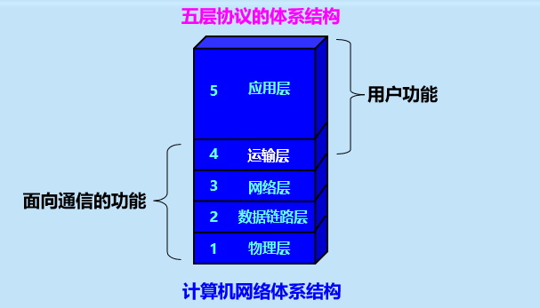

- 从通信和信息处理的角度看，运输层向它上面的应用层提供通信服务，**它属于面向通信部分的最高层，同时也是用户功能中的最低层**。
- 当网络的边缘部分中的两个主机使用网络的核心部分的功能进行端到端的通信时，**只有位于网络边缘部分的主机的协议栈才有运输层**，而网络核心部分中的路由器在转发分组时都只用到三层（到网络层）的功能。

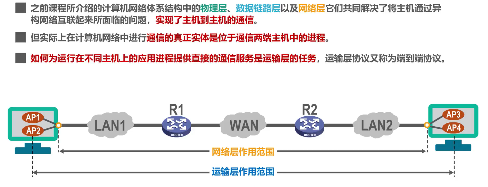

**进程之间通信流程**

“逻辑通信”是指运输层之间的通信好像是沿水平方向传送数据，但事实上，这两条数据并没有一条水平方向的物理连接，要传送的数据是沿着图中上下多次的虚线方向传送的

> 进程Ap1与Ap4之间进行基于网络的通信，进程Ap2与Ap3之间进行基于网络的通信
>
> 在运输层使用不同的端口，来对应不同的应用进程
>
> 然后通过网络层及其下层来传输应用层报文
>
> 接收方的运输层通过不同的端口，将收到的应用层报文，交付给应用层中相应的应用进程
>
> 这里端口并不是指看得见、摸得着的物理端口，而是指用来**区分不同应用进程的标识符**

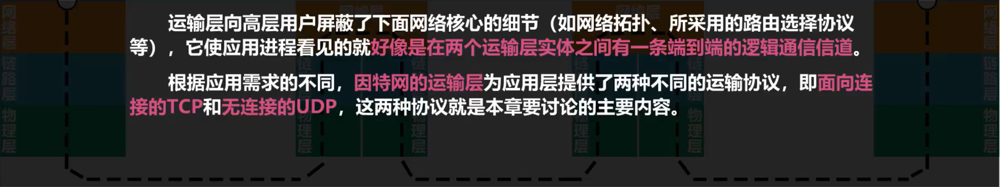

## 总结

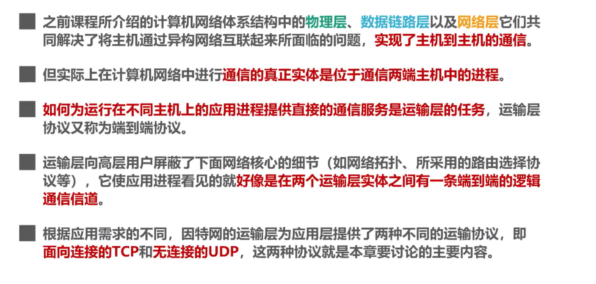

# 5.2、运输层端口号、复用与分用的概念

## 为什么用端口号

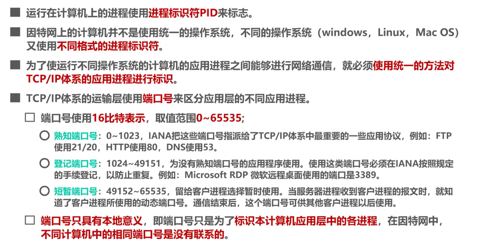

## 发送方的复用和接收方的分用

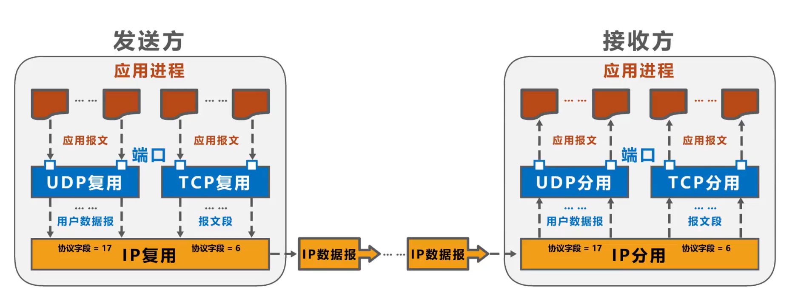

> **多个进程（这里一个端口表示一个进程）** 利用一个运输层协议（或者称为运输层接口）**发送**数据称为 **复用**
>
> **多个进程（这里一个端口表示一个进程）** 利用一个运输层协议（或者称为运输层接口）**接收**时叫做 **分用**。

## TCP/IP体系的应用层常用协议所使用的运输层熟知端口号

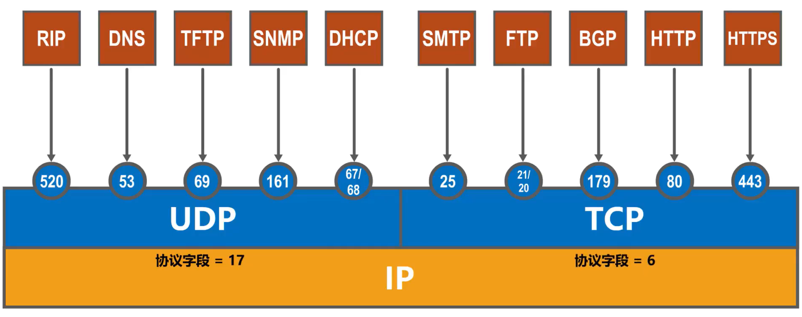

## 运输层传输流程（重点）

举例

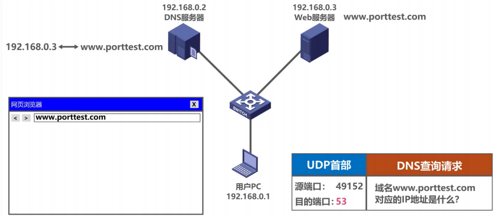

> 在浏览器输入域名，回车浏览
>
> 然后用户PC中的DNS客户端进程会发送一个DNS查询请求报文
>
> DNS查询请求报文需要使用运输层的UDP协议封装成UDP用户数据报
>
> 首部中的源端口字段的值，在短暂端口号49151~65535中挑选一个未被占用的，用来表示DNS客户端进程
>
> 首部中的目的端口字段的值：53，是DNS服务器端进程所使用的熟知端口号

> 之后，将UDP用户数据报封装在IP数据报中，通过以太网发送给DNS服务器

> DNS服务器收到该IP数据报后，从中解封出UDP用户数据报
>
> UDP首部中的目的端口号为53，这表明应将该UDP用户数据报的数据载荷部分，也就是DNS查询请求报文，交付给本服务器中的DNS服务器端进程
>
> DNS服务器端进程解析DNS查询请求报文的内容，然后按其要求查找对应的IP地址
>
> 之后，会给用户PC发送DNS响应报文，DNS响应报文需要使用运输层的UDP协议封装成UDP用户数据报
>
> 其首部中的源端口字段的值设置为熟知端口号53，表明这是DNS服务器端进程所发送的UDP用户数据报，目的端口的值设置为49152，这是之前用户PC中发送DNS查询请求报文的DNS客户端进程所使用的短暂端口号

> 将UDP用户数据报封装在IP数据报中，通过以太网发送给用户PC

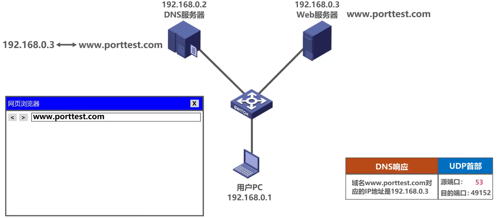

> 用户PC收到该数据报后，从中解封出UDP用户数据报
>
> UDP首部中的目的端口号为49152，这表明应将该UDP用户数据报的数据载荷部分，也就是DNS响应报文，交付给用户PC中的DNS客户端进程
>
> DNS客户端进程解析DNS响应报文的内容，就可知道自己之前所请求的Web服务器的域名对应的IP地址

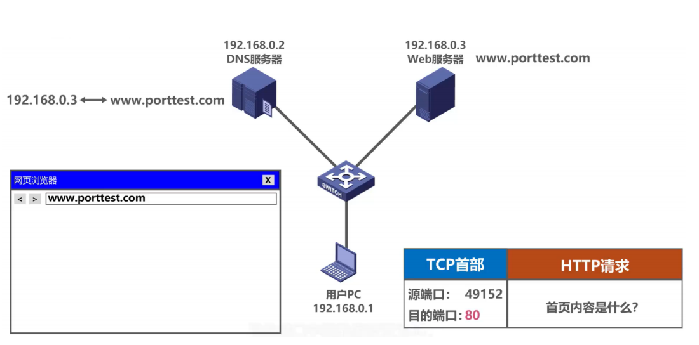

> 现在用户PC中的HTTP客户端进程可以向Web服务器发送HTTP请求报文，请求报文的内容为“首页内容是什么？”
>
> HTTP请求报文需要使用运输层的TCP协议封装成TCP报文段
>
> TCP首部中的源端口字段的值在短暂端口号49151~65535中挑选一个未被占用的（49152），用来表示HTTP客户端进程。目的端口字段的值设置为80，这是HTTP服务端进程所使用的熟知端口号。

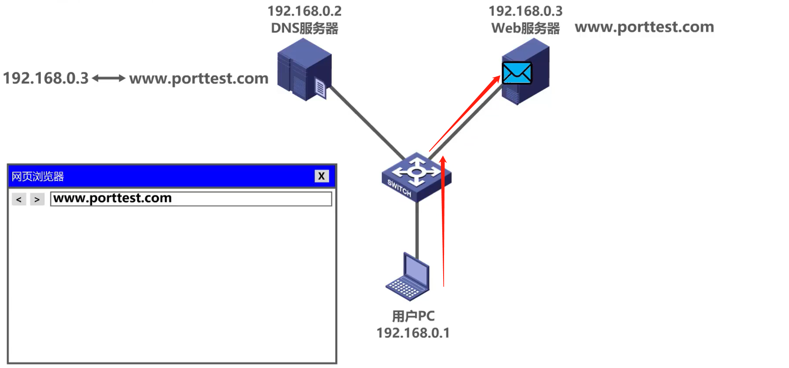

> 之后，将TCP报文段封装在IP数据报中，通过以太网发送给Web服务器。

> Web服务器收到该数据报后，从中解封出TCP报文段。
>
> TCP首部中的目的端口号为80，这表明应该将该TCP报文段的数据载荷部分（HTTP请求报文），交付给本服务器中的HTTP服务器端进程。
>
> HTTP服务端进程解析HTTP请求报文的内容，然后按其要求查找首页内容。
>
> 之后，会给用户PC发送HTTP响应报文，其内容是HTTP客户端所请求的首页内容。HTTP响应报文需要使用运输层的TCP协议封装成TCP报文段
>
> 其首部中的源端口字段的值设置为熟知端口号80，表明这是HTTP服务器端进程所发送的TCP报文段；目的端口字段的值设置为49152，这是之前用户PC中发送HTTP请求报文的HTTP客户端进程所使用的短暂端口号。

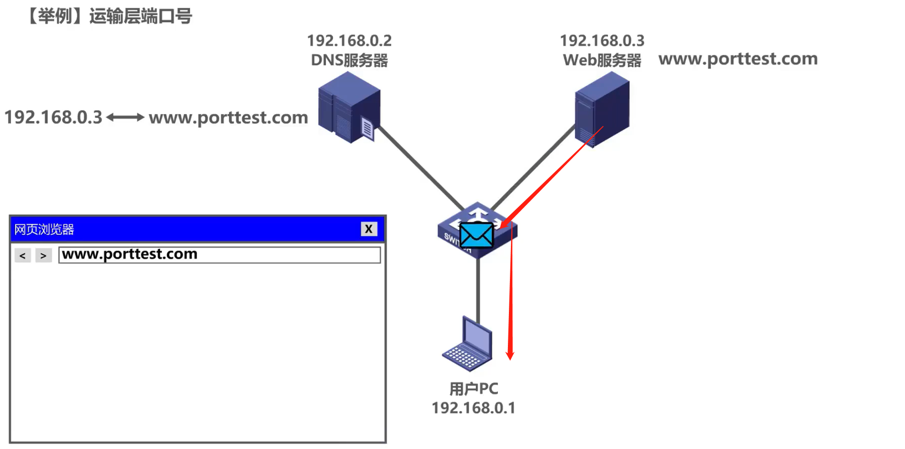

> 之后，将TCP报文段封装在IP数据报中通过以太网发送给用户PC。

> 用户PC收到该IP数据报后，从中解封出TCP报文段。
>
> TCP首部中的目的端口号为49152，这表明应该将该TCP报文段的数据载荷部分（HTTP响应报文），交付给用户PC中的HTTP客户端进程。
>
> HTTP客户端进程解析HTTP响应报文的内容，并在网页浏览器中进行显示。这样，就可以在网页浏览器中看到Web服务器所提供的首页内容了。

# 5.3、UDP和TCP的对比

## 概念

- **UDP** 和 **TCP** 是TCP/IP体系结构**运输层**中的两个重要协议
- 当运输层采用面向连接的 **TCP** 协议时，尽管下面的网络是不可靠的（只提供尽最大努力服务），但这种逻辑通信信道就相当于一条**全双工的可靠信道**。
- 当运输层采用无连接的 **UDP** 协议时，这种逻辑通信信道是一条**不可靠信道**。

可靠信道与不可靠信道

- 两个对等运输实体在通信时传送的数据单位叫作**运输协议数据单元** **TPDU** (Transport Protocol Data Unit)。
- TCP 传送的数据单位协议是 **TCP 报文段**(segment)。
- UDP 传送的数据单位协议是 **UDP 报文**或**用户数据报**。

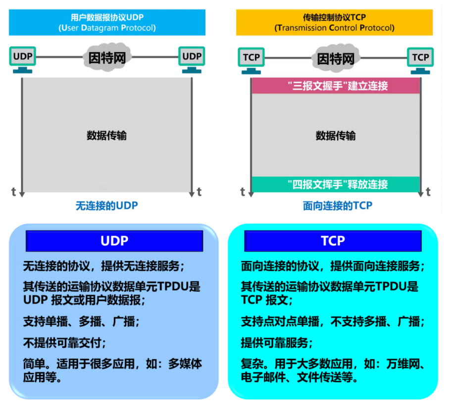

UDP的通信是无连接的，不需要套接字（Socket）

TCP是面向连接的，TCP之间的通信必须要在两个套接字（Socket）之间建立连接

## 用户数据报协议UDP（User Datagram Protocol）

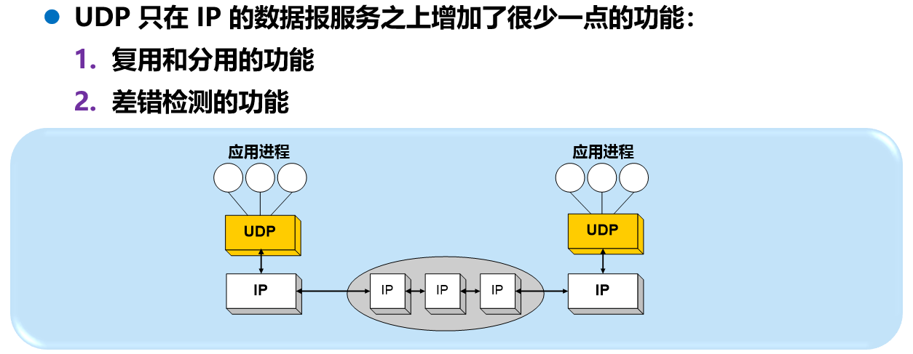

可以发送广播

可以向某个多播组发送多播

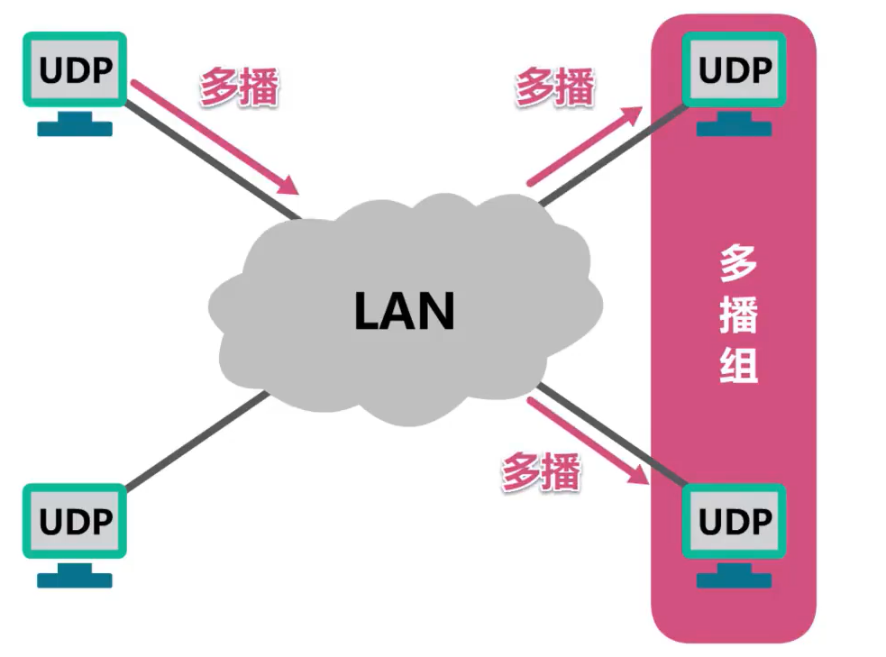

还可以发送单播

> UDP 支持单播、多播以及广播
>
> 换句话说，UDP支持一对一，一对多，以及一对全的通信

**运输过程**

> UDP对应用进程交下来的报文既不合并也不拆分，而是保留这些报文的边界
>
> 换句话说，**UDP是面向应用报文的**

**UDP向上层提供无连接不可靠传输服务**

**UDP结构**

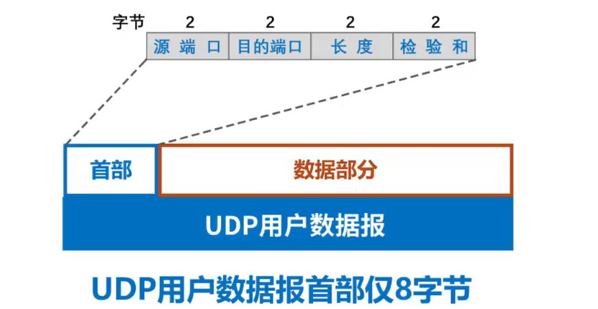

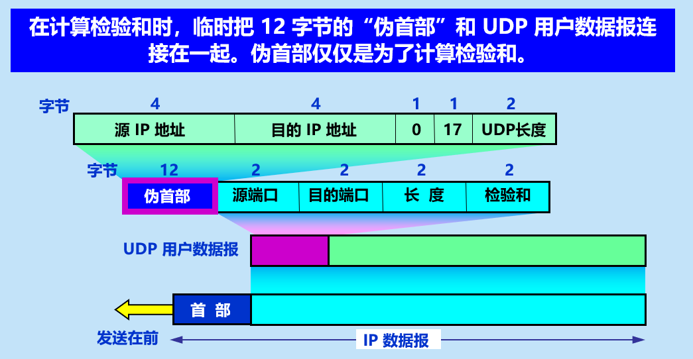

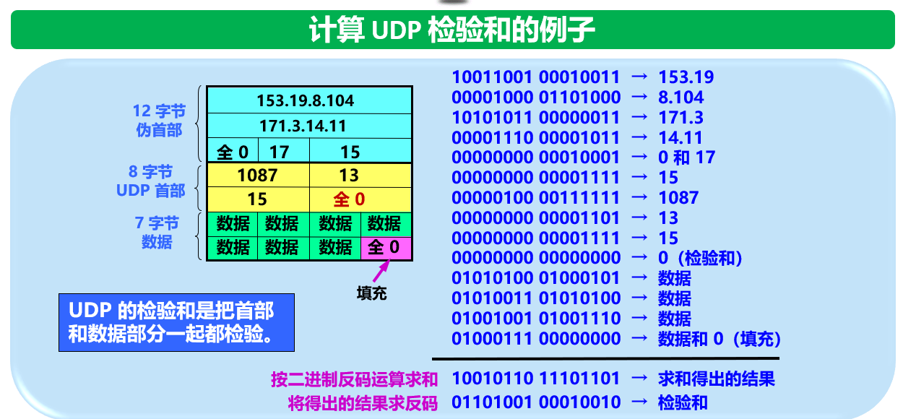

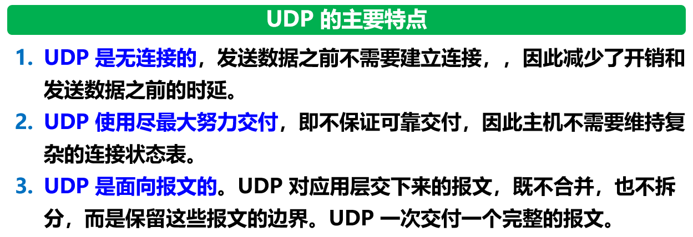

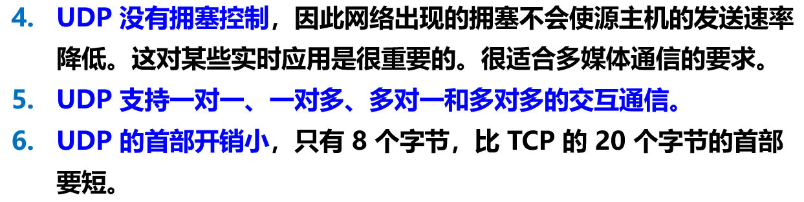

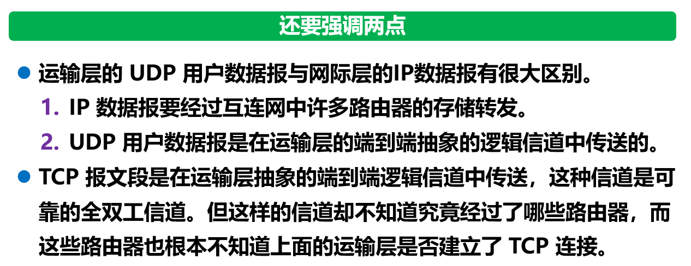

## 传输控制协议TCP（Transmission Control Protocol）

使用TCP协议的通信双方，在进行数据传输之前，必须使用“三报文握手”建立TCP连接

TCP连接建立成功后，通信双方之间就好像有一条可靠的通信信道，通信双方使用这条基于TCP连接的可靠信道进行通信

> 很显然，TCP仅支持单播，也就是一对一的通信

**运输过程**

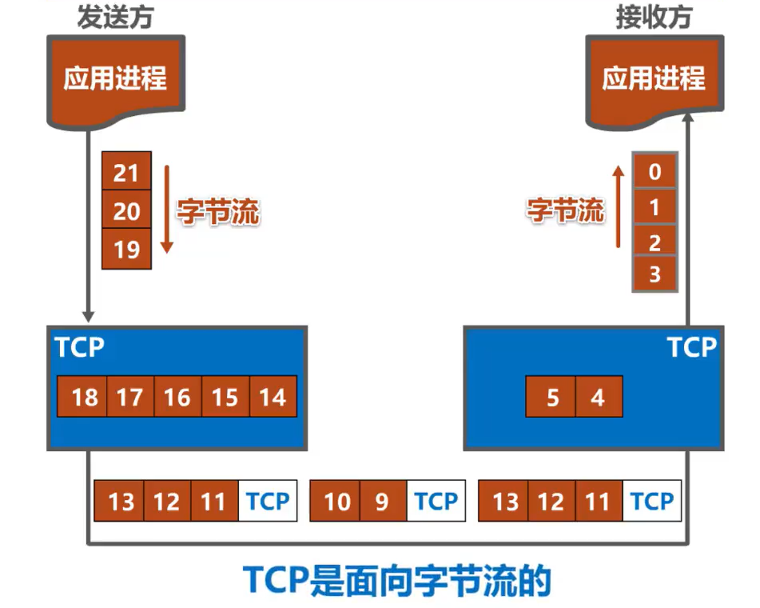

> 发送方
>
> - TCP会把应用进程交付下来的数据块看作是一连串无结构的字节流，TCP并不知道这些待传送的字节流的含义
> - 并将他们编号，并存储在自己发送缓存中
> - TCP会根据发送策略，从发送缓存中提取一定量的字节构建TCP报文段并发送
>
> 接收方
>
> - 一方面从所接受到的TCP报文段中，取出数据载荷部分并存储在接收缓存中；一方面将接收缓存中的一些字节交付给应用进程
> - TCP不保证接收方应用进程所收到的数据块与发送方发送的数据块，具有对应大小的关系（例如，发送方应用进程交给发送方的TCP共10个数据块，但接收方的TCP可能只用了4个数据块，就把收到的字节流交付给了上层的应用进程，但接收方收到的字节流必须和发送方应用进程发出的字节流完全一样）
> - 接收方的应用进程必须有能力识别收到的字节流，把它还原成有意义的应用层数据
>
> TCP是面向字节流的，这正是TCP实现可靠传输、流量控制、以及拥塞控制的基础
>
> 本图只画了一个方向的数据流，在实际网络中，基于TCP连接的两端，可以同时进行TCP报文段的发送和接收（全双工通信）

**TCP向上层提供面向连接的可靠传输服务**

TCP结构

## 总结

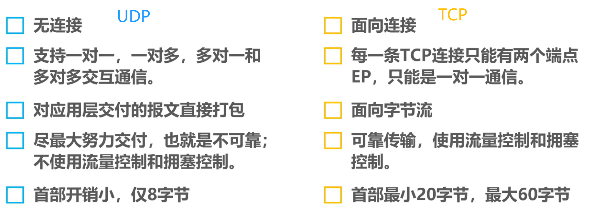

# 5.4、TCP的流量控制

## 概念

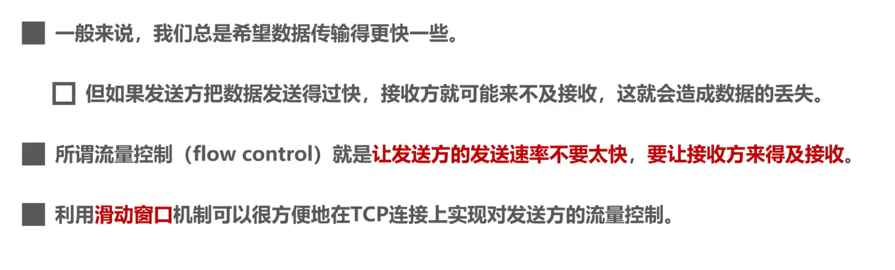

举例

[具体流程的视频](https://www.bilibili.com/video/BV1c4411d7jb?p=60)

ACK是TCP报文段首部中的标志位，取值1表示这是一个TCP确认报文段。

上图主机A现在可将发送缓存中序号1~200的字节数据全部删除，因为已经收到了主机B对它们的累计确认

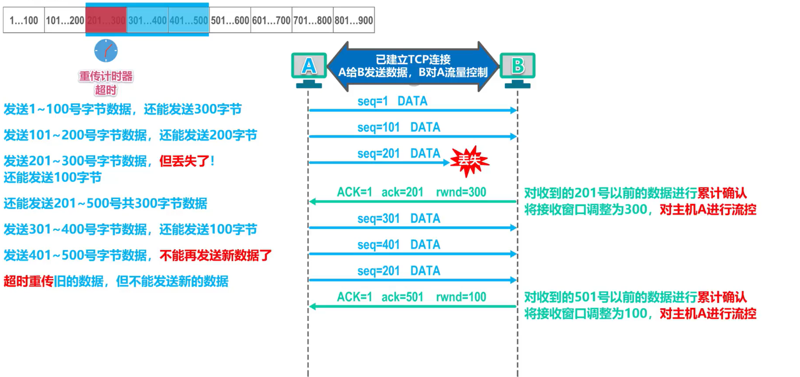

上图主机A现在可将发送缓存中序号201~500的字节数据全部删除，因为已经收到了主机B对它们的累计确认

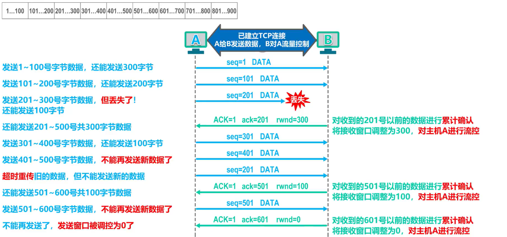

上图主机A现在可将发送缓存中序号501~600的字节数据全部删除，因为已经收到了主机B对它们的累计确认

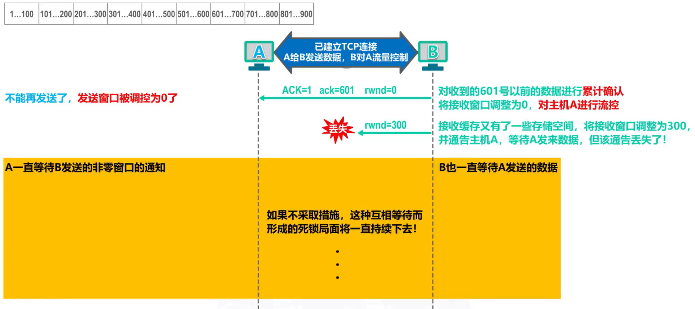

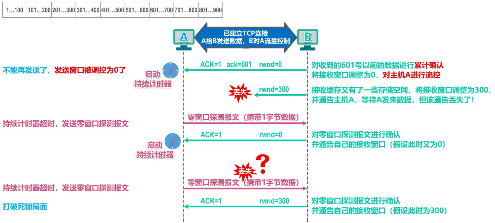

> 上图如果零窗口探测报文在发送过程中如果丢失，还是能打破死锁局面
>
> 因为零窗口探测报文段也有重传计时器，重传计时器超时后，零窗口探测报文段会被重传

真题

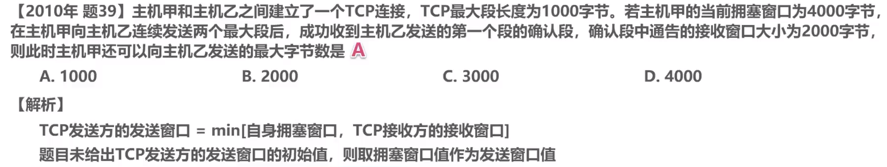

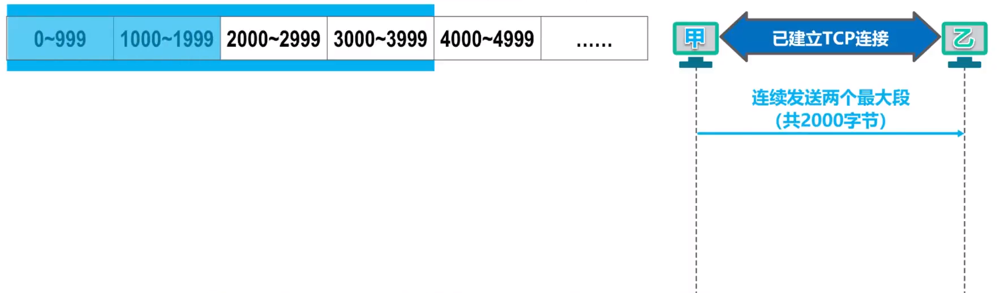

主机甲向主机乙连续发送两个最大段，共2000字节。也就是将发送窗口内序号为0~1999的字节数据发送出去。

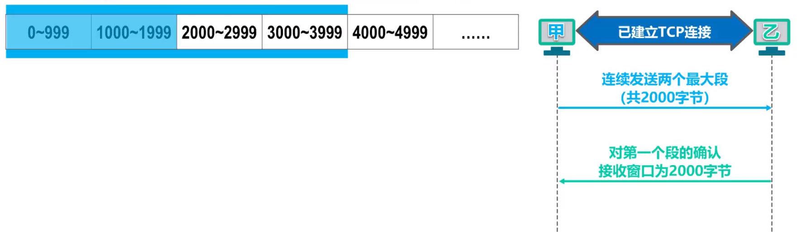

主机乙给主机甲发送针对第一个段的确认，并在该确认中给出自己当前的接收窗口大小为2000字节。

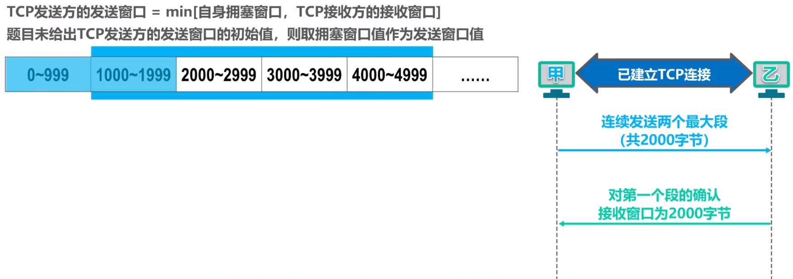

主机甲收到该确认后，将发送窗口向前滑动，使已发送并收到确认的第一个段的序号移出发送窗口。

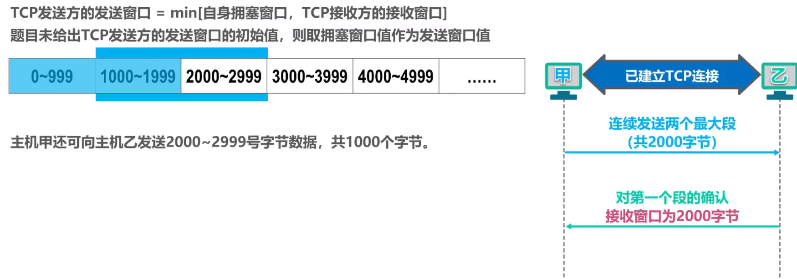

由于主机乙在确认中给出的自己的接收窗口大小为2000字节，因此主机甲相应地将自己的发送窗口调整为2000字节。

## 总结

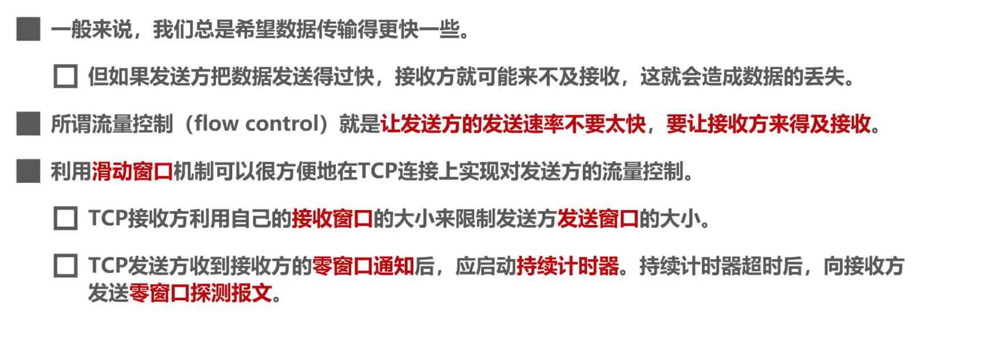

# 5.5、TCP的拥塞控制

## 概念

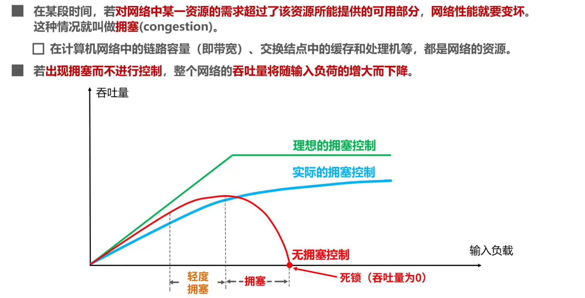

**网络拥塞往往是由许多因素引起的。例如：**

1. 点缓存的容量太小；
2. 链路的容量不足；
3. 处理机处理的速率太慢；
4. 拥塞本身会进一步加剧拥塞；

**拥塞控制的一般原理**

- 拥塞控制的前提：网络能够承受现有的网络负荷。
- 实践证明，拥塞控制是很难设计的，因为它是一个**动态问题**。
- 分组的丢失是网络发生拥塞的**征兆**而不是原因。
- 在许多情况下，甚至正是**拥塞控制本身**成为引起网络性能恶化、甚至发生死锁的原因。

**开环控制和闭环控制**

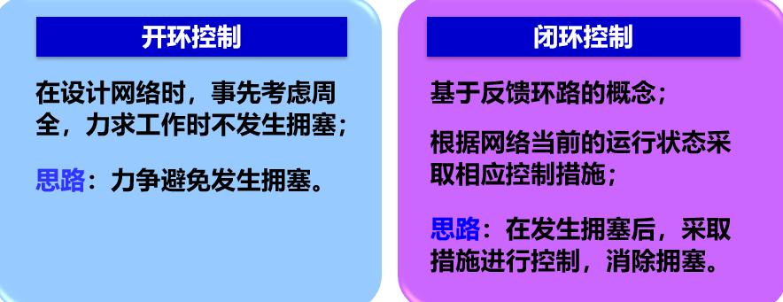

**监测网络的拥塞**

主要指标有：

1. 由于缺少缓存空间而被丢弃的分组的百分数；
2. 平均队列长度；
3. 超时重传的分组数；
4. 平均分组时延；
5. 分组时延的标准差，等等。

上述这些指标的上升都标志着拥塞的增长。

## 拥塞控制的算法

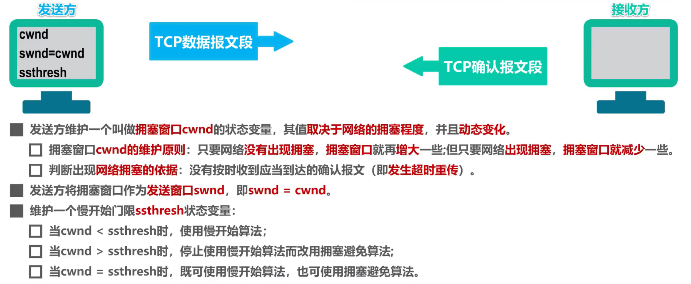

> 真正的发送窗口值swnd = Min (接收方窗口值rwnd，拥塞窗口值cwnd)

下图的实例横纵坐标的意思

传输轮次：

- 发送方给接收方发送数据报文段后，接收方给发送方发回相应的确认报文段
- 一个传输轮次所经历的时间其实就是往返时间，往返时间并非是恒定的数值
- 使用传输轮次是为了强调把拥塞窗口所允许发送的报文段都连续发送出去，并收到了对已发送的最后一个报文段的确认

拥塞窗口：

- 它会随网络拥塞程度，以及所使用的拥塞控制算法动态变化

### 慢开始和拥塞避免

#### 慢开始（slow-start）

- 目的：用来确定网络的负载能力或拥塞程度。
- 算法的思路：由小到大逐渐增大拥塞窗口数值。
- 两个变量：
  - **拥塞窗口（cwnd）**：初始拥塞窗口值：2 种设置方法。窗口值逐渐增大。
    - 1 至 2 个最大报文段 （旧标准）
    - 2 至 4 个最大报文段 （RFC 5681）
  - **慢开始门限（ssthresh）**：防止拥塞窗口增长过大引起网络拥塞。

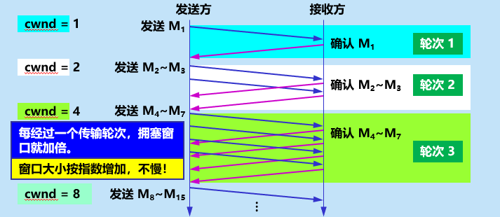

> 图中swnd是发送窗口
>
> 每经过一个传输轮次，拥塞窗口就加倍
>
> 窗口大小按**指数增加**，2的n-1次方

#### 拥塞避免（congestion avoidance）

- 思路：让拥塞窗口 cwnd **缓慢地增大**，避免出现拥塞。
- 每经过一个传输轮次，拥塞窗口 **cwnd = cwnd + 1**。
- 使拥塞窗口 cwnd 按线性规律缓慢增长。
- 在拥塞避免阶段，具有 “**加法增大**” (Additive Increase) 的特点。

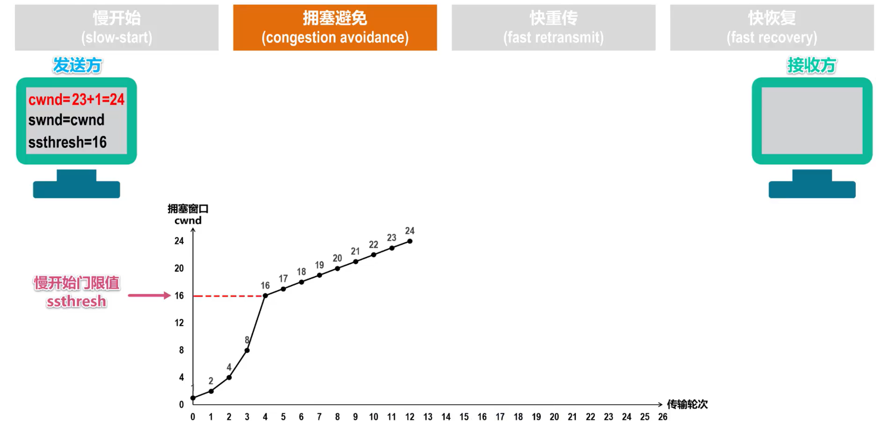

如果在发送过程中出现部分报文段丢失，这必然会造成发送方对这些丢失报文段的超时重传

这个时候又回到了慢开始

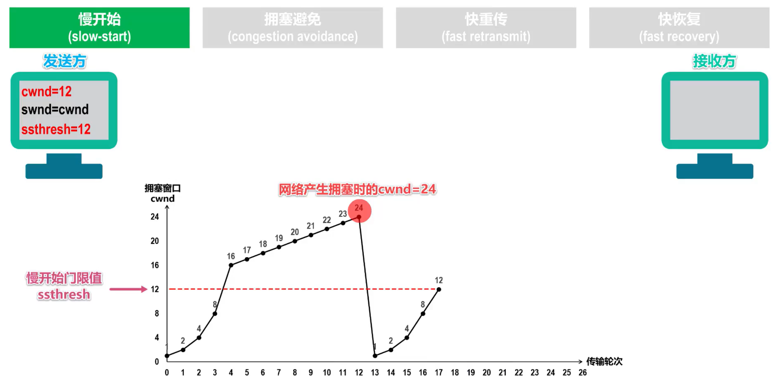

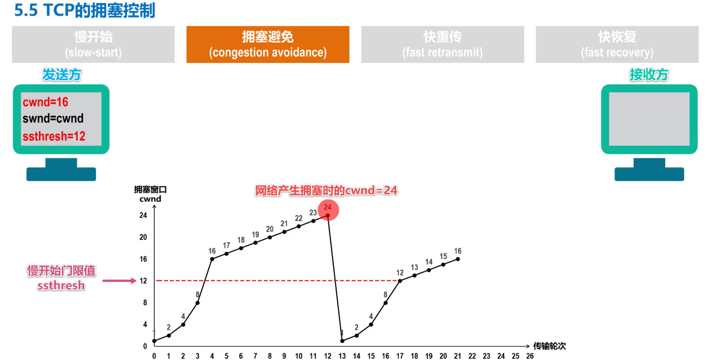

#### 两个算法完整示意图

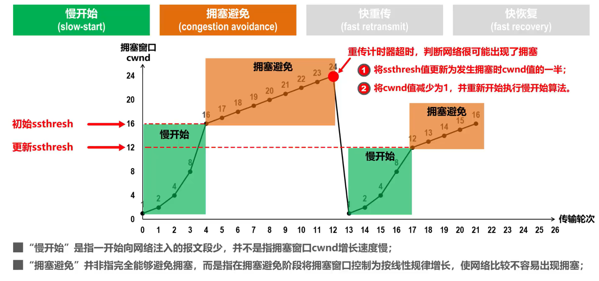

### 快重传和快恢复

#### 快重传（fast retrasmit）

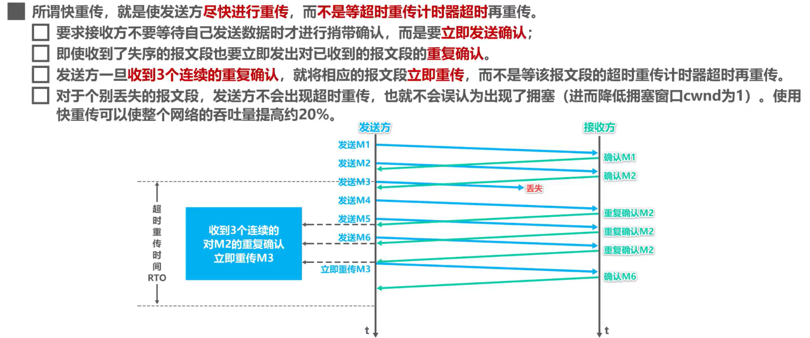

#### 快恢复（fast recovery）

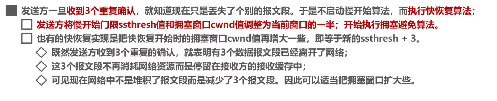

#### 改进后的整体算法的示意图

真题

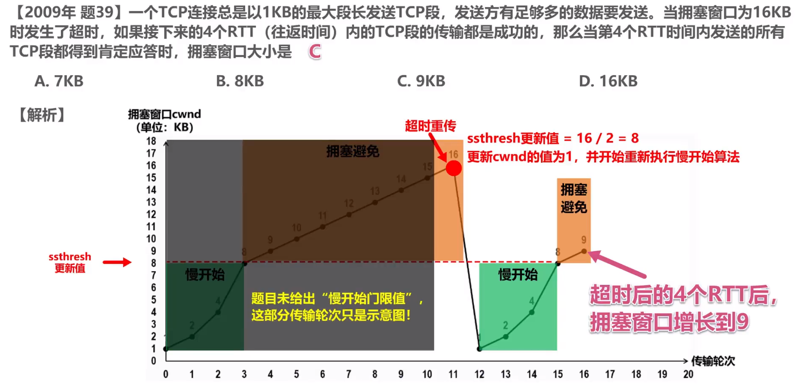

# 5.6、TCP超时重传时间的选择

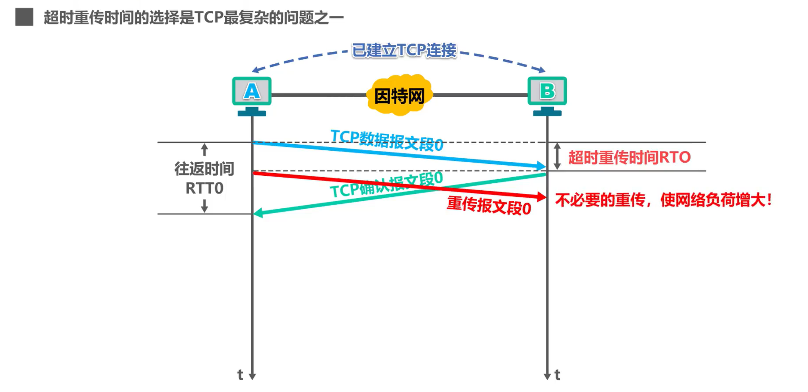

> 如果超时重传时间RTO的值设置得比RTT0的值小很多，这会引起报文段不必要的重传，使网络负荷增大

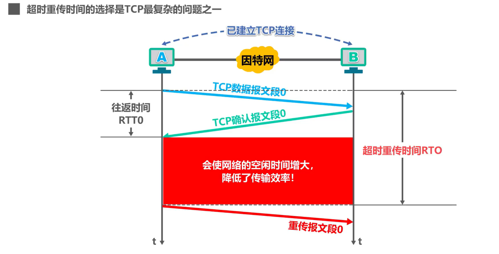

> 如果超时重传时间RTO的值设置得远大于RTT0的值，这会使重传时间推迟的太长，使网络的空闲时间增大，降低传输效率

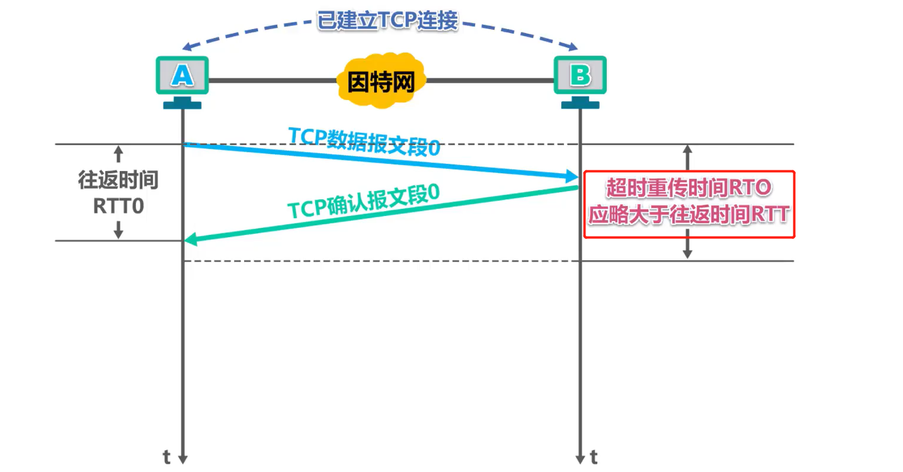

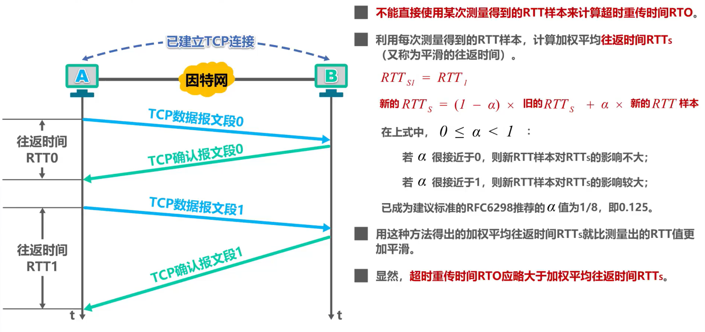

**RFC6298建议使用下式计算超时重传时间RTO**

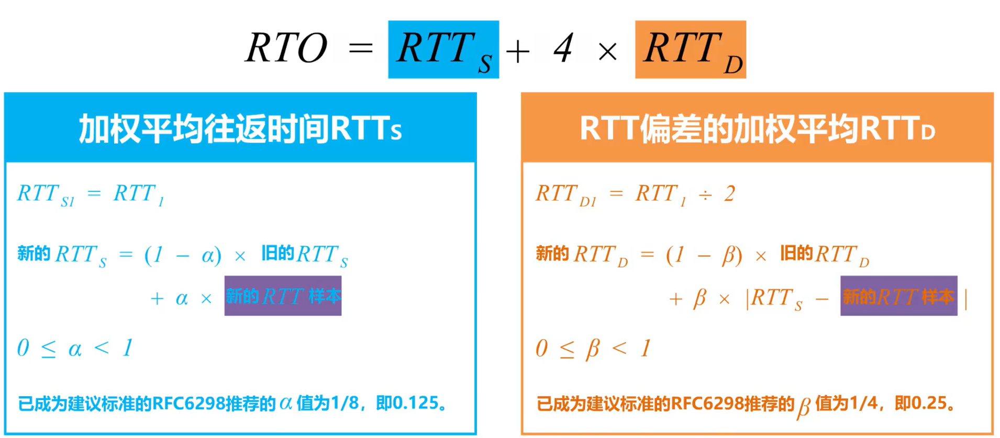

**往返时间RTT的测量比较复杂**


**TCP超时重传的计算**

举例


**总结**


# 5.7、TCP可靠传输的实现

[本集具体讲解](https://www.bilibili.com/video/BV1c4411d7jb?p=63)


真题


确认报文段的确认序号是已接收且按序到达的**最后一个报文段**尾部序号+1

# 5.8、TCP的运输连接管理

## 概念


## TCP的连接建立

- TCP 建立连接的过程叫做**握手**。
- 握手需要在客户和服务器之间交换三个 TCP 报文段。称之为**三报文握手**。
- 采用**三报文握手**主要是为了防止已失效的连接请求报文段突然又传送到了，因而产生错误。

### TCP的连接建立要解决以下三个问题


### TCP使用“三报文握手”建立连接

- TCP 连接的建立**采用客户服务器方式**。
- 主动发起连接建立的应用进程叫做**TCP客户** (client)。
- 被动等待连接建立的应用进程叫做**TCP服务器** (server)。

“握手”需要在TCP客户端和服务器之间交换三个TCP报文段

过程


> 最初两端的TCP进程都处于关闭状态


> 一开始，TCP服务器进程首先创建传输控制块，用来存储TCP连接中的一些重要信息。例如TCP连接表、指向发送和接收缓存的指针、指向重传队列的指针，当前的发送和接收序号等
>
> 之后，就准备接受TCP客户端进程的连接请求
>
> 此时，TCP服务器进程就进入监听状态，等待TCP客户端进程的连接请求

TCP服务器进程是被动等待来自TCP客户端进程的连接请求，因此称为**被动打开**连接

> TCP客户进程也是首先创建传输控制块

由于TCP连接建立是由TCP客户端主动发起的，因此称为**主动打开**连接

> 然后，在打算建立TCP连接时，向TCP服务器进程发送TCP连接请求报文段，并进入同步已发送状态
>
> TCP连接请求报文段首部中
>
> - 同步位SYN被设置为1，表明这是一个TCP连接请求报文段
> - 序号字段seq被设置了一个初始值x，作为TCP客户端进程所选择的初始序号
>
> 请注意：TCP规定SYN被设置为1的报文段不能携带数据，但要消耗掉一个序号

> TCP服务器进程收到TCP连接请求报文段后，如果同意建立连接，则向TCP客户进程发送TCP连接请求确认报文段，并进入同步已接收状态
>
> TCP连接请求确认报文段首部中
>
> - 同步位SYN和确认位ACK都设置为1，表明这是一个TCP连接请求确认报文段
> - 序号字段seq被设置了一个初始值y，作为TCP服务器进程所选择的初始序号，
> - 确认号字段ack的值被设置成了x+1，这是对TCP客户进程所选择的初始序号（seq）的确认
>
> 请注意：这个报文段也不能携带数据，因为它是SYN被设置为1的报文段，但同样要消耗掉一个序号

> TCP客户进程收到TCP连接请求确认报文段后，还要向TCP服务器进程发送一个普通的TCP确认报文段，并进入连接已连接状态
>
> 普通的TCP确认报文段首部中
>
> - 确认位ACK被设置为1，表明这是一个普通的TCP确认报文段
> - 序号字段seq被设置为x+1，这是因为TCP客户进程发送的第一个TCP报文段的序号为x，所以TCP客户进程发送的第二个报文段的序号为x+1
> - 确认号字段ack被设置为y+1，这是对TCP服务器进程所选择的初始序号的确认
>
> 请注意：TCP规定普通的TCP确认报文段可以携带数据，但如果不携带数据，则不消耗序号（在这种情况下，所发送的下一个数据报文段的序号仍是x+1）

> TCP服务器进程收到该确认报文段后也进入连接已建立状态
>
> 现在，TCP双方都进入了连接已建立状态，它们可以基于已建立好的TCP连接，进行可靠的数据传输

为什么TCP客户进程最后还要发送一个普通的TCP确认报文段？能否使用“两报文握手”建立连接？

下图实例是“两报文握手”


> 所以并不**多余**，这是为了防止已失效的连接请求报文段突然又传送到了TCP服务器，因而导致错误

真题


### 总结


## TCP的连接释放

- TCP 连接释放过程比较复杂。
- 数据传输结束后，通信的双方都可释放连接。
- TCP 连接释放过程是**四报文挥手**。

### TCP通过“四报文挥手”来释放连接

- TCP 连接的建立**采用客户服务器方式**。
- 主动发起连接建立的应用进程叫做**TCP客户** (client)。
- 被动等待连接建立的应用进程叫做**TCP服务器** (server)。
- **任何一方都可以在数据传送结束后发出连接释放的通知**

过程


> 现在TCP客户进程和TCP服务器进程都处于连接已建立状态
>
> TCP客户进程的应用进程通知其主动关闭TCP连接
>
> TCP客户进程会发送TCP连接释放报文段，并进入终止等待1状态
>
> TCP连接释放报文段首部中
>
> - 终止位FIN和确认位ACK的值都被设置为1，表明这是一个TCP连接释放报文段，同时也对之前收到的报文段进行确认
> - 序号seq字段的值设置为u，它等于TCP客户进程之前已传送过的数据的最后一个字节的序号加1
> - 确认号ack字段的值设置为v，它等于TCP客户进程之前已收到的、数据的最后一个字节的序号加1
>
> 请注意：TCP规定终止位FIN等于1的报文段即使不携带数据，也要消耗掉一个序号


> TCP服务器进程收到TCP连接释放报文段后，会发送一个普通的TCP确认报文段并进入关闭等待状态
>
> 普通的TCP确认报文段首部中
>
> - 确认位ACK的值被设置为1，表明这是一个普通的TCP确认报文段
> - 序号seq字段的值设置为v，它等于TCP服务器进程之前已传送过的数据的最后一个字节的序号加1，这也与之前收到的TCP连接释放报文段中的确认号匹配
> - 确认号ack字段的值设置为u+1，这是对TCP连接释放报文段的确认


> TCP服务器进程应该通知高层应用进程，TCP客户进程要断开与自己的TCP连接
>
> 此时，从TCP客户进程到TCP服务器进程这个方向的连接就释放了
>
> 这时的TCP连接属于半关闭状态，也就是TCP客户进程已经没有数据要发送了
>
> 但如果TCP服务器进程还有数据要发送，TCP客户进程仍要接收，也就是说从TCP服务器进程到TCP客户进程这个方向的连接并未关闭

> TCP客户进程收到TCP确认报文段后就进入终止等待2状态，等待TCP服务器进程发出的TCP连接释放报文段
>
> 若使用TCP服务器进程的应用进程已经没有数据要发送了，应用进程就通知其TCP服务器进程释放连接
>
> 由于TCP连接释放是由TCP客户进程主动发起的，因此TCP服务器进程对TCP连接的释放称为被动关闭连接

> TCP服务器进程发送TCP连接释放报文段并进入最后确认状态
>
> 该报文段首部中
>
> - 终止位FIN和确认位ACK的值都被设置为1，表明这是一个TCP连接释放报文段，同时也对之前收到的报文段进行确认
> - 序号seq字段的值为w，这是因为在半关闭状态下，TCP服务器进程可能又发送
> - 确认号ack字段的值为u+1，这是对之前收到的TCP连接释放报文段的重复确认


> TCP客户进程收到TCP连接释放报文段后，必须针对该报文段发送普通的TCP确认报文段，之后进入时间等待状态
>
> 该报文段首部中
>
> - 确认为ACK的值被设置为1，表明这是一个普通的TCP确认报文段
> - 序号seq字段的值设置为u+1，这是因为TCP客户进程之前发送的TCP连接释放报文段虽然不携带数据，但要消耗掉一个序号
> - 确认号ack字段的值设置为w+1，这是对所收到的TCP连接释放报文段的确认
>
> TCP服务器进程收到该报文段后就进入关闭状态，而TCP客户进程还要进过2MSL后才能进入关闭状态

TCP客户进程在发送完最后一个确认报文后，为什么不直接进入关闭状态？而是要进入时间等待状态？

> 因为时间等待状态以及处于该状态2MSL时长，可以确保TCP服务器进程可以收到最后一个TCP确认报文段而进入关闭状态
>
> 另外，TCP客户进程在发送完最后一个TCP确认报文段后，在经过2MSL时长，就可以使本次连接持续时间内所产生的所有报文段都从网络中消失，这样就可以使下一个新的TCP连接中，不会出现旧连接中的报文段

### TCP保活计时器的作用

TCP双方已经建立了连接，后来，TCP客户进程所在的主机突然出现了故障

TCP服务器进程以后就不能再收到TCP客户进程发来的数据

因此，应当有措施使TCP服务器进程不要再白白等待下去


# 5.9、TCP报文段的首部格式


## 各字段的作用

源端口和目的端口


序号、确认号和确认标志位ACK


数据偏移、保留、窗口和校验和

同步标志位、终止标志位、复位标志位、推送标志位、紧急标志位和紧急指针 


接收方收到紧急标志为1的报文段，会按照紧急指针字段的值从报文段数据载荷部分取出紧急数据，并直接上交应用进程，而不必在接收缓存中排队。

选项和填充

