# Nginx 

> 涵盖Nginx基本概念，软件的安装和基本操作命令，Nginx的各种应用场景的配置以及Nginx的原理。
>
> 视频教程地址：[尚硅谷Nginx教程由浅入深（一套打通丨初学者也可掌握）](https://www.bilibili.com/video/BV1zJ411w7SV?share_source=copy_web)


[toc]


# 1. Nginx 简介


## 1.1 什么是 Nginx？ 

Nginx 是一个**高性能**的 **HTTP 和反向代理服务器**，特点是**占有内存少，并发能力强**。

> 事实上 nginx 的并发能力确实在同类型的网页服务器中表现较好，能经受高负载的考验，有报告表明能支持高达 50,000 个并发连接数。


## 1.2 Nginx 作为 web 服务器

Nginx 可以作为**静态页面的 web 服务器**，同时还**支持 CGI 协议的动态语言**，比如 perl、php 等。但是**不支持 java**，Java 程序只能通过与 tomcat 配合完成。


## 1.3 正向代理

Nginx 不仅可以做反向代理，实现负载均衡。还能用作正向代理来进行上网等功能。 

**正向代理：** 是一个位于客户端和原始服务器(origin server)之间的服务器。为了从原始服务器取得内容，客户端向代理发送一个请求并指定目标(原始服务器)，然后代理向原始服务器转交请求并将获得的内容返回给客户端（目的是为了保护客户端用户） 。

> **需要在客户端（浏览器）配置代理服务器进行指定网站访问。**


## 1.4 反向代理

**反向代理：**是在客户端和服务器端之间的一个代理服务器，但是这个代理服务器的目的是**用来保护服务器端的**，当外网客户端来访问我们的服务器时，为了避免暴露应用服务器的实际 ip 地址，我们会让客户端访问代理服务器，然后代理服务器再根据客户端的请求去实际的应用服务器获取响应内容并返回客户端。 **此时反向代理服务器和目标服务器对外就是一个服务器，暴露的是代理服务器地址，隐藏了真实服务器 IP 地址。** 


> 正向隐藏客户端，反向隐藏服务器。


## 1.5 负载均衡

单个服务器解决不了，我们增加服务器的数量，然后将请求分发到各个服务器上，将原先请求集中到单个服务器上的情况改为将请求分发到多个服务器上，将负载分发到不同的服务器，也就是我们所说的**负载均衡**。

 


## 1.6 动静分离

为了加快网站的解析速度，可以把动态页面和静态页面由不同的服务器来解析，加快解析速度。降低原来单个服务器的压力。

 

> Tomcat 服务器存储动态资源（jsp、servlet ……）


# 2. Nginx 安装（Linux）

## 2.1 进入 nginx 官网下载

官网地址：http://nginx.org/

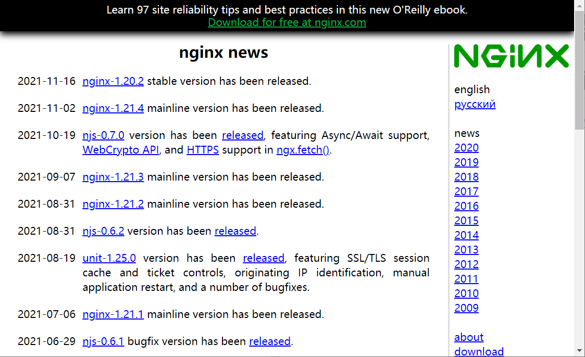

本教程（尚硅谷）需要的素材：

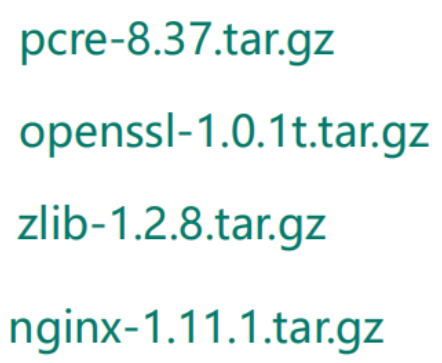


## 2.2 安装 nginx

### 2.2.1 安装 pcre 依赖 

**第一步** 

联网下载 pcre 压缩文件依赖

```shell
wget http://downloads.sourceforge.net/project/pcre/pcre/8.37/pcre-8.37.tar.gz 
```

在 `/usr/src/` 目录下：


**第二步** 

解压压缩文件，使用命令：

```shell
tar –xvf pcre-8.37.tar.gz
```

**第三步** 

进入解压得到的 `pcre-8.37` 文件夹，执行 `./configure` ；

完成后，继续在 pcre 目录下执行 `make`，最后执行 `make install`；也可以直接一步到位执行这一条命令 `make && make install`。

安装成功后查看安装的版本号：


### 2.2.2 安装 openssl、zlib、gcc 依赖

```shell
yum -y install make zlib zlib-devel gcc-c++ libtool openssl openssl-devel
```


### 2.2.3 安装 nginx

**第一步**

跟 pcre 一样，直接把已经下载好的压缩包 `nginx-1.12.2.tar.gz` 放到同一目录  `/usr/src/` 下。然后使用命令解压：


```shell
tar -xvf nginx-1.12.2.tar.gz
```

**第二步**

进入解压得到的 `nginx-1.12.2` 文件夹，执行 `./configure` ；

**第三步**

同样在本目录下执行 `make && make install` 进行编译并安装。


## 2.3 启动 Nginx

安装成功后，在 `/usr/local/nginx/sbin/` 下可以找到 nginx 的启动脚本：

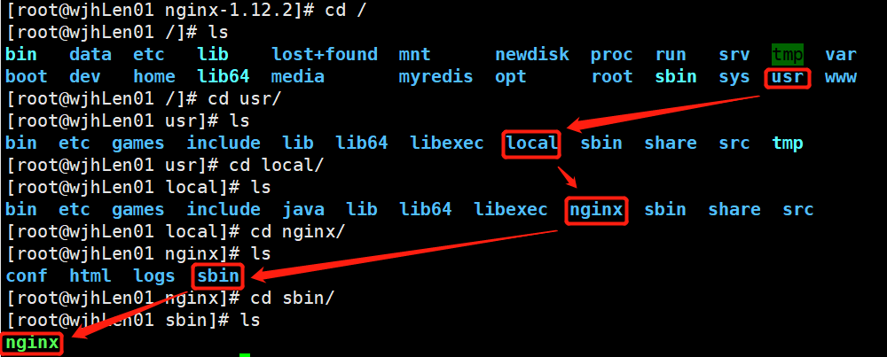

如何启动？

进入到这个目录后输入命令：

```shell
./nginx
```

可以看到，已经启动了 nginx 的进程：

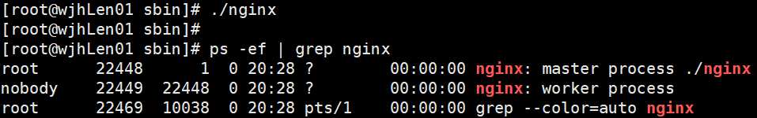


nginx 默认监听 **80** 端口，可以直接通过 **虚拟机 ip 地址 + 端口号** 在浏览器尝试访问~

> 我的 linux 虚拟机 ip：192.168.200.130


**注意：**

在 windows 系统中访问 linux 中 nginx，默认不能访问的，因为**防火墙**问题，可以通过下面两种方法解决：

（1）关闭防火墙 

（2）开放访问的端口号，80 端口 


**查看开放的端口号** 

```shell
firewall-cmd --list-all
```

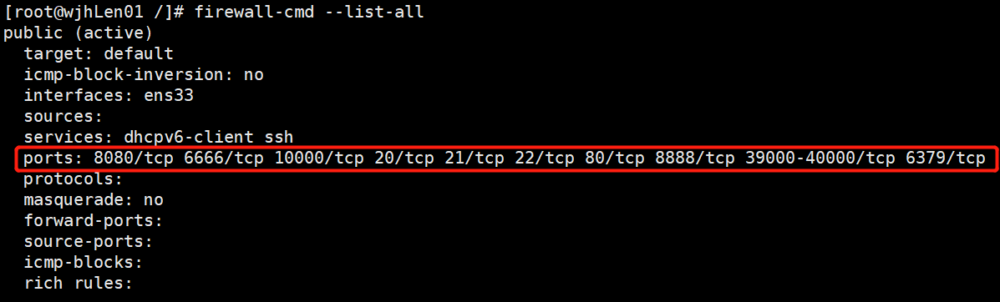

设置开放的端口号 

```shell
firewall-cmd --add-service=http --permanent 
或
firewall-cmd --add-port=80/tcp --permanent 
```

重启防火墙 

```shell
firewall-cmd --reload
```


# 3. Nginx 常用命令

 首先要进入 nginx 的目录中

```shell
cd /usr/local/nginx/sbin
```


## 3.1 查看 nginx 版本号

```shell
./nginx -v
```

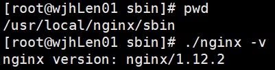


## 3.2 启动 nginx

```shell
./nginx
```


## 3.3 关闭 nginx

```shell
./nginx -s stop
```

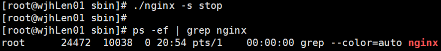


## 3.5 重新加载 nginx

不需要重启服务器，使得修改过的配置文件（nginx.conf）生效。

```shell
./nginx -s reload
```


# 4. Nginx 的配置文件

nginx 安装目录下，其默认的配置文件都放在这个目录的 conf 目录下，而主配置文件 `nginx.conf` 也在其中，后续对 nginx 的使用基本上都是对此配置文件进行相应的修改。


## 4.1 nginx 配置文件的位置

**目录：**`/usr/local/nginx/conf/nginx.conf`

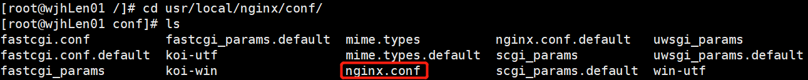


## 4.2 配置文件的内容

配置文件中有很多 **#** 开头的表示注释内容，去掉所有以 # 开头的段落，精简之后的内容如下：

```
worker_processes  1;

events {
    worker_connections  1024;
}

http {
    include       mime.types;
    default_type  application/octet-stream;
  
    sendfile        on;
   
    keepalive_timeout  65;

    server {
        listen       80;
        server_name  localhost;

        location / {
            root   html;
            index  index.html index.htm;
        }

        error_page   500 502 503 504  /50x.html;
        location = /50x.html {
            root   html;
        }
    }  
}
```

> 未去注释的原生配置文件见：[nginx.conf](./配置文件/nginx.conf)


根据上述文件，可以将 nginx.conf 配置文件分为三部分：

### 4.2.1 全局块

从配置文件开始到 events 块之间的内容，主要会设置一些**影响 nginx 服务器整体运行的配置指令**，主要包括配置运行 Nginx 服务器的用户（组）、允许生成的 worker process 数，进程 PID 存放路径、日志存放路径和类型以及配置文件的引入等。 

比如上面第一行配置的：

```
worker_processes  1;
```

这是 Nginx 服务器并发处理服务的关键配置，`worker_processes` 值越大，可以支持的并发处理量也越多，但是会受到硬件、软件等设备的制约 。


### 4.2.2 events  块

比如上面的配置：

```
events {
    worker_connections  1024;
}
```

events 块涉及的指令主要**影响 Nginx 服务器与用户的网络连接**，常用的设置包括是否开启对多 work process 下的网络连接进行序列化，是否允许同时接收多个网络连接，选取哪种事件驱动模型来处理连接请求，每个 word process 可以同时支持的最大连接数等。

上述例子就表示每个 work process 支持的最大连接数为 1024。

> 这部分的配置对 Nginx 的性能影响较大，在实际中应该灵活配置。 


### 4.2.3 http 块

```
http {
    include       mime.types;
    default_type  application/octet-stream;
  
    sendfile        on;
   
    keepalive_timeout  65;

    server {
        listen       80;
        server_name  localhost;

        location / {
            root   html;
            index  index.html index.htm;
        }

        error_page   500 502 503 504  /50x.html;
        location = /50x.html {
            root   html;
        }
    }  
}
```

这算是 Nginx 服务器配置中最频繁的部分，**代理、缓存和日志定义**等绝大多数功能和**第三方模块**的配置都在这里。 

需要注意的是：http 块也可以包括 **http 全局块**、**server 块**。


#### 4.2.3.1 http 全局块

http 全局块配置的指令包括文件引入、MIME-TYPE 定义、日志自定义、连接超时时间、单链接请求数上限等。


#### 4.2.3.2 server 块

这个块和虚拟主机有密切关系，虚拟主机从用户角度看，和一台独立的硬件主机是完全一样的，该技术的产生是为了节省互联网服务器硬件成本。 

**每个 http 块可以包括多个 server 块，而每个 server 块就相当于一个虚拟主机。** 

而每个 server 块也分为**全局 server 块**，以及可以同时包含多个 **locaton 块**。

**1、全局 server 块**

最常见的配置是本虚拟机主机的监听配置和本虚拟主机的名称或 IP 配置。

**2、location 块**

一个 server 块可以配置多个 location 块。 

 这块的主要作用是**基于 Nginx 服务器接收到的请求字符串（例如 server_name/uri-string），对虚拟主机名称（也可以是 IP 别名）之外的字符串（例如 前面的 /uri-string）进行匹配，对特定的请求进行处理。**地址定向、数据缓存和应答控制等功能，还有许多第三方模块的配置也在这里进行。 


# 5. Nginx 配置实例【反向代理】


## 5.1 反向代理实例一

### 5.1.1 实现效果

打开浏览器，使用 nginx 反向代理，在浏览器访问 `www.123.com` 直接跳转到 `127.0.0.1:8080`（linux 系统的 tomcat 主页）。


最终实现效果图：


### 5.1.2 准备工作

（1）在 linux 系统中安装 tomcat，使用默认端口号 8080

> 可以直接将准备好的 tomcat 安装文件压缩包放到 linux 系统中 `/usr/src/` 目录下，通过命令 `tar -xvf apache-tomcat-7.0.70.tar.gz` 解压。
>
> 解压后进入 tomcat 的 bin 目录中，执行 `./startup.sh` 启动 tomcat 服务器。
>
> 注意：运行 tomcat 需要有 jdk 环境。

启动 tomcat 服务器流程：

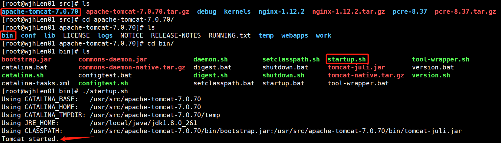


（2）对外开放访问的端口

```shell
firewall-cmd --add-port=8080/tcp --permanent
firewall-cmd --reload
```

**查看开放的端口号** 

```shell
firewall-cmd --list-all
```


（3）在 windows 系统中通过浏览器访问 linux 中的 tomcat 服务器

使用 **linux 系统 ip 地址 + 8080 端口号** 进行访问：

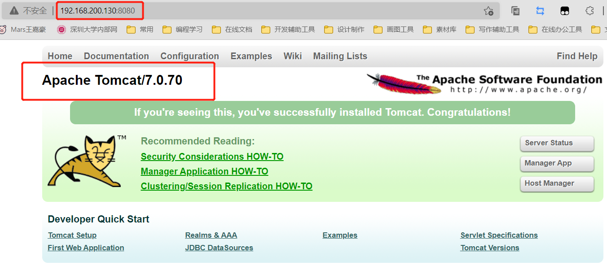

出现上面的页面就证明准备工作圆满成功了！


### 5.1.3 具体配置

#### （1）在 windows 系统的 hosts 文件中进行域名和 ip 对应关系的配置

我的 hosts 文件位置：`C:\Windows\System32\drivers\etc`


进入 hosts 文件中添加一条映射：


> 注意这里用的是自己的 linux 主机 ip 地址。

配置完成后可以在这里初步测试，如下图：


#### （2）在 nginx 进行请求转发的配置（反向代理配置）

找到 nginx 的配置文件（`/usr/local/nginx/conf/nginx.conf`），在其中进行如下配置：

1. 找到 server 块，需要修改的是下面红框中的两项：

   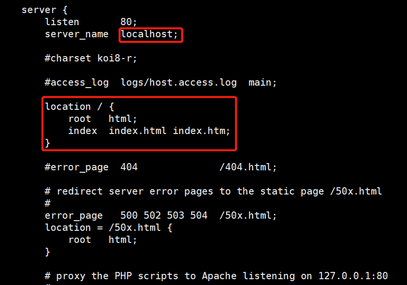

2. 修改成如下图：

   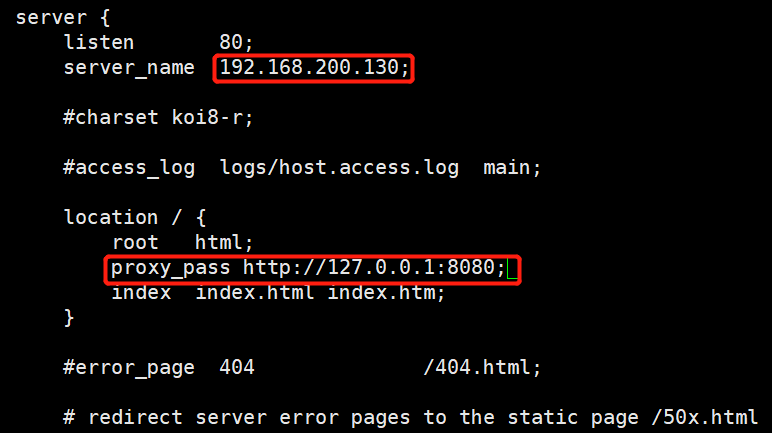

**原理：**当在 windows 主机的浏览器中访问 `www.123.com` 时，由于 hosts 文件配置了域名 `www.123.com` 和 ip `192.168.200.130` 的映射，所以请求会发送到我的 linux 主机；而 linux 主机中的 nginx 服务器配置了反向代理的路径为 `http://127.0.0.1:8080` （由于 tomcat 就在 linux 本机中），所以请求会被转发到 tomcat 服务器中。

> **注意：修改完配置文件后需要进入 nginx 的 sbin 目录中 `cd /usr/local/nginx/sbin` 执行重新加载 nginx 的命令 `./nginx -s reload`。**


#### （3）最终测试


## 5.2 反向代理实例二

### 5.2.1 实现效果

使用 nginx 反向代理，根据访问的路径跳转到不同端口的服务中。

nginx 监听端口为 `9001`：

访问 `http://192.168.200.130:9001/edu/` 直接跳转到 `127.0.0.1:8080` 

访问 `http://192.168.200.130:9001/vod/` 直接跳转到 `127.0.0.1:8081` 


### 5.2.2 准备工作

（1）准备两个 tomcat 服务器，一个监听 8080 端口，一个监听 8081 端口。

在 `/usr/src/` 文件夹下建立两个文件夹 `tomact8080` 和 `tomcat8081` 分别放置两个 tomcat 服务器。

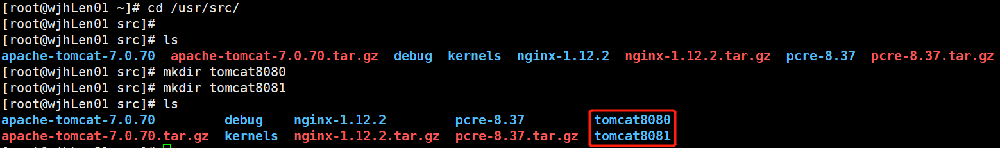

把之前准备好的 tomcat 安装文件压缩包分别放置进这两个文件夹，再执行命令 `tar -xvf apache-tomcat-7.0.70.tar.gz` 解压。

> 注意：需要进入 tomcat 安装目录下的配置文件 `server.xml` 中修改其中一个 tomcat 的端口号为8081，同时还有几个其他端口号也要修改成与另一个 tomcat 服务器不同的端口号。

修改完成后分别使用 `./startup.sh` 启动两个 tomcat 服务器。

（2）创建文件夹和测试页面

在两个服务器文件夹中的 webapps 文件夹中分别建立两个文件夹 `/vod/` 和 `/edu/`，分别在里面加入一个不同的页面 a.html 文件，以便测试。


### 5.2.3 具体配置

#### （1）在 nginx 进行请求转发的配置（反向代理配置）

找到 nginx 的配置文件（`/usr/local/nginx/conf/nginx.conf`），在其中进行如下配置：

添加一个 server 块：

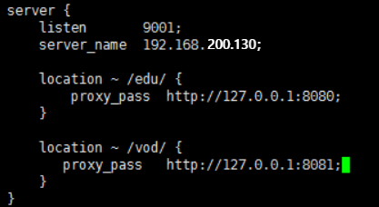

#### （2）开放对外访问的端口号

```shell
firewall-cmd --add-port=9001/tcp --permanent
firewall-cmd --add-port=8080/tcp --permanent
firewall-cmd --add-port=8081/tcp --permanent
```

> **注意：修改完配置文件后需要进入 nginx 的 sbin 目录中 `cd /usr/local/nginx/sbin` 执行重新加载 nginx 的命令 `./nginx -s reload`。**

#### （3）最终测试


### 5.2.4 location 指令说明

**该指令用于匹配 URL。** 

语法如下：


 1、`=` ：用于不含正则表达式的 uri 前，要求请求字符串与 uri 严格匹配，如果匹配成功，就停止继续向下搜索并立即处理该请求。 

 2、`~`：用于表示 uri 包含正则表达式，并且区分大小写。 

 3、`~*`：用于表示 uri 包含正则表达式，并且不区分大小写。 

 4、`^~`：用于不含正则表达式的 uri 前，要求 Nginx 服务器找到标识 uri 和请求字符串匹配度最高的 location 后，立即使用此 location 处理请求，而不再使用 location 块中的正则 uri 和请求字符串做匹配。 

> 注意：如果 uri 包含正则表达式，则必须要有 `~` 或者 `~*` 标识。 


# 6. Nginx 配置实例【负载均衡】

## 6.1 实现效果

在浏览器地址栏输入地址 `http://192.168.200.130/edu/a.html`，负载均衡效果，平均到 8080 和 8081 端口中。


## 6.2 准备工作

（1）准备两台 tomcat 服务器，一台 8080，一台 8081。

（2）在两台 tomcat 里面 webapps 目录中，创建名称是 `edu` 的文件夹，在 `edu` 文件夹中创建页面 a.html，用于测试。


## 6.3 在 nginx 配置文件中进行负载均衡的配置

1. 在 **http 块**中加上一个 `upstream`：

   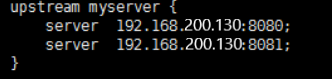

   可以在 ip 地址后加上 `weight = 数字` 分配服务器权重。

2. 在 **server 块**中做如下修改：
   1. 把 `server_name` 从 `localhost` 改成 `192.168.200.130`。

   2. 在 `location /` 中加入一个 `proxy_pass`：

      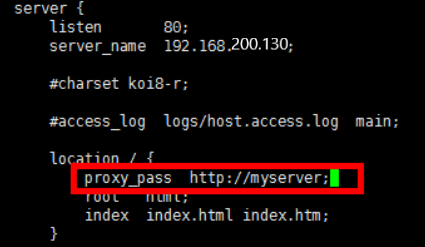


## 6.4 nginx 分配服务器策略

> 随着互联网信息的爆炸性增长，负载均衡（load balance）已经不再是一个很陌生的话题，顾名思义，负载均衡即是将负载分摊到不同的服务单元，既保证服务的可用性，又保证响应足够快，给用户很好的体验。快速增长的访问量和数据流量催生了各式各样的负载均衡产品，很多专业的负载均衡硬件提供了很好的功能，但却价格不菲，这使得负载均衡软件大受欢迎，nginx 就是其中的一个，在 linux 下有 Nginx、LVS、Haproxy 等等服务可以提供负载均衡服务。

Nginx 提供了几种分配方式(策略)：

### 6.4.1 轮询（默认）

每个请求**按时间顺序逐一分配**到不同的后端服务器，**如果后端服务器 down 掉，能自动剔除。** 


### 6.4.2 weight

weight 代表**权重**，**默认为 1，权重越高被分配的客户端越多。**

指定轮询几率，weight 和访问比率成正比，用于后端服务器性能不均的情况。 例如：

 


### 6.4.3 ip_hash

每个请求**按访问 ip 的 hash 结果分配，这样每个访客固定访问一个后端服务器**，可以解决 session 的问题。例如： 

 


### 6.4.4 fair（第三方）

**按后端服务器的响应时间来分配请求**，响应时间短的优先分配。 

 


# 7. Nginx 配置实例【动静分离】


Nginx 动静分离简单来说就是**把动态跟静态请求分开**，不能理解成只是单纯的把动态页面和静态页面物理分离。严格意义上说应该是动态请求跟静态请求分开，可以理解成**使用 Nginx 处理静态页面，Tomcat 处理动态页面。**动静分离从目前实现角度来讲大致分为两种：

- 一种是纯粹把静态文件独立成单独的域名，放在独立的服务器上，也是目前主流推崇的方案； 

- 另外一种方法就是动态跟静态文件混合在一起发布，通过 nginx 来分开。


通过 `location` 指定不同的后缀名实现不同的请求转发。通过 `expires` 参数设置，可以使浏览器缓存过期时间，减少与服务器之前的请求和流量。

具体 `Expires` 定义：是给一个资源设定一个过期时间，也就是说无需去服务端验证，直接通过浏览器自身确认是否过期即可，所以不会产生额外的流量。此种方法非常适合不经常变动的资源。（如果经常更新的文件，不建议使用 Expires 来缓存），我这里设置 3d，表示在这 3 天之内访问这个 URL，发送一个请求，比对服务器该文件最后更新时间没有变化，则不会从服务器抓取，返回状态码 304，如果有修改，则直接从服务器重新下载，返回状态码 200。


## 7.1 准备工作

（1）在 linux 系统中准备静态资源，用于访问。

在根目录下创建一个 `data` 文件夹，在其中创建两个文件夹 `www` 和 `image`，用来存放可供访问的静态资源。


（2）把准备好的 `a.html` 放置在 `www` 中，把准备好的图片放置在 `image` 中。


## 7.2 具体配置

### （1）在 nginx 配置文件中进行配置

找到配置文件位置：`/usr/local/nginx/conf/nginx.conf`。

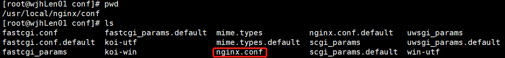

用 `vi` 命令进入文件进行配置：

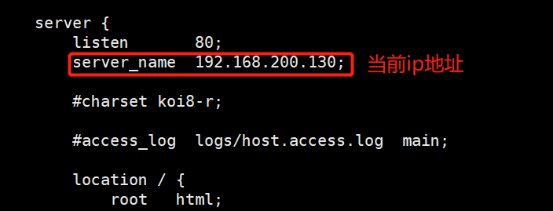

把下面这个

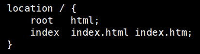

替换成：

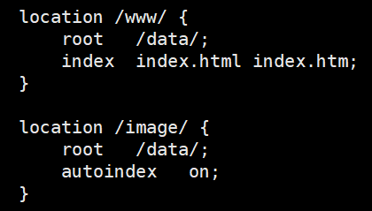

### （2）重加载 nginx

修改完配置文件后需要进入 nginx 的 sbin 目录中 `cd /usr/local/nginx/sbin` 执行重新加载 nginx 的命令 `./nginx -s reload`。


## 7.3 最终测试


因为配置过 `autoindex on`，所以以这个路径访问会列出文件夹目录：


# 8. Nginx 配置高可用集群

## 8.1 什么是高可用？

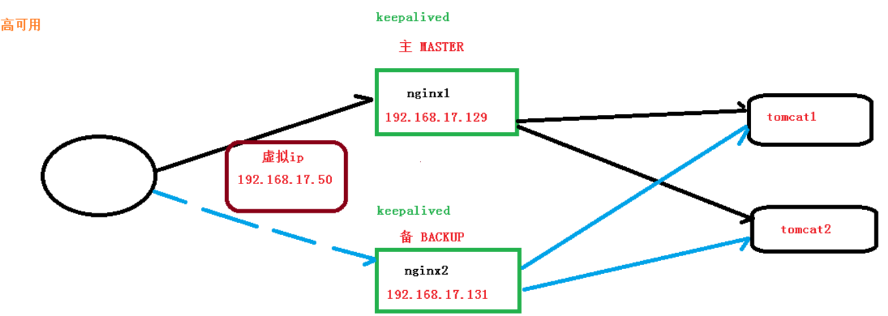

当 nginx 主服务器宕机后，就会切换到 从服务器/备份服务器 中进行请求转发。

**要求：**

（1）需要两台 nginx 服务器

（2）需要 keepalived （一个软件，类似于一个路由，可以检测 nginx 服务器是否“活着”，如果宕机了则会切换到从服务器）

（3）需要虚拟 ip（对外提供）


## 8.2 Keepalived + Nginx 高可用集群（主从模式）

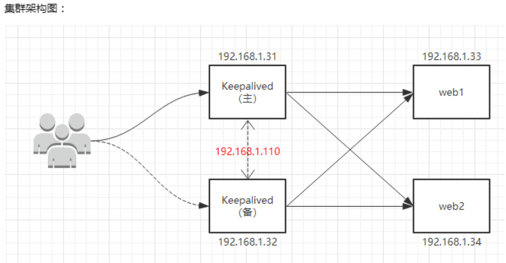

需要两台 linux 服务器，ip 分别为 `192.168.17.129` 和 `192.168.17.131`。

需要在两台服务器上都安装 nginx 和 keepalived。

### （1）安装 nginx 

> 流程参考上面

### （2）在两台服务器安装 keepalived

1. 使用 yum 命令进行安装：

   ```shell
   yum install keepalived –y
   ```

   

2. 安装之后，在 `etc` 里面生成目录 `keepalived`，有文件 `keepalived.conf` 

### （3）修改配置文件，完成高可用配置

1. 修改 `/etc/keepalived/keepalived.conf` 配置文件

   这个文件默认的内容如下：

   ```
   ! Configuration File for keepalived
   
   global_defs {
      notification_email {
        acassen@firewall.loc
        failover@firewall.loc
        sysadmin@firewall.loc
      }
      notification_email_from Alexandre.Cassen@firewall.loc
      smtp_server 192.168.200.1
      smtp_connect_timeout 30
      router_id LVS_DEVEL
      vrrp_skip_check_adv_addr
      vrrp_strict
      vrrp_garp_interval 0
      vrrp_gna_interval 0
   }
   
   vrrp_instance VI_1 {
       state MASTER
       interface eth0
       virtual_router_id 51
       priority 100
       advert_int 1
       authentication {
           auth_type PASS
           auth_pass 1111
       }
       virtual_ipaddress {
           192.168.200.16
           192.168.200.17
           192.168.200.18
       }
   }
   
   virtual_server 192.168.200.100 443 {
       delay_loop 6
       lb_algo rr
       lb_kind NAT
       persistence_timeout 50
       protocol TCP
   
       real_server 192.168.201.100 443 {
           weight 1
           SSL_GET {
               url {
                 path /
                 digest ff20ad2481f97b1754ef3e12ecd3a9cc
               }
               url {
                 path /mrtg/
                 digest 9b3a0c85a887a256d6939da88aabd8cd
               }
               connect_timeout 3
               nb_get_retry 3
               delay_before_retry 3
           }
       }
   }
   
   virtual_server 10.10.10.2 1358 {
       delay_loop 6
       lb_algo rr 
       lb_kind NAT
       persistence_timeout 50
       protocol TCP
   
       sorry_server 192.168.200.200 1358
   
       real_server 192.168.200.2 1358 {
           weight 1
           HTTP_GET {
               url { 
                 path /testurl/test.jsp
                 digest 640205b7b0fc66c1ea91c463fac6334d
               }
               url { 
                 path /testurl2/test.jsp
                 digest 640205b7b0fc66c1ea91c463fac6334d
               }
               url { 
                 path /testurl3/test.jsp
                 digest 640205b7b0fc66c1ea91c463fac6334d
               }
               connect_timeout 3
               nb_get_retry 3
               delay_before_retry 3
           }
       }
   
       real_server 192.168.200.3 1358 {
           weight 1
           HTTP_GET {
               url { 
                 path /testurl/test.jsp
                 digest 640205b7b0fc66c1ea91c463fac6334c
               }
               url { 
                 path /testurl2/test.jsp
                 digest 640205b7b0fc66c1ea91c463fac6334c
               }
               connect_timeout 3
               nb_get_retry 3
               delay_before_retry 3
           }
       }
   }
   
   virtual_server 10.10.10.3 1358 {
       delay_loop 3
       lb_algo rr 
       lb_kind NAT
       persistence_timeout 50
       protocol TCP
   
       real_server 192.168.200.4 1358 {
           weight 1
           HTTP_GET {
               url { 
                 path /testurl/test.jsp
                 digest 640205b7b0fc66c1ea91c463fac6334d
               }
               url { 
                 path /testurl2/test.jsp
                 digest 640205b7b0fc66c1ea91c463fac6334d
               }
               url { 
                 path /testurl3/test.jsp
                 digest 640205b7b0fc66c1ea91c463fac6334d
               }
               connect_timeout 3
               nb_get_retry 3
               delay_before_retry 3
           }
       }
   
       real_server 192.168.200.5 1358 {
           weight 1
           HTTP_GET {
               url { 
                 path /testurl/test.jsp
                 digest 640205b7b0fc66c1ea91c463fac6334d
               }
               url { 
                 path /testurl2/test.jsp
                 digest 640205b7b0fc66c1ea91c463fac6334d
               }
               url { 
                 path /testurl3/test.jsp
                 digest 640205b7b0fc66c1ea91c463fac6334d
               }
               connect_timeout 3
               nb_get_retry 3
               delay_before_retry 3
           }
       }
   }
   ```

   将其替换成下面新的内容：

   ```
   # 全局定义
   global_defs {
        notification_email {
            acassen@firewall.loc
            failover@firewall.loc
            sysadmin@firewall.loc
        }
        notification_email_from Alexandre.Cassen@firewall.loc
        smtp_server 192.168.17.129
        smtp_connect_timeout 30
        router_id LVS_DEVEL #访问到主机：注意，这个需要到 etc/hosts 文件进行配置，添加一行：127.0.0.1  LVS_DEVEL
   }
   
   # 检测脚本和一些权重参数的配置
   vrrp_script chk_http_port {
        script "/usr/local/src/nginx_check.sh"
        
        interval 2 #（检测脚本执行的时间间隔2s）
        
        weight 2 # 权重
   }
   
   # 虚拟ip的配置
   vrrp_instance VI_1 {
        state MASTER # 备份服务器上将 MASTER 改为 BACKUP 
        interface ens33 //网卡
        virtual_router_id 51 # 主、备机的 virtual_router_id 必须相同
        priority 100 # 主、备机取不同的优先级，主机值较大，备份机值较小
        advert_int 1 # 每隔1s发送一次心跳检测服务器是否活着
   
        authentication {
           auth_type PASS
           auth_pass 1111
        }
        virtual_ipaddress {
        	192.168.17.50 // VRRP H 虚拟地址
        } 
    }
   ```

2. 在 `/usr/loacl/src` 添加检测脚本 `nginx_check.sh`

   ```sh
   #!/bin/bash
   A=`ps -C nginx --no-header |wc -l`
   if [ $A -eq 0 ];then
       /usr/local/nginx/sbin/nginx
       sleep 2
       if [ `ps -C nginx --no-header |wc -l` -eq 0 ];then
       killall keepalived
       fi
   fi
   ```

3. 把两台服务器上的 nginx 和 keepalived 启动

   ```shell
   启动 nginx：./nginx
   启动 keepalived：systemctl start keepalived.service
   ```

   

### （4）最终测试

在浏览器地址栏输入虚拟 ip 地址 **192.168.17.50**

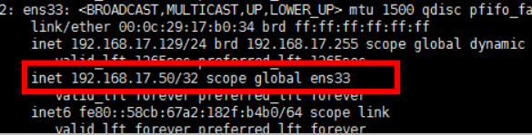


把主服务器（192.168.17.129）nginx 和 keepalived 停止，再输入 **192.168.17.50** 


# 9. Nginx 原理解析

## 9.1 master 和 worker


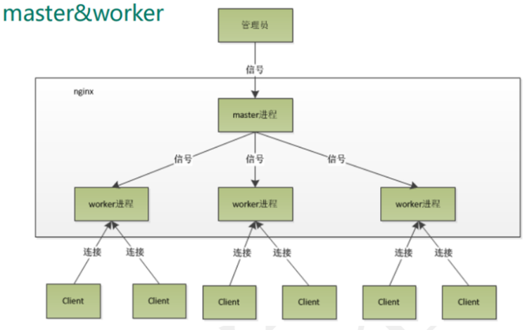

Nginx 默认采用**多进程**工作方式，Nginx 启动后，会运行一个 master 进程和多个 worker 进程。其中 master充 当整个进程组与用户的交互接口，同时对进程进行监护，管理 worker 进程来实现重启服务、平滑升级、更换日志文件、配置文件实时生效等功能。worker 用来处理基本的网络事件，worker 之间是平等的，他们共同**竞争**来处理来自客户端的请求。 


## 9.2 worker 如何进行工作


## 9.3 一个 master 和多个 worker 的好处

（1）可以使用 `nginx –s reload` 热部署，利用 nginx 进行热部署操作。

（2）每个 woker 是独立的进程，如果有其中的一个 woker 出现问题，其他 woker 独立的，继续进行争抢，实现请求过程，不会造成服务中断。 


**master-workers 的机制的好处：**

首先，对于每个 worker 进程来说，独立的进程，不需要加锁，所以省掉了锁带来的开销，同时在编程以及问题查找时，也会方便很多。其次，采用独立的进程，可以让互相之间不会影响，一个进程退出后，其它进程还在工作，服务不会中断，master 进程则很快启动新的 worker 进程。当然，worker 进程的异常退出，肯定是程序有 bug 了，异常退出，会导致当前 worker 上的所有请求失败，不过不会影响到所有请求，所以降低了风险。


## 9.4 设置多少个 woker 合适

**worker 数和服务器的 cpu 数相等是最为适宜的**

Nginx 同 redis 类似都采用了 **io 多路复用机制**，每个 worker 都是一个独立的进程，但每个进程里只有一个主线程，通过**异步非阻塞**的方式来处理请求， 即使是千上万个请求也不在话下。每个 worker 的线程可以把一个 cpu 的性能发挥到极致。所以 worker 数和服务器的 cpu 数相等是最为适宜的。设少了会浪费 cpu，设多了会造成 cpu 频繁切换上下文带来的损耗。 

```
#设置 worker 数量。
worker_processes 4
#work 绑定 cpu(4 work 绑定 4cpu)。
worker_cpu_affinity 0001 0010 0100 1000
#work 绑定 cpu (4 work 绑定 8cpu 中的 4 个) 。
worker_cpu_affinity 0000001 00000010 00000100 00001000
```


## 9.5 连接数 worker_connection

这个值是表示**每个 worker 进程所能建立连接的最大值**，所以，一个 nginx 能建立的最大连接数，应该是 `worker_connections * worker_processes`。当然，这里说的是最大连接数，对于 HTTP 请求本地资源来说，能够支持的最大并发数量是 `worker_connections * worker_processes`，如果是支持 http1.1 的浏览器每次访问要占两个连接，所以普通的静态访问最大并发数是： `worker_connections * worker_processes/2`，而如果是 HTTP 作为反向代理来说，最大并发数量应该是 `worker_connections * worker_processes/4`。因为作为反向代理服务器，每个并发会建立与客户端的连接和与后端服务的连接，会占用两个连接。

***

第一个问题：发送请求，占用了 woker 的几个**连接数**？

答案：2 或者 4 个

第二个问题：nginx 有一个 master，有四个 woker，每个 woker 支持最大的连接数 1024**，**支持的**最大并发数**是多少？ 

- 普通的静态访问最大并发数是：`worker_connections * worker_processes/2`

- 而如果是 HTTP 作 为反向代理来说，最大并发数量应该是 `worker_connections * worker_processes/4`

***

