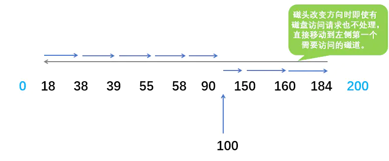

# 操作系统学习笔记

> 参考资料：
>
> - 《现代操作系统》 Tanenbaum A S, Bos H 
> - 《计算机操作系统》 汤子瀛, 哲凤屏, 汤小丹 
> - 《深入理解计算机系统》 Bryant, R. E., & O’Hallaron, D. R 
> - 《王道考研操作系统》

[toc]


# 一、 概述


## 1. 操作系统基本特征

### 1. 并发

**并发性**是指**宏观上在一段时间内能同时运行多个程序**，而**并行性**则指**同一时刻能运行多个指令**。

并行需要硬件支持，如多流水线或者多处理器。

操作系统通过引入进程和线程，使得程序能够并发运行。

### 2. 共享

共享是指**系统中的资源可以供多个并发进程共同使用**。

有两种共享方式：**互斥共享**和**同时共享**。

互斥共享的资源称为**临界资源**，例如打印机等，**在同一时间只允许一个进程访问，需要用同步机制来实现对临界资源的访问。**

### 3. 虚拟

虚拟技术**把一个物理实体转换为多个逻辑实体**。

主要有两种虚拟技术：**时分复用技术**和**空分复用技术**。例如多个进程能在同一个处理器上并发执行使用了时分复用技术，让每个进程轮流占有处理器，每次只执行一小个时间片并快速切换。

### 4. 异步

异步指**进程不是一次性执行完毕，而是走走停停，以不可知的速度向前推进。**


## 2. 操作系统基本功能

### 1. 进程管理

进程控制、进程同步、进程通信、死锁处理、处理机调度等。

### 2. 内存管理

内存分配、地址映射、内存保护与共享和内存扩充等功能。

### 3. 文件管理

文件存储空间的管理、目录管理及文件读写管理和保护等。

### 4. 设备管理

完成用户的 I/O 请求，方便用户使用各种设备，并提高设备的利用率，主要包括缓冲管理、设备分配、设备处理和虛拟设备等功能。


## 3. 用户态和内核态

为了限制不同程序的访问能力，防止一些程序访问其它程序的内存数据，CPU 划分了「用户态」和「内核态」两个权限等级。

- 用户态只能受限地访问内存，且不允许访问外围设备，没有占用 CPU 的能力，CPU 资源可以被其它程序获取。
- 内核态可以访问内存所有数据以及外围设备，也可以进行程序的切换。

所有用户程序都运行在用户态，但有时需要进行一些内核态的操作，比如从硬盘或者键盘读数据，这时就需要进行**系统调用**，使用 **陷阱指令**，CPU 切换到内核态，由操作系统代之执行相应的服务，再切换为用户态并返回系统调用的结果。

**为什么要分用户态和内核态？**

- **安全性**：防止用户程序恶意或者不小心破坏系统/内存/硬件资源。
- **封装性**：用户程序不需要实现更加底层的代码。
- **利于调度**：如果多个用户程序都在等待键盘输入，这时就需要进行调度；统一交给操作系统调度更加方便。

**如何从用户态切换到内核态？**

- **系统调用**：比如读取命令行输入，本质上还是通过中断实现。
- **用户程序发生异常时**：比如缺页异常
- **外围设备的中断**：外围设备完成用户请求的操作之后，会向 CPU 发出中断信号，这时 CPU 会转去处理对应的中断处理程序。


## 4. 系统调用

**如果一个进程在用户态需要使用内核态的功能，就进行系统调用从而陷入内核，由操作系统代为完成。**


Linux 的系统调用主要有以下这些：

|   Task   | Commands                         |
| :------: | -------------------------------- |
| 进程控制 | `fork()`  `exit()`  `wait()`     |
| 进程通信 | `pipe()`  `shmget()`  `mmap()`   |
| 文件操作 | `open()`  `read()`  `write()`    |
| 设备操作 | `ioctl()`  `read()`  `write()`   |
| 信息维护 | `getpid()`  `alarm()`  `sleep()` |
|   安全   | `chmod()`  `umask()`  `chown()`  |


## 5. 大内核和微内核

### 1. 大内核

大内核是**将操作系统功能作为一个紧密结合的整体放到内核**。

由于各模块共享信息，因此有很高的性能。

### 2. 微内核

由于操作系统不断复杂，因此将一部分操作系统功能移出内核，从而降低内核的复杂性。移出的部分根据分层的原则划分成若干服务，相互独立。

在微内核结构下，**操作系统被划分成小的、定义良好的模块，只有微内核这一个模块运行在内核态，其余模块运行在用户态。**

因为需要频繁地在用户态和核心态之间进行切换，所以会有一定的性能损失。


## 6. 中断分类

### 1. 外中断

**由 CPU 执行指令以外的事件引起**，如 I/O 结束中断，表示设备输入/输出处理已经完成，处理器能够发送下一个输入/输出请求。此外还有时钟中断、控制台中断等。

### 2. 异常

**由 CPU 执行指令的内部事件引起**，如非法操作码、地址越界、算术溢出等。

### 3. 陷入

**在用户程序中使用系统调用。**


# 二、进程管理


## 1. 进程、线程、协程

### 1. 进程

进程是**资源分配的基本单位**。

**进程控制块 (Process Control Block, PCB) 描述进程的基本信息和运行状态，所谓的创建进程和撤销进程，都是指对 PCB 的操作。**

下图显示了 4 个程序创建了 4 个进程，这 4 个进程可以并发地执行。


### 2. 线程

线程是**独立调度的基本单位**。

一个进程中可以有多个线程，它们**共享进程资源**。


### 3. 进程和线程的区别

- **拥有资源**：进程是资源分配的基本单位，但是线程不拥有资源，线程可以访问隶属进程的资源。
- **调度**：线程是独立调度的基本单位，在同一进程中，线程的切换不会引起进程切换，从一个进程内的线程切换到另一个进程中的线程时，会引起进程切换。
- **系统开销**：由于创建或撤销进程时，系统都要为之分配或回收资源，如内存空间、I/O 设备等，所付出的开销远大于创建或撤销线程时的开销。类似地，在进行进程切换时，涉及当前执行进程 CPU 环境的保存及新调度进程 CPU 环境的设置，而线程切换时只需保存和设置少量寄存器内容，开销很小。
- **通信方面**：进程间通信 (IPC) 需要进程同步和互斥手段的辅助，以保证数据的一致性。而线程间可以通过直接读/写同一进程中的数据段（如全局变量）来进行通信。
- **健壮性**：多线程程序只要有一个线程崩溃，整个程序就崩溃了，但多进程程序中一个进程崩溃并不会对其它进程造成影响，因为进程有自己的独立地址空间，因此多进程更加健壮。

> 举例：QQ 和浏览器是两个进程，浏览器进程里面有很多线程，例如 HTTP 请求线程、事件响应线程、渲染线程等等，线程的并发执行使得在浏览器中点击一个新链接从而发起 HTTP 请求时，浏览器还可以响应用户的其它事件。


**同一进程中的线程可以共享哪些数据？**

- **进程代码段**
- **进程的公有数据**（全局变量、静态变量...利用这些共享的数据，线程很容易的实现相互之间的通讯）
- **进程打开的文件描述符**
- **进程的当前目录**
- **信号处理器**：对收到的信号的处理方式
- **进程 ID 与进程组 ID**


**线程独占哪些资源？**

- **线程 ID**：每个线程都有自己的线程 ID，这个 ID 在本进程中是唯一的。进程用此来标识线程。

- **一组寄存器的值**： 由于线程间是并发运行的，每个线程有自己不同的运行线索，当从一个线程切换到另一个线程上时，必须将原有的线程的寄存器集合的状态保存，以便将来该线程在被重新切换到时能得以恢复。 

- **线程自身的栈**（堆是共享的）：线程可以调用函数，而被调用函数中又是可以层层嵌套的，所以线程必须拥有自己的函数栈，使得函数调用可以正常执行，不受其他线程的影响。 

- **错误返回码**：线程可能会产生不同的错误返回码，一个线程的错误返回码不应该被其它线程修改

- **信号掩码** (Signal mask)：由于每个线程所感兴趣的信号不同，所以线程的信号屏蔽码应该由线程自己管理。 

  > 信号掩码：表示是否屏蔽/阻塞相应的信号（`SIGKILL`, `SIGSTOP` 除外）

- **线程的优先级**：由于线程需要像进程那样能够被调度，那么就必须要有可供调度使用的参数，这个参数就是线程的优先级。 


### 4. 协程

协程是一种**用户态的轻量级线程**，协程的**调度完全由用户控制**。协程拥有自己的寄存器上下文和栈。协程调度切换时，将寄存器上下文和栈保存到其他地方，在切回来的时候，恢复先前保存的寄存器上下文和栈，直接操作栈则基本没有内核切换的开销，可以不加锁的访问全局变量，所以上下文的切换非常快。 

**协程与线程的比较：**

1. 一个线程可以拥有多个协程，一个进程也可以单独拥有多个协程。
2. 线程进程都是同步机制，而协程则是异步。
3. 协程能保留上一次调用时的状态，每次过程重入时，就相当于进入上一次调用的状态。


## 2. 进程状态的切换


- **创建态(new)** ：进程正在被创建，尚未到就绪状态。
- **就绪态(ready)** ：进程已处于准备运行状态（等待被调度），即**进程获得了除了处理器之外的一切所需资源**，一旦得到处理器资源(处理器分配的时间片)即可运行。
- **运行态(running)** ：进程正在处理器上上运行（单核 CPU 下任意时刻只有一个进程处于运行状态）。
- **阻塞态(waiting)** ：又称为等待状态（等待资源），**进程正在等待某一事件而暂停运行**如等待某资源为可用或等待 IO 操作完成。即使处理器空闲，该进程也不能运行。
- **结束态(terminated)** ：进程正在从系统中消失。可能是进程正常结束或其他原因中断退出运行。

状态转换条件：

- **就绪态→运行态：**处于就绪态的**进程被调度后，获得处理机资源**（分派处理机时间片），于是进程由就绪态转换为运行态。
- **运行态→就绪态：**处于运行态的进程在**时间片用完**后，不得不让出处理机，从而进程由运行态转换为就绪态。此外，在可剥夺的操作系统中，当有**更高优先级的进程就绪**时，调度程序将正在执行的进程转换为就绪态，让更高优先级的进程执行。
- **运行态→阻塞态：**进程请求某一资源（如外设）的使用和分配或等待某一事件的发生（如 I/O 操作的完成）时，它就从运行态转换为阻塞态。进程以**系统调用**的形式请求操作系统提供服务，这是一种由运行**用户态**程序调用操作系统内核过程的形式。
- **阻塞态→就绪态：进程等待事件到来**时，如 I/O 操作结束或中断结束时，中断处理程序必须把相应进程的状态由阻塞态转换为就绪态。

应该注意以下内容：

- 只有就绪态和运行态可以相互转换，其它的都是单向转换。就绪状态的进程通过调度算法从而获得 CPU 时间片，转为运行状态；而运行状态的进程，在分配给它的 CPU 时间片用完之后就会转为就绪状态，等待下一次调度。
- 阻塞状态是缺少需要的资源从而由运行状态转换而来，但是该资源不包括 CPU 时间，缺少 CPU 时间会从运行态转换为就绪态。


## 3. 调度算法

> 需要针对不同环境来讨论调度算法。

### 1. 批处理系统中的调度

#### 1.1 先来先服务 first-come first-serverd（FCFS）

调度**最先进入就绪队列**的作业。**非抢占式**，开销小，无饥饿问题，响应时间不确定（可能很慢）。

有利于长作业，但不利于短作业，因为短作业必须一直等待前面的长作业执行完毕才能执行，而长作业又需要执行很长时间，造成了短作业等待时间过长。

#### 1.2 短作业优先 shortest job first（SJF）

调度**估计运行时间最短**的作业。**非抢占式**，吞吐量高，开销可能较大，可能导致饥饿问题。

长作业有可能会饿死，处于一直等待短作业执行完毕的状态。因为如果一直有短作业到来，那么长作业永远得不到调度。

#### 1.3 最短剩余时间优先 shortest remaining time next（SRTN）

进程调度总是选择**预期剩余时间最短**的进程。 当一个新的作业到达时，其整个运行时间与当前进程的剩余时间作比较，如果新的进程需要的时间更少，则挂起当前进程，运行新的进程；否则新的进程等待。

短作业优先的**抢占式**版本，吞吐量高，开销可能较大，提供好的响应时间；像短作业优先一样，存在长进程饥饿的危险。

#### 1.4 高响应比优先调度算法 Highest Response Ratio Next（HRRN） 

高响应比优先调度算法主要用于作业调度，该算法是对先来先服务调度算法和短作业优先调度算法的一种综合平衡，同时考虑每个作业的等待时间和估计的运行时间。在每次进行作业调度时，先计算后备作业队列中每个作业的响应比，从中选出**响应比最高**的作业投入运行。

> 响应比 = (等待时间 + 要求服务时间) / 要求服务时间 = 响应时间 / 要求服务时间

**非抢占**，吞吐量高，开销可能较大，提供好的响应时间，无饥饿问题。 

> 这种调度算法主要是为了解决短作业优先调度算法长作业可能会饿死的问题，因为随着等待时间的增长，响应比也会越来越高。


### 2. 交互式系统中的调度

#### 2.1 优先级调度

优先级调度算法为每个进程分配一个优先级，每次从后备作业队列中**选择优先级最髙**的一个或几个作业，将它们调入内存，分配必要的资源，创建进程并放入就绪队列。在进程调度中，优先级调度算法每次从就绪队列中选择优先级最高的进程，将处理机分配给它，使之投入运行。具有相同优先级的进程以 FCFS 方式执行。可以根据内存要求，时间要求或任何其他资源要求来确定优先级。 

> 为了防止低优先级的进程永远等不到调度，可以随着时间的推移增加等待进程的优先级。 

#### 2.2 时间片轮转 Round Robin（RR）

将所有就绪进程按 FCFS 的原则排成一个队列，每次调度时，把 CPU 时间分配给队首进程，该进程可以执行一个时间片。当时间片用完时，由计时器发出时钟中断，调度程序便停止该进程的执行，并将它送往就绪队列的末尾，同时继续把 CPU 时间分配给队首的进程。

时间片轮转算法的效率和时间片的大小有很大关系。因为进程切换都要保存进程的信息并且载入新进程的信息，如果时间片太小，会导致进程切换得太频繁，在进程切换上就会花过多时间。

#### 2.3 多级反馈队列 Multilevel Feedback Queue（MFQ）


如果一个进程需要执行 100 个时间片，如果采用轮转调度算法，那么需要交换 100 次。多级队列是为这种需要连续执行多个时间片的进程考虑，它设置了多个队列，每个队列时间片大小都不同，例如 1,2,4,8,..。进程在第一个队列没执行完，就会被移到下一个队列。这种方式下，之前的进程只需要交换 7 次。

每个队列优先权也不同，最上面的优先权最高。因此只有上一个队列没有进程在排队，才能调度当前队列上的进程。

### 3. 实时系统中的调度

实时系统要求一个服务请求在一个确定时间内得到响应。

分为硬实时和软实时，前者必须满足绝对的截止时间，后者可以容忍一定的超时。


## 4. 进程同步

### 1. 临界区

**对临界资源（互斥资源/共享变量，一次只供一个进程使用）进行访问的那段代码称为临界区。**

为了互斥访问临界资源，每个进程在进入临界区之前，需要先进行检查。

```c
// entry section
// critical section;
// exit section
```

### 2. 同步与互斥

- 同步：**多个进程按一定顺序执行**；
- 互斥：多个进程在**同一时刻只有一个进程能进入临界区**。

### 3. 信号量

信号量（Semaphore）是一个整型变量，可以对其执行 `down` 和 `up` 操作，也就是常见的 P 和 V 操作。

- **down** : 如果信号量大于 0 ，执行 -1 操作；如果信号量等于 0，进程睡眠，等待信号量大于 0；
- **up** ：对信号量执行 +1 操作，唤醒睡眠的进程让其完成 down 操作。

`down` 和 `up` 操作需要被设计成**原语**，不可分割，通常的做法是**在执行这些操作的时候屏蔽中断**。

如果信号量的取值只能为 0 或者 1，那么就成为了 **互斥量（Mutex）** ，0 表示临界区已经加锁，1 表示临界区解锁。

```c
typedef int semaphore;
semaphore mutex = 1;void P1() {    
    down(&mutex);    
    // 临界区    
    up(&mutex);
}

void P2() {    
    down(&mutex);    
    // 临界区
    up(&mutex);
}
```

**使用信号量实现生产者-消费者问题**

问题描述：使用一个缓冲区来保存物品，只有缓冲区没有满，生产者才可以放入物品；只有缓冲区不为空，消费者才可以拿走物品。

因为缓冲区属于临界资源，因此需要使用一个互斥量 `mutex` 来控制对缓冲区的互斥访问。

为了同步生产者和消费者的行为，需要记录缓冲区中物品的数量。数量可以使用信号量来进行统计，这里需要使用两个信号量：empty 记录空缓冲区的数量，full 记录满缓冲区的数量。其中，empty 信号量是在生产者进程中使用，当 empty 不为 0 时，生产者才可以放入物品；full 信号量是在消费者进程中使用，当 full 信号量不为 0 时，消费者才可以取走物品。

注意，不能先对缓冲区进行加锁，再测试信号量。也就是说，不能先执行 `down(mutex)` 再执行 `down(empty)`。如果这么做了，那么可能会出现这种情况：生产者对缓冲区加锁后，执行 `down(empty)` 操作，发现 empty = 0，此时生产者睡眠。消费者不能进入临界区，因为生产者对缓冲区加锁了，也就无法执行 `up(empty)` 操作，empty 永远都为 0，那么生产者和消费者就会一直等待下去，造成死锁。

```c
#define N 100
typedef int semaphore;
semaphore mutex = 1;
semaphore empty = N;
semaphore full = 0;
void producer() { //生产者
    while(TRUE){
        int item = produce_item();
        down(&empty);
        down(&mutex);
        insert_item(item);
        up(&mutex);
        up(&full);
    }
}
void consumer() { //消费者
    while(TRUE){
        down(&full);
        down(&mutex);
        int item = remove_item();
        up(&mutex);
        up(&empty);
        consume_item(item);
    }
}
```

### 4. 管程

使用信号量机制实现的生产者消费者问题需要客户端代码做很多控制，而管程将共享变量以及对这些共享变量的操作封装起来，形成一个具有一定接口的功能模块，这样只能通过管程提供的某个过程才能访问管程中的资源。**进程只能互斥地使用管程，使用完之后必须释放管程并唤醒入口等待队列中的进程**。

> 管程把控制的代码独立出来，不仅不容易出错，也使得客户端代码调用更容易。

当一个进程试图进入管程时，在**入口等待队列**等待。若 P 进程唤醒了 Q 进程，则 Q 进程先执行，P 在**紧急等待队列**中等待。（ **HOARE 管程** ） 

C 语言不支持管程，下面的示例代码使用了类 Pascal 语言来描述管程。示例代码的管程提供了 `insert()` 和 `remove()` 方法，客户端代码通过调用这两个方法来解决生产者-消费者问题。

```Pascal 
monitor ProducerConsumer
    integer i;
    condition c;
    procedure insert();
    begin
        // ...
    end;
    procedure remove();
    begin
        // ...
    end;
end monitor;
```

管程的重要特性：**在一个时刻只能有一个进程使用管程。进程在无法继续执行的时候不能一直占用管程，否者其它进程永远不能使用管程。**

管程引入了 **条件变量** 以及相关的操作：`wait()` 和 `signal()` 来实现同步操作。对条件变量执行 `wait()` 操作会导致调用进程阻塞，把管程让出来给另一个进程持有。`signal()` 操作用于唤醒被阻塞的进程。

**使用管程实现生成者-消费者问题**

```Pascal 
// 管程
monitor ProducerConsumer
    condition full, empty;
    integer count := 0;
    condition c;
    procedure insert(item: integer);
    begin
        if count = N then wait(full);
        insert_item(item);
        count := count + 1;
        if count = 1 then signal(empty);
    end;
    function remove: integer;
    begin
        if count = 0 then wait(empty);
        remove = remove_item;
        count := count - 1;
        if count = N -1 then signal(full);
    end;
end monitor;
// 生产者客户端
procedure producer
begin
    while true do
    begin
        item = produce_item;
        ProducerConsumer.insert(item);
    end
end;
// 消费者客户端
procedure consumer
begin
    while true do
    begin
        item = ProducerConsumer.remove;
        consume_item(item);
    end
end;
```


## 5. 经典同步问题

### 1. 生产者-消费者问题

> 生产者和消费者问题前面已经讨论过了。

问题描述：使用一个缓冲区来保存物品，只有缓冲区没有满，生产者才可以放入物品；只有缓冲区不为空，消费者才可以拿走物品。

这里使用 Java 的阻塞队列 `ArrayBlockingQueue` 实现一个简单的生产者-消费者模型：

```java
public class Test {
    private int queueSize = 10;
    private ArrayBlockingQueue<Integer> queue = new ArrayBlockingQueue<Integer>(queueSize);

    public static void main(String[] args) {
        Test test = new Test();
        Producer producer = test.new Producer();
        Consumer consumer = test.new Consumer();

        producer.start();
        consumer.start();
    }

    class Consumer extends Thread {
        @Override
        public void run() {
            consume();
        }

        private void consume() {
            while(true){
                try {
                    queue.take();
                    System.out.println("从队列取走一个元素，队列剩余"+queue.size()+"个元素");
                } catch (InterruptedException e) {
                    e.printStackTrace();
                }
            }
        }
    }

    class Producer extends Thread {
        @Override
        public void run() {
            produce();
        }

        private void produce() {
            while(true){
                try {
                    queue.put(1);
                    System.out.println("向队列取中插入一个元素，队列剩余空间："+(queueSize-queue.size()));
                } catch (InterruptedException e) {
                    e.printStackTrace();
                }
            }
        }
    }
}
```


### 2. 读者-写者问题

**允许多个进程同时对数据进行读操作，但是不允许读和写以及写和写操作同时发生。**

一个整型变量 count 记录在对数据进行读操作的进程数量，一个互斥量 count_mutex 用于对 count 加锁，一个互斥量 data_mutex 用于对读写的数据加锁。

```c
typedef int semaphore;
semaphore count_mutex = 1;
semaphore data_mutex = 1;
int count = 0;
void reader() {
    while(TRUE) {
        down(&count_mutex);
        count++;
        if(count == 1) down(&data_mutex); // 第一个读者需要对数据进行加锁，防止写进程访问
        up(&count_mutex);
        read();
        down(&count_mutex);
        count--;
        if(count == 0) up(&data_mutex);
        up(&count_mutex);
    }
}
void writer() {
    while(TRUE) {
        down(&data_mutex);
        write();
        up(&data_mutex);
    }
}
```

### 3. 哲学家进餐问题


五个哲学家围着一张圆桌，每个哲学家面前放着食物。哲学家的生活有两种交替活动：吃饭以及思考。当一个哲学家吃饭时，需要先拿起自己左右两边的两根筷子，并且一次只能拿起一根筷子。

下面是一种错误的解法，考虑到如果所有哲学家同时拿起左手边的筷子，那么就无法拿起右手边的筷子，造成死锁。

```c
#define N 5
void philosopher(int i) {
    while(TRUE) {
        think();
        take(i);       // 拿起左边的筷子
        take((i+1)%N); // 拿起右边的筷子
        eat();
        put(i);
        put((i+1)%N);
    }
}
```

为了防止死锁的发生，可以设置两个条件：

1. 必须同时拿起左右两根筷子；
2. 只有在两个邻居都没有进餐的情况下才允许进餐。

```c
#define N 5
#define LEFT (i + N - 1) % N // 左邻居
#define RIGHT (i + 1) % N    // 右邻居
#define THINKING 0
#define HUNGRY   1
#define EATING   2
typedef int semaphore;
int state[N];                // 跟踪每个哲学家的状态
semaphore mutex = 1;         // 临界区的互斥
semaphore s[N];              // 每个哲学家一个信号量
void philosopher(int i) {
    while(TRUE) {
        think();
        take_two(i);
        eat();
        put_tow(i);
    }
}
void take_two(int i) {
    down(&mutex);
    state[i] = HUNGRY;
    test(i);
    up(&mutex);
    down(&s[i]);
}
void put_tow(i) {
    down(&mutex);
    state[i] = THINKING;
    test(LEFT);
    test(RIGHT);
    up(&mutex);
}
void test(i) {         // 尝试拿起两把筷子
    if(state[i] == HUNGRY && state[LEFT] != EATING && state[RIGHT] !=EATING) {
        state[i] = EATING;
        up(&s[i]);
    }
}
```


## 6. 进程通信

### 1. 进程同步与进程通信的区别

- 进程同步：控制多个进程按一定顺序执行；
- 进程通信：进程间传输信息。

**进程通信是一种手段，而进程同步是一种目的**。也可以说，为了能够达到进程同步的目的，需要让进程进行通信，传输一些进程同步所需要的信息。

在进程同步中介绍的信号量也属于进程通信的一种方式，但是属于低级别的进程通信，因为它传输的信息非常小。

### 2. 进程通信方式

#### 2.1 消息传递

操作系统提供了用于通信的「通道（Channel）」，进程可以通过读写这个通道进行通信。


**（一）管道**

写进程在管道的尾端写入数据，读进程在管道的首端读出数据。管道提供了简单的流控制机制，进程试图读空管道时，在有数据写入管道前，进程将一直阻塞。同样地，管道已经满时，进程再试图写管道，在其它进程从管道中移走数据之前，写进程将一直阻塞。**管道是半双工的**。

> Linux 中管道通过空文件实现。

管道有三种：

1. **普通管道（匿名管道）**：有两个限制，一是**只能单向传输**；二是**只能在父子/兄弟进程之间使用**；
2. **流管道**：去除第一个限制，支持双向传输，但只能在父子/兄弟进程之间使用；
3. **命名管道**：去除第二个限制，**支持双向传输，而且可以在不相关进程之间进行通信**。


**（二）消息队列**

消息队列**克服了信号传递信息少、管道只能承载无格式字节流以及缓冲区大小受限等缺点**。且其中的**消息具有特定的格式以及特定的优先级**，可以实现**消息的随机查询**，消息**不一定要以先进先出的次序读取，也可以按消息的类型读取。**


**（三）套接字**

套接字也是一种进程间通信机制，与其它通信机制不同的是，它可用于 **不同机器间** 的进程通信。主要用于在客户端和服务器之间通过 **网络** 进行通信。


#### 2.2 共享内存

操作系统建立一块共享内存，并将其映射到每个进程的地址空间上，进程就可以直接对这块共享内存进行读写。

共享内存是 **最快** 的进程通信方式。但需要依靠某种同步操作，如互斥锁和信号量等。 


## 7. 守护进程、僵尸进程、孤儿进程

### 1. 守护进程

指**在后台运行的，没有控制终端与之相连的进程**。它独立于控制终端，周期性地执行某种任务。Linux 的大多数服务器就是用守护进程的方式实现的，如 web 服务器进程 http 等。

创建守护进程要点：

1. 让程序在后台执行。方法是调用 `fork()` 产生一个子进程，然后使父进程退出。
2. 调用 `setsid()` 创建一个新对话期。控制终端、登录会话和进程组通常是从父进程继承下来的，守护进程要摆脱它们，不受它们的影响，方法是调用 `setsid()` 使进程成为一个会话组长。`setsid()` 调用成功后，进程成为新的会话组长和进程组长，并与原来的登录会话、进程组和控制终端脱离。
3. 禁止进程重新打开控制终端。经过以上步骤，进程已经成为一个无终端的会话组长，但是它可以重新申请打开一个终端。为了避免这种情况发生，可以通过使进程不再是会话组长来实现。再一次通过 `fork()` 创建新的子进程，使调用 `fork` 的进程退出。
4. 关闭不再需要的文件描述符。子进程从父进程继承打开的文件描述符。如不关闭，将会浪费系统资源，造成进程所在的文件系统无法卸下以及引起无法预料的错误。首先获得最高文件描述符值，然后用一个循环程序，关闭0到最高文件描述符值的所有文件描述符。
5. 将当前目录更改为根目录。
6. 子进程从父进程继承的文件创建屏蔽字可能会拒绝某些许可权。为防止这一点，使用 `unmask(0)` 将屏蔽字清零。
7. 处理 SIGCHLD 信号。对于服务器进程，在请求到来时往往生成子进程处理请求。如果子进程等待父进程捕获状态，则子进程将成为僵尸进程（zombie），从而占用系统资源。如果父进程等待子进程结束，将增加父进程的负担，影响服务器进程的并发性能。在Linux下可以简单地将 SIGCHLD 信号的操作设为 SIG_IGN。这样，子进程结束时不会产生僵尸进程。


### 2. 僵尸进程

**如果子进程先退出，父进程还没退出，那么子进程必须等到父进程捕获（调用 `wait` 或 `waitpid()`）到了子进程的退出状态才真正结束，否则这个时候子进程就成为僵尸进程。**

设置僵尸进程的目的是**维护子进程的信息**，以便父进程在以后某个时候获取。这些信息至少包括进程 ID、进程的终止状态，以及该进程使用的 CPU 时间等，所以当终止子进程的父进程调用 `wait` 或 `waitpid` 时就可以得到这些信息。如果一个进程终止，而该进程有子进程处于僵尸状态，那么它的所有僵尸子进程的父进程 ID 将被重置为1（init 进程）。继承这些子进程的 init 进程将清理它们（也就是说 init 进程将 `wait` 它们，从而去除它们的僵尸状态）。

#### 2.1 僵尸进程的危害

如果进程不调用 `wait/waitpid` 的话， 那么子进程保留的那段信息就不会释放，其**进程号就会一直被占用，但是系统所能使用的进程号是有限的，如果大量的产生僵死进程，将因为没有可用的进程号而导致系统不能产生新的进程**。 

#### 2.2 如何避免僵尸进程？

- 通过 `signal(SIGCHLD, SIG_IGN)` 通知内核对子进程的结束不关心，由内核回收。如果不想让父进程挂起，可以在父进程中加入一条语句：`signal(SIGCHLD,SIG_IGN);` 表示父进程忽略 SIGCHLD 信号，该信号是子进程退出的时候向父进程发送的。
- 父进程调用 `wait/waitpid` 等函数等待子进程结束，如果尚无子进程退出 `wait` 会导致父进程阻塞，直到它的一个子进程结束为止 。`waitpid` 可以通过传递 WNOHANG 使父进程不阻塞立即返回。
- 如果父进程很忙可以用 `signal` 注册信号处理函数，在信号处理函数调用 `wait/waitpid` 等待子进程退出。
- 通过两次调用 `fork`。父进程首先调用 `fork` 创建一个子进程然后 `waitpid` 等待子进程退出，子进程再 `fork` 一个孙进程后退出。这样子进程退出后会被父进程等待回收，而对于孙子进程其父进程已经退出所以孙进程成为一个孤儿进程，孤儿进程由 init 进程接管，孙进程结束后，init 会等待回收。


### 3. 孤儿进程

**一个父进程退出，而它的一个或多个子进程还在运行，那么那些子进程将成为孤儿进程**。孤儿进程将被 init 进程(进程号为1)所收养，并由 init 进程对它们完成状态收集工作。

孤儿进程是没有父进程的进程，每当出现一个孤儿进程的时候，内核就把孤儿进程的父进程设置为 init，而 init 进程会循环地 `wait()` 它的已经退出的子进程。这样，当一个孤儿进程凄凉地结束了其生命周期的时候，init 进程就会处理它的一切善后工作。因此**孤儿进程并不会有什么危害**。 


## 8. 进程的异常控制流

### 1. 陷阱

陷阱是**有意**造成的 “ 异常 ”，是执行一条指令的结果。陷阱是同步的。陷阱的主要作用是实现 **系统调用**。比如，进程可以执行 `syscall n` 指令向内核请求服务，当进程执行这条指令后，会中断当前的控制流，**陷入**到内核态，执行相应的系统调用。内核的处理程序在执行结束后，会将结果返回给进程，同时退回到用户态。进程此时继续执行**下一条指令**。 

### 2. 中断

中断由**处理器外部的硬件**产生，不是执行某条指令的结果，也无法预测发生时机。由于中断独立于当前执行的程序，因此中断是异步事件。中断包括 I/O 设备发出的 I/O 中断、各种定时器引起的时钟中断、调试程序中设置的断点等引起的调试中断等。 

### 3. 异常

异常是一种错误情况，是执行当前指令的结果，可能被错误处理程序修正，也可能直接终止应用程序。异常是同步的。这里特指因为执行当前指令而产生的**错误情况**，比如除法异常、缺页异常等。有些书上为了区分，也将这类 “异常” 称为 “ **故障** ”。 

### 4. 信号

信号是一种**更高层的**软件形式的异常，同样会中断进程的控制流，可以由进程进行处理。一个信号代表了一个消息。信号的作用是用来**通知进程**发生了某种系统事件。 


## 9. IO 多路复用

### 1. 概念及原理

IO 多路复用（IO Multiplexing）是指**单个进程/线程就可以同时处理多个 IO 请求**。

**实现原理**：用户将**想要监视的文件描述符**（File Descriptor）添加到 `select/poll/epoll` 函数中，由内核监视，函数阻塞。一旦有文件描述符就绪（读就绪或写就绪）或者超时（设置 `timeout`），函数就会返回，然后该进程可以进行相应的读/写操作。

**什么是文件描述符 ？**

文件描述符在形式上是一个非负整数。实际上，它是一个索引值，**指向内核为每一个进程所维护的该进程打开文件的记录表**。当程序打开一个现有文件或者创建一个新文件时，内核向进程返回一个文件描述符。

内核通过文件描述符来访问文件，文件描述符指向一个文件。

### 2. select/poll/epoll

- `select`：将文件描述符放入一个**集合**中，调用 `select` 时，将这个集合从用户空间**拷贝**到内核空间，由内核根据就绪状态修改该集合的内容。**集合大小有限制**，32 位机默认是 1024 (64 位：2048)；采用**水平触发**机制。`select` 函数返回后，需要通过遍历这个集合，找到就绪的文件描述符，当文件描述符的数量增加时，效率会线性下降。

  缺点：

  1. 把集合从用户空间拷贝到内存空间每次都要复制，**开销大**。
  2. **集合大小有限制**。
  3. **轮询的方式效率较低**。

- `poll`：和 `select` 几乎没有区别，区别在于文件描述符的存储方式不同，`poll` 采用**链表**的方式存储，**没有最大存储数量的限制**；

- `epoll`：通过**内核和用户空间共享内存**，避免了不断复制的问题；支持的同时连接数上限很高 (1G 左右的内存支持 10 W 左右的连接数)；文件描述符就绪时，**采用回调机制，避免了轮询**（回调函数将就绪的描述符添加到一个链表中，执行 `epoll_wait` 时，返回这个链表)；**支持水平触发和边缘触发**，采用边缘触发机制时，只有活跃的描述符才会触发回调函数。

总结区别主要在于：

- 一个线程/进程所能打开的最大连接数
- 文件描述符传递方式（是否复制）
- 水平触发 or 边缘触发
- 查询就绪的描述符时的效率（是否轮询）


**什么时候使用 select/poll，什么时候使用 epoll ？**

当**连接数较多并且有很多的不活跃连接**时，`epoll` 的效率比其它两者高很多；但是当**连接数较少并且都十分活跃**的情况下，由于 `epoll` 需要很多回调，因此性能可能低于其它两者。 


**什么是水平触发？什么是边缘触发？**

- 水平触发（LT，Level Trigger）模式下，只要一个文件描述符就绪，就会触发通知，如果用户程序没有一次性把数据读写完，下次还会通知；
- 边缘触发（ET，Edge Trigger）模式下，当描述符从未就绪变为就绪时通知一次，之后不会再通知，直到再次从未就绪变为就绪（缓冲区从「不可读/写」变为「可读/写」）。

区别：**边缘触发效率更高，减少了被重复触发的次数，函数不会返回大量用户程序可能不需要的文件描述符**。

> 为什么边缘触发一定要用非阻塞（non-block）IO：避免由于一个描述符的阻塞读/阻塞写操作让处理其它描述符的任务出现饥饿状态。


### 3. 常见的 IO 模型

- **同步阻塞 IO (Blocking IO, BIO)**：用户线程发起 IO 读/写操作之后，线程阻塞，直到可以开始处理数据；对 CPU 资源的利用率不够；
- **同步非阻塞 IO (Non-blocking IO, NIO)**：发起 IO 请求之后可以立即返回，如果没有就绪的数据，线程不会阻塞，但是需要不断地发起 IO 请求直到数据就绪；不断重复请求消耗了大量的 CPU 资源；
- **异步 IO (Asynchronous IO, AIO)**：用户线程发出 IO 请求之后，继续执行，由内核进行数据的读取并放在用户指定的缓冲区内，在 IO 完成之后通知用户线程直接使用。
- **IO 多路复用**


# 三、死锁

## 1. 什么是死锁

死锁，是指**多个进程在运行过程中因为相互争夺资源而造成的一种僵局**，当进程处于这种僵持状态时，若无外力作用，它们都将无法再向前推进。如下图所示：


## 2. 死锁的必要条件


1. **互斥**：进程要求对所分配的资源进行排它性控制，即在一段时间内某资源仅为一进程所占用。
2. **占有和等待**：一个进程至少占有一个资源，并在等待另一个被其它进程占用的资源。
3. **不可抢占**：已经分配给一个进程的资源不能强制性地被抢占，它只能被占有它的进程显式地释放。
4. **环路等待**：若干进程组成一条环路，该环路中的每个进程都在等待下一个进程所占有的资源。


## 3. 死锁的处理方法

### 1. 鸵鸟策略

> 把头埋在沙子里，假装根本没发生问题。

因为解决死锁问题的代价很高，因此鸵鸟策略这种不采取任务措施的方案会获得更高的性能。当**发生死锁时不会对用户造成多大影响，或发生死锁的概率很低**，可以采用鸵鸟策略。

大多数操作系统，包括 Unix，Linux 和 Windows，处理死锁问题的办法仅仅是忽略它。


### 2. 死锁预防

在程序运行之前预防发生死锁。基本思想是破坏形成死锁的四个必要条件： 

**（一）破坏互斥条件**

允许某些资源同时被多个进程访问，但是有些资源本身并不具有这种属性，因此这种方案实用性有限。

**（二）破坏占有和等待条件**

- 实行资源预先分配策略（当一个进程开始运行之前，必须一次性向系统申请它所需要的全部资源，否则不运行）。
- 只允许进程在没有占用资源的时候才能申请资源（申请资源前先释放占有的资源）；

缺点：很多时候无法预知一个进程所需的全部资源；同时，会降低资源利用率，降低系统的并发性。

**（三）破坏不可抢占条件**

允许进程强行抢占被其它进程占有的资源，会降低系统性能。

**（四）破坏环路等待**

对所有资源统一编号，所有进程对资源的请求必须按照序号递增的顺序提出，即只有占有了编号较小的资源才能申请编号较大的资源。这样避免了占有大号资源的进程去申请小号资源。 


### 3. 死锁避免

在程序运行时避免发生死锁。动态地检测资源分配状态，以确保系统处于安全状态，只有处于安全状态时才会进行资源的分配。 

**（一）安全状态**

定义：如果没有死锁发生，并且即使所有进程突然请求对资源的最大需求，也仍然存在某种调度次序能够使得每一个进程运行完毕，则称该状态是安全的。


图 a 的第二列 Has 表示已拥有的资源数，第三列 Max 表示总共需要的资源数，Free 表示还有可以使用的资源数。从图 a 开始出发，先让 B 拥有所需的所有资源（图 b），运行结束后释放 B，此时 Free 变为 5（图 c）；接着以同样的方式运行 C 和 A，使得所有进程都能成功运行，因此可以称图 a 所示的状态时安全的。

安全状态的检测与死锁的检测类似，因为安全状态必须要求不能发生死锁。下面的银行家算法与死锁检测算法非常类似，可以结合着做参考对比。

**（二）单个资源的银行家算法**

一个小城镇的银行家，他向一群客户分别承诺了一定的贷款额度，算法要做的是判断对请求的满足是否会进入不安全状态，如果是，就拒绝请求；否则予以分配。


上图 c 为不安全状态，因此算法会拒绝之前的请求，从而避免进入图 c 中的状态。

**（三）多个资源的银行家算法**


上图中有五个进程，四个资源。左边的图表示已经分配的资源，右边的图表示还需要分配的资源。最右边的 E、P 以及 A 分别表示：总资源、已分配资源以及可用资源，注意这三个为向量，而不是具体数值，例如 A=(1020)，表示 4 个资源分别还剩下 1/0/2/0。

检查一个状态是否安全的算法如下：

- 查找右边的矩阵是否存在一行小于等于向量 A。如果不存在这样的行，那么系统将会发生死锁，状态是不安全的。
- 假若找到这样一行，将该进程标记为终止，并将其已分配资源加到 A 中。
- 重复以上两步，直到所有进程都标记为终止，则状态时安全的。

如果一个状态不是安全的，也需要拒绝进入这个状态。


### 4. 死锁检测与死锁恢复

不试图阻止死锁，而是当检测到死锁发生时，采取措施进行恢复。

> 如何检测死锁：检测有向图是否存在环；或者使用类似死锁避免的检测算法。 

**（一）每种类型一个资源的死锁检测**


上图为资源分配图，其中方框表示资源，圆圈表示进程。资源指向进程表示该资源已经分配给该进程，进程指向资源表示进程请求获取该资源。

图 a 可以抽取出环，如图 b，它满足了环路等待条件，因此会发生死锁。

每种类型一个资源的死锁检测算法是**通过检测有向图是否存在环来实现**，从一个节点出发进行深度优先搜索，对访问过的节点进行标记，如果访问了已经标记的节点，就表示有向图存在环，也就是检测到死锁的发生。

**（二）每种类型多个资源的死锁检测**


上图中，有三个进程四个资源，每个数据代表的含义如下：

- E 向量：资源总量
- A 向量：资源剩余量
- C 矩阵：每个进程所拥有的资源数量，每一行都代表一个进程拥有资源的数量
- R 矩阵：每个进程请求的资源数量

进程 P1 和 P2 所请求的资源都得不到满足，只有进程 P3 可以，让 P3 执行，之后释放 P3 拥有的资源，此时 A = (2 2 2 0)。P2 可以执行，执行后释放 P2 拥有的资源，A = (4 2 2 1) 。P1 也可以执行。所有进程都可以顺利执行，没有死锁。

算法总结如下：

每个进程最开始时都不被标记，执行过程有可能被标记。当算法结束时，任何没有被标记的进程都是死锁进程。

1. 寻找一个没有标记的进程 Pi，它所请求的资源小于等于 A。
2. 如果找到了这样一个进程，那么将 C 矩阵的第 i 行向量加到 A 中，标记该进程，并转回 1。
3. 如果没有这样一个进程，算法终止。

**（三）死锁恢复**

- **资源剥夺**：挂起某些死锁进程，并抢占它的资源，将这些资源分配给其他死锁进程（但应该防止被挂起的进程长时间得不到资源）；
- **撤销进程**：强制撤销部分、甚至全部死锁进程并剥夺这些进程的资源（撤销的原则可以按进程优先级和撤销进程代价的高低进行）；
- **进程回退**：让一个或多个进程回退到足以避免死锁的地步。进程回退时自愿释放资源而不是被剥夺。要求系统保持进程的历史信息，设置还原点。


# 四、内存管理


## 1. 虚拟内存

每个程序拥有自己的地址空间，这个地址空间被分割成**大小相等的页**。这些页被映射到物理内存，但**不需要映射到连续的物理内存，也不需要所有页都必须在物理内存中**。当程序引用到一部分不在物理内存中的地址空间时，由硬件执行必要的映射，**将缺失的部分装入物理内存**并重新执行失败的指令。

这样对于程序来说，逻辑上似乎有很大的内存空间，但实际上有一部分是存储在磁盘上，因此叫做虚拟内存。 

优点：**让程序可以获得更多的可用内存**。 


## 2. 分页与分段

### 1. 分页

**用户进程地址空间**划分成大小相等的**页 (page)**，在**物理内存**中对应的同样大小的单元称为**页框**，它们之间通过**页表**进行映射。**分配时以页为单位，按进程需要的页数分配，逻辑上相邻的页物理上不一定相邻**。

程序最开始只将一部分页调入页框中，当程序引用到没有在页框的页时，产生缺页中断，进行页面置换，按一定的原则将一部分页框换出，并将页调入。

大部分虚拟内存系统都使用分页技术。把由程序产生的地址称为虚拟地址，它们构成了一个虚拟地址空间。例如有一台计算机可以产生 16 位地址，它的虚拟地址空间为 0~64K，然而计算机只有 32KB 的物理内存，因此虽然可以编写 64KB 的程序，但它们不能被完全调入内存运行。


### 2. 分段

**用户进程地址空间**按照自身**逻辑关系**划分为若干个**段 (segment)**，如代码段、数据段、堆栈段，每个段的长度可以不同，并且可以动态增长。内存空间被动态划分为长度不同的区域，**分配时以段为单位，每段在内存中占据连续空间，各段可以不相邻**。


上图为一个编译器在编译过程中建立的多个表，有 4 个表是动态增长的，如果使用分页系统的一维地址空间，动态增长的特点会导致覆盖问题的出现。


### 3. 段页式

**程序的地址空间按逻辑单位分成基本独立的段，而每一段有自己的段名，再把每段分成固定大小的若干页。**

**内存划分和分配按页，程序对内存的调入或调出是按页进行的，但它又可按段实现共享和保护。**


### 4. 分页与分段区别

- **目的不同**：分页的目的是管理内存，用于虚拟内存以获得更大的地址空间；分段的目的是满足用户的需要，使程序和数据可以被划分为逻辑上独立的地址空间。

- **地址空间的维度**：分页是一维地址空间 (每个进程一个页表/多级页表，通过一个逻辑地址就能找到对应的物理地址)； 分段是二维地址空间 (段号+段内偏移)。

- **大小是否可以改变**：页的大小不可变，段的大小可以动态改变。

- **碎片**：分段没有内碎片，但会产生外碎片；分页没有外碎片，但会产生内碎片（一个页填不满）。 

  


## 3. 分页系统地址映射

- **内存管理单元 (MMU)**：管理着虚拟地址空间和物理内存的转换。
- **页表 (Page table)**：页（虚拟地址空间）和页框（物理内存空间）的映射表。例如下图中，页表的第 0 个表项为 010，表示第 0 个页映射到第 2 个页框。页表项的最后一位用来标记页是否在内存中。

下图的页表存放着 16 个页，这 16 个页需要用 4 个比特位来进行索引定位。因此对于虚拟地址（0010 000000000100），前 4 位是用来存储页面号，而后 12 位存储在页中的偏移量。

（0010 000000000100）根据前 4 位得到页号为 2，读取表项内容为（110 1），它的前 3 为为页框号，最后 1 位表示该页在内存中。最后映射得到物理内存地址为（110 000000000100）。


## 4. 页面置换算法

在程序运行过程中，如果要访问的页面不在内存中，就发生缺页中断从而将该页调入内存中。此时如果内存已无空闲空间，系统必须从内存中调出一个页面到磁盘对换区中来腾出空间。

页面置换算法的主要目标是**使页面置换频率最低（也可以说缺页率最低）**。

### 1. 最佳 OPT

> Optimal

所选择的被换出的页面将是**最长时间内不再被访问**，通常可以保证获得最低的缺页率。

是一种理论上的算法，因为无法知道一个页面多长时间不再被访问。

### 2. 先进先出 FIFO

> FIFO, First In First Out

所选择换出的页面是最先进入的页面。

该算法会将那些经常被访问的页面也被换出，从而使缺页率升高。

### 3. 最近最久未使用 LRU

> LRU, Least Recently Used

虽然无法知道将来要使用的页面情况，但是可以知道过去使用页面的情况。LRU 将最近最久未使用的页面换出。

可以用栈来实现该算法，栈中存储页面的页面号。当进程访问一个页面时，将该页面的页面号从栈移除，并将它压入栈顶。这样，最近被访问的页面总是在栈顶，而最近最久未使用的页面总是在栈底。

下图中栈中每个格子相当于一个个页框，数字即为页面号：


### 4. 时钟 CLOCK

需要用到一个访问位，当一个页面被访问时，将访问位置为 1。

首先，将内存中的所有页面链接成一个循环队列，当缺页中断发生时，检查当前指针所指向页面的访问位，如果访问位为 0，就将该页面换出；否则将该页的访问位设置为 0，给该页面第二次的机会，移动指针继续检查。


***

**局部性原理：**

- 时间上：最近被访问的页在不久的将来还会被访问；
- 空间上：内存中被访问的页周围的页也很可能被访问。

**颠簸现象：**

颠簸本质上是指**频繁的页调度行为**。进程发生缺页中断时必须置换某一页，然而，其他所有的页都在使用，它置换一个页，但又立刻再次需要这个页。因此会**不断产生缺页中断，导致整个系统的效率急剧下降**，这种现象称为颠簸。内存颠簸的解决策略包括：

- 修改页面置换算法
- 降低同时运行的程序的数量
- 终止该进程或增加物理内存容量

***


# 五、设备管理

## 1. 磁盘调度算法


### 1. 一次磁盘读/写操作需要的时间

**寻找时间（寻道时间）Ts**：在读/写数据前，需要将磁头移动到指定磁道所花费的时间。

寻道时间分两步：

> (1) 启动磁头臂消耗的时间：s
>
> (2) 移动磁头消耗的时间：假设磁头匀速移动，每跨越一个磁道消耗时间为 m，共跨越 n 条磁道。

则寻道时间  **Ts = s + m \* n。**

磁头移动到指定的磁道，但是不一定正好在所需要读/写的扇区，所以需要通过磁盘旋转使磁头定位到目标扇区。

  

**延迟时间TR**：通过旋转磁盘，使磁头定位到目标扇区所需要的时间。设磁盘转速为 r（单位：转/秒，或转/分），则**平均所需延迟时间TR** = (1/2)*(1/r) = 1/2r。

> 1/r 就是转一圈所需的时间。找到目标扇区平均需要转半圈，因此再乘以1/2。

**传输时间TR**：从磁盘读出或向磁盘中写入数据所经历的时间，假设磁盘转速为 r，此次读/写的字节数为 b，每个磁道上的字节数为 N，则传输时间**TR** = (b/N) * (1/r) = b/(rN)。

> 每个磁道可存 N 字节数据，因此 b 字节数据需要 b/N 个磁道才能存储。而读/写一个磁道所需的时间刚好是转一圈的时间 1/r。

总的平均时间 **Ta = Ts + 1/2r + b/(rN)**，由于延迟时间和传输时间都是与磁盘转速有关的，且是线性相关。而转速又是磁盘的固有属性，因此无法通过操作系统优化延迟时间和传输时间。所以只能优化寻找时间。


### 2. 磁盘调度算法

当多个进程同时请求访问磁盘时，需要进行磁盘调度来控制对磁盘的访问。

磁盘调度的主要目标是使磁盘的平均寻道时间最少。

####  1. 先来先服务算法（FCFS）

算法思想：**根据进程请求访问磁盘的先后顺序进行调度。**

假设磁头的初始位置是100号磁道，有多个进程先后陆续地请求访问55、58、39、18、90、160、150、38、184号磁道。
按照先来先服务算法规则，按照请求到达的顺序，磁头需要一次移动到55、58、39、18、90、160、150、38、184号磁道。
   

磁头共移动了 45 + 3 + 19 + 21 + 72 + 70 + 10 + 112 + 146 = 498 个磁道。响应一个请求平均需要移动 498 / 9 = 55.3个磁道（平均寻找长度）。

- 优点：**公平；如果请求访问的磁道比较集中的话，算法性能还算可以**。
- 缺点：**如果大量进程竞争使用磁盘，请求访问的磁道很分散，FCFS在性能上很差，寻道时间长**。


####  2. 最短寻找时间优先（SSTF）

算法思想：**优先处理的磁道是与当前磁头最近的磁道。可以保证每次寻道时间最短，但是不能保证总的寻道时间最短**。（其实是贪心算法的思想，只是选择眼前最优，但是总体未必最优）。

假设磁头的初始位置是100号磁道，有多个进程先后陆续地请求访问55、58、39、18、90、160、150、38、184号磁道。

  

磁头总共移动了（100 -18）+ （184 -18） = 248个磁道。响应一个请求平均需要移动248 / 9 = 27.5个磁道（平均寻找长度）。

- 缺点：**可能产生饥饿现象**。

本例中，如果在处理18号磁道的访问请求时又来了一个38号磁道的访问请求，处理38号磁道的访问请求又来了一个18号磁道访问请求。如果有源源不断的18号、38号磁道访问请求，那么150、160、184号磁道请求的访问就永远得不到满足，从而产生饥饿现象。这里产生饥饿的原因是**磁头在一小块区域来回移动。**


####  3. 扫描/电梯算法（SCAN）

SSTF 算法会产生饥饿的原因在于：磁头有可能再一个小区域内来回得移动。为了防止这个问题，可以规定：**磁头只有移动到请求最外侧磁道或最内侧磁道才可以反向移动，如果在磁头移动的方向上已经没有请求，就可以立即改变磁头移动，不必移动到最内/外侧的磁道。**这就是扫描算法的思想。由于磁头移动的方式很像电梯 (电梯总是保持一个方向运行，直到该方向没有请求为止，然后改变运行方向)，因此也叫 **电梯算法**。

假设某磁盘的磁道为0~200号，磁头的初始位置是100号磁道，且此时磁头正在往磁道号增大的方向移动，有多个进程先后陆续的访问55、58、39、18、90、160、150、38、184号磁道。

  

磁头共移动了（184 - 100）+ （184 -18） = 250个磁道。响应一个请求平均需要移动 250 / 9 = 27.5个磁道（平均寻找长度）。

- 优点：**性能较好，寻道时间较短，不会产生饥饿现象。**
- 缺点：**SCAN算法对于各个位置磁道的响应频率不平均**。（假设此时磁头正在往右移动，且刚处理过90号磁道，那么下次处理90号磁道的请求就需要等待磁头移动很长一段距离；而响应了184号磁道的请求之后，很快又可以再次响应184号磁道请求了。）


####  4.  循环扫描算法（C-SCAN）

SCAN算法对各个位置磁道的响应频率不平均，而C-SCAN算法就是为了解决这个问题。规定只有磁头朝某个特定方向移动时才处理磁道访问请求，而**返回时直接快速移动至最靠边缘的并且需要访问的磁道上而不处理任何请求。**
（通俗理解就是SCAN算法在改变磁头方向时不处理磁盘访问请求而是直接移动到另一端最靠边的磁盘访问请求的磁道上。）

假设某磁盘的磁道为0~200号，磁头的初始位置是100号磁道，且此时磁头正在往磁道号增大的方向移动，有多个进程先后陆续的访问55、58、39、18、90、160、150、38、184号磁道。

  

磁头共移动了（184 -100）+ （184 - 18）+（90 - 18）=322个磁道。响应一个请求平均需要移动322 / 9 = 35.8个磁道（平均寻找长度）。

- 优点：**相比于SCAN算法，对于各个位置磁道响应频率很平均。**
- 缺点：**相比于SCAN算法，平均寻道时间更长。**


# 六、链接


## 1. 编译系统

以下是一个 hello.c 程序：

```c
#include <stdio.h>
int main()
{
    printf("hello, world\n");
    return 0;
}
```

在 Unix 系统上，由编译器把源文件转换为目标文件。

```shell
gcc -o hello hello.c
```

这个过程大致如下：


1. **预处理阶段**：处理以 # 开头的预处理命令；
2. **编译阶段**：翻译成汇编程序；
3. **汇编阶段**：将汇编程序翻译可重定向目标程序，它是二进制的；
4. **链接阶段**：将可重定向目标程序和 printf.o 等单独预编译好的目标文件进行合并，得到最终的可执行目标程序。


## 2. 目标文件

1. **可执行目标文件**：可以直接在内存中执行；
2. **可重定向目标文件**：可与其他可重定向目标文件在链接阶段合并，创建一个可执行目标文件；
3. **共享目标文件**：可以在运行时被动态加载进内存并链接；


## 3. 静态链接

静态链接器以一组可重定向目标文件为输入，生成一个完全链接的可执行目标文件作为输出。链接器主要完成以下两个任务：

1. **符号解析**：每个符号对应于一个函数、一个全局变量或一个静态变量，符号解析的目的是**将每个符号引用与一个符号定义关联起来。**
2. **重定位**：编译器和汇编器生成从地址 0 开始的代码和数据节，链接器通过把每个符号定义与一个内存位置关联起来，从而重定位这些节，然后修改所有对这些符号的引用，使得它们指向这个内存位置。


## 4. 动态链接

静态库有以下两个问题：

- 当静态库更新时那么整个程序都要重新进行链接；
- 对于 printf 这种标准函数库，如果每个程序都要有代码，这会极大浪费资源。

共享库是为了解决静态库的这两个问题而设计的，在 Linux 系统中通常用 .so 后缀来表示，Windows 系统上它们被称为 DLL。它具有以下特点：

1. 在给定的文件系统中一个库只有一个 .so 文件，所有引用该库的可执行目标文件都共享这个文件，它不会被复制到引用它的可执行文件中；
2. 在内存中，一个共享库的 .text 节的一个副本可以被不同的正在运行的进程共享。

