# 操作系统重要知识点

[TOC]


# 一、操作系统基础


## 1.1 什么是操作系统？

1. **操作系统（Operating System，简称 OS）是管理计算机硬件与软件资源的程序，是计算机的基石。**
2. **操作系统本质上是一个运行在计算机上的软件程序 ，用于管理计算机硬件和软件资源。** 举例：运行在你电脑上的所有应用程序都通过操作系统来调用系统内存以及磁盘等等硬件。
3. **操作系统存在屏蔽了硬件层的复杂性。** 操作系统就像是硬件使用的负责人，统筹着各种相关事项。
4. **操作系统的内核（Kernel）是操作系统的核心部分，它负责系统的内存管理，硬件设备的管理，文件系统的管理以及应用程序的管理**。 内核是连接应用程序和硬件的桥梁，决定着系统的性能和稳定性。

 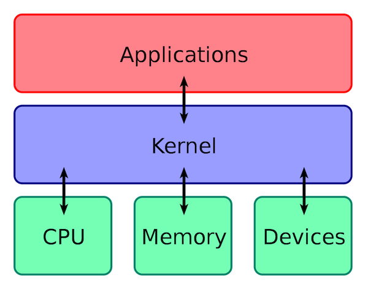 


## 1.2 什么是用户态和内核态？

根据进程访问资源的特点，我们可以把进程在系统上的运行分为两个级别：

1. **用户态(user mode)** : 用户态运行的进程可以直接读取用户程序的数据。处于用户态的 CPU 只能受限地访问内存，并且不允许访问外围设备，用户态下的 CPU 不允许独占，也就是说 CPU 能够被其他程序获取。
2. **内核态(kernel mode)** : 处于内核态的 CPU 可以访问任意的数据，包括外围设备，比如网卡、硬盘等，处于内核态的 CPU 可以从一个程序切换到另外一个程序，并且占用 CPU 不会发生抢占情况，一般处于特权级 0 的状态我们称之为内核态。

> 那么为什么要有用户态和内核态呢？

这个主要是对访问能力的限制的考量，计算机中有一些比较危险的操作，比如设置时钟、内存清理，这些都需要在内核态下完成，如果随意进行这些操作，那系统得崩溃多少次。


## 1.3 用户态和内核态是如何切换的？

所有的用户进程都是运行在用户态的，但是用户程序的访问能力有限，一些比较重要的比如从硬盘读取数据，从键盘获取数据的操作则是内核态才能做的事情，而这些数据却又对用户程序来说非常重要。所以就涉及到两种模式下的转换，即**用户态 -> 内核态 -> 用户态**，而唯一能够做这些操作的只有 `系统调用`，而能够执行系统调用的就只有 `操作系统`。

一般 `用户态 -> 内核态` 的转换我们都称之为 **trap 进内核**，也被称之为 `陷阱指令(trap instruction)`。

它们的工作流程如下：

 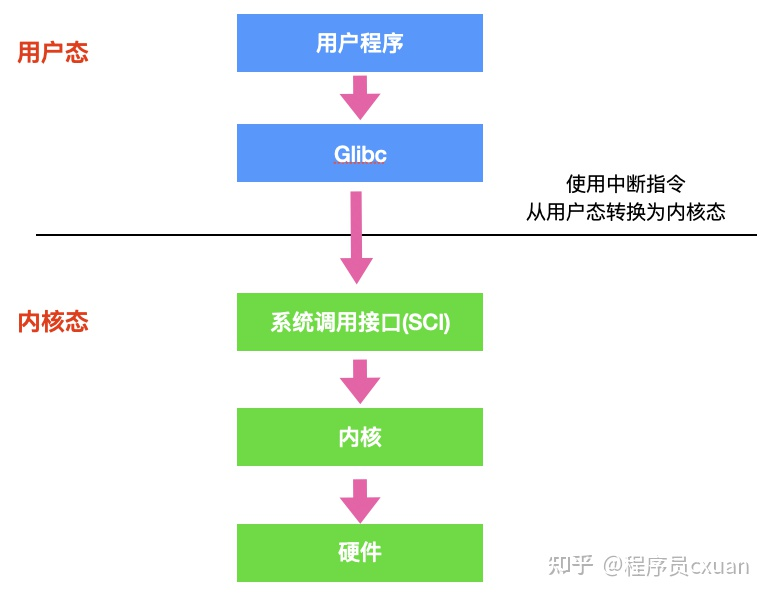 

- 首先用户程序会调用 `glibc` 库，glibc 是一个标准库，同时也是一套核心库，库中定义了很多关键 API。
- glibc 库知道针对不同体系结构调用`系统调用`的正确方法，它会根据体系结构应用程序的二进制接口设置用户进程传递的参数，来准备系统调用。
- 然后，glibc 库调用 `软件中断指令(SWI)` ，这个指令通过更新 `CPSR` 寄存器将模式改为超级用户模式，然后跳转到地址 `0x08` 处。
- 到目前为止，整个过程仍处于用户态下，在执行 SWI 指令后，允许进程执行内核代码，MMU 现在允许内核虚拟内存访问
- 从地址 0x08 开始，进程执行加载并跳转到中断处理程序，这个程序就是 ARM 中的 `vector_swi()`。
- 在 vector_swi() 处，从 SWI 指令中提取系统调用号 SCNO，然后使用 SCNO 作为系统调用表 `sys_call_table` 的索引，调转到系统调用函数。
- 执行系统调用完成后，将还原用户模式寄存器，然后再以用户模式执行。


## 1.4 什么是系统调用？

介绍系统调用之前，我们先来了解一下用户态和系统态。

根据进程访问资源的特点，我们可以把进程在系统上的运行分为两个级别：

1. **用户态(user mode) :** 用户态运行的进程可以直接读取用户程序的数据。
2. **系统态(kernel mode) :** 可以简单的理解系统态运行的进程或程序几乎可以访问计算机的任何资源，不受限制。

说了用户态和系统态之后，那么什么是系统调用呢？

我们运行的程序基本都是运行在用户态，如果我们调用操作系统提供的系统态级别的子功能咋办呢？那就需要系统调用了！

也就是说**在我们运行的用户程序中，凡是与系统态级别的资源有关的操作（如文件管理、进程控制、内存管理等)，都必须通过系统调用方式向操作系统提出服务请求，并由操作系统代为完成。**

这些系统调用按功能大致可分为如下几类：

- 设备管理。完成设备的请求或释放，以及设备启动等功能。
- 文件管理。完成文件的读、写、创建及删除等功能。
- 进程控制。完成进程的创建、撤销、阻塞及唤醒等功能。
- 进程通信。完成进程之间的消息传递或信号传递等功能。
- 内存管理。完成内存的分配、回收以及获取作业占用内存区大小及地址等功能。


## 1.5 谈谈你对并发和并行的理解？（并发和并行的区别）

1. **并行**是指两个或者多个事件在**同一时刻**发生；而**并发**是指两个或多个事件在**同一时间间隔**发生；
2. **并行**是在**不同实体**上的多个事件，**并发**是在**同一实体**上的多个事件；


## 1.6 同步、异步、阻塞、非阻塞的概念

**同步**：当一个同步调用发出后，调用者要一直等待返回结果。通知后，才能进行后续的执行。

**异步**：当一个异步过程调用发出后，调用者不能立刻得到返回结果。实际处理这个调用的部件在完成后，通过状态、通知和回调来通知调用者。

**阻塞**：是指调用结果返回前，当前线程会被挂起，即阻塞。

**非阻塞**：是指即使调用结果没返回，也不会阻塞当前线程。


# 二、进程和线程


## 2.1 进程和线程的基本概念

**进程**：进程是系统进行资源分配和调度的一个**独立**单位，是系统中的并发执行的单位。

**线程**：线程是进程的一个实体，也是 CPU 调度和分派的基本单位，它是比进程更小的能独立运行的基本单位，有时又被称为轻权进程或轻量级进程。


## 2.2 进程和线程的区别？

(资源、调度、开销、通信方式...)

1）**调度**。**在引入线程的操作系统中，线程是独立调度的基本单位，进程是拥有资源的基本单位**。

2）**拥有资源**。**进程是拥有资源的基本单位**，而**线程不拥有资源**（也有一点儿必不可少的资源：程序计数器、一组寄存器和栈），但线程可以访问其隶属进程的系统资源。

3）**系统开销**。由于创建或撤销进程时，系统都要为之分配或回收资源，因此操作系统所付出的开销远大于创建或撤销线程时的开销。

4）**通信**。进程间通信（IPC）需要进程同步和互斥手段的辅助，以保证数据的一致性，而线程间可以直接读/写进程数据段（如全局变量）来通信。

5）**地址空间和其他资源**。进程的地址空间之间互相独立，同一进程的各线程间共享进程的资源，某进程内的线程对于其他进程不可见。

6）多线程程序只要有一个线程崩溃，整个程序就崩溃了；但多进程程序中一个进程崩溃并不会对其它进程造成影响，因为进程有自己的独立地址空间，因此**多进程更加健壮**。


## 2.3 为什么有了进程，还要有线程？

进程可以使多个程序并发执行，以提高资源的利用率和系统的吞吐量，但是其带来了一些缺点：

1. 进程在同一时间只能干一件事情；
2. 进程在执行的过程中如果阻塞，整个进程就会被挂起，即使进程中有些工作不依赖与等待的资源，仍然不会执行。

基于以上的缺点，操作系统引入了比进程粒度更小的线程，作为并发执行的基本单位，从而减少程序在并发执行时所付出的时间和空间开销，提高并发性能。


## 2.4 进程的状态转换

我们一般把进程大致分为 **5 种**状态：

- **创建态(new)** ：进程正在被创建，尚未到就绪状态。
- **就绪态(ready)** ：进程已处于准备运行状态，即**进程获得了除了处理器之外的一切所需资源**，一旦得到处理器资源(处理器分配的时间片)即可运行。
- **运行态(running)** ：进程正在处理器上上运行(单核 CPU 下任意时刻只有一个进程处于运行状态)。
- **阻塞态(waiting)** ：又称为等待状态，**进程正在等待某一事件而暂停运行**如等待某资源为可用或等待 IO 操作完成。即使处理器空闲，该进程也不能运行。
- **结束态(terminated)** ：进程正在从系统中消失。可能是进程正常结束或其他原因中断退出运行。

**状态转换图示**


- **就绪态→运行态：**处于就绪态的**进程被调度后，获得处理机资源**（分派处理机时间片），于是进程由就绪态转换为运行态。
- **运行态→就绪态：**处于运行态的进程在**时间片用完**后，不得不让出处理机，从而进程由运行态转换为就绪态。此外，在可剥夺的操作系统中，当有**更高优先级的进程就绪**时，调度程序将正在执行的进程转换为就绪态，让更高优先级的进程执行。
- **运行态→阻塞态：**进程请求某一资源（如外设）的使用和分配或等待某一事件的发生（如 I/O 操作的完成）时，它就从运行态转换为阻塞态。进程以**系统调用**的形式请求操作系统提供服务，这是一种由运行**用户态**程序调用操作系统内核过程的形式。
- **阻塞态→就绪态：进程等待事件到来**时，如 I/O 操作结束或中断结束时，中断处理程序必须把相应进程的状态由阻塞态转换为就绪态。

> 注意：**一个进程从运行态变成阻塞态是主动的行为，而从阻塞态变为就绪态是被动的行为，需要其他相关进程的协助。**


## 2.5 进程同步和进程通信的区别

进程同步与进程通信很容易混淆，它们的区别在于：

- 进程同步：控制多个进程按一定顺序执行；
- 进程通信：进程间传输信息。

进程通信是一种手段，而进程同步是一种目的。也可以说，为了能够达到进程同步的目的，需要让进程进行通信，传输一些进程同步所需要的信息。


## 2.6 进程间的通信方式有哪些？

**进程间通信**（**IPC**，InterProcess Communication）是指**在不同进程之间传播或交换信息**。IPC 的方式通常有管道（包括`匿名管道PIPE`和`命名管道FIFO`）、`消息队列`、`信号量`、`共享内存`、`Socket` 。

> 管道是一个环形缓冲区，允许两个进程以生产者/消费者的模型进行通信。是一个先进先出队列。管道在创建时获得一个固定大小的字节数。当一个进程试图往管道中写时，如果有足够的空间，则立即执行写请求，否则该进程被阻塞。当一个读进程试图读取的字节数多于当前管道中的字节数时，它也被阻塞，否则立即执行读请求。操作系统强制实施互斥，即一次只能有一个进程可以访问管道。

#### **1. 管道（匿名管道PIPE）**

1. 它是**半双工**的，具有固定的读端和写端；
2. 它**只能用于父子进程或者兄弟进程之间**的进程的通信；
3. 它可以看成是一种特殊的文件，对于它的读写也可以使用普通的 read、write 等函数。但是它不是普通的文件，并不属于其他任何文件系统，并且只存在于内存中。

#### **2. FIFO（命名管道）**

1. FIFO **可以在无关的进程之间**交换数据，与无名管道不同；
2. FIFO 有路径名与之相关联，它以一种特殊设备文件形式存在于文件系统中。

#### **3. 消息队列**

1. 消息队列，是消息的链接表，存放在**内核中**。一个消息队列由一个标识符 ID 来标识；
2. 消息队列是面向记录的，其中的消息具有特定的格式以及特定的优先级；
3. 消息队列**独立于读写进程**。进程终止时，消息队列及其内容并不会被删除；
4. 消息队列可以实现**消息的随机查询**，消息**不一定要以先进先出的次序读取，也可以按消息的类型读取。**

#### **4. 信号量**

1. 信号量（semaphore）是一个**计数器**。用于实现进程间的互斥与同步，而不是用于存储进程间通信数据；
2. 信号量**用于进程间同步**，若要在进程间传递数据需要结合共享内存；
3. 信号量基于操作系统的 **PV 操作**，程序对信号量的操作都是**原子操作**；
4. 每次对信号量的 PV 操作不仅限于对信号量值加 1 或减 1，而且可以加减任意正整数；
5. 支持信号量组。

#### **5. 共享内存**

1. 共享内存（Shared Memory），指两个或多个进程**共享一个给定的存储区**； 不同进程可以及时看到对方进程中对共享内存中数据的更新。 
2. 共享内存是**最快**的一种 IPC，因为进程是直接对内存进行存取。
3.  需要依靠某种同步操作，如互斥锁和信号量等。 

#### **6. Socket**

此方法主要用于在客户端和服务器之间通过**网络**进行通信。套接字是支持 TCP/IP 的网络通信的基本操作单元，可以看做是**不同主机之间**的进程进行双向通信的端点，简单的说就是通信的两方的一种约定，用套接字中的相关函数来完成通信过程。 


## 2.7 管道和消息队列的对比

消息队列与管道以及命名管道相比，**具有更大的灵活性**，首先，它提供有格式字节流，有利于减少开发人员的工作量；其次，消息队列是面向记录的，其中的**消息具有特定的格式以及特定的优先级**。同样，消息队列可以在几个进程间复用，而不管这几个进程是否具有亲缘关系，这一点与命名管道很相似；但**消息队列是随内核持续的，与命名管道（随进程持续）相比，生命力更强，应用空间更大。**


## 2.8 进程同步的方式

- **临界区**

对临界资源（一次仅允许一个进程使用的资源称为临界资源）进行访问的那段代码称为临界区。通过对多线程的串行化来访问公共资源或一段代码，速度快，适合控制数据访问。

为在任意时刻只允许一个线程对共享资源进行访问，如果有多个线程试图访问公共资源，那么在有一个线程进入后，其他试图访问公共资源的线程将被挂起，并一直等到进入临界区的线程离开，临界区在被释放后，其他线程才可以抢占。 

- **同步与互斥**

同步：多个进程因为合作产生的直接制约关系，使得进程有一定的先后执行关系。

互斥： 指两个或多个进程访问临界资源时只能一个进程访问，其他进程等待的一种相互制约的关系。 

- **信号量**

也成为计数信号量或一般信号量。用于进程间传递信号的一个整数值。在信号量上只可进行三种操作，即**初始化、递减和增加**，这三种操作都是原子操作。递减操作用于阻塞一个进程，递增操作用于解除一个进程的阻塞。

要通过信号量 s 传送信号，进程必须执行原语 semSignal(s)；要通过信号量 s 接收信号，进程必须执行原语 semWait(s)；若相应的信号仍未发送，则阻塞进程，直到发送完为止。

**semWait(s)** : 如果信号量大于 0 ，执行 -1 操作；如果信号量等于 0，进程睡眠，等待信号量大于 0；

**semSignal(s)** ：对信号量执行 +1 操作，唤醒睡眠的进程让其完成 down 操作。

如果信号量的取值只能为 0 或者 1，信号量只存在两个状态，那就不需要计数了， 这就成为了 **互斥量（Mutex）**，简化为加锁与解锁两个功能，0 表示临界区已经加锁，1 表示临界区解锁。 

- [**管程**](https://blog.csdn.net/qq_38998213/article/details/87899231)

管程使一种程序设计语言结构，它提供的功能与信号量相同，但更易于控制。与那些通过修改数据结构实现互斥访问的并发程序设计相比，管程实现很大程度上简化了程序设计。

管程是由一个或多个过程、一个初始化序列和局部数据组成的软件模块，其主要特点如下：

1. 局部数据变量只能被管程的过程访问，任何外部过程都不能访问。
2. 一个进程通过调用管程的一个过程进入管程。
3. **在任何时候，只能有一个进程在管程中执行**，调用管程的任何其他进程都被阻塞，以等待管程可用。


## 2.8 经典同步问题

#### **生产者—消费者问题**

**问题描述**：一组生产者进程和一组消费者进程共享一块初始为空，大小确定的缓冲区，只有当缓冲区未满时，生产者进程才可以把信息放入缓冲区，否则就要等待；只有缓存区不为空时，消费者进程才能从中取出信息，否则就要等待。**缓冲区一次只能一个进程访问（临界资源）。**

**问题分析**：生产者与消费者进程对缓冲区的访问是互斥关系，而生产者与消费者本身又存在同步关系，即必须生成之后才能消费。因而对于缓冲区的访问设置一个互斥量，再设置两个信号量一个记录空闲缓冲区单元，一个记录满缓冲区单元来实现生产者与消费者的同步。

**问题解决**：伪代码实现

这里 down 就是 P 操作，up 就是 V 操作。

```c
#define N 100 //缓冲区容量
typedef int semaphore;
semaphore mutex = 1;	
semaphore empty = N;	//空闲缓冲区
semaphore full = 0;		//满缓冲区

void producer() {
    while(TRUE) {
        int item = produce_item();
        down(&empty);
        down(&mutex);
        insert_item(item);
        up(&mutex);
        up(&full);
    }
}

void consumer() {
    while(TRUE) {
        down(&full);
        down(&mutex);
        int item = remove_item();
        consume_item(item);
        up(&mutex);
        up(&empty);
    }
}
```


#### **哲学家进餐问题**

**问题描述**：五个哲学家围着一张圆桌，每个哲学家面前放着食物。哲学家的生活有两种交替活动：吃饭以及思考。当一个哲学家吃饭时，需要先拿起自己左右两边的两根筷子，并且一次只能拿起一根筷子。 

下面是一种错误的解法，如果所有哲学家同时拿起左手边的筷子，那么所有哲学家都在等待其它哲学家吃完并释放自己手中的筷子，导致**死锁**。 

```c
#define N 5

void philosopher(int i) {
    while(TRUE) {
        think();
        take(i);       // 拿起左边的筷子
        take((i+1)%N); // 拿起右边的筷子
        eat();
        put(i);
        put((i+1)%N);
    }
}
```

为了防止死锁的发生，可以设置两个条件：

1. 必须同时拿起左右两根筷子；

2. 只有在两个邻居都没有进餐的情况下才允许进餐。

```c
#define N 5
#define LEFT (i + N - 1) % N // 左邻居
#define RIGHT (i + 1) % N    // 右邻居
#define THINKING 0
#define HUNGRY   1
#define EATING   2
typedef int semaphore;
int state[N];                // 跟踪每个哲学家的状态
semaphore mutex = 1;         // 临界区的互斥，临界区是 state 数组，对其修改需要互斥
semaphore s[N];              // 每个哲学家一个信号量

void philosopher(int i) {
    while(TRUE) {
        think(i);
        take_two(i);
        eat(i);
        put_two(i);
    }
}

void take_two(int i) {
    down(&mutex);
    state[i] = HUNGRY;
    check(i);
    up(&mutex);
    down(&s[i]); // 只有收到通知之后才可以开始吃，否则会一直等下去
}

void put_two(i) {
    down(&mutex);
    state[i] = THINKING;
    check(LEFT); // 尝试通知左右邻居，自己吃完了，你们可以开始吃了
    check(RIGHT);
    up(&mutex);
}

void eat(int i) {
    down(&mutex);
    state[i] = EATING;
    up(&mutex);
}

// 检查两个邻居是否都没有用餐，如果是的话，就 up(&s[i])，使得 down(&s[i]) 能够得到通知并继续执行
void check(i) {         
    if(state[i] == HUNGRY && state[LEFT] != EATING && state[RIGHT] !=EATING) {
        state[i] = EATING;
        up(&s[i]);
    }
}
```


#### **读者—写者问题**

**问题描述**：有读者与写者两个并发进程共享一个数据，两个或以上的读进程可以同时访问数据，但是一个写者进程访问数据与其他进程都互斥。

**问题分析**：读者与写者是互斥关系，写者与写者是互斥关系，读者与读者是同步关系。因而需要一个互斥量实现读与写和写与写互斥，一个读者的访问计数和实现对计数的互斥。一个整型变量 count 记录在对数据进行读操作的进程数量，一个互斥量 count_mutex 用于对 count 加锁，一个互斥量 data_mutex 用于对读写的数据加锁。 

```c
typedef int semaphore;
semaphore count_mutex = 1;
semaphore data_mutex = 1;
int count = 0;

void reader() {
    while(TRUE) {
        down(&count_mutex);
        count++;
        if(count == 1) down(&data_mutex); // 第一个读者需要对数据进行加锁，防止写进程访问
        up(&count_mutex);
        read();
        down(&count_mutex);
        count--;
        if(count == 0) up(&data_mutex);
        up(&count_mutex);
    }
}

void writer() {
    while(TRUE) {
        down(&data_mutex);
        write();
        up(&data_mutex);
    }
}
```


## 2.9 [线程同步的方式](https://blog.csdn.net/daaikuaichuan/article/details/82950711)（介绍一下几种典型的锁）

互斥锁、自旋锁、读写锁、条件变量

#### **互斥锁**

在多任务操作系统中，同时运行的多个任务可能都需要使用同一种资源。这个过程有点类似于，公司部门里，我在使用着打印机打印东西的同时（还没有打印完），别人刚好也在此刻使用打印机打印东西，如果不做任何处理的话，打印出来的东西肯定是错乱的。

在线程里也有这么一把锁——互斥锁（mutex），互斥锁是一种简单的加锁的方法来控制对共享资源的访问，互斥锁只有两种状态,即**上锁(lock)**和**解锁(unlock)**。

【互斥锁的特点】：

1. **原子性**：把一个互斥量锁定为一个原子操作，这意味着操作系统（或pthread函数库）保证了如果一个线程锁定了一个互斥量，没有其他线程在同一时间可以成功锁定这个互斥量；
2. **唯一性**：如果一个线程锁定了一个互斥量，在它解除锁定之前，没有其他线程可以锁定这个互斥量；
3. **非繁忙等待**：如果一个线程已经锁定了一个互斥量，第二个线程又试图去锁定这个互斥量，则第二个线程将被挂起（不占用任何cpu资源），直到第一个线程解除对这个互斥量的锁定为止，第二个线程则被唤醒并继续执行，同时锁定这个互斥量。


#### **自旋锁**

自旋锁与互斥锁功能一样，唯一一点不同的就是互斥锁阻塞后休眠让出cpu，而**自旋锁阻塞后不会让出cpu，会一直忙等待，直到得到锁。**
  自旋锁在用户态使用的比较少，在内核使用的比较多！自旋锁的使用场景：**锁的持有时间比较短，或者说小于2次上下文切换的时间。** 

>互斥锁和自旋锁的区别：
>
>自旋锁是一种**非阻塞锁**，也就是说，如果某线程需要获取自旋锁，但该锁已经被其他线程占用时，该线程不会被挂起，而是在不断的消耗CPU的资源，不停的试图获取自旋锁。
>
>互斥量是**阻塞锁**，当某线程无法获取互斥量时，该线程会被直接挂起，该线程不再消耗CPU资源，当其他线程释放互斥量后，操作系统会激活那个被挂起的线程，让其投入运行。


#### **读写锁**

读写锁与互斥量类似，不过读写锁允许更改的并行性，也叫**共享互斥锁**。互斥量要么是锁住状态，要么就是不加锁状态，而且一次只有一个线程可以对其加锁。读写锁可以有3种状态：**读模式下加锁状态、写模式加锁状态、不加锁状态。**

**一次只有一个线程可以占有写模式的读写锁，但是多个线程可以同时占有读模式的读写锁（允许多个线程读但只允许一个线程写）。**

【读写锁的特点】：

1. 如果有线程读数据，则允许其它线程执行读操作，但不允许写操作；

2. 如果有线程写数据，则其它线程都不允许读、写操作。
3. 写者优先于读者。（ 一旦有写者，则后续读者必须等待，唤醒时优先考虑写者 ）

 读写锁适合于对数据结构的**读次数比写次数多得多**的情况。 


#### **条件变量**

与互斥锁不同，**条件变量是用来等待而不是用来上锁的。条件变量用来自动阻塞一个线程，直到某特殊情况发生为止。通常条件变量和互斥锁同时使用。**【**互斥锁是线程间互斥的机制，条件变量则是同步机制**】
条件变量使我们可以睡眠等待某种条件出现。条件变量是利用线程间共享的全局变量进行同步 的一种机制，主要包括两个动作：

1. 一个线程等待 “条件变量的条件成立” 而挂起；

2. 另一个线程使 “条件成立”（给出条件成立信号）。

【原理】：

条件的检测是在互斥锁的保护下进行的。**线程在改变条件状态之前必须首先锁住互斥量**。如果一个条件为假，一个线程自动阻塞，并释放等待状态改变的互斥锁。**如果另一个线程改变了条件，它发信号给关联的条件变量，唤醒一个或多个等待它的线程，重新获得互斥锁，重新评价条件**。如果两进程共享可读写的内存，条件变量 可以被用来实现这两进程间的线程同步。


## 2.10 进程的调度算法有哪些？

调度算法是指：根据系统的资源分配策略所规定的资源分配算法。常用的调度算法有：`先来先服务调度算法`、`时间片轮转调度法`、`短作业优先调度算法`、`最短剩余时间优先`、`高响应比优先调度算法`、`优先级调度算法`、`多级反馈队列`等等。 

#### **先来先服务(FCFS)调度算法**

当每个进程就绪后，它加入就绪队列。若当前正运行的进程停止执行，选择**在就绪队列中存在时间最长的进程**为之分配处理机资源，使它立即执行并一直执行到完成或发生某事件而被阻塞放弃占用 CPU 时再重新调度。该算法既可以用于作业调度，也可以用于进程调度。有利于长进程，不利于短进程。

#### **短作业优先(SJF)调度算法**

从后备队列中选择一个或若干个估计**运行时间最短的作业**，将它们调入内存运行。 短作业优先调度算法是一个**非抢占策略**，它的原则是**下一次选择**预计处理时间最短的进程，因此短进程将会越过长作业，跳至队列头。有利于短进程，不利于长进程。

#### **最短剩余时间优先(SRTN)调度算法**

最短剩余时间是**针对最短进程优先增加了抢占机制**的版本。在这种情况下，进程调度总是选择**预期剩余时间最短**的进程。 当一个新的作业到达时，其整个运行时间与当前进程的剩余时间作比较。如果新的进程需要的时间更少，则挂起当前进程，运行新的进程。否则新的进程等待。 像最短进程优先一样，调度程序正在执行选择函数是必须有关于处理时间的估计，并且存在长进程饥饿的危险。

#### **时间片轮转调度算法**

时间片轮转调度算法主要**适用于分时系统**。在这种算法中，系统将所有就绪进程按到达时间的先后次序排成一个队列，进程调度程序总是选择就绪队列中第一个进程执行，即先来先服务的原则，但**仅能运行一个时间片**。当时间片用完时，由计时器发出时钟中断，调度程序便停止该进程的执行，并将它送往就绪队列的末尾，同时继续把 CPU 时间分配给队首的进程。 

#### **优先级调度算法**

优先级调度算法每次从后备作业队列中**选择优先级最髙**的一个或几个作业，将它们调入内存，分配必要的资源，创建进程并放入就绪队列。在进程调度中，优先级调度算法每次从就绪队列中选择优先级最高的进程，将处理机分配给它，使之投入运行。具有相同优先级的进程以 FCFS 方式执行。可以根据内存要求，时间要求或任何其他资源要求来确定优先级。 

#### **高响应比优先调度算法**

高响应比优先调度算法主要用于作业调度，该算法是对先来先服务调度算法和短作业优先调度算法的一种综合平衡，同时考虑每个作业的等待时间和估计的运行时间。在每次进行作业调度时，先计算后备作业队列中每个作业的响应比，从中选出**响应比最高**的作业投入运行。

#### **多级反馈队列调度算法** 

前面介绍的几种进程调度的算法都有一定的局限性。如**短进程优先的调度算法，仅照顾了短进程而忽略了长进程** 。多级反馈队列调度算法既能使高优先级的作业得到响应又能使短作业（进程）迅速完成。它是目前**被公认的一种较好的进程调度算法**，UNIX 操作系统采取的便是这种调度算法。

一个进程需要执行 100 个时间片，如果采用时间片轮转调度算法，那么需要交换 100 次。

多级队列是为这种需要连续执行多个时间片的进程考虑，它设置了多个队列，每个队列时间片大小都不同，例如 1,2,4,8,..。进程在第一个队列没执行完，就会被移到下一个队列。这种方式下，之前的进程只需要交换 7 次。

每个队列优先权也不同，最上面的优先权最高。因此只有上一个队列没有进程在排队，才能调度当前队列上的进程。

可以将这种调度算法看成是时间片轮转调度算法和优先级调度算法的结合。

  


## 2.11 多进程与多线程的比较

|    **维度**    |                            多进程                            |                 多线程                 |
| :------------: | :----------------------------------------------------------: | :------------------------------------: |
| 数据共享、同步 |         数据是分开的，共享复杂，需要用IPC；同步简单          | 多线程共享进程数据，共享简单；同步复杂 |
|   内存、CPU    |              占用内存多，切换复杂，CPU利用率低               |   占用内存少，切换简单，CPU利用率高    |
| 创建销毁、切换 |                  创建销毁、切换复杂，速度慢                  |       创建销毁、切换简单，速度快       |
|     可靠性     |                      进程间不会相互影响                      |     一个线程挂掉将导致整个进程挂掉     |
|     分布式     | 适应于多核、多机分布 ；如果一台机器不够，扩展到多台机器比较简单 |             适应于多核分布             |


## 2.12 进程终止的方式

进程在创建之后，它就开始运行并做完成任务。然而，没有什么事儿是永不停歇的，包括进程也一样。进程早晚会发生终止，但是通常是由于以下情况触发的：

- **正常退出(自愿的)**

多数进程是由于完成了工作而终止。当编译器完成了所给定程序的编译之后，编译器会执行一个系统调用告诉操作系统它完成了工作。这个调用在 UNIX 中是 `exit` ，在 Windows 中是 `ExitProcess`。面向屏幕中的软件也支持自愿终止操作。字处理软件、Internet 浏览器和类似的程序中总有一个供用户点击的图标或菜单项，用来通知进程删除它所打开的任何临时文件，然后终止。 

- **错误退出(自愿的)**

进程发生终止的第二个原因是发现错误，例如，如果用户执行如下命令

```text
cc foo.c
```

为了能够编译 foo.c 但是该文件不存在，于是编译器就会发出声明并退出。在给出了错误参数时，面向屏幕的交互式进程通常并不会直接退出，因为这从用户的角度来说并不合理，用户需要知道发生了什么并想要进行重试，所以这时候应用程序通常会弹出一个对话框告知用户发生了系统错误，是需要重试还是退出。

- **严重错误(非自愿的)**

进程终止的第三个原因是由进程引起的错误，通常是由于程序中的错误所导致的。例如，执行了一条非法指令，引用不存在的内存，或者除数是 0 等。在有些系统比如 UNIX 中，进程可以通知操作系统，它希望自行处理某种类型的错误，在这类错误中，进程会收到信号（中断），而不是在这类错误出现时直接终止进程。 

- **被其他进程杀死(非自愿的)**

某个进程执行系统调用告诉操作系统杀死某个进程。在 UNIX 中，这个系统调用是 kill。在 Win32 中对应的函数是 `TerminateProcess`（注意不是系统调用）。 


## 2.13 守护进程、孤儿进程和僵尸进程

- **守护进程**

指**在后台运行的，没有控制终端与之相连的进程**。它独立于控制终端，周期性地执行某种任务。Linux 的大多数服务器就是用守护进程的方式实现的，如 web 服务器进程 http 等。

创建守护进程要点：

（1）让程序在后台执行。方法是调用 `fork()` 产生一个子进程，然后使父进程退出。

（2）调用 `setsid()` 创建一个新对话期。控制终端、登录会话和进程组通常是从父进程继承下来的，守护进程要摆脱它们，不受它们的影响，方法是调用 `setsid()` 使进程成为一个会话组长。`setsid()` 调用成功后，进程成为新的会话组长和进程组长，并与原来的登录会话、进程组和控制终端脱离。

（3）禁止进程重新打开控制终端。经过以上步骤，进程已经成为一个无终端的会话组长，但是它可以重新申请打开一个终端。为了避免这种情况发生，可以通过使进程不再是会话组长来实现。再一次通过 `fork()` 创建新的子进程，使调用 `fork` 的进程退出。

（4）关闭不再需要的文件描述符。子进程从父进程继承打开的文件描述符。如不关闭，将会浪费系统资源，造成进程所在的文件系统无法卸下以及引起无法预料的错误。首先获得最高文件描述符值，然后用一个循环程序，关闭0到最高文件描述符值的所有文件描述符。

（5）将当前目录更改为根目录。

（6）子进程从父进程继承的文件创建屏蔽字可能会拒绝某些许可权。为防止这一点，使用 `unmask(0)` 将屏蔽字清零。

（7）处理 SIGCHLD 信号。对于服务器进程，在请求到来时往往生成子进程处理请求。如果子进程等待父进程捕获状态，则子进程将成为僵尸进程（zombie），从而占用系统资源。如果父进程等待子进程结束，将增加父进程的负担，影响服务器进程的并发性能。在Linux下可以简单地将 SIGCHLD 信号的操作设为 SIG_IGN。这样，子进程结束时不会产生僵尸进程。

- **孤儿进程**

> 如果父进程先退出，子进程还没退出，那么**子进程的父进程将变为 init 进程。**（注：任何一个进程都必须有父进程）。

**一个父进程退出，而它的一个或多个子进程还在运行，那么那些子进程将成为孤儿进程**。孤儿进程将被 init 进程(进程号为1)所收养，并由 init 进程对它们完成状态收集工作。

孤儿进程是没有父进程的进程，每当出现一个孤儿进程的时候，内核就把孤儿进程的父进程设置为 init，而 init 进程会循环地 `wait()` 它的已经退出的子进程。这样，当一个孤儿进程凄凉地结束了其生命周期的时候，init 进程就会处理它的一切善后工作。因此**孤儿进程并不会有什么危害**。 

- **僵尸进程**

**如果子进程先退出，父进程还没退出，那么子进程必须等到父进程捕获到了子进程的退出状态才真正结束，否则这个时候子进程就成为僵尸进程。**

设置僵尸进程的目的是**维护子进程的信息**，以便父进程在以后某个时候获取。这些信息至少包括进程ID，进程的终止状态，以及该进程使用的CPU时间，所以当终止子进程的父进程调用 wait 或 waitpid 时就可以得到这些信息。如果一个进程终止，而该进程有子进程处于僵尸状态，那么它的所有僵尸子进程的父进程ID将被重置为1（init进程）。继承这些子进程的 init 进程将清理它们（也就是说 init 进程将 wait 它们，从而去除它们的僵尸状态）。

**危害**：如果进程不调用 wait / waitpid 的话， 那么子进程保留的那段信息就不会释放，其进程号就会一直被占用，但是系统所能使用的进程号是有限的，如果大量的产生僵死进程，将因为没有可用的进程号而导致系统不能产生新的进程。 


## 2.14 如何避免僵尸进程

- 通过 signal(SIGCHLD, SIG_IGN) 通知内核对子进程的结束不关心，由内核回收。如果不想让父进程挂起，可以在父进程中加入一条语句：signal(SIGCHLD,SIG_IGN); 表示父进程忽略SIGCHLD信号，该信号是子进程退出的时候向父进程发送的。
- 父进程调用wait/waitpid等函数等待子进程结束，如果尚无子进程退出wait会导致父进程阻塞。waitpid可以通过传递WNOHANG使父进程不阻塞立即返回。
- 如果父进程很忙可以用signal注册信号处理函数，在信号处理函数调用wait/waitpid等待子进程退出。
- 通过两次调用fork。父进程首先调用fork创建一个子进程然后waitpid等待子进程退出，子进程再fork一个孙进程后退出。这样子进程退出后会被父进程等待回收，而对于孙子进程其父进程已经退出所以孙进程成为一个孤儿进程，孤儿进程由init进程接管，孙进程结束后，init会等待回收。

第一种方法忽略SIGCHLD信号，这常用于并发服务器的性能的一个技巧因为并发服务器常常fork很多子进程，子进程终结之后需要服务器进程去wait清理资源。如果将此信号的处理方式设为忽略，可让内核把僵尸子进程转交给init进程去处理，省去了大量僵尸进程占用系统资源。


## 2.15 [fork() 函数底层](https://www.cnblogs.com/tp-16b/p/9005079.html)

**读时共享，写时复制。**

 一个现有的进程可以调用fork函数创建一个新进程。原型如下： 

```c
#include<unistd.h>  
  
pid_t fork(void);  

# 返回值:子进程中返回0，父进程返回进程id，出错返回-1  
```

fork() 系统调用会通过**复制一个现有进程来创建一个全新的进程**。进程被存放在一个叫做**任务队列**的双向循环链表当中。链表当中的每一项都是类型为 task_struct 称为进程描述符的结构（也就是进程PCB）。  

fork 出子进程之后，程序的运行细节 ：

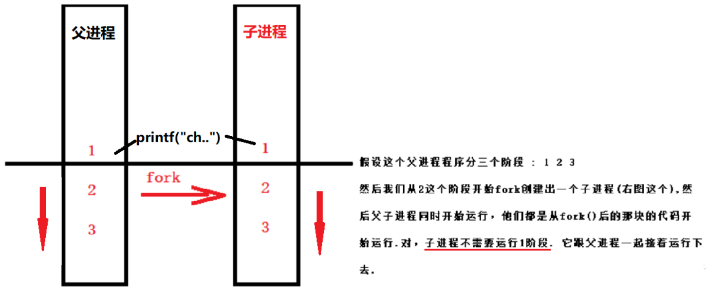

一般来说，在fork之后是父进程先执行还是子进程先执行是不确定的，这取决于内核所使用的调度算法。如果要求父、子进程之间相互同步，则要求某种形式的进程间通信。当进程调用fork后，当控制转移到内核中的fork代码后，内核会做4件事情:

1. 分配新的内存块和内核数据结构给子进程

2. 将父进程部分数据结构内容（数据空间，堆栈等）拷贝至子进程

3. 添加子进程到系统进程列表当中

4. fork返回，开始调度器调度

**为什么fork成功调用后返回两个值?**  

由于在复制时复制了父进程的堆栈段，所以两个进程都停留在fork函数中，等待返回。所以fork函数会返回两次，一次是在父进程中返回，另一次是在子进程中返回，这**两次的返回值不同**。

其中父进程返回子进程pid，这是由于一个进程可以有多个子进程，但是却没有一个函数可以让一个进程来获得这些子进程id，那谈何给别人你创建出来的进程。而子进程返回0，这是由于子进程可以调用getpid获得其父进程进程ID，但这个父进程ID却不可能为0，因为进程ID0总是有内核交换进程所用，故返回0就可代表正常返回了。

......


## 2.16 什么是协程

协程是一种基于线程之上，但又**比线程更加轻量级**的存在，这种由程序员自己写程序来管理的轻量级线程叫做『用户空间线程』，具有对内核来说不可见的特性。

因为是自主开辟的异步任务，所以很多人也更喜欢叫它们纤程（Fiber），或者绿色线程（GreenThread）。正如一个进程可以拥有多个线程一样，**一个线程也可以拥有多个协程**。

**协程的特点：**

1. 线程的切换由操作系统负责调度，**协程由用户自己进行调度**，因此减少了上下文切换，提高了效率。
2. 线程的默认Stack大小是1M，而协程更轻量，接近1K。因此可以在相同的内存中开启更多的协程。
3. 由于在同一个线程上，因此可以避免竞争关系而使用锁。
4. 适用于被阻塞的，且需要大量并发的场景。但不适用于大量计算的多线程，遇到此种情况，最好使用线程去解决。


# 三、死锁


## 3.1 什么是死锁？

死锁，是指**多个进程在运行过程中因争夺资源而造成的一种僵局**，当进程处于这种僵持状态时，若无外力作用，它们都将无法再向前推进。 如下图所示：如果此时有一个线程 T1，已经持有了锁 R1，但是试图获取锁 R2，线程 T2 持有锁 R2，而试图获取锁 R1，这种情况下就会产生死锁。 

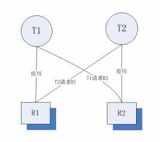 


## 3.2 产生死锁的原因？

由于系统中存在一些不可剥夺资源，而当两个或两个以上进程占有自身资源，并请求对方资源时，会导致每个进程都无法向前推进，这就是死锁。

- **竞争资源**

例如：系统中只有一台打印机，可供进程 A 使用，假定 A 已占用了打印机，若 B 继续要求打印机打印将被阻塞。

> **系统中的资源可以分为两类：**
>
> 1. 可剥夺资源：是指某进程在获得这类资源后，该资源可以再被其他进程或系统剥夺，CPU 和主存均属于可剥夺性资源；
> 2. 不可剥夺资源：当系统把这类资源分配给某进程后，再不能强行收回，只能在进程用完后自行释放，如磁带机、打印机等。

- **进程推进顺序不当**

例如：进程 A 和 进程 B 互相等待对方的数据。


## 3.3 产生死锁的必要条件？

 如果系统中以下四个条件同时成立，那么就能引起死锁： 

1. **互斥条件**：进程要求对所分配的资源进行排它性控制，即在一段时间内某资源仅为一进程所占用。
2. **请求和保持条件**：进程至少保持一个资源，又提出新的资源请求，当进程因请求资源而阻塞时，对已获得的资源保持不放。
3. **不剥夺条件**：进程已获得的资源在未使用完之前，不能被剥夺抢占，只能在使用完时由自己释放。
4. **环路等待条件**：在发生死锁时，必然存在一个进程–资源的环形链，该环路中的每个进程都在等待下一个进程所占有的资源 。


## 3.4 解决死锁的基本方法？

1. **预防死锁**

   设置某些限制条件，破坏产生死锁的四个必要条件中的一个或几个，以防止发生死锁。 

2. **避免死锁**

   在资源的动态分配过程中，用某种方法防止系统进入不安全状态，从而避免死锁。 

3. **检测及解除死锁**

   无需釆取任何限制性措施，允许进程在运行过程中发生死锁。通过系统的检测机构及时地检测出死锁的发生，然后釆取某种措施解除死锁。 

各处理方法的比较：

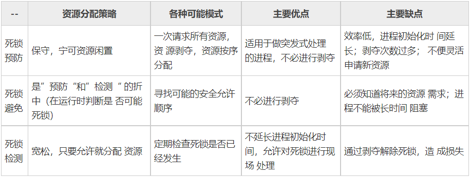


## 3.5 如何预防死锁？

在程序运行之前预防死锁的发生。

1. **破坏请求保持条件**：系统规定进程运行之前一次性分配所有资源，进程运行期间不会提出资源请求。只要有一个资源得不到分配，也不给这个进程分配其他的资源。
2. **破坏不可剥夺条件**：当某进程获得了部分资源，但得不到其它资源，则释放已占有的资源。
3. **破坏环路等待条件**：系统给每类资源赋予一个编号，每一个进程按编号递增的顺序请求资源，释放则相反。


## 3.6 如何避免死锁？

> 避免死锁同样是属于事先预防的策略，但并不是事先釆取某种限制措施破坏死锁的必要条件，而是在资源动态分配过程中，防止系统进入不安全状态，以避免发生死锁。这种方法所施加的限制条件较弱，可以获得较好的系统性能。

**1. 安全状态**

系统在进行资源分配之前，应先计算此次资源分配的安全性。若此次分配不会导致系统进入不安全状态，则将资源分配给进程； 否则，让进程等待。

所谓安全状态，是指**系统能按某种进程推进顺序( P1, P2, ..., Pn)，为每个进程Pi分配其所需资源，直至满足每个进程对资源的最大需求，使每个进程都可顺序地完成**。此时称 P1, P2, ..., Pn 为安全序列。如果系统无法找到一个安全序列，则称系统处于不安全状态。

 

图 a 的第二列 Has 表示已拥有的资源数，第三列 Max 表示总共需要的资源数，Free 表示还有可以使用的资源数。从图 a 开始出发，先让 B 拥有所需的所有资源（图 b），运行结束后释放 B，此时 Free 变为 5（图 c）；接着以同样的方式运行 C 和 A，使得所有进程都能成功运行，因此可以称图 a 所示的状态时安全的。 


**2. 单个资源的银行家算法**

一个小城镇的银行家，他向一群客户分别承诺了一定的贷款额度，算法要做的是判断对请求的满足是否会进入不安全状态，如果是，就拒绝请求；否则予以分配。 

 

上图 c 为不安全状态，因此算法会拒绝之前的请求，从而避免进入图 c 中的状态。 


**3. 多个资源的银行家算法**

 

上图中有五个进程，四个资源。左边的图表示已经分配的资源，右边的图表示还需要分配的资源。最右边的 E、P 以及 A 分别表示：总资源、已分配资源以及可用资源，注意这三个为向量，而不是具体数值，例如 A=(1020)，表示 4 个资源分别还剩下 1/0/2/0。

检查一个状态是否安全的算法如下：

- 查找右边的矩阵是否存在一行小于等于向量 A。如果不存在这样的行，那么系统将会发生死锁，状态是不安全的。
- 假若找到这样一行，将该进程标记为终止，并将其已分配资源加到 A 中。
- 重复以上两步，直到所有进程都标记为终止，则状态时安全的。

如果一个状态不是安全的，需要拒绝进入这个状态。


## 3.7 如何解除死锁？

[死锁的检测](http://c.biancheng.net/cpp/html/2607.html)：通过资源分配图

1. **资源剥夺**：挂起某些死锁进程，并抢占它的资源，将这些资源分配给其他死锁进程（但应该防止被挂起的进程长时间得不到资源）；
2. **撤销进程**：强制撤销部分、甚至全部死锁进程并剥夺这些进程的资源（撤销的原则可以按进程优先级和撤销进程代价的高低进行）；
3. **进程回退**：让一个或多个进程回退到足以避免死锁的地步。进程回退时自愿释放资源而不是被剥夺。要求系统保持进程的历史信息，设置还原点。


# 四、内存管理


## 4.1 操作系统的内存管理主要是做什么的？

内存管理的功能有：

- **内存空间的分配与回收**：由操作系统完成主存储器空间的分配和管理，使程序员摆脱存储分配的麻烦，提高编程效率。
- **地址转换**：在多道程序环境下，程序中的逻辑地址与内存中的物理地址不可能一致，因此存储管理必须提供地址变换功能，把逻辑地址转换成相应的物理地址。
- **内存空间的扩充**：利用虚拟存储技术或自动覆盖技术，从逻辑上扩充内存。
- **存储保护**：保证各道作业在各自的存储空间内运行，互不干扰。


## 4.2 内存管理机制了解吗？内存管理有哪几种方式？

内存管理机制可简单分为**连续分配管理方式**和**非连续分配管理方式**这两种。连续分配管理方式是指为一个用户程序分配一个**连续的内存空间**，主要包括`单一连续分配`、`固定分区分配`和`动态分区分配`。同样地，非连续分配管理方式允许一个程序使用的内存**分布在离散或者说不相邻的内存中**，常见的如 **`页式管理`** 和 **`段式管理`**。 

- **连续分配管理**

  - **单一连续分配**

    最简单的内存分配方式，只能在单用户、单进程的操作系统中使用。

  - **固定分区分配**

    支持多道程序的最简单存储分配方式，内存空间被划分为若干固定大小的区域，每个分区只提供给一个程序使用，互不干扰。

  - **动态分区分配**

    根据进程实际需要，动态分配内存空间，具有相关数据结构、分配算法。

- **非连续分配管理**

  - **页式管理**

    把主存分为大小相等且固定的一页一页的形式，页较小，提高了内存利用率，减少了碎片。页式管理通过页表对应逻辑地址和物理地址。 

  - **段式管理**

    页式管理虽然提高了内存利用率，但是页式管理其中的页实际并无任何实际意义。 段式管理把主存分为一段段的，每一段的空间又要比一页的空间小很多 。但是，最重要的是**段是有实际意义的，每个段定义了一组逻辑信息**，例如,有主程序段 MAIN、子程序段 X、数据段 D 及栈段 S 等。 段式管理通过段表对应逻辑地址和物理地址。 

  - **段页式管理**

    结合了段式管理和页式管理的优点。简单来说段页式管理机制就是**把主存先分成若干段，每个段又分成若干页**，也就是说 **段页式管理机制**中段与段之间以及段的内部的都是离散的。


## 4.3 分页机制和分段机制的共同点和区别

- **共同点**：

1. 分页机制和分段机制都是为了**提高内存利用率，减少内存碎片**。
2. 页和段都是**离散存储**的，所以两者都是离散分配内存的方式。但是，**每个页和段中的内存是连续的**。

- **区别**：

1. **段是信息的逻辑单位，它是根据用户的需要划分的，因此段对用户是可见的 ；页是信息的物理单位，是为了管理主存的方便而划分的，对用户是透明的；**
2. 段的大小不固定，由它所完成的功能决定；页大小固定，由操作系统决定；
3. 段向用户提供二维地址空间；页向用户提供的是一维地址空间；
4. 段是信息的逻辑单位，便于存储保护和信息的共享，页的保护和共享受到限制。


## 4.4 快表和多级页表

页表管理机制中有两个很重要的概念：快表和多级页表，这两个东西分别解决了页表管理中很重要的两个问题：

1. 虚拟地址到物理地址的转换要快。
2. 解决虚拟地址空间大，页表也会很大的问题。

**快表**

为了解决虚拟地址到物理地址的转换速度，操作系统在 **页表方案** 基础之上引入了 **快表** 来加速虚拟地址到物理地址的转换。可以把快表理解为**一种特殊的高速缓冲存储器（Cache），其中的内容是页表的一部分或者全部内容**。作为页表的 Cache，它的作用与页表相似，但是提高了访问速率。由于采用页表做地址转换，读写内存数据时 CPU 要访问两次主存。有了快表，有时只要访问一次高速缓冲存储器，一次主存，这样可加速查找并提高指令执行速度。

使用快表之后的地址转换流程是这样的：

1. 根据虚拟地址中的页号查快表；
2. 如果该页在快表中，直接从快表中读取相应的物理地址；
3. 如果该页不在快表中，就访问内存中的页表，再从页表中得到物理地址，同时将页表中的该映射表项添加到快表中；
4. 当快表填满后，又要登记新页时，就按照一定的淘汰策略淘汰掉快表中的一个页。

> 快表和我们平时经常在我们开发的系统使用的缓存（比如 Redis）很像。

**多级页表**

引入多级页表的主要目的是**为了避免把全部页表一直放在内存中占用过多空间**，特别是那些根本就不需要的页表就不需要保留在内存中。多级页表属于**时间换空间**的典型场景。


## 4.5 什么是缓冲区溢出？有什么危害？

缓冲区为**暂时置放输出或输入资料的内存**。缓冲区溢出是指**当计算机向缓冲区填充数据时超出了缓冲区本身的容量，溢出的数据覆盖在合法数据上**。造成缓冲区溢出的主要原因是**程序中没有仔细检查用户输入是否合理**。

计算机中，缓冲区溢出会造成的危害主要有以下两点：**程序崩溃导致拒绝服务**和**跳转并且执行一段恶意代码**。 


## 4.6 解释一下物理地址和逻辑地址的概念

- **物理地址**：它是地址转换的最终地址，进程在运行时执行指令和访问数据最后都要通过物理地址从主存中存取，是内存单元真正的地址。

- **逻辑地址**：是指计算机用户看到的地址。例如：当创建一个长度为 100 的整型数组时，操作系统返回一个逻辑上的连续空间：指针指向数组第一个元素的内存地址。由于整型元素的大小为 4 个字节，故第二个元素的地址是起始地址加 4，以此类推。事实上，逻辑地址并不一定是元素存储的真实地址，即数组元素的物理地址（在内存条中所处的位置），并非是连续的，只是操作系统通过地址映射，将逻辑地址映射成连续的，这样更符合人们的直观思维。


## 4.7 CPU 寻址了解吗？为什么需要虚拟地址空间

现代处理器使用的是一种称为 **虚拟寻址(Virtual Addressing)** 的寻址方式。**使用虚拟寻址，CPU 需要将虚拟地址翻译成物理地址，这样才能访问到真实的物理内存。** 实际上完成虚拟地址转换为物理地址转换的硬件是 CPU 中含有一个被称为 **内存管理单元（Memory Management Unit, MMU）** 的硬件。如下图所示： 

 

 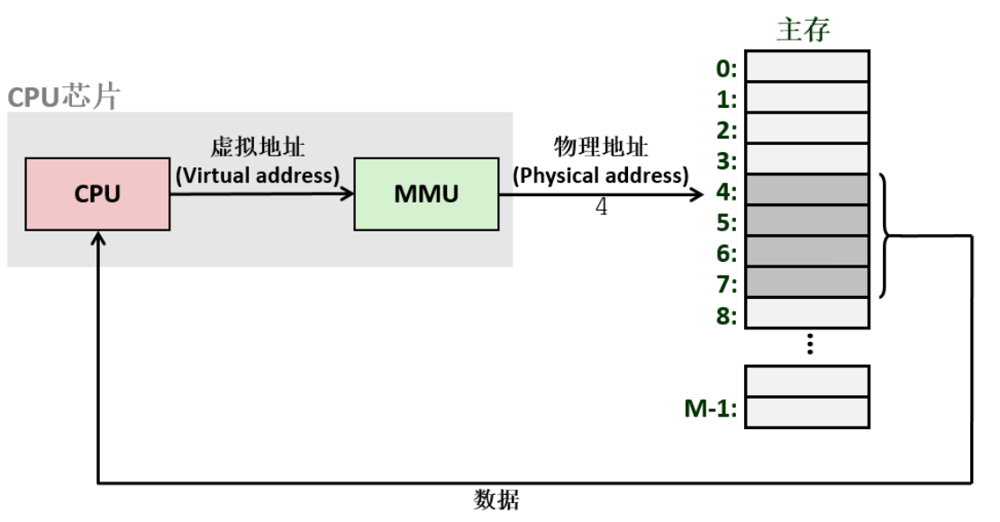  

**为什么要有虚拟地址空间呢？** 

没有虚拟地址空间的时候，**程序都是直接访问和操作的都是物理内存** 。但是这样有什么问题呢？

1. 用户程序可以访问任意内存，寻址内存的每个字节，这样就很容易（有意或者无意）破坏操作系统，造成操作系统崩溃。
2. 想要同时运行多个程序特别困难，比如你想同时运行一个微信和一个 QQ 音乐都不行。为什么呢？举个简单的例子：微信在运行的时候给内存地址 1xxx 赋值后，QQ 音乐也同样给内存地址 1xxx 赋值，那么 QQ 音乐对内存的赋值就会覆盖微信之前所赋的值，这就造成了微信这个程序就会崩溃。

**总结来说：如果直接把物理地址暴露出来的话会带来严重问题，比如可能对操作系统造成伤害以及给同时运行多个程序造成困难。**

通过虚拟地址访问内存有以下优势：

- 程序可以使用一系列相邻的虚拟地址来访问物理内存中不相邻的大内存缓冲区。
- 程序可以使用一系列虚拟地址来访问大于可用物理内存的内存缓冲区。当物理内存的供应量变小时，内存管理器会将物理内存页（通常大小为 4 KB）保存到磁盘文件。数据或代码页会根据需要在物理内存与磁盘之间移动。
- 不同进程使用的虚拟地址彼此隔离。一个进程中的代码无法更改正在由另一进程或操作系统使用的物理内存。


## 4.8 [MMU 地址翻译流程](https://www.eet-china.com/mp/a57406.html)

**当CPU第一次访问虚拟地址时**，虚拟地址所在的虚拟页不在内存中，虚拟页表项(PTE)也不在TLB(转译后备缓冲区)中，因此需要执行的步骤比较多，如下图 **（第一次访问虚拟地址）**

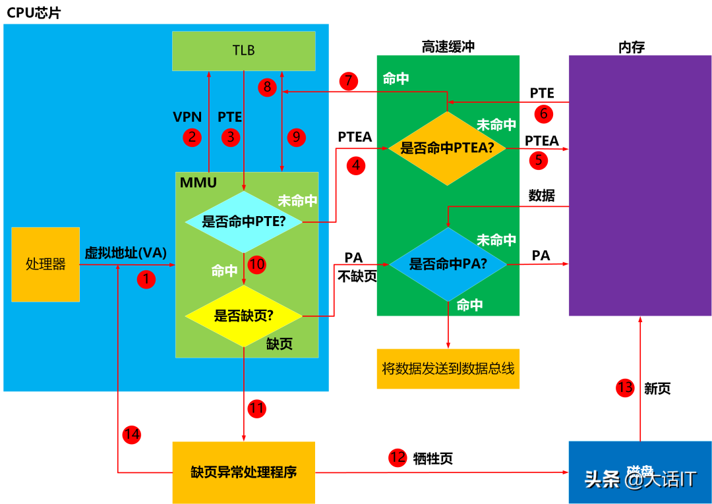 

1. 处理器将**虚拟地址(VA)**送往**MMU(内存管理单元) **

 虚拟地址格式： 

> 虚拟地址长度为n，虚拟页偏移量长度为p。

2. **MMU**获取虚拟地址中的**虚拟页号(VPN)**，然后将虚拟页号发送给**TLB(翻译后备缓冲器)**，**TLB**根据虚拟页号从**TLB映射表**中查询**PTE(页表项即Page Table Entry)**。 

 PTE(页表项)： 

3. **TLB(翻译后备缓冲器)**将查询结果返回给**MMU(内存管理单元)**。

4. **MMU(内存管理单元)**分析查询结果是否有**PTE(页表项)**，发现**PTE**为空，没有命中，因此**MMU**根据**页表基址寄存器(PTBR)**中的页表起始地址加上**虚拟页号(VPN)**，得出虚拟页页表项的物理地址**PTEA（即Page Table Entry Address）**，然后将这个物理地址送往**高速缓冲(L1)**。

5. **高速缓冲(L1)**根据**PTEA**查询内部的缓冲映射表，发现没有找到PTEA映射的内容即PTE（页表项），然后向内存请求**PTEA**下的内容。

6. 内存将**PTEA**下的内容**PTE**，发送给高速缓冲(L1)，高速缓冲(L1)建立了PTEA和PTE的映射关系。

7. 高速缓冲(L1)再次根据PTEA查询内部的缓冲映射表，这次找到了，然后将PTE发送给**TLB**。

8~9. **TLB**收到了**PTE**后，建立了**虚拟页号(VPN)**和PTE的映射（8），然后将PTE发送给**MMU**。

10. **MMU**收到了**PTE**后，检查PTE的有效位，看看虚拟页是否在内存中。
11. **MMU**检查**PTE**后，发现虚拟页不在内存中，因此发送缺页中断给CPU，CPU开始执行缺页中断处理程序。
12. 缺页中断处理程序根据页面置换算法，选择出一个已经缓冲的虚拟页作为牺牲页（如果这个虚拟页发生了变化，则更新到磁盘中），将这个牺牲页的**PTE**的有效位设置为0，表明这个牺牲页不在内存了。
13. 缺页中断处理程序将缺少的页，从磁盘换入到空闲的物理内存中，设置缺少的虚拟页的PTE的有效位为1，更新物理号。
14. 缺页中断处理程序执行完毕，跳转到发生缺页的指令处，然后CPU重新执行该指令，重新发出虚拟地址到MMU,跳到了1，开启下一个循环。


**当CPU第二次访问同一个虚拟地址时**，虚拟地址所在的虚拟页已经内存中，虚拟页表项(PTE)也在TLB中了，因此需要执行的步骤少了很多，如下图 **（第二次访问虚拟地址）**

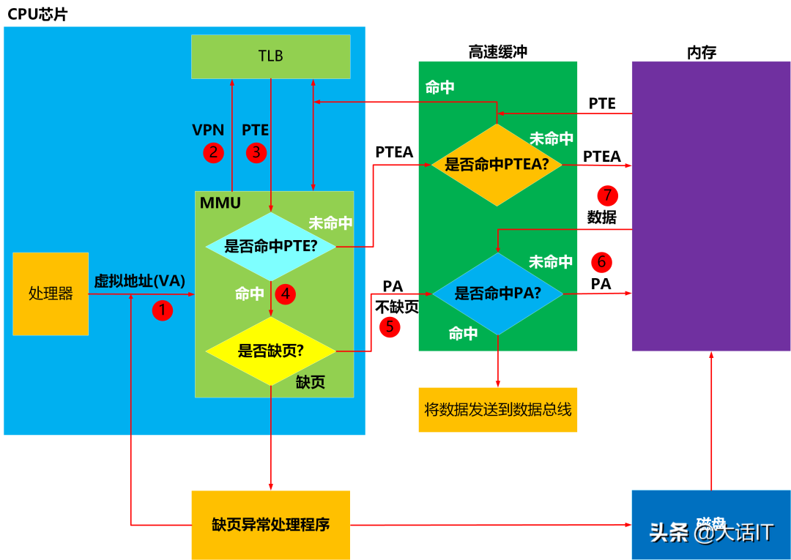  

1. 处理器将**虚拟地址(VA)**送往**MMU(内存管理单元)**。

2. **MMU**获取虚拟地址中的**虚拟页号(VPN)**，然后将虚拟页号发送给**TLB(翻译后备缓冲器)**，**TLB**根据虚拟页号从**TLB映射表**中查询**PTE(页表项即Page Table Entry)**。

3. **TLB(翻译后备缓冲器)**将查询结果返回给**MMU(内存管理单元)**。

4. **MMU(内存管理单元)**分析查询结果是否有**PTE(页表项)**，发现**PTE**有值，命中了，然后检查PTE的有效位，发现有效位是1，因此不缺页，根据PTE中的物理号加上虚拟地址中的(VPO)计算出指令或者数据的物理地址PA，将PA发送到高速缓冲(L1)

5. **高速缓冲(L1)**根据**PA**查询内部的缓冲映射表，发现没有找到PA映射的内容即指令或者数据，然后向内存请求**PA**下的内容。

6. 内存将**PA**下的内容，发送给高速缓冲(L1)，高速缓冲(L1)建立了PA和内容的映射关系。

7. 高速缓冲(L1)再次根据PA查询内部的缓冲映射表，这次找到了，然后将代码或者指令发送到数据总线，CPU收到数据总线的数据后，感叹道，终于拿到数据了。

当CPU第三次访问同一个虚拟地址时，与第二次不同的是，因为虚拟地址对应的物理地址的数据，已经映射到高速缓冲(L1)，所以不再从内存中查询。


## 4.9 什么是虚拟内存？

虚拟内存是**计算机系统内存管理的一种技术**。它**使得应用程序认为它拥有连续的可用的内存（一个连续完整的地址空间），而实际上，它通常是被分隔成多个物理内存碎片，还有部分暂时存储在外部磁盘存储器上，在需要时进行数据交换**。（出现原因是由于**主存的空间有限**）

> **虚拟存储器**
>
> 基于局部性原理，在程序装入时，可以将程序的一部分装入内存，而将其他部分留在外存，就可以启动程序执行。由于外存往往比内存大很多，所以我们运行的软件的内存大小实际上是可以比计算机系统实际的内存大小大的。在程序执行过程中，当所访问的信息不在内存时，由操作系统将所需要的部分调入内存，然后继续执行程序。另一方面，操作系统将内存中暂时不使用的内容换到外存上，从而腾出空间存放将要调入内存的信息。这样，计算机好像为用户提供了一个比实际内存大的多的存储器——**虚拟存储器**。
>
> 实际上，我觉得虚拟内存同样是一种**时间换空间**的策略，用 CPU 的计算时间，页的调入调出花费的时间，换来了一个虚拟的更大的空间来支持程序的运行。


## 4.10 什么是局部性原理？

局部性原理是虚拟内存技术的基础，正是因为程序运行具有局部性原理，才可以只装入部分程序到内存就开始运行。 

局部性原理表现在以下两个方面：

1. **时间局部性** ：如果程序中的某条指令一旦执行，不久以后该指令可能再次执行；如果某数据被访问过，不久以后该数据可能再次被访问。产生时间局部性的典型原因，是由于在程序中存在着大量的循环操作。
2. **空间局部性** ：一旦程序访问了某个存储单元，在不久之后，其附近的存储单元也将被访问，即程序在一段时间内所访问的地址，可能集中在一定的范围之内，这是因为指令通常是顺序存放、顺序执行的，数据也一般是以向量、数组、表等形式聚簇存储的。

时间局部性是通过将**近来使用的指令和数据保存到高速缓存存储器（快表）中，并使用高速缓存的层次结构**实现。空间局部性通常是**使用较大的高速缓存，并将预取机制集成到高速缓存控制逻辑中**实现。虚拟内存技术实际上就是建立了 “**内存一外存**”的两级存储器的结构，利用局部性原理实现髙速缓存。 


## 4.11 页面置换算法

请求调页，也称按需调页，即**对不在内存中的“页”，当进程执行时要用时才调入，否则有可能到程序结束时也不会调入**。而内存中给页面留的位置是有限的，在内存中以**帧**为单位放置页面。为了防止请求调页的过程出现过多的内存页面错误（即需要的页面当前不在内存中，需要从硬盘中读数据，也即需要做页面的替换）而使得程序执行效率下降，我们需要设计一些页面置换算法，页面按照这些算法进行相互替换时，可以**尽量达到较低的错误率，保证较低的缺页率**。常用的页面置换算法如下： 

- **先进先出置换算法（FIFO）**

  总是淘汰最先进入内存的页面，即选择在内存中驻留时间最久的页面进行淘汰。  

- **最近最久未使用算法（LRU）**

  即选择最近最久未使用的页面予以淘汰 。

- **最佳置换算法（OPT）**

  选未来最远将使用的页淘汰，是一种最优的方案，可以保证最低的缺页率。 

- **时钟置换算法（Clock）**

  时钟置换算法也叫最近未用算法 NRU（Not RecentlyUsed）。该算法为每个页面设置一位访问位，当一个页面被访问时，将访问位置为 1。 将内存中的所有页面都通过链接指针链成一个循环队列。 当缺页中断发生时，检查当前指针所指向页面的访问位，如果访问位为 0，就将该页面换出；否则将该页的访问位设置为 0，给该页面第二次的机会，移动指针继续检查。
  
     


## 4.12 常见内存分配错误有哪些？

**（1）内存分配未成功，却使用了它**

编程新手常犯这种错误，因为他们没有意识到内存分配会不成功。常用解决办法是，在使用内存之前检查指针是否为NULL。如果指针p是函数的参数，那么在函数的入口处用 `assert(p!=NULL)` 进行检查。如果是用 `malloc` 或 `new` 来申请内存，应该用 `if(pNULL) ` 或 `if(p!=NULL)` 进行防错处理。

**（2）内存分配虽然成功，但是尚未初始化就引用它**

犯这种错误主要有两个起因：一是没有初始化的观念；二是误以为内存的缺省初值全为零，导致引用初值错误（例如数组）。内存的缺省初值究竟是什么并没有统一的标准，尽管有些时候为零值，我们宁可信其无不可信其有。所以无论用何种方式创建数组，都别忘了赋初值，即便是赋零值也不可省略，不要嫌麻烦。

**（3）内存分配成功并且已经初始化，但操作越过了内存的边界**

例如在使用数组时经常发生下标“多1”或者“少1”的操作。特别是在for循环语句中，循环次数很容易搞错，导致数组操作越界。

**（4）忘记了释放内存，造成内存泄露**

含有这种错误的函数每被调用一次就丢失一块内存。刚开始时系统的内存充足，你看不到错误。终有一次程序突然挂掉，系统出现提示：内存耗尽。动态内存的申请与释放必须配对，程序中 `malloc` 与 `free` 的使用次数一定要相同，否则肯定有错误（`new` / `delete`同理）。

**（5）释放了内存却继续使用它。**

常见于以下有三种情况：

- 程序中的对象调用关系过于复杂，实在难以搞清楚某个对象究竟是否已经释放了内存，此时应该重新设计数据结构，从根本上解决对象管理的混乱局面。
- 函数的 return 语句写错了，注意不要返回指向“栈内存”的“指针”或者“引用”，因为该内存在函数体结束时被自动销毁。
- 使用 `free` 或 `delete` 释放了内存后，没有将指针设置为 NULL。导致产生“野指针”。


## 4.13 内存交换中，被换出的进程保存在哪里？

保存在磁盘中，也就是外存中。具有对换功能的操作系统中，通常把磁盘空间分为文件区和对换区两部分。文件区主要用于存放文件，主要追求存储空间的利用率，因此对文件区空间的管理采用离散分配方式；对换区空间只占磁盘空间的小部分，被换出的进程数据就存放在对换区。由于对换的速度直接影响到系统的整体速度，因此对换区空间的管理主要追求换入换出速度，因此通常对换区采用连续分配方式。总之，对换区的I/O速度比文件区的更快。 


## 4.14 虚拟内存的技术实现

**虚拟内存的实现需要建立在离散分配的内存管理方式的基础上**。虚拟内存的实现有以下三种方式：

1. **请求分页存储管理** ：建立在分页管理之上，为了支持虚拟存储器功能而增加了请求调页功能和页面置换功能。请求分页是目前最常用的一种实现虚拟存储器的方法。请求分页存储管理系统中，在作业开始运行之前，仅装入当前要执行的部分段即可运行。假如在作业运行的过程中发现要访问的页面不在内存，则由处理器通知操作系统按照对应的页面置换算法将相应的页面调入到主存，同时操作系统也可以将暂时不用的页面置换到外存中。
2. **请求分段存储管理** ：建立在分段存储管理之上，增加了请求调段功能、分段置换功能。请求分段储存管理方式就如同请求分页储存管理方式一样，在作业开始运行之前，仅装入当前要执行的部分段即可运行；在执行过程中，可使用请求调入中断动态装入要访问但又不在内存的程序段；当内存空间已满，而又需要装入新的段时，根据置换功能适当调出某个段，以便腾出空间而装入新的段。
3. **请求段页式存储管理**

#### 这里多说一下，很多人容易搞混请求分页与分页存储管理，两者有何不同呢？

**请求分页存储管理建立在分页管理之上**。他们的根本区别是**是否将程序全部所需的全部地址空间都装入主存**，这也是请求分页存储管理可以提供虚拟内存的原因。

它们之间的根本区别在于**是否将一作业的全部地址空间同时装入主存**。请求分页存储管理不要求将作业全部地址空间同时装入主存。基于这一点，**请求分页存储管理可以提供虚存，而分页存储管理却不能提供虚存**。

不管是上面哪种实现方式，我们一般都需要：

1. 一定容量的内存和外存：在载入程序的时候，只需要将程序的一部分装入内存，而将其他部分留在外存，然后程序就可以执行了；
2. **缺页中断**：如果**需执行的指令或访问的数据尚未在内存**（称为缺页或缺段），则由处理器通知操作系统将相应的页面或段**调入到内存**，然后继续执行程序；
3. **虚拟地址空间** ：逻辑地址到物理地址的变换。


# 五、设备管理


## 5.1 磁盘调度算法

 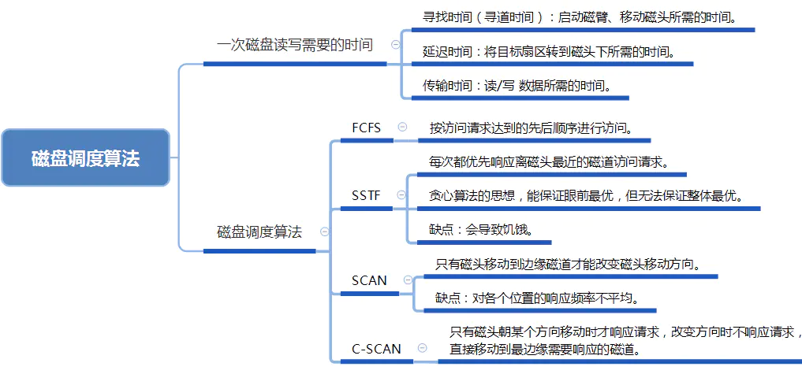 

#### 1、一次磁盘读/写操作需要的时间

**寻找时间（寻道时间）Ts**：在读/写数据前，需要将磁头移动到指定磁道所花费的时间。

寻道时间分两步：

> (1) 启动磁头臂消耗的时间：s
>
> (2) 移动磁头消耗的时间：假设磁头匀速移动，每跨越一个磁道消耗时间为 m，共跨越 n 条磁道。

则寻道时间  **Ts = s + m \* n。**

磁头移动到指定的磁道，但是不一定正好在所需要读/写的扇区，所以需要通过磁盘旋转使磁头定位到目标扇区。

 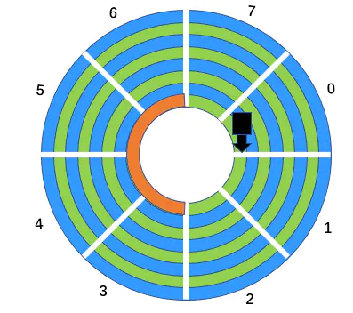 

**延迟时间TR**：通过旋转磁盘，使磁头定位到目标扇区所需要的时间。设磁盘转速为 r（单位：转/秒，或转/分），则**平均所需延迟时间TR** = (1/2)*(1/r) = 1/2r。

> 1/r 就是转一圈所需的时间。找到目标扇区平均需要转半圈，因此再乘以1/2。

**传输时间TR**：从磁盘读出或向磁盘中写入数据所经历的时间，假设磁盘转速为 r，此次读/写的字节数为 b，每个磁道上的字节数为 N，则传输时间**TR** = (b/N) * (1/r) = b/(rN)。

> 每个磁道可存 N 字节数据，因此 b 字节数据需要 b/N 个磁道才能存储。而读/写一个磁道所需的时间刚好是转一圈的时间 1/r。

总的平均时间 **Ta = Ts + 1/2r + b/(rN)**，由于延迟时间和传输时间都是与磁盘转速有关的，且是线性相关。而转速又是磁盘的固有属性，因此无法通过操作系统优化延迟时间和传输时间。所以只能优化寻找时间。

#### 2、磁盘调度算法

#####  2.1 先来先服务算法（FCFS）

算法思想：**根据进程请求访问磁盘的先后顺序进行调度。**

假设磁头的初始位置是100号磁道，有多个进程先后陆续地请求访问55、58、39、18、90、160、150、38、184号磁道。
按照先来先服务算法规则，按照请求到达的顺序，磁头需要一次移动到55、58、39、18、90、160、150、38、184号磁道。
  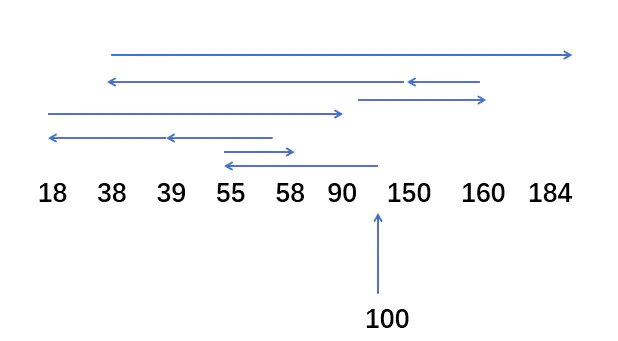 

磁头共移动了 45 + 3 + 19 + 21 + 72 + 70 + 10 + 112 + 146 = 498 个磁道。响应一个请求平均需要移动 498 / 9 = 55.3个磁道（平均寻找长度）。

- 优点：**公平；如果请求访问的磁道比较集中的话，算法性能还算可以**。
- 缺点：**如果大量进程竞争使用磁盘，请求访问的磁道很分散，FCFS在性能上很差，寻道时间长**。

#####  2.2 最短寻找时间优先（SSTF）

算法思想：**优先处理的磁道是与当前磁头最近的磁道。可以保证每次寻道时间最短，但是不能保证总的寻道时间最短**。（其实是贪心算法的思想，只是选择眼前最优，但是总体未必最优）。

假设磁头的初始位置是100号磁道，有多个进程先后陆续地请求访问55、58、39、18、90、160、150、38、184号磁道。

  

磁头总共移动了（100 -18）+ （184 -18） = 248个磁道。响应一个请求平均需要移动248 / 9 = 27.5个磁道（平均寻找长度）。

- 缺点：**可能产生饥饿现象**。

本例中，如果在处理18号磁道的访问请求时又来了一个38号磁道的访问请求，处理38号磁道的访问请求又来了一个18号磁道访问请求。如果有源源不断的18号、38号磁道访问请求，那么150、160、184号磁道请求的访问就永远得不到满足，从而产生饥饿现象。这里产生饥饿的原因是**磁头在一小块区域来回移动。**

#####  2.3 扫描算法（SCAN）

SSTF算法会产生饥饿的原因在于：磁头有可能再一个小区域内来回得移动。为了防止这个问题，可以规定：**磁头只有移动到请求最外侧磁道或最内侧磁道才可以反向移动，如果在磁头移动的方向上已经没有请求，就可以立即改变磁头移动，不必移动到最内/外侧的磁道。**这就是扫描算法的思想。由于磁头移动的方式很像电梯，因此也叫**电梯算法**。

假设某磁盘的磁道为0~200号，磁头的初始位置是100号磁道，且此时磁头正在往磁道号增大的方向移动，有多个进程先后陆续的访问55、58、39、18、90、160、150、38、184号磁道。

 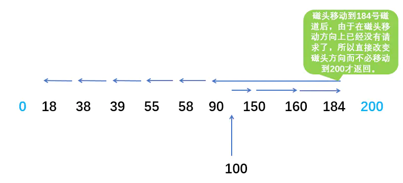 

磁头共移动了（184 - 100）+ （184 -18） = 250个磁道。响应一个请求平均需要移动 250 / 9 = 27.5个磁道（平均寻找长度）。

- 优点：**性能较好，寻道时间较短，不会产生饥饿现象。**
- 缺点：**SCAN算法对于各个位置磁道的响应频率不平均**。（假设此时磁头正在往右移动，且刚处理过90号磁道，那么下次处理90号磁道的请求就需要等待磁头移动很长一段距离；而响应了184号磁道的请求之后，很快又可以再次响应184号磁道请求了。）

#####  2.4 循环扫描算法（C-SCAN）

SCAN算法对各个位置磁道的响应频率不平均，而C-SCAN算法就是为了解决这个问题。规定只有磁头朝某个特定方向移动时才处理磁道访问请求，而**返回时直接快速移动至最靠边缘的并且需要访问的磁道上而不处理任何请求。**
（通俗理解就是SCAN算法在改变磁头方向时不处理磁盘访问请求而是直接移动到另一端最靠边的磁盘访问请求的磁道上。）

假设某磁盘的磁道为0~200号，磁头的初始位置是100号磁道，且此时磁头正在往磁道号增大的方向移动，有多个进程先后陆续的访问55、58、39、18、90、160、150、38、184号磁道。

 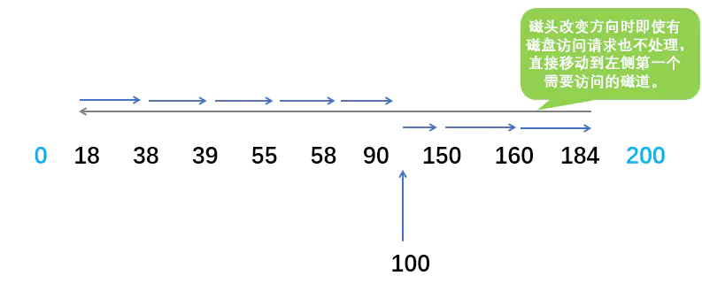 

磁头共移动了（184 -100）+ （184 - 18）+（90 - 18）=322个磁道。响应一个请求平均需要移动322 / 9 = 35.8个磁道（平均寻找长度）。

- 优点：**相比于SCAN算法，对于各个位置磁道响应频率很平均。**
- 缺点：**相比于SCAN算法，平均寻道时间更长。**


# 其他


## 谈谈你对动态链接库和静态链接库的理解？

静态链接就是**在编译链接时直接将需要的执行代码拷贝到调用处**，优点就是在程序发布的时候就不需要依赖库，也就是不再需要带着库一块发布，程序可以独立执行，但是体积可能会相对大一些。

动态链接就是**在编译的时候不直接拷贝可执行代码，而是通过记录一系列符号和参数，在程序运行或加载时将这些信息传递给操作系统，操作系统负责将需要的动态库加载到内存中，然后程序在运行到指定的代码时，去共享执行内存中已经加载的动态库可执行代码，最终达到运行时连接的目的**。优点是多个程序可以共享同一段代码，而不需要在磁盘上存储多个拷贝，缺点是由于是运行时加载，可能会影响程序的前期执行性能。


## 外中断和异常有什么区别？

外中断是指**由 CPU 执行指令以外的事件引起**，如 I/O 完成中断，表示设备输入/输出处理已经完成，处理器能够发送下一个输入/输出请求。此外还有时钟中断、控制台中断等。

而异常是**由 CPU 执行指令的内部事件引起**，如非法操作码、地址越界、算术溢出等。


## 一个程序从开始运行到结束的完整过程，你能说出多少？

四个过程：

**（1）预编译** 

主要处理源代码文件中的以“#”开头的预编译指令。处理规则见下：

1、删除所有的#define，展开所有的宏定义。

2、处理所有的条件预编译指令，如“#if”、“#endif”、“#ifdef”、“#elif”和“#else”。

3、处理“#include”预编译指令，将文件内容替换到它的位置，这个过程是递归进行的，文件中包含其他文件。

4、删除所有的注释，“//”和“/**/”。

5、保留所有的#pragma 编译器指令，编译器需要用到他们，如：#pragma once 是为了防止有文件被重复引用。

6、添加行号和文件标识，便于编译时编译器产生调试用的行号信息，和编译时产生编译错误或警告时能够显示行号。

**（2）编译** 

把预编译之后生成的 xxx.i 或 xxx.ii 文件，进行一系列词法分析、语法分析、语义分析及优化后，生成相应的汇编代码文件。

1、词法分析：利用类似于“有限状态机”的算法，将源代码程序输入到扫描机中，将其中的字符序列分割成一系列的记号。

2、语法分析：语法分析器对由扫描器产生的记号，进行语法分析，产生语法树。由语法分析器输出的语法树是一种以表达式为节点的树。

3、语义分析：语法分析器只是完成了对表达式语法层面的分析，语义分析器则对表达式是否有意义进行判断，其分析的语义是静态语义——在编译期能分析的语义，相对应的动态语义是在运行期才能确定的语义。

4、优化：源代码级别的一个优化过程。

5、目标代码生成：由代码生成器将中间代码转换成目标机器代码，生成一系列的代码序列——汇编语言表示。

6、目标代码优化：目标代码优化器对上述的目标机器代码进行优化：寻找合适的寻址方式、使用位移来替代乘法运算、删除多余的指令等。

**（3）汇编**

将汇编代码转变成机器可以执行的指令(机器码文件)。 汇编器的汇编过程相对于编译器来说更简单，没有复杂的语法，也没有语义，更不需要做指令优化，只是根据汇编指令和机器指令的对照表一一翻译过来，汇编过程由汇编器as完成。

经汇编之后，产生目标文件(与可执行文件格式几乎一样) xxx.o (Linux下)、xxx.obj (Windows下)。

**（4）链接**

将不同的源文件产生的目标文件进行链接，从而形成一个可以执行的程序。链接分为静态链接和动态链接：

**1、静态链接：** 函数和数据被编译进一个二进制文件。在使用静态库的情况下，在编译链接可执行文件时，链接器从库中复制这些函数和数据并把它们和应用程序的其它模块组合起来创建最终的可执行文件。 空间浪费：因为每个可执行程序中对所有需要的目标文件都要有一份副本，所以如果多个程序对同一个目标文件都有依赖，会出现同一个目标文件都在内存存在多个副本； 更新困难：每当库函数的代码修改了，这个时候就需要重新进行编译链接形成可执行程序。

运行速度快：但是静态链接的优点就是，在可执行程序中已经具备了所有执行程序所需要的任何东西，在执行的时候运行速度快。

**2、动态链接：** 动态链接的基本思想是把程序按照模块拆分成各个相对独立部分，在程序运行时才将它们链接在一起形成一个完整的程序，而不是像静态链接一样把所有程序模块都链接成一个单独的可执行文件。

共享库：就是即使需要每个程序都依赖同一个库，但是该库不会像静态链接那样在内存中存在多份副本，而是这多个程序在执行时共享同一份副本；

更新方便：更新时只需要替换原来的目标文件，而无需将所有的程序再重新链接一遍。当程序下一次运行时，新版本的目标文件会被自动加载到内存并且链接起来，程序就完成了升级的目标。

性能损耗：因为把链接推迟到了程序运行时，所以每次执行程序都需要进行链接，所以性能会有一定损失。


## 原子操作是如何实现的？

**处理器使用基于对缓存加锁或总线加锁的方式来实现多处理器之间的原子操作。**首先处理器会自动保证基本的内存操作的原子性。处理器保证从系统内存中读取或者写入一个字节是原子的，意思是当一个处理器读取一个字节时，其他处理器不能访问这个字节的内存地址。Pentium 6和最新的处理器能自动保证单处理器对同一个缓存行里进行16/32/64位的操作是原子的，但是复杂的内存操作处理器是不能自动保证其原子性的，比如跨总线宽度、跨多个缓存行和跨页表的访问。但是，处理器提供总线锁定和缓存锁定两个机制来保证复杂内存操作的原子性。

（1）使用总线锁保证原子性 第一个机制是通过总线锁保证原子性。如果多个处理器同时对共享变量进行读改写操作（i++就是经典的读改写操作），那么共享变量就会被多个处理器同时进行操作，这样读改写操作就不是原子的，操作完之后共享变量的值会和期望的不一致。举个例子，如果i=1，我们进行两次i++操作，我们期望的结果是3，但是有可能结果是2，如图下图所示。

“`c++
CPU1 CPU2
i=1 i=1
i+1 i+1
i=2 i=2Copy to clipboardErrorCopied
“`

原因可能是多个处理器同时从各自的缓存中读取变量i，分别进行加1操作，然后分别写入系统内存中。那么，想要保证读改写共享变量的操作是原子的，就必须保证CPU1读改写共享变量的时候，CPU2不能操作缓存了该共享变量内存地址的缓存。

处理器使用总线锁就是来解决这个问题的。**所谓总线锁就是使用处理器提供的一个LOCK＃信号，当一个处理器在总线上输出此信号时，其他处理器的请求将被阻塞住，那么该处理器可以独占共享内存。**

（2）使用缓存锁保证原子性 第二个机制是通过缓存锁定来保证原子性。在同一时刻，我们只需保证对某个内存地址的操作是原子性即可，但**总线锁定把CPU和内存之间的通信锁住了**，这使得锁定期间，其他处理器不能操作其他内存地址的数据，所以总线锁定的开销比较大，目前处理器在某些场合下使用缓存锁定代替总线锁定来进行优化。

频繁使用的内存会缓存在处理器的L1、L2和L3高速缓存里，那么原子操作就可以直接在处理器内部缓存中进行，并不需要声明总线锁，在Pentium 6和目前的处理器中可以使用“缓存锁定”的方式来实现复杂的原子性。

所谓“缓存锁定”是指内存区域如果被缓存在处理器的缓存行中，并且在Lock操作期间被锁定，那么当它执行锁操作回写到内存时，处理器不在总线上声言LOCK＃信号，而是修改内部的内存地址，并允许它的缓存一致性机制来保证操作的原子性，因为**缓存一致性机制会阻止同时修改由两个以上处理器缓存的内存区域数据，当其他处理器回写已被锁定的缓存行的数据时，会使缓存行无效，在如上图所示的例子中，当CPU1修改缓存行中的i时使用了缓存锁定，那么CPU2就不能使用同时缓存i的缓存行。**

但是有两种情况下处理器不会使用缓存锁定。 第一种情况是：当操作的数据不能被缓存在处理器内部，或操作的数据跨多个缓存行（cache line）时，则处理器会调用总线锁定。 第二种情况是：有些处理器不支持缓存锁定。对于Intel 486和Pentium处理器，就算锁定的内存区域在处理器的缓存行中也会调用总线锁定。


## 抖动你知道是什么吗？它也叫颠簸现象

**刚刚换出的页面马上又要换入内存，刚刚换入的页面马上又要换出外存**，这种频繁的页面调度行为称为抖动，或颠簸。产生抖动的主要原因是**进程频繁访问的页面数目高于可用的物理块数(分配给进程的物理块不够)**。

为进程分配的物理块太少，会使进程发生抖动现象。为进程分配的物理块太多，又会降低系统整体的并发度，降低某些资源的利用率 为了研究为应该为每个进程分配多少个物理块，Denning 提出了“进程工作集” 的概念。


