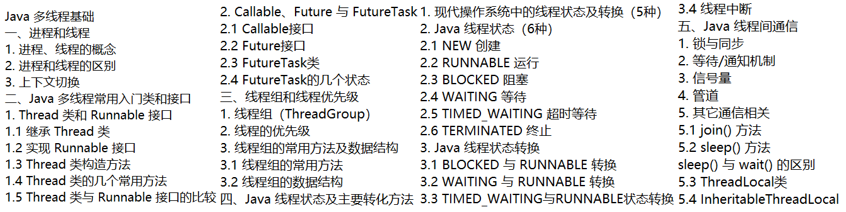
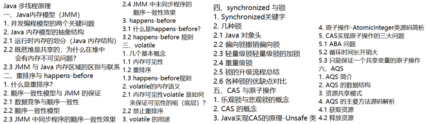
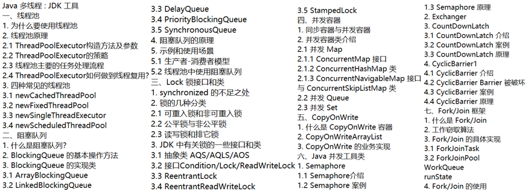

# Mars 的知识库📕

- **Github 地址**： [https://github.com/Kaho-WONG/myNotes](https://github.com/Kaho-WONG/myNotes) 
- **Gitee 地址**： [https://gitee.com/coder-kaho/myNotes](https://gitee.com/coder-kaho/myNotes) 

## About Me🙈

Githuber 们大家好！我是**编程**时长两年半(bushi)的个人练习生 **Mars**，喜欢唱、跳、rap、**写代码**，就读于广东深圳南山区某 TOP 四非电子信息工程专业。多的不说，这个知识库记录了我的**计算机自学笔记**！！！

## 仓库介绍💬

这个仓库用来存放我在自学计算机过程中的所做的学习笔记，涵盖了诸如 **Java、数据库、计算机网络、操作系统、算法与数据结构**等等领域的知识。

整理这个自学笔记仓库的目的是为了**在学习过程中能总结好相关要点，便于日后复习自省**~~~

> 笔记全部是用 `markdown` 格式文档编写，由于本人关注了一大批技术博主，也会经常翻阅并借鉴他们的文章笔记，所以笔记中有你看过的部分，那就当给你复习啦！

## 笔记导航🔗

### Java☕

- **Java 基础**

- **[Java 容器](./Java/Java_Container/Java集合.md)**

- **Java 并发**
  
  - **[Java 多线程—基础](./Java/Java_Concurrency/Java多线程基础.md)**
  
    
  
  - **[Java 多线程—原理](./Java/Java_Concurrency/Java多线程原理.md)**
  
    
  
  - **[Java 多线程— JDK 工具](./Java/Java_Concurrency/Java多线程工具.md)**
  
    
  
  - **[《Java 并发编程的艺术》学习笔记](./Java/Java_Concurrency/Java并发编程的艺术学习笔记/Java并发编程.md)**（[书籍链接](https://book.douban.com/subject/26591326/)）
  
- **Java 虚拟机**
  
  - **《深入理解Java虚拟机》学习笔记**（[书籍链接](https://book.douban.com/subject/34907497/)）
    - [JVM 内存结构](./Java/JVM/深入理解java虚拟机学习笔记/JVM内存结构.md)
    - [JVM 垃圾收集与内存分配](./Java/JVM/深入理解java虚拟机学习笔记/JVM垃圾收集与内存分配.md)
    - [类文件结构](./Java/JVM/深入理解java虚拟机学习笔记/类文件结构.md)
    - [类加载机制](./Java/JVM/深入理解java虚拟机学习笔记/类加载机制.md)

### MySQL🐬

- **[SQL](./MySQL/SQL/SQL.md)**
- MySQL 学习笔记
- **[MySQL 重要知识点总结](./MySQL/MySQL题目解析.md)**
- **《MySQL实战45讲》笔记**（[专栏链接](https://time.geekbang.org/column/intro/100020801)）
  - [《MySQL实战45讲》(1~15)](./MySQL/《MySQL实战45讲》笔记/MySQL实战45讲(1~15).md)
  - [《MySQL实战45讲》(16~30)](./MySQL/《MySQL实战45讲》笔记/MySQL实战45讲(16~30).md)
  - [《MySQL实战45讲》(31~45)](./MySQL/《MySQL实战45讲》笔记/MySQL实战45讲(31~45).md)
- **[JDBC 学习笔记](./Java/JDBC/JDBC.md)**（[视频地址](https://www.bilibili.com/video/BV1eJ411c7rf?share_source=copy_web)）

### Redis🧱

- Redis 学习笔记
- **《Redis 设计与实现》学习笔记**（[书籍链接](https://book.douban.com/subject/25900156/)）
  - [数据结构](./Redis/Redis设计与实现笔记/Redis设计与实现-1-数据结构.md)
  - [对象](./Redis/Redis设计与实现笔记/Redis设计与实现-2-对象.md)
  - [数据库](./Redis/Redis设计与实现笔记/Redis设计与实现-3-数据库.md)
  - [RDB 和 AOF](./Redis/Redis设计与实现笔记/Redis设计与实现-4-RDB持久化和AOF持久化.md)
  - [事件](./Redis/Redis设计与实现笔记/Redis设计与实现-5-事件.md)
  - [客户端与服务器](./Redis/Redis设计与实现笔记/Redis设计与实现-6-客户端与服务器.md)
  - [复制](./Redis/Redis设计与实现笔记/Redis设计与实现-7-复制.md)
  - [Sentinel](./Redis/Redis设计与实现笔记/Redis设计与实现-8-Sentinel.md)
  - [集群](./Redis/Redis设计与实现笔记/Redis设计与实现-9-集群.md)
  - [发布与订阅](./Redis/Redis设计与实现笔记/Redis设计与实现-10-发布与订阅.md)
  - [事务](./Redis/Redis设计与实现笔记/Redis设计与实现-11-事务.md)
  - [Lua 脚本](./Redis/Redis设计与实现笔记/Redis设计与实现-12-Lua脚本.md)
- **[Redis 简单应用场景总结](./Redis/Redis的简单应用场景总结.md)**

### 算法与数据结构🧮

- **[常见数据结构解析](./Data_Structure/常见数据结构详解.md)**

- **[常见算法解析](./Algorithm/常见算法解析.md)**

### 计算机网络🌐

- **[计算机网络学习笔记](./NetWork/计算机网络.md)**
- **[HTTP 详解](./NetWork/HTTP详解.md)**
- **B站湖南科技大学计算机网络学习笔记**（[视频链接](https://www.bilibili.com/video/BV1c4411d7jb?share_source=copy_web)）
  - [概述](./NetWork/湖科大计算机网络学习笔记/计算机网络第一章（概述）/计算机网络第1章（概述）.md)
  - [物理层](./NetWork/湖科大计算机网络学习笔记/计算机网络第二章（物理层）/计算机网络第2章（物理层）.md)
  - [数据链路层](./NetWork/湖科大计算机网络学习笔记/计算机网络第三章（数据链路层）/计算机网络第3章（数据链路层）.md)
  - [网络层](./NetWork/湖科大计算机网络学习笔记/计算机网络第四章（网络层）/计算机网络第4章（网络层）.md)
  - [运输层](./NetWork/湖科大计算机网络学习笔记/计算机网络第五章（运输层）/计算机网络第5章（运输层）.md)
  - [应用层](./NetWork/湖科大计算机网络学习笔记/计算机网络第六章（应用层）/计算机网络第6章（应用层）.md)

### 操作系统💻

- **[操作系统学习笔记](./OS/操作系统学习笔记.md)**
- **[操作系统重要知识点总结](./OS/操作系统重要知识点总结.md)**
- **[Linux 常用命令](./Linux_Command/Linux常用命令.md)**

### 框架🧩

- Spring
- SpringMVC
- MyBatis

### MQ🚄

- [RabbitMQ 笔记](./MQ/RabbitMQ/RabbitMQ.md)

### 设计模式📜

- **[设计模式学习笔记](./Design_Patterns/设计模式.md)**

- **[java 动态代理详解](./Design_Patterns/Dynamic_Proxy/动态代理.md)**

### 工具🔧

- **[Maven 学习笔记](./Maven/maven笔记.md)**

- **[Git 命令](./Git/Git命令大全.md)**

### 其他🛒

- **[Nginx 服务器](./Nginx/Nginx.md)**

- **[Github 操作](https://developer.aliyun.com/article/755244?spm=a2c6h.13262185.0.0.5a4f5c48gAwpAO)**