# Redis 数据结构

> 由于 C 语言的缺陷，Redis 自身创建了许多有用的数据结构，包括：`简单动态字符串`、`链表`、`字典`、`跳跃表`、`整数集合`、`压缩列表`。


# 1. 简单动态字符串

传统 C 语言的字符串（本质是字符数组）以**空字符**结尾，而 Redis 自己重新构建了一种新的字符串结构，命名为**简单动态字符串(simple dynamic string，SDS)**。

在 Redis 中，**C 字符串只会作为字符串字面量用在一些无须修改的地方**，比如打印日志：

```C
redisLog(REDIS_WARNING,"Redis is now ready to exit, bye bye...");
```

如果是**需要修改**的地方，会使用 SDS 来表示，如在 Redis 的数据库里，包含字符串值的键值对在底层都是由 SDS 实现：

```SHELL
redis> RPUSH fruits "apple" "banana" "cherry"
(integer) 3
```

 Redis 将在数据库中创建一个**新的键值对**，其中：

- key 是一个**字符串对象**，底层保存了一个字符串 `fruits` 的 SDS。
- value 是一个**列表对象**，**列表包含了三个字符串对象**，由 SDS 实现。

> SDS 还被用作缓冲区（buffer）：AOF 模块中的 AOF 缓冲区，以及客户端状态中的输入缓冲区，都是由 SDS 实现的。


## 1.1 SDS的定义

SDS 是一个结构体，定义在 `sds.h/sdshdr` 中：

```C
struct sdshdr {
    // 记录 buf 数组中已使用字节的数量
    // 等于 SDS 所保存字符串的长度
    int len;
    // 记录 buf 数组中未使用字节的数量
    int free;
    // 字节数组，用于保存字符串
    char buf[];
};
```

下面给出了一个示例，`free` 为 0 代表所有空间都被使用，`len` 长度为 5，表示 SDS 保存的字符串长度为 5，`buf ` 保存字符串实体，会**自动为末尾的空字符 '\0' 分配额外的 1 字节空间。**

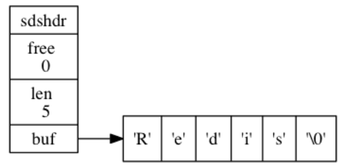

保存空字符的 1 字节空间**不计算在 `len` 属性内**。遵循空字符结尾这一惯例的好处是，**SDS 可以直接重用一部分 C 字符串函数库里面的函数。**

比如我们不需要对 SDS 专门设置打印函数：

```C
printf("%s",s->buf);
```


## 1.2 SDS 与 C 字符串的区别

C 语言使用的简单的字符串表示方式，并不能满足 Redis 对字符串在安全性、效率、以及功能方面的要求。下面是 SDS 比 C 字符串更适用于 Redis 的原因：

**（1）C 字符串获取长度的能力有限**

C 字符串需要依靠遍历获取长度，时间复杂度是 $O(N)$；而 SDS 在 `len` 属性值记录了 SDS 本身的长度，所以时间复杂度是 $O(1)$，实现了**常数时间复杂度获取字符串长度**。

**（2）杜绝缓冲区溢出**

由于 C 字符串不记录长度，当我们拼接两个字符串的时候，容器可能**因为空间不足发生溢出**。redis 中的 `sdscat` 将在执行拼接操作前**检查给定 SDS 的空间是否充足**，若不足则先拓展空间，再拼接。

**（3）减少修改字符串时带来的内存重分配次数**

C 字符串底层是数组，每次修改大小都会重新分配一次内存，频繁地修改会很影响性能。为了避免 C 字符串的这种缺陷，SDS 通过未使用空间 `free`，实现了**空间预分配**和**惰性空间释放**两种优化策略。 

- **空间预分配**

  用于优化 SDS 的**字符串增长**操作：当 SDS 的 API 对一个 SDS 进行修改，并且需要对 SDS 进行空间扩展时，程序不仅会为 SDS 分配修改所必要的空间，还会为其分配额外的未使用空间。分配规则如下：
  - 若修改后 `len < 1 MB`，则 `free` 是 `len` 一样大。

    例：如果修改后 `len` 为 13 字节，则 `free` 也为 13 字节，buf 实际长度为 13 + 13 + 1 = 27 字节。

  - 若修改后 `len ≥ 1 MB`，则每次 `free` 只会有 1 MB。

    例：如果修改后 `len` 为 30 MB，则 `free` 为 1 MB，总长度为 30 MB + 1 MB + 1 byte。

  > 在拓展 SDS 空间之前，SDS API 会先检查未使用空间是否足够，如果足够的话，就会直接使用未使用空间，而无需执行内存重分配。

- **惰性空间释放**

  用于优化 SDS 的**字符串缩短**操作：当 SDS 的 API 需要缩短 SDS 保存的字符串时，程序并不立即使用内存重分配来回收缩短后多出来的字节，而是使用 `free` 属性将这些字节的数量记录起来，并等待将来使用。

  > SDS 也有提供相应的 API 在有需要时真正地释放 SDS 的未使用空间，避免造成内存浪费。

**（4）二进制安全**

C 字符串中的字符必须符合某种编码，并且除了字符串末尾，字符串中不能包含空字符 `\0`，这使得 C 字符串只能保存文本数据， 不能保存像图片、音频、视频、压缩文件这样的二进制数据。而 SDS 的 API 都是**二进制安全的**，都会以处理二进制的方式来处理 SDS 存放在 `buf` 数组中的数据，保证了**数据写入时什么样，读取时就是什么样**。

> SDS 利用 `len` 来判断是否结束，而不是空字符 `\0`，所以字符串中间可以有空字符。

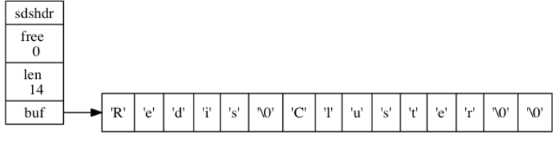


# 2. 链表

链表随机读写能力差，但增删和重排能力较强。C 语言没有链表结构，所以 Redis 自制了一个。

**链表节点**定义在 `adlist.h/listNode`，如下：

```C
typedef struct listNode {
    // 前置节点
    struct listNode *prev;
    // 后置节点
    struct listNode *next;
    // 节点的值
    void *value;
} listNode;
```

这是一个**双端链表**。

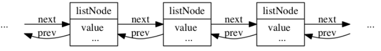

虽然可以多个 `listNode` 组成链表，但是为了方便，Redis 设计了 `adlist.h/list` 来持有链表：

```C
typedef struct list {
    // 表头节点
    listNode *head;
    // 表尾节点
    listNode *tail;
    // 链表所包含的节点数量——链表长度计数器
    unsigned long len;
    // 节点值复制函数
    void *(*dup)(void *ptr);
    // 节点值释放函数
    void (*free)(void *ptr);
    // 节点值对比函数
    int (*match)(void *ptr, void *key);
} list;
```

Redis 的链表实现的特性可以总结如下：

- 双端
- 无环，表头和结尾都指向 `NULL`
- 带有表头表尾指针，访问表头表尾节点复杂度 $O(1)$
- 自带链表长度计数器，获取节点数复杂度 $O(1)$
- **多态**：使用 `void*` 指针来保存节点值，可以通过 `list` 结构的 `dup`、`free`、`match` 为节点值设置类型特定函数，所以链表可以保存不同类型的值 


# 3. 字典

在字典中， 一个键（key）可以和一个值（value）进行关联（或者说将键映射为值）， 这些**关联的键和值就被称为键值对**。字典中的**每个键必须保证都是独一无二的**。


## 3.1 字典的实现

Redis 的字典使用**哈希表**作为底层实现，一个哈希表里面可以有很多哈希表节点，而**每个哈希表节点就保存了字典中的一个键值对**。

Redis 字典所使用的哈希表由 `dict.h/dictht` 结构定义：

```C
typedef struct dictht {
    // 哈希表数组
    dictEntry **table;
    // 哈希表大小
    unsigned long size;
    // 哈希表大小掩码，用于计算索引值
    // 总是等于 size - 1
    unsigned long sizemask
    // 该哈希表已有节点的数量
    unsigned long used;
} dictht;
```

`table` 是一个数组， 数组中的每个元素都是一个指向 `dict.h/dictEntry` 结构的指针。

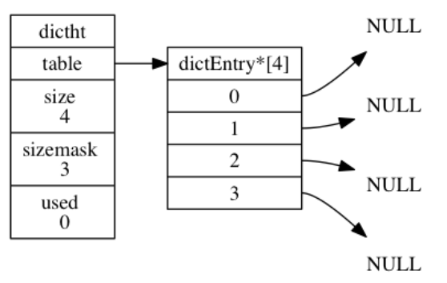

**哈希表节点**使用 `dictEntry` 结构表示， 每个 `dictEntry` 结构都保存着一个键值对：

```C
typedef struct dictEntry {
    // 键
    void *key;
    // 值
    union {
        void *val;
        uint64_t u64;
        int64_t s64;
    } v;
    // 指向下个哈希表节点，形成链表
    struct dictEntry *next;
} dictEntry;
```

`v` 属性则保存着键值对中的值，值可以是一个指针，或者是一个 `uint64_t` 整数，又或者是一个 `int64_t` 整数。

`next` 属性是指向另一个哈希表节点的指针，这个指针可以将多个哈希值相同的键值对连接在一次， 以此来**解决键冲突（collision）的问题**。

下图中，键的索引值都是 2，通过链表的形式完成了冲突的规避。

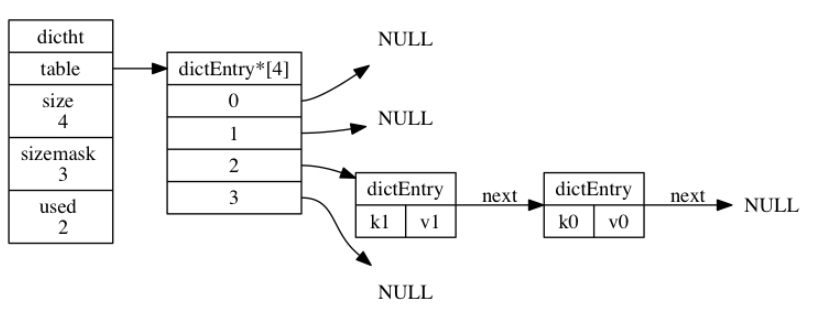

---

上面提到的是哈希表和哈希表节点的实现，现在来说真正的**字典结构**。Redis 中的字典由 `dict.h/dict` 结构表示：

```C
typedef struct dict {
    // 类型特定函数
    dictType *type;
    // 私有数据
    void *privdata;
    // 哈希表
    dictht ht[2];
    // rehash 索引
    // 当 rehash 不在进行时，值为 -1
    int rehashidx; /* rehashing not in progress if rehashidx == -1 */
} dict;
```

其中 `type` 属性和 `privdata` 属性是**针对不同类型的键值对，为创建多态字典而设置的**。

- `type` 属性是一个指向 `dictType` 结构的指针，每个 `dictType` 结构保存了一簇用于操作特定类型键值对的函数。
- `privdata` 属性则保存了需要传给那些类型特定函数的可选参数。

```C
typedef struct dictType {
    // 计算哈希值的函数
    unsigned int (*hashFunction)(const void *key);
    // 复制键的函数
    void *(*keyDup)(void *privdata, const void *key);
    // 复制值的函数
    void *(*valDup)(void *privdata, const void *obj);
    // 对比键的函数
    int (*keyCompare)(void *privdata, const void *key1, const void *key2);
    // 销毁键的函数
    void (*keyDestructor)(void *privdata, void *key);
    // 销毁值的函数
    void (*valDestructor)(void *privdata, void *obj);
} dictType;
```

`ht` 属性是一个包含两个元素（都是一个 `dictht` 哈希表）的哈希表数组 ，一般情况下，字典只使用 `ht[0]` 哈希表，`ht[1]` 哈希表只会在对 `ht[0]` 哈希表进行 **rehash** 时使用。

除了 `ht[1]` 之外，另一个和 rehash 有关的属性就是 `rehashidx` ：它记录了 rehash 目前的进度，如果目前没有在进行 rehash ，那么它的值为 `-1` 。

下图展示了一个普通状态下（没有 rehash）的字典：

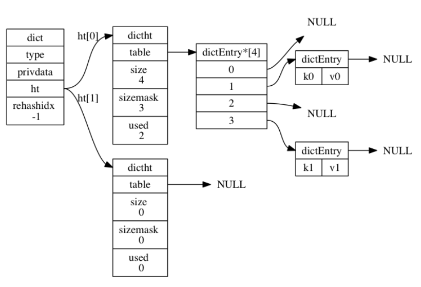


## 3.2 哈希算法

程序需要先根据键值对的**键**计算出**哈希值和索引值**，然后再根据索引值，将包含新键值对的哈希表节点放到哈希表数组的指定索引上面。

Redis 计算哈希值和索引值的方法如下：

```C
// 使用字典设置的哈希函数，计算键 key 的哈希值
hash = dict->type->hashFunction(key);

// 使用哈希表的 sizemask 属性和哈希值，计算出索引值
// 根据情况不同， ht[x] 可以是 ht[0] 或者 ht[1]
index = hash & dict->ht[x].sizemask;
```

举个例子，假如想要将键值对 `k0` 和 `v0` 添加到下面的空字典中：

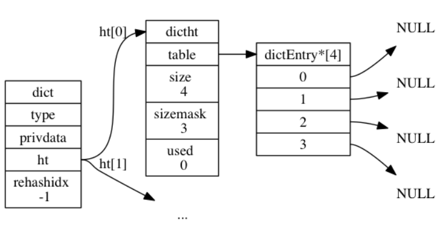

假设通过第一个公式计算出的 hash 值是 8，则 index 为

```c
index = hash & dict->ht[0].sizemask = 8 & 3 = 0;
```

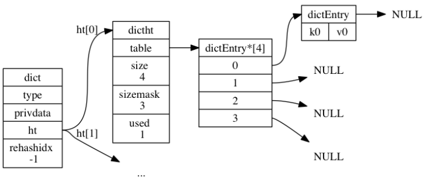

至于 Redis 的哈希值计算方法，使用的是 **MurmurHash2**。这种算法的优点在于，即使输入的键是有规律的，算法仍能给出一个很好的随机分布性，并且算法的计算速度也非常快。


## 3.3 解决键冲突

**当有两个或以上数量的键被分配到了哈希表数组的同一个索引上面时**，称这些键发生了**冲突（collision）**。

Redis 的哈希表使用**链地址法**解决键冲突，每个哈希表节点都有一个 `next` 指针，多个哈希表节点可以用 `next` 指针构成一个单向链表，被分配到同一个索引上的多个节点可以用这个单向链表连接起来。

因为 `dicEntry` 节点组成的链表没有指向链表表尾的指针，所以为了速度考虑，程序总是将新节点添加到链表的表头位置（**头插法，复杂度为 $O(1)$**）。


## 3.4 rehash

随着操作的不断执行，哈希表保存的键值对会逐渐地增多或者减少，为了让哈希表的**负载因子**（load factor）维持在一个合理的范围之内，**当哈希表保存的键值对数量太多或者太少时，程序需要对哈希表的大小进行相应的扩展或者收缩。**

拓展和收缩哈希表的工作可以通过执行 rehash（重新散列/再哈希）操作完成，步骤如下：

**1）为字典的 `ht[1]` 哈希表分配空间**，空间大小取决于要执行的操作，以及 `ht[0]` 当前包含的键值对数量（即 `ht[0].used` 属性的值）：

- 扩展操作：`ht[1]` 的大小为**第一个大于等于 `ht[0].used * 2` 的 $2^n$。**
  - 比如原表大小为 4，则 `ht[0].used * 2` 结果为 8，而 8 刚好是 $2^3$，所以新的大小是8。
- 收缩操作：`ht[1]` 的大小为**第一个大于等于 `ht[0].used` 的 $2^ n$。**

**2）将保存在 `ht[0]` 中的所有键值对 rehash 到 `ht[1]` 上面**：rehash 指的是重新计算键的哈希值和索引值，然后将键值对放置到 `ht[1]` 哈希表的指定位置上。

3）迁移完后（`ht[0]` 变为空表），释放 `ht[0]`，将 `ht[1]` 设置为 `ht[0]`，并在 `ht[1]` 新创建一个空白哈希表，为下一次 rehash 做准备。


### 负载因子与哈希表的扩展与收缩

- 当以下条件中的任意一个被满足时，程序会自动开始对哈希表执行扩展操作：

  1. 服务器目前没有在执行 `BGSAVE` 命令或者 `BGREWRITEAOF` 命令，并且哈希表的负载因子**大于等于 1**。

  2. 服务器目前正在执行 `BGSAVE` 命令或者 `BGREWRITEAOF` 命令，并且哈希表的负载因子**大于等于 5**。

> 因为在执行 `BGSAVE` 命令或者 `BGREWRITEAOF` 命令的过程中，Redis 需要创建当前服务器进程中的子进程，而大多数操作系统都采用写时复制（copy-on-write）技术来优化子进程的使用效率，所以在子进程存在期间，服务器会提高执行扩展操作所需的负载因子，从而尽可能地避免在子进程存在期间进行哈希表扩展操作，这样可以避免不必要的内存写入操作，最大限度地节约内存。

- 当哈希表的负载因子**小于 0.1** 时，程序自动开始对哈希表执行收缩操作。

负载因子计算方法如下：

```C
//负载因子 = 哈希表已保存节点数量 / 哈希表大小
load_factor = ht[0].used / ht[0].size
```


## 3.5 渐进式 rehash

如果键值对很多，要将 `ht[0]` 重新 hash 到 `ht[1]` 上，会导致服务器在一段时间内停止服务。为了避免这种问题，需要**分多次渐进式的慢慢映射**。

关键点在于维持一个**索引计数器变量** `rehashidx` ，并将它的值设置为 `0`，表示 rehash 工作正式开始。

在 rehash 进行期间，每次对字典执行增删改查操作时，程序除了执行指定的操作以外，**还会顺带将 `ht[0]` 哈希表在 `rehashidx` 索引上的所有键值对 rehash 到 `ht[1]`** ，当 rehash 工作完成之后，程序将 `rehashidx` **属性的值增一**。

完成后程序将 `rehashidx` 属性的值设为 `-1` ， 表示 rehash 操作已完成。

渐进式 rehash 的好处在于它采取**分而治之**的方式，将 rehash 键值对所需的计算工作均摊到对字典的每个增删改查上，从而避免了集中式 rehash 而带来的庞大计算量。


### 渐进式 rehash 执行期间的哈希表操作

因为在进行渐进式 rehash 的过程中，字典会同时使用 `ht[0]` 和 `ht[1]` 两个哈希表，所以**在渐进式 rehash 进行期间，字典的删改查等操作会在两个哈希表上进行，而新添加到字典的键值对一律会被保存到 `ht[1]` 里面，而 `ht[0]` 不再进行任何添加操作。**


# 4. 跳跃表


## 4.1 什么是跳跃表

我们知道链表随机读写的能力很差，当增删改查的时候，如果要找到目标元素就需要遍历链表。假设某个数据结构是有序的，我们就会想到用二分法来快速查找，但**链表是没有索引的**，所以我们需要添加。

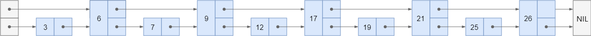

可以继续向上拓展层数：

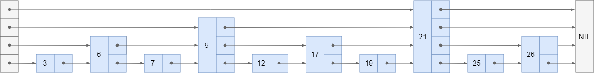

但是我们的链表不是静态的，增加和删除会破坏二分结构，所以我们就不强制要求 `1:2` 了，一个节点要不要被索引，建几层的索引，都在节点插入时由**随机决定**。这就形成了跳跃表~

现在假设节点 `17` 是最后插入的，在插入之前，我们需要搜索得到插入的位置：

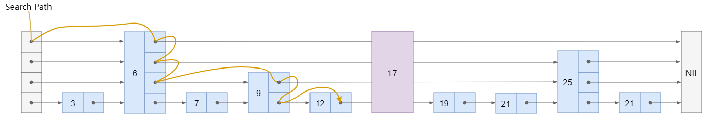


跳跃表（skiplist）是一种**有序**数据结构，它通过**在每个节点中维持多个指向其他节点的指针**，从而达到快速访问节点的目的。

跳跃表支持**平均 $O(logN)$、最坏 $O(N)$ 复杂度的节点查找。**

> Redis 只在两个地方用到了跳跃表，一个是实现**有序集合键**，另一个是**在集群节点中用作内部数据结构**。


## 4.2 跳跃表的实现

Redis 的跳跃表由 `redis.h/zskiplistNode` 和 `redis.h/zskiplist` 两个结构定义，其中 `zskiplistNode` 结构用于表示跳跃表**节点**，而 `zskiplist` 结构则用于保存跳跃表节点的相关信息， 比如**节点的数量， 以及指向表头节点和表尾节点的指针**，等等。

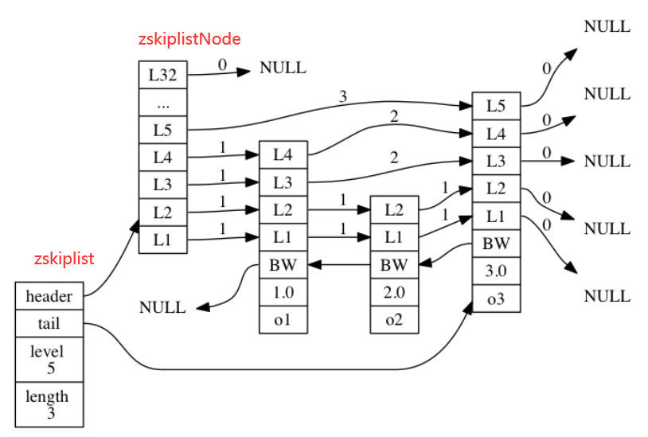

在 `zskiplist` 中 `level`  记录目前跳跃表内最大层数（表头不算），`length` 记录包含的节点数量（表头不算）。

`zskiplistNode` 结构包含以下属性：

- 层：每一层有两个属性
  - 前进指针用于访问位于表尾方向的其他节点
  - 跨度则记录了前进指针所指向节点和当前节点的距离。
- 后退指针(bw)：指向位于当前节点的前一个节点。后退指针在程序从表尾向表头遍历时使用。
- 分值(score)：各个节点中的 `1.0` 、 `2.0` 和 `3.0` 是节点所保存的分值。用于从小到大排列。**如果分值相同，则成员对象小的排在前面。**
- 成员对象（obj）：各个节点中的 `o1` 、 `o2` 和 `o3` 是节点所保存的成员对象。

```C
typedef struct zskiplistNode {
    // 后退指针
    struct zskiplistNode *backward;
    // 分值
    double score;
    // 成员对象
    robj *obj;
    // 层
    struct zskiplistLevel {
        // 前进指针
        struct zskiplistNode *forward;
        // 跨度
        unsigned int span;
    } level[];
} zskiplistNode;
```

**（1）层**

每次创建一个新跳跃表节点的时候， 程序都根据幂次定律 （[power law](http://en.wikipedia.org/wiki/Power_law)，**越大的数出现的概率越小**） **随机**生成一个介于 `1` 和 `32` 之间的值作为 `level` 数组的大小， 这个大小就是层的“高度”。

下图展示了三个高度为 `1` 层、 `3` 层和 `5` 层的节点：

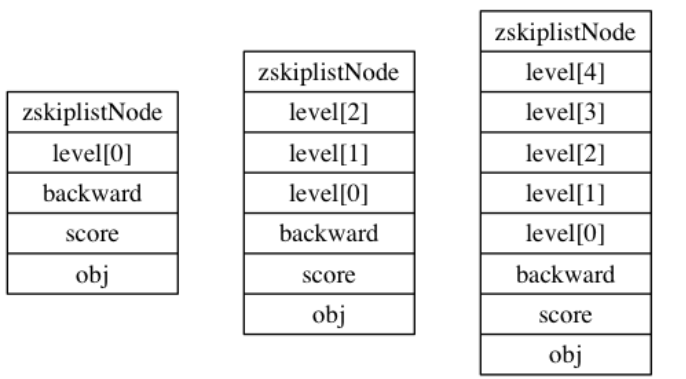

**（2）前进指针**

前进指针分属于不同的层，`level[i].forward`，用于从表头向表尾方向访问节点。

**（3）跨度**

跨度也分属不同的层，指向 `NULL` 的所有前进指针的跨度都为 `0`， 因为它们没有连向任何节点。

 跨度实际上是用来计算**位次**（rank）的： **将沿途访问过的所有层的跨度累计起来， 得到的结果就是目标节点在跳跃表中的排位。**

下图的例子中，查找分值为 3.0 的节点，由于只经过了一个层，跨度为 3，所以跳跃表中的排位为 3。

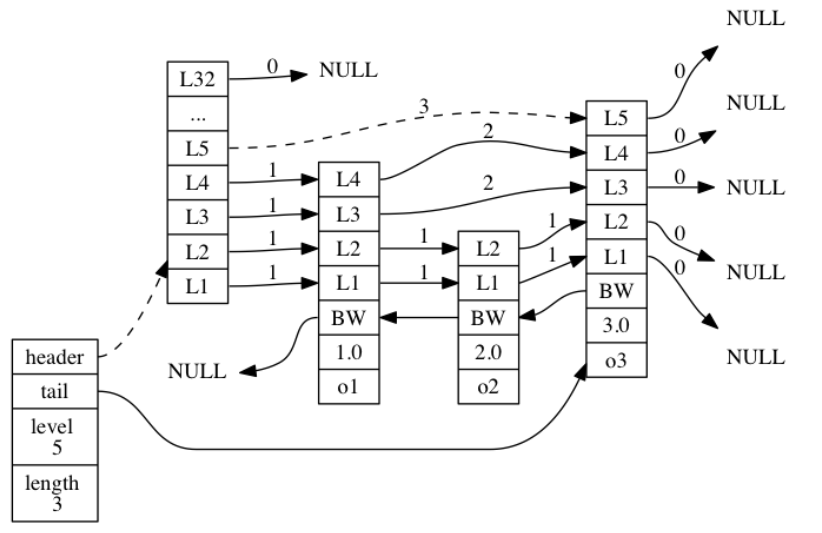

---

使用一个 `zskiplist` 结构来持有这些节点， 程序可以更方便地对整个跳跃表进行处理。

```C
typedef struct zskiplist {
    // 表头节点和表尾节点
    struct zskiplistNode *header, *tail;
    // 表中节点的数量
    unsigned long length;
    // 表中层数最大的节点的层数
    int level;
} zskiplist;
```


# 5. 整数集合

当一个集合中**只包含整数**，并且**元素的个数不是很多**的话，redis 会用**整数集合**作为底层存储，它可以节省很多内存。

## 5.1 整数集合的实现

整数集合（intset）是 Redis 用于保存整数值的集合抽象数据结构， 它可以保存类型为 `int16_t` 、 `int32_t` 或者 `int64_t` 的整数值， 并且保证**集合中不会出现重复元素**。

每个 `intset.h/intset` 结构表示一个整数集合：

```C
typedef struct intset {
    // 编码方式
    uint32_t encoding;
    // 集合包含的元素数量
    uint32_t length;
    // 保存元素的数组
    int8_t contents[];
} intset;
```

`contents` 数组是整数集合的底层实现： 整数集合的每个元素都是 `contents` 数组的一个数组项（item）， 从小到大有序地排列，不包含任何重复项。

虽然 `intset` 结构将 `contents` 属性声明为 `int8_t` 类型的数组， 但实际上 `contents` 数组并不保存任何 `int8_t` 类型的值 —— **`contents` 数组的真正类型取决于 `encoding` 属性的值**：

-  `encoding` 为 `INTSET_ENC_INT16`，`int16_t` 类型的数组，范围$[-2^{16},2^{16}-1]$
-  `encoding` 为 `INTSET_ENC_INT32` ， 是一个 `int32_t` 类型的数组。
-  `encoding` 为 `INTSET_ENC_INT64` ， 是一个 `int64_t` 类型的数组

下图展示了一个示例：

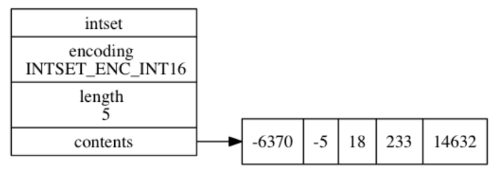


## 5.2 升级

每当我们要将一个新元素添加到整数集合里面， 并且**新元素的类型比整数集合元素的类型长时**， 整数集合需要先进行**升级（upgrade）**， 然后才能将新元素添加到整数集合里面。

过程如下：

1.  根据新类型，扩展整数集合底层数组的空间大小， 并为新元素分配空间
2. 将底层数组现有的所有元素都转换成与新元素相同的类型， 并将类型转换后的元素有序放置。
3. 将新元素添加到底层数组里面。

假设想要在 16 位编码的 intset 中插入 32 位的 65535 数据，原来的集合是这样的：

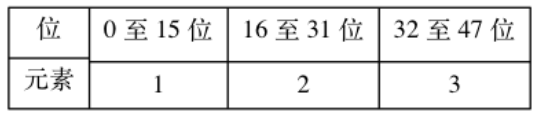

需要扩容为 $32\times4=128$ 位，新 intset 结构会扩容成这样：

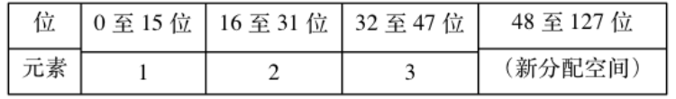

剩下就需要对元素重排。

先将 3 移动到新 intset 结构的索引 2 的位置上，然后将 2 移动到索引 1 的位置，然后将 1 移动到索引 0 的位置。最后再将 65535 移动到索引 3 的位置。


## 5.3 降级

整数集合不支持降级操作， 一旦对数组进行了升级， 编码就会一直保持升级后的状态。

即使我们将集合里唯一一个真正需要使用 `int64_t` 类型来保存的元素 `4294967295` 删除了， 整数集合的编码仍然会维持 `INTSET_ENC_INT64`。


# 6. 压缩列表

压缩列表（ziplist）**是列表键和哈希键的底层实现之一。**当一个列表键只包含少量列表项， 并且每个列表项要么就是**小整数值或长度比较短的字符串**， 那么 Redis 就会使用压缩列表来做列表键的底层实现。

## 6.1 压缩列表的构成

压缩列表是 Redis 为了节约内存而开发的， 由一系列特殊编码的**连续内存块组成的顺序型（sequential）数据结构。**

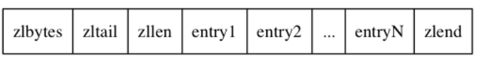

|  属性   |   类型   | 长度  |                  作用                  |
| :-----: | :------: | :---: | :------------------------------------: |
| zlbytes | uint32_t | 4字节 |       整个压缩列表占用内存字节数       |
| zltail  | uint32_t | 4字节 | 记录表尾节点距离表起始地址有多少个字节 |
|  zllen  | uint16_t | 2字节 |              记录节点数量              |
| entryX  |          | 不定  |                  节点                  |
|  zlend  | uint8_t  | 1字节 |              用于标记末端              |

下面展示了一个例子：

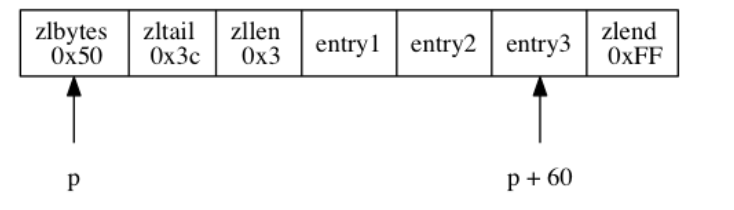

- `zlbytes` 属性的值为 `0x50` （十进制 `80`）， 表示压缩列表的总长为 `80` 字节。
- `zltail` 属性的值为 `0x3c` （十进制 `60`），如果一个指向压缩列表起始地址的指针 `p` ， 那么只要用指针 `p` 加上偏移量 `60` ， 就可以计算出表尾节点 `entry3` 的地址。
- `zllen` 属性的值为 `0x3` （十进制 `3`）， 表示压缩列表包含三个节点。


## 6.2 压缩列表的节点构成

每个压缩列表节点可以保存一个字节数组或者一个整数值， 其中， 字节数组可以是以下三种长度的其中一种：

1. 长度小于等于`63`($2^6-1$)字节的字节数组；
2. 长度小于等于 `16383` ($2^{14}-1$)字节的字节数组；
3. 长度小于等于 `4294967295` ($2^{32}-1$)字节的字节数组；

而整数值则可以是以下六种长度的其中一种：

1. `4` 位长，介于 `0` 至 `12` 之间的无符号整数；
2. `1` 字节长的有符号整数；
3. `3` 字节长的有符号整数；
4. `int16_t` 类型整数；
5. `int32_t` 类型整数；
6. `int64_t` 类型整数。

每个压缩列表节点都由 `previous_entry_length` 、 `encoding` 、 `content` 三个部分组成。

---

**（1）previous_entry_length**

以字节为单位， 记录了压缩列表中**前一个节点的长度。**这个属性的长度可以是 1 字节或 5 字节，如果前一个小于 254 则使用 1 字节，反之使用 5 字节（ 其中属性的**第一字节会被设置为 `0xFE`（十进制值 `254`）**， 而之后的四个字节则用于保存前一节点的长度）

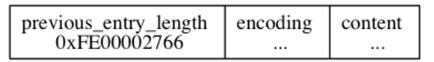

程序可以通过指针运算， 根据当前节点的起始地址来**计算出前一个节点的起始地址**，进而可以回溯到表头。

**（2）encoding**

节点的 `encoding` 属性记录了节点的 `content` 属性所保存数据的类型以及长度。编码由 8 位组成。

**如果是字符类型**，则开头两位 `00` , `01` , `10` 分别表示 1 字节，2 字节，5 字节，后 6 位表示字符串长度。

保存每个元素是 1 个字节的数组，长度 11。

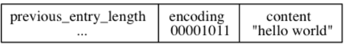

如果是整数类型，则开头必是 11，然后从第 6 位开始往低位开始计数：

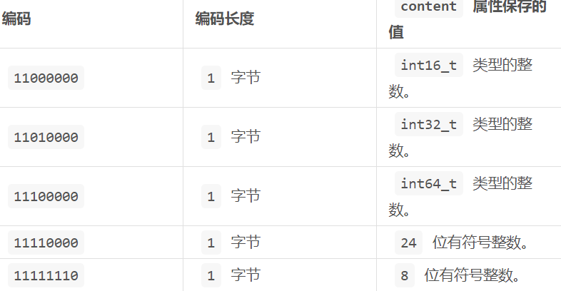

每个元素 `int16_t`，值为 10086

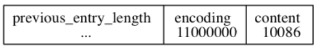


## 6.3 连锁更新

每个节点的 `previous_entry_length` 属性都记录了前一个节点的长度：

- 如果前一节点的长度小于 `254` 字节， 那么 `previous_entry_length` 属性需要用 `1` 字节长的空间来保存这个长度值。
- 如果前一节点的长度大于等于 `254` 字节， 那么 `previous_entry_length` 属性需要用 `5` 字节长的空间来保存这个长度值。

假设现在有一些长度为 252 字节的节点，它们在 `previous_entry_length` 中保存为 1 字节。现在插入了一个 260 字节的新节点，`new` 将成为 `e1` 的前置节点。

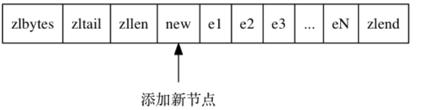

因为 `e1` 的 `previous_entry_length` 属性仅长 `1` 字节， 它没办法保存新节点 `new` 的长度， 所以程序将对压缩列表执行空间重分配操作， **并将 `e1` 节点的 `previous_entry_length` 属性从原来的 `1` 字节长扩展为 `5` 字节长。**

由于 `previous_entry_length` 的变化，导致 `e1` 的长度也发生了变化 $252+4=256>254$，所以导致 `e2` 也必须更新它的 `previous_entry_length` 。这就是连锁更新。

除了添加节点外，删除节点也会导致连锁更新，若删除一个 260 字节的节点，则后一个节点长度也会变化。如果很不凑巧，小于 254 ，则又会引起后序效应。

连锁更新在最坏情况下需要对压缩列表执行 `N` 次空间重分配操作， 而每次空间重分配的最坏复杂度为 $O(N)$ ， 所以连锁更新的最坏复杂度为 $O(N^2)$ 。

